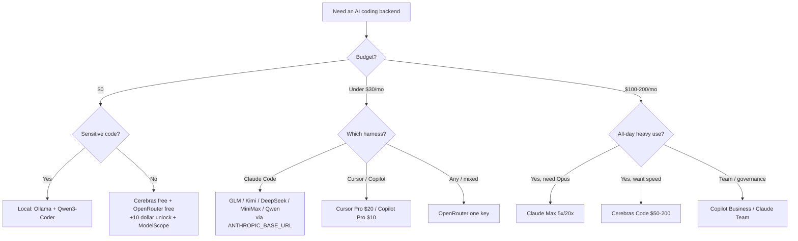

<div align="center">

# 🤖 Awesome AI Coding Subscriptions & APIs

[](https://awesome.re)
[](LICENSE)
[](CONTRIBUTING.md)

[](https://github.com/lildebil0/awesome-ai-coding-subscriptions/stargazers)

**Which subscription, coding plan, API, router, or free tier should you put behind your AI coding agent?**
A curated, benchmarked, source-linked answer — ranked by 💵 price · 🧠 power · 🔢 models · 📊 limits · 🔌 integration.

**English** · [简体中文](i18n/README.zh-CN.md) · [Español](i18n/README.es.md) · [Русский](i18n/README.ru.md) · [日本語](i18n/README.ja.md) · [Português](i18n/README.pt-BR.md) · [Français](i18n/README.fr.md) · [Deutsch](i18n/README.de.md) · [한국어](i18n/README.ko.md) · [हिन्दी](i18n/README.hi.md)

</div>

---

This list catalogs the **plans you pay for** — subscriptions, flat-rate coding plans, pay-as-you-go APIs, routers, and free tiers — **not** the coding tools themselves. The harness (Claude Code, Cline, Aider, Roo/Kilo, OpenCode) is free. What costs money is the model behind it, so that is what gets ranked here. The harness is only the *integration target*.

A $3–30/mo flat-rate plan from a Chinese open-weight lab (GLM, Kimi, DeepSeek, MiniMax, Qwen, Doubao) pointed at a free CLI harness gets you around 78–80% on SWE-bench for roughly a tenth of what a $200 frontier subscription costs. The frontier subs still win the hardest tasks. So most people in 2026 run both: a frontier sub for the hard reasoning, a cheap plan for everything else.

> ⚠️ **Pricing in this space changes monthly.** Numbers reflect **~June 2026**. Always confirm on the official page before buying. Found a stale price? [Open a PR](CONTRIBUTING.md) — fixes are as valued as additions.

## Legend

| Badge | Meaning |
|-------|---------|
| 💎 | **Hidden gem** — lesser-known, costs less than it should for what you get |
| 🆓 | Has a **free tier** you can actually run an agent on |
| ✅ | **Pricing fact-checked** against the official source (June 2026) |
| ⭐ | Value rating (1–5): price vs power vs limits vs integration |
| 🇨🇳 | China-hosted (data-residency / latency caveat for some) |
| ⚠️ | Carries notable risk (ToS, reliability, longevity, reseller) |

**Integration shorthand:** `CC-native` = native Anthropic-compatible endpoint, a drop-in Claude Code backend via `ANTHROPIC_BASE_URL`. `OpenAI-compat` = works in Cline/Roo/Kilo/Aider/Continue/OpenCode by base-URL swap (Claude Code needs a shim/router). `native-only` = locked to the vendor's own editor/agent, not reusable as a backend.

## Contents

- [How to choose](#how-to-choose)
- [Pick by budget](#pick-by-budget)
- [Pick by who you are](#pick-by-who-you-are)
- [TL;DR — top picks by use-case](#tldr--top-picks-by-use-case)
- [Master comparison table](#master-comparison-table)
- [First-party frontier subscriptions](#first-party-frontier-subscriptions)
- [Bundled tool subscriptions (editor + model)](#bundled-tool-subscriptions-editor--model)
- [Flat-rate coding plans — the value champions 💎](#flat-rate-coding-plans--the-value-champions-)
- [Pay-as-you-go value APIs](#pay-as-you-go-value-apis)
- [Speed / fast-inference providers](#speed--fast-inference-providers)
- [Routers & gateways](#routers--gateways)
- [More providers worth knowing (2026)](#more-providers-worth-knowing-2026)
- [Free tiers 🆓](#free-tiers-)
- [Free credits & student / startup programs](#free-credits--student--startup-programs)
- [Niche & specialty](#niche--specialty)
- [App builders & autonomous agents](#app-builders--autonomous-agents)
- [Hidden gems & reseller proxies ⚠️](#hidden-gems--reseller-proxies-)
- [Setup recipes — wire a cheap plan into your harness](#setup-recipes--wire-a-cheap-plan-into-your-harness)
- [Privacy & data-residency matrix](#privacy--data-residency-matrix)
- [Benchmark-per-dollar](#benchmark-per-dollar)
- [Money traps & common mistakes](#money-traps--common-mistakes)
- [2026 pricing timeline](#2026-pricing-timeline)
- [What the community actually says](#what-the-community-actually-says)
- [Self-host & hybrid (when a subscription isn't the answer)](#self-host--hybrid-when-a-subscription-isnt-the-answer)
- [FAQ](#faq)
- [Glossary](#glossary)
- [How this list is scored & maintained](#how-this-list-is-scored--maintained)
- [Caveats & disclaimer](#caveats--disclaimer)
- [Contributing](#contributing)
- [License](#license)
- [⭐ Star history](#-star-history)

---

## How to choose

Score every plan on five axes:

1. **💵 Price** — sticker, and the *real* effective cost (credit ratios, peak multipliers, overage).
2. **🧠 Power** — model quality; the value tier clusters at ~78–80% SWE-bench Verified, frontier at 85–89%.
3. **🔢 Model count** — one plan that multiplexes many models (Qwen Coding Plan, OpenRouter) hedges churn.
4. **📊 Limits** — requests/tokens per 5h-window, weekly caps, concurrency. The hidden cost: one IDE "prompt" fans out to **5–30 model calls**, so advertised "prompts/5h" are softer than they look.
5. **🔌 Integration** — does it expose a **native Anthropic endpoint** (clean Claude Code drop-in) or only OpenAI-compat (needs a router)? Or is it native-only (no reuse)?

**Decision shortcut:**

- Want the **best agent, simplest path** → Claude Pro $20 → Max 5x $100.
- Want **most coding per dollar** → a flat-rate plan (GLM / MiniMax / Qwen / Kimi) on Claude Code.
- Want **$0** → Cerebras free + OpenRouter free (+$10 unlock) + NVIDIA NIM, escalate hard tasks to a paid model.
- Want **one key for everything** → OpenRouter.
- Want **privacy (no China-host)** → Synthetic.new (US, no-train, 14-day deletion) or first-party US subs.



---

## Pick by budget

Skip the analysis paralysis. Find your monthly number, grab the stack.

| Budget | Best pick | What you get | Smartest stack |
|---|---|---|---|
| **$0** 🆓 | **GitHub Copilot Free** + **Gemini CLI** | 2,000 completions + 50 premium reqs/mo from Copilot; a generous agentic CLI from Google | Copilot Free in the IDE for autocomplete, Gemini CLI in the terminal for agent runs, [Cursor Hobby](https://cursor.com/pricing) as a third bucket of free Tab completions |
| **< $10/mo** | **GLM Coding Plan Lite** 💎 ($30/qtr ≈ $10/mo) | ~3× Claude Pro usage; a [native Anthropic-compatible endpoint](https://docs.z.ai/guides/overview/pricing) — drop into Claude Code, Cline, or OpenCode | GLM Lite as your Claude Code driver + stack the free tier on top for overflow |
| **~$10/mo** | **GitHub Copilot Pro** ($10) | Unlimited completions, $10 of AI Credits, agent mode, model picker — moved to [usage-based credits June 2026](https://github.blog/news-insights/company-news/github-copilot-is-moving-to-usage-based-billing/) | Copilot Pro in-IDE + GLM Lite in-terminal — two frontier-ish drivers for ~$20 total |
| **~$20/mo** | **Claude Pro** ($20) *or* **Cursor Pro** ($20) | Pro: Claude Code in terminal/web/desktop, [Sonnet 4.6 + Opus 4.6](https://claude.com/pricing). Cursor: unlimited Tab + $20 agent usage + Background Agents | Claude Pro (best raw agent) + Copilot Free for inline autocomplete; or Cursor Pro alone if you live in one editor |
| **~$50/mo** | **Copilot Pro+** ($39) *or* **GLM Pro** ($90/qtr ≈ $30) **+ Claude Pro** ($20) | Pro+: $39 in AI Credits + top models. The combo: ~15× Claude Pro usage from GLM *plus* native Anthropic quality for the hard stuff | GLM Pro for high-volume grind, Claude Pro reserved for tricky reasoning — best $/throughput on the board |
| **~$100/mo** | **Claude Max 5x** ($100) | 5× Pro usage, priority access to newest models — the sweet spot for devs who hit Pro limits daily ([Max plan](https://support.claude.com/en/articles/11049741-what-is-the-max-plan)) | Max 5x as the workhorse + GLM Lite ($10) as a cheap overflow lane when you burn the 5x cap |
| **~$200/mo** | **Claude Max 20x** ($200) *or* **Cursor Ultra** ($200) | Max 20x: 20× Pro, top individual tier. [Cursor Ultra](https://cursor.com/pricing): 20× usage + priority features in a full IDE | Max 20x for terminal-first power users; add Copilot Pro ($10) only if you want a second vendor's models for variety/redundancy |

**Rules of thumb**
- **Under $20 and price-sensitive?** GLM Lite is the single best dollar in coding right now — it speaks Anthropic's API, so your Claude Code muscle memory transfers.
- **One tool, all day?** Pay for the native subscription (Claude Pro, Cursor Pro). Don't fragment.
- **Heavy daily user?** Jump straight to Max 5x — it's cheaper than stacking two $50 plans and far less fiddly.
- **The pro move at every tier:** one premium driver for hard problems + one cheap/free lane for bulk edits and autocomplete. You rarely need two $20+ subscriptions.

> Prices verified June 2026. Quarterly-billed plans (GLM) shown as effective monthly. Copilot and GitHub plans moved to [usage-based AI Credits on June 1, 2026](https://github.blog/news-insights/company-news/github-copilot-is-moving-to-usage-based-billing/) — your allotment scales with the base price.


---

## Pick by who you are

Skip the matrix-staring. Find your row, copy the pick, move on. Prices are USD/mo, individual tiers unless noted (June 2026).

| You are… | Best pick | Why it fits you | ~Price |
|---|---|---|---|
| **Solo indie hacker** 💎 | **Claude Pro** + a Z.ai/DeepSeek API key as overflow | One $20 sub covers Claude Code in-terminal; when you hit the 5-hour cap mid-sprint, fall back to a cheap value-API instead of jumping to a $100 tier you'll under-use. Best $/output for one person shipping daily. | $20 + pennies |
| **Startup eng team (2–20)** | **GitHub Copilot Business** | $19/seat gets org policy, public-code filter, **IP indemnity**, and central billing — the cheapest plan that's safe to put in front of investors/customers. Pairs with each dev's own Claude/Cursor sub for heavy lifting. [pricing](https://github.com/features/copilot/plans) | $19/seat |
| **Enterprise** (governance / SSO / IP) | **Copilot Enterprise** or **Claude Enterprise** | Copilot Enterprise ($39/seat) adds SSO/SCIM, audit logs, codebase-indexed knowledge bases, and the same Microsoft IP-indemnity-with-filter. Claude Enterprise (sales-quoted) is the alt if you're Anthropic-first. Both clear procurement. [Copilot Enterprise](https://docs.github.com/en/copilot/get-started/plans) | $39/seat → custom |
| **CS student** 🆓 | **GitHub Copilot (Student)** + ChatGPT Free | Verified students get **Copilot at Pro level for free** (unlimited completions, premium models, monthly premium-request allowance). Zero spend, real tooling. [Copilot plans](https://github.com/features/copilot/plans) | $0 |
| **OSS maintainer** 🆓 | **Copilot Pro free for OSS** + Claude Pro for deep work | Maintainers of popular repos qualify for free Copilot Pro; keep a $20 Claude Pro for the gnarly refactors. Best public-good-to-cost ratio. | $0–$20 |
| **Privacy-first / regulated** 🔒 | **Local stack: Ollama + Qwen3-Coder + Continue.dev** | Proprietary code never leaves the box — no API, no retention clause, no DPA to negotiate. Roughly 70–85% of cloud-Claude quality on single-file work. If you must use cloud, add a **zero-retention** API tier. [setup](https://medium.com/@rodrigo.estrada/build-a-local-ai-coding-assistant-qwen3-ollama-continue-dev-cee0dbcd172a) | $0 (hardware) |
| **Offline / air-gapped** | **Ollama + Qwen3-Coder-Next** (Continue.dev or OpenCode) | Same local stack, but this is the *only* category that works with the network cable pulled. Qwen3-Coder-Next runs ~3B active params from an 80B MoE — fits real hardware, no internet ever. [models](https://localaimaster.com/models/best-local-ai-coding-models) | $0 |
| **Vibe-coder / hobbyist** 🆓 | **Free tier sampler**: ChatGPT Free or Copilot Free + Gemini free | Building for fun on weekends — don't pay anything. Copilot Free's 2,000 completions/mo plus a chat model covers casual side projects. Upgrade only when free limits actually bite. | $0 |
| **Power-user running parallel agents** 💎 | **Claude Max 20x** (or stack a value-API for fan-out) | If you orchestrate swarms / parallel Claude Code sessions, the 20x usage ceiling is what stops you hitting limits at 2pm. Cheaper than burning equivalent API tokens at this volume. Add a DeepSeek/Z.ai key for the throwaway worker agents. | $200 |

**Two cross-cutting rules of thumb:**
- The jump from **$20 → $100/$200** only pays off if you *personally* hit usage caps more than ~twice a week. Most people don't — track it before upgrading.
- **IP indemnity is a plan feature, not a model feature.** It starts at Copilot **Business** and requires the public-code filter on — free and Pro tiers don't carry it. If a lawyer will ever read your repo, this is the line that matters. [details](https://github.com/features/copilot/plans)

Sources:
- [GitHub Copilot Plans & pricing](https://github.com/features/copilot/plans)
- [Plans for GitHub Copilot — GitHub Docs](https://docs.github.com/en/copilot/get-started/plans)
- [AI Pricing Compared 2026 — AIViewer](https://aiviewer.ai/guides/ai-pricing-comparison-2026/)
- [Build a Local AI Coding Assistant — Qwen3 + Ollama + Continue.dev](https://medium.com/@rodrigo.estrada/build-a-local-ai-coding-assistant-qwen3-ollama-continue-dev-cee0dbcd172a)
- [Best Local AI Coding Models for Ollama (2026)](https://localaimaster.com/models/best-local-ai-coding-models)


---

## TL;DR — top picks by use-case

| Use-case | Pick | Why | ~Price |
|----------|------|-----|--------|
| 🏆 **Best overall value** | **GLM Coding Plan** 💎🇨🇳 | "3× Claude Max usage for ~$30/mo"; GLM-5.1 ~94% of Opus coding; native Claude Code | $10–30/mo |
| 🥇 **Best raw frontier** | **Claude Max 5x** | Unlocks Opus in Claude Code, the consensus #1 agent | $100/mo |
| 🪙 **Cheapest serious entry** | **GLM Lite** / **Qwen Standard** / **Trae Lite** 💎 | Real coding backend from ~$3–10/mo | $3–10/mo |
| 💸 **Cheapest per token** | **DeepSeek V4-Flash** 💎 | $0.14/M in, $0.0028/M cache-hit, 1M ctx, CC-native | pay-go |
| 🧪 **Best free** | **Cerebras free** 🆓 + **OpenRouter :free** 🆓 | 1M tok/day (fast) + Qwen3-Coder-480B free | $0 |
| ⚡ **Best fast+cheap** | **Groq** 💎🆓 / **Cerebras Code** | Native Anthropic endpoint (Groq); ~2000 tok/s flat-rate (Cerebras) | free / $50/mo |
| 🔀 **Best universal router** | **OpenRouter** | 315+ models, one key, Anthropic skin, no token markup | pay-go +5.5% |
| 🔒 **Best privacy (US-host)** | **Synthetic.new** 💎 | US infra, no-train, 14-day deletion, dual OpenAI+Anthropic compat | $20–60/mo |
| 🧰 **Best for big codebases** | **Augment Code** ✅ | Best-in-class Context Engine for monorepos | $20+/mo |
| 🏢 **Best team value** | **Claude Team Premium seat** 💎 | ≈ Max-5x usage + SSO/admin | $100/seat |


---

## Master comparison table

Sorted roughly by value. Prices ~June 2026; **verify before buying**.

| Plan | Type | Price | Models | Limits (coding) | Integration | ⭐ | Notes |
|------|------|-------|--------|-----------------|-------------|----|-------|
| [GLM Coding Plan](#glm-coding-plan-zai) | flat-rate | $10–30/mo (Lite/Pro, qtrly) | GLM-5.1/5/4.7 | Lite ~80, Pro ~400 prompts/5h | CC-native | ⭐5 | 💎🇨🇳✅ |
| [DeepSeek API](#deepseek) | pay-go API | V4-Pro $0.435/$0.87; Flash $0.14/$0.28 | V4-Pro/Flash | 1M ctx, 500–2500 concur | CC-native | ⭐5 | 💎🇨🇳✅ |
| [MiniMax Coding Plan](#minimax) | flat-rate | $10–50/mo | M2.7 (plan), M2.5/M3 (API) | Starter ~100, Max ~1000 prompts/5h | CC-native | ⭐5 | 💎🇨🇳 |
| [Kimi Code](#kimi-moonshot) | flat-rate+API | ~$19/mo + metered | K2.6 (1T) | ~300–1200 calls/5h, 30 concur | CC-native | ⭐5 | 💎🇨🇳 |
| [Qwen Cloud Coding Plan](#qwen-alibaba) | flat-rate | Pro $50/mo (Lite $10, closed) | Qwen3.5 + Kimi/GLM/MiniMax | Pro 6000 req/5h, 1M ctx | CC-native | ⭐4 | 💎🇨🇳✅ |
| [OpenRouter](#openrouter) | router | pay-go, +5.5% top-up | 315+ (all of them) | balance-bound; free models 50–1000/day | CC-native skin | ⭐5 | 🆓 |
| [Claude Pro](#anthropic-claude) | first-party | $20/mo | Sonnet 4.6 (no Opus) | ~40–45 msg/5h + weekly | CC-native | ⭐5 | best entry |
| [Claude Max 5x](#anthropic-claude) | first-party | $100/mo | + Opus 4.6/4.7 | ~50–225 prompts/5h | CC-native | ⭐5 | Opus unlocked |
| [Cerebras Code](#cerebras) | flat-rate speed | $50/$200 | GLM-4.7 (~2000 tok/s) | 24M–120M tok/day, 131k ctx | OpenAI-compat | ⭐5 | ✅ often sold out |
| [Synthetic.new](#synthetic) | flat-rate (US) | $20–60/mo | 16 open-weight (GLM/Kimi/Qwen/DS) | ~125–1250 req/5h | CC-native | ⭐5 | 💎🔒 |
| [Chutes](#chutes) | flat-rate ⚠️ | $3/$10/$20 | GLM-5/Kimi/DS/MiniMax/Qwen | 300/2000/5000 req/day | OpenAI-compat | ⭐5 | 💎⚠️ decentralized ✅ |
| [Grok Code Fast 1](#xai-grok) | pay-go API | $0.20/$1.50/M | grok-code-fast-1 | 256K ctx, ~92 tok/s | CC-native | ⭐5 | 💎 #1 on OpenRouter |
| [ChatGPT Plus](#openai-chatgpt--codex) | first-party | $20/mo | GPT-5.x-Codex | token-credit metered | Codex-native | ⭐4 | Codex #2 agent |
| [ChatGPT Pro](#openai-chatgpt--codex) | first-party | $100/$200 (5x/20x) | GPT-5.5-Codex | high; dedicated GPU | Codex-native | ⭐4 | |
| [Claude Max 20x](#anthropic-claude) | first-party | $200/mo | Opus 4.6/4.7 | ~200–900 prompts/5h | CC-native | ⭐4 | power tier |
| [Cursor Pro / Ultra](#cursor) | bundled | $20 / $200 | all frontier + Auto | $20 / $400 usage pool | Native-only | ⭐4 | Ultra = 2× credit ratio |
| [GitHub Copilot Pro](#github-copilot) | bundled | $10/mo | GPT-5/Claude/Gemini | $10 AI-credits (usage) | Native-only (+ACP) | ⭐4 | free completions 🆓 |
| [DeepInfra](#deepinfra) | speed/API | pay-go (cheapest OSS) | Kimi/DS/Qwen3-Coder/GLM | balance-bound | CC-native | ⭐5 | 💎✅ cheapest host |
| [Groq](#groq) | speed/API | pay-go + free | GPT-OSS/Qwen3/Kimi | free RPM/TPM caps | CC-native | ⭐4 | 💎🆓 |
| [Vercel AI Gateway](#vercel-ai-gateway) | router | $0 markup (even BYOK) | 100s incl. Claude | $5/mo free credits | CC-native | ⭐4 | 💎🆓✅ |
| [Requesty](#requesty) | router | +5% flat | Claude/GPT/Gemini/DS/Qwen | semantic cache ~40% off | OpenAI-compat | ⭐4 | 💎 team governance |
| [Mistral Le Chat Pro](#mistral) | first-party | $14.99/mo ($5.99 student) | Devstral 2 + Vibe CLI | ~25 free msg/day | Native-only | ⭐4 | 💎🆓🇪🇺 cheapest major sub |
| [Augment Code](#bundled-tool-subscriptions-editor--model) | bundled | $20–200/mo | Claude/Gemini/GPT | 40k–450k credits/mo | Native-only | ⭐4 | ✅ best big-repo context |
| [Zed Pro](#bundled-tool-subscriptions-editor--model) | bundled | $10/mo | any (BYO key/ACP) | $5 credits + usage | ACP + BYOK | ⭐4 | 💎 anti-lock-in |
| [Cerebras free](#free-tiers-) | free | $0 | Qwen3-Coder-480B, GPT-OSS-120B | 1M tok/day, 8K ctx cap | OpenAI-compat | ⭐5 | 💎🆓 fastest free |
| [Google AI Studio](#free-tiers-) | free | $0 | Gemini 2.5 Flash, Gemma 3 27B | Flash 250 RPD; Gemma 14.4k RPD | OpenAI-compat | ⭐4 | 🆓 biggest free ctx |


---

## First-party frontier subscriptions

The direct-from-vendor plans. A subscription authenticates the **vendor's own harness** (Claude Code, Codex CLI, Antigravity, Grok Build) via login — it does **not** give you a generic API key for third-party OpenAI-compat tools (that's separate per-token billing). Exception: xAI Grok models are OpenAI/Anthropic-compatible.

> Value pecking order for agentic coding (June 2026 consensus): **Claude > OpenAI Codex > Google Gemini > xAI Grok**. An independent 30-day test put Claude ~95% vs ChatGPT ~85% coding accuracy; vendor SWE-bench has GPT-5.5 (88.7%) ≈ Opus 4.7 (87.6%).

### Anthropic (Claude)
- **[Claude Pro](https://claude.com/pricing)** — `$20/mo` ($17 annual). Sonnet 4.6 in Claude Code (**no Opus**). ~40–45 msg/5h + weekly cap, shared with chat/Cowork. **Best value entry point to the #1 coding agent.** April 2026 doubled the 5h limits & removed peak throttling. ⭐5
- **[Claude Max 5x](https://support.claude.com/en/articles/11049741-what-is-the-max-plan)** — `$100/mo`. **Unlocks Opus 4.6/4.7** + 5× throughput (~50–225 prompts/5h). The pro sweet-spot; a $100 middle tier OpenAI/Google don't match as usefully. ⭐5
- **[Claude Max 20x](https://support.claude.com/en/articles/11049741-what-is-the-max-plan)** — `$200/mo`. ~200–900 prompts/5h. For all-day parallel agents; the **flat-rate-beats-API** math is decisive (90%+ of Claude Code tokens are cache-reads, free on subscription, billed on API — one dev's peak month = $5,623 at API ≈ 4.5 years of Max 5x). ⭐4
- **[Claude Team Premium seat](https://claude.com/pricing)** 💎 — `$100/seat` (annual). ≈ Max-5x usage **plus** SSO/admin/audit/enterprise-search. Quietly the best *team* coding value; Standard $20 seat also includes Claude Code. ⭐4

### OpenAI (ChatGPT / Codex)
- **[ChatGPT Plus](https://help.openai.com/en/articles/11369540-using-codex-with-your-chatgpt-plan)** — `$20/mo`. Codex CLI/IDE bundled (GPT-5.5/5.4/5.3-Codex). **Token-credit metered** since April 2026 (confusing). Codex = consensus #2 agent. Plus caps run out fast on heavy agentic work. ⭐4
- **[ChatGPT Pro](https://developers.openai.com/codex/pricing)** — `$100` (5x) / `$200` (20x). High throughput + dedicated GPU. Note the $100-tier "10x boost" promo **expired May 31 2026** (now 5x). The classic "$200 plan worth it?" debate = Claude Max 20x vs ChatGPT Pro 20x. ⭐4

### Google (Gemini)
- **[Gemini AI Pro / Ultra](https://gemini.google/subscriptions/)** — Ultra's bundled GCP credits ($40 at $100 / $100 at $200) materially offset cost if you use Google Cloud 💎. ⚠️ **Google is killing the open-source Gemini CLI June 18 2026**, forcing migration to the closed Antigravity CLI with far lower free quotas (~1000 → ~20 req/day) — the biggest community grievance of 2026.

### xAI (Grok)
- **[SuperGrok](https://x.ai/news/grok-code-fast-1)** — `$10` (Lite) / `$30` / `$300` (Heavy). Grok Build CLI runs **8 parallel sub-agents in isolated git worktrees** (novel). `grok-code-fast-1` has a cult following (cheap+fast) and was free in many partner IDEs. SWE-bench ~70.8% trails leaders. **For coding, buy the [xAI API](#xai-grok), not the SuperGrok app sub.** ⭐3 💎


---

## Bundled tool subscriptions (editor + model)

Here the plan *is* the product — you buy into the vendor's editor/agent. The 2026 trend: nearly all moved from fixed request counts to **credits / token-metering**, making costs *less* predictable (loud backlash).

### Cursor
- **[Cursor](https://cursor.com/pricing)** — Hobby free · **Pro `$20`** · **Pro+ `$60`** 💎 · **Ultra `$200`**. Since June 2025, your plan price = a usage pool at API rates. **Credit ratio improves up-tier**: Pro $20/$20 (1×), Pro+ $60/$70 (1.17×), Ultra $200/$400 (**2×, best**). `Auto` mode is the value key — effectively unlimited, doesn't drain the pool like pinning Claude/MAX does. ⚠️ The June-2025 switch caused a [pricing disaster](https://www.wearefounders.uk/cursors-pricing-disaster-the-full-timeline-of-how-an-ai-coding-darling-burned-its-most-loyal-users/) (HN user: "$350 overage in a week"); CEO apologized + refunded. **Native-only** — can't back Claude Code, and as of Jan 2026 you can't route a Claude sub *into* Cursor either. Best-in-class Tab/Apply. ⭐4

### GitHub Copilot
- **[GitHub Copilot](https://github.com/features/copilot/plans)** — Free 🆓 · **Pro `$10`** · Pro+ `$39` · Max `$100` · Business `$19` · Enterprise `$39`. ⚠️ **Moved to usage-based AI Credits June 1 2026** (1 credit = $0.01); each plan includes a credit pool (Pro=$15, Pro+=$70). **Code completions stay unlimited & free** — completion-only users unaffected. Backlash severe (TechTimes: agentic bills jumped 10×–50×). Best-in-class IDE completions + governance/IP-indemnity for orgs. **Native-only** (escape hatch: Copilot CLI speaks ACP). ⭐4

### Others
- **[Augment Code](https://www.augmentcode.com/pricing)** ✅ — Indie `$20`/40k credits · Standard `$60` · Max `$200`. **Best-in-class Context Engine** for large monorepos (tops context-recall comparisons). VS Code + JetBrains + Auggie CLI. Native-only. Credit burn on tool-heavy tasks is the gripe. ⭐4 💎
- **[Zed Pro](https://zed.dev/pricing)** 💎 — Free · **Pro `$10`** (only +10% markup) · Business `$30`. The **anti-lock-in** pick: open [ACP](https://zed.dev/docs/ai/) drives external agents (Claude Code, Codex, OpenCode) and BYO keys for any provider. Fastest native editor. ⭐4
- **[Kiro](https://kiro.dev/pricing/)** 💎 — Free · **Pro `$20`/1k credits** · Pro+ `$40` · Power `$200`. Best **spec-driven** agent (requirements→design→tasks), full Claude lineup incl. Opus 4.7, fractional 0.01-credit billing. **AWS Startups = 1 free year of Pro+.** ⭐4
- **[Trae](https://www.trae.ai/pricing)** 💎🇨🇳 — Free · **Lite `$3`** · Pro `$10` · Ultra `$100`. ByteDance VS Code fork; usage pool exceeds sticker (e.g. $20 usage for $10) = "the $3 Cursor alternative." ⚠️ ByteDance telemetry shared with affiliates — enterprise dealbreaker. ⭐4
- **[Sourcegraph Amp](https://sourcegraph.com/amp)** — Free to start ($10 credit; $40 for ex-Cody). Pure **consumption** (no monthly floor), runs Opus 4.8 in "smart" mode. Great for light use, uncapped-burn risk for heavy. Cody Free/Pro were retired into Amp. ⭐3
- **[JetBrains AI / Junie](https://www.jetbrains.com/ai-ides/buy/)** — beloved IDE integration, but Junie **burns credits fast** (Ultimate's 35 credits gone in ~4–5 days). Only if you live in JetBrains.
- **Overpriced / avoid:** **Tabnine** ($39 floor, no free tier, annual lock-in — only for on-prem/air-gap needs); **Windsurf Pro** (March 2026 swap to daily/weekly quotas is the year's most-complained-about change, post-Cognition trust low). **Supermaven** is dead as a standalone (folded into Cursor Tab Nov 2025).


---

## Flat-rate coding plans — the value champions 💎

Fixed monthly or quarterly plans that put a frontier-ish open-weight model behind your harness, mostly from Chinese labs. Most expose a native Anthropic endpoint, so they drop into Claude Code via `ANTHROPIC_BASE_URL`. For the endpoint list, see [Alorse/cc-compatible-models](https://github.com/Alorse/cc-compatible-models).

> Consensus pecking order: **GLM** (cheapest entry, community default) · **MiniMax** (best price/volume) · **Kimi** (best long-horizon agent) · **Qwen** (>262K context, multi-model). Claude Pro $20 is the quality benchmark they undercut.

<a name="glm-coding-plan-zai"></a>
### GLM Coding Plan — Z.ai (Zhipu AI) 💎🇨🇳 ✅
- `Lite ~$10/mo ($30/qtr)` · `Pro ~$30/mo ($90/qtr)` · `Max ~$80/mo ($240/qtr)`. Q2-2026 promo: $27/$81/$216/qtr. (The viral **$3/mo** promo ended Feb 11 2026; annual Lite ~$7/mo is the remaining cheap route.)
- Models: **GLM-5.1** (~94% of Opus 4.6 coding), GLM-5/5-Turbo, GLM-4.7, GLM-4.5-Air.
- Limits: Lite ~80, Pro ~400, Max ~1,600 prompts/5h + weekly. ⚠️ **Peak-hour 3× multiplier** (14:00–18:00 UTC+8) on GLM-5/5.1 quietly halves throughput.
- Integration: `ANTHROPIC_BASE_URL=https://api.z.ai/api/anthropic` — official Claude Code support + Cline/Roo/Kilo/OpenCode (20+ tools). **First-party** = no reseller ban risk.
- > *The single most-recommended budget coding plan of 2026.* "3× Claude Max usage for ~$30/mo." Backlash over the Feb price hike + ⅓ quota cut, still rated top value. ⭐5
- Sources: [z.ai/subscribe](https://z.ai/subscribe) · [pricing](https://docs.z.ai/guides/overview/pricing) · [GLM-5.1 review](https://serenitiesai.com/articles/glm-5-1-coding-plan-review-2026)

<a name="minimax"></a>
### MiniMax Coding / Token Plan 💎🇨🇳
- `Starter $10/mo` · `Plus $20` · `Max $50` (2 months free annual); High-Speed variants $40–150.
- Models: M2.7 / M2.7-Highspeed on the plan; **M2.5/M3** (1M ctx) via API. ⚠️ **Plan often serves an older model** (M2.1) than the benchmarked M2.5/M2.7.
- Limits: Starter ~100 → Max ~1,000 prompts/5h; ~50 TPS (100 high-speed).
- Integration: `ANTHROPIC_BASE_URL=https://api.minimax.io/anthropic` + OpenAI-compat.
- > "Cut my Claude Code bill in half." **Best raw price/volume** in the flat-rate bucket; M2.7 ~94% of GLM-5.1 at ~1/5 the input cost. ⭐5
- Sources: [coding plan](https://platform.minimax.io/subscribe/coding-plan) · [M2.5 pricing](https://www.verdent.ai/guides/minimax-m2-5-pricing)

<a name="kimi-moonshot"></a>
### Kimi Code — Moonshot AI 💎🇨🇳
- `~$19/mo membership` + metered API (K2.6 $0.60–0.95/M in, $2.50–4.00/M out, 75% cache discount). Tiered Moderato/Allegretto/Vivace.
- Models: **Kimi K2.6** (1T MoE, ~80.2% SWE-bench), K2.5.
- Limits: ~300–1,200 calls/5h, **30 concurrent** (generous for parallel agents).
- Integration: `ANTHROPIC_BASE_URL=https://api.moonshot.ai/anthropic` — true Claude Code drop-in; ships own Kimi CLI (6.4k★).
- > **Best long-horizon agent stability** (sustained 4,000+ tool calls over a 13-hour session). "Saving 88% coding costs." Priciest input-side of the open cohort. ⭐5
- Sources: [agent support](https://platform.kimi.ai/docs/guide/agent-support) · [Kimi Code guide](https://www.nxcode.io/resources/news/kimi-code-2026-plans-pricing-developer-guide)

<a name="qwen-alibaba"></a>
### Qwen Cloud Coding Plan — Alibaba 💎🇨🇳 ✅
- `Pro $50/mo` (Lite ~$10 **closed to new subs** since Mar 20 2026).
- Models: Qwen3.5-Plus, Qwen3-Coder-Next/Plus/480B + cross-model **Kimi/GLM/MiniMax** under one key. **1M-token context** (best in lane).
- Limits: Pro 6,000 req/5h + 45k/wk + 90k/mo (sliding window). Dedicated `sk-sp-` key (not interchangeable with pay-go).
- Integration: `ANTHROPIC_BASE_URL=https://coding-intl.dashscope.aliyuncs.com/apps/anthropic` + Qwen Code CLI.
- > Standout = **one plan multiplexes Qwen+Kimi+GLM+MiniMax** and the only credible 1M-context flat plan. ⭐4
- Sources: [Model Studio coding plan](https://www.alibabacloud.com/help/en/model-studio/coding-plan)

### Open-weight flat subs (privacy / US-host)
- **[Synthetic.new](https://synthetic.new/pricing)** 💎🔒 — `$20–60/mo`. ~16 always-on open-weight models (Kimi/GLM/Qwen3-Coder-480B/DeepSeek). **US infra, no-training, 14-day deletion.** **Dual OpenAI + Anthropic compat** = genuine Claude Code drop-in. The privacy-conscious alternative to China plans. ⭐5
- **[Cerebras Code](#cerebras)** — `$50`/`$200`, flat-rate speed (see [Speed](#speed--fast-inference-providers)).
- **[OpenCode Go (Zen)](https://opencode.ai/go)** 💎 — `$5` first month then `$10/mo` flat. ~12–14 Chinese open-weight models (GLM-5.1/Kimi/Qwen3.7/DeepSeek V4/MiniMax). First-class in OpenCode. No Claude/GPT. ⭐4

### Niche / cheap-tier flat plans 🇨🇳
- **[StepFun Step Plan](https://github.com/Alorse/cc-compatible-models)** — `$6.99`–`$99/mo`, 100–5,000 prompts/5h, CC-native. Price undercutter, models less battle-tested. ⭐3
- **MiMo (Xiaomi)** — `$6`–`$100/mo` credit-based (60M–1.6B), CC-native (`api.xiaomimimo.com`), incl. multimodal Omni. Barely benchmarked. ⭐3
- **Atlas Cloud** 💎 — `$10`/`$20`, 800k–1.8M credits/**day**, OpenAI-compat (Claude Code/Codex/OpenCode). Daily-credit model for autonomous agents. ⭐4
- **Factory Droid** 💎 — from `$20/mo` token-based, frontier models (Claude/GPT/Gemini), rolling 5h/7d/30d windows. Notable "I canceled two $200 Max plans for Droid" story. ⭐4


---

## Pay-as-you-go value APIs

Per-token access from the value labs. **Cache pricing is the real cost driver** for agent loops — design for cache hits over headline input price.

<a name="deepseek"></a>
### DeepSeek 💎🇨🇳 ✅
- **V4-Pro** `$0.435/M in · $0.0036/M cache-hit · $0.87/M out` (the **75% cut is now permanent**). **V4-Flash** `$0.14 / $0.0028 / $0.28`. 1M context, 384K max output.
- Integration: OpenAI-compat **+ native Anthropic** (`https://api.deepseek.com/anthropic`) — drop-in Claude Code (`ANTHROPIC_MODEL=deepseek-v4-pro[1m]`).
- > **The cost-per-token champion.** V4-Pro ~80.6% SWE-bench / 93.5% LiveCodeBench at <$1/M out. V4-Flash's $0.0028/M cache-hit is unbeatable for bulk loops. ⭐5
- Sources: [pricing](https://api-docs.deepseek.com/quick_start/pricing) · [Claude Code setup](https://api-docs.deepseek.com/quick_start/agent_integrations/claude_code)

### Others
- **[Alibaba Qwen3-Coder API](https://www.alibabacloud.com/help/en/model-studio/model-pricing)** 🇨🇳 — 480B `$0.22/$1.00`, Flash `$0.195/$0.975`, 30B-A3B `$0.07/$0.27`. **1M free tokens / 90 days** (Intl). CC-native. Strongest open-weight agentic coder. Use Singapore-region keys. ⭐4
- **[Moonshot Kimi API](https://platform.kimi.ai/docs/pricing)** 🇨🇳 — K2.6 `$0.95/$4.00` ($0.16 cached), K2.5 `$0.60/$3.00`. CC-native. Excellent tool-calling; output price is the grumble. $10 deposit removes daily cap. ⭐4
- **[Zhipu GLM API](https://docs.z.ai/guides/overview/pricing)** 🇨🇳 — GLM-5.1 `$1.40/$4.40`, GLM-4.7 `$0.60/$2.20`, FlashX `$0.07/$0.40`. CC-native. Most enthusiasts buy the cheaper [Coding Plan](#glm-coding-plan-zai) instead. ⭐4
- **[MiniMax API](https://platform.minimax.io/docs/guides/pricing-paygo)** 🇨🇳 ✅ — M3 `$0.30/$1.20` ($0.06 cache, **free cache writes**), M2.5 ~`$0.15/$1.15`. "20× cheaper than Opus." First-party Anthropic compat. ⭐4


---

## Speed / fast-inference providers

Per-token hosts of open-weight models, optimized for throughput. **Groq is the only one with a native Anthropic endpoint** (cleanest Claude Code drop-in); the rest are OpenAI-compat (need a shim/router for CC, native in Cline/Roo/OpenCode).

<a name="deepinfra"></a>
- **[DeepInfra](https://deepinfra.com/pricing)** 💎 ✅ — **the cheapest-per-token champion.** DeepSeek V3.2 ~$0.26/$0.38, Kimi K2.6 $0.75/$3.50, Qwen3-Coder-480B $0.30/$1.00. 90+ models, cached discounts, **native Anthropic endpoint**, no upfront cost. Speed good-not-elite. ⭐5
<a name="groq"></a>
- **[Groq](https://groq.com/pricing)** 💎🆓 — LPU speed (GPT-OSS-20B ~860 tok/s). GPT-OSS-120B `$0.15/$0.60`, Kimi K2 `$1.00/$3.00`. **Native Anthropic + OpenAI compat** + real free tier. Batch+cache stack to ~25%. No Qwen3-Coder-480B (ceiling is Qwen3-32B). ⭐4
<a name="cerebras"></a>
- **[Cerebras](https://www.cerebras.ai/pricing)** ✅ — **fastest** (~2,000–3,000 tok/s). **Code Pro `$50`** (24M tok/day) / **Max `$200`** (120M tok/day), GLM-4.7, 131k ctx. Pay-go GPT-OSS-120B `$0.35/$0.75`. ⚠️ Frequently **sold out**; 131k ctx (half native) + high TTFT blunt the speed in agent loops. ⭐5 flat-rate / ⭐4 pay-go
- **[Together AI](https://www.together.ai/pricing)** — broadest catalog (Qwen3-Coder-480B, Kimi, DeepSeek V4 Pro $2.10/$4.40 w/ $0.20 cached). Mid-pack price, ~89 tok/s. ⭐4
- **[Fireworks AI](https://fireworks.ai/pricing)** — production/enterprise lean, aggressive cache ($0.15/M), DeepSeek V4-Flash $0.14/$0.28, Azure Foundry path. ⭐4
- **[Novita](https://novita.ai/pricing)** 💎 — hosts the full Qwen3-Coder family at near-DeepInfra prices; under-the-radar OpenRouter route. ⭐4
- **[Hyperbolic](https://docs.hyperbolic.xyz/docs/hyperbolic-ai-inference-pricing)** 💎 — GPT-OSS-20B `$0.10/M` blended (among cheapest anywhere); hosts Qwen3-Coder-480B (FP8). ~13 models. ⭐3
- **SambaNova** — uniquely fast on giant 671B/405B models; forever-free + $5 credit 🆓 but 50 req/day cap = eval-only.


---

## Routers & gateways

One key across many providers. Pick a router as your **default access layer**.

<a name="openrouter"></a>
- **[OpenRouter](https://openrouter.ai/pricing)** 🆓 — **the consensus default.** 315+ models, one key, **Anthropic-compat "skin"** (`ANTHROPIC_BASE_URL=https://openrouter.ai/api` = true Claude Code drop-in), **no token-price markup** (only +5.5% on top-ups), free ZDR + spend caps, generous BYOK (1M free req/mo). Free models (Qwen3-Coder-480B, DeepSeek, Llama 4): 50 RPD → **1000 RPD forever after a one-time $10 deposit**. The 5.5% fee stings only above ~$5k/mo spend. ⭐5
<a name="requesty"></a>
- **[Requesty](https://www.requesty.ai/)** 💎 — **flat 5% markup**, all features incl. **semantic caching** (~40% savings, beats identical-only caches) + smart per-request routing + **per-agent model policies** (different model per classifier/synthesizer role) + SOC 2 Type II. The team-governance pick. OpenAI-compat. ⭐4
<a name="vercel-ai-gateway"></a>
- **[Vercel AI Gateway](https://vercel.com/docs/ai-gateway/pricing)** 💎🆓 ✅ — **zero markup, even on BYOK.** Native Anthropic-compat (`https://ai-gateway.vercel.sh`) = direct Claude Code + Claude Agent SDK + "Claude Code Max via Gateway". $5/mo free credits refresh indefinitely (stops once you top up). Best pure-economics pick, esp. in the Vercel ecosystem. ⭐4
- **[Helicone Gateway](https://helicone.ai/pricing)** 🆓 — observability-first (auto logging/tracing/cost), zero markup, free 10k req/mo; subs $79/$799. ⭐3
- **[CometAPI](https://www.cometapi.com/)** — 500+ models incl. latest proprietary, ~20–40% off official, **dual OpenAI+Anthropic compat**. Prepaid-credit middleman risk. ⭐4
- **[ElectronHub](https://www.electronhub.ai/pricing)** — 600+ models, weekly credits can exceed cash cost; tight 5–10 RPM on cheap tiers, reseller-trust caveat. ⭐3
- **[LiteLLM](https://docs.litellm.ai/)** — the OSS **self-host** standard (free, no markup) — see [integration tricks](#plugging-cheap-plans-into-your-harness). DIY infra, not turnkey. ⭐4


---

## More providers worth knowing (2026)

Genuinely useful entries that don't headline the main sections but fill real gaps — extra Chinese labs and aggregators, Western coding tools, and routers beyond OpenRouter. Grouped and collapsed to keep the list scannable.

<details>
<summary><b>🇨🇳 Chinese aggregators & labs</b> (cheap tokens, several with native Anthropic endpoints)</summary>

- **[SiliconFlow](https://www.siliconflow.com/pricing)** 💎 — one of China's largest independent MaaS routers, 200+ models, **native Anthropic endpoint** (rare) so Claude Code points straight at cheap DeepSeek/Qwen/GLM/Kimi. Intl (.com) + China (.cn) endpoints. DeepSeek-V4-Flash ~$0.14/$0.28.
- **[PPIO](https://ppio.com/llm-api)** 💎 — CNY-priced router on its **own GPU cloud**; Qwen3-Coder-Next ≈¥1.4/¥10.5, DeepSeek-V4-Flash ¥1/¥2 — among the lowest token prices anywhere. OpenAI-compat (bridge for Claude Code).
- **[Volcengine Ark / BytePlus](https://www.volcengine.com/docs/82379/1949118)** 💎 (ByteDance Doubao) — flat **Doubao Coding Plan**: Lite **$10**/Pro **$50** via BytePlus (the foreign-card-payable brand). **Doubao-Seed-Code** is natively Anthropic-compatible and approaches Claude Sonnet on coding; bundles an "ArkClaw" Claude-Code-style agent. Doubao API floor: `doubao-seed-1.6-flash` $0.022/M in.
- **[Alibaba Bailian multi-model Coding Plan](https://www.alibabacloud.com/help/en/model-studio/coding-plan)** 💎 — **$50/mo Pro** that multiplexes **Qwen3-Coder + Kimi-K2.5 + GLM-5 + MiniMax-M2.5** under one sub, with a **native Anthropic endpoint** + Singapore region (no Chinese ID). ⚠️ needs a dedicated `sk-sp-` key — a normal key silently bills 5× PAYG.
- **[ModelScope](https://modelscope.cn/)** 🆓💎 (Alibaba) — **2,000 free API calls/day, no card**, incl. Qwen3-Coder-480B. The de-facto $0 way to run a frontier Chinese coder in an agent loop after Qwen's OAuth free tier closed.
- **[AiHubMix](https://docs.aihubmix.com/en)** 💎 — China-based unified router exposing OpenAI-, Gemini- **and Anthropic**-compatible endpoints with first-class Claude Code docs; single key across DeepSeek/Qwen/GLM/Kimi and relayed Claude.
- **[302.AI](https://302.ai/)** 💎 — prepaid, **no TPM throttling** (good for bursty agents), one balance across Kimi/Qwen/DeepSeek + GPT/Claude, private-deploy option.
- **Big-lab completeness:** **[Baidu ERNIE](https://pricepertoken.com/pricing-page/model/baidu-ernie-4.5-21b-a3b)** (Qianfan; ERNIE 4.5 21B-A3B $0.07/$0.28), **[Tencent Hunyuan](https://pricepertoken.com/pricing-page/provider/tencent)** (HY3 Preview ~$0.063/$0.21 — but Tencent has *raised* some prices), **[iFlytek Spark](https://lobehub.com/docs/usage/providers/spark)** (free Lite tier + dedicated Spark Code), **[SenseNova](https://www.sensetime.com/en)** (cheap multimodal MoE). All OpenAI-compat; bridge needed for Claude Code; most need Chinese-ID for direct signup (reachable via relays/302.AI).
- ⚠️ **China-direct relays** (Yunwu, SSSAiCode-type) resell frontier Claude/GPT cheaply with no VPN — convenient inside China, but carry the standard [reseller-proxy risk](#hidden-gems--reseller-proxies-). Treat as a hot wallet.

</details>

<details>
<summary><b>🛠️ Western coding tools with a subscription</b></summary>

- **[Refact.ai](https://refact.ai/)** 💎 — **$10/mo**, the cheapest agentic-coding sub; open-source, **fully self-hostable autonomous agent** with on-prem fine-tuning and zero telemetry. Free tier = 5,000 coins/mo + unlimited completions.
- **[Pieces for Developers](https://pieces.app/)** 💎 — Pro **$14.17/mo annual** = unlimited Opus 4 / GPT-5 / Gemini 2.5 in-IDE (cheaper than a single Claude Pro seat). The differentiator is a long-term **memory/context layer** across all your tools, not codegen. Free tier runs local models unlimited.
- **[Continue](https://www.continue.dev/pricing)** 💎 — open-source IDE agent + the **Continue Hub** model storefront: frontier models at **$3/M tokens**, Team **$20/seat** (+$10 credits) with shared config/governance. BYOK too.
- **[Cline](https://cline.bot/pricing)** — reference OSS agent; **zero-markup BYOK** (30+ providers), typical real spend $25–70/mo. Teams plan: first **10 seats permanently free**, then $20/seat.
- **[Kilo Code](https://kilo.ai/)** — the actively-maintained **successor to Roo Code** (archived May 15 2026). Zero-markup BYOK across 500+ models; optional **Kilo Pass** prepaid credits with a +50% annual bonus.
- **[Goose](https://github.com/aaif-goose/goose)** 💎 (Block / Linux Foundation) — free OSS agent that can **ride your existing Claude Max / ChatGPT / Copilot subscription** via SDK providers for flat-rate inference — the same BYO-subscription bridge pattern as `copilot-api` / `claude-code-router`.
- **[Zencoder](https://zencoder.ai/pricing)** — SOC2 enterprise agent, multi-agent orchestration, "all features in every tier"; Pro $45/seat (30k credits) → Pro Max $195 (180k).
- **[Tabby](https://www.tabbyml.com/pricing)** 💎 — leading **open-source self-hostable** completion/chat server (free, ~$5–15/mo GPU); Cloud Team $24/seat; new **Pochi** autonomous agent. OpenAI-compat endpoint usable from any harness.

</details>

<details>
<summary><b>🔀 More routers & gateways</b></summary>

- **[Portkey](https://portkey.ai/pricing)** 💎 — the most production-grade router missing from most lists: built-in **guardrails, virtual keys, budget caps** (marketed for capping runaway agentic spend), OpenAI **and Anthropic** compat, fully **open-source self-hostable** gateway. Free 10K logs/mo; Pro from $49.
- **[Cloudflare AI Gateway](https://developers.cloudflare.com/ai-gateway/)** 💎 — near-zero-cost universal proxy (caching/analytics/fallback, **no token markup**); free 100K logs/mo. June-2026 xAI Grok partnership + Unified Billing make it a one-invoice control plane. Anthropic passthrough works for Claude Code.
- **[Poe API](https://creator.poe.com/)** 💎 (Quora) — a consumer chat sub whose **compute points double as a multi-provider coding API**: one **$19.99/mo** plan spans Claude + GPT-5.x + Gemini, often 10–30% under direct. OpenAI- **and Anthropic**-compatible.
- **[Glama](https://glama.ai/ai/gateway)** 💎 — OpenAI-compat gateway **plus the largest MCP-server registry/host** — uniquely relevant when MCP tool servers matter as much as model access. Credit-bundled subscription.
- **[Unify](https://unify.ai/)** 💎 — a **quality-predictive** "Neural Router" that scores expected output quality *before* the call and hits cost/latency targets; $100 free credits; BYOK via virtual keys.
- **[Martian](https://withmartian.com/)** — dedicated per-request **cost/quality router** with max-cost and willingness-to-pay knobs (claims 20–97% savings); Free 2,500 req, Developer $20/mo.
- **[Braintrust Gateway](https://www.braintrust.dev/)** 💎 — couples routing with **eval + tracing + caching**; OpenAI/Anthropic compat; generous free beta.
- **[APIpie](https://apipie.ai/)** 💎 — a meta-router (aggregates OpenRouter/EdenAI/DeepInfra) with one key, 148 coding models, plus bundled web search + chat memory.
- **[AIMLAPI](https://aimlapi.com/)** — 500+ models, OpenAI + Anthropic compat, up to ~80% under direct. **[Eden AI](https://www.edenai.co/pricing)** — BYOK-friendly, ~5.5% platform fee, free sandbox. **[TrueFoundry](https://www.truefoundry.com/ai-gateway)** (from $499/mo) and **[Kong AI Gateway](https://konghq.com/products/kong-ai-gateway)** (OSS free / Konnect cloud) — the self-hostable, on-prem-governance enterprise options.

</details>


---

## Free tiers 🆓

$0 access you can run a real agent loop on, ranked by what the community reports works (June 2026):

1. **[Cerebras free](https://inference-docs.cerebras.ai/support/rate-limits)** 💎 — **1M tokens/day, no card, fastest** (2000+ tok/s), Qwen3-Coder-480B + GPT-OSS-120B. ⚠️ **8K context cap** kills whole-repo work. ⭐5
2. **[Google AI Studio](https://ai.google.dev/gemini-api/docs/rate-limits)** — **biggest free context** (Flash up to 1M) + Gemma 3 27B at **14,400 RPD**. ⚠️ Gemini 2.5 Pro no longer free (~April 2026); limits slashed Dec 2025; free data used for training. ⭐4
3. **[OpenRouter :free](https://openrouter.ai/models?max_price=0)** — best free coding model (Qwen3-Coder-480B) + DeepSeek/Llama/GLM, one key. **Spend the one-time $10 → 1000 RPD forever** (50 RPD otherwise). ⭐4
4. **[Groq free](https://console.groq.com/docs/rate-limits)** 💎 — fastest small-prompt loops; ⚠️ 6,000 TPM cap = many small steps, not big context. ⭐4
5. **[NVIDIA NIM](https://build.nvidia.com/)** 💎 — 1,000–5,000 credits, **no card/no expiry**, 40 RPM, frontier open models (MiniMax M2.x, Qwen3-Coder-480B, GLM-5, Kimi K2.5). Eval tier (credit-capped). ⭐4
6. **Mistral Experiment** — 1B tokens/month (!), ~1 req/sec + training opt-in.
- **Prototyping-only:** GitHub Models (50 RPD), Cloudflare Workers AI, Together ($1 default).
- **Durable free strategy:** route 60–80% of agent traffic to free Qwen3-Coder/GPT-OSS/DeepSeek (Cerebras + OpenRouter+$10 + NVIDIA NIM), then escalate the hard 20% to a paid frontier model. ⚠️ Free quotas tightened hard through 2025–2026, so assume any of them can shrink without notice.


---

## Free credits & student / startup programs

Often the cheapest "plan" is one you qualify for. Students, OSS maintainers, and funded startups can get months-to-years of frontier access for $0 — credits that fund Claude Code, Codex, or any agent via the underlying API.

### Students 🎓

- **[GitHub Student Developer Pack](https://education.github.com/pack)** + **Copilot Student** 🆓 — unlimited completions + AI-credit allowance + 20 partner tools (incl. JetBrains). ⚠️ Since Mar 2026 it's a dedicated "Copilot Student" plan (not free Pro), and **new sign-ups were paused Apr 20, 2026** — existing holders keep access. Verify with a `.edu` email.
- **[Cursor for Students](https://cursor.com/students)** — **1 free year of Cursor Pro** (~$240) via SheerID `.edu` verification. ⚠️ auto-renews at $20/mo after the year.
- **[JetBrains for students](https://www.jetbrains.com/academy/student-pack/)** — free All Products Pack + a JetBrains-AI trial; OpenAI now seeds free Codex credits to JetBrains users.
- **[Mistral Le Chat Pro — student rate](https://mistral.ai/pricing/)** 💎 — ~**$7/mo** (vs $14.99), the cheapest student plan among Western frontier labs.

### Open-source maintainers 🌱

- **[OpenAI Codex for Open Source](https://openai.com/form/codex-for-oss/)** 💎 — **6 months of ChatGPT Pro + Codex free** (~$1,200 value) + API credits, from a $1M fund. No minimum star count; open even to maintainers using OpenCode/Cline.
- **GitHub Copilot Pro — free for OSS** — maintainers of popular repos qualify for free Copilot Pro.
- **[JetBrains free for OSS](https://www.jetbrains.com/community/opensource/)** — All Products Pack for established projects (renewable).

### Funded startups 🚀

- **[Anthropic — Claude for Startups](https://claude.com/programs/startups)** — **$25K–$100K+** in Claude API credits (12 mo); funds Claude Code at API rates.
- **[Google for Startups — AI tier](https://cloud.google.com/startup/ai)** — up to **$350K** GCP/Vertex credits over 2 years; Vertex carries **both Gemini and Claude**.
- **[AWS Activate](https://aws.amazon.com/startups/credits/)** — up to **$200K**; now redeemable against **Bedrock Claude**, so it subsidizes Claude-Code-on-Bedrock.
- **[Microsoft for Startups Founders Hub](https://www.microsoft.com/en-us/startups)** — up to **$150K** Azure credits, with a **no-VC entry tier** (bootstrapped/solo welcome); GPT-5.x via Azure OpenAI.
- **[AWS Kiro Pro+ for Startups](https://kiro.dev/startups/)** — a **full free year of Kiro Pro+** (apply window reopened Apr 7 – Jun 30, 2026; excludes current Activate members).
- **[NVIDIA Inception](https://www.nvidia.com/en-us/startups/)** — any stage, no deadline: GPU discounts, DGX Cloud time, up to $100K partner-cloud credits.
- **[Baseten AI Startup Program](https://www.baseten.co/startup-program/)** 💎 — up to **$25K** to self-host an open-weight coding model on dedicated inference.

### Always-free faucets 🆓

- **[ModelScope](https://modelscope.cn/)** — 2,000 free calls/day (Qwen3-Coder-480B), no card.
- **[NVIDIA Build](https://build.nvidia.com/)** — up to 5,000 free credits, 100+ models, OpenAI-compat.
- **[Cloudflare Workers AI](https://developers.cloudflare.com/workers-ai/platform/pricing/)** — forever-free **10,000 Neurons/day** of open-weight inference (Cloudflare-hosted models only).
- Plus the [Free tiers](#free-tiers-) section: Cerebras (1M tok/day), Google AI Studio, OpenRouter `:free`, Groq.

> Most startup credits require an application and (often) institutional funding. Read eligibility before counting on them — and remember credits expire (typically 12–24 months).


---

## Niche & specialty

- **[xAI Grok Code Fast 1 (API)](https://x.ai/news/grok-code-fast-1)** 💎 — `$0.20/$1.50/M` ($0.02 cached), 256K ctx, **OpenAI + Anthropic compat**. **#1 by usage on OpenRouter.** Fast and cheap enough for routine implementation work. $25 free signup credits; up to $175/mo via data-sharing. ⚠️ Over-edits without tight scope, so escalate hard reasoning elsewhere. ⭐5
- **[Mistral Le Chat Pro / Vibe](https://mistral.ai/pricing/)** 💎🆓🇪🇺 — `$14.99/mo` (**$5.99 student**). **Cheapest major coding sub**, includes the Vibe CLI terminal agent (Devstral 2). Free tier has real (limited) coding. ⭐4
- **[Mistral Codestral / Devstral 2 (API)](https://mistral.ai/news/codestral-2501/)** 🇪🇺 — Codestral `$0.30/$0.90` (32K) with a **free FIM endpoint** (Continue.dev's go-to autocomplete); Devstral 2 `$0.40/$2.00`, Devstral Small **free**. EU sovereignty. ⭐4
- **[Inception Mercury](https://www.inceptionlabs.ai/)** 💎 — diffusion dLLM, `$0.25/$0.75–1/M`, 128K, **5–10× faster** than Haiku/GPT-4o-mini, #1 speed on Copilot Arena small-model tier. Latency-sensitive autocomplete buy, not a frontier reasoner. ⭐4
- **[Morph Fast Apply](https://www.morphllm.com/pricing)** 💎 — the **"apply" layer**: ~10,500 tok/s, ~98% merge accuracy, cuts token cost 50–60% / latency 90%+. Free 200 req/mo, $20 starter. **MCP tool works in Claude Code & Cursor.** ⚠️ openly transitional category ("Fast Apply Models are Already Dead"). ⭐4
- **[Relace](https://relace.ai/pricing)** 💎 — Morph peer with **256K apply context** + bundled Search/Rank/Embed retrieval stack. Builder/infra buy. ⭐4
- **Cohere Command A** — `$2.50/$10` — the lane's *weakest* coding value (enterprise RAG/multilingual play, not an agentic-coding pick).


---

## App builders & autonomous agents

A different category from the plans above: here you pay for **agent compute**, not raw model access. Prompt-to-app builders generate (and often host) whole apps; autonomous "AI software engineers" take a ticket and open a PR. None of these is a backend you point Claude Code at — they're the product. Useful to know so you don't overpay for a metered builder when a $20 sub + a free harness would do.

### Autonomous software engineers

- **[Devin](https://devin.ai/pricing/)** (Cognition) — Core **$20/mo** (+ ~$2.25/ACU pay-as-you-go), Max **$200/mo**, Teams **$80/mo + $40/seat**. Fully-autonomous async agent with its own VM, browser and editor; runs its in-house **SWE-1.6** model plus frontier models. Billed in **ACUs** (~15 min of work each). Devin 2.0 dropped the entry from $500 → $20. After absorbing Windsurf (June 2026) the IDE relaunched as **Devin Desktop**. native-only + API.
- **[Cosine Genie](https://cosine.sh/pricing)** 💎 — Free (80 tasks) · Hobby **$20/seat** (5M credits) · Professional **$200/seat** (60M credits). Runs its **own** trained model (Genie 2.1), not a frontier wrapper; ingests a Jira ticket and opens a PR. Topped SWE-bench Verified. Generous free trial for an autonomous agent.
- **[Qodo](https://www.qodo.ai/pricing/)** (ex-CodiumAI) — Free (250 credits + 30 PR reviews/mo) · Teams **$30/user** (2,500 credits + unlimited PR review). Test-generation + **autonomous PR-review bot** (Qodo Merge) for GitHub/GitLab/Bitbucket — a category nothing else here covers as a flat sub.

### Prompt-to-app builders (build + host)

- **[Replit](https://replit.com/pricing)** — Core **$20/mo** ($25 usage credits, ≤5 collaborators) · Pro **$100/mo** (≤15 builders, credit rollover). Cloud IDE + **Agent 4** (Claude Opus 4.7); credits cover AI **and** compute **and** deploy/hosting. Effort-metered — heavy users report $100–300/mo. native-only.
- **[Lovable](https://lovable.dev/pricing)** 💎 — Free · Pro **$25/mo** · Business **$50/mo**. Prompt-to-fullstack (React + Supabase: auth, DB, hosting). Pro credits are **shared across unlimited users** (cheap for small teams); ~50% student discount; credit rollover. EU-built.
- **[Bolt.new](https://bolt.new/pricing)** (StackBlitz) — Free (1M tok/mo) · Pro **$25/mo** (10M tok, rollover) · Teams **$30/seat**. Runs the **entire toolchain in-browser** via WebContainers; Claude backend; deploy to Netlify. Token-metered.
- **[v0](https://v0.app/pricing)** (Vercel) — Free ($5 credits) · Premium **$20/mo** · Team **$30/seat** · Business **$100/seat**. The **React + Tailwind + shadcn/ui** UI specialist; explicit per-model menu (v0 Mini/Pro/Max). Tight Vercel-deploy coupling; has a models API.
- **[Emergent](https://emergent.sh/pricing)** 💎 — Free · Standard **$20/mo** · Pro **$200/mo**. Multi-agent "engineer in a box" that ships **backend, auth, DB, storage and Stripe** (and mobile apps), not just frontend. Pro adds 1M context + custom agents.
- **[Tempo](https://www.tempo.new/)** 💎 — Free · Pro **$30/mo** · Agent+ $4,500/mo (human-in-the-loop). **Plan-before-code**: generates flow diagrams + architecture before writing. React-first.
- **[Create.xyz / Anything](https://www.create.xyz/pricing)** 💎 — Free · Pro **$19/mo annual**. English-to-app; credits cover both build-time **and** your live app's runtime AI calls. Neon/Postgres backend.
- **[Firebase Studio](https://firebase.google.com/docs/studio/pricing)** — Free preview · **$24.99/mo** (Google Developer Program, +$500/yr GCP credits). Gemini-powered cloud full-stack builder. ⚠️ Being wound down — migrate to Antigravity before 2027.

### Google's agent stack

- **[Google Antigravity](https://antigravity.google/pricing)** — Free preview · Pro **$20/mo** · Ultra **$249.99/mo**. Agent-first IDE + CLI that ships **Gemini 3.x + Claude Sonnet/Opus 4.6 + gpt-oss-120b** in one surface. The **successor to Gemini CLI / Code Assist** (both stop serving consumer requests **June 18, 2026**). Free tier trimmed to ~20 agent req/day.
- **[Google Jules](https://jules.google/docs/usage-limits/)** 💎 — Free (15 tasks/day) · bundled into **Google AI Pro $19.99** (~75–100 tasks/day) / **Ultra $124.99**. Async GitHub-PR agent (Gemini): clones your repo in a cloud VM and opens PRs while you work. No standalone sub — it stacks onto the same Google plan as Antigravity.

### Agentic terminals & IDEs

- **[Warp](https://www.warp.dev/pricing)** 💎 — Free (75 credits/mo) · Build **$20/mo** (1,500 credits + **BYOK** on all tiers) · Business **$50/seat** (mandatory ZDR). The terminal as an agent platform; can orchestrate Claude Code/Codex. Cloud-agent metering starts **July 1, 2026**.
- **[Qoder](https://qoder.com/pricing)** 💎 (Alibaba, ex-Tongyi Lingma) — Free · Pro **$20/mo** · Pro+ **$60/mo**. Alibaba's standalone Cursor-class agentic IDE; routes Qwen3-Coder + Claude via credits. The first-party IDE route into the Qwen ecosystem.
- **[Amazon Q Developer](https://aws.amazon.com/q/developer/pricing/)** → **[Kiro](https://kiro.dev/pricing/)** — Q Developer Pro ($19/seat, Claude via Bedrock) is being retired (new signups closed May 15 2026); AWS funnels users to **Kiro** (Pro $20/1k credits · Pro+ $40 · Power $200), the spec-driven agent. A rare case of a hyperscaler killing one coding sub and replacing it with another.


---

## Hidden gems & reseller proxies ⚠️

> **Squeezing frontier-ish coding out of <$10–30/mo.** Genuine bargains exist, but the reseller-proxy corner is risky and rising.

**Genuine bargains the community recommends:** [Chutes](https://chutes.ai/pricing) ($3/$10 for huge open-weight variety, decentralized) ✅ · [OpenCode Go](#niche--cheap-tier-flat-plans-) ($10 flat) · [Synthetic](#open-weight-flat-subs-privacy--us-host) ($20–30, reliable+private+CC-native) · [Z.ai GLM](#glm-coding-plan-zai) (first-party). Best neutral diaries: [patshead.com](https://blog.patshead.com/2026/01/squeezing-value-from-free-and-low-cost-ai-coding-subscriptions.html) + InfoWorld's "vibe code for free."

- **[Chutes](https://chutes.ai/pricing)** 💎⚠️ ✅ — Base `$3` (300 req/day) · Plus `$10` (2,000/day) · Pro `$20` (5,000/day). GLM-5/Kimi/DeepSeek/MiniMax/Qwen, OpenAI-compat, TEE privacy. ⚠️ **Decentralized (Bittensor)** = variable latency/quality between nodes, no SLA, quantization drift, frontier models gated to $10+. Treat as hobby/non-critical, keep a fallback. ⭐5
- **[NanoGPT](https://nano-gpt.com/pricing)** 💎 — true **pay-per-prompt** ($0.10 min, crypto-friendly), proprietary + open models. ⚠️ tool-call failures reported in coding agents (OpenCode). Better as chat/API than a hardcore coding backend. ⭐3
- **[AgentRouter](https://agentrouter.org)** ⚠️ — ~$200 free credits, routes Claude/GPT-5/DeepSeek/Zhipu, works as a Claude Code backend. A real free-credit **on-ramp**, but a non-profit with opaque long-term policy. Trials only, not proprietary code. ⭐3

### ⚠️ Reseller-proxy risk (read before depositing)
Relays like **PackyCode, YesCode, AnyRouter, EasyClaude, IKunCode, Cubence** reverse-proxy official Claude Max/Pro accounts (**ToS violation**) or aggregate keys. Hard data: Anthropic's 2025–2026 crackdown forced simultaneous price hikes across these, and **>60% of 2025 reverse-engineering relays died within 3 months**. AnyRouter is Scamadviser-flagged. The **universal community rule: only deposit what you need, never large sums** — balances evaporate when a relay dies, and Anthropic also bans the underlying-account users. Aggregator-routers (CometAPI, ElectronHub) are the safer middle (legitimately metered) but you still trust a middleman with your prompts.


---

## Setup recipes — wire a cheap plan into your harness

Most "open-weight" labs now ship an **Anthropic-compatible** endpoint, so you can keep Claude Code (or any Anthropic-SDK tool) and just repoint the base URL. Below are copy-paste configs that worked as of June 2026. Verify model names against each provider's docs — they rev fast.

> [!TIP]
> `ANTHROPIC_AUTH_TOKEN` (not `ANTHROPIC_API_KEY`) is the variable Claude Code reads for third-party keys. If both are set, `AUTH_TOKEN` wins. Bump `API_TIMEOUT_MS` — open models can be slower to first token.

### 1. Claude Code → GLM / Kimi / DeepSeek / MiniMax / Qwen (drop-in)

These five expose a native `/anthropic` route, so **no proxy needed**. Pick one, drop it into `~/.claude/settings.json`:

| Provider | `ANTHROPIC_BASE_URL` | Default model var | Source |
|---|---|---|---|
| **Z.ai (GLM)** 💎 | `https://api.z.ai/api/anthropic` | `GLM-5.1` | [docs](https://docs.z.ai/devpack/tool/claude) |
| **Moonshot (Kimi)** | `https://api.moonshot.ai/anthropic` | `kimi-k2.6` | [docs](https://platform.moonshot.ai) |
| **DeepSeek** | `https://api.deepseek.com/anthropic` | `deepseek-v4-pro` | [docs](https://api-docs.deepseek.com/guides/anthropic_api) |
| **MiniMax** | `https://api.minimax.io/anthropic` | `MiniMax-M2.7` | [docs](https://platform.minimax.io/docs/api-reference/text-anthropic-api) |
| **Qwen (DashScope-intl)** | `https://dashscope-intl.aliyuncs.com/apps/anthropic` | `qwen3.5-plus` | [docs](https://www.alibabacloud.com/help/en/model-studio/claude-code) |

`~/.claude/settings.json` (example: GLM):

```json
{
  "env": {
    "ANTHROPIC_BASE_URL": "https://api.z.ai/api/anthropic",
    "ANTHROPIC_AUTH_TOKEN": "sk-your-zai-key",
    "ANTHROPIC_DEFAULT_OPUS_MODEL": "GLM-5.1",
    "ANTHROPIC_DEFAULT_SONNET_MODEL": "GLM-5.1",
    "ANTHROPIC_DEFAULT_HAIKU_MODEL": "GLM-4.5-Air",
    "API_TIMEOUT_MS": "3000000"
  }
}
```

Prefer not to touch the file? Export env vars per-shell instead (handy for a throwaway `cc-glm` alias):

```bash
export ANTHROPIC_BASE_URL="https://api.deepseek.com/anthropic"
export ANTHROPIC_AUTH_TOKEN="sk-your-deepseek-key"
export ANTHROPIC_MODEL="deepseek-v4-pro"        # claude-opus-* → v4-pro
export ANTHROPIC_SMALL_FAST_MODEL="deepseek-v4-flash"  # haiku/sonnet → v4-flash
claude
```

> [!WARNING]
> **Gotchas worth knowing.** Moonshot's Anthropic shim scales temperature (`real = requested × 0.6`) ([docs](https://apidog.com/blog/kimi-k2-5-claude-code-integration/)). MiniMax M2.x **ignores `thinking: disabled`** — reasoning always runs ([docs](https://platform.minimax.io/docs/api-reference/text-anthropic-api)). The CC status line may still say "Sonnet" while a GLM/Qwen model answers — the mapping is silent.

### 2. claude-code-router — task-based routing (mix providers)

When you want one model per *job type* (cheap background, big-context, vision), use [`claude-code-router`](https://github.com/musistudio/claude-code-router) as a local proxy:

```bash
npm i -g @musistudio/claude-code-router
ccr code   # launches Claude Code pointed at the local router
```

`~/.claude-code-router/config.json` — default work on DeepSeek, long context on Qwen, background grunt on Kimi:

```json
{
  "Providers": [
    {
      "name": "deepseek",
      "api_base_url": "https://api.deepseek.com/chat/completions",
      "api_key": "sk-deepseek-key",
      "models": ["deepseek-v4-pro", "deepseek-v4-flash"]
    },
    {
      "name": "dashscope",
      "api_base_url": "https://dashscope-intl.aliyuncs.com/compatible-mode/v1/chat/completions",
      "api_key": "sk-dashscope-key",
      "models": ["qwen3-coder-plus"]
    },
    {
      "name": "moonshot",
      "api_base_url": "https://api.moonshot.ai/v1/chat/completions",
      "api_key": "sk-moonshot-key",
      "models": ["kimi-k2.6"]
    }
  ],
  "Router": {
    "default": "deepseek,deepseek-v4-pro",
    "background": "moonshot,kimi-k2.6",
    "think": "deepseek,deepseek-v4-pro",
    "longContext": "dashscope,qwen3-coder-plus",
    "longContextThreshold": 60000
  }
}
```

Switch models live from inside Claude Code with `/model deepseek,deepseek-v4-flash`. The `longContextThreshold` (default 60k tokens) auto-routes oversized prompts to the `longContext` model ([docs](https://musistudio.github.io/claude-code-router/)).

### 3. Cline / Roo / Kilo (VS Code) — OpenAI-compatible base URL

These extensions speak **OpenAI Chat Completions**, so use each provider's `/v1` route, not `/anthropic`. In the extension settings pick **API Provider → OpenAI Compatible** and fill:

| Field | Value (example: DeepSeek) |
|---|---|
| Base URL | `https://api.deepseek.com/v1` |
| API Key | `sk-deepseek-key` |
| Model ID | `deepseek-v4-pro` |

Other base URLs: GLM `https://api.z.ai/api/paas/v4`, Kimi `https://api.moonshot.ai/v1`, MiniMax `https://api.minimax.io/v1`, Qwen `https://dashscope-intl.aliyuncs.com/compatible-mode/v1`. Cline/Roo/Kilo share the same config shape; set a separate cheaper model in the extension's **"Fast"/background** slot if it exposes one.

### 4. Aider — one flag, cheap model

[Aider](https://aider.chat) routes through LiteLLM, so any OpenAI-compatible endpoint works via `--openai-api-base`:

```bash
export OPENAI_API_KEY="sk-deepseek-key"
export OPENAI_API_BASE="https://api.deepseek.com/v1"
aider --model openai/deepseek-v4-pro
```

DeepSeek is built in, so you can skip the env dance entirely:

```bash
export DEEPSEEK_API_KEY="sk-deepseek-key"
aider --model deepseek/deepseek-v4-pro
```

Save it in `~/.aider.conf.yml` so every project inherits it:

```yaml
model: deepseek/deepseek-v4-pro
weak-model: deepseek/deepseek-v4-flash   # commit msgs, summaries → cheaper
```

### 5. OpenCode — multi-provider in one file

[OpenCode](https://opencode.ai) takes any OpenAI-compatible provider via `opencode.json`. Define several, then `Tab`/`/models` to swap mid-session:

```json
{
  "$schema": "https://opencode.ai/config.json",
  "provider": {
    "deepseek": {
      "npm": "@ai-sdk/openai-compatible",
      "options": { "baseURL": "https://api.deepseek.com/v1" },
      "models": { "deepseek-v4-pro": {}, "deepseek-v4-flash": {} }
    },
    "zai": {
      "npm": "@ai-sdk/openai-compatible",
      "options": { "baseURL": "https://api.z.ai/api/paas/v4" },
      "models": { "GLM-5.1": {} }
    },
    "moonshot": {
      "npm": "@ai-sdk/openai-compatible",
      "options": { "baseURL": "https://api.moonshot.ai/v1" },
      "models": { "kimi-k2.6": {} }
    }
  },
  "model": "deepseek/deepseek-v4-pro",
  "small_model": "deepseek/deepseek-v4-flash"
}
```

Keys go in env (`DEEPSEEK_API_KEY`, `ZAI_API_KEY`, `MOONSHOT_API_KEY`) or `opencode auth login`. `small_model` handles titles/summaries so the cheap tier soaks up the chatter.

---

**Sanity check any of these** with a one-liner before trusting the routing:

```bash
curl -s $ANTHROPIC_BASE_URL/v1/messages \
  -H "x-api-key: $ANTHROPIC_AUTH_TOKEN" \
  -H "anthropic-version: 2023-06-01" \
  -H "content-type: application/json" \
  -d '{"model":"'$ANTHROPIC_MODEL'","max_tokens":16,"messages":[{"role":"user","content":"ping"}]}'
```

A clean JSON reply means your plan is wired in. A 401 means wrong key var; a 404 means you used the OpenAI `/v1` path where an `/anthropic` one was needed (or vice-versa).


---

## Privacy & data-residency matrix

Where your prompts physically land, who can read them, and whether they feed a training set. **Default behavior matters more than the marketing page** — most providers offer Zero-Data-Retention (ZDR) only on request, and "we don't train on you" often hides a 7–30 day abuse-monitoring window. Verified June 2026; always confirm against the provider's current DPA before shipping regulated code.

| Provider / plan | Hosting region | Trains on your data? | ZDR available? | Compliance | Sensitive code? |
|---|---|---|---|---|---|
| **Anthropic** (API / Claude Code, commercial) | US (+ EU/Vertex/Bedrock options) | No — never on API/commercial ([src](https://platform.claude.com/docs/en/manage-claude/api-and-data-retention)) | ✅ Enterprise ZDR by agreement; else 7-day delete (30 opt-in) ([src](https://privacy.claude.com/en/articles/8956058-i-have-a-zero-data-retention-agreement-with-anthropic-what-products-does-it-apply-to)) | SOC 2 Type II, ISO 27001, HIPAA (BAA) | ✅ Best-in-class — consumer plans now opt-*out* of training ([src](https://www.anthropic.com/news/updates-to-our-consumer-terms)), so use API/Work tiers |
| **OpenAI** (API / Platform) | US (EU/JP/global data-residency for biz) ([src](https://openai.com/index/expanding-data-residency-access-to-business-customers-worldwide/)) | No on API by default (since 2023) ([src](https://developers.openai.com/api/docs/guides/your-data)) | ✅ Enterprise ZDR per endpoint, not self-serve; else ≤30-day ([src](https://openai.com/enterprise-privacy/)) | SOC 2 Type II, ISO 27001/27017/27018/27701, CSA STAR | ✅ Strong — note NYT litigation hold has tested "deletion" claims ([src](https://openai.com/index/response-to-nyt-data-demands/)) |
| **Google** (Gemini API / Vertex) | US + EU + global (Vertex region pinning) | No on paid API / Vertex; free AI Studio tier *can* be used | ✅ Vertex enterprise controls + region lock | SOC 2/3, ISO 27001 family, HIPAA, FedRAMP | ✅ via Vertex (region-pinned); 🚫 avoid free AI Studio for secrets |
| **Cursor** (Privacy Mode) | US (routes to OpenAI/Anthropic/Google/xAI under ZDR contracts) | No when Privacy Mode on ([src](https://cursor.com/data-use)) | ✅ ZDR with all model providers; on by default for Teams/Enterprise ([src](https://cursor.com/docs/enterprise/privacy-and-data-governance)) | SOC 2 Type II | ✅ if Privacy Mode confirmed; ⚠️ off = code may be retained |
| **GitHub Copilot** (Business/Enterprise) | US + EU data residency (GA 2026; JP/AU roadmap) ([src](https://github.blog/changelog/2026-04-13-copilot-data-residency-in-us-eu-and-fedramp-compliance-now-available/)) | No — Business/Enterprise excluded from training | ⚠️ Prompts not retained for Business/Ent; residency *off by default*, opt-in | SOC 2 Type II, ISO 27001, FedRAMP (select models) ([src](https://copilot.github.trust.page/faq)) | ✅ Enterprise + residency enabled |
| 🆓 **GLM / Zhipu (Z.ai)** | 🇨🇳 China DCs (intl endpoint exists) ([src](https://chozan.co/zhipu-ai/)) | Policy: not without consent — verify per contract | ⚠️ ZDR / isolated instance only on enterprise deal | Limited public attestations; not GDPR-ready without DPA | ⚠️ Cheap & strong, but PRC jurisdiction — avoid for regulated/IP-sensitive code |
| **Kimi / Moonshot** | 🇸🇬 Singapore servers ([src](https://platform.kimi.ai/docs/agreement/userprivacy)) | Ambiguous — ToS "improve the services" reads as training-permissive ([src](https://huggingface.co/moonshotai/Kimi-K2-Thinking/discussions/24)) | ❌ No public ZDR tier | Minimal public attestations | 🚫 Not for sensitive code without a signed carve-out |
| **DeepSeek** | 🇨🇳 China (data collected & stored in PRC) ([src](https://cdn.deepseek.com/policies/en-US/deepseek-privacy-policy.html)) | **Yes by default** — ToS permits training on submissions ([src](https://theori.io/blog/deepseek-security-privacy-and-governance-hidden-risks-in-open-source-ai)) | ❌ None on first-party API | None relevant; subject to PRC security law | 🚫 Worst choice for IP — run the open weights locally instead |
| **MiniMax** | 🇨🇳 Mainland China (entity in 🇸🇬) ([src](https://flowith.io/blog/minimax-faq-data-safety/)) | Claims GDPR/regional compliance; scope unclear | ❌ No public ZDR tier | Self-asserted GDPR alignment, no major attestation | 🚫 PRC jurisdiction — avoid for sensitive code |
| **Qwen** (Alibaba Model Studio) | 🇸🇬 Singapore (intl) / 🇨🇳 Beijing (CN) — keys not interchangeable ([src](https://www.alibabacloud.com/help/en/model-studio/first-api-call-to-qwen)) | No — Alibaba Cloud states it won't train on your data | ⚠️ Enterprise controls; encryption in transit | Alibaba Cloud SOC/ISO (cloud-level) | ⚠️ Use the **Singapore** endpoint, not Beijing, for non-PRC data |
| 💎 **Synthetic** | US (routes to open-weight model hosts) | No first-party training claim — verify downstream hosts | ⚠️ Depends on underlying inference provider | Limited public attestations | ⚠️ Open-weights aggregator — diligence the actual host |
| **OpenRouter** | Pass-through (provider-dependent) | Only if you enable prompt logging; off by default ([src](https://openrouter.ai/docs/guides/privacy/data-collection)) | ✅ One-click "ZDR-only" routing filter ([src](https://openrouter.ai/docs/guides/features/zdr)) | Inherits downstream provider posture | ✅ *if* you lock to ZDR endpoints — otherwise risk = whatever it routed to |
| **Vercel AI Gateway** | US/global (pass-through to chosen models) | No first-party training; inherits provider | ⚠️ Provider-dependent; gateway adds no retention | SOC 2 Type II (Vercel platform) | ⚠️ Same caveat as OpenRouter — posture follows the target model |
| **Groq** | US (GCP buckets, US) ([src](https://console.groq.com/docs/your-data)) | No — contractually barred from training on I/O | ✅ Self-serve ZDR toggle in Data Controls | SOC 2 Type II | ✅ Strong US-only story; speed + privacy |
| **Cerebras** | US data centers only ([src](https://www.cerebras.ai/policies)) | No — I/O discarded after response | ✅ ZDR effectively default (in-memory, no retention) | SOC 2 (see policies page) | ✅ Good for US-resident sensitive workloads |

### Reading the table
- **"No ZDR available" + Chinese hosting (DeepSeek, MiniMax, Kimi, GLM)** = treat as public. If you love the models, run the **open weights on your own hardware** — that sidesteps the jurisdiction and retention questions entirely.
- **Aggregators (OpenRouter, Vercel, Synthetic)** are only as private as the endpoint they forward to. OpenRouter's ZDR-only filter is the cleanest guardrail; without it you inherit the weakest downstream provider.
- **"Doesn't train" ≠ "doesn't store."** Default abuse-monitoring windows (7–30 days at OpenAI/Anthropic) still mean your prompts sit on a disk somewhere unless you hold a ZDR agreement.
- **For regulated/IP-sensitive code**, the safe tier is: Anthropic/OpenAI/Google **enterprise with signed ZDR + region pin**, GitHub Copilot Enterprise with data residency, Cursor with Privacy Mode verified, or US-only inference (Groq/Cerebras).
- **Default vs. configured** is the whole game — Copilot residency and OpenRouter ZDR are *off* until you opt in; Cursor Privacy Mode and Anthropic consumer training flipped *toward* privacy but only on the right tier.

> Compliance badges reflect provider self-attestation; request the current SOC 2 report and DPA before relying on any cell. China-hosted providers are subject to PRC data and national-security law regardless of stated policy.


---

## Benchmark-per-dollar

SWE-bench Verified (mostly vendor-reported; treat as directional — contamination concerns exist, SWE-bench Pro is the cleaner successor):

| Tier | Model | SWE-bench Verified | ~Cost behind it |
|------|-------|--------------------|-----------------|
| Frontier | Claude Opus 4.8 | **88.6%** | Max $100–200/mo |
| Frontier | GPT-5.3-Codex | 85% | ChatGPT Pro $100–200 |
| Frontier | GPT-5.2 | 80% | — |
| **Value 💎** | **DeepSeek V4-Pro** | **80.6%** (LiveCodeBench 93.5%) | $0.435/$0.87 per M |
| **Value 💎** | **MiniMax M2.5** | 80.2% | $0.15/$1.15 or $10/mo |
| **Value 💎** | **Kimi K2.6** | 80.2% | $0.95/$4.00 or $19/mo |
| Frontier | Claude Sonnet 4.6 | 79.6% | Pro $20 |
| **Value 💎** | **GLM-5.1** | 77.8% | $10–30/mo plan |
| Speed/cheap | Grok Code Fast 1 | 70.8% | $0.20/$1.50 per M |

> A $10–30/mo flat plan gets you to about 78–80%. The last 5–10 benchmark points cost $100–200/mo. Pay for them only when a task actually needs them.


---

## Money traps & common mistakes

The subscriptions above are cheap *if you read the fine print*. These are the gotchas that quietly drain prepaid balances, burn quota 3x faster than the marketing implies, or get your account banned. Each one is a real, documented pattern — not hypotheticals.

| Trap | What it costs you | How to avoid |
|---|---|---|
| **No spend cap on usage-based billing** | A runaway agent loop bills overage *in arrears* with no ceiling | Set it before first run |
| **Peak-hour quota multipliers** | Your "400 prompts" becomes ~133 | Schedule heavy work off-peak |
| **Plan serves an older model** | Paying flagship price for last-gen quality | Verify the *served* model, not the brand |
| **Tool-heavy agents burn credits** | Every tool round-trip re-bills full context | Cache + trim context |
| **Proxy strips `cache_control`** | 100% input tokens billed when you think caching is on | Check for actual cache hits |
| **Quarterly/annual auto-renew** | A surprise yearly charge for a tier you outgrew | Calendar the renewal date |
| **Reseller relay dies** | Prepaid balance vanishes overnight | Don't prepay relays |
| **Free-tier rug-pull** | Workflow breaks when the freebie ends | Have a paid fallback ready |
| **Sub-in-third-party-tool ToS ban** | Account terminated, balance gone | Use official endpoints |
| **Wrong regional Qwen key** | Key silently rejected / wrong billing entity | Match key region to endpoint |

### The details

**1. Not setting a spend cap (Cursor & every usage-based plan).** Without a configured limit in Settings → Billing, on-demand usage bills automatically in arrears — there is no default ceiling, so an agent stuck in a loop on a MAX-mode model can run up a large bill before you notice. Set a team-level (and per-member, on Enterprise) spend limit *before* your first agentic run. ✅ [Cursor spend-limit docs](https://cursor.com/help/account-and-billing/spend-limits) · [overage billing](https://cursor.com/help/account-and-billing/overages)

**2. Peak-hour quota multipliers (GLM 3x).** Zhipu's GLM-5 consumes **3x quota per request from 14:00–18:00 UTC+8** and 2x off-peak. So a plan you think gives you ~400 prompts effectively gives you **~133 during peak hours**. The flagship models (GLM-5 / 5.1) are also Pro-tier-and-up only — Lite subscribers silently get GLM-4.7. Plan intensive sessions outside the peak window. [Z.AI FAQ](https://docs.z.ai/devpack/faq) · [China coding-plan pricing breakdown](https://buyglm.com/guides/china-ai-coding-plan-pricing-routes-2026)

**3. The plan serves an older model than the brand (MiniMax M2.1).** MiniMax markets M2.5/M2.7, but the **Coding Plan subscription is powered by M2.1** — the older model — while pay-as-you-go gets the newer ones. For automated agent work, PAYG on the current model can beat the plan on *both* cost and capability. Always confirm which model version the *subscription* serves, not what the homepage advertises. [Verdent: which MiniMax model](https://www.verdent.ai/guides/minimax-m2-5-pricing) · [refund complaint #11](https://github.com/MiniMax-AI/MiniMax-Coding-Plan-MCP/issues/11)

**4. Credit burn on tool-heavy agents.** Agentic loops re-send the *entire* conversation + tool results on every step. A 20-step task with a 30k-token context can bill 600k+ input tokens — most of it the same text re-read 20 times. On value-API plans this is where budgets evaporate. Trim context aggressively and lean on prompt caching for the static system/tool-definition prefix.

**5. Cache-control stripped by proxies.** Anthropic honors `cache_control` only on the native Messages wire format. Route Claude through a proxy that uses the **OpenAI-compat path (e.g. OpenRouter's default chat-completions mode)** and the cache markers are dropped during serialization — every request bills **full input tokens** while your code believes caching is active. Verify with an actual cache-hit metric, not by assuming the SDK flag worked. [OpenRouter prompt-caching docs](https://openrouter.ai/docs/guides/best-practices/prompt-caching) · [bug report: caching not applied via OpenRouter](https://github.com/zed-industries/zed/issues/52576)

**6. Quarterly/annual billing surprise.** Several "cheap monthly" plans are cheapest only on annual/quarterly commit, and they auto-renew. The yearly charge lands long after you've moved to a better tool. Set a reminder ~1 week before any renewal date and re-evaluate.

**7. Reseller relay dying with your prepaid balance.** Gray-market relays that resell flagship access at a discount take prepaid top-ups, then disappear (or get their upstream key revoked) — and your balance goes with them. Treat any non-official relay as a hot wallet: never prepay more than you'd lose, and keep an official fallback configured. (See the reseller/hidden-gem section for which are reputable.)

**8. Free-tier rug-pulls.** 🆓 Generous free tiers exist to acquire you; terms change with little notice (rate limits tighten, the free model gets swapped for a weaker one, or the tier is killed). Don't build a production workflow whose economics only work on a freebie — keep a paid path one config change away.

**9. ToS bans for using a sub inside a third-party tool.** First-party subscriptions (Claude Pro/Max, ChatGPT Plus, etc.) are licensed for the *vendor's own* client. Piping that subscription's session into a third-party IDE/agent via a token-extraction relay violates ToS and gets accounts terminated — taking any prepaid value with them. If you want a sub usable in arbitrary tools, buy an **API plan** with a real key, not a consumer chat sub.

**10. Buying the wrong Qwen key.** Alibaba's DashScope has **separate, non-interchangeable** regions — Singapore (`dashscope-intl`), US-Virginia (`dashscope-us`), and China-Beijing (`dashscope`). A key minted in one region fails against another region's endpoint, and the China vs. international platforms are distinct billing entities entirely. Pick the region matching your account/users and pin both the key and base URL to it. [Alibaba region/endpoint reference](https://www.alibabacloud.com/help/en/model-studio/first-api-call-to-qwen) · [DashScope setup guide](https://tokenmix.ai/blog/dashscope-alibaba-cloud-api-developer-setup-2026)

> **Rule of thumb:** before paying, ask three questions — *which exact model does this tier serve, what's the real per-day quota after multipliers, and what happens to my balance if the provider vanishes?* If you can't answer all three, you're not buying a plan, you're buying a surprise.


---

## 2026 pricing timeline

The year the "unlimited" era ended. Every major coding subscription either re-priced, re-metered, or got killed — usually mid-cycle, usually with the existing crowd grandfathered while new subs paid more. Skim this before you commit to any annual plan.

| Date | Event | Verdict |
|------|-------|---------|
| **Jan 23, 2026** | Z.ai cuts daily GLM Coding Plan sales volume to **20%** of prior level to protect existing users — early sign the cheap-China-coding-plan party was ending. | ⚠️ supply throttle |
| **Feb 11, 2026** | GLM Coding Plan **price ~doubled** — first-purchase discounts killed, overseas Lite moved to ~$10/mo. New subs only; existing rates held. ([source](https://x.com/Zai_org/status/2021656635668901985)) | ⚠️ hike (legacy safe) |
| **Mar 19, 2026** | Windsurf scraps its **credit pool for daily/weekly quotas**, Pro $15→$20, adds a $200 Max tier. Existing Pro/Teams grandfathered on price but migrated to rate-limits — you can no longer sprint a month's pool in one project. ([source](https://x.com/windsurf/status/2034393520937816340)) | 🔄 re-meter |
| **Mar 20, 2026** | Alibaba closes **Qwen Coding Plan Lite ($3/mo) to new subs**; Pro ($50/mo) becomes the only tier. Existing Lite subs keep renewing. ([source](https://github.com/QwenLM/qwen-code/issues/3203)) | 🔻 budget tier gone |
| **Apr 2, 2026** | OpenAI moves **Codex to per-token credits** (1 credit = $0.01) for Plus/Pro/Business, replacing per-message estimates. A typical task now runs 5–45 credits. ([source](https://help.openai.com/en/articles/20001106-codex-rate-card)) | 🔄 re-meter |
| **Apr 9, 2026** | OpenAI launches **ChatGPT Pro $100** (vs Claude Max) with a launch promo: **10× Plus Codex usage** through May 31. ([source](https://9to5mac.com/2026/04/09/openai-introduces-100-month-pro-plan-aimed-at-codex-users-heres-what-it-includes/)) | 🎁 promo window |
| **Apr 15, 2026** | Alibaba kills the **Qwen Code free OAuth tier** (the 2,000 req/day freebie). The free-CLI loophole closes. ([source](https://www.eesel.ai/blog/qwen-pricing)) | 🔻 free tier gone |
| **May 6, 2026** | Anthropic **permanently doubles Claude Code 5-hour limits** (Pro/Max/Team/Enterprise) and drops peak-hour throttling — funded by the SpaceX Colossus compute deal. Weekly caps unchanged at this point. ([source](https://www.anthropic.com/news/higher-limits-spacex)) | 🟢 more for same |
| **May 13, 2026** | Anthropic follows up with a **+50% bump to weekly limits** — but this one expires **Jul 13, 2026** unless extended. ([source](https://apidog.com/blog/claude-code-weekly-limits-50-percent-increase-july-2026/)) | 🟢 temporary boost |
| **May 22, 2026** | DeepSeek makes its **75% V4-Pro discount permanent** — input ~$1.74→$0.435, output ~$3.48→$0.87 per M tokens. Sets the API price floor for the year. ([source](https://apidog.com/blog/deepseek-v4-pro-permanent-price-cut/)) | 🟢🆓-ish floor |
| **May 31, 2026** | **ChatGPT Pro $100 10× Codex promo expires** — settles to 5× Plus. If you subbed for the multiplier, this is the cliff. ([source](https://chatgpt.com/codex/pricing/)) | ⏳ promo ends |
| **Jun 1, 2026** | GitHub Copilot moves all plans to **usage-based AI Credits** (1 credit = $0.01, billed on tokens). Monthly plans get a credit allotment matching the price; **annual subs stayed on legacy PRU billing** but saw model multipliers rise. Power users reported agentic bills jumping **10×–50×**. ([source](https://github.blog/changelog/2026-06-01-updates-to-github-copilot-billing-and-plans/)) | 🔄 re-meter (annual safe) |
| **Jun 18, 2026** | Google **shuts down Gemini CLI** for free/Pro/Ultra users — no grace period; any script calling `gemini` breaks. Replacement is the closed-source **Antigravity CLI** (no day-one feature parity). Enterprise Code Assist licenses unaffected. ([source](https://developers.googleblog.com/an-important-update-transitioning-gemini-cli-to-antigravity-cli/)) | ☠️ killed |

**Patterns worth internalizing:**
- **Grandfathering is the rule, not the exception.** GLM, Qwen, Windsurf, and Copilot-annual all protected existing subscribers. Locking in *before* a hike is a real strategy.
- **"Promo" = the new floor, sometimes.** DeepSeek made its discount permanent; OpenAI let its 10× promo lapse. Read which one you're betting on.
- **Quotas replaced pools everywhere** (Cursor [Jun 2025](https://cursor.com/blog/june-2025-pricing), Windsurf, Copilot, Codex). Daily/weekly rate-limits mean you can't front-load a month of work in a weekend anymore — budget for the cadence, not the total.


---

## What the community actually says

Aggregated from r/LocalLLaMA, r/ChatGPTCoding, r/ClaudeAI, r/cursor, r/Anthropic, Hacker News, and neutral blogs (patshead, InfoWorld, serenitiesai, vibecoding, verdent, every.to).

- The most-recommended budget pick is the GLM Coding Plan, usually framed as the cheapest way to run Claude Code. The line people keep quoting: "GLM-4.6 is about 80% as good as Claude Code for a third of the price."
- For Claude itself, a plan beats the API at any real volume, because most Claude Code tokens are cache-reads (free on a subscription, billed on the API). One often-cited month would have cost $5,623 on the API, which is 4.5 years of Max 5x.
- The loudest running complaint is metering. Cursor (June 2025), GitHub Copilot (June 2026), and Windsurf all swapped request caps for usage credits, and Copilot's agentic bills jumped 10–50× for heavy users.
- The common setup is to pair a frontier sub for hard work with a cheap open-weight plan for the overflow. The pair people name most often is Claude Pro at $20 plus GLM Lite at $10.
- When someone posts "I canceled my $200 sub," they have usually moved to Factory's Droid.
- On the skeptical side: Cerebras Code drew fire for advertising "2000 TPS / no weekly limits" while enforcing hidden daily token caps. People warn off sketchy reseller-proxy Claude keys, flag China-hosted plans on privacy, and get caught out by GLM's quarterly billing. OpenRouter stays the default "one key for everything," but flat-rate plans beat it for heavy daily use.


---

## Self-host & hybrid (when a subscription isn't the answer)

Sometimes the right answer to "which sub?" is "none." If you have a spare GPU, work under NDA/air-gapped, or just resent paying rent on tokens, the open-weight tier in 2026 is genuinely good enough for day-to-day coding. This isn't a subscription — it's the *exit ramp* from one.

### Best open coding models to run locally (mid-2026)

| Model | Total / active params | Realistic local home | Coding niche |
|---|---|---|---|
| **Qwen3-Coder 30B-A3B** | 30B / 3B (MoE) | ~17 GB @ Q4 → fits a single 24 GB GPU ([Unsloth](https://unsloth.ai/docs/models/tutorials/qwen3-coder-how-to-run-locally)) | 💎 best quality-per-VRAM; the default "it just runs" pick |
| **Devstral Small 2 (24B)** | 24B dense | ~14 GB → RTX 4090 or 32 GB Mac ([Mistral](https://mistral.ai/news/devstral/)) | agentic / SWE-bench, OpenHands & SWE-agent scaffolds |
| **gpt-oss-20b** | 20B / ~3.6B (MoE) | ~12–16 GB w/ MXFP4 ([Unsloth](https://unsloth.ai/docs/models/gpt-oss-how-to-run-and-fine-tune)) | 🆓 Apache-2.0, lowest barrier; runs on a 16 GB laptop |
| **gpt-oss-120b** | 120B / ~5B (MoE) | single 80 GB GPU, or ~64 GB unified w/ offload ([blog](https://blog.laozhang.ai/en/posts/gpt-oss-120b-memory-requirements)) | strong reasoning on one card |
| **GLM-4.6** | 357B / 32B (MoE) | 135 GB @ dynamic 2-bit; needs RAM+VRAM ≥ file size ([Unsloth](https://unsloth.ai/docs/models/tutorials/glm-4.6-how-to-run-locally)) | near-Sonnet-4 coding, workstation/Mac Studio territory |
| **Devstral 2 (123B)** | 123B dense | ~65 GB @ Q4 → H100 / 192 GB Mac ([Mistral](https://mistral.ai/news/devstral/)) | 72% SWE-bench Verified, Opus-class agentic |
| **Qwen3-Coder 480B-A35B** | 480B / 35B (MoE) | ~276 GB @ UD-Q4 (≈BF16 quality) ([Unsloth](https://unsloth.ai/docs/models/tutorials/qwen3-coder-how-to-run-locally)) | frontier-open; multi-GPU / cloud only |
| **DeepSeek V3.2** | 671B / 37B (MoE) | 350–400 GB @ 4-bit; 2–4+ high-end cards ([apxml](https://apxml.com/models/deepseek-v32)) | the big one; cluster, not desktop |

> Rule of thumb: **available memory (VRAM + system RAM) ≥ quantized file size.** MoE models (the `A3B`/`A35B` suffix = active params) punch far above their VRAM weight — that's why a 30B beats a 30B-dense on the same card.

### Runtimes — pick by temperament

| Runtime | Best for | Note |
|---|---|---|
| **Ollama** | "make it work in 2 minutes" | one-line pulls, now with a [cloud tier](https://ollama.com/pricing) |
| **LM Studio** | GUI, model browsing, MLX on Mac | nicest on-ramp for non-CLI folks |
| **llama.cpp** | squeezing CPU+GPU offload, GGUF tuning | the engine under most of the above; SSD offload when you're short on RAM |
| **vLLM** | throughput / multi-GPU / serving a team | the production choice for 120B+ and sharded MoE |

### Don't have the GPU? Ollama Turbo / Cloud is the hybrid middle

Run the *same* models on hosted NVIDIA GPUs, same CLI, **zero data retention** from partners ([Ollama](https://ollama.com/pricing)): Free ($0, 5-hour + weekly caps), **Pro $20/mo** (3 concurrent cloud models, ~50× free usage), **Max $100/mo** for sustained agent loads. Billed on GPU-time, not tokens — short, cache-friendly prompts stretch your quota. Good bridge while you decide whether to buy silicon.

### TCO crossover vs a $50–200 sub

The honest math, not a sales pitch:

- **You already own a 24 GB GPU** → Qwen3-Coder 30B or Devstral Small is effectively **$0/mo** (plus electricity). Crossover is *immediate* — skip the sub.
- **Buying hardware for it** → a used 24 GB card (~$700–900) pays back a **$50/mo** sub in **~14–18 months**, a **$200/mo** plan in **~4–5 months**. A 96 GB+ rig for GLM-4.6/120B-class work only pencils out against the **$100–200/mo** tiers, and even then over a year-plus horizon.
- **Pure cloud-hosted open weights** (Ollama Pro $20, OpenRouter, etc.) → cheaper than a flagship sub, but you're renting again — it competes *with* the subscription tier, it doesn't escape it.

**When self-host wins:** privacy/compliance, offline work, high-volume batch/agent loops, or you've already sunk the hardware cost. **When it doesn't:** you want frontier quality (480B/V3.2 are cluster-class), your time is worth more than the ops overhead, or your usage is bursty enough that a flat sub is just less hassle. For most people the sweet spot is **hybrid** — a local 30B for the 80% of routine edits, a paid sub or value-API kept on standby for the hard 20%.


---

## FAQ

Real questions from devs trying to run agentic coding without overpaying. Answers reflect rules as of **June 2026** — this space moves fast, so verify links before you bet money on them.

### Legality, ToS & bans

**Q: Is it legal/within ToS to point Claude Code at GLM, Kimi, or DeepSeek?**
Yes. Claude Code reads `ANTHROPIC_BASE_URL` + `ANTHROPIC_AUTH_TOKEN`, and any Anthropic-API-compatible endpoint is a drop-in. Z.ai even ships an official Claude Code guide and an `/api/anthropic` endpoint for exactly this ([Z.ai docs](https://docs.z.ai/devpack/tool/claude), [cc-compatible-models](https://github.com/Alorse/cc-compatible-models)). You're running Anthropic's open-source CLI against *someone else's paid model* — Anthropic doesn't police which model the binary talks to. The thing that's banned is the opposite direction (below).

**Q: Will I get banned for any of this?**
Not for pointing the CLI at a non-Anthropic model. You **will** get cut off if you use a **Claude Pro/Max/Free OAuth token inside a third-party tool** (Cursor, Cline, OpenCode, OpenClaw, etc.). Anthropic silently blocked this on **Jan 9, 2026** and formalized it in Feb 2026 docs ([The Register](https://www.theregister.com/software/2026/02/20/anthropic-clarifies-ban-on-third-party-tool-access-to-claude/5014546), [VentureBeat](https://venturebeat.com/technology/anthropic-cracks-down-on-unauthorized-claude-usage-by-third-party-harnesses)). OAuth subscriptions are for Anthropic's *own* apps only.

**Q: So can I use my Claude Max sub inside Cursor or Cline?**
No — not via your subscription login. That's the banned OAuth path. Your options:
- Use an **Anthropic API key** (pay-as-you-go) in those tools — fully allowed.
- Use **Cursor's own** $20/mo plan (Cursor pays Anthropic, you pay Cursor).
- Keep your Max sub inside **Claude Code / Claude Desktop / claude.ai** where it belongs.

[Claude Code legal docs](https://code.claude.com/docs/en/legal-and-compliance) · [VentureBeat](https://venturebeat.com/technology/anthropic-cracks-down-on-unauthorized-claude-usage-by-third-party-harnesses)

**Q: Is `ANTHROPIC_BASE_URL` "officially" sanctioned for swapping models?**
It's documented for enterprise LLM gateways, not advertised as "route to a competitor." But it's a standard env var on the official binary, and providers build around it openly. No OAuth token is involved, so there's nothing to revoke. Pragmatically: safe and common.

### Privacy & training

**Q: Is my code used for training on cheap consumer plans?**
On Anthropic **Free/Pro/Max: yes by default** since the Aug 28, 2025 terms update — including Claude Code from those accounts — unless you opt out at `claude.ai/settings/data-privacy-controls`. Opted-in data has a **5-year** retention; opted-out is **30 days** ([Anthropic consumer terms](https://www.anthropic.com/news/updates-to-our-consumer-terms), [Anthropic privacy](https://privacy.claude.com/en/articles/10023580-is-my-data-used-for-model-training)). **API / Team / Enterprise are NOT trained on** — they fall under Commercial Terms ([Claude Code data usage](https://code.claude.com/docs/en/data-usage)).

| Path | Trained by default? | Opt-out? |
|---|---|---|
| Free / Pro / Max | ✅ yes | toggle in settings |
| API (1st-party) | ❌ no | n/a |
| Team / Enterprise | ❌ no | n/a |
| Z.ai / Kimi / DeepSeek consumer | assume ✅ | read their policy |

**Q: Are Chinese plans (GLM, Kimi, Qwen, DeepSeek) "safe"?**
Safe to *run* — they're standard HTTPS API calls. The real question is **data handling**: assume prompts may be logged/used for training, data sits on PRC servers, and content filtering applies. Fine for OSS, hobby, and throwaway code. For proprietary/regulated/client code, don't — use a 1st-party API with a no-train commitment, or self-host. Treat it like any third-party SaaS you didn't sign a DPA with.

### Cost & "which is cheaper"

**Q: What's the cheapest way to run Claude Code?**
Cheapest *non-free* answer right now is a third-party coding plan behind the CLI — e.g. the **GLM Coding Plan at ~$18/mo** gives quota-based access to GLM-5.1/Turbo with full Anthropic-API compatibility ([Truescho](https://truescho.com/en/blog/glm-coding-plan-zai-2026), [Z.ai](https://z.ai/subscribe)). Cheaper still: a local model via **Ollama** (Anthropic-API compatible since v0.14.0, $0 in tokens) ([Ollama blog](https://ollama.com/blog/claude)). Cheapest of all: free tiers (below) — at the cost of quota and quality.

**Q: Do I even need a subscription?**
No. You need *the CLI* (free, open source) plus *a token source*. That source can be: a subscription, a pay-as-you-go API key, a third-party coding plan, a free tier, or a local model. Pick per workload.

**Q: Subscription vs API — which is cheaper?**
Depends on volume and how steadily you work:
- **Heavy daily driver** (hours/day, long sessions): a flat subscription (Anthropic Max, or a $18 GLM plan) wins — you'd blow past it on metered API.
- **Bursty / occasional** (a few sessions a week): API pay-as-you-go is cheaper — you pay only for what you burn, no idle months.
- Rule of thumb: if you'd hit the sub's quota >~60% of days, the sub pays off. Otherwise meter it.

**Q: How do I avoid surprise overage bills?**
- **API:** set hard **spend limits / budget alerts** in the provider console — this is the single most important step. Add a low monthly cap.
- Prefer **flat-rate subscriptions** when usage is steady — they can't overage, they just throttle.
- Watch context size: agentic loops re-send the whole context every turn, so a bloated session quietly multiplies token cost. Use `/compact`, scope the repo, and kill runaway loops.
- Use a **cheaper model for the bulk, expensive for the hard parts** (model routing) instead of one premium model for everything.

### Terminology

**Q: What's a "prompt" vs a "request" vs a "token"?**
- **Token** = the billing/measurement atom (~¾ of a word). You're charged per input + output token. Everything ladders up from this.
- **Request** = one API call (one round-trip to the model). One request carries many tokens.
- **Prompt** = fuzzy marketing word. On consumer chat plans it often means "one message you send" (≈ one request). Watch out: **agentic tools fire many requests per "prompt"** — a single instruction in Claude Code can spawn dozens of tool-call round-trips, each metered. A plan advertising "N prompts/day" is not the same as N requests.

### Free & getting started

**Q: Best free option?**
🆓 For *local/private*: **Ollama** + a coding model (Qwen, DeepSeek-Coder, GLM-Air) behind Claude Code — unlimited, offline, your hardware is the only cost ([Ollama blog](https://ollama.com/blog/claude)). For *cloud free tiers*: rotating promo credits and free quota from Z.ai/Kimi/Qwen/Google AI Studio — generous but rate-limited and usually trained-on. Use free tiers for learning and side projects; don't build a business on a tier that can vanish overnight.

**Q: I just want the best bang-for-buck, one pick.**
Pick by spend level: **$0** → Ollama local. **~$18/mo flat, heavy use** → a GLM-class coding plan behind Claude Code. **Bursty pro work on sensitive code** → 1st-party API key with budget caps. Everything else is tuning around those three.

### Reliability & gotchas

**Q: Can a provider just block the trick I'm relying on?**
Yes — that's the structural risk. The Jan 2026 OAuth ban erased a whole category of "use your sub everywhere" tools overnight, with no notice ([Hacker News thread](https://news.ycombinator.com/item?id=46549823)). **API-key and base-URL setups are durable** (they're paid, sanctioned interfaces). **OAuth-token reuse and undocumented loopholes are not** — never make one load-bearing.

**Q: Will swapping in a cheaper model tank quality?**
Less than you'd think for routine work. On SWE-Bench Pro, GLM-5.1 reportedly edges out Claude Opus 4.6 ([Truescho](https://truescho.com/en/blog/glm-coding-plan-zai-2026)) — vendor-flavored, so trust your own eval over any leaderboard. Frontier reasoning, tricky debugging, and long-horizon agentic tasks still favor top-tier Anthropic/OpenAI models. Best practice: route cheap-model for grunt work, premium for the hard 10%.

Sources: [Anthropic consumer terms](https://www.anthropic.com/news/updates-to-our-consumer-terms) · [Claude Code data usage](https://code.claude.com/docs/en/data-usage) · [Claude Code legal](https://code.claude.com/docs/en/legal-and-compliance) · [The Register — third-party ban](https://www.theregister.com/software/2026/02/20/anthropic-clarifies-ban-on-third-party-tool-access-to-claude/5014546) · [VentureBeat](https://venturebeat.com/technology/anthropic-cracks-down-on-unauthorized-claude-usage-by-third-party-harnesses) · [Z.ai Claude Code docs](https://docs.z.ai/devpack/tool/claude) · [cc-compatible-models](https://github.com/Alorse/cc-compatible-models) · [Ollama + Anthropic API](https://ollama.com/blog/claude)


---

## Glossary

New to AI coding subscriptions? Here are the terms that show up everywhere in this list, one line each. ✅ = factually verified against a primary source.

| Term | What it means |
|------|---------------|
| **Agentic coding** | The model doesn't just autocomplete — it plans, reads/edits files, runs commands, and loops on the result until a task is done. |
| **Harness** | The app wrapping the model that gives it tools, file access, and the agent loop (e.g. Claude Code, Cursor, Cline, Aider). Same model, different harness = very different results. |
| **Anthropic-compat endpoint** | An API that speaks Claude's `/v1/messages` wire format, so tools built for Claude (like Claude Code) accept it as a drop-in backend. |
| **OpenAI-compat endpoint** | An API that speaks OpenAI's `/v1/chat/completions` format — the de facto standard most third-party providers and routers expose. |
| **`ANTHROPIC_BASE_URL`** | The env var that re-points Claude Code (or any Anthropic SDK client) at a different Anthropic-compat backend — the core trick for using a subscription/proxy in place of the official API. |
| **BYOK** | "Bring Your Own Key" — the tool is free or cheap, but you plug in your own provider API key and pay that provider directly for usage. |
| **Prompt caching / cache-hit** | Reusing the static prefix of a prompt (system, repo context) across calls. A cache *hit* bills those tokens at ~0.1× input price — a 90% discount — vs a one-time 1.25× write cost. [✅ source](https://platform.claude.com/docs/en/build-with-claude/prompt-caching) |
| **Context window** | Max tokens the model can "see" at once (input + output). Bigger window = more code/history in scope, but cost and latency scale with what you actually fill. |
| **Tokens vs requests vs prompts** | **Token** = sub-word billing unit (~4 chars). **Request/prompt** = one API call (may contain thousands of tokens). Plans cap one, the other, or both — read which. |
| **Flat-rate vs pay-as-you-go** | Flat-rate = fixed monthly fee, usage bounded by limits. PAYG = metered per token/request, bill scales with usage. Hybrids cap PAYG with a monthly ceiling. |
| **Rate limit (RPM/TPM/RPD)** | Throughput ceilings: **R**equests / **T**okens **P**er **M**inute, **R**equests **P**er **D**ay. The real-world bottleneck on heavy agentic loops, often more than price. |
| **5-hour rolling window** | Anthropic's usage cap style on Claude paid plans: quota resets on a sliding 5-hour clock rather than per-calendar-day, so a burst now eats into your next few hours. |
| **MoE (Mixture-of-Experts)** | Architecture where only a few "expert" sub-networks fire per token, so a model can be huge in total parameters yet cheap/fast to run (e.g. DeepSeek, Qwen, Kimi families). |
| **SWE-bench Verified** | A 500-task, human-validated subset of SWE-bench: real GitHub issues from 12 Python repos, vetted by 93 developers. The standard "can it actually fix bugs" score. [✅ source](https://openai.com/index/introducing-swe-bench-verified/) |
| **Fast-apply model** | A small, cheap model that turns a big model's described edit into an exact file patch. Lets a harness use one model to *think* and another to *apply* — faster and cheaper. |
| **Router / gateway** | A layer that sits in front of many models/providers and picks (or lets you pick) where each request goes — for cost, speed, or fallback (e.g. OpenRouter, LiteLLM). |
| **Reseller-proxy** | A third party reselling upstream API access (often pooled or subscription-backed) through their own endpoint. Cheap, but watch ToS, uptime, and data handling. |
| **ZDR (Zero Data Retention)** | Provider contractually doesn't store your prompts/outputs after the request completes — the bar to look for if your code is sensitive. |

> **Quick mental model:** you pick a **model** (the brain), run it inside a **harness** (the hands), and reach it through an **endpoint** — official, a **router**, or a **reseller-proxy** — billed either **flat-rate** or **pay-as-you-go**, bounded by **rate limits**.

Sources: [Anthropic prompt caching docs](https://platform.claude.com/docs/en/build-with-claude/prompt-caching), [OpenAI — Introducing SWE-bench Verified](https://openai.com/index/introducing-swe-bench-verified/)


---

## How this list is scored & maintained

A short, honest account of where these numbers come from and how to trust them.

### The ⭐ value rating (1–5)

Each plan's ⭐ is a **single blended score**, not an average of equal parts. It weighs the five axes from [How to choose](#how-to-choose) — 💵 price, 🧠 power, 🔢 model count, 📊 limits, 🔌 integration — but **integration and real effective cost carry the most weight**, because a great model behind a clumsy backend or a deceptive credit ratio is worth less in practice.

| ⭐ | Read it as |
|----|-----------|
| ⭐5 | Best-in-class for its lane. Buy with confidence; few caveats. |
| ⭐4 | Strong pick with one real trade-off (price tier, lock-in, a metering quirk). |
| ⭐3 | Situational — good only if its niche matches you, or trust/reliability is unproven. |
| ⭐1–2 | Listed for completeness or as a warning; not recommended (e.g. overpriced, dying). |

Ratings are **relative within a lane**, not across the whole list — a ⭐5 free tier and a ⭐5 frontier sub are not the same money. The lane (section) is the context.

### What ✅-verified means

✅ marks a plan whose **headline price and core limits were cross-checked against the vendor's own pricing page** (linked inline) at the date in the section header. It is a *pricing* check, not a quality endorsement and not a benchmark audit — SWE-bench figures stay [vendor-reported and directional](#benchmark-per-dollar). No ✅ means the numbers are from secondary sources (community reports, reviews) and are more likely to drift. Absence of ✅ is not a red flag; it just means "trust but verify harder."

### Data-freshness policy

> Prices in this space churn **monthly**. Every figure is dated **~June 2026** (see the banner and section headers).

- Plans get **re-checked when a section is touched**; the date stamp tells you how stale a number may be.
- We log known churn explicitly so you can pattern-match the risk: GLM doubled prices Feb 2026, Qwen Lite closed to new subs Mar 2026, Copilot moved to credits Jun 2026, Gemini CLI sunsets Jun 18 2026. These are *examples of the rate of change*, not exceptions.
- **Always confirm on the official page before paying.** This list is a shortlist, not a price oracle.

### How findings were gathered

Two streams, deliberately kept separate:

1. **Facts** (price, limits, endpoints, context windows) — from **official pricing/docs pages**, linked inline as [source](https://example.com) so you can re-verify in one click.
2. **Sentiment** (what's actually good, what burns people) — aggregated from **Reddit** (r/LocalLLaMA, r/ChatGPTCoding, r/ClaudeAI, r/cursor), **Hacker News**, and neutral independent blogs (patshead, InfoWorld, serenitiesai). Sentiment shapes the ⭐ and the prose; it never silently overrides a vendor's stated number.

Where the two disagree (e.g. advertised "no weekly limits" vs. reported hidden daily caps), **both are stated** and the gap is flagged with ⚠️.

### Conflict-of-interest note

- **No referral links. No affiliate codes. No sponsored placements.** Every URL is a plain link to the vendor or source.
- **Not affiliated with, paid by, or endorsed by any listed vendor.** Inclusion and ⭐ rank are independent of any vendor relationship — because there are none.
- Reseller-proxy entries are listed **with risk warnings, not as endorsements** ([details](#-reseller-proxy-risk-read-before-depositing)).

### Found stale data? Flag it 🚩

Pricing fixes are as valuable as new entries. To report drift:

1. **Open an issue or PR** ([CONTRIBUTING.md](CONTRIBUTING.md)) — include the **plan name, the wrong value, the correct value, and a vendor-page link with the date you saw it.**
2. Keep entries in the right lane, sorted by value, with a source link and concrete numbers.
3. A dated official-page link is the fastest path to merge — it lets a maintainer re-verify the ✅ in seconds.


---

## Caveats & disclaimer

- **Pricing volatility:** every number here can change within weeks. GLM doubled prices Feb 2026; Qwen Lite closed to new subs Mar 2026; Cerebras is perpetually sold out; Gemini 2.5 Pro stopped being free April 2026; models EOL constantly. **Confirm on the official page before buying.**
- **Vendor benchmarks:** SWE-bench numbers are largely self-reported and contamination-prone. Treat as directional.
- **Same model ≠ same quality:** an open-weight model performs differently across hosts (quantization + serving config). Test with short commitments; hedge across 2–3 plans.
- **China-hosting:** GLM/Kimi/DeepSeek/MiniMax/Qwen are China-hosted, which is a data-residency problem for sensitive or enterprise code. US-host alternatives: Synthetic.new, first-party US subs.
- **ToS:** routing a consumer Claude/Copilot subscription into third-party tools, or using reseller relays, can violate provider ToS and risk an account ban. This list documents what exists; it doesn't endorse ToS violations.
- Not affiliated with or endorsed by any listed vendor. No referral links.


---

## Contributing

Corrections and additions welcome — pricing changes monthly, so fixes are as valuable as new entries. See [CONTRIBUTING.md](CONTRIBUTING.md). Keep entries in the right section, sorted by value, with a **source link** and concrete numbers.


---

## License

[](LICENSE)

To the extent possible under law, the contributors have waived all copyright and related rights to this work ([CC0 1.0](LICENSE)).


---

## ⭐ Star history

<div align="center">
<a href="https://star-history.com/#lildebil0/awesome-ai-coding-subscriptions&Date">
  
</a>
</div>
