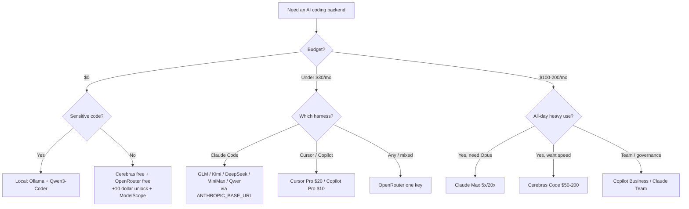

<div align="center">

# 🤖 Awesome AI Coding Subscriptions & APIs

[](https://awesome.re)
[](LICENSE)
[](CONTRIBUTING.md)

[](https://github.com/lildebil0/awesome-ai-coding-subscriptions/stargazers)

**Welches Abo, welcher Coding-Plan, welche API, welcher Router oder welches Free-Tier gehört hinter deinen KI-Coding-Agenten?**
Eine kuratierte, gebenchmarkte, mit Quellen belegte Antwort — sortiert nach 💵 Preis · 🧠 Leistung · 🔢 Modelle · 📊 Limits · 🔌 Integration.

[English](../README.md) · [简体中文](README.zh-CN.md) · [Español](README.es.md) · [Русский](README.ru.md) · [日本語](README.ja.md) · [Português](README.pt-BR.md) · [Français](README.fr.md) · **Deutsch** · [한국어](README.ko.md) · [हिन्दी](README.hi.md)

</div>

---

Diese Liste katalogisiert die **Pläne, für die du zahlst** — Abos, Flatrate-Coding-Pläne, nutzungsbasierte APIs, Router und Free-Tiers — **nicht** die Coding-Werkzeuge selbst. Der Harness (Claude Code, Cline, Aider, Roo/Kilo, OpenCode) ist kostenlos. Geld kostet das Modell dahinter, also wird genau das hier eingestuft. Der Harness ist lediglich das *Integrationsziel*.

Ein Flatrate-Plan für $3–30/Monat aus einem chinesischen Open-Weight-Lab (GLM, Kimi, DeepSeek, MiniMax, Qwen, Doubao), an einen kostenlosen CLI-Harness angeschlossen, bringt dir rund 78–80 % auf SWE-bench für etwa ein Zehntel der Kosten eines $200-Frontier-Abos. Die Frontier-Abos gewinnen weiterhin bei den schwierigsten Aufgaben. Die meisten Leute fahren 2026 deshalb beides: ein Frontier-Abo für das harte Reasoning, einen günstigen Plan für alles andere.

> ⚠️ **Die Preise in diesem Bereich ändern sich monatlich.** Die Zahlen geben den Stand **~Juni 2026** wieder. Bestätige sie immer auf der offiziellen Seite, bevor du kaufst. Veralteten Preis gefunden? [Eröffne einen PR](CONTRIBUTING.md) — Korrekturen sind genauso wertvoll wie Ergänzungen.

## Legende

| Badge | Bedeutung |
|-------|---------|
| 💎 | **Geheimtipp** — weniger bekannt, kostet für das Gebotene weniger als es sollte |
| 🆓 | Hat ein **Free-Tier**, auf dem du tatsächlich einen Agenten laufen lassen kannst |
| ✅ | **Preis gegen die offizielle Quelle faktengeprüft** (Juni 2026) |
| ⭐ | Value-Bewertung (1–5): Preis vs. Leistung vs. Limits vs. Integration |
| 🇨🇳 | In China gehostet (für manche ein Vorbehalt zu Datenresidenz / Latenz) |
| ⚠️ | Trägt nennenswertes Risiko (ToS, Zuverlässigkeit, Langlebigkeit, Reseller) |

**Integrations-Kurzschreibweise:** `CC-native` = nativer Anthropic-kompatibler Endpunkt, ein direkt einsetzbares Claude-Code-Backend via `ANTHROPIC_BASE_URL`. `OpenAI-compat` = funktioniert in Cline/Roo/Kilo/Aider/Continue/OpenCode durch Austausch der Base-URL (Claude Code braucht einen Shim/Router). `native-only` = an den eigenen Editor/Agenten des Anbieters gebunden, nicht als Backend wiederverwendbar.

## Inhalt

- [So wählst du aus](#so-wählst-du-aus)
- [Wahl nach Budget](#wahl-nach-budget)
- [Wahl danach, wer du bist](#wahl-danach-wer-du-bist)
- [TL;DR — Top-Empfehlungen nach Anwendungsfall](#tldr--top-empfehlungen-nach-anwendungsfall)
- [Master-Vergleichstabelle](#master-vergleichstabelle)
- [First-Party-Frontier-Abos](#first-party-frontier-abos)
- [Gebündelte Tool-Abos (Editor + Modell)](#gebündelte-tool-abos-editor--modell)
- [Flatrate-Coding-Pläne — die Value-Champions 💎](#flatrate-coding-pläne--die-value-champions-)
- [Nutzungsbasierte Value-APIs](#nutzungsbasierte-value-apis)
- [Speed- / Fast-Inference-Anbieter](#speed---fast-inference-anbieter)
- [Router & Gateways](#router--gateways)
- [Weitere wissenswerte Anbieter (2026)](#weitere-wissenswerte-anbieter-2026)
- [Free-Tiers 🆓](#free-tiers-)
- [Gratis-Credits & Studenten- / Startup-Programme](#gratis-credits--studenten---startup-programme)
- [Nische & Spezialfälle](#nische--spezialfälle)
- [App-Builder & autonome Agenten](#app-builder--autonome-agenten)
- [Geheimtipps & Reseller-Proxys ⚠️](#geheimtipps--reseller-proxys-)
- [Setup-Rezepte — einen günstigen Plan an deinen Harness anbinden](#setup-rezepte--einen-günstigen-plan-an-deinen-harness-anbinden)
- [Matrix zu Datenschutz & Datenresidenz](#matrix-zu-datenschutz--datenresidenz)
- [Benchmark pro Dollar](#benchmark-pro-dollar)
- [Geldfallen & häufige Fehler](#geldfallen--häufige-fehler)
- [Preis-Zeitleiste 2026](#preis-zeitleiste-2026)
- [Was die Community wirklich sagt](#was-die-community-wirklich-sagt)
- [Self-Hosting & Hybrid (wenn ein Abo nicht die Antwort ist)](#self-hosting--hybrid-wenn-ein-abo-nicht-die-antwort-ist)
- [FAQ](#faq)
- [Glossar](#glossar)
- [Wie diese Liste bewertet & gepflegt wird](#wie-diese-liste-bewertet--gepflegt-wird)
- [Vorbehalte & Haftungsausschluss](#vorbehalte--haftungsausschluss)
- [Mitwirken](#mitwirken)
- [Lizenz](#lizenz)
- [⭐ Star-Verlauf](#-star-verlauf)

---

## So wählst du aus

Bewerte jeden Plan auf fünf Achsen:

1. **💵 Preis** — Listenpreis und die *echten* effektiven Kosten (Credit-Verhältnisse, Peak-Multiplikatoren, Overage).
2. **🧠 Leistung** — Modellqualität; die Value-Klasse liegt geballt bei ~78–80 % SWE-bench Verified, Frontier bei 85–89 %.
3. **🔢 Modellanzahl** — ein Plan, der viele Modelle multiplext (Qwen Coding Plan, OpenRouter), hedgt gegen Wechsel.
4. **📊 Limits** — Requests/Tokens pro 5-Stunden-Fenster, Wochen-Caps, Nebenläufigkeit. Die versteckten Kosten: ein IDE-„Prompt“ fächert in **5–30 Modellaufrufe** auf, beworbene „Prompts/5h“ sind also weicher, als sie wirken.
5. **🔌 Integration** — bietet er einen **nativen Anthropic-Endpunkt** (sauberes Claude-Code-Drop-in) oder nur OpenAI-compat (braucht einen Router)? Oder ist er native-only (keine Wiederverwendung)?

**Entscheidungs-Shortcut:**

- Willst du den **besten Agenten, einfachster Weg** → Claude Pro $20 → Max 5x $100.
- Willst du **am meisten Coding pro Dollar** → einen Flatrate-Plan (GLM / MiniMax / Qwen / Kimi) auf Claude Code.
- Willst du **$0** → Cerebras free + OpenRouter free (+$10 Freischaltung) + NVIDIA NIM, schwere Aufgaben an ein bezahltes Modell eskalieren.
- Willst du **einen Key für alles** → OpenRouter.
- Willst du **Datenschutz (kein China-Hosting)** → Synthetic.new (US, no-train, 14-Tage-Löschung) oder First-Party-US-Abos.



---

## Wahl nach Budget

Spar dir die Analyse-Paralyse. Finde deine Monatszahl, schnapp dir den Stack.

| Budget | Beste Wahl | Was du bekommst | Cleverster Stack |
|---|---|---|---|
| **$0** 🆓 | **GitHub Copilot Free** + **Gemini CLI** | 2.000 Completions + 50 Premium-Reqs/Monat von Copilot; eine großzügige agentische CLI von Google | Copilot Free in der IDE für Autovervollständigung, Gemini CLI im Terminal für Agent-Läufe, [Cursor Hobby](https://cursor.com/pricing) als dritter Eimer gratis Tab-Completions |
| **< $10/Monat** | **GLM Coding Plan Lite** 💎 ($30/Quartal ≈ $10/Monat) | ~3× Claude-Pro-Nutzung; ein [nativer Anthropic-kompatibler Endpunkt](https://docs.z.ai/guides/overview/pricing) — direkt in Claude Code, Cline oder OpenCode einsetzbar | GLM Lite als dein Claude-Code-Treiber + das Free-Tier obendrauf für Überlauf |
| **~$10/Monat** | **GitHub Copilot Pro** ($10) | Unbegrenzte Completions, $10 an AI Credits, Agent-Modus, Modellauswahl — [im Juni 2026 auf nutzungsbasierte Credits umgestellt](https://github.blog/news-insights/company-news/github-copilot-is-moving-to-usage-based-billing/) | Copilot Pro in der IDE + GLM Lite im Terminal — zwei nahezu Frontier-Treiber für insgesamt ~$20 |
| **~$20/Monat** | **Claude Pro** ($20) *oder* **Cursor Pro** ($20) | Pro: Claude Code in Terminal/Web/Desktop, [Sonnet 4.6 + Opus 4.6](https://claude.com/pricing). Cursor: unbegrenztes Tab + $20 Agent-Nutzung + Background Agents | Claude Pro (bester roher Agent) + Copilot Free für Inline-Autovervollständigung; oder Cursor Pro allein, wenn du in einem Editor lebst |
| **~$50/Monat** | **Copilot Pro+** ($39) *oder* **GLM Pro** ($90/Quartal ≈ $30) **+ Claude Pro** ($20) | Pro+: $39 an AI Credits + Top-Modelle. Die Kombi: ~15× Claude-Pro-Nutzung von GLM *plus* native Anthropic-Qualität fürs Harte | GLM Pro für die Hochvolumen-Schinderei, Claude Pro reserviert für kniffliges Reasoning — bestes $/Durchsatz im Feld |
| **~$100/Monat** | **Claude Max 5x** ($100) | 5× Pro-Nutzung, priorisierter Zugang zu den neuesten Modellen — der Sweet Spot für Devs, die täglich an Pro-Limits stoßen ([Max-Plan](https://support.claude.com/en/articles/11049741-what-is-the-max-plan)) | Max 5x als Arbeitstier + GLM Lite ($10) als günstige Überlaufspur, wenn du das 5x-Cap aufbrauchst |
| **~$200/Monat** | **Claude Max 20x** ($200) *oder* **Cursor Ultra** ($200) | Max 20x: 20× Pro, höchste Einzelstufe. [Cursor Ultra](https://cursor.com/pricing): 20× Nutzung + Priority-Features in einer vollwertigen IDE | Max 20x für Terminal-First-Power-User; Copilot Pro ($10) nur dazu, wenn du zur Abwechslung/Redundanz die Modelle eines zweiten Anbieters willst |

**Faustregeln**
- **Unter $20 und preissensibel?** GLM Lite ist gerade der beste Dollar im Coding — es spricht Anthropics API, deine Claude-Code-Routine überträgt sich also direkt.
- **Ein Tool, den ganzen Tag?** Zahl für das native Abo (Claude Pro, Cursor Pro). Zersplittere nicht.
- **Vieltägiger Nutzer?** Spring direkt zu Max 5x — günstiger als zwei $50-Pläne zu stapeln und weit weniger fummelig.
- **Der Profi-Zug auf jeder Stufe:** ein Premium-Treiber für harte Probleme + eine günstige/kostenlose Spur für Massen-Edits und Autovervollständigung. Du brauchst selten zwei Abos über $20.

> Preise im Juni 2026 verifiziert. Quartalsweise abgerechnete Pläne (GLM) als effektiver Monatspreis dargestellt. Copilot und GitHub-Pläne sind am 1. Juni 2026 auf [nutzungsbasierte AI Credits](https://github.blog/news-insights/company-news/github-copilot-is-moving-to-usage-based-billing/) umgestellt — dein Kontingent skaliert mit dem Grundpreis.


---

## Wahl danach, wer du bist

Spar dir das Matrix-Anstarren. Finde deine Zeile, kopier die Wahl, weiter geht's. Preise in USD/Monat, Einzelstufen sofern nicht anders angegeben (Juni 2026).

| Du bist… | Beste Wahl | Warum es zu dir passt | ~Preis |
|---|---|---|---|
| **Solo-Indie-Hacker** 💎 | **Claude Pro** + ein Z.ai/DeepSeek-API-Key als Überlauf | Ein $20-Abo deckt Claude Code im Terminal; wenn du mitten im Sprint ans 5-Stunden-Cap stößt, fällst du auf eine günstige Value-API zurück statt auf eine $100-Stufe zu springen, die du unternutzt. Bestes $/Output für eine Person, die täglich liefert. | $20 + Cents |
| **Startup-Eng-Team (2–20)** | **GitHub Copilot Business** | $19/Sitz bringt Org-Policy, Public-Code-Filter, **IP-Schadensfreistellung** und zentrale Abrechnung — der günstigste Plan, den man Investoren/Kunden gefahrlos vorsetzen kann. Lässt sich mit dem eigenen Claude/Cursor-Abo jedes Devs für schwere Arbeit kombinieren. [Preise](https://github.com/features/copilot/plans) | $19/Sitz |
| **Enterprise** (Governance / SSO / IP) | **Copilot Enterprise** oder **Claude Enterprise** | Copilot Enterprise ($39/Sitz) ergänzt SSO/SCIM, Audit-Logs, codebasis-indexierte Wissensbasen und dieselbe Microsoft-IP-Schadensfreistellung-mit-Filter. Claude Enterprise (per Vertrieb beziffert) ist die Alternative, wenn du Anthropic-first bist. Beide bestehen den Einkauf. [Copilot Enterprise](https://docs.github.com/en/copilot/get-started/plans) | $39/Sitz → individuell |
| **Informatik-Student** 🆓 | **GitHub Copilot (Student)** + ChatGPT Free | Verifizierte Studierende bekommen **Copilot auf Pro-Niveau gratis** (unbegrenzte Completions, Premium-Modelle, monatliches Premium-Request-Kontingent). Null Ausgaben, echtes Werkzeug. [Copilot-Pläne](https://github.com/features/copilot/plans) | $0 |
| **OSS-Maintainer** 🆓 | **Copilot Pro gratis für OSS** + Claude Pro für Tiefarbeit | Maintainer beliebter Repos qualifizieren sich für gratis Copilot Pro; halt dir ein $20-Claude-Pro für die haarigen Refactorings. Bestes Verhältnis Gemeinwohl-zu-Kosten. | $0–$20 |
| **Privacy-First / reguliert** 🔒 | **Lokaler Stack: Ollama + Qwen3-Coder + Continue.dev** | Proprietärer Code verlässt nie die Kiste — keine API, keine Aufbewahrungsklausel, kein DPA zu verhandeln. Etwa 70–85 % der Cloud-Claude-Qualität bei Einzeldatei-Arbeit. Wenn du Cloud nutzen musst, ergänze ein **Zero-Retention**-API-Tier. [Setup](https://medium.com/@rodrigo.estrada/build-a-local-ai-coding-assistant-qwen3-ollama-continue-dev-cee0dbcd172a) | $0 (Hardware) |
| **Offline / Air-Gapped** | **Ollama + Qwen3-Coder-Next** (Continue.dev oder OpenCode) | Derselbe lokale Stack, aber dies ist die *einzige* Kategorie, die bei gezogenem Netzwerkkabel funktioniert. Qwen3-Coder-Next fährt ~3B aktive Parameter aus einem 80B-MoE — passt auf echte Hardware, nie Internet. [Modelle](https://localaimaster.com/models/best-local-ai-coding-models) | $0 |
| **Vibe-Coder / Hobbyist** 🆓 | **Free-Tier-Sampler**: ChatGPT Free oder Copilot Free + Gemini free | Du baust am Wochenende zum Spaß — zahl nichts. Copilot Frees 2.000 Completions/Monat plus ein Chat-Modell deckt gelegentliche Nebenprojekte. Upgrade erst, wenn die kostenlosen Limits wirklich beißen. | $0 |
| **Power-User mit parallelen Agenten** 💎 | **Claude Max 20x** (oder einen Value-API für Fan-out stapeln) | Wenn du Schwärme / parallele Claude-Code-Sessions orchestrierst, ist die 20x-Nutzungsobergrenze das, was dich um 14 Uhr nicht ans Limit stoßen lässt. Günstiger als äquivalente API-Tokens bei diesem Volumen zu verbrennen. Häng einen DeepSeek/Z.ai-Key für die Wegwerf-Worker-Agenten dran. | $200 |

**Zwei übergreifende Faustregeln:**
- Der Sprung von **$20 → $100/$200** lohnt sich nur, wenn du *persönlich* mehr als ~zweimal pro Woche an Nutzungs-Caps stößt. Die meisten tun das nicht — miss es, bevor du upgradest.
- **IP-Schadensfreistellung ist ein Plan-Feature, kein Modell-Feature.** Sie beginnt bei Copilot **Business** und verlangt den eingeschalteten Public-Code-Filter — Free- und Pro-Stufen tragen sie nicht. Wenn jemals ein Anwalt dein Repo liest, ist das die entscheidende Zeile. [Details](https://github.com/features/copilot/plans)

Quellen:
- [GitHub Copilot Plans & pricing](https://github.com/features/copilot/plans)
- [Plans for GitHub Copilot — GitHub Docs](https://docs.github.com/en/copilot/get-started/plans)
- [AI Pricing Compared 2026 — AIViewer](https://aiviewer.ai/guides/ai-pricing-comparison-2026/)
- [Build a Local AI Coding Assistant — Qwen3 + Ollama + Continue.dev](https://medium.com/@rodrigo.estrada/build-a-local-ai-coding-assistant-qwen3-ollama-continue-dev-cee0dbcd172a)
- [Best Local AI Coding Models for Ollama (2026)](https://localaimaster.com/models/best-local-ai-coding-models)


---

## TL;DR — Top-Empfehlungen nach Anwendungsfall

| Anwendungsfall | Wahl | Warum | ~Preis |
|----------|------|-----|--------|
| 🏆 **Bester Gesamt-Value** | **GLM Coding Plan** 💎🇨🇳 | „3× Claude-Max-Nutzung für ~$30/Monat“; GLM-5.1 ~94 % von Opus-Coding; natives Claude Code | $10–30/Monat |
| 🥇 **Bestes rohes Frontier** | **Claude Max 5x** | Schaltet Opus in Claude Code frei, der Konsens-#1-Agent | $100/Monat |
| 🪙 **Günstigster ernsthafter Einstieg** | **GLM Lite** / **Qwen Standard** / **Trae Lite** 💎 | Echtes Coding-Backend ab ~$3–10/Monat | $3–10/Monat |
| 💸 **Günstigster pro Token** | **DeepSeek V4-Flash** 💎 | $0.14/M ein, $0.0028/M Cache-Hit, 1M ctx, CC-native | pay-go |
| 🧪 **Bestes kostenlos** | **Cerebras free** 🆓 + **OpenRouter :free** 🆓 | 1M Tok/Tag (schnell) + Qwen3-Coder-480B gratis | $0 |
| ⚡ **Bestes schnell+günstig** | **Groq** 💎🆓 / **Cerebras Code** | Nativer Anthropic-Endpunkt (Groq); ~2000 Tok/s Flatrate (Cerebras) | gratis / $50/Monat |
| 🔀 **Bester Universal-Router** | **OpenRouter** | 315+ Modelle, ein Key, Anthropic-Skin, kein Token-Aufschlag | pay-go +5,5 % |
| 🔒 **Bester Datenschutz (US-Hosting)** | **Synthetic.new** 💎 | US-Infra, no-train, 14-Tage-Löschung, duale OpenAI+Anthropic-Compat | $20–60/Monat |
| 🧰 **Beste für große Codebasen** | **Augment Code** ✅ | Best-in-Class Context Engine für Monorepos | $20+/Monat |
| 🏢 **Bester Team-Value** | **Claude Team Premium-Sitz** 💎 | ≈ Max-5x-Nutzung + SSO/Admin | $100/Sitz |


---

## Master-Vergleichstabelle

Grob nach Value sortiert. Preise ~Juni 2026; **vor dem Kauf verifizieren**.

| Plan | Typ | Preis | Modelle | Limits (Coding) | Integration | ⭐ | Notizen |
|------|------|-------|--------|-----------------|-------------|----|-------|
| [GLM Coding Plan](#glm-coding-plan--zai) | Flatrate | $10–30/Monat (Lite/Pro, quartalsw.) | GLM-5.1/5/4.7 | Lite ~80, Pro ~400 Prompts/5h | CC-native | ⭐5 | 💎🇨🇳✅ |
| [DeepSeek API](#deepseek) | pay-go API | V4-Pro $0.435/$0.87; Flash $0.14/$0.28 | V4-Pro/Flash | 1M ctx, 500–2500 nebenläufig | CC-native | ⭐5 | 💎🇨🇳✅ |
| [MiniMax Coding Plan](#minimax) | Flatrate | $10–50/Monat | M2.7 (Plan), M2.5/M3 (API) | Starter ~100, Max ~1000 Prompts/5h | CC-native | ⭐5 | 💎🇨🇳 |
| [Kimi Code](#kimi-moonshot) | Flatrate+API | ~$19/Monat + nutzungsbasiert | K2.6 (1T) | ~300–1200 Aufrufe/5h, 30 nebenläufig | CC-native | ⭐5 | 💎🇨🇳 |
| [Qwen Cloud Coding Plan](#qwen-alibaba) | Flatrate | Pro $50/Monat (Lite $10, geschlossen) | Qwen3.5 + Kimi/GLM/MiniMax | Pro 6000 Req/5h, 1M ctx | CC-native | ⭐4 | 💎🇨🇳✅ |
| [OpenRouter](#openrouter) | Router | pay-go, +5,5 % Aufladung | 315+ (alle) | guthabengebunden; freie Modelle 50–1000/Tag | CC-native-Skin | ⭐5 | 🆓 |
| [Claude Pro](#anthropic-claude) | First-Party | $20/Monat | Sonnet 4.6 (kein Opus) | ~40–45 Nachr./5h + wöchentl. | CC-native | ⭐5 | bester Einstieg |
| [Claude Max 5x](#anthropic-claude) | First-Party | $100/Monat | + Opus 4.6/4.7 | ~50–225 Prompts/5h | CC-native | ⭐5 | Opus freigeschaltet |
| [Cerebras Code](#cerebras) | Flatrate-Speed | $50/$200 | GLM-4.7 (~2000 Tok/s) | 24M–120M Tok/Tag, 131k ctx | OpenAI-compat | ⭐5 | ✅ oft ausverkauft |
| [Synthetic.new](#synthetic) | Flatrate (US) | $20–60/Monat | 16 Open-Weight (GLM/Kimi/Qwen/DS) | ~125–1250 Req/5h | CC-native | ⭐5 | 💎🔒 |
| [Chutes](#chutes) | Flatrate ⚠️ | $3/$10/$20 | GLM-5/Kimi/DS/MiniMax/Qwen | 300/2000/5000 Req/Tag | OpenAI-compat | ⭐5 | 💎⚠️ dezentral ✅ |
| [Grok Code Fast 1](#xai-grok) | pay-go API | $0.20/$1.50/M | grok-code-fast-1 | 256K ctx, ~92 Tok/s | CC-native | ⭐5 | 💎 #1 auf OpenRouter |
| [ChatGPT Plus](#openai-chatgpt--codex) | First-Party | $20/Monat | GPT-5.x-Codex | token-credit-basiert | Codex-native | ⭐4 | Codex #2 Agent |
| [ChatGPT Pro](#openai-chatgpt--codex) | First-Party | $100/$200 (5x/20x) | GPT-5.5-Codex | hoch; dedizierte GPU | Codex-native | ⭐4 | |
| [Claude Max 20x](#anthropic-claude) | First-Party | $200/Monat | Opus 4.6/4.7 | ~200–900 Prompts/5h | CC-native | ⭐4 | Power-Stufe |
| [Cursor Pro / Ultra](#cursor) | gebündelt | $20 / $200 | alle Frontier + Auto | $20 / $400 Nutzungspool | Native-only | ⭐4 | Ultra = 2× Credit-Verhältnis |
| [GitHub Copilot Pro](#github-copilot) | gebündelt | $10/Monat | GPT-5/Claude/Gemini | $10 AI-Credits (nutzungsbasiert) | Native-only (+ACP) | ⭐4 | gratis Completions 🆓 |
| [DeepInfra](#deepinfra) | Speed/API | pay-go (günstigstes OSS) | Kimi/DS/Qwen3-Coder/GLM | guthabengebunden | CC-native | ⭐5 | 💎✅ günstigster Host |
| [Groq](#groq) | Speed/API | pay-go + gratis | GPT-OSS/Qwen3/Kimi | freie RPM/TPM-Caps | CC-native | ⭐4 | 💎🆓 |
| [Vercel AI Gateway](#vercel-ai-gateway) | Router | $0 Aufschlag (auch BYOK) | 100e inkl. Claude | $5/Monat Gratis-Credits | CC-native | ⭐4 | 💎🆓✅ |
| [Requesty](#requesty) | Router | +5 % pauschal | Claude/GPT/Gemini/DS/Qwen | semantischer Cache ~40 % günstiger | OpenAI-compat | ⭐4 | 💎 Team-Governance |
| [Mistral Le Chat Pro](#mistral) | First-Party | $14.99/Monat ($5.99 Student) | Devstral 2 + Vibe CLI | ~25 gratis Nachr./Tag | Native-only | ⭐4 | 💎🆓🇪🇺 günstigstes großes Abo |
| [Augment Code](#gebündelte-tool-abos-editor--modell) | gebündelt | $20–200/Monat | Claude/Gemini/GPT | 40k–450k Credits/Monat | Native-only | ⭐4 | ✅ bester Big-Repo-Kontext |
| [Zed Pro](#gebündelte-tool-abos-editor--modell) | gebündelt | $10/Monat | beliebig (BYO Key/ACP) | $5 Credits + Nutzung | ACP + BYOK | ⭐4 | 💎 Anti-Lock-in |
| [Cerebras free](#free-tiers-) | gratis | $0 | Qwen3-Coder-480B, GPT-OSS-120B | 1M Tok/Tag, 8K ctx-Cap | OpenAI-compat | ⭐5 | 💎🆓 schnellstes kostenlos |
| [Google AI Studio](#free-tiers-) | gratis | $0 | Gemini 2.5 Flash, Gemma 3 27B | Flash 250 RPD; Gemma 14,4k RPD | OpenAI-compat | ⭐4 | 🆓 größtes freies ctx |


---

## First-Party-Frontier-Abos

Die Pläne direkt vom Anbieter. Ein Abo authentifiziert den **eigenen Harness des Anbieters** (Claude Code, Codex CLI, Antigravity, Grok Build) per Login — es gibt dir **keinen** generischen API-Key für Drittanbieter-OpenAI-compat-Tools (das ist separate Abrechnung pro Token). Ausnahme: xAI-Grok-Modelle sind OpenAI/Anthropic-kompatibel.

> Value-Hackordnung für agentisches Coding (Konsens Juni 2026): **Claude > OpenAI Codex > Google Gemini > xAI Grok**. Ein unabhängiger 30-Tage-Test ergab Claude ~95 % vs. ChatGPT ~85 % Coding-Genauigkeit; Hersteller-SWE-bench hat GPT-5.5 (88,7 %) ≈ Opus 4.7 (87,6 %).

### Anthropic (Claude)
- **[Claude Pro](https://claude.com/pricing)** — `$20/Monat` ($17 jährlich). Sonnet 4.6 in Claude Code (**kein Opus**). ~40–45 Nachr./5h + Wochen-Cap, geteilt mit Chat/Cowork. **Bester Value-Einstiegspunkt zum #1-Coding-Agenten.** April 2026 verdoppelte die 5h-Limits & entfernte die Peak-Drosselung. ⭐5
- **[Claude Max 5x](https://support.claude.com/en/articles/11049741-what-is-the-max-plan)** — `$100/Monat`. **Schaltet Opus 4.6/4.7 frei** + 5× Durchsatz (~50–225 Prompts/5h). Der Profi-Sweet-Spot; eine $100-Mittelstufe, die OpenAI/Google nicht so nützlich kontern. ⭐5
- **[Claude Max 20x](https://support.claude.com/en/articles/11049741-what-is-the-max-plan)** — `$200/Monat`. ~200–900 Prompts/5h. Für ganztägige parallele Agenten; die **Flatrate-schlägt-API**-Rechnung ist entscheidend (90 %+ der Claude-Code-Tokens sind Cache-Reads, im Abo gratis, in der API berechnet — der Spitzenmonat eines Devs = $5.623 bei API ≈ 4,5 Jahre Max 5x). ⭐4
- **[Claude Team Premium-Sitz](https://claude.com/pricing)** 💎 — `$100/Sitz` (jährlich). ≈ Max-5x-Nutzung **plus** SSO/Admin/Audit/Enterprise-Suche. Klammheimlich der beste *Team*-Coding-Value; der Standard-$20-Sitz enthält ebenfalls Claude Code. ⭐4

### OpenAI (ChatGPT / Codex)
- **[ChatGPT Plus](https://help.openai.com/en/articles/11369540-using-codex-with-your-chatgpt-plan)** — `$20/Monat`. Codex CLI/IDE gebündelt (GPT-5.5/5.4/5.3-Codex). Seit April 2026 **token-credit-basiert** (verwirrend). Codex = Konsens-#2-Agent. Plus-Caps gehen bei schwerer agentischer Arbeit schnell aus. ⭐4
- **[ChatGPT Pro](https://developers.openai.com/codex/pricing)** — `$100` (5x) / `$200` (20x). Hoher Durchsatz + dedizierte GPU. Beachte: Der „10x Boost“-Promo der $100-Stufe **lief am 31. Mai 2026 aus** (jetzt 5x). Die klassische Debatte „$200-Plan lohnt sich?“ = Claude Max 20x vs. ChatGPT Pro 20x. ⭐4

### Google (Gemini)
- **[Gemini AI Pro / Ultra](https://gemini.google/subscriptions/)** — Ultras gebündelte GCP-Credits ($40 bei $100 / $100 bei $200) gleichen die Kosten merklich aus, wenn du Google Cloud nutzt 💎. ⚠️ **Google legt die Open-Source-Gemini-CLI am 18. Juni 2026 still** und erzwingt die Migration auf die geschlossene Antigravity CLI mit weit niedrigeren Gratis-Kontingenten (~1000 → ~20 Req/Tag) — die größte Community-Beschwerde von 2026.

### xAI (Grok)
- **[SuperGrok](https://x.ai/news/grok-code-fast-1)** — `$10` (Lite) / `$30` / `$300` (Heavy). Die Grok Build CLI fährt **8 parallele Sub-Agenten in isolierten git worktrees** (neuartig). `grok-code-fast-1` hat eine Kultanhängerschaft (günstig+schnell) und war in vielen Partner-IDEs gratis. SWE-bench ~70,8 % hinkt den Spitzenreitern hinterher. **Fürs Coding kauf die [xAI API](#xai-grok), nicht das SuperGrok-App-Abo.** ⭐3 💎


---

## Gebündelte Tool-Abos (Editor + Modell)

Hier *ist* der Plan das Produkt — du kaufst dich in den Editor/Agenten des Anbieters ein. Der 2026er-Trend: nahezu alle wechselten von festen Request-Zahlen zu **Credits / Token-Metering**, wodurch Kosten *weniger* vorhersehbar wurden (lautes Backlash).

### Cursor
- **[Cursor](https://cursor.com/pricing)** — Hobby gratis · **Pro `$20`** · **Pro+ `$60`** 💎 · **Ultra `$200`**. Seit Juni 2025 ist dein Planpreis = ein Nutzungspool zu API-Tarifen. **Credit-Verhältnis verbessert sich nach oben**: Pro $20/$20 (1×), Pro+ $60/$70 (1,17×), Ultra $200/$400 (**2×, beste**). Der `Auto`-Modus ist der Value-Schlüssel — quasi unbegrenzt, leert den Pool nicht so wie das Festpinnen auf Claude/MAX. ⚠️ Der Juni-2025-Umstieg verursachte ein [Preis-Desaster](https://www.wearefounders.uk/cursors-pricing-disaster-the-full-timeline-of-how-an-ai-coding-darling-burned-its-most-loyal-users/) (HN-Nutzer: „$350 Overage in einer Woche“); der CEO entschuldigte sich + erstattete. **Native-only** — kann Claude Code nicht backen, und seit Jan 2026 kannst du auch ein Claude-Abo nicht mehr *in* Cursor routen. Best-in-Class Tab/Apply. ⭐4

### GitHub Copilot
- **[GitHub Copilot](https://github.com/features/copilot/plans)** — Free 🆓 · **Pro `$10`** · Pro+ `$39` · Max `$100` · Business `$19` · Enterprise `$39`. ⚠️ **Am 1. Juni 2026 auf nutzungsbasierte AI Credits umgestellt** (1 Credit = $0.01); jeder Plan enthält einen Credit-Pool (Pro=$15, Pro+=$70). **Code-Completions bleiben unbegrenzt & gratis** — reine Completion-Nutzer sind unbetroffen. Backlash heftig (TechTimes: agentische Rechnungen sprangen 10×–50×). Best-in-Class IDE-Completions + Governance/IP-Schadensfreistellung für Orgs. **Native-only** (Notausgang: Copilot CLI spricht ACP). ⭐4

### Sonstige
- **[Augment Code](https://www.augmentcode.com/pricing)** ✅ — Indie `$20`/40k Credits · Standard `$60` · Max `$200`. **Best-in-Class Context Engine** für große Monorepos (führt Context-Recall-Vergleiche an). VS Code + JetBrains + Auggie CLI. Native-only. Credit-Verbrauch bei tool-intensiven Aufgaben ist der Kritikpunkt. ⭐4 💎
- **[Zed Pro](https://zed.dev/pricing)** 💎 — Free · **Pro `$10`** (nur +10 % Aufschlag) · Business `$30`. Die **Anti-Lock-in**-Wahl: offenes [ACP](https://zed.dev/docs/ai/) treibt externe Agenten an (Claude Code, Codex, OpenCode) und BYO-Keys für jeden Anbieter. Schnellster nativer Editor. ⭐4
- **[Kiro](https://kiro.dev/pricing/)** 💎 — Free · **Pro `$20`/1k Credits** · Pro+ `$40` · Power `$200`. Bester **spec-driven** Agent (Anforderungen→Design→Aufgaben), volle Claude-Riege inkl. Opus 4.7, fraktionale 0,01-Credit-Abrechnung. **AWS Startups = 1 Gratisjahr Pro+.** ⭐4
- **[Trae](https://www.trae.ai/pricing)** 💎🇨🇳 — Free · **Lite `$3`** · Pro `$10` · Ultra `$100`. ByteDance-VS-Code-Fork; Nutzungspool übersteigt den Listenpreis (z. B. $20 Nutzung für $10) = „die $3-Cursor-Alternative“. ⚠️ ByteDance-Telemetrie mit Tochterfirmen geteilt — Enterprise-Dealbreaker. ⭐4
- **[Sourcegraph Amp](https://sourcegraph.com/amp)** — Gratis-Start ($10 Credit; $40 für Ex-Cody). Reine **Verbrauchsabrechnung** (kein Monats-Mindestbetrag), fährt Opus 4.8 im „Smart“-Modus. Toll für leichte Nutzung, Risiko ungedeckelten Verbrauchs bei schwerer. Cody Free/Pro wurden in Amp überführt. ⭐3
- **[JetBrains AI / Junie](https://www.jetbrains.com/ai-ides/buy/)** — beliebte IDE-Integration, aber Junie **verbrennt Credits schnell** (Ultimates 35 Credits in ~4–5 Tagen weg). Nur, wenn du in JetBrains lebst.
- **Überteuert / meiden:** **Tabnine** ($39-Untergrenze, kein Free-Tier, jährliche Bindung — nur für On-Prem/Air-Gap-Bedarf); **Windsurf Pro** (März-2026-Umstieg auf Tages-/Wochenkontingente ist die meistbeklagte Änderung des Jahres, nach Cognition niedriges Vertrauen). **Supermaven** ist als Standalone tot (im Nov 2025 in Cursor Tab aufgegangen).


---

## Flatrate-Coding-Pläne — die Value-Champions 💎

Feste Monats- oder Quartalspläne, die ein nahezu Frontier-fähiges Open-Weight-Modell hinter deinen Harness setzen, meist aus chinesischen Labs. Die meisten bieten einen nativen Anthropic-Endpunkt, lassen sich also via `ANTHROPIC_BASE_URL` direkt in Claude Code einsetzen. Für die Endpunktliste siehe [Alorse/cc-compatible-models](https://github.com/Alorse/cc-compatible-models).

> Konsens-Hackordnung: **GLM** (günstigster Einstieg, Community-Standard) · **MiniMax** (bestes Preis/Volumen) · **Kimi** (bester Long-Horizon-Agent) · **Qwen** (>262K Kontext, Multi-Modell). Claude Pro $20 ist der Qualitätsmaßstab, den sie unterbieten.

<a name="glm-coding-plan--zai"></a>
### GLM Coding Plan — Z.ai (Zhipu AI) 💎🇨🇳 ✅
- `Lite ~$10/Monat ($30/Quartal)` · `Pro ~$30/Monat ($90/Quartal)` · `Max ~$80/Monat ($240/Quartal)`. Q2-2026-Promo: $27/$81/$216/Quartal. (Der virale **$3/Monat**-Promo endete am 11. Feb 2026; jährliches Lite ~$7/Monat ist die verbliebene günstige Route.)
- Modelle: **GLM-5.1** (~94 % von Opus-4.6-Coding), GLM-5/5-Turbo, GLM-4.7, GLM-4.5-Air.
- Limits: Lite ~80, Pro ~400, Max ~1.600 Prompts/5h + wöchentlich. ⚠️ **Peak-Hour-3×-Multiplikator** (14:00–18:00 UTC+8) auf GLM-5/5.1 halbiert klammheimlich den Durchsatz.
- Integration: `ANTHROPIC_BASE_URL=https://api.z.ai/api/anthropic` — offizielle Claude-Code-Unterstützung + Cline/Roo/Kilo/OpenCode (20+ Tools). **First-Party** = kein Reseller-Bann-Risiko.
- > *Der meistempfohlene Budget-Coding-Plan von 2026.* „3× Claude-Max-Nutzung für ~$30/Monat.“ Backlash über die Feb-Preiserhöhung + ⅓ Kontingentkürzung, weiterhin Top-Value-bewertet. ⭐5
- Quellen: [z.ai/subscribe](https://z.ai/subscribe) · [Preise](https://docs.z.ai/guides/overview/pricing) · [GLM-5.1 Review](https://serenitiesai.com/articles/glm-5-1-coding-plan-review-2026)

<a name="minimax"></a>
### MiniMax Coding / Token Plan 💎🇨🇳
- `Starter $10/Monat` · `Plus $20` · `Max $50` (2 Monate gratis bei jährlich); High-Speed-Varianten $40–150.
- Modelle: M2.7 / M2.7-Highspeed im Plan; **M2.5/M3** (1M ctx) via API. ⚠️ **Der Plan liefert oft ein älteres Modell** (M2.1) als das gebenchmarkte M2.5/M2.7.
- Limits: Starter ~100 → Max ~1.000 Prompts/5h; ~50 TPS (100 High-Speed).
- Integration: `ANTHROPIC_BASE_URL=https://api.minimax.io/anthropic` + OpenAI-compat.
- > „Hat meine Claude-Code-Rechnung halbiert.“ **Bestes rohes Preis/Volumen** im Flatrate-Eimer; M2.7 ~94 % von GLM-5.1 zu ~1/5 der Input-Kosten. ⭐5
- Quellen: [Coding Plan](https://platform.minimax.io/subscribe/coding-plan) · [M2.5 Preise](https://www.verdent.ai/guides/minimax-m2-5-pricing)

<a name="kimi-moonshot"></a>
### Kimi Code — Moonshot AI 💎🇨🇳
- `~$19/Monat Mitgliedschaft` + nutzungsbasierte API (K2.6 $0.60–0.95/M ein, $2.50–4.00/M aus, 75 % Cache-Rabatt). Gestaffelt Moderato/Allegretto/Vivace.
- Modelle: **Kimi K2.6** (1T MoE, ~80,2 % SWE-bench), K2.5.
- Limits: ~300–1.200 Aufrufe/5h, **30 nebenläufig** (großzügig für parallele Agenten).
- Integration: `ANTHROPIC_BASE_URL=https://api.moonshot.ai/anthropic` — echtes Claude-Code-Drop-in; bringt eigene Kimi CLI (6,4k★).
- > **Beste Long-Horizon-Agent-Stabilität** (durchgehend 4.000+ Tool-Aufrufe über eine 13-Stunden-Session). „Spare 88 % Coding-Kosten.“ Teuerste Input-Seite der offenen Kohorte. ⭐5
- Quellen: [Agent-Support](https://platform.kimi.ai/docs/guide/agent-support) · [Kimi-Code-Leitfaden](https://www.nxcode.io/resources/news/kimi-code-2026-plans-pricing-developer-guide)

<a name="qwen-alibaba"></a>
### Qwen Cloud Coding Plan — Alibaba 💎🇨🇳 ✅
- `Pro $50/Monat` (Lite ~$10 **seit 20. März 2026 für neue Abos geschlossen**).
- Modelle: Qwen3.5-Plus, Qwen3-Coder-Next/Plus/480B + modellübergreifend **Kimi/GLM/MiniMax** unter einem Key. **1M-Token-Kontext** (das beste in der Spur).
- Limits: Pro 6.000 Req/5h + 45k/Woche + 90k/Monat (gleitendes Fenster). Dedizierter `sk-sp-`-Key (nicht mit pay-go austauschbar).
- Integration: `ANTHROPIC_BASE_URL=https://coding-intl.dashscope.aliyuncs.com/apps/anthropic` + Qwen Code CLI.
- > Das Herausragende = **ein Plan multiplext Qwen+Kimi+GLM+MiniMax** und der einzige glaubwürdige 1M-Kontext-Flatplan. ⭐4
- Quellen: [Model Studio Coding Plan](https://www.alibabacloud.com/help/en/model-studio/coding-plan)

### Open-Weight-Flat-Abos (Datenschutz / US-Hosting)
- **[Synthetic.new](https://synthetic.new/pricing)** 💎🔒 — `$20–60/Monat`. ~16 dauerhaft verfügbare Open-Weight-Modelle (Kimi/GLM/Qwen3-Coder-480B/DeepSeek). **US-Infra, kein Training, 14-Tage-Löschung.** **Duale OpenAI- + Anthropic-Compat** = echtes Claude-Code-Drop-in. Die datenschutzbewusste Alternative zu China-Plänen. ⭐5
- **[Cerebras Code](#cerebras)** — `$50`/`$200`, Flatrate-Speed (siehe [Speed](#speed---fast-inference-anbieter)).
- **[OpenCode Go (Zen)](https://opencode.ai/go)** 💎 — `$5` erster Monat, dann `$10/Monat` pauschal. ~12–14 chinesische Open-Weight-Modelle (GLM-5.1/Kimi/Qwen3.7/DeepSeek V4/MiniMax). Erstklassig in OpenCode. Kein Claude/GPT. ⭐4

### Nischen- / Cheap-Tier-Flatpläne 🇨🇳
- **[StepFun Step Plan](https://github.com/Alorse/cc-compatible-models)** — `$6.99`–`$99/Monat`, 100–5.000 Prompts/5h, CC-native. Preisunterbieter, Modelle weniger kampferprobt. ⭐3
- **MiMo (Xiaomi)** — `$6`–`$100/Monat` credit-basiert (60M–1,6B), CC-native (`api.xiaomimimo.com`), inkl. multimodalem Omni. Kaum gebenchmarkt. ⭐3
- **Atlas Cloud** 💎 — `$10`/`$20`, 800k–1,8M Credits/**Tag**, OpenAI-compat (Claude Code/Codex/OpenCode). Tagescredit-Modell für autonome Agenten. ⭐4
- **Factory Droid** 💎 — ab `$20/Monat` token-basiert, Frontier-Modelle (Claude/GPT/Gemini), rollende 5h/7d/30d-Fenster. Bemerkenswerte „Ich habe zwei $200-Max-Pläne für Droid gekündigt“-Story. ⭐4


---

## Nutzungsbasierte Value-APIs

Zugang pro Token von den Value-Labs. **Die Cache-Preise sind der echte Kostentreiber** für Agent-Loops — designe auf Cache-Hits hin, nicht auf den Schlagzeilen-Input-Preis.

<a name="deepseek"></a>
### DeepSeek 💎🇨🇳 ✅
- **V4-Pro** `$0.435/M ein · $0.0036/M Cache-Hit · $0.87/M aus` (der **75 %-Schnitt ist jetzt dauerhaft**). **V4-Flash** `$0.14 / $0.0028 / $0.28`. 1M Kontext, 384K max. Output.
- Integration: OpenAI-compat **+ natives Anthropic** (`https://api.deepseek.com/anthropic`) — Drop-in Claude Code (`ANTHROPIC_MODEL=deepseek-v4-pro[1m]`).
- > **Der Kosten-pro-Token-Champion.** V4-Pro ~80,6 % SWE-bench / 93,5 % LiveCodeBench bei <$1/M aus. V4-Flashs $0.0028/M Cache-Hit ist für Massen-Loops unschlagbar. ⭐5
- Quellen: [Preise](https://api-docs.deepseek.com/quick_start/pricing) · [Claude-Code-Setup](https://api-docs.deepseek.com/quick_start/agent_integrations/claude_code)

### Sonstige
- **[Alibaba Qwen3-Coder API](https://www.alibabacloud.com/help/en/model-studio/model-pricing)** 🇨🇳 — 480B `$0.22/$1.00`, Flash `$0.195/$0.975`, 30B-A3B `$0.07/$0.27`. **1M gratis Tokens / 90 Tage** (Intl). CC-native. Stärkster Open-Weight-Agentic-Coder. Nutze Keys der Singapur-Region. ⭐4
- **[Moonshot Kimi API](https://platform.kimi.ai/docs/pricing)** 🇨🇳 — K2.6 `$0.95/$4.00` ($0.16 gecacht), K2.5 `$0.60/$3.00`. CC-native. Exzellentes Tool-Calling; der Output-Preis ist der Murrpunkt. $10 Einzahlung entfernt das Tageslimit. ⭐4
- **[Zhipu GLM API](https://docs.z.ai/guides/overview/pricing)** 🇨🇳 — GLM-5.1 `$1.40/$4.40`, GLM-4.7 `$0.60/$2.20`, FlashX `$0.07/$0.40`. CC-native. Die meisten Enthusiasten kaufen stattdessen den günstigeren [Coding Plan](#glm-coding-plan--zai). ⭐4
- **[MiniMax API](https://platform.minimax.io/docs/guides/pricing-paygo)** 🇨🇳 ✅ — M3 `$0.30/$1.20` ($0.06 Cache, **gratis Cache-Writes**), M2.5 ~`$0.15/$1.15`. „20× günstiger als Opus.“ First-Party-Anthropic-Compat. ⭐4


---

## Speed- / Fast-Inference-Anbieter

Token-basierte Hosts von Open-Weight-Modellen, auf Durchsatz optimiert. **Groq ist der einzige mit einem nativen Anthropic-Endpunkt** (sauberstes Claude-Code-Drop-in); der Rest ist OpenAI-compat (braucht für CC einen Shim/Router, nativ in Cline/Roo/OpenCode).

<a name="deepinfra"></a>
- **[DeepInfra](https://deepinfra.com/pricing)** 💎 ✅ — **der günstigste-pro-Token-Champion.** DeepSeek V3.2 ~$0.26/$0.38, Kimi K2.6 $0.75/$3.50, Qwen3-Coder-480B $0.30/$1.00. 90+ Modelle, Cache-Rabatte, **nativer Anthropic-Endpunkt**, keine Vorabkosten. Geschwindigkeit gut-aber-nicht-elite. ⭐5
<a name="groq"></a>
- **[Groq](https://groq.com/pricing)** 💎🆓 — LPU-Speed (GPT-OSS-20B ~860 Tok/s). GPT-OSS-120B `$0.15/$0.60`, Kimi K2 `$1.00/$3.00`. **Natives Anthropic + OpenAI-Compat** + echtes Free-Tier. Batch+Cache stapeln auf ~25 %. Kein Qwen3-Coder-480B (Obergrenze ist Qwen3-32B). ⭐4
<a name="cerebras"></a>
- **[Cerebras](https://www.cerebras.ai/pricing)** ✅ — **schnellster** (~2.000–3.000 Tok/s). **Code Pro `$50`** (24M Tok/Tag) / **Max `$200`** (120M Tok/Tag), GLM-4.7, 131k ctx. Pay-go GPT-OSS-120B `$0.35/$0.75`. ⚠️ Häufig **ausverkauft**; 131k ctx (halb nativ) + hohes TTFT stumpfen die Geschwindigkeit in Agent-Loops ab. ⭐5 Flatrate / ⭐4 pay-go
- **[Together AI](https://www.together.ai/pricing)** — breitester Katalog (Qwen3-Coder-480B, Kimi, DeepSeek V4 Pro $2.10/$4.40 m. $0.20 gecacht). Mittelfeld-Preis, ~89 Tok/s. ⭐4
- **[Fireworks AI](https://fireworks.ai/pricing)** — produktions-/enterprise-lastig, aggressives Cache ($0.15/M), DeepSeek V4-Flash $0.14/$0.28, Azure-Foundry-Pfad. ⭐4
- **[Novita](https://novita.ai/pricing)** 💎 — hostet die volle Qwen3-Coder-Familie zu Nahe-DeepInfra-Preisen; unbekanntere OpenRouter-Route. ⭐4
- **[Hyperbolic](https://docs.hyperbolic.xyz/docs/hyperbolic-ai-inference-pricing)** 💎 — GPT-OSS-20B `$0.10/M` gemischt (zu den günstigsten überhaupt); hostet Qwen3-Coder-480B (FP8). ~13 Modelle. ⭐3
- **SambaNova** — einzigartig schnell bei riesigen 671B/405B-Modellen; für immer kostenlos + $5 Credit 🆓 aber 50-Req/Tag-Cap = nur für Eval.


---

## Router & Gateways

Ein Key über viele Anbieter. Wähle einen Router als deine **Standard-Zugriffsschicht**.

<a name="openrouter"></a>
- **[OpenRouter](https://openrouter.ai/pricing)** 🆓 — **der Konsens-Standard.** 315+ Modelle, ein Key, **Anthropic-compat-„Skin“** (`ANTHROPIC_BASE_URL=https://openrouter.ai/api` = echtes Claude-Code-Drop-in), **kein Token-Preisaufschlag** (nur +5,5 % bei Aufladungen), gratis ZDR + Spend-Caps, großzügiges BYOK (1M gratis Req/Monat). Freie Modelle (Qwen3-Coder-480B, DeepSeek, Llama 4): 50 RPD → **1000 RPD für immer nach einer einmaligen $10-Einzahlung**. Die 5,5 %-Gebühr sticht nur über ~$5k/Monat Ausgaben. ⭐5
<a name="requesty"></a>
- **[Requesty](https://www.requesty.ai/)** 💎 — **pauschal 5 % Aufschlag**, alle Features inkl. **semantischem Caching** (~40 % Ersparnis, schlägt nur-identische Caches) + smartes Routing pro Request + **Modell-Policies pro Agent** (anderes Modell je Klassifizierer-/Synthesizer-Rolle) + SOC 2 Type II. Die Team-Governance-Wahl. OpenAI-compat. ⭐4
<a name="vercel-ai-gateway"></a>
- **[Vercel AI Gateway](https://vercel.com/docs/ai-gateway/pricing)** 💎🆓 ✅ — **null Aufschlag, sogar bei BYOK.** Nativ Anthropic-compat (`https://ai-gateway.vercel.sh`) = direkt Claude Code + Claude Agent SDK + „Claude Code Max via Gateway“. $5/Monat Gratis-Credits erneuern sich unbegrenzt (stoppt, sobald du auflädst). Beste rein-ökonomische Wahl, besonders im Vercel-Ökosystem. ⭐4
- **[Helicone Gateway](https://helicone.ai/pricing)** 🆓 — observability-first (Auto-Logging/Tracing/Kosten), null Aufschlag, gratis 10k Req/Monat; Abos $79/$799. ⭐3
- **[CometAPI](https://www.cometapi.com/)** — 500+ Modelle inkl. neuester proprietärer, ~20–40 % unter offiziell, **duale OpenAI+Anthropic-Compat**. Vorausbezahlter-Credit-Middleman-Risiko. ⭐4
- **[ElectronHub](https://www.electronhub.ai/pricing)** — 600+ Modelle, wöchentliche Credits können die Barkosten übersteigen; enges 5–10 RPM bei günstigen Stufen, Reseller-Vertrauensvorbehalt. ⭐3
- **[LiteLLM](https://docs.litellm.ai/)** — der OSS-**Self-Host**-Standard (kostenlos, kein Aufschlag) — siehe [Integrations-Tricks](#einen-günstigen-plan-an-deinen-harness-anbinden). DIY-Infra, nicht schlüsselfertig. ⭐4


---

## Weitere wissenswerte Anbieter (2026)

Wirklich nützliche Einträge, die keine der Hauptsektionen anführen, aber echte Lücken füllen — zusätzliche chinesische Labs und Aggregatoren, westliche Coding-Tools und Router jenseits von OpenRouter. Gruppiert und eingeklappt, damit die Liste scanbar bleibt.

<details>
<summary><b>🇨🇳 Chinesische Aggregatoren & Labs</b> (günstige Tokens, mehrere mit nativen Anthropic-Endpunkten)</summary>

- **[SiliconFlow](https://www.siliconflow.com/pricing)** 💎 — einer von Chinas größten unabhängigen MaaS-Routern, 200+ Modelle, **nativer Anthropic-Endpunkt** (selten), sodass Claude Code direkt auf günstiges DeepSeek/Qwen/GLM/Kimi zeigt. Intl-(.com)- + China-(.cn)-Endpunkte. DeepSeek-V4-Flash ~$0.14/$0.28.
- **[PPIO](https://ppio.com/llm-api)** 💎 — CNY-bepreister Router auf der **eigenen GPU-Cloud**; Qwen3-Coder-Next ≈¥1.4/¥10.5, DeepSeek-V4-Flash ¥1/¥2 — zu den niedrigsten Token-Preisen überhaupt. OpenAI-compat (Bridge für Claude Code).
- **[Volcengine Ark / BytePlus](https://www.volcengine.com/docs/82379/1949118)** 💎 (ByteDance Doubao) — pauschaler **Doubao Coding Plan**: Lite **$10**/Pro **$50** via BytePlus (die mit Auslandskarte zahlbare Marke). **Doubao-Seed-Code** ist nativ Anthropic-kompatibel und nähert sich Claude Sonnet im Coding; bündelt einen „ArkClaw“-Claude-Code-artigen Agenten. Doubao-API-Untergrenze: `doubao-seed-1.6-flash` $0.022/M ein.
- **[Alibaba Bailian Multi-Modell-Coding-Plan](https://www.alibabacloud.com/help/en/model-studio/coding-plan)** 💎 — **$50/Monat Pro**, der **Qwen3-Coder + Kimi-K2.5 + GLM-5 + MiniMax-M2.5** unter einem Abo multiplext, mit einem **nativen Anthropic-Endpunkt** + Singapur-Region (keine chinesische ID). ⚠️ braucht einen dedizierten `sk-sp-`-Key — ein normaler Key rechnet still 5× PAYG ab.
- **[ModelScope](https://modelscope.cn/)** 🆓💎 (Alibaba) — **2.000 gratis API-Aufrufe/Tag, keine Karte**, inkl. Qwen3-Coder-480B. Der De-facto-$0-Weg, einen Frontier-Chinese-Coder in einem Agent-Loop laufen zu lassen, nachdem Qwens OAuth-Free-Tier schloss.
- **[AiHubMix](https://docs.aihubmix.com/en)** 💎 — China-basierter einheitlicher Router, der OpenAI-, Gemini- **und Anthropic**-kompatible Endpunkte mit erstklassigen Claude-Code-Docs bietet; ein Key über DeepSeek/Qwen/GLM/Kimi und relayed Claude.
- **[302.AI](https://302.ai/)** 💎 — vorausbezahlt, **keine TPM-Drosselung** (gut für stoßweise Agenten), ein Guthaben über Kimi/Qwen/DeepSeek + GPT/Claude, Private-Deploy-Option.
- **Big-Lab-Vollständigkeit:** **[Baidu ERNIE](https://pricepertoken.com/pricing-page/model/baidu-ernie-4.5-21b-a3b)** (Qianfan; ERNIE 4.5 21B-A3B $0.07/$0.28), **[Tencent Hunyuan](https://pricepertoken.com/pricing-page/provider/tencent)** (HY3 Preview ~$0.063/$0.21 — aber Tencent hat manche Preise *angehoben*), **[iFlytek Spark](https://lobehub.com/docs/usage/providers/spark)** (gratis Lite-Tier + dediziertes Spark Code), **[SenseNova](https://www.sensetime.com/en)** (günstiges multimodales MoE). Alle OpenAI-compat; Bridge für Claude Code nötig; die meisten brauchen für die direkte Anmeldung eine chinesische ID (über Relays/302.AI erreichbar).
- ⚠️ **China-Direkt-Relays** (Yunwu, SSSAiCode-Typ) verkaufen Frontier-Claude/GPT günstig ohne VPN weiter — bequem innerhalb Chinas, tragen aber das übliche [Reseller-Proxy-Risiko](#geheimtipps--reseller-proxys-). Wie eine Hot Wallet behandeln.

</details>

<details>
<summary><b>🛠️ Westliche Coding-Tools mit Abo</b></summary>

- **[Refact.ai](https://refact.ai/)** 💎 — **$10/Monat**, das günstigste Agentic-Coding-Abo; Open Source, **vollständig selbst-hostbarer autonomer Agent** mit On-Prem-Fine-Tuning und null Telemetrie. Free-Tier = 5.000 Coins/Monat + unbegrenzte Completions.
- **[Pieces for Developers](https://pieces.app/)** 💎 — Pro **$14.17/Monat jährlich** = unbegrenztes Opus 4 / GPT-5 / Gemini 2.5 in der IDE (günstiger als ein einzelner Claude-Pro-Sitz). Das Unterscheidungsmerkmal ist eine langfristige **Memory-/Kontext-Schicht** über all deine Tools, nicht Codegen. Free-Tier fährt lokale Modelle unbegrenzt.
- **[Continue](https://www.continue.dev/pricing)** 💎 — Open-Source-IDE-Agent + der **Continue Hub** Modell-Storefront: Frontier-Modelle zu **$3/M Tokens**, Team **$20/Sitz** (+$10 Credits) mit geteilter Config/Governance. Auch BYOK.
- **[Cline](https://cline.bot/pricing)** — Referenz-OSS-Agent; **null-Aufschlag-BYOK** (30+ Anbieter), typische echte Ausgaben $25–70/Monat. Teams-Plan: erste **10 Sitze dauerhaft gratis**, dann $20/Sitz.
- **[Kilo Code](https://kilo.ai/)** — der aktiv gepflegte **Nachfolger von Roo Code** (am 15. Mai 2026 archiviert). Null-Aufschlag-BYOK über 500+ Modelle; optionaler **Kilo Pass** vorausbezahlte Credits mit +50 % Jahresbonus.
- **[Goose](https://github.com/aaif-goose/goose)** 💎 (Block / Linux Foundation) — gratis OSS-Agent, der dein bestehendes **Claude-Max- / ChatGPT- / Copilot-Abo** via SDK-Provider für Flatrate-Inferenz **mitnutzen** kann — dasselbe BYO-Abo-Bridge-Muster wie `copilot-api` / `claude-code-router`.
- **[Zencoder](https://zencoder.ai/pricing)** — SOC2-Enterprise-Agent, Multi-Agent-Orchestrierung, „alle Features in jeder Stufe“; Pro $45/Sitz (30k Credits) → Pro Max $195 (180k).
- **[Tabby](https://www.tabbyml.com/pricing)** 💎 — führender **Open-Source-selbst-hostbarer** Completion-/Chat-Server (gratis, ~$5–15/Monat GPU); Cloud Team $24/Sitz; neuer **Pochi**-Autonom-Agent. OpenAI-compat-Endpunkt aus jedem Harness nutzbar.

</details>

<details>
<summary><b>🔀 Weitere Router & Gateways</b></summary>

- **[Portkey](https://portkey.ai/pricing)** 💎 — der produktionsreifste Router, der in den meisten Listen fehlt: eingebaute **Guardrails, virtuelle Keys, Budget-Caps** (beworben fürs Deckeln durchgehender agentischer Ausgaben), OpenAI- **und Anthropic**-Compat, voll **Open-Source-selbst-hostbares** Gateway. Gratis 10K Logs/Monat; Pro ab $49.
- **[Cloudflare AI Gateway](https://developers.cloudflare.com/ai-gateway/)** 💎 — nahezu kostenloser Universal-Proxy (Caching/Analytics/Fallback, **kein Token-Aufschlag**); gratis 100K Logs/Monat. Juni-2026-xAI-Grok-Partnerschaft + Unified Billing machen es zu einer Ein-Rechnung-Control-Plane. Anthropic-Passthrough funktioniert für Claude Code.
- **[Poe API](https://creator.poe.com/)** 💎 (Quora) — ein Consumer-Chat-Abo, dessen **Compute-Punkte doppelt als Multi-Provider-Coding-API** dienen: ein **$19.99/Monat**-Plan spannt Claude + GPT-5.x + Gemini, oft 10–30 % unter direkt. OpenAI- **und Anthropic**-kompatibel.
- **[Glama](https://glama.ai/ai/gateway)** 💎 — OpenAI-compat-Gateway **plus die größte MCP-Server-Registry/-Host** — einzigartig relevant, wenn MCP-Tool-Server genauso zählen wie der Modellzugang. Credit-gebündeltes Abo.
- **[Unify](https://unify.ai/)** 💎 — ein **qualitäts-prädiktiver** „Neural Router“, der die erwartete Output-Qualität *vor* dem Aufruf bewertet und Kosten/Latenz-Ziele trifft; $100 Gratis-Credits; BYOK via virtuelle Keys.
- **[Martian](https://withmartian.com/)** — dedizierter **Kosten/Qualitäts-Router pro Request** mit Max-Kosten- und Zahlungsbereitschafts-Reglern (behauptet 20–97 % Ersparnis); Free 2.500 Req, Developer $20/Monat.
- **[Braintrust Gateway](https://www.braintrust.dev/)** 💎 — koppelt Routing mit **Eval + Tracing + Caching**; OpenAI/Anthropic-Compat; großzügige Gratis-Beta.
- **[APIpie](https://apipie.ai/)** 💎 — ein Meta-Router (aggregiert OpenRouter/EdenAI/DeepInfra) mit einem Key, 148 Coding-Modelle, plus gebündelte Websuche + Chat-Memory.
- **[AIMLAPI](https://aimlapi.com/)** — 500+ Modelle, OpenAI- + Anthropic-Compat, bis zu ~80 % unter direkt. **[Eden AI](https://www.edenai.co/pricing)** — BYOK-freundlich, ~5,5 % Plattformgebühr, gratis Sandbox. **[TrueFoundry](https://www.truefoundry.com/ai-gateway)** (ab $499/Monat) und **[Kong AI Gateway](https://konghq.com/products/kong-ai-gateway)** (OSS gratis / Konnect Cloud) — die selbst-hostbaren On-Prem-Governance-Enterprise-Optionen.

</details>


---

## Free-Tiers 🆓

$0-Zugang, auf dem du einen echten Agent-Loop laufen lassen kannst, sortiert nach dem, was laut Community funktioniert (Juni 2026):

1. **[Cerebras free](https://inference-docs.cerebras.ai/support/rate-limits)** 💎 — **1M Tokens/Tag, keine Karte, schnellster** (2000+ Tok/s), Qwen3-Coder-480B + GPT-OSS-120B. ⚠️ **8K-Kontext-Cap** killt Whole-Repo-Arbeit. ⭐5
2. **[Google AI Studio](https://ai.google.dev/gemini-api/docs/rate-limits)** — **größter freier Kontext** (Flash bis 1M) + Gemma 3 27B bei **14.400 RPD**. ⚠️ Gemini 2.5 Pro nicht mehr gratis (~April 2026); Limits im Dez 2025 gekürzt; gratis Daten fürs Training genutzt. ⭐4
3. **[OpenRouter :free](https://openrouter.ai/models?max_price=0)** — bestes freies Coding-Modell (Qwen3-Coder-480B) + DeepSeek/Llama/GLM, ein Key. **Gib die einmaligen $10 aus → 1000 RPD für immer** (sonst 50 RPD). ⭐4
4. **[Groq free](https://console.groq.com/docs/rate-limits)** 💎 — schnellste Small-Prompt-Loops; ⚠️ 6.000-TPM-Cap = viele kleine Schritte, kein großer Kontext. ⭐4
5. **[NVIDIA NIM](https://build.nvidia.com/)** 💎 — 1.000–5.000 Credits, **keine Karte/kein Ablauf**, 40 RPM, Frontier-Open-Modelle (MiniMax M2.x, Qwen3-Coder-480B, GLM-5, Kimi K2.5). Eval-Tier (credit-gedeckelt). ⭐4
6. **Mistral Experiment** — 1B Tokens/Monat (!), ~1 Req/Sek + Training-Opt-in.
- **Nur-Prototyping:** GitHub Models (50 RPD), Cloudflare Workers AI, Together ($1 Standard).
- **Dauerhafte Gratis-Strategie:** route 60–80 % des Agent-Traffics an gratis Qwen3-Coder/GPT-OSS/DeepSeek (Cerebras + OpenRouter+$10 + NVIDIA NIM), eskaliere dann die harten 20 % an ein bezahltes Frontier-Modell. ⚠️ Gratis-Kontingente wurden durch 2025–2026 hart angezogen, geh also davon aus, dass jedes ohne Vorwarnung schrumpfen kann.


---

## Gratis-Credits & Studenten- / Startup-Programme

Oft ist der günstigste „Plan“ einer, für den du dich qualifizierst. Studierende, OSS-Maintainer und finanzierte Startups können Monate-bis-Jahre Frontier-Zugang für $0 bekommen — Credits, die Claude Code, Codex oder jeden Agenten via der zugrunde liegenden API finanzieren.

### Studierende 🎓

- **[GitHub Student Developer Pack](https://education.github.com/pack)** + **Copilot Student** 🆓 — unbegrenzte Completions + AI-Credit-Kontingent + 20 Partner-Tools (inkl. JetBrains). ⚠️ Seit März 2026 ist es ein dedizierter „Copilot Student“-Plan (nicht gratis Pro), und **Neuanmeldungen wurden am 20. April 2026 pausiert** — bestehende Inhaber behalten den Zugang. Verifiziere mit einer `.edu`-E-Mail.
- **[Cursor for Students](https://cursor.com/students)** — **1 Gratisjahr Cursor Pro** (~$240) via SheerID-`.edu`-Verifizierung. ⚠️ verlängert sich nach dem Jahr automatisch zu $20/Monat.
- **[JetBrains für Studierende](https://www.jetbrains.com/academy/student-pack/)** — gratis All Products Pack + ein JetBrains-AI-Trial; OpenAI seedet nun gratis Codex-Credits an JetBrains-Nutzer.
- **[Mistral Le Chat Pro — Studententarif](https://mistral.ai/pricing/)** 💎 — ~**$7/Monat** (vs $14.99), der günstigste Studentenplan unter den westlichen Frontier-Labs.

### Open-Source-Maintainer 🌱

- **[OpenAI Codex for Open Source](https://openai.com/form/codex-for-oss/)** 💎 — **6 Monate ChatGPT Pro + Codex gratis** (~$1.200 Wert) + API-Credits, aus einem $1M-Fonds. Keine Mindest-Star-Zahl; offen sogar für Maintainer, die OpenCode/Cline nutzen.
- **GitHub Copilot Pro — gratis für OSS** — Maintainer beliebter Repos qualifizieren sich für gratis Copilot Pro.
- **[JetBrains gratis für OSS](https://www.jetbrains.com/community/opensource/)** — All Products Pack für etablierte Projekte (verlängerbar).

### Finanzierte Startups 🚀

- **[Anthropic — Claude for Startups](https://claude.com/programs/startups)** — **$25K–$100K+** an Claude-API-Credits (12 Monate); finanziert Claude Code zu API-Tarifen.
- **[Google for Startups — AI-Tier](https://cloud.google.com/startup/ai)** — bis zu **$350K** GCP/Vertex-Credits über 2 Jahre; Vertex führt **sowohl Gemini als auch Claude**.

- **[AWS Activate](https://aws.amazon.com/startups/credits/)** — bis zu **$200K**; nun gegen **Bedrock Claude** einlösbar, subventioniert also Claude-Code-auf-Bedrock.
- **[Microsoft for Startups Founders Hub](https://www.microsoft.com/en-us/startups)** — bis zu **$150K** Azure-Credits, mit einer **No-VC-Einstiegsstufe** (bootstrapped/Solo willkommen); GPT-5.x via Azure OpenAI.
- **[AWS Kiro Pro+ for Startups](https://kiro.dev/startups/)** — ein **volles Gratisjahr Kiro Pro+** (Bewerbungsfenster wieder geöffnet 7. Apr – 30. Jun 2026; aktuelle Activate-Mitglieder ausgeschlossen).
- **[NVIDIA Inception](https://www.nvidia.com/en-us/startups/)** — jede Phase, keine Frist: GPU-Rabatte, DGX-Cloud-Zeit, bis zu $100K Partner-Cloud-Credits.
- **[Baseten AI Startup Program](https://www.baseten.co/startup-program/)** 💎 — bis zu **$25K**, um ein Open-Weight-Coding-Modell auf dedizierter Inferenz selbst zu hosten.

### Immer-gratis-Quellen 🆓

- **[ModelScope](https://modelscope.cn/)** — 2.000 gratis Aufrufe/Tag (Qwen3-Coder-480B), keine Karte.
- **[NVIDIA Build](https://build.nvidia.com/)** — bis zu 5.000 gratis Credits, 100+ Modelle, OpenAI-compat.
- **[Cloudflare Workers AI](https://developers.cloudflare.com/workers-ai/platform/pricing/)** — für immer gratis **10.000 Neuronen/Tag** an Open-Weight-Inferenz (nur Cloudflare-gehostete Modelle).
- Plus die [Free-Tiers](#free-tiers-)-Sektion: Cerebras (1M Tok/Tag), Google AI Studio, OpenRouter `:free`, Groq.

> Die meisten Startup-Credits erfordern eine Bewerbung und (oft) institutionelle Finanzierung. Lies die Voraussetzungen, bevor du auf sie zählst — und denk dran, dass Credits ablaufen (typischerweise 12–24 Monate).


---

## Nische & Spezialfälle

- **[xAI Grok Code Fast 1 (API)](https://x.ai/news/grok-code-fast-1)** 💎 — `$0.20/$1.50/M` ($0.02 gecacht), 256K ctx, **OpenAI- + Anthropic-Compat**. **#1 nach Nutzung auf OpenRouter.** Schnell und günstig genug für Routine-Implementierungsarbeit. $25 gratis Anmelde-Credits; bis zu $175/Monat via Data-Sharing. ⚠️ Über-editiert ohne enges Scope, eskaliere hartes Reasoning also anderswo. ⭐5
- **[Mistral Le Chat Pro / Vibe](https://mistral.ai/pricing/)** 💎🆓🇪🇺 — `$14.99/Monat` (**$5.99 Student**). **Günstigstes großes Coding-Abo**, beinhaltet den Vibe-CLI-Terminal-Agenten (Devstral 2). Free-Tier hat echtes (begrenztes) Coding. ⭐4
- **[Mistral Codestral / Devstral 2 (API)](https://mistral.ai/news/codestral-2501/)** 🇪🇺 — Codestral `$0.30/$0.90` (32K) mit einem **gratis FIM-Endpunkt** (Continue.devs Go-to-Autovervollständigung); Devstral 2 `$0.40/$2.00`, Devstral Small **gratis**. EU-Souveränität. ⭐4
- **[Inception Mercury](https://www.inceptionlabs.ai/)** 💎 — Diffusions-dLLM, `$0.25/$0.75–1/M`, 128K, **5–10× schneller** als Haiku/GPT-4o-mini, #1 Speed in Copilot Arenas Small-Modell-Stufe. Latenz-sensitiver Autovervollständigungs-Kauf, kein Frontier-Reasoner. ⭐4
- **[Morph Fast Apply](https://www.morphllm.com/pricing)** 💎 — die **„Apply“-Schicht**: ~10.500 Tok/s, ~98 % Merge-Genauigkeit, senkt Token-Kosten 50–60 % / Latenz 90 %+. Gratis 200 Req/Monat, $20 Starter. **MCP-Tool funktioniert in Claude Code & Cursor.** ⚠️ offen transitorische Kategorie („Fast Apply Models are Already Dead“). ⭐4
- **[Relace](https://relace.ai/pricing)** 💎 — Morph-Pendant mit **256K Apply-Kontext** + gebündeltem Search/Rank/Embed-Retrieval-Stack. Builder/Infra-Kauf. ⭐4
- **Cohere Command A** — `$2.50/$10` — der *schwächste* Coding-Value der Spur (Enterprise-RAG/-Mehrsprachigkeit, kein Agentic-Coding-Tipp).


---

## App-Builder & autonome Agenten

Eine andere Kategorie als die Pläne oben: Hier zahlst du für **Agent-Compute**, nicht für rohen Modellzugang. Prompt-to-App-Builder generieren (und hosten oft) ganze Apps; autonome „KI-Software-Engineers“ nehmen ein Ticket und öffnen einen PR. Keiner davon ist ein Backend, auf das du Claude Code zeigst — sie *sind* das Produkt. Nützlich zu wissen, damit du nicht für einen nutzungsbasierten Builder überzahlst, wenn ein $20-Abo + ein gratis Harness reichen würde.

### Autonome Software-Engineers

- **[Devin](https://devin.ai/pricing/)** (Cognition) — Core **$20/Monat** (+ ~$2.25/ACU nutzungsbasiert), Max **$200/Monat**, Teams **$80/Monat + $40/Sitz**. Voll autonomer Async-Agent mit eigener VM, Browser und Editor; fährt sein hauseigenes **SWE-1.6**-Modell plus Frontier-Modelle. Abrechnung in **ACUs** (~15 Min Arbeit je). Devin 2.0 senkte den Einstieg von $500 → $20. Nach der Übernahme von Windsurf (Juni 2026) wurde die IDE als **Devin Desktop** neu gestartet. native-only + API.
- **[Cosine Genie](https://cosine.sh/pricing)** 💎 — Free (80 Aufgaben) · Hobby **$20/Sitz** (5M Credits) · Professional **$200/Sitz** (60M Credits). Fährt sein **eigenes** trainiertes Modell (Genie 2.1), keinen Frontier-Wrapper; nimmt ein Jira-Ticket auf und öffnet einen PR. Führte SWE-bench Verified an. Großzügiges Gratis-Trial für einen autonomen Agenten.
- **[Qodo](https://www.qodo.ai/pricing/)** (ex-CodiumAI) — Free (250 Credits + 30 PR-Reviews/Monat) · Teams **$30/Nutzer** (2.500 Credits + unbegrenzte PR-Review). Test-Generierung + **autonomer PR-Review-Bot** (Qodo Merge) für GitHub/GitLab/Bitbucket — eine Kategorie, die nichts anderes hier als Flatabo abdeckt.

### Prompt-to-App-Builder (bauen + hosten)

- **[Replit](https://replit.com/pricing)** — Core **$20/Monat** ($25 Nutzungs-Credits, ≤5 Mitarbeiter) · Pro **$100/Monat** (≤15 Builder, Credit-Rollover). Cloud-IDE + **Agent 4** (Claude Opus 4.7); Credits decken KI **und** Compute **und** Deploy/Hosting. Aufwands-basiert — Heavy-User berichten $100–300/Monat. native-only.
- **[Lovable](https://lovable.dev/pricing)** 💎 — Free · Pro **$25/Monat** · Business **$50/Monat**. Prompt-to-Fullstack (React + Supabase: Auth, DB, Hosting). Pro-Credits sind **über unbegrenzte Nutzer geteilt** (günstig für kleine Teams); ~50 % Studentenrabatt; Credit-Rollover. In der EU gebaut.
- **[Bolt.new](https://bolt.new/pricing)** (StackBlitz) — Free (1M Tok/Monat) · Pro **$25/Monat** (10M Tok, Rollover) · Teams **$30/Sitz**. Fährt die **gesamte Toolchain im Browser** via WebContainers; Claude-Backend; Deploy zu Netlify. Token-basiert.
- **[v0](https://v0.app/pricing)** (Vercel) — Free ($5 Credits) · Premium **$20/Monat** · Team **$30/Sitz** · Business **$100/Sitz**. Der **React + Tailwind + shadcn/ui**-UI-Spezialist; explizites Menü pro Modell (v0 Mini/Pro/Max). Enge Vercel-Deploy-Kopplung; hat eine Modell-API.
- **[Emergent](https://emergent.sh/pricing)** 💎 — Free · Standard **$20/Monat** · Pro **$200/Monat**. Multi-Agent-„Engineer in a Box“, der **Backend, Auth, DB, Storage und Stripe** ausliefert (und Mobile-Apps), nicht nur Frontend. Pro ergänzt 1M Kontext + Custom-Agenten.
- **[Tempo](https://www.tempo.new/)** 💎 — Free · Pro **$30/Monat** · Agent+ $4.500/Monat (Human-in-the-Loop). **Plan-vor-Code**: generiert Flussdiagramme + Architektur, bevor geschrieben wird. React-first.
- **[Create.xyz / Anything](https://www.create.xyz/pricing)** 💎 — Free · Pro **$19/Monat jährlich**. Englisch-zu-App; Credits decken sowohl Build-Zeit **als auch** die Laufzeit-KI-Aufrufe deiner Live-App. Neon/Postgres-Backend.
- **[Firebase Studio](https://firebase.google.com/docs/studio/pricing)** — Free-Preview · **$24.99/Monat** (Google Developer Program, +$500/Jahr GCP-Credits). Gemini-betriebener Cloud-Fullstack-Builder. ⚠️ Wird abgewickelt — vor 2027 zu Antigravity migrieren.

### Googles Agent-Stack

- **[Google Antigravity](https://antigravity.google/pricing)** — Free-Preview · Pro **$20/Monat** · Ultra **$249.99/Monat**. Agent-first IDE + CLI, die **Gemini 3.x + Claude Sonnet/Opus 4.6 + gpt-oss-120b** in einer Oberfläche ausliefert. Der **Nachfolger von Gemini CLI / Code Assist** (beide stellen den Consumer-Request-Betrieb am **18. Juni 2026** ein). Free-Tier auf ~20 Agent-Req/Tag gestutzt.
- **[Google Jules](https://jules.google/docs/usage-limits/)** 💎 — Free (15 Aufgaben/Tag) · gebündelt in **Google AI Pro $19.99** (~75–100 Aufgaben/Tag) / **Ultra $124.99**. Async-GitHub-PR-Agent (Gemini): klont dein Repo in einer Cloud-VM und öffnet PRs, während du arbeitest. Kein Standalone-Abo — es stapelt auf denselben Google-Plan wie Antigravity.

### Agentische Terminals & IDEs

- **[Warp](https://www.warp.dev/pricing)** 💎 — Free (75 Credits/Monat) · Build **$20/Monat** (1.500 Credits + **BYOK** auf allen Stufen) · Business **$50/Sitz** (verpflichtendes ZDR). Das Terminal als Agent-Plattform; kann Claude Code/Codex orchestrieren. Cloud-Agent-Metering startet **1. Juli 2026**.
- **[Qoder](https://qoder.com/pricing)** 💎 (Alibaba, ex-Tongyi Lingma) — Free · Pro **$20/Monat** · Pro+ **$60/Monat**. Alibabas eigenständige Cursor-Klasse-Agentic-IDE; routet Qwen3-Coder + Claude via Credits. Die First-Party-IDE-Route ins Qwen-Ökosystem.
- **[Amazon Q Developer](https://aws.amazon.com/q/developer/pricing/)** → **[Kiro](https://kiro.dev/pricing/)** — Q Developer Pro ($19/Sitz, Claude via Bedrock) wird eingestellt (Neuanmeldungen am 15. Mai 2026 geschlossen); AWS leitet Nutzer zu **Kiro** (Pro $20/1k Credits · Pro+ $40 · Power $200), dem spec-driven Agenten. Ein seltener Fall, in dem ein Hyperscaler ein Coding-Abo killt und durch ein anderes ersetzt.


---

## Geheimtipps & Reseller-Proxys ⚠️

> **Frontier-nahes Coding aus <$10–30/Monat herausquetschen.** Echte Schnäppchen existieren, aber die Reseller-Proxy-Ecke ist riskant und nimmt zu.

**Echte Schnäppchen, die die Community empfiehlt:** [Chutes](https://chutes.ai/pricing) ($3/$10 für riesige Open-Weight-Vielfalt, dezentral) ✅ · [OpenCode Go](#nischen---cheap-tier-flatpläne-) ($10 pauschal) · [Synthetic](#open-weight-flat-abos-datenschutz--us-hosting) ($20–30, zuverlässig+privat+CC-native) · [Z.ai GLM](#glm-coding-plan--zai) (First-Party). Beste neutrale Tagebücher: [patshead.com](https://blog.patshead.com/2026/01/squeezing-value-from-free-and-low-cost-ai-coding-subscriptions.html) + InfoWorlds „vibe code for free“.

- **[Chutes](https://chutes.ai/pricing)** 💎⚠️ ✅ — Base `$3` (300 Req/Tag) · Plus `$10` (2.000/Tag) · Pro `$20` (5.000/Tag). GLM-5/Kimi/DeepSeek/MiniMax/Qwen, OpenAI-compat, TEE-Datenschutz. ⚠️ **Dezentral (Bittensor)** = variable Latenz/Qualität zwischen Nodes, kein SLA, Quantisierungs-Drift, Frontier-Modelle erst ab $10+. Als Hobby/unkritisch behandeln, einen Fallback bereithalten. ⭐5
- **[NanoGPT](https://nano-gpt.com/pricing)** 💎 — echtes **Pay-per-Prompt** ($0.10 Min., krypto-freundlich), proprietäre + offene Modelle. ⚠️ Tool-Call-Fehler in Coding-Agenten gemeldet (OpenCode). Besser als Chat/API denn als hartes Coding-Backend. ⭐3
- **[AgentRouter](https://agentrouter.org)** ⚠️ — ~$200 gratis Credits, routet Claude/GPT-5/DeepSeek/Zhipu, funktioniert als Claude-Code-Backend. Ein echter Gratis-Credit-**On-Ramp**, aber eine Non-Profit mit undurchsichtiger Langzeitpolitik. Nur Trials, kein proprietärer Code. ⭐3

### ⚠️ Reseller-Proxy-Risiko (vor dem Einzahlen lesen)
Relays wie **PackyCode, YesCode, AnyRouter, EasyClaude, IKunCode, Cubence** reverse-proxyen offizielle Claude-Max/Pro-Konten (**ToS-Verletzung**) oder aggregieren Keys. Harte Daten: Anthropics 2025–2026-Crackdown erzwang gleichzeitige Preiserhöhungen über diese hinweg, und **>60 % der 2025er-Reverse-Engineering-Relays starben innerhalb von 3 Monaten**. AnyRouter ist Scamadviser-geflaggt. Die **universelle Community-Regel: zahl nur ein, was du brauchst, nie große Summen** — Guthaben verdampfen, wenn ein Relay stirbt, und Anthropic bannt auch die Nutzer der zugrunde liegenden Konten. Aggregator-Router (CometAPI, ElectronHub) sind die sicherere Mitte (legitim abgerechnet), aber du vertraust trotzdem einem Middleman deine Prompts an.


---

## Setup-Rezepte — einen günstigen Plan an deinen Harness anbinden

Die meisten „Open-Weight“-Labs liefern inzwischen einen **Anthropic-kompatiblen** Endpunkt, du kannst also Claude Code (oder jedes Anthropic-SDK-Tool) behalten und einfach die Base-URL umzeigen. Unten sind Copy-Paste-Configs, die im Juni 2026 funktioniert haben. Verifiziere Modellnamen gegen die Docs jedes Anbieters — sie revidieren schnell.

> [!TIP]
> `ANTHROPIC_AUTH_TOKEN` (nicht `ANTHROPIC_API_KEY`) ist die Variable, die Claude Code für Drittanbieter-Keys liest. Sind beide gesetzt, gewinnt `AUTH_TOKEN`. Erhöhe `API_TIMEOUT_MS` — offene Modelle können langsamer zum ersten Token sein.

### 1. Claude Code → GLM / Kimi / DeepSeek / MiniMax / Qwen (Drop-in)

Diese fünf bieten eine native `/anthropic`-Route, also **kein Proxy nötig**. Wähle eine, leg sie in `~/.claude/settings.json` ab:

| Anbieter | `ANTHROPIC_BASE_URL` | Standard-Modell-Var | Quelle |
|---|---|---|---|
| **Z.ai (GLM)** 💎 | `https://api.z.ai/api/anthropic` | `GLM-5.1` | [Docs](https://docs.z.ai/devpack/tool/claude) |
| **Moonshot (Kimi)** | `https://api.moonshot.ai/anthropic` | `kimi-k2.6` | [Docs](https://platform.moonshot.ai) |
| **DeepSeek** | `https://api.deepseek.com/anthropic` | `deepseek-v4-pro` | [Docs](https://api-docs.deepseek.com/guides/anthropic_api) |
| **MiniMax** | `https://api.minimax.io/anthropic` | `MiniMax-M2.7` | [Docs](https://platform.minimax.io/docs/api-reference/text-anthropic-api) |
| **Qwen (DashScope-intl)** | `https://dashscope-intl.aliyuncs.com/apps/anthropic` | `qwen3.5-plus` | [Docs](https://www.alibabacloud.com/help/en/model-studio/claude-code) |

`~/.claude/settings.json` (Beispiel: GLM):

```json
{
  "env": {
    "ANTHROPIC_BASE_URL": "https://api.z.ai/api/anthropic",
    "ANTHROPIC_AUTH_TOKEN": "sk-your-zai-key",
    "ANTHROPIC_DEFAULT_OPUS_MODEL": "GLM-5.1",
    "ANTHROPIC_DEFAULT_SONNET_MODEL": "GLM-5.1",
    "ANTHROPIC_DEFAULT_HAIKU_MODEL": "GLM-4.5-Air",
    "API_TIMEOUT_MS": "3000000"
  }
}
```

Lieber die Datei nicht anfassen? Exportiere stattdessen Env-Vars pro Shell (praktisch für einen Wegwerf-`cc-glm`-Alias):

```bash
export ANTHROPIC_BASE_URL="https://api.deepseek.com/anthropic"
export ANTHROPIC_AUTH_TOKEN="sk-your-deepseek-key"
export ANTHROPIC_MODEL="deepseek-v4-pro"        # claude-opus-* → v4-pro
export ANTHROPIC_SMALL_FAST_MODEL="deepseek-v4-flash"  # haiku/sonnet → v4-flash
claude
```

> [!WARNING]
> **Wissenswerte Stolperfallen.** Moonshots Anthropic-Shim skaliert die Temperatur (`real = requested × 0.6`) ([Docs](https://apidog.com/blog/kimi-k2-5-claude-code-integration/)). MiniMax M2.x **ignoriert `thinking: disabled`** — Reasoning läuft immer ([Docs](https://platform.minimax.io/docs/api-reference/text-anthropic-api)). Die CC-Statuszeile sagt eventuell weiterhin „Sonnet“, während ein GLM/Qwen-Modell antwortet — das Mapping ist stumm.

### 2. claude-code-router — aufgabenbasiertes Routing (Anbieter mischen)

Wenn du ein Modell pro *Job-Typ* willst (günstiger Hintergrund, großer Kontext, Vision), nutze [`claude-code-router`](https://github.com/musistudio/claude-code-router) als lokalen Proxy:

```bash
npm i -g @musistudio/claude-code-router
ccr code   # launches Claude Code pointed at the local router
```

`~/.claude-code-router/config.json` — Standardarbeit auf DeepSeek, langer Kontext auf Qwen, Hintergrund-Schinderei auf Kimi:

```json
{
  "Providers": [
    {
      "name": "deepseek",
      "api_base_url": "https://api.deepseek.com/chat/completions",
      "api_key": "sk-deepseek-key",
      "models": ["deepseek-v4-pro", "deepseek-v4-flash"]
    },
    {
      "name": "dashscope",
      "api_base_url": "https://dashscope-intl.aliyuncs.com/compatible-mode/v1/chat/completions",
      "api_key": "sk-dashscope-key",
      "models": ["qwen3-coder-plus"]
    },
    {
      "name": "moonshot",
      "api_base_url": "https://api.moonshot.ai/v1/chat/completions",
      "api_key": "sk-moonshot-key",
      "models": ["kimi-k2.6"]
    }
  ],
  "Router": {
    "default": "deepseek,deepseek-v4-pro",
    "background": "moonshot,kimi-k2.6",
    "think": "deepseek,deepseek-v4-pro",
    "longContext": "dashscope,qwen3-coder-plus",
    "longContextThreshold": 60000
  }
}
```

Wechsle Modelle live aus Claude Code heraus mit `/model deepseek,deepseek-v4-flash`. Der `longContextThreshold` (Standard 60k Tokens) routet übergroße Prompts automatisch zum `longContext`-Modell ([Docs](https://musistudio.github.io/claude-code-router/)).

### 3. Cline / Roo / Kilo (VS Code) — OpenAI-kompatible Base-URL

Diese Erweiterungen sprechen **OpenAI Chat Completions**, nutze also die `/v1`-Route jedes Anbieters, nicht `/anthropic`. Wähle in den Erweiterungseinstellungen **API Provider → OpenAI Compatible** und fülle aus:

| Feld | Wert (Beispiel: DeepSeek) |
|---|---|
| Base URL | `https://api.deepseek.com/v1` |
| API Key | `sk-deepseek-key` |
| Model ID | `deepseek-v4-pro` |

Andere Base-URLs: GLM `https://api.z.ai/api/paas/v4`, Kimi `https://api.moonshot.ai/v1`, MiniMax `https://api.minimax.io/v1`, Qwen `https://dashscope-intl.aliyuncs.com/compatible-mode/v1`. Cline/Roo/Kilo teilen dieselbe Config-Form; setze ein separates günstigeres Modell im **„Fast“/Hintergrund**-Slot der Erweiterung, falls sie einen anbietet.

### 4. Aider — ein Flag, günstiges Modell

[Aider](https://aider.chat) routet über LiteLLM, jeder OpenAI-kompatible Endpunkt funktioniert also via `--openai-api-base`:

```bash
export OPENAI_API_KEY="sk-deepseek-key"
export OPENAI_API_BASE="https://api.deepseek.com/v1"
aider --model openai/deepseek-v4-pro
```

DeepSeek ist eingebaut, du kannst den Env-Tanz also ganz überspringen:

```bash
export DEEPSEEK_API_KEY="sk-deepseek-key"
aider --model deepseek/deepseek-v4-pro
```

Speichere es in `~/.aider.conf.yml`, damit jedes Projekt es erbt:

```yaml
model: deepseek/deepseek-v4-pro
weak-model: deepseek/deepseek-v4-flash   # commit msgs, summaries → cheaper
```

### 5. OpenCode — Multi-Provider in einer Datei

[OpenCode](https://opencode.ai) nimmt jeden OpenAI-kompatiblen Anbieter via `opencode.json`. Definiere mehrere, dann `Tab`/`/models` zum Wechseln mitten in der Session:

```json
{
  "$schema": "https://opencode.ai/config.json",
  "provider": {
    "deepseek": {
      "npm": "@ai-sdk/openai-compatible",
      "options": { "baseURL": "https://api.deepseek.com/v1" },
      "models": { "deepseek-v4-pro": {}, "deepseek-v4-flash": {} }
    },
    "zai": {
      "npm": "@ai-sdk/openai-compatible",
      "options": { "baseURL": "https://api.z.ai/api/paas/v4" },
      "models": { "GLM-5.1": {} }
    },
    "moonshot": {
      "npm": "@ai-sdk/openai-compatible",
      "options": { "baseURL": "https://api.moonshot.ai/v1" },
      "models": { "kimi-k2.6": {} }
    }
  },
  "model": "deepseek/deepseek-v4-pro",
  "small_model": "deepseek/deepseek-v4-flash"
}
```

Keys gehen in Env (`DEEPSEEK_API_KEY`, `ZAI_API_KEY`, `MOONSHOT_API_KEY`) oder `opencode auth login`. `small_model` übernimmt Titel/Zusammenfassungen, damit die günstige Stufe das Geplapper aufsaugt.

---

**Prüfe jedes davon auf Plausibilität** mit einem Einzeiler, bevor du dem Routing vertraust:

```bash
curl -s $ANTHROPIC_BASE_URL/v1/messages \
  -H "x-api-key: $ANTHROPIC_AUTH_TOKEN" \
  -H "anthropic-version: 2023-06-01" \
  -H "content-type: application/json" \
  -d '{"model":"'$ANTHROPIC_MODEL'","max_tokens":16,"messages":[{"role":"user","content":"ping"}]}'
```

Eine saubere JSON-Antwort bedeutet, dein Plan ist verdrahtet. Ein 401 heißt falsche Key-Variable; ein 404 heißt, du hast den OpenAI-`/v1`-Pfad verwendet, wo ein `/anthropic`-Pfad nötig war (oder umgekehrt).


---

## Matrix zu Datenschutz & Datenresidenz

Wo deine Prompts physisch landen, wer sie lesen kann und ob sie ein Trainingsset füttern. **Das Standardverhalten zählt mehr als die Marketingseite** — die meisten Anbieter bieten Zero-Data-Retention (ZDR) nur auf Anfrage, und „wir trainieren nicht auf dir“ verbirgt oft ein 7–30-Tage-Missbrauchs-Monitoring-Fenster. Verifiziert Juni 2026; bestätige immer gegen den aktuellen DPA des Anbieters, bevor du regulierten Code lieferst.

| Anbieter / Plan | Hosting-Region | Trainiert auf deinen Daten? | ZDR verfügbar? | Compliance | Sensibler Code? |
|---|---|---|---|---|---|
| **Anthropic** (API / Claude Code, kommerziell) | US (+ EU/Vertex/Bedrock-Optionen) | Nein — nie bei API/kommerziell ([Quelle](https://platform.claude.com/docs/en/manage-claude/api-and-data-retention)) | ✅ Enterprise-ZDR per Vereinbarung; sonst 7-Tage-Löschung (30 Opt-in) ([Quelle](https://privacy.claude.com/en/articles/8956058-i-have-a-zero-data-retention-agreement-with-anthropic-what-products-does-it-apply-to)) | SOC 2 Type II, ISO 27001, HIPAA (BAA) | ✅ Best-in-Class — Consumer-Pläne *opten jetzt aus* dem Training aus ([Quelle](https://www.anthropic.com/news/updates-to-our-consumer-terms)), nutze also API-/Work-Stufen |
| **OpenAI** (API / Platform) | US (EU/JP/global-Datenresidenz für Business) ([Quelle](https://openai.com/index/expanding-data-residency-access-to-business-customers-worldwide/)) | Nein bei API standardmäßig (seit 2023) ([Quelle](https://developers.openai.com/api/docs/guides/your-data)) | ✅ Enterprise-ZDR pro Endpunkt, nicht Self-Serve; sonst ≤30 Tage ([Quelle](https://openai.com/enterprise-privacy/)) | SOC 2 Type II, ISO 27001/27017/27018/27701, CSA STAR | ✅ Stark — beachte: NYT-Litigation-Hold hat „Löschung“-Behauptungen auf die Probe gestellt ([Quelle](https://openai.com/index/response-to-nyt-data-demands/)) |
| **Google** (Gemini API / Vertex) | US + EU + global (Vertex-Region-Pinning) | Nein bei bezahlter API / Vertex; gratis AI-Studio-Tier *kann* genutzt werden | ✅ Vertex-Enterprise-Kontrollen + Region-Lock | SOC 2/3, ISO-27001-Familie, HIPAA, FedRAMP | ✅ via Vertex (region-gepinnt); 🚫 gratis AI Studio für Geheimnisse meiden |
| **Cursor** (Privacy Mode) | US (routet zu OpenAI/Anthropic/Google/xAI unter ZDR-Verträgen) | Nein bei eingeschaltetem Privacy Mode ([Quelle](https://cursor.com/data-use)) | ✅ ZDR mit allen Modellanbietern; standardmäßig an für Teams/Enterprise ([Quelle](https://cursor.com/docs/enterprise/privacy-and-data-governance)) | SOC 2 Type II | ✅ wenn Privacy Mode bestätigt; ⚠️ aus = Code kann aufbewahrt werden |
| **GitHub Copilot** (Business/Enterprise) | US + EU-Datenresidenz (GA 2026; JP/AU-Roadmap) ([Quelle](https://github.blog/changelog/2026-04-13-copilot-data-residency-in-us-eu-and-fedramp-compliance-now-available/)) | Nein — Business/Enterprise vom Training ausgeschlossen | ⚠️ Prompts nicht aufbewahrt für Business/Ent; Residenz *standardmäßig aus*, Opt-in | SOC 2 Type II, ISO 27001, FedRAMP (ausgewählte Modelle) ([Quelle](https://copilot.github.trust.page/faq)) | ✅ Enterprise + Residenz aktiviert |
| 🆓 **GLM / Zhipu (Z.ai)** | 🇨🇳 China-DCs (Intl-Endpunkt existiert) ([Quelle](https://chozan.co/zhipu-ai/)) | Policy: nicht ohne Einwilligung — pro Vertrag verifizieren | ⚠️ ZDR / isolierte Instanz nur im Enterprise-Deal | Begrenzte öffentliche Attestierungen; ohne DPA nicht GDPR-ready | ⚠️ Günstig & stark, aber VRC-Jurisdiktion — für regulierten/IP-sensiblen Code meiden |
| **Kimi / Moonshot** | 🇸🇬 Singapur-Server ([Quelle](https://platform.kimi.ai/docs/agreement/userprivacy)) | Mehrdeutig — ToS „improve the services“ liest sich training-permissiv ([Quelle](https://huggingface.co/moonshotai/Kimi-K2-Thinking/discussions/24)) | ❌ Kein öffentliches ZDR-Tier | Minimale öffentliche Attestierungen | 🚫 Nicht für sensiblen Code ohne unterzeichnete Ausnahmeregelung |
| **DeepSeek** | 🇨🇳 China (Daten in der VRC erhoben & gespeichert) ([Quelle](https://cdn.deepseek.com/policies/en-US/deepseek-privacy-policy.html)) | **Ja standardmäßig** — ToS erlaubt Training auf Einreichungen ([Quelle](https://theori.io/blog/deepseek-security-privacy-and-governance-hidden-risks-in-open-source-ai)) | ❌ Keins bei First-Party-API | Keine relevant; unterliegt VRC-Sicherheitsrecht | 🚫 Schlechteste Wahl für IP — fahr stattdessen die offenen Gewichte lokal |
| **MiniMax** | 🇨🇳 Festlandchina (Entität in 🇸🇬) ([Quelle](https://flowith.io/blog/minimax-faq-data-safety/)) | Behauptet GDPR-/regionale Compliance; Umfang unklar | ❌ Kein öffentliches ZDR-Tier | Selbst-behauptete GDPR-Ausrichtung, keine große Attestierung | 🚫 VRC-Jurisdiktion — für sensiblen Code meiden |
| **Qwen** (Alibaba Model Studio) | 🇸🇬 Singapur (Intl) / 🇨🇳 Peking (CN) — Keys nicht austauschbar ([Quelle](https://www.alibabacloud.com/help/en/model-studio/first-api-call-to-qwen)) | Nein — Alibaba Cloud erklärt, nicht auf deinen Daten zu trainieren | ⚠️ Enterprise-Kontrollen; Verschlüsselung in Transit | Alibaba Cloud SOC/ISO (Cloud-Ebene) | ⚠️ Nutze den **Singapur**-Endpunkt, nicht Peking, für Nicht-VRC-Daten |
| 💎 **Synthetic** | US (routet zu Open-Weight-Modell-Hosts) | Keine First-Party-Trainings-Behauptung — Downstream-Hosts verifizieren | ⚠️ Hängt vom zugrunde liegenden Inferenz-Anbieter ab | Begrenzte öffentliche Attestierungen | ⚠️ Open-Weights-Aggregator — den tatsächlichen Host durchleuchten |
| **OpenRouter** | Pass-through (anbieterabhängig) | Nur wenn du Prompt-Logging aktivierst; standardmäßig aus ([Quelle](https://openrouter.ai/docs/guides/privacy/data-collection)) | ✅ Ein-Klick-„ZDR-only“-Routing-Filter ([Quelle](https://openrouter.ai/docs/guides/features/zdr)) | Erbt die Downstream-Anbieter-Haltung | ✅ *wenn* du auf ZDR-Endpunkte sperrst — sonst Risiko = das, wohin geroutet wurde |
| **Vercel AI Gateway** | US/global (Pass-through zu gewählten Modellen) | Kein First-Party-Training; erbt vom Anbieter | ⚠️ Anbieterabhängig; das Gateway fügt keine Aufbewahrung hinzu | SOC 2 Type II (Vercel-Plattform) | ⚠️ Gleicher Vorbehalt wie OpenRouter — Haltung folgt dem Zielmodell |
| **Groq** | US (GCP-Buckets, US) ([Quelle](https://console.groq.com/docs/your-data)) | Nein — vertraglich vom Training auf I/O ausgeschlossen | ✅ Self-Serve-ZDR-Toggle in Data Controls | SOC 2 Type II | ✅ Starke US-only-Story; Speed + Datenschutz |
| **Cerebras** | Nur US-Rechenzentren ([Quelle](https://www.cerebras.ai/policies)) | Nein — I/O nach der Antwort verworfen | ✅ ZDR effektiv Standard (in-memory, keine Aufbewahrung) | SOC 2 (siehe Policies-Seite) | ✅ Gut für US-ansässige sensible Workloads |

### Die Tabelle lesen
- **„Kein ZDR verfügbar“ + chinesisches Hosting (DeepSeek, MiniMax, Kimi, GLM)** = als öffentlich behandeln. Wenn du die Modelle liebst, fahr die **offenen Gewichte auf eigener Hardware** — das umgeht die Jurisdiktions- und Aufbewahrungsfragen vollständig.
- **Aggregatoren (OpenRouter, Vercel, Synthetic)** sind nur so privat wie der Endpunkt, an den sie weiterleiten. OpenRouters ZDR-only-Filter ist die sauberste Leitplanke; ohne ihn erbst du den schwächsten Downstream-Anbieter.
- **„Trainiert nicht“ ≠ „speichert nicht“.** Standard-Missbrauchs-Monitoring-Fenster (7–30 Tage bei OpenAI/Anthropic) bedeuten weiterhin, dass deine Prompts irgendwo auf einer Platte liegen, sofern du keine ZDR-Vereinbarung hast.
- **Für regulierten/IP-sensiblen Code** ist die sichere Stufe: Anthropic/OpenAI/Google **Enterprise mit unterzeichnetem ZDR + Region-Pin**, GitHub Copilot Enterprise mit Datenresidenz, Cursor mit verifiziertem Privacy Mode oder US-only-Inferenz (Groq/Cerebras).
- **Standard vs. konfiguriert** ist das ganze Spiel — Copilot-Residenz und OpenRouter-ZDR sind *aus*, bis du dich anmeldest; Cursor Privacy Mode und Anthropic-Consumer-Training kippten *Richtung* Datenschutz, aber nur auf der richtigen Stufe.

> Compliance-Badges geben die Selbst-Attestierung der Anbieter wieder; fordere den aktuellen SOC-2-Bericht und DPA an, bevor du dich auf eine Zelle verlässt. China-gehostete Anbieter unterliegen ungeachtet erklärter Policy dem VRC-Daten- und Nationale-Sicherheits-Recht.


---

## Benchmark pro Dollar

SWE-bench Verified (überwiegend herstellergemeldet; als richtungsweisend behandeln — Kontaminationsbedenken existieren, SWE-bench Pro ist der sauberere Nachfolger):

| Stufe | Modell | SWE-bench Verified | ~Kosten dahinter |
|------|-------|--------------------|-----------------|
| Frontier | Claude Opus 4.8 | **88,6 %** | Max $100–200/Monat |
| Frontier | GPT-5.3-Codex | 85 % | ChatGPT Pro $100–200 |
| Frontier | GPT-5.2 | 80 % | — |
| **Value 💎** | **DeepSeek V4-Pro** | **80,6 %** (LiveCodeBench 93,5 %) | $0.435/$0.87 pro M |
| **Value 💎** | **MiniMax M2.5** | 80,2 % | $0.15/$1.15 oder $10/Monat |
| **Value 💎** | **Kimi K2.6** | 80,2 % | $0.95/$4.00 oder $19/Monat |
| Frontier | Claude Sonnet 4.6 | 79,6 % | Pro $20 |
| **Value 💎** | **GLM-5.1** | 77,8 % | $10–30/Monat-Plan |
| Speed/günstig | Grok Code Fast 1 | 70,8 % | $0.20/$1.50 pro M |

> Ein $10–30/Monat-Flatplan bringt dich auf etwa 78–80 %. Die letzten 5–10 Benchmark-Punkte kosten $100–200/Monat. Zahl für sie nur, wenn eine Aufgabe sie wirklich braucht.


---

## Geldfallen & häufige Fehler

Die obigen Abos sind günstig, *wenn du das Kleingedruckte liest*. Dies sind die Stolperfallen, die klammheimlich vorausbezahlte Guthaben leeren, Kontingent 3× schneller verbrennen als das Marketing andeutet oder dein Konto sperren lassen. Jede ist ein echtes, dokumentiertes Muster — keine Hypothese.

| Falle | Was sie dich kostet | Wie vermeiden |
|---|---|---|
| **Kein Spend-Cap bei nutzungsbasierter Abrechnung** | Ein durchgehender Agent-Loop berechnet Overage *nachträglich* ohne Decke | Setz es vor dem ersten Lauf |
| **Peak-Hour-Kontingent-Multiplikatoren** | Deine „400 Prompts“ werden ~133 | Plane schwere Arbeit außerhalb der Spitze |
| **Plan liefert ein älteres Modell** | Flaggschiff-Preis für Last-Gen-Qualität gezahlt | Verifiziere das *gelieferte* Modell, nicht die Marke |
| **Tool-intensive Agenten verbrennen Credits** | Jeder Tool-Roundtrip berechnet den vollen Kontext neu | Cache + Kontext trimmen |
| **Proxy entfernt `cache_control`** | 100 % Input-Tokens berechnet, während du Caching für aktiv hältst | Auf echte Cache-Hits prüfen |
| **Quartals-/Jahres-Auto-Verlängerung** | Eine überraschende Jahresgebühr für eine Stufe, der du entwachsen bist | Verlängerungsdatum in den Kalender |
| **Reseller-Relay stirbt** | Vorausbezahltes Guthaben verschwindet über Nacht | Relays nicht vorausbezahlen |
| **Free-Tier-Rug-Pull** | Workflow bricht, wenn das Gratisangebot endet | Einen bezahlten Fallback bereithalten |
| **ToS-Bann für Sub-in-Drittanbieter-Tool** | Konto gekündigt, Guthaben weg | Offizielle Endpunkte nutzen |
| **Falscher regionaler Qwen-Key** | Key still abgelehnt / falsche Abrechnungsentität | Key-Region zum Endpunkt passend wählen |

### Die Details

**1. Keinen Spend-Cap setzen (Cursor & jeder nutzungsbasierte Plan).** Ohne ein konfiguriertes Limit in Settings → Billing wird On-Demand-Nutzung automatisch nachträglich berechnet — es gibt keine Standarddecke, ein in einer Schleife festsitzender Agent auf einem MAX-Modus-Modell kann also eine große Rechnung auflaufen lassen, bevor du es merkst. Setze ein Team-Level- (und pro Mitglied, bei Enterprise) Spend-Limit *vor* deinem ersten agentischen Lauf. ✅ [Cursor Spend-Limit-Docs](https://cursor.com/help/account-and-billing/spend-limits) · [Overage-Abrechnung](https://cursor.com/help/account-and-billing/overages)

**2. Peak-Hour-Kontingent-Multiplikatoren (GLM 3×).** Zhipus GLM-5 verbraucht **3× Kontingent pro Request von 14:00–18:00 UTC+8** und 2× außerhalb der Spitze. Ein Plan, von dem du denkst, er gibt dir ~400 Prompts, gibt dir effektiv **~133 während der Spitzenstunden**. Die Flaggschiff-Modelle (GLM-5 / 5.1) sind außerdem nur Pro-Tier-und-höher — Lite-Abonnenten bekommen still GLM-4.7. Plane intensive Sessions außerhalb des Spitzenfensters. [Z.AI FAQ](https://docs.z.ai/devpack/faq) · [China-Coding-Plan-Preisaufschlüsselung](https://buyglm.com/guides/china-ai-coding-plan-pricing-routes-2026)

**3. Der Plan liefert ein älteres Modell als die Marke (MiniMax M2.1).** MiniMax bewirbt M2.5/M2.7, aber das **Coding-Plan-Abo wird von M2.1 betrieben** — dem älteren Modell — während pay-as-you-go die neueren bekommt. Für automatisierte Agent-Arbeit kann PAYG auf dem aktuellen Modell den Plan bei *beidem* schlagen, Kosten und Fähigkeit. Bestätige immer, welche Modellversion das *Abo* liefert, nicht was die Homepage bewirbt. [Verdent: which MiniMax model](https://www.verdent.ai/guides/minimax-m2-5-pricing) · [Erstattungs-Beschwerde #11](https://github.com/MiniMax-AI/MiniMax-Coding-Plan-MCP/issues/11)

**4. Credit-Verbrauch bei tool-intensiven Agenten.** Agentische Loops senden die *gesamte* Konversation + Tool-Ergebnisse bei jedem Schritt erneut. Eine 20-Schritt-Aufgabe mit 30k-Token-Kontext kann 600k+ Input-Tokens berechnen — größtenteils derselbe Text 20-mal erneut gelesen. Auf Value-API-Plänen ist das, wo Budgets verdampfen. Trimme Kontext aggressiv und stütz dich auf Prompt-Caching für den statischen System-/Tool-Definitions-Prefix.

**5. Cache-Control von Proxys entfernt.** Anthropic honoriert `cache_control` nur im nativen Messages-Wire-Format. Route Claude durch einen Proxy, der den **OpenAI-compat-Pfad nutzt (z. B. OpenRouters Standard-Chat-Completions-Modus)**, und die Cache-Marker werden bei der Serialisierung verworfen — jeder Request berechnet **volle Input-Tokens**, während dein Code glaubt, Caching sei aktiv. Verifiziere mit einer echten Cache-Hit-Metrik, nicht indem du annimmst, das SDK-Flag habe funktioniert. [OpenRouter Prompt-Caching-Docs](https://openrouter.ai/docs/guides/best-practices/prompt-caching) · [Bug-Report: Caching nicht via OpenRouter angewendet](https://github.com/zed-industries/zed/issues/52576)

**6. Quartals-/Jahresabrechnungs-Überraschung.** Mehrere „günstige Monats“-Pläne sind nur bei Jahres-/Quartals-Commit am günstigsten, und sie verlängern sich automatisch. Die Jahresgebühr landet lange nach dem Wechsel zu einem besseren Tool. Setz eine Erinnerung ~1 Woche vor jedem Verlängerungsdatum und evaluiere neu.

**7. Reseller-Relay stirbt mit deinem vorausbezahlten Guthaben.** Graumarkt-Relays, die Flaggschiff-Zugang mit Rabatt weiterverkaufen, nehmen vorausbezahlte Aufladungen und verschwinden dann (oder ihr Upstream-Key wird widerrufen) — und dein Guthaben geht mit. Behandle jedes nicht-offizielle Relay als Hot Wallet: zahl nie mehr voraus, als du verlieren würdest, und halte einen offiziellen Fallback konfiguriert. (Siehe die Reseller-/Geheimtipp-Sektion, welche reputabel sind.)

**8. Free-Tier-Rug-Pulls.** 🆓 Großzügige Free-Tiers existieren, um dich zu akquirieren; Bedingungen ändern sich mit wenig Vorwarnung (Rate-Limits ziehen an, das freie Modell wird gegen ein schwächeres getauscht oder das Tier wird gekillt). Bau keinen Produktions-Workflow, dessen Ökonomie nur auf einem Gratisangebot funktioniert — halte einen bezahlten Pfad eine Config-Änderung entfernt.

**9. ToS-Banns für die Nutzung eines Abos in einem Drittanbieter-Tool.** First-Party-Abos (Claude Pro/Max, ChatGPT Plus etc.) sind für den *eigenen* Client des Anbieters lizenziert. Die Session dieses Abos via Token-Extraktions-Relay in eine Drittanbieter-IDE/-Agenten zu leiten, verletzt die ToS und führt zur Kündigung von Konten — mitsamt jedem vorausbezahlten Wert. Wenn du ein in beliebigen Tools nutzbares Abo willst, kauf einen **API-Plan** mit einem echten Key, kein Consumer-Chat-Abo.

**10. Den falschen Qwen-Key kaufen.** Alibabas DashScope hat **separate, nicht austauschbare** Regionen — Singapur (`dashscope-intl`), US-Virginia (`dashscope-us`) und China-Peking (`dashscope`). Ein in einer Region erzeugter Key scheitert am Endpunkt einer anderen Region, und die China- vs. internationalen Plattformen sind komplett verschiedene Abrechnungsentitäten. Wähle die Region passend zu deinem Konto/deinen Nutzern und pinne sowohl den Key als auch die Base-URL darauf. [Alibaba Region/Endpunkt-Referenz](https://www.alibabacloud.com/help/en/model-studio/first-api-call-to-qwen) · [DashScope-Setup-Guide](https://tokenmix.ai/blog/dashscope-alibaba-cloud-api-developer-setup-2026)

> **Faustregel:** Bevor du zahlst, stell drei Fragen — *welches exakte Modell liefert diese Stufe, was ist das echte Tageskontingent nach Multiplikatoren und was passiert mit meinem Guthaben, wenn der Anbieter verschwindet?* Kannst du nicht alle drei beantworten, kaufst du keinen Plan, du kaufst eine Überraschung.


---

## Preis-Zeitleiste 2026

Das Jahr, in dem die „Unlimited“-Ära endete. Jedes große Coding-Abo wurde entweder neu bepreist, neu vermessen oder gekillt — meist mitten im Zyklus, meist mit der bestehenden Klientel grandfathered, während neue Subs mehr zahlten. Überflieg das, bevor du dich auf einen Jahresplan festlegst.

| Datum | Ereignis | Urteil |
|------|-------|---------|
| **23. Jan 2026** | Z.ai senkt das tägliche GLM-Coding-Plan-Verkaufsvolumen auf **20 %** des vorherigen Niveaus, um bestehende Nutzer zu schützen — frühes Zeichen, dass die Cheap-China-Coding-Plan-Party endete. | ⚠️ Angebots-Drossel |
| **11. Feb 2026** | GLM-Coding-Plan-**Preis ~verdoppelt** — Erstkauf-Rabatte gekillt, Übersee-Lite auf ~$10/Monat verschoben. Nur neue Subs; bestehende Tarife gehalten. ([Quelle](https://x.com/Zai_org/status/2021656635668901985)) | ⚠️ Erhöhung (Bestand sicher) |
| **19. Mär 2026** | Windsurf verschrottet seinen **Credit-Pool für Tages-/Wochenkontingente**, Pro $15→$20, fügt eine $200-Max-Stufe hinzu. Bestehende Pro/Teams beim Preis grandfathered, aber auf Rate-Limits migriert — du kannst einen Monatspool nicht mehr in einem Projekt durchsprinten. ([Quelle](https://x.com/windsurf/status/2034393520937816340)) | 🔄 Neu-Vermessung |
| **20. Mär 2026** | Alibaba schließt **Qwen Coding Plan Lite ($3/Monat) für neue Subs**; Pro ($50/Monat) wird die einzige Stufe. Bestehende Lite-Subs verlängern weiter. ([Quelle](https://github.com/QwenLM/qwen-code/issues/3203)) | 🔻 Budget-Stufe weg |
| **2. Apr 2026** | OpenAI verschiebt **Codex auf Per-Token-Credits** (1 Credit = $0.01) für Plus/Pro/Business, ersetzt Per-Message-Schätzungen. Eine typische Aufgabe läuft jetzt 5–45 Credits. ([Quelle](https://help.openai.com/en/articles/20001106-codex-rate-card)) | 🔄 Neu-Vermessung |
| **9. Apr 2026** | OpenAI startet **ChatGPT Pro $100** (vs Claude Max) mit Launch-Promo: **10× Plus-Codex-Nutzung** bis 31. Mai. ([Quelle](https://9to5mac.com/2026/04/09/openai-introduces-100-month-pro-plan-aimed-at-codex-users-heres-what-it-includes/)) | 🎁 Promo-Fenster |
| **15. Apr 2026** | Alibaba killt das **gratis Qwen-Code-OAuth-Tier** (das 2.000-Req/Tag-Gratisangebot). Das Free-CLI-Schlupfloch schließt. ([Quelle](https://www.eesel.ai/blog/qwen-pricing)) | 🔻 Free-Tier weg |
| **6. Mai 2026** | Anthropic **verdoppelt die Claude-Code-5-Stunden-Limits dauerhaft** (Pro/Max/Team/Enterprise) und entfernt die Peak-Hour-Drosselung — finanziert durch den SpaceX-Colossus-Compute-Deal. Wochen-Caps an diesem Punkt unverändert. ([Quelle](https://www.anthropic.com/news/higher-limits-spacex)) | 🟢 Mehr fürs Gleiche |
| **13. Mai 2026** | Anthropic legt nach mit einem **+50 %-Schub bei Wochenlimits** — dieser läuft aber am **13. Jul 2026** aus, sofern nicht verlängert. ([Quelle](https://apidog.com/blog/claude-code-weekly-limits-50-percent-increase-july-2026/)) | 🟢 Temporärer Boost |
| **22. Mai 2026** | DeepSeek macht seinen **75 %-V4-Pro-Rabatt dauerhaft** — Input ~$1.74→$0.435, Output ~$3.48→$0.87 pro M Tokens. Setzt die API-Preisuntergrenze fürs Jahr. ([Quelle](https://apidog.com/blog/deepseek-v4-pro-permanent-price-cut/)) | 🟢🆓-artige Untergrenze |
| **31. Mai 2026** | **ChatGPT Pro $100 10×-Codex-Promo läuft aus** — pendelt sich auf 5× Plus ein. Wenn du wegen des Multiplikators abonniert hast, ist das die Klippe. ([Quelle](https://chatgpt.com/codex/pricing/)) | ⏳ Promo endet |
| **1. Jun 2026** | GitHub Copilot verschiebt alle Pläne auf **nutzungsbasierte AI Credits** (1 Credit = $0.01, auf Tokens berechnet). Monatspläne erhalten ein Credit-Kontingent passend zum Preis; **Jahres-Subs blieben auf Legacy-PRU-Abrechnung**, sahen aber steigende Modell-Multiplikatoren. Power-User berichteten agentische Rechnungen, die **10×–50×** sprangen. ([Quelle](https://github.blog/changelog/2026-06-01-updates-to-github-copilot-billing-and-plans/)) | 🔄 Neu-Vermessung (Jahr sicher) |
| **18. Jun 2026** | Google **schaltet Gemini CLI** für Free-/Pro-/Ultra-Nutzer ab — keine Schonfrist; jedes Skript, das `gemini` aufruft, bricht. Ersatz ist die Closed-Source-**Antigravity CLI** (keine Day-One-Feature-Parität). Enterprise-Code-Assist-Lizenzen unbetroffen. ([Quelle](https://developers.googleblog.com/an-important-update-transitioning-gemini-cli-to-antigravity-cli/)) | ☠️ gekillt |

**Verinnerlichenswerte Muster:**
- **Grandfathering ist die Regel, nicht die Ausnahme.** GLM, Qwen, Windsurf und Copilot-Jahr schützten alle bestehende Abonnenten. Sich *vor* einer Erhöhung festzulegen ist eine echte Strategie.
- **„Promo“ = die neue Untergrenze, manchmal.** DeepSeek machte seinen Rabatt dauerhaft; OpenAI ließ seinen 10×-Promo verfallen. Lies, auf welchen du wettest.
- **Kontingente ersetzten überall Pools** (Cursor [Jun 2025](https://cursor.com/blog/june-2025-pricing), Windsurf, Copilot, Codex). Tages-/Wochen-Rate-Limits bedeuten, dass du nicht mehr einen Monat Arbeit in ein Wochenende vorziehen kannst — budgetiere für die Kadenz, nicht das Gesamtvolumen.


---

## Was die Community wirklich sagt

Aggregiert aus r/LocalLLaMA, r/ChatGPTCoding, r/ClaudeAI, r/cursor, r/Anthropic, Hacker News und neutralen Blogs (patshead, InfoWorld, serenitiesai, vibecoding, verdent, every.to).

- Die meistempfohlene Budget-Wahl ist der GLM Coding Plan, meist gerahmt als der günstigste Weg, Claude Code zu fahren. Der Satz, den die Leute ständig zitieren: „GLM-4.6 ist etwa 80 % so gut wie Claude Code für ein Drittel des Preises.“
- Für Claude selbst schlägt ein Plan die API bei jedem echten Volumen, weil die meisten Claude-Code-Tokens Cache-Reads sind (im Abo gratis, in der API berechnet). Ein oft zitierter Monat hätte auf der API $5.623 gekostet, das sind 4,5 Jahre Max 5x.
- Die lauteste Dauerbeschwerde ist das Metering. Cursor (Juni 2025), GitHub Copilot (Juni 2026) und Windsurf tauschten alle Request-Caps gegen Nutzungs-Credits, und Copilots agentische Rechnungen sprangen für Heavy-User 10–50×.
- Das übliche Setup ist, ein Frontier-Abo für harte Arbeit mit einem günstigen Open-Weight-Plan für den Überlauf zu paaren. Das Paar, das die Leute am häufigsten nennen, ist Claude Pro zu $20 plus GLM Lite zu $10.
- Wenn jemand postet „Ich habe mein $200-Abo gekündigt“, sind sie meist zu Factorys Droid gewechselt.
- Auf der skeptischen Seite: Cerebras Code zog Kritik auf sich, weil es „2000 TPS / keine Wochenlimits“ bewarb, während es versteckte tägliche Token-Caps durchsetzte. Die Leute warnen vor zwielichtigen Reseller-Proxy-Claude-Keys, flaggen China-gehostete Pläne beim Datenschutz und werden von GLMs Quartalsabrechnung überrascht. OpenRouter bleibt der Standard „ein Key für alles“, aber Flatrate-Pläne schlagen ihn bei schwerer Tagesnutzung.


---

## Self-Hosting & Hybrid (wenn ein Abo nicht die Antwort ist)

Manchmal ist die richtige Antwort auf „welches Abo?“ „keins“. Wenn du eine übrige GPU hast, unter NDA/air-gapped arbeitest oder es einfach satt hast, Miete auf Tokens zu zahlen, ist die Open-Weight-Stufe 2026 für tägliches Coding wirklich gut genug. Das ist kein Abo — es ist die *Ausfahrt* aus einem.

### Beste offene Coding-Modelle für lokalen Betrieb (Mitte 2026)

| Modell | Gesamt- / aktive Params | Realistisches lokales Zuhause | Coding-Nische |
|---|---|---|---|
| **Qwen3-Coder 30B-A3B** | 30B / 3B (MoE) | ~17 GB @ Q4 → passt auf eine einzelne 24-GB-GPU ([Unsloth](https://unsloth.ai/docs/models/tutorials/qwen3-coder-how-to-run-locally)) | 💎 beste Qualität-pro-VRAM; die Standard-„läuft einfach“-Wahl |
| **Devstral Small 2 (24B)** | 24B dense | ~14 GB → RTX 4090 oder 32-GB-Mac ([Mistral](https://mistral.ai/news/devstral/)) | agentisch / SWE-bench, OpenHands- & SWE-agent-Scaffolds |
| **gpt-oss-20b** | 20B / ~3,6B (MoE) | ~12–16 GB m. MXFP4 ([Unsloth](https://unsloth.ai/docs/models/gpt-oss-how-to-run-and-fine-tune)) | 🆓 Apache-2.0, niedrigste Hürde; läuft auf einem 16-GB-Laptop |
| **gpt-oss-120b** | 120B / ~5B (MoE) | einzelne 80-GB-GPU oder ~64 GB unified m. Offload ([Blog](https://blog.laozhang.ai/en/posts/gpt-oss-120b-memory-requirements)) | starkes Reasoning auf einer Karte |
| **GLM-4.6** | 357B / 32B (MoE) | 135 GB @ dynamisch 2-bit; braucht RAM+VRAM ≥ Dateigröße ([Unsloth](https://unsloth.ai/docs/models/tutorials/glm-4.6-how-to-run-locally)) | nahezu-Sonnet-4-Coding, Workstation/Mac-Studio-Terrain |
| **Devstral 2 (123B)** | 123B dense | ~65 GB @ Q4 → H100 / 192-GB-Mac ([Mistral](https://mistral.ai/news/devstral/)) | 72 % SWE-bench Verified, Opus-Klasse agentisch |
| **Qwen3-Coder 480B-A35B** | 480B / 35B (MoE) | ~276 GB @ UD-Q4 (≈BF16-Qualität) ([Unsloth](https://unsloth.ai/docs/models/tutorials/qwen3-coder-how-to-run-locally)) | Frontier-offen; nur Multi-GPU / Cloud |
| **DeepSeek V3.2** | 671B / 37B (MoE) | 350–400 GB @ 4-bit; 2–4+ High-End-Karten ([apxml](https://apxml.com/models/deepseek-v32)) | das große; Cluster, kein Desktop |

> Faustregel: **verfügbarer Speicher (VRAM + System-RAM) ≥ quantisierte Dateigröße.** MoE-Modelle (das `A3B`/`A35B`-Suffix = aktive Params) boxen weit über ihrem VRAM-Gewicht — deshalb schlägt ein 30B ein 30B-dense auf derselben Karte.

### Runtimes — wähle nach Temperament

| Runtime | Am besten für | Hinweis |
|---|---|---|
| **Ollama** | „in 2 Minuten zum Laufen bringen“ | Einzeiler-Pulls, jetzt mit [Cloud-Tier](https://ollama.com/pricing) |
| **LM Studio** | GUI, Modell-Browsing, MLX auf Mac | schönster On-Ramp für Nicht-CLI-Leute |
| **llama.cpp** | CPU+GPU-Offload herausquetschen, GGUF-Tuning | die Engine unter den meisten der obigen; SSD-Offload, wenn dir RAM fehlt |
| **vLLM** | Durchsatz / Multi-GPU / ein Team bedienen | die Produktionswahl für 120B+ und gesharded MoE |

### Keine GPU? Ollama Turbo / Cloud ist die hybride Mitte

Fahr die *gleichen* Modelle auf gehosteten NVIDIA-GPUs, gleiche CLI, **Zero Data Retention** von den Partnern ([Ollama](https://ollama.com/pricing)): Free ($0, 5-Stunden- + Wochen-Caps), **Pro $20/Monat** (3 nebenläufige Cloud-Modelle, ~50× Gratis-Nutzung), **Max $100/Monat** für anhaltende Agent-Lasten. Auf GPU-Zeit abgerechnet, nicht Tokens — kurze, cache-freundliche Prompts strecken dein Kontingent. Gute Brücke, während du entscheidest, ob du Silizium kaufst.

### TCO-Crossover vs. ein $50–200-Abo

Die ehrliche Rechnung, kein Verkaufsgespräch:

- **Du besitzt bereits eine 24-GB-GPU** → Qwen3-Coder 30B oder Devstral Small ist effektiv **$0/Monat** (plus Strom). Crossover ist *sofort* — spar dir das Abo.
- **Hardware dafür kaufen** → eine gebrauchte 24-GB-Karte (~$700–900) amortisiert ein **$50/Monat**-Abo in **~14–18 Monaten**, einen **$200/Monat**-Plan in **~4–5 Monaten**. Ein 96-GB+-Rig für GLM-4.6/120B-Klasse-Arbeit rechnet sich nur gegen die **$100–200/Monat**-Stufen, und selbst dann über einen Jahr-plus-Horizont.
- **Reine cloud-gehostete offene Gewichte** (Ollama Pro $20, OpenRouter etc.) → günstiger als ein Flaggschiff-Abo, aber du mietest wieder — es konkurriert *mit* der Abo-Stufe, es entkommt ihr nicht.

**Wann Self-Hosting gewinnt:** Datenschutz/Compliance, Offline-Arbeit, hochvolumige Batch-/Agent-Loops oder du hast die Hardware-Kosten bereits versenkt. **Wann nicht:** du willst Frontier-Qualität (480B/V3.2 sind Cluster-Klasse), deine Zeit ist mehr wert als der Ops-Overhead, oder deine Nutzung ist stoßweise genug, dass ein Flatabo einfach weniger Aufwand ist. Für die meisten ist der Sweet Spot **hybrid** — ein lokales 30B für die 80 % Routine-Edits, ein bezahltes Abo oder eine Value-API in Bereitschaft für die harten 20 %.


---

## FAQ

Echte Fragen von Devs, die agentisches Coding ohne Überzahlen fahren wollen. Antworten geben die Regeln per **Juni 2026** wieder — dieser Bereich bewegt sich schnell, verifiziere Links also, bevor du Geld darauf setzt.

### Legalität, ToS & Banns

**F: Ist es legal/innerhalb der ToS, Claude Code auf GLM, Kimi oder DeepSeek zu zeigen?**
Ja. Claude Code liest `ANTHROPIC_BASE_URL` + `ANTHROPIC_AUTH_TOKEN`, und jeder Anthropic-API-kompatible Endpunkt ist ein Drop-in. Z.ai liefert sogar einen offiziellen Claude-Code-Guide und einen `/api/anthropic`-Endpunkt genau dafür ([Z.ai Docs](https://docs.z.ai/devpack/tool/claude), [cc-compatible-models](https://github.com/Alorse/cc-compatible-models)). Du fährst Anthropics Open-Source-CLI gegen *das bezahlte Modell von jemand anderem* — Anthropic überwacht nicht, mit welchem Modell das Binary spricht. Was gebannt ist, ist die Gegenrichtung (unten).

**F: Werde ich für irgendetwas davon gebannt?**
Nicht dafür, die CLI auf ein Nicht-Anthropic-Modell zu zeigen. Du **wirst** abgeschnitten, wenn du einen **Claude-Pro/Max/Free-OAuth-Token in einem Drittanbieter-Tool** nutzt (Cursor, Cline, OpenCode, OpenClaw etc.). Anthropic blockierte das still am **9. Jan 2026** und formalisierte es in Feb-2026-Docs ([The Register](https://www.theregister.com/software/2026/02/20/anthropic-clarifies-ban-on-third-party-tool-access-to-claude/5014546), [VentureBeat](https://venturebeat.com/technology/anthropic-cracks-down-on-unauthorized-claude-usage-by-third-party-harnesses)). OAuth-Abos sind nur für Anthropics *eigene* Apps.

**F: Kann ich also mein Claude-Max-Abo in Cursor oder Cline nutzen?**
Nein — nicht via deinem Abo-Login. Das ist der gebannte OAuth-Pfad. Deine Optionen:
- Nutze einen **Anthropic-API-Key** (pay-as-you-go) in diesen Tools — voll erlaubt.
- Nutze **Cursors eigenen** $20/Monat-Plan (Cursor zahlt Anthropic, du zahlst Cursor).
- Behalte dein Max-Abo in **Claude Code / Claude Desktop / claude.ai**, wo es hingehört.

[Claude-Code-Legal-Docs](https://code.claude.com/docs/en/legal-and-compliance) · [VentureBeat](https://venturebeat.com/technology/anthropic-cracks-down-on-unauthorized-claude-usage-by-third-party-harnesses)

**F: Ist `ANTHROPIC_BASE_URL` „offiziell“ zum Modellwechsel sanktioniert?**
Es ist für Enterprise-LLM-Gateways dokumentiert, nicht als „route zu einem Konkurrenten“ beworben. Aber es ist eine Standard-Env-Var des offiziellen Binarys, und Anbieter bauen offen darum herum. Kein OAuth-Token ist involviert, es gibt also nichts zu widerrufen. Pragmatisch: sicher und gängig.

### Datenschutz & Training

**F: Wird mein Code auf günstigen Consumer-Plänen fürs Training genutzt?**
Bei Anthropic **Free/Pro/Max: ja standardmäßig** seit dem Terms-Update vom 28. Aug 2025 — inklusive Claude Code aus diesen Konten — sofern du nicht unter `claude.ai/settings/data-privacy-controls` aussteigst. Opt-in-Daten haben eine **5-Jahre**-Aufbewahrung; Opt-out **30 Tage** ([Anthropic-Consumer-Terms](https://www.anthropic.com/news/updates-to-our-consumer-terms), [Anthropic-Datenschutz](https://privacy.claude.com/en/articles/10023580-is-my-data-used-for-model-training)). **API / Team / Enterprise werden NICHT trainiert** — sie fallen unter die Commercial Terms ([Claude-Code-Datennutzung](https://code.claude.com/docs/en/data-usage)).

| Pfad | Standardmäßig trainiert? | Opt-out? |
|---|---|---|
| Free / Pro / Max | ✅ ja | Toggle in den Settings |
| API (First-Party) | ❌ nein | n. z. |
| Team / Enterprise | ❌ nein | n. z. |
| Z.ai / Kimi / DeepSeek Consumer | nimm ✅ an | lies deren Policy |

**F: Sind chinesische Pläne (GLM, Kimi, Qwen, DeepSeek) „sicher“?**
Sicher zu *fahren* — es sind Standard-HTTPS-API-Aufrufe. Die eigentliche Frage ist die **Datenhandhabung**: nimm an, dass Prompts geloggt/fürs Training genutzt werden, Daten auf VRC-Servern liegen und Content-Filterung greift. Okay für OSS, Hobby und Wegwerf-Code. Für proprietären/regulierten/Kundencode nicht — nutze eine First-Party-API mit No-Train-Zusage oder Self-Hosting. Behandle es wie jedes Drittanbieter-SaaS, mit dem du keinen DPA unterzeichnet hast.

### Kosten & „was ist günstiger“

**F: Was ist der günstigste Weg, Claude Code zu fahren?**
Die günstigste *nicht-kostenlose* Antwort gerade jetzt ist ein Drittanbieter-Coding-Plan hinter der CLI — z. B. der **GLM Coding Plan zu ~$18/Monat** gibt kontingentbasierten Zugang zu GLM-5.1/Turbo mit voller Anthropic-API-Kompatibilität ([Truescho](https://truescho.com/en/blog/glm-coding-plan-zai-2026), [Z.ai](https://z.ai/subscribe)). Noch günstiger: ein lokales Modell via **Ollama** (Anthropic-API-kompatibel seit v0.14.0, $0 an Tokens) ([Ollama-Blog](https://ollama.com/blog/claude)). Am günstigsten von allen: Free-Tiers (unten) — zum Preis von Kontingent und Qualität.

**F: Brauche ich überhaupt ein Abo?**
Nein. Du brauchst *die CLI* (gratis, Open Source) plus *eine Token-Quelle*. Diese Quelle kann sein: ein Abo, ein pay-as-you-go-API-Key, ein Drittanbieter-Coding-Plan, ein Free-Tier oder ein lokales Modell. Wähle pro Workload.

**F: Abo vs. API — was ist günstiger?**
Hängt vom Volumen und davon ab, wie gleichmäßig du arbeitest:
- **Heavy Daily Driver** (Stunden/Tag, lange Sessions): ein Flatabo (Anthropic Max oder ein $18-GLM-Plan) gewinnt — auf gemessener API würdest du es weit überschreiten.
- **Stoßweise / gelegentlich** (ein paar Sessions die Woche): API pay-as-you-go ist günstiger — du zahlst nur, was du verbrennst, keine Leermonate.
- Faustregel: wenn du das Abo-Kontingent an >~60 % der Tage treffen würdest, zahlt sich das Abo aus. Sonst miss es.

**F: Wie vermeide ich überraschende Overage-Rechnungen?**
- **API:** setze harte **Spend-Limits / Budget-Alerts** in der Anbieter-Konsole — das ist der wichtigste einzelne Schritt. Füge eine niedrige Monatsdecke hinzu.
- Bevorzuge **Flatrate-Abos**, wenn die Nutzung gleichmäßig ist — sie können kein Overage, sie drosseln nur.
- Achte auf Kontextgröße: agentische Loops senden den ganzen Kontext jede Runde erneut, eine aufgeblähte Session multipliziert also klammheimlich die Token-Kosten. Nutze `/compact`, scope das Repo und kill durchgehende Loops.
- Nutze ein **günstigeres Modell für die Masse, teures für die harten Teile** (Modell-Routing) statt eines Premium-Modells für alles.

### Terminologie

**F: Was ist ein „Prompt“ vs. ein „Request“ vs. ein „Token“?**
- **Token** = das Abrechnungs-/Mess-Atom (~¾ eines Worts). Du wirst pro Input- + Output-Token berechnet. Alles leitet sich von hier ab.
- **Request** = ein API-Aufruf (ein Roundtrip zum Modell). Ein Request trägt viele Tokens.
- **Prompt** = unscharfes Marketing-Wort. Auf Consumer-Chat-Plänen meint es oft „eine Nachricht, die du sendest“ (≈ ein Request). Achtung: **agentische Tools feuern viele Requests pro „Prompt“** — eine einzelne Anweisung in Claude Code kann Dutzende Tool-Call-Roundtrips erzeugen, jeder gemessen. Ein Plan, der „N Prompts/Tag“ bewirbt, ist nicht dasselbe wie N Requests.

### Gratis & Loslegen

**F: Beste Gratis-Option?**
🆓 Für *lokal/privat*: **Ollama** + ein Coding-Modell (Qwen, DeepSeek-Coder, GLM-Air) hinter Claude Code — unbegrenzt, offline, deine Hardware ist die einzige Kosten ([Ollama-Blog](https://ollama.com/blog/claude)). Für *Cloud-Free-Tiers*: rotierende Promo-Credits und gratis Kontingent von Z.ai/Kimi/Qwen/Google AI Studio — großzügig, aber rate-limitiert und meist trainiert-auf. Nutze Free-Tiers fürs Lernen und Nebenprojekte; bau kein Geschäft auf einem Tier, das über Nacht verschwinden kann.

**F: Ich will einfach das beste Preis-Leistungs-Verhältnis, eine Wahl.**
Wähle nach Ausgabenniveau: **$0** → Ollama lokal. **~$18/Monat pauschal, schwere Nutzung** → ein GLM-Klasse-Coding-Plan hinter Claude Code. **Stoßweise Profi-Arbeit an sensiblem Code** → First-Party-API-Key mit Budget-Caps. Alles andere ist Feintuning um diese drei.

### Zuverlässigkeit & Stolperfallen

**F: Kann ein Anbieter den Trick, auf den ich mich verlasse, einfach blockieren?**
Ja — das ist das strukturelle Risiko. Der Jan-2026-OAuth-Bann löschte eine ganze Kategorie von „nutz dein Abo überall“-Tools über Nacht aus, ohne Vorwarnung ([Hacker-News-Thread](https://news.ycombinator.com/item?id=46549823)). **API-Key- und Base-URL-Setups sind beständig** (es sind bezahlte, sanktionierte Schnittstellen). **OAuth-Token-Wiederverwendung und undokumentierte Schlupflöcher sind es nicht** — mach nie eines tragend.

**F: Tankt ein günstigeres Modell die Qualität?**
Weniger, als du denkst, für Routinearbeit. Auf SWE-Bench Pro übertrifft GLM-5.1 angeblich knapp Claude Opus 4.6 ([Truescho](https://truescho.com/en/blog/glm-coding-plan-zai-2026)) — herstellergefärbt, vertrau also deiner eigenen Eval mehr als jedem Leaderboard. Frontier-Reasoning, kniffliges Debugging und Long-Horizon-Agentic-Aufgaben begünstigen weiterhin Top-Tier-Anthropic/OpenAI-Modelle. Best Practice: route günstiges Modell für die Schinderei, Premium für die harten 10 %.

Quellen: [Anthropic-Consumer-Terms](https://www.anthropic.com/news/updates-to-our-consumer-terms) · [Claude-Code-Datennutzung](https://code.claude.com/docs/en/data-usage) · [Claude-Code-Legal](https://code.claude.com/docs/en/legal-and-compliance) · [The Register — Drittanbieter-Bann](https://www.theregister.com/software/2026/02/20/anthropic-clarifies-ban-on-third-party-tool-access-to-claude/5014546) · [VentureBeat](https://venturebeat.com/technology/anthropic-cracks-down-on-unauthorized-claude-usage-by-third-party-harnesses) · [Z.ai Claude-Code-Docs](https://docs.z.ai/devpack/tool/claude) · [cc-compatible-models](https://github.com/Alorse/cc-compatible-models) · [Ollama + Anthropic API](https://ollama.com/blog/claude)


---

## Glossar

Neu bei KI-Coding-Abos? Hier sind die Begriffe, die in dieser Liste überall auftauchen, je eine Zeile. ✅ = gegen eine Primärquelle faktisch verifiziert.

| Begriff | Was er bedeutet |
|------|---------------|
| **Agentisches Coding** | Das Modell vervollständigt nicht nur automatisch — es plant, liest/editiert Dateien, führt Befehle aus und loopt auf dem Ergebnis, bis eine Aufgabe erledigt ist. |
| **Harness** | Die App, die das Modell umhüllt und ihm Tools, Dateizugriff und den Agent-Loop gibt (z. B. Claude Code, Cursor, Cline, Aider). Gleiches Modell, anderer Harness = sehr verschiedene Ergebnisse. |
| **Anthropic-compat-Endpunkt** | Eine API, die Claudes `/v1/messages`-Wire-Format spricht, sodass für Claude gebaute Tools (wie Claude Code) sie als Drop-in-Backend akzeptieren. |
| **OpenAI-compat-Endpunkt** | Eine API, die OpenAIs `/v1/chat/completions`-Format spricht — der De-facto-Standard, den die meisten Drittanbieter und Router anbieten. |
| **`ANTHROPIC_BASE_URL`** | Die Env-Var, die Claude Code (oder jeden Anthropic-SDK-Client) auf ein anderes Anthropic-compat-Backend umzeigt — der Kerntrick, um ein Abo/Proxy anstelle der offiziellen API zu nutzen. |
| **BYOK** | „Bring Your Own Key“ — das Tool ist gratis oder günstig, aber du steckst deinen eigenen Anbieter-API-Key ein und zahlst diesem Anbieter direkt für die Nutzung. |
| **Prompt-Caching / Cache-Hit** | Wiederverwendung des statischen Prefix eines Prompts (System, Repo-Kontext) über Aufrufe. Ein Cache-*Hit* berechnet diese Tokens zu ~0,1× Input-Preis — 90 % Rabatt — vs. einmalige 1,25×-Write-Kosten. [✅ Quelle](https://platform.claude.com/docs/en/build-with-claude/prompt-caching) |
| **Kontextfenster** | Max. Tokens, die das Modell auf einmal „sehen“ kann (Input + Output). Größeres Fenster = mehr Code/Verlauf im Scope, aber Kosten und Latenz skalieren mit dem, was du tatsächlich füllst. |
| **Tokens vs. Requests vs. Prompts** | **Token** = Sub-Wort-Abrechnungseinheit (~4 Zeichen). **Request/Prompt** = ein API-Aufruf (kann Tausende Tokens enthalten). Pläne deckeln das eine, das andere oder beide — lies, welches. |
| **Flatrate vs. pay-as-you-go** | Flatrate = feste Monatsgebühr, Nutzung durch Limits begrenzt. PAYG = gemessen pro Token/Request, Rechnung skaliert mit Nutzung. Hybride deckeln PAYG mit einer Monatsdecke. |
| **Rate-Limit (RPM/TPM/RPD)** | Durchsatz-Decken: **R**equests / **T**okens **P**er **M**inute, **R**equests **P**er **D**ay. Der reale Engpass bei schweren agentischen Loops, oft mehr als der Preis. |
| **5-Stunden-Rolling-Window** | Anthropics Nutzungs-Cap-Stil auf bezahlten Claude-Plänen: Kontingent setzt sich auf einer gleitenden 5-Stunden-Uhr zurück statt pro Kalendertag, ein Ausbruch jetzt frisst also in deine nächsten paar Stunden. |
| **MoE (Mixture-of-Experts)** | Architektur, bei der nur wenige „Experten“-Subnetze pro Token feuern, sodass ein Modell in Gesamtparametern riesig, aber günstig/schnell zu fahren sein kann (z. B. DeepSeek-, Qwen-, Kimi-Familien). |
| **SWE-bench Verified** | Eine 500-Aufgaben-, menschlich validierte Teilmenge von SWE-bench: echte GitHub-Issues aus 12 Python-Repos, von 93 Entwicklern geprüft. Der Standard-„kann es wirklich Bugs fixen“-Score. [✅ Quelle](https://openai.com/index/introducing-swe-bench-verified/) |
| **Fast-Apply-Modell** | Ein kleines, günstiges Modell, das die von einem großen Modell beschriebene Edit in einen exakten Datei-Patch verwandelt. Lässt einen Harness ein Modell zum *Denken* und ein anderes zum *Anwenden* nutzen — schneller und günstiger. |
| **Router / Gateway** | Eine Schicht, die vor vielen Modellen/Anbietern sitzt und (oder dich) auswählen lässt, wohin jeder Request geht — für Kosten, Speed oder Fallback (z. B. OpenRouter, LiteLLM). |
| **Reseller-Proxy** | Ein Dritter, der Upstream-API-Zugang (oft gepoolt oder abo-gestützt) über seinen eigenen Endpunkt weiterverkauft. Günstig, aber achte auf ToS, Uptime und Datenhandhabung. |
| **ZDR (Zero Data Retention)** | Der Anbieter speichert vertraglich deine Prompts/Outputs nicht, nachdem der Request abgeschlossen ist — die Latte, nach der du suchst, wenn dein Code sensibel ist. |

> **Schnelles mentales Modell:** Du wählst ein **Modell** (das Gehirn), fährst es in einem **Harness** (die Hände) und erreichst es über einen **Endpunkt** — offiziell, einen **Router** oder einen **Reseller-Proxy** — abgerechnet entweder **flatrate** oder **pay-as-you-go**, begrenzt durch **Rate-Limits**.

Quellen: [Anthropic Prompt-Caching-Docs](https://platform.claude.com/docs/en/build-with-claude/prompt-caching), [OpenAI — Introducing SWE-bench Verified](https://openai.com/index/introducing-swe-bench-verified/)


---

## Wie diese Liste bewertet & gepflegt wird

Eine kurze, ehrliche Darstellung, woher diese Zahlen kommen und wie man ihnen vertraut.

### Die ⭐-Value-Bewertung (1–5)

Das ⭐ jedes Plans ist ein **einzelner gemischter Score**, kein Durchschnitt gleicher Teile. Es gewichtet die fünf Achsen aus [So wählst du aus](#so-wählst-du-aus) — 💵 Preis, 🧠 Leistung, 🔢 Modellanzahl, 📊 Limits, 🔌 Integration — aber **Integration und reale effektive Kosten tragen am meisten Gewicht**, weil ein großartiges Modell hinter einem ungeschickten Backend oder einem trügerischen Credit-Verhältnis in der Praxis weniger wert ist.

| ⭐ | Lies es als |
|----|-----------|
| ⭐5 | Best-in-Class für seine Spur. Kauf mit Zuversicht; wenige Vorbehalte. |
| ⭐4 | Starke Wahl mit einem echten Trade-off (Preisstufe, Lock-in, eine Metering-Eigenart). |
| ⭐3 | Situativ — nur gut, wenn seine Nische zu dir passt, oder Vertrauen/Zuverlässigkeit unbewiesen ist. |
| ⭐1–2 | Der Vollständigkeit halber oder als Warnung gelistet; nicht empfohlen (z. B. überteuert, sterbend). |

Bewertungen sind **relativ innerhalb einer Spur**, nicht über die ganze Liste — ein ⭐5-Free-Tier und ein ⭐5-Frontier-Abo sind nicht dasselbe Geld. Die Spur (Sektion) ist der Kontext.

### Was ✅-verifiziert bedeutet

✅ markiert einen Plan, dessen **Schlagzeilen-Preis und Kern-Limits gegen die eigene Preisseite des Anbieters gegengeprüft wurden** (inline verlinkt) am Datum im Sektions-Header. Es ist eine *Preis*-Prüfung, keine Qualitätsbestätigung und kein Benchmark-Audit — SWE-bench-Zahlen bleiben [herstellergemeldet und richtungsweisend](#benchmark-pro-dollar). Kein ✅ bedeutet, die Zahlen stammen aus Sekundärquellen (Community-Berichte, Reviews) und driften eher. Das Fehlen von ✅ ist keine rote Flagge; es heißt nur „vertraue, aber verifiziere härter“.

### Datenaktualitäts-Policy

> Preise in diesem Bereich churnen **monatlich**. Jede Zahl ist auf **~Juni 2026** datiert (siehe Banner und Sektions-Header).

- Pläne werden **neu geprüft, wenn eine Sektion angefasst wird**; der Datumsstempel sagt dir, wie veraltet eine Zahl sein kann.
- Wir loggen bekannten Churn explizit, damit du das Risiko pattern-matchen kannst: GLM verdoppelte Preise Feb 2026, Qwen Lite für neue Subs geschlossen Mär 2026, Copilot auf Credits umgestellt Jun 2026, Gemini CLI eingestellt 18. Jun 2026. Das sind *Beispiele für die Änderungsrate*, keine Ausnahmen.
- **Bestätige immer auf der offiziellen Seite, bevor du zahlst.** Diese Liste ist eine Shortlist, kein Preis-Orakel.

### Wie Erkenntnisse gesammelt wurden

Zwei Ströme, bewusst getrennt gehalten:

1. **Fakten** (Preis, Limits, Endpunkte, Kontextfenster) — aus **offiziellen Preis-/Docs-Seiten**, inline als [Quelle](https://example.com) verlinkt, damit du in einem Klick neu verifizieren kannst.
2. **Stimmung** (was wirklich gut ist, was die Leute verbrennt) — aggregiert aus **Reddit** (r/LocalLLaMA, r/ChatGPTCoding, r/ClaudeAI, r/cursor), **Hacker News** und neutralen unabhängigen Blogs (patshead, InfoWorld, serenitiesai). Stimmung formt das ⭐ und die Prosa; sie überschreibt nie still eine vom Anbieter erklärte Zahl.

Wo die beiden uneins sind (z. B. beworbene „keine Wochenlimits“ vs. berichtete versteckte Tages-Caps), werden **beide angegeben** und die Lücke mit ⚠️ geflaggt.

### Interessenkonflikt-Hinweis

- **Keine Referral-Links. Keine Affiliate-Codes. Keine gesponserten Platzierungen.** Jede URL ist ein schlichter Link zum Anbieter oder zur Quelle.
- **Nicht angeschlossen, bezahlt von oder bestätigt durch irgendeinen gelisteten Anbieter.** Aufnahme und ⭐-Rang sind unabhängig von jeder Anbieter-Beziehung — weil es keine gibt.
- Reseller-Proxy-Einträge werden **mit Risikowarnungen gelistet, nicht als Empfehlungen** ([Details](#-reseller-proxy-risiko-vor-dem-einzahlen-lesen)).

### Veraltete Daten gefunden? Flagge es 🚩

Preiskorrekturen sind so wertvoll wie neue Einträge. Um Drift zu melden:

1. **Eröffne ein Issue oder einen PR** ([CONTRIBUTING.md](CONTRIBUTING.md)) — gib **Plan-Name, falschen Wert, korrekten Wert und einen Anbieter-Seiten-Link mit dem Datum, an dem du es gesehen hast** an.
2. Halte Einträge in der richtigen Spur, nach Value sortiert, mit einem Quell-Link und konkreten Zahlen.
3. Ein datierter Offizielle-Seite-Link ist der schnellste Weg zum Merge — er lässt einen Maintainer das ✅ in Sekunden neu verifizieren.


---

## Vorbehalte & Haftungsausschluss

- **Preisvolatilität:** jede Zahl hier kann sich innerhalb von Wochen ändern. GLM verdoppelte Preise Feb 2026; Qwen Lite für neue Subs geschlossen Mär 2026; Cerebras ist permanent ausverkauft; Gemini 2.5 Pro war ab April 2026 nicht mehr gratis; Modelle erreichen ständig ihr EOL. **Bestätige auf der offiziellen Seite, bevor du kaufst.**
- **Hersteller-Benchmarks:** SWE-bench-Zahlen sind weitgehend selbst-gemeldet und kontaminationsanfällig. Als richtungsweisend behandeln.
- **Gleiches Modell ≠ gleiche Qualität:** ein Open-Weight-Modell performt über Hosts hinweg unterschiedlich (Quantisierung + Serving-Config). Teste mit kurzen Bindungen; hedge über 2–3 Pläne.
- **China-Hosting:** GLM/Kimi/DeepSeek/MiniMax/Qwen sind China-gehostet, was ein Datenresidenz-Problem für sensiblen oder Enterprise-Code ist. US-Host-Alternativen: Synthetic.new, First-Party-US-Abos.
- **ToS:** ein Consumer-Claude/Copilot-Abo in Drittanbieter-Tools zu routen oder Reseller-Relays zu nutzen, kann die Anbieter-ToS verletzen und einen Konto-Bann riskieren. Diese Liste dokumentiert, was existiert; sie billigt keine ToS-Verletzungen.
- Nicht angeschlossen an oder bestätigt durch irgendeinen gelisteten Anbieter. Keine Referral-Links.


---

## Mitwirken

Korrekturen und Ergänzungen willkommen — Preise ändern sich monatlich, Korrekturen sind also so wertvoll wie neue Einträge. Siehe [CONTRIBUTING.md](CONTRIBUTING.md). Halte Einträge in der richtigen Sektion, nach Value sortiert, mit einem **Quell-Link** und konkreten Zahlen.


---

## Lizenz

[](LICENSE)

Soweit gesetzlich möglich, haben die Mitwirkenden alle Urheber- und verwandten Rechte an diesem Werk aufgegeben ([CC0 1.0](LICENSE)).


---

## ⭐ Star-Verlauf

<div align="center">
<a href="https://star-history.com/#lildebil0/awesome-ai-coding-subscriptions&Date">
  
</a>
</div>
