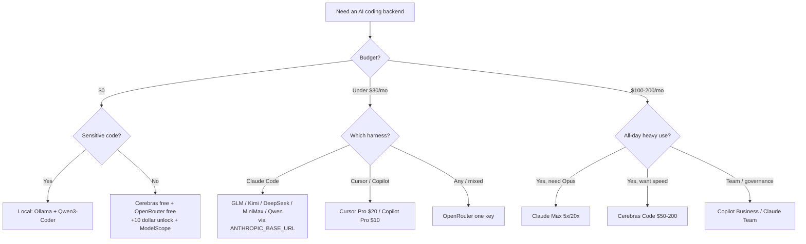

<div align="center">

# 🤖 Awesome AI Coding Subscriptions & APIs

### Suscripciones y APIs de IA para programar — la lista comparada

[](https://awesome.re)
[](LICENSE)
[](CONTRIBUTING.md)

[](https://github.com/lildebil0/awesome-ai-coding-subscriptions/stargazers)

**¿Qué suscripción, plan de programación, API, router o nivel gratuito deberías poner detrás de tu agente de IA para programar?**
Una respuesta curada, medida con benchmarks y enlazada a las fuentes — ordenada por 💵 precio · 🧠 potencia · 🔢 modelos · 📊 límites · 🔌 integración.

[English](../README.md) · [简体中文](README.zh-CN.md) · **Español** · [Русский](README.ru.md) · [日本語](README.ja.md) · [Português](README.pt-BR.md) · [Français](README.fr.md) · [Deutsch](README.de.md) · [한국어](README.ko.md) · [हिन्दी](README.hi.md)

</div>

---

Esta lista cataloga los **planes que pagas** — suscripciones, planes de programación de tarifa plana, APIs de pago por uso, routers y niveles gratuitos — y **no** las herramientas de programación en sí. El harness (Claude Code, Cline, Aider, Roo/Kilo, OpenCode) es gratis. Lo que cuesta dinero es el modelo que hay detrás, así que eso es lo que se clasifica aquí. El harness es solo el *destino de integración*.

Un plan de tarifa plana de $3–30/mes de un laboratorio chino de pesos abiertos (GLM, Kimi, DeepSeek, MiniMax, Qwen, Doubao) apuntado a un harness CLI gratuito te da en torno al 78–80% en SWE-bench por más o menos la décima parte de lo que cuesta una suscripción frontier de $200. Las suscripciones frontier siguen ganando en las tareas más difíciles. Por eso en 2026 la mayoría usa ambos: una suscripción frontier para el razonamiento difícil y un plan barato para todo lo demás.

> ⚠️ **Los precios en este espacio cambian cada mes.** Las cifras reflejan **~junio de 2026**. Confirma siempre en la página oficial antes de comprar. ¿Encontraste un precio desactualizado? [Abre un PR](CONTRIBUTING.md) — las correcciones se valoran tanto como las incorporaciones.

## Leyenda

| Insignia | Significado |
|-------|---------|
| 💎 | **Joya oculta** — poco conocida, cuesta menos de lo que debería para lo que ofrece |
| 🆓 | Tiene un **nivel gratuito** sobre el que realmente puedes correr un agente |
| ✅ | **Precio verificado** contra la fuente oficial (junio de 2026) |
| ⭐ | Valoración de valor (1–5): precio vs. potencia vs. límites vs. integración |
| 🇨🇳 | Alojado en China (advertencia de residencia de datos / latencia para algunos) |
| ⚠️ | Conlleva un riesgo notable (ToS, fiabilidad, longevidad, reventa) |

**Abreviaturas de integración:** `CC-native` = endpoint nativo compatible con Anthropic, un backend de Claude Code listo para usar vía `ANTHROPIC_BASE_URL`. `OpenAI-compat` = funciona en Cline/Roo/Kilo/Aider/Continue/OpenCode cambiando la base-URL (Claude Code necesita un shim/router). `native-only` = bloqueado al propio editor/agente del proveedor, no reutilizable como backend.

## Contenidos

- [Cómo elegir](#cómo-elegir)
- [Elige por presupuesto](#elige-por-presupuesto)
- [Elige por quién eres](#elige-por-quién-eres)
- [TL;DR — mejores opciones por caso de uso](#tldr--mejores-opciones-por-caso-de-uso)
- [Tabla comparativa maestra](#tabla-comparativa-maestra)
- [Suscripciones frontier de primera mano](#suscripciones-frontier-de-primera-mano)
- [Suscripciones de herramientas empaquetadas (editor + modelo)](#suscripciones-de-herramientas-empaquetadas-editor--modelo)
- [Planes de programación de tarifa plana — los campeones de valor 💎](#planes-de-programación-de-tarifa-plana--los-campeones-de-valor-)
- [APIs de pago por uso con buen valor](#apis-de-pago-por-uso-con-buen-valor)
- [Proveedores de velocidad / inferencia rápida](#proveedores-de-velocidad--inferencia-rápida)
- [Routers y gateways](#routers-y-gateways)
- [Más proveedores que vale la pena conocer (2026)](#más-proveedores-que-vale-la-pena-conocer-2026)
- [Niveles gratuitos 🆓](#niveles-gratuitos-)
- [Créditos gratis y programas para estudiantes / startups](#créditos-gratis-y-programas-para-estudiantes--startups)
- [Nicho y especialidad](#nicho-y-especialidad)
- [Constructores de apps y agentes autónomos](#constructores-de-apps-y-agentes-autónomos)
- [Joyas ocultas y proxies de reventa ⚠️](#joyas-ocultas-y-proxies-de-reventa-)
- [Recetas de configuración — conecta un plan barato a tu harness](#recetas-de-configuración--conecta-un-plan-barato-a-tu-harness)
- [Matriz de privacidad y residencia de datos](#matriz-de-privacidad-y-residencia-de-datos)
- [Benchmark por dólar](#benchmark-por-dólar)
- [Trampas de dinero y errores comunes](#trampas-de-dinero-y-errores-comunes)
- [Cronología de precios de 2026](#cronología-de-precios-de-2026)
- [Lo que dice realmente la comunidad](#lo-que-dice-realmente-la-comunidad)
- [Self-host e híbrido (cuando una suscripción no es la respuesta)](#self-host-e-híbrido-cuando-una-suscripción-no-es-la-respuesta)
- [FAQ](#faq)
- [Glosario](#glosario)
- [Cómo se puntúa y se mantiene esta lista](#cómo-se-puntúa-y-se-mantiene-esta-lista)
- [Advertencias y descargo de responsabilidad](#advertencias-y-descargo-de-responsabilidad)
- [Contribuir](#contribuir)
- [Licencia](#licencia)
- [⭐ Historial de estrellas](#-historial-de-estrellas)

---

## Cómo elegir

Puntúa cada plan en cinco ejes:

1. **💵 Precio** — el de etiqueta, y el coste efectivo *real* (ratios de créditos, multiplicadores en horas pico, excedentes).
2. **🧠 Potencia** — calidad del modelo; el nivel de valor se agrupa en torno al ~78–80% de SWE-bench Verified, el frontier en 85–89%.
3. **🔢 Número de modelos** — un plan que multiplexa muchos modelos (Qwen Coding Plan, OpenRouter) protege frente a los cambios bruscos.
4. **📊 Límites** — solicitudes/tokens por ventana de 5h, topes semanales, concurrencia. El coste oculto: un único "prompt" del IDE se abre en abanico a **5–30 llamadas al modelo**, así que los "prompts/5h" anunciados son más blandos de lo que parecen.
5. **🔌 Integración** — ¿expone un **endpoint nativo de Anthropic** (drop-in limpio para Claude Code) o solo OpenAI-compat (necesita un router)? ¿O es native-only (sin reutilización)?

**Atajo de decisión:**

- ¿Quieres el **mejor agente, por el camino más simple** → Claude Pro $20 → Max 5x $100.
- ¿Quieres **más programación por dólar** → un plan de tarifa plana (GLM / MiniMax / Qwen / Kimi) sobre Claude Code.
- ¿Quieres **$0** → Cerebras free + OpenRouter free (+$10 de desbloqueo) + NVIDIA NIM, y escala las tareas difíciles a un modelo de pago.
- ¿Quieres **una sola clave para todo** → OpenRouter.
- ¿Quieres **privacidad (sin alojamiento en China)** → Synthetic.new (EE. UU., sin entrenamiento, borrado a 14 días) o suscripciones de primera mano en EE. UU.



---

## Elige por presupuesto

Olvídate de la parálisis por análisis. Encuentra tu cifra mensual y llévate el stack.

| Presupuesto | Mejor opción | Lo que obtienes | El stack más inteligente |
|---|---|---|---|
| **$0** 🆓 | **GitHub Copilot Free** + **Gemini CLI** | 2.000 autocompletados + 50 solicitudes premium/mes de Copilot; una CLI agéntica generosa de Google | Copilot Free en el IDE para autocompletado, Gemini CLI en la terminal para ejecuciones de agente, [Cursor Hobby](https://cursor.com/pricing) como un tercer cubo de autocompletados Tab gratis |
| **< $10/mes** | **GLM Coding Plan Lite** 💎 ($30/trim ≈ $10/mes) | ~3× el uso de Claude Pro; un [endpoint nativo compatible con Anthropic](https://docs.z.ai/guides/overview/pricing) — encájalo en Claude Code, Cline u OpenCode | GLM Lite como tu driver de Claude Code + apila el nivel gratuito encima para el desbordamiento |
| **~$10/mes** | **GitHub Copilot Pro** ($10) | Autocompletados ilimitados, $10 de AI Credits, modo agente, selector de modelos — pasó a [créditos por uso en junio de 2026](https://github.blog/news-insights/company-news/github-copilot-is-moving-to-usage-based-billing/) | Copilot Pro en el IDE + GLM Lite en la terminal — dos drivers casi-frontier por ~$20 en total |
| **~$20/mes** | **Claude Pro** ($20) *o* **Cursor Pro** ($20) | Pro: Claude Code en terminal/web/escritorio, [Sonnet 4.6 + Opus 4.6](https://claude.com/pricing). Cursor: Tab ilimitado + $20 de uso de agente + Background Agents | Claude Pro (el mejor agente puro) + Copilot Free para autocompletado en línea; o Cursor Pro a secas si vives en un solo editor |
| **~$50/mes** | **Copilot Pro+** ($39) *o* **GLM Pro** ($90/trim ≈ $30) **+ Claude Pro** ($20) | Pro+: $39 en AI Credits + modelos top. La combinación: ~15× el uso de Claude Pro con GLM *más* calidad nativa de Anthropic para lo difícil | GLM Pro para el grindeo de alto volumen, Claude Pro reservado para el razonamiento delicado — el mejor $/rendimiento del tablero |
| **~$100/mes** | **Claude Max 5x** ($100) | 5× el uso de Pro, acceso prioritario a los modelos más nuevos — el punto dulce para devs que tocan los límites de Pro a diario ([plan Max](https://support.claude.com/en/articles/11049741-what-is-the-max-plan)) | Max 5x como caballo de batalla + GLM Lite ($10) como carril barato de desbordamiento cuando quemes el tope de 5x |
| **~$200/mes** | **Claude Max 20x** ($200) *o* **Cursor Ultra** ($200) | Max 20x: 20× Pro, el nivel individual top. [Cursor Ultra](https://cursor.com/pricing): 20× de uso + funciones prioritarias en un IDE completo | Max 20x para usuarios avanzados de terminal; añade Copilot Pro ($10) solo si quieres los modelos de un segundo proveedor por variedad/redundancia |

**Reglas generales**
- **¿Menos de $20 y sensible al precio?** GLM Lite es el mejor dólar en programación ahora mismo — habla la API de Anthropic, así que tu memoria muscular de Claude Code se transfiere.
- **¿Una sola herramienta, todo el día?** Paga la suscripción nativa (Claude Pro, Cursor Pro). No te fragmentes.
- **¿Usuario intensivo diario?** Salta directo a Max 5x — es más barato que apilar dos planes de $50 y mucho menos engorroso.
- **La jugada profesional en cada nivel:** un driver premium para los problemas difíciles + un carril barato/gratis para las ediciones masivas y el autocompletado. Rara vez necesitas dos suscripciones de $20+.

> Precios verificados en junio de 2026. Los planes facturados por trimestre (GLM) se muestran como mensual efectivo. Los planes de Copilot y GitHub pasaron a [AI Credits por uso el 1 de junio de 2026](https://github.blog/news-insights/company-news/github-copilot-is-moving-to-usage-based-billing/) — tu asignación escala con el precio base.


---

## Elige por quién eres

Olvídate de quedarte mirando la matriz. Encuentra tu fila, copia la opción, sigue adelante. Los precios son en USD/mes, niveles individuales salvo que se indique (junio de 2026).

| Eres… | Mejor opción | Por qué te encaja | ~Precio |
|---|---|---|---|
| **Indie hacker en solitario** 💎 | **Claude Pro** + una clave de API de Z.ai/DeepSeek como desbordamiento | Una sola suscripción de $20 cubre Claude Code en terminal; cuando toques el tope de 5 horas en mitad de un sprint, recurre a una API de valor barata en vez de saltar a un nivel de $100 que infrautilizarás. El mejor $/salida para una persona que entrega a diario. | $20 + céntimos |
| **Equipo de ingeniería de startup (2–20)** | **GitHub Copilot Business** | $19/asiento da políticas de organización, filtro de código público, **indemnización por IP** y facturación centralizada — el plan más barato que es seguro poner ante inversores/clientes. Se combina con la suscripción propia de Claude/Cursor de cada dev para el trabajo pesado. [precios](https://github.com/features/copilot/plans) | $19/asiento |
| **Empresa** (gobernanza / SSO / IP) | **Copilot Enterprise** o **Claude Enterprise** | Copilot Enterprise ($39/asiento) añade SSO/SCIM, registros de auditoría, bases de conocimiento indexadas del código y la misma indemnización por IP de Microsoft con filtro. Claude Enterprise (precio por venta) es la alternativa si eres Anthropic-first. Ambos pasan adquisiciones. [Copilot Enterprise](https://docs.github.com/en/copilot/get-started/plans) | $39/asiento → personalizado |
| **Estudiante de informática** 🆓 | **GitHub Copilot (Student)** + ChatGPT Free | Los estudiantes verificados obtienen **Copilot a nivel Pro gratis** (autocompletados ilimitados, modelos premium, asignación mensual de solicitudes premium). Cero gasto, herramientas reales. [planes de Copilot](https://github.com/features/copilot/plans) | $0 |
| **Mantenedor de OSS** 🆓 | **Copilot Pro gratis para OSS** + Claude Pro para el trabajo profundo | Los mantenedores de repos populares califican para Copilot Pro gratis; mantén un Claude Pro de $20 para las refactorizaciones espinosas. La mejor relación bien-público-por-coste. | $0–$20 |
| **Privacidad primero / regulado** 🔒 | **Stack local: Ollama + Qwen3-Coder + Continue.dev** | El código propietario nunca sale de la máquina — sin API, sin cláusula de retención, sin DPA que negociar. Aproximadamente el 70–85% de la calidad de Claude en la nube en trabajo de un solo archivo. Si debes usar la nube, añade un nivel de API de **retención cero**. [configuración](https://medium.com/@rodrigo.estrada/build-a-local-ai-coding-assistant-qwen3-ollama-continue-dev-cee0dbcd172a) | $0 (hardware) |
| **Sin conexión / air-gapped** | **Ollama + Qwen3-Coder-Next** (Continue.dev u OpenCode) | El mismo stack local, pero esta es la *única* categoría que funciona con el cable de red desenchufado. Qwen3-Coder-Next corre ~3B de parámetros activos de un MoE de 80B — cabe en hardware real, sin internet jamás. [modelos](https://localaimaster.com/models/best-local-ai-coding-models) | $0 |
| **Vibe-coder / aficionado** 🆓 | **Muestrario de niveles gratuitos**: ChatGPT Free o Copilot Free + Gemini gratis | Construyes por diversión los fines de semana — no pagues nada. Los 2.000 autocompletados/mes de Copilot Free más un modelo de chat cubren los proyectos paralelos casuales. Sube de nivel solo cuando los límites gratuitos de verdad te aprieten. | $0 |
| **Usuario avanzado corriendo agentes en paralelo** 💎 | **Claude Max 20x** (o apila una API de valor para el fan-out) | Si orquestas enjambres / sesiones paralelas de Claude Code, el techo de uso de 20x es lo que evita que toques los límites a las 2 de la tarde. Más barato que quemar tokens de API equivalentes a este volumen. Añade una clave de DeepSeek/Z.ai para los agentes trabajadores desechables. | $200 |

**Dos reglas generales transversales:**
- El salto de **$20 → $100/$200** solo compensa si *personalmente* tocas los topes de uso más de ~dos veces por semana. La mayoría no — mídelo antes de subir de nivel.
- **La indemnización por IP es una característica del plan, no del modelo.** Empieza en Copilot **Business** y requiere el filtro de código público activado — los niveles gratuito y Pro no la llevan. Si un abogado va a leer tu repo alguna vez, esta es la línea que importa. [detalles](https://github.com/features/copilot/plans)

Fuentes:
- [GitHub Copilot Plans & pricing](https://github.com/features/copilot/plans)
- [Plans for GitHub Copilot — GitHub Docs](https://docs.github.com/en/copilot/get-started/plans)
- [AI Pricing Compared 2026 — AIViewer](https://aiviewer.ai/guides/ai-pricing-comparison-2026/)
- [Build a Local AI Coding Assistant — Qwen3 + Ollama + Continue.dev](https://medium.com/@rodrigo.estrada/build-a-local-ai-coding-assistant-qwen3-ollama-continue-dev-cee0dbcd172a)
- [Best Local AI Coding Models for Ollama (2026)](https://localaimaster.com/models/best-local-ai-coding-models)


---

## TL;DR — mejores opciones por caso de uso

| Caso de uso | Opción | Por qué | ~Precio |
|----------|------|-----|--------|
| 🏆 **Mejor valor general** | **GLM Coding Plan** 💎🇨🇳 | "3× el uso de Claude Max por ~$30/mes"; GLM-5.1 ~94% de la programación de Opus; Claude Code nativo | $10–30/mes |
| 🥇 **Mejor frontier puro** | **Claude Max 5x** | Desbloquea Opus en Claude Code, el agente #1 por consenso | $100/mes |
| 🪙 **Entrada seria más barata** | **GLM Lite** / **Qwen Standard** / **Trae Lite** 💎 | Un backend de programación real desde ~$3–10/mes | $3–10/mes |
| 💸 **Lo más barato por token** | **DeepSeek V4-Flash** 💎 | $0.14/M entrada, $0.0028/M cache-hit, 1M ctx, CC-native | pago por uso |
| 🧪 **Mejor gratuito** | **Cerebras free** 🆓 + **OpenRouter :free** 🆓 | 1M tok/día (rápido) + Qwen3-Coder-480B gratis | $0 |
| ⚡ **Mejor rápido+barato** | **Groq** 💎🆓 / **Cerebras Code** | Endpoint nativo de Anthropic (Groq); ~2000 tok/s de tarifa plana (Cerebras) | gratis / $50/mes |
| 🔀 **Mejor router universal** | **OpenRouter** | 315+ modelos, una clave, skin de Anthropic, sin recargo por token | pago por uso +5,5% |
| 🔒 **Mejor privacidad (alojado en EE. UU.)** | **Synthetic.new** 💎 | Infra en EE. UU., sin entrenamiento, borrado a 14 días, compat dual OpenAI+Anthropic | $20–60/mes |
| 🧰 **Mejor para grandes bases de código** | **Augment Code** ✅ | Context Engine de primera clase para monorepos | $20+/mes |
| 🏢 **Mejor valor para equipos** | **Asiento Premium de Claude Team** 💎 | ≈ uso de Max-5x + SSO/admin | $100/asiento |


---

## Tabla comparativa maestra

Ordenada aproximadamente por valor. Precios ~junio de 2026; **verifica antes de comprar**.

| Plan | Tipo | Precio | Modelos | Límites (programación) | Integración | ⭐ | Notas |
|------|------|-------|--------|-----------------|-------------|----|-------|
| [GLM Coding Plan](#glm-coding-plan--zai-zhipu-ai-) | tarifa plana | $10–30/mes (Lite/Pro, trim) | GLM-5.1/5/4.7 | Lite ~80, Pro ~400 prompts/5h | CC-native | ⭐5 | 💎🇨🇳✅ |
| [DeepSeek API](#deepseek-) | API pago por uso | V4-Pro $0.435/$0.87; Flash $0.14/$0.28 | V4-Pro/Flash | 1M ctx, 500–2500 concur | CC-native | ⭐5 | 💎🇨🇳✅ |
| [MiniMax Coding Plan](#minimax-coding--token-plan-) | tarifa plana | $10–50/mes | M2.7 (plan), M2.5/M3 (API) | Starter ~100, Max ~1000 prompts/5h | CC-native | ⭐5 | 💎🇨🇳 |
| [Kimi Code](#kimi-code--moonshot-ai-) | tarifa plana+API | ~$19/mes + medido | K2.6 (1T) | ~300–1200 llamadas/5h, 30 concur | CC-native | ⭐5 | 💎🇨🇳 |
| [Qwen Cloud Coding Plan](#qwen-cloud-coding-plan--alibaba-) | tarifa plana | Pro $50/mes (Lite $10, cerrado) | Qwen3.5 + Kimi/GLM/MiniMax | Pro 6000 req/5h, 1M ctx | CC-native | ⭐4 | 💎🇨🇳✅ |
| [OpenRouter](#routers-y-gateways) | router | pago por uso, +5,5% recarga | 315+ (todos) | acotado por saldo; modelos gratis 50–1000/día | CC-native skin | ⭐5 | 🆓 |
| [Claude Pro](#anthropic-claude) | primera mano | $20/mes | Sonnet 4.6 (sin Opus) | ~40–45 msg/5h + semanal | CC-native | ⭐5 | mejor entrada |
| [Claude Max 5x](#anthropic-claude) | primera mano | $100/mes | + Opus 4.6/4.7 | ~50–225 prompts/5h | CC-native | ⭐5 | Opus desbloqueado |
| [Cerebras Code](#proveedores-de-velocidad--inferencia-rápida) | velocidad tarifa plana | $50/$200 | GLM-4.7 (~2000 tok/s) | 24M–120M tok/día, 131k ctx | OpenAI-compat | ⭐5 | ✅ a menudo agotado |
| [Synthetic.new](#suscripciones-planas-de-pesos-abiertos-privacidad--alojado-en-ee-uu) | tarifa plana (EE. UU.) | $20–60/mes | 16 de pesos abiertos (GLM/Kimi/Qwen/DS) | ~125–1250 req/5h | CC-native | ⭐5 | 💎🔒 |
| [Chutes](#joyas-ocultas-y-proxies-de-reventa-) | tarifa plana ⚠️ | $3/$10/$20 | GLM-5/Kimi/DS/MiniMax/Qwen | 300/2000/5000 req/día | OpenAI-compat | ⭐5 | 💎⚠️ descentralizado ✅ |
| [Grok Code Fast 1](#nicho-y-especialidad) | API pago por uso | $0.20/$1.50/M | grok-code-fast-1 | 256K ctx, ~92 tok/s | CC-native | ⭐5 | 💎 #1 en OpenRouter |
| [ChatGPT Plus](#openai-chatgpt--codex) | primera mano | $20/mes | GPT-5.x-Codex | medido por crédito de token | Codex-native | ⭐4 | Codex agente #2 |
| [ChatGPT Pro](#openai-chatgpt--codex) | primera mano | $100/$200 (5x/20x) | GPT-5.5-Codex | alto; GPU dedicada | Codex-native | ⭐4 | |
| [Claude Max 20x](#anthropic-claude) | primera mano | $200/mes | Opus 4.6/4.7 | ~200–900 prompts/5h | CC-native | ⭐4 | nivel avanzado |
| [Cursor Pro / Ultra](#cursor) | empaquetado | $20 / $200 | todos los frontier + Auto | pool de uso $20 / $400 | Native-only | ⭐4 | Ultra = ratio de crédito 2× |
| [GitHub Copilot Pro](#github-copilot) | empaquetado | $10/mes | GPT-5/Claude/Gemini | $10 AI-credits (uso) | Native-only (+ACP) | ⭐4 | autocompletados gratis 🆓 |
| [DeepInfra](#proveedores-de-velocidad--inferencia-rápida) | velocidad/API | pago por uso (el OSS más barato) | Kimi/DS/Qwen3-Coder/GLM | acotado por saldo | CC-native | ⭐5 | 💎✅ el host más barato |
| [Groq](#proveedores-de-velocidad--inferencia-rápida) | velocidad/API | pago por uso + gratis | GPT-OSS/Qwen3/Kimi | topes RPM/TPM gratis | CC-native | ⭐4 | 💎🆓 |
| [Vercel AI Gateway](#routers-y-gateways) | router | $0 de recargo (incluso BYOK) | cientos incl. Claude | $5/mes de créditos gratis | CC-native | ⭐4 | 💎🆓✅ |
| [Requesty](#routers-y-gateways) | router | +5% plano | Claude/GPT/Gemini/DS/Qwen | caché semántica ~40% menos | OpenAI-compat | ⭐4 | 💎 gobernanza de equipo |
| [Mistral Le Chat Pro](#nicho-y-especialidad) | primera mano | $14.99/mes ($5.99 estudiante) | Devstral 2 + Vibe CLI | ~25 msg gratis/día | Native-only | ⭐4 | 💎🆓🇪🇺 la suscripción mayor más barata |
| [Augment Code](#suscripciones-de-herramientas-empaquetadas-editor--modelo) | empaquetado | $20–200/mes | Claude/Gemini/GPT | 40k–450k créditos/mes | Native-only | ⭐4 | ✅ mejor contexto en repos grandes |
| [Zed Pro](#suscripciones-de-herramientas-empaquetadas-editor--modelo) | empaquetado | $10/mes | cualquiera (BYO key/ACP) | $5 créditos + uso | ACP + BYOK | ⭐4 | 💎 anti-bloqueo |
| [Cerebras free](#niveles-gratuitos-) | gratis | $0 | Qwen3-Coder-480B, GPT-OSS-120B | 1M tok/día, tope ctx 8K | OpenAI-compat | ⭐5 | 💎🆓 el gratis más rápido |
| [Google AI Studio](#niveles-gratuitos-) | gratis | $0 | Gemini 2.5 Flash, Gemma 3 27B | Flash 250 RPD; Gemma 14.4k RPD | OpenAI-compat | ⭐4 | 🆓 el mayor ctx gratis |


---

## Suscripciones frontier de primera mano

Los planes directos del proveedor. Una suscripción autentica el **propio harness del proveedor** (Claude Code, Codex CLI, Antigravity, Grok Build) vía login — **no** te da una clave de API genérica para herramientas OpenAI-compat de terceros (eso es facturación por token aparte). Excepción: los modelos Grok de xAI son compatibles con OpenAI/Anthropic.

> Orden de preferencia por valor para programación agéntica (consenso de junio de 2026): **Claude > OpenAI Codex > Google Gemini > xAI Grok**. Una prueba independiente de 30 días situó a Claude ~95% frente a ChatGPT ~85% en precisión de programación; el SWE-bench del proveedor tiene GPT-5.5 (88,7%) ≈ Opus 4.7 (87,6%).

### Anthropic (Claude)
- **[Claude Pro](https://claude.com/pricing)** — `$20/mes` ($17 anual). Sonnet 4.6 en Claude Code (**sin Opus**). ~40–45 msg/5h + tope semanal, compartido con chat/Cowork. **El mejor punto de entrada por valor al agente de programación #1.** En abril de 2026 se duplicaron los límites de 5h y se eliminó el throttling en pico. ⭐5
- **[Claude Max 5x](https://support.claude.com/en/articles/11049741-what-is-the-max-plan)** — `$100/mes`. **Desbloquea Opus 4.6/4.7** + 5× de rendimiento (~50–225 prompts/5h). El punto dulce profesional; un nivel medio de $100 que OpenAI/Google no igualan de forma tan útil. ⭐5
- **[Claude Max 20x](https://support.claude.com/en/articles/11049741-what-is-the-max-plan)** — `$200/mes`. ~200–900 prompts/5h. Para agentes en paralelo todo el día; la matemática de **tarifa-plana-le-gana-a-API** es decisiva (90%+ de los tokens de Claude Code son lecturas de caché, gratis en suscripción, facturadas en API — el mes pico de un dev = $5.623 en API ≈ 4,5 años de Max 5x). ⭐4
- **[Asiento Premium de Claude Team](https://claude.com/pricing)** 💎 — `$100/asiento` (anual). ≈ uso de Max-5x **más** SSO/admin/auditoría/búsqueda empresarial. Discretamente el mejor valor de programación *para equipos*; el asiento Standard de $20 también incluye Claude Code. ⭐4

### OpenAI (ChatGPT / Codex)
- **[ChatGPT Plus](https://help.openai.com/en/articles/11369540-using-codex-with-your-chatgpt-plan)** — `$20/mes`. Codex CLI/IDE incluido (GPT-5.5/5.4/5.3-Codex). **Medido por crédito de token** desde abril de 2026 (confuso). Codex = agente #2 por consenso. Los topes de Plus se agotan rápido en trabajo agéntico intenso. ⭐4
- **[ChatGPT Pro](https://developers.openai.com/codex/pricing)** — `$100` (5x) / `$200` (20x). Alto rendimiento + GPU dedicada. Ojo: la promo "boost 10x" del nivel de $100 **expiró el 31 de mayo de 2026** (ahora 5x). El clásico debate "¿vale la pena el plan de $200?" = Claude Max 20x vs. ChatGPT Pro 20x. ⭐4

### Google (Gemini)
- **[Gemini AI Pro / Ultra](https://gemini.google/subscriptions/)** — los créditos de GCP incluidos de Ultra ($40 a $100 / $100 a $200) compensan el coste de forma significativa si usas Google Cloud 💎. ⚠️ **Google va a matar la Gemini CLI de código abierto el 18 de junio de 2026**, forzando la migración a la Antigravity CLI cerrada con cuotas gratuitas mucho menores (~1000 → ~20 req/día) — la mayor queja de la comunidad en 2026.

### xAI (Grok)
- **[SuperGrok](https://x.ai/news/grok-code-fast-1)** — `$10` (Lite) / `$30` / `$300` (Heavy). La Grok Build CLI corre **8 subagentes en paralelo en git worktrees aislados** (novedoso). `grok-code-fast-1` tiene una base de seguidores fiel (barato+rápido) y fue gratis en muchos IDEs asociados. SWE-bench ~70,8% va por detrás de los líderes. **Para programar, compra la [API de xAI](#nicho-y-especialidad), no la suscripción de la app SuperGrok.** ⭐3 💎


---

## Suscripciones de herramientas empaquetadas (editor + modelo)

Aquí el plan *es* el producto — compras el editor/agente del proveedor. La tendencia de 2026: casi todos pasaron de un número fijo de solicitudes a **créditos / medición por token**, haciendo los costes *menos* predecibles (fuerte reacción en contra).

### Cursor
- **[Cursor](https://cursor.com/pricing)** — Hobby gratis · **Pro `$20`** · **Pro+ `$60`** 💎 · **Ultra `$200`**. Desde junio de 2025, el precio de tu plan = un pool de uso a tarifas de API. **El ratio de crédito mejora al subir de nivel**: Pro $20/$20 (1×), Pro+ $60/$70 (1,17×), Ultra $200/$400 (**2×, el mejor**). El modo `Auto` es la clave de valor — prácticamente ilimitado, no drena el pool como sí hace fijar Claude/MAX. ⚠️ El cambio de junio de 2025 causó un [desastre de precios](https://www.wearefounders.uk/cursors-pricing-disaster-the-full-timeline-of-how-an-ai-coding-darling-burned-its-most-loyal-users/) (usuario de HN: "$350 de excedente en una semana"); el CEO se disculpó + reembolsó. **Native-only** — no puede respaldar Claude Code, y desde enero de 2026 tampoco puedes enrutar una suscripción de Claude *hacia dentro* de Cursor. Tab/Apply de primera clase. ⭐4

### GitHub Copilot
- **[GitHub Copilot](https://github.com/features/copilot/plans)** — Free 🆓 · **Pro `$10`** · Pro+ `$39` · Max `$100` · Business `$19` · Enterprise `$39`. ⚠️ **Pasó a AI Credits por uso el 1 de junio de 2026** (1 crédito = $0,01); cada plan incluye un pool de créditos (Pro=$15, Pro+=$70). **Los autocompletados de código siguen ilimitados y gratis** — los usuarios solo de autocompletado no se ven afectados. Reacción severa (TechTimes: las facturas agénticas saltaron 10×–50×). Autocompletados de IDE de primera clase + gobernanza/indemnización por IP para organizaciones. **Native-only** (escape: la Copilot CLI habla ACP). ⭐4

### Otros
- **[Augment Code](https://www.augmentcode.com/pricing)** ✅ — Indie `$20`/40k créditos · Standard `$60` · Max `$200`. **Context Engine de primera clase** para monorepos grandes (encabeza las comparativas de recuperación de contexto). VS Code + JetBrains + Auggie CLI. Native-only. El consumo de créditos en tareas con muchas herramientas es la queja. ⭐4 💎
- **[Zed Pro](https://zed.dev/pricing)** 💎 — Free · **Pro `$10`** (solo +10% de recargo) · Business `$30`. La opción **anti-bloqueo**: el [ACP](https://zed.dev/docs/ai/) abierto impulsa agentes externos (Claude Code, Codex, OpenCode) y BYO keys para cualquier proveedor. El editor nativo más rápido. ⭐4
- **[Kiro](https://kiro.dev/pricing/)** 💎 — Free · **Pro `$20`/1k créditos** · Pro+ `$40` · Power `$200`. El mejor agente **spec-driven** (requisitos→diseño→tareas), línea completa de Claude incl. Opus 4.7, facturación fraccionada de 0,01 créditos. **AWS Startups = 1 año gratis de Pro+.** ⭐4
- **[Trae](https://www.trae.ai/pricing)** 💎🇨🇳 — Free · **Lite `$3`** · Pro `$10` · Ultra `$100`. Fork de VS Code de ByteDance; el pool de uso supera la etiqueta (p. ej. $20 de uso por $10) = "la alternativa a Cursor de $3." ⚠️ Telemetría de ByteDance compartida con afiliadas — rompedor de trato empresarial. ⭐4
- **[Sourcegraph Amp](https://sourcegraph.com/amp)** — Gratis para empezar ($10 de crédito; $40 para ex-Cody). **Consumo** puro (sin mínimo mensual), corre Opus 4.8 en modo "smart". Genial para uso ligero, riesgo de consumo sin tope para uso intenso. Cody Free/Pro fueron retirados hacia Amp. ⭐3
- **[JetBrains AI / Junie](https://www.jetbrains.com/ai-ides/buy/)** — integración de IDE adorada, pero Junie **quema créditos rápido** (los 35 créditos de Ultimate desaparecen en ~4–5 días). Solo si vives en JetBrains.
- **Sobrevalorados / evitar:** **Tabnine** (suelo de $39, sin nivel gratuito, bloqueo anual — solo para necesidades on-prem/air-gap); **Windsurf Pro** (el cambio de marzo de 2026 a cuotas diarias/semanales es el cambio más quejado del año, confianza baja tras Cognition). **Supermaven** está muerto como producto independiente (absorbido en Cursor Tab en noviembre de 2025).


---

## Planes de programación de tarifa plana — los campeones de valor 💎

Planes fijos mensuales o trimestrales que ponen un modelo de pesos abiertos casi-frontier detrás de tu harness, en su mayoría de laboratorios chinos. La mayoría expone un endpoint nativo de Anthropic, así que encajan en Claude Code vía `ANTHROPIC_BASE_URL`. Para la lista de endpoints, ver [Alorse/cc-compatible-models](https://github.com/Alorse/cc-compatible-models).

> Orden de preferencia por consenso: **GLM** (entrada más barata, valor por defecto de la comunidad) · **MiniMax** (mejor precio/volumen) · **Kimi** (mejor agente de largo horizonte) · **Qwen** (>262K de contexto, multimodelo). Claude Pro $20 es el referente de calidad al que subcotizan.

<a name="glm-coding-plan--zai-zhipu-ai-"></a>
### GLM Coding Plan — Z.ai (Zhipu AI) 💎🇨🇳 ✅
- `Lite ~$10/mes ($30/trim)` · `Pro ~$30/mes ($90/trim)` · `Max ~$80/mes ($240/trim)`. Promo Q2-2026: $27/$81/$216/trim. (La viral promo de **$3/mes** terminó el 11 de febrero de 2026; el Lite anual a ~$7/mes es la ruta barata que queda.)
- Modelos: **GLM-5.1** (~94% de la programación de Opus 4.6), GLM-5/5-Turbo, GLM-4.7, GLM-4.5-Air.
- Límites: Lite ~80, Pro ~400, Max ~1.600 prompts/5h + semanal. ⚠️ **Multiplicador 3× en horas pico** (14:00–18:00 UTC+8) en GLM-5/5.1 que reduce discretamente el rendimiento a la mitad.
- Integración: `ANTHROPIC_BASE_URL=https://api.z.ai/api/anthropic` — soporte oficial de Claude Code + Cline/Roo/Kilo/OpenCode (20+ herramientas). **De primera mano** = sin riesgo de baneo por reventa.
- > *El plan de programación económico más recomendado de 2026.* "3× el uso de Claude Max por ~$30/mes." Hubo reacción en contra por la subida de precio de febrero + el recorte de ⅓ de cuota, aun así sigue valorado como el mejor valor. ⭐5
- Fuentes: [z.ai/subscribe](https://z.ai/subscribe) · [precios](https://docs.z.ai/guides/overview/pricing) · [reseña de GLM-5.1](https://serenitiesai.com/articles/glm-5-1-coding-plan-review-2026)

<a name="minimax-coding--token-plan-"></a>
### MiniMax Coding / Token Plan 💎🇨🇳
- `Starter $10/mes` · `Plus $20` · `Max $50` (2 meses gratis en anual); variantes High-Speed $40–150.
- Modelos: M2.7 / M2.7-Highspeed en el plan; **M2.5/M3** (1M ctx) vía API. ⚠️ **El plan a menudo sirve un modelo más antiguo** (M2.1) que el M2.5/M2.7 medido.
- Límites: Starter ~100 → Max ~1.000 prompts/5h; ~50 TPS (100 en high-speed).
- Integración: `ANTHROPIC_BASE_URL=https://api.minimax.io/anthropic` + OpenAI-compat.
- > "Reduje a la mitad mi factura de Claude Code." **El mejor precio/volumen puro** del cubo de tarifa plana; M2.7 ~94% de GLM-5.1 a ~1/5 del coste de entrada. ⭐5
- Fuentes: [coding plan](https://platform.minimax.io/subscribe/coding-plan) · [precios de M2.5](https://www.verdent.ai/guides/minimax-m2-5-pricing)

<a name="kimi-code--moonshot-ai-"></a>
### Kimi Code — Moonshot AI 💎🇨🇳
- `~$19/mes de membresía` + API medida (K2.6 $0.60–0.95/M entrada, $2.50–4.00/M salida, 75% de descuento por caché). Por niveles Moderato/Allegretto/Vivace.
- Modelos: **Kimi K2.6** (1T MoE, ~80,2% SWE-bench), K2.5.
- Límites: ~300–1.200 llamadas/5h, **30 concurrentes** (generoso para agentes en paralelo).
- Integración: `ANTHROPIC_BASE_URL=https://api.moonshot.ai/anthropic` — drop-in real de Claude Code; trae su propia Kimi CLI (6.4k★).
- > **La mejor estabilidad de agente a largo horizonte** (4.000+ llamadas de herramienta sostenidas en una sesión de 13 horas). "Ahorrando un 88% en costes de programación." El más caro del lado de entrada del grupo abierto. ⭐5
- Fuentes: [soporte de agentes](https://platform.kimi.ai/docs/guide/agent-support) · [guía de Kimi Code](https://www.nxcode.io/resources/news/kimi-code-2026-plans-pricing-developer-guide)

<a name="qwen-cloud-coding-plan--alibaba-"></a>
### Qwen Cloud Coding Plan — Alibaba 💎🇨🇳 ✅
- `Pro $50/mes` (Lite ~$10 **cerrado a nuevas suscripciones** desde el 20 de marzo de 2026).
- Modelos: Qwen3.5-Plus, Qwen3-Coder-Next/Plus/480B + **Kimi/GLM/MiniMax** entre modelos bajo una clave. **Contexto de 1M de tokens** (el mejor del carril).
- Límites: Pro 6.000 req/5h + 45k/sem + 90k/mes (ventana deslizante). Clave dedicada `sk-sp-` (no intercambiable con pago por uso).
- Integración: `ANTHROPIC_BASE_URL=https://coding-intl.dashscope.aliyuncs.com/apps/anthropic` + Qwen Code CLI.
- > Lo destacable = **un plan multiplexa Qwen+Kimi+GLM+MiniMax** y es el único plan plano creíble de 1M de contexto. ⭐4
- Fuentes: [plan de programación de Model Studio](https://www.alibabacloud.com/help/en/model-studio/coding-plan)

<a name="suscripciones-planas-de-pesos-abiertos-privacidad--alojado-en-ee-uu"></a>
### Suscripciones planas de pesos abiertos (privacidad / alojado en EE. UU.)
- **[Synthetic.new](https://synthetic.new/pricing)** 💎🔒 — `$20–60/mes`. ~16 modelos de pesos abiertos siempre activos (Kimi/GLM/Qwen3-Coder-480B/DeepSeek). **Infra en EE. UU., sin entrenamiento, borrado a 14 días.** **Compat dual OpenAI + Anthropic** = drop-in genuino de Claude Code. La alternativa consciente de la privacidad a los planes chinos. ⭐5
- **[Cerebras Code](#proveedores-de-velocidad--inferencia-rápida)** — `$50`/`$200`, velocidad de tarifa plana (ver [Velocidad](#proveedores-de-velocidad--inferencia-rápida)).
- **[OpenCode Go (Zen)](https://opencode.ai/go)** 💎 — `$5` el primer mes, luego `$10/mes` plano. ~12–14 modelos chinos de pesos abiertos (GLM-5.1/Kimi/Qwen3.7/DeepSeek V4/MiniMax). De primera clase en OpenCode. Sin Claude/GPT. ⭐4

<a name="planes-planos-de-nicho--económicos-"></a>
### Planes planos de nicho / económicos 🇨🇳
- **[StepFun Step Plan](https://github.com/Alorse/cc-compatible-models)** — `$6.99`–`$99/mes`, 100–5.000 prompts/5h, CC-native. Subcotizador de precio, modelos menos probados en batalla. ⭐3
- **MiMo (Xiaomi)** — `$6`–`$100/mes` basado en créditos (60M–1.6B), CC-native (`api.xiaomimimo.com`), incl. el multimodal Omni. Apenas medido en benchmarks. ⭐3
- **Atlas Cloud** 💎 — `$10`/`$20`, 800k–1.8M créditos/**día**, OpenAI-compat (Claude Code/Codex/OpenCode). Modelo de crédito diario para agentes autónomos. ⭐4
- **Factory Droid** 💎 — desde `$20/mes` basado en tokens, modelos frontier (Claude/GPT/Gemini), ventanas móviles de 5h/7d/30d. Notable la historia de "cancelé dos planes Max de $200 por Droid". ⭐4


---

## APIs de pago por uso con buen valor

Acceso por token de los laboratorios de valor. **El precio de la caché es el verdadero motor del coste** para los bucles de agente — diseña para aciertos de caché por encima del precio de entrada de etiqueta.

<a name="deepseek-"></a>
### DeepSeek 💎🇨🇳 ✅
- **V4-Pro** `$0.435/M entrada · $0.0036/M cache-hit · $0.87/M salida` (el **recorte del 75% ya es permanente**). **V4-Flash** `$0.14 / $0.0028 / $0.28`. 1M de contexto, 384K de salida máx.
- Integración: OpenAI-compat **+ Anthropic nativo** (`https://api.deepseek.com/anthropic`) — drop-in de Claude Code (`ANTHROPIC_MODEL=deepseek-v4-pro[1m]`).
- > **El campeón de coste por token.** V4-Pro ~80,6% SWE-bench / 93,5% LiveCodeBench por <$1/M de salida. El cache-hit de $0.0028/M de V4-Flash es imbatible para bucles masivos. ⭐5
- Fuentes: [precios](https://api-docs.deepseek.com/quick_start/pricing) · [configuración de Claude Code](https://api-docs.deepseek.com/quick_start/agent_integrations/claude_code)

### Otros
- **[Alibaba Qwen3-Coder API](https://www.alibabacloud.com/help/en/model-studio/model-pricing)** 🇨🇳 — 480B `$0.22/$1.00`, Flash `$0.195/$0.975`, 30B-A3B `$0.07/$0.27`. **1M de tokens gratis / 90 días** (Intl). CC-native. El programador agéntico de pesos abiertos más fuerte. Usa claves de la región de Singapur. ⭐4
- **[Moonshot Kimi API](https://platform.kimi.ai/docs/pricing)** 🇨🇳 — K2.6 `$0.95/$4.00` ($0.16 en caché), K2.5 `$0.60/$3.00`. CC-native. Excelente tool-calling; el precio de salida es la queja. Un depósito de $10 elimina el tope diario. ⭐4
- **[Zhipu GLM API](https://docs.z.ai/guides/overview/pricing)** 🇨🇳 — GLM-5.1 `$1.40/$4.40`, GLM-4.7 `$0.60/$2.20`, FlashX `$0.07/$0.40`. CC-native. La mayoría de los entusiastas compran el [Coding Plan](#glm-coding-plan--zai-zhipu-ai-) más barato en su lugar. ⭐4
- **[MiniMax API](https://platform.minimax.io/docs/guides/pricing-paygo)** 🇨🇳 ✅ — M3 `$0.30/$1.20` ($0.06 caché, **escrituras de caché gratis**), M2.5 ~`$0.15/$1.15`. "20× más barato que Opus." Compat de Anthropic de primera mano. ⭐4


---

## Proveedores de velocidad / inferencia rápida

Hosts por token de modelos de pesos abiertos, optimizados para el rendimiento. **Groq es el único con un endpoint nativo de Anthropic** (el drop-in más limpio de Claude Code); el resto son OpenAI-compat (necesitan un shim/router para CC, nativos en Cline/Roo/OpenCode).

<a name="deepinfra"></a>
- **[DeepInfra](https://deepinfra.com/pricing)** 💎 ✅ — **el campeón más barato por token.** DeepSeek V3.2 ~$0.26/$0.38, Kimi K2.6 $0.75/$3.50, Qwen3-Coder-480B $0.30/$1.00. 90+ modelos, descuentos en caché, **endpoint nativo de Anthropic**, sin coste inicial. Velocidad buena pero no de élite. ⭐5
<a name="groq"></a>
- **[Groq](https://groq.com/pricing)** 💎🆓 — velocidad LPU (GPT-OSS-20B ~860 tok/s). GPT-OSS-120B `$0.15/$0.60`, Kimi K2 `$1.00/$3.00`. **Anthropic nativo + OpenAI compat** + nivel gratuito real. Batch+caché apilan hasta ~25%. Sin Qwen3-Coder-480B (el techo es Qwen3-32B). ⭐4
<a name="cerebras"></a>
- **[Cerebras](https://www.cerebras.ai/pricing)** ✅ — **el más rápido** (~2.000–3.000 tok/s). **Code Pro `$50`** (24M tok/día) / **Max `$200`** (120M tok/día), GLM-4.7, 131k ctx. Pago por uso GPT-OSS-120B `$0.35/$0.75`. ⚠️ Frecuentemente **agotado**; los 131k ctx (la mitad del nativo) + el alto TTFT embotan la velocidad en los bucles de agente. ⭐5 tarifa plana / ⭐4 pago por uso
- **[Together AI](https://www.together.ai/pricing)** — el catálogo más amplio (Qwen3-Coder-480B, Kimi, DeepSeek V4 Pro $2.10/$4.40 con $0.20 en caché). Precio medio, ~89 tok/s. ⭐4
- **[Fireworks AI](https://fireworks.ai/pricing)** — orientación a producción/empresa, caché agresiva ($0.15/M), DeepSeek V4-Flash $0.14/$0.28, ruta de Azure Foundry. ⭐4
- **[Novita](https://novita.ai/pricing)** 💎 — aloja toda la familia Qwen3-Coder a precios cercanos a DeepInfra; ruta de OpenRouter poco conocida. ⭐4
- **[Hyperbolic](https://docs.hyperbolic.xyz/docs/hyperbolic-ai-inference-pricing)** 💎 — GPT-OSS-20B `$0.10/M` mezclado (entre los más baratos de cualquier sitio); aloja Qwen3-Coder-480B (FP8). ~13 modelos. ⭐3
- **SambaNova** — excepcionalmente rápido en modelos gigantes de 671B/405B; gratis para siempre + $5 de crédito 🆓 pero tope de 50 req/día = solo para evaluación.


---

## Routers y gateways

Una clave para muchos proveedores. Elige un router como tu **capa de acceso por defecto**.

<a name="openrouter"></a>
- **[OpenRouter](https://openrouter.ai/pricing)** 🆓 — **el valor por defecto por consenso.** 315+ modelos, una clave, **"skin" compat de Anthropic** (`ANTHROPIC_BASE_URL=https://openrouter.ai/api` = drop-in real de Claude Code), **sin recargo en el precio del token** (solo +5,5% en las recargas), ZDR gratis + topes de gasto, BYOK generoso (1M req gratis/mes). Modelos gratis (Qwen3-Coder-480B, DeepSeek, Llama 4): 50 RPD → **1000 RPD para siempre tras un depósito único de $10**. La comisión del 5,5% solo escuece por encima de ~$5k/mes de gasto. ⭐5
<a name="requesty"></a>
- **[Requesty](https://www.requesty.ai/)** 💎 — **recargo plano del 5%**, todas las funciones incl. **caché semántica** (~40% de ahorro, supera a las cachés solo-idénticas) + enrutamiento inteligente por solicitud + **políticas de modelo por agente** (modelo distinto por rol de clasificador/sintetizador) + SOC 2 Type II. La opción de gobernanza de equipo. OpenAI-compat. ⭐4
<a name="vercel-ai-gateway"></a>
- **[Vercel AI Gateway](https://vercel.com/docs/ai-gateway/pricing)** 💎🆓 ✅ — **recargo cero, incluso en BYOK.** Compat nativa de Anthropic (`https://ai-gateway.vercel.sh`) = Claude Code directo + Claude Agent SDK + "Claude Code Max via Gateway". $5/mes de créditos gratis que se renuevan indefinidamente (se detiene una vez recargas). La mejor opción puramente económica, especialmente en el ecosistema de Vercel. ⭐4
- **[Helicone Gateway](https://helicone.ai/pricing)** 🆓 — observabilidad primero (registro/trazado/coste automáticos), recargo cero, 10k req/mes gratis; suscripciones $79/$799. ⭐3
- **[CometAPI](https://www.cometapi.com/)** — 500+ modelos incl. los propietarios más recientes, ~20–40% por debajo del oficial, **compat dual OpenAI+Anthropic**. Riesgo de intermediario de crédito prepago. ⭐4
- **[ElectronHub](https://www.electronhub.ai/pricing)** — 600+ modelos, los créditos semanales pueden superar el coste en efectivo; 5–10 RPM ajustados en los niveles baratos, advertencia de confianza de revendedor. ⭐3
- **[LiteLLM](https://docs.litellm.ai/)** — el estándar OSS de **self-host** (gratis, sin recargo) — ver [trucos de integración](#recetas-de-configuración--conecta-un-plan-barato-a-tu-harness). Infra DIY, no llave en mano. ⭐4


---

## Más proveedores que vale la pena conocer (2026)

Entradas genuinamente útiles que no encabezan las secciones principales pero llenan huecos reales — laboratorios y agregadores chinos extra, herramientas de programación occidentales y routers más allá de OpenRouter. Agrupados y plegados para mantener la lista escaneable.

<details>
<summary><b>🇨🇳 Agregadores y laboratorios chinos</b> (tokens baratos, varios con endpoints nativos de Anthropic)</summary>

- **[SiliconFlow](https://www.siliconflow.com/pricing)** 💎 — uno de los mayores routers MaaS independientes de China, 200+ modelos, **endpoint nativo de Anthropic** (raro) así que Claude Code apunta directo a DeepSeek/Qwen/GLM/Kimi baratos. Endpoints Intl (.com) + China (.cn). DeepSeek-V4-Flash ~$0.14/$0.28.
- **[PPIO](https://ppio.com/llm-api)** 💎 — router con precio en CNY sobre su **propia nube de GPU**; Qwen3-Coder-Next ≈¥1.4/¥10.5, DeepSeek-V4-Flash ¥1/¥2 — entre los precios de token más bajos de cualquier sitio. OpenAI-compat (bridge para Claude Code).
- **[Volcengine Ark / BytePlus](https://www.volcengine.com/docs/82379/1949118)** 💎 (Doubao de ByteDance) — **Doubao Coding Plan** plano: Lite **$10**/Pro **$50** vía BytePlus (la marca pagable con tarjeta extranjera). **Doubao-Seed-Code** es nativamente compatible con Anthropic y se acerca a Claude Sonnet en programación; incluye un agente "ArkClaw" estilo Claude Code. Suelo de la API de Doubao: `doubao-seed-1.6-flash` $0.022/M entrada.
- **[Alibaba Bailian multi-model Coding Plan](https://www.alibabacloud.com/help/en/model-studio/coding-plan)** 💎 — **$50/mes Pro** que multiplexa **Qwen3-Coder + Kimi-K2.5 + GLM-5 + MiniMax-M2.5** bajo una suscripción, con un **endpoint nativo de Anthropic** + región de Singapur (sin ID chino). ⚠️ necesita una clave dedicada `sk-sp-` — una clave normal factura silenciosamente 5× el PAYG.
- **[ModelScope](https://modelscope.cn/)** 🆓💎 (Alibaba) — **2.000 llamadas de API gratis/día, sin tarjeta**, incl. Qwen3-Coder-480B. La forma de facto de $0 de correr un programador chino frontier en un bucle de agente después de que cerrara el nivel gratuito OAuth de Qwen.
- **[AiHubMix](https://docs.aihubmix.com/en)** 💎 — router unificado con base en China que expone endpoints compatibles con OpenAI, Gemini **y Anthropic** con documentación de Claude Code de primera clase; una sola clave para DeepSeek/Qwen/GLM/Kimi y Claude reenviado.
- **[302.AI](https://302.ai/)** 💎 — prepago, **sin throttling de TPM** (bueno para agentes a ráfagas), un saldo único para Kimi/Qwen/DeepSeek + GPT/Claude, opción de despliegue privado.
- **Completitud de grandes laboratorios:** **[Baidu ERNIE](https://pricepertoken.com/pricing-page/model/baidu-ernie-4.5-21b-a3b)** (Qianfan; ERNIE 4.5 21B-A3B $0.07/$0.28), **[Tencent Hunyuan](https://pricepertoken.com/pricing-page/provider/tencent)** (HY3 Preview ~$0.063/$0.21 — pero Tencent ha *subido* algunos precios), **[iFlytek Spark](https://lobehub.com/docs/usage/providers/spark)** (nivel Lite gratis + Spark Code dedicado), **[SenseNova](https://www.sensetime.com/en)** (MoE multimodal barato). Todos OpenAI-compat; bridge necesario para Claude Code; la mayoría necesita ID chino para registro directo (alcanzables vía relays/302.AI).
- ⚠️ **Relays directos de China** (tipo Yunwu, SSSAiCode) revenden Claude/GPT frontier barato sin VPN — convenientes dentro de China, pero conllevan el [riesgo de proxy de reventa](#joyas-ocultas-y-proxies-de-reventa-) estándar. Trátalos como una hot wallet.

</details>

<details>
<summary><b>🛠️ Herramientas de programación occidentales con suscripción</b></summary>

- **[Refact.ai](https://refact.ai/)** 💎 — **$10/mes**, la suscripción de programación agéntica más barata; código abierto, **agente autónomo totalmente self-hosteable** con fine-tuning on-prem y cero telemetría. Nivel gratuito = 5.000 monedas/mes + autocompletados ilimitados.
- **[Pieces for Developers](https://pieces.app/)** 💎 — Pro **$14.17/mes anual** = Opus 4 / GPT-5 / Gemini 2.5 ilimitados en el IDE (más barato que un único asiento de Claude Pro). El diferenciador es una **capa de memoria/contexto** a largo plazo entre todas tus herramientas, no la generación de código. El nivel gratuito corre modelos locales ilimitados.
- **[Continue](https://www.continue.dev/pricing)** 💎 — agente de IDE de código abierto + el escaparate de modelos **Continue Hub**: modelos frontier a **$3/M tokens**, Team **$20/asiento** (+$10 de créditos) con config/gobernanza compartidas. También BYOK.
- **[Cline](https://cline.bot/pricing)** — el agente OSS de referencia; **BYOK sin recargo** (30+ proveedores), gasto real típico $25–70/mes. Plan Teams: primeros **10 asientos gratis para siempre**, luego $20/asiento.
- **[Kilo Code](https://kilo.ai/)** — el **sucesor activamente mantenido de Roo Code** (archivado el 15 de mayo de 2026). BYOK sin recargo entre 500+ modelos; **Kilo Pass** opcional de créditos prepago con un bonus anual del +50%.
- **[Goose](https://github.com/aaif-goose/goose)** 💎 (Block / Linux Foundation) — agente OSS gratuito que puede **montar tu suscripción existente de Claude Max / ChatGPT / Copilot** vía proveedores de SDK para inferencia de tarifa plana — el mismo patrón de puente BYO-suscripción que `copilot-api` / `claude-code-router`.
- **[Zencoder](https://zencoder.ai/pricing)** — agente empresarial SOC2, orquestación multiagente, "todas las funciones en cada nivel"; Pro $45/asiento (30k créditos) → Pro Max $195 (180k).
- **[Tabby](https://www.tabbyml.com/pricing)** 💎 — el principal servidor de autocompletado/chat **de código abierto self-hosteable** (gratis, ~$5–15/mes de GPU); Cloud Team $24/asiento; nuevo agente autónomo **Pochi**. Endpoint OpenAI-compat usable desde cualquier harness.

</details>

<details>
<summary><b>🔀 Más routers y gateways</b></summary>

- **[Portkey](https://portkey.ai/pricing)** 💎 — el router más de grado producción que falta en la mayoría de las listas: **guardrails, claves virtuales, topes de presupuesto** integrados (promocionado para limitar el gasto agéntico desbocado), compat OpenAI **y Anthropic**, gateway **de código abierto self-hosteable**. 10K logs/mes gratis; Pro desde $49.
- **[Cloudflare AI Gateway](https://developers.cloudflare.com/ai-gateway/)** 💎 — proxy universal de coste casi cero (caché/analítica/fallback, **sin recargo por token**); 100K logs/mes gratis. La asociación con xAI Grok de junio de 2026 + la facturación unificada lo convierten en un plano de control de una sola factura. El passthrough de Anthropic funciona para Claude Code.
- **[Poe API](https://creator.poe.com/)** 💎 (Quora) — una suscripción de chat de consumidor cuyos **puntos de cómputo sirven a la vez como API de programación multiproveedor**: un plan de **$19.99/mes** abarca Claude + GPT-5.x + Gemini, a menudo un 10–30% por debajo del directo. Compatible con OpenAI **y Anthropic**.
- **[Glama](https://glama.ai/ai/gateway)** 💎 — gateway OpenAI-compat **más el mayor registro/host de servidores MCP** — singularmente relevante cuando los servidores de herramientas MCP importan tanto como el acceso al modelo. Suscripción con créditos incluidos.
- **[Unify](https://unify.ai/)** 💎 — un "Neural Router" **predictivo de calidad** que puntúa la calidad de salida esperada *antes* de la llamada y alcanza objetivos de coste/latencia; $100 de créditos gratis; BYOK vía claves virtuales.
- **[Martian](https://withmartian.com/)** — router dedicado de **coste/calidad por solicitud** con perillas de coste máximo y disposición a pagar (afirma 20–97% de ahorro); Free 2.500 req, Developer $20/mes.
- **[Braintrust Gateway](https://www.braintrust.dev/)** 💎 — acopla enrutamiento con **eval + trazado + caché**; compat OpenAI/Anthropic; beta gratuita generosa.
- **[APIpie](https://apipie.ai/)** 💎 — un meta-router (agrega OpenRouter/EdenAI/DeepInfra) con una clave, 148 modelos de programación, más búsqueda web + memoria de chat incluidas.
- **[AIMLAPI](https://aimlapi.com/)** — 500+ modelos, compat OpenAI + Anthropic, hasta ~80% por debajo del directo. **[Eden AI](https://www.edenai.co/pricing)** — amigable con BYOK, ~5,5% de comisión de plataforma, sandbox gratuito. **[TrueFoundry](https://www.truefoundry.com/ai-gateway)** (desde $499/mes) y **[Kong AI Gateway](https://konghq.com/products/kong-ai-gateway)** (OSS gratis / Konnect en la nube) — las opciones empresariales self-hosteables, de gobernanza on-prem.

</details>


---

## Niveles gratuitos 🆓

Acceso de $0 sobre el que puedes correr un bucle de agente real, clasificado por lo que la comunidad reporta que funciona (junio de 2026):

1. **[Cerebras free](https://inference-docs.cerebras.ai/support/rate-limits)** 💎 — **1M de tokens/día, sin tarjeta, el más rápido** (2000+ tok/s), Qwen3-Coder-480B + GPT-OSS-120B. ⚠️ El **tope de contexto de 8K** mata el trabajo sobre todo el repo. ⭐5
2. **[Google AI Studio](https://ai.google.dev/gemini-api/docs/rate-limits)** — **el mayor contexto gratis** (Flash hasta 1M) + Gemma 3 27B a **14.400 RPD**. ⚠️ Gemini 2.5 Pro ya no es gratis (~abril de 2026); límites recortados en diciembre de 2025; los datos gratuitos se usan para entrenamiento. ⭐4
3. **[OpenRouter :free](https://openrouter.ai/models?max_price=0)** — el mejor modelo de programación gratis (Qwen3-Coder-480B) + DeepSeek/Llama/GLM, una clave. **Gasta el $10 único → 1000 RPD para siempre** (50 RPD si no). ⭐4
4. **[Groq free](https://console.groq.com/docs/rate-limits)** 💎 — los bucles más rápidos de prompts pequeños; ⚠️ tope de 6.000 TPM = muchos pasos pequeños, no contexto grande. ⭐4
5. **[NVIDIA NIM](https://build.nvidia.com/)** 💎 — 1.000–5.000 créditos, **sin tarjeta/sin caducidad**, 40 RPM, modelos abiertos frontier (MiniMax M2.x, Qwen3-Coder-480B, GLM-5, Kimi K2.5). Nivel de evaluación (acotado por créditos). ⭐4
6. **Mistral Experiment** — 1B tokens/mes (!), ~1 req/seg + opt-in de entrenamiento.
- **Solo para prototipado:** GitHub Models (50 RPD), Cloudflare Workers AI, Together ($1 por defecto).
- **Estrategia gratuita duradera:** enruta el 60–80% del tráfico del agente a Qwen3-Coder/GPT-OSS/DeepSeek gratis (Cerebras + OpenRouter+$10 + NVIDIA NIM), luego escala el 20% difícil a un modelo frontier de pago. ⚠️ Las cuotas gratuitas se apretaron mucho a lo largo de 2025–2026, así que asume que cualquiera de ellas puede encogerse sin previo aviso.


---

## Créditos gratis y programas para estudiantes / startups

A menudo el "plan" más barato es uno para el que calificas. Estudiantes, mantenedores de OSS y startups financiadas pueden conseguir de meses a años de acceso frontier por $0 — créditos que financian Claude Code, Codex o cualquier agente vía la API subyacente.

### Estudiantes 🎓

- **[GitHub Student Developer Pack](https://education.github.com/pack)** + **Copilot Student** 🆓 — autocompletados ilimitados + asignación de AI-credits + 20 herramientas asociadas (incl. JetBrains). ⚠️ Desde marzo de 2026 es un plan dedicado "Copilot Student" (no Pro gratis), y **los nuevos registros se pausaron el 20 de abril de 2026** — los titulares existentes conservan el acceso. Verifica con un correo `.edu`.
- **[Cursor for Students](https://cursor.com/students)** — **1 año gratis de Cursor Pro** (~$240) vía verificación `.edu` de SheerID. ⚠️ se renueva automáticamente a $20/mes tras el año.
- **[JetBrains for students](https://www.jetbrains.com/academy/student-pack/)** — All Products Pack gratis + una prueba de JetBrains-AI; OpenAI ahora siembra créditos de Codex gratis a los usuarios de JetBrains.
- **[Mistral Le Chat Pro — tarifa estudiante](https://mistral.ai/pricing/)** 💎 — ~**$7/mes** (vs $14.99), el plan estudiante más barato entre los laboratorios frontier occidentales.

### Mantenedores de código abierto 🌱

- **[OpenAI Codex for Open Source](https://openai.com/form/codex-for-oss/)** 💎 — **6 meses de ChatGPT Pro + Codex gratis** (~$1.200 de valor) + créditos de API, de un fondo de $1M. Sin mínimo de estrellas; abierto incluso a mantenedores que usan OpenCode/Cline.
- **GitHub Copilot Pro — gratis para OSS** — los mantenedores de repos populares califican para Copilot Pro gratis.
- **[JetBrains free for OSS](https://www.jetbrains.com/community/opensource/)** — All Products Pack para proyectos establecidos (renovable).

### Startups financiadas 🚀

- **[Anthropic — Claude for Startups](https://claude.com/programs/startups)** — **$25K–$100K+** en créditos de la API de Claude (12 meses); financia Claude Code a tarifas de API.
- **[Google for Startups — AI tier](https://cloud.google.com/startup/ai)** — hasta **$350K** en créditos de GCP/Vertex en 2 años; Vertex incluye **tanto Gemini como Claude**.
- **[AWS Activate](https://aws.amazon.com/startups/credits/)** — hasta **$200K**; ahora canjeable contra **Bedrock Claude**, así que subvenciona Claude-Code-sobre-Bedrock.
- **[Microsoft for Startups Founders Hub](https://www.microsoft.com/en-us/startups)** — hasta **$150K** en créditos de Azure, con un **nivel de entrada sin VC** (autofinanciados/en solitario bienvenidos); GPT-5.x vía Azure OpenAI.
- **[AWS Kiro Pro+ for Startups](https://kiro.dev/startups/)** — un **año completo gratis de Kiro Pro+** (ventana de solicitud reabierta del 7 de abril al 30 de junio de 2026; excluye a los miembros actuales de Activate).
- **[NVIDIA Inception](https://www.nvidia.com/en-us/startups/)** — cualquier etapa, sin fecha límite: descuentos de GPU, tiempo en DGX Cloud, hasta $100K en créditos de nube de socios.
- **[Baseten AI Startup Program](https://www.baseten.co/startup-program/)** 💎 — hasta **$25K** para self-hostear un modelo de programación de pesos abiertos en inferencia dedicada.

### Grifos siempre gratuitos 🆓

- **[ModelScope](https://modelscope.cn/)** — 2.000 llamadas gratis/día (Qwen3-Coder-480B), sin tarjeta.
- **[NVIDIA Build](https://build.nvidia.com/)** — hasta 5.000 créditos gratis, 100+ modelos, OpenAI-compat.
- **[Cloudflare Workers AI](https://developers.cloudflare.com/workers-ai/platform/pricing/)** — **10.000 Neurons/día** gratis para siempre de inferencia de pesos abiertos (solo modelos alojados por Cloudflare).
- Además la sección de [Niveles gratuitos](#niveles-gratuitos-): Cerebras (1M tok/día), Google AI Studio, OpenRouter `:free`, Groq.

> La mayoría de los créditos de startup requieren una solicitud y (a menudo) financiación institucional. Lee la elegibilidad antes de contar con ellos — y recuerda que los créditos caducan (típicamente 12–24 meses).


---

## Nicho y especialidad

- **[xAI Grok Code Fast 1 (API)](https://x.ai/news/grok-code-fast-1)** 💎 — `$0.20/$1.50/M` ($0.02 en caché), 256K ctx, **compat OpenAI + Anthropic**. **#1 por uso en OpenRouter.** Rápido y barato lo suficiente para trabajo de implementación rutinario. $25 de créditos gratis al registrarse; hasta $175/mes vía compartición de datos. ⚠️ Sobre-edita sin un alcance ajustado, así que escala el razonamiento difícil a otro sitio. ⭐5
- **[Mistral Le Chat Pro / Vibe](https://mistral.ai/pricing/)** 💎🆓🇪🇺 — `$14.99/mes` (**$5.99 estudiante**). **La suscripción de programación mayor más barata**, incluye el agente de terminal Vibe CLI (Devstral 2). El nivel gratuito tiene programación real (limitada). ⭐4
- **[Mistral Codestral / Devstral 2 (API)](https://mistral.ai/news/codestral-2501/)** 🇪🇺 — Codestral `$0.30/$0.90` (32K) con un **endpoint FIM gratis** (el autocompletado de cabecera de Continue.dev); Devstral 2 `$0.40/$2.00`, Devstral Small **gratis**. Soberanía de la UE. ⭐4
- **[Inception Mercury](https://www.inceptionlabs.ai/)** 💎 — dLLM de difusión, `$0.25/$0.75–1/M`, 128K, **5–10× más rápido** que Haiku/GPT-4o-mini, #1 en velocidad en el nivel de modelos pequeños de Copilot Arena. Compra de autocompletado sensible a la latencia, no un razonador frontier. ⭐4
- **[Morph Fast Apply](https://www.morphllm.com/pricing)** 💎 — la **capa "apply"**: ~10.500 tok/s, ~98% de precisión de fusión, recorta el coste de tokens en 50–60% / la latencia en 90%+. Gratis 200 req/mes, $20 de inicio. **La herramienta MCP funciona en Claude Code y Cursor.** ⚠️ categoría abiertamente transitoria ("Fast Apply Models are Already Dead"). ⭐4
- **[Relace](https://relace.ai/pricing)** 💎 — par de Morph con **256K de contexto de apply** + un stack de recuperación Search/Rank/Embed incluido. Compra para builder/infra. ⭐4
- **Cohere Command A** — `$2.50/$10` — el valor de programación *más débil* del carril (jugada de RAG empresarial/multilingüe, no una opción de programación agéntica).


---

## Constructores de apps y agentes autónomos

Una categoría distinta de los planes de arriba: aquí pagas por **cómputo de agente**, no por acceso al modelo en bruto. Los constructores de prompt-a-app generan (y a menudo alojan) apps enteras; los "ingenieros de software de IA" autónomos toman un ticket y abren un PR. Ninguno de estos es un backend al que apuntar Claude Code — son el producto. Útil saberlo para que no pagues de más por un constructor medido cuando una suscripción de $20 + un harness gratis bastarían.

### Ingenieros de software autónomos

- **[Devin](https://devin.ai/pricing/)** (Cognition) — Core **$20/mes** (+ ~$2.25/ACU de pago por uso), Max **$200/mes**, Teams **$80/mes + $40/asiento**. Agente asíncrono totalmente autónomo con su propia VM, navegador y editor; corre su modelo interno **SWE-1.6** más modelos frontier. Facturado en **ACUs** (~15 min de trabajo cada uno). Devin 2.0 bajó la entrada de $500 → $20. Tras absorber Windsurf (junio de 2026) el IDE relanzó como **Devin Desktop**. native-only + API.
- **[Cosine Genie](https://cosine.sh/pricing)** 💎 — Free (80 tareas) · Hobby **$20/asiento** (5M créditos) · Professional **$200/asiento** (60M créditos). Corre su **propio** modelo entrenado (Genie 2.1), no un wrapper frontier; ingiere un ticket de Jira y abre un PR. Encabezó SWE-bench Verified. Prueba gratuita generosa para un agente autónomo.
- **[Qodo](https://www.qodo.ai/pricing/)** (ex-CodiumAI) — Free (250 créditos + 30 revisiones de PR/mes) · Teams **$30/usuario** (2.500 créditos + revisión de PR ilimitada). Generación de tests + **bot autónomo de revisión de PR** (Qodo Merge) para GitHub/GitLab/Bitbucket — una categoría que nada más aquí cubre como suscripción plana.

### Constructores de prompt-a-app (construir + alojar)

- **[Replit](https://replit.com/pricing)** — Core **$20/mes** ($25 de créditos de uso, ≤5 colaboradores) · Pro **$100/mes** (≤15 builders, arrastre de créditos). IDE en la nube + **Agent 4** (Claude Opus 4.7); los créditos cubren IA **y** cómputo **y** despliegue/alojamiento. Medido por esfuerzo — los usuarios intensivos reportan $100–300/mes. native-only.
- **[Lovable](https://lovable.dev/pricing)** 💎 — Free · Pro **$25/mes** · Business **$50/mes**. Prompt-a-fullstack (React + Supabase: auth, BD, alojamiento). Los créditos de Pro son **compartidos entre usuarios ilimitados** (barato para equipos pequeños); ~50% de descuento estudiante; arrastre de créditos. Construido en la UE.
- **[Bolt.new](https://bolt.new/pricing)** (StackBlitz) — Free (1M tok/mes) · Pro **$25/mes** (10M tok, arrastre) · Teams **$30/asiento**. Corre la **cadena de herramientas entera en el navegador** vía WebContainers; backend de Claude; despliega a Netlify. Medido por tokens.
- **[v0](https://v0.app/pricing)** (Vercel) — Free ($5 de créditos) · Premium **$20/mes** · Team **$30/asiento** · Business **$100/asiento**. El especialista en UI de **React + Tailwind + shadcn/ui**; menú explícito por modelo (v0 Mini/Pro/Max). Acoplamiento estrecho de despliegue en Vercel; tiene una API de modelos.
- **[Emergent](https://emergent.sh/pricing)** 💎 — Free · Standard **$20/mes** · Pro **$200/mes**. "Ingeniero en una caja" multiagente que entrega **backend, auth, BD, almacenamiento y Stripe** (y apps móviles), no solo frontend. Pro añade 1M de contexto + agentes personalizados.
- **[Tempo](https://www.tempo.new/)** 💎 — Free · Pro **$30/mes** · Agent+ $4.500/mes (humano en el bucle). **Planificar-antes-de-programar**: genera diagramas de flujo + arquitectura antes de escribir. React primero.
- **[Create.xyz / Anything](https://www.create.xyz/pricing)** 💎 — Free · Pro **$19/mes anual**. Del inglés a la app; los créditos cubren tanto el tiempo de construcción **como** las llamadas de IA en tiempo de ejecución de tu app en vivo. Backend Neon/Postgres.
- **[Firebase Studio](https://firebase.google.com/docs/studio/pricing)** — Vista previa gratuita · **$24.99/mes** (Google Developer Program, +$500/año de créditos de GCP). Constructor full-stack en la nube impulsado por Gemini. ⚠️ En proceso de cierre — migra a Antigravity antes de 2027.

### El stack de agentes de Google

- **[Google Antigravity](https://antigravity.google/pricing)** — Vista previa gratuita · Pro **$20/mes** · Ultra **$249.99/mes**. IDE + CLI agente-first que trae **Gemini 3.x + Claude Sonnet/Opus 4.6 + gpt-oss-120b** en una sola superficie. El **sucesor de Gemini CLI / Code Assist** (ambos dejan de servir solicitudes de consumidor el **18 de junio de 2026**). Nivel gratuito recortado a ~20 req de agente/día.
- **[Google Jules](https://jules.google/docs/usage-limits/)** 💎 — Free (15 tareas/día) · incluido en **Google AI Pro $19.99** (~75–100 tareas/día) / **Ultra $124.99**. Agente asíncrono de PRs en GitHub (Gemini): clona tu repo en una VM en la nube y abre PRs mientras trabajas. Sin suscripción independiente — se apila sobre el mismo plan de Google que Antigravity.

### Terminales e IDEs agénticos

- **[Warp](https://www.warp.dev/pricing)** 💎 — Free (75 créditos/mes) · Build **$20/mes** (1.500 créditos + **BYOK** en todos los niveles) · Business **$50/asiento** (ZDR obligatorio). La terminal como plataforma de agente; puede orquestar Claude Code/Codex. La medición de agentes en la nube empieza el **1 de julio de 2026**.
- **[Qoder](https://qoder.com/pricing)** 💎 (Alibaba, ex-Tongyi Lingma) — Free · Pro **$20/mes** · Pro+ **$60/mes**. El IDE agéntico independiente de clase Cursor de Alibaba; enruta Qwen3-Coder + Claude vía créditos. La ruta de IDE de primera mano al ecosistema Qwen.
- **[Amazon Q Developer](https://aws.amazon.com/q/developer/pricing/)** → **[Kiro](https://kiro.dev/pricing/)** — Q Developer Pro ($19/asiento, Claude vía Bedrock) está siendo retirado (nuevos registros cerrados el 15 de mayo de 2026); AWS canaliza a los usuarios hacia **Kiro** (Pro $20/1k créditos · Pro+ $40 · Power $200), el agente spec-driven. Un caso raro de un hiperescalador matando una suscripción de programación y reemplazándola por otra.


---

## Joyas ocultas y proxies de reventa ⚠️

> **Exprimir programación casi-frontier por <$10–30/mes.** Existen gangas genuinas, pero la esquina de los proxies de reventa es arriesgada y va en aumento.

**Gangas genuinas que la comunidad recomienda:** [Chutes](https://chutes.ai/pricing) ($3/$10 por enorme variedad de pesos abiertos, descentralizado) ✅ · [OpenCode Go](#planes-planos-de-nicho--económicos-) ($10 plano) · [Synthetic](#suscripciones-planas-de-pesos-abiertos-privacidad--alojado-en-ee-uu) ($20–30, fiable+privado+CC-native) · [Z.ai GLM](#glm-coding-plan--zai-zhipu-ai-) (de primera mano). Mejores diarios neutrales: [patshead.com](https://blog.patshead.com/2026/01/squeezing-value-from-free-and-low-cost-ai-coding-subscriptions.html) + el "vibe code for free" de InfoWorld.

- **[Chutes](https://chutes.ai/pricing)** 💎⚠️ ✅ — Base `$3` (300 req/día) · Plus `$10` (2.000/día) · Pro `$20` (5.000/día). GLM-5/Kimi/DeepSeek/MiniMax/Qwen, OpenAI-compat, privacidad TEE. ⚠️ **Descentralizado (Bittensor)** = latencia/calidad variable entre nodos, sin SLA, deriva de cuantización, modelos frontier limitados a $10+. Trátalo como hobby/no crítico, mantén un respaldo. ⭐5
- **[NanoGPT](https://nano-gpt.com/pricing)** 💎 — verdadero **pago por prompt** ($0.10 mín., amigable con cripto), modelos propietarios + abiertos. ⚠️ se reportan fallos de tool-call en agentes de programación (OpenCode). Mejor como chat/API que como un backend de programación serio. ⭐3
- **[AgentRouter](https://agentrouter.org)** ⚠️ — ~$200 de créditos gratis, enruta Claude/GPT-5/DeepSeek/Zhipu, funciona como backend de Claude Code. Una **rampa de entrada** real de créditos gratis, pero una organización sin ánimo de lucro con política de largo plazo opaca. Solo para pruebas, no para código propietario. ⭐3

### ⚠️ Riesgo de proxy de reventa (lee antes de depositar)
Relays como **PackyCode, YesCode, AnyRouter, EasyClaude, IKunCode, Cubence** hacen reverse-proxy de cuentas oficiales de Claude Max/Pro (**violación de ToS**) o agregan claves. Datos duros: la ofensiva de Anthropic de 2025–2026 forzó subidas de precio simultáneas en todos estos, y **>60% de los relays de ingeniería inversa de 2025 murieron en 3 meses**. AnyRouter está marcado por Scamadviser. La **regla universal de la comunidad: deposita solo lo que necesitas, nunca grandes sumas** — los saldos se evaporan cuando un relay muere, y Anthropic también banea a los usuarios de las cuentas subyacentes. Los routers agregadores (CometAPI, ElectronHub) son el medio más seguro (medidos legítimamente) pero aun así confías tus prompts a un intermediario.


---

## Recetas de configuración — conecta un plan barato a tu harness

La mayoría de los laboratorios "de pesos abiertos" ahora traen un endpoint **compatible con Anthropic**, así que puedes mantener Claude Code (o cualquier herramienta del SDK de Anthropic) y solo repuntar la base URL. Abajo hay configuraciones copia-pega que funcionaban a junio de 2026. Verifica los nombres de modelo contra la documentación de cada proveedor — cambian rápido.

> [!TIP]
> `ANTHROPIC_AUTH_TOKEN` (no `ANTHROPIC_API_KEY`) es la variable que lee Claude Code para claves de terceros. Si ambas están puestas, gana `AUTH_TOKEN`. Sube `API_TIMEOUT_MS` — los modelos abiertos pueden ser más lentos para el primer token.

### 1. Claude Code → GLM / Kimi / DeepSeek / MiniMax / Qwen (drop-in)

Estos cinco exponen una ruta nativa `/anthropic`, así que **no hace falta proxy**. Elige uno, ponlo en `~/.claude/settings.json`:

| Proveedor | `ANTHROPIC_BASE_URL` | Variable de modelo por defecto | Fuente |
|---|---|---|---|
| **Z.ai (GLM)** 💎 | `https://api.z.ai/api/anthropic` | `GLM-5.1` | [docs](https://docs.z.ai/devpack/tool/claude) |
| **Moonshot (Kimi)** | `https://api.moonshot.ai/anthropic` | `kimi-k2.6` | [docs](https://platform.moonshot.ai) |
| **DeepSeek** | `https://api.deepseek.com/anthropic` | `deepseek-v4-pro` | [docs](https://api-docs.deepseek.com/guides/anthropic_api) |
| **MiniMax** | `https://api.minimax.io/anthropic` | `MiniMax-M2.7` | [docs](https://platform.minimax.io/docs/api-reference/text-anthropic-api) |
| **Qwen (DashScope-intl)** | `https://dashscope-intl.aliyuncs.com/apps/anthropic` | `qwen3.5-plus` | [docs](https://www.alibabacloud.com/help/en/model-studio/claude-code) |

`~/.claude/settings.json` (ejemplo: GLM):

```json
{
  "env": {
    "ANTHROPIC_BASE_URL": "https://api.z.ai/api/anthropic",
    "ANTHROPIC_AUTH_TOKEN": "sk-your-zai-key",
    "ANTHROPIC_DEFAULT_OPUS_MODEL": "GLM-5.1",
    "ANTHROPIC_DEFAULT_SONNET_MODEL": "GLM-5.1",
    "ANTHROPIC_DEFAULT_HAIKU_MODEL": "GLM-4.5-Air",
    "API_TIMEOUT_MS": "3000000"
  }
}
```

¿Prefieres no tocar el archivo? Exporta variables de entorno por shell en su lugar (cómodo para un alias desechable `cc-glm`):

```bash
export ANTHROPIC_BASE_URL="https://api.deepseek.com/anthropic"
export ANTHROPIC_AUTH_TOKEN="sk-your-deepseek-key"
export ANTHROPIC_MODEL="deepseek-v4-pro"        # claude-opus-* → v4-pro
export ANTHROPIC_SMALL_FAST_MODEL="deepseek-v4-flash"  # haiku/sonnet → v4-flash
claude
```

> [!WARNING]
> **Trampas que conviene conocer.** El shim de Anthropic de Moonshot escala la temperatura (`real = solicitada × 0.6`) ([docs](https://apidog.com/blog/kimi-k2-5-claude-code-integration/)). MiniMax M2.x **ignora `thinking: disabled`** — el razonamiento siempre corre ([docs](https://platform.minimax.io/docs/api-reference/text-anthropic-api)). La línea de estado de CC puede seguir diciendo "Sonnet" mientras responde un modelo GLM/Qwen — el mapeo es silencioso.

### 2. claude-code-router — enrutamiento basado en tareas (mezclar proveedores)

Cuando quieres un modelo por *tipo de trabajo* (fondo barato, contexto grande, visión), usa [`claude-code-router`](https://github.com/musistudio/claude-code-router) como proxy local:

```bash
npm i -g @musistudio/claude-code-router
ccr code   # launches Claude Code pointed at the local router
```

`~/.claude-code-router/config.json` — trabajo por defecto en DeepSeek, contexto largo en Qwen, trabajo de fondo en Kimi:

```json
{
  "Providers": [
    {
      "name": "deepseek",
      "api_base_url": "https://api.deepseek.com/chat/completions",
      "api_key": "sk-deepseek-key",
      "models": ["deepseek-v4-pro", "deepseek-v4-flash"]
    },
    {
      "name": "dashscope",
      "api_base_url": "https://dashscope-intl.aliyuncs.com/compatible-mode/v1/chat/completions",
      "api_key": "sk-dashscope-key",
      "models": ["qwen3-coder-plus"]
    },
    {
      "name": "moonshot",
      "api_base_url": "https://api.moonshot.ai/v1/chat/completions",
      "api_key": "sk-moonshot-key",
      "models": ["kimi-k2.6"]
    }
  ],
  "Router": {
    "default": "deepseek,deepseek-v4-pro",
    "background": "moonshot,kimi-k2.6",
    "think": "deepseek,deepseek-v4-pro",
    "longContext": "dashscope,qwen3-coder-plus",
    "longContextThreshold": 60000
  }
}
```

Cambia de modelo en vivo desde dentro de Claude Code con `/model deepseek,deepseek-v4-flash`. El `longContextThreshold` (por defecto 60k tokens) auto-enruta los prompts sobredimensionados al modelo `longContext` ([docs](https://musistudio.github.io/claude-code-router/)).

### 3. Cline / Roo / Kilo (VS Code) — base URL compatible con OpenAI

Estas extensiones hablan **OpenAI Chat Completions**, así que usa la ruta `/v1` de cada proveedor, no `/anthropic`. En la configuración de la extensión elige **API Provider → OpenAI Compatible** y rellena:

| Campo | Valor (ejemplo: DeepSeek) |
|---|---|
| Base URL | `https://api.deepseek.com/v1` |
| API Key | `sk-deepseek-key` |
| Model ID | `deepseek-v4-pro` |

Otras base URLs: GLM `https://api.z.ai/api/paas/v4`, Kimi `https://api.moonshot.ai/v1`, MiniMax `https://api.minimax.io/v1`, Qwen `https://dashscope-intl.aliyuncs.com/compatible-mode/v1`. Cline/Roo/Kilo comparten la misma forma de configuración; pon un modelo más barato aparte en la ranura **"Fast"/de fondo** de la extensión si expone una.

### 4. Aider — un flag, modelo barato

[Aider](https://aider.chat) enruta a través de LiteLLM, así que cualquier endpoint compatible con OpenAI funciona vía `--openai-api-base`:

```bash
export OPENAI_API_KEY="sk-deepseek-key"
export OPENAI_API_BASE="https://api.deepseek.com/v1"
aider --model openai/deepseek-v4-pro
```

DeepSeek viene integrado, así que puedes saltarte el baile de variables de entero entero:

```bash
export DEEPSEEK_API_KEY="sk-deepseek-key"
aider --model deepseek/deepseek-v4-pro
```

Guárdalo en `~/.aider.conf.yml` para que cada proyecto lo herede:

```yaml
model: deepseek/deepseek-v4-pro
weak-model: deepseek/deepseek-v4-flash   # commit msgs, summaries → cheaper
```

### 5. OpenCode — multiproveedor en un solo archivo

[OpenCode](https://opencode.ai) acepta cualquier proveedor compatible con OpenAI vía `opencode.json`. Define varios, luego `Tab`/`/models` para intercambiar a mitad de sesión:

```json
{
  "$schema": "https://opencode.ai/config.json",
  "provider": {
    "deepseek": {
      "npm": "@ai-sdk/openai-compatible",
      "options": { "baseURL": "https://api.deepseek.com/v1" },
      "models": { "deepseek-v4-pro": {}, "deepseek-v4-flash": {} }
    },
    "zai": {
      "npm": "@ai-sdk/openai-compatible",
      "options": { "baseURL": "https://api.z.ai/api/paas/v4" },
      "models": { "GLM-5.1": {} }
    },
    "moonshot": {
      "npm": "@ai-sdk/openai-compatible",
      "options": { "baseURL": "https://api.moonshot.ai/v1" },
      "models": { "kimi-k2.6": {} }
    }
  },
  "model": "deepseek/deepseek-v4-pro",
  "small_model": "deepseek/deepseek-v4-flash"
}
```

Las claves van en el entorno (`DEEPSEEK_API_KEY`, `ZAI_API_KEY`, `MOONSHOT_API_KEY`) o `opencode auth login`. `small_model` se encarga de títulos/resúmenes para que el nivel barato absorba la cháchara.

---

**Comprueba la cordura de cualquiera de estas** con una línea antes de confiar en el enrutamiento:

```bash
curl -s $ANTHROPIC_BASE_URL/v1/messages \
  -H "x-api-key: $ANTHROPIC_AUTH_TOKEN" \
  -H "anthropic-version: 2023-06-01" \
  -H "content-type: application/json" \
  -d '{"model":"'$ANTHROPIC_MODEL'","max_tokens":16,"messages":[{"role":"user","content":"ping"}]}'
```

Una respuesta JSON limpia significa que tu plan está conectado. Un 401 significa variable de clave equivocada; un 404 significa que usaste la ruta `/v1` de OpenAI donde se necesitaba una `/anthropic` (o viceversa).


---

## Matriz de privacidad y residencia de datos

Dónde aterrizan físicamente tus prompts, quién puede leerlos y si alimentan un conjunto de entrenamiento. **El comportamiento por defecto importa más que la página de marketing** — la mayoría de los proveedores ofrecen Zero-Data-Retention (ZDR) solo bajo solicitud, y "no entrenamos contigo" a menudo esconde una ventana de monitoreo de abuso de 7–30 días. Verificado en junio de 2026; confirma siempre contra el DPA actual del proveedor antes de enviar código regulado.

| Proveedor / plan | Región de alojamiento | ¿Entrena con tus datos? | ¿ZDR disponible? | Cumplimiento | ¿Código sensible? |
|---|---|---|---|---|---|
| **Anthropic** (API / Claude Code, comercial) | EE. UU. (+ opciones EU/Vertex/Bedrock) | No — nunca en API/comercial ([src](https://platform.claude.com/docs/en/manage-claude/api-and-data-retention)) | ✅ ZDR empresarial por acuerdo; si no, borrado a 7 días (30 con opt-in) ([src](https://privacy.claude.com/en/articles/8956058-i-have-a-zero-data-retention-agreement-with-anthropic-what-products-does-it-apply-to)) | SOC 2 Type II, ISO 27001, HIPAA (BAA) | ✅ El mejor de su clase — los planes de consumidor ahora hacen opt-*out* del entrenamiento ([src](https://www.anthropic.com/news/updates-to-our-consumer-terms)), así que usa los niveles API/Work |
| **OpenAI** (API / Platform) | EE. UU. (residencia de datos EU/JP/global para empresas) ([src](https://openai.com/index/expanding-data-residency-access-to-business-customers-worldwide/)) | No en API por defecto (desde 2023) ([src](https://developers.openai.com/api/docs/guides/your-data)) | ✅ ZDR empresarial por endpoint, no autoservicio; si no, ≤30 días ([src](https://openai.com/enterprise-privacy/)) | SOC 2 Type II, ISO 27001/27017/27018/27701, CSA STAR | ✅ Fuerte — ojo: el litigio del NYT con retención obligatoria puso a prueba las afirmaciones de "borrado" ([src](https://openai.com/index/response-to-nyt-data-demands/)) |
| **Google** (Gemini API / Vertex) | EE. UU. + EU + global (fijación de región en Vertex) | No en API de pago / Vertex; el nivel gratuito de AI Studio *sí puede* usarse | ✅ Controles empresariales de Vertex + bloqueo de región | SOC 2/3, familia ISO 27001, HIPAA, FedRAMP | ✅ vía Vertex (región fijada); 🚫 evita el AI Studio gratis para secretos |
| **Cursor** (Privacy Mode) | EE. UU. (enruta a OpenAI/Anthropic/Google/xAI bajo contratos ZDR) | No con Privacy Mode activado ([src](https://cursor.com/data-use)) | ✅ ZDR con todos los proveedores de modelos; activado por defecto para Teams/Enterprise ([src](https://cursor.com/docs/enterprise/privacy-and-data-governance)) | SOC 2 Type II | ✅ si Privacy Mode confirmado; ⚠️ apagado = el código puede retenerse |
| **GitHub Copilot** (Business/Enterprise) | EE. UU. + residencia de datos EU (GA 2026; roadmap JP/AU) ([src](https://github.blog/changelog/2026-04-13-copilot-data-residency-in-us-eu-and-fedramp-compliance-now-available/)) | No — Business/Enterprise excluidos del entrenamiento | ⚠️ Prompts no retenidos para Business/Ent; residencia *apagada por defecto*, opt-in | SOC 2 Type II, ISO 27001, FedRAMP (modelos selectos) ([src](https://copilot.github.trust.page/faq)) | ✅ Enterprise + residencia habilitada |
| 🆓 **GLM / Zhipu (Z.ai)** | 🇨🇳 DCs en China (existe endpoint intl) ([src](https://chozan.co/zhipu-ai/)) | Política: no sin consentimiento — verifica por contrato | ⚠️ ZDR / instancia aislada solo en acuerdo empresarial | Atestaciones públicas limitadas; no listo para GDPR sin DPA | ⚠️ Barato y fuerte, pero jurisdicción de la RPC — evita para código regulado/sensible a IP |
| **Kimi / Moonshot** | 🇸🇬 Servidores en Singapur ([src](https://platform.kimi.ai/docs/agreement/userprivacy)) | Ambiguo — el ToS "mejorar los servicios" se lee como permisivo con el entrenamiento ([src](https://huggingface.co/moonshotai/Kimi-K2-Thinking/discussions/24)) | ❌ Sin nivel ZDR público | Atestaciones públicas mínimas | 🚫 No para código sensible sin una excepción firmada |
| **DeepSeek** | 🇨🇳 China (datos recopilados y almacenados en la RPC) ([src](https://cdn.deepseek.com/policies/en-US/deepseek-privacy-policy.html)) | **Sí por defecto** — el ToS permite entrenar con los envíos ([src](https://theori.io/blog/deepseek-security-privacy-and-governance-hidden-risks-in-open-source-ai)) | ❌ Ninguno en la API de primera mano | Ninguno relevante; sujeto a la ley de seguridad de la RPC | 🚫 La peor opción para IP — corre los pesos abiertos localmente en su lugar |
| **MiniMax** | 🇨🇳 China continental (entidad en 🇸🇬) ([src](https://flowith.io/blog/minimax-faq-data-safety/)) | Afirma cumplimiento GDPR/regional; alcance poco claro | ❌ Sin nivel ZDR público | Alineación GDPR autodeclarada, sin atestación importante | 🚫 Jurisdicción de la RPC — evita para código sensible |
| **Qwen** (Alibaba Model Studio) | 🇸🇬 Singapur (intl) / 🇨🇳 Pekín (CN) — las claves no son intercambiables ([src](https://www.alibabacloud.com/help/en/model-studio/first-api-call-to-qwen)) | No — Alibaba Cloud declara que no entrenará con tus datos | ⚠️ Controles empresariales; cifrado en tránsito | SOC/ISO de Alibaba Cloud (nivel nube) | ⚠️ Usa el endpoint de **Singapur**, no Pekín, para datos no-RPC |
| 💎 **Synthetic** | EE. UU. (enruta a hosts de modelos de pesos abiertos) | Sin afirmación de entrenamiento de primera mano — verifica los hosts aguas abajo | ⚠️ Depende del proveedor de inferencia subyacente | Atestaciones públicas limitadas | ⚠️ Agregador de pesos abiertos — investiga el host real |
| **OpenRouter** | Passthrough (dependiente del proveedor) | Solo si activas el registro de prompts; apagado por defecto ([src](https://openrouter.ai/docs/guides/privacy/data-collection)) | ✅ Filtro de enrutamiento "solo-ZDR" de un clic ([src](https://openrouter.ai/docs/guides/features/zdr)) | Hereda la postura del proveedor aguas abajo | ✅ *si* lo fijas a endpoints ZDR — si no, el riesgo = lo que sea a lo que enrutó |
| **Vercel AI Gateway** | EE. UU./global (passthrough a los modelos elegidos) | Sin entrenamiento de primera mano; hereda del proveedor | ⚠️ Dependiente del proveedor; el gateway no añade retención | SOC 2 Type II (plataforma Vercel) | ⚠️ La misma advertencia que OpenRouter — la postura sigue al modelo destino |
| **Groq** | EE. UU. (buckets de GCP, EE. UU.) ([src](https://console.groq.com/docs/your-data)) | No — contractualmente prohibido entrenar con E/S | ✅ Toggle de ZDR de autoservicio en Data Controls | SOC 2 Type II | ✅ Historia sólida de solo-EE. UU.; velocidad + privacidad |
| **Cerebras** | Solo centros de datos en EE. UU. ([src](https://www.cerebras.ai/policies)) | No — la E/S se descarta tras la respuesta | ✅ ZDR efectivamente por defecto (en memoria, sin retención) | SOC 2 (ver página de políticas) | ✅ Bueno para cargas sensibles residentes en EE. UU. |

### Cómo leer la tabla
- **"Sin ZDR disponible" + alojamiento chino (DeepSeek, MiniMax, Kimi, GLM)** = trátalo como público. Si te encantan los modelos, corre los **pesos abiertos en tu propio hardware** — eso esquiva por completo las cuestiones de jurisdicción y retención.
- **Los agregadores (OpenRouter, Vercel, Synthetic)** son solo tan privados como el endpoint al que reenvían. El filtro solo-ZDR de OpenRouter es el guardrail más limpio; sin él heredas el proveedor aguas abajo más débil.
- **"No entrena" ≠ "no almacena."** Las ventanas de monitoreo de abuso por defecto (7–30 días en OpenAI/Anthropic) siguen significando que tus prompts están en un disco en algún sitio salvo que tengas un acuerdo ZDR.
- **Para código regulado/sensible a IP**, el nivel seguro es: Anthropic/OpenAI/Google **empresarial con ZDR firmado + fijación de región**, GitHub Copilot Enterprise con residencia de datos, Cursor con Privacy Mode verificado, o inferencia solo en EE. UU. (Groq/Cerebras).
- **Por defecto vs. configurado** es todo el juego — la residencia de Copilot y el ZDR de OpenRouter están *apagados* hasta que haces opt-in; el Privacy Mode de Cursor y el entrenamiento de consumidor de Anthropic giraron *hacia* la privacidad pero solo en el nivel adecuado.

> Las insignias de cumplimiento reflejan la autodeclaración del proveedor; solicita el informe SOC 2 actual y el DPA antes de confiar en cualquier celda. Los proveedores alojados en China están sujetos a la ley de datos y seguridad nacional de la RPC con independencia de la política declarada.


---

## Benchmark por dólar

SWE-bench Verified (en su mayoría reportado por el proveedor; trátalo como direccional — existen preocupaciones de contaminación, SWE-bench Pro es el sucesor más limpio):

| Nivel | Modelo | SWE-bench Verified | ~Coste detrás |
|------|-------|--------------------|-----------------|
| Frontier | Claude Opus 4.8 | **88.6%** | Max $100–200/mes |
| Frontier | GPT-5.3-Codex | 85% | ChatGPT Pro $100–200 |
| Frontier | GPT-5.2 | 80% | — |
| **Valor 💎** | **DeepSeek V4-Pro** | **80.6%** (LiveCodeBench 93.5%) | $0.435/$0.87 por M |
| **Valor 💎** | **MiniMax M2.5** | 80.2% | $0.15/$1.15 o $10/mes |
| **Valor 💎** | **Kimi K2.6** | 80.2% | $0.95/$4.00 o $19/mes |
| Frontier | Claude Sonnet 4.6 | 79.6% | Pro $20 |
| **Valor 💎** | **GLM-5.1** | 77.8% | plan $10–30/mes |
| Velocidad/barato | Grok Code Fast 1 | 70.8% | $0.20/$1.50 por M |

> Un plan plano de $10–30/mes te lleva a más o menos el 78–80%. Los últimos 5–10 puntos de benchmark cuestan $100–200/mes. Págalos solo cuando una tarea realmente los necesite.


---

## Trampas de dinero y errores comunes

Las suscripciones de arriba son baratas *si lees la letra pequeña*. Estas son las trampas que drenan silenciosamente los saldos prepagos, queman la cuota 3 veces más rápido de lo que el marketing implica, o consiguen que te baneen la cuenta. Cada una es un patrón real y documentado — no hipótesis.

| Trampa | Lo que te cuesta | Cómo evitarla |
|---|---|---|
| **Sin tope de gasto en facturación por uso** | Un bucle de agente desbocado factura el excedente *a posteriori* sin techo | Ponlo antes de la primera ejecución |
| **Multiplicadores de cuota en horas pico** | Tus "400 prompts" se vuelven ~133 | Programa el trabajo pesado fuera de pico |
| **El plan sirve un modelo más antiguo** | Pagar precio de buque insignia por calidad de la generación pasada | Verifica el modelo *servido*, no la marca |
| **Los agentes con muchas herramientas queman créditos** | Cada ida y vuelta de herramienta re-factura el contexto completo | Cachea + recorta el contexto |
| **El proxy quita `cache_control`** | 100% de tokens de entrada facturados cuando crees que la caché está activa | Comprueba aciertos de caché reales |
| **Auto-renovación trimestral/anual** | Un cargo anual sorpresa por un nivel que ya superaste | Apunta la fecha de renovación en el calendario |
| **Muere el relay de reventa** | El saldo prepago se desvanece de la noche a la mañana | No prepagues a los relays |
| **Rug-pull de nivel gratuito** | El flujo de trabajo se rompe cuando termina el regalo | Ten un respaldo de pago listo |
| **Baneo de ToS por suscripción en herramienta de terceros** | Cuenta terminada, saldo perdido | Usa endpoints oficiales |
| **Clave Qwen de región equivocada** | Clave rechazada silenciosamente / entidad de facturación errónea | Empareja la región de la clave con el endpoint |

### Los detalles

**1. No poner un tope de gasto (Cursor y todo plan por uso).** Sin un límite configurado en Settings → Billing, el uso bajo demanda se factura automáticamente a posteriori — no hay techo por defecto, así que un agente atascado en un bucle sobre un modelo en modo MAX puede acumular una factura grande antes de que te des cuenta. Pon un límite de gasto a nivel de equipo (y por miembro, en Enterprise) *antes* de tu primera ejecución agéntica. ✅ [docs de límite de gasto de Cursor](https://cursor.com/help/account-and-billing/spend-limits) · [facturación de excedentes](https://cursor.com/help/account-and-billing/overages)

**2. Multiplicadores de cuota en horas pico (GLM 3x).** El GLM-5 de Zhipu consume **3× de cuota por solicitud de 14:00 a 18:00 UTC+8** y 2× fuera de pico. Así que un plan que crees que te da ~400 prompts efectivamente te da **~133 durante las horas pico**. Los modelos buque insignia (GLM-5 / 5.1) también son solo para nivel Pro y superiores — los suscriptores de Lite reciben silenciosamente GLM-4.7. Planifica las sesiones intensivas fuera de la ventana pico. [FAQ de Z.AI](https://docs.z.ai/devpack/faq) · [desglose de precios de coding-plan en China](https://buyglm.com/guides/china-ai-coding-plan-pricing-routes-2026)

**3. El plan sirve un modelo más antiguo que la marca (MiniMax M2.1).** MiniMax comercializa M2.5/M2.7, pero la **suscripción del Coding Plan está impulsada por M2.1** — el modelo más antiguo — mientras que el pago por uso recibe los más nuevos. Para trabajo automatizado de agente, PAYG sobre el modelo actual puede ganar al plan en *ambos* coste y capacidad. Confirma siempre qué versión del modelo sirve la *suscripción*, no lo que anuncia la página principal. [Verdent: qué modelo de MiniMax](https://www.verdent.ai/guides/minimax-m2-5-pricing) · [queja de reembolso #11](https://github.com/MiniMax-AI/MiniMax-Coding-Plan-MCP/issues/11)

**4. Consumo de créditos en agentes con muchas herramientas.** Los bucles agénticos reenvían la *conversación entera* + los resultados de herramientas en cada paso. Una tarea de 20 pasos con un contexto de 30k tokens puede facturar 600k+ tokens de entrada — la mayoría el mismo texto releído 20 veces. En planes de API de valor es aquí donde se evaporan los presupuestos. Recorta el contexto agresivamente y apóyate en la caché de prompts para el prefijo estático de sistema/definición de herramientas.

**5. `cache-control` eliminado por proxies.** Anthropic honra `cache_control` solo en el formato nativo de cable de Messages. Enruta Claude a través de un proxy que use la **ruta OpenAI-compat (p. ej. el modo chat-completions por defecto de OpenRouter)** y los marcadores de caché se descartan durante la serialización — cada solicitud factura **tokens de entrada completos** mientras tu código cree que la caché está activa. Verifica con una métrica de acierto de caché real, no asumiendo que el flag del SDK funcionó. [docs de caché de prompts de OpenRouter](https://openrouter.ai/docs/guides/best-practices/prompt-caching) · [reporte de bug: caché no aplicada vía OpenRouter](https://github.com/zed-industries/zed/issues/52576)

**6. Sorpresa de facturación trimestral/anual.** Varios planes "mensuales baratos" solo son baratos con compromiso anual/trimestral, y se auto-renuevan. El cargo anual aterriza mucho después de que te hayas mudado a una herramienta mejor. Pon un recordatorio ~1 semana antes de cualquier fecha de renovación y reevalúa.

**7. Relay de reventa muriendo con tu saldo prepago.** Los relays de mercado gris que revenden acceso buque insignia con descuento aceptan recargas prepagas, luego desaparecen (o les revocan su clave upstream) — y tu saldo se va con ellos. Trata cualquier relay no oficial como una hot wallet: nunca prepagues más de lo que podrías perder, y mantén un respaldo oficial configurado. (Ver la sección de reventa/joyas ocultas para cuáles son reputables.)

**8. Rug-pulls de nivel gratuito.** 🆓 Los niveles gratuitos generosos existen para captarte; los términos cambian con poco aviso (se aprietan los límites de tasa, el modelo gratis se cambia por uno más débil, o se mata el nivel). No construyas un flujo de trabajo de producción cuya economía solo funcione sobre un regalo — mantén un camino de pago a un cambio de config de distancia.

**9. Baneos de ToS por usar una suscripción dentro de una herramienta de terceros.** Las suscripciones de primera mano (Claude Pro/Max, ChatGPT Plus, etc.) están licenciadas para el cliente *propio del proveedor*. Canalizar la sesión de esa suscripción a un IDE/agente de terceros vía un relay de extracción de tokens viola el ToS y consigue que terminen las cuentas — llevándose cualquier valor prepago. Si quieres una suscripción usable en herramientas arbitrarias, compra un **plan de API** con una clave real, no una suscripción de chat de consumidor.

**10. Comprar la clave Qwen equivocada.** El DashScope de Alibaba tiene regiones **separadas, no intercambiables** — Singapur (`dashscope-intl`), EE. UU.-Virginia (`dashscope-us`) y China-Pekín (`dashscope`). Una clave acuñada en una región falla contra el endpoint de otra, y las plataformas de China vs. internacional son entidades de facturación distintas por completo. Elige la región que coincida con tu cuenta/usuarios y fija tanto la clave como la base URL a ella. [referencia de región/endpoint de Alibaba](https://www.alibabacloud.com/help/en/model-studio/first-api-call-to-qwen) · [guía de configuración de DashScope](https://tokenmix.ai/blog/dashscope-alibaba-cloud-api-developer-setup-2026)

> **Regla general:** antes de pagar, haz tres preguntas — *qué modelo exacto sirve este nivel, cuál es la cuota real por día tras los multiplicadores, y qué le pasa a mi saldo si el proveedor desaparece?* Si no puedes responder las tres, no estás comprando un plan, estás comprando una sorpresa.


---

## Cronología de precios de 2026

El año en que terminó la era "ilimitada". Cada suscripción importante de programación o reajustó precios, o re-midió, o fue eliminada — normalmente a mitad de ciclo, normalmente con los suscriptores existentes protegidos mientras los nuevos pagaban más. Échale un vistazo antes de comprometerte con cualquier plan anual.

| Fecha | Evento | Veredicto |
|------|-------|---------|
| **23 ene 2026** | Z.ai recorta el volumen de ventas diario del GLM Coding Plan al **20%** del nivel anterior para proteger a los usuarios existentes — señal temprana de que la fiesta de los coding-plans baratos de China se acababa. | ⚠️ estrangulamiento de oferta |
| **11 feb 2026** | El GLM Coding Plan **casi dobla el precio** — descuentos de primera compra eliminados, el Lite de ultramar pasó a ~$10/mes. Solo nuevas suscripciones; las tarifas existentes se mantuvieron. ([fuente](https://x.com/Zai_org/status/2021656635668901985)) | ⚠️ subida (legado a salvo) |
| **19 mar 2026** | Windsurf desecha su **pool de créditos por cuotas diarias/semanales**, Pro $15→$20, añade un nivel Max de $200. Pro/Teams existentes protegidos en precio pero migrados a límites de tasa — ya no puedes sprintar el pool de un mes en un proyecto. ([fuente](https://x.com/windsurf/status/2034393520937816340)) | 🔄 re-medición |
| **20 mar 2026** | Alibaba cierra el **Qwen Coding Plan Lite ($3/mes) a nuevas suscripciones**; Pro ($50/mes) se convierte en el único nivel. Los suscriptores Lite existentes siguen renovando. ([fuente](https://github.com/QwenLM/qwen-code/issues/3203)) | 🔻 nivel económico desaparecido |
| **2 abr 2026** | OpenAI mueve **Codex a créditos por token** (1 crédito = $0,01) para Plus/Pro/Business, reemplazando las estimaciones por mensaje. Una tarea típica corre ahora 5–45 créditos. ([fuente](https://help.openai.com/en/articles/20001106-codex-rate-card)) | 🔄 re-medición |
| **9 abr 2026** | OpenAI lanza **ChatGPT Pro $100** (vs Claude Max) con una promo de lanzamiento: **10× el uso de Codex de Plus** hasta el 31 de mayo. ([fuente](https://9to5mac.com/2026/04/09/openai-introduces-100-month-pro-plan-aimed-at-codex-users-heres-what-it-includes/)) | 🎁 ventana de promo |
| **15 abr 2026** | Alibaba mata el **nivel gratuito OAuth de Qwen Code** (el regalo de 2.000 req/día). El loophole de la CLI gratuita se cierra. ([fuente](https://www.eesel.ai/blog/qwen-pricing)) | 🔻 nivel gratuito desaparecido |
| **6 may 2026** | Anthropic **dobla permanentemente los límites de 5 horas de Claude Code** (Pro/Max/Team/Enterprise) y elimina el throttling en horas pico — financiado por el acuerdo de cómputo SpaceX Colossus. Los topes semanales sin cambios en este punto. ([fuente](https://www.anthropic.com/news/higher-limits-spacex)) | 🟢 más por lo mismo |
| **13 may 2026** | Anthropic lo sigue con un **+50% de aumento a los límites semanales** — pero este expira el **13 jul 2026** salvo que se extienda. ([fuente](https://apidog.com/blog/claude-code-weekly-limits-50-percent-increase-july-2026/)) | 🟢 impulso temporal |
| **22 may 2026** | DeepSeek hace **permanente su descuento del 75% en V4-Pro** — entrada ~$1.74→$0.435, salida ~$3.48→$0.87 por M tokens. Fija el suelo de precio de API para el año. ([fuente](https://apidog.com/blog/deepseek-v4-pro-permanent-price-cut/)) | 🟢🆓-ish suelo |
| **31 may 2026** | **Expira la promo 10× Codex de ChatGPT Pro $100** — se asienta en 5× de Plus. Si te suscribiste por el multiplicador, este es el precipicio. ([fuente](https://chatgpt.com/codex/pricing/)) | ⏳ fin de promo |
| **1 jun 2026** | GitHub Copilot mueve todos los planes a **AI Credits por uso** (1 crédito = $0,01, facturado por tokens). Los planes mensuales reciben una asignación de créditos que coincide con el precio; **las suscripciones anuales se mantuvieron en la facturación legacy de PRU** pero vieron subir los multiplicadores de modelo. Los usuarios avanzados reportaron facturas agénticas saltando **10×–50×**. ([fuente](https://github.blog/changelog/2026-06-01-updates-to-github-copilot-billing-and-plans/)) | 🔄 re-medición (anual a salvo) |
| **18 jun 2026** | Google **cierra la Gemini CLI** para usuarios free/Pro/Ultra — sin periodo de gracia; cualquier script que llame a `gemini` se rompe. El reemplazo es la **Antigravity CLI de código cerrado** (sin paridad de funciones desde el día uno). Las licencias empresariales de Code Assist no afectadas. ([fuente](https://developers.googleblog.com/an-important-update-transitioning-gemini-cli-to-antigravity-cli/)) | ☠️ eliminada |

**Patrones que vale la pena interiorizar:**
- **La protección de los existentes (grandfathering) es la regla, no la excepción.** GLM, Qwen, Windsurf y Copilot-anual protegieron todos a los suscriptores existentes. Bloquear *antes* de una subida es una estrategia real.
- **"Promo" = el nuevo suelo, a veces.** DeepSeek hizo su descuento permanente; OpenAI dejó caducar su promo 10×. Lee por cuál estás apostando.
- **Las cuotas reemplazaron a los pools en todas partes** (Cursor [jun 2025](https://cursor.com/blog/june-2025-pricing), Windsurf, Copilot, Codex). Los límites de tasa diarios/semanales significan que ya no puedes cargar un mes de trabajo en un fin de semana — presupuesta para la cadencia, no para el total.


---

## Lo que dice realmente la comunidad

Agregado de r/LocalLLaMA, r/ChatGPTCoding, r/ClaudeAI, r/cursor, r/Anthropic, Hacker News y blogs neutrales (patshead, InfoWorld, serenitiesai, vibecoding, verdent, every.to).

- La opción económica más recomendada es el GLM Coding Plan, normalmente enmarcado como la forma más barata de correr Claude Code. La frase que la gente repite: "GLM-4.6 es como un 80% tan bueno como Claude Code por un tercio del precio."
- Para el propio Claude, un plan le gana a la API a cualquier volumen real, porque la mayoría de los tokens de Claude Code son lecturas de caché (gratis en una suscripción, facturadas en la API). Un mes citado a menudo habría costado $5.623 en la API, que son 4,5 años de Max 5x.
- La queja recurrente más sonada es la medición. Cursor (junio de 2025), GitHub Copilot (junio de 2026) y Windsurf cambiaron todos los topes de solicitudes por créditos de uso, y las facturas agénticas de Copilot saltaron 10–50× para usuarios intensivos.
- La configuración común es emparejar una suscripción frontier para el trabajo difícil con un plan barato de pesos abiertos para el desbordamiento. El par que la gente nombra con más frecuencia es Claude Pro a $20 más GLM Lite a $10.
- Cuando alguien publica "cancelé mi suscripción de $200", normalmente se ha mudado al Droid de Factory.
- Del lado escéptico: Cerebras Code recibió críticas por anunciar "2000 TPS / sin límites semanales" mientras imponía topes diarios de token ocultos. La gente advierte contra las dudosas claves de Claude de proxy de reventa, marca los planes alojados en China por privacidad, y se ven sorprendidos por la facturación trimestral de GLM. OpenRouter sigue siendo el "una clave para todo" por defecto, pero los planes de tarifa plana le ganan para uso intenso diario.


---

## Self-host e híbrido (cuando una suscripción no es la respuesta)

A veces la respuesta correcta a "¿qué suscripción?" es "ninguna." Si tienes una GPU de sobra, trabajas bajo NDA/air-gapped, o simplemente te molesta pagar alquiler por tokens, el nivel de pesos abiertos en 2026 es genuinamente lo bastante bueno para programación del día a día. Esto no es una suscripción — es la *rampa de salida* de una.

### Mejores modelos abiertos de programación para correr localmente (mediados de 2026)

| Modelo | Params totales / activos | Hogar local realista | Nicho de programación |
|---|---|---|---|
| **Qwen3-Coder 30B-A3B** | 30B / 3B (MoE) | ~17 GB @ Q4 → cabe en una sola GPU de 24 GB ([Unsloth](https://unsloth.ai/docs/models/tutorials/qwen3-coder-how-to-run-locally)) | 💎 mejor calidad-por-VRAM; la opción "simplemente funciona" por defecto |
| **Devstral Small 2 (24B)** | 24B denso | ~14 GB → RTX 4090 o Mac de 32 GB ([Mistral](https://mistral.ai/news/devstral/)) | agéntico / SWE-bench, scaffolds de OpenHands y SWE-agent |
| **gpt-oss-20b** | 20B / ~3.6B (MoE) | ~12–16 GB con MXFP4 ([Unsloth](https://unsloth.ai/docs/models/gpt-oss-how-to-run-and-fine-tune)) | 🆓 Apache-2.0, la barrera más baja; corre en un portátil de 16 GB |
| **gpt-oss-120b** | 120B / ~5B (MoE) | una sola GPU de 80 GB, o ~64 GB unificados con offload ([blog](https://blog.laozhang.ai/en/posts/gpt-oss-120b-memory-requirements)) | razonamiento fuerte en una sola tarjeta |
| **GLM-4.6** | 357B / 32B (MoE) | 135 GB @ 2-bit dinámico; necesita RAM+VRAM ≥ tamaño del archivo ([Unsloth](https://unsloth.ai/docs/models/tutorials/glm-4.6-how-to-run-locally)) | programación casi-Sonnet-4, territorio de workstation/Mac Studio |
| **Devstral 2 (123B)** | 123B denso | ~65 GB @ Q4 → H100 / Mac de 192 GB ([Mistral](https://mistral.ai/news/devstral/)) | 72% SWE-bench Verified, agéntico de clase Opus |
| **Qwen3-Coder 480B-A35B** | 480B / 35B (MoE) | ~276 GB @ UD-Q4 (≈calidad BF16) ([Unsloth](https://unsloth.ai/docs/models/tutorials/qwen3-coder-how-to-run-locally)) | frontier-abierto; solo multi-GPU / nube |
| **DeepSeek V3.2** | 671B / 37B (MoE) | 350–400 GB @ 4-bit; 2–4+ tarjetas de gama alta ([apxml](https://apxml.com/models/deepseek-v32)) | el grande; clúster, no escritorio |

> Regla general: **memoria disponible (VRAM + RAM del sistema) ≥ tamaño del archivo cuantizado.** Los modelos MoE (el sufijo `A3B`/`A35B` = params activos) golpean muy por encima de su peso en VRAM — por eso un 30B le gana a un 30B-denso en la misma tarjeta.

### Runtimes — elige por temperamento

| Runtime | Mejor para | Nota |
|---|---|---|
| **Ollama** | "hazlo funcionar en 2 minutos" | pulls de una línea, ahora con un [nivel de nube](https://ollama.com/pricing) |
| **LM Studio** | GUI, exploración de modelos, MLX en Mac | la rampa de entrada más agradable para los no-CLI |
| **llama.cpp** | exprimir offload CPU+GPU, ajuste de GGUF | el motor bajo la mayoría de lo anterior; offload a SSD cuando andas corto de RAM |
| **vLLM** | rendimiento / multi-GPU / servir a un equipo | la opción de producción para 120B+ y MoE fragmentado |

### ¿No tienes la GPU? Ollama Turbo / Cloud es el medio híbrido

Corre los *mismos* modelos en GPUs NVIDIA alojadas, la misma CLI, **retención cero de datos** de los socios ([Ollama](https://ollama.com/pricing)): Free ($0, topes de 5 horas + semanales), **Pro $20/mes** (3 modelos de nube concurrentes, ~50× del uso gratis), **Max $100/mes** para cargas de agente sostenidas. Facturado por tiempo de GPU, no por tokens — los prompts cortos y amigables con la caché estiran tu cuota. Buen puente mientras decides si comprar silicio.

### Cruce de TCO vs. una suscripción de $50–200

La matemática honesta, no un argumento de venta:

- **Ya posees una GPU de 24 GB** → Qwen3-Coder 30B o Devstral Small es efectivamente **$0/mes** (más electricidad). El cruce es *inmediato* — sáltate la suscripción.
- **Comprar hardware para ello** → una tarjeta usada de 24 GB (~$700–900) amortiza una suscripción de **$50/mes** en **~14–18 meses**, un plan de **$200/mes** en **~4–5 meses**. Un rig de 96 GB+ para trabajo de clase GLM-4.6/120B solo sale a cuenta frente a los niveles de **$100–200/mes**, e incluso entonces a un horizonte de más de un año.
- **Pesos abiertos puramente alojados en la nube** (Ollama Pro $20, OpenRouter, etc.) → más barato que una suscripción buque insignia, pero estás alquilando de nuevo — compite *con* el nivel de suscripción, no escapa de él.

**Cuándo gana el self-host:** privacidad/cumplimiento, trabajo sin conexión, bucles de batch/agente de alto volumen, o ya has hundido el coste del hardware. **Cuándo no:** quieres calidad frontier (480B/V3.2 son de clase clúster), tu tiempo vale más que la sobrecarga de operaciones, o tu uso es lo bastante a ráfagas como para que una suscripción plana sea simplemente menos complicada. Para la mayoría el punto dulce es **híbrido** — un 30B local para el 80% de las ediciones rutinarias, una suscripción de pago o API de valor en reserva para el 20% difícil.


---

## FAQ

Preguntas reales de devs intentando correr programación agéntica sin pagar de más. Las respuestas reflejan las reglas a **junio de 2026** — este espacio se mueve rápido, así que verifica los enlaces antes de apostar dinero por ellos.

### Legalidad, ToS y baneos

**P: ¿Es legal/está dentro del ToS apuntar Claude Code a GLM, Kimi o DeepSeek?**
Sí. Claude Code lee `ANTHROPIC_BASE_URL` + `ANTHROPIC_AUTH_TOKEN`, y cualquier endpoint compatible con la API de Anthropic es un drop-in. Z.ai incluso trae una guía oficial de Claude Code y un endpoint `/api/anthropic` para exactamente esto ([docs de Z.ai](https://docs.z.ai/devpack/tool/claude), [cc-compatible-models](https://github.com/Alorse/cc-compatible-models)). Estás corriendo la CLI de código abierto de Anthropic contra *el modelo de pago de otro* — Anthropic no controla con qué modelo habla el binario. Lo que está baneado es la dirección opuesta (abajo).

**P: ¿Me banearán por algo de esto?**
No por apuntar la CLI a un modelo no-Anthropic. **Sí** te cortarán si usas un **token OAuth de Claude Pro/Max/Free dentro de una herramienta de terceros** (Cursor, Cline, OpenCode, OpenClaw, etc.). Anthropic bloqueó esto silenciosamente el **9 de enero de 2026** y lo formalizó en la documentación de febrero de 2026 ([The Register](https://www.theregister.com/software/2026/02/20/anthropic-clarifies-ban-on-third-party-tool-access-to-claude/5014546), [VentureBeat](https://venturebeat.com/technology/anthropic-cracks-down-on-unauthorized-claude-usage-by-third-party-harnesses)). Las suscripciones OAuth son solo para las *propias* apps de Anthropic.

**P: ¿Entonces puedo usar mi suscripción de Claude Max dentro de Cursor o Cline?**
No — no vía tu login de suscripción. Esa es la ruta OAuth baneada. Tus opciones:
- Usar una **clave de API de Anthropic** (pago por uso) en esas herramientas — totalmente permitido.
- Usar el **propio** plan de $20/mes de **Cursor** (Cursor le paga a Anthropic, tú le pagas a Cursor).
- Mantener tu suscripción Max dentro de **Claude Code / Claude Desktop / claude.ai** donde corresponde.

[docs legales de Claude Code](https://code.claude.com/docs/en/legal-and-compliance) · [VentureBeat](https://venturebeat.com/technology/anthropic-cracks-down-on-unauthorized-claude-usage-by-third-party-harnesses)

**P: ¿Está `ANTHROPIC_BASE_URL` "oficialmente" sancionado para intercambiar modelos?**
Está documentado para gateways de LLM empresariales, no anunciado como "enruta a un competidor." Pero es una variable de entorno estándar en el binario oficial, y los proveedores construyen en torno a ella abiertamente. No hay token OAuth involucrado, así que no hay nada que revocar. Pragmáticamente: seguro y común.

### Privacidad y entrenamiento

**P: ¿Se usa mi código para entrenamiento en los planes baratos de consumidor?**
En Anthropic **Free/Pro/Max: sí por defecto** desde la actualización de términos del 28 de agosto de 2025 — incluyendo Claude Code desde esas cuentas — salvo que hagas opt-out en `claude.ai/settings/data-privacy-controls`. Los datos con opt-in tienen una retención de **5 años**; los de opt-out son **30 días** ([términos de consumidor de Anthropic](https://www.anthropic.com/news/updates-to-our-consumer-terms), [privacidad de Anthropic](https://privacy.claude.com/en/articles/10023580-is-my-data-used-for-model-training)). **API / Team / Enterprise NO se entrenan** — caen bajo los Términos Comerciales ([uso de datos de Claude Code](https://code.claude.com/docs/en/data-usage)).

| Ruta | ¿Entrenado por defecto? | ¿Opt-out? |
|---|---|---|
| Free / Pro / Max | ✅ sí | toggle en ajustes |
| API (1ª mano) | ❌ no | n/a |
| Team / Enterprise | ❌ no | n/a |
| Z.ai / Kimi / DeepSeek consumidor | asume ✅ | lee su política |

**P: ¿Son "seguros" los planes chinos (GLM, Kimi, Qwen, DeepSeek)?**
Seguros de *correr* — son llamadas HTTPS estándar a la API. La verdadera pregunta es el **manejo de datos**: asume que los prompts pueden registrarse/usarse para entrenamiento, los datos están en servidores de la RPC, y se aplica filtrado de contenido. Bien para OSS, hobby y código desechable. Para código propietario/regulado/de cliente, no — usa una API de primera mano con un compromiso de no-entrenamiento, o self-host. Trátalo como cualquier SaaS de terceros con el que no firmaste un DPA.

### Coste y "cuál es más barato"

**P: ¿Cuál es la forma más barata de correr Claude Code?**
La respuesta *no-gratis* más barata ahora mismo es un plan de programación de terceros detrás de la CLI — p. ej. el **GLM Coding Plan a ~$18/mes** da acceso por cuota a GLM-5.1/Turbo con compatibilidad completa con la API de Anthropic ([Truescho](https://truescho.com/en/blog/glm-coding-plan-zai-2026), [Z.ai](https://z.ai/subscribe)). Más barato aún: un modelo local vía **Ollama** (compatible con la API de Anthropic desde v0.14.0, $0 en tokens) ([blog de Ollama](https://ollama.com/blog/claude)). Lo más barato de todo: niveles gratuitos (abajo) — a cambio de cuota y calidad.

**P: ¿Necesito siquiera una suscripción?**
No. Necesitas *la CLI* (gratis, código abierto) más *una fuente de tokens*. Esa fuente puede ser: una suscripción, una clave de API de pago por uso, un plan de programación de terceros, un nivel gratuito, o un modelo local. Elige por carga de trabajo.

**P: ¿Suscripción vs API — cuál es más barata?**
Depende del volumen y de cuán constantemente trabajes:
- **Driver intenso diario** (horas/día, sesiones largas): una suscripción plana (Anthropic Max, o un plan GLM de $18) gana — la sobrepasarías en API medida.
- **A ráfagas / ocasional** (unas pocas sesiones por semana): la API de pago por uso es más barata — pagas solo por lo que quemas, sin meses muertos.
- Regla general: si tocarías la cuota de la suscripción >~60% de los días, la suscripción compensa. Si no, mídelo.

**P: ¿Cómo evito facturas de excedente sorpresa?**
- **API:** pon **límites de gasto / alertas de presupuesto** duros en la consola del proveedor — este es el paso más importante. Añade un tope mensual bajo.
- Prefiere **suscripciones de tarifa plana** cuando el uso es constante — no pueden tener excedentes, simplemente hacen throttling.
- Vigila el tamaño del contexto: los bucles agénticos reenvían todo el contexto cada turno, así que una sesión hinchada multiplica silenciosamente el coste de tokens. Usa `/compact`, acota el repo, y mata los bucles desbocados.
- Usa un **modelo más barato para el grueso, caro para las partes difíciles** (enrutamiento de modelos) en vez de un modelo premium para todo.

### Terminología

**P: ¿Qué es un "prompt" vs una "solicitud" vs un "token"?**
- **Token** = el átomo de facturación/medición (~¾ de una palabra). Se te cobra por token de entrada + salida. Todo se construye a partir de esto.
- **Solicitud** = una llamada a la API (una ida y vuelta al modelo). Una solicitud lleva muchos tokens.
- **Prompt** = palabra de marketing difusa. En los planes de chat de consumidor a menudo significa "un mensaje que envías" (≈ una solicitud). Cuidado: **las herramientas agénticas disparan muchas solicitudes por "prompt"** — una sola instrucción en Claude Code puede generar docenas de idas y vueltas de tool-call, cada una medida. Un plan que anuncia "N prompts/día" no es lo mismo que N solicitudes.

### Gratis y para empezar

**P: ¿La mejor opción gratis?**
🆓 Para *local/privado*: **Ollama** + un modelo de programación (Qwen, DeepSeek-Coder, GLM-Air) detrás de Claude Code — ilimitado, sin conexión, tu hardware es el único coste ([blog de Ollama](https://ollama.com/blog/claude)). Para *niveles gratuitos en la nube*: créditos promocionales rotativos y cuota gratis de Z.ai/Kimi/Qwen/Google AI Studio — generosos pero limitados por tasa y normalmente entrenados-con. Usa los niveles gratuitos para aprender y proyectos paralelos; no construyas un negocio sobre un nivel que puede desaparecer de la noche a la mañana.

**P: Solo quiero la mejor relación calidad-precio, una sola opción.**
Elige por nivel de gasto: **$0** → Ollama local. **~$18/mes plano, uso intenso** → un coding plan de clase GLM detrás de Claude Code. **Trabajo profesional a ráfagas sobre código sensible** → una clave de API de primera mano con topes de presupuesto. Todo lo demás es afinar en torno a esas tres.

### Fiabilidad y trampas

**P: ¿Puede un proveedor simplemente bloquear el truco del que dependo?**
Sí — ese es el riesgo estructural. El baneo de OAuth de enero de 2026 borró una categoría entera de herramientas "usa tu suscripción en todas partes" de la noche a la mañana, sin aviso ([hilo de Hacker News](https://news.ycombinator.com/item?id=46549823)). **Las configuraciones de clave de API y base URL son duraderas** (son interfaces de pago, sancionadas). **La reutilización de tokens OAuth y los loopholes no documentados no lo son** — nunca hagas que uno sea de carga.

**P: ¿Cambiar a un modelo más barato hundirá la calidad?**
Menos de lo que pensarías para trabajo rutinario. En SWE-Bench Pro, GLM-5.1 reportadamente supera por poco a Claude Opus 4.6 ([Truescho](https://truescho.com/en/blog/glm-coding-plan-zai-2026)) — con sesgo de proveedor, así que confía en tu propia evaluación por encima de cualquier leaderboard. El razonamiento frontier, la depuración delicada y las tareas agénticas de largo horizonte aún favorecen a los modelos de primera línea de Anthropic/OpenAI. Mejor práctica: enruta el modelo barato para el trabajo de campo, premium para el 10% difícil.

Fuentes: [términos de consumidor de Anthropic](https://www.anthropic.com/news/updates-to-our-consumer-terms) · [uso de datos de Claude Code](https://code.claude.com/docs/en/data-usage) · [legal de Claude Code](https://code.claude.com/docs/en/legal-and-compliance) · [The Register — baneo de terceros](https://www.theregister.com/software/2026/02/20/anthropic-clarifies-ban-on-third-party-tool-access-to-claude/5014546) · [VentureBeat](https://venturebeat.com/technology/anthropic-cracks-down-on-unauthorized-claude-usage-by-third-party-harnesses) · [docs de Claude Code de Z.ai](https://docs.z.ai/devpack/tool/claude) · [cc-compatible-models](https://github.com/Alorse/cc-compatible-models) · [Ollama + API de Anthropic](https://ollama.com/blog/claude)


---

## Glosario

¿Nuevo en las suscripciones de IA para programar? Aquí están los términos que aparecen por todas partes en esta lista, una línea cada uno. ✅ = verificado de hecho contra una fuente primaria.

| Término | Qué significa |
|------|---------------|
| **Programación agéntica** | El modelo no solo autocompleta — planifica, lee/edita archivos, ejecuta comandos, y hace bucles sobre el resultado hasta que una tarea está hecha. |
| **Harness** | La app que envuelve el modelo y le da herramientas, acceso a archivos, y el bucle de agente (p. ej. Claude Code, Cursor, Cline, Aider). Mismo modelo, distinto harness = resultados muy diferentes. |
| **Endpoint compatible con Anthropic** | Una API que habla el formato de cable `/v1/messages` de Claude, así que las herramientas construidas para Claude (como Claude Code) lo aceptan como backend drop-in. |
| **Endpoint compatible con OpenAI** | Una API que habla el formato `/v1/chat/completions` de OpenAI — el estándar de facto que exponen la mayoría de proveedores y routers de terceros. |
| **`ANTHROPIC_BASE_URL`** | La variable de entorno que repunta Claude Code (o cualquier cliente del SDK de Anthropic) hacia un backend distinto compatible con Anthropic — el truco central para usar una suscripción/proxy en lugar de la API oficial. |
| **BYOK** | "Bring Your Own Key" (trae tu propia clave) — la herramienta es gratis o barata, pero conectas tu propia clave de API del proveedor y le pagas a ese proveedor directamente por el uso. |
| **Caché de prompts / cache-hit** | Reutilizar el prefijo estático de un prompt (sistema, contexto del repo) entre llamadas. Un *acierto* de caché factura esos tokens a ~0,1× del precio de entrada — un 90% de descuento — frente a un coste de escritura único de 1,25×. [✅ fuente](https://platform.claude.com/docs/en/build-with-claude/prompt-caching) |
| **Ventana de contexto** | Tokens máximos que el modelo puede "ver" a la vez (entrada + salida). Ventana más grande = más código/historial en alcance, pero el coste y la latencia escalan con lo que realmente llenas. |
| **Tokens vs solicitudes vs prompts** | **Token** = unidad de facturación subpalabra (~4 caracteres). **Solicitud/prompt** = una llamada a la API (puede contener miles de tokens). Los planes topan uno, el otro, o ambos — lee cuál. |
| **Tarifa plana vs pago por uso** | Tarifa plana = cuota mensual fija, uso acotado por límites. PAYG = medido por token/solicitud, la factura escala con el uso. Los híbridos topan el PAYG con un techo mensual. |
| **Límite de tasa (RPM/TPM/RPD)** | Techos de rendimiento: **S**olicitudes / **T**okens **P**or **M**inuto, **S**olicitudes **P**or **D**ía. El cuello de botella del mundo real en bucles agénticos intensos, a menudo más que el precio. |
| **Ventana móvil de 5 horas** | El estilo de tope de uso de Anthropic en los planes de pago de Claude: la cuota se reinicia en un reloj deslizante de 5 horas en vez de por día de calendario, así que una ráfaga ahora se come tus próximas horas. |
| **MoE (Mixture-of-Experts)** | Arquitectura donde solo unas pocas subredes "expertas" disparan por token, así que un modelo puede ser enorme en parámetros totales y aun así barato/rápido de correr (p. ej. familias DeepSeek, Qwen, Kimi). |
| **SWE-bench Verified** | Un subconjunto de 500 tareas validado por humanos de SWE-bench: issues reales de GitHub de 12 repos de Python, examinados por 93 desarrolladores. La puntuación estándar de "¿puede de verdad arreglar bugs?". [✅ fuente](https://openai.com/index/introducing-swe-bench-verified/) |
| **Modelo fast-apply** | Un modelo pequeño y barato que convierte la edición descrita por un modelo grande en un parche de archivo exacto. Permite a un harness usar un modelo para *pensar* y otro para *aplicar* — más rápido y barato. |
| **Router / gateway** | Una capa que se sitúa frente a muchos modelos/proveedores y elige (o te deja elegir) a dónde va cada solicitud — por coste, velocidad o fallback (p. ej. OpenRouter, LiteLLM). |
| **Proxy de reventa** | Un tercero que revende acceso a una API upstream (a menudo agrupado o respaldado por suscripción) a través de su propio endpoint. Barato, pero vigila el ToS, el uptime y el manejo de datos. |
| **ZDR (Zero Data Retention)** | El proveedor contractualmente no almacena tus prompts/salidas después de que la solicitud se completa — el listón a buscar si tu código es sensible. |

> **Modelo mental rápido:** eliges un **modelo** (el cerebro), lo corres dentro de un **harness** (las manos), y lo alcanzas a través de un **endpoint** — oficial, un **router**, o un **proxy de reventa** — facturado o bien **a tarifa plana** o bien **a pago por uso**, acotado por **límites de tasa**.

Fuentes: [docs de caché de prompts de Anthropic](https://platform.claude.com/docs/en/build-with-claude/prompt-caching), [OpenAI — Introducing SWE-bench Verified](https://openai.com/index/introducing-swe-bench-verified/)


---

## Cómo se puntúa y se mantiene esta lista

Un relato breve y honesto de de dónde vienen estos números y cómo confiar en ellos.

### La valoración de valor ⭐ (1–5)

La ⭐ de cada plan es una **única puntuación combinada**, no un promedio de partes iguales. Pondera los cinco ejes de [Cómo elegir](#cómo-elegir) — 💵 precio, 🧠 potencia, 🔢 número de modelos, 📊 límites, 🔌 integración — pero **la integración y el coste efectivo real cargan con el mayor peso**, porque un gran modelo detrás de un backend torpe o un ratio de crédito engañoso vale menos en la práctica.

| ⭐ | Léela como |
|----|-----------|
| ⭐5 | La mejor de su clase para su carril. Compra con confianza; pocas advertencias. |
| ⭐4 | Opción fuerte con un compromiso real (nivel de precio, bloqueo, una rareza de medición). |
| ⭐3 | Situacional — buena solo si su nicho te encaja, o la confianza/fiabilidad no está probada. |
| ⭐1–2 | Listada por completitud o como advertencia; no recomendada (p. ej. sobrevalorada, agonizante). |

Las valoraciones son **relativas dentro de un carril**, no a través de toda la lista — un nivel gratuito ⭐5 y una suscripción frontier ⭐5 no son el mismo dinero. El carril (sección) es el contexto.

### Qué significa ✅-verificado

✅ marca un plan cuyo **precio de etiqueta y límites principales fueron contrastados contra la propia página de precios del proveedor** (enlazada en línea) en la fecha del encabezado de la sección. Es una verificación de *precio*, no un aval de calidad y no una auditoría de benchmark — las cifras de SWE-bench siguen siendo [reportadas por el proveedor y direccionales](#benchmark-por-dólar). Ausencia de ✅ significa que los números vienen de fuentes secundarias (informes de la comunidad, reseñas) y son más propensos a desviarse. La ausencia de ✅ no es una bandera roja; solo significa "confía pero verifica más a fondo."

### Política de frescura de datos

> Los precios en este espacio cambian **mensualmente**. Cada cifra está fechada **~junio de 2026** (ver el banner y los encabezados de sección).

- Los planes se **vuelven a comprobar cuando se toca una sección**; el sello de fecha te dice cuán obsoleto puede estar un número.
- Registramos la rotación conocida explícitamente para que puedas reconocer el patrón del riesgo: GLM dobló precios en febrero de 2026, Qwen Lite cerró a nuevas suscripciones en marzo de 2026, Copilot pasó a créditos en junio de 2026, la Gemini CLI se apaga el 18 de junio de 2026. Estos son *ejemplos del ritmo de cambio*, no excepciones.
- **Confirma siempre en la página oficial antes de pagar.** Esta lista es una preselección, no un oráculo de precios.

### Cómo se reunieron los hallazgos

Dos flujos, deliberadamente mantenidos separados:

1. **Hechos** (precio, límites, endpoints, ventanas de contexto) — de **páginas oficiales de precios/docs**, enlazadas en línea como [fuente](https://example.com) para que puedas re-verificar en un clic.
2. **Sentimiento** (qué es realmente bueno, qué quema a la gente) — agregado de **Reddit** (r/LocalLLaMA, r/ChatGPTCoding, r/ClaudeAI, r/cursor), **Hacker News**, y blogs independientes neutrales (patshead, InfoWorld, serenitiesai). El sentimiento moldea la ⭐ y la prosa; nunca anula silenciosamente una cifra declarada por un proveedor.

Donde los dos discrepan (p. ej. "sin límites semanales" anunciado vs. topes diarios ocultos reportados), **se declaran ambos** y la brecha se marca con ⚠️.

### Nota sobre conflictos de interés

- **Sin enlaces de referido. Sin códigos de afiliado. Sin colocaciones patrocinadas.** Cada URL es un enlace plano al proveedor o la fuente.
- **No afiliado a, pagado por, ni avalado por ningún proveedor listado.** La inclusión y el rango ⭐ son independientes de cualquier relación con proveedores — porque no hay ninguna.
- Las entradas de proxy de reventa se listan **con advertencias de riesgo, no como avales** ([detalles](#-riesgo-de-proxy-de-reventa-lee-antes-de-depositar)).

### ¿Encontraste datos obsoletos? Márcalo 🚩

Las correcciones de precios son tan valiosas como las nuevas entradas. Para reportar una desviación:

1. **Abre un issue o PR** ([CONTRIBUTING.md](CONTRIBUTING.md)) — incluye el **nombre del plan, el valor incorrecto, el valor correcto, y un enlace a la página del proveedor con la fecha en que lo viste.**
2. Mantén las entradas en el carril correcto, ordenadas por valor, con un enlace a la fuente y números concretos.
3. Un enlace fechado a la página oficial es el camino más rápido al merge — permite a un mantenedor re-verificar la ✅ en segundos.


---

## Advertencias y descargo de responsabilidad

- **Volatilidad de precios:** cada número aquí puede cambiar en semanas. GLM dobló precios en febrero de 2026; Qwen Lite cerró a nuevas suscripciones en marzo de 2026; Cerebras está perpetuamente agotado; Gemini 2.5 Pro dejó de ser gratis en abril de 2026; los modelos llegan a EOL constantemente. **Confirma en la página oficial antes de comprar.**
- **Benchmarks de proveedor:** los números de SWE-bench son en gran medida autorreportados y propensos a contaminación. Trátalos como direccionales.
- **Mismo modelo ≠ misma calidad:** un modelo de pesos abiertos rinde de forma diferente según el host (cuantización + configuración de servicio). Prueba con compromisos cortos; cúbrete entre 2–3 planes.
- **Alojamiento en China:** GLM/Kimi/DeepSeek/MiniMax/Qwen están alojados en China, lo que es un problema de residencia de datos para código sensible o empresarial. Alternativas alojadas en EE. UU.: Synthetic.new, suscripciones de primera mano en EE. UU.
- **ToS:** enrutar una suscripción de consumidor de Claude/Copilot hacia herramientas de terceros, o usar relays de reventa, puede violar el ToS del proveedor y arriesgar un baneo de cuenta. Esta lista documenta lo que existe; no avala violaciones de ToS.
- No afiliado a ni avalado por ningún proveedor listado. Sin enlaces de referido.


---

## Contribuir

Correcciones e incorporaciones bienvenidas — los precios cambian mensualmente, así que las correcciones son tan valiosas como las nuevas entradas. Ver [CONTRIBUTING.md](CONTRIBUTING.md). Mantén las entradas en la sección correcta, ordenadas por valor, con un **enlace a la fuente** y números concretos.


---

## Licencia

[](LICENSE)

En la medida de lo posible bajo la ley, los contribuyentes han renunciado a todos los derechos de autor y derechos relacionados sobre esta obra ([CC0 1.0](LICENSE)).


---

## ⭐ Historial de estrellas

<div align="center">
<a href="https://star-history.com/#lildebil0/awesome-ai-coding-subscriptions&Date">
  
</a>
</div>
