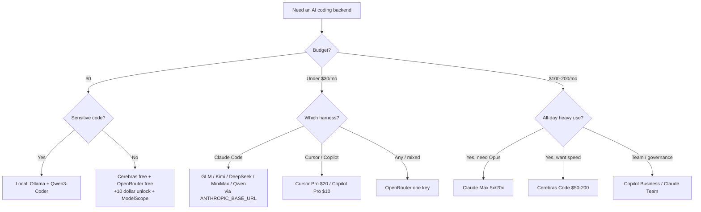

<div align="center">

# 🤖 Awesome AI Coding Subscriptions & APIs

[](https://awesome.re)
[](LICENSE)
[](CONTRIBUTING.md)

[](https://github.com/lildebil0/awesome-ai-coding-subscriptions/stargazers)

**Quel abonnement, plan de codage, API, routeur ou offre gratuite faut-il brancher derrière votre agent de codage IA ?**
Une réponse organisée, mesurée et sourcée — classée par 💵 prix · 🧠 puissance · 🔢 modèles · 📊 quotas · 🔌 intégration.

[English](../README.md) · [简体中文](README.zh-CN.md) · [Español](README.es.md) · [Русский](README.ru.md) · [日本語](README.ja.md) · [Português](README.pt-BR.md) · **Français** · [Deutsch](README.de.md) · [한국어](README.ko.md) · [हिन्दी](README.hi.md)

</div>

---

Cette liste recense les **offres que vous payez** — abonnements, plans de codage à tarif fixe, API à l'usage, routeurs et paliers gratuits — et **non** les outils de codage eux-mêmes. Le harnais (Claude Code, Cline, Aider, Roo/Kilo, OpenCode) est gratuit. Ce qui coûte de l'argent, c'est le modèle qui se trouve derrière, et c'est donc lui qui est classé ici. Le harnais n'est que la *cible d'intégration*.

Un plan à tarif fixe de 3 à 30 $/mois proposé par un laboratoire chinois à poids ouverts (GLM, Kimi, DeepSeek, MiniMax, Qwen, Doubao) branché sur un harnais CLI gratuit vous donne environ 78–80 % sur SWE-bench pour à peu près un dixième du coût d'un abonnement frontière à 200 $. Les abonnements frontière restent gagnants sur les tâches les plus difficiles. C'est pourquoi, en 2026, la plupart des gens utilisent les deux : un abonnement frontière pour le raisonnement difficile, un plan bon marché pour tout le reste.

> ⚠️ **Les tarifs dans ce domaine changent tous les mois.** Les chiffres reflètent la situation **vers juin 2026**. Vérifiez toujours sur la page officielle avant d'acheter. Vous repérez un prix obsolète ? [Ouvrez une PR](CONTRIBUTING.md) — les corrections sont aussi appréciées que les ajouts.

## Légende

| Badge | Signification |
|-------|---------|
| 💎 | **Pépite cachée** — peu connue, coûte moins qu'elle ne le devrait au vu de ce que vous obtenez |
| 🆓 | Propose un **palier gratuit** sur lequel vous pouvez réellement faire tourner un agent |
| ✅ | **Tarif vérifié** par recoupement avec la source officielle (juin 2026) |
| ⭐ | Note de valeur (1–5) : prix vs puissance vs quotas vs intégration |
| 🇨🇳 | Hébergé en Chine (réserve de résidence des données / latence pour certains) |
| ⚠️ | Présente un risque notable (CGU, fiabilité, pérennité, revendeur) |

**Vocabulaire d'intégration :** `CC-native` = endpoint compatible Anthropic natif, backend Claude Code prêt à l'emploi via `ANTHROPIC_BASE_URL`. `OpenAI-compat` = fonctionne dans Cline/Roo/Kilo/Aider/Continue/OpenCode par simple changement d'URL de base (Claude Code a besoin d'un shim/routeur). `native-only` = verrouillé à l'éditeur/agent propriétaire du fournisseur, non réutilisable comme backend.

## Sommaire

- [Comment choisir](#comment-choisir)
- [Choisir selon votre budget](#choisir-selon-votre-budget)
- [Choisir selon qui vous êtes](#choisir-selon-qui-vous-êtes)
- [TL;DR — meilleurs choix par cas d'usage](#tldr--meilleurs-choix-par-cas-dusage)
- [Tableau comparatif principal](#tableau-comparatif-principal)
- [Abonnements frontière de première main](#abonnements-frontière-de-première-main)
- [Abonnements outil tout-en-un (éditeur + modèle)](#abonnements-outil-tout-en-un-éditeur--modèle)
- [Plans de codage à tarif fixe — les champions du rapport qualité-prix 💎](#plans-de-codage-à-tarif-fixe--les-champions-du-rapport-qualité-prix-)
- [API à l'usage à bon rapport qualité-prix](#api-à-lusage-à-bon-rapport-qualité-prix)
- [Fournisseurs vitesse / inférence rapide](#fournisseurs-vitesse--inférence-rapide)
- [Routeurs & passerelles](#routeurs--passerelles)
- [Autres fournisseurs à connaître (2026)](#autres-fournisseurs-à-connaître-2026)
- [Paliers gratuits 🆓](#paliers-gratuits-)
- [Crédits gratuits & programmes étudiants / startups](#crédits-gratuits--programmes-étudiants--startups)
- [Plans étudiants & éducation 🎓](#plans-étudiants--éducation-)
- [Niche & spécialités](#niche--spécialités)
- [Constructeurs d'apps & agents autonomes](#constructeurs-dapps--agents-autonomes)
- [Pépites cachées & proxys revendeurs ⚠️](#pépites-cachées--proxys-revendeurs-)
- [Recettes de configuration — brancher un plan bon marché sur votre harnais](#recettes-de-configuration--brancher-un-plan-bon-marché-sur-votre-harnais)
- [Matrice confidentialité & résidence des données](#matrice-confidentialité--résidence-des-données)
- [Benchmark par dollar](#benchmark-par-dollar)
- [Pièges financiers & erreurs courantes](#pièges-financiers--erreurs-courantes)
- [Chronologie tarifaire 2026](#chronologie-tarifaire-2026)
- [Ce que dit vraiment la communauté](#ce-que-dit-vraiment-la-communauté)
- [Auto-hébergement & hybride (quand un abonnement n'est pas la réponse)](#auto-hébergement--hybride-quand-un-abonnement-nest-pas-la-réponse)
- [FAQ](#faq)
- [Glossaire](#glossaire)
- [Comment cette liste est notée & maintenue](#comment-cette-liste-est-notée--maintenue)
- [Réserves & avertissement](#réserves--avertissement)
- [Contribuer](#contribuer)
- [Licence](#licence)
- [⭐ Historique des étoiles](#-historique-des-étoiles)

---

## Comment choisir

Notez chaque plan sur cinq axes :

1. **💵 Prix** — le prix affiché, et le coût effectif *réel* (ratios de crédits, multiplicateurs en heures de pointe, dépassements).
2. **🧠 Puissance** — la qualité du modèle ; le palier « valeur » se regroupe autour de ~78–80 % sur SWE-bench Verified, le palier frontière à 85–89 %.
3. **🔢 Nombre de modèles** — un seul plan qui multiplexe plusieurs modèles (Qwen Coding Plan, OpenRouter) couvre le risque de turnover.
4. **📊 Quotas** — requêtes/tokens par fenêtre de 5 h, plafonds hebdomadaires, concurrence. Le coût caché : un seul « prompt » d'IDE se ventile en **5 à 30 appels de modèle**, donc les « prompts/5 h » annoncés sont plus souples qu'ils n'en ont l'air.
5. **🔌 Intégration** — expose-t-il un **endpoint Anthropic natif** (Claude Code prêt à l'emploi) ou seulement de l'OpenAI-compat (nécessite un routeur) ? Ou est-il native-only (aucune réutilisation) ?

**Raccourci de décision :**

- Vous voulez **le meilleur agent, le chemin le plus simple** → Claude Pro 20 $ → Max 5x 100 $.
- Vous voulez **le plus de codage par dollar** → un plan à tarif fixe (GLM / MiniMax / Qwen / Kimi) sur Claude Code.
- Vous voulez **0 $** → Cerebras gratuit + OpenRouter gratuit (+10 $ de déblocage) + NVIDIA NIM, et escalader les tâches difficiles vers un modèle payant.
- Vous voulez **une seule clé pour tout** → OpenRouter.
- Vous voulez **la confidentialité (pas d'hébergement en Chine)** → Synthetic.new (US, sans entraînement, suppression à 14 jours) ou des abonnements US de première main.



---

## Choisir selon votre budget

Évitez la paralysie d'analyse. Trouvez votre montant mensuel, prenez la pile correspondante.

| Budget | Meilleur choix | Ce que vous obtenez | La pile la plus maligne |
|---|---|---|---|
| **0 $** 🆓 | **GitHub Copilot Free** + **Gemini CLI** | 2 000 complétions + 50 requêtes premium/mois avec Copilot ; une CLI agentique généreuse de Google | Copilot Free dans l'IDE pour l'autocomplétion, Gemini CLI dans le terminal pour les runs d'agent, [Cursor Hobby](https://cursor.com/pricing) comme troisième réservoir de complétions Tab gratuites |
| **< 10 $/mois** | **GLM Coding Plan Lite** 💎 (30 $/trim ≈ 10 $/mois) | ~3× l'usage de Claude Pro ; un [endpoint compatible Anthropic natif](https://docs.z.ai/guides/overview/pricing) — à brancher dans Claude Code, Cline ou OpenCode | GLM Lite comme moteur de Claude Code + empilez le palier gratuit par-dessus pour le débordement |
| **~10 $/mois** | **GitHub Copilot Pro** (10 $) | Complétions illimitées, 10 $ de crédits IA, mode agent, sélecteur de modèles — passé à la [facturation à l'usage en juin 2026](https://github.blog/news-insights/company-news/github-copilot-is-moving-to-usage-based-billing/) | Copilot Pro dans l'IDE + GLM Lite dans le terminal — deux moteurs quasi frontière pour ~20 $ au total |
| **~20 $/mois** | **Claude Pro** (20 $) *ou* **Cursor Pro** (20 $) | Pro : Claude Code dans le terminal/web/desktop, [Sonnet 4.6 + Opus 4.6](https://claude.com/pricing). Cursor : Tab illimité + 20 $ d'usage agent + Background Agents | Claude Pro (le meilleur agent brut) + Copilot Free pour l'autocomplétion en ligne ; ou Cursor Pro seul si vous vivez dans un seul éditeur |
| **~50 $/mois** | **MiniMax Max** (50 $) *ou* **GLM Pro** (~72 $/mois) **+ Claude Pro** (20 $) | Un plan fixe à gros volume (MiniMax ~1000 prompts/5h, ou GLM Pro) *plus* la qualité Anthropic native pour les cas difficiles | Plan bon marché pour les corvées, Claude Pro réservé au raisonnement délicat — le meilleur $/débit du tableau |
| **~100 $/mois** | **Claude Max 5x** (100 $) | 5× l'usage de Pro, accès prioritaire aux nouveaux modèles — le point idéal pour les devs qui atteignent les limites de Pro chaque jour ([plan Max](https://support.claude.com/en/articles/11049741-what-is-the-max-plan)) | Max 5x comme cheval de bataille + GLM Lite (10 $) comme voie de débordement bon marché quand vous brûlez le plafond du 5x |
| **~200 $/mois** | **Claude Max 20x** (200 $) *ou* **Cursor Ultra** (200 $) | Max 20x : 20× Pro, le palier individuel haut de gamme. [Cursor Ultra](https://cursor.com/pricing) : 20× l'usage + fonctionnalités prioritaires dans un IDE complet | Max 20x pour les power users terminal-first ; ajoutez Copilot Pro (10 $) seulement si vous voulez les modèles d'un second fournisseur pour la variété/redondance |

**Règles de pouce**
- **Moins de 20 $ et sensible au prix ?** GLM Lite est le meilleur dollar du codage en ce moment — il parle l'API d'Anthropic, donc votre mémoire musculaire Claude Code se transfère.
- **Un seul outil, toute la journée ?** Payez l'abonnement natif (Claude Pro, Cursor Pro). Ne fragmentez pas.
- **Gros utilisateur quotidien ?** Passez directement à Max 5x — c'est moins cher que d'empiler deux plans à 50 $ et bien moins fastidieux.
- **Le bon coup à chaque palier :** un moteur premium pour les problèmes difficiles + une voie bon marché/gratuite pour les éditions de masse et l'autocomplétion. Vous avez rarement besoin de deux abonnements à 20 $+.

> Prix vérifiés en juin 2026. Les plans facturés au trimestre (GLM) sont affichés en mensuel effectif. Les plans Copilot et GitHub sont passés aux [crédits IA à l'usage le 1er juin 2026](https://github.blog/news-insights/company-news/github-copilot-is-moving-to-usage-based-billing/) — votre allocation évolue avec le prix de base.


---

## Choisir selon qui vous êtes

Évitez de fixer la matrice sans bouger. Trouvez votre ligne, copiez le choix, passez à autre chose. Les prix sont en USD/mois, paliers individuels sauf mention contraire (juin 2026).

| Vous êtes… | Meilleur choix | Pourquoi ça vous convient | ~Prix |
|---|---|---|---|
| **Indé solo (indie hacker)** 💎 | **Claude Pro** + une clé API Z.ai/DeepSeek en débordement | Un seul abonnement à 20 $ couvre Claude Code dans le terminal ; quand vous atteignez le plafond des 5 heures en plein sprint, repliez-vous sur une API valeur bon marché au lieu de sauter à un palier à 100 $ que vous sous-utiliserez. Le meilleur $/sortie pour une personne qui livre chaque jour. | 20 $ + des centimes |
| **Équipe d'ingénierie startup (2–20)** | **GitHub Copilot Business** | 19 $/siège offre la politique d'organisation, le filtre de code public, l'**indemnisation PI**, et la facturation centralisée — le plan le moins cher que l'on peut présenter sans risque à des investisseurs/clients. Se combine avec l'abonnement Claude/Cursor de chaque dev pour le gros œuvre. [tarifs](https://github.com/features/copilot/plans) | 19 $/siège |
| **Entreprise** (gouvernance / SSO / PI) | **Copilot Enterprise** ou **Claude Enterprise** | Copilot Enterprise (39 $/siège) ajoute SSO/SCIM, journaux d'audit, bases de connaissances indexées sur le code, et la même indemnisation-PI-avec-filtre de Microsoft. Claude Enterprise (sur devis) est l'alternative si vous êtes Anthropic-first. Les deux passent les achats. [Copilot Enterprise](https://docs.github.com/en/copilot/get-started/plans) | 39 $/siège → sur mesure |
| **Étudiant en informatique** 🆓 | **GitHub Copilot (Student)** + ChatGPT Free | Les étudiants vérifiés obtiennent **Copilot au niveau Pro gratuitement** (complétions illimitées, modèles premium, allocation mensuelle de requêtes premium). Zéro dépense, outillage réel. [plans Copilot](https://github.com/features/copilot/plans) | 0 $ |
| **Mainteneur OSS** 🆓 | **Copilot Pro gratuit pour l'OSS** + Claude Pro pour le travail profond | Les mainteneurs de dépôts populaires sont éligibles à Copilot Pro gratuit ; gardez un Claude Pro à 20 $ pour les refactos épineuses. Le meilleur ratio bien-public/coût. | 0–20 $ |
| **Confidentialité d'abord / régulé** 🔒 | **Pile locale : Ollama + Qwen3-Coder + Continue.dev** | Le code propriétaire ne quitte jamais la machine — pas d'API, pas de clause de rétention, pas de DPA à négocier. Environ 70–85 % de la qualité de Claude-cloud sur du travail mono-fichier. Si vous devez utiliser le cloud, ajoutez un palier API à **rétention zéro**. [config](https://medium.com/@rodrigo.estrada/build-a-local-ai-coding-assistant-qwen3-ollama-continue-dev-cee0dbcd172a) | 0 $ (matériel) |
| **Hors ligne / cloisonné (air-gapped)** | **Ollama + Qwen3-Coder-Next** (Continue.dev ou OpenCode) | La même pile locale, mais c'est la *seule* catégorie qui fonctionne câble réseau débranché. Qwen3-Coder-Next active ~3B params depuis un MoE de 80B — tient sur du vrai matériel, sans jamais Internet. [modèles](https://localaimaster.com/models/best-local-ai-coding-models) | 0 $ |
| **Vibe-coder / amateur** 🆓 | **Échantillonnage de paliers gratuits** : ChatGPT Free ou Copilot Free + Gemini gratuit | Vous bricolez pour le plaisir le week-end — ne payez rien. Les 2 000 complétions/mois de Copilot Free plus un modèle de chat couvrent les projets perso occasionnels. Ne montez en gamme que quand les limites gratuites mordent vraiment. | 0 $ |
| **Power-user faisant tourner des agents en parallèle** 💎 | **Claude Max 20x** (ou empilez une API valeur pour le fan-out) | Si vous orchestrez des essaims / sessions Claude Code parallèles, le plafond d'usage 20x est ce qui vous empêche d'atteindre les limites à 14h. Moins cher que de brûler l'équivalent en tokens d'API à ce volume. Ajoutez une clé DeepSeek/Z.ai pour les agents jetables. | 200 $ |

**Deux règles de pouce transversales :**
- Le saut de **20 $ → 100 $/200 $** ne rentabilise que si vous atteignez *personnellement* les plafonds d'usage plus de ~deux fois par semaine. La plupart des gens non — mesurez-le avant de monter en gamme.
- **L'indemnisation PI est une fonction du plan, pas du modèle.** Elle démarre à Copilot **Business** et exige le filtre de code public activé — les paliers gratuit et Pro ne la portent pas. Si un avocat doit un jour lire votre dépôt, c'est la ligne qui compte. [détails](https://github.com/features/copilot/plans)

Sources :
- [GitHub Copilot Plans & pricing](https://github.com/features/copilot/plans)
- [Plans for GitHub Copilot — GitHub Docs](https://docs.github.com/en/copilot/get-started/plans)
- [AI Pricing Compared 2026 — AIViewer](https://aiviewer.ai/guides/ai-pricing-comparison-2026/)
- [Build a Local AI Coding Assistant — Qwen3 + Ollama + Continue.dev](https://medium.com/@rodrigo.estrada/build-a-local-ai-coding-assistant-qwen3-ollama-continue-dev-cee0dbcd172a)
- [Best Local AI Coding Models for Ollama (2026)](https://localaimaster.com/models/best-local-ai-coding-models)


---

## TL;DR — meilleurs choix par cas d'usage

| Cas d'usage | Choix | Pourquoi | ~Prix |
|----------|------|-----|--------|
| 🏆 **Meilleur rapport qualité-prix global** | **GLM Coding Plan** 💎🇨🇳 | GLM-5.1 ~94 % du codage d'Opus ; Claude Code natif ; l'entrée sérieuse la moins chère | ~10 $/mois (Lite trim.) – 72 $ Pro |
| 🥇 **Meilleur frontière brut** | **Claude Max 5x** | Débloque Opus dans Claude Code, l'agent n°1 par consensus | 100 $/mois |
| 🪙 **Entrée sérieuse la moins chère** | **Trae Lite 3 $** / **StepFun 6,99 $** / **MiMo ~5 $** / **GLM Lite ~10 $** 💎 | Un vrai backend de codage pour le prix d'un café | 3–10 $/mois |
| 💸 **Le moins cher au token** | **DeepSeek V4-Flash** 💎 | 0,14 $/M en entrée, 0,0028 $/M en cache-hit, contexte 1M, CC-native | à l'usage |
| 🧪 **Meilleur gratuit** | **Cerebras gratuit** 🆓 + **OpenRouter :free** 🆓 | 1M tok/jour (rapide) + Qwen3-Coder-480B gratuit | 0 $ |
| ⚡ **Meilleur rapide+bon marché** | **Groq** 💎🆓 / **Cerebras Code** | Endpoint Anthropic natif (Groq) ; ~2000 tok/s à tarif fixe (Cerebras) | gratuit / 50 $/mois |
| 🔀 **Meilleur routeur universel** | **OpenRouter** | 315+ modèles, une seule clé, skin Anthropic, pas de majoration au token | à l'usage +5,5 % |
| 🔒 **Meilleure confidentialité (hébergé US)** | **Synthetic.new** 💎 | Infra US, sans entraînement, suppression à 14 jours, double compat OpenAI+Anthropic | 20–60 $/mois |
| 🧰 **Meilleur pour les gros codebases** | **Augment Code** ✅ | Context Engine de premier plan pour les monorepos | 20 $+/mois |
| 🏢 **Meilleur rapport qualité-prix équipe** | **Siège Claude Team Premium** 💎 | ≈ usage Max-5x + SSO/admin | 100 $/siège |


---

## Tableau comparatif principal

Trié grossièrement par rapport qualité-prix. Prix ~juin 2026 ; **vérifiez avant d'acheter**.

| Plan | Type | Prix | Modèles | Quotas (codage) | Intégration | ⭐ | Notes |
|------|------|-------|--------|-----------------|-------------|----|-------|
| [GLM Coding Plan](#glm-coding-plan--zai-zhipu-ai-) | tarif fixe | Lite 18 $ · Pro 72 $ · Max 160 $ /mois (Lite trim. ~10 $/mois) | GLM-5.1/5/4.7 | Lite ~80, Pro ~400 prompts/5h | CC-native | ⭐5 | 💎🇨🇳✅ |
| [API DeepSeek](#deepseek-) | API à l'usage | V4-Pro 0,435/0,87 $ ; Flash 0,14/0,28 $ | V4-Pro/Flash | contexte 1M, 500–2500 concurrents | CC-native | ⭐5 | 💎🇨🇳✅ |
| [MiniMax Coding Plan](#minimax-coding--token-plan-) | tarif fixe | 10–50 $/mois | M2.7 (plan), M2.5/M3 (API) | Starter ~100, Max ~1000 prompts/5h | CC-native | ⭐5 | 💎🇨🇳 |
| [Kimi Code](#kimi-code--moonshot-ai-) | tarif fixe+API | ~19 $/mois + à l'usage | K2.6 (1T) | ~300–1200 appels/5h, 30 concurrents | CC-native | ⭐5 | 💎🇨🇳 |
| [Qwen Cloud Coding Plan](#qwen-cloud-coding-plan--alibaba-) | tarif fixe | Pro 50 $/mois (Lite 10 $, fermé) | Qwen3.5 + Kimi/GLM/MiniMax | Pro 6000 req/5h, contexte 1M | CC-native | ⭐4 | 💎🇨🇳✅ |
| [OpenRouter](#openrouter-) | routeur | à l'usage, +5,5 % recharge | 315+ (tous) | borné par solde ; modèles gratuits 50–1000/jour | skin CC-native | ⭐5 | 🆓 |
| [Claude Pro](#anthropic-claude) | première main | 20 $/mois | Sonnet 4.6 (pas d'Opus) | ~40–45 msg/5h + hebdo | CC-native | ⭐5 | meilleure entrée |
| [Claude Max 5x](#anthropic-claude) | première main | 100 $/mois | + Opus 4.6/4.7 | ~50–225 prompts/5h | CC-native | ⭐5 | Opus débloqué |
| [Cerebras Code](#cerebras-) | tarif fixe vitesse | 50/200 $ | GLM-4.7 (~2000 tok/s) | 24M–120M tok/jour, contexte 131k | OpenAI-compat | ⭐5 | ✅ souvent en rupture |
| [Synthetic.new](#synthetic-new) | tarif fixe (US) | 20–60 $/mois | 16 à poids ouverts (GLM/Kimi/Qwen/DS) | ~125–1250 req/5h | CC-native | ⭐5 | 💎🔒 |
| [Chutes](#chutes-) | tarif fixe ⚠️ | 3/10/20 $ | GLM-5/Kimi/DS/MiniMax/Qwen | 300/2000/5000 req/jour | OpenAI-compat | ⭐5 | 💎⚠️ décentralisé ✅ |
| [Grok Code Fast 1](#xai-grok) | API à l'usage | 0,20/1,50 $/M | grok-code-fast-1 | contexte 256K, ~92 tok/s | CC-native | ⭐5 | 💎 n°1 sur OpenRouter |
| [ChatGPT Plus](#openai-chatgpt--codex) | première main | 20 $/mois | GPT-5.x-Codex | facturé en crédits-tokens | Codex-native | ⭐4 | Codex agent n°2 |
| [ChatGPT Pro](#openai-chatgpt--codex) | première main | 100/200 $ (5x/20x) | GPT-5.5-Codex | élevé ; GPU dédié | Codex-native | ⭐4 | |
| [Claude Max 20x](#anthropic-claude) | première main | 200 $/mois | Opus 4.6/4.7 | ~200–900 prompts/5h | CC-native | ⭐4 | palier power |
| [Cursor Pro / Ultra](#cursor) | tout-en-un | 20 $ / 200 $ | tous frontière + Auto | pool d'usage 20 $ / 400 $ | Native-only | ⭐4 | Ultra = ratio de crédit 2× |
| [GitHub Copilot Pro](#github-copilot) | tout-en-un | 10 $/mois | GPT-5/Claude/Gemini | 10 $ crédits IA (usage) | Native-only (+ACP) | ⭐4 | complétions gratuites 🆓 |
| [DeepInfra](#deepinfra) | vitesse/API | à l'usage (l'OSS le moins cher) | Kimi/DS/Qwen3-Coder/GLM | borné par solde | CC-native | ⭐5 | 💎✅ hébergeur le moins cher |
| [Groq](#groq) | vitesse/API | à l'usage + gratuit | GPT-OSS/Qwen3/Kimi | plafonds RPM/TPM gratuits | CC-native | ⭐4 | 💎🆓 |
| [Vercel AI Gateway](#vercel-ai-gateway) | routeur | 0 $ de majoration (même en BYOK) | des centaines, dont Claude | 5 $/mois de crédits gratuits | CC-native | ⭐4 | 💎🆓✅ |
| [Requesty](#requesty) | routeur | +5 % fixe | Claude/GPT/Gemini/DS/Qwen | cache sémantique ~40 % de réduction | OpenAI-compat | ⭐4 | 💎 gouvernance d'équipe |
| [Mistral Le Chat Pro](#mistral) | première main | 14,99 $/mois (5,99 $ étudiant) | Devstral 2 + Vibe CLI | ~25 msg gratuits/jour | Native-only | ⭐4 | 💎🆓🇪🇺 abonnement majeur le moins cher |
| [Augment Code](#abonnements-outil-tout-en-un-éditeur--modèle) | tout-en-un | 20–200 $/mois | Claude/Gemini/GPT | 40k–450k crédits/mois | Native-only | ⭐4 | ✅ meilleur contexte gros dépôt |
| [Zed Pro](#abonnements-outil-tout-en-un-éditeur--modèle) | tout-en-un | 10 $/mois | n'importe lequel (clé BYO/ACP) | 5 $ de crédits + usage | ACP + BYOK | ⭐4 | 💎 anti-verrouillage |
| [Cerebras gratuit](#paliers-gratuits-) | gratuit | 0 $ | Qwen3-Coder-480B, GPT-OSS-120B | 1M tok/jour, plafond contexte 8K | OpenAI-compat | ⭐5 | 💎🆓 le gratuit le plus rapide |
| [Google AI Studio](#paliers-gratuits-) | gratuit | 0 $ | Gemini 2.5 Flash, Gemma 3 27B | Flash 250 RPD ; Gemma 14,4k RPD | OpenAI-compat | ⭐4 | 🆓 plus grand contexte gratuit |


---

## Abonnements frontière de première main

Les plans directement chez l'éditeur. Un abonnement authentifie **le harnais propriétaire de l'éditeur** (Claude Code, Codex CLI, Antigravity, Grok Build) par connexion — il ne vous donne **pas** de clé API générique pour des outils tiers OpenAI-compat (c'est une facturation au token distincte). Exception : les modèles xAI Grok sont compatibles OpenAI/Anthropic.

> Ordre de préséance pour le codage agentique (consensus juin 2026) : **Claude > OpenAI Codex > Google Gemini > xAI Grok**. Un test indépendant sur 30 jours a donné Claude ~95 % vs ChatGPT ~85 % de précision de codage ; le SWE-bench des éditeurs donne GPT-5.5 (88,7 %) ≈ Opus 4.7 (87,6 %).

### Anthropic (Claude)
- **[Claude Pro](https://claude.com/pricing)** — `20 $/mois` (17 $ en annuel). Sonnet 4.6 dans Claude Code (**pas d'Opus**). ~40–45 msg/5h + plafond hebdo, partagé avec le chat/Cowork. **Le meilleur point d'entrée valeur vers l'agent de codage n°1.** En avril 2026, les limites des 5h ont doublé et le throttling en heures de pointe a été supprimé. ⭐5
- **[Claude Max 5x](https://support.claude.com/en/articles/11049741-what-is-the-max-plan)** — `100 $/mois`. **Débloque Opus 4.6/4.7** + 5× le débit (~50–225 prompts/5h). Le point idéal pro ; un palier intermédiaire à 100 $ qu'OpenAI/Google n'égalent pas aussi utilement. ⭐5
- **[Claude Max 20x](https://support.claude.com/en/articles/11049741-what-is-the-max-plan)** — `200 $/mois`. ~200–900 prompts/5h. Pour les agents parallèles toute la journée ; le calcul **le tarif-fixe-bat-l'API** est décisif (90 %+ des tokens de Claude Code sont des cache-reads, gratuits sur abonnement, facturés sur l'API — le mois de pointe d'un dev = 5 623 $ en API ≈ 4,5 ans de Max 5x). ⭐4
- **[Siège Claude Team Premium](https://claude.com/pricing)** 💎 — `100 $/siège` (annuel). ≈ usage Max-5x **plus** SSO/admin/audit/recherche-entreprise. En toute discrétion, le meilleur rapport qualité-prix de codage *en équipe* ; le siège Standard à 20 $ inclut aussi Claude Code. ⭐4

### OpenAI (ChatGPT / Codex)
- **[ChatGPT Plus](https://help.openai.com/en/articles/11369540-using-codex-with-your-chatgpt-plan)** — `20 $/mois`. Codex CLI/IDE inclus (GPT-5.5/5.4/5.3-Codex). **Facturé en crédits-tokens** depuis avril 2026 (déroutant). Codex = agent n°2 par consensus. Les plafonds de Plus s'épuisent vite sur du travail agentique intensif. ⭐4
- **[ChatGPT Pro](https://developers.openai.com/codex/pricing)** — `100 $` (5x) / `200 $` (20x). Haut débit + GPU dédié. Notez que la promo « boost 10x » du palier à 100 $ a **expiré le 31 mai 2026** (maintenant 5x). Le débat classique « le plan à 200 $ en vaut-il la peine ? » = Claude Max 20x vs ChatGPT Pro 20x. ⭐4

### Google (Gemini)
- **[Google AI Pro](https://gemini.google/subscriptions/)** — `19,99 $/mois` (souvent -50 % la première année). Renommé depuis Google One AI Premium (avr. 2026). Gemini 3.x Pro, 5 To de stockage et **un accès élargi aux agents de codage [Antigravity](#constructeurs-dapps--agents-autonomes) + Jules**. ✅
- **[Google AI Ultra](https://blog.google/products-and-platforms/products/google-one/google-ai-subscriptions/)** — **`100 $/mois` (5x, nouveau palier dev)** / **`200 $/mois` (20x, baissé depuis 250 $)** à l'I/O 2026. Usage 5×/20× dans l'app Gemini **et** Antigravity ; le palier supérieur ajoute Deep Think, Project Genie, 30 To. ✅
- ⚠️ **Google tue la Gemini CLI open source le 18 juin 2026**, migrant les utilisateurs vers la CLI Antigravity fermée avec des quotas gratuits bien plus faibles (~1000 → ~20 req/jour) — le plus gros grief de la communauté en 2026.

### xAI (Grok)
- **[SuperGrok](https://x.ai/pricing)** — `30 $/mois` (300 $/an) / Heavy `300 $/mois`. (Pas de palier « Lite » indépendant sur la page tarifs actuelle — c'est un vestige hérité/du bundle X-Premium ; ignorez les anciens 10 $.) La CLI Grok Build fait tourner **8 sous-agents parallèles dans des git worktrees isolés** (inédit) et est incluse dans tous les abonnements SuperGrok. `grok-code-fast-1` a un public fidèle (bon marché+rapide). ~70,8 % au SWE-bench, derrière les leaders. **Pour le codage, l'[API xAI](#xai-grok) est souvent le meilleur achat.** ⭐3 💎


---

## Abonnements outil tout-en-un (éditeur + modèle)

Ici, le plan *est* le produit — vous achetez l'éditeur/agent du fournisseur. La tendance 2026 : presque tous sont passés de quotas de requêtes fixes aux **crédits / facturation au token**, rendant les coûts *moins* prévisibles (vif tollé).

### Cursor
- **[Cursor](https://cursor.com/pricing)** — Hobby gratuit · **Pro `20 $`** · **Pro+ `60 $`** 💎 · **Ultra `200 $`**. Depuis juin 2025, le prix de votre plan = un pool d'usage aux tarifs de l'API. **Le ratio de crédit s'améliore en montant de palier** : Pro 20 $/20 $ (1×), Pro+ 60 $/70 $ (1,17×), Ultra 200 $/400 $ (**2×, le meilleur**). Le mode `Auto` est la clé de la valeur — effectivement illimité, il ne draine pas le pool comme le fait l'épinglage de Claude/MAX. ⚠️ Le basculement de juin 2025 a provoqué un [désastre tarifaire](https://www.wearefounders.uk/cursors-pricing-disaster-the-full-timeline-of-how-an-ai-coding-darling-burned-its-most-loyal-users/) (utilisateur HN : « 350 $ de dépassement en une semaine ») ; le PDG s'est excusé + a remboursé. **Native-only** — ne peut pas servir de backend à Claude Code, et depuis janvier 2026, vous ne pouvez plus non plus router un abonnement Claude *dans* Cursor. Tab/Apply de premier plan. ⭐4

### GitHub Copilot
- **[GitHub Copilot](https://github.com/features/copilot/plans)** — Free 🆓 · **Pro `10 $`** · Pro+ `39 $` · Max `100 $` · Business `19 $` · Enterprise `39 $`. ⚠️ **Passé aux crédits IA à l'usage le 1er juin 2026** (1 crédit = 0,01 $) ; chaque plan inclut un pool de crédits (Pro=15 $, Pro+=70 $). **Les complétions de code restent illimitées et gratuites** — les utilisateurs purement complétion ne sont pas affectés. Tollé sévère (TechTimes : les factures agentiques ont bondi de 10×–50×). Complétions IDE de premier plan + gouvernance/indemnisation PI pour les organisations. **Native-only** (issue de secours : la Copilot CLI parle ACP). ⭐4

### Autres
- **[Augment Code](https://www.augmentcode.com/pricing)** ✅ — Indie `20 $`/40k crédits · Standard `60 $` · Max `200 $`. **Context Engine de premier plan** pour les gros monorepos (en tête des comparatifs de rappel de contexte). VS Code + JetBrains + CLI Auggie. Native-only. La consommation de crédits sur les tâches gourmandes en outils est le reproche. ⭐4 💎
- **[Zed Pro](https://zed.dev/pricing)** 💎 — Free · **Pro `10 $`** (seulement +10 % de majoration) · Business `30 $`. Le choix **anti-verrouillage** : l'[ACP](https://zed.dev/docs/ai/) ouvert pilote des agents externes (Claude Code, Codex, OpenCode) et accepte vos propres clés pour n'importe quel fournisseur. L'éditeur natif le plus rapide. ⭐4
- **[Kiro](https://kiro.dev/pricing/)** 💎 — Free · **Pro `20 $`/1k crédits** · Pro+ `40 $` · Power `200 $`. Le meilleur agent **piloté par spécification** (exigences→conception→tâches), toute la gamme Claude dont Opus 4.7, facturation fractionnée à 0,01 crédit. **AWS Startups = 1 an gratuit de Pro+.** ⭐4
- **[Trae](https://www.trae.ai/pricing)** 💎🇨🇳 — Free · **Lite `3 $`** · Pro `10 $` · Ultra `100 $`. Fork VS Code de ByteDance ; le pool d'usage dépasse le prix affiché (ex. 20 $ d'usage pour 10 $) = « l'alternative à Cursor à 3 $ ». ⚠️ Télémétrie ByteDance partagée avec ses filiales — rédhibitoire en entreprise. ⭐4
- **[Sourcegraph Amp](https://sourcegraph.com/amp)** — Gratuit pour démarrer (10 $ de crédit ; 40 $ pour les ex-Cody). Pure **consommation** (pas de plancher mensuel), fait tourner Opus 4.8 en mode « smart ». Excellent pour un usage léger, risque de combustion non plafonnée pour un usage intensif. Cody Free/Pro ont été retirés et fondus dans Amp. ⭐3
- **[JetBrains AI / Junie](https://www.jetbrains.com/ai-ides/buy/)** — intégration IDE adorée, mais Junie **brûle les crédits vite** (les 35 crédits d'Ultimate partis en ~4–5 jours). Uniquement si vous vivez dans JetBrains.
- **Trop cher / à éviter :** **Tabnine** (plancher à 39 $, pas de palier gratuit, engagement annuel — uniquement pour les besoins on-prem/cloisonnés) ; **Windsurf Pro** (le passage en mars 2026 à des quotas quotidiens/hebdomadaires est le changement le plus décrié de l'année, confiance basse post-Cognition). **Supermaven** est mort en tant que produit autonome (fondu dans Cursor Tab en nov. 2025).


---

## Plans de codage à tarif fixe — les champions du rapport qualité-prix 💎

Plans fixes mensuels ou trimestriels qui placent un modèle à poids ouverts quasi frontière derrière votre harnais, principalement issus de laboratoires chinois. La plupart exposent un endpoint Anthropic natif, donc ils se branchent dans Claude Code via `ANTHROPIC_BASE_URL`. Pour la liste des endpoints, voir [Alorse/cc-compatible-models](https://github.com/Alorse/cc-compatible-models).

> Ordre de préséance par consensus : **GLM** (entrée la moins chère, défaut de la communauté) · **MiniMax** (meilleur prix/volume) · **Kimi** (meilleur agent longue haleine) · **Qwen** (contexte >262K, multi-modèle). Claude Pro 20 $ est la référence de qualité qu'ils cassent.

<a name="glm-coding-plan--zai-zhipu-ai-"></a>
### GLM Coding Plan — Z.ai (Zhipu AI) 💎🇨🇳 ✅
- **Tarif mensuel international (vérifié juin 2026) :** `Lite 18 $/mois` · `Pro 72 $/mois` · `Max 160 $/mois` — les prix ont ~doublé le 11 avril 2026. **Le Lite trimestriel est la route bon marché** (~30 $/trim ≈ 10 $/mois). Le tarif domestique en Chine est bien moins cher (~7 / 21 / 68 $ par mois). La promo virale à **3 $/mois** s'est terminée le 11 février 2026. ✅
- Modèles : **GLM-5.1** (~94 % du codage d'Opus 4.6) · GLM-5/5-Turbo · GLM-4.7 · GLM-4.5-Air. **Chaque palier (Lite compris) reçoit tous les modèles et le contexte complet de 200K** (128K de sortie max) — les paliers ne diffèrent que par le quota, pas par les modèles ni la fenêtre de contexte. Correspondance suggérée : GLM-5.1 → emplacement Opus (tâches difficiles, frontend/UI), GLM-4.7 → Sonnet (le cheval de trait à quota ×1), GLM-4.5-Air → Haiku (arrière-plan rapide).
- Quotas : Lite ~80, Pro ~400, Max ~1 600 prompts/5h + hebdo (un « prompt » d'IDE = 5–30 appels au modèle). ⚠️ **Multiplicateur 3× en heures de pointe** sur GLM-5/5.1 uniquement, **14h00–18h00 UTC+8 (≈08h00–12h00 Kaliningrad)** ; 2× hors pointe (1× hors pointe via promo jusqu'à fin juin 2026). Lancez le GLM-5.1 lourd hors pointe.
- Intégration : `ANTHROPIC_BASE_URL=https://api.z.ai/api/anthropic` — support officiel de Claude Code + Cline/Roo/Kilo/OpenCode (20+ outils). **Première main** = pas de risque de bannissement revendeur.
- > *Le plan de codage budget le plus recommandé de 2026.* « 3× l'usage de Claude Max pour ~30 $/mois. » Tollé sur la hausse de prix de février + la coupe d'un tiers du quota, toujours classé meilleur rapport qualité-prix. ⭐5
- Sources : [z.ai/subscribe](https://z.ai/subscribe) · [tarifs](https://docs.z.ai/guides/overview/pricing) · [revue GLM-5.1](https://serenitiesai.com/articles/glm-5-1-coding-plan-review-2026)

<a name="minimax-coding--token-plan-"></a>
### MiniMax Coding / Token Plan 💎🇨🇳
- `Starter 10 $/mois` · `Plus 20 $` · `Max 50 $` (2 mois gratuits en annuel) ; variantes High-Speed 40–150 $.
- Modèles : M2.7 / M2.7-Highspeed sur le plan ; **M2.5/M3** (contexte 1M) via l'API. ⚠️ **Le plan sert souvent un modèle plus ancien** (M2.1) que les M2.5/M2.7 mesurés.
- Quotas : Starter ~100 → Max ~1 000 prompts/5h ; ~50 TPS (100 en high-speed).
- Intégration : `ANTHROPIC_BASE_URL=https://api.minimax.io/anthropic` + OpenAI-compat.
- > « A réduit de moitié ma facture Claude Code. » **Meilleur prix/volume brut** dans le panier tarif fixe ; M2.7 ~94 % de GLM-5.1 à ~1/5 du coût d'entrée. ⭐5
- Sources : [coding plan](https://platform.minimax.io/subscribe/coding-plan) · [tarifs M2.5](https://www.verdent.ai/guides/minimax-m2-5-pricing)

<a name="kimi-code--moonshot-ai-"></a>
### Kimi Code — Moonshot AI 💎🇨🇳
- `~19 $/mois d'adhésion` + API à l'usage (K2.6 0,60–0,95 $/M en entrée, 2,50–4,00 $/M en sortie, 75 % de remise cache). Paliers Moderato/Allegretto/Vivace.
- Modèles : **Kimi K2.6** (1T MoE, ~80,2 % SWE-bench), K2.5.
- Quotas : ~300–1 200 appels/5h, **30 concurrents** (généreux pour les agents parallèles).
- Intégration : `ANTHROPIC_BASE_URL=https://api.moonshot.ai/anthropic` — vrai prêt-à-l'emploi Claude Code ; livre sa propre Kimi CLI (6,4k★).
- > **Meilleure stabilité d'agent longue haleine** (4 000+ appels d'outils soutenus sur une session de 13 heures). « 88 % d'économies sur les coûts de codage. » Le côté entrée le plus cher de la cohorte ouverte. ⭐5
- Sources : [support agent](https://platform.kimi.ai/docs/guide/agent-support) · [guide Kimi Code](https://www.nxcode.io/resources/news/kimi-code-2026-plans-pricing-developer-guide)

<a name="qwen-cloud-coding-plan--alibaba-"></a>
### Qwen Cloud Coding Plan — Alibaba 💎🇨🇳 ✅
- `Pro 50 $/mois` (Lite ~10 $ **fermé aux nouveaux abonnés** depuis le 20 mars 2026).
- Modèles : Qwen3.5-Plus, Qwen3-Coder-Next/Plus/480B + **Kimi/GLM/MiniMax** inter-modèles sous une seule clé. **Contexte d'1 million de tokens** (le meilleur de la catégorie).
- Quotas : Pro 6 000 req/5h + 45k/sem + 90k/mois (fenêtre glissante). Clé dédiée `sk-sp-` (non interchangeable avec celle à l'usage).
- Intégration : `ANTHROPIC_BASE_URL=https://coding-intl.dashscope.aliyuncs.com/apps/anthropic` + Qwen Code CLI.
- > Le point fort = **un seul plan multiplexe Qwen+Kimi+GLM+MiniMax** et c'est le seul plan fixe à contexte 1M crédible. ⭐4
- Sources : [coding plan Model Studio](https://www.alibabacloud.com/help/en/model-studio/coding-plan)

### Abonnements fixes à poids ouverts (confidentialité / hébergé US)
- **[Synthetic.new](https://synthetic.new/pricing)** 💎🔒 — `20–60 $/mois`. ~16 modèles à poids ouverts toujours actifs (Kimi/GLM/Qwen3-Coder-480B/DeepSeek). **Infra US, sans entraînement, suppression à 14 jours.** **Double compat OpenAI + Anthropic** = vrai prêt-à-l'emploi Claude Code. L'alternative soucieuse de la confidentialité aux plans chinois. ⭐5
- **[Cerebras Code](#cerebras-)** — `50 $`/`200 $`, vitesse à tarif fixe (voir [Vitesse](#fournisseurs-vitesse--inférence-rapide)).
- **[OpenCode Go (Zen)](https://opencode.ai/go)** 💎 — `5 $` le premier mois puis `10 $/mois` fixe. ~12–14 modèles chinois à poids ouverts (GLM-5.1/Kimi/Qwen3.7/DeepSeek V4/MiniMax). De première classe dans OpenCode. Pas de Claude/GPT. ⭐4

### Plans fixes de niche / palier bon marché 🇨🇳
- **[StepFun Step Plan](https://github.com/Alorse/cc-compatible-models)** — `6,99 $`–`99 $/mois`, 100–5 000 prompts/5h, CC-native. Casseur de prix, modèles moins éprouvés. ⭐3
- **MiMo (Xiaomi)** — `6 $`–`100 $/mois` basé sur crédits (60M–1,6B), CC-native (`api.xiaomimimo.com`), inclut le multimodal Omni. À peine benchmarké. ⭐3
- **Atlas Cloud** 💎 — `10 $`/`20 $`, 800k–1,8M crédits/**jour**, OpenAI-compat (Claude Code/Codex/OpenCode). Modèle de crédits quotidiens pour les agents autonomes. ⭐4
- **[Factory Droid](https://factory.ai/pricing)** 💎 — à partir de `20 $/mois` basé sur tokens, modèles frontière (Claude/GPT/Gemini), fenêtres glissantes 5h/7j/30j. Témoignage notable « j'ai annulé deux plans Max à 200 $ pour Droid ». ⭐4


---

## API à l'usage à bon rapport qualité-prix

Accès au token des labos « valeur ». **Le tarif du cache est le vrai moteur de coût** pour les boucles d'agent — concevez pour les cache-hits plutôt que pour le prix d'entrée affiché.

<a name="deepseek-"></a>
### DeepSeek 💎🇨🇳 ✅
- **V4-Pro** `0,435 $/M en entrée · 0,0036 $/M cache-hit · 0,87 $/M en sortie` (la **réduction de 75 % est désormais permanente**). **V4-Flash** `0,14 / 0,0028 / 0,28 $`. Contexte 1M, sortie max 384K.
- Intégration : OpenAI-compat **+ Anthropic natif** (`https://api.deepseek.com/anthropic`) — prêt-à-l'emploi Claude Code (`ANTHROPIC_MODEL=deepseek-v4-pro[1m]`).
- > **Le champion du coût-par-token.** V4-Pro ~80,6 % SWE-bench / 93,5 % LiveCodeBench à <1 $/M en sortie. Le cache-hit à 0,0028 $/M de V4-Flash est imbattable pour les boucles de masse. ⭐5
- Sources : [tarifs](https://api-docs.deepseek.com/quick_start/pricing) · [configuration Claude Code](https://api-docs.deepseek.com/quick_start/agent_integrations/claude_code)

### Autres
- **[API Alibaba Qwen3-Coder](https://www.alibabacloud.com/help/en/model-studio/model-pricing)** 🇨🇳 — 480B `0,22/1,00 $`, Flash `0,195/0,975 $`, 30B-A3B `0,07/0,27 $`. **1M tokens gratuits / 90 jours** (Intl). CC-native. Le codeur agentique à poids ouverts le plus solide. Utilisez des clés région Singapour. ⭐4
- **[API Moonshot Kimi](https://platform.kimi.ai/docs/pricing)** 🇨🇳 — K2.6 `0,95/4,00 $` (0,16 $ en cache), K2.5 `0,60/3,00 $`. CC-native. Excellent tool-calling ; le prix de sortie est le bémol. Un dépôt de 10 $ supprime le plafond quotidien. ⭐4
- **[API Zhipu GLM](https://docs.z.ai/guides/overview/pricing)** 🇨🇳 — GLM-5.1 `1,40/4,40 $`, GLM-4.7 `0,60/2,20 $`, FlashX `0,07/0,40 $`. CC-native. La plupart des passionnés achètent plutôt le [Coding Plan](#glm-coding-plan--zai-zhipu-ai-) moins cher. ⭐4
- **[API MiniMax](https://platform.minimax.io/docs/guides/pricing-paygo)** 🇨🇳 ✅ — M3 `0,30/1,20 $` (0,06 $ cache, **écritures cache gratuites**), M2.5 ~`0,15/1,15 $`. « 20× moins cher qu'Opus. » Compat Anthropic de première main. ⭐4


---

## Fournisseurs vitesse / inférence rapide

Hébergeurs au token de modèles à poids ouverts, optimisés pour le débit. **Groq est le seul avec un endpoint Anthropic natif** (le prêt-à-l'emploi Claude Code le plus propre) ; les autres sont OpenAI-compat (besoin d'un shim/routeur pour CC, natifs dans Cline/Roo/OpenCode).

<a name="deepinfra"></a>
- **[DeepInfra](https://deepinfra.com/pricing)** 💎 ✅ — **le champion du coût-par-token le plus bas.** DeepSeek V3.2 ~0,26/0,38 $, Kimi K2.6 0,75/3,50 $, Qwen3-Coder-480B 0,30/1,00 $. 90+ modèles, remises cache, **endpoint Anthropic natif**, sans frais initiaux. Vitesse bonne-mais-pas-d'élite. ⭐5
<a name="groq"></a>
- **[Groq](https://groq.com/pricing)** 💎🆓 — vitesse LPU (GPT-OSS-20B ~860 tok/s). GPT-OSS-120B `0,15/0,60 $`, Kimi K2 `1,00/3,00 $`. **Compat Anthropic + OpenAI natif** + vrai palier gratuit. Batch+cache descendent à ~25 %. Pas de Qwen3-Coder-480B (le plafond est Qwen3-32B). ⭐4
<a name="cerebras-"></a>
- **[Cerebras](https://www.cerebras.ai/pricing)** ✅ — **le plus rapide** (~2 000–3 000 tok/s). **Code Pro `50 $`** (24M tok/jour) / **Max `200 $`** (120M tok/jour), GLM-4.7, contexte 131k. À l'usage GPT-OSS-120B `0,35/0,75 $`. ⚠️ Fréquemment **en rupture** ; le contexte 131k (moitié du natif) + un TTFT élevé émoussent la vitesse dans les boucles d'agent. ⭐5 tarif fixe / ⭐4 à l'usage
- **[Together AI](https://www.together.ai/pricing)** — le catalogue le plus large (Qwen3-Coder-480B, Kimi, DeepSeek V4 Pro 2,10/4,40 $ avec 0,20 $ en cache). Prix médian, ~89 tok/s. ⭐4
- **[Fireworks AI](https://fireworks.ai/pricing)** — orientation production/entreprise, cache agressif (0,15 $/M), DeepSeek V4-Flash 0,14/0,28 $, voie Azure Foundry. ⭐4
- **[Novita](https://novita.ai/pricing)** 💎 — héberge toute la famille Qwen3-Coder à des prix proches de DeepInfra ; route OpenRouter sous le radar. ⭐4
- **[Hyperbolic](https://docs.hyperbolic.xyz/docs/hyperbolic-ai-inference-pricing)** 💎 — GPT-OSS-20B `0,10 $/M` mixte (parmi les moins chers où que ce soit) ; héberge Qwen3-Coder-480B (FP8). ~13 modèles. ⭐3
- **SambaNova** — uniquement rapide sur d'énormes modèles 671B/405B ; gratuit pour toujours + 5 $ de crédit 🆓 mais plafond de 50 req/jour = éval seulement.


---

## Routeurs & passerelles

Une seule clé pour plusieurs fournisseurs. Choisissez un routeur comme votre **couche d'accès par défaut**.

<a name="openrouter-"></a>
- **[OpenRouter](https://openrouter.ai/pricing)** 🆓 — **le défaut par consensus.** 315+ modèles, une seule clé, **« skin » compat Anthropic** (`ANTHROPIC_BASE_URL=https://openrouter.ai/api` = vrai prêt-à-l'emploi Claude Code), **pas de majoration du prix au token** (seulement +5,5 % sur les recharges), ZDR gratuit + plafonds de dépense, BYOK généreux (1M req gratuites/mois). Modèles gratuits (Qwen3-Coder-480B, DeepSeek, Llama 4) : 50 RPD → **1000 RPD pour toujours après un dépôt unique de 10 $**. Les frais de 5,5 % ne piquent qu'au-delà de ~5k $/mois de dépense. ⭐5
<a name="requesty"></a>
- **[Requesty](https://www.requesty.ai/)** 💎 — **majoration fixe de 5 %**, toutes les fonctions dont le **cache sémantique** (~40 % d'économies, bat les caches identiques-seulement) + routage intelligent par requête + **politiques de modèle par agent** (modèle différent par rôle classificateur/synthétiseur) + SOC 2 Type II. Le choix gouvernance d'équipe. OpenAI-compat. ⭐4
<a name="vercel-ai-gateway"></a>
- **[Vercel AI Gateway](https://vercel.com/docs/ai-gateway/pricing)** 💎🆓 ✅ — **zéro majoration, même en BYOK.** Compat Anthropic native (`https://ai-gateway.vercel.sh`) = Claude Code direct + Claude Agent SDK + « Claude Code Max via Gateway ». 5 $/mois de crédits gratuits se renouvellent indéfiniment (s'arrête dès que vous rechargez). Le meilleur choix économie pure, surtout dans l'écosystème Vercel. ⭐4
- **[Helicone Gateway](https://helicone.ai/pricing)** 🆓 — observabilité d'abord (logging/tracing/coût auto), zéro majoration, 10k req/mois gratuites ; abonnements 79/799 $. ⭐3
- **[CometAPI](https://www.cometapi.com/)** — 500+ modèles dont les derniers propriétaires, ~20–40 % de réduction sur l'officiel, **double compat OpenAI+Anthropic**. Risque d'intermédiaire à crédit prépayé. ⭐4
- **[ElectronHub](https://www.electronhub.ai/pricing)** — 600+ modèles, les crédits hebdomadaires peuvent dépasser le coût en cash ; 5–10 RPM serrés sur les paliers bon marché, réserve de confiance revendeur. ⭐3
- **[LiteLLM](https://docs.litellm.ai/)** — le standard OSS **auto-hébergé** (gratuit, sans majoration) — voir [astuces d'intégration](#recettes-de-configuration--brancher-un-plan-bon-marché-sur-votre-harnais). Infra DIY, pas clé en main. ⭐4


---

## Autres fournisseurs à connaître (2026)

Des entrées réellement utiles qui ne font pas la une des sections principales mais comblent de vrais manques — labos et agrégateurs chinois supplémentaires, outils de codage occidentaux, et routeurs au-delà d'OpenRouter. Regroupés et repliés pour garder la liste lisible.

<details>
<summary><b>🇨🇳 Agrégateurs & labos chinois</b> (tokens bon marché, plusieurs avec des endpoints Anthropic natifs)</summary>

- **[SiliconFlow](https://www.siliconflow.com/pricing)** 💎 — l'un des plus grands routeurs MaaS indépendants de Chine, 200+ modèles, **endpoint Anthropic natif** (rare) donc Claude Code pointe directement sur DeepSeek/Qwen/GLM/Kimi bon marché. Endpoints Intl (.com) + Chine (.cn). DeepSeek-V4-Flash ~0,14/0,28 $.
- **[PPIO](https://ppio.com/llm-api)** 💎 — routeur facturé en CNY sur son **propre cloud GPU** ; Qwen3-Coder-Next ≈1,4¥/10,5¥, DeepSeek-V4-Flash 1¥/2¥ — parmi les prix au token les plus bas où que ce soit. OpenAI-compat (pont pour Claude Code).
- **[Volcengine Ark / BytePlus](https://www.volcengine.com/docs/82379/1949118)** 💎 (Doubao de ByteDance) — **Doubao Coding Plan** fixe : Lite **10 $**/Pro **50 $** via BytePlus (la marque payable par carte étrangère). **Doubao-Seed-Code** est nativement compatible Anthropic et s'approche de Claude Sonnet en codage ; livre un agent « ArkClaw » de style Claude-Code. Plancher de l'API Doubao : `doubao-seed-1.6-flash` 0,022 $/M en entrée.
- **[Alibaba Bailian multi-model Coding Plan](https://www.alibabacloud.com/help/en/model-studio/coding-plan)** 💎 — un **Pro à 50 $/mois** qui multiplexe **Qwen3-Coder + Kimi-K2.5 + GLM-5 + MiniMax-M2.5** sous un seul abonnement, avec un **endpoint Anthropic natif** + région Singapour (pas d'ID chinoise). ⚠️ nécessite une clé dédiée `sk-sp-` — une clé normale facture en silence 5× le tarif à l'usage.
- **[ModelScope](https://modelscope.cn/)** 🆓💎 (Alibaba) — **2 000 appels API gratuits/jour, sans carte**, dont Qwen3-Coder-480B. La façon de facto à 0 $ de faire tourner un codeur chinois frontière dans une boucle d'agent depuis la fermeture du palier gratuit OAuth de Qwen.
- **[AiHubMix](https://docs.aihubmix.com/en)** 💎 — routeur unifié basé en Chine exposant des endpoints compatibles OpenAI-, Gemini- **et Anthropic** avec une doc Claude Code de première classe ; une seule clé pour DeepSeek/Qwen/GLM/Kimi et Claude relayé.
- **[302.AI](https://302.ai/)** 💎 — prépayé, **pas de throttling TPM** (bon pour les agents en rafale), un seul solde pour Kimi/Qwen/DeepSeek + GPT/Claude, option de déploiement privé.
- **Complétude grands labos :** **[Baidu ERNIE](https://pricepertoken.com/pricing-page/model/baidu-ernie-4.5-21b-a3b)** (Qianfan ; ERNIE 4.5 21B-A3B 0,07/0,28 $), **[Tencent Hunyuan](https://pricepertoken.com/pricing-page/provider/tencent)** (HY3 Preview ~0,063/0,21 $ — mais Tencent a *augmenté* certains prix), **[iFlytek Spark](https://lobehub.com/docs/usage/providers/spark)** (palier Lite gratuit + Spark Code dédié), **[SenseNova](https://www.sensetime.com/en)** (MoE multimodal bon marché). Tous OpenAI-compat ; pont nécessaire pour Claude Code ; la plupart exigent une ID chinoise pour l'inscription directe (accessibles via relais/302.AI).
- ⚠️ **Relais directs depuis la Chine** (type Yunwu, SSSAiCode) revendent Claude/GPT frontière à bas prix sans VPN — pratiques en Chine, mais portent le [risque proxy-revendeur](#pépites-cachées--proxys-revendeurs-) standard. Traitez-les comme un portefeuille chaud.

</details>

<details>
<summary><b>🛠️ Outils de codage occidentaux avec abonnement</b></summary>

- **[Refact.ai](https://refact.ai/)** 💎 — **10 $/mois**, l'abonnement codage agentique le moins cher ; open source, **agent autonome entièrement auto-hébergeable** avec fine-tuning on-prem et zéro télémétrie. Palier gratuit = 5 000 coins/mois + complétions illimitées.
- **[Pieces for Developers](https://pieces.app/)** 💎 — Pro **14,17 $/mois en annuel** = Opus 4 / GPT-5 / Gemini 2.5 illimités dans l'IDE (moins cher qu'un seul siège Claude Pro). Le différenciateur est une **couche mémoire/contexte** long terme à travers tous vos outils, pas la génération de code. Le palier gratuit fait tourner des modèles locaux sans limite.
- **[Continue](https://www.continue.dev/pricing)** 💎 — agent IDE open source + le **Continue Hub**, vitrine de modèles : modèles frontière à **3 $/M tokens**, Team **20 $/siège** (+10 $ de crédits) avec config/gouvernance partagées. BYOK aussi.
- **[Cline](https://cline.bot/pricing)** — l'agent OSS de référence ; **BYOK sans majoration** (30+ fournisseurs), dépense réelle typique 25–70 $/mois. Plan Teams : les **10 premiers sièges gratuits à vie**, puis 20 $/siège.
- **[Kilo Code](https://kilo.ai/)** — le **successeur activement maintenu de Roo Code** (archivé le 15 mai 2026). BYOK sans majoration sur 500+ modèles ; **Kilo Pass** prépayé optionnel avec un bonus annuel de +50 %.
- **[Goose](https://github.com/aaif-goose/goose)** 💎 (Block / Linux Foundation) — agent OSS gratuit qui peut **chevaucher votre abonnement Claude Max / ChatGPT / Copilot existant** via les fournisseurs SDK pour une inférence à tarif fixe — le même schéma de pont BYO-abonnement que `copilot-api` / `claude-code-router`.
- **[Zencoder](https://zencoder.ai/pricing)** — agent entreprise SOC2, orchestration multi-agents, « toutes les fonctions dans chaque palier » ; Pro 45 $/siège (30k crédits) → Pro Max 195 $ (180k).
- **[Tabby](https://www.tabbyml.com/pricing)** 💎 — serveur de complétion/chat **open source auto-hébergeable** de premier plan (gratuit, ~5–15 $/mois de GPU) ; Cloud Team 24 $/siège ; nouvel agent autonome **Pochi**. Endpoint OpenAI-compat utilisable depuis n'importe quel harnais.

</details>

<details>
<summary><b>🔀 Autres routeurs & passerelles</b></summary>

- **[Portkey](https://portkey.ai/pricing)** 💎 — le routeur le plus orienté production absent de la plupart des listes : **garde-fous, clés virtuelles, plafonds de budget** intégrés (commercialisés pour plafonner les dépenses agentiques galopantes), compat OpenAI **et Anthropic**, passerelle entièrement **open source auto-hébergeable**. 10K logs/mois gratuits ; Pro à partir de 49 $.
- **[Cloudflare AI Gateway](https://developers.cloudflare.com/ai-gateway/)** 💎 — proxy universel quasi gratuit (cache/analytics/fallback, **pas de majoration au token**) ; 100K logs/mois gratuits. Le partenariat xAI Grok de juin 2026 + la facturation unifiée en font un plan de contrôle à facture unique. Le passthrough Anthropic fonctionne pour Claude Code.
- **[Poe API](https://creator.poe.com/)** 💎 (Quora) — un abonnement chat grand public dont les **points de calcul font aussi office d'API de codage multi-fournisseurs** : un seul plan à **19,99 $/mois** couvre Claude + GPT-5.x + Gemini, souvent 10–30 % sous le tarif direct. Compatible OpenAI **et Anthropic**.
- **[Glama](https://glama.ai/ai/gateway)** 💎 — passerelle OpenAI-compat **plus le plus grand registre/hébergeur de serveurs MCP** — unique pertinence quand les serveurs d'outils MCP comptent autant que l'accès aux modèles. Abonnement avec crédits inclus.
- **[Unify](https://unify.ai/)** 💎 — un « Neural Router » **prédictif de qualité** qui note la qualité de sortie attendue *avant* l'appel et vise des cibles de coût/latence ; 100 $ de crédits gratuits ; BYOK via clés virtuelles.
- **[Martian](https://withmartian.com/)** — routeur **coût/qualité par requête** dédié avec des curseurs de coût-max et de disposition-à-payer (revendique 20–97 % d'économies) ; Free 2 500 req, Developer 20 $/mois.
- **[Braintrust Gateway](https://www.braintrust.dev/)** 💎 — couple le routage avec **éval + tracing + cache** ; compat OpenAI/Anthropic ; bêta gratuite généreuse.
- **[APIpie](https://apipie.ai/)** 💎 — un méta-routeur (agrège OpenRouter/EdenAI/DeepInfra) avec une seule clé, 148 modèles de codage, plus recherche web et mémoire de chat incluses.
- **[AIMLAPI](https://aimlapi.com/)** — 500+ modèles, compat OpenAI + Anthropic, jusqu'à ~80 % sous le direct. **[Eden AI](https://www.edenai.co/pricing)** — favorable au BYOK, ~5,5 % de frais de plateforme, sandbox gratuit. **[TrueFoundry](https://www.truefoundry.com/ai-gateway)** (à partir de 499 $/mois) et **[Kong AI Gateway](https://konghq.com/products/kong-ai-gateway)** (OSS gratuit / Konnect cloud) — les options entreprise auto-hébergeables et de gouvernance on-prem.

</details>


---

## Paliers gratuits 🆓

Accès à 0 $ sur lequel vous pouvez faire tourner une vraie boucle d'agent, classés selon ce que la communauté rapporte comme fonctionnel (juin 2026) :

1. **[Cerebras gratuit](https://inference-docs.cerebras.ai/support/rate-limits)** 💎 — **1M tokens/jour, sans carte, le plus rapide** (2000+ tok/s), Qwen3-Coder-480B + GPT-OSS-120B. ⚠️ **Plafond de contexte 8K** qui tue le travail sur dépôt entier. ⭐5
2. **[Google AI Studio](https://ai.google.dev/gemini-api/docs/rate-limits)** — **le plus grand contexte gratuit** (Flash jusqu'à 1M) + Gemma 3 27B à **14 400 RPD**. ⚠️ Gemini 2.5 Pro n'est plus gratuit (~avril 2026) ; limites taillées en décembre 2025 ; données gratuites utilisées pour l'entraînement. ⭐4
3. **[OpenRouter :free](https://openrouter.ai/models?max_price=0)** — le meilleur modèle de codage gratuit (Qwen3-Coder-480B) + DeepSeek/Llama/GLM, une seule clé. **Dépensez les 10 $ uniques → 1000 RPD pour toujours** (50 RPD sinon). ⭐4
4. **[Groq gratuit](https://console.groq.com/docs/rate-limits)** 💎 — les boucles à petits prompts les plus rapides ; ⚠️ plafond de 6 000 TPM = beaucoup de petites étapes, pas de gros contexte. ⭐4
5. **[NVIDIA NIM](https://build.nvidia.com/)** 💎 — 1 000–5 000 crédits, **sans carte/sans expiration**, 40 RPM, modèles ouverts frontière (MiniMax M2.x, Qwen3-Coder-480B, GLM-5, Kimi K2.5). Palier éval (plafonné en crédits). ⭐4
6. **Mistral Experiment** — 1 milliard de tokens/mois (!), ~1 req/sec + opt-in à l'entraînement.
- **Prototypage seulement :** GitHub Models (50 RPD), Cloudflare Workers AI, Together (1 $ par défaut).
- **Stratégie gratuite durable :** routez 60–80 % du trafic d'agent vers Qwen3-Coder/GPT-OSS/DeepSeek gratuits (Cerebras + OpenRouter+10 $ + NVIDIA NIM), puis escaladez les 20 % difficiles vers un modèle frontière payant. ⚠️ Les quotas gratuits se sont durement resserrés en 2025–2026, donc supposez que n'importe lequel peut rétrécir sans préavis.


---

## Crédits gratuits & programmes étudiants / startups

Souvent, le « plan » le moins cher est celui auquel vous êtes éligible. Les étudiants, mainteneurs OSS et startups financées peuvent obtenir des mois à des années d'accès frontière pour 0 $ — des crédits qui financent Claude Code, Codex ou n'importe quel agent via l'API sous-jacente.

### Étudiants 🎓

Les étudiants obtiennent le plus gros pool gratuit de tous — il a sa propre section détaillée : **[Plans étudiants & éducation 🎓](#plans-étudiants--éducation-)** (le tableau complet, la mécanique de vérification, les pièges et un stack à 0 $ si vous ne pouvez pas vous faire vérifier).

### Mainteneurs open source 🌱

- **[OpenAI Codex for Open Source](https://openai.com/form/codex-for-oss/)** 💎 — **6 mois de ChatGPT Pro + Codex gratuits** (~1 200 $ de valeur) + crédits API, issus d'un fonds de 1M$. Pas de nombre minimum d'étoiles ; ouvert même aux mainteneurs utilisant OpenCode/Cline.
- **GitHub Copilot Pro — gratuit pour l'OSS** — les mainteneurs de dépôts populaires sont éligibles à Copilot Pro gratuit.
- **[JetBrains gratuit pour l'OSS](https://www.jetbrains.com/community/opensource/)** — All Products Pack pour les projets établis (renouvelable).

### Startups financées 🚀

- **[Anthropic — Claude for Startups](https://claude.com/programs/startups)** — **25K–100K$+** en crédits API Claude (12 mois) ; finance Claude Code aux tarifs de l'API.
- **[Google for Startups — palier IA](https://cloud.google.com/startup/ai)** — jusqu'à **350K$** de crédits GCP/Vertex sur 2 ans ; Vertex porte **à la fois Gemini et Claude**.
- **[AWS Activate](https://aws.amazon.com/startups/credits/)** — jusqu'à **200K$** ; désormais utilisable contre **Bedrock Claude**, ce qui subventionne Claude-Code-sur-Bedrock.
- **[Microsoft for Startups Founders Hub](https://www.microsoft.com/en-us/startups)** — jusqu'à **150K$** de crédits Azure, avec un **palier d'entrée sans VC** (bootstrappés/solos bienvenus) ; GPT-5.x via Azure OpenAI.
- **[AWS Kiro Pro+ for Startups](https://kiro.dev/startups/)** — une **année complète gratuite de Kiro Pro+** (fenêtre de candidature rouverte du 7 avr. au 30 juin 2026 ; exclut les membres Activate actuels).
- **[NVIDIA Inception](https://www.nvidia.com/en-us/startups/)** — tout stade, sans date limite : remises GPU, temps DGX Cloud, jusqu'à 100K$ de crédits cloud-partenaire.
- **[Baseten AI Startup Program](https://www.baseten.co/startup-program/)** 💎 — jusqu'à **25K$** pour auto-héberger un modèle de codage à poids ouverts sur de l'inférence dédiée.

### Robinets toujours gratuits 🆓

- **[ModelScope](https://modelscope.cn/)** — 2 000 appels gratuits/jour (Qwen3-Coder-480B), sans carte.
- **[NVIDIA Build](https://build.nvidia.com/)** — jusqu'à 5 000 crédits gratuits, 100+ modèles, OpenAI-compat.
- **[Cloudflare Workers AI](https://developers.cloudflare.com/workers-ai/platform/pricing/)** — **10 000 Neurons/jour** d'inférence à poids ouverts gratuits à vie (modèles hébergés par Cloudflare uniquement).
- Plus la section [Paliers gratuits](#paliers-gratuits-) : Cerebras (1M tok/jour), Google AI Studio, OpenRouter `:free`, Groq.

> La plupart des crédits startups nécessitent une candidature et (souvent) un financement institutionnel. Lisez les conditions d'éligibilité avant de compter dessus — et souvenez-vous que les crédits expirent (typiquement 12–24 mois).


---

## Plans étudiants & éducation 🎓

Les étudiants peuvent débloquer des milliers de dollars d'accès frontière au codage gratuitement — mais la carte a beaucoup bougé en 2026 (GitHub a suspendu les inscriptions, l'année gratuite de Google s'est terminée, Cursor s'est resserré sur l'Amérique du Nord). Voici l'état réel et actuel au 7 juin 2026 — ce qui marche vraiment, ce qui est un piège, et quoi faire si vous ne pouvez pas vous faire vérifier du tout.

### La carte

| Fournisseur | Offre | Valeur | Éligibilité | Vérification | Piège |
|---|---|---|---|---|---|
| **GitHub Copilot** Student 🆓 | Plan gratuit *Copilot Student* : complétions illimitées + 200 AI Credits/mois ([source](https://docs.github.com/copilot/how-tos/manage-your-account/free-access-with-copilot-student)) | ~120 $/an vs Pro (10 $/mois) | Inscrit 13+, cursus diplômant ; revérifié mensuellement | GitHub Education (e-mail scolaire ou preuve d'inscription datée) ([source](https://education.github.com/pack)) | ⚠️ **Nouvelles inscriptions SUSPENDUES depuis le 20 avr. 2026** — vous pouvez vérifier mais rester coincé sur Copilot Free. Les modèles premium (Claude Opus/Sonnet, GPT-5.x-Codex) ne sont plus sélectionnables à la main — mode Auto seulement ([source](https://github.com/orgs/community/discussions/189268)) |
| **Cursor** 💎 | 1 an gratuit de Cursor Pro (20 $/mois d'usage, modèles frontière, agent) ([source](https://cursor.com/students)) | ~240 $ | Étudiant universitaire, compte individuel, **e-mail .edu uniquement** | SheerID via le tableau de bord ; une fois par e-mail ([source](https://cursor.com/help/account-and-billing/student-discount)) | ⚠️ **Se renouvelle à 20 $/mois** après l'an 1. La page officielle dit « situé en Amérique du Nord » ; **l'Inde a été retirée du menu déroulant des pays** ([source](https://forum.cursor.com/t/why-is-india-missing-from-the-country-dropdown-for-student-offers-on-cursor-ai/88955)). Pas de .edu.au/.ac.uk sur la voie instantanée |
| **JetBrains** Student Pack 🆓 | All Products Pack gratuit — tous les IDE (IntelliJ Ultimate, PyCharm, etc.) + outils .NET ([source](https://www.jetbrains.com/academy/student-pack/)) | ~289 $/an | Établissement accrédité ; cursus de **>1 an** | E-mail scolaire, **carte ISIC** ou GitHub Student Pack (octroi auto) | ⚠️ **Non commercial uniquement.** Revérification **annuelle**. IDE gratuit ≠ IA gratuite (voir ligne suivante). L'option d'envoi de document a été retirée en juil. 2024 |
| **JetBrains AI** (pour étudiants) ⚠️ | AI Free (0 $) + un **essai IA de 30 jours** (agent Junie + IA cloud) ([source](https://youtrack.jetbrains.com/articles/SUPPORT-A-2862)) | ~10 $/mois de valeur pendant 30 jours, puis ~0 $ | Tout détenteur de licence edu JetBrains | Auto — cliquez sur l'icône IA dans l'IDE v2025.1+ | ⚠️ **Pas d'IA gratuite continue.** Après l'essai : ~3 crédits IA / 30 jours (Junie les brûle vite). Pas de remise étudiant sur AI Pro (10 $)/Ultimate (30 $). La complétion *locale* illimitée + modèles locaux (Ollama) restent gratuits |
| **Google AI Pro** (Gemini) ❌ | **FERMÉ aux nouvelles inscriptions.** Était gratuit 12–15 mois (Gemini Pro, NotebookLM Plus, 2 To→5 To, Antigravity, Jules) ([source](https://gemini.google/students/)) | Était ~240–300 $ ; **0 $ maintenant** | N/A — terminé le 11 mars 2026 mondialement (US final ~30 avr.) | C'était SheerID | ⚠️ La page officielle dit désormais *« l'offre est terminée… plus disponible dans votre région. »* Ignorez les blogs qui clament encore « gratuit un an ». Ceux qui ont déjà activé gardent l'accès jusqu'à la fin du terme. Nouveaux : payant 19,99 $/mois ou Gemini gratuit seulement |
| **OpenAI / ChatGPT** ⚠️ | **100 $ de crédits Codex** (2 500 crédits) pour étudiants — codage agentique ([source](https://developers.openai.com/community/students)) | 100 $ d'usage Codex | Étudiants universitaires US/Canada, **résidents US/CA** | SheerID sur le compte ChatGPT | ⚠️ Le centre d'aide dit que les crédits sont **utilisables uniquement par les utilisateurs Plus/Pro** — Free/Go sont invités à passer payant ([source](https://help.openai.com/en/articles/20001147-codex-credits-for-students-terms-of-service)). Donc il faut de fait Plus (20 $/mois). Les crédits expirent en 12 mois. L'ancienne promo Plus gratuit **s'est terminée en mai 2025** |
| **OpenAI ChatGPT Edu** 🆓 | ChatGPT provisionné par l'établissement (Codex inclus) à 0 $ pour vous ([source](https://openai.com/index/introducing-chatgpt-edu/)) | 0 $ si votre école l'a | Uniquement dans les universités contractantes | SSO de l'école — pas de candidature personnelle | ⚠️ Entièrement dépendant de l'école ; la plupart des étudiants ne l'auront pas. Confirmez avec la DSI si Codex est activé |
| **Anthropic** Claude for Education 🆓 | Claude niveau Pro pour tout le campus (Opus/Sonnet, Projects, parfois Claude Code) à 0 $ ([source](https://www.anthropic.com/news/introducing-claude-for-education)) | ~240 $/an de valeur — **si votre école est partenaire** | Inscrit dans une université partenaire (Northeastern, LSE, Syracuse, Columbia, etc.) ; connectez-vous avec l'e-mail institutionnel | **Pas de self-service** — octroyé auto quand votre .edu est reconnu | ⚠️ **Il N'EXISTE PAS d'inscription étudiant individuelle à Claude.** Si rien ne s'améliore à la connexion .edu, votre école n'a pas signé — point |
| **Anthropic** Student Builders 🆓 | ~50 $ de crédits **API** Claude pour un projet de codage/recherche ([source](https://claude.com/programs/campus)) | ~50 $ (+5 $ par défaut) | Tout étudiant, e-mail .edu, projet académique (pas de travail rémunéré) | Candidature sur l'Anthropic Console (~5–7 jours) | ⚠️ **Crédits API uniquement** — pas le chat Pro, pas un abonnement Claude Code. Brûle vite avec Opus. L'ancienne URL `/for-student-builders` redirige désormais — candidatez via la Console |
| **Anthropic** Pro/Max direct ❌ | **AUCUN.** Pas de remise étudiant individuelle sur Claude Pro/Max ([source](https://felloai.com/claude-student-discount/)) | 0 $ d'économie étudiant | N/A | N/A | ⚠️ Les affirmations « -50 % / Pro à 10 $ pour étudiants » sont **non officielles/fausses**. La seule vraie économie = facturation annuelle (~17 $/mois, tous utilisateurs). Évitez les revendeurs de comptes partagés (bannis par les CGU) |
| **Mistral** (Le Chat / Vibe) 💎 | **Plan éducation 5,99 $/mois** (vs 14,99 $ Pro) — incl. codage CLI/IDE toute la journée + agent Devstral ([source](https://mistral.ai/pricing)) | ~60 % de remise, ~108 $ économisés | Enseignement supérieur accrédité, **mondialement** ; nouveaux comptes uniquement | **E-mail institutionnel** auto-vérifié (pas de SheerID) — repli manuel | ⚠️ Plafond strict de **12 mois**, puis 14,99 $. Nouveaux comptes uniquement (utilisateurs existants bloqués). « Le Chat »/« Vibe »/« Pro » = le même palier |
| **Perplexity** 💎 | **Education Pro 10 $/mois** (-50 %) + 1 mois gratuit ; les parrainages cumulent jusqu'à **24 mois gratuits** ([source](https://shop.sheerid.com/offers/50-off-perplexity-pro-for-students-and-educators/)) | jusqu'à ~480 $ via parrainages | Étudiants dans les écoles supportées par SheerID | SheerID | ⚠️ L'ancien « 1 an gratuit avec .edu » **a expiré**. La date limite de cumul des parrainages était le **31 mai 2026** (déjà passée). Moteur de recherche, **pas un agent de codage** |
| **Replit** ⚠️ | Étudiants : -50 % sur Core = **10 $/mois les 6 premiers mois seulement**. Enseignants : **gratuit** + crédits étudiants ([source](https://replit.com/edu/students)) | Étudiant ~90 $ ; Enseignant ~240 $/an | Étudiant : e-mail .edu. Enseignant : instructeur vérifié | .edu au paiement / candidature enseignant | ⚠️ **Ni gratuit, ni continu** — demi-tarif d'intro sur 6 mois. Mesuré au crédit ; un usage intensif de l'Agent génère des dépassements |
| **Windsurf** (→ Devin) ⚠️ | Pro gratuit hérité pour étudiants — **statut incertain**. La marque fusionne dans Devin/Cognition ; les URL étudiantes redirigent, les tarifs Devin n'affichent pas de palier étudiant ([source](https://devin.ai/pricing)) | « Possiblement 0 $ si honoré, sinon rien » | Hérité : .edu, accrédité | SheerID hérité dans l'éditeur | ⚠️ **Vérifiez dans l'app avant de compter dessus** — les blogs d'affiliés peuvent être périmés. En pleine migration |
| **Tabnine** ❌ | **Pas d'offre étudiant, pas de palier gratuit.** Payant uniquement (39–59 $/mois) ([source](https://www.tabnine.com/pricing/)) | Aucune | N/A | N/A | ⚠️ Les vieux guides « Pro gratuit pour étudiants » sont périmés/morts |
| **Phind** ❌ | **Fermé le 16 janv. 2026.** Disparu ([source](https://www.phind.com/plans)) | Aucune | N/A | N/A | ⚠️ Certains sites de revue listent encore ses anciens tarifs — c'est fini |

> Lecture rapide : **GitHub Copilot, JetBrains et Mistral** sont les plus accessibles mondialement (par document/e-mail). **Cursor** est le meilleur cadeau unique (~240 $) mais priorise l'Amérique du Nord. L'accès étudiant **Claude et OpenAI** est conditionné par l'établissement ou exige un plan payant en dessous.

### Comment fonctionne la vérification

Presque chaque offre ci-dessus passe par l'un de quatre gardiens — apprenez-les et vous arrêterez de vous faire rejeter :

- **SheerID** (Cursor, Perplexity, OpenAI Codex, l'ancienne offre de Google, Windsurf hérité). Deux étapes : une **vérification instantanée** (nom + école-du-menu + date de naissance + e-mail académique recoupés avec les bases d'inscription), et un **envoi de document** en repli si elle échoue. Piège critique : **SheerID lit la date d'inscription sur le document, pas la date d'impression** — une lettre d'admission/acceptation (semestre futur) est **rejetée** ; un relevé d'un semestre *passé* est rejeté. Il vous faut un emploi du temps du semestre en cours, un reçu de frais de scolarité, un relevé en cours ou une carte étudiant datée, avec votre **nom + nom de l'école + une date du semestre en cours visibles sur une seule image**. Trois échecs vous enferment dans le support manuel lent ([source](https://sheerid.zendesk.com/hc/en-us/articles/26408738570779-Student-Verification-FAQ)).
- **GitHub Student Developer Pack** — la vérification à plus fort levier : une approbation se répercute en Copilot Student gratuit, JetBrains et 100+ outils partenaires. E-mail scolaire ou preuve datée ; approbation ~5 jours. Le statut dure jusqu'à 2 ans, puis revérification (le bouton de renouvellement ne se débloque qu'*après* expiration) ([source](https://docs.github.com/en/education/about-github-education/github-education-for-students/apply-to-github-education-as-a-student)).
- **E-mail .edu / institutionnel** — la voie rapide universelle. Quand il est reconnu, il transforme une revue de plusieurs jours en une approbation automatique de quelques secondes. Un Gmail générique ne marche jamais. Cursor exige que l'**e-mail du compte et l'e-mail de vérification soient identiques**. JetBrains/GitHub utilisent la liste de domaines open-source [`swot`](https://github.com/JetBrains/swot) — vous pouvez y soumettre le domaine de votre école s'il n'est pas reconnu.
- **Carte ISIC** (~4–25 €) et **UNiDAYS** — solutions de repli. Ne prenez une ISIC que si SheerID/GitHub ne reconnaissent pas votre école et que vous n'avez pas d'e-mail institutionnel utilisable ; JetBrains l'accepte directement.

**Conseils pour être approuvé du premier coup :** utilisez votre e-mail institutionnel et rendez l'e-mail du compte fournisseur *identique* ; choisissez votre école dans le menu (ne la tapez pas) ; saisissez nom/date de naissance exactement comme dans les registres de l'école ; envoyez une image nette, non recadrée et **non retouchée** (les fichiers d'apparence manipulée sont rejetés automatiquement) ; un e-mail = une offre.

**Réserves bootcamps / en ligne / lycée :** SheerID et GitHub veulent en général des établissements accrédités délivrant des diplômes. **Les bootcamps ne sont éligibles au GitHub Pack que si leur école a rejoint le GitHub Campus Program.** JetBrains exige explicitement un cursus de **plus d'un an**, ce qui exclut la plupart des bootcamps courts. Cursor rejette entièrement les domaines de lycée et les domaines académiques non-.edu.

### Meilleur stack gratuit si vous ne pouvez pas vous faire vérifier (ou avez 0 $)

Pas de .edu ? Mauvaise région ? Pas de carte ? Vous pouvez quand même faire tourner une configuration de codage agentique réellement capable pour **0 $** — en pointant un harnais gratuit vers des endpoints de modèles gratuits.

**L'ossature — fournisseurs de modèles gratuits (tous compatibles OpenAI, sans carte au départ) :**

- 🆓 **OpenRouter** — une clé API, ~27 modèles gratuits (Qwen3-Coder avec contexte 1M, GLM-4.5-Air, gpt-oss-120b, Kimi K2.6). Le plafond gratuit est de **50 requêtes/jour** ; une **recharge unique de 10 $ le porte définitivement à 1000/jour** (vous gardez le plafond même après avoir dépensé les 10 $). Mondial. ([source](https://openrouter.ai/docs/api/reference/limits))
- 🆓 **ModelScope (Alibaba)** — le roi du volume : **2 000 appels/jour** sur 900+ modèles dont **Qwen3-Coder-480B**. Piège : il faut lier un compte Alibaba Cloud (Aliyun), et la latence est optimisée pour le CDN chinois. ([source](https://github.com/QwenLM/qwen-code))
- 🆓 **Google AI Studio** — Gemini 2.5 Flash gratuit à **~1 500 RPD / jusqu'à 1M TPM** — excellent *primaire* gratuit pour les lectures de gros contexte. Le Pro est limité à ~50/jour. Les prompts du palier gratuit peuvent entraîner les modèles de Google — n'envoyez jamais de secrets. ([source](https://ai.google.dev/gemini-api/docs/rate-limits))
- 🆓 **Cerebras** (rapide : gpt-oss-120b, GLM-4.7, mais ~5 RPM) et **Groq** (petits modèles rapides, mais minuscules 6–12K TPM) — à utiliser comme **vitesse/repli**, pas en primaire. ([Cerebras](https://inference-docs.cerebras.ai/support/rate-limits) · [Groq](https://console.groq.com/docs/rate-limits))
- 🆓 **NVIDIA Build / NIM** (~40 RPM, gros modèles) et **Cloudflare Workers AI** (10k Neurons/jour — idéal pour les **embeddings gratuits / RAG sur votre base de code**). ([NVIDIA](https://build.nvidia.com/) · [Cloudflare](https://developers.cloudflare.com/workers-ai/platform/pricing/))

**Le harnais (gratuit, open-source) :**

- **Claude Code + [Claude-Code-Router](https://openrouter.ai/docs/cookbook/coding-agents/claude-code-integration) (ccr)** — obtenez le flux Claude Code à 0 $ en le routant via les endpoints gratuits ci-dessus. La pièce maîtresse.
- **OpenCode** — parle nativement à 75+ fournisseurs (pas de routeur), la plus faible consommation de tokens dans les benchmarks agentiques. Le meilleur pour *mélanger* proprement des fournisseurs gratuits.
- **Cline / Roo** (VS Code) et **Aider** (CLI, conscient de git) — collez n'importe quelle clé gratuite et c'est parti.
- **[SoulForge](https://github.com/proxysoul/soulforge)** (CLI) — édite des **symboles de l'AST, pas des chaînes** (LSP + code-graph persistant, 21 fournisseurs, MCP, CI headless) ; revendique ~50 % de tokens en moins via la conscience de structure. Gratuit/OSS, vos propres clés — s'associe à n'importe quelle passerelle ci-dessus. Inédit mais de niche.

> **Build à 0 $ recommandé :** ModelScope Qwen3-Coder-480B (volume) en primaire → OpenRouter GLM-4.5-Air / NVIDIA (repli) → Cerebras/Groq (pics de vitesse) → Cloudflare pour les embeddings, le tout piloté par **OpenCode** ou **Claude Code via ccr**. Pour la fiabilité du tool-calling, préférez les modèles réglés pour l'agentique (GLM-Air, Qwen3-Coder, gpt-oss-120b). Les paliers gratuits de 50/jour suffisent pour apprendre ; les 2000/jour de ModelScope en font un driver quotidien. N'envoyez jamais de code propriétaire/secret aux variantes `:free` des modèles — elles peuvent journaliser ou s'entraîner sur les prompts.

### Pièges ⚠️

- **Les suspensions d'inscription sont réelles.** GitHub Copilot a **suspendu toutes les nouvelles inscriptions Pro/Pro+/Max *et* Student le 20 avr. 2026** (coûts de calcul agentique). Au changelog du 1er juin, c'est *toujours* suspendu — les étudiants fraîchement vérifiés en juin 2026 obtiennent le Pack mais atterrissent sur Copilot Free. Les étudiants activés **avant le 20 avr.** gardent l'accès ([source](https://github.blog/changelog/2026-06-01-updates-to-github-copilot-billing-and-plans/)).
- **Pièges du renouvellement automatique.** Cursor se renouvelle à **20 $/mois** après l'année gratuite ; Replit revient au Core complet après **6 mois** ; l'ancienne offre de Google se convertit auto à **19,99 $/mois**. Mettez un rappel d'agenda le jour de l'activation.
- **Offres US-only / verrouillées par région.** Cursor est officiellement « Amérique du Nord » et a **retiré l'Inde de son menu** ; les 100 $ de Codex d'OpenAI sont **réservés aux résidents US/Canada** ; Claude for Education est conditionné aux écoles partenaires (très US/UK). Les offres par e-mail/document (**GitHub, JetBrains, Mistral**) sont bien plus fiables en Inde, Asie du Sud-Est, Amérique latine et Afrique.
- **Rétrogradations de modèle sur les paliers étudiants.** Depuis le **12 mars 2026**, Copilot Student ne peut plus sélectionner lui-même Claude Opus/Sonnet ni GPT-5.x-Codex — vous ne les atteignez qu'indirectement via le mode Auto (Haiku par défaut). La valeur phare est désormais la *complétion illimitée*, pas le chat avec modèles premium.
- **« Gratuit » signifie souvent « remise » ou « crédits ».** Mistral/Perplexity/Replit/Windsurf sont des *remises* ; OpenAI Codex et Anthropic Student Builders sont des *octrois de crédits* (et Codex a probablement besoin d'un plan Plus payant en dessous pour les dépenser). Le pack gratuit de JetBrains couvre les **IDE, pas l'IA continue**.
- **Expiration & revérification.** GitHub revérifie jusqu'à ~2 ans ; JetBrains et la plupart des offres SheerID sont **annuelles** ; Copilot Student revérifie **mensuellement**. Un e-mail .edu de diplômé qui meurt peut casser silencieusement les renouvellements — gardez votre preuve d'inscription à jour.
- **Mort/disparu, ignorez le spam SEO.** L'année gratuite de Google (terminée le 11 mars 2026), la promo Plus gratuit d'OpenAI (terminée en mai 2025), l'offre étudiant de Tabnine et **Phind** (fermé le 16 janv. 2026) sont tous partis — beaucoup de blogs d'affiliés en font encore la pub. Il n'existe **aucune** remise étudiant individuelle officielle pour Claude Pro/Max ; traitez tout « code étudiant » pour cela comme faux.
- **Frictions de paiement.** Des voies sans carte existent (GitHub, JetBrains, Mistral, Perplexity, le tarif étudiant de Google) — idéales si vous n'avez pas de carte. En Inde, attention à une autorisation temporaire de ~2 ₹ remboursée sous 24–48 h. L'âge minimum est en général 16 ans (18 en Inde).

---

## Niche & spécialités

- **[xAI Grok Code Fast 1 (API)](https://x.ai/news/grok-code-fast-1)** 💎 — `0,20/1,50 $/M` (0,02 $ en cache), contexte 256K, **compat OpenAI + Anthropic**. **N°1 par usage sur OpenRouter.** Assez rapide et bon marché pour le travail d'implémentation de routine. 25 $ de crédits gratuits à l'inscription ; jusqu'à 175 $/mois via partage de données. ⚠️ Sur-édite sans périmètre serré, donc escaladez le raisonnement difficile ailleurs. ⭐5
- **[Mistral Le Chat Pro / Vibe](https://mistral.ai/pricing/)** 💎🆓🇪🇺 — `14,99 $/mois` (**5,99 $ étudiant**). **L'abonnement de codage majeur le moins cher**, inclut l'agent de terminal Vibe CLI (Devstral 2). Le palier gratuit propose un vrai codage (limité). ⭐4
- **[Mistral Codestral / Devstral 2 (API)](https://mistral.ai/news/codestral-2501/)** 🇪🇺 — Codestral `0,30/0,90 $` (32K) avec un **endpoint FIM gratuit** (l'autocomplétion de référence de Continue.dev) ; Devstral 2 `0,40/2,00 $`, Devstral Small **gratuit**. Souveraineté UE. ⭐4
- **[Inception Mercury](https://www.inceptionlabs.ai/)** 💎 — dLLM par diffusion, `0,25/0,75–1 $/M`, 128K, **5–10× plus rapide** que Haiku/GPT-4o-mini, n°1 en vitesse au palier petit-modèle de Copilot Arena. Achat autocomplétion sensible à la latence, pas un raisonneur frontière. ⭐4
- **[Morph Fast Apply](https://www.morphllm.com/pricing)** 💎 — la **couche « apply »** : ~10 500 tok/s, ~98 % de précision de fusion, réduit le coût en tokens de 50–60 % / la latence de 90 %+. Free 200 req/mois, 20 $ starter. **L'outil MCP fonctionne dans Claude Code & Cursor.** ⚠️ catégorie ouvertement transitoire (« Fast Apply Models are Already Dead »). ⭐4
- **[Relace](https://relace.ai/pricing)** 💎 — pair de Morph avec un **contexte apply de 256K** + une pile de récupération Search/Rank/Embed incluse. Achat builder/infra. ⭐4
- **Cohere Command A** — `2,50/10 $` — la valeur codage la *plus faible* de la catégorie (positionnement RAG entreprise/multilingue, pas un choix de codage agentique).


---

## Constructeurs d'apps & agents autonomes

Une catégorie différente des plans ci-dessus : ici vous payez pour du **compute d'agent**, pas pour un accès brut au modèle. Les constructeurs prompt-vers-app génèrent (et souvent hébergent) des apps entières ; les « ingénieurs logiciels IA » autonomes prennent un ticket et ouvrent une PR. Aucun d'eux n'est un backend vers lequel pointer Claude Code — ce sont le produit. Utile à connaître pour ne pas surpayer un constructeur facturé à l'usage quand un abonnement à 20 $ + un harnais gratuit suffiraient.

### Ingénieurs logiciels autonomes

- **[Devin](https://devin.ai/pricing/)** (Cognition) — Core **20 $/mois** (+ ~2,25 $/ACU à l'usage), Max **200 $/mois**, Teams **80 $/mois + 40 $/siège**. Agent asynchrone entièrement autonome avec sa propre VM, son navigateur et son éditeur ; fait tourner son modèle maison **SWE-1.6** plus des modèles frontière. Facturé en **ACU** (~15 min de travail chacune). Devin 2.0 a fait passer l'entrée de 500 $ → 20 $. Après avoir absorbé Windsurf (juin 2026), l'IDE a été relancé sous le nom **Devin Desktop**. native-only + API.
- **[Cosine Genie](https://cosine.sh/pricing)** 💎 — Free (80 tâches) · Hobby **20 $/siège** (5M crédits) · Professional **200 $/siège** (60M crédits). Fait tourner son **propre** modèle entraîné (Genie 2.1), pas un wrapper frontière ; ingère un ticket Jira et ouvre une PR. En tête du SWE-bench Verified. Essai gratuit généreux pour un agent autonome.
- **[Qodo](https://www.qodo.ai/pricing/)** (ex-CodiumAI) — Free (250 crédits + 30 revues de PR/mois) · Teams **30 $/utilisateur** (2 500 crédits + revue de PR illimitée). Génération de tests + **bot de revue de PR autonome** (Qodo Merge) pour GitHub/GitLab/Bitbucket — une catégorie que rien d'autre ici ne couvre en abonnement fixe.

### Constructeurs prompt-vers-app (build + héberge)

- **[Replit](https://replit.com/pricing)** — Core **20 $/mois** (25 $ de crédits d'usage, ≤5 collaborateurs) · Pro **100 $/mois** (≤15 builders, report de crédits). IDE cloud + **Agent 4** (Claude Opus 4.7) ; les crédits couvrent l'IA **et** le compute **et** le déploiement/hébergement. Facturé à l'effort — les gros utilisateurs rapportent 100–300 $/mois. native-only.
- **[Lovable](https://lovable.dev/pricing)** 💎 — Free · Pro **25 $/mois** · Business **50 $/mois**. Prompt-vers-fullstack (React + Supabase : auth, BD, hébergement). Les crédits Pro sont **partagés entre un nombre illimité d'utilisateurs** (bon marché pour les petites équipes) ; ~50 % de réduction étudiant ; report de crédits. Construit en UE.
- **[Bolt.new](https://bolt.new/pricing)** (StackBlitz) — Free (1M tok/mois) · Pro **25 $/mois** (10M tok, report) · Teams **30 $/siège**. Fait tourner **toute la chaîne d'outils dans le navigateur** via WebContainers ; backend Claude ; déploie sur Netlify. Facturé au token.
- **[v0](https://v0.app/pricing)** (Vercel) — Free (5 $ de crédits) · Premium **20 $/mois** · Team **30 $/siège** · Business **100 $/siège**. Le spécialiste UI **React + Tailwind + shadcn/ui** ; menu explicite par modèle (v0 Mini/Pro/Max). Couplage serré au déploiement Vercel ; dispose d'une API de modèles.
- **[Emergent](https://emergent.sh/pricing)** 💎 — Free · Standard **20 $/mois** · Pro **200 $/mois**. Multi-agents « ingénieur en boîte » qui livre **backend, auth, BD, stockage et Stripe** (et apps mobiles), pas seulement le frontend. Pro ajoute le contexte 1M + des agents personnalisés.
- **[Tempo](https://www.tempo.new/)** 💎 — Free · Pro **30 $/mois** · Agent+ 4 500 $/mois (humain dans la boucle). **Planifier-avant-coder** : génère des diagrammes de flux + l'architecture avant d'écrire. React-first.
- **[Create.xyz / Anything](https://www.create.xyz/pricing)** 💎 — Free · Pro **19 $/mois en annuel**. De l'anglais vers une app ; les crédits couvrent à la fois le temps de build **et** les appels IA en exécution de votre app live. Backend Neon/Postgres.
- **[Firebase Studio](https://firebase.google.com/docs/studio/pricing)** — Aperçu gratuit · **24,99 $/mois** (Google Developer Program, +500 $/an de crédits GCP). Constructeur full-stack cloud propulsé par Gemini. ⚠️ En cours de fermeture — migrez vers Antigravity avant 2027.

### La pile d'agents de Google

- **[Google Antigravity](https://antigravity.google/pricing)** — Aperçu gratuit · Pro **20 $/mois** · Ultra **249,99 $/mois**. IDE + CLI agent-first qui livre **Gemini 3.x + Claude Sonnet/Opus 4.6 + gpt-oss-120b** sur une seule surface. Le **successeur de Gemini CLI / Code Assist** (qui cessent tous deux de servir les requêtes grand public le **18 juin 2026**). Palier gratuit réduit à ~20 req d'agent/jour.
- **[Google Jules](https://jules.google/docs/usage-limits/)** 💎 — Free (15 tâches/jour) · inclus dans **Google AI Pro 19,99 $** (~75–100 tâches/jour) / **Ultra 124,99 $**. Agent PR-GitHub asynchrone (Gemini) : clone votre dépôt dans une VM cloud et ouvre des PR pendant que vous travaillez. Pas d'abonnement autonome — il s'empile sur le même plan Google qu'Antigravity.

### Terminaux & IDE agentiques

- **[Warp](https://www.warp.dev/pricing)** 💎 — Free (75 crédits/mois) · Build **20 $/mois** (1 500 crédits + **BYOK** sur tous les paliers) · Business **50 $/siège** (ZDR obligatoire). Le terminal comme plateforme d'agent ; peut orchestrer Claude Code/Codex. La facturation des agents cloud démarre le **1er juillet 2026**.
- **[Qoder](https://qoder.com/pricing)** 💎 (Alibaba, ex-Tongyi Lingma) — Free · Pro **20 $/mois** · Pro+ **60 $/mois**. L'IDE agentique autonome de classe Cursor d'Alibaba ; route Qwen3-Coder + Claude via des crédits. La voie IDE de première main vers l'écosystème Qwen.
- **[Amazon Q Developer](https://aws.amazon.com/q/developer/pricing/)** → **[Kiro](https://kiro.dev/pricing/)** — Q Developer Pro (19 $/siège, Claude via Bedrock) est en cours de retrait (nouvelles inscriptions fermées le 15 mai 2026) ; AWS redirige les utilisateurs vers **Kiro** (Pro 20 $/1k crédits · Pro+ 40 $ · Power 200 $), l'agent piloté par spécification. Un cas rare où un hyperscaler tue un abonnement de codage et le remplace par un autre.


---

## Pépites cachées & proxys revendeurs ⚠️

> **Extraire du codage quasi frontière pour <10–30 $/mois.** De vraies bonnes affaires existent, mais le coin proxy-revendeur est risqué et en hausse.

**Bonnes affaires authentiques recommandées par la communauté :** [Chutes](https://chutes.ai/pricing) (3/10 $ pour une énorme variété à poids ouverts, décentralisé) ✅ · [OpenCode Go](#plans-fixes-de-niche--palier-bon-marché-) (10 $ fixe) · [Synthetic](#abonnements-fixes-à-poids-ouverts-confidentialité--hébergé-us) (20–30 $, fiable+privé+CC-native) · [Z.ai GLM](#glm-coding-plan--zai-zhipu-ai-) (première main). Meilleurs carnets neutres : [patshead.com](https://blog.patshead.com/2026/01/squeezing-value-from-free-and-low-cost-ai-coding-subscriptions.html) + le « vibe code for free » d'InfoWorld.

- **[Chutes](https://chutes.ai/pricing)** 💎⚠️ ✅ — Base `3 $` (300 req/jour) · Plus `10 $` (2 000/jour) · Pro `20 $` (5 000/jour). GLM-5/Kimi/DeepSeek/MiniMax/Qwen, OpenAI-compat, confidentialité TEE. ⚠️ **Décentralisé (Bittensor)** = latence/qualité variables entre nœuds, pas de SLA, dérive de quantification, modèles frontière réservés au palier 10 $+. À traiter comme du hobby/non-critique, gardez un repli. ⭐5
- **[NanoGPT](https://nano-gpt.com/pricing)** 💎 — vrai **paiement-au-prompt** (0,10 $ min, crypto-friendly), modèles propriétaires + ouverts. ⚠️ échecs d'appels d'outils rapportés dans les agents de codage (OpenCode). Mieux comme chat/API que comme backend de codage intensif. ⭐3
- **[AgentRouter](https://agentrouter.org)** ⚠️ — ~200 $ de crédits gratuits, route Claude/GPT-5/DeepSeek/Zhipu, fonctionne comme backend Claude Code. Une vraie **rampe d'accès** à crédits gratuits, mais une association à but non lucratif à la politique long terme opaque. Essais seulement, pas de code propriétaire. ⭐3
- **[DevPass](https://devpass.llmgateway.io/pricing)** (LLMGateway.io) 💎⚠️ — passerelle à tarif fixe : `$29`→$87 · `$79`→$237 · `$179`→$537/mois d'usage (**~3× valeur**). 200+ modèles (Claude Opus 4.7, GPT-5.5, Gemini 3.1 Pro, GLM-4.7/Qwen3/Kimi K2.6), compat OpenAI **et** Anthropic → backend Claude Code / OpenCode / SoulForge ; facturé en $, sans plafond dur de requêtes (les modèles premium ont un plafond hebdo d'usage équitable de 10–140 $). ⚠️ **Une remise de 3× sur l'accès frontière = il revend des modèles de première main** — même exposition ToS/ban et risque de mort du relais que les proxys ci-dessous ; ne déposez que ce que vous dépenserez. ⭐3

### ⚠️ Risque proxy-revendeur (à lire avant de déposer)
Des relais comme **PackyCode, YesCode, AnyRouter, EasyClaude, IKunCode, Cubence** reverse-proxient des comptes Claude Max/Pro officiels (**violation des CGU**) ou agrègent des clés. Données dures : la répression d'Anthropic en 2025–2026 a forcé des hausses de prix simultanées chez tous, et **>60 % des relais de rétro-ingénierie de 2025 sont morts en 3 mois**. AnyRouter est signalé par Scamadviser. La **règle communautaire universelle : ne déposez que ce dont vous avez besoin, jamais de grosses sommes** — les soldes s'évaporent quand un relais meurt, et Anthropic bannit aussi les utilisateurs du compte sous-jacent. Les routeurs-agrégateurs (CometAPI, ElectronHub) sont le milieu plus sûr (facturés légitimement) mais vous confiez quand même vos prompts à un intermédiaire.


---

## Recettes de configuration — brancher un plan bon marché sur votre harnais

La plupart des labos « à poids ouverts » livrent désormais un endpoint **compatible Anthropic**, donc vous pouvez garder Claude Code (ou n'importe quel outil Anthropic-SDK) et simplement repointer l'URL de base. Voici des configs copier-coller qui fonctionnaient en juin 2026. Vérifiez les noms de modèles dans la doc de chaque fournisseur — ils évoluent vite.

> [!TIP]
> `ANTHROPIC_AUTH_TOKEN` (et non `ANTHROPIC_API_KEY`) est la variable que Claude Code lit pour les clés tierces. Si les deux sont définies, `AUTH_TOKEN` l'emporte. Augmentez `API_TIMEOUT_MS` — les modèles ouverts peuvent être plus lents au premier token.

### 1. Claude Code → GLM / Kimi / DeepSeek / MiniMax / Qwen (prêt à l'emploi)

Ces cinq exposent une route `/anthropic` native, donc **pas besoin de proxy**. Choisissez-en un, déposez-le dans `~/.claude/settings.json` :

| Fournisseur | `ANTHROPIC_BASE_URL` | Variable de modèle par défaut | Source |
|---|---|---|---|
| **Z.ai (GLM)** 💎 | `https://api.z.ai/api/anthropic` | `GLM-5.1` | [docs](https://docs.z.ai/devpack/tool/claude) |
| **Moonshot (Kimi)** | `https://api.moonshot.ai/anthropic` | `kimi-k2.6` | [docs](https://platform.moonshot.ai) |
| **DeepSeek** | `https://api.deepseek.com/anthropic` | `deepseek-v4-pro` | [docs](https://api-docs.deepseek.com/guides/anthropic_api) |
| **MiniMax** | `https://api.minimax.io/anthropic` | `MiniMax-M2.7` | [docs](https://platform.minimax.io/docs/api-reference/text-anthropic-api) |
| **Qwen (DashScope-intl)** | `https://dashscope-intl.aliyuncs.com/apps/anthropic` | `qwen3.5-plus` | [docs](https://www.alibabacloud.com/help/en/model-studio/claude-code) |

`~/.claude/settings.json` (exemple : GLM) :

```json
{
  "env": {
    "ANTHROPIC_BASE_URL": "https://api.z.ai/api/anthropic",
    "ANTHROPIC_AUTH_TOKEN": "sk-your-zai-key",
    "ANTHROPIC_DEFAULT_OPUS_MODEL": "GLM-5.1",
    "ANTHROPIC_DEFAULT_SONNET_MODEL": "GLM-5.1",
    "ANTHROPIC_DEFAULT_HAIKU_MODEL": "GLM-4.5-Air",
    "API_TIMEOUT_MS": "3000000"
  }
}
```

Vous préférez ne pas toucher au fichier ? Exportez plutôt les variables d'env par shell (pratique pour un alias jetable `cc-glm`) :

```bash
export ANTHROPIC_BASE_URL="https://api.deepseek.com/anthropic"
export ANTHROPIC_AUTH_TOKEN="sk-your-deepseek-key"
export ANTHROPIC_MODEL="deepseek-v4-pro"        # claude-opus-* → v4-pro
export ANTHROPIC_SMALL_FAST_MODEL="deepseek-v4-flash"  # haiku/sonnet → v4-flash
claude
```

> [!WARNING]
> **Pièges bons à connaître.** Le shim Anthropic de Moonshot met la température à l'échelle (`real = requested × 0.6`) ([docs](https://apidog.com/blog/kimi-k2-5-claude-code-integration/)). MiniMax M2.x **ignore `thinking: disabled`** — le raisonnement tourne toujours ([docs](https://platform.minimax.io/docs/api-reference/text-anthropic-api)). La barre de statut de CC peut encore afficher « Sonnet » alors qu'un modèle GLM/Qwen répond — la correspondance est silencieuse.

### 2. claude-code-router — routage par tâche (mélanger les fournisseurs)

Quand vous voulez un modèle par *type de travail* (arrière-plan bon marché, gros contexte, vision), utilisez [`claude-code-router`](https://github.com/musistudio/claude-code-router) comme proxy local :

```bash
npm i -g @musistudio/claude-code-router
ccr code   # launches Claude Code pointed at the local router
```

`~/.claude-code-router/config.json` — travail par défaut sur DeepSeek, gros contexte sur Qwen, corvée d'arrière-plan sur Kimi :

```json
{
  "Providers": [
    {
      "name": "deepseek",
      "api_base_url": "https://api.deepseek.com/chat/completions",
      "api_key": "sk-deepseek-key",
      "models": ["deepseek-v4-pro", "deepseek-v4-flash"]
    },
    {
      "name": "dashscope",
      "api_base_url": "https://dashscope-intl.aliyuncs.com/compatible-mode/v1/chat/completions",
      "api_key": "sk-dashscope-key",
      "models": ["qwen3-coder-plus"]
    },
    {
      "name": "moonshot",
      "api_base_url": "https://api.moonshot.ai/v1/chat/completions",
      "api_key": "sk-moonshot-key",
      "models": ["kimi-k2.6"]
    }
  ],
  "Router": {
    "default": "deepseek,deepseek-v4-pro",
    "background": "moonshot,kimi-k2.6",
    "think": "deepseek,deepseek-v4-pro",
    "longContext": "dashscope,qwen3-coder-plus",
    "longContextThreshold": 60000
  }
}
```

Changez de modèle à chaud depuis Claude Code avec `/model deepseek,deepseek-v4-flash`. Le `longContextThreshold` (60k tokens par défaut) route automatiquement les prompts surdimensionnés vers le modèle `longContext` ([docs](https://musistudio.github.io/claude-code-router/)).

### 3. Cline / Roo / Kilo (VS Code) — URL de base compatible OpenAI

Ces extensions parlent **OpenAI Chat Completions**, donc utilisez la route `/v1` de chaque fournisseur, pas `/anthropic`. Dans les réglages de l'extension, choisissez **API Provider → OpenAI Compatible** et remplissez :

| Champ | Valeur (exemple : DeepSeek) |
|---|---|
| Base URL | `https://api.deepseek.com/v1` |
| API Key | `sk-deepseek-key` |
| Model ID | `deepseek-v4-pro` |

Autres URL de base : GLM `https://api.z.ai/api/paas/v4`, Kimi `https://api.moonshot.ai/v1`, MiniMax `https://api.minimax.io/v1`, Qwen `https://dashscope-intl.aliyuncs.com/compatible-mode/v1`. Cline/Roo/Kilo partagent la même forme de config ; définissez un modèle moins cher distinct dans l'emplacement **« Fast »/arrière-plan** de l'extension s'il en expose un.

### 4. Aider — un seul drapeau, modèle bon marché

[Aider](https://aider.chat) route via LiteLLM, donc tout endpoint compatible OpenAI fonctionne via `--openai-api-base` :

```bash
export OPENAI_API_KEY="sk-deepseek-key"
export OPENAI_API_BASE="https://api.deepseek.com/v1"
aider --model openai/deepseek-v4-pro
```

DeepSeek est intégré, vous pouvez donc sauter complètement la danse des variables d'env :

```bash
export DEEPSEEK_API_KEY="sk-deepseek-key"
aider --model deepseek/deepseek-v4-pro
```

Enregistrez-le dans `~/.aider.conf.yml` pour que chaque projet en hérite :

```yaml
model: deepseek/deepseek-v4-pro
weak-model: deepseek/deepseek-v4-flash   # commit msgs, summaries → cheaper
```

### 5. OpenCode — multi-fournisseur dans un seul fichier

[OpenCode](https://opencode.ai) prend n'importe quel fournisseur compatible OpenAI via `opencode.json`. Définissez-en plusieurs, puis `Tab`/`/models` pour permuter en cours de session :

```json
{
  "$schema": "https://opencode.ai/config.json",
  "provider": {
    "deepseek": {
      "npm": "@ai-sdk/openai-compatible",
      "options": { "baseURL": "https://api.deepseek.com/v1" },
      "models": { "deepseek-v4-pro": {}, "deepseek-v4-flash": {} }
    },
    "zai": {
      "npm": "@ai-sdk/openai-compatible",
      "options": { "baseURL": "https://api.z.ai/api/paas/v4" },
      "models": { "GLM-5.1": {} }
    },
    "moonshot": {
      "npm": "@ai-sdk/openai-compatible",
      "options": { "baseURL": "https://api.moonshot.ai/v1" },
      "models": { "kimi-k2.6": {} }
    }
  },
  "model": "deepseek/deepseek-v4-pro",
  "small_model": "deepseek/deepseek-v4-flash"
}
```

Les clés vont dans l'env (`DEEPSEEK_API_KEY`, `ZAI_API_KEY`, `MOONSHOT_API_KEY`) ou `opencode auth login`. `small_model` gère les titres/résumés pour que le palier bon marché absorbe le bavardage.

---

**Vérifiez la cohérence de n'importe laquelle de ces configs** avec une ligne unique avant de faire confiance au routage :

```bash
curl -s $ANTHROPIC_BASE_URL/v1/messages \
  -H "x-api-key: $ANTHROPIC_AUTH_TOKEN" \
  -H "anthropic-version: 2023-06-01" \
  -H "content-type: application/json" \
  -d '{"model":"'$ANTHROPIC_MODEL'","max_tokens":16,"messages":[{"role":"user","content":"ping"}]}'
```

Une réponse JSON propre signifie que votre plan est branché. Un 401 signifie une mauvaise variable de clé ; un 404 signifie que vous avez utilisé le chemin OpenAI `/v1` là où il fallait `/anthropic` (ou l'inverse).


---

## Matrice confidentialité & résidence des données

Où vos prompts atterrissent physiquement, qui peut les lire, et s'ils alimentent un jeu d'entraînement. **Le comportement par défaut compte plus que la page marketing** — la plupart des fournisseurs n'offrent la rétention-zéro (ZDR) que sur demande, et « on ne s'entraîne pas sur vous » cache souvent une fenêtre de surveillance anti-abus de 7 à 30 jours. Vérifié en juin 2026 ; confirmez toujours avec le DPA en vigueur du fournisseur avant de livrer du code régulé.

| Fournisseur / plan | Région d'hébergement | S'entraîne sur vos données ? | ZDR disponible ? | Conformité | Code sensible ? |
|---|---|---|---|---|---|
| **Anthropic** (API / Claude Code, commercial) | US (+ options EU/Vertex/Bedrock) | Non — jamais sur l'API/commercial ([src](https://platform.claude.com/docs/en/manage-claude/api-and-data-retention)) | ✅ ZDR Enterprise par accord ; sinon suppression à 7 jours (30 en opt-in) ([src](https://privacy.claude.com/en/articles/8956058-i-have-a-zero-data-retention-agreement-with-anthropic-what-products-does-it-apply-to)) | SOC 2 Type II, ISO 27001, HIPAA (BAA) | ✅ Meilleur de sa catégorie — les plans grand public sont maintenant en opt-*out* de l'entraînement ([src](https://www.anthropic.com/news/updates-to-our-consumer-terms)), donc utilisez les paliers API/Work |
| **OpenAI** (API / Platform) | US (résidence des données EU/JP/globale pour les pros) ([src](https://openai.com/index/expanding-data-residency-access-to-business-customers-worldwide/)) | Non sur l'API par défaut (depuis 2023) ([src](https://developers.openai.com/api/docs/guides/your-data)) | ✅ ZDR Enterprise par endpoint, pas en libre-service ; sinon ≤30 jours ([src](https://openai.com/enterprise-privacy/)) | SOC 2 Type II, ISO 27001/27017/27018/27701, CSA STAR | ✅ Solide — notez que l'injonction de conservation du litige NYT a mis à l'épreuve les promesses de « suppression » ([src](https://openai.com/index/response-to-nyt-data-demands/)) |
| **Google** (Gemini API / Vertex) | US + EU + global (épinglage de région Vertex) | Non sur l'API payante / Vertex ; le palier gratuit AI Studio *peut* être utilisé | ✅ Contrôles entreprise Vertex + verrou de région | SOC 2/3, famille ISO 27001, HIPAA, FedRAMP | ✅ via Vertex (région épinglée) ; 🚫 évitez l'AI Studio gratuit pour les secrets |
| **Cursor** (Mode Confidentialité) | US (route vers OpenAI/Anthropic/Google/xAI sous contrats ZDR) | Non quand le Mode Confidentialité est activé ([src](https://cursor.com/data-use)) | ✅ ZDR avec tous les fournisseurs de modèles ; activé par défaut pour Teams/Enterprise ([src](https://cursor.com/docs/enterprise/privacy-and-data-governance)) | SOC 2 Type II | ✅ si Mode Confidentialité confirmé ; ⚠️ désactivé = le code peut être conservé |
| **GitHub Copilot** (Business/Enterprise) | Résidence des données US + EU (GA 2026 ; JP/AU sur la feuille de route) ([src](https://github.blog/changelog/2026-04-13-copilot-data-residency-in-us-eu-and-fedramp-compliance-now-available/)) | Non — Business/Enterprise exclus de l'entraînement | ⚠️ Prompts non conservés pour Business/Ent ; résidence *désactivée par défaut*, en opt-in | SOC 2 Type II, ISO 27001, FedRAMP (modèles sélectionnés) ([src](https://copilot.github.trust.page/faq)) | ✅ Enterprise + résidence activée |
| 🆓 **GLM / Zhipu (Z.ai)** | 🇨🇳 DC en Chine (un endpoint intl existe) ([src](https://chozan.co/zhipu-ai/)) | Politique : pas sans consentement — vérifiez par contrat | ⚠️ ZDR / instance isolée seulement sur accord entreprise | Attestations publiques limitées ; pas prêt pour le RGPD sans DPA | ⚠️ Bon marché et puissant, mais juridiction RPC — à éviter pour du code régulé/sensible à la PI |
| **Kimi / Moonshot** | 🇸🇬 Serveurs Singapour ([src](https://platform.kimi.ai/docs/agreement/userprivacy)) | Ambigu — les CGU « améliorer les services » se lisent comme permissives à l'entraînement ([src](https://huggingface.co/moonshotai/Kimi-K2-Thinking/discussions/24)) | ❌ Pas de palier ZDR public | Attestations publiques minimales | 🚫 Pas pour du code sensible sans une dérogation signée |
| **DeepSeek** | 🇨🇳 Chine (données collectées & stockées en RPC) ([src](https://cdn.deepseek.com/policies/en-US/deepseek-privacy-policy.html)) | **Oui par défaut** — les CGU autorisent l'entraînement sur les soumissions ([src](https://theori.io/blog/deepseek-security-privacy-and-governance-hidden-risks-in-open-source-ai)) | ❌ Aucun sur l'API de première main | Aucune pertinente ; soumis à la loi de sécurité RPC | 🚫 Pire choix pour la PI — faites plutôt tourner les poids ouverts en local |
| **MiniMax** | 🇨🇳 Chine continentale (entité à 🇸🇬) ([src](https://flowith.io/blog/minimax-faq-data-safety/)) | Revendique une conformité RGPD/régionale ; portée floue | ❌ Pas de palier ZDR public | Alignement RGPD auto-déclaré, pas d'attestation majeure | 🚫 Juridiction RPC — à éviter pour du code sensible |
| **Qwen** (Alibaba Model Studio) | 🇸🇬 Singapour (intl) / 🇨🇳 Pékin (CN) — clés non interchangeables ([src](https://www.alibabacloud.com/help/en/model-studio/first-api-call-to-qwen)) | Non — Alibaba Cloud déclare ne pas s'entraîner sur vos données | ⚠️ Contrôles entreprise ; chiffrement en transit | SOC/ISO Alibaba Cloud (niveau cloud) | ⚠️ Utilisez l'endpoint **Singapour**, pas Pékin, pour les données non-RPC |
| 💎 **Synthetic** | US (route vers des hébergeurs de modèles à poids ouverts) | Pas de revendication d'entraînement de première main — vérifiez les hébergeurs en aval | ⚠️ Dépend du fournisseur d'inférence sous-jacent | Attestations publiques limitées | ⚠️ Agrégateur de poids ouverts — faites la diligence sur l'hébergeur réel |
| **OpenRouter** | Pass-through (dépend du fournisseur) | Seulement si vous activez le logging des prompts ; désactivé par défaut ([src](https://openrouter.ai/docs/guides/privacy/data-collection)) | ✅ Filtre de routage « ZDR-only » en un clic ([src](https://openrouter.ai/docs/guides/features/zdr)) | Hérite de la posture du fournisseur en aval | ✅ *si* vous verrouillez sur des endpoints ZDR — sinon le risque = ce vers quoi il a routé |
| **Vercel AI Gateway** | US/global (pass-through vers les modèles choisis) | Pas d'entraînement de première main ; hérite du fournisseur | ⚠️ Dépend du fournisseur ; la passerelle n'ajoute pas de rétention | SOC 2 Type II (plateforme Vercel) | ⚠️ Même réserve qu'OpenRouter — la posture suit le modèle cible |
| **Groq** | US (buckets GCP, US) ([src](https://console.groq.com/docs/your-data)) | Non — contractuellement interdit de s'entraîner sur les E/S | ✅ Bascule ZDR en libre-service dans Data Controls | SOC 2 Type II | ✅ Solide histoire US-only ; vitesse + confidentialité |
| **Cerebras** | Centres de données US uniquement ([src](https://www.cerebras.ai/policies)) | Non — E/S jetées après la réponse | ✅ ZDR effectivement par défaut (en mémoire, pas de rétention) | SOC 2 (voir la page des politiques) | ✅ Bon pour les charges sensibles à résidence US |

### Comment lire le tableau
- **« Pas de ZDR disponible » + hébergement chinois (DeepSeek, MiniMax, Kimi, GLM)** = à traiter comme public. Si vous adorez les modèles, faites tourner les **poids ouverts sur votre propre matériel** — cela contourne entièrement les questions de juridiction et de rétention.
- **Les agrégateurs (OpenRouter, Vercel, Synthetic)** ne sont privés que dans la mesure de l'endpoint vers lequel ils transmettent. Le filtre ZDR-only d'OpenRouter est le garde-fou le plus propre ; sans lui, vous héritez du fournisseur en aval le plus faible.
- **« Ne s'entraîne pas » ≠ « ne stocke pas ».** Les fenêtres de surveillance anti-abus par défaut (7–30 jours chez OpenAI/Anthropic) signifient toujours que vos prompts reposent sur un disque quelque part, sauf si vous détenez un accord ZDR.
- **Pour du code régulé/sensible à la PI**, le palier sûr est : Anthropic/OpenAI/Google **entreprise avec ZDR signé + épinglage de région**, GitHub Copilot Enterprise avec résidence des données, Cursor avec Mode Confidentialité vérifié, ou inférence US-only (Groq/Cerebras).
- **Par défaut vs configuré**, c'est tout le jeu — la résidence Copilot et le ZDR OpenRouter sont *désactivés* jusqu'à ce que vous les activiez ; le Mode Confidentialité de Cursor et l'entraînement grand public d'Anthropic ont basculé *vers* la confidentialité mais seulement sur le bon palier.

> Les badges de conformité reflètent l'auto-attestation du fournisseur ; demandez le rapport SOC 2 et le DPA en cours avant de vous fier à une case. Les fournisseurs hébergés en Chine sont soumis à la loi RPC sur les données et la sécurité nationale, quelle que soit la politique affichée.


---

## Benchmark par dollar

SWE-bench Verified (majoritairement auto-rapporté par les éditeurs ; à traiter comme directionnel — des soucis de contamination existent, SWE-bench Pro est le successeur plus propre) :

| Palier | Modèle | SWE-bench Verified | ~Coût derrière |
|------|-------|--------------------|-----------------|
| Frontière | Claude Opus 4.8 | **88,6 %** | Max 100–200 $/mois |
| Frontière | GPT-5.3-Codex | 85 % | ChatGPT Pro 100–200 $ |
| Frontière | GPT-5.2 | 80 % | — |
| **Valeur 💎** | **DeepSeek V4-Pro** | **80,6 %** (LiveCodeBench 93,5 %) | 0,435/0,87 $ par M |
| **Valeur 💎** | **MiniMax M2.5** | 80,2 % | 0,15/1,15 $ ou 10 $/mois |
| **Valeur 💎** | **Kimi K2.6** | 80,2 % | 0,95/4,00 $ ou 19 $/mois |
| Frontière | Claude Sonnet 4.6 | 79,6 % | Pro 20 $ |
| **Valeur 💎** | **GLM-5.1** | 77,8 % | plan 10–30 $/mois |
| Vitesse/bon marché | Grok Code Fast 1 | 70,8 % | 0,20/1,50 $ par M |

> Un plan fixe à 10–30 $/mois vous amène à environ 78–80 %. Les 5 à 10 derniers points de benchmark coûtent 100–200 $/mois. Ne payez-les que lorsqu'une tâche en a réellement besoin.


---

## Pièges financiers & erreurs courantes

Les abonnements ci-dessus sont bon marché *si vous lisez les petits caractères*. Voici les pièges qui vident discrètement les soldes prépayés, brûlent le quota 3× plus vite que ne le suggère le marketing, ou font bannir votre compte. Chacun est un schéma réel et documenté — pas des hypothèses.

| Piège | Ce que ça vous coûte | Comment l'éviter |
|---|---|---|
| **Pas de plafond de dépense en facturation à l'usage** | Une boucle d'agent emballée facture le dépassement *a posteriori* sans plafond | Définissez-le avant le premier run |
| **Multiplicateurs de quota en heures de pointe** | Vos « 400 prompts » deviennent ~133 | Planifiez le gros travail hors pointe |
| **Le plan sert un modèle plus ancien** | Payer le prix du fleuron pour une qualité de génération précédente | Vérifiez le modèle *servi*, pas la marque |
| **Les agents gourmands en outils brûlent les crédits** | Chaque aller-retour d'outil refacture le contexte complet | Cachez + élaguez le contexte |
| **Le proxy supprime `cache_control`** | 100 % des tokens d'entrée facturés alors que vous pensez le cache actif | Vérifiez les vrais cache-hits |
| **Renouvellement auto trimestriel/annuel** | Une facture annuelle surprise pour un palier que vous avez dépassé | Notez la date de renouvellement |
| **Le relais revendeur meurt** | Le solde prépayé s'évanouit du jour au lendemain | Ne prépayez pas les relais |
| **Retrait du tapis du palier gratuit** | Le workflow casse quand la gratuité se termine | Ayez un repli payant prêt |
| **Bannissement CGU d'un abonnement dans un outil tiers** | Compte résilié, solde perdu | Utilisez les endpoints officiels |
| **Mauvaise clé Qwen régionale** | Clé silencieusement rejetée / mauvaise entité de facturation | Faites correspondre la région de la clé à l'endpoint |

### Les détails

**1. Ne pas définir de plafond de dépense (Cursor & tout plan à l'usage).** Sans limite configurée dans Settings → Billing, l'usage à la demande se facture automatiquement a posteriori — il n'y a pas de plafond par défaut, donc un agent coincé dans une boucle sur un modèle en mode MAX peut accumuler une grosse facture avant que vous ne vous en aperceviez. Définissez une limite de dépense au niveau de l'équipe (et par membre, en Enterprise) *avant* votre premier run agentique. ✅ [doc plafonds de dépense Cursor](https://cursor.com/help/account-and-billing/spend-limits) · [facturation des dépassements](https://cursor.com/help/account-and-billing/overages)

**2. Multiplicateurs de quota en heures de pointe (GLM 3×).** Le GLM-5 de Zhipu consomme **3× le quota par requête de 14h00 à 18h00 UTC+8** et 2× hors pointe. Donc un plan que vous croyez donner ~400 prompts en donne effectivement **~133 pendant les heures de pointe**. Les modèles fleurons (GLM-5 / 5.1) sont aussi réservés au palier Pro et au-dessus — les abonnés Lite obtiennent silencieusement GLM-4.7. Planifiez les sessions intensives hors de la fenêtre de pointe. [FAQ Z.AI](https://docs.z.ai/devpack/faq) · [décryptage tarifaire des coding-plans chinois](https://buyglm.com/guides/china-ai-coding-plan-pricing-routes-2026)

**3. Le plan sert un modèle plus ancien que la marque (MiniMax M2.1).** MiniMax met en avant M2.5/M2.7, mais l'**abonnement Coding Plan est propulsé par M2.1** — le modèle plus ancien — alors que l'usage à la demande obtient les plus récents. Pour du travail d'agent automatisé, l'usage à la demande sur le modèle actuel peut battre le plan sur *les deux* tableaux : coût et capacité. Confirmez toujours quelle version de modèle l'*abonnement* sert, pas ce que la page d'accueil annonce. [Verdent : quel modèle MiniMax](https://www.verdent.ai/guides/minimax-m2-5-pricing) · [plainte de remboursement #11](https://github.com/MiniMax-AI/MiniMax-Coding-Plan-MCP/issues/11)

**4. Consommation de crédits sur les agents gourmands en outils.** Les boucles agentiques renvoient la conversation *entière* + les résultats d'outils à chaque étape. Une tâche de 20 étapes avec un contexte de 30k tokens peut facturer 600k+ tokens d'entrée — la plupart le même texte relu 20 fois. Sur les plans API valeur, c'est là que les budgets s'évaporent. Élaguez le contexte agressivement et appuyez-vous sur le cache de prompt pour le préfixe statique système/définitions-d'outils.

**5. Cache-control supprimé par les proxys.** Anthropic n'honore `cache_control` que sur le format-fil Messages natif. Routez Claude via un proxy qui utilise le **chemin OpenAI-compat (ex. le mode chat-completions par défaut d'OpenRouter)** et les marqueurs de cache sont abandonnés à la sérialisation — chaque requête facture **les tokens d'entrée complets** alors que votre code croit le cache actif. Vérifiez avec une vraie métrique de cache-hit, pas en supposant que le drapeau du SDK a fonctionné. [doc prompt-caching OpenRouter](https://openrouter.ai/docs/guides/best-practices/prompt-caching) · [rapport de bug : cache non appliqué via OpenRouter](https://github.com/zed-industries/zed/issues/52576)

**6. Surprise de facturation trimestrielle/annuelle.** Plusieurs plans « mensuels bon marché » ne sont les moins chers que sur engagement annuel/trimestriel, et ils se renouvellent automatiquement. La facture annuelle arrive longtemps après que vous êtes passé à un meilleur outil. Réglez un rappel ~1 semaine avant toute date de renouvellement et réévaluez.

**7. Le relais revendeur mourant avec votre solde prépayé.** Les relais du marché gris qui revendent l'accès aux fleurons à prix réduit prennent les recharges prépayées, puis disparaissent (ou voient leur clé amont révoquée) — et votre solde part avec eux. Traitez tout relais non officiel comme un portefeuille chaud : ne prépayez jamais plus que ce que vous accepteriez de perdre, et gardez un repli officiel configuré. (Voir la section revendeur/pépites pour savoir lesquels sont réputés.)

**8. Retraits du tapis des paliers gratuits.** 🆓 Les paliers gratuits généreux existent pour vous acquérir ; les conditions changent avec peu de préavis (les limites de débit se resserrent, le modèle gratuit est échangé contre un plus faible, ou le palier est tué). Ne construisez pas un workflow de production dont l'économie ne tient que sur une gratuité — gardez une voie payante à un changement de config de distance.

**9. Bannissements CGU pour l'usage d'un abonnement dans un outil tiers.** Les abonnements de première main (Claude Pro/Max, ChatGPT Plus, etc.) sont licenciés pour le client *propriétaire* de l'éditeur. Faire passer la session de cet abonnement dans un IDE/agent tiers via un relais d'extraction de token viole les CGU et fait résilier les comptes — emportant toute valeur prépayée avec eux. Si vous voulez un abonnement utilisable dans des outils arbitraires, achetez un **plan API** avec une vraie clé, pas un abonnement chat grand public.

**10. Acheter la mauvaise clé Qwen.** Le DashScope d'Alibaba a des régions **séparées et non interchangeables** — Singapour (`dashscope-intl`), US-Virginie (`dashscope-us`) et Chine-Pékin (`dashscope`). Une clé créée dans une région échoue contre l'endpoint d'une autre région, et les plateformes Chine vs international sont des entités de facturation entièrement distinctes. Choisissez la région correspondant à votre compte/utilisateurs et épinglez-y à la fois la clé et l'URL de base. [référence région/endpoint Alibaba](https://www.alibabacloud.com/help/en/model-studio/first-api-call-to-qwen) · [guide de configuration DashScope](https://tokenmix.ai/blog/dashscope-alibaba-cloud-api-developer-setup-2026)

> **Règle de pouce :** avant de payer, posez trois questions — *quel modèle exact ce palier sert-il, quel est le vrai quota journalier après multiplicateurs, et qu'arrive-t-il à mon solde si le fournisseur disparaît ?* Si vous ne pouvez pas répondre aux trois, vous n'achetez pas un plan, vous achetez une surprise.


---

## Chronologie tarifaire 2026

L'année où l'ère « illimité » a pris fin. Chaque grand abonnement de codage a soit re-tarifé, soit re-facturé, soit été tué — généralement en milieu de cycle, généralement avec la foule existante préservée pendant que les nouveaux abonnés payaient plus. Survolez ceci avant de vous engager sur un plan annuel.

| Date | Événement | Verdict |
|------|-------|---------|
| **23 janv. 2026** | Z.ai réduit le volume de ventes quotidien du GLM Coding Plan à **20 %** du niveau antérieur pour protéger les utilisateurs existants — premier signe que la fête des coding-plans-chinois-bon-marché touchait à sa fin. | ⚠️ étranglement de l'offre |
| **11 févr. 2026** | Le prix du GLM Coding Plan **a ~doublé** — réductions premier-achat tuées, le Lite outre-mer passé à ~10 $/mois. Nouveaux abonnés seulement ; tarifs existants maintenus. ([source](https://x.com/Zai_org/status/2021656635668901985)) | ⚠️ hausse (le legacy à l'abri) |
| **19 mars 2026** | Windsurf abandonne son **pool de crédits pour des quotas quotidiens/hebdomadaires**, Pro 15 $→20 $, ajoute un palier Max à 200 $. Pro/Teams existants préservés sur le prix mais migrés vers des limites de débit — vous ne pouvez plus sprinter le pool d'un mois en un seul projet. ([source](https://x.com/windsurf/status/2034393520937816340)) | 🔄 re-facturation |
| **20 mars 2026** | Alibaba ferme le **Qwen Coding Plan Lite (3 $/mois) aux nouveaux abonnés** ; Pro (50 $/mois) devient le seul palier. Les abonnés Lite existants continuent de renouveler. ([source](https://github.com/QwenLM/qwen-code/issues/3203)) | 🔻 palier budget disparu |
| **2 avr. 2026** | OpenAI fait passer **Codex aux crédits au token** (1 crédit = 0,01 $) pour Plus/Pro/Business, remplaçant les estimations par message. Une tâche typique tourne maintenant à 5–45 crédits. ([source](https://help.openai.com/en/articles/20001106-codex-rate-card)) | 🔄 re-facturation |
| **9 avr. 2026** | OpenAI lance **ChatGPT Pro 100 $** (face à Claude Max) avec une promo de lancement : **10× l'usage Codex de Plus** jusqu'au 31 mai. ([source](https://9to5mac.com/2026/04/09/openai-introduces-100-month-pro-plan-aimed-at-codex-users-heres-what-it-includes/)) | 🎁 fenêtre promo |
| **15 avr. 2026** | Alibaba tue le **palier OAuth gratuit de Qwen Code** (la gratuité de 2 000 req/jour). La faille du CLI gratuit se referme. ([source](https://www.eesel.ai/blog/qwen-pricing)) | 🔻 palier gratuit disparu |
| **6 mai 2026** | Anthropic **double définitivement les limites des 5 heures de Claude Code** (Pro/Max/Team/Enterprise) et supprime le throttling en heures de pointe — financé par l'accord de compute SpaceX Colossus. Les plafonds hebdomadaires restent inchangés à ce stade. ([source](https://www.anthropic.com/news/higher-limits-spacex)) | 🟢 plus pour le même prix |
| **13 mai 2026** | Anthropic enchaîne avec un **+50 % sur les limites hebdomadaires** — mais celui-ci expire le **13 juil. 2026** sauf prolongation. ([source](https://apidog.com/blog/claude-code-weekly-limits-50-percent-increase-july-2026/)) | 🟢 boost temporaire |
| **22 mai 2026** | DeepSeek rend sa **réduction de 75 % sur V4-Pro permanente** — entrée ~1,74 $→0,435 $, sortie ~3,48 $→0,87 $ par M tokens. Fixe le plancher de prix API de l'année. ([source](https://apidog.com/blog/deepseek-v4-pro-permanent-price-cut/)) | 🟢🆓-ish plancher |
| **31 mai 2026** | **La promo Codex 10× de ChatGPT Pro 100 $ expire** — se stabilise à 5× Plus. Si vous vous étiez abonné pour le multiplicateur, c'est la falaise. ([source](https://chatgpt.com/codex/pricing/)) | ⏳ fin de promo |
| **1er juin 2026** | GitHub Copilot fait passer tous les plans aux **crédits IA à l'usage** (1 crédit = 0,01 $, facturé au token). Les plans mensuels reçoivent une allocation de crédits correspondant au prix ; **les abonnements annuels sont restés sur la facturation PRU legacy** mais ont vu les multiplicateurs de modèles augmenter. Les power users ont rapporté des factures agentiques bondissant de **10×–50×**. ([source](https://github.blog/changelog/2026-06-01-updates-to-github-copilot-billing-and-plans/)) | 🔄 re-facturation (annuel à l'abri) |
| **18 juin 2026** | Google **ferme Gemini CLI** pour les utilisateurs free/Pro/Ultra — pas de période de grâce ; tout script appelant `gemini` casse. Le remplacement est la **CLI Antigravity à source fermée** (pas de parité de fonctions dès le jour 1). Les licences Enterprise Code Assist ne sont pas affectées. ([source](https://developers.googleblog.com/an-important-update-transitioning-gemini-cli-to-antigravity-cli/)) | ☠️ tué |

**Schémas à intérioriser :**
- **La préservation des anciens (grandfathering) est la règle, pas l'exception.** GLM, Qwen, Windsurf et Copilot-annuel ont tous protégé les abonnés existants. Se verrouiller *avant* une hausse est une vraie stratégie.
- **« Promo » = le nouveau plancher, parfois.** DeepSeek a rendu sa réduction permanente ; OpenAI a laissé sa promo 10× expirer. Lisez bien sur laquelle vous pariez.
- **Les quotas ont remplacé les pools partout** (Cursor [juin 2025](https://cursor.com/blog/june-2025-pricing), Windsurf, Copilot, Codex). Les limites de débit quotidiennes/hebdomadaires signifient que vous ne pouvez plus charger un mois de travail en un week-end — budgétez pour la cadence, pas pour le total.


---

## Ce que dit vraiment la communauté

Agrégé depuis r/LocalLLaMA, r/ChatGPTCoding, r/ClaudeAI, r/cursor, r/Anthropic, Hacker News, et des blogs neutres (patshead, InfoWorld, serenitiesai, vibecoding, verdent, every.to).

- Le choix budget le plus recommandé est le GLM Coding Plan, généralement présenté comme la façon la moins chère de faire tourner Claude Code. La phrase que les gens citent sans cesse : « GLM-4.6 est environ 80 % aussi bon que Claude Code pour un tiers du prix. »
- Pour Claude lui-même, un plan bat l'API à tout volume réel, car la plupart des tokens de Claude Code sont des cache-reads (gratuits sur un abonnement, facturés sur l'API). Un mois souvent cité aurait coûté 5 623 $ sur l'API, soit 4,5 ans de Max 5x.
- La plainte récurrente la plus bruyante est la facturation au compteur. Cursor (juin 2025), GitHub Copilot (juin 2026) et Windsurf ont tous échangé les plafonds de requêtes contre des crédits d'usage, et les factures agentiques de Copilot ont bondi de 10–50× pour les gros utilisateurs.
- La configuration courante consiste à associer un abonnement frontière pour le travail difficile avec un plan bon marché à poids ouverts pour le débordement. Le couple le plus souvent cité est Claude Pro à 20 $ plus GLM Lite à 10 $.
- Quand quelqu'un poste « j'ai annulé mon abonnement à 200 $ », il est généralement passé au Droid de Factory.
- Côté sceptique : Cerebras Code a essuyé des critiques pour avoir annoncé « 2000 TPS / pas de limites hebdomadaires » tout en imposant des plafonds quotidiens cachés de tokens. Les gens mettent en garde contre les clés Claude proxy-revendeur douteuses, signalent les plans hébergés en Chine sur la confidentialité, et se font avoir par la facturation trimestrielle de GLM. OpenRouter reste le « une clé pour tout » par défaut, mais les plans à tarif fixe le battent pour un gros usage quotidien.


---

## Auto-hébergement & hybride (quand un abonnement n'est pas la réponse)

Parfois, la bonne réponse à « quel abonnement ? » est « aucun ». Si vous avez un GPU de rab, travaillez sous NDA/cloisonné, ou en avez juste assez de payer un loyer sur des tokens, le palier à poids ouverts en 2026 est réellement assez bon pour le codage au quotidien. Ce n'est pas un abonnement — c'est la *bretelle de sortie* d'un abonnement.

### Meilleurs modèles de codage ouverts à faire tourner en local (mi-2026)

| Modèle | Params total / actifs | Logement local réaliste | Niche de codage |
|---|---|---|---|
| **Qwen3-Coder 30B-A3B** | 30B / 3B (MoE) | ~17 Go @ Q4 → tient sur un seul GPU 24 Go ([Unsloth](https://unsloth.ai/docs/models/tutorials/qwen3-coder-how-to-run-locally)) | 💎 meilleure qualité-par-VRAM ; le choix « ça tourne, c'est tout » par défaut |
| **Devstral Small 2 (24B)** | 24B dense | ~14 Go → RTX 4090 ou Mac 32 Go ([Mistral](https://mistral.ai/news/devstral/)) | agentique / SWE-bench, scaffolds OpenHands & SWE-agent |
| **gpt-oss-20b** | 20B / ~3,6B (MoE) | ~12–16 Go avec MXFP4 ([Unsloth](https://unsloth.ai/docs/models/gpt-oss-how-to-run-and-fine-tune)) | 🆓 Apache-2.0, barrière la plus basse ; tourne sur un portable 16 Go |
| **gpt-oss-120b** | 120B / ~5B (MoE) | un seul GPU 80 Go, ou ~64 Go unifiés avec offload ([blog](https://blog.laozhang.ai/en/posts/gpt-oss-120b-memory-requirements)) | raisonnement solide sur une seule carte |
| **GLM-4.6** | 357B / 32B (MoE) | 135 Go @ 2-bit dynamique ; nécessite RAM+VRAM ≥ taille du fichier ([Unsloth](https://unsloth.ai/docs/models/tutorials/glm-4.6-how-to-run-locally)) | codage proche de Sonnet-4, territoire workstation/Mac Studio |
| **Devstral 2 (123B)** | 123B dense | ~65 Go @ Q4 → H100 / Mac 192 Go ([Mistral](https://mistral.ai/news/devstral/)) | 72 % SWE-bench Verified, agentique classe Opus |
| **Qwen3-Coder 480B-A35B** | 480B / 35B (MoE) | ~276 Go @ UD-Q4 (≈qualité BF16) ([Unsloth](https://unsloth.ai/docs/models/tutorials/qwen3-coder-how-to-run-locally)) | frontière-ouvert ; multi-GPU / cloud uniquement |
| **DeepSeek V3.2** | 671B / 37B (MoE) | 350–400 Go @ 4-bit ; 2–4+ cartes haut de gamme ([apxml](https://apxml.com/models/deepseek-v32)) | le gros morceau ; cluster, pas bureau |

> Règle de pouce : **mémoire disponible (VRAM + RAM système) ≥ taille du fichier quantifié.** Les modèles MoE (le suffixe `A3B`/`A35B` = params actifs) frappent bien au-dessus de leur poids en VRAM — c'est pourquoi un 30B bat un 30B-dense sur la même carte.

### Runtimes — choisissez selon votre tempérament

| Runtime | Idéal pour | Note |
|---|---|---|
| **Ollama** | « le faire tourner en 2 minutes » | pulls en une ligne, désormais avec un [palier cloud](https://ollama.com/pricing) |
| **LM Studio** | GUI, navigation de modèles, MLX sur Mac | la plus belle rampe d'accès pour les non-adeptes du CLI |
| **llama.cpp** | optimiser l'offload CPU+GPU, le réglage GGUF | le moteur sous la plupart des précédents ; offload SSD quand vous manquez de RAM |
| **vLLM** | débit / multi-GPU / servir une équipe | le choix production pour les 120B+ et les MoE shardés |

### Pas le GPU ? Ollama Turbo / Cloud est le milieu hybride

Faites tourner les *mêmes* modèles sur des GPU NVIDIA hébergés, le même CLI, **rétention zéro** chez les partenaires ([Ollama](https://ollama.com/pricing)) : Free (0 $, plafonds 5h + hebdo), **Pro 20 $/mois** (3 modèles cloud concurrents, ~50× l'usage gratuit), **Max 100 $/mois** pour les charges d'agent soutenues. Facturé au temps-GPU, pas aux tokens — les prompts courts et compatibles cache étirent votre quota. Bon pont pendant que vous décidez d'acheter du silicium ou non.

### Croisement de TCO vs un abonnement à 50–200 $

Le calcul honnête, pas un argumentaire de vente :

- **Vous possédez déjà un GPU 24 Go** → Qwen3-Coder 30B ou Devstral Small revient effectivement à **0 $/mois** (plus l'électricité). Le croisement est *immédiat* — sautez l'abonnement.
- **Acheter du matériel pour ça** → une carte 24 Go d'occasion (~700–900 $) rembourse un abonnement à **50 $/mois** en **~14–18 mois**, un plan à **200 $/mois** en **~4–5 mois**. Un rig 96 Go+ pour du travail classe GLM-4.6/120B ne se justifie que face aux paliers à **100–200 $/mois**, et même là sur un horizon de plus d'un an.
- **Poids ouverts purement hébergés dans le cloud** (Ollama Pro 20 $, OpenRouter, etc.) → moins cher qu'un abonnement fleuron, mais vous louez à nouveau — ça concurrence le palier abonnement, ça ne lui échappe pas.

**Quand l'auto-hébergement gagne :** confidentialité/conformité, travail hors ligne, boucles batch/agent à gros volume, ou vous avez déjà englouti le coût matériel. **Quand il ne gagne pas :** vous voulez la qualité frontière (480B/V3.2 sont classe cluster), votre temps vaut plus que le surcoût d'ops, ou votre usage est assez en rafale pour qu'un abonnement fixe soit juste moins de tracas. Pour la plupart des gens, le point idéal est l'**hybride** — un 30B local pour les 80 % d'éditions de routine, un abonnement payant ou une API valeur gardés en réserve pour les 20 % difficiles.


---

## FAQ

De vraies questions de devs qui essaient de faire du codage agentique sans surpayer. Les réponses reflètent les règles en vigueur en **juin 2026** — ce domaine bouge vite, alors vérifiez les liens avant d'y miser de l'argent.

### Légalité, CGU & bannissements

**Q : Est-il légal/conforme aux CGU de pointer Claude Code sur GLM, Kimi ou DeepSeek ?**
Oui. Claude Code lit `ANTHROPIC_BASE_URL` + `ANTHROPIC_AUTH_TOKEN`, et tout endpoint compatible API-Anthropic est un remplacement direct. Z.ai livre même un guide Claude Code officiel et un endpoint `/api/anthropic` pour exactement cela ([docs Z.ai](https://docs.z.ai/devpack/tool/claude), [cc-compatible-models](https://github.com/Alorse/cc-compatible-models)). Vous faites tourner le CLI open source d'Anthropic contre *le modèle payant de quelqu'un d'autre* — Anthropic ne surveille pas le modèle auquel le binaire parle. Ce qui est banni, c'est le sens inverse (ci-dessous).

**Q : Vais-je me faire bannir pour tout ça ?**
Pas pour pointer le CLI sur un modèle non-Anthropic. Vous **serez** coupé si vous utilisez un **token OAuth Claude Pro/Max/Free dans un outil tiers** (Cursor, Cline, OpenCode, OpenClaw, etc.). Anthropic a bloqué cela en silence le **9 janvier 2026** et l'a formalisé dans la doc de février 2026 ([The Register](https://www.theregister.com/software/2026/02/20/anthropic-clarifies-ban-on-third-party-tool-access-to-claude/5014546), [VentureBeat](https://venturebeat.com/technology/anthropic-cracks-down-on-unauthorized-claude-usage-by-third-party-harnesses)). Les abonnements OAuth sont réservés aux *propres* apps d'Anthropic.

**Q : Donc puis-je utiliser mon abonnement Claude Max dans Cursor ou Cline ?**
Non — pas via votre connexion d'abonnement. C'est la voie OAuth bannie. Vos options :
- Utiliser une **clé API Anthropic** (à l'usage) dans ces outils — entièrement autorisé.
- Utiliser le **propre** plan à 20 $/mois de Cursor (Cursor paie Anthropic, vous payez Cursor).
- Garder votre abonnement Max dans **Claude Code / Claude Desktop / claude.ai** où il a sa place.

[doc légale Claude Code](https://code.claude.com/docs/en/legal-and-compliance) · [VentureBeat](https://venturebeat.com/technology/anthropic-cracks-down-on-unauthorized-claude-usage-by-third-party-harnesses)

**Q : `ANTHROPIC_BASE_URL` est-il « officiellement » sanctionné pour permuter les modèles ?**
Il est documenté pour les passerelles LLM d'entreprise, pas annoncé comme « router vers un concurrent ». Mais c'est une variable d'env standard sur le binaire officiel, et les fournisseurs construisent ouvertement autour. Aucun token OAuth n'est impliqué, donc il n'y a rien à révoquer. Pragmatiquement : sûr et courant.

### Confidentialité & entraînement

**Q : Mon code est-il utilisé pour l'entraînement sur les plans grand public bon marché ?**
Sur Anthropic **Free/Pro/Max : oui par défaut** depuis la mise à jour des conditions du 28 août 2025 — y compris Claude Code depuis ces comptes — sauf si vous vous désinscrivez à `claude.ai/settings/data-privacy-controls`. Les données opt-in ont une rétention de **5 ans** ; l'opt-out est de **30 jours** ([conditions grand public Anthropic](https://www.anthropic.com/news/updates-to-our-consumer-terms), [confidentialité Anthropic](https://privacy.claude.com/en/articles/10023580-is-my-data-used-for-model-training)). **API / Team / Enterprise NE sont PAS entraînés dessus** — ils relèvent des Conditions Commerciales ([usage des données Claude Code](https://code.claude.com/docs/en/data-usage)).

| Voie | Entraîné par défaut ? | Opt-out ? |
|---|---|---|
| Free / Pro / Max | ✅ oui | bascule dans les réglages |
| API (1re main) | ❌ non | s/o |
| Team / Enterprise | ❌ non | s/o |
| Z.ai / Kimi / DeepSeek grand public | supposez ✅ | lisez leur politique |

**Q : Les plans chinois (GLM, Kimi, Qwen, DeepSeek) sont-ils « sûrs » ?**
Sûrs à *faire tourner* — ce sont des appels API HTTPS standard. La vraie question est le **traitement des données** : supposez que les prompts peuvent être loggés/utilisés pour l'entraînement, que les données reposent sur des serveurs RPC, et que le filtrage de contenu s'applique. Bien pour l'OSS, le hobby et le code jetable. Pour du code propriétaire/régulé/client, non — utilisez une API de 1re main avec un engagement de non-entraînement, ou auto-hébergez. Traitez-le comme tout SaaS tiers avec lequel vous n'avez pas signé de DPA.

### Coût & « lequel est le moins cher »

**Q : Quelle est la façon la moins chère de faire tourner Claude Code ?**
La réponse *non gratuite* la moins chère en ce moment est un plan de codage tiers derrière le CLI — ex. le **GLM Coding Plan à ~18 $/mois** donne un accès basé sur quota à GLM-5.1/Turbo avec pleine compatibilité API-Anthropic ([Truescho](https://truescho.com/en/blog/glm-coding-plan-zai-2026), [Z.ai](https://z.ai/subscribe)). Encore moins cher : un modèle local via **Ollama** (compatible API-Anthropic depuis la v0.14.0, 0 $ en tokens) ([blog Ollama](https://ollama.com/blog/claude)). Le moins cher de tous : les paliers gratuits (ci-dessous) — au prix du quota et de la qualité.

**Q : Ai-je même besoin d'un abonnement ?**
Non. Vous avez besoin *du CLI* (gratuit, open source) plus *d'une source de tokens*. Cette source peut être : un abonnement, une clé API à l'usage, un plan de codage tiers, un palier gratuit, ou un modèle local. Choisissez selon la charge de travail.

**Q : Abonnement vs API — lequel est le moins cher ?**
Ça dépend du volume et de la régularité de votre travail :
- **Conducteur quotidien intensif** (heures/jour, longues sessions) : un abonnement fixe (Anthropic Max, ou un plan GLM à 18 $) gagne — vous le dépasseriez sur l'API au compteur.
- **En rafale / occasionnel** (quelques sessions par semaine) : l'API à l'usage est moins chère — vous ne payez que ce que vous brûlez, pas de mois inactifs.
- Règle de pouce : si vous atteignez le quota de l'abonnement >~60 % des jours, l'abonnement est rentable. Sinon, facturez au compteur.

**Q : Comment éviter les factures de dépassement surprises ?**
- **API :** définissez des **limites de dépense / alertes de budget** strictes dans la console du fournisseur — c'est l'étape la plus importante. Ajoutez un plafond mensuel bas.
- Préférez les **abonnements à tarif fixe** quand l'usage est régulier — ils ne peuvent pas dépasser, ils throttlent juste.
- Surveillez la taille du contexte : les boucles agentiques renvoient tout le contexte à chaque tour, donc une session boursouflée multiplie discrètement le coût en tokens. Utilisez `/compact`, cadrez le dépôt, et tuez les boucles emballées.
- Utilisez un **modèle moins cher pour la masse, cher pour les parties difficiles** (routage de modèle) plutôt qu'un seul modèle premium pour tout.

### Terminologie

**Q : Qu'est-ce qu'un « prompt » vs une « requête » vs un « token » ?**
- **Token** = l'atome de facturation/mesure (~¾ d'un mot). Vous êtes facturé par token d'entrée + de sortie. Tout se construit à partir de là.
- **Requête** = un appel API (un aller-retour vers le modèle). Une requête porte de nombreux tokens.
- **Prompt** = mot marketing flou. Sur les plans chat grand public, il signifie souvent « un message que vous envoyez » (≈ une requête). Attention : **les outils agentiques tirent de nombreuses requêtes par « prompt »** — une seule instruction dans Claude Code peut engendrer des dizaines d'allers-retours d'appels d'outils, chacun facturé. Un plan annonçant « N prompts/jour » n'équivaut pas à N requêtes.

### Gratuit & démarrage

**Q : Meilleure option gratuite ?**
🆓 Pour du *local/privé* : **Ollama** + un modèle de codage (Qwen, DeepSeek-Coder, GLM-Air) derrière Claude Code — illimité, hors ligne, votre matériel est le seul coût ([blog Ollama](https://ollama.com/blog/claude)). Pour les *paliers gratuits cloud* : crédits promo rotatifs et quota gratuit de Z.ai/Kimi/Qwen/Google AI Studio — généreux mais limités en débit et généralement entraînés-dessus. Utilisez les paliers gratuits pour l'apprentissage et les projets perso ; ne construisez pas une entreprise sur un palier qui peut disparaître du jour au lendemain.

**Q : Je veux juste le meilleur rapport qualité-prix, un seul choix.**
Choisissez selon le niveau de dépense : **0 $** → Ollama local. **~18 $/mois fixe, usage intensif** → un plan de codage classe GLM derrière Claude Code. **Travail pro en rafale sur du code sensible** → clé API de 1re main avec plafonds de budget. Tout le reste est du réglage autour de ces trois.

### Fiabilité & pièges

**Q : Un fournisseur peut-il simplement bloquer l'astuce sur laquelle je m'appuie ?**
Oui — c'est le risque structurel. Le bannissement OAuth de janvier 2026 a effacé toute une catégorie d'outils « utilisez votre abonnement partout » du jour au lendemain, sans préavis ([fil Hacker News](https://news.ycombinator.com/item?id=46549823)). **Les configs clé-API et URL-de-base sont durables** (ce sont des interfaces payantes et sanctionnées). **La réutilisation de tokens OAuth et les failles non documentées ne le sont pas** — n'en faites jamais un élément porteur.

**Q : Permuter un modèle moins cher va-t-il plomber la qualité ?**
Moins que vous ne le penseriez pour le travail de routine. Sur SWE-Bench Pro, GLM-5.1 dépasserait de peu Claude Opus 4.6 ([Truescho](https://truescho.com/en/blog/glm-coding-plan-zai-2026)) — teinté éditeur, donc fiez-vous à votre propre éval plutôt qu'à n'importe quel classement. Le raisonnement frontière, le débogage délicat et les tâches agentiques longue haleine favorisent toujours les modèles Anthropic/OpenAI haut de gamme. Bonne pratique : routez le modèle bon marché pour les corvées, le premium pour les 10 % difficiles.

Sources : [conditions grand public Anthropic](https://www.anthropic.com/news/updates-to-our-consumer-terms) · [usage des données Claude Code](https://code.claude.com/docs/en/data-usage) · [légal Claude Code](https://code.claude.com/docs/en/legal-and-compliance) · [The Register — bannissement tiers](https://www.theregister.com/software/2026/02/20/anthropic-clarifies-ban-on-third-party-tool-access-to-claude/5014546) · [VentureBeat](https://venturebeat.com/technology/anthropic-cracks-down-on-unauthorized-claude-usage-by-third-party-harnesses) · [docs Claude Code Z.ai](https://docs.z.ai/devpack/tool/claude) · [cc-compatible-models](https://github.com/Alorse/cc-compatible-models) · [Ollama + API Anthropic](https://ollama.com/blog/claude)


---

## Glossaire

Nouveau dans les abonnements de codage IA ? Voici les termes qui apparaissent partout dans cette liste, une ligne chacun. ✅ = factuellement vérifié contre une source primaire.

| Terme | Ce que ça signifie |
|------|---------------|
| **Codage agentique** | Le modèle ne fait pas que de l'autocomplétion — il planifie, lit/édite des fichiers, exécute des commandes, et boucle sur le résultat jusqu'à ce qu'une tâche soit terminée. |
| **Harnais (harness)** | L'app qui enveloppe le modèle et lui donne des outils, l'accès aux fichiers et la boucle d'agent (ex. Claude Code, Cursor, Cline, Aider). Même modèle, harnais différent = résultats très différents. |
| **Endpoint compat-Anthropic** | Une API qui parle le format-fil `/v1/messages` de Claude, donc les outils conçus pour Claude (comme Claude Code) l'acceptent comme backend prêt à l'emploi. |
| **Endpoint compat-OpenAI** | Une API qui parle le format `/v1/chat/completions` d'OpenAI — le standard de facto que la plupart des fournisseurs et routeurs tiers exposent. |
| **`ANTHROPIC_BASE_URL`** | La variable d'env qui repointe Claude Code (ou tout client Anthropic SDK) vers un backend compat-Anthropic différent — l'astuce centrale pour utiliser un abonnement/proxy à la place de l'API officielle. |
| **BYOK** | « Bring Your Own Key » — l'outil est gratuit ou bon marché, mais vous branchez votre propre clé API de fournisseur et payez ce fournisseur directement pour l'usage. |
| **Cache de prompt / cache-hit** | Réutiliser le préfixe statique d'un prompt (système, contexte du dépôt) entre les appels. Un *hit* de cache facture ces tokens à ~0,1× le prix d'entrée — une réduction de 90 % — contre un coût d'écriture unique de 1,25×. [✅ source](https://platform.claude.com/docs/en/build-with-claude/prompt-caching) |
| **Fenêtre de contexte** | Le max de tokens que le modèle peut « voir » à la fois (entrée + sortie). Fenêtre plus grande = plus de code/historique en jeu, mais le coût et la latence évoluent avec ce que vous remplissez réellement. |
| **Tokens vs requêtes vs prompts** | **Token** = unité de facturation sous-mot (~4 caractères). **Requête/prompt** = un appel API (peut contenir des milliers de tokens). Les plans plafonnent l'un, l'autre, ou les deux — lisez lequel. |
| **Tarif fixe vs à l'usage** | Tarif fixe = frais mensuels fixes, usage borné par des limites. À l'usage = facturé au token/requête, la facture évolue avec l'usage. Les hybrides plafonnent l'usage avec un plafond mensuel. |
| **Limite de débit (RPM/TPM/RPD)** | Plafonds de débit : **R**equêtes / **T**okens **P**ar **M**inute, **R**equêtes **P**ar **J**our (RPD). Le goulot d'étranglement réel sur les boucles agentiques intensives, souvent plus que le prix. |
| **Fenêtre glissante de 5 heures** | Le style de plafond d'usage d'Anthropic sur les plans Claude payants : le quota se réinitialise sur une horloge glissante de 5 heures plutôt que par jour calendaire, donc une rafale maintenant ampute vos prochaines heures. |
| **MoE (Mixture-of-Experts)** | Architecture où seuls quelques sous-réseaux « experts » s'activent par token, donc un modèle peut être énorme en paramètres totaux tout en étant bon marché/rapide à faire tourner (ex. familles DeepSeek, Qwen, Kimi). |
| **SWE-bench Verified** | Un sous-ensemble de SWE-bench de 500 tâches validées par des humains : de vrais problèmes GitHub issus de 12 dépôts Python, vérifiés par 93 développeurs. Le score standard du « peut-il vraiment corriger des bugs ». [✅ source](https://openai.com/index/introducing-swe-bench-verified/) |
| **Modèle fast-apply** | Un petit modèle bon marché qui transforme l'édition décrite par un gros modèle en un patch de fichier exact. Permet à un harnais d'utiliser un modèle pour *réfléchir* et un autre pour *appliquer* — plus rapide et moins cher. |
| **Routeur / passerelle** | Une couche placée devant plusieurs modèles/fournisseurs qui choisit (ou vous laisse choisir) où va chaque requête — pour le coût, la vitesse ou le repli (ex. OpenRouter, LiteLLM). |
| **Proxy-revendeur** | Un tiers revendant l'accès API amont (souvent mutualisé ou adossé à un abonnement) via son propre endpoint. Bon marché, mais surveillez les CGU, la disponibilité et le traitement des données. |
| **ZDR (Zero Data Retention)** | Le fournisseur ne stocke contractuellement pas vos prompts/sorties après la fin de la requête — le critère à rechercher si votre code est sensible. |

> **Modèle mental rapide :** vous choisissez un **modèle** (le cerveau), le faites tourner dans un **harnais** (les mains), et l'atteignez via un **endpoint** — officiel, un **routeur** ou un **proxy-revendeur** — facturé soit à **tarif fixe** soit à **l'usage**, borné par des **limites de débit**.

Sources : [doc cache de prompt Anthropic](https://platform.claude.com/docs/en/build-with-claude/prompt-caching), [OpenAI — Introducing SWE-bench Verified](https://openai.com/index/introducing-swe-bench-verified/)


---

## Comment cette liste est notée & maintenue

Un compte-rendu court et honnête de l'origine de ces chiffres et de la confiance à leur accorder.

### La note de valeur ⭐ (1–5)

Le ⭐ de chaque plan est un **score mixte unique**, pas une moyenne de parts égales. Il pondère les cinq axes de [Comment choisir](#comment-choisir) — 💵 prix, 🧠 puissance, 🔢 nombre de modèles, 📊 quotas, 🔌 intégration — mais **l'intégration et le coût effectif réel pèsent le plus**, car un excellent modèle derrière un backend maladroit ou un ratio de crédit trompeur vaut moins en pratique.

| ⭐ | À lire comme |
|----|-----------|
| ⭐5 | Meilleur de sa catégorie. Achetez en confiance ; peu de réserves. |
| ⭐4 | Choix solide avec un vrai compromis (palier de prix, verrouillage, une bizarrerie de facturation). |
| ⭐3 | Situationnel — bon seulement si sa niche vous correspond, ou si la confiance/fiabilité n'est pas prouvée. |
| ⭐1–2 | Listé par souci d'exhaustivité ou en avertissement ; non recommandé (ex. trop cher, mourant). |

Les notes sont **relatives au sein d'une catégorie**, pas sur l'ensemble de la liste — un palier gratuit ⭐5 et un abonnement frontière ⭐5 ne représentent pas le même argent. La catégorie (section) est le contexte.

### Ce que signifie ✅-vérifié

✅ marque un plan dont le **prix affiché et les quotas de base ont été recoupés avec la propre page tarifaire de l'éditeur** (lien en ligne) à la date de l'en-tête de section. C'est une vérification de *prix*, pas une caution de qualité ni un audit de benchmark — les chiffres SWE-bench restent [auto-rapportés par les éditeurs et directionnels](#benchmark-par-dollar). L'absence de ✅ signifie que les chiffres proviennent de sources secondaires (rapports communautaires, revues) et sont plus susceptibles de dériver. L'absence de ✅ n'est pas un drapeau rouge ; ça veut juste dire « faites confiance mais vérifiez plus fort ».

### Politique de fraîcheur des données

> Les prix dans ce domaine se renouvellent **chaque mois**. Chaque chiffre est daté de **~juin 2026** (voir la bannière et les en-têtes de section).

- Les plans sont **re-vérifiés quand une section est touchée** ; l'horodatage vous dit à quel point un chiffre peut être obsolète.
- Nous loggons le turnover connu explicitement pour que vous puissiez reconnaître le risque par schéma : GLM a doublé ses prix en févr. 2026, Qwen Lite a fermé aux nouveaux abonnés en mars 2026, Copilot est passé aux crédits en juin 2026, Gemini CLI s'éteint le 18 juin 2026. Ce sont des *exemples du rythme de changement*, pas des exceptions.
- **Confirmez toujours sur la page officielle avant de payer.** Cette liste est une présélection, pas un oracle de prix.

### Comment les conclusions ont été recueillies

Deux flux, délibérément gardés séparés :

1. **Faits** (prix, quotas, endpoints, fenêtres de contexte) — issus des **pages tarifaires/docs officielles**, liées en ligne comme [source](https://example.com) pour que vous puissiez re-vérifier en un clic.
2. **Sentiment** (ce qui est vraiment bon, ce qui brûle les gens) — agrégé depuis **Reddit** (r/LocalLLaMA, r/ChatGPTCoding, r/ClaudeAI, r/cursor), **Hacker News**, et des blogs indépendants neutres (patshead, InfoWorld, serenitiesai, [codingplan.fyi](https://www.codingplan.fyi/)). Le sentiment façonne le ⭐ et la prose ; il ne remplace jamais en silence un chiffre déclaré par un éditeur.

Là où les deux divergent (ex. « pas de limites hebdomadaires » annoncé vs plafonds quotidiens cachés rapportés), **les deux sont indiqués** et l'écart est signalé par ⚠️.

### Note sur les conflits d'intérêts

- **Pas de liens de parrainage. Pas de codes d'affiliation. Pas de placements sponsorisés.** Chaque URL est un lien simple vers l'éditeur ou la source.
- **Non affilié à, payé par, ou endossé par aucun éditeur listé.** L'inclusion et le rang ⭐ sont indépendants de toute relation avec un éditeur — parce qu'il n'y en a aucune.
- Les entrées proxy-revendeur sont listées **avec des avertissements de risque, pas comme des cautions** ([détails](#-risque-proxy-revendeur-à-lire-avant-de-déposer)).

### Données obsolètes repérées ? Signalez-les 🚩

Les corrections de prix valent autant que les nouvelles entrées. Pour signaler une dérive :

1. **Ouvrez une issue ou une PR** ([CONTRIBUTING.md](CONTRIBUTING.md)) — incluez le **nom du plan, la valeur erronée, la valeur correcte, et un lien vers la page de l'éditeur avec la date à laquelle vous l'avez vu.**
2. Gardez les entrées dans la bonne catégorie, triées par valeur, avec un lien source et des chiffres concrets.
3. Un lien daté vers une page officielle est le chemin le plus rapide vers la fusion — il permet à un mainteneur de re-vérifier le ✅ en quelques secondes.


---

## Réserves & avertissement

- **Volatilité des prix :** chaque chiffre ici peut changer en quelques semaines. GLM a doublé ses prix en févr. 2026 ; Qwen Lite a fermé aux nouveaux abonnés en mars 2026 ; Cerebras est perpétuellement en rupture ; Gemini 2.5 Pro a cessé d'être gratuit en avril 2026 ; les modèles arrivent en fin de vie constamment. **Confirmez sur la page officielle avant d'acheter.**
- **Benchmarks d'éditeurs :** les chiffres SWE-bench sont largement auto-rapportés et sujets à la contamination. À traiter comme directionnel.
- **Même modèle ≠ même qualité :** un modèle à poids ouverts se comporte différemment selon les hébergeurs (quantification + config de service). Testez avec de courts engagements ; couvrez-vous sur 2–3 plans.
- **Hébergement en Chine :** GLM/Kimi/DeepSeek/MiniMax/Qwen sont hébergés en Chine, ce qui est un problème de résidence des données pour du code sensible ou d'entreprise. Alternatives hébergées US : Synthetic.new, abonnements US de 1re main.
- **CGU :** router un abonnement Claude/Copilot grand public dans des outils tiers, ou utiliser des relais revendeurs, peut violer les CGU du fournisseur et risquer un bannissement de compte. Cette liste documente ce qui existe ; elle ne cautionne pas les violations de CGU.
- Non affilié à ou endossé par aucun éditeur listé. Pas de liens de parrainage.


---

## Contribuer

Corrections et ajouts bienvenus — les prix changent chaque mois, donc les corrections valent autant que les nouvelles entrées. Voir [CONTRIBUTING.md](CONTRIBUTING.md). Gardez les entrées dans la bonne section, triées par valeur, avec un **lien source** et des chiffres concrets.


---

## Licence

[](LICENSE)

Dans la mesure permise par la loi, les contributeurs ont renoncé à tous les droits d'auteur et droits connexes sur cette œuvre ([CC0 1.0](LICENSE)).


---

## ⭐ Historique des étoiles

<div align="center">
<a href="https://star-history.com/#lildebil0/awesome-ai-coding-subscriptions&Date">
  
</a>
</div>
