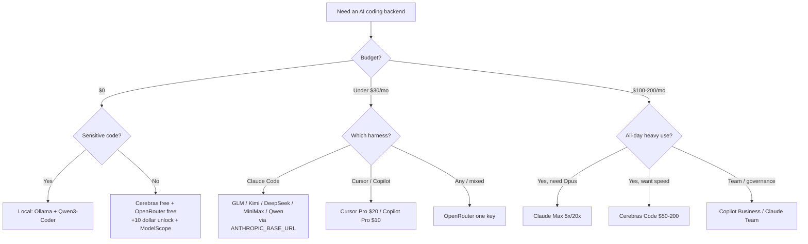

<div align="center">

# 🤖 Awesome AI Coding Subscriptions & APIs

[](https://awesome.re)
[](LICENSE)
[](CONTRIBUTING.md)

[](https://github.com/lildebil0/awesome-ai-coding-subscriptions/stargazers)

**अपने AI कोडिंग एजेंट के पीछे कौन-सा सब्सक्रिप्शन, कोडिंग प्लान, API, राउटर या फ्री टियर लगाएँ?**
एक चुना हुआ, बेंचमार्क किया हुआ, स्रोत-लिंक्ड जवाब — 💵 कीमत · 🧠 ताकत · 🔢 मॉडल · 📊 सीमाएँ · 🔌 इंटीग्रेशन के आधार पर रैंक किया गया।

[English](../README.md) · [简体中文](README.zh-CN.md) · [Español](README.es.md) · [Русский](README.ru.md) · [日本語](README.ja.md) · [Português](README.pt-BR.md) · [Français](README.fr.md) · [Deutsch](README.de.md) · [한국어](README.ko.md) · **हिन्दी**

</div>

---

यह सूची उन **प्लान्स को सूचीबद्ध करती है जिनके लिए आप पैसे देते हैं** — सब्सक्रिप्शन, फ्लैट-रेट कोडिंग प्लान, pay-as-you-go API, राउटर और फ्री टियर — कोडिंग टूल्स को **नहीं**। हार्नेस (Claude Code, Cline, Aider, Roo/Kilo, OpenCode) मुफ़्त है। पैसा जिस चीज़ में लगता है वह है उसके पीछे का मॉडल, इसलिए यहाँ उसी को रैंक किया गया है। हार्नेस तो बस *इंटीग्रेशन टारगेट* है।

किसी चीनी open-weight लैब (GLM, Kimi, DeepSeek, MiniMax, Qwen, Doubao) का $3–30/महीना वाला फ्लैट-रेट प्लान किसी मुफ़्त CLI हार्नेस पर लगाने से आपको SWE-bench पर लगभग 78–80% मिल जाता है, और वह भी एक $200 के फ्रंटियर सब्सक्रिप्शन की लागत के लगभग दसवें हिस्से में। फ्रंटियर सब्सक्रिप्शन सबसे कठिन कामों में अब भी जीतते हैं। इसलिए 2026 में ज़्यादातर लोग दोनों चलाते हैं: कठिन रीज़निंग के लिए एक फ्रंटियर सब्सक्रिप्शन, और बाकी सब के लिए एक सस्ता प्लान।

> ⚠️ **इस क्षेत्र में कीमतें हर महीने बदलती हैं।** आँकड़े **~जून 2026** को दर्शाते हैं। खरीदने से पहले हमेशा आधिकारिक पेज पर पुष्टि करें। कोई पुरानी कीमत मिली? [एक PR खोलें](CONTRIBUTING.md) — सुधार नई एंट्रीज़ जितने ही मूल्यवान हैं।

## संकेत-सूची

| बैज | अर्थ |
|-------|---------|
| 💎 | **छिपा हुआ रत्न** — कम चर्चित, जो मिलता है उसके हिसाब से कीमत कम है |
| 🆓 | इसमें एक **फ्री टियर** है जिस पर आप सचमुच एक एजेंट चला सकते हैं |
| ✅ | **कीमत आधिकारिक स्रोत के विरुद्ध फैक्ट-चेक की गई** (जून 2026) |
| ⭐ | वैल्यू रेटिंग (1–5): कीमत बनाम ताकत बनाम सीमाएँ बनाम इंटीग्रेशन |
| 🇨🇳 | चीन में होस्टेड (कुछ के लिए data-residency / latency चेतावनी) |
| ⚠️ | इसमें उल्लेखनीय जोखिम है (ToS, विश्वसनीयता, टिकाऊपन, रीसेलर) |

**इंटीग्रेशन शॉर्टहैंड:** `CC-native` = नेटिव Anthropic-कम्पैटिबल एंडपॉइंट, `ANTHROPIC_BASE_URL` के ज़रिए सीधा Claude Code बैकएंड। `OpenAI-compat` = बेस-URL बदलकर Cline/Roo/Kilo/Aider/Continue/OpenCode में काम करता है (Claude Code को shim/राउटर चाहिए)। `native-only` = वेंडर के अपने एडिटर/एजेंट तक सीमित, बैकएंड के रूप में दोबारा इस्तेमाल नहीं किया जा सकता।

## विषय-सूची

- [कैसे चुनें](#कैसे-चुनें)
- [बजट के हिसाब से चुनें](#बजट-के-हिसाब-से-चुनें)
- [आप कौन हैं उसके हिसाब से चुनें](#आप-कौन-हैं-उसके-हिसाब-से-चुनें)
- [TL;DR — उपयोग के हिसाब से शीर्ष चुनाव](#tldr--उपयोग-के-हिसाब-से-शीर्ष-चुनाव)
- [मास्टर तुलना तालिका](#मास्टर-तुलना-तालिका)
- [फर्स्ट-पार्टी फ्रंटियर सब्सक्रिप्शन](#फर्स्ट-पार्टी-फ्रंटियर-सब्सक्रिप्शन)
- [बंडल्ड टूल सब्सक्रिप्शन (एडिटर + मॉडल)](#बंडल्ड-टूल-सब्सक्रिप्शन-एडिटर--मॉडल)
- [फ्लैट-रेट कोडिंग प्लान — वैल्यू चैंपियन 💎](#फ्लैट-रेट-कोडिंग-प्लान--वैल्यू-चैंपियन-)
- [Pay-as-you-go वैल्यू API](#pay-as-you-go-वैल्यू-api)
- [स्पीड / फास्ट-इन्फरेंस प्रोवाइडर](#स्पीड--फास्ट-इन्फरेंस-प्रोवाइडर)
- [राउटर और गेटवे](#राउटर-और-गेटवे)
- [और जानने लायक प्रोवाइडर (2026)](#और-जानने-लायक-प्रोवाइडर-2026)
- [फ्री टियर 🆓](#फ्री-टियर-)
- [फ्री क्रेडिट और छात्र / स्टार्टअप कार्यक्रम](#फ्री-क्रेडिट-और-छात्र--स्टार्टअप-कार्यक्रम)
- [छात्र और शिक्षा प्लान 🎓](#छात्र-और-शिक्षा-प्लान-)
- [निच और विशेष](#निच-और-विशेष)
- [ऐप बिल्डर और स्वायत्त एजेंट](#ऐप-बिल्डर-और-स्वायत्त-एजेंट)
- [छिपे रत्न और रीसेलर प्रॉक्सी ⚠️](#छिपे-रत्न-और-रीसेलर-प्रॉक्सी-)
- [सेटअप रेसिपी — एक सस्ते प्लान को अपने हार्नेस में जोड़ें](#सेटअप-रेसिपी--एक-सस्ते-प्लान-को-अपने-हार्नेस-में-जोड़ें)
- [प्राइवेसी और data-residency मैट्रिक्स](#प्राइवेसी-और-data-residency-मैट्रिक्स)
- [प्रति-डॉलर बेंचमार्क](#प्रति-डॉलर-बेंचमार्क)
- [पैसों के जाल और आम गलतियाँ](#पैसों-के-जाल-और-आम-गलतियाँ)
- [2026 प्राइसिंग टाइमलाइन](#2026-प्राइसिंग-टाइमलाइन)
- [कम्युनिटी असल में क्या कहती है](#कम्युनिटी-असल-में-क्या-कहती-है)
- [सेल्फ-होस्ट और हाइब्रिड (जब सब्सक्रिप्शन जवाब नहीं है)](#सेल्फ-होस्ट-और-हाइब्रिड-जब-सब्सक्रिप्शन-जवाब-नहीं-है)
- [FAQ](#faq)
- [शब्दावली](#शब्दावली)
- [यह सूची कैसे स्कोर और मेंटेन की जाती है](#यह-सूची-कैसे-स्कोर-और-मेंटेन-की-जाती-है)
- [चेतावनियाँ और अस्वीकरण](#चेतावनियाँ-और-अस्वीकरण)
- [योगदान](#योगदान)
- [लाइसेंस](#लाइसेंस)
- [⭐ स्टार इतिहास](#-स्टार-इतिहास)

---

## कैसे चुनें

हर प्लान को पाँच आयामों पर स्कोर करें:

1. **💵 कीमत** — स्टिकर कीमत, और *असली* प्रभावी लागत (क्रेडिट रेशियो, पीक मल्टीप्लायर, ओवरेज)।
2. **🧠 ताकत** — मॉडल की गुणवत्ता; वैल्यू टियर ~78–80% SWE-bench Verified के आसपास गुच्छित है, फ्रंटियर 85–89% पर।
3. **🔢 मॉडल संख्या** — एक ऐसा प्लान जो कई मॉडल मल्टीप्लेक्स करता है (Qwen Coding Plan, OpenRouter) churn से बचाव करता है।
4. **📊 सीमाएँ** — प्रति 5-घंटे विंडो रिक्वेस्ट/टोकन, साप्ताहिक कैप, कॉनकरंसी। छिपी लागत: एक IDE "prompt" **5–30 मॉडल कॉल** में फैल जाता है, इसलिए विज्ञापित "prompts/5h" दिखने से ज़्यादा नरम होते हैं।
5. **🔌 इंटीग्रेशन** — क्या यह एक **नेटिव Anthropic एंडपॉइंट** उजागर करता है (साफ़ Claude Code drop-in) या सिर्फ़ OpenAI-compat (राउटर चाहिए)? या यह native-only है (कोई पुनः-उपयोग नहीं)?

**निर्णय शॉर्टकट:**

- **सबसे अच्छा एजेंट, सबसे सरल रास्ता** चाहिए → Claude Pro $20 → Max 5x $100.
- **प्रति डॉलर सबसे ज़्यादा कोडिंग** चाहिए → Claude Code पर एक फ्लैट-रेट प्लान (GLM / MiniMax / Qwen / Kimi)।
- **$0** चाहिए → Cerebras free + OpenRouter free (+$10 unlock) + NVIDIA NIM, कठिन कामों को किसी पेड मॉडल पर बढ़ाएँ।
- **सब कुछ के लिए एक की** चाहिए → OpenRouter.
- **प्राइवेसी (कोई चीन-होस्ट नहीं)** चाहिए → Synthetic.new (US, no-train, 14-दिन डिलीशन) या फर्स्ट-पार्टी US सब्सक्रिप्शन।



---

## बजट के हिसाब से चुनें

विश्लेषण में अटकने की ज़रूरत नहीं। अपना मासिक आँकड़ा ढूँढें, स्टैक उठाएँ।

| बजट | सबसे अच्छा चुनाव | आपको क्या मिलता है | सबसे समझदार स्टैक |
|---|---|---|---|
| **$0** 🆓 | **GitHub Copilot Free** + **Gemini CLI** | Copilot से 2,000 completions + 50 premium reqs/महीना; Google से एक उदार एजेंटिक CLI | autocomplete के लिए IDE में Copilot Free, एजेंट रन के लिए टर्मिनल में Gemini CLI, और तीसरी मुफ़्त Tab completions बकेट के रूप में [Cursor Hobby](https://cursor.com/pricing) |
| **< $10/महीना** | **GLM Coding Plan Lite** 💎 ($30/तिमाही ≈ $10/महीना) | ~3× Claude Pro उपयोग; एक [नेटिव Anthropic-कम्पैटिबल एंडपॉइंट](https://docs.z.ai/guides/overview/pricing) — Claude Code, Cline या OpenCode में सीधे लगाएँ | अपने Claude Code ड्राइवर के रूप में GLM Lite + ओवरफ्लो के लिए ऊपर फ्री टियर स्टैक करें |
| **~$10/महीना** | **GitHub Copilot Pro** ($10) | असीमित completions, $10 AI Credits, एजेंट मोड, मॉडल पिकर — [जून 2026 में usage-based credits पर शिफ्ट](https://github.blog/news-insights/company-news/github-copilot-is-moving-to-usage-based-billing/) | IDE में Copilot Pro + टर्मिनल में GLM Lite — कुल ~$20 में दो फ्रंटियर-जैसे ड्राइवर |
| **~$20/महीना** | **Claude Pro** ($20) *या* **Cursor Pro** ($20) | Pro: टर्मिनल/वेब/डेस्कटॉप में Claude Code, [Sonnet 4.6 + Opus 4.6](https://claude.com/pricing)। Cursor: असीमित Tab + $20 एजेंट उपयोग + Background Agents | Claude Pro (सबसे अच्छा कच्चा एजेंट) + इनलाइन autocomplete के लिए Copilot Free; या अगर आप एक एडिटर में रहते हैं तो अकेला Cursor Pro |
| **~$50/महीना** | **MiniMax Max** ($50) *या* **GLM Pro** (~$72/महीना) **+ Claude Pro** ($20) | एक हाई-वॉल्यूम फ्लैट प्लान (MiniMax ~1000 prompts/5h, या GLM Pro) *साथ ही* कठिन कामों के लिए नेटिव Anthropic गुणवत्ता | पिसाई के लिए सस्ता प्लान, मुश्किल रीज़निंग के लिए Claude Pro सुरक्षित — बोर्ड पर सबसे अच्छा $/throughput |
| **~$100/महीना** | **Claude Max 5x** ($100) | 5× Pro उपयोग, नवीनतम मॉडल तक प्राथमिकता पहुँच — उन डेवलपर्स के लिए स्वीट स्पॉट जो रोज़ Pro सीमाओं से टकराते हैं ([Max plan](https://support.claude.com/en/articles/11049741-what-is-the-max-plan)) | वर्कहॉर्स के रूप में Max 5x + सस्ते ओवरफ्लो लेन के रूप में GLM Lite ($10) जब आप 5x कैप जला दें |
| **~$200/महीना** | **Claude Max 20x** ($200) *या* **Cursor Ultra** ($200) | Max 20x: 20× Pro, टॉप व्यक्तिगत टियर। [Cursor Ultra](https://cursor.com/pricing): एक पूर्ण IDE में 20× उपयोग + प्राथमिकता फीचर | टर्मिनल-फर्स्ट पावर यूज़र्स के लिए Max 20x; विविधता/रिडंडंसी के लिए दूसरे वेंडर के मॉडल चाहिए तो ही Copilot Pro ($10) जोड़ें |

**अंगूठे के नियम**
- **$20 से कम और कीमत के प्रति संवेदनशील?** GLM Lite अभी कोडिंग में एक डॉलर का सबसे अच्छा सौदा है — यह Anthropic की API बोलता है, इसलिए आपकी Claude Code की आदत सीधे ट्रांसफर हो जाती है।
- **एक टूल, पूरे दिन?** नेटिव सब्सक्रिप्शन के लिए भुगतान करें (Claude Pro, Cursor Pro)। बँटवारा न करें।
- **भारी रोज़ाना उपयोगकर्ता?** सीधे Max 5x पर कूदें — यह दो $50 प्लान स्टैक करने से सस्ता है और कहीं कम झंझट वाला।
- **हर टियर पर प्रो चाल:** कठिन समस्याओं के लिए एक प्रीमियम ड्राइवर + बल्क एडिट और autocomplete के लिए एक सस्ती/मुफ़्त लेन। आपको शायद ही कभी दो $20+ सब्सक्रिप्शन की ज़रूरत होती है।

> कीमतें जून 2026 में सत्यापित। तिमाही-बिल्ड प्लान (GLM) प्रभावी मासिक के रूप में दिखाए गए। Copilot और GitHub प्लान [1 जून, 2026 को usage-based AI Credits पर शिफ्ट हुए](https://github.blog/news-insights/company-news/github-copilot-is-moving-to-usage-based-billing/) — आपका आवंटन बेस कीमत के साथ स्केल होता है।


---

## आप कौन हैं उसके हिसाब से चुनें

मैट्रिक्स को घूरने में समय न गँवाएँ। अपनी पंक्ति ढूँढें, चुनाव कॉपी करें, आगे बढ़ें। कीमतें USD/महीना, व्यक्तिगत टियर हैं जब तक अन्यथा न कहा हो (जून 2026)।

| आप हैं… | सबसे अच्छा चुनाव | यह आप पर क्यों फिट बैठता है | ~कीमत |
|---|---|---|---|
| **सोलो इंडी हैकर** 💎 | **Claude Pro** + ओवरफ्लो के रूप में एक Z.ai/DeepSeek API की | एक $20 सब्सक्रिप्शन टर्मिनल में Claude Code कवर करता है; जब आप स्प्रिंट के बीच 5-घंटे की कैप से टकराएँ, तो $100 टियर पर कूदने के बजाय किसी सस्ती वैल्यू-API पर वापस गिरें जिसका आप कम उपयोग करेंगे। रोज़ शिप करने वाले एक व्यक्ति के लिए सबसे अच्छा $/output। | $20 + चंद पैसे |
| **स्टार्टअप इंजी टीम (2–20)** | **GitHub Copilot Business** | $19/सीट में org पॉलिसी, public-code फ़िल्टर, **IP indemnity**, और केंद्रीय बिलिंग मिलती है — सबसे सस्ता प्लान जिसे निवेशकों/ग्राहकों के सामने रखना सुरक्षित है। भारी काम के लिए हर डेवलपर के अपने Claude/Cursor सब्सक्रिप्शन के साथ जोड़ता है। [pricing](https://github.com/features/copilot/plans) | $19/सीट |
| **एंटरप्राइज़** (गवर्नेंस / SSO / IP) | **Copilot Enterprise** या **Claude Enterprise** | Copilot Enterprise ($39/सीट) में SSO/SCIM, ऑडिट लॉग, codebase-indexed knowledge base, और वही Microsoft IP-indemnity-with-filter जुड़ता है। Claude Enterprise (सेल्स-कोटेड) विकल्प है अगर आप Anthropic-first हैं। दोनों procurement पास करते हैं। [Copilot Enterprise](https://docs.github.com/en/copilot/get-started/plans) | $39/सीट → कस्टम |
| **CS छात्र** 🆓 | **GitHub Copilot (Student)** + ChatGPT Free | सत्यापित छात्रों को **Copilot मुफ़्त में Pro स्तर पर** मिलता है (असीमित completions, premium मॉडल, मासिक premium-request आवंटन)। शून्य खर्च, असली टूलिंग। [Copilot plans](https://github.com/features/copilot/plans) | $0 |
| **OSS मेंटेनर** 🆓 | **OSS के लिए Copilot Pro मुफ़्त** + गहरे काम के लिए Claude Pro | लोकप्रिय रेपो के मेंटेनर मुफ़्त Copilot Pro के लिए योग्य हैं; मुश्किल रिफैक्टर के लिए एक $20 Claude Pro रखें। सबसे अच्छा public-good-to-cost अनुपात। | $0–$20 |
| **प्राइवेसी-फर्स्ट / रेग्युलेटेड** 🔒 | **लोकल स्टैक: Ollama + Qwen3-Coder + Continue.dev** | प्रोप्राइटरी कोड बॉक्स से कभी बाहर नहीं जाता — कोई API नहीं, कोई retention क्लॉज़ नहीं, बातचीत करने के लिए कोई DPA नहीं। सिंगल-फाइल काम पर cloud-Claude गुणवत्ता का लगभग 70–85%। अगर cloud इस्तेमाल करना ही पड़े, तो एक **zero-retention** API टियर जोड़ें। [setup](https://medium.com/@rodrigo.estrada/build-a-local-ai-coding-assistant-qwen3-ollama-continue-dev-cee0dbcd172a) | $0 (हार्डवेयर) |
| **ऑफ़लाइन / एयर-गैप्ड** | **Ollama + Qwen3-Coder-Next** (Continue.dev या OpenCode) | वही लोकल स्टैक, लेकिन यह *एकमात्र* श्रेणी है जो नेटवर्क केबल निकालकर भी काम करती है। Qwen3-Coder-Next एक 80B MoE से ~3B सक्रिय पैरामीटर चलाता है — असली हार्डवेयर में फिट, कभी इंटरनेट नहीं। [models](https://localaimaster.com/models/best-local-ai-coding-models) | $0 |
| **वाइब-कोडर / शौकीन** 🆓 | **फ्री टियर सैम्पलर**: ChatGPT Free या Copilot Free + Gemini free | सप्ताहांत पर मज़े के लिए बनाना — कुछ भी मत चुकाओ। Copilot Free के 2,000 completions/महीना और एक चैट मॉडल कैज़ुअल साइड प्रोजेक्ट कवर करते हैं। तभी अपग्रेड करें जब मुफ़्त सीमाएँ सचमुच काटें। | $0 |
| **समानांतर एजेंट चलाने वाला पावर-यूज़र** 💎 | **Claude Max 20x** (या fan-out के लिए एक वैल्यू-API स्टैक करें) | अगर आप swarm / समानांतर Claude Code सेशन ऑर्केस्ट्रेट करते हैं, तो 20x उपयोग सीमा वही है जो आपको दोपहर 2 बजे सीमाओं से टकराने से रोकती है। इस वॉल्यूम पर समतुल्य API टोकन जलाने से सस्ता। फेंकने लायक वर्कर एजेंट के लिए एक DeepSeek/Z.ai की जोड़ें। | $200 |

**दो आर-पार चलने वाले अंगूठे के नियम:**
- **$20 → $100/$200** की छलांग तभी फायदेमंद है अगर आप *व्यक्तिगत रूप से* हफ़्ते में ~दो बार से ज़्यादा उपयोग कैप से टकराते हैं। ज़्यादातर लोग नहीं टकराते — अपग्रेड करने से पहले इसे ट्रैक करें।
- **IP indemnity एक प्लान फीचर है, मॉडल फीचर नहीं।** यह Copilot **Business** से शुरू होता है और public-code फ़िल्टर ऑन चाहिए — फ्री और Pro टियर इसे नहीं रखते। अगर कोई वकील कभी आपका रेपो पढ़ेगा, तो यही वह लाइन है जो मायने रखती है। [details](https://github.com/features/copilot/plans)

स्रोत:
- [GitHub Copilot Plans & pricing](https://github.com/features/copilot/plans)
- [Plans for GitHub Copilot — GitHub Docs](https://docs.github.com/en/copilot/get-started/plans)
- [AI Pricing Compared 2026 — AIViewer](https://aiviewer.ai/guides/ai-pricing-comparison-2026/)
- [Build a Local AI Coding Assistant — Qwen3 + Ollama + Continue.dev](https://medium.com/@rodrigo.estrada/build-a-local-ai-coding-assistant-qwen3-ollama-continue-dev-cee0dbcd172a)
- [Best Local AI Coding Models for Ollama (2026)](https://localaimaster.com/models/best-local-ai-coding-models)


---

## TL;DR — उपयोग के हिसाब से शीर्ष चुनाव

| उपयोग | चुनाव | क्यों | ~कीमत |
|----------|------|-----|--------|
| 🏆 **सर्वश्रेष्ठ कुल वैल्यू** | **GLM Coding Plan** 💎🇨🇳 | GLM-5.1 Opus कोडिंग का ~94%; नेटिव Claude Code; सबसे सस्ता गंभीर प्रवेश | ~$10/महीना (तिमाही Lite) – $72 Pro |
| 🥇 **सर्वश्रेष्ठ कच्चा फ्रंटियर** | **Claude Max 5x** | Claude Code में Opus खोलता है, सर्वसम्मति से #1 एजेंट | $100/महीना |
| 🪙 **सबसे सस्ता गंभीर प्रवेश** | **Trae Lite $3** / **StepFun $6.99** / **MiMo ~$5** / **GLM Lite ~$10** 💎 | एक कप कॉफ़ी की कीमत में असली कोडिंग बैकएंड | $3–10/महीना |
| 💸 **प्रति टोकन सबसे सस्ता** | **DeepSeek V4-Flash** 💎 | $0.14/M in, $0.0028/M cache-hit, 1M ctx, CC-native | pay-go |
| 🧪 **सर्वश्रेष्ठ मुफ़्त** | **Cerebras free** 🆓 + **OpenRouter :free** 🆓 | 1M tok/दिन (तेज़) + Qwen3-Coder-480B मुफ़्त | $0 |
| ⚡ **सर्वश्रेष्ठ तेज़+सस्ता** | **Groq** 💎🆓 / **Cerebras Code** | नेटिव Anthropic एंडपॉइंट (Groq); ~2000 tok/s फ्लैट-रेट (Cerebras) | free / $50/महीना |
| 🔀 **सर्वश्रेष्ठ यूनिवर्सल राउटर** | **OpenRouter** | 315+ मॉडल, एक की, Anthropic skin, कोई टोकन markup नहीं | pay-go +5.5% |
| 🔒 **सर्वश्रेष्ठ प्राइवेसी (US-host)** | **Synthetic.new** 💎 | US इंफ्रा, no-train, 14-दिन डिलीशन, dual OpenAI+Anthropic compat | $20–60/महीना |
| 🧰 **बड़े codebase के लिए सर्वश्रेष्ठ** | **Augment Code** ✅ | monorepo के लिए बेस्ट-इन-क्लास Context Engine | $20+/महीना |
| 🏢 **सर्वश्रेष्ठ टीम वैल्यू** | **Claude Team Premium seat** 💎 | ≈ Max-5x उपयोग + SSO/admin | $100/सीट |


---

## मास्टर तुलना तालिका

मोटे तौर पर वैल्यू के हिसाब से क्रमबद्ध। कीमतें ~जून 2026; **खरीदने से पहले सत्यापित करें**।

| प्लान | प्रकार | कीमत | मॉडल | सीमाएँ (कोडिंग) | इंटीग्रेशन | ⭐ | नोट्स |
|------|------|-------|--------|-----------------|-------------|----|-------|
| [GLM Coding Plan](#glm-coding-plan-zai) | flat-rate | Lite $18 · Pro $72 · Max $160 /महीना (तिमाही Lite ~$10/महीना) | GLM-5.1/5/4.7 | Lite ~80, Pro ~400 prompts/5h | CC-native | ⭐5 | 💎🇨🇳✅ |
| [DeepSeek API](#deepseek) | pay-go API | V4-Pro $0.435/$0.87; Flash $0.14/$0.28 | V4-Pro/Flash | 1M ctx, 500–2500 concur | CC-native | ⭐5 | 💎🇨🇳✅ |
| [MiniMax Coding Plan](#minimax) | flat-rate | $10–50/महीना | M2.7 (plan), M2.5/M3 (API) | Starter ~100, Max ~1000 prompts/5h | CC-native | ⭐5 | 💎🇨🇳 |
| [Kimi Code](#kimi-moonshot) | flat-rate+API | ~$19/महीना + metered | K2.6 (1T) | ~300–1200 calls/5h, 30 concur | CC-native | ⭐5 | 💎🇨🇳 |
| [Qwen Cloud Coding Plan](#qwen-alibaba) | flat-rate | Pro $50/महीना (Lite $10, closed) | Qwen3.5 + Kimi/GLM/MiniMax | Pro 6000 req/5h, 1M ctx | CC-native | ⭐4 | 💎🇨🇳✅ |
| [OpenRouter](#openrouter) | router | pay-go, +5.5% top-up | 315+ (वे सभी) | balance-bound; free models 50–1000/day | CC-native skin | ⭐5 | 🆓 |
| [Claude Pro](#anthropic-claude) | first-party | $20/महीना | Sonnet 4.6 (no Opus) | ~40–45 msg/5h + weekly | CC-native | ⭐5 | सर्वश्रेष्ठ प्रवेश |
| [Claude Max 5x](#anthropic-claude) | first-party | $100/महीना | + Opus 4.6/4.7 | ~50–225 prompts/5h | CC-native | ⭐5 | Opus unlocked |
| [Cerebras Code](#cerebras) | flat-rate speed | $50/$200 | GLM-4.7 (~2000 tok/s) | 24M–120M tok/day, 131k ctx | OpenAI-compat | ⭐5 | ✅ अक्सर sold out |
| [Synthetic.new](#synthetic) | flat-rate (US) | $20–60/महीना | 16 open-weight (GLM/Kimi/Qwen/DS) | ~125–1250 req/5h | CC-native | ⭐5 | 💎🔒 |
| [Chutes](#chutes) | flat-rate ⚠️ | $3/$10/$20 | GLM-5/Kimi/DS/MiniMax/Qwen | 300/2000/5000 req/day | OpenAI-compat | ⭐5 | 💎⚠️ decentralized ✅ |
| [Grok Code Fast 1](#xai-grok) | pay-go API | $0.20/$1.50/M | grok-code-fast-1 | 256K ctx, ~92 tok/s | CC-native | ⭐5 | 💎 OpenRouter पर #1 |
| [ChatGPT Plus](#openai-chatgpt--codex) | first-party | $20/महीना | GPT-5.x-Codex | token-credit metered | Codex-native | ⭐4 | Codex #2 एजेंट |
| [ChatGPT Pro](#openai-chatgpt--codex) | first-party | $100/$200 (5x/20x) | GPT-5.5-Codex | high; dedicated GPU | Codex-native | ⭐4 | |
| [Claude Max 20x](#anthropic-claude) | first-party | $200/महीना | Opus 4.6/4.7 | ~200–900 prompts/5h | CC-native | ⭐4 | पावर टियर |
| [Cursor Pro / Ultra](#cursor) | bundled | $20 / $200 | all frontier + Auto | $20 / $400 usage pool | Native-only | ⭐4 | Ultra = 2× credit ratio |
| [GitHub Copilot Pro](#github-copilot) | bundled | $10/महीना | GPT-5/Claude/Gemini | $10 AI-credits (usage) | Native-only (+ACP) | ⭐4 | मुफ़्त completions 🆓 |
| [DeepInfra](#deepinfra) | speed/API | pay-go (सबसे सस्ता OSS) | Kimi/DS/Qwen3-Coder/GLM | balance-bound | CC-native | ⭐5 | 💎✅ सबसे सस्ता होस्ट |
| [Groq](#groq) | speed/API | pay-go + free | GPT-OSS/Qwen3/Kimi | free RPM/TPM caps | CC-native | ⭐4 | 💎🆓 |
| [Vercel AI Gateway](#vercel-ai-gateway) | router | $0 markup (even BYOK) | 100s incl. Claude | $5/महीना free credits | CC-native | ⭐4 | 💎🆓✅ |
| [Requesty](#requesty) | router | +5% flat | Claude/GPT/Gemini/DS/Qwen | semantic cache ~40% off | OpenAI-compat | ⭐4 | 💎 team governance |
| [Mistral Le Chat Pro](#mistral) | first-party | $14.99/महीना ($5.99 student) | Devstral 2 + Vibe CLI | ~25 free msg/day | Native-only | ⭐4 | 💎🆓🇪🇺 सबसे सस्ता major sub |
| [Augment Code](#बंडल्ड-टूल-सब्सक्रिप्शन-एडिटर--मॉडल) | bundled | $20–200/महीना | Claude/Gemini/GPT | 40k–450k credits/महीना | Native-only | ⭐4 | ✅ सर्वश्रेष्ठ big-repo context |
| [Zed Pro](#बंडल्ड-टूल-सब्सक्रिप्शन-एडिटर--मॉडल) | bundled | $10/महीना | any (BYO key/ACP) | $5 credits + usage | ACP + BYOK | ⭐4 | 💎 anti-lock-in |
| [Cerebras free](#फ्री-टियर-) | free | $0 | Qwen3-Coder-480B, GPT-OSS-120B | 1M tok/day, 8K ctx cap | OpenAI-compat | ⭐5 | 💎🆓 सबसे तेज़ मुफ़्त |
| [Google AI Studio](#फ्री-टियर-) | free | $0 | Gemini 2.5 Flash, Gemma 3 27B | Flash 250 RPD; Gemma 14.4k RPD | OpenAI-compat | ⭐4 | 🆓 सबसे बड़ा free ctx |


---

## फर्स्ट-पार्टी फ्रंटियर सब्सक्रिप्शन

सीधे वेंडर से मिलने वाले प्लान। एक सब्सक्रिप्शन लॉगिन के ज़रिए **वेंडर के अपने हार्नेस** (Claude Code, Codex CLI, Antigravity, Grok Build) को प्रमाणित करता है — यह आपको थर्ड-पार्टी OpenAI-compat टूल्स के लिए एक जेनेरिक API की **नहीं** देता (वह अलग प्रति-टोकन बिलिंग है)। अपवाद: xAI Grok मॉडल OpenAI/Anthropic-कम्पैटिबल हैं।

> एजेंटिक कोडिंग के लिए वैल्यू वरीयता क्रम (जून 2026 सर्वसम्मति): **Claude > OpenAI Codex > Google Gemini > xAI Grok**। एक स्वतंत्र 30-दिन के परीक्षण ने Claude को ~95% बनाम ChatGPT को ~85% कोडिंग सटीकता पर रखा; वेंडर SWE-bench में GPT-5.5 (88.7%) ≈ Opus 4.7 (87.6%)।

### Anthropic (Claude)
- **[Claude Pro](https://claude.com/pricing)** — `$20/महीना` ($17 वार्षिक)। Claude Code में Sonnet 4.6 (**Opus नहीं**)। ~40–45 msg/5h + साप्ताहिक कैप, चैट/Cowork के साथ साझा। **#1 कोडिंग एजेंट का सर्वश्रेष्ठ वैल्यू प्रवेश बिंदु।** अप्रैल 2026 ने 5h सीमाएँ दोगुनी कीं और पीक throttling हटाई। ⭐5
- **[Claude Max 5x](https://support.claude.com/en/articles/11049741-what-is-the-max-plan)** — `$100/महीना`। **Opus 4.6/4.7 खोलता है** + 5× throughput (~50–225 prompts/5h)। प्रो स्वीट-स्पॉट; एक $100 मध्य टियर जिसका OpenAI/Google उपयोगी रूप से मुकाबला नहीं करते। ⭐5
- **[Claude Max 20x](https://support.claude.com/en/articles/11049741-what-is-the-max-plan)** — `$200/महीना`। ~200–900 prompts/5h। पूरे-दिन समानांतर एजेंट के लिए; **flat-rate-beats-API** गणित निर्णायक है (Claude Code के 90%+ टोकन cache-reads हैं, सब्सक्रिप्शन पर मुफ़्त, API पर बिल — एक डेवलपर का पीक महीना = API पर $5,623 ≈ Max 5x के 4.5 साल)। ⭐4
- **[Claude Team Premium seat](https://claude.com/pricing)** 💎 — `$100/सीट` (वार्षिक)। ≈ Max-5x उपयोग **साथ ही** SSO/admin/audit/enterprise-search। चुपचाप सबसे अच्छी *टीम* कोडिंग वैल्यू; Standard $20 सीट में भी Claude Code शामिल है। ⭐4

### OpenAI (ChatGPT / Codex)
- **[ChatGPT Plus](https://help.openai.com/en/articles/11369540-using-codex-with-your-chatgpt-plan)** — `$20/महीना`। Codex CLI/IDE बंडल्ड (GPT-5.5/5.4/5.3-Codex)। अप्रैल 2026 से **token-credit metered** (भ्रमित करने वाला)। Codex = सर्वसम्मति #2 एजेंट। भारी एजेंटिक काम पर Plus कैप जल्दी खत्म हो जाती है। ⭐4
- **[ChatGPT Pro](https://developers.openai.com/codex/pricing)** — `$100` (5x) / `$200` (20x)। उच्च throughput + dedicated GPU। ध्यान दें कि $100-टियर का "10x boost" प्रोमो **31 मई 2026 को समाप्त हो गया** (अब 5x)। क्लासिक "$200 प्लान worth it?" बहस = Claude Max 20x बनाम ChatGPT Pro 20x। ⭐4

### Google (Gemini)
- **[Google AI Pro](https://gemini.google/subscriptions/)** — `$19.99/महीना` (पहले साल अक्सर 50% छूट)। Google One AI Premium से नाम बदला (अप्रैल 2026)। Gemini 3.x Pro, 5 TB स्टोरेज, और **उन्नत [Antigravity](#ऐप-बिल्डर-और-स्वायत्त-एजेंट) + Jules** कोडिंग-एजेंट पहुँच। ✅
- **[Google AI Ultra](https://blog.google/products-and-platforms/products/google-one/google-ai-subscriptions/)** — I/O 2026 पर **`$100/महीना` (5x, नया dev tier)** / **`$200/महीना` (20x, $250 से घटाया)**। Gemini ऐप **और** Antigravity में 5×/20× उपयोग; टॉप tier में Deep Think, Project Genie, 30 TB जुड़ते हैं। ✅
- ⚠️ **Google ओपन-सोर्स Gemini CLI को 18 जून 2026 को बंद कर रहा है**, उपयोगकर्ताओं को बंद Antigravity CLI में माइग्रेट करते हुए जिसमें कहीं कम फ्री कोटा है (~1000 → ~20 req/दिन) — 2026 की सबसे बड़ी कम्युनिटी शिकायत।

### xAI (Grok)
- **[SuperGrok](https://x.ai/pricing)** — `$30/महीना` ($300/साल) / Heavy `$300/महीना`। (मौजूदा प्राइसिंग पेज पर कोई स्वतंत्र "Lite" tier नहीं — यह एक legacy/X-Premium-बंडल अवशेष है; पुराने $10 आँकड़े नज़रअंदाज़ करें।) Grok Build CLI **8 समानांतर sub-agents को अलग git worktrees में** चलाता है (नया) और सभी SuperGrok सब्सक्रिप्शन में शामिल है। `grok-code-fast-1` का एक cult following है (सस्ता+तेज़)। SWE-bench ~70.8% लीडर्स से पीछे। **कोडिंग के लिए, [xAI API](#xai-grok) अक्सर बेहतर खरीद है।** ⭐3 💎


---

## बंडल्ड टूल सब्सक्रिप्शन (एडिटर + मॉडल)

यहाँ प्लान *ही* उत्पाद है — आप वेंडर के एडिटर/एजेंट में निवेश करते हैं। 2026 का रुझान: लगभग सभी फिक्स्ड रिक्वेस्ट गिनती से **credits / token-metering** पर शिफ्ट हुए, जिससे लागत *कम* अनुमानित हो गई (ज़ोरदार विरोध)।

### Cursor
- **[Cursor](https://cursor.com/pricing)** — Hobby मुफ़्त · **Pro `$20`** · **Pro+ `$60`** 💎 · **Ultra `$200`**। जून 2025 से, आपकी प्लान कीमत = API दरों पर एक usage pool। **Credit ratio ऊपरी टियर में सुधरता है**: Pro $20/$20 (1×), Pro+ $60/$70 (1.17×), Ultra $200/$400 (**2×, सर्वश्रेष्ठ**)। `Auto` मोड वैल्यू की कुंजी है — प्रभावी रूप से असीमित, Claude/MAX को पिन करने की तरह pool नहीं खींचता। ⚠️ जून-2025 के स्विच ने एक [pricing disaster](https://www.wearefounders.uk/cursors-pricing-disaster-the-full-timeline-of-how-an-ai-coding-darling-burned-its-most-loyal-users/) पैदा किया (HN उपयोगकर्ता: "एक हफ़्ते में $350 ओवरेज"); CEO ने माफ़ी माँगी + रिफंड किया। **Native-only** — Claude Code को बैक नहीं कर सकता, और जनवरी 2026 तक आप Claude सब्सक्रिप्शन को Cursor *में* भी रूट नहीं कर सकते। बेस्ट-इन-क्लास Tab/Apply। ⭐4

### GitHub Copilot
- **[GitHub Copilot](https://github.com/features/copilot/plans)** — Free 🆓 · **Pro `$10`** · Pro+ `$39` · Max `$100` · Business `$19` · Enterprise `$39`। ⚠️ **1 जून 2026 को usage-based AI Credits पर शिफ्ट** (1 credit = $0.01); हर प्लान में एक credit pool शामिल है (Pro=$15, Pro+=$70)। **कोड completions असीमित और मुफ़्त रहती हैं** — सिर्फ़-completion उपयोगकर्ता अप्रभावित। विरोध गंभीर (TechTimes: एजेंटिक बिल 10×–50× उछले)। org के लिए बेस्ट-इन-क्लास IDE completions + governance/IP-indemnity। **Native-only** (बचने का रास्ता: Copilot CLI ACP बोलता है)। ⭐4

### अन्य
- **[Augment Code](https://www.augmentcode.com/pricing)** ✅ — Indie `$20`/40k credits · Standard `$60` · Max `$200`। बड़े monorepo के लिए **बेस्ट-इन-क्लास Context Engine** (context-recall तुलनाओं में शीर्ष)। VS Code + JetBrains + Auggie CLI। Native-only। टूल-भारी कामों पर credit burn शिकायत है। ⭐4 💎
- **[Zed Pro](https://zed.dev/pricing)** 💎 — Free · **Pro `$10`** (सिर्फ़ +10% markup) · Business `$30`। **anti-lock-in** चुनाव: ओपन [ACP](https://zed.dev/docs/ai/) बाहरी एजेंट चलाता है (Claude Code, Codex, OpenCode) और किसी भी प्रोवाइडर के लिए BYO keys। सबसे तेज़ नेटिव एडिटर। ⭐4
- **[Kiro](https://kiro.dev/pricing/)** 💎 — Free · **Pro `$20`/1k credits** · Pro+ `$40` · Power `$200`। सर्वश्रेष्ठ **spec-driven** एजेंट (requirements→design→tasks), Opus 4.7 सहित पूरी Claude लाइनअप, फ्रैक्शनल 0.01-credit बिलिंग। **AWS Startups = Pro+ का 1 मुफ़्त साल।** ⭐4
- **[Trae](https://www.trae.ai/pricing)** 💎🇨🇳 — Free · **Lite `$3`** · Pro `$10` · Ultra `$100`। ByteDance VS Code fork; usage pool स्टिकर से ज़्यादा (जैसे $10 के लिए $20 उपयोग) = "$3 वाला Cursor विकल्प।" ⚠️ ByteDance टेलीमेट्री affiliates के साथ साझा — एंटरप्राइज़ डीलब्रेकर। ⭐4
- **[Sourcegraph Amp](https://sourcegraph.com/amp)** — शुरू करने के लिए मुफ़्त ($10 credit; ex-Cody के लिए $40)। शुद्ध **consumption** (कोई मासिक फ़्लोर नहीं), "smart" मोड में Opus 4.8 चलाता है। हल्के उपयोग के लिए बढ़िया, भारी के लिए uncapped-burn जोखिम। Cody Free/Pro को Amp में रिटायर कर दिया गया। ⭐3
- **[JetBrains AI / Junie](https://www.jetbrains.com/ai-ides/buy/)** — प्रिय IDE इंटीग्रेशन, लेकिन Junie **credits तेज़ी से जलाता है** (Ultimate के 35 credits ~4–5 दिनों में खत्म)। सिर्फ़ तभी अगर आप JetBrains में रहते हैं।
- **महँगे / बचें:** **Tabnine** ($39 फ़्लोर, कोई फ्री टियर नहीं, वार्षिक लॉक-इन — सिर्फ़ on-prem/air-gap ज़रूरतों के लिए); **Windsurf Pro** (मार्च 2026 का daily/weekly कोटा में स्वैप साल का सबसे ज़्यादा शिकायत वाला बदलाव, post-Cognition भरोसा कम)। **Supermaven** स्टैंडअलोन के रूप में मर चुका है (नवंबर 2025 में Cursor Tab में मिल गया)।


---

## फ्लैट-रेट कोडिंग प्लान — वैल्यू चैंपियन 💎

फिक्स्ड मासिक या तिमाही प्लान जो आपके हार्नेस के पीछे एक फ्रंटियर-जैसा open-weight मॉडल लगाते हैं, ज़्यादातर चीनी लैब से। ज़्यादातर एक नेटिव Anthropic एंडपॉइंट उजागर करते हैं, इसलिए वे `ANTHROPIC_BASE_URL` के ज़रिए Claude Code में सीधे लग जाते हैं। एंडपॉइंट सूची के लिए, देखें [Alorse/cc-compatible-models](https://github.com/Alorse/cc-compatible-models)।

> सर्वसम्मति वरीयता क्रम: **GLM** (सबसे सस्ता प्रवेश, कम्युनिटी डिफ़ॉल्ट) · **MiniMax** (सर्वश्रेष्ठ price/volume) · **Kimi** (सर्वश्रेष्ठ long-horizon एजेंट) · **Qwen** (>262K context, multi-model)। Claude Pro $20 वह गुणवत्ता बेंचमार्क है जिसे वे नीचे काटते हैं।

<a name="glm-coding-plan-zai"></a>
### GLM Coding Plan — Z.ai (Zhipu AI) 💎🇨🇳 ✅
- **विदेशी मासिक कीमत (जून 2026 सत्यापित):** `Lite $18/महीना` · `Pro $72/महीना` · `Max $160/महीना` — कीमतें 11 अप्रैल 2026 को ~दोगुनी हुईं। **तिमाही Lite सस्ता रास्ता है** (~$30/तिमाही ≈ $10/महीना)। चीन का घरेलू दाम काफ़ी सस्ता है (~$7 / $21 / $68 प्रति महीना)। वायरल **$3/महीना** प्रोमो 11 फ़रवरी 2026 को समाप्त हुआ। ✅
- मॉडल: **GLM-5.1** (Opus 4.6 कोडिंग का ~94%) · GLM-5/5-Turbo · GLM-4.7 · GLM-4.5-Air। **हर tier (Lite सहित) को सभी मॉडल और पूरा 200K कॉन्टेक्स्ट मिलता है** (128K अधिकतम आउटपुट) — tier सिर्फ़ कोटा में अलग होते हैं, मॉडल या कॉन्टेक्स्ट विंडो में नहीं। सुझाई मैपिंग: GLM-5.1 → Opus स्लॉट (कठिन काम, फ्रंटएंड/UI), GLM-4.7 → Sonnet (×1-कोटा वर्कहॉर्स), GLM-4.5-Air → Haiku (तेज़ बैकग्राउंड)।
- सीमाएँ: Lite ~80, Pro ~400, Max ~1,600 prompts/5h + साप्ताहिक (एक IDE "prompt" = 5–30 मॉडल कॉल)। ⚠️ सिर्फ़ GLM-5/5.1 पर **पीक-घंटे का 3× मल्टीप्लायर**, **14:00–18:00 UTC+8 (≈08:00–12:00 कालिनिनग्राद)**; ऑफ-पीक 2× (जून 2026 के अंत तक प्रोमो से ऑफ-पीक 1×)। भारी GLM-5.1 ऑफ-पीक में चलाएँ।
- इंटीग्रेशन: `ANTHROPIC_BASE_URL=https://api.z.ai/api/anthropic` — आधिकारिक Claude Code सपोर्ट + Cline/Roo/Kilo/OpenCode (20+ टूल)। **फर्स्ट-पार्टी** = कोई रीसेलर बैन जोखिम नहीं।
- > *2026 का सबसे ज़्यादा सुझाया गया बजट कोडिंग प्लान।* "~$30/महीना में 3× Claude Max उपयोग।" फ़रवरी की कीमत वृद्धि + ⅓ कोटा कटौती पर विरोध, फिर भी टॉप वैल्यू रेटेड। ⭐5
- स्रोत: [z.ai/subscribe](https://z.ai/subscribe) · [pricing](https://docs.z.ai/guides/overview/pricing) · [GLM-5.1 review](https://serenitiesai.com/articles/glm-5-1-coding-plan-review-2026)

<a name="minimax"></a>
### MiniMax Coding / Token Plan 💎🇨🇳
- `Starter $10/महीना` · `Plus $20` · `Max $50` (वार्षिक पर 2 महीने मुफ़्त); High-Speed वैरिएंट $40–150।
- मॉडल: प्लान पर M2.7 / M2.7-Highspeed; **M2.5/M3** (1M ctx) API के ज़रिए। ⚠️ **प्लान अक्सर बेंचमार्क किए गए M2.5/M2.7 से पुराना मॉडल (M2.1) परोसता है।**
- सीमाएँ: Starter ~100 → Max ~1,000 prompts/5h; ~50 TPS (100 high-speed)।
- इंटीग्रेशन: `ANTHROPIC_BASE_URL=https://api.minimax.io/anthropic` + OpenAI-compat।
- > "मेरा Claude Code बिल आधा कर दिया।" फ्लैट-रेट बकेट में **सर्वश्रेष्ठ कच्चा price/volume**; M2.7 ~1/5 इनपुट लागत पर GLM-5.1 का ~94%। ⭐5
- स्रोत: [coding plan](https://platform.minimax.io/subscribe/coding-plan) · [M2.5 pricing](https://www.verdent.ai/guides/minimax-m2-5-pricing)

<a name="kimi-moonshot"></a>
### Kimi Code — Moonshot AI 💎🇨🇳
- `~$19/महीना सदस्यता` + metered API (K2.6 $0.60–0.95/M in, $2.50–4.00/M out, 75% cache discount)। टियर्ड Moderato/Allegretto/Vivace।
- मॉडल: **Kimi K2.6** (1T MoE, ~80.2% SWE-bench), K2.5।
- सीमाएँ: ~300–1,200 calls/5h, **30 concurrent** (समानांतर एजेंट के लिए उदार)।
- इंटीग्रेशन: `ANTHROPIC_BASE_URL=https://api.moonshot.ai/anthropic` — सच्चा Claude Code drop-in; अपना Kimi CLI शिप करता है (6.4k★)।
- > **सर्वश्रेष्ठ long-horizon एजेंट स्थिरता** (एक 13-घंटे के सेशन में 4,000+ टूल कॉल सस्टेन)। "कोडिंग लागत का 88% बचाते हुए।" ओपन समूह में सबसे महँगा इनपुट-साइड। ⭐5
- स्रोत: [agent support](https://platform.kimi.ai/docs/guide/agent-support) · [Kimi Code guide](https://www.nxcode.io/resources/news/kimi-code-2026-plans-pricing-developer-guide)

<a name="qwen-alibaba"></a>
### Qwen Cloud Coding Plan — Alibaba 💎🇨🇳 ✅
- `Pro $50/महीना` (Lite ~$10 20 मार्च 2026 से **नए सब्सक्रिप्शन के लिए बंद**)।
- मॉडल: Qwen3.5-Plus, Qwen3-Coder-Next/Plus/480B + एक की के तहत क्रॉस-मॉडल **Kimi/GLM/MiniMax**। **1M-टोकन context** (लेन में सर्वश्रेष्ठ)।
- सीमाएँ: Pro 6,000 req/5h + 45k/सप्ताह + 90k/महीना (sliding window)। समर्पित `sk-sp-` की (pay-go के साथ अदला-बदली नहीं)।
- इंटीग्रेशन: `ANTHROPIC_BASE_URL=https://coding-intl.dashscope.aliyuncs.com/apps/anthropic` + Qwen Code CLI।
- > खासियत = **एक प्लान Qwen+Kimi+GLM+MiniMax मल्टीप्लेक्स करता है** और एकमात्र विश्वसनीय 1M-context फ्लैट प्लान। ⭐4
- स्रोत: [Model Studio coding plan](https://www.alibabacloud.com/help/en/model-studio/coding-plan)

### Open-weight फ्लैट सब्सक्रिप्शन (प्राइवेसी / US-host)
- **[Synthetic.new](https://synthetic.new/pricing)** 💎🔒 — `$20–60/महीना`। ~16 हमेशा-ऑन open-weight मॉडल (Kimi/GLM/Qwen3-Coder-480B/DeepSeek)। **US इंफ्रा, no-training, 14-दिन डिलीशन।** **Dual OpenAI + Anthropic compat** = सच्चा Claude Code drop-in। चीन प्लान का प्राइवेसी-सचेत विकल्प। ⭐5
- **[Cerebras Code](#cerebras)** — `$50`/`$200`, फ्लैट-रेट स्पीड (देखें [स्पीड](#स्पीड--फास्ट-इन्फरेंस-प्रोवाइडर))।
- **[OpenCode Go (Zen)](https://opencode.ai/go)** 💎 — पहला महीना `$5` फिर `$10/महीना` फ्लैट। ~12–14 चीनी open-weight मॉडल (GLM-5.1/Kimi/Qwen3.7/DeepSeek V4/MiniMax)। OpenCode में फर्स्ट-क्लास। कोई Claude/GPT नहीं। ⭐4

### निच / सस्ते-टियर फ्लैट प्लान 🇨🇳
- **[StepFun Step Plan](https://github.com/Alorse/cc-compatible-models)** — `$6.99`–`$99/महीना`, 100–5,000 prompts/5h, CC-native। कीमत में कटौती करने वाला, मॉडल कम परखे हुए। ⭐3
- **MiMo (Xiaomi)** — `$6`–`$100/महीना` credit-based (60M–1.6B), CC-native (`api.xiaomimimo.com`), मल्टीमॉडल Omni सहित। मुश्किल से बेंचमार्क किया गया। ⭐3
- **Atlas Cloud** 💎 — `$10`/`$20`, 800k–1.8M credits/**दिन**, OpenAI-compat (Claude Code/Codex/OpenCode)। स्वायत्त एजेंट के लिए डेली-क्रेडिट मॉडल। ⭐4
- **Factory Droid** 💎 — `$20/महीना` से token-based, फ्रंटियर मॉडल (Claude/GPT/Gemini), रोलिंग 5h/7d/30d विंडो। उल्लेखनीय "मैंने Droid के लिए दो $200 Max प्लान रद्द किए" वाली कहानी। ⭐4


---

## Pay-as-you-go वैल्यू API

वैल्यू लैब से प्रति-टोकन पहुँच। एजेंट लूप के लिए **Cache pricing ही असली लागत चालक है** — हेडलाइन इनपुट कीमत की बजाय cache hits के लिए डिज़ाइन करें।

<a name="deepseek"></a>
### DeepSeek 💎🇨🇳 ✅
- **V4-Pro** `$0.435/M in · $0.0036/M cache-hit · $0.87/M out` (**75% कटौती अब स्थायी है**)। **V4-Flash** `$0.14 / $0.0028 / $0.28`। 1M context, 384K max output।
- इंटीग्रेशन: OpenAI-compat **+ नेटिव Anthropic** (`https://api.deepseek.com/anthropic`) — drop-in Claude Code (`ANTHROPIC_MODEL=deepseek-v4-pro[1m]`)।
- > **प्रति-टोकन-लागत चैंपियन।** V4-Pro <$1/M out पर ~80.6% SWE-bench / 93.5% LiveCodeBench। V4-Flash का $0.0028/M cache-hit बल्क लूप के लिए अजेय है। ⭐5
- स्रोत: [pricing](https://api-docs.deepseek.com/quick_start/pricing) · [Claude Code setup](https://api-docs.deepseek.com/quick_start/agent_integrations/claude_code)

### अन्य
- **[Alibaba Qwen3-Coder API](https://www.alibabacloud.com/help/en/model-studio/model-pricing)** 🇨🇳 — 480B `$0.22/$1.00`, Flash `$0.195/$0.975`, 30B-A3B `$0.07/$0.27`। **1M मुफ़्त टोकन / 90 दिन** (Intl)। CC-native। सबसे मज़बूत open-weight एजेंटिक कोडर। Singapore-region keys इस्तेमाल करें। ⭐4
- **[Moonshot Kimi API](https://platform.kimi.ai/docs/pricing)** 🇨🇳 — K2.6 `$0.95/$4.00` ($0.16 cached), K2.5 `$0.60/$3.00`। CC-native। उत्कृष्ट tool-calling; आउटपुट कीमत शिकायत है। $10 जमा करने से डेली कैप हटता है। ⭐4
- **[Zhipu GLM API](https://docs.z.ai/guides/overview/pricing)** 🇨🇳 — GLM-5.1 `$1.40/$4.40`, GLM-4.7 `$0.60/$2.20`, FlashX `$0.07/$0.40`। CC-native। ज़्यादातर उत्साही इसके बजाय सस्ता [Coding Plan](#glm-coding-plan-zai) खरीदते हैं। ⭐4
- **[MiniMax API](https://platform.minimax.io/docs/guides/pricing-paygo)** 🇨🇳 ✅ — M3 `$0.30/$1.20` ($0.06 cache, **मुफ़्त cache writes**), M2.5 ~`$0.15/$1.15`। "Opus से 20× सस्ता।" फर्स्ट-पार्टी Anthropic compat। ⭐4


---

## स्पीड / फास्ट-इन्फरेंस प्रोवाइडर

open-weight मॉडल के प्रति-टोकन होस्ट, throughput के लिए ऑप्टिमाइज़्ड। **Groq अकेला है जिसके पास नेटिव Anthropic एंडपॉइंट है** (सबसे साफ़ Claude Code drop-in); बाकी OpenAI-compat हैं (CC के लिए shim/राउटर चाहिए, Cline/Roo/OpenCode में नेटिव)।

<a name="deepinfra"></a>
- **[DeepInfra](https://deepinfra.com/pricing)** 💎 ✅ — **सबसे-सस्ता-प्रति-टोकन चैंपियन।** DeepSeek V3.2 ~$0.26/$0.38, Kimi K2.6 $0.75/$3.50, Qwen3-Coder-480B $0.30/$1.00। 90+ मॉडल, cached discounts, **नेटिव Anthropic एंडपॉइंट**, कोई अग्रिम लागत नहीं। स्पीड अच्छी-पर-एलीट-नहीं। ⭐5
<a name="groq"></a>
- **[Groq](https://groq.com/pricing)** 💎🆓 — LPU स्पीड (GPT-OSS-20B ~860 tok/s)। GPT-OSS-120B `$0.15/$0.60`, Kimi K2 `$1.00/$3.00`। **नेटिव Anthropic + OpenAI compat** + असली फ्री टियर। Batch+cache ~25% तक स्टैक। कोई Qwen3-Coder-480B नहीं (सीमा Qwen3-32B है)। ⭐4
<a name="cerebras"></a>
- **[Cerebras](https://www.cerebras.ai/pricing)** ✅ — **सबसे तेज़** (~2,000–3,000 tok/s)। **Code Pro `$50`** (24M tok/दिन) / **Max `$200`** (120M tok/दिन), GLM-4.7, 131k ctx। Pay-go GPT-OSS-120B `$0.35/$0.75`। ⚠️ अक्सर **sold out**; 131k ctx (नेटिव का आधा) + उच्च TTFT एजेंट लूप में स्पीड को कुंद कर देते हैं। ⭐5 flat-rate / ⭐4 pay-go
- **[Together AI](https://www.together.ai/pricing)** — सबसे चौड़ा कैटलॉग (Qwen3-Coder-480B, Kimi, DeepSeek V4 Pro $2.10/$4.40 w/ $0.20 cached)। मध्य-स्तरीय कीमत, ~89 tok/s। ⭐4
- **[Fireworks AI](https://fireworks.ai/pricing)** — production/enterprise झुकाव, आक्रामक cache ($0.15/M), DeepSeek V4-Flash $0.14/$0.28, Azure Foundry रास्ता। ⭐4
- **[Novita](https://novita.ai/pricing)** 💎 — पूरे Qwen3-Coder परिवार को DeepInfra के करीब कीमतों पर होस्ट करता है; under-the-radar OpenRouter रूट। ⭐4
- **[Hyperbolic](https://docs.hyperbolic.xyz/docs/hyperbolic-ai-inference-pricing)** 💎 — GPT-OSS-20B `$0.10/M` मिश्रित (कहीं भी सबसे सस्तों में); Qwen3-Coder-480B (FP8) होस्ट करता है। ~13 मॉडल। ⭐3
- **SambaNova** — विशाल 671B/405B मॉडल पर विशिष्ट रूप से तेज़; हमेशा-मुफ़्त + $5 credit 🆓 लेकिन 50 req/दिन कैप = सिर्फ़-eval।


---

## राउटर और गेटवे

कई प्रोवाइडर पर एक की। अपने **डिफ़ॉल्ट एक्सेस लेयर** के रूप में एक राउटर चुनें।

<a name="openrouter"></a>
- **[OpenRouter](https://openrouter.ai/pricing)** 🆓 — **सर्वसम्मति डिफ़ॉल्ट।** 315+ मॉडल, एक की, **Anthropic-compat "skin"** (`ANTHROPIC_BASE_URL=https://openrouter.ai/api` = सच्चा Claude Code drop-in), **कोई टोकन-कीमत markup नहीं** (सिर्फ़ top-ups पर +5.5%), मुफ़्त ZDR + spend caps, उदार BYOK (1M मुफ़्त req/महीना)। मुफ़्त मॉडल (Qwen3-Coder-480B, DeepSeek, Llama 4): 50 RPD → **एक-बार $10 जमा करने के बाद हमेशा के लिए 1000 RPD**। 5.5% शुल्क सिर्फ़ ~$5k/महीना से ऊपर खर्च पर चुभता है। ⭐5
<a name="requesty"></a>
- **[Requesty](https://www.requesty.ai/)** 💎 — **फ्लैट 5% markup**, सभी फीचर्स सहित **semantic caching** (~40% बचत, identical-only caches से बेहतर) + smart per-request routing + **per-agent model policies** (हर classifier/synthesizer भूमिका के लिए अलग मॉडल) + SOC 2 Type II। team-governance चुनाव। OpenAI-compat। ⭐4
<a name="vercel-ai-gateway"></a>
- **[Vercel AI Gateway](https://vercel.com/docs/ai-gateway/pricing)** 💎🆓 ✅ — **शून्य markup, BYOK पर भी।** नेटिव Anthropic-compat (`https://ai-gateway.vercel.sh`) = सीधा Claude Code + Claude Agent SDK + "Claude Code Max via Gateway"। $5/महीना मुफ़्त credits अनिश्चित काल तक रिफ्रेश होते हैं (top up करते ही रुक जाते हैं)। सबसे अच्छा शुद्ध-अर्थशास्त्र चुनाव, खासकर Vercel इकोसिस्टम में। ⭐4
- **[Helicone Gateway](https://helicone.ai/pricing)** 🆓 — observability-first (auto logging/tracing/cost), शून्य markup, मुफ़्त 10k req/महीना; सब्सक्रिप्शन $79/$799। ⭐3
- **[CometAPI](https://www.cometapi.com/)** — 500+ मॉडल नवीनतम proprietary सहित, आधिकारिक से ~20–40% कम, **dual OpenAI+Anthropic compat**। Prepaid-credit बिचौलिया जोखिम। ⭐4
- **[ElectronHub](https://www.electronhub.ai/pricing)** — 600+ मॉडल, साप्ताहिक credits नकद लागत से ज़्यादा हो सकते हैं; सस्ते टियर पर सख़्त 5–10 RPM, reseller-trust चेतावनी। ⭐3
- **[LiteLLM](https://docs.litellm.ai/)** — OSS **सेल्फ-होस्ट** मानक (मुफ़्त, कोई markup नहीं) — देखें [integration tricks](#plugging-cheap-plans-into-your-harness)। DIY इंफ्रा, turnkey नहीं। ⭐4


---

## और जानने लायक प्रोवाइडर (2026)

सचमुच उपयोगी एंट्रियाँ जो मुख्य सेक्शनों की हेडलाइन नहीं बनतीं पर असली खाली जगहें भरती हैं — अतिरिक्त चीनी लैब और aggregators, पश्चिमी कोडिंग टूल, और OpenRouter से परे राउटर। सूची को स्कैन करने योग्य रखने के लिए समूहबद्ध और संक्षिप्त।

<details>
<summary><b>🇨🇳 चीनी aggregators और लैब</b> (सस्ते टोकन, कई के पास नेटिव Anthropic एंडपॉइंट)</summary>

- **[SiliconFlow](https://www.siliconflow.com/pricing)** 💎 — चीन के सबसे बड़े स्वतंत्र MaaS राउटरों में से एक, 200+ मॉडल, **नेटिव Anthropic एंडपॉइंट** (दुर्लभ) तो Claude Code सीधे सस्ते DeepSeek/Qwen/GLM/Kimi पर इशारा करता है। Intl (.com) + China (.cn) एंडपॉइंट। DeepSeek-V4-Flash ~$0.14/$0.28।
- **[PPIO](https://ppio.com/llm-api)** 💎 — अपने **खुद के GPU cloud** पर CNY-मूल्य वाला राउटर; Qwen3-Coder-Next ≈¥1.4/¥10.5, DeepSeek-V4-Flash ¥1/¥2 — कहीं भी सबसे कम टोकन कीमतों में। OpenAI-compat (Claude Code के लिए ब्रिज)।
- **[Volcengine Ark / BytePlus](https://www.volcengine.com/docs/82379/1949118)** 💎 (ByteDance Doubao) — फ्लैट **Doubao Coding Plan**: BytePlus के ज़रिए Lite **$10**/Pro **$50** (विदेशी-कार्ड-payable ब्रांड)। **Doubao-Seed-Code** नेटिव रूप से Anthropic-कम्पैटिबल है और कोडिंग पर Claude Sonnet के करीब पहुँचता है; एक "ArkClaw" Claude-Code-शैली एजेंट बंडल करता है। Doubao API फ़्लोर: `doubao-seed-1.6-flash` $0.022/M in।
- **[Alibaba Bailian multi-model Coding Plan](https://www.alibabacloud.com/help/en/model-studio/coding-plan)** 💎 — **$50/महीना Pro** जो एक सब्सक्रिप्शन के तहत **Qwen3-Coder + Kimi-K2.5 + GLM-5 + MiniMax-M2.5** मल्टीप्लेक्स करता है, एक **नेटिव Anthropic एंडपॉइंट** + Singapore region (कोई चीनी ID नहीं) के साथ। ⚠️ एक समर्पित `sk-sp-` की चाहिए — एक सामान्य की चुपचाप 5× PAYG बिल करती है।
- **[ModelScope](https://modelscope.cn/)** 🆓💎 (Alibaba) — **2,000 मुफ़्त API कॉल/दिन, कोई कार्ड नहीं**, Qwen3-Coder-480B सहित। Qwen का OAuth फ्री टियर बंद होने के बाद एक एजेंट लूप में फ्रंटियर चीनी कोडर चलाने का de-facto $0 तरीका।
- **[AiHubMix](https://docs.aihubmix.com/en)** 💎 — चीन-आधारित यूनिफाइड राउटर जो OpenAI-, Gemini- **और Anthropic**-कम्पैटिबल एंडपॉइंट उजागर करता है, फर्स्ट-क्लास Claude Code docs के साथ; DeepSeek/Qwen/GLM/Kimi और relayed Claude पर एक की।
- **[302.AI](https://302.ai/)** 💎 — prepaid, **कोई TPM throttling नहीं** (बर्स्टी एजेंट के लिए अच्छा), Kimi/Qwen/DeepSeek + GPT/Claude पर एक बैलेंस, private-deploy विकल्प।
- **बड़ी-लैब पूर्णता:** **[Baidu ERNIE](https://pricepertoken.com/pricing-page/model/baidu-ernie-4.5-21b-a3b)** (Qianfan; ERNIE 4.5 21B-A3B $0.07/$0.28), **[Tencent Hunyuan](https://pricepertoken.com/pricing-page/provider/tencent)** (HY3 Preview ~$0.063/$0.21 — पर Tencent ने कुछ कीमतें *बढ़ाई* हैं), **[iFlytek Spark](https://lobehub.com/docs/usage/providers/spark)** (मुफ़्त Lite टियर + समर्पित Spark Code), **[SenseNova](https://www.sensetime.com/en)** (सस्ता मल्टीमॉडल MoE)। सभी OpenAI-compat; Claude Code के लिए ब्रिज चाहिए; ज़्यादातर को सीधे साइनअप के लिए चीनी-ID चाहिए (relays/302.AI के ज़रिए पहुँच योग्य)।
- ⚠️ **चीन-डायरेक्ट relays** (Yunwu, SSSAiCode-टाइप) फ्रंटियर Claude/GPT को बिना VPN सस्ते में रीसेल करते हैं — चीन के अंदर सुविधाजनक, पर मानक [reseller-proxy जोखिम](#छिपे-रत्न-और-रीसेलर-प्रॉक्सी-) ढोते हैं। इन्हें hot wallet की तरह लें।

</details>

<details>
<summary><b>🛠️ सब्सक्रिप्शन वाले पश्चिमी कोडिंग टूल</b></summary>

- **[Refact.ai](https://refact.ai/)** 💎 — **$10/महीना**, सबसे सस्ता एजेंटिक-कोडिंग सब्सक्रिप्शन; ओपन-सोर्स, on-prem fine-tuning और शून्य टेलीमेट्री के साथ **पूरी तरह सेल्फ-होस्टेबल स्वायत्त एजेंट**। फ्री टियर = 5,000 coins/महीना + असीमित completions।
- **[Pieces for Developers](https://pieces.app/)** 💎 — Pro **$14.17/महीना वार्षिक** = IDE में असीमित Opus 4 / GPT-5 / Gemini 2.5 (एक Claude Pro सीट से सस्ता)। अंतर codegen नहीं बल्कि आपके सभी टूल्स में एक दीर्घकालिक **memory/context लेयर** है। फ्री टियर लोकल मॉडल असीमित चलाता है।
- **[Continue](https://www.continue.dev/pricing)** 💎 — ओपन-सोर्स IDE एजेंट + **Continue Hub** मॉडल स्टोरफ्रंट: फ्रंटियर मॉडल **$3/M टोकन** पर, Team **$20/सीट** (+$10 credits) साझा config/governance के साथ। BYOK भी।
- **[Cline](https://cline.bot/pricing)** — रेफरेंस OSS एजेंट; **शून्य-markup BYOK** (30+ प्रोवाइडर), सामान्य असली खर्च $25–70/महीना। Teams प्लान: पहली **10 सीटें स्थायी रूप से मुफ़्त**, फिर $20/सीट।
- **[Kilo Code](https://kilo.ai/)** — **Roo Code का सक्रिय रूप से मेंटेन किया गया उत्तराधिकारी** (15 मई 2026 को आर्काइव)। 500+ मॉडल पर शून्य-markup BYOK; वैकल्पिक **Kilo Pass** prepaid credits +50% वार्षिक बोनस के साथ।
- **[Goose](https://github.com/aaif-goose/goose)** 💎 (Block / Linux Foundation) — मुफ़्त OSS एजेंट जो फ्लैट-रेट इन्फरेंस के लिए SDK प्रोवाइडर के ज़रिए **आपके मौजूदा Claude Max / ChatGPT / Copilot सब्सक्रिप्शन पर सवारी कर सकता है** — वही BYO-subscription ब्रिज पैटर्न जैसा `copilot-api` / `claude-code-router`।
- **[Zencoder](https://zencoder.ai/pricing)** — SOC2 एंटरप्राइज़ एजेंट, multi-agent ऑर्केस्ट्रेशन, "हर टियर में सभी फीचर्स"; Pro $45/सीट (30k credits) → Pro Max $195 (180k)।
- **[Tabby](https://www.tabbyml.com/pricing)** 💎 — अग्रणी **ओपन-सोर्स सेल्फ-होस्टेबल** completion/chat सर्वर (मुफ़्त, ~$5–15/महीना GPU); Cloud Team $24/सीट; नया **Pochi** स्वायत्त एजेंट। किसी भी हार्नेस से उपयोग योग्य OpenAI-compat एंडपॉइंट।

</details>

<details>
<summary><b>🔀 और राउटर और गेटवे</b></summary>

- **[Portkey](https://portkey.ai/pricing)** 💎 — सबसे production-grade राउटर जो ज़्यादातर सूचियों से गायब है: बिल्ट-इन **guardrails, virtual keys, budget caps** (भगोड़े एजेंटिक खर्च को कैप करने के लिए मार्केटेड), OpenAI **और Anthropic** compat, पूरी तरह **ओपन-सोर्स सेल्फ-होस्टेबल** गेटवे। मुफ़्त 10K logs/महीना; Pro $49 से।
- **[Cloudflare AI Gateway](https://developers.cloudflare.com/ai-gateway/)** 💎 — लगभग-शून्य-लागत यूनिवर्सल प्रॉक्सी (caching/analytics/fallback, **कोई टोकन markup नहीं**); मुफ़्त 100K logs/महीना। जून-2026 की xAI Grok साझेदारी + Unified Billing इसे एक-इनवॉइस कंट्रोल प्लेन बनाते हैं। Anthropic passthrough Claude Code के लिए काम करता है।
- **[Poe API](https://creator.poe.com/)** 💎 (Quora) — एक उपभोक्ता चैट सब्सक्रिप्शन जिसके **compute points एक multi-provider कोडिंग API के रूप में दोहरी भूमिका निभाते हैं**: एक **$19.99/महीना** प्लान Claude + GPT-5.x + Gemini पर फैलता है, अक्सर सीधे से 10–30% कम। OpenAI- **और Anthropic**-कम्पैटिबल।
- **[Glama](https://glama.ai/ai/gateway)** 💎 — OpenAI-compat गेटवे **साथ ही सबसे बड़ा MCP-server रजिस्ट्री/होस्ट** — विशिष्ट रूप से प्रासंगिक जब MCP टूल सर्वर मॉडल एक्सेस जितने ही मायने रखते हैं। Credit-bundled सब्सक्रिप्शन।
- **[Unify](https://unify.ai/)** 💎 — एक **quality-predictive** "Neural Router" जो कॉल से *पहले* अपेक्षित आउटपुट गुणवत्ता स्कोर करता है और cost/latency लक्ष्य पकड़ता है; $100 मुफ़्त credits; virtual keys के ज़रिए BYOK।
- **[Martian](https://withmartian.com/)** — max-cost और willingness-to-pay knobs के साथ समर्पित per-request **cost/quality राउटर** (20–97% बचत का दावा); मुफ़्त 2,500 req, Developer $20/महीना।
- **[Braintrust Gateway](https://www.braintrust.dev/)** 💎 — routing को **eval + tracing + caching** के साथ जोड़ता है; OpenAI/Anthropic compat; उदार मुफ़्त beta।
- **[APIpie](https://apipie.ai/)** 💎 — एक मेटा-राउटर (OpenRouter/EdenAI/DeepInfra को एकत्रित करता है) एक की के साथ, 148 कोडिंग मॉडल, साथ ही बंडल्ड वेब सर्च + chat memory।
- **[AIMLAPI](https://aimlapi.com/)** — 500+ मॉडल, OpenAI + Anthropic compat, सीधे से ~80% तक कम। **[Eden AI](https://www.edenai.co/pricing)** — BYOK-friendly, ~5.5% प्लेटफॉर्म शुल्क, मुफ़्त sandbox। **[TrueFoundry](https://www.truefoundry.com/ai-gateway)** ($499/महीना से) और **[Kong AI Gateway](https://konghq.com/products/kong-ai-gateway)** (OSS मुफ़्त / Konnect cloud) — सेल्फ-होस्टेबल, on-prem-governance एंटरप्राइज़ विकल्प।

</details>


---

## फ्री टियर 🆓

$0 पहुँच जिस पर आप एक असली एजेंट लूप चला सकते हैं, इस आधार पर रैंक की गई कि कम्युनिटी क्या काम करता बताती है (जून 2026):

1. **[Cerebras free](https://inference-docs.cerebras.ai/support/rate-limits)** 💎 — **1M टोकन/दिन, कोई कार्ड नहीं, सबसे तेज़** (2000+ tok/s), Qwen3-Coder-480B + GPT-OSS-120B। ⚠️ **8K context कैप** पूरे-रेपो काम को मार देती है। ⭐5
2. **[Google AI Studio](https://ai.google.dev/gemini-api/docs/rate-limits)** — **सबसे बड़ा मुफ़्त context** (Flash 1M तक) + Gemma 3 27B **14,400 RPD** पर। ⚠️ Gemini 2.5 Pro अब मुफ़्त नहीं (~अप्रैल 2026); सीमाएँ दिसंबर 2025 में कटीं; मुफ़्त डेटा training के लिए उपयोग होता है। ⭐4
3. **[OpenRouter :free](https://openrouter.ai/models?max_price=0)** — सर्वश्रेष्ठ मुफ़्त कोडिंग मॉडल (Qwen3-Coder-480B) + DeepSeek/Llama/GLM, एक की। **एक-बार $10 खर्च करें → हमेशा के लिए 1000 RPD** (अन्यथा 50 RPD)। ⭐4
4. **[Groq free](https://console.groq.com/docs/rate-limits)** 💎 — सबसे तेज़ छोटे-prompt लूप; ⚠️ 6,000 TPM कैप = कई छोटे कदम, बड़ा context नहीं। ⭐4
5. **[NVIDIA NIM](https://build.nvidia.com/)** 💎 — 1,000–5,000 credits, **कोई कार्ड/कोई समाप्ति नहीं**, 40 RPM, फ्रंटियर ओपन मॉडल (MiniMax M2.x, Qwen3-Coder-480B, GLM-5, Kimi K2.5)। Eval टियर (credit-capped)। ⭐4
6. **Mistral Experiment** — 1B टोकन/महीना (!), ~1 req/sec + training opt-in।
- **सिर्फ़-प्रोटोटाइपिंग:** GitHub Models (50 RPD), Cloudflare Workers AI, Together ($1 default)।
- **टिकाऊ मुफ़्त रणनीति:** एजेंट ट्रैफ़िक का 60–80% मुफ़्त Qwen3-Coder/GPT-OSS/DeepSeek पर रूट करें (Cerebras + OpenRouter+$10 + NVIDIA NIM), फिर कठिन 20% को किसी पेड फ्रंटियर मॉडल पर बढ़ाएँ। ⚠️ मुफ़्त कोटा 2025–2026 में बहुत सख़्त हुए, इसलिए मान लें कि इनमें से कोई भी बिना सूचना सिकुड़ सकता है।


---

## फ्री क्रेडिट और छात्र / स्टार्टअप कार्यक्रम

अक्सर सबसे सस्ता "प्लान" वह होता है जिसके लिए आप योग्य हों। छात्र, OSS मेंटेनर और funded स्टार्टअप महीनों-से-सालों तक फ्रंटियर पहुँच $0 में पा सकते हैं — credits जो underlying API के ज़रिए Claude Code, Codex या किसी एजेंट को फंड करते हैं।

### छात्र 🎓

छात्रों को सबका सबसे बड़ा मुफ़्त पूल मिलता है — इसका अपना विस्तृत सेक्शन है: **[छात्र और शिक्षा प्लान 🎓](#छात्र-और-शिक्षा-प्लान-)** (पूरी तालिका, सत्यापन की कार्यप्रणाली, झमेले, और अगर आप सत्यापित नहीं हो पाते तो $0 स्टैक)।

### ओपन-सोर्स मेंटेनर 🌱

- **[OpenAI Codex for Open Source](https://openai.com/form/codex-for-oss/)** 💎 — **6 महीने का ChatGPT Pro + Codex मुफ़्त** (~$1,200 वैल्यू) + API credits, एक $1M फंड से। कोई न्यूनतम स्टार गिनती नहीं; OpenCode/Cline इस्तेमाल करने वाले मेंटेनरों के लिए भी खुला।
- **GitHub Copilot Pro — OSS के लिए मुफ़्त** — लोकप्रिय रेपो के मेंटेनर मुफ़्त Copilot Pro के लिए योग्य हैं।
- **[JetBrains free for OSS](https://www.jetbrains.com/community/opensource/)** — स्थापित प्रोजेक्ट के लिए All Products Pack (नवीकरणीय)।

### Funded स्टार्टअप 🚀

- **[Anthropic — Claude for Startups](https://claude.com/programs/startups)** — Claude API credits में **$25K–$100K+** (12 महीने); API दरों पर Claude Code को फंड करता है।
- **[Google for Startups — AI tier](https://cloud.google.com/startup/ai)** — 2 सालों में **$350K** तक GCP/Vertex credits; Vertex में **Gemini और Claude दोनों** हैं।
- **[AWS Activate](https://aws.amazon.com/startups/credits/)** — **$200K** तक; अब **Bedrock Claude** के विरुद्ध redeemable, इसलिए यह Claude-Code-on-Bedrock को सब्सिडाइज़ करता है।
- **[Microsoft for Startups Founders Hub](https://www.microsoft.com/en-us/startups)** — **$150K** तक Azure credits, एक **no-VC entry tier** के साथ (bootstrapped/solo स्वागत); Azure OpenAI के ज़रिए GPT-5.x।
- **[AWS Kiro Pro+ for Startups](https://kiro.dev/startups/)** — **Kiro Pro+ का पूरा मुफ़्त साल** (आवेदन विंडो 7 अप्रैल – 30 जून, 2026 फिर से खुली; मौजूदा Activate सदस्य शामिल नहीं)।
- **[NVIDIA Inception](https://www.nvidia.com/en-us/startups/)** — किसी भी चरण में, कोई समय-सीमा नहीं: GPU छूट, DGX Cloud समय, $100K तक partner-cloud credits।
- **[Baseten AI Startup Program](https://www.baseten.co/startup-program/)** 💎 — समर्पित इन्फरेंस पर एक open-weight कोडिंग मॉडल सेल्फ-होस्ट करने के लिए **$25K** तक।

### हमेशा-मुफ़्त नल 🆓

- **[ModelScope](https://modelscope.cn/)** — 2,000 मुफ़्त कॉल/दिन (Qwen3-Coder-480B), कोई कार्ड नहीं।
- **[NVIDIA Build](https://build.nvidia.com/)** — 5,000 तक मुफ़्त credits, 100+ मॉडल, OpenAI-compat।
- **[Cloudflare Workers AI](https://developers.cloudflare.com/workers-ai/platform/pricing/)** — हमेशा-मुफ़्त **10,000 Neurons/दिन** open-weight इन्फरेंस (सिर्फ़ Cloudflare-होस्टेड मॉडल)।
- साथ ही [फ्री टियर](#फ्री-टियर-) सेक्शन: Cerebras (1M tok/दिन), Google AI Studio, OpenRouter `:free`, Groq।

> ज़्यादातर स्टार्टअप credits को एक आवेदन और (अक्सर) संस्थागत funding चाहिए। उन पर भरोसा करने से पहले पात्रता पढ़ें — और याद रखें credits समाप्त होते हैं (आम तौर पर 12–24 महीने)।


---

## छात्र और शिक्षा प्लान 🎓

छात्र हज़ारों डॉलर की फ्रंटियर कोडिंग पहुँच मुफ़्त में खोल सकते हैं — लेकिन 2026 में नक्शा काफ़ी बदल गया (GitHub ने साइन-अप रोके, Google का मुफ़्त साल खत्म हुआ, Cursor सिमटकर उत्तरी अमेरिका तक रह गया)। यह 7 जून 2026 तक की असली, मौजूदा स्थिति है — क्या वाकई काम करता है, क्या जाल है, और अगर आप बिल्कुल भी सत्यापित नहीं हो पाते तो क्या करें।

### पूरा नक्शा

| वेंडर | ऑफर | वैल्यू | पात्रता | सत्यापन | पेच |
|---|---|---|---|---|---|
| **GitHub Copilot** Student 🆓 | मुफ़्त *Copilot Student* प्लान: असीमित completions + 200 AI Credits/महीना ([स्रोत](https://docs.github.com/copilot/how-tos/manage-your-account/free-access-with-copilot-student)) | Pro ($10/महीना) के मुकाबले ~$120/साल | नामांकित 13+, डिग्री/डिप्लोमा कार्यक्रम; हर महीने फिर जाँचा | GitHub Education (स्कूल ईमेल या तारीख़ वाला नामांकन प्रमाण) ([स्रोत](https://education.github.com/pack)) | ⚠️ **नए साइन-अप 20 अप्रैल 2026 से रुके हुए** — आप सत्यापित हो सकते हैं पर Copilot Free पर अटक सकते हैं। प्रीमियम मॉडल (Claude Opus/Sonnet, GPT-5.x-Codex) अब हाथ से नहीं चुने जा सकते — सिर्फ़ Auto मोड ([स्रोत](https://github.com/orgs/community/discussions/189268)) |
| **Cursor** 💎 | Cursor Pro का 1 मुफ़्त साल ($20/महीना उपयोग, फ्रंटियर मॉडल, एजेंट) ([स्रोत](https://cursor.com/students)) | ~$240 | विश्वविद्यालय छात्र, व्यक्तिगत खाता, **सिर्फ़ .edu ईमेल** | डैशबोर्ड से SheerID; प्रति ईमेल एक बार ([स्रोत](https://cursor.com/help/account-and-billing/student-discount)) | ⚠️ साल 1 के बाद **$20/महीना पर ऑटो-रिन्यू**। आधिकारिक हेल्प कहती है "उत्तरी अमेरिका में स्थित"; **देश ड्रॉपडाउन से भारत हटा दिया गया** ([स्रोत](https://forum.cursor.com/t/why-is-india-missing-from-the-country-dropdown-for-student-offers-on-cursor-ai/88955))। तत्काल पथ पर .edu.au/.ac.uk नहीं |
| **JetBrains** Student Pack 🆓 | मुफ़्त All Products Pack — सभी IDE (IntelliJ Ultimate, PyCharm आदि) + .NET टूल ([स्रोत](https://www.jetbrains.com/academy/student-pack/)) | ~$289/साल | मान्यता-प्राप्त संस्थान; **>1 साल** का कार्यक्रम | स्कूल ईमेल, **ISIC कार्ड**, या GitHub Student Pack (ऑटो-ग्रांट) | ⚠️ **सिर्फ़ ग़ैर-व्यावसायिक।** **हर साल** फिर-सत्यापन। मुफ़्त IDE ≠ मुफ़्त AI (अगली पंक्ति देखें)। डॉक्यूमेंट-अपलोड विकल्प जुलाई 2024 में हटा |
| **JetBrains AI** (छात्रों के लिए) ⚠️ | AI Free ($0) + एक **30-दिन AI ट्रायल** (Junie एजेंट + क्लाउड AI) ([स्रोत](https://youtrack.jetbrains.com/articles/SUPPORT-A-2862)) | 30 दिन ~$10/महीना वैल्यू, फिर ~$0 | कोई भी JetBrains edu लाइसेंस धारक | ऑटो — IDE v2025.1+ में AI आइकन क्लिक करें | ⚠️ **कोई निरंतर मुफ़्त AI नहीं।** ट्रायल के बाद: ~3 AI credits / 30 दिन (Junie इन्हें तेज़ी से जलाता है)। AI Pro ($10)/Ultimate ($30) पर कोई छात्र छूट नहीं। असीमित *लोकल* completion + लोकल मॉडल (Ollama) मुफ़्त रहते हैं |
| **Google AI Pro** (Gemini) ❌ | **नए साइन-अप बंद।** 12–15 महीने मुफ़्त था (Gemini Pro, NotebookLM Plus, 2TB→5TB, Antigravity, Jules) ([स्रोत](https://gemini.google/students/)) | था ~$240–$300; **अब $0** | लागू नहीं — 11 मार्च 2026 को विश्व-स्तर पर समाप्त (US अंतिम ~30 अप्रैल) | था SheerID | ⚠️ आधिकारिक पेज अब कहता है *"ऑफर समाप्त… आपके क्षेत्र में अब उपलब्ध नहीं।"* "एक साल मुफ़्त" चिल्लाते ब्लॉग नज़रअंदाज़ करें। जिन्होंने पहले रिडीम किया वे अवधि तक पहुँच रखते हैं। नए उपयोगकर्ता: सशुल्क $19.99/महीना या सिर्फ़ मुफ़्त Gemini |
| **OpenAI / ChatGPT** ⚠️ | छात्रों के लिए **$100 Codex credits** (2,500 credits) — एजेंटिक कोडिंग ([स्रोत](https://developers.openai.com/community/students)) | $100 Codex उपयोग | US/Canada विश्वविद्यालय छात्र, **US/CA निवासी** | ChatGPT खाते पर SheerID | ⚠️ Help Center कहता है credits **सिर्फ़ Plus/Pro उपयोगकर्ता** इस्तेमाल कर सकते हैं — Free/Go को अपग्रेड के लिए कहा जाता है ([स्रोत](https://help.openai.com/en/articles/20001147-codex-credits-for-students-terms-of-service))। यानी व्यावहारिक रूप से Plus ($20/महीना) चाहिए। credits 12 महीने में समाप्त। पुराना मुफ़्त-Plus प्रोमो **मई 2025 में समाप्त** |
| **OpenAI ChatGPT Edu** 🆓 | संस्थान द्वारा प्रदत्त ChatGPT (Codex सहित) आपके लिए $0 पर ([स्रोत](https://openai.com/index/introducing-chatgpt-edu/)) | $0 अगर आपके स्कूल के पास है | सिर्फ़ अनुबंधित विश्वविद्यालयों में | स्कूल SSO — कोई व्यक्तिगत आवेदन नहीं | ⚠️ पूरी तरह स्कूल-निर्भर; ज़्यादातर छात्रों के पास नहीं होगा। पुष्टि करें कि Codex सक्षम है या नहीं, IT से |
| **Anthropic** Claude for Education 🆓 | कैंपस-व्यापी Pro-स्तर Claude (Opus/Sonnet, Projects, कभी-कभी Claude Code) $0 पर ([स्रोत](https://www.anthropic.com/news/introducing-claude-for-education)) | ~$240/साल वैल्यू — **अगर आपका स्कूल पार्टनर है** | पार्टनर विश्वविद्यालय (Northeastern, LSE, Syracuse, Columbia आदि) में नामांकित; संस्थागत ईमेल से साइन इन | **कोई सेल्फ-सर्विस नहीं** — .edu पहचानने पर ऑटो-ग्रांट | ⚠️ **कोई व्यक्तिगत छात्र Claude साइन-अप नहीं है।** अगर .edu लॉगिन पर कुछ अपग्रेड नहीं होता, तो आपके स्कूल ने साइन नहीं किया — बस |
| **Anthropic** Student Builders 🆓 | कोडिंग/शोध प्रोजेक्ट के लिए ~$50 Claude **API** credits ([स्रोत](https://claude.com/programs/campus)) | ~$50 (+$5 डिफ़ॉल्ट) | कोई भी छात्र, .edu ईमेल, शैक्षणिक प्रोजेक्ट (कोई सशुल्क काम नहीं) | Anthropic Console आवेदन (~5–7 दिन) | ⚠️ **सिर्फ़ API credits** — Pro चैट नहीं, Claude Code सब्सक्रिप्शन नहीं। Opus पर तेज़ी से जलता है। पुराना URL `/for-student-builders` अब रीडायरेक्ट करता है — Console से आवेदन करें |
| **Anthropic** Pro/Max सीधे ❌ | **कोई नहीं।** Claude Pro/Max पर कोई व्यक्तिगत छात्र छूट नहीं ([स्रोत](https://felloai.com/claude-student-discount/)) | $0 छात्र बचत | लागू नहीं | लागू नहीं | ⚠️ "छात्रों के लिए 50% छूट / $10 Pro" दावे **ग़ैर-आधिकारिक/झूठे** हैं। एकमात्र असली बचत = वार्षिक बिलिंग (~$17/महीना, सभी उपयोगकर्ता)। साझा-खाता रीसेलर से बचें (ToS प्रतिबंधित) |
| **Mistral** (Le Chat / Vibe) 💎 | **शिक्षा प्लान $5.99/महीना** ($14.99 Pro के मुकाबले) — पूरे दिन CLI/IDE कोडिंग + Devstral एजेंट सहित ([स्रोत](https://mistral.ai/pricing)) | ~60% छूट, ~$108 बचत | मान्यता-प्राप्त उच्च-शिक्षा, **विश्व-भर**; सिर्फ़ नए खाते | **संस्थागत ईमेल** ऑटो-जाँच (कोई SheerID नहीं) — मैनुअल फ़ॉलबैक | ⚠️ कड़ी **12-महीना सीमा**, फिर $14.99। सिर्फ़ नए खाते (मौजूदा उपयोगकर्ता ब्लॉक)। "Le Chat"/"Vibe"/"Pro" = एक ही tier |
| **Perplexity** 💎 | **Education Pro $10/महीना** (50% छूट) + 1 मुफ़्त महीना; रेफ़रल जुड़कर **24 महीने मुफ़्त** तक ([स्रोत](https://shop.sheerid.com/offers/50-off-perplexity-pro-for-students-and-educators/)) | रेफ़रल से ~$480 तक | SheerID-समर्थित स्कूलों के छात्र | SheerID | ⚠️ पुराना ".edu से 1 साल मुफ़्त" **समाप्त**। रेफ़रल जोड़ने की समय-सीमा **31 मई 2026** (बीत चुकी)। शोध इंजन, **कोडिंग एजेंट नहीं** |
| **Replit** ⚠️ | छात्र: Core पर 50% छूट = **सिर्फ़ पहले 6 महीने $10/महीना**। शिक्षक: **मुफ़्त** + छात्र credits ([स्रोत](https://replit.com/edu/students)) | छात्र ~$90; शिक्षक ~$240/साल | छात्र: .edu ईमेल। शिक्षक: सत्यापित प्रशिक्षक | चेकआउट पर .edu / शिक्षक आवेदन | ⚠️ **न मुफ़्त, न निरंतर** — 6-महीना परिचयात्मक आधी कीमत। credit-मीटर्ड; भारी Agent उपयोग से ओवरएज |
| **Windsurf** (→ Devin) ⚠️ | छात्रों के लिए लेगेसी मुफ़्त Pro — **स्थिति अनिश्चित**। ब्रांड Devin/Cognition में मिल रहा; छात्र URL रीडायरेक्ट, Devin प्राइसिंग में कोई छात्र tier नहीं ([स्रोत](https://devin.ai/pricing)) | "सम्मानित हुआ तो शायद $0, वरना कुछ नहीं" | लेगेसी: .edu, मान्यता-प्राप्त | एडिटर में लेगेसी SheerID | ⚠️ **भरोसा करने से पहले ऐप में जाँचें** — एफ़िलिएट ब्लॉग पुराने हो सकते हैं। माइग्रेशन के बीच में |
| **Tabnine** ❌ | **कोई छात्र ऑफर नहीं, कोई मुफ़्त tier नहीं।** सिर्फ़ सशुल्क ($39–$59/महीना) ([स्रोत](https://www.tabnine.com/pricing/)) | कोई नहीं | लागू नहीं | लागू नहीं | ⚠️ पुराने "छात्रों के लिए मुफ़्त Pro" गाइड पुराने/मृत हैं |
| **Phind** ❌ | **16 जनवरी 2026 को बंद।** समाप्त ([स्रोत](https://www.phind.com/plans)) | कोई नहीं | लागू नहीं | लागू नहीं | ⚠️ कुछ रिव्यू साइट अब भी पुरानी कीमतें दिखाती हैं — यह जा चुका है |

> त्वरित सार: **GitHub Copilot, JetBrains, और Mistral** विश्व-स्तर पर सबसे सुलभ हैं (डॉक्यूमेंट/ईमेल-आधारित)। **Cursor** सबसे अच्छा एकल फ्रीबी है (~$240) पर उत्तरी-अमेरिका-पहले। **Claude और OpenAI** की छात्र पहुँच संस्थान-गेटेड है या नीचे एक सशुल्क प्लान चाहिए।

### सत्यापन कैसे काम करता है

ऊपर का लगभग हर ऑफर चार द्वारपालों में से एक से गुज़रता है — इन्हें सीख लें और अस्वीकृति बंद हो जाएगी:

- **SheerID** (Cursor, Perplexity, OpenAI Codex, Google का पुराना ऑफर, लेगेसी Windsurf)। दो चरण: एक **तत्काल जाँच** (नाम + ड्रॉपडाउन-से-स्कूल + जन्मतिथि + शैक्षणिक ईमेल को नामांकन डेटाबेस से मिलाना), और विफल होने पर **डॉक्यूमेंट अपलोड** फ़ॉलबैक। महत्वपूर्ण पेच: **SheerID डॉक्यूमेंट पर नामांकन की तारीख़ पढ़ता है, छपाई की तारीख़ नहीं** — एक स्वीकृति/प्रवेश पत्र (भविष्य का सत्र) **अस्वीकृत**; *पिछले* सत्र का ट्रांसक्रिप्ट अस्वीकृत। आपको चालू-सत्र की कक्षा-सूची, फ़ीस रसीद, चालू ट्रांसक्रिप्ट, या तारीख़ वाला छात्र ID चाहिए, जिसमें **नाम + स्कूल का नाम + चालू-सत्र की तारीख़ एक ही छवि में दिखें**। तीन विफल प्रयास आपको धीमे मैनुअल सपोर्ट में बंद कर देते हैं ([स्रोत](https://sheerid.zendesk.com/hc/en-us/articles/26408738570779-Student-Verification-FAQ))।
- **GitHub Student Developer Pack** — सबसे ज़्यादा लीवरेज वाला एकल सत्यापन: एक स्वीकृति झरने की तरह मुफ़्त Copilot Student, JetBrains, और 100+ पार्टनर टूल में बदल जाती है। स्कूल ईमेल या तारीख़ वाला प्रमाण; स्वीकृति ~5 दिन। स्थिति 2 साल तक रहती है, फिर फिर-सत्यापन (रिन्यू बटन सिर्फ़ समाप्ति के *बाद* खुलता है) ([स्रोत](https://docs.github.com/en/education/about-github-education/github-education-for-students/apply-to-github-education-as-a-student))।
- **.edu / संस्थागत ईमेल** — सार्वभौमिक तेज़ रास्ता। पहचाने जाने पर, यह कई-दिन की समीक्षा को कुछ-सेकंड की ऑटो-स्वीकृति में बदल देता है। सामान्य Gmail कभी काम नहीं करता। Cursor माँगता है कि **खाता ईमेल और सत्यापन ईमेल समान हों**। JetBrains/GitHub ओपन-सोर्स डोमेन सूची [`swot`](https://github.com/JetBrains/swot) इस्तेमाल करते हैं — अगर आपका स्कूल डोमेन अनपहचाना है तो उसे वहाँ जमा कर सकते हैं।
- **ISIC कार्ड** (~€4–25) और **UNiDAYS** — बैकअप। ISIC सिर्फ़ तब लें जब SheerID/GitHub आपका स्कूल न पहचानें और आपके पास इस्तेमाल-योग्य संस्थागत ईमेल न हो; JetBrains इसे सीधे स्वीकारता है।

**पहली बार में स्वीकृत होने के टिप्स:** अपना संस्थागत ईमेल इस्तेमाल करें और वेंडर खाते का ईमेल उसके *समान* बनाएँ; स्कूल ड्रॉपडाउन से चुनें (हाथ से न लिखें); नाम/जन्मतिथि स्कूल रिकॉर्ड के बिल्कुल अनुसार डालें; एक साफ़, बिना-कटा, **बिना-संपादित** छवि अपलोड करें (छेड़छाड़-जैसी दिखने वाली फ़ाइलें ऑटो-अस्वीकृत); एक ईमेल = एक ऑफर।

**बूटकैंप / ऑनलाइन / हाई-स्कूल चेतावनियाँ:** SheerID और GitHub आम तौर पर डिग्री या डिप्लोमा देने वाले मान्यता-प्राप्त संस्थान चाहते हैं। **बूटकैंप GitHub Pack के लिए तभी योग्य हैं जब उनका स्कूल GitHub Campus Program में शामिल हुआ हो।** JetBrains स्पष्ट रूप से **एक साल से लंबा** कार्यक्रम माँगता है, जो ज़्यादातर छोटे बूटकैंप को बाहर करता है। Cursor हाई-स्कूल डोमेन और ग़ैर-.edu शैक्षणिक डोमेन को पूरी तरह अस्वीकारता है।

### अगर आप सत्यापित नहीं हो पाते (या $0 है) तो सबसे अच्छा मुफ़्त स्टैक

कोई .edu नहीं? ग़लत क्षेत्र? कोई कार्ड नहीं? आप फिर भी एक सचमुच सक्षम एजेंटिक-कोडिंग सेटअप **$0** में चला सकते हैं — एक मुफ़्त हार्नेस को मुफ़्त मॉडल एंडपॉइंट की ओर इशारा करके।

**रीढ़ — मुफ़्त मॉडल प्रोवाइडर (सभी OpenAI-संगत, शुरू में कोई कार्ड नहीं):**

- 🆓 **OpenRouter** — एक API key, ~27 मुफ़्त मॉडल (Qwen3-Coder 1M ctx के साथ, GLM-4.5-Air, gpt-oss-120b, Kimi K2.6)। मुफ़्त सीमा **50 अनुरोध/दिन** है; एक-बारगी **$10 टॉप-अप इसे स्थायी रूप से 1000/दिन कर देता है** (आप $10 खर्च करने के बाद भी सीमा रखते हैं)। ग्लोबल। ([स्रोत](https://openrouter.ai/docs/api/reference/limits))
- 🆓 **ModelScope (Alibaba)** — वॉल्यूम का राजा: 900+ मॉडल में **2,000 कॉल/दिन**, **Qwen3-Coder-480B** सहित। पेच: आपको Alibaba Cloud (Aliyun) खाता जोड़ना होगा, और लेटेंसी China-CDN-अनुकूलित है। ([स्रोत](https://github.com/QwenLM/qwen-code))
- 🆓 **Google AI Studio** — Gemini 2.5 Flash मुफ़्त **~1,500 RPD / 1M TPM तक** — बड़े कॉन्टेक्स्ट पढ़ने के लिए शानदार मुफ़्त *प्राथमिक*। Pro ~50/दिन तक सीमित। मुफ़्त-tier prompts Google के मॉडल को प्रशिक्षित कर सकते हैं — कभी राज़ न भेजें। ([स्रोत](https://ai.google.dev/gemini-api/docs/rate-limits))
- 🆓 **Cerebras** (तेज़: gpt-oss-120b, GLM-4.7, पर ~5 RPM) और **Groq** (तेज़ छोटे मॉडल, पर छोटे 6–12K TPM) — **स्पीड/फ़ॉलबैक** के रूप में इस्तेमाल करें, प्राथमिक नहीं। ([Cerebras](https://inference-docs.cerebras.ai/support/rate-limits) · [Groq](https://console.groq.com/docs/rate-limits))
- 🆓 **NVIDIA Build / NIM** (~40 RPM, बड़े मॉडल) और **Cloudflare Workers AI** (10k Neurons/दिन — **मुफ़्त embeddings / codebase RAG** के लिए सर्वश्रेष्ठ)। ([NVIDIA](https://build.nvidia.com/) · [Cloudflare](https://developers.cloudflare.com/workers-ai/platform/pricing/))

**हार्नेस (मुफ़्त, ओपन-सोर्स):**

- **Claude Code + [Claude-Code-Router](https://openrouter.ai/docs/cookbook/coding-agents/claude-code-integration) (ccr)** — ऊपर के मुफ़्त एंडपॉइंट से रूट करके Claude Code वर्कफ़्लो $0 में पाएँ। केंद्रबिंदु बिल्ड।
- **OpenCode** — नेटिव रूप से 75+ प्रोवाइडर से बात करता है (कोई राउटर नहीं), एजेंटिक बेंचमार्क में सबसे कम टोकन खपत। मुफ़्त प्रोवाइडरों को साफ़-सुथरे *मिलाने* के लिए सर्वश्रेष्ठ।
- **Cline / Roo** (VS Code) और **Aider** (CLI, git-aware) — कोई भी मुफ़्त key चिपकाएँ और चलें।

> **अनुशंसित $0 बिल्ड:** ModelScope Qwen3-Coder-480B (वॉल्यूम) प्राथमिक → OpenRouter GLM-4.5-Air / NVIDIA (फ़ॉलबैक) → Cerebras/Groq (स्पीड बर्स्ट) → embeddings के लिए Cloudflare, सब **OpenCode** या **Claude Code via ccr** से संचालित। tool-calling विश्वसनीयता के लिए, एजेंट-ट्यून्ड मॉडल (GLM-Air, Qwen3-Coder, gpt-oss-120b) को प्राथमिकता दें। 50/दिन मुफ़्त tier सीखने के लिए काफ़ी है; ModelScope का 2000/दिन इसे डेली ड्राइवर बनाता है। मालिकाना/गुप्त कोड कभी `:free` मॉडल वेरिएंट को न भेजें — वे prompts लॉग या उन पर प्रशिक्षित कर सकते हैं।

### पेच ⚠️

- **साइन-अप रुकना असली है।** GitHub Copilot ने **20 अप्रैल 2026 को सभी नए Pro/Pro+/Max *और* Student साइन-अप रोक दिए** (एजेंटिक-कंप्यूट लागत)। 1 जून के changelog तक यह *अब भी* रुका है — जून 2026 में नए-सत्यापित छात्र Pack पाते हैं पर Copilot Free पर उतरते हैं। **20 अप्रैल से पहले** सक्रिय करने वाले छात्र पहुँच रखते हैं ([स्रोत](https://github.blog/changelog/2026-06-01-updates-to-github-copilot-billing-and-plans/))।
- **ऑटो-रिन्यू जाल।** Cursor मुफ़्त साल के बाद **$20/महीना** पर रिन्यू होता है; Replit **6 महीने** बाद पूरे Core पर लौटता है; Google का पुराना ऑफर **$19.99/महीना** में ऑटो-बदलता है। सक्रिय करने के दिन कैलेंडर रिमाइंडर लगाएँ।
- **सिर्फ़-US / क्षेत्र-लॉक ऑफर।** Cursor आधिकारिक रूप से "उत्तरी अमेरिका" है और **भारत को ड्रॉपडाउन से हटाया**; OpenAI का Codex $100 **सिर्फ़ US/Canada निवासी**; Claude for Education पार्टनर-स्कूल-गेटेड है (भारी US/UK)। ईमेल/डॉक्यूमेंट-आधारित ऑफर (**GitHub, JetBrains, Mistral**) भारत, SEA, LatAm, और अफ़्रीका में कहीं ज़्यादा भरोसेमंद हैं।
- **छात्र tier पर मॉडल डाउनग्रेड।** **12 मार्च 2026** से, Copilot Student अब Claude Opus/Sonnet या GPT-5.x-Codex खुद नहीं चुन सकता — आप उन तक सिर्फ़ Auto मोड से अप्रत्यक्ष पहुँचते हैं (Haiku डिफ़ॉल्ट)। मुख्य वैल्यू अब *असीमित completions* है, प्रीमियम-मॉडल चैट नहीं।
- **"मुफ़्त" का अक्सर मतलब "छूट" या "credits"।** Mistral/Perplexity/Replit/Windsurf *छूट* हैं; OpenAI Codex और Anthropic Student Builders *credit अनुदान* हैं (और Codex को खर्च करने के लिए शायद नीचे एक सशुल्क Plus प्लान चाहिए)। JetBrains का मुफ़्त पैक **IDE कवर करता है, निरंतर AI नहीं**।
- **समाप्ति और फिर-सत्यापन।** GitHub ~2 साल तक फिर-सत्यापित करता है; JetBrains और ज़्यादातर SheerID ऑफर **वार्षिक** हैं; Copilot Student **हर महीने** फिर-जाँचता है। स्नातक होने पर मरने वाला .edu ईमेल चुपचाप रिन्यूअल तोड़ सकता है — नामांकन प्रमाण ताज़ा रखें।
- **मृत/समाप्त, SEO स्पैम नज़रअंदाज़ करें।** Google का मुफ़्त साल (11 मार्च 2026 समाप्त), OpenAI का मुफ़्त-Plus प्रोमो (मई 2025 समाप्त), Tabnine का छात्र डील, और **Phind** (16 जनवरी 2026 बंद) सब जा चुके हैं — कई एफ़िलिएट ब्लॉग अब भी इनका विज्ञापन करते हैं। Claude Pro/Max के लिए कोई आधिकारिक व्यक्तिगत छात्र छूट **नहीं** है; उसके लिए किसी भी "छात्र कोड" को नकली मानें।
- **भुगतान घर्षण।** कार्ड-रहित रास्ते मौजूद हैं (GitHub, JetBrains, Mistral, Perplexity, Google का छात्र दर) — अगर कार्ड नहीं है तो सर्वश्रेष्ठ। भारत में एक अस्थायी ~₹2 ऑथराइज़ेशन शुल्क पर नज़र रखें जो 24–48 घंटे में वापस होता है। न्यूनतम आयु आम तौर पर 16 (भारत में 18)।

---

## निच और विशेष

- **[xAI Grok Code Fast 1 (API)](https://x.ai/news/grok-code-fast-1)** 💎 — `$0.20/$1.50/M` ($0.02 cached), 256K ctx, **OpenAI + Anthropic compat**। **OpenRouter पर उपयोग के हिसाब से #1।** नियमित कार्यान्वयन काम के लिए तेज़ और सस्ता। $25 मुफ़्त साइनअप credits; data-sharing के ज़रिए $175/महीना तक। ⚠️ तंग स्कोप के बिना over-edits करता है, इसलिए कठिन रीज़निंग कहीं और बढ़ाएँ। ⭐5
- **[Mistral Le Chat Pro / Vibe](https://mistral.ai/pricing/)** 💎🆓🇪🇺 — `$14.99/महीना` (**$5.99 छात्र**)। **सबसे सस्ता major कोडिंग सब्सक्रिप्शन**, Vibe CLI टर्मिनल एजेंट (Devstral 2) शामिल। फ्री टियर में असली (सीमित) कोडिंग है। ⭐4
- **[Mistral Codestral / Devstral 2 (API)](https://mistral.ai/news/codestral-2501/)** 🇪🇺 — Codestral `$0.30/$0.90` (32K) एक **मुफ़्त FIM एंडपॉइंट** के साथ (Continue.dev का पसंदीदा autocomplete); Devstral 2 `$0.40/$2.00`, Devstral Small **मुफ़्त**। EU संप्रभुता। ⭐4
- **[Inception Mercury](https://www.inceptionlabs.ai/)** 💎 — diffusion dLLM, `$0.25/$0.75–1/M`, 128K, Haiku/GPT-4o-mini से **5–10× तेज़**, Copilot Arena small-model टियर पर #1 स्पीड। Latency-संवेदनशील autocomplete खरीद, फ्रंटियर रीज़नर नहीं। ⭐4
- **[Morph Fast Apply](https://www.morphllm.com/pricing)** 💎 — **"apply" लेयर**: ~10,500 tok/s, ~98% merge सटीकता, टोकन लागत 50–60% / latency 90%+ काटता है। मुफ़्त 200 req/महीना, $20 starter। **MCP टूल Claude Code और Cursor में काम करता है।** ⚠️ खुले तौर पर संक्रमणकालीन श्रेणी ("Fast Apply Models are Already Dead")। ⭐4
- **[Relace](https://relace.ai/pricing)** 💎 — Morph का साथी **256K apply context** + बंडल्ड Search/Rank/Embed retrieval स्टैक के साथ। Builder/infra खरीद। ⭐4
- **Cohere Command A** — `$2.50/$10` — लेन की *सबसे कमज़ोर* कोडिंग वैल्यू (एंटरप्राइज़ RAG/multilingual खेल, एजेंटिक-कोडिंग चुनाव नहीं)।


---

## ऐप बिल्डर और स्वायत्त एजेंट

ऊपर के प्लान से एक अलग श्रेणी: यहाँ आप **एजेंट compute** के लिए भुगतान करते हैं, कच्ची मॉडल पहुँच के लिए नहीं। Prompt-to-app बिल्डर पूरे ऐप जनरेट (और अक्सर होस्ट) करते हैं; स्वायत्त "AI software engineers" एक टिकट लेते हैं और एक PR खोलते हैं। इनमें से कोई बैकएंड नहीं है जिस पर आप Claude Code इशारा करें — वे ही उत्पाद हैं। यह जानना उपयोगी है ताकि जब एक $20 सब्सक्रिप्शन + एक मुफ़्त हार्नेस काम चला दे तब आप किसी metered बिल्डर के लिए ज़्यादा भुगतान न करें।

### स्वायत्त सॉफ़्टवेयर इंजीनियर

- **[Devin](https://devin.ai/pricing/)** (Cognition) — Core **$20/महीना** (+ ~$2.25/ACU pay-as-you-go), Max **$200/महीना**, Teams **$80/महीना + $40/सीट**। अपने खुद के VM, ब्राउज़र और एडिटर के साथ पूरी तरह-स्वायत्त async एजेंट; अपना in-house **SWE-1.6** मॉडल साथ ही फ्रंटियर मॉडल चलाता है। **ACUs** में बिल (~15 मिनट काम प्रत्येक)। Devin 2.0 ने प्रवेश $500 → $20 गिराया। Windsurf को अवशोषित करने के बाद (जून 2026) IDE को **Devin Desktop** के रूप में फिर से लॉन्च किया गया। native-only + API।
- **[Cosine Genie](https://cosine.sh/pricing)** 💎 — Free (80 tasks) · Hobby **$20/सीट** (5M credits) · Professional **$200/सीट** (60M credits)। अपना **खुद का** प्रशिक्षित मॉडल (Genie 2.1) चलाता है, फ्रंटियर wrapper नहीं; एक Jira टिकट ग्रहण करता है और एक PR खोलता है। SWE-bench Verified में शीर्ष। एक स्वायत्त एजेंट के लिए उदार मुफ़्त ट्रायल।
- **[Qodo](https://www.qodo.ai/pricing/)** (ex-CodiumAI) — Free (250 credits + 30 PR reviews/महीना) · Teams **$30/उपयोगकर्ता** (2,500 credits + असीमित PR review)। Test-generation + GitHub/GitLab/Bitbucket के लिए **स्वायत्त PR-review bot** (Qodo Merge) — एक श्रेणी जिसे यहाँ कोई और फ्लैट सब्सक्रिप्शन के रूप में कवर नहीं करता।

### Prompt-to-app बिल्डर (build + host)

- **[Replit](https://replit.com/pricing)** — Core **$20/महीना** ($25 usage credits, ≤5 collaborators) · Pro **$100/महीना** (≤15 builders, credit rollover)। Cloud IDE + **Agent 4** (Claude Opus 4.7); credits AI **और** compute **और** deploy/hosting कवर करते हैं। Effort-metered — भारी उपयोगकर्ता $100–300/महीना रिपोर्ट करते हैं। native-only।
- **[Lovable](https://lovable.dev/pricing)** 💎 — Free · Pro **$25/महीना** · Business **$50/महीना**। Prompt-to-fullstack (React + Supabase: auth, DB, hosting)। Pro credits **असीमित उपयोगकर्ताओं में साझा** होते हैं (छोटी टीमों के लिए सस्ता); ~50% छात्र छूट; credit rollover। EU-निर्मित।
- **[Bolt.new](https://bolt.new/pricing)** (StackBlitz) — Free (1M tok/महीना) · Pro **$25/महीना** (10M tok, rollover) · Teams **$30/सीट**। WebContainers के ज़रिए **पूरा toolchain ब्राउज़र में** चलाता है; Claude बैकएंड; Netlify पर deploy। Token-metered।
- **[v0](https://v0.app/pricing)** (Vercel) — Free ($5 credits) · Premium **$20/महीना** · Team **$30/सीट** · Business **$100/सीट**। **React + Tailwind + shadcn/ui** UI विशेषज्ञ; स्पष्ट per-model मेनू (v0 Mini/Pro/Max)। तंग Vercel-deploy कपलिंग; एक models API है।
- **[Emergent](https://emergent.sh/pricing)** 💎 — Free · Standard **$20/महीना** · Pro **$200/महीना**। Multi-agent "engineer in a box" जो सिर्फ़ frontend नहीं बल्कि **backend, auth, DB, storage और Stripe** (और मोबाइल ऐप) शिप करता है। Pro में 1M context + custom agents जुड़ते हैं।
- **[Tempo](https://www.tempo.new/)** 💎 — Free · Pro **$30/महीना** · Agent+ $4,500/महीना (human-in-the-loop)। **Plan-before-code**: लिखने से पहले flow diagrams + architecture जनरेट करता है। React-first।
- **[Create.xyz / Anything](https://www.create.xyz/pricing)** 💎 — Free · Pro **$19/महीना वार्षिक**। English-to-app; credits build-time **और** आपके live ऐप के runtime AI कॉल दोनों कवर करते हैं। Neon/Postgres बैकएंड।
- **[Firebase Studio](https://firebase.google.com/docs/studio/pricing)** — Free preview · **$24.99/महीना** (Google Developer Program, +$500/साल GCP credits)। Gemini-powered cloud full-stack बिल्डर। ⚠️ बंद किया जा रहा है — 2027 से पहले Antigravity में माइग्रेट करें।

### Google का एजेंट स्टैक

- **[Google Antigravity](https://antigravity.google/pricing)** — Free preview · Pro **$20/महीना** · Ultra **$249.99/महीना**। Agent-first IDE + CLI जो एक surface में **Gemini 3.x + Claude Sonnet/Opus 4.6 + gpt-oss-120b** शिप करता है। **Gemini CLI / Code Assist का उत्तराधिकारी** (दोनों **18 जून, 2026** को उपभोक्ता रिक्वेस्ट परोसना बंद करते हैं)। फ्री टियर ~20 एजेंट req/दिन तक छँटा।
- **[Google Jules](https://jules.google/docs/usage-limits/)** 💎 — Free (15 tasks/दिन) · **Google AI Pro $19.99** (~75–100 tasks/दिन) / **Ultra $124.99** में बंडल्ड। Async GitHub-PR एजेंट (Gemini): आपके रेपो को एक cloud VM में क्लोन करता है और जब आप काम करते हैं तब PR खोलता है। कोई स्टैंडअलोन सब्सक्रिप्शन नहीं — यह Antigravity जैसे ही Google प्लान पर स्टैक होता है।

### एजेंटिक टर्मिनल और IDE

- **[Warp](https://www.warp.dev/pricing)** 💎 — Free (75 credits/महीना) · Build **$20/महीना** (1,500 credits + सभी टियर पर **BYOK**) · Business **$50/सीट** (अनिवार्य ZDR)। टर्मिनल एक एजेंट प्लेटफॉर्म के रूप में; Claude Code/Codex ऑर्केस्ट्रेट कर सकता है। Cloud-agent metering **1 जुलाई, 2026** को शुरू होती है।
- **[Qoder](https://qoder.com/pricing)** 💎 (Alibaba, ex-Tongyi Lingma) — Free · Pro **$20/महीना** · Pro+ **$60/महीना**। Alibaba का स्टैंडअलोन Cursor-क्लास एजेंटिक IDE; credits के ज़रिए Qwen3-Coder + Claude रूट करता है। Qwen इकोसिस्टम में फर्स्ट-पार्टी IDE रास्ता।
- **[Amazon Q Developer](https://aws.amazon.com/q/developer/pricing/)** → **[Kiro](https://kiro.dev/pricing/)** — Q Developer Pro ($19/सीट, Bedrock के ज़रिए Claude) रिटायर किया जा रहा है (नए साइनअप 15 मई 2026 को बंद); AWS उपयोगकर्ताओं को **Kiro** की ओर भेजता है (Pro $20/1k credits · Pro+ $40 · Power $200), spec-driven एजेंट। एक hyperscaler द्वारा एक कोडिंग सब्सक्रिप्शन मारकर दूसरे से बदलने का दुर्लभ मामला।


---

## छिपे रत्न और रीसेलर प्रॉक्सी ⚠️

> **<$10–30/महीना में से फ्रंटियर-जैसी कोडिंग निचोड़ना।** असली सौदे मौजूद हैं, लेकिन reseller-proxy कोना जोखिमपूर्ण है और बढ़ रहा है।

**कम्युनिटी द्वारा सुझाए असली सौदे:** [Chutes](https://chutes.ai/pricing) ($3/$10 भारी open-weight विविधता के लिए, decentralized) ✅ · [OpenCode Go](#निच--सस्ते-टियर-फ्लैट-प्लान-) ($10 फ्लैट) · [Synthetic](#open-weight-फ्लैट-सब्सक्रिप्शन-प्राइवेसी--us-host) ($20–30, विश्वसनीय+प्राइवेट+CC-native) · [Z.ai GLM](#glm-coding-plan-zai) (फर्स्ट-पार्टी)। सर्वश्रेष्ठ तटस्थ डायरी: [patshead.com](https://blog.patshead.com/2026/01/squeezing-value-from-free-and-low-cost-ai-coding-subscriptions.html) + InfoWorld का "vibe code for free।"

- **[Chutes](https://chutes.ai/pricing)** 💎⚠️ ✅ — Base `$3` (300 req/दिन) · Plus `$10` (2,000/दिन) · Pro `$20` (5,000/दिन)। GLM-5/Kimi/DeepSeek/MiniMax/Qwen, OpenAI-compat, TEE प्राइवेसी। ⚠️ **Decentralized (Bittensor)** = नोड्स के बीच परिवर्तनशील latency/quality, कोई SLA नहीं, quantization drift, फ्रंटियर मॉडल $10+ पर गेटेड। शौक/गैर-महत्वपूर्ण की तरह लें, एक fallback रखें। ⭐5
- **[NanoGPT](https://nano-gpt.com/pricing)** 💎 — सच्चा **pay-per-prompt** ($0.10 न्यूनतम, crypto-friendly), proprietary + ओपन मॉडल। ⚠️ कोडिंग एजेंट (OpenCode) में tool-call विफलताएँ रिपोर्ट हुईं। कठोर कोडिंग बैकएंड के बजाय chat/API के रूप में बेहतर। ⭐3
- **[AgentRouter](https://agentrouter.org)** ⚠️ — ~$200 मुफ़्त credits, Claude/GPT-5/DeepSeek/Zhipu रूट करता है, Claude Code बैकएंड के रूप में काम करता है। एक असली free-credit **on-ramp**, पर एक non-profit जिसकी दीर्घकालिक नीति अपारदर्शी है। सिर्फ़ ट्रायल, proprietary कोड नहीं। ⭐3

### ⚠️ Reseller-proxy जोखिम (जमा करने से पहले पढ़ें)
**PackyCode, YesCode, AnyRouter, EasyClaude, IKunCode, Cubence** जैसे relays आधिकारिक Claude Max/Pro खातों को reverse-proxy करते हैं (**ToS उल्लंघन**) या keys एकत्रित करते हैं। ठोस डेटा: Anthropic की 2025–2026 की कार्रवाई ने इन सबमें एक साथ कीमत वृद्धि के लिए मजबूर किया, और **2025 के >60% reverse-engineering relays 3 महीने के भीतर मर गए**। AnyRouter Scamadviser-flagged है। **सार्वभौमिक कम्युनिटी नियम: सिर्फ़ उतना जमा करें जितनी ज़रूरत हो, बड़ी रकम कभी नहीं** — relay मरने पर बैलेंस वाष्पित हो जाता है, और Anthropic underlying-account उपयोगकर्ताओं को भी बैन करता है। Aggregator-routers (CometAPI, ElectronHub) सुरक्षित मध्य हैं (वैध रूप से metered) पर आप फिर भी अपने prompts के साथ एक बिचौलिए पर भरोसा करते हैं।


---

## सेटअप रेसिपी — एक सस्ते प्लान को अपने हार्नेस में जोड़ें

ज़्यादातर "open-weight" लैब अब एक **Anthropic-कम्पैटिबल** एंडपॉइंट शिप करती हैं, इसलिए आप Claude Code (या किसी भी Anthropic-SDK टूल) को रख सकते हैं और बस बेस URL दोबारा पॉइंट कर सकते हैं। नीचे कॉपी-पेस्ट configs हैं जो जून 2026 तक काम करते थे। हर प्रोवाइडर के docs के विरुद्ध मॉडल नामों को सत्यापित करें — वे तेज़ी से बदलते हैं।

> [!TIP]
> `ANTHROPIC_AUTH_TOKEN` (न कि `ANTHROPIC_API_KEY`) वह वैरिएबल है जिसे Claude Code थर्ड-पार्टी keys के लिए पढ़ता है। अगर दोनों सेट हों, तो `AUTH_TOKEN` जीतता है। `API_TIMEOUT_MS` बढ़ाएँ — ओपन मॉडल पहले टोकन में धीमे हो सकते हैं।

### 1. Claude Code → GLM / Kimi / DeepSeek / MiniMax / Qwen (drop-in)

ये पाँच एक नेटिव `/anthropic` रूट उजागर करते हैं, इसलिए **किसी प्रॉक्सी की ज़रूरत नहीं**। एक चुनें, इसे `~/.claude/settings.json` में डालें:

| प्रोवाइडर | `ANTHROPIC_BASE_URL` | डिफ़ॉल्ट मॉडल var | स्रोत |
|---|---|---|---|
| **Z.ai (GLM)** 💎 | `https://api.z.ai/api/anthropic` | `GLM-5.1` | [docs](https://docs.z.ai/devpack/tool/claude) |
| **Moonshot (Kimi)** | `https://api.moonshot.ai/anthropic` | `kimi-k2.6` | [docs](https://platform.moonshot.ai) |
| **DeepSeek** | `https://api.deepseek.com/anthropic` | `deepseek-v4-pro` | [docs](https://api-docs.deepseek.com/guides/anthropic_api) |
| **MiniMax** | `https://api.minimax.io/anthropic` | `MiniMax-M2.7` | [docs](https://platform.minimax.io/docs/api-reference/text-anthropic-api) |
| **Qwen (DashScope-intl)** | `https://dashscope-intl.aliyuncs.com/apps/anthropic` | `qwen3.5-plus` | [docs](https://www.alibabacloud.com/help/en/model-studio/claude-code) |

`~/.claude/settings.json` (उदाहरण: GLM):

```json
{
  "env": {
    "ANTHROPIC_BASE_URL": "https://api.z.ai/api/anthropic",
    "ANTHROPIC_AUTH_TOKEN": "sk-your-zai-key",
    "ANTHROPIC_DEFAULT_OPUS_MODEL": "GLM-5.1",
    "ANTHROPIC_DEFAULT_SONNET_MODEL": "GLM-5.1",
    "ANTHROPIC_DEFAULT_HAIKU_MODEL": "GLM-4.5-Air",
    "API_TIMEOUT_MS": "3000000"
  }
}
```

फ़ाइल को छूना नहीं चाहते? इसके बजाय per-shell env vars एक्सपोर्ट करें (एक फेंकने लायक `cc-glm` alias के लिए सुविधाजनक):

```bash
export ANTHROPIC_BASE_URL="https://api.deepseek.com/anthropic"
export ANTHROPIC_AUTH_TOKEN="sk-your-deepseek-key"
export ANTHROPIC_MODEL="deepseek-v4-pro"        # claude-opus-* → v4-pro
export ANTHROPIC_SMALL_FAST_MODEL="deepseek-v4-flash"  # haiku/sonnet → v4-flash
claude
```

> [!WARNING]
> **जानने लायक झंझट।** Moonshot का Anthropic shim temperature स्केल करता है (`real = requested × 0.6`) ([docs](https://apidog.com/blog/kimi-k2-5-claude-code-integration/))। MiniMax M2.x **`thinking: disabled` को नज़रअंदाज़ करता है** — reasoning हमेशा चलती है ([docs](https://platform.minimax.io/docs/api-reference/text-anthropic-api))। CC status line अब भी "Sonnet" कह सकती है जबकि एक GLM/Qwen मॉडल जवाब देता है — मैपिंग खामोश है।

### 2. claude-code-router — task-based routing (प्रोवाइडर मिलाएँ)

जब आप प्रति *job type* एक मॉडल चाहें (सस्ता background, बड़ा-context, vision), तो [`claude-code-router`](https://github.com/musistudio/claude-code-router) को एक लोकल प्रॉक्सी के रूप में इस्तेमाल करें:

```bash
npm i -g @musistudio/claude-code-router
ccr code   # launches Claude Code pointed at the local router
```

`~/.claude-code-router/config.json` — डिफ़ॉल्ट काम DeepSeek पर, लंबा context Qwen पर, background पिसाई Kimi पर:

```json
{
  "Providers": [
    {
      "name": "deepseek",
      "api_base_url": "https://api.deepseek.com/chat/completions",
      "api_key": "sk-deepseek-key",
      "models": ["deepseek-v4-pro", "deepseek-v4-flash"]
    },
    {
      "name": "dashscope",
      "api_base_url": "https://dashscope-intl.aliyuncs.com/compatible-mode/v1/chat/completions",
      "api_key": "sk-dashscope-key",
      "models": ["qwen3-coder-plus"]
    },
    {
      "name": "moonshot",
      "api_base_url": "https://api.moonshot.ai/v1/chat/completions",
      "api_key": "sk-moonshot-key",
      "models": ["kimi-k2.6"]
    }
  ],
  "Router": {
    "default": "deepseek,deepseek-v4-pro",
    "background": "moonshot,kimi-k2.6",
    "think": "deepseek,deepseek-v4-pro",
    "longContext": "dashscope,qwen3-coder-plus",
    "longContextThreshold": 60000
  }
}
```

Claude Code के अंदर से `/model deepseek,deepseek-v4-flash` के साथ लाइव मॉडल स्विच करें। `longContextThreshold` (डिफ़ॉल्ट 60k टोकन) अति-आकार वाले prompts को `longContext` मॉडल पर ऑटो-रूट करता है ([docs](https://musistudio.github.io/claude-code-router/))।

### 3. Cline / Roo / Kilo (VS Code) — OpenAI-कम्पैटिबल बेस URL

ये एक्सटेंशन **OpenAI Chat Completions** बोलते हैं, इसलिए हर प्रोवाइडर के `/v1` रूट का उपयोग करें, `/anthropic` का नहीं। एक्सटेंशन सेटिंग्स में **API Provider → OpenAI Compatible** चुनें और भरें:

| फ़ील्ड | वैल्यू (उदाहरण: DeepSeek) |
|---|---|
| Base URL | `https://api.deepseek.com/v1` |
| API Key | `sk-deepseek-key` |
| Model ID | `deepseek-v4-pro` |

अन्य बेस URL: GLM `https://api.z.ai/api/paas/v4`, Kimi `https://api.moonshot.ai/v1`, MiniMax `https://api.minimax.io/v1`, Qwen `https://dashscope-intl.aliyuncs.com/compatible-mode/v1`। Cline/Roo/Kilo एक ही config आकार साझा करते हैं; अगर एक्सटेंशन कोई **"Fast"/background** स्लॉट उजागर करता है तो उसमें एक अलग सस्ता मॉडल सेट करें।

### 4. Aider — एक फ्लैग, सस्ता मॉडल

[Aider](https://aider.chat) LiteLLM के ज़रिए रूट करता है, इसलिए कोई भी OpenAI-कम्पैटिबल एंडपॉइंट `--openai-api-base` के ज़रिए काम करता है:

```bash
export OPENAI_API_KEY="sk-deepseek-key"
export OPENAI_API_BASE="https://api.deepseek.com/v1"
aider --model openai/deepseek-v4-pro
```

DeepSeek बिल्ट-इन है, इसलिए आप env नृत्य को पूरी तरह छोड़ सकते हैं:

```bash
export DEEPSEEK_API_KEY="sk-deepseek-key"
aider --model deepseek/deepseek-v4-pro
```

इसे `~/.aider.conf.yml` में सेव करें ताकि हर प्रोजेक्ट इसे विरासत में पाए:

```yaml
model: deepseek/deepseek-v4-pro
weak-model: deepseek/deepseek-v4-flash   # commit msgs, summaries → cheaper
```

### 5. OpenCode — एक फ़ाइल में multi-provider

[OpenCode](https://opencode.ai) `opencode.json` के ज़रिए कोई भी OpenAI-कम्पैटिबल प्रोवाइडर लेता है। कई परिभाषित करें, फिर सेशन के बीच बदलने के लिए `Tab`/`/models`:

```json
{
  "$schema": "https://opencode.ai/config.json",
  "provider": {
    "deepseek": {
      "npm": "@ai-sdk/openai-compatible",
      "options": { "baseURL": "https://api.deepseek.com/v1" },
      "models": { "deepseek-v4-pro": {}, "deepseek-v4-flash": {} }
    },
    "zai": {
      "npm": "@ai-sdk/openai-compatible",
      "options": { "baseURL": "https://api.z.ai/api/paas/v4" },
      "models": { "GLM-5.1": {} }
    },
    "moonshot": {
      "npm": "@ai-sdk/openai-compatible",
      "options": { "baseURL": "https://api.moonshot.ai/v1" },
      "models": { "kimi-k2.6": {} }
    }
  },
  "model": "deepseek/deepseek-v4-pro",
  "small_model": "deepseek/deepseek-v4-flash"
}
```

Keys env में जाती हैं (`DEEPSEEK_API_KEY`, `ZAI_API_KEY`, `MOONSHOT_API_KEY`) या `opencode auth login`। `small_model` titles/summaries संभालता है ताकि सस्ता टियर बकबक सोख ले।

---

**इनमें से किसी की भी जाँच करें** routing पर भरोसा करने से पहले एक one-liner के साथ:

```bash
curl -s $ANTHROPIC_BASE_URL/v1/messages \
  -H "x-api-key: $ANTHROPIC_AUTH_TOKEN" \
  -H "anthropic-version: 2023-06-01" \
  -H "content-type: application/json" \
  -d '{"model":"'$ANTHROPIC_MODEL'","max_tokens":16,"messages":[{"role":"user","content":"ping"}]}'
```

एक साफ़ JSON जवाब का मतलब है आपका प्लान जुड़ गया है। एक 401 का मतलब गलत key var; एक 404 का मतलब आपने OpenAI `/v1` पथ इस्तेमाल किया जहाँ एक `/anthropic` की ज़रूरत थी (या इसके विपरीत)।


---

## प्राइवेसी और data-residency मैट्रिक्स

आपके prompts भौतिक रूप से कहाँ उतरते हैं, उन्हें कौन पढ़ सकता है, और क्या वे एक training set में जाते हैं। **डिफ़ॉल्ट व्यवहार मार्केटिंग पेज से ज़्यादा मायने रखता है** — ज़्यादातर प्रोवाइडर Zero-Data-Retention (ZDR) सिर्फ़ अनुरोध पर देते हैं, और "हम आप पर train नहीं करते" अक्सर एक 7–30 दिन की abuse-monitoring विंडो छुपाता है। जून 2026 में सत्यापित; regulated कोड शिप करने से पहले हमेशा प्रोवाइडर के मौजूदा DPA के विरुद्ध पुष्टि करें।

| प्रोवाइडर / प्लान | होस्टिंग क्षेत्र | आपके डेटा पर train करता है? | ZDR उपलब्ध? | अनुपालन | संवेदनशील कोड? |
|---|---|---|---|---|---|
| **Anthropic** (API / Claude Code, commercial) | US (+ EU/Vertex/Bedrock विकल्प) | नहीं — API/commercial पर कभी नहीं ([src](https://platform.claude.com/docs/en/manage-claude/api-and-data-retention)) | ✅ Enterprise ZDR समझौते से; अन्यथा 7-दिन delete (30 opt-in) ([src](https://privacy.claude.com/en/articles/8956058-i-have-a-zero-data-retention-agreement-with-anthropic-what-products-does-it-apply-to)) | SOC 2 Type II, ISO 27001, HIPAA (BAA) | ✅ बेस्ट-इन-क्लास — उपभोक्ता प्लान अब training से opt-*out* करते हैं ([src](https://www.anthropic.com/news/updates-to-our-consumer-terms)), इसलिए API/Work टियर इस्तेमाल करें |
| **OpenAI** (API / Platform) | US (biz के लिए EU/JP/global data-residency) ([src](https://openai.com/index/expanding-data-residency-access-to-business-customers-worldwide/)) | API पर डिफ़ॉल्ट रूप से नहीं (2023 से) ([src](https://developers.openai.com/api/docs/guides/your-data)) | ✅ Enterprise ZDR प्रति endpoint, self-serve नहीं; अन्यथा ≤30-दिन ([src](https://openai.com/enterprise-privacy/)) | SOC 2 Type II, ISO 27001/27017/27018/27701, CSA STAR | ✅ मज़बूत — ध्यान दें NYT मुकदमे के litigation hold ने "deletion" दावों को परखा है ([src](https://openai.com/index/response-to-nyt-data-demands/)) |
| **Google** (Gemini API / Vertex) | US + EU + global (Vertex region pinning) | paid API / Vertex पर नहीं; मुफ़्त AI Studio टियर का *उपयोग हो सकता है* | ✅ Vertex enterprise controls + region lock | SOC 2/3, ISO 27001 family, HIPAA, FedRAMP | ✅ Vertex के ज़रिए (region-pinned); 🚫 secrets के लिए मुफ़्त AI Studio से बचें |
| **Cursor** (Privacy Mode) | US (ZDR contracts के तहत OpenAI/Anthropic/Google/xAI पर रूट करता है) | Privacy Mode ऑन होने पर नहीं ([src](https://cursor.com/data-use)) | ✅ सभी मॉडल प्रोवाइडर के साथ ZDR; Teams/Enterprise के लिए डिफ़ॉल्ट ऑन ([src](https://cursor.com/docs/enterprise/privacy-and-data-governance)) | SOC 2 Type II | ✅ अगर Privacy Mode पुष्ट; ⚠️ ऑफ़ = कोड retain हो सकता है |
| **GitHub Copilot** (Business/Enterprise) | US + EU data residency (GA 2026; JP/AU रोडमैप) ([src](https://github.blog/changelog/2026-04-13-copilot-data-residency-in-us-eu-and-fedramp-compliance-now-available/)) | नहीं — Business/Enterprise training से बाहर | ⚠️ Business/Ent के लिए prompts retain नहीं; residency *डिफ़ॉल्ट रूप से ऑफ़*, opt-in | SOC 2 Type II, ISO 27001, FedRAMP (चुनिंदा मॉडल) ([src](https://copilot.github.trust.page/faq)) | ✅ Enterprise + residency सक्षम |
| 🆓 **GLM / Zhipu (Z.ai)** | 🇨🇳 China DCs (intl endpoint मौजूद) ([src](https://chozan.co/zhipu-ai/)) | नीति: सहमति के बिना नहीं — प्रति contract सत्यापित करें | ⚠️ ZDR / isolated instance सिर्फ़ enterprise deal पर | सीमित public attestations; DPA के बिना GDPR-ready नहीं | ⚠️ सस्ता और मज़बूत, पर PRC क्षेत्राधिकार — regulated/IP-संवेदनशील कोड के लिए बचें |
| **Kimi / Moonshot** | 🇸🇬 Singapore servers ([src](https://platform.kimi.ai/docs/agreement/userprivacy)) | अस्पष्ट — ToS "improve the services" training-permissive पढ़ा जाता है ([src](https://huggingface.co/moonshotai/Kimi-K2-Thinking/discussions/24)) | ❌ कोई public ZDR टियर नहीं | न्यूनतम public attestations | 🚫 हस्ताक्षरित carve-out के बिना संवेदनशील कोड के लिए नहीं |
| **DeepSeek** | 🇨🇳 China (डेटा PRC में एकत्रित और संग्रहीत) ([src](https://cdn.deepseek.com/policies/en-US/deepseek-privacy-policy.html)) | **डिफ़ॉल्ट रूप से हाँ** — ToS submissions पर training की अनुमति देता है ([src](https://theori.io/blog/deepseek-security-privacy-and-governance-hidden-risks-in-open-source-ai)) | ❌ फर्स्ट-पार्टी API पर कोई नहीं | कोई प्रासंगिक नहीं; PRC security law के अधीन | 🚫 IP के लिए सबसे बुरा चुनाव — इसके बजाय ओपन weights लोकल चलाएँ |
| **MiniMax** | 🇨🇳 मुख्य भूमि China (entity 🇸🇬 में) ([src](https://flowith.io/blog/minimax-faq-data-safety/)) | GDPR/regional अनुपालन का दावा; दायरा अस्पष्ट | ❌ कोई public ZDR टियर नहीं | Self-asserted GDPR संरेखण, कोई major attestation नहीं | 🚫 PRC क्षेत्राधिकार — संवेदनशील कोड के लिए बचें |
| **Qwen** (Alibaba Model Studio) | 🇸🇬 Singapore (intl) / 🇨🇳 Beijing (CN) — keys अदला-बदली नहीं ([src](https://www.alibabacloud.com/help/en/model-studio/first-api-call-to-qwen)) | नहीं — Alibaba Cloud कहता है आपके डेटा पर train नहीं करेगा | ⚠️ Enterprise controls; transit में encryption | Alibaba Cloud SOC/ISO (cloud-level) | ⚠️ गैर-PRC डेटा के लिए **Singapore** endpoint इस्तेमाल करें, Beijing नहीं |
| 💎 **Synthetic** | US (open-weight model hosts पर रूट करता है) | कोई फर्स्ट-पार्टी training दावा नहीं — downstream hosts सत्यापित करें | ⚠️ underlying inference प्रोवाइडर पर निर्भर | सीमित public attestations | ⚠️ Open-weights aggregator — असली host की जाँच करें |
| **OpenRouter** | Pass-through (provider-dependent) | सिर्फ़ अगर आप prompt logging सक्षम करें; डिफ़ॉल्ट रूप से ऑफ़ ([src](https://openrouter.ai/docs/guides/privacy/data-collection)) | ✅ एक-क्लिक "ZDR-only" routing फ़िल्टर ([src](https://openrouter.ai/docs/guides/features/zdr)) | downstream प्रोवाइडर रुख विरासत में लेता है | ✅ *अगर* आप ZDR endpoints पर लॉक करें — अन्यथा जोखिम = जिस पर भी रूट किया |
| **Vercel AI Gateway** | US/global (चुने मॉडल पर pass-through) | कोई फर्स्ट-पार्टी training नहीं; provider विरासत में | ⚠️ Provider-dependent; gateway कोई retention नहीं जोड़ता | SOC 2 Type II (Vercel platform) | ⚠️ OpenRouter जैसी ही चेतावनी — रुख target मॉडल का अनुसरण करता है |
| **Groq** | US (GCP buckets, US) ([src](https://console.groq.com/docs/your-data)) | नहीं — I/O पर training से contractually वर्जित | ✅ Data Controls में self-serve ZDR टॉगल | SOC 2 Type II | ✅ मज़बूत US-only कहानी; स्पीड + प्राइवेसी |
| **Cerebras** | सिर्फ़ US data centers ([src](https://www.cerebras.ai/policies)) | नहीं — response के बाद I/O छोड़ा गया | ✅ ZDR प्रभावी रूप से डिफ़ॉल्ट (in-memory, कोई retention नहीं) | SOC 2 (policies पेज देखें) | ✅ US-resident संवेदनशील workloads के लिए अच्छा |

### तालिका पढ़ना
- **"कोई ZDR उपलब्ध नहीं" + चीनी होस्टिंग (DeepSeek, MiniMax, Kimi, GLM)** = सार्वजनिक की तरह लें। अगर आपको मॉडल पसंद हैं, तो **ओपन weights अपने हार्डवेयर पर** चलाएँ — यह क्षेत्राधिकार और retention प्रश्नों को पूरी तरह दरकिनार कर देता है।
- **Aggregators (OpenRouter, Vercel, Synthetic)** उतने ही प्राइवेट हैं जितना वह endpoint जिस पर वे आगे भेजते हैं। OpenRouter का ZDR-only फ़िल्टर सबसे साफ़ guardrail है; इसके बिना आप सबसे कमज़ोर downstream प्रोवाइडर विरासत में लेते हैं।
- **"Train नहीं करता" ≠ "स्टोर नहीं करता।"** डिफ़ॉल्ट abuse-monitoring विंडो (OpenAI/Anthropic पर 7–30 दिन) का मतलब अब भी है कि आपके prompts कहीं डिस्क पर पड़े हैं जब तक आप एक ZDR समझौता न रखें।
- **regulated/IP-संवेदनशील कोड के लिए**, सुरक्षित टियर है: Anthropic/OpenAI/Google **हस्ताक्षरित ZDR + region pin के साथ enterprise**, data residency वाला GitHub Copilot Enterprise, Privacy Mode सत्यापित Cursor, या US-only inference (Groq/Cerebras)।
- **डिफ़ॉल्ट बनाम कॉन्फ़िगर्ड** ही पूरा खेल है — Copilot residency और OpenRouter ZDR तब तक *ऑफ़* हैं जब तक आप opt in न करें; Cursor Privacy Mode और Anthropic उपभोक्ता training प्राइवेसी की *ओर* पलटे पर सिर्फ़ सही टियर पर।

> अनुपालन बैज प्रोवाइडर self-attestation दर्शाते हैं; किसी भी सेल पर निर्भर रहने से पहले मौजूदा SOC 2 रिपोर्ट और DPA माँगें। चीन-होस्टेड प्रोवाइडर बताई नीति की परवाह किए बिना PRC डेटा और राष्ट्रीय-सुरक्षा कानून के अधीन हैं।


---

## प्रति-डॉलर बेंचमार्क

SWE-bench Verified (ज़्यादातर वेंडर-रिपोर्टेड; दिशात्मक के रूप में लें — contamination चिंताएँ मौजूद हैं, SWE-bench Pro साफ़ उत्तराधिकारी है):

| टियर | मॉडल | SWE-bench Verified | ~इसके पीछे की लागत |
|------|-------|--------------------|-----------------|
| Frontier | Claude Opus 4.8 | **88.6%** | Max $100–200/महीना |
| Frontier | GPT-5.3-Codex | 85% | ChatGPT Pro $100–200 |
| Frontier | GPT-5.2 | 80% | — |
| **Value 💎** | **DeepSeek V4-Pro** | **80.6%** (LiveCodeBench 93.5%) | $0.435/$0.87 प्रति M |
| **Value 💎** | **MiniMax M2.5** | 80.2% | $0.15/$1.15 या $10/महीना |
| **Value 💎** | **Kimi K2.6** | 80.2% | $0.95/$4.00 या $19/महीना |
| Frontier | Claude Sonnet 4.6 | 79.6% | Pro $20 |
| **Value 💎** | **GLM-5.1** | 77.8% | $10–30/महीना प्लान |
| Speed/cheap | Grok Code Fast 1 | 70.8% | $0.20/$1.50 प्रति M |

> एक $10–30/महीना फ्लैट प्लान आपको लगभग 78–80% तक पहुँचाता है। आखिरी 5–10 बेंचमार्क अंक $100–200/महीना खर्च करते हैं। उनके लिए तभी भुगतान करें जब किसी काम को सचमुच उनकी ज़रूरत हो।


---

## पैसों के जाल और आम गलतियाँ

ऊपर के सब्सक्रिप्शन सस्ते हैं *अगर आप fine print पढ़ें*। ये वे झंझट हैं जो चुपचाप prepaid बैलेंस निचोड़ देते हैं, मार्केटिंग के बताए से 3x तेज़ कोटा जला देते हैं, या आपका खाता बैन करा देते हैं। हर एक एक असली, प्रलेखित पैटर्न है — काल्पनिक नहीं।

| जाल | यह आपको क्या चुकाता है | कैसे बचें |
|---|---|---|
| **Usage-based बिलिंग पर कोई spend cap नहीं** | एक भगोड़ा एजेंट लूप बिना सीमा के ओवरेज *बकाया में* बिल करता है | पहले रन से पहले इसे सेट करें |
| **पीक-घंटे कोटा मल्टीप्लायर** | आपके "400 prompts" ~133 बन जाते हैं | भारी काम off-peak शेड्यूल करें |
| **प्लान एक पुराना मॉडल परोसता है** | flagship कीमत में last-gen गुणवत्ता | ब्रांड नहीं, *परोसा गया* मॉडल सत्यापित करें |
| **टूल-भारी एजेंट credits जलाते हैं** | हर टूल round-trip पूरा context फिर से बिल करता है | Cache + context छाँटें |
| **प्रॉक्सी `cache_control` हटा देता है** | जब आप सोचते हैं caching ऑन है तब 100% इनपुट टोकन बिल होते हैं | असली cache hits के लिए जाँचें |
| **तिमाही/वार्षिक ऑटो-रिन्यू** | एक ऐसे टियर के लिए अचानक सालाना शुल्क जिससे आप आगे बढ़ चुके | रिन्यू तारीख कैलेंडर करें |
| **रीसेलर relay मरता है** | Prepaid बैलेंस रातोंरात गायब | relays को prepay न करें |
| **Free-tier rug-pull** | freebie खत्म होने पर workflow टूटता है | एक पेड fallback तैयार रखें |
| **थर्ड-पार्टी-टूल में sub का ToS बैन** | खाता समाप्त, बैलेंस गया | आधिकारिक endpoints इस्तेमाल करें |
| **गलत क्षेत्रीय Qwen key** | Key चुपचाप अस्वीकृत / गलत बिलिंग entity | key क्षेत्र को endpoint से मिलाएँ |

### विवरण

**1. एक spend cap सेट न करना (Cursor और हर usage-based प्लान)।** Settings → Billing में एक कॉन्फ़िगर सीमा के बिना, on-demand usage स्वचालित रूप से बकाया में बिल होता है — कोई डिफ़ॉल्ट सीमा नहीं है, इसलिए MAX-mode मॉडल पर एक लूप में फँसा एजेंट आपके ध्यान देने से पहले एक बड़ा बिल बना सकता है। अपने पहले एजेंटिक रन से *पहले* एक team-level (और Enterprise पर per-member) spend limit सेट करें। ✅ [Cursor spend-limit docs](https://cursor.com/help/account-and-billing/spend-limits) · [overage billing](https://cursor.com/help/account-and-billing/overages)

**2. पीक-घंटे कोटा मल्टीप्लायर (GLM 3x)।** Zhipu का GLM-5 **14:00–18:00 UTC+8 से प्रति रिक्वेस्ट 3x कोटा** और off-peak 2x खाता है। तो एक प्लान जिसके बारे में आप सोचते हैं कि ~400 prompts देता है, प्रभावी रूप से **पीक घंटों में ~133** देता है। flagship मॉडल (GLM-5 / 5.1) भी सिर्फ़ Pro-टियर-और-ऊपर हैं — Lite सब्सक्राइबर चुपचाप GLM-4.7 पाते हैं। गहन सेशन पीक विंडो के बाहर प्लान करें। [Z.AI FAQ](https://docs.z.ai/devpack/faq) · [China coding-plan pricing breakdown](https://buyglm.com/guides/china-ai-coding-plan-pricing-routes-2026)

**3. प्लान ब्रांड से एक पुराना मॉडल परोसता है (MiniMax M2.1)।** MiniMax M2.5/M2.7 मार्केट करता है, पर **Coding Plan सब्सक्रिप्शन M2.1 द्वारा संचालित है** — पुराना मॉडल — जबकि pay-as-you-go नए वाले पाता है। स्वचालित एजेंट काम के लिए, मौजूदा मॉडल पर PAYG लागत *और* क्षमता *दोनों* पर प्लान को हरा सकता है। हमेशा पुष्टि करें कि *सब्सक्रिप्शन* कौन-सा मॉडल संस्करण परोसता है, होमपेज क्या विज्ञापित करता है वह नहीं। [Verdent: which MiniMax model](https://www.verdent.ai/guides/minimax-m2-5-pricing) · [refund complaint #11](https://github.com/MiniMax-AI/MiniMax-Coding-Plan-MCP/issues/11)

**4. टूल-भारी एजेंट पर credit burn।** एजेंटिक लूप हर कदम पर *पूरी* बातचीत + टूल परिणाम फिर से भेजते हैं। एक 30k-टोकन context वाला 20-कदम कार्य 600k+ इनपुट टोकन बिल कर सकता है — उसका ज़्यादातर वही टेक्स्ट 20 बार दोबारा पढ़ा गया। वैल्यू-API प्लान पर यहीं बजट वाष्पित होते हैं। context को आक्रामक रूप से छाँटें और स्थिर system/tool-definition prefix के लिए prompt caching पर निर्भर रहें।

**5. प्रॉक्सी द्वारा cache-control हटाया जाना।** Anthropic `cache_control` का सम्मान सिर्फ़ नेटिव Messages wire format पर करता है। Claude को एक ऐसे प्रॉक्सी से रूट करें जो **OpenAI-compat पथ (जैसे OpenRouter का डिफ़ॉल्ट chat-completions मोड)** इस्तेमाल करता है और cache markers serialization के दौरान गिरा दिए जाते हैं — हर रिक्वेस्ट **पूरे इनपुट टोकन** बिल करती है जबकि आपका कोड मानता है caching सक्रिय है। एक असली cache-hit मेट्रिक से सत्यापित करें, यह मानकर नहीं कि SDK flag ने काम किया। [OpenRouter prompt-caching docs](https://openrouter.ai/docs/guides/best-practices/prompt-caching) · [bug report: caching not applied via OpenRouter](https://github.com/zed-industries/zed/issues/52576)

**6. तिमाही/वार्षिक बिलिंग आश्चर्य।** कई "सस्ते मासिक" प्लान सिर्फ़ वार्षिक/तिमाही commit पर सबसे सस्ते होते हैं, और वे ऑटो-रिन्यू करते हैं। सालाना शुल्क बहुत बाद में आता है जब आप एक बेहतर टूल पर जा चुके होते हैं। किसी भी रिन्यू तारीख से ~1 हफ़्ते पहले एक रिमाइंडर सेट करें और दोबारा मूल्यांकन करें।

**7. आपके prepaid बैलेंस के साथ रीसेलर relay का मरना।** ग्रे-मार्केट relays जो flagship पहुँच को छूट पर रीसेल करते हैं, prepaid top-ups लेते हैं, फिर गायब हो जाते हैं (या उनकी upstream key रद्द हो जाती है) — और आपका बैलेंस उनके साथ चला जाता है। किसी भी गैर-आधिकारिक relay को hot wallet की तरह लें: उतना कभी prepay न करें जितना खोने में आपको कष्ट हो, और एक आधिकारिक fallback कॉन्फ़िगर रखें। (कौन-से प्रतिष्ठित हैं इसके लिए reseller/hidden-gem सेक्शन देखें।)

**8. Free-tier rug-pulls।** 🆓 उदार फ्री टियर आपको हासिल करने के लिए मौजूद हैं; शर्तें थोड़ी सूचना के साथ बदलती हैं (rate limits सख़्त होते हैं, मुफ़्त मॉडल किसी कमज़ोर से बदल जाता है, या टियर मार दिया जाता है)। ऐसा production workflow न बनाएँ जिसका अर्थशास्त्र सिर्फ़ एक freebie पर काम करता हो — एक पेड पथ एक config बदलाव दूर रखें।

**9. एक थर्ड-पार्टी टूल के अंदर एक sub इस्तेमाल करने पर ToS बैन।** फर्स्ट-पार्टी सब्सक्रिप्शन (Claude Pro/Max, ChatGPT Plus, आदि) *वेंडर के अपने* client के लिए लाइसेंस्ड हैं। उस सब्सक्रिप्शन के सेशन को एक token-extraction relay के ज़रिए थर्ड-पार्टी IDE/एजेंट में पाइप करना ToS का उल्लंघन करता है और खाते समाप्त करा देता है — किसी भी prepaid वैल्यू को साथ ले जाते हुए। अगर आप एक sub को मनमाने टूल में उपयोग योग्य चाहते हैं, तो एक असली key के साथ एक **API प्लान** खरीदें, उपभोक्ता चैट sub नहीं।

**10. गलत Qwen key खरीदना।** Alibaba के DashScope के **अलग, अदला-बदली न होने वाले** क्षेत्र हैं — Singapore (`dashscope-intl`), US-Virginia (`dashscope-us`), और China-Beijing (`dashscope`)। एक क्षेत्र में बनी key दूसरे क्षेत्र के endpoint के विरुद्ध विफल होती है, और China बनाम international प्लेटफॉर्म पूरी तरह अलग बिलिंग entities हैं। अपने खाते/उपयोगकर्ताओं से मेल खाता क्षेत्र चुनें और key और बेस URL दोनों को इससे पिन करें। [Alibaba region/endpoint reference](https://www.alibabacloud.com/help/en/model-studio/first-api-call-to-qwen) · [DashScope setup guide](https://tokenmix.ai/blog/dashscope-alibaba-cloud-api-developer-setup-2026)

> **अंगूठे का नियम:** भुगतान करने से पहले, तीन सवाल पूछें — *यह टियर ठीक कौन-सा मॉडल परोसता है, मल्टीप्लायर के बाद असली प्रति-दिन कोटा क्या है, और अगर प्रोवाइडर गायब हो जाए तो मेरे बैलेंस का क्या होगा?* अगर आप तीनों का जवाब नहीं दे सकते, तो आप एक प्लान नहीं, एक आश्चर्य खरीद रहे हैं।


---

## 2026 प्राइसिंग टाइमलाइन

वह साल जब "unlimited" युग समाप्त हुआ। हर बड़ा कोडिंग सब्सक्रिप्शन या तो फिर से कीमत, फिर से metered हुआ, या मार दिया गया — आम तौर पर साइकिल के बीच, आम तौर पर मौजूदा भीड़ को grandfathered करते हुए जबकि नए subs ज़्यादा चुकाते। किसी भी वार्षिक प्लान के लिए प्रतिबद्ध होने से पहले इसे स्किम करें।

| तारीख | घटना | फैसला |
|------|-------|---------|
| **23 जनवरी, 2026** | Z.ai मौजूदा उपयोगकर्ताओं की रक्षा के लिए दैनिक GLM Coding Plan बिक्री मात्रा को पूर्व स्तर के **20%** तक काटता है — शुरुआती संकेत कि सस्ती-China-coding-plan पार्टी खत्म हो रही थी। | ⚠️ supply throttle |
| **11 फ़रवरी, 2026** | GLM Coding Plan **कीमत ~दोगुनी** — first-purchase छूट मारी गईं, overseas Lite ~$10/महीना पर ले जाया गया। सिर्फ़ नए subs; मौजूदा दरें बनी रहीं। ([source](https://x.com/Zai_org/status/2021656635668901985)) | ⚠️ वृद्धि (legacy सुरक्षित) |
| **19 मार्च, 2026** | Windsurf अपना **credit pool हटाकर daily/weekly कोटा** लाता है, Pro $15→$20, एक $200 Max टियर जोड़ता है। मौजूदा Pro/Teams कीमत पर grandfathered पर rate-limits में माइग्रेट — अब आप एक महीने का pool एक प्रोजेक्ट में दौड़ा नहीं सकते। ([source](https://x.com/windsurf/status/2034393520937816340)) | 🔄 re-meter |
| **20 मार्च, 2026** | Alibaba **Qwen Coding Plan Lite ($3/महीना) को नए subs के लिए बंद** करता है; Pro ($50/महीना) एकमात्र टियर बनता है। मौजूदा Lite subs रिन्यू करते रहते हैं। ([source](https://github.com/QwenLM/qwen-code/issues/3203)) | 🔻 बजट टियर गया |
| **2 अप्रैल, 2026** | OpenAI **Codex को per-token credits** (1 credit = $0.01) पर ले जाता है Plus/Pro/Business के लिए, per-message अनुमान बदलते हुए। एक सामान्य कार्य अब 5–45 credits चलता है। ([source](https://help.openai.com/en/articles/20001106-codex-rate-card)) | 🔄 re-meter |
| **9 अप्रैल, 2026** | OpenAI **ChatGPT Pro $100** लॉन्च करता है (Claude Max के मुकाबले) एक launch प्रोमो के साथ: **10× Plus Codex उपयोग** 31 मई तक। ([source](https://9to5mac.com/2026/04/09/openai-introduces-100-month-pro-plan-aimed-at-codex-users-heres-what-it-includes/)) | 🎁 प्रोमो विंडो |
| **15 अप्रैल, 2026** | Alibaba **Qwen Code free OAuth tier** (2,000 req/दिन freebie) मारता है। free-CLI लूपहोल बंद। ([source](https://www.eesel.ai/blog/qwen-pricing)) | 🔻 फ्री टियर गया |
| **6 मई, 2026** | Anthropic **Claude Code 5-घंटे सीमाएँ स्थायी रूप से दोगुनी करता है** (Pro/Max/Team/Enterprise) और पीक-घंटे throttling हटाता है — SpaceX Colossus compute deal द्वारा funded। साप्ताहिक कैप इस बिंदु पर अपरिवर्तित। ([source](https://www.anthropic.com/news/higher-limits-spacex)) | 🟢 उतने में ज़्यादा |
| **13 मई, 2026** | Anthropic **साप्ताहिक सीमाओं में +50% उछाल** के साथ followup करता है — पर यह **13 जुलाई, 2026** को समाप्त होता है जब तक बढ़ाया न जाए। ([source](https://apidog.com/blog/claude-code-weekly-limits-50-percent-increase-july-2026/)) | 🟢 अस्थायी boost |
| **22 मई, 2026** | DeepSeek अपनी **75% V4-Pro छूट स्थायी** बनाता है — इनपुट ~$1.74→$0.435, आउटपुट ~$3.48→$0.87 प्रति M टोकन। साल के लिए API कीमत फ़्लोर सेट करता है। ([source](https://apidog.com/blog/deepseek-v4-pro-permanent-price-cut/)) | 🟢🆓-ish फ़्लोर |
| **31 मई, 2026** | **ChatGPT Pro $100 10× Codex प्रोमो समाप्त** — 5× Plus पर बस जाता है। अगर आपने मल्टीप्लायर के लिए sub किया, तो यह cliff है। ([source](https://chatgpt.com/codex/pricing/)) | ⏳ प्रोमो समाप्त |
| **1 जून, 2026** | GitHub Copilot सभी प्लान को **usage-based AI Credits** पर ले जाता है (1 credit = $0.01, टोकन पर बिल)। मासिक प्लान कीमत से मेल खाता credit आवंटन पाते हैं; **वार्षिक subs legacy PRU बिलिंग पर रहे** पर मॉडल मल्टीप्लायर बढ़े। पावर उपयोगकर्ताओं ने एजेंटिक बिल **10×–50×** उछलते रिपोर्ट किए। ([source](https://github.blog/changelog/2026-06-01-updates-to-github-copilot-billing-and-plans/)) | 🔄 re-meter (वार्षिक सुरक्षित) |
| **18 जून, 2026** | Google free/Pro/Ultra उपयोगकर्ताओं के लिए **Gemini CLI बंद करता है** — कोई grace period नहीं; `gemini` कॉल करने वाला कोई भी script टूटता है। प्रतिस्थापन बंद-स्रोत **Antigravity CLI** है (कोई day-one फीचर parity नहीं)। Enterprise Code Assist लाइसेंस अप्रभावित। ([source](https://developers.googleblog.com/an-important-update-transitioning-gemini-cli-to-antigravity-cli/)) | ☠️ मारा गया |

**आत्मसात करने लायक पैटर्न:**
- **Grandfathering नियम है, अपवाद नहीं।** GLM, Qwen, Windsurf, और Copilot-वार्षिक सभी ने मौजूदा सब्सक्राइबर की रक्षा की। एक वृद्धि से *पहले* lock in करना एक असली रणनीति है।
- **"प्रोमो" = नया फ़्लोर, कभी-कभी।** DeepSeek ने अपनी छूट स्थायी बनाई; OpenAI ने अपना 10× प्रोमो खत्म होने दिया। पढ़ें आप किस पर दाँव लगा रहे हैं।
- **हर जगह कोटा ने pools की जगह ली** (Cursor [जून 2025](https://cursor.com/blog/june-2025-pricing), Windsurf, Copilot, Codex)। Daily/weekly rate-limits का मतलब आप अब एक महीने का काम एक weekend में front-load नहीं कर सकते — cadence के लिए बजट करें, total के लिए नहीं।


---

## कम्युनिटी असल में क्या कहती है

r/LocalLLaMA, r/ChatGPTCoding, r/ClaudeAI, r/cursor, r/Anthropic, Hacker News, और तटस्थ ब्लॉग (patshead, InfoWorld, serenitiesai, vibecoding, verdent, every.to) से एकत्रित।

- सबसे ज़्यादा सुझाया गया बजट चुनाव GLM Coding Plan है, जिसे आम तौर पर Claude Code चलाने का सबसे सस्ता तरीका बताया जाता है। जो लाइन लोग दोहराते रहते हैं: "GLM-4.6 एक तिहाई कीमत में Claude Code जितना लगभग 80% अच्छा है।"
- खुद Claude के लिए, किसी भी असली वॉल्यूम पर एक प्लान API को हराता है, क्योंकि ज़्यादातर Claude Code टोकन cache-reads हैं (सब्सक्रिप्शन पर मुफ़्त, API पर बिल)। एक अक्सर-उद्धृत महीने की API पर लागत $5,623 होती, जो Max 5x के 4.5 साल हैं।
- सबसे ज़ोरदार चलती शिकायत metering है। Cursor (जून 2025), GitHub Copilot (जून 2026), और Windsurf सभी ने request caps को usage credits से बदला, और Copilot के एजेंटिक बिल भारी उपयोगकर्ताओं के लिए 10–50× उछले।
- आम सेटअप है कठिन काम के लिए एक फ्रंटियर sub को ओवरफ्लो के लिए एक सस्ते open-weight प्लान के साथ जोड़ना। जो जोड़ी लोग सबसे ज़्यादा बताते हैं वह है $20 पर Claude Pro साथ ही $10 पर GLM Lite।
- जब कोई पोस्ट करता है "मैंने अपना $200 sub रद्द कर दिया," तो वे आम तौर पर Factory के Droid पर चले गए हैं।
- संशयवादी पक्ष पर: Cerebras Code ने "2000 TPS / कोई साप्ताहिक सीमा नहीं" विज्ञापित करते हुए छिपी daily token caps लागू करने पर आलोचना झेली। लोग नकली reseller-proxy Claude keys से सावधान करते हैं, प्राइवेसी पर चीन-होस्टेड प्लान को flag करते हैं, और GLM की तिमाही बिलिंग में फँस जाते हैं। OpenRouter "सब कुछ के लिए एक की" का डिफ़ॉल्ट बना रहता है, पर भारी रोज़ाना उपयोग के लिए फ्लैट-रेट प्लान इसे हराते हैं।


---

## सेल्फ-होस्ट और हाइब्रिड (जब सब्सक्रिप्शन जवाब नहीं है)

कभी-कभी "कौन-सा sub?" का सही जवाब "कोई नहीं" है। अगर आपके पास एक फालतू GPU है, NDA/air-gapped के तहत काम करते हैं, या बस टोकन पर किराया देना नापसंद करते हैं, तो 2026 में open-weight टियर रोज़मर्रा की कोडिंग के लिए सचमुच काफ़ी अच्छा है। यह एक सब्सक्रिप्शन नहीं — यह किसी एक से *बाहर निकलने का रैंप* है।

### लोकल चलाने के लिए सर्वश्रेष्ठ ओपन कोडिंग मॉडल (मध्य-2026)

| मॉडल | कुल / सक्रिय params | यथार्थवादी लोकल घर | कोडिंग निच |
|---|---|---|---|
| **Qwen3-Coder 30B-A3B** | 30B / 3B (MoE) | ~17 GB @ Q4 → एक 24 GB GPU में फिट ([Unsloth](https://unsloth.ai/docs/models/tutorials/qwen3-coder-how-to-run-locally)) | 💎 सर्वश्रेष्ठ quality-per-VRAM; डिफ़ॉल्ट "बस चल जाता है" चुनाव |
| **Devstral Small 2 (24B)** | 24B dense | ~14 GB → RTX 4090 या 32 GB Mac ([Mistral](https://mistral.ai/news/devstral/)) | agentic / SWE-bench, OpenHands और SWE-agent scaffolds |
| **gpt-oss-20b** | 20B / ~3.6B (MoE) | ~12–16 GB w/ MXFP4 ([Unsloth](https://unsloth.ai/docs/models/gpt-oss-how-to-run-and-fine-tune)) | 🆓 Apache-2.0, सबसे कम बाधा; एक 16 GB लैपटॉप पर चलता है |
| **gpt-oss-120b** | 120B / ~5B (MoE) | एक 80 GB GPU, या offload के साथ ~64 GB unified ([blog](https://blog.laozhang.ai/en/posts/gpt-oss-120b-memory-requirements)) | एक कार्ड पर मज़बूत रीज़निंग |
| **GLM-4.6** | 357B / 32B (MoE) | 135 GB @ dynamic 2-bit; RAM+VRAM ≥ file size चाहिए ([Unsloth](https://unsloth.ai/docs/models/tutorials/glm-4.6-how-to-run-locally)) | near-Sonnet-4 कोडिंग, workstation/Mac Studio क्षेत्र |
| **Devstral 2 (123B)** | 123B dense | ~65 GB @ Q4 → H100 / 192 GB Mac ([Mistral](https://mistral.ai/news/devstral/)) | 72% SWE-bench Verified, Opus-क्लास agentic |
| **Qwen3-Coder 480B-A35B** | 480B / 35B (MoE) | ~276 GB @ UD-Q4 (≈BF16 गुणवत्ता) ([Unsloth](https://unsloth.ai/docs/models/tutorials/qwen3-coder-how-to-run-locally)) | frontier-open; सिर्फ़ multi-GPU / cloud |
| **DeepSeek V3.2** | 671B / 37B (MoE) | 350–400 GB @ 4-bit; 2–4+ high-end कार्ड ([apxml](https://apxml.com/models/deepseek-v32)) | बड़ा वाला; cluster, desktop नहीं |

> अंगूठे का नियम: **उपलब्ध memory (VRAM + system RAM) ≥ quantized file size।** MoE मॉडल (`A3B`/`A35B` प्रत्यय = सक्रिय params) अपने VRAM weight से कहीं ऊपर मारते हैं — इसीलिए एक 30B उसी कार्ड पर एक 30B-dense को हराता है।

### Runtimes — स्वभाव के हिसाब से चुनें

| Runtime | किसके लिए सर्वश्रेष्ठ | नोट |
|---|---|---|
| **Ollama** | "2 मिनट में काम कराओ" | one-line pulls, अब एक [cloud tier](https://ollama.com/pricing) के साथ |
| **LM Studio** | GUI, मॉडल ब्राउज़िंग, Mac पर MLX | गैर-CLI लोगों के लिए सबसे अच्छा on-ramp |
| **llama.cpp** | CPU+GPU offload निचोड़ना, GGUF tuning | ऊपर वालों के अधीन इंजन; RAM कम होने पर SSD offload |
| **vLLM** | throughput / multi-GPU / एक टीम को serve करना | 120B+ और sharded MoE के लिए production चुनाव |

### GPU नहीं है? Ollama Turbo / Cloud हाइब्रिड मध्य है

होस्टेड NVIDIA GPU पर *वही* मॉडल चलाएँ, वही CLI, partners से **zero data retention** ([Ollama](https://ollama.com/pricing)): Free ($0, 5-घंटे + साप्ताहिक caps), **Pro $20/महीना** (3 concurrent cloud मॉडल, ~50× मुफ़्त उपयोग), सस्टेन्ड एजेंट लोड के लिए **Max $100/महीना**। GPU-time पर बिल, टोकन पर नहीं — छोटे, cache-friendly prompts आपका कोटा खींचते हैं। जब तक आप silicon खरीदने का फैसला करें तब तक अच्छा पुल।

### एक $50–200 sub बनाम TCO crossover

ईमानदार गणित, sales pitch नहीं:

- **आपके पास पहले से एक 24 GB GPU है** → Qwen3-Coder 30B या Devstral Small प्रभावी रूप से **$0/महीना** है (बिजली के अलावा)। Crossover *तत्काल* है — sub छोड़ें।
- **इसके लिए हार्डवेयर खरीदना** → एक इस्तेमाल किया हुआ 24 GB कार्ड (~$700–900) एक **$50/महीना** sub को **~14–18 महीनों** में, एक **$200/महीना** प्लान को **~4–5 महीनों** में चुका देता है। GLM-4.6/120B-क्लास काम के लिए एक 96 GB+ rig सिर्फ़ **$100–200/महीना** टियर के विरुद्ध pencil out होता है, और तब भी एक साल-प्लस क्षितिज पर।
- **शुद्ध cloud-होस्टेड ओपन weights** (Ollama Pro $20, OpenRouter, आदि) → एक flagship sub से सस्ता, पर आप फिर किराए पर हैं — यह सब्सक्रिप्शन टियर *के साथ* प्रतिस्पर्धा करता है, उससे बचता नहीं।

**जब सेल्फ-होस्ट जीतता है:** privacy/compliance, offline काम, high-volume batch/agent लूप, या आप पहले ही हार्डवेयर लागत डुबो चुके हैं। **जब नहीं:** आप फ्रंटियर गुणवत्ता चाहते हैं (480B/V3.2 cluster-क्लास हैं), आपका समय ops overhead से ज़्यादा मूल्यवान है, या आपका उपयोग इतना बर्स्टी है कि एक फ्लैट sub बस कम झंझट है। ज़्यादातर लोगों के लिए स्वीट स्पॉट **हाइब्रिड** है — नियमित एडिट के 80% के लिए एक लोकल 30B, कठिन 20% के लिए standby पर रखा एक पेड sub या वैल्यू-API।


---

## FAQ

बिना ज़्यादा भुगतान किए एजेंटिक कोडिंग चलाने की कोशिश करने वाले डेवलपर्स के असली सवाल। जवाब **जून 2026** तक के नियम दर्शाते हैं — यह क्षेत्र तेज़ी से बदलता है, इसलिए पैसा दाँव पर लगाने से पहले लिंक सत्यापित करें।

### वैधता, ToS और बैन

**प्र: क्या Claude Code को GLM, Kimi, या DeepSeek पर इशारा करना कानूनी/ToS के भीतर है?**
हाँ। Claude Code `ANTHROPIC_BASE_URL` + `ANTHROPIC_AUTH_TOKEN` पढ़ता है, और कोई भी Anthropic-API-कम्पैटिबल एंडपॉइंट एक drop-in है। Z.ai तो इसी के लिए एक आधिकारिक Claude Code गाइड और एक `/api/anthropic` एंडपॉइंट शिप करता है ([Z.ai docs](https://docs.z.ai/devpack/tool/claude), [cc-compatible-models](https://github.com/Alorse/cc-compatible-models))। आप Anthropic के ओपन-सोर्स CLI को *किसी और के पेड मॉडल* के विरुद्ध चला रहे हैं — Anthropic यह नहीं देखता कि binary किस मॉडल से बात करता है। जो बैन है वह उल्टी दिशा है (नीचे)।

**प्र: क्या मुझे इसमें से किसी के लिए बैन किया जाएगा?**
CLI को गैर-Anthropic मॉडल पर इशारा करने के लिए नहीं। आपको **तब काटा जाएगा** अगर आप एक **Claude Pro/Max/Free OAuth token को एक थर्ड-पार्टी टूल के अंदर** इस्तेमाल करें (Cursor, Cline, OpenCode, OpenClaw, आदि)। Anthropic ने इसे **9 जनवरी, 2026** को चुपचाप ब्लॉक किया और फ़रवरी 2026 docs में औपचारिक बनाया ([The Register](https://www.theregister.com/software/2026/02/20/anthropic-clarifies-ban-on-third-party-tool-access-to-claude/5014546), [VentureBeat](https://venturebeat.com/technology/anthropic-cracks-down-on-unauthorized-claude-usage-by-third-party-harnesses))। OAuth सब्सक्रिप्शन सिर्फ़ Anthropic के *अपने* ऐप्स के लिए हैं।

**प्र: तो क्या मैं अपना Claude Max sub Cursor या Cline के अंदर इस्तेमाल कर सकता हूँ?**
नहीं — आपके सब्सक्रिप्शन लॉगिन के ज़रिए नहीं। वह बैन किया गया OAuth पथ है। आपके विकल्प:
- उन टूल्स में एक **Anthropic API key** (pay-as-you-go) इस्तेमाल करें — पूरी तरह अनुमत।
- **Cursor का अपना** $20/महीना प्लान इस्तेमाल करें (Cursor Anthropic को चुकाता है, आप Cursor को चुकाते हैं)।
- अपना Max sub **Claude Code / Claude Desktop / claude.ai** के अंदर रखें जहाँ यह है।

[Claude Code legal docs](https://code.claude.com/docs/en/legal-and-compliance) · [VentureBeat](https://venturebeat.com/technology/anthropic-cracks-down-on-unauthorized-claude-usage-by-third-party-harnesses)

**प्र: क्या मॉडल बदलने के लिए `ANTHROPIC_BASE_URL` "आधिकारिक रूप से" स्वीकृत है?**
यह enterprise LLM gateways के लिए प्रलेखित है, "एक प्रतियोगी पर रूट करें" के रूप में विज्ञापित नहीं। पर यह आधिकारिक binary पर एक मानक env var है, और प्रोवाइडर इसके इर्द-गिर्द खुलकर निर्माण करते हैं। कोई OAuth token शामिल नहीं, इसलिए रद्द करने के लिए कुछ नहीं है। व्यावहारिक रूप से: सुरक्षित और आम।

### प्राइवेसी और training

**प्र: क्या सस्ते उपभोक्ता प्लान पर मेरे कोड का training के लिए उपयोग होता है?**
Anthropic **Free/Pro/Max पर: 28 अगस्त, 2025 की terms अपडेट से डिफ़ॉल्ट रूप से हाँ** — उन खातों से Claude Code सहित — जब तक आप `claude.ai/settings/data-privacy-controls` पर opt out न करें। Opt-in किए डेटा का **5-साल** retention है; opt-out किया **30 दिन** ([Anthropic consumer terms](https://www.anthropic.com/news/updates-to-our-consumer-terms), [Anthropic privacy](https://privacy.claude.com/en/articles/10023580-is-my-data-used-for-model-training))। **API / Team / Enterprise पर train नहीं किया जाता** — वे Commercial Terms के अंतर्गत आते हैं ([Claude Code data usage](https://code.claude.com/docs/en/data-usage))।

| पथ | डिफ़ॉल्ट रूप से trained? | Opt-out? |
|---|---|---|
| Free / Pro / Max | ✅ हाँ | settings में टॉगल |
| API (1st-party) | ❌ नहीं | n/a |
| Team / Enterprise | ❌ नहीं | n/a |
| Z.ai / Kimi / DeepSeek उपभोक्ता | मान लें ✅ | उनकी नीति पढ़ें |

**प्र: क्या चीनी प्लान (GLM, Kimi, Qwen, DeepSeek) "सुरक्षित" हैं?**
*चलाने* के लिए सुरक्षित — वे मानक HTTPS API कॉल हैं। असली सवाल **डेटा हैंडलिंग** है: मान लें कि prompts logged/training के लिए उपयोग हो सकते हैं, डेटा PRC servers पर बैठता है, और content filtering लागू होती है। OSS, शौक और फेंकने लायक कोड के लिए ठीक। proprietary/regulated/client कोड के लिए नहीं — एक no-train प्रतिबद्धता वाली 1st-party API इस्तेमाल करें, या सेल्फ-होस्ट करें। इसे किसी भी थर्ड-पार्टी SaaS की तरह लें जिसके साथ आपने DPA पर हस्ताक्षर नहीं किए।

### लागत और "कौन सस्ता है"

**प्र: Claude Code चलाने का सबसे सस्ता तरीका क्या है?**
अभी सबसे सस्ता *गैर-मुफ़्त* जवाब CLI के पीछे एक थर्ड-पार्टी कोडिंग प्लान है — जैसे **GLM Coding Plan ~$18/महीना** पूरी Anthropic-API कम्पैटिबिलिटी के साथ GLM-5.1/Turbo तक कोटा-आधारित पहुँच देता है ([Truescho](https://truescho.com/en/blog/glm-coding-plan-zai-2026), [Z.ai](https://z.ai/subscribe))। इससे भी सस्ता: **Ollama** के ज़रिए एक लोकल मॉडल (v0.14.0 से Anthropic-API कम्पैटिबल, $0 टोकन में) ([Ollama blog](https://ollama.com/blog/claude))। सबसे सस्ता सब में: फ्री टियर (नीचे) — कोटा और गुणवत्ता की कीमत पर।

**प्र: क्या मुझे एक सब्सक्रिप्शन की ज़रूरत भी है?**
नहीं। आपको *CLI* (मुफ़्त, ओपन सोर्स) साथ ही *एक token source* चाहिए। वह source हो सकता है: एक सब्सक्रिप्शन, एक pay-as-you-go API key, एक थर्ड-पार्टी कोडिंग प्लान, एक फ्री टियर, या एक लोकल मॉडल। प्रति workload चुनें।

**प्र: सब्सक्रिप्शन बनाम API — कौन सस्ता है?**
वॉल्यूम और आप कितनी स्थिरता से काम करते हैं उस पर निर्भर:
- **भारी रोज़ाना ड्राइवर** (घंटे/दिन, लंबे सेशन): एक फ्लैट सब्सक्रिप्शन (Anthropic Max, या एक $18 GLM प्लान) जीतता है — आप metered API पर इसे पार कर जाएँगे।
- **बर्स्टी / कभी-कभार** (हफ़्ते में कुछ सेशन): API pay-as-you-go सस्ता है — आप सिर्फ़ जो जलाते हैं उसके लिए चुकाते हैं, कोई निष्क्रिय महीने नहीं।
- अंगूठे का नियम: अगर आप sub के कोटा से >~60% दिनों में टकराते हैं, तो sub चुकता हो जाता है। अन्यथा इसे meter करें।

**प्र: मैं अचानक ओवरेज बिल से कैसे बचूँ?**
- **API:** प्रोवाइडर console में कड़े **spend limits / budget alerts** सेट करें — यह सबसे महत्वपूर्ण कदम है। एक कम मासिक कैप जोड़ें।
- जब उपयोग स्थिर हो तब **फ्लैट-रेट सब्सक्रिप्शन** को प्राथमिकता दें — वे ओवरेज नहीं कर सकते, वे बस throttle करते हैं।
- context आकार पर नज़र रखें: एजेंटिक लूप हर मोड़ पर पूरा context फिर से भेजते हैं, इसलिए एक फूला हुआ सेशन चुपचाप टोकन लागत गुणा करता है। `/compact` इस्तेमाल करें, रेपो स्कोप करें, और भगोड़े लूप मारें।
- बल्क के लिए एक **सस्ता मॉडल, कठिन हिस्सों के लिए महँगा** इस्तेमाल करें (मॉडल routing) हर चीज़ के लिए एक प्रीमियम मॉडल के बजाय।

### शब्दावली

**प्र: "prompt" बनाम "request" बनाम "token" क्या है?**
- **Token** = बिलिंग/मापन का परमाणु (~¾ शब्द)। आपसे प्रति इनपुट + आउटपुट टोकन शुल्क लिया जाता है। सब कुछ इससे ऊपर बढ़ता है।
- **Request** = एक API कॉल (मॉडल तक एक round-trip)। एक request कई टोकन ढोती है।
- **Prompt** = धुँधला मार्केटिंग शब्द। उपभोक्ता चैट प्लान पर इसका अक्सर मतलब "आपके द्वारा भेजा गया एक संदेश" (≈ एक request)। सावधान: **एजेंटिक टूल प्रति "prompt" कई requests दागते हैं** — Claude Code में एक निर्देश दर्जनों tool-call round-trips पैदा कर सकता है, हर एक metered। "N prompts/day" विज्ञापित करने वाला प्लान N requests जैसा नहीं है।

### मुफ़्त और शुरुआत

**प्र: सबसे अच्छा मुफ़्त विकल्प?**
🆓 *लोकल/प्राइवेट* के लिए: **Ollama** + एक कोडिंग मॉडल (Qwen, DeepSeek-Coder, GLM-Air) Claude Code के पीछे — असीमित, offline, आपका हार्डवेयर एकमात्र लागत है ([Ollama blog](https://ollama.com/blog/claude))। *Cloud फ्री टियर* के लिए: Z.ai/Kimi/Qwen/Google AI Studio से घूमते promo credits और मुफ़्त कोटा — उदार पर rate-limited और आम तौर पर trained-on। फ्री टियर सीखने और साइड प्रोजेक्ट के लिए इस्तेमाल करें; एक ऐसे टियर पर व्यवसाय न बनाएँ जो रातोंरात गायब हो सकता है।

**प्र: मुझे बस सबसे अच्छा bang-for-buck चाहिए, एक चुनाव।**
खर्च स्तर के हिसाब से चुनें: **$0** → Ollama लोकल। **~$18/महीना फ्लैट, भारी उपयोग** → Claude Code के पीछे एक GLM-क्लास कोडिंग प्लान। **संवेदनशील कोड पर बर्स्टी प्रो काम** → budget caps के साथ 1st-party API key। बाकी सब इन तीनों के इर्द-गिर्द ट्यूनिंग है।

### विश्वसनीयता और झंझट

**प्र: क्या एक प्रोवाइडर बस उस ट्रिक को ब्लॉक कर सकता है जिस पर मैं निर्भर हूँ?**
हाँ — यही संरचनात्मक जोखिम है। जनवरी 2026 के OAuth बैन ने "अपना sub हर जगह इस्तेमाल करें" टूल्स की एक पूरी श्रेणी को रातोंरात मिटा दिया, बिना सूचना के ([Hacker News thread](https://news.ycombinator.com/item?id=46549823))। **API-key और base-URL सेटअप टिकाऊ हैं** (वे पेड, स्वीकृत इंटरफ़ेस हैं)। **OAuth-token पुनः-उपयोग और अप्रलेखित लूपहोल नहीं हैं** — किसी एक को कभी load-bearing न बनाएँ।

**प्र: क्या एक सस्ता मॉडल बदलने से गुणवत्ता गिरेगी?**
नियमित काम के लिए आपकी सोच से कम। SWE-Bench Pro पर, GLM-5.1 कथित तौर पर Claude Opus 4.6 से थोड़ा आगे है ([Truescho](https://truescho.com/en/blog/glm-coding-plan-zai-2026)) — वेंडर-flavored, इसलिए किसी भी leaderboard से ऊपर अपने खुद के eval पर भरोसा करें। फ्रंटियर रीज़निंग, मुश्किल debugging, और long-horizon एजेंटिक कार्य अब भी top-tier Anthropic/OpenAI मॉडल को favor करते हैं। सर्वश्रेष्ठ अभ्यास: पिसाई के लिए सस्ता-मॉडल रूट करें, कठिन 10% के लिए प्रीमियम।

स्रोत: [Anthropic consumer terms](https://www.anthropic.com/news/updates-to-our-consumer-terms) · [Claude Code data usage](https://code.claude.com/docs/en/data-usage) · [Claude Code legal](https://code.claude.com/docs/en/legal-and-compliance) · [The Register — third-party ban](https://www.theregister.com/software/2026/02/20/anthropic-clarifies-ban-on-third-party-tool-access-to-claude/5014546) · [VentureBeat](https://venturebeat.com/technology/anthropic-cracks-down-on-unauthorized-claude-usage-by-third-party-harnesses) · [Z.ai Claude Code docs](https://docs.z.ai/devpack/tool/claude) · [cc-compatible-models](https://github.com/Alorse/cc-compatible-models) · [Ollama + Anthropic API](https://ollama.com/blog/claude)


---

## शब्दावली

AI कोडिंग सब्सक्रिप्शन में नए? यहाँ वे शब्द हैं जो इस सूची में हर जगह दिखते हैं, हर एक एक लाइन में। ✅ = एक primary source के विरुद्ध तथ्यात्मक रूप से सत्यापित।

| शब्द | इसका क्या मतलब है |
|------|---------------|
| **Agentic कोडिंग** | मॉडल सिर्फ़ autocomplete नहीं करता — यह योजना बनाता है, फ़ाइलें पढ़ता/एडिट करता है, कमांड चलाता है, और परिणाम पर तब तक लूप करता है जब तक कार्य पूरा न हो। |
| **Harness** | मॉडल को लपेटने वाला ऐप जो उसे टूल, फ़ाइल पहुँच और एजेंट लूप देता है (जैसे Claude Code, Cursor, Cline, Aider)। वही मॉडल, अलग harness = बहुत अलग परिणाम। |
| **Anthropic-compat endpoint** | एक API जो Claude का `/v1/messages` wire format बोलता है, इसलिए Claude के लिए बने टूल (जैसे Claude Code) इसे एक drop-in बैकएंड के रूप में स्वीकार करते हैं। |
| **OpenAI-compat endpoint** | एक API जो OpenAI का `/v1/chat/completions` format बोलता है — de facto मानक जिसे ज़्यादातर थर्ड-पार्टी प्रोवाइडर और राउटर उजागर करते हैं। |
| **`ANTHROPIC_BASE_URL`** | वह env var जो Claude Code (या किसी भी Anthropic SDK client) को एक अलग Anthropic-compat बैकएंड पर दोबारा पॉइंट करता है — आधिकारिक API के स्थान पर एक सब्सक्रिप्शन/प्रॉक्सी इस्तेमाल करने की मूल ट्रिक। |
| **BYOK** | "Bring Your Own Key" — टूल मुफ़्त या सस्ता है, पर आप अपनी खुद की प्रोवाइडर API key प्लग करते हैं और उपयोग के लिए सीधे उस प्रोवाइडर को चुकाते हैं। |
| **Prompt caching / cache-hit** | एक prompt के स्थिर prefix (system, repo context) को कॉल्स में पुनः-उपयोग करना। एक cache *hit* उन टोकन को ~0.1× इनपुट कीमत पर बिल करता है — 90% छूट — एक one-time 1.25× write लागत के मुकाबले। [✅ source](https://platform.claude.com/docs/en/build-with-claude/prompt-caching) |
| **Context window** | अधिकतम टोकन जिन्हें मॉडल एक बार में "देख" सकता है (इनपुट + आउटपुट)। बड़ी window = scope में ज़्यादा कोड/इतिहास, पर लागत और latency आप वास्तव में जो भरते हैं उसके साथ स्केल होते हैं। |
| **Tokens बनाम requests बनाम prompts** | **Token** = sub-word बिलिंग इकाई (~4 chars)। **Request/prompt** = एक API कॉल (हज़ारों टोकन हो सकते हैं)। प्लान एक को cap करते हैं, दूसरे को, या दोनों को — पढ़ें कौन-सा। |
| **Flat-rate बनाम pay-as-you-go** | Flat-rate = फिक्स्ड मासिक शुल्क, उपयोग सीमाओं से बँधा। PAYG = प्रति टोकन/request metered, बिल उपयोग के साथ स्केल होता है। Hybrids PAYG को एक मासिक सीमा से cap करते हैं। |
| **Rate limit (RPM/TPM/RPD)** | Throughput सीमाएँ: **R**equests / **T**okens **P**er **M**inute, **R**equests **P**er **D**ay। भारी एजेंटिक लूप पर असली-दुनिया की अड़चन, अक्सर कीमत से ज़्यादा। |
| **5-घंटे rolling window** | Claude पेड प्लान पर Anthropic की usage cap शैली: कोटा per-calendar-day के बजाय एक sliding 5-घंटे की घड़ी पर रीसेट होता है, इसलिए अभी एक बर्स्ट आपके अगले कुछ घंटों में खाता है। |
| **MoE (Mixture-of-Experts)** | वह architecture जहाँ प्रति टोकन सिर्फ़ कुछ "expert" sub-networks फायर करते हैं, इसलिए एक मॉडल कुल पैरामीटर में विशाल पर चलाने में सस्ता/तेज़ हो सकता है (जैसे DeepSeek, Qwen, Kimi परिवार)। |
| **SWE-bench Verified** | SWE-bench का एक 500-कार्य, human-validated subset: 12 Python रेपो से असली GitHub issues, 93 डेवलपर्स द्वारा vetted। मानक "क्या यह सचमुच bugs ठीक कर सकता है" स्कोर। [✅ source](https://openai.com/index/introducing-swe-bench-verified/) |
| **Fast-apply मॉडल** | एक छोटा, सस्ता मॉडल जो एक बड़े मॉडल के वर्णित edit को एक सटीक file patch में बदलता है। एक harness को एक मॉडल से *सोचने* और दूसरे से *apply करने* देता है — तेज़ और सस्ता। |
| **Router / gateway** | एक लेयर जो कई मॉडल/प्रोवाइडर के सामने बैठती है और चुनती है (या आपको चुनने देती है) कि हर request कहाँ जाए — लागत, स्पीड, या fallback के लिए (जैसे OpenRouter, LiteLLM)। |
| **Reseller-proxy** | एक थर्ड पार्टी जो upstream API पहुँच (अक्सर pooled या subscription-backed) को अपने खुद के endpoint के ज़रिए रीसेल करती है। सस्ता, पर ToS, uptime, और डेटा हैंडलिंग पर नज़र रखें। |
| **ZDR (Zero Data Retention)** | प्रोवाइडर contractually request पूरी होने के बाद आपके prompts/outputs स्टोर नहीं करता — अगर आपका कोड संवेदनशील है तो यही देखने की बार है। |

> **त्वरित मानसिक मॉडल:** आप एक **मॉडल** चुनते हैं (दिमाग), इसे एक **harness** (हाथ) के अंदर चलाते हैं, और इसे एक **endpoint** के ज़रिए पहुँचते हैं — आधिकारिक, एक **router**, या एक **reseller-proxy** — या तो **flat-rate** या **pay-as-you-go** बिल किया जाता है, **rate limits** से बँधा।

स्रोत: [Anthropic prompt caching docs](https://platform.claude.com/docs/en/build-with-claude/prompt-caching), [OpenAI — Introducing SWE-bench Verified](https://openai.com/index/introducing-swe-bench-verified/)


---

## यह सूची कैसे स्कोर और मेंटेन की जाती है

ये आँकड़े कहाँ से आते हैं और उन पर कैसे भरोसा करें, इसका एक छोटा, ईमानदार लेखा-जोखा।

### ⭐ वैल्यू रेटिंग (1–5)

हर प्लान का ⭐ एक **एकल मिश्रित स्कोर** है, समान भागों का औसत नहीं। यह [कैसे चुनें](#कैसे-चुनें) से पाँच आयामों को तौलता है — 💵 कीमत, 🧠 ताकत, 🔢 मॉडल संख्या, 📊 सीमाएँ, 🔌 इंटीग्रेशन — पर **इंटीग्रेशन और असली प्रभावी लागत सबसे ज़्यादा वज़न ढोते हैं**, क्योंकि एक अनाड़ी बैकएंड या भ्रामक credit ratio के पीछे एक बढ़िया मॉडल व्यवहार में कम मूल्य का है।

| ⭐ | इसे इस तरह पढ़ें |
|----|-----------|
| ⭐5 | अपनी लेन के लिए बेस्ट-इन-क्लास। आत्मविश्वास से खरीदें; कम चेतावनियाँ। |
| ⭐4 | एक असली trade-off के साथ मज़बूत चुनाव (कीमत टियर, lock-in, एक metering झंझट)। |
| ⭐3 | परिस्थितिजन्य — अच्छा सिर्फ़ अगर इसका niche आपसे मेल खाता हो, या trust/reliability अप्रमाणित हो। |
| ⭐1–2 | पूर्णता के लिए या एक चेतावनी के रूप में सूचीबद्ध; अनुशंसित नहीं (जैसे महँगा, मरता हुआ)। |

रेटिंग **एक लेन के भीतर सापेक्ष** हैं, पूरी सूची में नहीं — एक ⭐5 फ्री टियर और एक ⭐5 फ्रंटियर sub एक ही पैसा नहीं हैं। लेन (सेक्शन) ही संदर्भ है।

### ✅-सत्यापित का क्या मतलब है

✅ एक ऐसे प्लान को चिह्नित करता है जिसकी **हेडलाइन कीमत और मुख्य सीमाएँ वेंडर के अपने pricing पेज के विरुद्ध cross-check की गईं** (inline linked) सेक्शन हेडर में दी तारीख पर। यह एक *pricing* जाँच है, गुणवत्ता समर्थन या बेंचमार्क ऑडिट नहीं — SWE-bench आँकड़े [वेंडर-रिपोर्टेड और दिशात्मक](#प्रति-डॉलर-बेंचमार्क) रहते हैं। कोई ✅ नहीं का मतलब आँकड़े secondary sources (कम्युनिटी रिपोर्ट, समीक्षाएँ) से हैं और drift होने की ज़्यादा संभावना है। ✅ की अनुपस्थिति एक red flag नहीं है; इसका बस मतलब है "भरोसा करें पर ज़्यादा कड़ाई से सत्यापित करें।"

### डेटा-ताज़गी नीति

> इस क्षेत्र में कीमतें **मासिक** churn होती हैं। हर आँकड़ा **~जून 2026** का है (banner और सेक्शन हेडर देखें)।

- **जब एक सेक्शन छुआ जाता है तब** प्लान फिर से जाँचे जाते हैं; तारीख stamp बताता है कि एक आँकड़ा कितना stale हो सकता है।
- हम ज्ञात churn को स्पष्ट रूप से लॉग करते हैं ताकि आप जोखिम को pattern-match कर सकें: GLM ने फ़रवरी 2026 में कीमतें दोगुनी कीं, Qwen Lite मार्च 2026 में नए subs के लिए बंद, Copilot जून 2026 में credits पर गया, Gemini CLI 18 जून 2026 को बंद। ये *बदलाव की दर के उदाहरण* हैं, अपवाद नहीं।
- **भुगतान करने से पहले हमेशा आधिकारिक पेज पर पुष्टि करें।** यह सूची एक shortlist है, एक price oracle नहीं।

### निष्कर्ष कैसे एकत्रित किए गए

दो धाराएँ, जानबूझकर अलग रखी गईं:

1. **तथ्य** (कीमत, सीमाएँ, endpoints, context windows) — **आधिकारिक pricing/docs पेज** से, [source](https://example.com) के रूप में inline linked ताकि आप एक क्लिक में फिर से सत्यापित कर सकें।
2. **भावना** (असल में क्या अच्छा है, क्या लोगों को जलाता है) — **Reddit** (r/LocalLLaMA, r/ChatGPTCoding, r/ClaudeAI, r/cursor), **Hacker News**, और तटस्थ स्वतंत्र ब्लॉग (patshead, InfoWorld, serenitiesai) से एकत्रित। भावना ⭐ और गद्य को आकार देती है; यह कभी चुपचाप एक वेंडर के बताए आँकड़े को override नहीं करती।

जहाँ दोनों असहमत हों (जैसे विज्ञापित "कोई साप्ताहिक सीमा नहीं" बनाम रिपोर्टेड छिपी daily caps), **दोनों बताए जाते हैं** और अंतर ⚠️ से flag किया जाता है।

### हितों के टकराव का नोट

- **कोई referral links नहीं। कोई affiliate codes नहीं। कोई sponsored placements नहीं।** हर URL वेंडर या source का एक सादा लिंक है।
- **किसी भी सूचीबद्ध वेंडर से संबद्ध, भुगतान किया हुआ, या समर्थित नहीं।** शामिल करना और ⭐ रैंक किसी भी वेंडर संबंध से स्वतंत्र हैं — क्योंकि कोई हैं ही नहीं।
- Reseller-proxy एंट्रियाँ **जोखिम चेतावनियों के साथ सूचीबद्ध हैं, समर्थन के रूप में नहीं** ([details](#-reseller-proxy-जोखिम-जमा-करने-से-पहले-पढ़ें))।

### Stale डेटा मिला? इसे flag करें 🚩

Pricing सुधार नई एंट्रियों जितने ही मूल्यवान हैं। drift रिपोर्ट करने के लिए:

1. **एक issue या PR खोलें** ([CONTRIBUTING.md](CONTRIBUTING.md)) — **प्लान नाम, गलत वैल्यू, सही वैल्यू, और एक वेंडर-पेज लिंक उस तारीख के साथ जब आपने इसे देखा** शामिल करें।
2. एंट्रियों को सही लेन में रखें, वैल्यू के हिसाब से क्रमबद्ध, एक source लिंक और ठोस आँकड़ों के साथ।
3. एक dated आधिकारिक-पेज लिंक merge का सबसे तेज़ रास्ता है — यह एक maintainer को सेकंडों में ✅ फिर से सत्यापित करने देता है।


---

## चेतावनियाँ और अस्वीकरण

- **Pricing अस्थिरता:** यहाँ हर आँकड़ा हफ़्तों में बदल सकता है। GLM ने फ़रवरी 2026 में कीमतें दोगुनी कीं; Qwen Lite मार्च 2026 में नए subs के लिए बंद; Cerebras हमेशा sold out है; Gemini 2.5 Pro अप्रैल 2026 में मुफ़्त होना बंद हुआ; मॉडल लगातार EOL होते हैं। **खरीदने से पहले आधिकारिक पेज पर पुष्टि करें।**
- **वेंडर बेंचमार्क:** SWE-bench आँकड़े बड़े पैमाने पर self-reported और contamination-prone हैं। दिशात्मक के रूप में लें।
- **वही मॉडल ≠ वही गुणवत्ता:** एक open-weight मॉडल hosts में अलग प्रदर्शन करता है (quantization + serving config)। छोटी प्रतिबद्धताओं के साथ परखें; 2–3 प्लान में hedge करें।
- **China-होस्टिंग:** GLM/Kimi/DeepSeek/MiniMax/Qwen चीन-होस्टेड हैं, जो संवेदनशील या enterprise कोड के लिए एक data-residency समस्या है। US-host विकल्प: Synthetic.new, फर्स्ट-पार्टी US subs।
- **ToS:** एक उपभोक्ता Claude/Copilot सब्सक्रिप्शन को थर्ड-पार्टी टूल्स में रूट करना, या reseller relays इस्तेमाल करना, प्रोवाइडर ToS का उल्लंघन कर सकता है और एक खाता बैन का जोखिम है। यह सूची दस्तावेज़ करती है कि क्या मौजूद है; यह ToS उल्लंघनों का समर्थन नहीं करती।
- किसी भी सूचीबद्ध वेंडर से संबद्ध या समर्थित नहीं। कोई referral links नहीं।


---

## योगदान

सुधार और जोड़ स्वागत हैं — कीमतें मासिक बदलती हैं, इसलिए सुधार नई एंट्रियों जितने ही मूल्यवान हैं। देखें [CONTRIBUTING.md](CONTRIBUTING.md)। एंट्रियों को सही सेक्शन में रखें, वैल्यू के हिसाब से क्रमबद्ध, एक **source लिंक** और ठोस आँकड़ों के साथ।


---

## लाइसेंस

[](LICENSE)

कानून द्वारा संभव सीमा तक, योगदानकर्ताओं ने इस कार्य के सभी copyright और संबंधित अधिकारों को त्याग दिया है ([CC0 1.0](LICENSE))।


---

## ⭐ स्टार इतिहास

<div align="center">
<a href="https://star-history.com/#lildebil0/awesome-ai-coding-subscriptions&Date">
  
</a>
</div>

