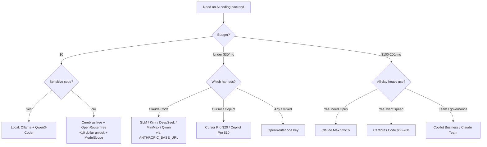

<div align="center">

# 🤖 Awesome AI Coding Subscriptions & APIs

### AIコーディングのサブスクリプション & API 完全ガイド

[](https://awesome.re)
[](LICENSE)
[](CONTRIBUTING.md)

[](https://github.com/lildebil0/awesome-ai-coding-subscriptions/stargazers)

**AIコーディングエージェントの裏側に置くべきは、どのサブスク・コーディングプラン・API・ルーター・無料枠なのか?**
厳選し、ベンチマークを取り、出典をリンクした答え — 💵 価格 · 🧠 性能 · 🔢 モデル数 · 📊 制限 · 🔌 統合性 でランク付け。

[English](../README.md) · [简体中文](README.zh-CN.md) · [Español](README.es.md) · [Русский](README.ru.md) · **日本語** · [Português](README.pt-BR.md) · [Français](README.fr.md) · [Deutsch](README.de.md) · [한국어](README.ko.md) · [हिन्दी](README.hi.md)

</div>

---

このリストがカタログ化するのは、**あなたがお金を払う対象であるプラン** — サブスク、定額コーディングプラン、従量課金API、ルーター、無料枠 — であって、コーディングツールそのものでは **ありません**。ハーネス(Claude Code、Cline、Aider、Roo/Kilo、OpenCode)は無料です。お金がかかるのはその裏で動くモデルなので、ここでランク付けするのはそちらです。ハーネスはあくまで *統合先* にすぎません。

中国のオープンウェイトラボ(GLM、Kimi、DeepSeek、MiniMax、Qwen、Doubao)が提供する月額3〜30ドルの定額プランを無料のCLIハーネスに向ければ、$200のフロンティアサブスクの約10分の1のコストで、SWE-benchでおよそ78〜80%に到達します。最も難しいタスクではフロンティアサブスクがやはり勝ちます。だから2026年の多くの人は両方を併用します — 難しい推論にはフロンティアサブスク、それ以外すべてには安価なプラン、という使い分けです。

> ⚠️ **この分野の価格は毎月変わります。** 数値は **2026年6月頃** を反映しています。購入前に必ず公式ページで確認してください。古い価格を見つけましたか? [PRを送ってください](CONTRIBUTING.md) — 修正は追加と同じくらい価値があります。

## 凡例

| バッジ | 意味 |
|-------|---------|
| 💎 | **隠れた逸品** — 知名度は低いが、得られる価値に対して安すぎる |
| 🆓 | エージェントを実際に動かせる **無料枠** がある |
| ✅ | **公式ソースに照らして価格をファクトチェック済み**(2026年6月) |
| ⭐ | 価値評価(1〜5):価格 vs 性能 vs 制限 vs 統合性 |
| 🇨🇳 | 中国ホスティング(一部ではデータ所在地/レイテンシの注意点あり) |
| ⚠️ | 顕著なリスクを伴う(ToS、信頼性、継続性、リセラー) |

**統合の略記:** `CC-native` = ネイティブなAnthropic互換エンドポイント。`ANTHROPIC_BASE_URL` 経由でそのままClaude Codeのバックエンドにできる。`OpenAI-compat` = base URLの差し替えでCline/Roo/Kilo/Aider/Continue/OpenCodeで動く(Claude Codeにはシム/ルーターが必要)。`native-only` = ベンダー自身のエディタ/エージェントに固定されていて、バックエンドとして再利用できない。

## 目次

- [選び方](#選び方)
- [予算で選ぶ](#予算で選ぶ)
- [あなたのタイプで選ぶ](#あなたのタイプで選ぶ)
- [TL;DR — ユースケース別ベストピック](#tldr--ユースケース別ベストピック)
- [総合比較表](#総合比較表)
- [一次提供のフロンティアサブスクリプション](#一次提供のフロンティアサブスクリプション)
- [バンドル型ツールサブスク(エディタ + モデル)](#バンドル型ツールサブスクエディタ--モデル)
- [定額コーディングプラン — コスパの王者 💎](#定額コーディングプラン--コスパの王者-)
- [従量課金のコスパAPI](#従量課金のコスパapi)
- [速度 / 高速推論プロバイダ](#速度--高速推論プロバイダ)
- [ルーター & ゲートウェイ](#ルーター--ゲートウェイ)
- [知っておく価値のあるその他プロバイダ(2026)](#知っておく価値のあるその他プロバイダ2026)
- [無料枠 🆓](#無料枠-)
- [無料クレジット & 学生 / スタートアッププログラム](#無料クレジット--学生--スタートアッププログラム)
- [学生 & 教育プラン 🎓](#学生--教育プラン-)
- [ニッチ & 専門](#ニッチ--専門)
- [アプリビルダー & 自律エージェント](#アプリビルダー--自律エージェント)
- [隠れた逸品 & リセラープロキシ ⚠️](#隠れた逸品--リセラープロキシ-)
- [セットアップレシピ — 安価なプランをハーネスに繋ぐ](#セットアップレシピ--安価なプランをハーネスに繋ぐ)
- [プライバシー & データ所在地マトリクス](#プライバシー--データ所在地マトリクス)
- [1ドルあたりのベンチマーク](#1ドルあたりのベンチマーク)
- [金銭的な罠 & よくある失敗](#金銭的な罠--よくある失敗)
- [2026年 価格変遷タイムライン](#2026年-価格変遷タイムライン)
- [コミュニティの本音](#コミュニティの本音)
- [セルフホスト & ハイブリッド(サブスクが答えでないとき)](#セルフホスト--ハイブリッドサブスクが答えでないとき)
- [FAQ](#faq)
- [用語集](#用語集)
- [このリストの採点 & メンテナンス方針](#このリストの採点--メンテナンス方針)
- [注意点 & 免責事項](#注意点--免責事項)
- [コントリビュート](#コントリビュート)
- [ライセンス](#ライセンス)
- [⭐ スター履歴](#-スター履歴)

---

## 選び方

すべてのプランを5つの軸で採点しましょう:

1. **💵 価格** — 表示価格と、*実際の* 実効コスト(クレジット比率、ピーク倍率、超過料金)。
2. **🧠 性能** — モデルの品質。コスパ帯はSWE-bench Verifiedで約78〜80%に集まり、フロンティアは85〜89%。
3. **🔢 モデル数** — 多数のモデルを多重化できる1つのプラン(Qwen Coding Plan、OpenRouter)は乗り換えリスクをヘッジできる。
4. **📊 制限** — 5時間ウィンドウあたりのリクエスト/トークン、週次上限、同時実行数。隠れたコスト:IDEの「プロンプト」1回が **5〜30回のモデル呼び出し** に展開されるため、宣伝される「プロンプト/5h」は見た目より緩い。
5. **🔌 統合性** — **ネイティブなAnthropicエンドポイント**(クリーンなClaude Codeのドロップイン)を公開しているか、それともOpenAI互換のみ(ルーターが必要)か? あるいはnative-only(再利用不可)か?

**意思決定のショートカット:**

- **最良のエージェントを最も簡単な道で** → Claude Pro $20 → Max 5x $100。
- **1ドルあたり最大のコーディング量** → 定額プラン(GLM / MiniMax / Qwen / Kimi)をClaude Codeで。
- **$0で** → Cerebras無料 + OpenRouter無料(+$10アンロック)+ NVIDIA NIM、難しいタスクは有料モデルにエスカレーション。
- **すべてに1つのキー** → OpenRouter。
- **プライバシー(中国ホストなし)** → Synthetic.new(米国、学習に使わない、14日削除)または一次提供の米国サブスク。



---

## 予算で選ぶ

分析麻痺はやめましょう。月々の金額を決めて、スタックを掴むだけです。

| 予算 | ベストピック | 得られるもの | 賢いスタック |
|---|---|---|---|
| **$0** 🆓 | **GitHub Copilot Free** + **Gemini CLI** | Copilotから補完2,000回 + プレミアムリクエスト50回/月、Googleからは気前のよいエージェント型CLI | IDE内の補完にCopilot Free、ターミナルでのエージェント実行にGemini CLI、3つ目の無料Tab補完バケツとして [Cursor Hobby](https://cursor.com/pricing) |
| **< $10/月** | **GLM Coding Plan Lite** 💎($30/四半期 ≈ $10/月) | Claude Proの約3倍の使用量、[ネイティブAnthropic互換エンドポイント](https://docs.z.ai/guides/overview/pricing) — Claude Code、Cline、OpenCodeにドロップイン | GLM LiteをClaude Codeのドライバにし、溢れた分のオーバーフロー用に無料枠を上乗せ |
| **~$10/月** | **GitHub Copilot Pro**($10) | 無制限補完、$10分のAIクレジット、エージェントモード、モデルピッカー — [2026年6月から従量制クレジットに移行](https://github.blog/news-insights/company-news/github-copilot-is-moving-to-usage-based-billing/) | IDE内にCopilot Pro + ターミナルにGLM Lite — 合計約$20でフロンティア級のドライバ2本 |
| **~$20/月** | **Claude Pro**($20) *または* **Cursor Pro**($20) | Pro:ターミナル/Web/デスクトップでClaude Code、[Sonnet 4.6 + Opus 4.6](https://claude.com/pricing)。Cursor:無制限Tab + $20分のエージェント使用 + バックグラウンドエージェント | Claude Pro(最良の素のエージェント)+ インライン補完にCopilot Free。あるいは1つのエディタに住んでいるならCursor Pro単体 |
| **~$50/月** | **MiniMax Max**($50) *または* **GLM Pro**(~$72/月)**+ Claude Pro**($20) | 大量処理向けの定額プラン(MiniMax ~1000 プロンプト/5h、またはGLM Pro)*かつ* 難所にはネイティブAnthropic品質 | 力仕事は安価プラン、厄介な推論用にClaude Proを温存 — 表中で最良の $/スループット |
| **~$100/月** | **Claude Max 5x**($100) | Proの5倍の使用量、最新モデルへの優先アクセス — 毎日Pro制限に当たる開発者にとってのスイートスポット([Maxプラン](https://support.claude.com/en/articles/11049741-what-is-the-max-plan)) | 主力としてMax 5x + 5x上限を使い切ったときの安価なオーバーフローレーンにGLM Lite($10) |
| **~$200/月** | **Claude Max 20x**($200) *または* **Cursor Ultra**($200) | Max 20x:Proの20倍、個人向け最上位ティア。[Cursor Ultra](https://cursor.com/pricing):20倍の使用量 + フルIDE内の優先機能 | ターミナル中心のパワーユーザーにMax 20x。多様性/冗長性のために別ベンダーのモデルが欲しければCopilot Pro($10)だけ追加 |

**経験則**
- **$20以下で価格に敏感?** GLM Liteは今コーディングで最良の1ドルです — Anthropic APIを話すので、Claude Codeで培った手癖がそのまま移せます。
- **1つのツールを1日中?** ネイティブサブスク(Claude Pro、Cursor Pro)に払いましょう。分散させないこと。
- **毎日のヘビーユーザー?** いきなりMax 5xへ — $50のプランを2つ積むより安く、はるかに手間がかかりません。
- **どのティアでも玄人の手:** 難問用のプレミアムドライバを1本 + 大量編集や補完用の安価/無料レーンを1本。$20以上のサブスクが2本必要になることはまずありません。

> 価格は2026年6月に確認。四半期請求のプラン(GLM)は実効月額で表示。CopilotとGitHubのプランは [2026年6月1日に従量制AIクレジットへ移行](https://github.blog/news-insights/company-news/github-copilot-is-moving-to-usage-based-billing/) — 割当はベース価格に応じてスケールします。


---

## あなたのタイプで選ぶ

マトリクスを睨むのはやめましょう。自分の行を見つけ、ピックをコピーして、先へ進む。価格はUSD/月、特記なき限り個人向けティア(2026年6月)。

| あなたは… | ベストピック | なぜ合うか | ~価格 |
|---|---|---|---|
| **個人インディーハッカー** 💎 | **Claude Pro** + オーバーフロー用にZ.ai/DeepSeekのAPIキー | $20のサブ1本でターミナル内Claude Codeをカバー。スプリント中に5時間上限に当たったら、使いこなせない$100ティアへ飛ぶ代わりに安価なコスパAPIへフォールバック。毎日出荷する1人にとって最良の $/出力。 | $20 + 数円 |
| **スタートアップ開発チーム(2〜20人)** | **GitHub Copilot Business** | $19/席で組織ポリシー、公開コードフィルタ、**IP補償**、一元請求 — 投資家/顧客の前に出しても安全な最安プラン。重い作業は各開発者自身のClaude/Cursorサブと組み合わせる。[価格](https://github.com/features/copilot/plans) | $19/席 |
| **エンタープライズ**(ガバナンス / SSO / IP) | **Copilot Enterprise** または **Claude Enterprise** | Copilot Enterprise($39/席)はSSO/SCIM、監査ログ、コードベース索引付きナレッジベース、そして同じMicrosoftのフィルタ付きIP補償を追加。Claude Enterprise(要見積)はAnthropic優先なら代替。どちらも調達を通る。[Copilot Enterprise](https://docs.github.com/en/copilot/get-started/plans) | $39/席 → カスタム |
| **CS学生** 🆓 | **GitHub Copilot(Student)** + ChatGPT Free | 認証済み学生は **CopilotをProレベルで無料**(無制限補完、プレミアムモデル、月次プレミアムリクエスト枠)。支出ゼロ、本物のツール。[Copilotプラン](https://github.com/features/copilot/plans) | $0 |
| **OSSメンテナ** 🆓 | **OSS向けに無料のCopilot Pro** + 深い作業にClaude Pro | 人気リポジトリのメンテナは無料Copilot Proの対象。厄介なリファクタ用に$20のClaude Proを1本確保。公共善対コストの比率が最良。 | $0〜$20 |
| **プライバシー第一 / 規制業種** 🔒 | **ローカルスタック:Ollama + Qwen3-Coder + Continue.dev** | 専有コードがマシンから一切出ない — API無し、保持条項無し、交渉すべきDPA無し。単一ファイル作業でクラウドClaudeのおよそ70〜85%の品質。クラウドが必須なら **ゼロ保持** のAPIティアを足す。[セットアップ](https://medium.com/@rodrigo.estrada/build-a-local-ai-coding-assistant-qwen3-ollama-continue-dev-cee0dbcd172a) | $0(ハードウェア) |
| **オフライン / エアギャップ** | **Ollama + Qwen3-Coder-Next**(Continue.dev または OpenCode) | 同じローカルスタックだが、ネットワークケーブルを抜いて動く *唯一の* カテゴリ。Qwen3-Coder-Nextは80B MoEからアクティブ約3Bパラメータで動作 — 現実的なハードに収まり、インターネット不要。[モデル](https://localaimaster.com/models/best-local-ai-coding-models) | $0 |
| **Vibeコーダー / 趣味人** 🆓 | **無料枠サンプラー**:ChatGPT Free か Copilot Free + Gemini無料 | 週末に楽しみで作るなら — 何も払わないこと。Copilot Freeの月2,000補完 + チャットモデルで気軽なサイドプロジェクトは賄える。無料制限が実際に痛んできたら初めてアップグレード。 | $0 |
| **並列エージェントを回すパワーユーザー** 💎 | **Claude Max 20x**(またはファンアウト用にコスパAPIを上乗せ) | スウォーム/並列Claude Codeセッションをオーケストレーションするなら、20xの使用量上限こそが午後2時に制限へぶつかるのを防ぐ。この量でAPIトークンを焚くより安い。使い捨てワーカーエージェント用にDeepSeek/Z.aiのキーを追加。 | $200 |

**横断的な経験則2つ:**
- **$20 → $100/$200** への跳躍が報われるのは、*あなた個人が* 週に約2回超えて使用上限に当たる場合だけ。多くの人はそうではない — アップグレードする前に計測を。
- **IP補償はモデルの機能ではなくプランの機能。** Copilot **Business** から始まり、公開コードフィルタをオンにする必要がある — 無料/Proティアには付かない。あなたのリポジトリを弁護士がいつか読むなら、これが重要な一線です。[詳細](https://github.com/features/copilot/plans)

出典:
- [GitHub Copilot Plans & pricing](https://github.com/features/copilot/plans)
- [Plans for GitHub Copilot — GitHub Docs](https://docs.github.com/en/copilot/get-started/plans)
- [AI Pricing Compared 2026 — AIViewer](https://aiviewer.ai/guides/ai-pricing-comparison-2026/)
- [Build a Local AI Coding Assistant — Qwen3 + Ollama + Continue.dev](https://medium.com/@rodrigo.estrada/build-a-local-ai-coding-assistant-qwen3-ollama-continue-dev-cee0dbcd172a)
- [Best Local AI Coding Models for Ollama (2026)](https://localaimaster.com/models/best-local-ai-coding-models)


---

## TL;DR — ユースケース別ベストピック

| ユースケース | ピック | 理由 | ~価格 |
|----------|------|-----|--------|
| 🏆 **総合コスパ最良** | **GLM Coding Plan** 💎🇨🇳 | GLM-5.1はOpusのコーディングの約94%、ネイティブClaude Code、最安の本格入門 | ~$10/月(四半期Lite)〜 $72 Pro |
| 🥇 **素のフロンティア最良** | **Claude Max 5x** | Claude CodeでOpusを解放、コンセンサス第1位のエージェント | $100/月 |
| 🪙 **本格入門の最安** | **Trae Lite $3** / **StepFun $6.99** / **MiMo ~$5** / **GLM Lite ~$10** 💎 | コーヒー1杯の値段で本物のコーディングバックエンド | $3〜10/月 |
| 💸 **トークンあたり最安** | **DeepSeek V4-Flash** 💎 | 入力$0.14/M、キャッシュヒット$0.0028/M、1Mコンテキスト、CC-native | 従量 |
| 🧪 **無料最良** | **Cerebras無料** 🆓 + **OpenRouter :free** 🆓 | 1Mトークン/日(高速)+ Qwen3-Coder-480B無料 | $0 |
| ⚡ **速くて安い最良** | **Groq** 💎🆓 / **Cerebras Code** | ネイティブAnthropicエンドポイント(Groq)、約2000 tok/sの定額(Cerebras) | 無料 / $50/月 |
| 🔀 **万能ルーター最良** | **OpenRouter** | 315以上のモデル、1つのキー、Anthropicスキン、トークンマークアップ無し | 従量 +5.5% |
| 🔒 **プライバシー最良(米国ホスト)** | **Synthetic.new** 💎 | 米国インフラ、学習に使わない、14日削除、OpenAI+Anthropicデュアル互換 | $20〜60/月 |
| 🧰 **巨大コードベース最良** | **Augment Code** ✅ | モノレポ向けクラス最高のContext Engine | $20+/月 |
| 🏢 **チームコスパ最良** | **Claude Team Premium席** 💎 | ≈ Max-5x使用量 + SSO/管理 | $100/席 |


---

## 総合比較表

おおむね価値順にソート。価格は2026年6月頃、**購入前に確認を**。

| プラン | 種別 | 価格 | モデル | 制限(コーディング) | 統合 | ⭐ | 備考 |
|------|------|-------|--------|-----------------|-------------|----|-------|
| [GLM Coding Plan](#glm-coding-plan--zai-zhipu-ai-) | 定額 | Lite $18 · Pro $72 · Max $160 /月(四半期Lite ~$10/月) | GLM-5.1/5/4.7 | Lite ~80、Pro ~400 プロンプト/5h | CC-native | ⭐5 | 💎🇨🇳✅ |
| [DeepSeek API](#deepseek-) | 従量API | V4-Pro $0.435/$0.87、Flash $0.14/$0.28 | V4-Pro/Flash | 1Mコンテキスト、500〜2500同時 | CC-native | ⭐5 | 💎🇨🇳✅ |
| [MiniMax Coding Plan](#minimax-coding--token-plan-) | 定額 | $10〜50/月 | M2.7(プラン)、M2.5/M3(API) | Starter ~100、Max ~1000 プロンプト/5h | CC-native | ⭐5 | 💎🇨🇳 |
| [Kimi Code](#kimi-code--moonshot-ai-) | 定額+API | ~$19/月 + 従量 | K2.6(1T) | ~300〜1200 呼び出し/5h、30同時 | CC-native | ⭐5 | 💎🇨🇳 |
| [Qwen Cloud Coding Plan](#qwen-cloud-coding-plan--alibaba-) | 定額 | Pro $50/月(Lite $10、新規停止) | Qwen3.5 + Kimi/GLM/MiniMax | Pro 6000 req/5h、1Mコンテキスト | CC-native | ⭐4 | 💎🇨🇳✅ |
| [OpenRouter](#openrouter-1) | ルーター | 従量、トップアップ +5.5% | 315以上(全部) | 残高依存、無料モデル50〜1000/日 | CC-native スキン | ⭐5 | 🆓 |
| [Claude Pro](#anthropicclaude) | 一次提供 | $20/月 | Sonnet 4.6(Opus無し) | ~40〜45 msg/5h + 週次 | CC-native | ⭐5 | 最良の入門 |
| [Claude Max 5x](#anthropicclaude) | 一次提供 | $100/月 | + Opus 4.6/4.7 | ~50〜225 プロンプト/5h | CC-native | ⭐5 | Opus解放 |
| [Cerebras Code](#cerebras-) | 定額・速度 | $50/$200 | GLM-4.7(~2000 tok/s) | 24M〜120M tok/日、131kコンテキスト | OpenAI-compat | ⭐5 | ✅ よく売り切れ |
| [Synthetic.new](#オープンウェイト定額サブプライバシー--米国ホスト) | 定額(米国) | $20〜60/月 | オープンウェイト16種(GLM/Kimi/Qwen/DS) | ~125〜1250 req/5h | CC-native | ⭐5 | 💎🔒 |
| [Chutes](#chutes-1) | 定額 ⚠️ | $3/$10/$20 | GLM-5/Kimi/DS/MiniMax/Qwen | 300/2000/5000 req/日 | OpenAI-compat | ⭐5 | 💎⚠️ 分散型 ✅ |
| [Grok Code Fast 1](#xaigrok) | 従量API | $0.20/$1.50/M | grok-code-fast-1 | 256Kコンテキスト、~92 tok/s | CC-native | ⭐5 | 💎 OpenRouterで#1 |
| [ChatGPT Plus](#openaichatgpt--codex) | 一次提供 | $20/月 | GPT-5.x-Codex | トークンクレジット従量 | Codex-native | ⭐4 | Codexは第2位エージェント |
| [ChatGPT Pro](#openaichatgpt--codex) | 一次提供 | $100/$200(5x/20x) | GPT-5.5-Codex | 高、専用GPU | Codex-native | ⭐4 | |
| [Claude Max 20x](#anthropicclaude) | 一次提供 | $200/月 | Opus 4.6/4.7 | ~200〜900 プロンプト/5h | CC-native | ⭐4 | パワーティア |
| [Cursor Pro / Ultra](#cursor) | バンドル | $20 / $200 | 全フロンティア + Auto | $20 / $400 使用プール | Native-only | ⭐4 | Ultra = クレジット比率2倍 |
| [GitHub Copilot Pro](#github-copilot) | バンドル | $10/月 | GPT-5/Claude/Gemini | $10 AIクレジット(従量) | Native-only(+ACP) | ⭐4 | 無料補完 🆓 |
| [DeepInfra](#deepinfra) | 速度/API | 従量(OSS最安) | Kimi/DS/Qwen3-Coder/GLM | 残高依存 | CC-native | ⭐5 | 💎✅ 最安ホスト |
| [Groq](#groq) | 速度/API | 従量 + 無料 | GPT-OSS/Qwen3/Kimi | 無料RPM/TPM上限 | CC-native | ⭐4 | 💎🆓 |
| [Vercel AI Gateway](#vercel-ai-gateway) | ルーター | $0マークアップ(BYOKでも) | Claude含む100種 | $5/月の無料クレジット | CC-native | ⭐4 | 💎🆓✅ |
| [Requesty](#requesty) | ルーター | 一律 +5% | Claude/GPT/Gemini/DS/Qwen | セマンティックキャッシュ ~40%引き | OpenAI-compat | ⭐4 | 💎 チームガバナンス |
| [Mistral Le Chat Pro](#mistral) | 一次提供 | $14.99/月($5.99学生) | Devstral 2 + Vibe CLI | ~25 無料msg/日 | Native-only | ⭐4 | 💎🆓🇪🇺 主要サブで最安 |
| [Augment Code](#バンドル型ツールサブスクエディタ--モデル) | バンドル | $20〜200/月 | Claude/Gemini/GPT | 40k〜450k クレジット/月 | Native-only | ⭐4 | ✅ 大規模リポ文脈最良 |
| [Zed Pro](#バンドル型ツールサブスクエディタ--モデル) | バンドル | $10/月 | 任意(BYOキー/ACP) | $5クレジット + 従量 | ACP + BYOK | ⭐4 | 💎 反ロックイン |
| [Cerebras無料](#無料枠-) | 無料 | $0 | Qwen3-Coder-480B, GPT-OSS-120B | 1M tok/日、8Kコンテキスト上限 | OpenAI-compat | ⭐5 | 💎🆓 最速の無料 |
| [Google AI Studio](#無料枠-) | 無料 | $0 | Gemini 2.5 Flash, Gemma 3 27B | Flash 250 RPD、Gemma 14.4k RPD | OpenAI-compat | ⭐4 | 🆓 最大の無料コンテキスト |


---

## 一次提供のフロンティアサブスクリプション

ベンダー直販のプラン。サブスクはログインで **ベンダー自身のハーネス**(Claude Code、Codex CLI、Antigravity、Grok Build)を認証します — サードパーティのOpenAI互換ツール向けの汎用APIキーは付いてきません(それは別のトークン単位課金)。例外:xAI GrokモデルはOpenAI/Anthropic互換です。

> エージェント型コーディングの価値序列(2026年6月のコンセンサス):**Claude > OpenAI Codex > Google Gemini > xAI Grok**。独立した30日テストではClaude約95% vs ChatGPT約85%のコーディング精度。ベンダーのSWE-benchではGPT-5.5(88.7%)≈ Opus 4.7(87.6%)。

### Anthropic(Claude)
- **[Claude Pro](https://claude.com/pricing)** — `$20/月`($17 年額)。Claude CodeでSonnet 4.6(**Opusなし**)。~40〜45 msg/5h + 週次上限、チャット/Cowork と共有。**#1コーディングエージェントへの最良コスパ入門。** 2026年4月に5h制限を2倍化、ピーク時スロットリングを撤廃。⭐5
- **[Claude Max 5x](https://support.claude.com/en/articles/11049741-what-is-the-max-plan)** — `$100/月`。**Opus 4.6/4.7を解放** + 5倍スループット(~50〜225 プロンプト/5h)。玄人のスイートスポット。OpenAI/Googleが同等に役立つ形で持たない$100中間ティア。⭐5
- **[Claude Max 20x](https://support.claude.com/en/articles/11049741-what-is-the-max-plan)** — `$200/月`。~200〜900 プロンプト/5h。1日中の並列エージェント向け。**定額がAPIに勝つ** 算数が決定的(Claude Codeトークンの90%以上はキャッシュ読み取りで、サブスクでは無料、APIでは課金される — ある開発者のピーク月はAPIで$5,623 ≈ Max 5xの4.5年分)。⭐4
- **[Claude Team Premium席](https://claude.com/pricing)** 💎 — `$100/席`(年額)。≈ Max-5x使用量 **に加え** SSO/管理/監査/エンタープライズ検索。ひそかに最良の *チーム* コーディングコスパ。Standard $20席にもClaude Codeが含まれる。⭐4

### OpenAI(ChatGPT / Codex)
- **[ChatGPT Plus](https://help.openai.com/en/articles/11369540-using-codex-with-your-chatgpt-plan)** — `$20/月`。Codex CLI/IDEバンドル(GPT-5.5/5.4/5.3-Codex)。2026年4月以降 **トークンクレジット従量**(分かりにくい)。Codexはコンセンサス第2位エージェント。Plusの上限は重いエージェント作業で速く尽きる。⭐4
- **[ChatGPT Pro](https://developers.openai.com/codex/pricing)** — `$100`(5x)/ `$200`(20x)。高スループット + 専用GPU。注意:$100ティアの「10x ブースト」プロモは **2026年5月31日に終了**(現在は5x)。古典的な「$200プランは価値ある?」論争 = Claude Max 20x vs ChatGPT Pro 20x。⭐4

### Google(Gemini)
- **[Google AI Pro](https://gemini.google/subscriptions/)** — `$19.99/月`(初年度はしばしば50%off)。Google One AI Premiumから改称(2026年4月)。Gemini 3.x Pro、5TBストレージ、そして **強化された [Antigravity](#アプリビルダー--自律エージェント) + Jules** のコーディングエージェントアクセス。✅
- **[Google AI Ultra](https://blog.google/products-and-platforms/products/google-one/google-ai-subscriptions/)** — I/O 2026で **`$100/月`(5x、新dev層)** / **`$200/月`(20x、$250から値下げ)**。Geminiアプリ **と** Antigravityで5×/20×の使用量、最上位はDeep Think、Project Genie、30TBを追加。✅
- ⚠️ **Googleは2026年6月18日にオープンソースのGemini CLIを廃止し**、無料枠がはるかに少ないクローズドなAntigravity CLIへユーザーを移行(~1000 → ~20 req/日) — 2026年最大のコミュニティの不満。

### xAI(Grok)
- **[SuperGrok](https://x.ai/pricing)** — `$30/月`($300/年)/ Heavy `$300/月`。(現行の価格ページに独立した「Lite」層はない — レガシー/X-Premiumバンドルの名残。古い$10の数字は無視。)Grok Build CLIは **8個の並列サブエージェントを隔離されたgit worktreeで実行**(斬新)、全SuperGrokサブに含まれる。`grok-code-fast-1` はカルト的な人気(安くて速い)。SWE-bench約70.8%でリーダーには及ばない。**コーディング用には [xAI API](#xaigrok) のほうが買い得なことが多い。** ⭐3 💎


---

## バンドル型ツールサブスク(エディタ + モデル)

ここではプラン *そのもの* が製品です — ベンダーのエディタ/エージェントを買うことになります。2026年のトレンド:ほぼすべてが固定リクエスト数から **クレジット / トークン従量** へ移行し、コストを *より* 予測しにくくしました(大きな反発)。

### Cursor
- **[Cursor](https://cursor.com/pricing)** — Hobby無料 · **Pro `$20`** · **Pro+ `$60`** 💎 · **Ultra `$200`**。2025年6月以降、プラン料金 = API料金での使用プール。**クレジット比率は上位ティアほど改善**:Pro $20/$20(1×)、Pro+ $60/$70(1.17×)、Ultra $200/$400(**2×、最良**)。`Auto` モードが価値の鍵 — 実質無制限で、Claude/MAXを固定するようにはプールを消費しない。⚠️ 2025年6月の切替は [価格の大惨事](https://www.wearefounders.uk/cursors-pricing-disaster-the-full-timeline-of-how-an-ai-coding-darling-burned-its-most-loyal-users/) を招いた(HNユーザー:「1週間で$350の超過」)、CEOが謝罪 + 返金。**Native-only** — Claude Codeのバックエンドにできず、2026年1月時点ではClaudeサブを *Cursorに* ルーティングすることもできない。Tab/Applyはクラス最高。⭐4

### GitHub Copilot
- **[GitHub Copilot](https://github.com/features/copilot/plans)** — Free 🆓 · **Pro `$10`** · Pro+ `$39` · Max `$100` · Business `$19` · Enterprise `$39`。⚠️ **2026年6月1日に従量制AIクレジットへ移行**(1クレジット = $0.01)、各プランにクレジットプールを含む(Pro=$15、Pro+=$70)。**コード補完は無制限・無料のまま** — 補完のみのユーザーは影響なし。反発は深刻(TechTimes:エージェント請求が10〜50倍に跳ね上がった)。クラス最高のIDE補完 + 組織向けガバナンス/IP補償。**Native-only**(脱出口:Copilot CLIはACPを話す)。⭐4

### その他
- **[Augment Code](https://www.augmentcode.com/pricing)** ✅ — Indie `$20`/40kクレジット · Standard `$60` · Max `$200`。大規模モノレポ向け **クラス最高のContext Engine**(文脈リコール比較でトップ)。VS Code + JetBrains + Auggie CLI。Native-only。ツール多用タスクでのクレジット消費が不満点。⭐4 💎
- **[Zed Pro](https://zed.dev/pricing)** 💎 — Free · **Pro `$10`**(+10%マークアップのみ)· Business `$30`。**反ロックイン** のピック:オープンな [ACP](https://zed.dev/docs/ai/) が外部エージェント(Claude Code、Codex、OpenCode)を駆動、任意プロバイダのBYOキー対応。最速のネイティブエディタ。⭐4
- **[Kiro](https://kiro.dev/pricing/)** 💎 — Free · **Pro `$20`/1kクレジット** · Pro+ `$40` · Power `$200`。最良の **仕様駆動** エージェント(要件→設計→タスク)、Opus 4.7を含むフルClaudeラインナップ、0.01クレジット単位の按分課金。**AWS Startups = Pro+ 1年無料。** ⭐4
- **[Trae](https://www.trae.ai/pricing)** 💎🇨🇳 — Free · **Lite `$3`** · Pro `$10` · Ultra `$100`。ByteDanceのVS Codeフォーク、使用プールが表示価格を超える(例:$10で$20分)=「$3のCursor代替」。⚠️ ByteDanceのテレメトリが関連会社と共有される — エンタープライズには致命的。⭐4
- **[Sourcegraph Amp](https://sourcegraph.com/amp)** — 無料スタート($10クレジット、元Cody向けは$40)。純粋な **従量制**(月額の下限なし)、「smart」モードでOpus 4.8を実行。軽い用途には最適、ヘビーには青天井の焼き付きリスク。Cody Free/ProはAmpに統合され廃止。⭐3
- **[JetBrains AI / Junie](https://www.jetbrains.com/ai-ides/buy/)** — 愛されるIDE統合、しかしJunieは **クレジットを速く焚く**(Ultimateの35クレジットが約4〜5日で消える)。JetBrainsに住んでいる場合のみ。
- **割高 / 避けるべき:** **Tabnine**($39下限、無料枠なし、年額ロックイン — オンプレ/エアギャップ用途のみ)、**Windsurf Pro**(2026年3月の日次/週次クォータへの切替は今年最も不満を集めた変更、Cognition買収後の信頼が低い)。**Supermaven** はスタンドアロンとして死亡(2025年11月にCursor Tabへ統合)。


---

## 定額コーディングプラン — コスパの王者 💎

フロンティア級のオープンウェイトモデルをハーネスの裏に置く、月次/四半期の固定プラン。大半は中国ラボ発。多くがネイティブAnthropicエンドポイントを公開しているので、`ANTHROPIC_BASE_URL` 経由でClaude Codeにドロップインできます。エンドポイント一覧は [Alorse/cc-compatible-models](https://github.com/Alorse/cc-compatible-models) を参照。

> コンセンサスの序列:**GLM**(最安入門、コミュニティの既定)· **MiniMax**(最良の価格/ボリューム)· **Kimi**(最良の長期作業エージェント)· **Qwen**(>262Kコンテキスト、マルチモデル)。Claude Pro $20が彼らが下回る品質ベンチマーク。

<a name="glm-coding-plan-zai"></a>
### GLM Coding Plan — Z.ai(Zhipu AI)💎🇨🇳 ✅
- **海外の月額(2026年6月検証):** `Lite $18/月` · `Pro $72/月` · `Max $160/月` — 価格は2026年4月11日に約2倍に。**四半期Liteが安価ルート**(~$30/四半期 ≈ $10/月)。中国国内価格はずっと安い(~$7 / $21 / $68 /月)。バズった **$3/月** プロモは2026年2月11日に終了。✅
- モデル:**GLM-5.1**(Opus 4.6コーディングの約94%)· GLM-5/5-Turbo · GLM-4.7 · GLM-4.5-Air。**すべての層(Liteを含む)が全モデルと完全な200Kコンテキストを利用可能**(最大出力128K)— 層が違うのはクォータだけで、モデルやコンテキスト窓は同じ。推奨マッピング:GLM-5.1 → Opus枠(難タスク、フロントエンド/UI)、GLM-4.7 → Sonnet(×1クォータの主力)、GLM-4.5-Air → Haiku(高速バックグラウンド)。
- 制限:Lite ~80、Pro ~400、Max ~1,600 プロンプト/5h + 週次(IDEの「1プロンプト」= モデル呼び出し5〜30回)。⚠️ GLM-5/5.1のみ **ピーク時3倍乗数**、**14:00〜18:00 UTC+8(≈08:00〜12:00 カリーニングラード)**、オフピークは2×(2026年6月末までのプロモでオフピーク1×)。重いGLM-5.1はオフピークに回すこと。
- 統合:`ANTHROPIC_BASE_URL=https://api.z.ai/api/anthropic` — 公式Claude Codeサポート + Cline/Roo/Kilo/OpenCode(20以上のツール)。**一次提供** = リセラーBANリスクなし。
- > *2026年で最も推薦された予算コーディングプラン。* 「約$30/月でClaude Maxの3倍の使用量」。2月の値上げ + クォータ⅓削減への反発はあるが、依然トップ価値評価。⭐5
- 出典:[z.ai/subscribe](https://z.ai/subscribe) · [価格](https://docs.z.ai/guides/overview/pricing) · [GLM-5.1レビュー](https://serenitiesai.com/articles/glm-5-1-coding-plan-review-2026)

<a name="minimax"></a>
### MiniMax Coding / Token Plan 💎🇨🇳
- `Starter $10/月` · `Plus $20` · `Max $50`(年額で2か月無料)、高速版$40〜150。
- モデル:プランではM2.7 / M2.7-Highspeed、**M2.5/M3**(1Mコンテキスト)はAPI経由。⚠️ **プランはベンチ対象のM2.5/M2.7より古いモデル(M2.1)を出すことが多い。**
- 制限:Starter ~100 → Max ~1,000 プロンプト/5h、~50 TPS(高速版100)。
- 統合:`ANTHROPIC_BASE_URL=https://api.minimax.io/anthropic` + OpenAI互換。
- > 「Claude Code代を半分にした。」 定額枠で **最良の素の価格/ボリューム**。M2.7はGLM-5.1の約94%で入力コストは約1/5。⭐5
- 出典:[コーディングプラン](https://platform.minimax.io/subscribe/coding-plan) · [M2.5価格](https://www.verdent.ai/guides/minimax-m2-5-pricing)

<a name="kimi-moonshot"></a>
### Kimi Code — Moonshot AI 💎🇨🇳
- `~$19/月メンバーシップ` + 従量API(K2.6 入力$0.60〜0.95/M、出力$2.50〜4.00/M、キャッシュ75%割引)。Moderato/Allegretto/Vivaceの段階制。
- モデル:**Kimi K2.6**(1T MoE、SWE-bench約80.2%)、K2.5。
- 制限:~300〜1,200 呼び出し/5h、**30同時**(並列エージェントに気前がよい)。
- 統合:`ANTHROPIC_BASE_URL=https://api.moonshot.ai/anthropic` — 真のClaude Codeドロップイン。独自のKimi CLI(6.4k★)を提供。
- > **最良の長期作業エージェント安定性**(13時間セッションで4,000以上のツール呼び出しを持続)。「コーディングコストを88%節約。」 オープン勢の中で入力側が最も高い。⭐5
- 出典:[エージェントサポート](https://platform.kimi.ai/docs/guide/agent-support) · [Kimi Codeガイド](https://www.nxcode.io/resources/news/kimi-code-2026-plans-pricing-developer-guide)

<a name="qwen-alibaba"></a>
### Qwen Cloud Coding Plan — Alibaba 💎🇨🇳 ✅
- `Pro $50/月`(Liteは2026年3月20日以降 ~$10 **新規受付停止**)。
- モデル:Qwen3.5-Plus、Qwen3-Coder-Next/Plus/480B + 1つのキーでクロスモデルの **Kimi/GLM/MiniMax**。**100万トークンコンテキスト**(このレーンで最良)。
- 制限:Pro 6,000 req/5h + 45k/週 + 90k/月(スライディングウィンドウ)。専用 `sk-sp-` キー(従量と互換性なし)。
- 統合:`ANTHROPIC_BASE_URL=https://coding-intl.dashscope.aliyuncs.com/apps/anthropic` + Qwen Code CLI。
- > 際立つ点 = **1プランでQwen+Kimi+GLM+MiniMaxを多重化** し、唯一信頼できる1Mコンテキストの定額プラン。⭐4
- 出典:[Model Studio コーディングプラン](https://www.alibabacloud.com/help/en/model-studio/coding-plan)

### オープンウェイト定額サブ(プライバシー / 米国ホスト)
- **[Synthetic.new](https://synthetic.new/pricing)** 💎🔒 — `$20〜60/月`。常時稼働のオープンウェイトモデル約16種(Kimi/GLM/Qwen3-Coder-480B/DeepSeek)。**米国インフラ、学習なし、14日削除。** **OpenAI + Anthropicデュアル互換** = 本物のClaude Codeドロップイン。中国プランへのプライバシー重視の代替。⭐5
- **[Cerebras Code](#cerebras-)** — `$50`/`$200`、定額速度([速度](#速度--高速推論プロバイダ)を参照)。
- **[OpenCode Go(Zen)](https://opencode.ai/go)** 💎 — 初月 `$5`、以降 `$10/月` 定額。中国オープンウェイトモデル約12〜14種(GLM-5.1/Kimi/Qwen3.7/DeepSeek V4/MiniMax)。OpenCodeで一級対応。Claude/GPTなし。⭐4

### ニッチ / 安価ティアの定額プラン 🇨🇳
- **[StepFun Step Plan](https://github.com/Alorse/cc-compatible-models)** — `$6.99`〜`$99/月`、100〜5,000 プロンプト/5h、CC-native。価格の値下げ役だがモデルの実戦経験は浅い。⭐3
- **MiMo(Xiaomi)** — `$6`〜`$100/月` クレジット制(60M〜1.6B)、CC-native(`api.xiaomimimo.com`)、マルチモーダルOmniを含む。ベンチがほとんどない。⭐3
- **Atlas Cloud** 💎 — `$10`/`$20`、800k〜1.8M クレジット/**日**、OpenAI互換(Claude Code/Codex/OpenCode)。自律エージェント向けの日次クレジットモデル。⭐4
- **Factory Droid** 💎 — `$20/月` から、トークン制、フロンティアモデル(Claude/GPT/Gemini)、5h/7d/30dのローリングウィンドウ。「Droidのために$200 Maxプランを2つ解約した」という逸話で有名。⭐4


---

## 従量課金のコスパAPI

コスパラボからのトークン単位アクセス。エージェントループでは **キャッシュ価格が真のコスト要因** — 表面的な入力価格よりキャッシュヒットを設計目標に。

<a name="deepseek"></a>
### DeepSeek 💎🇨🇳 ✅
- **V4-Pro** `入力$0.435/M · キャッシュヒット$0.0036/M · 出力$0.87/M`(**75%カットは恒久化**)。**V4-Flash** `$0.14 / $0.0028 / $0.28`。1Mコンテキスト、最大384K出力。
- 統合:OpenAI互換 **+ ネイティブAnthropic**(`https://api.deepseek.com/anthropic`)— Claude Codeドロップイン(`ANTHROPIC_MODEL=deepseek-v4-pro[1m]`)。
- > **トークンあたりコストの王者。** V4-ProはSWE-bench約80.6% / LiveCodeBench 93.5%を出力$1/M未満で。V4-Flashの$0.0028/Mキャッシュヒットは大量ループで無敵。⭐5
- 出典:[価格](https://api-docs.deepseek.com/quick_start/pricing) · [Claude Codeセットアップ](https://api-docs.deepseek.com/quick_start/agent_integrations/claude_code)

### その他
- **[Alibaba Qwen3-Coder API](https://www.alibabacloud.com/help/en/model-studio/model-pricing)** 🇨🇳 — 480B `$0.22/$1.00`、Flash `$0.195/$0.975`、30B-A3B `$0.07/$0.27`。**100万トークン無料 / 90日**(Intl)。CC-native。最強のオープンウェイトエージェント型コーダー。シンガポールリージョンのキーを使う。⭐4
- **[Moonshot Kimi API](https://platform.kimi.ai/docs/pricing)** 🇨🇳 — K2.6 `$0.95/$4.00`($0.16キャッシュ)、K2.5 `$0.60/$3.00`。CC-native。優れたツール呼び出し、出力価格が不満点。$10入金で日次上限が外れる。⭐4
- **[Zhipu GLM API](https://docs.z.ai/guides/overview/pricing)** 🇨🇳 — GLM-5.1 `$1.40/$4.40`、GLM-4.7 `$0.60/$2.20`、FlashX `$0.07/$0.40`。CC-native。愛好家の多くは代わりに安価な [Coding Plan](#glm-coding-plan--zai-zhipu-ai-) を買う。⭐4
- **[MiniMax API](https://platform.minimax.io/docs/guides/pricing-paygo)** 🇨🇳 ✅ — M3 `$0.30/$1.20`($0.06キャッシュ、**キャッシュ書き込み無料**)、M2.5 ~`$0.15/$1.15`。「Opusより20倍安い。」 一次提供のAnthropic互換。⭐4


---

## 速度 / 高速推論プロバイダ

オープンウェイトモデルのトークン単位ホストで、スループット最適化済み。**ネイティブAnthropicエンドポイントを持つのはGroqだけ**(最もクリーンなClaude Codeドロップイン)、残りはOpenAI互換(CCにはシム/ルーターが必要、Cline/Roo/OpenCodeではネイティブ)。

<a name="deepinfra"></a>
- **[DeepInfra](https://deepinfra.com/pricing)** 💎 ✅ — **トークンあたり最安の王者。** DeepSeek V3.2 ~$0.26/$0.38、Kimi K2.6 $0.75/$3.50、Qwen3-Coder-480B $0.30/$1.00。90以上のモデル、キャッシュ割引、**ネイティブAnthropicエンドポイント**、前払い不要。速度は良好だがエリートではない。⭐5
<a name="groq"></a>
- **[Groq](https://groq.com/pricing)** 💎🆓 — LPU速度(GPT-OSS-20B ~860 tok/s)。GPT-OSS-120B `$0.15/$0.60`、Kimi K2 `$1.00/$3.00`。**ネイティブAnthropic + OpenAI互換** + 本物の無料枠。バッチ+キャッシュを重ねて約25%まで。Qwen3-Coder-480Bは無し(上限はQwen3-32B)。⭐4
<a name="cerebras"></a>
- **[Cerebras](https://www.cerebras.ai/pricing)** ✅ — **最速**(~2,000〜3,000 tok/s)。**Code Pro `$50`**(24M tok/日)/ **Max `$200`**(120M tok/日)、GLM-4.7、131kコンテキスト。従量GPT-OSS-120B `$0.35/$0.75`。⚠️ 頻繁に **売り切れ**、131kコンテキスト(ネイティブの半分)+ 高いTTFTがエージェントループで速度を鈍らせる。⭐5 定額 / ⭐4 従量
- **[Together AI](https://www.together.ai/pricing)** — 最も広いカタログ(Qwen3-Coder-480B、Kimi、DeepSeek V4 Pro $2.10/$4.40、$0.20キャッシュ付き)。価格は中位、~89 tok/s。⭐4
- **[Fireworks AI](https://fireworks.ai/pricing)** — 本番/エンタープライズ寄り、積極的なキャッシュ($0.15/M)、DeepSeek V4-Flash $0.14/$0.28、Azure Foundry経路。⭐4
- **[Novita](https://novita.ai/pricing)** 💎 — Qwen3-Coderファミリー全体をDeepInfraに近い価格でホスト、目立たないOpenRouter経路。⭐4
- **[Hyperbolic](https://docs.hyperbolic.xyz/docs/hyperbolic-ai-inference-pricing)** 💎 — GPT-OSS-20B `$0.10/M` ブレンド(どこよりも安い部類)、Qwen3-Coder-480B(FP8)をホスト。約13モデル。⭐3
- **SambaNova** — 巨大な671B/405Bモデルで独自に高速、永久無料 + $5クレジット 🆓 だが50 req/日上限 = 評価専用。


---

## ルーター & ゲートウェイ

多数のプロバイダにまたがる1つのキー。ルーターを **既定のアクセス層** として選びましょう。

<a name="openrouter"></a>
- **[OpenRouter](https://openrouter.ai/pricing)** 🆓 — **コンセンサスの既定。** 315以上のモデル、1つのキー、**Anthropic互換「スキン」**(`ANTHROPIC_BASE_URL=https://openrouter.ai/api` = 真のClaude Codeドロップイン)、**トークン価格のマークアップなし**(トップアップに+5.5%のみ)、無料ZDR + 支出上限、気前のよいBYOK(1M無料req/月)。無料モデル(Qwen3-Coder-480B、DeepSeek、Llama 4):50 RPD → **一度$10入金で以降永久に1000 RPD**。5.5%手数料が痛むのは月$5k以上の支出からだけ。⭐5
<a name="requesty"></a>
- **[Requesty](https://www.requesty.ai/)** 💎 — **一律5%マークアップ**、**セマンティックキャッシュ**(約40%節約、同一クエリのみのキャッシュに勝る)+ リクエストごとのスマートルーティング + **エージェントごとのモデルポリシー**(分類器/合成器の役割ごとに別モデル)+ SOC 2 Type II を含む全機能。チームガバナンスのピック。OpenAI互換。⭐4
<a name="vercel-ai-gateway"></a>
- **[Vercel AI Gateway](https://vercel.com/docs/ai-gateway/pricing)** 💎🆓 ✅ — **マークアップゼロ、BYOKでも。** ネイティブAnthropic互換(`https://ai-gateway.vercel.sh`)= 直接Claude Code + Claude Agent SDK + 「Gateway経由のClaude Code Max」。$5/月の無料クレジットが無期限に補充(トップアップすると停止)。純粋な経済性で最良のピック、特にVercelエコシステムで。⭐4
- **[Helicone Gateway](https://helicone.ai/pricing)** 🆓 — 可観測性第一(自動ロギング/トレース/コスト)、マークアップゼロ、無料10k req/月、サブスク$79/$799。⭐3
- **[CometAPI](https://www.cometapi.com/)** — 最新の専有モデルを含む500以上のモデル、公式比~20〜40%引き、**OpenAI+Anthropicデュアル互換**。前払いクレジットの仲介者リスク。⭐4
- **[ElectronHub](https://www.electronhub.ai/pricing)** — 600以上のモデル、週次クレジットが現金コストを超えることも、安価ティアでは厳しい5〜10 RPM、リセラー信頼の注意点。⭐3
- **[LiteLLM](https://docs.litellm.ai/)** — OSSの **セルフホスト** 標準(無料、マークアップなし)— [統合テクニック](#プラグcheap-plans-into-your-harness) を参照。DIYインフラで、ターンキーではない。⭐4


---

## 知っておく価値のあるその他プロバイダ(2026)

主要セクションの主役ではないが、実際の隙間を埋める本当に有用なエントリ — 追加の中国ラボとアグリゲータ、西側のコーディングツール、OpenRouter以外のルーター。一覧を見やすく保つためグループ化して折りたたんでいます。

<details>
<summary><b>🇨🇳 中国のアグリゲータ & ラボ</b>(安価なトークン、いくつかはネイティブAnthropicエンドポイント)</summary>

- **[SiliconFlow](https://www.siliconflow.com/pricing)** 💎 — 中国最大級の独立系MaaSルーターの1つ、200以上のモデル、**ネイティブAnthropicエンドポイント**(珍しい)なのでClaude Codeを安価なDeepSeek/Qwen/GLM/Kimiに直接向けられる。Intl(.com)+ China(.cn)エンドポイント。DeepSeek-V4-Flash ~$0.14/$0.28。
- **[PPIO](https://ppio.com/llm-api)** 💎 — **自社GPUクラウド** 上のCNY建てルーター。Qwen3-Coder-Next ≈¥1.4/¥10.5、DeepSeek-V4-Flash ¥1/¥2 — どこよりも低いトークン価格の部類。OpenAI互換(Claude Code用にブリッジ)。
- **[Volcengine Ark / BytePlus](https://www.volcengine.com/docs/82379/1949118)** 💎(ByteDance Doubao)— 定額の **Doubao Coding Plan**:BytePlus(海外カードで払えるブランド)経由でLite **$10**/Pro **$50**。**Doubao-Seed-Code** はネイティブにAnthropic互換でコーディングがClaude Sonnetに迫り、「ArkClaw」というClaude Code風エージェントをバンドル。Doubao APIの下限:`doubao-seed-1.6-flash` 入力$0.022/M。
- **[Alibaba Bailian マルチモデル Coding Plan](https://www.alibabacloud.com/help/en/model-studio/coding-plan)** 💎 — **$50/月 Pro** で1つのサブに **Qwen3-Coder + Kimi-K2.5 + GLM-5 + MiniMax-M2.5** を多重化、**ネイティブAnthropicエンドポイント** + シンガポールリージョン(中国IDなし)。⚠️ 専用 `sk-sp-` キーが必要 — 通常キーは静かに5倍のPAYGで課金される。
- **[ModelScope](https://modelscope.cn/)** 🆓💎(Alibaba)— **無料API呼び出し2,000回/日、カード不要**、Qwen3-Coder-480Bを含む。QwenのOAuth無料枠が閉じた後、フロンティア級の中国コーダーをエージェントループで$0で回す事実上の手段。
- **[AiHubMix](https://docs.aihubmix.com/en)** 💎 — 中国拠点の統合ルーターで、OpenAI・Gemini・**そしてAnthropic** 互換エンドポイントを一級のClaude Codeドキュメント付きで公開。DeepSeek/Qwen/GLM/Kimiとリレーされたclaudeを1つのキーで。
- **[302.AI](https://302.ai/)** 💎 — 前払い、**TPMスロットリングなし**(バースト的エージェントに良い)、Kimi/Qwen/DeepSeek + GPT/Claude を1つの残高で、プライベートデプロイのオプションあり。
- **大手ラボの網羅:** **[Baidu ERNIE](https://pricepertoken.com/pricing-page/model/baidu-ernie-4.5-21b-a3b)**(Qianfan、ERNIE 4.5 21B-A3B $0.07/$0.28)、**[Tencent Hunyuan](https://pricepertoken.com/pricing-page/provider/tencent)**(HY3 Preview ~$0.063/$0.21 — ただしTencentは一部価格を *引き上げた*)、**[iFlytek Spark](https://lobehub.com/docs/usage/providers/spark)**(無料Liteティア + 専用Spark Code)、**[SenseNova](https://www.sensetime.com/en)**(安価なマルチモーダルMoE)。すべてOpenAI互換、Claude Codeにはブリッジ必要、多くは直接サインアップに中国IDが必要(リレー/302.AI経由で到達可能)。
- ⚠️ **中国直リレー**(Yunwu、SSSAiCode系)はフロンティアのClaude/GPTをVPNなしで安く再販 — 中国国内では便利だが、標準の [リセラープロキシリスク](#隠れた逸品--リセラープロキシ-) を伴う。ホットウォレットとして扱うこと。

</details>

<details>
<summary><b>🛠️ サブスク付きの西側コーディングツール</b></summary>

- **[Refact.ai](https://refact.ai/)** 💎 — **$10/月**、最安のエージェント型コーディングサブ。オープンソース、オンプレ微調整とテレメトリゼロの **完全セルフホスト可能な自律エージェント**。無料枠 = 5,000コイン/月 + 無制限補完。
- **[Pieces for Developers](https://pieces.app/)** 💎 — Pro **$14.17/月(年額)** = IDE内でOpus 4 / GPT-5 / Gemini 2.5無制限(Claude Pro 1席より安い)。差別化要因はコード生成ではなく、全ツールにまたがる長期 **メモリ/文脈レイヤー**。無料枠はローカルモデルを無制限実行。
- **[Continue](https://www.continue.dev/pricing)** 💎 — オープンソースのIDEエージェント + **Continue Hub** モデルストア:フロンティアモデルを **$3/Mトークン**、Team **$20/席**(+$10クレジット)で共有設定/ガバナンス付き。BYOKも可。
- **[Cline](https://cline.bot/pricing)** — リファレンス的OSSエージェント、**マークアップゼロのBYOK**(30以上のプロバイダ)、典型的な実支出は$25〜70/月。Teamsプラン:最初の **10席が永久無料**、以降$20/席。
- **[Kilo Code](https://kilo.ai/)** — アクティブにメンテされる **Roo Codeの後継**(2026年5月15日にアーカイブ)。500以上のモデルでマークアップゼロのBYOK、年額+50%ボーナス付きの前払いクレジット **Kilo Pass** をオプションで。
- **[Goose](https://github.com/aaif-goose/goose)** 💎(Block / Linux Foundation)— 無料のOSSエージェントで、SDKプロバイダ経由で **既存のClaude Max / ChatGPT / Copilotサブに乗って** 定額推論できる — `copilot-api` / `claude-code-router` と同じBYOサブスクのブリッジパターン。
- **[Zencoder](https://zencoder.ai/pricing)** — SOC2のエンタープライズエージェント、マルチエージェントオーケストレーション、「全ティアに全機能」。Pro $45/席(30kクレジット)→ Pro Max $195(180k)。
- **[Tabby](https://www.tabbyml.com/pricing)** 💎 — 主要な **オープンソースのセルフホスト可能** な補完/チャットサーバ(無料、GPUで約$5〜15/月)、Cloud Team $24/席、新しい **Pochi** 自律エージェント。任意のハーネスから使えるOpenAI互換エンドポイント。

</details>

<details>
<summary><b>🔀 さらなるルーター & ゲートウェイ</b></summary>

- **[Portkey](https://portkey.ai/pricing)** 💎 — ほとんどのリストから欠けている最も本番グレードなルーター:組み込みの **ガードレール、仮想キー、予算上限**(暴走するエージェント支出の抑制を謳う)、OpenAI **およびAnthropic** 互換、完全に **オープンソースでセルフホスト可能** なゲートウェイ。無料10Kログ/月、Pro $49から。
- **[Cloudflare AI Gateway](https://developers.cloudflare.com/ai-gateway/)** 💎 — ほぼゼロコストの万能プロキシ(キャッシュ/分析/フォールバック、**トークンマークアップなし**)、無料100Kログ/月。2026年6月のxAI Grok提携 + Unified Billingで一枚の請求書になる制御面に。Anthropicパススルーがclaude Codeで動く。
- **[Poe API](https://creator.poe.com/)** 💎(Quora)— コンシューマー向けチャットサブの **演算ポイントがマルチプロバイダのコーディングAPIを兼ねる**:1つの **$19.99/月** プランがClaude + GPT-5.x + Geminiにまたがり、しばしば直接比10〜30%引き。OpenAI **およびAnthropic** 互換。
- **[Glama](https://glama.ai/ai/gateway)** 💎 — OpenAI互換ゲートウェイ **に加えて最大のMCPサーバレジストリ/ホスト** — MCPツールサーバがモデルアクセスと同じくらい重要なとき独自に有用。クレジットバンドルのサブスク。
- **[Unify](https://unify.ai/)** 💎 — 呼び出し *前* に期待出力品質を採点しコスト/レイテンシ目標に当てる **品質予測型** 「Neural Router」。$100無料クレジット、仮想キー経由のBYOK。
- **[Martian](https://withmartian.com/)** — 最大コストと支払い意欲のツマミを持つ専用のリクエストごと **コスト/品質ルーター**(20〜97%節約を主張)。無料2,500 req、Developer $20/月。
- **[Braintrust Gateway](https://www.braintrust.dev/)** 💎 — ルーティングを **eval + トレース + キャッシュ** と結合、OpenAI/Anthropic互換、気前のよい無料ベータ。
- **[APIpie](https://apipie.ai/)** 💎 — メタルーター(OpenRouter/EdenAI/DeepInfraを集約)、1つのキー、148のコーディングモデル、加えてWeb検索 + チャットメモリをバンドル。
- **[AIMLAPI](https://aimlapi.com/)** — 500以上のモデル、OpenAI + Anthropic互換、直接比で最大約80%引き。**[Eden AI](https://www.edenai.co/pricing)** — BYOKフレンドリー、約5.5%のプラットフォーム手数料、無料サンドボックス。**[TrueFoundry](https://www.truefoundry.com/ai-gateway)**($499/月から)と **[Kong AI Gateway](https://konghq.com/products/kong-ai-gateway)**(OSS無料 / Konnectクラウド)— セルフホスト可能でオンプレガバナンス向けのエンタープライズ選択肢。

</details>


---

## 無料枠 🆓

本物のエージェントループを回せる$0アクセスを、コミュニティが「動く」と報告するもの順にランク付け(2026年6月):

1. **[Cerebras無料](https://inference-docs.cerebras.ai/support/rate-limits)** 💎 — **1Mトークン/日、カード不要、最速**(2000+ tok/s)、Qwen3-Coder-480B + GPT-OSS-120B。⚠️ **8Kコンテキスト上限** がリポジトリ全体の作業を殺す。⭐5
2. **[Google AI Studio](https://ai.google.dev/gemini-api/docs/rate-limits)** — **最大の無料コンテキスト**(Flashは最大1M)+ Gemma 3 27Bを **14,400 RPD**。⚠️ Gemini 2.5 Proはもう無料でない(2026年4月頃)、2025年12月に制限削減、無料データは学習に使われる。⭐4
3. **[OpenRouter :free](https://openrouter.ai/models?max_price=0)** — 最良の無料コーディングモデル(Qwen3-Coder-480B)+ DeepSeek/Llama/GLM、1つのキー。**一度$10使えば以降永久に1000 RPD**(でなければ50 RPD)。⭐4
4. **[Groq無料](https://console.groq.com/docs/rate-limits)** 💎 — 最速の小プロンプトループ、⚠️ 6,000 TPM上限 = 小さなステップ多数向き、大きな文脈には不向き。⭐4
5. **[NVIDIA NIM](https://build.nvidia.com/)** 💎 — 1,000〜5,000クレジット、**カード不要/期限なし**、40 RPM、フロンティアのオープンモデル(MiniMax M2.x、Qwen3-Coder-480B、GLM-5、Kimi K2.5)。評価ティア(クレジット上限あり)。⭐4
6. **Mistral Experiment** — 月10億トークン(!)、~1 req/秒 + 学習オプトイン。
- **プロトタイプ専用:** GitHub Models(50 RPD)、Cloudflare Workers AI、Together($1既定)。
- **継続可能な無料戦略:** エージェントトラフィックの60〜80%を無料のQwen3-Coder/GPT-OSS/DeepSeek(Cerebras + OpenRouter+$10 + NVIDIA NIM)にルーティングし、難しい20%を有料フロンティアモデルにエスカレーション。⚠️ 無料クォータは2025〜2026年で厳しく締まったので、どれもいつ縮小されてもおかしくないと想定すること。


---

## 無料クレジット & 学生 / スタートアッププログラム

最安の「プラン」は、あなたが資格を持つものであることが多いです。学生、OSSメンテナ、資金調達済みスタートアップは、数か月〜数年のフロンティアアクセスを$0で得られます — これらのクレジットは、裏側のAPI経由でClaude Code、Codex、任意のエージェントの資金になります。

### 学生 🎓

学生は全プランの中で最大の無料プールを得られます — 専用の詳細セクションがあります:**[学生 & 教育プラン 🎓](#学生--教育プラン-)**(完全な表、認証の仕組み、落とし穴、そして認証できない場合の$0スタック)。

### オープンソースメンテナ 🌱

- **[OpenAI Codex for Open Source](https://openai.com/form/codex-for-oss/)** 💎 — **ChatGPT Pro + Codex 6か月無料**(約$1,200相当)+ APIクレジット、$1Mファンドから。最低スター数なし、OpenCode/Clineを使うメンテナにも開かれている。
- **GitHub Copilot Pro — OSS向け無料** — 人気リポジトリのメンテナは無料Copilot Proの対象。
- **[JetBrains OSS向け無料](https://www.jetbrains.com/community/opensource/)** — 確立したプロジェクト向けのAll Products Pack(更新可能)。

### 資金調達済みスタートアップ 🚀

- **[Anthropic — Claude for Startups](https://claude.com/programs/startups)** — Claude APIクレジット **$25K〜$100K+**(12か月)、API料金でClaude Codeの資金に。
- **[Google for Startups — AIティア](https://cloud.google.com/startup/ai)** — 2年で最大 **$350K** のGCP/Vertexクレジット、Vertexは **GeminiとClaudeの両方** を扱う。
- **[AWS Activate](https://aws.amazon.com/startups/credits/)** — 最大 **$200K**、今や **Bedrock Claude** に対して使えるので、Claude-Code-on-Bedrockを補助する。
- **[Microsoft for Startups Founders Hub](https://www.microsoft.com/en-us/startups)** — 最大 **$150K** のAzureクレジット、**VC不要の入口ティア**(ブートストラップ/個人歓迎)、Azure OpenAI経由でGPT-5.x。
- **[AWS Kiro Pro+ for Startups](https://kiro.dev/startups/)** — **Kiro Pro+ 丸1年無料**(申請期間は2026年4月7日〜6月30日に再開、現Activateメンバーは対象外)。
- **[NVIDIA Inception](https://www.nvidia.com/en-us/startups/)** — 任意のステージ、締切なし:GPU割引、DGX Cloudの時間、最大$100Kのパートナークラウドクレジット。
- **[Baseten AI Startup Program](https://www.baseten.co/startup-program/)** 💎 — 専用推論でオープンウェイトのコーディングモデルをセルフホストするのに最大 **$25K**。

### 常時無料の蛇口 🆓

- **[ModelScope](https://modelscope.cn/)** — 無料2,000呼び出し/日(Qwen3-Coder-480B)、カード不要。
- **[NVIDIA Build](https://build.nvidia.com/)** — 最大5,000無料クレジット、100以上のモデル、OpenAI互換。
- **[Cloudflare Workers AI](https://developers.cloudflare.com/workers-ai/platform/pricing/)** — 永久無料のオープンウェイト推論 **10,000 Neurons/日**(Cloudflareホストのモデルのみ)。
- 加えて [無料枠](#無料枠-) セクション:Cerebras(1M tok/日)、Google AI Studio、OpenRouter `:free`、Groq。

> ほとんどのスタートアップクレジットは申請と(多くの場合)機関的な資金調達を要する。当てにする前に資格要件を読むこと — そしてクレジットは失効する(通常12〜24か月)のを忘れずに。


---

## 学生 & 教育プラン 🎓

学生は数千ドル分のフロンティアコーディングアクセスを無料で解放できます — ただし2026年に状況は大きく変わりました(GitHubは登録を停止、Googleの無料1年は終了、Cursorは北米中心に縮小)。これは2026年6月7日時点の実際の最新状況です — 本当に使えるもの、罠、そしてまったく認証できない場合にどうするか。

### 全体マップ

| ベンダー | オファー | 価値 | 対象 | 認証 | 落とし穴 |
|---|---|---|---|---|---|
| **GitHub Copilot** Student 🆓 | 無料の *Copilot Student* プラン:無制限補完 + 月200 AIクレジット([出典](https://docs.github.com/copilot/how-tos/manage-your-account/free-access-with-copilot-student)) | ~$120/年(Pro $10/月比) | 13歳以上の在学生、学位/ディプロマ課程、毎月再確認 | GitHub Education(学校メールまたは日付入りの在籍証明)([出典](https://education.github.com/pack)) | ⚠️ **新規登録は2026年4月20日以降停止中** — 認証できてもCopilot Freeのまま足止めされうる。プレミアムモデル(Claude Opus/Sonnet、GPT-5.x-Codex)は手動選択不可 — Autoモードのみ([出典](https://github.com/orgs/community/discussions/189268)) |
| **Cursor** 💎 | Cursor Pro 1年無料($20/月分の使用、フロンティアモデル、エージェント)([出典](https://cursor.com/students)) | ~$240 | 大学生、個人アカウント、**.eduメールのみ** | ダッシュボード経由のSheerID、メール1つにつき1回([出典](https://cursor.com/help/account-and-billing/student-discount)) | ⚠️ 1年後に **$20/月で自動更新**。公式ヘルプは「北米在住」と記載、**Cursorの学生オファーの国ドロップダウンからインドが削除**([出典](https://forum.cursor.com/t/why-is-india-missing-from-the-country-dropdown-for-student-offers-on-cursor-ai/88955))。即時パスに.edu.au/.ac.ukなし |
| **JetBrains** Student Pack 🆓 | 無料All Products Pack — 全IDE(IntelliJ Ultimate、PyCharmなど)+ .NETツール([出典](https://www.jetbrains.com/academy/student-pack/)) | ~$289/年 | 認定機関、**1年超**の課程 | 学校メール、**ISICカード**、またはGitHub Student Pack(自動付与) | ⚠️ **非商用のみ。** **毎年**再認証。無料IDE ≠ 無料AI(次行参照)。書類アップロード方式は2024年7月に廃止 |
| **JetBrains AI**(学生向け)⚠️ | AI Free($0)+ 1回の **30日AIトライアル**(Junieエージェント + クラウドAI)([出典](https://youtrack.jetbrains.com/articles/SUPPORT-A-2862)) | 30日間~$10/月相当、以後~$0 | JetBrains教育ライセンス保有者なら誰でも | 自動 — IDE v2025.1+のAIアイコンをクリック | ⚠️ **継続的な無料AIはなし。** トライアル後:30日あたり~3 AIクレジット(Junieはこれを速く消費)。AI Pro($10)/Ultimate($30)に学生割引なし。無制限の *ローカル* 補完 + ローカルモデル(Ollama)は無料のまま |
| **Google AI Pro**(Gemini)❌ | **新規登録は終了。** 12〜15か月無料だった(Gemini Pro、NotebookLM Plus、2TB→5TB、Antigravity、Jules)([出典](https://gemini.google/students/)) | かつて~$240〜$300、**現在$0** | 該当なし — 2026年3月11日に世界で終了(米国最終~4月30日) | かつてはSheerID | ⚠️ 公式ページは現在 *「オファーは終了…お住まいの地域では利用不可」* と表示。「1年無料」と言うブログは無視。既に登録済みの人は期間終了まで維持。新規:有料$19.99/月か無料Geminiのみ |
| **OpenAI / ChatGPT** ⚠️ | 学生向け **Codex $100クレジット**(2,500クレジット)— エージェントコーディング([出典](https://developers.openai.com/community/students)) | Codex利用$100分 | 米国/カナダの大学生、**US/CA居住** | ChatGPTアカウント上のSheerID | ⚠️ ヘルプセンターはクレジットが **Plus/Proユーザーのみ利用可** と明記 — Free/Goはアップグレードを促される([出典](https://help.openai.com/en/articles/20001147-codex-credits-for-students-terms-of-service))。事実上Plus($20/月)が必要。クレジットは12か月で失効。旧Plus無料プロモは **2025年5月に終了** |
| **OpenAI ChatGPT Edu** 🆓 | 機関提供のChatGPT(Codex込み)が$0で利用可([出典](https://openai.com/index/introducing-chatgpt-edu/)) | 学校が導入していれば$0 | 契約大学のみ | 学校のSSO — 個人申請なし | ⚠️ 完全に学校依存、大半の学生は未提供。Codexが有効かIT部門に確認 |
| **Anthropic** Claude for Education 🆓 | キャンパス全体のProティアClaude(Opus/Sonnet、Projects、時にClaude Code)が$0([出典](https://www.anthropic.com/news/introducing-claude-for-education)) | ~$240/年相当 — **学校がパートナーなら** | パートナー大学(Northeastern、LSE、Syracuse、Columbiaなど)に在籍、機関メールでログイン | **セルフサービスなし** — .edu認識時に自動付与 | ⚠️ **個人の学生向けClaude登録は存在しない。** .eduログインで何もアップグレードされなければ、学校が未契約というだけ |
| **Anthropic** Student Builders 🆓 | コーディング/研究プロジェクト向けにClaude **API**クレジット~$50([出典](https://claude.com/programs/campus)) | ~$50(既定$5) | 学生なら誰でも、.eduメール、学術プロジェクト(有償業務不可) | Anthropic Consoleで申請(~5〜7日) | ⚠️ **APIクレジットのみ** — Proチャットでもなく、Claude Codeサブでもない。Opusで速く尽きる。旧URL `/for-student-builders` はリダイレクト — Console経由で申請 |
| **Anthropic** Pro/Max 直接 ❌ | **なし。** Claude Pro/Maxに個人の学生割引なし([出典](https://felloai.com/claude-student-discount/)) | 学生の節約$0 | 該当なし | 該当なし | ⚠️ 「学生は50%off / Pro $10」の主張は **非公式/虚偽**。唯一の実質的節約は年額請求(~$17/月、全ユーザー)。共有アカウントのリセラーは避けること(ToS違反) |
| **Mistral**(Le Chat / Vibe)💎 | **教育プラン $5.99/月**($14.99 Pro比)— 終日のCLI/IDEコーディング + Devstralエージェント込み([出典](https://mistral.ai/pricing)) | ~60%off、~$108節約 | 認定高等教育、**世界中**、新規アカウントのみ | **機関メール** 自動チェック(SheerIDなし)— 手動フォールバック | ⚠️ ハードな **12か月上限**、以後$14.99。新規アカウントのみ(既存ユーザーは不可)。「Le Chat」/「Vibe」/「Pro」は同一ティア |
| **Perplexity** 💎 | **Education Pro $10/月**(50%off)+ 1か月無料、紹介で最大 **24か月無料** に積み上げ([出典](https://shop.sheerid.com/offers/50-off-perplexity-pro-for-students-and-educators/)) | 紹介経由で最大~$480 | SheerID対応校の学生 | SheerID | ⚠️ 旧「.eduで1年無料」は **終了**。紹介積み上げの締切は **2026年5月31日**(既に経過)。研究エンジンであって **コーディングエージェントではない** |
| **Replit** ⚠️ | 学生:Core 50%off = **最初の6か月のみ$10/月**。教員:**無料** + 学生クレジット([出典](https://replit.com/edu/students)) | 学生~$90、教員~$240/年 | 学生:.eduメール。教員:認証済みインストラクター | 決済時の.edu / 教員申請 | ⚠️ **無料でも継続でもない** — 6か月の導入半額。クレジット従量制、Agentの多用で超過課金 |
| **Windsurf**(→ Devin)⚠️ | 学生向けレガシー無料Pro — **状態不明**。ブランドはDevin/Cognitionに統合、学生URLはリダイレクト、Devinの価格に学生ティアなし([出典](https://devin.ai/pricing)) | 「尊重されれば$0、されなければなし」 | レガシー:.edu、認定 | エディタ内のレガシーSheerID | ⚠️ **当てにする前にアプリ内で確認** — アフィリエイトブログは古い可能性。移行のさなか |
| **Tabnine** ❌ | **学生オファーなし、無料枠なし。** 有料のみ($39〜$59/月)([出典](https://www.tabnine.com/pricing/)) | なし | 該当なし | 該当なし | ⚠️ 旧「学生向け無料Pro」ガイドは古い/無効 |
| **Phind** ❌ | **2026年1月16日に終了。** 廃止([出典](https://www.phind.com/plans)) | なし | 該当なし | 該当なし | ⚠️ 一部のレビューサイトはまだ旧価格を掲載 — もう存在しない |

> 要点:**GitHub Copilot、JetBrains、Mistral** が最も世界的にアクセスしやすい(書類/メールベース)。**Cursor** は単体最良のフリー(~$240)だが北米優先。**ClaudeとOpenAI** の学生アクセスは機関ゲート付きか、下に有料プランが必要。

### 認証の仕組み

上のオファーのほぼすべては4つのゲートキーパーのいずれかを通る — これを覚えれば却下されなくなる:

- **SheerID**(Cursor、Perplexity、OpenAI Codex、Googleの旧オファー、レガシーWindsurf)。2段階:**即時チェック**(氏名 + ドロップダウンの学校 + 生年月日 + 学術メールを在籍DBと照合)と、失敗時の **書類アップロード** フォールバック。重要な落とし穴:**SheerIDは書類の在籍日を読む、印刷日ではない** — 合格/入学許可書(将来の学期)は **却下**、*過去*の学期の成績証明も却下。氏名 + 学校名 + 現学期の日付が **1枚の画像にすべて見える** 現学期の時間割、授業料領収書、進行中の成績証明、または日付入り学生証が必要。3回失敗すると遅い手動サポートに固定される([出典](https://sheerid.zendesk.com/hc/en-us/articles/26408738570779-Student-Verification-FAQ))。
- **GitHub Student Developer Pack** — 最もレバレッジの高い単一認証:1度の承認が無料Copilot Student、JetBrains、100以上のパートナーツールへ連鎖する。学校メールまたは日付入り証明、承認~5日。状態は最大2年、以後再認証(更新ボタンは失効 *後* にのみ解放)([出典](https://docs.github.com/en/education/about-github-education/github-education-for-students/apply-to-github-education-as-a-student))。
- **.edu / 機関メール** — 普遍的な高速パス。認識されれば数日のレビューが数秒の自動承認になる。汎用のGmailは決して通らない。Cursorは **アカウントのメールと認証のメールが一致** することを要求。JetBrains/GitHubはオープンソースのドメインリスト [`swot`](https://github.com/JetBrains/swot) を使う — 学校のドメインが未認識なら自分で送信可能。
- **ISICカード**(~€4〜25)と **UNiDAYS** — バックアップ。SheerID/GitHubが学校を認識せず、使える機関メールもない場合のみISICを取得、JetBrainsは直接受け付ける。

**一発で承認されるコツ:** 機関メールを使い、ベンダーアカウントのメールをそれと *一致* させる。学校はドロップダウンから選ぶ(手入力しない)。氏名/生年月日は学校の記録どおり正確に入力。鮮明で未切り抜き・**未編集**の画像をアップロード(加工に見えるファイルは自動却下)。メール1つ = オファー1つ。

**ブートキャンプ / オンライン / 高校の注意:** SheerIDとGitHubは概して学位やディプロマを授与する認定機関を求める。**ブートキャンプは、その学校がGitHub Campus Programに参加している場合のみGitHub Packの対象。** JetBrainsは明示的に **1年超** の課程を要求し、大半の短期ブートキャンプを除外する。Cursorは高校ドメインと非.eduの学術ドメインを完全に却下する。

### 認証できない(または$0の)場合の最良無料スタック

.eduなし?地域違い?カードなし?それでも本当に使えるエージェントコーディング環境を **$0** で組める — 無料ハーネスを無料モデルエンドポイントに向ければよい。

**背骨 — 無料モデルプロバイダ(すべてOpenAI互換、開始時カード不要):**

- 🆓 **OpenRouter** — APIキー1つで~27の無料モデル(Qwen3-Coder 1Mコンテキスト、GLM-4.5-Air、gpt-oss-120b、Kimi K2.6)。無料上限は **50リクエスト/日**、**一度$10チャージすると恒久的に1000/日へ**($10を使い切っても上限は維持)。グローバル。([出典](https://openrouter.ai/docs/api/reference/limits))
- 🆓 **ModelScope(Alibaba)** — 物量の王:900以上のモデルで **2,000呼び出し/日**、**Qwen3-Coder-480B** 含む。落とし穴:Alibaba Cloud(Aliyun)アカウントの紐付けが必要、レイテンシは中国CDN最適化。([出典](https://github.com/QwenLM/qwen-code))
- 🆓 **Google AI Studio** — Gemini 2.5 Flashが **~1,500 RPD / 最大1M TPM** で無料 — 大きなコンテキスト読み込みの無料 *主力* に最適。Proは~50/日に制限。無料枠のプロンプトはGoogleのモデル学習に使われうる — 秘密情報は絶対に送らない。([出典](https://ai.google.dev/gemini-api/docs/rate-limits))
- 🆓 **Cerebras**(高速:gpt-oss-120b、GLM-4.7、ただし~5 RPM)と **Groq**(高速な小型モデル、ただし極小の6〜12K TPM)— **速度/フォールバック** として使い、主力にはしない。([Cerebras](https://inference-docs.cerebras.ai/support/rate-limits) · [Groq](https://console.groq.com/docs/rate-limits))
- 🆓 **NVIDIA Build / NIM**(~40 RPM、大型モデル)と **Cloudflare Workers AI**(10k Neurons/日 — **無料の埋め込み / コードベースRAG** に最適)。([NVIDIA](https://build.nvidia.com/) · [Cloudflare](https://developers.cloudflare.com/workers-ai/platform/pricing/))

**ハーネス(無料、オープンソース):**

- **Claude Code + [Claude-Code-Router](https://openrouter.ai/docs/cookbook/coding-agents/claude-code-integration)(ccr)** — 上記の無料エンドポイントへルーティングしてClaude Codeのワークフローを$0で得る。中核となる構成。
- **OpenCode** — 75以上のプロバイダにネイティブ対応(ルーター不要)、エージェントベンチマークで最小のトークン消費。無料プロバイダをきれいに *混在* させるのに最適。
- **Cline / Roo**(VS Code)と **Aider**(CLI、git対応)— 任意の無料キーを貼って使うだけ。

> **推奨$0構成:** ModelScope Qwen3-Coder-480B(物量)を主力 → OpenRouter GLM-4.5-Air / NVIDIA(フォールバック)→ Cerebras/Groq(速度バースト)→ Cloudflare(埋め込み)、すべて **OpenCode** または **Claude Code via ccr** で駆動。ツール呼び出しの信頼性のため、エージェント調整済みモデル(GLM-Air、Qwen3-Coder、gpt-oss-120b)を優先。無料50/日は学習に十分、ModelScopeの2000/日は日常ドライバーになる。専有/秘密のコードは `:free` モデルバリアントに絶対送らない — ログや学習に使われうる。

### 落とし穴 ⚠️

- **登録停止は現実。** GitHub Copilotは **Pro/Pro+/Max *および* Studentの新規登録を2026年4月20日に全停止**(エージェント計算コストのため)。6月1日のchangelog時点でも *まだ* 停止中 — 2026年6月に新規認証した学生はPackは得るがCopilot Freeに着地。**4月20日より前**に有効化した学生はアクセス維持([出典](https://github.blog/changelog/2026-06-01-updates-to-github-copilot-billing-and-plans/))。
- **自動更新の罠。** Cursorは無料1年後に **$20/月** で更新、Replitは **6か月** 後にフルCoreへ復帰、Googleの旧オファーは **$19.99/月** に自動転換。有効化した日にカレンダーへリマインダーを。
- **米国限定 / 地域ロックのオファー。** Cursorは公式に「北米」で **インドを削除**、OpenAIのCodex $100は **US/Canada居住者のみ**、Claude for Educationはパートナー校ゲート付き(米英中心)。メール/書類ベースのオファー(**GitHub、JetBrains、Mistral**)はインド、東南アジア、中南米、アフリカでずっと信頼できる。
- **学生ティアでのモデル降格。** **2026年3月12日** 以降、Copilot StudentはClaude Opus/SonnetやGPT-5.x-Codexを自分で選べなくなった — Autoモード経由で間接的にのみ届く(既定はHaiku)。目玉価値は今や *無制限補完* であって、プレミアムモデルチャットではない。
- **「無料」はしばしば「割引」か「クレジット」。** Mistral/Perplexity/Replit/Windsurfは *割引*、OpenAI CodexとAnthropic Student Buildersは *クレジット付与*(Codexは消費に有料Plusが下に必要な可能性)。JetBrainsの無料Packは **IDEをカバー、継続的なAIはカバーしない**。
- **失効と再認証。** GitHubは最大~2年で再認証、JetBrainsと大半のSheerIDオファーは **毎年**、Copilot Studentは **毎月** 再確認。卒業して死んだ.eduメールは更新を静かに壊しうる — 在籍証明を最新に保つこと。
- **死んだ/廃止、SEOスパムは無視。** Googleの無料1年(2026年3月11日終了)、OpenAIの無料Plusプロモ(2025年5月終了)、Tabnineの学生プラン、**Phind**(2026年1月16日終了)はすべて消滅 — 多くのアフィリエイトブログはまだ宣伝している。Claude Pro/Maxの公式な個人学生割引は **存在しない**、それ向けの「学生コード」は偽物と見なすこと。
- **決済の摩擦。** カード不要のパスは存在(GitHub、JetBrains、Mistral、Perplexity、Googleの学生レート)— カードがない場合に最適。インドでは24〜48hで返金される~₹2の一時的な認証課金に注意。最低年齢は通常16歳(インドは18歳)。

---

## ニッチ & 専門

- **[xAI Grok Code Fast 1(API)](https://x.ai/news/grok-code-fast-1)** 💎 — `$0.20/$1.50/M`($0.02キャッシュ)、256Kコンテキスト、**OpenAI + Anthropic互換**。**OpenRouterで使用量#1。** ルーチンの実装作業に十分速く安い。$25の無料登録クレジット、データ共有で最大$175/月。⚠️ スコープを絞らないと過剰編集するので、難しい推論は別所へエスカレーション。⭐5
- **[Mistral Le Chat Pro / Vibe](https://mistral.ai/pricing/)** 💎🆓🇪🇺 — `$14.99/月`(**$5.99学生**)。**主要なコーディングサブで最安**、Vibe CLIターミナルエージェント(Devstral 2)を含む。無料枠にも本物の(限定的な)コーディング。⭐4
- **[Mistral Codestral / Devstral 2(API)](https://mistral.ai/news/codestral-2501/)** 🇪🇺 — Codestral `$0.30/$0.90`(32K)、**無料FIMエンドポイント** 付き(Continue.dev定番の補完)、Devstral 2 `$0.40/$2.00`、Devstral Small **無料**。EU主権。⭐4
- **[Inception Mercury](https://www.inceptionlabs.ai/)** 💎 — 拡散型dLLM、`$0.25/$0.75〜1/M`、128K、Haiku/GPT-4o-miniより **5〜10倍速い**、Copilot Arenaの小モデルティアで速度#1。レイテンシ重視の補完向け、フロンティアの推論器ではない。⭐4
- **[Morph Fast Apply](https://www.morphllm.com/pricing)** 💎 — **「apply」層**:~10,500 tok/s、~98%のマージ精度、トークンコストを50〜60%・レイテンシを90%以上削減。無料200 req/月、$20スターター。**MCPツールがClaude Code & Cursorで動く。** ⚠️ 公然と過渡的なカテゴリ(「Fast Applyモデルはもう死んでいる」)。⭐4
- **[Relace](https://relace.ai/pricing)** 💎 — **256K applyコンテキスト** + Search/Rank/Embed検索スタックをバンドルしたMorphの同類。ビルダー/インフラ向け。⭐4
- **Cohere Command A** — `$2.50/$10` — このレーンで *最弱* のコーディング価値(エンタープライズRAG/多言語向けで、エージェント型コーディングのピックではない)。


---

## アプリビルダー & 自律エージェント

上記のプランとは別カテゴリ:ここで払うのは生のモデルアクセスではなく **エージェントの計算量** です。プロンプト→アプリのビルダーはアプリ全体を生成し(しばしばホストもし)、自律「AIソフトウェアエンジニア」はチケットを取ってPRを開きます。これらはどれもClaude Codeを向けるバックエンドではありません — 製品そのものです。$20のサブ + 無料ハーネスで足りるところを、従量制ビルダーで払いすぎないために知っておく価値があります。

### 自律ソフトウェアエンジニア

- **[Devin](https://devin.ai/pricing/)**(Cognition)— Core **$20/月**(+ 従量約$2.25/ACU)、Max **$200/月**、Teams **$80/月 + $40/席**。自前のVM、ブラウザ、エディタを持つ完全自律の非同期エージェント。社内 **SWE-1.6** モデル + フロンティアモデルを実行。**ACU**(各約15分の作業)で課金。Devin 2.0が入口を$500 → $20に下げた。Windsurfを吸収(2026年6月)後、IDEは **Devin Desktop** として再ローンチ。native-only + API。
- **[Cosine Genie](https://cosine.sh/pricing)** 💎 — Free(80タスク)· Hobby **$20/席**(5Mクレジット)· Professional **$200/席**(60Mクレジット)。フロンティアのラッパーではなく **自前** の訓練済みモデル(Genie 2.1)を実行、Jiraチケットを取り込みPRを開く。SWE-bench Verifiedでトップ。自律エージェントとしては気前のよい無料トライアル。
- **[Qodo](https://www.qodo.ai/pricing/)**(元CodiumAI)— Free(250クレジット + 30 PRレビュー/月)· Teams **$30/ユーザー**(2,500クレジット + 無制限PRレビュー)。テスト生成 + GitHub/GitLab/Bitbucket向けの **自律PRレビューボット**(Qodo Merge)— ここの他のどれも定額サブとしてカバーしていないカテゴリ。

### プロンプト→アプリのビルダー(構築 + ホスト)

- **[Replit](https://replit.com/pricing)** — Core **$20/月**($25使用クレジット、≤5協力者)· Pro **$100/月**(≤15ビルダー、クレジット繰越)。クラウドIDE + **Agent 4**(Claude Opus 4.7)、クレジットはAI **と** 計算 **と** デプロイ/ホスティングをカバー。労力従量 — ヘビーユーザーは$100〜300/月と報告。native-only。
- **[Lovable](https://lovable.dev/pricing)** 💎 — Free · Pro **$25/月** · Business **$50/月**。プロンプト→フルスタック(React + Supabase:認証、DB、ホスティング)。Proクレジットは **無制限ユーザーで共有**(小チームに安価)、学生約50%割引、クレジット繰越。EU製。
- **[Bolt.new](https://bolt.new/pricing)**(StackBlitz)— Free(1M tok/月)· Pro **$25/月**(10M tok、繰越)· Teams **$30/席**。WebContainers経由で **ツールチェーン全体をブラウザ内で** 実行、Claudeバックエンド、Netlifyへデプロイ。トークン従量。
- **[v0](https://v0.app/pricing)**(Vercel)— Free($5クレジット)· Premium **$20/月** · Team **$30/席** · Business **$100/席**。**React + Tailwind + shadcn/ui** のUI専門家、明示的なモデル別メニュー(v0 Mini/Pro/Max)。Vercelデプロイと密結合、モデルAPIあり。
- **[Emergent](https://emergent.sh/pricing)** 💎 — Free · Standard **$20/月** · Pro **$200/月**。フロントエンドだけでなく **バックエンド、認証、DB、ストレージ、Stripe**(およびモバイルアプリ)を出荷するマルチエージェント「箱入りエンジニア」。Proは1Mコンテキスト + カスタムエージェントを追加。
- **[Tempo](https://www.tempo.new/)** 💎 — Free · Pro **$30/月** · Agent+ $4,500/月(人間が介在)。**コード前に計画**:書く前にフロー図 + アーキテクチャを生成。React優先。
- **[Create.xyz / Anything](https://www.create.xyz/pricing)** 💎 — Free · Pro **$19/月(年額)**。英語→アプリ、クレジットがビルド時 **と** ライブアプリの実行時AI呼び出しの両方をカバー。Neon/Postgresバックエンド。
- **[Firebase Studio](https://firebase.google.com/docs/studio/pricing)** — 無料プレビュー · **$24.99/月**(Google Developer Program、+$500/年のGCPクレジット)。Gemini駆動のクラウドフルスタックビルダー。⚠️ 縮小中 — 2027年前にAntigravityへ移行を。

### Googleのエージェントスタック

- **[Google Antigravity](https://antigravity.google/pricing)** — 無料プレビュー · Pro **$20/月** · Ultra **$249.99/月**。**Gemini 3.x + Claude Sonnet/Opus 4.6 + gpt-oss-120b** を1つの画面で出荷するエージェント第一のIDE + CLI。**Gemini CLI / Code Assist の後継**(両方とも **2026年6月18日** にコンシューマーリクエストの提供を停止)。無料枠は約20エージェントreq/日に削減。
- **[Google Jules](https://jules.google/docs/usage-limits/)** 💎 — Free(15タスク/日)· **Google AI Pro $19.99**(~75〜100タスク/日)/ **Ultra $124.99** にバンドル。非同期のGitHub-PRエージェント(Gemini):クラウドVMでリポをクローンし、作業中にPRを開く。スタンドアロンサブはなし — Antigravityと同じGoogleプランに積み重なる。

### エージェント型ターミナル & IDE

- **[Warp](https://www.warp.dev/pricing)** 💎 — Free(75クレジット/月)· Build **$20/月**(1,500クレジット + 全ティアで **BYOK**)· Business **$50/席**(必須ZDR)。エージェントプラットフォームとしてのターミナル、Claude Code/Codexをオーケストレーション可能。クラウドエージェントの従量制は **2026年7月1日** 開始。
- **[Qoder](https://qoder.com/pricing)** 💎(Alibaba、元Tongyi Lingma)— Free · Pro **$20/月** · Pro+ **$60/月**。AlibabaのスタンドアロンなCursor級エージェント型IDE、クレジット経由でQwen3-Coder + Claudeをルーティング。Qwenエコシステムへの一次提供のIDE経路。
- **[Amazon Q Developer](https://aws.amazon.com/q/developer/pricing/)** → **[Kiro](https://kiro.dev/pricing/)** — Q Developer Pro($19/席、Bedrock経由のClaude)は廃止予定(新規登録は2026年5月15日に終了)、AWSはユーザーを仕様駆動エージェント **Kiro**(Pro $20/1kクレジット · Pro+ $40 · Power $200)へ誘導。ハイパースケーラーが1つのコーディングサブを殺して別のに置き換える珍しい例。


---

## 隠れた逸品 & リセラープロキシ ⚠️

> **月$10〜30未満でフロンティア級のコーディングを絞り出す。** 本物のお買い得品は存在するが、リセラープロキシの一角はリスキーで増加中。

**コミュニティが推す本物のお買い得品:** [Chutes](https://chutes.ai/pricing)($3/$10で巨大なオープンウェイトの多様性、分散型)✅ · [OpenCode Go](#ニッチ--安価ティアの定額プラン-)($10定額)· [Synthetic](#オープンウェイト定額サブプライバシー--米国ホスト)($20〜30、信頼性+プライベート+CC-native)· [Z.ai GLM](#glm-coding-plan--zai-zhipu-ai-)(一次提供)。最良の中立な日記:[patshead.com](https://blog.patshead.com/2026/01/squeezing-value-from-free-and-low-cost-ai-coding-subscriptions.html) + InfoWorldの「vibe code for free」。

- **[Chutes](https://chutes.ai/pricing)** 💎⚠️ ✅ — Base `$3`(300 req/日)· Plus `$10`(2,000/日)· Pro `$20`(5,000/日)。GLM-5/Kimi/DeepSeek/MiniMax/Qwen、OpenAI互換、TEEプライバシー。⚠️ **分散型(Bittensor)** = ノード間で可変のレイテンシ/品質、SLAなし、量子化のばらつき、フロンティアモデルは$10+にゲート。趣味/非重要として扱い、フォールバックを保持。⭐5
- **[NanoGPT](https://nano-gpt.com/pricing)** 💎 — 真の **プロンプト単位課金**($0.10最低、暗号フレンドリー)、専有 + オープンモデル。⚠️ コーディングエージェント(OpenCode)でツール呼び出し失敗の報告あり。本格的なコーディングバックエンドよりチャット/APIとして良い。⭐3
- **[AgentRouter](https://agentrouter.org)** ⚠️ — 約$200の無料クレジット、Claude/GPT-5/DeepSeek/Zhipuをルーティング、Claude Codeバックエンドとして機能。本物の無料クレジット **オンランプ** だが、長期方針が不透明な非営利。トライアルのみ、専有コードには使わない。⭐3

### ⚠️ リセラープロキシのリスク(入金前に読むこと)
**PackyCode、YesCode、AnyRouter、EasyClaude、IKunCode、Cubence** のようなリレーは公式のClaude Max/Proアカウントをリバースプロキシする(**ToS違反**)か、キーを集約する。確固たるデータ:Anthropicの2025〜2026年の取り締まりがこれらに一斉値上げを強制し、**2025年のリバースエンジニアリングリレーの60%超が3か月以内に死んだ**。AnyRouterはScamadviserでフラグ。**普遍的なコミュニティのルール:必要な分だけ入金し、決して大金を入れない** — リレーが死ぬと残高が蒸発し、Anthropicは裏側のアカウントユーザーもBANする。アグリゲータルーター(CometAPI、ElectronHub)は安全な中間(正当に従量課金)だが、それでも仲介者にプロンプトを預けることになる。


---

## セットアップレシピ — 安価なプランをハーネスに繋ぐ

「オープンウェイト」ラボの大半は今や **Anthropic互換** エンドポイントを出荷しているので、Claude Code(または任意のAnthropic SDKツール)を保ったままbase URLを向け直すだけで済みます。以下は2026年6月時点で動いたコピペ用設定です。モデル名は各プロバイダのドキュメントと照合してください — 改版が速いので。

> [!TIP]
> Claude Codeがサードパーティキー用に読むのは `ANTHROPIC_AUTH_TOKEN`(`ANTHROPIC_API_KEY` ではない)です。両方が設定されている場合は `AUTH_TOKEN` が勝ちます。`API_TIMEOUT_MS` を引き上げましょう — オープンモデルは最初のトークンまで遅いことがあります。

### 1. Claude Code → GLM / Kimi / DeepSeek / MiniMax / Qwen(ドロップイン)

この5つはネイティブな `/anthropic` ルートを公開しているので、**プロキシ不要** です。1つ選んで `~/.claude/settings.json` に入れましょう:

| プロバイダ | `ANTHROPIC_BASE_URL` | 既定モデル変数 | 出典 |
|---|---|---|---|
| **Z.ai (GLM)** 💎 | `https://api.z.ai/api/anthropic` | `GLM-5.1` | [docs](https://docs.z.ai/devpack/tool/claude) |
| **Moonshot (Kimi)** | `https://api.moonshot.ai/anthropic` | `kimi-k2.6` | [docs](https://platform.moonshot.ai) |
| **DeepSeek** | `https://api.deepseek.com/anthropic` | `deepseek-v4-pro` | [docs](https://api-docs.deepseek.com/guides/anthropic_api) |
| **MiniMax** | `https://api.minimax.io/anthropic` | `MiniMax-M2.7` | [docs](https://platform.minimax.io/docs/api-reference/text-anthropic-api) |
| **Qwen (DashScope-intl)** | `https://dashscope-intl.aliyuncs.com/apps/anthropic` | `qwen3.5-plus` | [docs](https://www.alibabacloud.com/help/en/model-studio/claude-code) |

`~/.claude/settings.json`(例:GLM):

```json
{
  "env": {
    "ANTHROPIC_BASE_URL": "https://api.z.ai/api/anthropic",
    "ANTHROPIC_AUTH_TOKEN": "sk-your-zai-key",
    "ANTHROPIC_DEFAULT_OPUS_MODEL": "GLM-5.1",
    "ANTHROPIC_DEFAULT_SONNET_MODEL": "GLM-5.1",
    "ANTHROPIC_DEFAULT_HAIKU_MODEL": "GLM-4.5-Air",
    "API_TIMEOUT_MS": "3000000"
  }
}
```

ファイルを触りたくない? 代わりにシェルごとに環境変数をエクスポート(使い捨ての `cc-glm` エイリアスに便利):

```bash
export ANTHROPIC_BASE_URL="https://api.deepseek.com/anthropic"
export ANTHROPIC_AUTH_TOKEN="sk-your-deepseek-key"
export ANTHROPIC_MODEL="deepseek-v4-pro"        # claude-opus-* → v4-pro
export ANTHROPIC_SMALL_FAST_MODEL="deepseek-v4-flash"  # haiku/sonnet → v4-flash
claude
```

> [!WARNING]
> **知っておくべき落とし穴。** MoonshotのAnthropicシムは温度をスケールする(`real = requested × 0.6`)([docs](https://apidog.com/blog/kimi-k2-5-claude-code-integration/))。MiniMax M2.xは `thinking: disabled` を **無視** する — 推論は常に走る([docs](https://platform.minimax.io/docs/api-reference/text-anthropic-api))。CCのステータスラインはGLM/Qwenモデルが応答していても「Sonnet」と表示し続けることがある — マッピングは無言。

### 2. claude-code-router — タスクベースのルーティング(プロバイダを混在)

*ジョブ種別* ごとに1モデル(安価なバックグラウンド、大コンテキスト、ビジョン)が欲しいときは、[`claude-code-router`](https://github.com/musistudio/claude-code-router) をローカルプロキシとして使います:

```bash
npm i -g @musistudio/claude-code-router
ccr code   # launches Claude Code pointed at the local router
```

`~/.claude-code-router/config.json` — 既定作業はDeepSeek、大コンテキストはQwen、バックグラウンドの力仕事はKimi:

```json
{
  "Providers": [
    {
      "name": "deepseek",
      "api_base_url": "https://api.deepseek.com/chat/completions",
      "api_key": "sk-deepseek-key",
      "models": ["deepseek-v4-pro", "deepseek-v4-flash"]
    },
    {
      "name": "dashscope",
      "api_base_url": "https://dashscope-intl.aliyuncs.com/compatible-mode/v1/chat/completions",
      "api_key": "sk-dashscope-key",
      "models": ["qwen3-coder-plus"]
    },
    {
      "name": "moonshot",
      "api_base_url": "https://api.moonshot.ai/v1/chat/completions",
      "api_key": "sk-moonshot-key",
      "models": ["kimi-k2.6"]
    }
  ],
  "Router": {
    "default": "deepseek,deepseek-v4-pro",
    "background": "moonshot,kimi-k2.6",
    "think": "deepseek,deepseek-v4-pro",
    "longContext": "dashscope,qwen3-coder-plus",
    "longContextThreshold": 60000
  }
}
```

Claude Codeの中から `/model deepseek,deepseek-v4-flash` でモデルをライブ切替できます。`longContextThreshold`(既定60kトークン)が大きすぎるプロンプトを `longContext` モデルへ自動ルーティングします([docs](https://musistudio.github.io/claude-code-router/))。

### 3. Cline / Roo / Kilo(VS Code)— OpenAI互換のbase URL

これらの拡張は **OpenAI Chat Completions** を話すので、`/anthropic` ではなく各プロバイダの `/v1` ルートを使います。拡張設定で **API Provider → OpenAI Compatible** を選び、次を埋めます:

| フィールド | 値(例:DeepSeek) |
|---|---|
| Base URL | `https://api.deepseek.com/v1` |
| API Key | `sk-deepseek-key` |
| Model ID | `deepseek-v4-pro` |

その他のbase URL:GLM `https://api.z.ai/api/paas/v4`、Kimi `https://api.moonshot.ai/v1`、MiniMax `https://api.minimax.io/v1`、Qwen `https://dashscope-intl.aliyuncs.com/compatible-mode/v1`。Cline/Roo/Kiloは同じ設定形を共有、拡張に **「Fast」/バックグラウンド** スロットがあれば別の安価なモデルを設定する。

### 4. Aider — フラグ1つ、安価なモデル

[Aider](https://aider.chat) はLiteLLM経由でルーティングするので、`--openai-api-base` でどのOpenAI互換エンドポイントも動きます:

```bash
export OPENAI_API_KEY="sk-deepseek-key"
export OPENAI_API_BASE="https://api.deepseek.com/v1"
aider --model openai/deepseek-v4-pro
```

DeepSeekは組み込みなので、環境変数のダンスを完全にスキップできます:

```bash
export DEEPSEEK_API_KEY="sk-deepseek-key"
aider --model deepseek/deepseek-v4-pro
```

すべてのプロジェクトが継承するよう `~/.aider.conf.yml` に保存:

```yaml
model: deepseek/deepseek-v4-pro
weak-model: deepseek/deepseek-v4-flash   # commit msgs, summaries → cheaper
```

### 5. OpenCode — 1ファイルにマルチプロバイダ

[OpenCode](https://opencode.ai) は `opencode.json` 経由で任意のOpenAI互換プロバイダを取ります。複数定義して `Tab`/`/models` でセッション途中に切替:

```json
{
  "$schema": "https://opencode.ai/config.json",
  "provider": {
    "deepseek": {
      "npm": "@ai-sdk/openai-compatible",
      "options": { "baseURL": "https://api.deepseek.com/v1" },
      "models": { "deepseek-v4-pro": {}, "deepseek-v4-flash": {} }
    },
    "zai": {
      "npm": "@ai-sdk/openai-compatible",
      "options": { "baseURL": "https://api.z.ai/api/paas/v4" },
      "models": { "GLM-5.1": {} }
    },
    "moonshot": {
      "npm": "@ai-sdk/openai-compatible",
      "options": { "baseURL": "https://api.moonshot.ai/v1" },
      "models": { "kimi-k2.6": {} }
    }
  },
  "model": "deepseek/deepseek-v4-pro",
  "small_model": "deepseek/deepseek-v4-flash"
}
```

キーは環境変数(`DEEPSEEK_API_KEY`、`ZAI_API_KEY`、`MOONSHOT_API_KEY`)または `opencode auth login` に入れます。`small_model` がタイトル/要約を処理するので、安価ティアがおしゃべりを吸収します。

---

**いずれの設定も**、ルーティングを信頼する前にワンライナーで **正常性チェック** しましょう:

```bash
curl -s $ANTHROPIC_BASE_URL/v1/messages \
  -H "x-api-key: $ANTHROPIC_AUTH_TOKEN" \
  -H "anthropic-version: 2023-06-01" \
  -H "content-type: application/json" \
  -d '{"model":"'$ANTHROPIC_MODEL'","max_tokens":16,"messages":[{"role":"user","content":"ping"}]}'
```

クリーンなJSON応答が返れば、プランが繋がっています。401はキー変数の誤り、404は `/anthropic` が必要なところでOpenAIの `/v1` パスを使った(またはその逆)ことを意味します。


---

## プライバシー & データ所在地マトリクス

あなたのプロンプトが物理的にどこに着地し、誰が読めて、学習セットに入るかどうか。**既定の挙動がマーケティングページより重要** — 大半のプロバイダはゼロデータ保持(ZDR)をリクエスト時のみ提供し、「あなたで学習しない」はしばしば7〜30日の不正監視ウィンドウを隠しています。2026年6月に検証済み、規制対象コードを出荷する前に必ずプロバイダの最新DPAと照合してください。

| プロバイダ / プラン | ホスティングリージョン | あなたのデータで学習する? | ZDR可能? | コンプライアンス | 機密コードに使える? |
|---|---|---|---|---|---|
| **Anthropic**(API / Claude Code、商用) | 米国(+ EU/Vertex/Bedrockオプション) | しない — API/商用では決して([src](https://platform.claude.com/docs/en/manage-claude/api-and-data-retention)) | ✅ 契約によるEnterprise ZDR、でなければ7日削除(オプトインで30)([src](https://privacy.claude.com/en/articles/8956058-i-have-a-zero-data-retention-agreement-with-anthropic-what-products-does-it-apply-to)) | SOC 2 Type II、ISO 27001、HIPAA(BAA) | ✅ クラス最高 — コンシューマープランも今は学習をオプト *アウト*([src](https://www.anthropic.com/news/updates-to-our-consumer-terms))、なのでAPI/Workティアを使う |
| **OpenAI**(API / Platform) | 米国(ビジネス向けにEU/JP/グローバルのデータ所在地)([src](https://openai.com/index/expanding-data-residency-access-to-business-customers-worldwide/)) | APIでは既定でしない(2023年以降)([src](https://developers.openai.com/api/docs/guides/your-data)) | ✅ エンドポイントごとのEnterprise ZDR、セルフサーブ不可、でなければ≤30日([src](https://openai.com/enterprise-privacy/)) | SOC 2 Type II、ISO 27001/27017/27018/27701、CSA STAR | ✅ 強い — NYT訴訟のリーガルホールドが「削除」主張を試したことに注意([src](https://openai.com/index/response-to-nyt-data-demands/)) |
| **Google**(Gemini API / Vertex) | 米国 + EU + グローバル(Vertexリージョン固定) | 有料API / Vertexではしない、無料AI Studioティアは使われ *うる* | ✅ Vertexエンタープライズ制御 + リージョンロック | SOC 2/3、ISO 27001ファミリー、HIPAA、FedRAMP | ✅ Vertex経由(リージョン固定)、🚫 機密に無料AI Studioは避ける |
| **Cursor**(Privacy Mode) | 米国(ZDR契約下でOpenAI/Anthropic/Google/xAIへルーティング) | Privacy Modeオンならしない([src](https://cursor.com/data-use)) | ✅ 全モデルプロバイダとZDR、Teams/Enterpriseは既定オン([src](https://cursor.com/docs/enterprise/privacy-and-data-governance)) | SOC 2 Type II | ✅ Privacy Mode確認済みなら、⚠️ オフ = コードが保持されうる |
| **GitHub Copilot**(Business/Enterprise) | 米国 + EUデータ所在地(2026 GA、JP/AUはロードマップ)([src](https://github.blog/changelog/2026-04-13-copilot-data-residency-in-us-eu-and-fedramp-compliance-now-available/)) | しない — Business/Enterpriseは学習から除外 | ⚠️ Business/Entではプロンプト非保持、所在地は *既定オフ*、オプトイン | SOC 2 Type II、ISO 27001、FedRAMP(一部モデル)([src](https://copilot.github.trust.page/faq)) | ✅ Enterprise + 所在地有効化 |
| 🆓 **GLM / Zhipu (Z.ai)** | 🇨🇳 中国DC(intlエンドポイントは存在)([src](https://chozan.co/zhipu-ai/)) | 方針:同意なしではしない — 契約ごとに確認 | ⚠️ ZDR / 隔離インスタンスはエンタープライズ契約のみ | 公的な保証は限定的、DPAなしではGDPR非対応 | ⚠️ 安くて強いが、PRC管轄 — 規制/IP機密コードには避ける |
| **Kimi / Moonshot** | 🇸🇬 シンガポールサーバ([src](https://platform.kimi.ai/docs/agreement/userprivacy)) | 曖昧 — ToSの「サービス改善」は学習許容と読める([src](https://huggingface.co/moonshotai/Kimi-K2-Thinking/discussions/24)) | ❌ 公的なZDRティアなし | 公的な保証は最小限 | 🚫 署名済みの除外条項なしには機密コードに使わない |
| **DeepSeek** | 🇨🇳 中国(PRCで収集・保存)([src](https://cdn.deepseek.com/policies/en-US/deepseek-privacy-policy.html)) | **既定でする** — ToSは投稿での学習を許可([src](https://theori.io/blog/deepseek-security-privacy-and-governance-hidden-risks-in-open-source-ai)) | ❌ 一次提供APIにはなし | 該当なし、PRC安全保障法の対象 | 🚫 IPには最悪の選択 — 代わりにオープンウェイトをローカルで実行 |
| **MiniMax** | 🇨🇳 中国本土(法人は🇸🇬)([src](https://flowith.io/blog/minimax-faq-data-safety/)) | GDPR/地域コンプライアンスを主張、範囲は不明 | ❌ 公的なZDRティアなし | 自己申告のGDPR整合、主要な保証なし | 🚫 PRC管轄 — 機密コードには避ける |
| **Qwen**(Alibaba Model Studio) | 🇸🇬 シンガポール(intl)/ 🇨🇳 北京(CN)— キーは互換性なし([src](https://www.alibabacloud.com/help/en/model-studio/first-api-call-to-qwen)) | しない — Alibaba Cloudはあなたのデータで学習しないと表明 | ⚠️ エンタープライズ制御、転送中暗号化 | Alibaba Cloud SOC/ISO(クラウドレベル) | ⚠️ 非PRCデータには北京ではなく **シンガポール** エンドポイントを使う |
| 💎 **Synthetic** | 米国(オープンウェイトのモデルホストへルーティング) | 一次提供の学習主張なし — 下流ホストを確認 | ⚠️ 裏の推論プロバイダ依存 | 公的な保証は限定的 | ⚠️ オープンウェイトのアグリゲータ — 実際のホストをデューデリ |
| **OpenRouter** | パススルー(プロバイダ依存) | プロンプトロギングを有効にした場合のみ、既定オフ([src](https://openrouter.ai/docs/guides/privacy/data-collection)) | ✅ ワンクリック「ZDRのみ」ルーティングフィルタ([src](https://openrouter.ai/docs/guides/features/zdr)) | 下流プロバイダの姿勢を継承 | ✅ ZDRエンドポイントにロックすれば — でなければリスク = ルーティング先次第 |
| **Vercel AI Gateway** | 米国/グローバル(選んだモデルへパススルー) | 一次提供の学習なし、プロバイダを継承 | ⚠️ プロバイダ依存、ゲートウェイは保持を追加しない | SOC 2 Type II(Vercelプラットフォーム) | ⚠️ OpenRouterと同じ注意 — 姿勢は対象モデルに従う |
| **Groq** | 米国(GCPバケット、米国)([src](https://console.groq.com/docs/your-data)) | しない — 入出力での学習を契約で禁止 | ✅ Data ControlsのセルフサーブZDRトグル | SOC 2 Type II | ✅ 強い米国限定ストーリー、速度 + プライバシー |
| **Cerebras** | 米国データセンターのみ([src](https://www.cerebras.ai/policies)) | しない — 応答後に入出力を破棄 | ✅ ZDRが事実上既定(インメモリ、保持なし) | SOC 2(ポリシーページ参照) | ✅ 米国在住の機密ワークロードに良い |

### 表の読み方
- **「ZDR不可」+ 中国ホスティング(DeepSeek、MiniMax、Kimi、GLM)** = 公開扱いにする。モデルが好きなら **オープンウェイトを自前のハードで** 実行 — それが管轄と保持の問いを丸ごと回避する。
- **アグリゲータ(OpenRouter、Vercel、Synthetic)** は転送先のエンドポイント程度にしかプライベートでない。OpenRouterのZDRのみフィルタが最もクリーンなガードレール、それなしでは最弱の下流プロバイダを継承する。
- **「学習しない」≠「保存しない」。** 既定の不正監視ウィンドウ(OpenAI/Anthropicで7〜30日)は、ZDR契約を持たない限りプロンプトがどこかのディスクに座っていることを依然意味する。
- **規制/IP機密コード** には、安全なティアはこう:Anthropic/OpenAI/Google **の署名済みZDR + リージョン固定付きエンタープライズ**、データ所在地を有効にしたGitHub Copilot Enterprise、Privacy Mode検証済みのCursor、または米国限定推論(Groq/Cerebras)。
- **既定 vs 設定** がすべての勝負 — Copilotの所在地とOpenRouterのZDRはオプトインするまで *オフ*、Cursor Privacy ModeとAnthropicのコンシューマー学習は *プライバシー寄りに* 振れたが正しいティアでのみ。

> コンプライアンスバッジはプロバイダの自己保証を反映、どのセルにも依存する前に最新のSOC 2レポートとDPAを請求すること。中国ホストのプロバイダは、表明された方針にかかわらずPRCのデータおよび国家安全保障法の対象となる。


---

## 1ドルあたりのベンチマーク

SWE-bench Verified(大半はベンダー報告、方向性として扱う — 汚染の懸念あり、SWE-bench Proがよりクリーンな後継):

| ティア | モデル | SWE-bench Verified | ~裏のコスト |
|------|-------|--------------------|-----------------|
| フロンティア | Claude Opus 4.8 | **88.6%** | Max $100〜200/月 |
| フロンティア | GPT-5.3-Codex | 85% | ChatGPT Pro $100〜200 |
| フロンティア | GPT-5.2 | 80% | — |
| **コスパ 💎** | **DeepSeek V4-Pro** | **80.6%**(LiveCodeBench 93.5%) | $0.435/$0.87 per M |
| **コスパ 💎** | **MiniMax M2.5** | 80.2% | $0.15/$1.15 または $10/月 |
| **コスパ 💎** | **Kimi K2.6** | 80.2% | $0.95/$4.00 または $19/月 |
| フロンティア | Claude Sonnet 4.6 | 79.6% | Pro $20 |
| **コスパ 💎** | **GLM-5.1** | 77.8% | $10〜30/月プラン |
| 速度/安価 | Grok Code Fast 1 | 70.8% | $0.20/$1.50 per M |

> 月$10〜30の定額プランで約78〜80%に到達します。最後の5〜10ベンチマークポイントが月$100〜200かかります。本当に必要なタスクのときだけ払いましょう。


---

## 金銭的な罠 & よくある失敗

上記のサブスクは *細則を読めば* 安いです。これらは前払い残高を静かに枯渇させ、宣伝が示すより3倍速くクォータを焼き、あるいはアカウントをBANさせる落とし穴です。どれも仮定ではなく、実際に文書化されたパターンです。

| 罠 | 何を失うか | 回避法 |
|---|---|---|
| **従量課金に支出上限なし** | 暴走エージェントループが超過を *後払い* で上限なしに請求 | 初回実行前に設定する |
| **ピーク時クォータ乗数** | 「400プロンプト」が約133になる | 重い作業をオフピークに |
| **プランが古いモデルを出す** | フラッグシップ価格を払って前世代品質 | ブランドではなく *出される* モデルを確認 |
| **ツール多用エージェントがクレジットを焼く** | ツール往復ごとに全文脈を再課金 | キャッシュ + 文脈トリム |
| **プロキシが `cache_control` を剥がす** | キャッシュ有効のつもりが入力トークン100%課金 | 実際のキャッシュヒットを確認 |
| **四半期/年額の自動更新** | 卒業したティアに突然の年額課金 | 更新日をカレンダーに |
| **リセラーリレーが死ぬ** | 前払い残高が一夜で消える | リレーには前払いしない |
| **無料枠の梯子外し** | 無料が終わるとワークフローが壊れる | 有料フォールバックを用意 |
| **サードパーティツール内でのサブ利用ToS BAN** | アカウント終了、残高消失 | 公式エンドポイントを使う |
| **誤ったリージョンのQwenキー** | キーが静かに拒否 / 誤った請求エンティティ | キーのリージョンをエンドポイントに合わせる |

### 詳細

**1. 支出上限を設定しない(Cursor & あらゆる従量制プラン)。** Settings → Billing に設定済みの上限がないと、オンデマンド使用は自動で後払い請求される — 既定の天井がないので、MAXモードのモデルでループにはまったエージェントが、気づく前に大きな請求を積み上げうる。最初のエージェント実行 *の前に* チーム単位(Enterpriseならメンバー単位も)の支出上限を設定すること。✅ [Cursor支出上限ドキュメント](https://cursor.com/help/account-and-billing/spend-limits) · [超過請求](https://cursor.com/help/account-and-billing/overages)

**2. ピーク時クォータ乗数(GLM 3倍)。** ZhipuのGLM-5は **14:00〜18:00 UTC+8 のリクエストあたりクォータを3倍** 消費し、オフピークでは2倍。だから約400プロンプトと思っているプランが、**ピーク時は実質約133** になる。フラッグシップモデル(GLM-5 / 5.1)もPro以上限定 — Lite加入者は静かにGLM-4.7になる。集中セッションはピーク窓の外で計画すること。[Z.AI FAQ](https://docs.z.ai/devpack/faq) · [中国コーディングプラン価格内訳](https://buyglm.com/guides/china-ai-coding-plan-pricing-routes-2026)

**3. プランがブランドより古いモデルを出す(MiniMax M2.1)。** MiniMaxはM2.5/M2.7を宣伝するが、**コーディングプランのサブスクはM2.1** — 古いモデル — で動き、従量課金のほうが新しいものを得る。自動エージェント作業では、現行モデルでのPAYGがコスト *と* 能力の *両方* でプランに勝ちうる。ホームページが宣伝するものでなく、*サブスクが* どのモデルバージョンを出すか常に確認すること。[Verdent: どのMiniMaxモデル](https://www.verdent.ai/guides/minimax-m2-5-pricing) · [返金苦情 #11](https://github.com/MiniMax-AI/MiniMax-Coding-Plan-MCP/issues/11)

**4. ツール多用エージェントでのクレジット消費。** エージェントループは各ステップで *会話全体* + ツール結果を再送する。30kトークンの文脈での20ステップタスクは60万以上の入力トークンを課金しうる — その大半は同じテキストを20回読み直したもの。コスパAPIプランではここで予算が蒸発する。文脈を積極的にトリムし、静的なシステム/ツール定義のプレフィックスにはプロンプトキャッシュを活用すること。

**5. プロキシによるcache-control剥がし。** Anthropicは `cache_control` をネイティブのMessagesワイヤ形式でのみ尊重する。**OpenAI互換パス(例:OpenRouter既定のchat-completionsモード)** を使うプロキシ経由でClaudeをルーティングすると、シリアライズ中にキャッシュマーカーが落ち、コードがキャッシュ有効と信じている間 **入力トークン全額** を毎リクエスト課金する。SDKフラグが効いたと仮定するのでなく、実際のキャッシュヒット指標で確認すること。[OpenRouterプロンプトキャッシュドキュメント](https://openrouter.ai/docs/guides/best-practices/prompt-caching) · [バグ報告:OpenRouter経由でキャッシュが適用されない](https://github.com/zed-industries/zed/issues/52576)

**6. 四半期/年額請求の不意打ち。** いくつかの「安い月額」プランは年額/四半期コミットでのみ最安で、自動更新する。年額課金は、あなたがより良いツールに移ってずっと後に着地する。更新日の約1週間前にリマインダーを設定し、再評価すること。

**7. リセラーリレーが前払い残高もろとも死ぬ。** フラッグシップアクセスを割引で再販するグレーマーケットのリレーは前払いトップアップを取り、その後消える(または上流キーが取り消される)— 残高も一緒に消える。公式でないリレーはホットウォレットとして扱う:失っても惜しくない以上に前払いせず、公式フォールバックを設定しておくこと。(評判の良いものは、リセラー/隠れた逸品セクションを参照。)

**8. 無料枠の梯子外し。** 🆓 気前のよい無料枠はあなたを獲得するために存在する。条件はほとんど予告なく変わる(レート制限が締まる、無料モデルが弱いものに差し替わる、ティアが殺される)。経済性が無料に依存するだけの本番ワークフローを組まないこと — 有料パスを設定変更1つの距離に保つこと。

**9. サードパーティツール内でのサブ利用によるToS BAN。** 一次提供のサブスク(Claude Pro/Max、ChatGPT Plusなど)は *ベンダー自身の* クライアント向けにライセンスされている。そのサブスクのセッションをトークン抽出リレー経由でサードパーティのIDE/エージェントに流すのはToS違反でアカウントが終了する — 前払い価値も道連れに。任意のツールで使えるサブが欲しいなら、コンシューマーチャットサブではなく本物のキー付きの **APIプラン** を買うこと。

**10. 誤ったQwenキーの購入。** AlibabaのDashScopeには **別々で互換性のない** リージョンがある — シンガポール(`dashscope-intl`)、米バージニア(`dashscope-us`)、中国北京(`dashscope`)。あるリージョンで発行したキーは別リージョンのエンドポイントに対して失敗し、中国版 vs 国際版プラットフォームは全く別の請求エンティティ。アカウント/ユーザーに合うリージョンを選び、キーとbase URLの両方をそれに固定すること。[Alibabaリージョン/エンドポイント参照](https://www.alibabacloud.com/help/en/model-studio/first-api-call-to-qwen) · [DashScopeセットアップガイド](https://tokenmix.ai/blog/dashscope-alibaba-cloud-api-developer-setup-2026)

> **経験則:** 払う前に3つ問うこと — *このティアは正確にどのモデルを出すか、乗数後の実際の日次クォータは何か、プロバイダが消えたら残高はどうなるか?* 3つすべてに答えられないなら、プランを買っているのではなく、サプライズを買っている。


---

## 2026年 価格変遷タイムライン

「無制限」時代が終わった年。主要なコーディングサブスクはすべて、再価格設定、再従量化、あるいは廃止された — たいていサイクルの途中で、たいてい既存勢を据え置きにしつつ新規サブはより高く払った。年額プランにコミットする前にざっと目を通しましょう。

| 日付 | 出来事 | 評定 |
|------|-------|---------|
| **2026年1月23日** | Z.aiが既存ユーザー保護のためGLM Coding Planの日次販売量を従来の **20%** に削減 — 安価な中国コーディングプランの宴が終わりつつある早期サイン。 | ⚠️ 供給絞り |
| **2026年2月11日** | GLM Coding Planの **価格が約2倍** — 初回購入割引を廃止、海外Liteは約$10/月に。新規のみ、既存レートは維持。([source](https://x.com/Zai_org/status/2021656635668901985)) | ⚠️ 値上げ(レガシー安全) |
| **2026年3月19日** | Windsurfがクレジットプールを **日次/週次クォータに** 廃止、Pro $15→$20、$200のMaxティアを追加。既存Pro/Teamsは価格据え置きだがレート制限に移行 — もう1か月分のプールを1プロジェクトで使い切れない。([source](https://x.com/windsurf/status/2034393520937816340)) | 🔄 再従量化 |
| **2026年3月20日** | Alibabaが **Qwen Coding Plan Lite($3/月)を新規受付停止**、Pro($50/月)が唯一のティアに。既存Liteは更新継続可。([source](https://github.com/QwenLM/qwen-code/issues/3203)) | 🔻 予算ティア消滅 |
| **2026年4月2日** | OpenAIがPlus/Pro/Business向けに **Codexをトークン単位クレジット**(1クレジット = $0.01)へ移行、メッセージ単位推定を置換。典型タスクは今や5〜45クレジット。([source](https://help.openai.com/en/articles/20001106-codex-rate-card)) | 🔄 再従量化 |
| **2026年4月9日** | OpenAIが **ChatGPT Pro $100**(Claude Max対抗)をローンチ、開始プロモ:5月31日まで **Plus Codex使用量の10倍**。([source](https://9to5mac.com/2026/04/09/openai-introduces-100-month-pro-plan-aimed-at-codex-users-heres-what-it-includes/)) | 🎁 プロモ窓 |
| **2026年4月15日** | Alibabaが **Qwen Code無料OAuthティア**(2,000 req/日の無料分)を廃止。無料CLIの抜け穴が閉じる。([source](https://www.eesel.ai/blog/qwen-pricing)) | 🔻 無料ティア消滅 |
| **2026年5月6日** | Anthropicが **Claude Codeの5時間制限を恒久的に2倍化**(Pro/Max/Team/Enterprise)、ピーク時スロットリングを撤廃 — SpaceX Colossusの計算契約で資金提供。週次上限はこの時点で変更なし。([source](https://www.anthropic.com/news/higher-limits-spacex)) | 🟢 同額でより多く |
| **2026年5月13日** | Anthropicが追って **週次制限を+50%引き上げ** — ただしこれは延長されない限り **2026年7月13日に失効**。([source](https://apidog.com/blog/claude-code-weekly-limits-50-percent-increase-july-2026/)) | 🟢 一時的ブースト |
| **2026年5月22日** | DeepSeekが **75%のV4-Pro割引を恒久化** — 入力 約$1.74→$0.435、出力 約$3.48→$0.87 per Mトークン。今年のAPI価格の床を設定。([source](https://apidog.com/blog/deepseek-v4-pro-permanent-price-cut/)) | 🟢🆓的な床 |
| **2026年5月31日** | **ChatGPT Pro $100 10x Codexプロモが失効** — 5x Plusに落ち着く。乗数目当てで加入したなら、これが崖。([source](https://chatgpt.com/codex/pricing/)) | ⏳ プロモ終了 |
| **2026年6月1日** | GitHub Copilotが全プランを **従量制AIクレジット**(1クレジット = $0.01、トークン課金)へ移行。月額プランは価格に見合うクレジット枠を得る、**年額サブはレガシーPRU課金のまま** だがモデル乗数が上昇。パワーユーザーはエージェント請求が **10〜50倍** 跳ね上がったと報告。([source](https://github.blog/changelog/2026-06-01-updates-to-github-copilot-billing-and-plans/)) | 🔄 再従量化(年額安全) |
| **2026年6月18日** | Googleが無料/Pro/Ultraユーザー向けに **Gemini CLIを停止** — 猶予期間なし、`gemini` を呼ぶスクリプトはすべて壊れる。代替はクローズドソースの **Antigravity CLI**(初日の機能パリティなし)。エンタープライズCode Assistライセンスは影響なし。([source](https://developers.googleblog.com/an-important-update-transitioning-gemini-cli-to-antigravity-cli/)) | ☠️ 廃止 |

**内面化する価値のあるパターン:**
- **据え置きは例外でなく原則。** GLM、Qwen、Windsurf、Copilot年額はすべて既存加入者を保護した。値上げ *前に* ロックインするのは本物の戦略。
- **「プロモ」=新しい床、のときもある。** DeepSeekは割引を恒久化、OpenAIは10xプロモを失効させた。どちらに賭けているか読むこと。
- **クォータがプールをどこでも置き換えた**(Cursor [2025年6月](https://cursor.com/blog/june-2025-pricing)、Windsurf、Copilot、Codex)。日次/週次レート制限は、もう1か月分の作業を週末に前倒しできないことを意味する — 総量でなく、ペースを予算化すること。


---

## コミュニティの本音

r/LocalLLaMA、r/ChatGPTCoding、r/ClaudeAI、r/cursor、r/Anthropic、Hacker News、そして中立的なブログ(patshead、InfoWorld、serenitiesai、vibecoding、verdent、every.to)から集約。

- 最も推薦される予算ピックはGLM Coding Planで、たいていClaude Codeを回す最安の方法として語られる。人々が引用し続ける一言:「GLM-4.6は1/3の価格でClaude Codeの約80%の出来。」
- Claude自体については、どんな本格的なボリュームでもプランがAPIに勝つ。なぜならClaude Codeトークンの大半はキャッシュ読み取りだから(サブスクでは無料、APIでは課金)。よく引かれるある月はAPIで$5,623かかっていただろう — Max 5xの4.5年分。
- 最も大きい継続的な不満は従量制。Cursor(2025年6月)、GitHub Copilot(2026年6月)、Windsurfはすべてリクエスト上限を使用クレジットに交換し、Copilotのエージェント請求はヘビーユーザーで10〜50倍に跳ね上がった。
- 一般的な構成は、難しい作業にフロンティアサブ、溢れた分に安価なオープンウェイトプランをペアにすること。人々が最もよく名指すペアは$20のClaude Pro + $10のGLM Lite。
- 誰かが「$200のサブを解約した」と投稿するとき、たいていFactoryのDroidに移っている。
- 懐疑的な側では:Cerebras Codeは「2000 TPS / 週次制限なし」と宣伝しつつ隠れた日次トークン上限を強制したことで批判を浴びた。怪しいリセラープロキシのClaudeキーには警告し、中国ホストのプランをプライバシーでフラグし、GLMの四半期請求に引っかかる。OpenRouterは依然「すべてに1つのキー」の既定だが、毎日のヘビー利用では定額プランがそれに勝つ。


---

## セルフホスト & ハイブリッド(サブスクが答えでないとき)

ときに「どのサブ?」への正解は「どれも要らない」。予備のGPUがある、NDA/エアギャップ下で働く、あるいはトークンに家賃を払うのが単に嫌なら、2026年のオープンウェイト帯は日常のコーディングに本当に十分良いです。これはサブスクではありません — そこからの *出口ランプ* です。

### ローカルで動かす最良のオープンコーディングモデル(2026年中盤)

| モデル | 総 / アクティブ パラメータ | 現実的なローカル環境 | コーディングのニッチ |
|---|---|---|---|
| **Qwen3-Coder 30B-A3B** | 30B / 3B(MoE) | ~17 GB @ Q4 → 単一24 GB GPUに収まる([Unsloth](https://unsloth.ai/docs/models/tutorials/qwen3-coder-how-to-run-locally)) | 💎 VRAMあたり最良の品質、既定の「とりあえず動く」ピック |
| **Devstral Small 2 (24B)** | 24B dense | ~14 GB → RTX 4090 または 32 GB Mac([Mistral](https://mistral.ai/news/devstral/)) | エージェント型 / SWE-bench、OpenHands & SWE-agentのスキャフォールド |
| **gpt-oss-20b** | 20B / ~3.6B(MoE) | MXFP4で ~12〜16 GB([Unsloth](https://unsloth.ai/docs/models/gpt-oss-how-to-run-and-fine-tune)) | 🆓 Apache-2.0、最低の障壁、16 GBノートPCで動く |
| **gpt-oss-120b** | 120B / ~5B(MoE) | 単一80 GB GPU、またはオフロードで ~64 GB ユニファイド([blog](https://blog.laozhang.ai/en/posts/gpt-oss-120b-memory-requirements)) | 1枚のカードで強い推論 |
| **GLM-4.6** | 357B / 32B(MoE) | 135 GB @ 動的2-bit、RAM+VRAM ≥ ファイルサイズが必要([Unsloth](https://unsloth.ai/docs/models/tutorials/glm-4.6-how-to-run-locally)) | ほぼSonnet-4級コーディング、ワークステーション/Mac Studio領域 |
| **Devstral 2 (123B)** | 123B dense | ~65 GB @ Q4 → H100 / 192 GB Mac([Mistral](https://mistral.ai/news/devstral/)) | 72% SWE-bench Verified、Opus級エージェント型 |
| **Qwen3-Coder 480B-A35B** | 480B / 35B(MoE) | ~276 GB @ UD-Q4(≈BF16品質)([Unsloth](https://unsloth.ai/docs/models/tutorials/qwen3-coder-how-to-run-locally)) | フロンティアオープン、マルチGPU / クラウドのみ |
| **DeepSeek V3.2** | 671B / 37B(MoE) | 350〜400 GB @ 4-bit、2〜4枚以上のハイエンドカード([apxml](https://apxml.com/models/deepseek-v32)) | 大物、デスクトップでなくクラスタ |

> 経験則:**利用可能メモリ(VRAM + システムRAM)≥ 量子化ファイルサイズ。** MoEモデル(`A3B`/`A35B` の接尾辞 = アクティブパラメータ)はVRAMの重量を遥かに超える働きをする — だから同じカードで30Bが30B-denseに勝つ。

### ランタイム — 気質で選ぶ

| ランタイム | 最適 | 備考 |
|---|---|---|
| **Ollama** | 「2分で動かす」 | ワンラインpull、今は [クラウドティア](https://ollama.com/pricing) も |
| **LM Studio** | GUI、モデルブラウズ、MacのMLX | 非CLI勢に最も優しいオンランプ |
| **llama.cpp** | CPU+GPUオフロード絞り、GGUFチューニング | 上記大半の下回りエンジン、RAM不足時はSSDオフロード |
| **vLLM** | スループット / マルチGPU / チームへの提供 | 120B+とシャード化MoEの本番選択 |

### GPUがない? Ollama Turbo / Cloud がハイブリッドの中間

*同じ* モデルをホストされたNVIDIA GPUで、同じCLIで、パートナーから **ゼロデータ保持** で実行([Ollama](https://ollama.com/pricing)):Free($0、5時間 + 週次上限)、**Pro $20/月**(3並列クラウドモデル、無料の約50倍の使用量)、持続的なエージェント負荷向けに **Max $100/月**。トークンでなくGPU時間で課金 — 短くキャッシュフレンドリーなプロンプトはクォータを伸ばす。シリコンを買うか決める間の良い橋渡し。

### $50〜200サブとのTCO交差点

セールストークでなく、正直な算数:

- **すでに24 GB GPUを持っている** → Qwen3-Coder 30BまたはDevstral Smallは実質 **$0/月**(電気代を除く)。交差点は *即時* — サブをスキップ。
- **そのためにハードを買う** → 中古の24 GBカード(~$700〜900)は **$50/月** サブを **約14〜18か月**、**$200/月** プランを **約4〜5か月** で回収。GLM-4.6/120B級作業向けの96 GB+リグは **$100〜200/月** ティアに対してのみ採算が取れ、それでも1年超の地平で。
- **純粋なクラウドホストのオープンウェイト**(Ollama Pro $20、OpenRouterなど)→ フラッグシップサブより安いが、また借りている — サブスクティア *と* 競合するのであって、そこから脱するわけではない。

**セルフホストが勝つとき:** プライバシー/コンプライアンス、オフライン作業、大量バッチ/エージェントループ、あるいはすでにハードコストを沈めた。**勝たないとき:** フロンティア品質が欲しい(480B/V3.2はクラスタ級)、あなたの時間が運用オーバーヘッドより価値がある、または使用がバースト的で定額サブのほうが単に手間が少ない。多くの人にとってスイートスポットは **ハイブリッド** — ルーチン編集の80%にローカル30B、難しい20%のために有料サブやコスパAPIを待機させておく。


---

## FAQ

払いすぎずにエージェント型コーディングを回そうとする開発者からの実際の質問。回答は **2026年6月** 時点のルールを反映 — この分野は速く動くので、お金を賭ける前にリンクを確認してください。

### 合法性、ToS & BAN

**Q: Claude CodeをGLM、Kimi、DeepSeekに向けるのは合法/ToS内?**
はい。Claude Codeは `ANTHROPIC_BASE_URL` + `ANTHROPIC_AUTH_TOKEN` を読み、どのAnthropic API互換エンドポイントもドロップインです。Z.aiはまさにこのために公式Claude Codeガイドと `/api/anthropic` エンドポイントまで出荷しています([Z.aiドキュメント](https://docs.z.ai/devpack/tool/claude)、[cc-compatible-models](https://github.com/Alorse/cc-compatible-models))。あなたはAnthropicのオープンソースCLIを *他人の有料モデル* に対して実行しているだけ — Anthropicはバイナリがどのモデルと話すかを取り締まりません。禁止されているのは逆方向です(下記)。

**Q: これでBANされる?**
CLIを非Anthropicモデルに向けることではされません。**Claude Pro/Max/FreeのOAuthトークンをサードパーティツール内**(Cursor、Cline、OpenCode、OpenClawなど)で使うと **切断されます**。Anthropicは **2026年1月9日** にこれを静かにブロックし、2026年2月のドキュメントで明文化しました([The Register](https://www.theregister.com/software/2026/02/20/anthropic-clarifies-ban-on-third-party-tool-access-to-claude/5014546)、[VentureBeat](https://venturebeat.com/technology/anthropic-cracks-down-on-unauthorized-claude-usage-by-third-party-harnesses))。OAuthサブスクはAnthropic *自身の* アプリ専用です。

**Q: では、Claude MaxサブをCursorやCline内で使える?**
いいえ — サブスクログイン経由では。それが禁止されたOAuthパスです。選択肢:
- それらのツールで **Anthropic APIキー**(従量課金)を使う — 完全に許可。
- **Cursor自身の** $20/月プランを使う(CursorがAnthropicに払い、あなたがCursorに払う)。
- Maxサブは本来の居場所 **Claude Code / Claude Desktop / claude.ai** の中に留める。

[Claude Code法務ドキュメント](https://code.claude.com/docs/en/legal-and-compliance) · [VentureBeat](https://venturebeat.com/technology/anthropic-cracks-down-on-unauthorized-claude-usage-by-third-party-harnesses)

**Q: `ANTHROPIC_BASE_URL` はモデル差し替えに「公式に」認可されている?**
エンタープライズLLMゲートウェイ向けに文書化されており、「競合へルーティング」として宣伝されてはいません。しかし公式バイナリの標準環境変数で、プロバイダはそれを中心に公然と作っています。OAuthトークンは関与しないので、取り消すものは何もありません。実務的には:安全で一般的。

### プライバシー & 学習

**Q: 安価なコンシューマープランで私のコードは学習に使われる?**
Anthropicの **Free/Pro/Max:2025年8月28日の規約更新以降、既定でYES** — それらのアカウントからのClaude Codeを含む — `claude.ai/settings/data-privacy-controls` でオプトアウトしない限り。オプトインしたデータは **5年** 保持、オプトアウトは **30日**([Anthropicコンシューマー規約](https://www.anthropic.com/news/updates-to-our-consumer-terms)、[Anthropicプライバシー](https://privacy.claude.com/en/articles/10023580-is-my-data-used-for-model-training))。**API / Team / Enterprise は学習されない** — Commercial Termsの下に入る([Claude Codeデータ利用](https://code.claude.com/docs/en/data-usage))。

| パス | 既定で学習される? | オプトアウト? |
|---|---|---|
| Free / Pro / Max | ✅ する | 設定でトグル |
| API(一次提供) | ❌ しない | 該当なし |
| Team / Enterprise | ❌ しない | 該当なし |
| Z.ai / Kimi / DeepSeek コンシューマー | ✅ と想定 | 各方針を読む |

**Q: 中国プラン(GLM、Kimi、Qwen、DeepSeek)は「安全」?**
*動かす* のは安全 — 標準的なHTTPS APIコールです。本当の問題は **データ処理**:プロンプトはログ/学習に使われうる、データはPRCサーバに座る、コンテンツフィルタが適用される、と想定すること。OSS、趣味、使い捨てコードには問題なし。専有/規制/クライアントコードには使わない — 学習しないコミットメントのある一次提供APIを使うか、セルフホストを。DPAを結んでいないサードパーティSaaSと同じように扱うこと。

### コスト & 「どっちが安い」

**Q: Claude Codeを回す最安の方法は?**
今の *無料でない* 最安の答えはCLIの裏のサードパーティコーディングプラン — 例えば **約$18/月のGLM Coding Plan** が、完全なAnthropic API互換でGLM-5.1/Turboへのクォータベースアクセスを与える([Truescho](https://truescho.com/en/blog/glm-coding-plan-zai-2026)、[Z.ai](https://z.ai/subscribe))。さらに安く:**Ollama** 経由のローカルモデル(v0.14.0以降Anthropic API互換、トークン$0)([Ollamaブログ](https://ollama.com/blog/claude))。すべての中で最安:無料枠(下記)— クォータと品質を代償に。

**Q: そもそもサブスクは必要?**
いいえ。必要なのは *CLI*(無料、オープンソース)+ *トークンソース* です。そのソースは:サブスク、従量課金APIキー、サードパーティコーディングプラン、無料枠、またはローカルモデル。ワークロードごとに選ぶこと。

**Q: サブスク vs API — どっちが安い?**
ボリュームとどれだけ安定して働くかによる:
- **毎日のヘビードライバ**(1日数時間、長セッション):定額サブスク(Anthropic Max、または$18のGLMプラン)が勝つ — 従量APIなら超過する。
- **バースト的 / たまに**(週に数セッション):API従量課金が安い — 焼いた分だけ払い、アイドルな月がない。
- 経験則:サブのクォータに日数の約60%超で当たるなら、サブが報われる。でなければ従量で。

**Q: 超過請求のサプライズをどう避ける?**
- **API:** プロバイダのコンソールで **支出上限 / 予算アラート** を厳格に設定 — これが最重要の一手。低い月次上限を追加。
- 使用が安定しているなら **定額サブスク** を選ぶ — 超過しえず、ただスロットルするだけ。
- 文脈サイズに注意:エージェントループは毎ターン文脈全体を再送するので、肥大したセッションは静かにトークンコストを増やす。`/compact` を使い、リポをスコープし、暴走ループを殺すこと。
- すべてに1つのプレミアムモデルでなく、**大量には安価なモデル、難所には高価なモデル**(モデルルーティング)を使うこと。

### 用語

**Q: 「プロンプト」vs「リクエスト」vs「トークン」とは?**
- **トークン** = 課金/計測の原子(単語の約¾)。入力 + 出力トークンごとに課金される。すべてがここから積み上がる。
- **リクエスト** = 1回のAPIコール(モデルへの1往復)。1リクエストが多くのトークンを運ぶ。
- **プロンプト** = ふわっとしたマーケ用語。コンシューマーチャットプランではしばしば「あなたが送る1メッセージ」(≈ 1リクエスト)を意味する。注意:**エージェント型ツールは「プロンプト」ごとに多くのリクエストを撃つ** — Claude Codeの1つの指示が数十のツールコール往復を生み、各々が計測される。「N プロンプト/日」を謳うプランはN リクエストと同じではない。

### 無料 & はじめに

**Q: 最良の無料オプション?**
🆓 *ローカル/プライベート* には:**Ollama** + コーディングモデル(Qwen、DeepSeek-Coder、GLM-Air)をClaude Codeの裏に — 無制限、オフライン、ハードウェアが唯一のコスト([Ollamaブログ](https://ollama.com/blog/claude))。*クラウド無料枠* には:Z.ai/Kimi/Qwen/Google AI Studioのローテーションするプロモクレジットと無料クォータ — 気前はよいがレート制限ありで、たいてい学習される。無料枠は学習とサイドプロジェクトに使い、一夜で消えうるティアの上にビジネスを築かないこと。

**Q: コスパ最良を1つだけ。**
支出レベルで選ぶ:**$0** → Ollamaローカル。**~$18/月の定額、ヘビー利用** → Claude Codeの裏にGLM級のコーディングプラン。**機密コードでのバースト的なプロ作業** → 予算上限付きの一次提供APIキー。それ以外はすべてこの3つを中心とした調整。

### 信頼性 & 落とし穴

**Q: プロバイダは私が頼っているトリックをただブロックできる?**
はい — それが構造的なリスク。2026年1月のOAuth BANは「サブをどこでも使う」ツールのカテゴリ全体を一夜で、予告なく消し去った([Hacker Newsスレッド](https://news.ycombinator.com/item?id=46549823))。**APIキーとbase URLのセットアップは耐久性がある**(有料の、認可されたインターフェース)。**OAuthトークンの再利用と文書化されていない抜け穴はそうでない** — 決して支柱にしないこと。

**Q: 安価なモデルに差し替えると品質が落ちる?**
ルーチン作業では思うより少ない。SWE-Bench Proでは、GLM-5.1がClaude Opus 4.6をわずかに上回ると報告されている([Truescho](https://truescho.com/en/blog/glm-coding-plan-zai-2026))— ベンダー寄りなので、どんなリーダーボードよりあなた自身のevalを信じること。フロンティアの推論、厄介なデバッグ、長期作業のエージェントタスクは依然トップティアのAnthropic/OpenAIモデルが有利。ベストプラクティス:力仕事は安価モデル、難しい10%はプレミアムにルーティング。

出典:[Anthropicコンシューマー規約](https://www.anthropic.com/news/updates-to-our-consumer-terms) · [Claude Codeデータ利用](https://code.claude.com/docs/en/data-usage) · [Claude Code法務](https://code.claude.com/docs/en/legal-and-compliance) · [The Register — サードパーティBAN](https://www.theregister.com/software/2026/02/20/anthropic-clarifies-ban-on-third-party-tool-access-to-claude/5014546) · [VentureBeat](https://venturebeat.com/technology/anthropic-cracks-down-on-unauthorized-claude-usage-by-third-party-harnesses) · [Z.ai Claude Codeドキュメント](https://docs.z.ai/devpack/tool/claude) · [cc-compatible-models](https://github.com/Alorse/cc-compatible-models) · [Ollama + Anthropic API](https://ollama.com/blog/claude)


---

## 用語集

AIコーディングサブスクは初めて? このリストの至る所に出てくる用語を、1行ずつ。✅ = 一次ソースに照らしてファクト確認済み。

| 用語 | 意味 |
|------|---------------|
| **エージェント型コーディング(Agentic coding)** | モデルが単に補完するだけでなく、計画し、ファイルを読み/編集し、コマンドを実行し、タスクが終わるまで結果にループする。 |
| **ハーネス(Harness)** | モデルを包み、ツール、ファイルアクセス、エージェントループを与えるアプリ(例:Claude Code、Cursor、Cline、Aider)。同じモデルでも別ハーネス = 全く違う結果。 |
| **Anthropic互換エンドポイント** | Claudeの `/v1/messages` ワイヤ形式を話すAPIなので、Claude向けに作られたツール(Claude Codeなど)がドロップインのバックエンドとして受け入れる。 |
| **OpenAI互換エンドポイント** | OpenAIの `/v1/chat/completions` 形式を話すAPI — 大半のサードパーティプロバイダとルーターが公開する事実上の標準。 |
| **`ANTHROPIC_BASE_URL`** | Claude Code(または任意のAnthropic SDKクライアント)を別のAnthropic互換バックエンドに向け直す環境変数 — 公式APIの代わりにサブスク/プロキシを使う核心のトリック。 |
| **BYOK** | 「Bring Your Own Key」 — ツールは無料か安価だが、自分のプロバイダAPIキーを差し、使用分はそのプロバイダに直接払う。 |
| **プロンプトキャッシュ / キャッシュヒット** | プロンプトの静的プレフィックス(システム、リポ文脈)を呼び出し間で再利用すること。キャッシュ *ヒット* はそれらのトークンを入力価格の約0.1倍 — 90%引き — で課金、一度きりの1.25倍の書き込みコストに対して。[✅ source](https://platform.claude.com/docs/en/build-with-claude/prompt-caching) |
| **コンテキストウィンドウ** | モデルが一度に「見られる」最大トークン数(入力 + 出力)。窓が大きい = より多くのコード/履歴がスコープに入るが、実際に埋めた分だけコストとレイテンシがスケールする。 |
| **トークン vs リクエスト vs プロンプト** | **トークン** = サブワードの課金単位(約4文字)。**リクエスト/プロンプト** = 1回のAPIコール(数千トークンを含みうる)。プランは一方、他方、または両方に上限をかける — どれか読むこと。 |
| **定額 vs 従量課金** | 定額 = 固定月額、使用は制限で制約。PAYG = トークン/リクエスト単位の従量、請求は使用でスケール。ハイブリッドは月次の天井でPAYGを上限。 |
| **レート制限(RPM/TPM/RPD)** | スループットの天井:**R**equests / **T**okens **P**er **M**inute、**R**equests **P**er **D**ay。ヘビーなエージェントループの実世界のボトルネック、しばしば価格以上に。 |
| **5時間ローリングウィンドウ** | Anthropicの有料Claudeプランの使用上限スタイル:カレンダー日ごとでなくスライドする5時間時計でクォータがリセットする、なので今のバーストが次の数時間を食う。 |
| **MoE(Mixture-of-Experts)** | トークンごとにいくつかの「エキスパート」サブネットワークだけが発火するアーキテクチャ、なので総パラメータは巨大でも実行は安く/速くできる(例:DeepSeek、Qwen、Kimiファミリー)。 |
| **SWE-bench Verified** | SWE-benchの500タスク・人手検証済みサブセット:12のPythonリポからの実際のGitHub issue、93人の開発者が精査。標準の「本当にバグを直せるか」スコア。[✅ source](https://openai.com/index/introducing-swe-bench-verified/) |
| **fast-applyモデル** | 大きいモデルが記述した編集を正確なファイルパッチに変える小さく安価なモデル。ハーネスがあるモデルで *考え*、別のモデルで *適用* できるようにする — より速く安い。 |
| **ルーター / ゲートウェイ** | 多数のモデル/プロバイダの前に座り、各リクエストの行き先を選ぶ(または選ばせる)層 — コスト、速度、フォールバックのため(例:OpenRouter、LiteLLM)。 |
| **リセラープロキシ** | 上流のAPIアクセス(しばしばプールまたはサブスク裏付け)を自前のエンドポイント経由で再販するサードパーティ。安いが、ToS、稼働率、データ処理に注意。 |
| **ZDR(Zero Data Retention)** | プロバイダがリクエスト完了後にプロンプト/出力を契約上保存しない — コードが機密なら探すべき水準。 |

> **手早いメンタルモデル:** あなたは **モデル**(脳)を選び、**ハーネス**(手)の中で実行し、**エンドポイント** — 公式、**ルーター**、または **リセラープロキシ** — を通して到達し、**定額** か **従量課金** のいずれかで課金され、**レート制限** に制約される。

出典:[Anthropicプロンプトキャッシュドキュメント](https://platform.claude.com/docs/en/build-with-claude/prompt-caching)、[OpenAI — Introducing SWE-bench Verified](https://openai.com/index/introducing-swe-bench-verified/)


---

## このリストの採点 & メンテナンス方針

これらの数値がどこから来て、どう信頼するかの、短く正直な説明。

### ⭐ 価値評価(1〜5)

各プランの ⭐ は **単一のブレンドスコア** であり、等分の平均ではありません。[選び方](#選び方) の5軸 — 💵 価格、🧠 性能、🔢 モデル数、📊 制限、🔌 統合性 — を重み付けしますが、**統合性と実効コストが最も重い** です。なぜなら、ぎこちないバックエンドや欺瞞的なクレジット比率の裏の優れたモデルは、実務では価値が下がるからです。

| ⭐ | こう読む |
|----|-----------|
| ⭐5 | そのレーンでクラス最高。自信を持って買える、注意点はわずか。 |
| ⭐4 | 1つの本物のトレードオフ(価格ティア、ロックイン、従量制の癖)がある強いピック。 |
| ⭐3 | 状況次第 — そのニッチが合う場合のみ良い、または信頼/信頼性が未証明。 |
| ⭐1〜2 | 網羅のため、または警告として掲載、推奨しない(例:割高、消えつつある)。 |

評価はリスト全体を横断してではなく、**レーン内で相対的** です — ⭐5の無料枠と⭐5のフロンティアサブは同じお金ではありません。レーン(セクション)が文脈です。

### ✅検証済みの意味

✅ は、セクションヘッダの日付時点で **表示価格と中核制限がベンダー自身の価格ページ(インラインリンク)に照らして相互確認された** プランを示します。これは *価格* チェックであって、品質の保証でもベンチマーク監査でもありません — SWE-bench数値は [ベンダー報告で方向性](#1ドルあたりのベンチマーク) のままです。✅ なしは数値が二次ソース(コミュニティ報告、レビュー)由来で、より漂流しやすいことを意味します。✅ の不在は危険信号ではなく、単に「信頼せよ、ただしより厳しく検証せよ」です。

### データ鮮度ポリシー

> この分野の価格は **毎月** 入れ替わります。すべての数値は **2026年6月頃** 付け(バナーとセクションヘッダ参照)。

- プランは **セクションが触られたときに再チェック** されます、日付スタンプが数値がどれだけ古いかを教えます。
- 既知の入れ替わりを明示的に記録するので、リスクをパターンマッチできます:GLMは2026年2月に価格を2倍化、Qwen Liteは2026年3月に新規受付停止、Copilotは2026年6月にクレジットへ移行、Gemini CLIは2026年6月18日に終了。これらは *変化の速さの例* であって、例外ではありません。
- **払う前に必ず公式ページで確認すること。** このリストはショートリストであって、価格の神託ではありません。

### 知見の収集方法

2つのストリームを、意図的に分けて:

1. **事実**(価格、制限、エンドポイント、コンテキストウィンドウ)— **公式の価格/ドキュメントページ** から、[source](https://example.com) としてインラインリンク、ワンクリックで再検証できるように。
2. **センチメント**(実際に何が良くて、何が人を焼くか)— **Reddit**(r/LocalLLaMA、r/ChatGPTCoding、r/ClaudeAI、r/cursor)、**Hacker News**、中立的な独立系ブログ(patshead、InfoWorld、serenitiesai)から集約。センチメントは ⭐ と散文を形作る、ベンダーの述べた数値を黙って上書きすることは決してない。

2つが食い違うとき(例:宣伝された「週次制限なし」vs 報告された隠れた日次上限)、**両方が述べられ**、ギャップは ⚠️ でフラグされます。

### 利益相反に関する注記

- **紹介リンクなし。アフィリエイトコードなし。スポンサー掲載なし。** すべてのURLはベンダーまたはソースへの素のリンク。
- **掲載されたどのベンダーとも提携・支払い・推薦の関係なし。** 掲載と ⭐ ランクはベンダー関係から独立 — なぜなら関係が一切ないから。
- リセラープロキシのエントリは **推薦としてでなく、リスク警告付きで** 掲載([詳細](#-リセラープロキシのリスク入金前に読むこと))。

### 古いデータを見つけた? フラグして 🚩

価格修正は新規エントリと同じくらい価値があります。漂流を報告するには:

1. **issueまたはPRを開く**([CONTRIBUTING.md](CONTRIBUTING.md))— **プラン名、誤った値、正しい値、見た日付付きのベンダーページリンク** を含める。
2. エントリを正しいレーンに、価値順で、ソースリンクと具体的な数値とともに保つ。
3. 日付付きの公式ページリンクがマージへの最速の道 — メンテナが数秒で ✅ を再検証できる。


---

## 注意点 & 免責事項

- **価格の変動性:** ここのすべての数値は数週間で変わりうる。GLMは2026年2月に価格を2倍化、Qwen Liteは2026年3月に新規受付停止、Cerebrasは恒久的に売り切れ、Gemini 2.5 Proは2026年4月に無料でなくなり、モデルは絶えずEOLになる。**購入前に公式ページで確認すること。**
- **ベンダーベンチマーク:** SWE-bench数値は大半が自己報告で汚染されやすい。方向性として扱うこと。
- **同じモデル ≠ 同じ品質:** オープンウェイトモデルはホスト間で異なる性能(量子化 + 提供設定)。短いコミットでテストし、2〜3プランにまたがってヘッジすること。
- **中国ホスティング:** GLM/Kimi/DeepSeek/MiniMax/Qwenは中国ホストで、機密またはエンタープライズコードにはデータ所在地の問題。米国ホストの代替:Synthetic.new、一次提供の米国サブ。
- **ToS:** コンシューマーのClaude/Copilotサブスクをサードパーティツールにルーティングすること、またはリセラーリレーを使うことは、プロバイダのToSに違反しアカウントBANのリスク。このリストは存在するものを記録する、ToS違反を推奨するものではない。
- 掲載されたどのベンダーとも提携・推薦の関係なし。紹介リンクなし。


---

## コントリビュート

修正と追加を歓迎します — 価格は毎月変わるので、修正は新規エントリと同じくらい価値があります。[CONTRIBUTING.md](CONTRIBUTING.md) を参照。エントリを正しいセクションに、価値順で、**ソースリンク** と具体的な数値とともに保ってください。


---

## ライセンス

[](LICENSE)

法の許す限り、コントリビューターはこの作品に対するすべての著作権および関連権利を放棄しています([CC0 1.0](LICENSE))。


---

## ⭐ スター履歴

<div align="center">
<a href="https://star-history.com/#lildebil0/awesome-ai-coding-subscriptions&Date">
  
</a>
</div>
