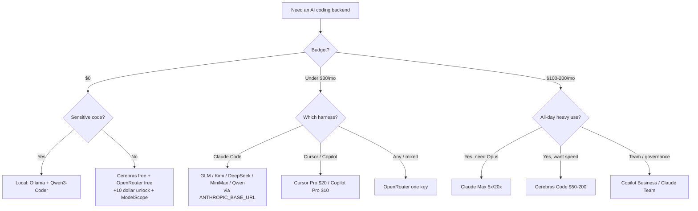

<div align="center">

# 🤖 Awesome AI Coding Subscriptions & APIs

[](https://awesome.re)
[](LICENSE)
[](CONTRIBUTING.md)

[](https://github.com/lildebil0/awesome-ai-coding-subscriptions/stargazers)

**AI 코딩 에이전트 뒤에 어떤 구독, 코딩 플랜, API, 라우터, 무료 티어를 두어야 할까?**
큐레이션과 벤치마크를 거치고 출처가 연결된 답변 — 💵 가격 · 🧠 성능 · 🔢 모델 수 · 📊 한도 · 🔌 통합 기준으로 순위를 매겼다.

[English](../README.md) · [简体中文](README.zh-CN.md) · [Español](README.es.md) · [Русский](README.ru.md) · [日本語](README.ja.md) · [Português](README.pt-BR.md) · [Français](README.fr.md) · [Deutsch](README.de.md) · **한국어** · [हिन्दी](README.hi.md)

</div>

---

이 목록은 **돈을 내는 플랜** — 구독, 정액제 코딩 플랜, 종량제 API, 라우터, 무료 티어 — 을 정리한 것이며, 코딩 도구 자체를 다루지는 **않는다**. 하니스(Claude Code, Cline, Aider, Roo/Kilo, OpenCode)는 무료다. 돈이 드는 것은 그 뒤에 있는 모델이고, 그래서 여기서 순위를 매기는 대상도 모델이다. 하니스는 그저 *통합 대상*일 뿐이다.

중국 오픈웨이트 연구소(GLM, Kimi, DeepSeek, MiniMax, Qwen, Doubao)에서 나온 월 $3~30 정액제 플랜을 무료 CLI 하니스에 연결하면, $200짜리 프런티어 구독의 대략 1/10 비용으로 SWE-bench에서 78~80%가량을 얻을 수 있다. 가장 어려운 작업에서는 여전히 프런티어 구독이 이긴다. 그래서 2026년에 대부분의 사람들은 둘 다 쓴다. 어려운 추론에는 프런티어 구독을, 나머지 전부에는 저렴한 플랜을 쓴다.

> ⚠️ **이 분야의 가격은 매달 바뀐다.** 수치는 **~2026년 6월** 기준이다. 구매 전에는 항상 공식 페이지에서 확인하라. 오래된 가격을 발견했는가? [PR을 열어라](CONTRIBUTING.md) — 수정은 추가만큼이나 가치 있다.

## 범례

| 배지 | 의미 |
|-------|---------|
| 💎 | **숨은 보석** — 덜 알려졌지만, 얻는 것에 비해 가격이 마땅한 수준보다 싸다 |
| 🆓 | 실제로 에이전트를 돌릴 수 있는 **무료 티어**가 있다 |
| ✅ | 공식 출처와 대조해 **가격을 팩트체크함** (2026년 6월) |
| ⭐ | 가치 등급(1~5): 가격 대 성능 대 한도 대 통합 |
| 🇨🇳 | 중국 호스팅(일부는 데이터 거주지/지연 시간 주의) |
| ⚠️ | 주목할 만한 위험을 안고 있음(ToS, 신뢰성, 지속성, 리셀러) |

**통합 약어:** `CC-native` = 네이티브 Anthropic 호환 엔드포인트, `ANTHROPIC_BASE_URL`로 Claude Code 백엔드에 바로 꽂을 수 있음. `OpenAI-compat` = base-URL 교체로 Cline/Roo/Kilo/Aider/Continue/OpenCode에서 동작(Claude Code는 shim/라우터 필요). `native-only` = 벤더 자체 에디터/에이전트에 묶여 있어 백엔드로 재사용 불가.

## 목차

- [고르는 법](#고르는-법)
- [예산으로 고르기](#예산으로-고르기)
- [당신이 누구인지로 고르기](#당신이-누구인지로-고르기)
- [TL;DR — 용도별 베스트 픽](#tldr--용도별-베스트-픽)
- [종합 비교표](#종합-비교표)
- [퍼스트파티 프런티어 구독](#퍼스트파티-프런티어-구독)
- [번들형 도구 구독(에디터 + 모델)](#번들형-도구-구독에디터--모델)
- [정액제 코딩 플랜 — 가치의 챔피언 💎](#정액제-코딩-플랜--가치의-챔피언-)
- [종량제 가성비 API](#종량제-가성비-api)
- [속도 / 고속 추론 제공업체](#속도--고속-추론-제공업체)
- [라우터 & 게이트웨이](#라우터--게이트웨이)
- [알아둘 만한 더 많은 제공업체(2026)](#알아둘-만한-더-많은-제공업체2026)
- [무료 티어 🆓](#무료-티어-)
- [무료 크레딧 & 학생 / 스타트업 프로그램](#무료-크레딧--학생--스타트업-프로그램)
- [틈새 & 전문 분야](#틈새--전문-분야)
- [앱 빌더 & 자율 에이전트](#앱-빌더--자율-에이전트)
- [숨은 보석 & 리셀러 프록시 ⚠️](#숨은-보석--리셀러-프록시-)
- [셋업 레시피 — 저렴한 플랜을 하니스에 연결하기](#셋업-레시피--저렴한-플랜을-하니스에-연결하기)
- [프라이버시 & 데이터 거주지 매트릭스](#프라이버시--데이터-거주지-매트릭스)
- [달러당 벤치마크](#달러당-벤치마크)
- [돈 함정 & 흔한 실수](#돈-함정--흔한-실수)
- [2026 가격 변천 타임라인](#2026-가격-변천-타임라인)
- [커뮤니티의 실제 평가](#커뮤니티의-실제-평가)
- [셀프호스트 & 하이브리드(구독이 답이 아닐 때)](#셀프호스트--하이브리드구독이-답이-아닐-때)
- [FAQ](#faq)
- [용어집](#용어집)
- [이 목록의 점수와 유지 관리 방식](#이-목록의-점수와-유지-관리-방식)
- [주의사항 & 면책 조항](#주의사항--면책-조항)
- [기여하기](#기여하기)
- [라이선스](#라이선스)
- [⭐ 스타 히스토리](#-스타-히스토리)

---

## 고르는 법

모든 플랜을 다섯 축으로 점수 매겨라:

1. **💵 가격** — 표시 가격, 그리고 *실제* 유효 비용(크레딧 비율, 피크 배수, 초과분).
2. **🧠 성능** — 모델 품질. 가치 티어는 SWE-bench Verified 기준 ~78~80%에 몰려 있고, 프런티어는 85~89%다.
3. **🔢 모델 수** — 여러 모델을 멀티플렉싱하는 플랜(Qwen Coding Plan, OpenRouter) 하나가 변동 리스크를 헤지해 준다.
4. **📊 한도** — 5시간 창당 요청/토큰, 주간 상한, 동시성. 숨은 비용: IDE의 "프롬프트" 하나가 **5~30회의 모델 호출**로 펼쳐지므로, 광고된 "5시간당 프롬프트 수"는 보이는 것보다 무르다.
5. **🔌 통합** — **네이티브 Anthropic 엔드포인트**(깔끔한 Claude Code 드롭인)를 노출하는가, 아니면 OpenAI-compat만(라우터 필요)인가? 아니면 native-only(재사용 불가)인가?

**결정 지름길:**

- **최고의 에이전트, 가장 단순한 경로**를 원한다 → Claude Pro $20 → Max 5x $100.
- **달러당 가장 많은 코딩**을 원한다 → Claude Code 위에 정액제 플랜(GLM / MiniMax / Qwen / Kimi).
- **$0**를 원한다 → Cerebras 무료 + OpenRouter 무료(+$10 해금) + NVIDIA NIM, 어려운 작업은 유료 모델로 에스컬레이션.
- **모든 것을 위한 하나의 키**를 원한다 → OpenRouter.
- **프라이버시(중국 호스팅 없음)**를 원한다 → Synthetic.new(미국, 비학습, 14일 삭제) 또는 퍼스트파티 미국 구독.



---

## 예산으로 고르기

분석 마비는 건너뛰자. 월 예산을 찾고, 스택을 챙겨라.

| 예산 | 베스트 픽 | 받는 것 | 가장 영리한 스택 |
|---|---|---|---|
| **$0** 🆓 | **GitHub Copilot Free** + **Gemini CLI** | Copilot에서 월 2,000회 완성 + 프리미엄 요청 50회; 구글이 주는 넉넉한 에이전트형 CLI | IDE에서는 자동완성용으로 Copilot Free, 터미널에서는 에이전트 실행용으로 Gemini CLI, 세 번째 무료 Tab 완성 버킷으로 [Cursor Hobby](https://cursor.com/pricing) |
| **< $10/mo** | **GLM Coding Plan Lite** 💎 ($30/분기 ≈ $10/mo) | Claude Pro 사용량의 ~3배; [네이티브 Anthropic 호환 엔드포인트](https://docs.z.ai/guides/overview/pricing) — Claude Code, Cline, OpenCode에 바로 꽂기 | GLM Lite를 Claude Code 드라이버로 + 오버플로용으로 무료 티어를 그 위에 쌓기 |
| **~$10/mo** | **GitHub Copilot Pro** ($10) | 무제한 완성, $10 상당 AI Credits, 에이전트 모드, 모델 선택기 — [2026년 6월 사용량 기반 크레딧으로 전환](https://github.blog/news-insights/company-news/github-copilot-is-moving-to-usage-based-billing/) | IDE에는 Copilot Pro + 터미널에는 GLM Lite — 총 ~$20에 프런티어급 드라이버 둘 |
| **~$20/mo** | **Claude Pro** ($20) *또는* **Cursor Pro** ($20) | Pro: 터미널/웹/데스크톱의 Claude Code, [Sonnet 4.6 + Opus 4.6](https://claude.com/pricing). Cursor: 무제한 Tab + $20 에이전트 사용량 + Background Agents | Claude Pro(최고의 순수 에이전트) + 인라인 자동완성용 Copilot Free; 또는 한 에디터에서만 산다면 Cursor Pro 단독 |
| **~$50/mo** | **Copilot Pro+** ($39) *또는* **GLM Pro** ($90/분기 ≈ $30) **+ Claude Pro** ($20) | Pro+: $39 상당 AI Credits + 최상위 모델. 콤보: GLM에서 Claude Pro 사용량의 ~15배 *플러스* 어려운 일에는 네이티브 Anthropic 품질 | 고볼륨 노동에는 GLM Pro, 까다로운 추론용으로 Claude Pro 비축 — 판 전체에서 최고의 $/처리량 |
| **~$100/mo** | **Claude Max 5x** ($100) | Pro 사용량의 5배, 최신 모델 우선 접근 — 매일 Pro 한도에 부딪히는 개발자에게 딱 맞는 지점 ([Max plan](https://support.claude.com/en/articles/11049741-what-is-the-max-plan)) | Max 5x를 주력으로 + 5x 한도를 태웠을 때 저렴한 오버플로 차선으로 GLM Lite($10) |
| **~$200/mo** | **Claude Max 20x** ($200) *또는* **Cursor Ultra** ($200) | Max 20x: Pro의 20배, 최상위 개인 티어. [Cursor Ultra](https://cursor.com/pricing): 사용량 20배 + 풀 IDE 내 우선 기능 | 터미널 우선 파워 유저에게는 Max 20x; 다양성/이중화를 위해 두 번째 벤더의 모델을 원할 때만 Copilot Pro($10) 추가 |

**경험칙**
- **$20 미만에 가격에 민감한가?** GLM Lite는 지금 코딩에서 단연 최고의 1달러다 — Anthropic의 API를 구사하므로 당신의 Claude Code 손버릇이 그대로 옮겨간다.
- **한 도구, 하루 종일?** 네이티브 구독(Claude Pro, Cursor Pro)에 돈을 내라. 쪼개지 마라.
- **매일 무겁게 쓰는가?** 곧장 Max 5x로 가라 — $50 플랜 두 개를 쌓는 것보다 싸고 훨씬 덜 번거롭다.
- **모든 티어에서 통하는 프로의 수:** 어려운 문제용 프리미엄 드라이버 하나 + 대량 편집과 자동완성용 저렴/무료 차선 하나. $20+ 구독 두 개가 필요한 경우는 드물다.

> 가격은 2026년 6월 확인. 분기 청구 플랜(GLM)은 유효 월액으로 표시. Copilot 및 GitHub 플랜은 [2026년 6월 1일 사용량 기반 AI Credits로 전환](https://github.blog/news-insights/company-news/github-copilot-is-moving-to-usage-based-billing/) — 할당량은 기본 가격에 비례해 늘어난다.


---

## 당신이 누구인지로 고르기

매트릭스 노려보기는 건너뛰자. 당신의 행을 찾고, 픽을 복사하고, 넘어가라. 가격은 별도 표기가 없으면 USD/월, 개인 티어 기준이다(2026년 6월).

| 당신은… | 베스트 픽 | 당신에게 맞는 이유 | ~가격 |
|---|---|---|---|
| **솔로 인디 해커** 💎 | **Claude Pro** + 오버플로용 Z.ai/DeepSeek API 키 | $20 구독 하나로 터미널의 Claude Code를 커버; 스프린트 도중 5시간 한도에 부딪히면, 덜 쓰게 될 $100 티어로 점프하는 대신 저렴한 가성비 API로 폴백. 매일 출시하는 1인에게 최고의 $/산출. | $20 + 푼돈 |
| **스타트업 엔지니어링 팀(2~20명)** | **GitHub Copilot Business** | 시트당 $19로 조직 정책, 공개 코드 필터, **IP 면책**, 중앙 청구를 얻는다 — 투자자/고객 앞에 내놓아도 안전한 가장 저렴한 플랜. 무거운 작업용으로 각 개발자 본인의 Claude/Cursor 구독과 짝지어라. [pricing](https://github.com/features/copilot/plans) | 시트당 $19 |
| **엔터프라이즈**(거버넌스 / SSO / IP) | **Copilot Enterprise** 또는 **Claude Enterprise** | Copilot Enterprise($39/시트)는 SSO/SCIM, 감사 로그, 코드베이스 인덱싱 지식 베이스, 그리고 동일한 Microsoft IP 면책(필터 포함)을 추가한다. Claude Enterprise(영업 견적)는 Anthropic 우선이라면 대안. 둘 다 조달을 통과한다. [Copilot Enterprise](https://docs.github.com/en/copilot/get-started/plans) | 시트당 $39 → 맞춤 |
| **CS 학생** 🆓 | **GitHub Copilot(학생)** + ChatGPT Free | 인증된 학생은 **Copilot을 Pro 수준으로 무료** 사용(무제한 완성, 프리미엄 모델, 월간 프리미엄 요청 할당). 지출 0, 진짜 도구. [Copilot plans](https://github.com/features/copilot/plans) | $0 |
| **OSS 메인테이너** 🆓 | **OSS용 Copilot Pro 무료** + 깊은 작업용 Claude Pro | 인기 레포 메인테이너는 무료 Copilot Pro 자격이 됨; 까다로운 리팩터용으로 $20 Claude Pro 하나를 유지. 최고의 공공선 대비 비용 비율. | $0~$20 |
| **프라이버시 우선 / 규제 대상** 🔒 | **로컬 스택: Ollama + Qwen3-Coder + Continue.dev** | 독점 코드가 절대 머신을 떠나지 않음 — API도, 보존 조항도, 협상할 DPA도 없음. 단일 파일 작업에서 클라우드 Claude 품질의 대략 70~85%. 꼭 클라우드를 써야 한다면 **제로 보존** API 티어를 추가. [setup](https://medium.com/@rodrigo.estrada/build-a-local-ai-coding-assistant-qwen3-ollama-continue-dev-cee0dbcd172a) | $0(하드웨어) |
| **오프라인 / 에어갭** | **Ollama + Qwen3-Coder-Next**(Continue.dev 또는 OpenCode) | 같은 로컬 스택이지만, 네트워크 케이블을 뽑은 채로 동작하는 *유일한* 범주. Qwen3-Coder-Next는 80B MoE에서 ~3B 활성 파라미터로 실행 — 실제 하드웨어에 들어가고, 인터넷이 전혀 없어도 됨. [models](https://localaimaster.com/models/best-local-ai-coding-models) | $0 |
| **바이브 코더 / 취미가** 🆓 | **무료 티어 샘플러**: ChatGPT Free 또는 Copilot Free + Gemini 무료 | 주말에 재미로 만든다 — 아무것도 내지 마라. Copilot Free의 월 2,000 완성에 채팅 모델 하나면 캐주얼한 사이드 프로젝트는 커버된다. 무료 한도가 실제로 발목을 잡을 때만 업그레이드. | $0 |
| **병렬 에이전트를 돌리는 파워 유저** 💎 | **Claude Max 20x**(또는 팬아웃용으로 가성비 API 추가) | 스웜/병렬 Claude Code 세션을 오케스트레이션한다면, 20x 사용량 천장이 오후 2시에 한도에 부딪히지 않게 막아준다. 이 볼륨에서는 동등한 API 토큰을 태우는 것보다 싸다. 일회용 워커 에이전트용으로 DeepSeek/Z.ai 키를 추가. | $200 |

**두 가지 가로지르는 경험칙:**
- **$20 → $100/$200** 점프는 *본인이* 일주일에 ~두 번 이상 사용량 한도에 부딪힐 때만 본전을 뽑는다. 대부분은 그렇지 않다 — 업그레이드 전에 추적하라.
- **IP 면책은 플랜 기능이지, 모델 기능이 아니다.** Copilot **Business**부터 시작되고 공개 코드 필터가 켜져 있어야 한다 — 무료와 Pro 티어에는 없다. 변호사가 당신의 레포를 읽을 일이 언젠가 있다면, 이것이 중요한 선이다. [details](https://github.com/features/copilot/plans)

출처:
- [GitHub Copilot Plans & pricing](https://github.com/features/copilot/plans)
- [Plans for GitHub Copilot — GitHub Docs](https://docs.github.com/en/copilot/get-started/plans)
- [AI Pricing Compared 2026 — AIViewer](https://aiviewer.ai/guides/ai-pricing-comparison-2026/)
- [Build a Local AI Coding Assistant — Qwen3 + Ollama + Continue.dev](https://medium.com/@rodrigo.estrada/build-a-local-ai-coding-assistant-qwen3-ollama-continue-dev-cee0dbcd172a)
- [Best Local AI Coding Models for Ollama (2026)](https://localaimaster.com/models/best-local-ai-coding-models)


---

## TL;DR — 용도별 베스트 픽

| 용도 | 픽 | 이유 | ~가격 |
|----------|------|-----|--------|
| 🏆 **종합 최고 가치** | **GLM Coding Plan** 💎🇨🇳 | "월 ~$30에 Claude Max 사용량의 3배"; GLM-5.1은 Opus 코딩의 ~94%; 네이티브 Claude Code | $10~30/mo |
| 🥇 **순수 프런티어 최강** | **Claude Max 5x** | Claude Code에서 Opus를 해금, 만장일치 1위 에이전트 | $100/mo |
| 🪙 **가장 저렴한 진지한 진입** | **GLM Lite** / **Qwen Standard** / **Trae Lite** 💎 | 월 ~$3~10부터 진짜 코딩 백엔드 | $3~10/mo |
| 💸 **토큰당 가장 저렴** | **DeepSeek V4-Flash** 💎 | $0.14/M 입력, $0.0028/M 캐시 히트, 1M 컨텍스트, CC-native | 종량 |
| 🧪 **최고의 무료** | **Cerebras 무료** 🆓 + **OpenRouter :free** 🆓 | 1M tok/day(고속) + Qwen3-Coder-480B 무료 | $0 |
| ⚡ **최고의 빠름+저렴** | **Groq** 💎🆓 / **Cerebras Code** | 네이티브 Anthropic 엔드포인트(Groq); ~2000 tok/s 정액제(Cerebras) | 무료 / $50/mo |
| 🔀 **최고의 범용 라우터** | **OpenRouter** | 315+ 모델, 하나의 키, Anthropic 스킨, 토큰 마크업 없음 | 종량 +5.5% |
| 🔒 **최고의 프라이버시(미국 호스팅)** | **Synthetic.new** 💎 | 미국 인프라, 비학습, 14일 삭제, OpenAI+Anthropic 이중 호환 | $20~60/mo |
| 🧰 **대형 코드베이스에 최고** | **Augment Code** ✅ | 모노레포를 위한 동급 최강 Context Engine | $20+/mo |
| 🏢 **최고의 팀 가치** | **Claude Team Premium 시트** 💎 | ≈ Max-5x 사용량 + SSO/관리자 | $100/시트 |


---

## 종합 비교표

대략 가치순으로 정렬. 가격 ~2026년 6월; **구매 전 확인하라**.

| 플랜 | 유형 | 가격 | 모델 | 한도(코딩) | 통합 | ⭐ | 비고 |
|------|------|-------|--------|-----------------|-------------|----|-------|
| [GLM Coding Plan](#glm-coding-plan--zai-zhipu-ai-) | 정액제 | $10~30/mo (Lite/Pro, 분기) | GLM-5.1/5/4.7 | Lite ~80, Pro ~400 프롬프트/5h | CC-native | ⭐5 | 💎🇨🇳✅ |
| [DeepSeek API](#deepseek-) | 종량 API | V4-Pro $0.435/$0.87; Flash $0.14/$0.28 | V4-Pro/Flash | 1M 컨텍스트, 500~2500 동시 | CC-native | ⭐5 | 💎🇨🇳✅ |
| [MiniMax Coding Plan](#minimax-coding--token-plan-) | 정액제 | $10~50/mo | M2.7(플랜), M2.5/M3(API) | Starter ~100, Max ~1000 프롬프트/5h | CC-native | ⭐5 | 💎🇨🇳 |
| [Kimi Code](#kimi-code--moonshot-ai-) | 정액제+API | ~$19/mo + 미터링 | K2.6 (1T) | ~300~1200 호출/5h, 30 동시 | CC-native | ⭐5 | 💎🇨🇳 |
| [Qwen Cloud Coding Plan](#qwen-cloud-coding-plan--alibaba-) | 정액제 | Pro $50/mo (Lite $10, 마감) | Qwen3.5 + Kimi/GLM/MiniMax | Pro 6000 req/5h, 1M 컨텍스트 | CC-native | ⭐4 | 💎🇨🇳✅ |
| [OpenRouter](#openrouter-) | 라우터 | 종량, 충전 시 +5.5% | 315+(전부) | 잔액 한정; 무료 모델 50~1000/day | CC-native 스킨 | ⭐5 | 🆓 |
| [Claude Pro](#anthropic-claude) | 퍼스트파티 | $20/mo | Sonnet 4.6 (Opus 없음) | ~40~45 msg/5h + 주간 | CC-native | ⭐5 | 최고의 진입 |
| [Claude Max 5x](#anthropic-claude) | 퍼스트파티 | $100/mo | + Opus 4.6/4.7 | ~50~225 프롬프트/5h | CC-native | ⭐5 | Opus 해금 |
| [Cerebras Code](#cerebras-) | 정액제 속도 | $50/$200 | GLM-4.7 (~2000 tok/s) | 24M~120M tok/day, 131k 컨텍스트 | OpenAI-compat | ⭐5 | ✅ 자주 매진 |
| [Synthetic.new](#open-weight-flat-subs-privacy--us-host) | 정액제(미국) | $20~60/mo | 16 오픈웨이트(GLM/Kimi/Qwen/DS) | ~125~1250 req/5h | CC-native | ⭐5 | 💎🔒 |
| [Chutes](#chutes-) | 정액제 ⚠️ | $3/$10/$20 | GLM-5/Kimi/DS/MiniMax/Qwen | 300/2000/5000 req/day | OpenAI-compat | ⭐5 | 💎⚠️ 탈중앙화 ✅ |
| [Grok Code Fast 1](#xai-grok) | 종량 API | $0.20/$1.50/M | grok-code-fast-1 | 256K 컨텍스트, ~92 tok/s | CC-native | ⭐5 | 💎 OpenRouter 1위 |
| [ChatGPT Plus](#openai-chatgpt--codex) | 퍼스트파티 | $20/mo | GPT-5.x-Codex | 토큰 크레딧 미터링 | Codex-native | ⭐4 | Codex 2위 에이전트 |
| [ChatGPT Pro](#openai-chatgpt--codex) | 퍼스트파티 | $100/$200 (5x/20x) | GPT-5.5-Codex | 높음; 전용 GPU | Codex-native | ⭐4 | |
| [Claude Max 20x](#anthropic-claude) | 퍼스트파티 | $200/mo | Opus 4.6/4.7 | ~200~900 프롬프트/5h | CC-native | ⭐4 | 파워 티어 |
| [Cursor Pro / Ultra](#cursor) | 번들 | $20 / $200 | 모든 프런티어 + Auto | $20 / $400 사용량 풀 | Native-only | ⭐4 | Ultra = 2× 크레딧 비율 |
| [GitHub Copilot Pro](#github-copilot) | 번들 | $10/mo | GPT-5/Claude/Gemini | $10 AI 크레딧(사용량) | Native-only (+ACP) | ⭐4 | 무료 완성 🆓 |
| [DeepInfra](#deepinfra) | 속도/API | 종량(가장 싼 OSS) | Kimi/DS/Qwen3-Coder/GLM | 잔액 한정 | CC-native | ⭐5 | 💎✅ 가장 싼 호스트 |
| [Groq](#groq) | 속도/API | 종량 + 무료 | GPT-OSS/Qwen3/Kimi | 무료 RPM/TPM 상한 | CC-native | ⭐4 | 💎🆓 |
| [Vercel AI Gateway](#vercel-ai-gateway) | 라우터 | 마크업 $0(BYOK도) | Claude 포함 수백 개 | 월 $5 무료 크레딧 | CC-native | ⭐4 | 💎🆓✅ |
| [Requesty](#requesty) | 라우터 | 정액 +5% | Claude/GPT/Gemini/DS/Qwen | 시맨틱 캐시 ~40% 절감 | OpenAI-compat | ⭐4 | 💎 팀 거버넌스 |
| [Mistral Le Chat Pro](#mistral-le-chat-pro--vibe) | 퍼스트파티 | $14.99/mo ($5.99 학생) | Devstral 2 + Vibe CLI | ~25 무료 msg/day | Native-only | ⭐4 | 💎🆓🇪🇺 가장 싼 메이저 구독 |
| [Augment Code](#번들형-도구-구독에디터--모델) | 번들 | $20~200/mo | Claude/Gemini/GPT | 40k~450k 크레딧/mo | Native-only | ⭐4 | ✅ 최고의 대형 레포 컨텍스트 |
| [Zed Pro](#번들형-도구-구독에디터--모델) | 번들 | $10/mo | 아무거나(BYO 키/ACP) | $5 크레딧 + 사용량 | ACP + BYOK | ⭐4 | 💎 반(反)락인 |
| [Cerebras free](#무료-티어-) | 무료 | $0 | Qwen3-Coder-480B, GPT-OSS-120B | 1M tok/day, 8K 컨텍스트 상한 | OpenAI-compat | ⭐5 | 💎🆓 가장 빠른 무료 |
| [Google AI Studio](#무료-티어-) | 무료 | $0 | Gemini 2.5 Flash, Gemma 3 27B | Flash 250 RPD; Gemma 14.4k RPD | OpenAI-compat | ⭐4 | 🆓 가장 큰 무료 컨텍스트 |


---

## 퍼스트파티 프런티어 구독

벤더 직접 플랜이다. 구독은 로그인을 통해 **벤더 자체 하니스**(Claude Code, Codex CLI, Antigravity, Grok Build)를 인증한다 — 서드파티 OpenAI-compat 도구용 범용 API 키를 주는 것은 **아니다**(그건 별도의 토큰당 청구다). 예외: xAI Grok 모델은 OpenAI/Anthropic 호환이다.

> 에이전트형 코딩의 가치 서열(2026년 6월 합의): **Claude > OpenAI Codex > Google Gemini > xAI Grok**. 한 독립 30일 테스트에서 Claude ~95% 대 ChatGPT ~85% 코딩 정확도; 벤더 SWE-bench로는 GPT-5.5(88.7%) ≈ Opus 4.7(87.6%).

### Anthropic (Claude)
- **[Claude Pro](https://claude.com/pricing)** — `$20/mo`(연간 $17). Claude Code에서 Sonnet 4.6(**Opus 없음**). ~40~45 msg/5h + 주간 상한, 채팅/Cowork와 공유. **1위 코딩 에이전트로의 최고 가성비 진입점.** 2026년 4월 5h 한도를 두 배로 늘리고 피크 스로틀링을 제거했다. ⭐5
- **[Claude Max 5x](https://support.claude.com/en/articles/11049741-what-is-the-max-plan)** — `$100/mo`. **Opus 4.6/4.7 해금** + 5배 처리량(~50~225 프롬프트/5h). 프로의 스위트 스폿; OpenAI/Google이 이만큼 유용하게 맞추지 못하는 $100 중간 티어. ⭐5
- **[Claude Max 20x](https://support.claude.com/en/articles/11049741-what-is-the-max-plan)** — `$200/mo`. ~200~900 프롬프트/5h. 하루 종일 도는 병렬 에이전트용; **정액제가 API를 이기는** 셈법이 결정적이다(Claude Code 토큰의 90%+가 캐시 읽기로, 구독에서는 무료지만 API에서는 청구됨 — 한 개발자의 최고 사용 달 = API 기준 $5,623 ≈ Max 5x 4.5년치). ⭐4
- **[Claude Team Premium 시트](https://claude.com/pricing)** 💎 — `$100/시트`(연간). ≈ Max-5x 사용량 **플러스** SSO/관리자/감사/엔터프라이즈 검색. 조용히 최고의 *팀* 코딩 가치; Standard $20 시트도 Claude Code 포함. ⭐4

### OpenAI (ChatGPT / Codex)
- **[ChatGPT Plus](https://help.openai.com/en/articles/11369540-using-codex-with-your-chatgpt-plan)** — `$20/mo`. Codex CLI/IDE 번들(GPT-5.5/5.4/5.3-Codex). 2026년 4월부터 **토큰 크레딧 미터링**(혼란스러움). Codex = 만장일치 2위 에이전트. 무거운 에이전트 작업에서 Plus 한도는 빨리 소진된다. ⭐4
- **[ChatGPT Pro](https://developers.openai.com/codex/pricing)** — `$100`(5x) / `$200`(20x). 높은 처리량 + 전용 GPU. $100 티어의 "10x 부스트" 프로모는 **2026년 5월 31일 만료**(지금은 5x)임에 주의. 고전적인 "$200 플랜 살 가치 있나?" 논쟁 = Claude Max 20x 대 ChatGPT Pro 20x. ⭐4

### Google (Gemini)
- **[Gemini AI Pro / Ultra](https://gemini.google/subscriptions/)** — Ultra의 번들 GCP 크레딧($100에 $40 / $200에 $100)은 Google Cloud를 쓰면 비용을 실질적으로 상쇄한다 💎. ⚠️ **Google은 2026년 6월 18일 오픈소스 Gemini CLI를 폐기**하고, 무료 할당량이 훨씬 낮은(~1000 → ~20 req/day) 폐쇄형 Antigravity CLI로의 이전을 강제한다 — 2026년 최대의 커뮤니티 불만.

### xAI (Grok)
- **[SuperGrok](https://x.ai/news/grok-code-fast-1)** — `$10`(Lite) / `$30` / `$300`(Heavy). Grok Build CLI는 **격리된 git worktree에서 8개 병렬 서브 에이전트**를 실행(참신함). `grok-code-fast-1`은 컬트적 팬덤이 있고(저렴+빠름) 많은 파트너 IDE에서 무료였다. SWE-bench ~70.8%로 선두에 뒤처짐. **코딩이라면 SuperGrok 앱 구독이 아니라 [xAI API](#xai-grok)를 사라.** ⭐3 💎


---

## 번들형 도구 구독(에디터 + 모델)

여기서는 플랜 *자체*가 제품이다 — 벤더의 에디터/에이전트에 들어가서 산다. 2026년 트렌드: 거의 전부 고정 요청 수에서 **크레딧 / 토큰 미터링**으로 옮겨, 비용을 *덜* 예측 가능하게 만들었다(요란한 반발).

### Cursor
- **[Cursor](https://cursor.com/pricing)** — Hobby 무료 · **Pro `$20`** · **Pro+ `$60`** 💎 · **Ultra `$200`**. 2025년 6월 이후 플랜 가격 = API 요율의 사용량 풀. **크레딧 비율은 상위 티어로 갈수록 개선**: Pro $20/$20(1×), Pro+ $60/$70(1.17×), Ultra $200/$400(**2×, 최고**). `Auto` 모드가 가치의 핵심 — 사실상 무제한이고, Claude/MAX를 고정할 때처럼 풀을 빨아먹지 않는다. ⚠️ 2025년 6월 전환은 [가격 참사](https://www.wearefounders.uk/cursors-pricing-disaster-the-full-timeline-of-how-an-ai-coding-darling-burned-its-most-loyal-users/)를 일으켰다(HN 유저: "일주일 만에 $350 초과분"); CEO가 사과 + 환불. **Native-only** — Claude Code를 백킹할 수 없고, 2026년 1월 기준 Claude 구독을 Cursor *안으로* 라우팅할 수도 없다. 동급 최강의 Tab/Apply. ⭐4

### GitHub Copilot
- **[GitHub Copilot](https://github.com/features/copilot/plans)** — Free 🆓 · **Pro `$10`** · Pro+ `$39` · Max `$100` · Business `$19` · Enterprise `$39`. ⚠️ **2026년 6월 1일 사용량 기반 AI Credits로 전환**(1 크레딧 = $0.01); 각 플랜에 크레딧 풀 포함(Pro=$15, Pro+=$70). **코드 완성은 무제한·무료 유지** — 완성만 쓰는 유저는 영향 없음. 반발 극심(TechTimes: 에이전트 청구가 10×~50× 점프). 동급 최강의 IDE 완성 + 조직용 거버넌스/IP 면책. **Native-only**(탈출구: Copilot CLI는 ACP를 구사). ⭐4

### 기타
- **[Augment Code](https://www.augmentcode.com/pricing)** ✅ — Indie `$20`/40k 크레딧 · Standard `$60` · Max `$200`. 대형 모노레포를 위한 **동급 최강 Context Engine**(컨텍스트 회상 비교에서 1위). VS Code + JetBrains + Auggie CLI. Native-only. 도구 집약 작업에서의 크레딧 소모가 불만. ⭐4 💎
- **[Zed Pro](https://zed.dev/pricing)** 💎 — Free · **Pro `$10`**(겨우 +10% 마크업) · Business `$30`. **반락인** 픽: 개방형 [ACP](https://zed.dev/docs/ai/)로 외부 에이전트(Claude Code, Codex, OpenCode)를 구동하고 어떤 제공업체든 BYO 키. 가장 빠른 네이티브 에디터. ⭐4
- **[Kiro](https://kiro.dev/pricing/)** 💎 — Free · **Pro `$20`/1k 크레딧** · Pro+ `$40` · Power `$200`. 최고의 **스펙 주도** 에이전트(요구사항→설계→작업), Opus 4.7 포함 전체 Claude 라인업, 0.01 크레딧 분수 청구. **AWS Startups = Pro+ 1년 무료.** ⭐4
- **[Trae](https://www.trae.ai/pricing)** 💎🇨🇳 — Free · **Lite `$3`** · Pro `$10` · Ultra `$100`. ByteDance의 VS Code 포크; 사용량 풀이 표시 가격을 초과(예: $10에 $20 사용량) = "$3짜리 Cursor 대안". ⚠️ ByteDance 텔레메트리가 계열사와 공유됨 — 엔터프라이즈에는 치명적 결격. ⭐4
- **[Sourcegraph Amp](https://sourcegraph.com/amp)** — 무료 시작($10 크레딧; 구 Cody는 $40). 순수 **소비** 기반(월 최저액 없음), "smart" 모드에서 Opus 4.8 실행. 가벼운 사용에 좋고, 무거운 사용에는 무제한 소모 위험. Cody Free/Pro는 Amp로 통합·폐기됨. ⭐3
- **[JetBrains AI / Junie](https://www.jetbrains.com/ai-ides/buy/)** — 사랑받는 IDE 통합이지만, Junie는 **크레딧을 빨리 태운다**(Ultimate의 35 크레딧이 ~4~5일에 소진). JetBrains에서 사는 사람만.
- **과가격 / 회피:** **Tabnine**($39 최저, 무료 티어 없음, 연간 락인 — 온프렘/에어갭 수요에만); **Windsurf Pro**(2026년 3월 일/주간 할당량 전환은 올해 가장 많이 불평받은 변경, Cognition 인수 후 신뢰 낮음). **Supermaven**은 독립형으로는 사망(2025년 11월 Cursor Tab으로 흡수).


---

## 정액제 코딩 플랜 — 가치의 챔피언 💎

고정 월/분기 플랜으로, 프런티어급 오픈웨이트 모델을 하니스 뒤에 두며 대부분 중국 연구소 출신이다. 대부분 네이티브 Anthropic 엔드포인트를 노출하므로 `ANTHROPIC_BASE_URL`로 Claude Code에 바로 꽂힌다. 엔드포인트 목록은 [Alorse/cc-compatible-models](https://github.com/Alorse/cc-compatible-models) 참고.

> 합의된 서열: **GLM**(가장 저렴한 진입, 커뮤니티 기본) · **MiniMax**(최고의 가격/볼륨) · **Kimi**(최고의 장기 호라이즌 에이전트) · **Qwen**(>262K 컨텍스트, 멀티 모델). Claude Pro $20이 이들이 깎아내리는 품질 기준선이다.

<a name="glm-coding-plan--zai-zhipu-ai-"></a>
### GLM Coding Plan — Z.ai (Zhipu AI) 💎🇨🇳 ✅
- `Lite ~$10/mo ($30/분기)` · `Pro ~$30/mo ($90/분기)` · `Max ~$80/mo ($240/분기)`. 2026년 2분기 프로모: $27/$81/$216/분기. (입소문 난 **월 $3** 프로모는 2026년 2월 11일 종료; 연간 Lite ~$7/mo가 남은 저렴 경로.)
- 모델: **GLM-5.1**(Opus 4.6 코딩의 ~94%), GLM-5/5-Turbo, GLM-4.7, GLM-4.5-Air.
- 한도: Lite ~80, Pro ~400, Max ~1,600 프롬프트/5h + 주간. ⚠️ GLM-5/5.1에 대한 **피크 시간 3× 배수**(14:00~18:00 UTC+8)가 처리량을 조용히 반토막낸다.
- 통합: `ANTHROPIC_BASE_URL=https://api.z.ai/api/anthropic` — 공식 Claude Code 지원 + Cline/Roo/Kilo/OpenCode(20+ 도구). **퍼스트파티** = 리셀러 차단 위험 없음.
- > *2026년 가장 많이 추천된 단일 저예산 코딩 플랜.* "월 ~$30에 Claude Max 사용량의 3배." 2월 가격 인상 + ⅓ 할당량 삭감에 대한 반발에도 여전히 최고 가치로 평가됨. ⭐5
- 출처: [z.ai/subscribe](https://z.ai/subscribe) · [pricing](https://docs.z.ai/guides/overview/pricing) · [GLM-5.1 review](https://serenitiesai.com/articles/glm-5-1-coding-plan-review-2026)

<a name="minimax-coding--token-plan-"></a>
### MiniMax Coding / Token Plan 💎🇨🇳
- `Starter $10/mo` · `Plus $20` · `Max $50`(연간 결제 시 2개월 무료); High-Speed 변형 $40~150.
- 모델: 플랜에서는 M2.7 / M2.7-Highspeed; **M2.5/M3**(1M 컨텍스트)는 API로. ⚠️ **플랜이 벤치마크된 M2.5/M2.7보다 오래된 모델(M2.1)을 제공하는 경우가 잦다.**
- 한도: Starter ~100 → Max ~1,000 프롬프트/5h; ~50 TPS(고속은 100).
- 통합: `ANTHROPIC_BASE_URL=https://api.minimax.io/anthropic` + OpenAI-compat.
- > "Claude Code 청구서를 반으로 줄였다." 정액제 버킷에서 **최고의 순수 가격/볼륨**; M2.7은 입력 비용 ~1/5에 GLM-5.1의 ~94%. ⭐5
- 출처: [coding plan](https://platform.minimax.io/subscribe/coding-plan) · [M2.5 pricing](https://www.verdent.ai/guides/minimax-m2-5-pricing)

<a name="kimi-code--moonshot-ai-"></a>
### Kimi Code — Moonshot AI 💎🇨🇳
- `~$19/mo 멤버십` + 미터링 API(K2.6 $0.60~0.95/M 입력, $2.50~4.00/M 출력, 75% 캐시 할인). Moderato/Allegretto/Vivace 티어.
- 모델: **Kimi K2.6**(1T MoE, ~80.2% SWE-bench), K2.5.
- 한도: ~300~1,200 호출/5h, **30 동시**(병렬 에이전트에 넉넉함).
- 통합: `ANTHROPIC_BASE_URL=https://api.moonshot.ai/anthropic` — 진짜 Claude Code 드롭인; 자체 Kimi CLI 제공(6.4k★).
- > **최고의 장기 호라이즌 에이전트 안정성**(13시간 세션에 걸쳐 4,000+ 도구 호출 지속). "코딩 비용 88% 절약." 오픈 코호트 중 입력 측 가격이 가장 비싸다. ⭐5
- 출처: [agent support](https://platform.kimi.ai/docs/guide/agent-support) · [Kimi Code guide](https://www.nxcode.io/resources/news/kimi-code-2026-plans-pricing-developer-guide)

<a name="qwen-cloud-coding-plan--alibaba-"></a>
### Qwen Cloud Coding Plan — Alibaba 💎🇨🇳 ✅
- `Pro $50/mo`(Lite ~$10는 2026년 3월 20일 이후 **신규 구독 마감**).
- 모델: Qwen3.5-Plus, Qwen3-Coder-Next/Plus/480B + 하나의 키로 교차 모델 **Kimi/GLM/MiniMax**. **1M 토큰 컨텍스트**(이 차선 최고).
- 한도: Pro 6,000 req/5h + 45k/주 + 90k/월(슬라이딩 윈도우). 전용 `sk-sp-` 키(종량 키와 호환 불가).
- 통합: `ANTHROPIC_BASE_URL=https://coding-intl.dashscope.aliyuncs.com/apps/anthropic` + Qwen Code CLI.
- > 두드러지는 점 = **하나의 플랜이 Qwen+Kimi+GLM+MiniMax를 멀티플렉싱**하고, 유일하게 믿을 만한 1M 컨텍스트 정액제. ⭐4
- 출처: [Model Studio coding plan](https://www.alibabacloud.com/help/en/model-studio/coding-plan)

### 오픈웨이트 정액 구독(프라이버시 / 미국 호스팅)
- **[Synthetic.new](https://synthetic.new/pricing)** 💎🔒 — `$20~60/mo`. 상시 가동 오픈웨이트 모델 ~16종(Kimi/GLM/Qwen3-Coder-480B/DeepSeek). **미국 인프라, 비학습, 14일 삭제.** **OpenAI + Anthropic 이중 호환** = 진짜 Claude Code 드롭인. 중국 플랜에 대한 프라이버시 의식적 대안. ⭐5
- **[Cerebras Code](#cerebras-)** — `$50`/`$200`, 정액제 속도([속도](#속도--고속-추론-제공업체) 참고).
- **[OpenCode Go (Zen)](https://opencode.ai/go)** 💎 — `$5` 첫 달 이후 `$10/mo` 정액. 중국 오픈웨이트 모델 ~12~14종(GLM-5.1/Kimi/Qwen3.7/DeepSeek V4/MiniMax). OpenCode에서 일급. Claude/GPT 없음. ⭐4

### 틈새 / 저가 티어 정액 플랜 🇨🇳
- **[StepFun Step Plan](https://github.com/Alorse/cc-compatible-models)** — `$6.99`~`$99/mo`, 100~5,000 프롬프트/5h, CC-native. 가격 깎기 선수, 모델은 덜 검증됨. ⭐3
- **MiMo (Xiaomi)** — `$6`~`$100/mo` 크레딧 기반(60M~1.6B), CC-native(`api.xiaomimimo.com`), 멀티모달 Omni 포함. 거의 벤치마크 안 됨. ⭐3
- **Atlas Cloud** 💎 — `$10`/`$20`, **하루** 80만~180만 크레딧, OpenAI-compat(Claude Code/Codex/OpenCode). 자율 에이전트용 일일 크레딧 모델. ⭐4
- **Factory Droid** 💎 — `$20/mo`부터 토큰 기반, 프런티어 모델(Claude/GPT/Gemini), 롤링 5h/7d/30d 윈도우. "Droid 때문에 $200 Max 플랜 두 개를 해지했다"는 일화로 유명. ⭐4


---

## 종량제 가성비 API

가치 연구소들의 토큰당 접근. 에이전트 루프에서는 **캐시 가격이 진짜 비용 동인**이다 — 헤드라인 입력 가격보다 캐시 히트를 노리고 설계하라.

<a name="deepseek-"></a>
### DeepSeek 💎🇨🇳 ✅
- **V4-Pro** `$0.435/M 입력 · $0.0036/M 캐시 히트 · $0.87/M 출력`(**75% 인하는 이제 영구화**). **V4-Flash** `$0.14 / $0.0028 / $0.28`. 1M 컨텍스트, 384K 최대 출력.
- 통합: OpenAI-compat **+ 네이티브 Anthropic**(`https://api.deepseek.com/anthropic`) — 드롭인 Claude Code(`ANTHROPIC_MODEL=deepseek-v4-pro[1m]`).
- > **토큰당 비용 챔피언.** V4-Pro는 출력 <$1/M에 ~80.6% SWE-bench / 93.5% LiveCodeBench. V4-Flash의 $0.0028/M 캐시 히트는 대량 루프에서 무적이다. ⭐5
- 출처: [pricing](https://api-docs.deepseek.com/quick_start/pricing) · [Claude Code setup](https://api-docs.deepseek.com/quick_start/agent_integrations/claude_code)

### 기타
- **[Alibaba Qwen3-Coder API](https://www.alibabacloud.com/help/en/model-studio/model-pricing)** 🇨🇳 — 480B `$0.22/$1.00`, Flash `$0.195/$0.975`, 30B-A3B `$0.07/$0.27`. **90일간 100만 무료 토큰**(Intl). CC-native. 가장 강력한 오픈웨이트 에이전트형 코더. 싱가포르 리전 키 사용. ⭐4
- **[Moonshot Kimi API](https://platform.kimi.ai/docs/pricing)** 🇨🇳 — K2.6 `$0.95/$4.00`($0.16 캐시), K2.5 `$0.60/$3.00`. CC-native. 뛰어난 도구 호출; 출력 가격이 불만. $10 입금하면 일일 상한 제거. ⭐4
- **[Zhipu GLM API](https://docs.z.ai/guides/overview/pricing)** 🇨🇳 — GLM-5.1 `$1.40/$4.40`, GLM-4.7 `$0.60/$2.20`, FlashX `$0.07/$0.40`. CC-native. 대부분의 애호가는 대신 더 저렴한 [Coding Plan](#glm-coding-plan--zai-zhipu-ai-)을 산다. ⭐4
- **[MiniMax API](https://platform.minimax.io/docs/guides/pricing-paygo)** 🇨🇳 ✅ — M3 `$0.30/$1.20`($0.06 캐시, **캐시 쓰기 무료**), M2.5 ~`$0.15/$1.15`. "Opus보다 20× 저렴." 퍼스트파티 Anthropic 호환. ⭐4


---

## 속도 / 고속 추론 제공업체

오픈웨이트 모델의 토큰당 호스트로, 처리량에 최적화됨. **Groq만 네이티브 Anthropic 엔드포인트를 갖는다**(가장 깔끔한 Claude Code 드롭인); 나머지는 OpenAI-compat(CC에는 shim/라우터 필요, Cline/Roo/OpenCode에서는 네이티브).

<a name="deepinfra"></a>
- **[DeepInfra](https://deepinfra.com/pricing)** 💎 ✅ — **토큰당 가장 저렴한 챔피언.** DeepSeek V3.2 ~$0.26/$0.38, Kimi K2.6 $0.75/$3.50, Qwen3-Coder-480B $0.30/$1.00. 90+ 모델, 캐시 할인, **네이티브 Anthropic 엔드포인트**, 선결제 없음. 속도는 좋지만 최상급은 아님. ⭐5
<a name="groq"></a>
- **[Groq](https://groq.com/pricing)** 💎🆓 — LPU 속도(GPT-OSS-20B ~860 tok/s). GPT-OSS-120B `$0.15/$0.60`, Kimi K2 `$1.00/$3.00`. **네이티브 Anthropic + OpenAI 호환** + 진짜 무료 티어. 배치+캐시로 ~25%까지. Qwen3-Coder-480B 없음(천장은 Qwen3-32B). ⭐4
<a name="cerebras-"></a>
- **[Cerebras](https://www.cerebras.ai/pricing)** ✅ — **가장 빠름**(~2,000~3,000 tok/s). **Code Pro `$50`**(24M tok/day) / **Max `$200`**(120M tok/day), GLM-4.7, 131k 컨텍스트. 종량 GPT-OSS-120B `$0.35/$0.75`. ⚠️ 자주 **매진**; 131k 컨텍스트(네이티브의 절반) + 높은 TTFT가 에이전트 루프에서 속도를 무디게 한다. ⭐5 정액제 / ⭐4 종량
- **[Together AI](https://www.together.ai/pricing)** — 가장 폭넓은 카탈로그(Qwen3-Coder-480B, Kimi, DeepSeek V4 Pro $2.10/$4.40, 캐시 $0.20). 중간 가격, ~89 tok/s. ⭐4
- **[Fireworks AI](https://fireworks.ai/pricing)** — 프로덕션/엔터프라이즈 지향, 공격적 캐시($0.15/M), DeepSeek V4-Flash $0.14/$0.28, Azure Foundry 경로. ⭐4
- **[Novita](https://novita.ai/pricing)** 💎 — DeepInfra에 가까운 가격으로 Qwen3-Coder 패밀리 전체를 호스팅; 잘 알려지지 않은 OpenRouter 경로. ⭐4
- **[Hyperbolic](https://docs.hyperbolic.xyz/docs/hyperbolic-ai-inference-pricing)** 💎 — GPT-OSS-20B `$0.10/M` 블렌디드(어디서든 가장 싼 축); Qwen3-Coder-480B(FP8) 호스팅. ~13 모델. ⭐3
- **SambaNova** — 거대 671B/405B 모델에서 독보적으로 빠름; 영구 무료 + $5 크레딧 🆓 이지만 50 req/day 상한 = 평가 전용.


---

## 라우터 & 게이트웨이

여러 제공업체에 걸친 하나의 키. 라우터를 **기본 접근 계층**으로 고르라.

<a name="openrouter-"></a>
- **[OpenRouter](https://openrouter.ai/pricing)** 🆓 — **합의된 기본값.** 315+ 모델, 하나의 키, **Anthropic 호환 "스킨"**(`ANTHROPIC_BASE_URL=https://openrouter.ai/api` = 진짜 Claude Code 드롭인), **토큰 가격 마크업 없음**(충전 시에만 +5.5%), 무료 ZDR + 지출 상한, 넉넉한 BYOK(월 100만 무료 req). 무료 모델(Qwen3-Coder-480B, DeepSeek, Llama 4): 50 RPD → 일회성 $10 입금 후 **영구히 1000 RPD**. 5.5% 수수료는 월 ~$5k 지출을 넘어야만 따끔하다. ⭐5
<a name="requesty"></a>
- **[Requesty](https://www.requesty.ai/)** 💎 — **정액 5% 마크업**, **시맨틱 캐싱**(~40% 절감, 동일 항목만 캐싱하는 것보다 우수) + 요청별 스마트 라우팅 + **에이전트별 모델 정책**(분류기/합성기 역할마다 다른 모델) + SOC 2 Type II 포함 전 기능. 팀 거버넌스 픽. OpenAI-compat. ⭐4
<a name="vercel-ai-gateway"></a>
- **[Vercel AI Gateway](https://vercel.com/docs/ai-gateway/pricing)** 💎🆓 ✅ — **BYOK에도 마크업 제로.** 네이티브 Anthropic 호환(`https://ai-gateway.vercel.sh`) = 직접 Claude Code + Claude Agent SDK + "Gateway 경유 Claude Code Max". 월 $5 무료 크레딧이 무기한 갱신(충전하면 멈춤). 순수 경제성 최고의 픽, 특히 Vercel 생태계에서. ⭐4
- **[Helicone Gateway](https://helicone.ai/pricing)** 🆓 — 관측성 우선(자동 로깅/트레이싱/비용), 마크업 제로, 무료 월 10k req; 구독 $79/$799. ⭐3
- **[CometAPI](https://www.cometapi.com/)** — 최신 독점 모델 포함 500+ 모델, 공식가 대비 ~20~40% 할인, **OpenAI+Anthropic 이중 호환**. 선불 크레딧 중개자 위험. ⭐4
- **[ElectronHub](https://www.electronhub.ai/pricing)** — 600+ 모델, 주간 크레딧이 현금 비용을 초과할 수 있음; 저가 티어는 빡빡한 5~10 RPM, 리셀러 신뢰 주의. ⭐3
- **[LiteLLM](https://docs.litellm.ai/)** — OSS **셀프호스트** 표준(무료, 마크업 없음) — [통합 팁](#2-claude-code-router--작업-기반-라우팅-제공업체-혼합) 참고. DIY 인프라, 턴키 아님. ⭐4


---

## 알아둘 만한 더 많은 제공업체(2026)

메인 섹션의 헤드라인은 아니지만 실제 공백을 메우는 진짜 유용한 항목들 — 추가 중국 연구소와 애그리게이터, 서구 코딩 도구, OpenRouter 너머의 라우터. 목록을 훑기 쉽게 그룹화하고 접어 두었다.

<details>
<summary><b>🇨🇳 중국 애그리게이터 & 연구소</b>(저렴한 토큰, 일부는 네이티브 Anthropic 엔드포인트)</summary>

- **[SiliconFlow](https://www.siliconflow.com/pricing)** 💎 — 중국 최대 독립 MaaS 라우터 중 하나, 200+ 모델, **네이티브 Anthropic 엔드포인트**(드묾)라 Claude Code를 저렴한 DeepSeek/Qwen/GLM/Kimi에 바로 겨눌 수 있음. Intl(.com) + 중국(.cn) 엔드포인트. DeepSeek-V4-Flash ~$0.14/$0.28.
- **[PPIO](https://ppio.com/llm-api)** 💎 — **자체 GPU 클라우드**상의 CNY 가격 라우터; Qwen3-Coder-Next ≈¥1.4/¥10.5, DeepSeek-V4-Flash ¥1/¥2 — 어디서든 가장 낮은 축의 토큰 가격. OpenAI-compat(Claude Code용 브리지).
- **[Volcengine Ark / BytePlus](https://www.volcengine.com/docs/82379/1949118)** 💎 (ByteDance Doubao) — 정액 **Doubao Coding Plan**: BytePlus(외국 카드 결제 가능 브랜드)를 통해 Lite **$10**/Pro **$50**. **Doubao-Seed-Code**는 네이티브 Anthropic 호환이고 코딩에서 Claude Sonnet에 근접; "ArkClaw" Claude-Code 스타일 에이전트 번들. Doubao API 최저가: `doubao-seed-1.6-flash` $0.022/M 입력.
- **[Alibaba Bailian 멀티모델 Coding Plan](https://www.alibabacloud.com/help/en/model-studio/coding-plan)** 💎 — 하나의 구독으로 **Qwen3-Coder + Kimi-K2.5 + GLM-5 + MiniMax-M2.5**를 멀티플렉싱하는 **$50/mo Pro**, **네이티브 Anthropic 엔드포인트** + 싱가포르 리전(중국 ID 불필요). ⚠️ 전용 `sk-sp-` 키 필요 — 일반 키는 조용히 PAYG 5×로 청구함.
- **[ModelScope](https://modelscope.cn/)** 🆓💎 (Alibaba) — **하루 2,000 무료 API 호출, 카드 불필요**, Qwen3-Coder-480B 포함. Qwen의 OAuth 무료 티어가 닫힌 후, 프런티어 중국 코더를 에이전트 루프에서 $0로 돌리는 사실상의 방법.
- **[AiHubMix](https://docs.aihubmix.com/en)** 💎 — OpenAI-, Gemini-, **그리고 Anthropic** 호환 엔드포인트를 일급 Claude Code 문서와 함께 노출하는 중국 기반 통합 라우터; DeepSeek/Qwen/GLM/Kimi와 릴레이된 Claude에 걸친 단일 키.
- **[302.AI](https://302.ai/)** 💎 — 선불, **TPM 스로틀링 없음**(버스티한 에이전트에 좋음), Kimi/Qwen/DeepSeek + GPT/Claude에 걸친 하나의 잔액, 프라이빗 배포 옵션.
- **빅랩 완성도:** **[Baidu ERNIE](https://pricepertoken.com/pricing-page/model/baidu-ernie-4.5-21b-a3b)**(Qianfan; ERNIE 4.5 21B-A3B $0.07/$0.28), **[Tencent Hunyuan](https://pricepertoken.com/pricing-page/provider/tencent)**(HY3 Preview ~$0.063/$0.21 — 다만 Tencent는 일부 가격을 *인상*함), **[iFlytek Spark](https://lobehub.com/docs/usage/providers/spark)**(무료 Lite 티어 + 전용 Spark Code), **[SenseNova](https://www.sensetime.com/en)**(저렴한 멀티모달 MoE). 모두 OpenAI-compat; Claude Code에는 브리지 필요; 대부분 직접 가입에 중국 ID 필요(릴레이/302.AI로 접근 가능).
- ⚠️ **중국 직통 릴레이**(Yunwu, SSSAiCode류)는 VPN 없이 프런티어 Claude/GPT를 싸게 재판매한다 — 중국 내에서는 편리하지만 표준 [리셀러 프록시 위험](#숨은-보석--리셀러-프록시-)을 안는다. 핫 월렛처럼 다뤄라.

</details>

<details>
<summary><b>🛠️ 구독형 서구 코딩 도구</b></summary>

- **[Refact.ai](https://refact.ai/)** 💎 — **$10/mo**, 가장 저렴한 에이전트형 코딩 구독; 오픈소스, 온프렘 파인튜닝과 텔레메트리 제로를 갖춘 **완전 셀프호스트 가능한 자율 에이전트**. 무료 티어 = 월 5,000 코인 + 무제한 완성.
- **[Pieces for Developers](https://pieces.app/)** 💎 — Pro **연간 $14.17/mo** = IDE 내 무제한 Opus 4 / GPT-5 / Gemini 2.5(Claude Pro 시트 하나보다 저렴). 차별점은 코드 생성이 아니라 모든 도구를 가로지르는 장기 **메모리/컨텍스트 계층**. 무료 티어는 로컬 모델 무제한.
- **[Continue](https://www.continue.dev/pricing)** 💎 — 오픈소스 IDE 에이전트 + **Continue Hub** 모델 스토어프런트: 프런티어 모델 **$3/M 토큰**, Team **$20/시트**(+$10 크레딧)에 공유 설정/거버넌스. BYOK도 가능.
- **[Cline](https://cline.bot/pricing)** — 레퍼런스 OSS 에이전트; **마크업 제로 BYOK**(30+ 제공업체), 통상 실제 지출 $25~70/mo. Teams 플랜: 첫 **10 시트 영구 무료**, 이후 $20/시트.
- **[Kilo Code](https://kilo.ai/)** — **Roo Code의 적극 유지되는 후계자**(Roo는 2026년 5월 15일 아카이브됨). 500+ 모델에 걸친 마크업 제로 BYOK; 연간 +50% 보너스가 있는 선불 **Kilo Pass** 크레딧 옵션.
- **[Goose](https://github.com/aaif-goose/goose)** 💎 (Block / Linux Foundation) — SDK 제공자를 통해 **기존 Claude Max / ChatGPT / Copilot 구독에 올라타** 정액 추론을 쓸 수 있는 무료 OSS 에이전트 — `copilot-api` / `claude-code-router`와 동일한 BYO-구독 브리지 패턴.
- **[Zencoder](https://zencoder.ai/pricing)** — SOC2 엔터프라이즈 에이전트, 멀티 에이전트 오케스트레이션, "모든 티어에 모든 기능"; Pro $45/시트(30k 크레딧) → Pro Max $195(180k).
- **[Tabby](https://www.tabbyml.com/pricing)** 💎 — 선도적인 **오픈소스 셀프호스트 가능** 완성/채팅 서버(무료, GPU ~$5~15/mo); Cloud Team $24/시트; 새 **Pochi** 자율 에이전트. 어떤 하니스에서도 쓸 수 있는 OpenAI-compat 엔드포인트.

</details>

<details>
<summary><b>🔀 더 많은 라우터 & 게이트웨이</b></summary>

- **[Portkey](https://portkey.ai/pricing)** 💎 — 대부분의 목록에서 빠진 가장 프로덕션급 라우터: 내장 **가드레일, 가상 키, 예산 상한**(폭주하는 에이전트 지출 캡 마케팅), OpenAI **및 Anthropic** 호환, 완전 **오픈소스 셀프호스트 가능** 게이트웨이. 무료 월 10K 로그; Pro $49부터.
- **[Cloudflare AI Gateway](https://developers.cloudflare.com/ai-gateway/)** 💎 — 거의 무비용 범용 프록시(캐싱/분석/폴백, **토큰 마크업 없음**); 무료 월 100K 로그. 2026년 6월 xAI Grok 파트너십 + 통합 청구로 단일 인보이스 컨트롤 플레인이 됨. Anthropic 패스스루가 Claude Code에 작동.
- **[Poe API](https://creator.poe.com/)** 💎 (Quora) — 컴퓨트 포인트가 **멀티 제공업체 코딩 API로도 쓰이는** 소비자 채팅 구독: 하나의 **$19.99/mo** 플랜이 Claude + GPT-5.x + Gemini를 아우르며, 종종 직접가보다 10~30% 저렴. OpenAI- **및 Anthropic** 호환.
- **[Glama](https://glama.ai/ai/gateway)** 💎 — OpenAI-compat 게이트웨이 **플러스 최대 규모의 MCP 서버 레지스트리/호스트** — MCP 도구 서버가 모델 접근만큼 중요할 때 독보적으로 유의미. 크레딧 번들 구독.
- **[Unify](https://unify.ai/)** 💎 — 호출 *전에* 예상 출력 품질을 점수화하고 비용/지연 목표를 맞추는 **품질 예측형** "Neural Router"; $100 무료 크레딧; 가상 키로 BYOK.
- **[Martian](https://withmartian.com/)** — 최대 비용과 지불 의향 노브가 있는 전용 요청별 **비용/품질 라우터**(20~97% 절감 주장); 무료 2,500 req, Developer $20/mo.
- **[Braintrust Gateway](https://www.braintrust.dev/)** 💎 — 라우팅과 **평가 + 트레이싱 + 캐싱**을 결합; OpenAI/Anthropic 호환; 넉넉한 무료 베타.
- **[APIpie](https://apipie.ai/)** 💎 — 하나의 키로 OpenRouter/EdenAI/DeepInfra를 집계하는 메타 라우터, 148 코딩 모델, 웹 검색 + 채팅 메모리 번들.
- **[AIMLAPI](https://aimlapi.com/)** — 500+ 모델, OpenAI + Anthropic 호환, 직접가 대비 최대 ~80% 할인. **[Eden AI](https://www.edenai.co/pricing)** — BYOK 친화, ~5.5% 플랫폼 수수료, 무료 샌드박스. **[TrueFoundry](https://www.truefoundry.com/ai-gateway)**($499/mo부터)와 **[Kong AI Gateway](https://konghq.com/products/kong-ai-gateway)**(OSS 무료 / Konnect 클라우드) — 셀프호스트 가능한 온프렘 거버넌스 엔터프라이즈 옵션.

</details>


---

## 무료 티어 🆓

진짜 에이전트 루프를 돌릴 수 있는 $0 접근을, 커뮤니티가 동작한다고 보고한 것 기준으로 순위 매김(2026년 6월):

1. **[Cerebras 무료](https://inference-docs.cerebras.ai/support/rate-limits)** 💎 — **하루 100만 토큰, 카드 불필요, 가장 빠름**(2000+ tok/s), Qwen3-Coder-480B + GPT-OSS-120B. ⚠️ **8K 컨텍스트 상한**이 레포 전체 작업을 죽임. ⭐5
2. **[Google AI Studio](https://ai.google.dev/gemini-api/docs/rate-limits)** — **가장 큰 무료 컨텍스트**(Flash 최대 1M) + Gemma 3 27B를 **14,400 RPD**로. ⚠️ Gemini 2.5 Pro 더 이상 무료 아님(~2026년 4월); 2025년 12월 한도 삭감; 무료 데이터는 학습에 사용됨. ⭐4
3. **[OpenRouter :free](https://openrouter.ai/models?max_price=0)** — 최고의 무료 코딩 모델(Qwen3-Coder-480B) + DeepSeek/Llama/GLM, 하나의 키. **일회성 $10 지출 → 영구 1000 RPD**(아니면 50 RPD). ⭐4
4. **[Groq 무료](https://console.groq.com/docs/rate-limits)** 💎 — 가장 빠른 소형 프롬프트 루프; ⚠️ 6,000 TPM 상한 = 큰 컨텍스트가 아니라 작은 단계 다수에 적합. ⭐4
5. **[NVIDIA NIM](https://build.nvidia.com/)** 💎 — 1,000~5,000 크레딧, **카드 불필요/만료 없음**, 40 RPM, 프런티어 오픈 모델(MiniMax M2.x, Qwen3-Coder-480B, GLM-5, Kimi K2.5). 평가 티어(크레딧 한정). ⭐4
6. **Mistral Experiment** — 월 10억 토큰(!), ~1 req/sec + 학습 옵트인.
- **프로토타이핑 전용:** GitHub Models(50 RPD), Cloudflare Workers AI, Together(기본 $1).
- **지속 가능한 무료 전략:** 에이전트 트래픽의 60~80%를 무료 Qwen3-Coder/GPT-OSS/DeepSeek(Cerebras + OpenRouter+$10 + NVIDIA NIM)로 라우팅한 뒤, 어려운 20%만 유료 프런티어 모델로 에스컬레이션. ⚠️ 2025~2026년 내내 무료 할당량이 크게 조여졌으니, 어느 것이든 예고 없이 줄어들 수 있다고 가정하라.


---

## 무료 크레딧 & 학생 / 스타트업 프로그램

종종 가장 싼 "플랜"은 당신이 자격이 되는 것이다. 학생, OSS 메인테이너, 펀딩받은 스타트업은 수개월~수년의 프런티어 접근을 $0에 얻을 수 있다 — Claude Code, Codex, 또는 기반 API를 통한 어떤 에이전트든 자금을 대는 크레딧이다.

### 학생 🎓

- **[GitHub Student Developer Pack](https://education.github.com/pack)** + **Copilot Student** 🆓 — 무제한 완성 + AI 크레딧 할당 + 20개 파트너 도구(JetBrains 포함). ⚠️ 2026년 3월부터 전용 "Copilot Student" 플랜(무료 Pro 아님)이 되었고, **신규 가입은 2026년 4월 20일 중단됨** — 기존 보유자는 접근 유지. `.edu` 이메일로 인증.
- **[Cursor for Students](https://cursor.com/students)** — SheerID `.edu` 인증으로 **Cursor Pro 1년 무료**(~$240). ⚠️ 1년 후 $20/mo로 자동 갱신.
- **[JetBrains for students](https://www.jetbrains.com/academy/student-pack/)** — 무료 All Products Pack + JetBrains-AI 체험; OpenAI는 이제 JetBrains 유저에게 무료 Codex 크레딧을 시드함.
- **[Mistral Le Chat Pro — 학생 요금](https://mistral.ai/pricing/)** 💎 — ~**$7/mo**($14.99 대비), 서구 프런티어 연구소 중 가장 저렴한 학생 플랜.

### 오픈소스 메인테이너 🌱

- **[OpenAI Codex for Open Source](https://openai.com/form/codex-for-oss/)** 💎 — $1M 펀드에서 나오는 **ChatGPT Pro + Codex 6개월 무료**(~$1,200 가치) + API 크레딧. 최소 스타 수 없음; OpenCode/Cline을 쓰는 메인테이너에게도 열려 있음.
- **GitHub Copilot Pro — OSS 무료** — 인기 레포 메인테이너는 무료 Copilot Pro 자격.
- **[JetBrains free for OSS](https://www.jetbrains.com/community/opensource/)** — 자리 잡은 프로젝트용 All Products Pack(갱신 가능).

### 펀딩받은 스타트업 🚀

- **[Anthropic — Claude for Startups](https://claude.com/programs/startups)** — **$25K~$100K+** Claude API 크레딧(12개월); API 요율로 Claude Code 자금 지원.
- **[Google for Startups — AI 티어](https://cloud.google.com/startup/ai)** — 2년간 최대 **$350K** GCP/Vertex 크레딧; Vertex는 **Gemini와 Claude 둘 다** 제공.
- **[AWS Activate](https://aws.amazon.com/startups/credits/)** — 최대 **$200K**; 이제 **Bedrock Claude**에 사용 가능하므로 Claude-Code-on-Bedrock을 보조함.
- **[Microsoft for Startups Founders Hub](https://www.microsoft.com/en-us/startups)** — 최대 **$150K** Azure 크레딧, **VC 없이도 진입 가능한 티어**(부트스트랩/솔로 환영); Azure OpenAI를 통한 GPT-5.x.
- **[AWS Kiro Pro+ for Startups](https://kiro.dev/startups/)** — **Kiro Pro+ 1년 완전 무료**(신청 창 2026년 4월 7일~6월 30일 재개; 현 Activate 회원 제외).
- **[NVIDIA Inception](https://www.nvidia.com/en-us/startups/)** — 단계 무관, 마감 없음: GPU 할인, DGX Cloud 시간, 최대 $100K 파트너 클라우드 크레딧.
- **[Baseten AI Startup Program](https://www.baseten.co/startup-program/)** 💎 — 전용 추론에서 오픈웨이트 코딩 모델을 셀프호스트하는 데 최대 **$25K**.

### 항상 무료인 수도꼭지 🆓

- **[ModelScope](https://modelscope.cn/)** — 하루 2,000 무료 호출(Qwen3-Coder-480B), 카드 불필요.
- **[NVIDIA Build](https://build.nvidia.com/)** — 최대 5,000 무료 크레딧, 100+ 모델, OpenAI-compat.
- **[Cloudflare Workers AI](https://developers.cloudflare.com/workers-ai/platform/pricing/)** — 영구 무료 **하루 10,000 Neurons**의 오픈웨이트 추론(Cloudflare 호스팅 모델만).
- 그리고 [무료 티어](#무료-티어-) 섹션: Cerebras(1M tok/day), Google AI Studio, OpenRouter `:free`, Groq.

> 대부분의 스타트업 크레딧은 신청과 (종종) 기관 펀딩을 요구한다. 의존하기 전에 자격 요건을 읽어라 — 그리고 크레딧은 만료된다는 점을 기억하라(보통 12~24개월).


---

## 틈새 & 전문 분야

- **[xAI Grok Code Fast 1 (API)](https://x.ai/news/grok-code-fast-1)** 💎 — `$0.20/$1.50/M`($0.02 캐시), 256K 컨텍스트, **OpenAI + Anthropic 호환**. **OpenRouter 사용량 1위.** 일상적 구현 작업에 충분히 빠르고 싸다. $25 무료 가입 크레딧; 데이터 공유로 최대 $175/mo. ⚠️ 범위를 빡빡하게 잡지 않으면 과편집하므로, 어려운 추론은 다른 곳으로 에스컬레이션. ⭐5
- **[Mistral Le Chat Pro / Vibe](https://mistral.ai/pricing/)** 💎🆓🇪🇺 — `$14.99/mo`(**$5.99 학생**). **가장 저렴한 메이저 코딩 구독**, Vibe CLI 터미널 에이전트(Devstral 2) 포함. 무료 티어에 진짜(제한적) 코딩 있음. ⭐4
- **[Mistral Codestral / Devstral 2 (API)](https://mistral.ai/news/codestral-2501/)** 🇪🇺 — Codestral `$0.30/$0.90`(32K)에 **무료 FIM 엔드포인트**(Continue.dev의 단골 자동완성); Devstral 2 `$0.40/$2.00`, Devstral Small **무료**. EU 주권. ⭐4
- **[Inception Mercury](https://www.inceptionlabs.ai/)** 💎 — 디퓨전 dLLM, `$0.25/$0.75~1/M`, 128K, Haiku/GPT-4o-mini보다 **5~10× 빠름**, Copilot Arena 소형 모델 티어 속도 1위. 지연에 민감한 자동완성용 구매이지, 프런티어 추론기는 아님. ⭐4
- **[Morph Fast Apply](https://www.morphllm.com/pricing)** 💎 — **"apply" 계층**: ~10,500 tok/s, ~98% 병합 정확도, 토큰 비용 50~60% / 지연 90%+ 절감. 무료 월 200 req, $20 스타터. **MCP 도구가 Claude Code & Cursor에서 작동.** ⚠️ 공공연히 과도기적 범주("Fast Apply Models are Already Dead"). ⭐4
- **[Relace](https://relace.ai/pricing)** 💎 — **256K apply 컨텍스트** + Search/Rank/Embed 검색 스택을 번들한 Morph의 동급. 빌더/인프라 구매. ⭐4
- **Cohere Command A** — `$2.50/$10` — 이 차선에서 *가장 약한* 코딩 가치(에이전트형 코딩 픽이 아니라 엔터프라이즈 RAG/다국어 플레이).


---

## 앱 빌더 & 자율 에이전트

위 플랜들과는 다른 범주다: 여기서는 원시 모델 접근이 아니라 **에이전트 컴퓨트**에 돈을 낸다. 프롬프트-투-앱 빌더는 앱 전체를 생성(하고 종종 호스팅)하고, 자율 "AI 소프트웨어 엔지니어"는 티켓을 받아 PR을 연다. 이 중 어느 것도 Claude Code를 겨눌 백엔드가 아니다 — 그것들이 곧 제품이다. $20 구독 + 무료 하니스로 충분한데 미터링 빌더에 과지출하지 않도록 알아두면 유용하다.

### 자율 소프트웨어 엔지니어

- **[Devin](https://devin.ai/pricing/)** (Cognition) — Core **$20/mo**(+ ~$2.25/ACU 종량), Max **$200/mo**, Teams **$80/mo + $40/시트**. 자체 VM, 브라우저, 에디터를 갖춘 완전 자율 비동기 에이전트; 자사 **SWE-1.6** 모델 + 프런티어 모델 실행. **ACU**(각각 ~15분 작업)로 청구. Devin 2.0이 진입가를 $500 → $20로 낮춤. Windsurf 흡수(2026년 6월) 후 IDE가 **Devin Desktop**으로 재출시. native-only + API.
- **[Cosine Genie](https://cosine.sh/pricing)** 💎 — Free(80 작업) · Hobby **$20/시트**(5M 크레딧) · Professional **$200/시트**(60M 크레딧). 프런티어 래퍼가 아니라 **자체** 학습 모델(Genie 2.1) 실행; Jira 티켓을 수집해 PR을 연다. SWE-bench Verified 1위. 자율 에이전트치고 넉넉한 무료 체험.
- **[Qodo](https://www.qodo.ai/pricing/)** (구 CodiumAI) — Free(250 크레딧 + 월 30 PR 리뷰) · Teams **$30/유저**(2,500 크레딧 + 무제한 PR 리뷰). 테스트 생성 + GitHub/GitLab/Bitbucket용 **자율 PR 리뷰 봇**(Qodo Merge) — 여기 있는 어떤 것도 정액 구독으로 다루지 못하는 범주.

### 프롬프트-투-앱 빌더(빌드 + 호스팅)

- **[Replit](https://replit.com/pricing)** — Core **$20/mo**($25 사용량 크레딧, 협업자 ≤5) · Pro **$100/mo**(빌더 ≤15, 크레딧 이월). 클라우드 IDE + **Agent 4**(Claude Opus 4.7); 크레딧이 AI **및** 컴퓨트 **및** 배포/호스팅을 커버. 노력 미터링 — 헤비 유저는 $100~300/mo 보고. native-only.
- **[Lovable](https://lovable.dev/pricing)** 💎 — Free · Pro **$25/mo** · Business **$50/mo**. 프롬프트-투-풀스택(React + Supabase: 인증, DB, 호스팅). Pro 크레딧은 **무제한 유저에 걸쳐 공유**(소규모 팀에 저렴); ~50% 학생 할인; 크레딧 이월. EU 제작.
- **[Bolt.new](https://bolt.new/pricing)** (StackBlitz) — Free(월 1M 토큰) · Pro **$25/mo**(10M 토큰, 이월) · Teams **$30/시트**. WebContainers로 **전체 툴체인을 브라우저에서** 실행; Claude 백엔드; Netlify에 배포. 토큰 미터링.
- **[v0](https://v0.app/pricing)** (Vercel) — Free($5 크레딧) · Premium **$20/mo** · Team **$30/시트** · Business **$100/시트**. **React + Tailwind + shadcn/ui** UI 전문가; 명시적 모델별 메뉴(v0 Mini/Pro/Max). Vercel 배포와 긴밀히 결합; 모델 API 있음.
- **[Emergent](https://emergent.sh/pricing)** 💎 — Free · Standard **$20/mo** · Pro **$200/mo**. 프런트엔드만이 아니라 **백엔드, 인증, DB, 스토리지, Stripe**(그리고 모바일 앱)까지 출시하는 멀티 에이전트 "박스 속 엔지니어". Pro는 1M 컨텍스트 + 커스텀 에이전트 추가.
- **[Tempo](https://www.tempo.new/)** 💎 — Free · Pro **$30/mo** · Agent+ $4,500/mo(휴먼 인 더 루프). **코드 전에 계획**: 작성 전에 플로 다이어그램 + 아키텍처 생성. React 우선.
- **[Create.xyz / Anything](https://www.create.xyz/pricing)** 💎 — Free · Pro **연간 $19/mo**. 영어-투-앱; 크레딧이 빌드 시점 **및** 라이브 앱 런타임 AI 호출을 모두 커버. Neon/Postgres 백엔드.
- **[Firebase Studio](https://firebase.google.com/docs/studio/pricing)** — Free 프리뷰 · **$24.99/mo**(Google Developer Program, +연 $500 GCP 크레딧). Gemini 구동 클라우드 풀스택 빌더. ⚠️ 종료 진행 중 — 2027년 전에 Antigravity로 이전하라.

### Google의 에이전트 스택

- **[Google Antigravity](https://antigravity.google/pricing)** — Free 프리뷰 · Pro **$20/mo** · Ultra **$249.99/mo**. **Gemini 3.x + Claude Sonnet/Opus 4.6 + gpt-oss-120b**를 하나의 표면에서 제공하는 에이전트 우선 IDE + CLI. **Gemini CLI / Code Assist의 후계자**(둘 다 **2026년 6월 18일** 소비자 요청 처리 중단). 무료 티어는 ~20 에이전트 req/day로 축소.
- **[Google Jules](https://jules.google/docs/usage-limits/)** 💎 — Free(하루 15 작업) · **Google AI Pro $19.99**(~75~100 작업/day) / **Ultra $124.99**에 번들. 비동기 GitHub-PR 에이전트(Gemini): 클라우드 VM에서 레포를 클론하고 작업하는 동안 PR을 연다. 독립 구독 없음 — Antigravity와 동일한 Google 플랜에 쌓인다.

### 에이전트형 터미널 & IDE

- **[Warp](https://www.warp.dev/pricing)** 💎 — Free(월 75 크레딧) · Build **$20/mo**(1,500 크레딧 + 모든 티어에서 **BYOK**) · Business **$50/시트**(ZDR 필수). 에이전트 플랫폼으로서의 터미널; Claude Code/Codex를 오케스트레이션 가능. 클라우드 에이전트 미터링은 **2026년 7월 1일** 시작.
- **[Qoder](https://qoder.com/pricing)** 💎 (Alibaba, 구 Tongyi Lingma) — Free · Pro **$20/mo** · Pro+ **$60/mo**. Alibaba의 독립형 Cursor급 에이전트형 IDE; 크레딧으로 Qwen3-Coder + Claude를 라우팅. Qwen 생태계로 들어가는 퍼스트파티 IDE 경로.
- **[Amazon Q Developer](https://aws.amazon.com/q/developer/pricing/)** → **[Kiro](https://kiro.dev/pricing/)** — Q Developer Pro($19/시트, Bedrock 경유 Claude)는 폐기 중(신규 가입 2026년 5월 15일 마감); AWS는 유저를 스펙 주도 에이전트 **Kiro**(Pro $20/1k 크레딧 · Pro+ $40 · Power $200)로 유입시킨다. 하이퍼스케일러가 코딩 구독 하나를 죽이고 다른 것으로 대체한 드문 사례.


---

## 숨은 보석 & 리셀러 프록시 ⚠️

> **월 <$10~30로 프런티어급 코딩 쥐어짜기.** 진짜 헐값이 존재하지만, 리셀러 프록시 구석은 위험하고 늘어나고 있다.

**커뮤니티가 추천하는 진짜 헐값:** [Chutes](https://chutes.ai/pricing)($3/$10에 방대한 오픈웨이트 다양성, 탈중앙화) ✅ · [OpenCode Go](#틈새--저가-티어-정액-플랜-)($10 정액) · [Synthetic](#오픈웨이트-정액-구독프라이버시--미국-호스팅)($20~30, 안정+프라이빗+CC-native) · [Z.ai GLM](#glm-coding-plan--zai-zhipu-ai-)(퍼스트파티). 최고의 중립 일지: [patshead.com](https://blog.patshead.com/2026/01/squeezing-value-from-free-and-low-cost-ai-coding-subscriptions.html) + InfoWorld의 "vibe code for free."

- **[Chutes](https://chutes.ai/pricing)** 💎⚠️ ✅ — Base `$3`(300 req/day) · Plus `$10`(2,000/day) · Pro `$20`(5,000/day). GLM-5/Kimi/DeepSeek/MiniMax/Qwen, OpenAI-compat, TEE 프라이버시. ⚠️ **탈중앙화(Bittensor)** = 노드 간 가변 지연/품질, SLA 없음, 양자화 드리프트, 프런티어 모델은 $10+로 게이팅. 취미/비핵심으로 다루고, 폴백을 유지하라. ⭐5
- **[NanoGPT](https://nano-gpt.com/pricing)** 💎 — 진짜 **프롬프트당 지불**($0.10 최저, 암호화폐 친화), 독점 + 오픈 모델. ⚠️ 코딩 에이전트(OpenCode)에서 도구 호출 실패 보고됨. 하드코어 코딩 백엔드보다는 채팅/API로 낫다. ⭐3
- **[AgentRouter](https://agentrouter.org)** ⚠️ — ~$200 무료 크레딧, Claude/GPT-5/DeepSeek/Zhipu 라우팅, Claude Code 백엔드로 작동. 진짜 무료 크레딧 **온램프**이지만, 장기 정책이 불투명한 비영리. 시험용만, 독점 코드 금지. ⭐3

### ⚠️ 리셀러 프록시 위험(입금 전에 읽어라)
**PackyCode, YesCode, AnyRouter, EasyClaude, IKunCode, Cubence** 같은 릴레이는 공식 Claude Max/Pro 계정을 리버스 프록시(**ToS 위반**)하거나 키를 집계한다. 하드 데이터: Anthropic의 2025~2026년 단속이 이들 전반에 동시 가격 인상을 강제했고, **2025년 리버스 엔지니어링 릴레이의 >60%가 3개월 안에 죽었다**. AnyRouter는 Scamadviser에 플래그됨. **보편적 커뮤니티 규칙: 필요한 만큼만 입금하고, 절대 큰 금액은 넣지 마라** — 릴레이가 죽으면 잔액이 증발하고, Anthropic은 기반 계정 유저도 차단한다. 애그리게이터 라우터(CometAPI, ElectronHub)는 더 안전한 중간(합법적으로 미터링)이지만, 여전히 당신의 프롬프트를 중개자에게 맡기는 것이다.


---

## 셋업 레시피 — 저렴한 플랜을 하니스에 연결하기

이제 대부분의 "오픈웨이트" 연구소가 **Anthropic 호환** 엔드포인트를 제공하므로, Claude Code(또는 어떤 Anthropic-SDK 도구든)를 유지하고 base URL만 다시 겨누면 된다. 아래는 2026년 6월 기준 동작한 복붙 설정이다. 모델 이름은 각 제공업체 문서와 대조해 확인하라 — 빨리 바뀐다.

> [!TIP]
> `ANTHROPIC_AUTH_TOKEN`(`ANTHROPIC_API_KEY`가 아님)이 Claude Code가 서드파티 키용으로 읽는 변수다. 둘 다 설정되면 `AUTH_TOKEN`이 이긴다. `API_TIMEOUT_MS`를 올려라 — 오픈 모델은 첫 토큰까지 더 느릴 수 있다.

### 1. Claude Code → GLM / Kimi / DeepSeek / MiniMax / Qwen (드롭인)

이 다섯은 네이티브 `/anthropic` 경로를 노출하므로 **프록시가 필요 없다**. 하나 골라 `~/.claude/settings.json`에 꽂아라:

| 제공업체 | `ANTHROPIC_BASE_URL` | 기본 모델 변수 | 출처 |
|---|---|---|---|
| **Z.ai (GLM)** 💎 | `https://api.z.ai/api/anthropic` | `GLM-5.1` | [docs](https://docs.z.ai/devpack/tool/claude) |
| **Moonshot (Kimi)** | `https://api.moonshot.ai/anthropic` | `kimi-k2.6` | [docs](https://platform.moonshot.ai) |
| **DeepSeek** | `https://api.deepseek.com/anthropic` | `deepseek-v4-pro` | [docs](https://api-docs.deepseek.com/guides/anthropic_api) |
| **MiniMax** | `https://api.minimax.io/anthropic` | `MiniMax-M2.7` | [docs](https://platform.minimax.io/docs/api-reference/text-anthropic-api) |
| **Qwen (DashScope-intl)** | `https://dashscope-intl.aliyuncs.com/apps/anthropic` | `qwen3.5-plus` | [docs](https://www.alibabacloud.com/help/en/model-studio/claude-code) |

`~/.claude/settings.json`(예시: GLM):

```json
{
  "env": {
    "ANTHROPIC_BASE_URL": "https://api.z.ai/api/anthropic",
    "ANTHROPIC_AUTH_TOKEN": "sk-your-zai-key",
    "ANTHROPIC_DEFAULT_OPUS_MODEL": "GLM-5.1",
    "ANTHROPIC_DEFAULT_SONNET_MODEL": "GLM-5.1",
    "ANTHROPIC_DEFAULT_HAIKU_MODEL": "GLM-4.5-Air",
    "API_TIMEOUT_MS": "3000000"
  }
}
```

파일을 건드리고 싶지 않은가? 대신 셸별로 환경 변수를 export하라(일회용 `cc-glm` 별칭에 편리):

```bash
export ANTHROPIC_BASE_URL="https://api.deepseek.com/anthropic"
export ANTHROPIC_AUTH_TOKEN="sk-your-deepseek-key"
export ANTHROPIC_MODEL="deepseek-v4-pro"        # claude-opus-* → v4-pro
export ANTHROPIC_SMALL_FAST_MODEL="deepseek-v4-flash"  # haiku/sonnet → v4-flash
claude
```

> [!WARNING]
> **알아둘 함정.** Moonshot의 Anthropic shim은 온도를 스케일링한다(`real = requested × 0.6`) ([docs](https://apidog.com/blog/kimi-k2-5-claude-code-integration/)). MiniMax M2.x는 **`thinking: disabled`를 무시**한다 — 추론이 항상 실행됨 ([docs](https://platform.minimax.io/docs/api-reference/text-anthropic-api)). GLM/Qwen 모델이 답하는 동안에도 CC 상태 표시줄은 여전히 "Sonnet"이라고 말할 수 있다 — 매핑이 조용하다.

### 2. claude-code-router — 작업 기반 라우팅 (제공업체 혼합)

*작업 유형*마다 하나의 모델을 원할 때(저렴한 백그라운드, 큰 컨텍스트, 비전), [`claude-code-router`](https://github.com/musistudio/claude-code-router)를 로컬 프록시로 써라:

```bash
npm i -g @musistudio/claude-code-router
ccr code   # launches Claude Code pointed at the local router
```

`~/.claude-code-router/config.json` — 기본 작업은 DeepSeek, 긴 컨텍스트는 Qwen, 백그라운드 잡일은 Kimi:

```json
{
  "Providers": [
    {
      "name": "deepseek",
      "api_base_url": "https://api.deepseek.com/chat/completions",
      "api_key": "sk-deepseek-key",
      "models": ["deepseek-v4-pro", "deepseek-v4-flash"]
    },
    {
      "name": "dashscope",
      "api_base_url": "https://dashscope-intl.aliyuncs.com/compatible-mode/v1/chat/completions",
      "api_key": "sk-dashscope-key",
      "models": ["qwen3-coder-plus"]
    },
    {
      "name": "moonshot",
      "api_base_url": "https://api.moonshot.ai/v1/chat/completions",
      "api_key": "sk-moonshot-key",
      "models": ["kimi-k2.6"]
    }
  ],
  "Router": {
    "default": "deepseek,deepseek-v4-pro",
    "background": "moonshot,kimi-k2.6",
    "think": "deepseek,deepseek-v4-pro",
    "longContext": "dashscope,qwen3-coder-plus",
    "longContextThreshold": 60000
  }
}
```

Claude Code 안에서 `/model deepseek,deepseek-v4-flash`로 모델을 실시간 전환하라. `longContextThreshold`(기본 60k 토큰)는 과대한 프롬프트를 `longContext` 모델로 자동 라우팅한다 ([docs](https://musistudio.github.io/claude-code-router/)).

### 3. Cline / Roo / Kilo (VS Code) — OpenAI 호환 base URL

이 확장들은 **OpenAI Chat Completions**를 구사하므로, `/anthropic`이 아니라 각 제공업체의 `/v1` 경로를 써라. 확장 설정에서 **API Provider → OpenAI Compatible**을 고르고 채워라:

| 필드 | 값(예시: DeepSeek) |
|---|---|
| Base URL | `https://api.deepseek.com/v1` |
| API Key | `sk-deepseek-key` |
| Model ID | `deepseek-v4-pro` |

다른 base URL: GLM `https://api.z.ai/api/paas/v4`, Kimi `https://api.moonshot.ai/v1`, MiniMax `https://api.minimax.io/v1`, Qwen `https://dashscope-intl.aliyuncs.com/compatible-mode/v1`. Cline/Roo/Kilo는 동일한 설정 형태를 공유한다; 확장이 **"Fast"/백그라운드** 슬롯을 노출하면 거기에 별도의 더 저렴한 모델을 지정하라.

### 4. Aider — 한 플래그, 저렴한 모델

[Aider](https://aider.chat)는 LiteLLM을 통해 라우팅하므로, 어떤 OpenAI 호환 엔드포인트든 `--openai-api-base`로 동작한다:

```bash
export OPENAI_API_KEY="sk-deepseek-key"
export OPENAI_API_BASE="https://api.deepseek.com/v1"
aider --model openai/deepseek-v4-pro
```

DeepSeek은 내장되어 있으므로, env 춤을 통째로 건너뛸 수 있다:

```bash
export DEEPSEEK_API_KEY="sk-deepseek-key"
aider --model deepseek/deepseek-v4-pro
```

`~/.aider.conf.yml`에 저장하면 모든 프로젝트가 상속한다:

```yaml
model: deepseek/deepseek-v4-pro
weak-model: deepseek/deepseek-v4-flash   # commit msgs, summaries → cheaper
```

### 5. OpenCode — 한 파일에 멀티 제공업체

[OpenCode](https://opencode.ai)는 `opencode.json`을 통해 어떤 OpenAI 호환 제공업체든 받는다. 여러 개를 정의한 뒤 `Tab`/`/models`로 세션 도중 교체하라:

```json
{
  "$schema": "https://opencode.ai/config.json",
  "provider": {
    "deepseek": {
      "npm": "@ai-sdk/openai-compatible",
      "options": { "baseURL": "https://api.deepseek.com/v1" },
      "models": { "deepseek-v4-pro": {}, "deepseek-v4-flash": {} }
    },
    "zai": {
      "npm": "@ai-sdk/openai-compatible",
      "options": { "baseURL": "https://api.z.ai/api/paas/v4" },
      "models": { "GLM-5.1": {} }
    },
    "moonshot": {
      "npm": "@ai-sdk/openai-compatible",
      "options": { "baseURL": "https://api.moonshot.ai/v1" },
      "models": { "kimi-k2.6": {} }
    }
  },
  "model": "deepseek/deepseek-v4-pro",
  "small_model": "deepseek/deepseek-v4-flash"
}
```

키는 env(`DEEPSEEK_API_KEY`, `ZAI_API_KEY`, `MOONSHOT_API_KEY`)나 `opencode auth login`에 넣는다. `small_model`이 제목/요약을 처리하므로 저렴한 티어가 잡담을 흡수한다.

---

이 중 어느 것이든, 라우팅을 신뢰하기 전에 한 줄짜리로 **점검하라**:

```bash
curl -s $ANTHROPIC_BASE_URL/v1/messages \
  -H "x-api-key: $ANTHROPIC_AUTH_TOKEN" \
  -H "anthropic-version: 2023-06-01" \
  -H "content-type: application/json" \
  -d '{"model":"'$ANTHROPIC_MODEL'","max_tokens":16,"messages":[{"role":"user","content":"ping"}]}'
```

깔끔한 JSON 응답은 플랜이 연결되었다는 뜻이다. 401은 키 변수가 틀렸다는 것; 404는 `/anthropic`이 필요한 곳에 OpenAI `/v1` 경로를 썼다(또는 그 반대)는 뜻이다.


---

## 프라이버시 & 데이터 거주지 매트릭스

당신의 프롬프트가 물리적으로 어디에 떨어지는지, 누가 읽을 수 있는지, 그리고 학습 세트에 들어가는지. **마케팅 페이지보다 기본 동작이 더 중요하다** — 대부분의 제공업체는 요청 시에만 제로 데이터 보존(ZDR)을 제공하고, "당신으로 학습하지 않는다"는 종종 7~30일의 남용 모니터링 창을 숨긴다. 2026년 6월 확인; 규제 코드를 배포하기 전에는 항상 제공업체의 최신 DPA와 대조하라.

| 제공업체 / 플랜 | 호스팅 리전 | 당신 데이터로 학습? | ZDR 가능? | 컴플라이언스 | 민감한 코드? |
|---|---|---|---|---|---|
| **Anthropic**(API / Claude Code, 상업용) | 미국(+ EU/Vertex/Bedrock 옵션) | 아니오 — API/상업용에서는 절대 안 함 ([src](https://platform.claude.com/docs/en/manage-claude/api-and-data-retention)) | ✅ 계약에 따른 엔터프라이즈 ZDR; 아니면 7일 삭제(30일 옵트인) ([src](https://privacy.claude.com/en/articles/8956058-i-have-a-zero-data-retention-agreement-with-anthropic-what-products-does-it-apply-to)) | SOC 2 Type II, ISO 27001, HIPAA(BAA) | ✅ 동급 최강 — 소비자 플랜도 이제 학습에서 옵트*아웃* ([src](https://www.anthropic.com/news/updates-to-our-consumer-terms)), 그러니 API/Work 티어를 써라 |
| **OpenAI**(API / Platform) | 미국(비즈니스용 EU/JP/글로벌 데이터 거주지) ([src](https://openai.com/index/expanding-data-residency-access-to-business-customers-worldwide/)) | API에서는 기본적으로 아니오(2023년 이후) ([src](https://developers.openai.com/api/docs/guides/your-data)) | ✅ 엔드포인트별 엔터프라이즈 ZDR, 셀프서비스 아님; 아니면 ≤30일 ([src](https://openai.com/enterprise-privacy/)) | SOC 2 Type II, ISO 27001/27017/27018/27701, CSA STAR | ✅ 강함 — NYT 소송 보존 명령이 "삭제" 주장을 시험했음에 유의 ([src](https://openai.com/index/response-to-nyt-data-demands/)) |
| **Google**(Gemini API / Vertex) | 미국 + EU + 글로벌(Vertex 리전 고정) | 유료 API / Vertex에서는 아니오; 무료 AI Studio 티어는 사용*될 수* 있음 | ✅ Vertex 엔터프라이즈 제어 + 리전 락 | SOC 2/3, ISO 27001 계열, HIPAA, FedRAMP | ✅ Vertex 경유(리전 고정); 🚫 비밀에는 무료 AI Studio 회피 |
| **Cursor**(Privacy Mode) | 미국(ZDR 계약하에 OpenAI/Anthropic/Google/xAI로 라우팅) | Privacy Mode 켜면 아니오 ([src](https://cursor.com/data-use)) | ✅ 모든 모델 제공업체와 ZDR; Teams/Enterprise는 기본 켜짐 ([src](https://cursor.com/docs/enterprise/privacy-and-data-governance)) | SOC 2 Type II | ✅ Privacy Mode 확인 시; ⚠️ 끄면 코드가 보존될 수 있음 |
| **GitHub Copilot**(Business/Enterprise) | 미국 + EU 데이터 거주지(2026년 GA; JP/AU 로드맵) ([src](https://github.blog/changelog/2026-04-13-copilot-data-residency-in-us-eu-and-fedramp-compliance-now-available/)) | 아니오 — Business/Enterprise는 학습에서 제외 | ⚠️ Business/Ent는 프롬프트 미보존; 거주지는 *기본 꺼짐*, 옵트인 | SOC 2 Type II, ISO 27001, FedRAMP(일부 모델) ([src](https://copilot.github.trust.page/faq)) | ✅ Enterprise + 거주지 활성화 시 |
| 🆓 **GLM / Zhipu (Z.ai)** | 🇨🇳 중국 DC(intl 엔드포인트 존재) ([src](https://chozan.co/zhipu-ai/)) | 정책: 동의 없이는 안 함 — 계약별로 확인 | ⚠️ ZDR / 격리 인스턴스는 엔터프라이즈 계약에서만 | 공개 검증 제한적; DPA 없이는 GDPR 미준비 | ⚠️ 저렴하고 강하지만 PRC 관할 — 규제/IP 민감 코드에는 회피 |
| **Kimi / Moonshot** | 🇸🇬 싱가포르 서버 ([src](https://platform.kimi.ai/docs/agreement/userprivacy)) | 모호함 — ToS "서비스 개선"이 학습 허용으로 읽힘 ([src](https://huggingface.co/moonshotai/Kimi-K2-Thinking/discussions/24)) | ❌ 공개 ZDR 티어 없음 | 최소한의 공개 검증 | 🚫 서명된 예외 없이는 민감 코드에 부적합 |
| **DeepSeek** | 🇨🇳 중국(데이터 PRC에서 수집·저장) ([src](https://cdn.deepseek.com/policies/en-US/deepseek-privacy-policy.html)) | **기본 예** — ToS가 제출물 학습을 허용 ([src](https://theori.io/blog/deepseek-security-privacy-and-governance-hidden-risks-in-open-source-ai)) | ❌ 퍼스트파티 API에 없음 | 관련 없음; PRC 보안법 적용 | 🚫 IP에 최악의 선택 — 대신 오픈 웨이트를 로컬에서 돌려라 |
| **MiniMax** | 🇨🇳 중국 본토(법인은 🇸🇬) ([src](https://flowith.io/blog/minimax-faq-data-safety/)) | GDPR/리전 준수 주장; 범위 불분명 | ❌ 공개 ZDR 티어 없음 | 자기 주장 GDPR 정렬, 주요 검증 없음 | 🚫 PRC 관할 — 민감 코드에 회피 |
| **Qwen**(Alibaba Model Studio) | 🇸🇬 싱가포르(intl) / 🇨🇳 베이징(CN) — 키 호환 불가 ([src](https://www.alibabacloud.com/help/en/model-studio/first-api-call-to-qwen)) | 아니오 — Alibaba Cloud는 당신 데이터로 학습하지 않는다고 명시 | ⚠️ 엔터프라이즈 제어; 전송 중 암호화 | Alibaba Cloud SOC/ISO(클라우드 수준) | ⚠️ 비PRC 데이터에는 베이징이 아니라 **싱가포르** 엔드포인트를 써라 |
| 💎 **Synthetic** | 미국(오픈웨이트 모델 호스트로 라우팅) | 퍼스트파티 학습 주장 없음 — 다운스트림 호스트 확인 | ⚠️ 기반 추론 제공업체에 따라 다름 | 공개 검증 제한적 | ⚠️ 오픈웨이트 애그리게이터 — 실제 호스트를 실사하라 |
| **OpenRouter** | 패스스루(제공업체 의존) | 프롬프트 로깅을 켤 때만; 기본 꺼짐 ([src](https://openrouter.ai/docs/guides/privacy/data-collection)) | ✅ 원클릭 "ZDR 전용" 라우팅 필터 ([src](https://openrouter.ai/docs/guides/features/zdr)) | 다운스트림 제공업체 태세 상속 | ✅ ZDR 엔드포인트로 잠그면 — 아니면 위험 = 라우팅된 대상 무엇이든 |
| **Vercel AI Gateway** | 미국/글로벌(선택한 모델로 패스스루) | 퍼스트파티 학습 없음; 제공업체 상속 | ⚠️ 제공업체 의존; 게이트웨이는 보존 추가 안 함 | SOC 2 Type II(Vercel 플랫폼) | ⚠️ OpenRouter와 동일 주의 — 태세는 대상 모델을 따른다 |
| **Groq** | 미국(GCP 버킷, 미국) ([src](https://console.groq.com/docs/your-data)) | 아니오 — I/O 학습이 계약상 금지 | ✅ Data Controls에 셀프서비스 ZDR 토글 | SOC 2 Type II | ✅ 강력한 미국 전용 스토리; 속도 + 프라이버시 |
| **Cerebras** | 미국 데이터센터만 ([src](https://www.cerebras.ai/policies)) | 아니오 — 응답 후 I/O 폐기 | ✅ ZDR이 사실상 기본(인메모리, 보존 없음) | SOC 2(정책 페이지 참고) | ✅ 미국 거주 민감 워크로드에 좋음 |

### 표 읽는 법
- **"ZDR 없음" + 중국 호스팅(DeepSeek, MiniMax, Kimi, GLM)** = 공개로 취급하라. 모델이 마음에 든다면 **오픈 웨이트를 직접 하드웨어에서** 돌려라 — 그러면 관할과 보존 문제를 통째로 우회한다.
- **애그리게이터(OpenRouter, Vercel, Synthetic)**는 전달하는 엔드포인트만큼만 프라이빗하다. OpenRouter의 ZDR 전용 필터가 가장 깔끔한 가드레일이고, 없으면 가장 약한 다운스트림 제공업체를 상속한다.
- **"학습 안 함" ≠ "저장 안 함."** 기본 남용 모니터링 창(OpenAI/Anthropic의 7~30일)은 ZDR 계약이 없는 한 당신의 프롬프트가 어딘가 디스크에 앉아 있다는 뜻이다.
- **규제/IP 민감 코드**의 경우, 안전한 티어는: Anthropic/OpenAI/Google **엔터프라이즈 + 서명 ZDR + 리전 고정**, 데이터 거주지가 활성화된 GitHub Copilot Enterprise, Privacy Mode가 확인된 Cursor, 또는 미국 전용 추론(Groq/Cerebras).
- **기본 대 설정**이 전부다 — Copilot 거주지와 OpenRouter ZDR은 옵트인 전까지 *꺼짐*; Cursor Privacy Mode와 Anthropic 소비자 학습은 프라이버시 *쪽으로* 뒤집혔지만 올바른 티어에서만.

> 컴플라이언스 배지는 제공업체 자기 검증을 반영한다; 어떤 셀에든 의존하기 전에 최신 SOC 2 보고서와 DPA를 요청하라. 중국 호스팅 제공업체는 명시된 정책과 무관하게 PRC 데이터 및 국가안보법의 적용을 받는다.


---

## 달러당 벤치마크

SWE-bench Verified(대부분 벤더 보고; 방향성으로만 받아들여라 — 오염 우려 존재, SWE-bench Pro가 더 깨끗한 후계자):

| 티어 | 모델 | SWE-bench Verified | ~뒤에 드는 비용 |
|------|-------|--------------------|-----------------|
| 프런티어 | Claude Opus 4.8 | **88.6%** | Max $100~200/mo |
| 프런티어 | GPT-5.3-Codex | 85% | ChatGPT Pro $100~200 |
| 프런티어 | GPT-5.2 | 80% | — |
| **가치 💎** | **DeepSeek V4-Pro** | **80.6%**(LiveCodeBench 93.5%) | $0.435/$0.87 per M |
| **가치 💎** | **MiniMax M2.5** | 80.2% | $0.15/$1.15 또는 $10/mo |
| **가치 💎** | **Kimi K2.6** | 80.2% | $0.95/$4.00 또는 $19/mo |
| 프런티어 | Claude Sonnet 4.6 | 79.6% | Pro $20 |
| **가치 💎** | **GLM-5.1** | 77.8% | $10~30/mo 플랜 |
| 속도/저렴 | Grok Code Fast 1 | 70.8% | $0.20/$1.50 per M |

> 월 $10~30 정액 플랜이면 약 78~80%까지 간다. 마지막 5~10 벤치마크 포인트가 월 $100~200이 든다. 작업이 실제로 필요로 할 때만 거기에 돈을 내라.


---

## 돈 함정 & 흔한 실수

위 구독들은 *깨알 글씨를 읽으면* 저렴하다. 다음은 선불 잔액을 조용히 빨아먹거나, 마케팅이 암시하는 것보다 3배 빨리 할당량을 태우거나, 계정을 정지당하게 하는 함정들이다. 각각은 가설이 아니라 실제로 문서화된 패턴이다.

| 함정 | 당신에게 드는 비용 | 회피법 |
|---|---|---|
| **사용량 기반 청구에 지출 상한 없음** | 폭주하는 에이전트 루프가 천장 없이 초과분을 *사후* 청구 | 첫 실행 전에 설정 |
| **피크 시간 할당량 배수** | "400 프롬프트"가 ~133이 됨 | 무거운 작업은 비피크에 스케줄 |
| **플랜이 오래된 모델을 제공** | 지난 세대 품질에 플래그십 가격 지불 | 브랜드가 아니라 *제공되는* 모델을 확인 |
| **도구 집약 에이전트가 크레딧 태움** | 모든 도구 왕복이 전체 컨텍스트를 재청구 | 캐시 + 컨텍스트 트림 |
| **프록시가 `cache_control` 제거** | 캐싱이 켜졌다고 생각할 때 100% 입력 토큰 청구 | 실제 캐시 히트 확인 |
| **분기/연간 자동 갱신** | 갈아탄 티어에 대한 깜짝 연간 청구 | 갱신일을 달력에 표시 |
| **리셀러 릴레이 사망** | 선불 잔액이 하룻밤에 증발 | 릴레이에 선불 금지 |
| **무료 티어 러그풀** | 공짜가 끝나면 워크플로 붕괴 | 유료 폴백을 준비 |
| **서드파티 도구 내 구독 ToS 정지** | 계정 종료, 잔액 소멸 | 공식 엔드포인트를 써라 |
| **잘못된 리전 Qwen 키** | 키가 조용히 거부됨 / 잘못된 청구 주체 | 키 리전을 엔드포인트에 맞춰라 |

### 상세

**1. 지출 상한 미설정(Cursor & 모든 사용량 기반 플랜).** Settings → Billing에 한도를 설정하지 않으면 온디맨드 사용량이 자동으로 사후 청구된다 — 기본 천장이 없으므로, MAX 모드 모델에서 루프에 갇힌 에이전트가 당신이 알아채기 전에 큰 청구를 쌓을 수 있다. 첫 에이전트 실행 *전에* 팀 수준(그리고 Enterprise에서는 멤버별) 지출 한도를 설정하라. ✅ [Cursor spend-limit docs](https://cursor.com/help/account-and-billing/spend-limits) · [overage billing](https://cursor.com/help/account-and-billing/overages)

**2. 피크 시간 할당량 배수(GLM 3x).** Zhipu의 GLM-5는 **14:00~18:00 UTC+8에 요청당 3x 할당량**을, 비피크에 2x를 소비한다. 그래서 ~400 프롬프트를 준다고 생각한 플랜이 **피크 시간에는 실질적으로 ~133**을 준다. 플래그십 모델(GLM-5 / 5.1)은 또한 Pro 티어 이상 전용이다 — Lite 구독자는 조용히 GLM-4.7을 받는다. 집중 세션은 피크 창 밖에서 계획하라. [Z.AI FAQ](https://docs.z.ai/devpack/faq) · [China coding-plan pricing breakdown](https://buyglm.com/guides/china-ai-coding-plan-pricing-routes-2026)

**3. 플랜이 브랜드보다 오래된 모델을 제공(MiniMax M2.1).** MiniMax는 M2.5/M2.7을 마케팅하지만, **Coding Plan 구독은 M2.1** — 오래된 모델 — 로 구동되고, 종량은 더 새 모델을 받는다. 자동화 에이전트 작업에서는 현행 모델의 PAYG가 비용과 능력 *둘 다*에서 플랜을 이길 수 있다. 홈페이지가 광고하는 것이 아니라 *구독*이 제공하는 모델 버전을 항상 확인하라. [Verdent: which MiniMax model](https://www.verdent.ai/guides/minimax-m2-5-pricing) · [refund complaint #11](https://github.com/MiniMax-AI/MiniMax-Coding-Plan-MCP/issues/11)

**4. 도구 집약 에이전트의 크레딧 소모.** 에이전트형 루프는 매 단계마다 *전체* 대화 + 도구 결과를 재전송한다. 30k 토큰 컨텍스트의 20단계 작업은 60만+ 입력 토큰을 청구할 수 있다 — 대부분 같은 텍스트를 20번 다시 읽은 것이다. 가성비 API 플랜에서는 여기서 예산이 증발한다. 컨텍스트를 공격적으로 트림하고, 정적인 시스템/도구 정의 접두사에 프롬프트 캐싱을 기대라.

**5. 프록시에 의해 cache-control 제거됨.** Anthropic은 네이티브 Messages 와이어 포맷에서만 `cache_control`을 존중한다. **OpenAI-compat 경로(예: OpenRouter의 기본 chat-completions 모드)**를 쓰는 프록시로 Claude를 라우팅하면 직렬화 중에 캐시 마커가 떨어지고 — 당신의 코드가 캐싱이 작동한다고 믿는 동안 매 요청이 **전체 입력 토큰**을 청구한다. SDK 플래그가 통했다고 가정하지 말고, 실제 캐시 히트 지표로 확인하라. [OpenRouter prompt-caching docs](https://openrouter.ai/docs/guides/best-practices/prompt-caching) · [bug report: caching not applied via OpenRouter](https://github.com/zed-industries/zed/issues/52576)

**6. 분기/연간 청구 깜짝쇼.** 여러 "저렴한 월간" 플랜은 연간/분기 약정에서만 가장 싸고, 자동 갱신된다. 연간 청구는 당신이 더 나은 도구로 옮긴 지 한참 후에 떨어진다. 갱신일 ~1주 전에 알림을 설정하고 재평가하라.

**7. 리셀러 릴레이가 당신의 선불 잔액과 함께 사망.** 플래그십 접근을 할인가에 재판매하는 회색시장 릴레이는 선불 충전을 받은 뒤 사라진다(또는 상류 키가 취소된다) — 그리고 당신의 잔액도 함께 간다. 비공식 릴레이는 핫 월렛처럼 다뤄라: 잃어도 되는 것 이상을 절대 선불하지 말고, 공식 폴백을 구성해 두어라. (어느 것이 평판 좋은지는 리셀러/숨은 보석 섹션 참고.)

**8. 무료 티어 러그풀.** 🆓 넉넉한 무료 티어는 당신을 확보하려고 존재한다; 약관은 거의 예고 없이 바뀐다(요율 한도가 조여지고, 무료 모델이 더 약한 것으로 교체되고, 또는 티어가 죽는다). 경제성이 공짜에서만 성립하는 프로덕션 워크플로를 짓지 마라 — 설정 한 번으로 갈 수 있는 유료 경로를 유지하라.

**9. 서드파티 도구 안에서 구독을 써서 ToS 정지.** 퍼스트파티 구독(Claude Pro/Max, ChatGPT Plus 등)은 *벤더 자체* 클라이언트용으로 라이선스된다. 토큰 추출 릴레이를 통해 그 구독의 세션을 서드파티 IDE/에이전트로 흘려보내는 것은 ToS를 위반하고 계정을 종료시킨다 — 선불 가치도 함께 가져간다. 임의 도구에서 쓸 수 있는 구독을 원한다면, 소비자 채팅 구독이 아니라 진짜 키가 있는 **API 플랜**을 사라.

**10. 잘못된 Qwen 키 구매.** Alibaba의 DashScope에는 **별도의 호환 불가** 리전이 있다 — 싱가포르(`dashscope-intl`), 미국-버지니아(`dashscope-us`), 중국-베이징(`dashscope`). 한 리전에서 발급된 키는 다른 리전의 엔드포인트에 실패하고, 중국 대 국제 플랫폼은 완전히 별개의 청구 주체다. 당신의 계정/유저에 맞는 리전을 고르고 키와 base URL을 모두 거기에 고정하라. [Alibaba region/endpoint reference](https://www.alibabacloud.com/help/en/model-studio/first-api-call-to-qwen) · [DashScope setup guide](https://tokenmix.ai/blog/dashscope-alibaba-cloud-api-developer-setup-2026)

> **경험칙:** 돈을 내기 전에 세 가지를 물어라 — *이 티어가 정확히 어떤 모델을 제공하는가, 배수 적용 후 실제 일일 할당량은 얼마인가, 제공업체가 사라지면 내 잔액은 어떻게 되는가?* 셋 다 답할 수 없다면, 당신은 플랜이 아니라 깜짝쇼를 사는 것이다.


---

## 2026 가격 변천 타임라인

"무제한" 시대가 끝난 해. 모든 주요 코딩 구독이 재가격, 재미터링, 또는 폐기되었다 — 대개 사이클 중간에, 대개 기존 군중은 그랜드파더링되고 신규 구독은 더 냈다. 어떤 연간 플랜이든 약정하기 전에 이것을 훑어라.

| 날짜 | 사건 | 평결 |
|------|-------|---------|
| **2026년 1월 23일** | Z.ai가 기존 유저 보호를 위해 일일 GLM Coding Plan 판매량을 이전 수준의 **20%**로 삭감 — 저렴한 중국 코딩 플랜 파티가 끝나간다는 초기 신호. | ⚠️ 공급 스로틀 |
| **2026년 2월 11일** | GLM Coding Plan **가격 ~두 배** — 첫 구매 할인 폐지, 해외 Lite는 ~$10/mo로 이동. 신규 구독만; 기존 요율 유지. ([source](https://x.com/Zai_org/status/2021656635668901985)) | ⚠️ 인상(레거시 안전) |
| **2026년 3월 19일** | Windsurf가 **크레딧 풀을 일/주간 할당량으로** 폐기, Pro $15→$20, $200 Max 티어 추가. 기존 Pro/Teams는 가격 그랜드파더링되지만 요율 한도로 이전 — 더 이상 한 프로젝트로 한 달 풀을 스프린트할 수 없다. ([source](https://x.com/windsurf/status/2034393520937816340)) | 🔄 재미터링 |
| **2026년 3월 20일** | Alibaba가 **Qwen Coding Plan Lite($3/mo)를 신규 구독에 마감**; Pro($50/mo)가 유일한 티어가 됨. 기존 Lite 구독은 계속 갱신. ([source](https://github.com/QwenLM/qwen-code/issues/3203)) | 🔻 저예산 티어 소멸 |
| **2026년 4월 2일** | OpenAI가 Plus/Pro/Business의 **Codex를 토큰당 크레딧**(1 크레딧 = $0.01)으로 이동, 메시지당 추정을 대체. 전형적 작업이 이제 5~45 크레딧. ([source](https://help.openai.com/en/articles/20001106-codex-rate-card)) | 🔄 재미터링 |
| **2026년 4월 9일** | OpenAI가 출시 프로모와 함께 **ChatGPT Pro $100**(Claude Max 대항)을 출시: 5월 31일까지 **Plus Codex 사용량 10×**. ([source](https://9to5mac.com/2026/04/09/openai-introduces-100-month-pro-plan-aimed-at-codex-users-heres-what-it-includes/)) | 🎁 프로모 창 |
| **2026년 4월 15일** | Alibaba가 **Qwen Code 무료 OAuth 티어**(하루 2,000 req 공짜)를 폐기. 무료 CLI 허점이 닫힘. ([source](https://www.eesel.ai/blog/qwen-pricing)) | 🔻 무료 티어 소멸 |
| **2026년 5월 6일** | Anthropic이 **Claude Code 5시간 한도를 영구히 두 배**(Pro/Max/Team/Enterprise)로 늘리고 피크 시간 스로틀링을 폐기 — SpaceX Colossus 컴퓨트 거래로 자금 조달. 이 시점에 주간 상한은 변동 없음. ([source](https://www.anthropic.com/news/higher-limits-spacex)) | 🟢 같은 값에 더 |
| **2026년 5월 13일** | Anthropic이 **주간 한도 +50% 인상**으로 후속 조치 — 다만 이것은 연장되지 않는 한 **2026년 7월 13일** 만료. ([source](https://apidog.com/blog/claude-code-weekly-limits-50-percent-increase-july-2026/)) | 🟢 임시 부스트 |
| **2026년 5월 22일** | DeepSeek이 **75% V4-Pro 할인을 영구화** — 입력 ~$1.74→$0.435, 출력 ~$3.48→$0.87 per M 토큰. 올해 API 가격 바닥을 설정. ([source](https://apidog.com/blog/deepseek-v4-pro-permanent-price-cut/)) | 🟢🆓-스러운 바닥 |
| **2026년 5월 31일** | **ChatGPT Pro $100 10× Codex 프로모 만료** — 5× Plus로 정착. 배수 때문에 구독했다면, 이것이 절벽이다. ([source](https://chatgpt.com/codex/pricing/)) | ⏳ 프로모 종료 |
| **2026년 6월 1일** | GitHub Copilot이 모든 플랜을 **사용량 기반 AI Credits**(1 크레딧 = $0.01, 토큰으로 청구)로 이동. 월간 플랜은 가격에 맞는 크레딧 할당을 받고; **연간 구독은 레거시 PRU 청구를 유지**했지만 모델 배수가 올랐다. 파워 유저는 에이전트 청구가 **10×~50×** 점프했다고 보고. ([source](https://github.blog/changelog/2026-06-01-updates-to-github-copilot-billing-and-plans/)) | 🔄 재미터링(연간 안전) |
| **2026년 6월 18일** | Google이 무료/Pro/Ultra 유저를 위한 **Gemini CLI를 종료** — 유예 기간 없음; `gemini`를 호출하는 어떤 스크립트든 깨진다. 대체는 폐쇄형 **Antigravity CLI**(첫날 기능 동등성 없음). 엔터프라이즈 Code Assist 라이선스는 영향 없음. ([source](https://developers.googleblog.com/an-important-update-transitioning-gemini-cli-to-antigravity-cli/)) | ☠️ 폐기됨 |

**체화할 가치가 있는 패턴:**
- **그랜드파더링은 예외가 아니라 규칙이다.** GLM, Qwen, Windsurf, Copilot-연간 모두 기존 구독자를 보호했다. 인상 *전에* 잠그는 것은 진짜 전략이다.
- **"프로모" = 때로는 새로운 바닥.** DeepSeek은 할인을 영구화했고; OpenAI는 10× 프로모를 만료시켰다. 어느 쪽에 거는지 읽어라.
- **할당량이 어디서나 풀을 대체했다**(Cursor [2025년 6월](https://cursor.com/blog/june-2025-pricing), Windsurf, Copilot, Codex). 일/주간 요율 한도는 더 이상 한 달치 작업을 주말에 몰아넣을 수 없다는 뜻이다 — 총량이 아니라 케이던스에 예산을 잡아라.


---

## 커뮤니티의 실제 평가

r/LocalLLaMA, r/ChatGPTCoding, r/ClaudeAI, r/cursor, r/Anthropic, Hacker News, 그리고 중립 블로그(patshead, InfoWorld, serenitiesai, vibecoding, verdent, every.to)에서 집계.

- 가장 많이 추천된 저예산 픽은 GLM Coding Plan으로, 보통 Claude Code를 돌리는 가장 싼 방법으로 표현된다. 사람들이 계속 인용하는 말: "GLM-4.6은 3분의 1 가격에 Claude Code의 약 80%만큼 좋다."
- Claude 자체에 대해서는, 어떤 실제 볼륨에서든 플랜이 API를 이긴다. 대부분의 Claude Code 토큰이 캐시 읽기이기 때문이다(구독에서는 무료, API에서는 청구). 자주 인용되는 한 달은 API에서 $5,623이 들었을 텐데, 이는 Max 5x로 4.5년이다.
- 가장 시끄러운 단골 불만은 미터링이다. Cursor(2025년 6월), GitHub Copilot(2026년 6월), Windsurf 모두 요청 상한을 사용량 크레딧으로 바꿨고, Copilot의 에이전트 청구는 헤비 유저에게 10~50× 점프했다.
- 흔한 셋업은 어려운 작업용 프런티어 구독을 오버플로용 저렴한 오픈웨이트 플랜과 짝짓는 것이다. 사람들이 가장 자주 거명하는 짝은 $20 Claude Pro 플러스 $10 GLM Lite다.
- 누군가 "$200 구독 해지했다"고 올리면, 보통 Factory의 Droid로 옮긴 것이다.
- 회의적인 쪽에서는: Cerebras Code가 숨은 일일 토큰 상한을 시행하면서 "2000 TPS / 주간 한도 없음"을 광고해 비판받았다. 사람들은 수상한 리셀러 프록시 Claude 키를 경고하고, 프라이버시 측면에서 중국 호스팅 플랜에 플래그를 달며, GLM의 분기 청구에 당한다. OpenRouter는 "모든 것을 위한 하나의 키"로 기본값을 지키지만, 헤비한 매일 사용에는 정액 플랜이 이긴다.


---

## 셀프호스트 & 하이브리드(구독이 답이 아닐 때)

때로는 "어떤 구독?"에 대한 옳은 답이 "없음"이다. 여분의 GPU가 있거나, NDA/에어갭 하에서 일하거나, 토큰에 월세 내는 게 분하다면, 2026년의 오픈웨이트 티어는 일상 코딩에 진짜로 충분히 좋다. 이것은 구독이 아니다 — 구독에서 나가는 *출구 램프*다.

### 로컬에서 돌릴 최고의 오픈 코딩 모델(2026년 중반)

| 모델 | 총 / 활성 파라미터 | 현실적 로컬 거처 | 코딩 틈새 |
|---|---|---|---|
| **Qwen3-Coder 30B-A3B** | 30B / 3B (MoE) | Q4에서 ~17 GB → 단일 24 GB GPU에 들어감 ([Unsloth](https://unsloth.ai/docs/models/tutorials/qwen3-coder-how-to-run-locally)) | 💎 VRAM당 최고 품질; 기본 "그냥 돌아간다" 픽 |
| **Devstral Small 2 (24B)** | 24B dense | ~14 GB → RTX 4090 또는 32 GB Mac ([Mistral](https://mistral.ai/news/devstral/)) | 에이전트형 / SWE-bench, OpenHands & SWE-agent 스캐폴드 |
| **gpt-oss-20b** | 20B / ~3.6B (MoE) | MXFP4로 ~12~16 GB ([Unsloth](https://unsloth.ai/docs/models/gpt-oss-how-to-run-and-fine-tune)) | 🆓 Apache-2.0, 가장 낮은 장벽; 16 GB 노트북에서 실행 |
| **gpt-oss-120b** | 120B / ~5B (MoE) | 단일 80 GB GPU, 또는 오프로드로 ~64 GB 통합 ([blog](https://blog.laozhang.ai/en/posts/gpt-oss-120b-memory-requirements)) | 한 카드에서 강한 추론 |
| **GLM-4.6** | 357B / 32B (MoE) | 동적 2비트에서 135 GB; RAM+VRAM ≥ 파일 크기 필요 ([Unsloth](https://unsloth.ai/docs/models/tutorials/glm-4.6-how-to-run-locally)) | 거의 Sonnet-4급 코딩, 워크스테이션/Mac Studio 영역 |
| **Devstral 2 (123B)** | 123B dense | Q4에서 ~65 GB → H100 / 192 GB Mac ([Mistral](https://mistral.ai/news/devstral/)) | 72% SWE-bench Verified, Opus급 에이전트형 |
| **Qwen3-Coder 480B-A35B** | 480B / 35B (MoE) | UD-Q4에서 ~276 GB(≈BF16 품질) ([Unsloth](https://unsloth.ai/docs/models/tutorials/qwen3-coder-how-to-run-locally)) | 프런티어-오픈; 멀티 GPU / 클라우드 전용 |
| **DeepSeek V3.2** | 671B / 37B (MoE) | 4비트에서 350~400 GB; 고급 카드 2~4+개 ([apxml](https://apxml.com/models/deepseek-v32)) | 큰 놈; 데스크톱이 아니라 클러스터 |

> 경험칙: **가용 메모리(VRAM + 시스템 RAM) ≥ 양자화 파일 크기.** MoE 모델(`A3B`/`A35B` 접미사 = 활성 파라미터)은 VRAM 무게보다 훨씬 위를 친다 — 그래서 30B가 같은 카드에서 30B-dense를 이긴다.

### 런타임 — 성향으로 골라라

| 런타임 | 적합 | 비고 |
|---|---|---|
| **Ollama** | "2분 안에 돌아가게" | 한 줄 풀, 이제 [클라우드 티어](https://ollama.com/pricing) 있음 |
| **LM Studio** | GUI, 모델 브라우징, Mac의 MLX | 비CLI 인원에게 가장 좋은 온램프 |
| **llama.cpp** | CPU+GPU 오프로드 쥐어짜기, GGUF 튜닝 | 위 대부분의 밑에 있는 엔진; RAM이 부족할 때 SSD 오프로드 |
| **vLLM** | 처리량 / 멀티 GPU / 팀에 서빙 | 120B+ 및 샤딩 MoE의 프로덕션 선택 |

### GPU가 없는가? Ollama Turbo / Cloud가 하이브리드 중간이다

*같은* 모델을 호스팅된 NVIDIA GPU에서, 같은 CLI로, 파트너로부터 **제로 데이터 보존**으로 실행 ([Ollama](https://ollama.com/pricing)): Free($0, 5시간 + 주간 상한), **Pro $20/mo**(클라우드 모델 3 동시, 무료의 ~50× 사용량), 지속적 에이전트 부하용 **Max $100/mo**. 토큰이 아니라 GPU 시간으로 청구 — 짧고 캐시 친화적인 프롬프트가 할당량을 늘려준다. 실리콘을 살지 말지 결정하는 동안 좋은 다리다.

### $50~200 구독 대비 TCO 교차점

판촉이 아니라 정직한 셈법:

- **이미 24 GB GPU를 보유** → Qwen3-Coder 30B 또는 Devstral Small은 사실상 **월 $0**(플러스 전기료). 교차점은 *즉시* — 구독을 건너뛰어라.
- **그것을 위해 하드웨어를 구매** → 중고 24 GB 카드(~$700~900)는 **$50/mo** 구독을 **~14~18개월**에, **$200/mo** 플랜을 **~4~5개월**에 회수한다. GLM-4.6/120B급 작업을 위한 96 GB+ 리그는 **$100~200/mo** 티어에 대해서만, 그것도 1년 이상의 지평에서만 본전이 맞는다.
- **순수 클라우드 호스팅 오픈 웨이트**(Ollama Pro $20, OpenRouter 등) → 플래그십 구독보다는 싸지만, 다시 임대하는 것이다 — 구독 티어와 *경쟁*하지, 거기서 탈출하는 것은 아니다.

**셀프호스트가 이길 때:** 프라이버시/컴플라이언스, 오프라인 작업, 고볼륨 배치/에이전트 루프, 또는 이미 하드웨어 비용을 매몰시켰을 때. **그렇지 않을 때:** 프런티어 품질을 원하거나(480B/V3.2는 클러스터급), 당신의 시간이 운영 오버헤드보다 가치 있거나, 사용이 버스티해서 정액 구독이 그냥 덜 번거로울 때. 대부분의 사람에게 스위트 스폿은 **하이브리드** — 일상 편집의 80%는 로컬 30B로, 어려운 20%를 위해 유료 구독이나 가성비 API를 대기시켜 두는 것이다.


---

## FAQ

과지출 없이 에이전트형 코딩을 돌리려는 개발자들의 실제 질문. 답변은 **2026년 6월** 기준 규칙을 반영한다 — 이 분야는 빨리 움직이니, 돈을 걸기 전에 링크를 확인하라.

### 합법성, ToS & 정지

**Q: Claude Code를 GLM, Kimi, DeepSeek에 겨누는 것이 합법/ToS 내인가?**
그렇다. Claude Code는 `ANTHROPIC_BASE_URL` + `ANTHROPIC_AUTH_TOKEN`을 읽고, 어떤 Anthropic-API 호환 엔드포인트든 드롭인이다. Z.ai는 바로 이를 위한 공식 Claude Code 가이드와 `/api/anthropic` 엔드포인트까지 제공한다 ([Z.ai docs](https://docs.z.ai/devpack/tool/claude), [cc-compatible-models](https://github.com/Alorse/cc-compatible-models)). 당신은 Anthropic의 오픈소스 CLI를 *남의 유료 모델*에 대고 돌리는 것이다 — Anthropic은 바이너리가 어떤 모델과 대화하는지 단속하지 않는다. 금지된 것은 반대 방향이다(아래).

**Q: 이 중 어느 것으로든 정지당하나?**
비Anthropic 모델에 CLI를 겨누는 것으로는 아니다. **Claude Pro/Max/Free OAuth 토큰을 서드파티 도구(Cursor, Cline, OpenCode, OpenClaw 등) 안에서** 쓰면 차단된다. Anthropic은 **2026년 1월 9일** 이를 조용히 막았고 2026년 2월 문서에서 공식화했다 ([The Register](https://www.theregister.com/software/2026/02/20/anthropic-clarifies-ban-on-third-party-tool-access-to-claude/5014546), [VentureBeat](https://venturebeat.com/technology/anthropic-cracks-down-on-unauthorized-claude-usage-by-third-party-harnesses)). OAuth 구독은 Anthropic *자체* 앱 전용이다.

**Q: 그럼 Claude Max 구독을 Cursor나 Cline 안에서 쓸 수 있나?**
아니오 — 구독 로그인을 통해서는 안 된다. 그것이 금지된 OAuth 경로다. 당신의 옵션:
- 그 도구들에서 **Anthropic API 키**(종량)를 써라 — 완전히 허용됨.
- **Cursor 자체** $20/mo 플랜을 써라(Cursor가 Anthropic에 내고, 당신은 Cursor에 낸다).
- Max 구독은 제자리인 **Claude Code / Claude Desktop / claude.ai** 안에 두어라.

[Claude Code legal docs](https://code.claude.com/docs/en/legal-and-compliance) · [VentureBeat](https://venturebeat.com/technology/anthropic-cracks-down-on-unauthorized-claude-usage-by-third-party-harnesses)

**Q: `ANTHROPIC_BASE_URL`은 모델 교체용으로 "공식" 승인되었나?**
엔터프라이즈 LLM 게이트웨이용으로 문서화되어 있지, "경쟁사로 라우팅"으로 광고되지는 않는다. 하지만 공식 바이너리의 표준 env 변수이고, 제공업체들이 공공연히 그 주위에 만든다. OAuth 토큰이 관여하지 않으니, 취소할 것이 없다. 실용적으로: 안전하고 흔하다.

### 프라이버시 & 학습

**Q: 저렴한 소비자 플랜에서 내 코드가 학습에 쓰이나?**
Anthropic **Free/Pro/Max에서는: 2025년 8월 28일 약관 업데이트 이후 기본 예** — 그 계정의 Claude Code 포함 — `claude.ai/settings/data-privacy-controls`에서 옵트아웃하지 않는 한. 옵트인 데이터는 **5년** 보존; 옵트아웃은 **30일** ([Anthropic consumer terms](https://www.anthropic.com/news/updates-to-our-consumer-terms), [Anthropic privacy](https://privacy.claude.com/en/articles/10023580-is-my-data-used-for-model-training)). **API / Team / Enterprise는 학습되지 않는다** — Commercial Terms에 속한다 ([Claude Code data usage](https://code.claude.com/docs/en/data-usage)).

| 경로 | 기본 학습? | 옵트아웃? |
|---|---|---|
| Free / Pro / Max | ✅ 예 | 설정에서 토글 |
| API(퍼스트파티) | ❌ 아니오 | 해당 없음 |
| Team / Enterprise | ❌ 아니오 | 해당 없음 |
| Z.ai / Kimi / DeepSeek 소비자 | ✅로 가정 | 그들의 정책을 읽어라 |

**Q: 중국 플랜(GLM, Kimi, Qwen, DeepSeek)은 "안전"한가?**
*돌리기에는* 안전하다 — 표준 HTTPS API 호출이다. 진짜 문제는 **데이터 처리**다: 프롬프트가 로깅/학습될 수 있고, 데이터가 PRC 서버에 앉고, 콘텐츠 필터링이 적용된다고 가정하라. OSS, 취미, 일회용 코드에는 괜찮다. 독점/규제/클라이언트 코드에는 안 된다 — 비학습 약속이 있는 퍼스트파티 API를 쓰거나 셀프호스트하라. DPA에 서명하지 않은 어떤 서드파티 SaaS처럼 다뤄라.

### 비용 & "어느 게 더 싼가"

**Q: Claude Code를 돌리는 가장 싼 방법은?**
지금 가장 싼 *비무료* 답은 CLI 뒤에 서드파티 코딩 플랜이다 — 예를 들어 **월 ~$18 GLM Coding Plan**은 완전한 Anthropic-API 호환으로 GLM-5.1/Turbo에 할당량 기반 접근을 준다 ([Truescho](https://truescho.com/en/blog/glm-coding-plan-zai-2026), [Z.ai](https://z.ai/subscribe)). 더 싼 것: **Ollama**를 통한 로컬 모델(v0.14.0부터 Anthropic-API 호환, 토큰 $0) ([Ollama blog](https://ollama.com/blog/claude)). 가장 싼 것: 무료 티어(아래) — 할당량과 품질을 대가로.

**Q: 구독이 정말 필요한가?**
아니오. *CLI*(무료, 오픈소스)와 *토큰 소스*가 필요하다. 그 소스는: 구독, 종량 API 키, 서드파티 코딩 플랜, 무료 티어, 또는 로컬 모델일 수 있다. 워크로드별로 골라라.

**Q: 구독 대 API — 어느 게 더 싼가?**
볼륨과 얼마나 꾸준히 일하는지에 달렸다:
- **헤비한 매일 드라이버**(하루 몇 시간, 긴 세션): 정액 구독(Anthropic Max, 또는 $18 GLM 플랜)이 이긴다 — 미터링 API로는 한참 넘어선다.
- **버스티 / 가끔**(주 몇 세션): API 종량이 더 싸다 — 태운 만큼만 내고, 노는 달이 없다.
- 경험칙: 구독의 할당량에 날짜의 ~60% 이상 부딪힐 거라면 구독이 본전을 뽑는다. 아니면 미터링하라.

**Q: 깜짝 초과 청구를 어떻게 피하나?**
- **API:** 제공업체 콘솔에서 하드 **지출 한도 / 예산 알림**을 설정 — 이것이 가장 중요한 단계다. 낮은 월 상한을 추가하라.
- 사용이 꾸준할 때는 **정액 구독**을 선호하라 — 초과될 수 없고, 그냥 스로틀링된다.
- 컨텍스트 크기를 주시하라: 에이전트형 루프는 매 턴 전체 컨텍스트를 재전송하므로, 비대한 세션이 조용히 토큰 비용을 곱한다. `/compact`를 쓰고, 레포 범위를 좁히고, 폭주 루프를 죽여라.
- 하나의 프리미엄 모델로 전부 하는 대신, **대량은 더 싼 모델로, 어려운 부분은 비싼 모델로**(모델 라우팅) 써라.

### 용어

**Q: "프롬프트" 대 "요청" 대 "토큰"의 차이는?**
- **토큰** = 청구/측정 원자(~단어의 ¾). 입력 + 출력 토큰당 과금된다. 모든 것이 여기서 사다리를 탄다.
- **요청** = 하나의 API 호출(모델로의 한 왕복). 한 요청이 많은 토큰을 담는다.
- **프롬프트** = 모호한 마케팅 단어. 소비자 채팅 플랜에서는 종종 "보내는 메시지 하나"(≈ 한 요청)를 뜻한다. 주의: **에이전트형 도구는 "프롬프트" 하나당 많은 요청을 쏜다** — Claude Code의 단일 지시가 수십 번의 도구 호출 왕복을 낳을 수 있고, 각각 미터링된다. "N 프롬프트/day"를 광고하는 플랜은 N 요청과 같지 않다.

### 무료 & 시작하기

**Q: 최고의 무료 옵션?**
🆓 *로컬/프라이빗*용: **Ollama** + 코딩 모델(Qwen, DeepSeek-Coder, GLM-Air)을 Claude Code 뒤에 — 무제한, 오프라인, 하드웨어만이 유일한 비용 ([Ollama blog](https://ollama.com/blog/claude)). *클라우드 무료 티어*용: Z.ai/Kimi/Qwen/Google AI Studio의 순환 프로모 크레딧과 무료 할당 — 넉넉하지만 요율 제한되고 보통 학습됨. 무료 티어는 학습과 사이드 프로젝트에 써라; 하룻밤에 사라질 수 있는 티어 위에 사업을 짓지 마라.

**Q: 그냥 최고의 가성비, 하나만 골라줘.**
지출 수준으로 골라라: **$0** → Ollama 로컬. **~$18/mo 정액, 헤비 사용** → Claude Code 뒤의 GLM급 코딩 플랜. **민감 코드의 버스티한 프로 작업** → 예산 상한이 있는 퍼스트파티 API 키. 나머지는 전부 그 셋 주위의 튜닝이다.

### 신뢰성 & 함정

**Q: 제공업체가 내가 의존하는 수법을 그냥 막을 수 있나?**
그렇다 — 그것이 구조적 위험이다. 2026년 1월 OAuth 금지는 "어디서나 당신의 구독을 쓰는" 도구 범주 전체를 하룻밤에, 예고 없이 지웠다 ([Hacker News thread](https://news.ycombinator.com/item?id=46549823)). **API 키와 base-URL 셋업은 견고하다**(유료, 승인된 인터페이스다). **OAuth 토큰 재사용과 문서화되지 않은 허점은 아니다** — 절대 하나에 하중을 싣지 마라.

**Q: 더 싼 모델로 갈아끼우면 품질이 폭락하나?**
일상 작업에서는 생각보다 덜하다. SWE-Bench Pro에서 GLM-5.1은 Claude Opus 4.6을 근소하게 앞선다고 보고된다 ([Truescho](https://truescho.com/en/blog/glm-coding-plan-zai-2026)) — 벤더 색이 있으니, 어떤 리더보드보다 당신 자신의 평가를 믿어라. 프런티어 추론, 까다로운 디버깅, 장기 호라이즌 에이전트 작업은 여전히 최상급 Anthropic/OpenAI 모델을 선호한다. 모범 사례: 잡일은 저렴한 모델로, 어려운 10%는 프리미엄으로 라우팅하라.

출처: [Anthropic consumer terms](https://www.anthropic.com/news/updates-to-our-consumer-terms) · [Claude Code data usage](https://code.claude.com/docs/en/data-usage) · [Claude Code legal](https://code.claude.com/docs/en/legal-and-compliance) · [The Register — third-party ban](https://www.theregister.com/software/2026/02/20/anthropic-clarifies-ban-on-third-party-tool-access-to-claude/5014546) · [VentureBeat](https://venturebeat.com/technology/anthropic-cracks-down-on-unauthorized-claude-usage-by-third-party-harnesses) · [Z.ai Claude Code docs](https://docs.z.ai/devpack/tool/claude) · [cc-compatible-models](https://github.com/Alorse/cc-compatible-models) · [Ollama + Anthropic API](https://ollama.com/blog/claude)


---

## 용어집

AI 코딩 구독에 처음인가? 이 목록 전반에 등장하는 용어들을, 각각 한 줄로. ✅ = 1차 출처와 대조해 사실 검증됨.

| 용어 | 의미 |
|------|---------------|
| **에이전트형 코딩(Agentic coding)** | 모델이 자동완성만 하는 게 아니라 계획하고, 파일을 읽고/편집하고, 명령을 실행하고, 작업이 끝날 때까지 결과에 루프를 돈다. |
| **하니스(Harness)** | 모델을 감싸 도구, 파일 접근, 에이전트 루프를 주는 앱(예: Claude Code, Cursor, Cline, Aider). 같은 모델, 다른 하니스 = 매우 다른 결과. |
| **Anthropic-compat 엔드포인트** | Claude의 `/v1/messages` 와이어 포맷을 구사하는 API라, Claude용으로 만들어진 도구(Claude Code 같은)가 드롭인 백엔드로 받아들인다. |
| **OpenAI-compat 엔드포인트** | OpenAI의 `/v1/chat/completions` 포맷을 구사하는 API — 대부분의 서드파티 제공업체와 라우터가 노출하는 사실상의 표준. |
| **`ANTHROPIC_BASE_URL`** | Claude Code(또는 어떤 Anthropic SDK 클라이언트든)를 다른 Anthropic-compat 백엔드로 다시 겨누는 env 변수 — 공식 API 대신 구독/프록시를 쓰는 핵심 수법. |
| **BYOK** | "Bring Your Own Key" — 도구는 무료/저렴하지만, 당신이 본인의 제공업체 API 키를 꽂고 사용량을 그 제공업체에 직접 낸다. |
| **프롬프트 캐싱 / 캐시 히트** | 프롬프트의 정적 접두사(시스템, 레포 컨텍스트)를 호출 간에 재사용. 캐시 *히트*는 그 토큰을 ~0.1× 입력 가격으로 청구 — 90% 할인 — 대 일회성 1.25× 쓰기 비용. [✅ source](https://platform.claude.com/docs/en/build-with-claude/prompt-caching) |
| **컨텍스트 윈도우** | 모델이 한 번에 "볼" 수 있는 최대 토큰(입력 + 출력). 큰 윈도우 = 더 많은 코드/이력이 범위에 들지만, 비용과 지연은 실제로 채운 만큼 스케일된다. |
| **토큰 대 요청 대 프롬프트** | **토큰** = 하위 단어 청구 단위(~4자). **요청/프롬프트** = 하나의 API 호출(수천 토큰을 담을 수 있음). 플랜은 하나, 다른 하나, 또는 둘 다를 상한 — 어느 쪽인지 읽어라. |
| **정액제 대 종량제** | 정액제 = 고정 월 요금, 사용량은 한도로 제한. PAYG = 토큰/요청당 미터링, 청구가 사용량에 스케일. 하이브리드는 월 천장으로 PAYG를 상한. |
| **요율 한도(RPM/TPM/RPD)** | 처리량 천장: 분당 **R**equests / **T**okens(RPM/TPM), 일당 **R**equests(RPD). 헤비한 에이전트형 루프의 현실 병목으로, 종종 가격보다 더하다. |
| **5시간 롤링 윈도우** | Claude 유료 플랜의 Anthropic 사용량 상한 방식: 할당량이 달력 일자별이 아니라 미끄러지는 5시간 시계로 리셋되므로, 지금의 버스트가 다음 몇 시간을 잡아먹는다. |
| **MoE(Mixture-of-Experts)** | 토큰당 몇 개의 "전문가" 하위 네트워크만 발화하는 아키텍처라, 모델이 총 파라미터로는 거대하면서도 실행은 저렴/빠르다(예: DeepSeek, Qwen, Kimi 패밀리). |
| **SWE-bench Verified** | SWE-bench의 500-작업, 사람 검증 부분집합: 12개 Python 레포의 실제 GitHub 이슈를 93명의 개발자가 검수. "정말 버그를 고치나" 표준 점수. [✅ source](https://openai.com/index/introducing-swe-bench-verified/) |
| **fast-apply 모델** | 큰 모델이 묘사한 편집을 정확한 파일 패치로 바꾸는 작고 저렴한 모델. 하니스가 한 모델로 *생각*하고 다른 모델로 *적용*하게 함 — 더 빠르고 싸다. |
| **라우터 / 게이트웨이** | 많은 모델/제공업체 앞에 앉아, 비용·속도·폴백을 위해 각 요청이 어디로 갈지 고르는(또는 당신이 고르게 하는) 계층(예: OpenRouter, LiteLLM). |
| **리셀러 프록시(Reseller-proxy)** | 상류 API 접근(종종 풀링되거나 구독 기반)을 자체 엔드포인트를 통해 재판매하는 제3자. 저렴하지만 ToS, 가동시간, 데이터 처리를 주시하라. |
| **ZDR(Zero Data Retention)** | 제공업체가 요청 완료 후 당신의 프롬프트/출력을 계약상 저장하지 않음 — 코드가 민감하다면 찾아야 할 기준. |

> **빠른 멘탈 모델:** **모델**(뇌)을 골라, **하니스**(손) 안에서 돌리고, **엔드포인트** — 공식, **라우터**, 또는 **리셀러 프록시** — 를 통해 도달하며, **정액제** 또는 **종량제**로 청구되고, **요율 한도**로 제한된다.

출처: [Anthropic prompt caching docs](https://platform.claude.com/docs/en/build-with-claude/prompt-caching), [OpenAI — Introducing SWE-bench Verified](https://openai.com/index/introducing-swe-bench-verified/)


---

## 이 목록의 점수와 유지 관리 방식

이 숫자들이 어디서 오고 어떻게 신뢰할지에 대한 짧고 정직한 설명.

### ⭐ 가치 등급(1~5)

각 플랜의 ⭐는 동등한 부분의 평균이 아니라 **단일 혼합 점수**다. [고르는 법](#고르는-법)의 다섯 축 — 💵 가격, 🧠 성능, 🔢 모델 수, 📊 한도, 🔌 통합 — 을 저울질하되, **통합과 실제 유효 비용이 가장 큰 가중치**를 갖는다. 어설픈 백엔드나 기만적인 크레딧 비율 뒤의 훌륭한 모델은 실전에서 가치가 덜하기 때문이다.

| ⭐ | 이렇게 읽어라 |
|----|-----------|
| ⭐5 | 그 차선의 동급 최강. 자신 있게 사라; 주의사항 거의 없음. |
| ⭐4 | 진짜 트레이드오프 하나(가격 티어, 락인, 미터링 특이점)가 있는 강한 픽. |
| ⭐3 | 상황적 — 틈새가 당신과 맞을 때만, 또는 신뢰/신뢰성이 미검증. |
| ⭐1–2 | 완전성을 위해 또는 경고로 등재; 비추천(예: 과가격, 사멸 중). |

등급은 전체 목록을 가로지르는 게 아니라 **차선 내 상대적**이다 — ⭐5 무료 티어와 ⭐5 프런티어 구독은 같은 돈이 아니다. 차선(섹션)이 맥락이다.

### ✅-검증이 뜻하는 것

✅는 **헤드라인 가격과 핵심 한도를 벤더 자체 가격 페이지와 대조**(인라인 링크)했음을, 섹션 헤더의 날짜에, 표시한다. 이것은 *가격* 체크이지, 품질 보증이나 벤치마크 감사가 아니다 — SWE-bench 수치는 [벤더 보고 및 방향성](#달러당-벤치마크)으로 남는다. ✅ 없음은 숫자가 2차 출처(커뮤니티 보고, 리뷰)에서 왔고 더 쉽게 드리프트한다는 뜻이다. ✅의 부재는 위험 신호가 아니다; 그냥 "믿되 더 빡세게 검증하라"는 뜻이다.

### 데이터 신선도 정책

> 이 분야의 가격은 **매달** 출렁인다. 모든 수치는 **~2026년 6월** 날짜다(배너와 섹션 헤더 참고).

- 플랜은 **섹션이 손대질 때 재확인된다**; 날짜 스탬프가 숫자가 얼마나 오래되었을 수 있는지 알려준다.
- 알려진 출렁임을 명시적으로 기록해 위험을 패턴 매칭할 수 있게 한다: GLM은 2026년 2월 가격을 두 배로, Qwen Lite는 2026년 3월 신규 구독을 마감, Copilot은 2026년 6월 크레딧으로 전환, Gemini CLI는 2026년 6월 18일 일몰. 이것들은 *변화율의 예시*이지, 예외가 아니다.
- **돈을 내기 전에 항상 공식 페이지에서 확인하라.** 이 목록은 가격 신탁이 아니라 후보 목록이다.

### 발견을 어떻게 수집했나

두 흐름을 의도적으로 분리:

1. **사실**(가격, 한도, 엔드포인트, 컨텍스트 윈도우) — **공식 가격/문서 페이지**에서, 한 번의 클릭으로 재검증할 수 있게 [출처](https://example.com)로 인라인 링크.
2. **정서**(실제로 무엇이 좋은지, 무엇이 사람을 태우는지) — **Reddit**(r/LocalLLaMA, r/ChatGPTCoding, r/ClaudeAI, r/cursor), **Hacker News**, 중립 독립 블로그(patshead, InfoWorld, serenitiesai)에서 집계. 정서는 ⭐와 산문을 형성하지만, 벤더가 명시한 숫자를 조용히 덮어쓰지는 않는다.

둘이 어긋날 때(예: 광고된 "주간 한도 없음" 대 보고된 숨은 일일 상한), **둘 다 명시**하고 그 간극을 ⚠️로 플래그한다.

### 이해상충 고지

- **추천 링크 없음. 제휴 코드 없음. 협찬 배치 없음.** 모든 URL은 벤더나 출처로 가는 단순 링크다.
- **어떤 등재 벤더와도 제휴/유료/보증 관계 없음.** 등재와 ⭐ 순위는 어떤 벤더 관계와도 독립적이다 — 그런 관계가 없기 때문이다.
- 리셀러 프록시 항목은 **보증이 아니라 위험 경고와 함께** 등재된다 ([상세](#-리셀러-프록시-위험입금-전에-읽어라)).

### 오래된 데이터를 발견했나? 플래그하라 🚩

가격 수정은 새 항목만큼 가치 있다. 드리프트를 보고하려면:

1. **이슈나 PR을 열어라** ([CONTRIBUTING.md](CONTRIBUTING.md)) — **플랜 이름, 잘못된 값, 올바른 값, 그리고 본 날짜가 있는 벤더 페이지 링크**를 포함하라.
2. 항목을 올바른 차선에, 가치순으로, 출처 링크와 구체적 숫자와 함께 유지하라.
3. 날짜가 있는 공식 페이지 링크가 머지로 가는 가장 빠른 길이다 — 메인테이너가 ✅를 몇 초 만에 재검증하게 해준다.


---

## 주의사항 & 면책 조항

- **가격 변동성:** 여기 모든 숫자는 몇 주 안에 바뀔 수 있다. GLM은 2026년 2월 가격을 두 배로; Qwen Lite는 2026년 3월 신규 구독을 마감; Cerebras는 영구히 매진; Gemini 2.5 Pro는 2026년 4월 무료가 끝남; 모델은 끊임없이 EOL된다. **구매 전 공식 페이지에서 확인하라.**
- **벤더 벤치마크:** SWE-bench 숫자는 대체로 자기 보고이고 오염되기 쉽다. 방향성으로 다뤄라.
- **같은 모델 ≠ 같은 품질:** 오픈웨이트 모델은 호스트마다 다르게 작동한다(양자화 + 서빙 설정). 짧은 약정으로 테스트하라; 2~3개 플랜에 걸쳐 헤지하라.
- **중국 호스팅:** GLM/Kimi/DeepSeek/MiniMax/Qwen은 중국 호스팅이라, 민감하거나 엔터프라이즈 코드에는 데이터 거주지 문제다. 미국 호스팅 대안: Synthetic.new, 퍼스트파티 미국 구독.
- **ToS:** 소비자 Claude/Copilot 구독을 서드파티 도구로 라우팅하거나 리셀러 릴레이를 쓰는 것은 제공업체 ToS를 위반하고 계정 정지 위험을 안는다. 이 목록은 존재하는 것을 문서화하지, ToS 위반을 보증하지 않는다.
- 어떤 등재 벤더와도 제휴/보증 관계 없음. 추천 링크 없음.


---

## 기여하기

수정과 추가를 환영한다 — 가격이 매달 바뀌므로 수정은 새 항목만큼 가치 있다. [CONTRIBUTING.md](CONTRIBUTING.md) 참고. 항목을 올바른 섹션에, 가치순으로, **출처 링크**와 구체적 숫자와 함께 유지하라.


---

## 라이선스

[](LICENSE)

법이 허용하는 한도 내에서, 기여자들은 이 저작물에 대한 모든 저작권 및 관련 권리를 포기했다 ([CC0 1.0](LICENSE)).


---

## ⭐ 스타 히스토리

<div align="center">
<a href="https://star-history.com/#lildebil0/awesome-ai-coding-subscriptions&Date">
  
</a>
</div>

