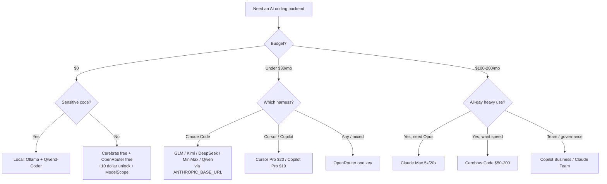

<div align="center">

# 🤖 Awesome AI Coding Subscriptions & APIs

> Assinaturas, planos de coding, APIs, routers e free tiers para colocar atrás do seu agente de IA — comparados, com benchmarks e fontes.

[](https://awesome.re)
[](LICENSE)
[](CONTRIBUTING.md)

[](https://github.com/lildebil0/awesome-ai-coding-subscriptions/stargazers)

**Qual assinatura, plano de coding, API, router ou free tier você deve colocar atrás do seu agente de coding com IA?**
Uma resposta curada, com benchmarks e fontes — ranqueada por 💵 preço · 🧠 poder · 🔢 modelos · 📊 limites · 🔌 integração.

[English](../README.md) · [简体中文](README.zh-CN.md) · [Español](README.es.md) · [Русский](README.ru.md) · [日本語](README.ja.md) · **Português** · [Français](README.fr.md) · [Deutsch](README.de.md) · [한국어](README.ko.md) · [हिन्दी](README.hi.md)

</div>

---

Esta lista cataloga os **planos que você paga** — assinaturas, planos de coding com tarifa fixa, APIs pay-as-you-go, routers e free tiers — **e não** as ferramentas de coding em si. O harness (Claude Code, Cline, Aider, Roo/Kilo, OpenCode) é gratuito. O que custa dinheiro é o modelo por trás dele, então é isso que é ranqueado aqui. O harness é apenas o *alvo de integração*.

Um plano de tarifa fixa de US$ 3–30/mês de um lab chinês de pesos abertos (GLM, Kimi, DeepSeek, MiniMax, Qwen, Doubao) apontado para um harness CLI gratuito te dá cerca de 78–80% no SWE-bench por aproximadamente um décimo do que custa uma assinatura frontier de US$ 200. As assinaturas frontier ainda vencem nas tarefas mais difíceis. Por isso, a maioria das pessoas em 2026 usa as duas coisas: uma assinatura frontier para o raciocínio pesado e um plano barato para todo o resto.

> ⚠️ **Os preços nesse mercado mudam todo mês.** Os números refletem **~junho de 2026**. Sempre confirme na página oficial antes de comprar. Achou um preço desatualizado? [Abra um PR](CONTRIBUTING.md) — correções são tão valorizadas quanto adições.

## Legenda

| Selo | Significado |
|-------|---------|
| 💎 | **Joia escondida** — pouco conhecido, custa menos do que deveria pelo que entrega |
| 🆓 | Tem um **free tier** no qual você realmente consegue rodar um agente |
| ✅ | **Preço verificado** contra a fonte oficial (junho de 2026) |
| ⭐ | Nota de custo-benefício (1–5): preço vs poder vs limites vs integração |
| 🇨🇳 | Hospedado na China (ressalva de residência de dados / latência para alguns) |
| ⚠️ | Carrega risco relevante (ToS, confiabilidade, longevidade, revenda) |

**Abreviações de integração:** `CC-native` = endpoint nativo compatível com Anthropic, um backend drop-in para o Claude Code via `ANTHROPIC_BASE_URL`. `OpenAI-compat` = funciona em Cline/Roo/Kilo/Aider/Continue/OpenCode trocando a base-URL (o Claude Code precisa de um shim/router). `native-only` = travado no editor/agente próprio do fornecedor, não reaproveitável como backend.

## Conteúdo

- [Como escolher](#como-escolher)
- [Escolha por orçamento](#escolha-por-orçamento)
- [Escolha por quem você é](#escolha-por-quem-você-é)
- [TL;DR — melhores escolhas por caso de uso](#tldr--melhores-escolhas-por-caso-de-uso)
- [Tabela comparativa principal](#tabela-comparativa-principal)
- [Assinaturas frontier de primeira mão](#assinaturas-frontier-de-primeira-mão)
- [Assinaturas de ferramentas integradas (editor + modelo)](#assinaturas-de-ferramentas-integradas-editor--modelo)
- [Planos de coding com tarifa fixa — os campeões de custo-benefício 💎](#planos-de-coding-com-tarifa-fixa--os-campeões-de-custo-benefício-)
- [APIs pay-as-you-go com bom custo-benefício](#apis-pay-as-you-go-com-bom-custo-benefício)
- [Provedores de velocidade / inferência rápida](#provedores-de-velocidade--inferência-rápida)
- [Routers e gateways](#routers-e-gateways)
- [Mais provedores que vale conhecer (2026)](#mais-provedores-que-vale-conhecer-2026)
- [Free tiers 🆓](#free-tiers-)
- [Créditos gratuitos e programas para estudantes / startups](#créditos-gratuitos-e-programas-para-estudantes--startups)
- [Planos para estudantes e educação 🎓](#planos-para-estudantes-e-educação-)
- [Nicho e especialidade](#nicho-e-especialidade)
- [App builders e agentes autônomos](#app-builders-e-agentes-autônomos)
- [Joias escondidas e proxies de revenda ⚠️](#joias-escondidas-e-proxies-de-revenda-)
- [Receitas de configuração — ligue um plano barato ao seu harness](#receitas-de-configuração--ligue-um-plano-barato-ao-seu-harness)
- [Matriz de privacidade e residência de dados](#matriz-de-privacidade-e-residência-de-dados)
- [Benchmark por dólar](#benchmark-por-dólar)
- [Armadilhas de dinheiro e erros comuns](#armadilhas-de-dinheiro-e-erros-comuns)
- [Linha do tempo de preços em 2026](#linha-do-tempo-de-preços-em-2026)
- [O que a comunidade realmente diz](#o-que-a-comunidade-realmente-diz)
- [Self-host e híbrido (quando uma assinatura não é a resposta)](#self-host-e-híbrido-quando-uma-assinatura-não-é-a-resposta)
- [FAQ](#faq)
- [Glossário](#glossário)
- [Como esta lista é pontuada e mantida](#como-esta-lista-é-pontuada-e-mantida)
- [Ressalvas e isenção de responsabilidade](#ressalvas-e-isenção-de-responsabilidade)
- [Contribuindo](#contribuindo)
- [Licença](#licença)
- [⭐ Histórico de estrelas](#-histórico-de-estrelas)

---

## Como escolher

Pontue cada plano em cinco eixos:

1. **💵 Preço** — o de tabela, e o custo efetivo *real* (proporção de créditos, multiplicadores de horário de pico, excedente).
2. **🧠 Poder** — qualidade do modelo; o tier de custo-benefício se agrupa em ~78–80% no SWE-bench Verified, o frontier em 85–89%.
3. **🔢 Quantidade de modelos** — um plano que multiplexa vários modelos (Qwen Coding Plan, OpenRouter) protege contra churn.
4. **📊 Limites** — requisições/tokens por janela de 5h, tetos semanais, concorrência. O custo oculto: um único "prompt" da IDE se desdobra em **5–30 chamadas ao modelo**, então os "prompts/5h" anunciados são mais frouxos do que parecem.
5. **🔌 Integração** — ele expõe um **endpoint nativo Anthropic** (drop-in limpo no Claude Code) ou apenas OpenAI-compat (precisa de um router)? Ou é native-only (sem reaproveitamento)?

**Atalho de decisão:**

- Quer o **melhor agente, caminho mais simples** → Claude Pro US$ 20 → Max 5x US$ 100.
- Quer **mais coding por dólar** → um plano de tarifa fixa (GLM / MiniMax / Qwen / Kimi) no Claude Code.
- Quer **US$ 0** → Cerebras free + OpenRouter free (+US$ 10 para desbloquear) + NVIDIA NIM, escalando tarefas difíceis para um modelo pago.
- Quer **uma chave para tudo** → OpenRouter.
- Quer **privacidade (sem host na China)** → Synthetic.new (EUA, sem treino, exclusão em 14 dias) ou assinaturas de primeira mão nos EUA.



---

## Escolha por orçamento

Pule a paralisia da análise. Encontre o seu valor mensal e pegue a stack.

| Orçamento | Melhor escolha | O que você ganha | Stack mais inteligente |
|---|---|---|---|
| **US$ 0** 🆓 | **GitHub Copilot Free** + **Gemini CLI** | 2.000 completions + 50 reqs premium/mês do Copilot; uma CLI agêntica generosa do Google | Copilot Free na IDE para autocomplete, Gemini CLI no terminal para rodadas de agente, [Cursor Hobby](https://cursor.com/pricing) como um terceiro balde de completions Tab gratuitas |
| **< US$ 10/mês** | **GLM Coding Plan Lite** 💎 (US$ 30/tri ≈ US$ 10/mês) | ~3× o uso do Claude Pro; um [endpoint nativo compatível com Anthropic](https://docs.z.ai/guides/overview/pricing) — drop-in no Claude Code, Cline ou OpenCode | GLM Lite como seu driver do Claude Code + empilhe o free tier por cima para o que transbordar |
| **~US$ 10/mês** | **GitHub Copilot Pro** (US$ 10) | Completions ilimitadas, US$ 10 de AI Credits, modo agente, seletor de modelos — migrou para [créditos por uso em junho de 2026](https://github.blog/news-insights/company-news/github-copilot-is-moving-to-usage-based-billing/) | Copilot Pro na IDE + GLM Lite no terminal — dois drivers quase-frontier por ~US$ 20 no total |
| **~US$ 20/mês** | **Claude Pro** (US$ 20) *ou* **Cursor Pro** (US$ 20) | Pro: Claude Code no terminal/web/desktop, [Sonnet 4.6 + Opus 4.6](https://claude.com/pricing). Cursor: Tab ilimitado + US$ 20 de uso de agente + Background Agents | Claude Pro (melhor agente puro) + Copilot Free para autocomplete inline; ou Cursor Pro sozinho se você vive dentro de um único editor |
| **~US$ 50/mês** | **MiniMax Max** (US$ 50) *ou* **GLM Pro** (~US$ 72/mês) **+ Claude Pro** (US$ 20) | Um plano fixo de alto volume (MiniMax ~1000 prompts/5h, ou GLM Pro) *mais* qualidade nativa Anthropic para o que é difícil | Plano barato para o trabalho braçal, Claude Pro reservado para raciocínio complicado — o melhor US$/throughput do mercado |
| **~US$ 100/mês** | **Claude Max 5x** (US$ 100) | 5× o uso do Pro, acesso prioritário aos modelos mais novos — o ponto ideal para devs que batem nos limites do Pro diariamente ([plano Max](https://support.claude.com/en/articles/11049741-what-is-the-max-plan)) | Max 5x como cavalo de batalha + GLM Lite (US$ 10) como uma faixa de transbordo barata quando você estoura o teto do 5x |
| **~US$ 200/mês** | **Claude Max 20x** (US$ 200) *ou* **Cursor Ultra** (US$ 200) | Max 20x: 20× o Pro, tier individual de topo. [Cursor Ultra](https://cursor.com/pricing): 20× de uso + recursos prioritários em uma IDE completa | Max 20x para power users terminal-first; adicione o Copilot Pro (US$ 10) só se você quiser os modelos de um segundo fornecedor por variedade/redundância |

**Regras de bolso**
- **Abaixo de US$ 20 e sensível a preço?** O GLM Lite é o melhor dólar em coding agora — ele fala a API da Anthropic, então sua memória muscular do Claude Code é transferível.
- **Uma ferramenta, o dia todo?** Pague a assinatura nativa (Claude Pro, Cursor Pro). Não fragmente.
- **Usuário diário pesado?** Vá direto ao Max 5x — é mais barato do que empilhar dois planos de US$ 50 e bem menos chato de gerenciar.
- **A jogada profissional em todo tier:** um driver premium para problemas difíceis + uma faixa barata/gratuita para edições em massa e autocomplete. Você raramente precisa de duas assinaturas de US$ 20+.

> Preços verificados em junho de 2026. Planos com cobrança trimestral (GLM) mostrados como mensal efetivo. Os planos do Copilot e do GitHub migraram para [AI Credits baseados em uso em 1º de junho de 2026](https://github.blog/news-insights/company-news/github-copilot-is-moving-to-usage-based-billing/) — sua cota escala com o preço base.


---

## Escolha por quem você é

Pule a fixação na matriz. Encontre sua linha, copie a escolha, siga em frente. Preços em USD/mês, tiers individuais salvo indicação (junho de 2026).

| Você é… | Melhor escolha | Por que combina com você | ~Preço |
|---|---|---|---|
| **Indie hacker solo** 💎 | **Claude Pro** + uma chave de API Z.ai/DeepSeek como transbordo | Uma assinatura de US$ 20 cobre o Claude Code no terminal; quando você bate no teto de 5 horas no meio de um sprint, recorre a uma value-API barata em vez de saltar para um tier de US$ 100 que você vai subutilizar. Melhor US$/output para uma pessoa entregando todo dia. | US$ 20 + centavos |
| **Time de eng. de startup (2–20)** | **GitHub Copilot Business** | US$ 19/assento dá política de organização, filtro de código público, **indenização de PI** e cobrança centralizada — o plano mais barato seguro de colocar na frente de investidores/clientes. Combina com a assinatura Claude/Cursor de cada dev para o trabalho pesado. [preços](https://github.com/features/copilot/plans) | US$ 19/assento |
| **Enterprise** (governança / SSO / PI) | **Copilot Enterprise** ou **Claude Enterprise** | O Copilot Enterprise (US$ 39/assento) adiciona SSO/SCIM, logs de auditoria, bases de conhecimento indexadas no codebase e a mesma indenização de PI da Microsoft com filtro. O Claude Enterprise (cotado por vendas) é a alternativa se você é Anthropic-first. Ambos passam pela compra. [Copilot Enterprise](https://docs.github.com/en/copilot/get-started/plans) | US$ 39/assento → sob consulta |
| **Estudante de CS** 🆓 | **GitHub Copilot (Student)** + ChatGPT Free | Estudantes verificados ganham **Copilot no nível Pro de graça** (completions ilimitadas, modelos premium, cota mensal de requisições premium). Zero gasto, ferramentas reais. [planos do Copilot](https://github.com/features/copilot/plans) | US$ 0 |
| **Mantenedor de OSS** 🆓 | **Copilot Pro grátis para OSS** + Claude Pro para trabalho profundo | Mantenedores de repos populares se qualificam para o Copilot Pro gratuito; mantenha um Claude Pro de US$ 20 para os refactors complicados. Melhor relação bem-público-por-custo. | US$ 0–20 |
| **Privacy-first / regulado** 🔒 | **Stack local: Ollama + Qwen3-Coder + Continue.dev** | Código proprietário nunca sai da máquina — sem API, sem cláusula de retenção, sem DPA para negociar. Cerca de 70–85% da qualidade do Claude na nuvem em trabalho de arquivo único. Se você precisa usar nuvem, adicione um tier de API com **zero retenção**. [setup](https://medium.com/@rodrigo.estrada/build-a-local-ai-coding-assistant-qwen3-ollama-continue-dev-cee0dbcd172a) | US$ 0 (hardware) |
| **Offline / air-gapped** | **Ollama + Qwen3-Coder-Next** (Continue.dev ou OpenCode) | Mesma stack local, mas esta é a *única* categoria que funciona com o cabo de rede arrancado. O Qwen3-Coder-Next roda ~3B de parâmetros ativos de um MoE de 80B — cabe em hardware real, sem internet nunca. [modelos](https://localaimaster.com/models/best-local-ai-coding-models) | US$ 0 |
| **Vibe-coder / hobbyista** 🆓 | **Amostra de free tiers**: ChatGPT Free ou Copilot Free + Gemini grátis | Construindo por diversão nos fins de semana — não pague nada. As 2.000 completions/mês do Copilot Free mais um modelo de chat cobrem projetos paralelos casuais. Faça upgrade só quando os limites gratuitos realmente apertarem. | US$ 0 |
| **Power user rodando agentes em paralelo** 💎 | **Claude Max 20x** (ou empilhe uma value-API para fan-out) | Se você orquestra swarms / sessões paralelas de Claude Code, o teto de uso de 20x é o que impede você de bater nos limites às 14h. Mais barato do que queimar o equivalente em tokens de API nesse volume. Adicione uma chave DeepSeek/Z.ai para os agentes worker descartáveis. | US$ 200 |

**Duas regras de bolso transversais:**
- O salto de **US$ 20 → US$ 100/US$ 200** só compensa se você *pessoalmente* bate nos tetos de uso mais de ~duas vezes por semana. A maioria das pessoas não bate — meça isso antes de fazer upgrade.
- **Indenização de PI é um recurso do plano, não do modelo.** Começa no Copilot **Business** e exige o filtro de código público ligado — os tiers free e Pro não a carregam. Se algum dia um advogado for ler seu repo, essa é a linha que importa. [detalhes](https://github.com/features/copilot/plans)

Fontes:
- [GitHub Copilot Plans & pricing](https://github.com/features/copilot/plans)
- [Plans for GitHub Copilot — GitHub Docs](https://docs.github.com/en/copilot/get-started/plans)
- [AI Pricing Compared 2026 — AIViewer](https://aiviewer.ai/guides/ai-pricing-comparison-2026/)
- [Build a Local AI Coding Assistant — Qwen3 + Ollama + Continue.dev](https://medium.com/@rodrigo.estrada/build-a-local-ai-coding-assistant-qwen3-ollama-continue-dev-cee0dbcd172a)
- [Best Local AI Coding Models for Ollama (2026)](https://localaimaster.com/models/best-local-ai-coding-models)


---

## TL;DR — melhores escolhas por caso de uso

| Caso de uso | Escolha | Por quê | ~Preço |
|----------|------|-----|--------|
| 🏆 **Melhor custo-benefício geral** | **GLM Coding Plan** 💎🇨🇳 | GLM-5.1 ~94% do coding do Opus; Claude Code nativo; a entrada séria mais barata | ~US$ 10/mês (Lite tri.) – US$ 72 Pro |
| 🥇 **Melhor frontier puro** | **Claude Max 5x** | Desbloqueia o Opus no Claude Code, o agente #1 por consenso | US$ 100/mês |
| 🪙 **Entrada séria mais barata** | **Trae Lite US$ 3** / **StepFun US$ 6,99** / **MiMo ~US$ 5** / **GLM Lite ~US$ 10** 💎 | Backend de coding de verdade pelo preço de um café | US$ 3–10/mês |
| 💸 **Mais barato por token** | **DeepSeek V4-Flash** 💎 | US$ 0,14/M in, US$ 0,0028/M cache-hit, 1M de ctx, CC-native | pay-go |
| 🧪 **Melhor gratuito** | **Cerebras free** 🆓 + **OpenRouter :free** 🆓 | 1M tok/dia (rápido) + Qwen3-Coder-480B grátis | US$ 0 |
| ⚡ **Melhor rápido+barato** | **Groq** 💎🆓 / **Cerebras Code** | Endpoint nativo Anthropic (Groq); ~2000 tok/s em tarifa fixa (Cerebras) | grátis / US$ 50/mês |
| 🔀 **Melhor router universal** | **OpenRouter** | 315+ modelos, uma chave, skin Anthropic, sem markup de token | pay-go +5,5% |
| 🔒 **Melhor privacidade (host nos EUA)** | **Synthetic.new** 💎 | Infra nos EUA, sem treino, exclusão em 14 dias, compat dupla OpenAI+Anthropic | US$ 20–60/mês |
| 🧰 **Melhor para grandes codebases** | **Augment Code** ✅ | Context Engine de primeira linha para monorepos | US$ 20+/mês |
| 🏢 **Melhor custo-benefício para times** | **Assento Claude Team Premium** 💎 | ≈ uso do Max-5x + SSO/admin | US$ 100/assento |


---

## Tabela comparativa principal

Ordenada aproximadamente por custo-benefício. Preços ~junho de 2026; **verifique antes de comprar**.

| Plano | Tipo | Preço | Modelos | Limites (coding) | Integração | ⭐ | Notas |
|------|------|-------|--------|-----------------|-------------|----|-------|
| [GLM Coding Plan](#glm-coding-plan--zai-zhipu-ai-) | tarifa fixa | Lite US$ 18 · Pro US$ 72 · Max US$ 160 /mês (Lite tri. ~US$ 10/mês) | GLM-5.1/5/4.7 | Lite ~80, Pro ~400 prompts/5h | CC-native | ⭐5 | 💎🇨🇳✅ |
| [DeepSeek API](#deepseek-) | API pay-go | V4-Pro US$ 0,435/0,87; Flash US$ 0,14/0,28 | V4-Pro/Flash | 1M ctx, 500–2500 concorr. | CC-native | ⭐5 | 💎🇨🇳✅ |
| [MiniMax Coding Plan](#minimax-coding--token-plan-) | tarifa fixa | US$ 10–50/mês | M2.7 (plano), M2.5/M3 (API) | Starter ~100, Max ~1000 prompts/5h | CC-native | ⭐5 | 💎🇨🇳 |
| [Kimi Code](#kimi-code--moonshot-ai-) | tarifa fixa+API | ~US$ 19/mês + medido | K2.6 (1T) | ~300–1200 chamadas/5h, 30 concorr. | CC-native | ⭐5 | 💎🇨🇳 |
| [Qwen Cloud Coding Plan](#qwen-cloud-coding-plan--alibaba-) | tarifa fixa | Pro US$ 50/mês (Lite US$ 10, fechado) | Qwen3.5 + Kimi/GLM/MiniMax | Pro 6000 req/5h, 1M ctx | CC-native | ⭐4 | 💎🇨🇳✅ |
| [OpenRouter](#openrouter-) | router | pay-go, +5,5% no top-up | 315+ (todos) | limitado pelo saldo; modelos grátis 50–1000/dia | skin CC-native | ⭐5 | 🆓 |
| [Claude Pro](#anthropic-claude) | primeira mão | US$ 20/mês | Sonnet 4.6 (sem Opus) | ~40–45 msg/5h + semanal | CC-native | ⭐5 | melhor entrada |
| [Claude Max 5x](#anthropic-claude) | primeira mão | US$ 100/mês | + Opus 4.6/4.7 | ~50–225 prompts/5h | CC-native | ⭐5 | Opus desbloqueado |
| [Cerebras Code](#cerebras-) | velocidade tarifa fixa | US$ 50/200 | GLM-4.7 (~2000 tok/s) | 24M–120M tok/dia, 131k ctx | OpenAI-compat | ⭐5 | ✅ frequentemente esgotado |
| [Synthetic.new](#open-weight-flat-subs-privacidade--host-nos-eua) | tarifa fixa (EUA) | US$ 20–60/mês | 16 de pesos abertos (GLM/Kimi/Qwen/DS) | ~125–1250 req/5h | CC-native | ⭐5 | 💎🔒 |
| [Chutes](#chutes-) | tarifa fixa ⚠️ | US$ 3/10/20 | GLM-5/Kimi/DS/MiniMax/Qwen | 300/2000/5000 req/dia | OpenAI-compat | ⭐5 | 💎⚠️ descentralizado ✅ |
| [Grok Code Fast 1](#nicho-e-especialidade) | API pay-go | US$ 0,20/1,50/M | grok-code-fast-1 | 256K ctx, ~92 tok/s | CC-native | ⭐5 | 💎 #1 no OpenRouter |
| [ChatGPT Plus](#openai-chatgpt--codex) | primeira mão | US$ 20/mês | GPT-5.x-Codex | medido por crédito de token | Codex-native | ⭐4 | Codex agente #2 |
| [ChatGPT Pro](#openai-chatgpt--codex) | primeira mão | US$ 100/200 (5x/20x) | GPT-5.5-Codex | alto; GPU dedicada | Codex-native | ⭐4 | |
| [Claude Max 20x](#anthropic-claude) | primeira mão | US$ 200/mês | Opus 4.6/4.7 | ~200–900 prompts/5h | CC-native | ⭐4 | tier power |
| [Cursor Pro / Ultra](#cursor) | integrado | US$ 20 / 200 | todos os frontier + Auto | pool de uso US$ 20 / 400 | Native-only | ⭐4 | Ultra = razão de crédito 2× |
| [GitHub Copilot Pro](#github-copilot) | integrado | US$ 10/mês | GPT-5/Claude/Gemini | US$ 10 de AI-credits (uso) | Native-only (+ACP) | ⭐4 | completions grátis 🆓 |
| [DeepInfra](#deepinfra-) | velocidade/API | pay-go (OSS mais barato) | Kimi/DS/Qwen3-Coder/GLM | limitado pelo saldo | CC-native | ⭐5 | 💎✅ host mais barato |
| [Groq](#groq-) | velocidade/API | pay-go + grátis | GPT-OSS/Qwen3/Kimi | tetos free de RPM/TPM | CC-native | ⭐4 | 💎🆓 |
| [Vercel AI Gateway](#vercel-ai-gateway-) | router | US$ 0 de markup (até com BYOK) | centenas incl. Claude | US$ 5/mês de créditos grátis | CC-native | ⭐4 | 💎🆓✅ |
| [Requesty](#requesty-) | router | +5% fixo | Claude/GPT/Gemini/DS/Qwen | cache semântico ~40% off | OpenAI-compat | ⭐4 | 💎 governança de time |
| [Mistral Le Chat Pro](#nicho-e-especialidade) | primeira mão | US$ 14,99/mês (US$ 5,99 estudante) | Devstral 2 + Vibe CLI | ~25 msg grátis/dia | Native-only | ⭐4 | 💎🆓🇪🇺 assinatura major mais barata |
| [Augment Code](#assinaturas-de-ferramentas-integradas-editor--modelo) | integrado | US$ 20–200/mês | Claude/Gemini/GPT | 40k–450k créditos/mês | Native-only | ⭐4 | ✅ melhor contexto de repo grande |
| [Zed Pro](#assinaturas-de-ferramentas-integradas-editor--modelo) | integrado | US$ 10/mês | qualquer (BYO key/ACP) | US$ 5 de créditos + uso | ACP + BYOK | ⭐4 | 💎 anti-lock-in |
| [Cerebras free](#free-tiers-) | grátis | US$ 0 | Qwen3-Coder-480B, GPT-OSS-120B | 1M tok/dia, teto de 8K ctx | OpenAI-compat | ⭐5 | 💎🆓 mais rápido grátis |
| [Google AI Studio](#free-tiers-) | grátis | US$ 0 | Gemini 2.5 Flash, Gemma 3 27B | Flash 250 RPD; Gemma 14,4k RPD | OpenAI-compat | ⭐4 | 🆓 maior ctx grátis |


---

## Assinaturas frontier de primeira mão

Os planos direto do fornecedor. Uma assinatura autentica o **harness próprio do fornecedor** (Claude Code, Codex CLI, Antigravity, Grok Build) via login — ela **não** te dá uma chave de API genérica para ferramentas OpenAI-compat de terceiros (isso é cobrança por token separada). Exceção: os modelos xAI Grok são compatíveis com OpenAI/Anthropic.

> Ordem de preferência de custo-benefício para coding agêntico (consenso de junho de 2026): **Claude > OpenAI Codex > Google Gemini > xAI Grok**. Um teste independente de 30 dias colocou o Claude em ~95% vs ~85% de precisão de coding do ChatGPT; o SWE-bench do fornecedor tem GPT-5.5 (88,7%) ≈ Opus 4.7 (87,6%).

### Anthropic (Claude)
- **[Claude Pro](https://claude.com/pricing)** — `US$ 20/mês` (US$ 17 anual). Sonnet 4.6 no Claude Code (**sem Opus**). ~40–45 msg/5h + teto semanal, compartilhado com chat/Cowork. **Melhor ponto de entrada custo-benefício para o agente de coding #1.** Abril de 2026 dobrou os limites de 5h e removeu o throttling de pico. ⭐5
- **[Claude Max 5x](https://support.claude.com/en/articles/11049741-what-is-the-max-plan)** — `US$ 100/mês`. **Desbloqueia o Opus 4.6/4.7** + 5× de throughput (~50–225 prompts/5h). O ponto ideal profissional; um tier intermediário de US$ 100 que OpenAI/Google não igualam de forma tão útil. ⭐5
- **[Claude Max 20x](https://support.claude.com/en/articles/11049741-what-is-the-max-plan)** — `US$ 200/mês`. ~200–900 prompts/5h. Para agentes paralelos o dia todo; a matemática de **tarifa-fixa-vence-API** é decisiva (90%+ dos tokens do Claude Code são cache-reads, gratuitos na assinatura, cobrados na API — o mês de pico de um dev = US$ 5.623 na API ≈ 4,5 anos de Max 5x). ⭐4
- **[Assento Claude Team Premium](https://claude.com/pricing)** 💎 — `US$ 100/assento` (anual). ≈ uso do Max-5x **mais** SSO/admin/auditoria/enterprise-search. Discretamente o melhor custo-benefício de coding *para times*; o assento Standard de US$ 20 também inclui o Claude Code. ⭐4

### OpenAI (ChatGPT / Codex)
- **[ChatGPT Plus](https://help.openai.com/en/articles/11369540-using-codex-with-your-chatgpt-plan)** — `US$ 20/mês`. Codex CLI/IDE incluído (GPT-5.5/5.4/5.3-Codex). **Medido por crédito de token** desde abril de 2026 (confuso). Codex = agente #2 por consenso. Os tetos do Plus acabam rápido em trabalho agêntico pesado. ⭐4
- **[ChatGPT Pro](https://developers.openai.com/codex/pricing)** — `US$ 100` (5x) / `US$ 200` (20x). Alto throughput + GPU dedicada. Note que a promo "boost de 10x" do tier de US$ 100 **expirou em 31 de maio de 2026** (agora 5x). O clássico debate "vale o plano de US$ 200?" = Claude Max 20x vs ChatGPT Pro 20x. ⭐4

### Google (Gemini)
- **[Google AI Pro](https://gemini.google/subscriptions/)** — `US$ 19,99/mês` (frequentemente 50% off no primeiro ano). Renomeado de Google One AI Premium (abr/2026). Gemini 3.x Pro, 5 TB de armazenamento e **acesso ampliado aos agentes de coding [Antigravity](#app-builders-e-agentes-autônomos) + Jules**. ✅
- **[Google AI Ultra](https://blog.google/products-and-platforms/products/google-one/google-ai-subscriptions/)** — **`US$ 100/mês` (5x, novo tier dev)** / **`US$ 200/mês` (20x, cortado de US$ 250)** na I/O 2026. Uso 5×/20× no app do Gemini **e** no Antigravity; o tier máximo adiciona Deep Think, Project Genie, 30 TB. ✅
- ⚠️ **O Google vai matar a Gemini CLI open source em 18 de junho de 2026**, migrando os usuários para a Antigravity CLI fechada com cotas gratuitas bem menores (~1000 → ~20 req/dia) — a maior reclamação da comunidade em 2026.

### xAI (Grok)
- **[SuperGrok](https://x.ai/pricing)** — `US$ 30/mês` (US$ 300/ano) / Heavy `US$ 300/mês`. (Não há um tier "Lite" independente na página de preços atual — é um artefato legado/do pacote X-Premium; ignore os antigos US$ 10.) A Grok Build CLI roda **8 sub-agentes paralelos em git worktrees isoladas** (inovador) e está incluída em todas as assinaturas SuperGrok. O `grok-code-fast-1` tem um séquito de fãs (barato+rápido). O SWE-bench ~70,8% fica atrás dos líderes. **Para coding, a [API da xAI](#nicho-e-especialidade) costuma ser a melhor compra.** ⭐3 💎


---

## Assinaturas de ferramentas integradas (editor + modelo)

Aqui o plano *é* o produto — você compra o editor/agente do fornecedor. A tendência de 2026: quase todos migraram de contagens fixas de requisições para **créditos / medição por token**, tornando os custos *menos* previsíveis (revolta barulhenta).

### Cursor
- **[Cursor](https://cursor.com/pricing)** — Hobby grátis · **Pro `US$ 20`** · **Pro+ `US$ 60`** 💎 · **Ultra `US$ 200`**. Desde junho de 2025, o preço do seu plano = um pool de uso a preços de API. **A razão de crédito melhora conforme você sobe de tier**: Pro US$ 20/US$ 20 (1×), Pro+ US$ 60/US$ 70 (1,17×), Ultra US$ 200/US$ 400 (**2×, a melhor**). O modo `Auto` é a chave do custo-benefício — efetivamente ilimitado, não drena o pool como fixar Claude/MAX faz. ⚠️ A mudança de junho de 2025 causou um [desastre de preços](https://www.wearefounders.uk/cursors-pricing-disaster-the-full-timeline-of-how-an-ai-coding-darling-burned-its-most-loyal-users/) (usuário do HN: "US$ 350 de excedente em uma semana"); o CEO pediu desculpas e reembolsou. **Native-only** — não dá para usar como backend do Claude Code, e desde jan/2026 você também não pode rotear uma assinatura Claude *para dentro* do Cursor. Tab/Apply de primeira linha. ⭐4

### GitHub Copilot
- **[GitHub Copilot](https://github.com/features/copilot/plans)** — Free 🆓 · **Pro `US$ 10`** · Pro+ `US$ 39` · Max `US$ 100` · Business `US$ 19` · Enterprise `US$ 39`. ⚠️ **Migrou para AI Credits baseados em uso em 1º de junho de 2026** (1 crédito = US$ 0,01); cada plano inclui um pool de créditos (Pro=US$ 15, Pro+=US$ 70). **As code completions seguem ilimitadas e gratuitas** — usuários só de completion não foram afetados. A revolta foi severa (TechTimes: contas agênticas saltaram 10×–50×). Completions na IDE de primeira linha + governança/indenização de PI para organizações. **Native-only** (válvula de escape: a Copilot CLI fala ACP). ⭐4

### Outros
- **[Augment Code](https://www.augmentcode.com/pricing)** ✅ — Indie `US$ 20`/40k créditos · Standard `US$ 60` · Max `US$ 200`. **Context Engine de primeira linha** para grandes monorepos (lidera as comparações de recall de contexto). VS Code + JetBrains + Auggie CLI. Native-only. A queima de créditos em tarefas pesadas de ferramentas é a queixa. ⭐4 💎
- **[Zed Pro](https://zed.dev/pricing)** 💎 — Free · **Pro `US$ 10`** (só +10% de markup) · Business `US$ 30`. A escolha **anti-lock-in**: o [ACP](https://zed.dev/docs/ai/) aberto dirige agentes externos (Claude Code, Codex, OpenCode) e BYO keys para qualquer provedor. O editor nativo mais rápido. ⭐4
- **[Kiro](https://kiro.dev/pricing/)** 💎 — Free · **Pro `US$ 20`/1k créditos** · Pro+ `US$ 40` · Power `US$ 200`. Melhor agente **spec-driven** (requisitos→design→tarefas), linha completa do Claude incl. Opus 4.7, cobrança fracionada de 0,01 crédito. **AWS Startups = 1 ano grátis de Pro+.** ⭐4
- **[Trae](https://www.trae.ai/pricing)** 💎🇨🇳 — Free · **Lite `US$ 3`** · Pro `US$ 10` · Ultra `US$ 100`. Fork do VS Code da ByteDance; o pool de uso supera o preço de tabela (ex.: US$ 20 de uso por US$ 10) = "a alternativa de US$ 3 ao Cursor". ⚠️ Telemetria da ByteDance compartilhada com afiliadas — dealbreaker para enterprise. ⭐4
- **[Sourcegraph Amp](https://sourcegraph.com/amp)** — Grátis para começar (US$ 10 de crédito; US$ 40 para ex-Cody). Pura **consumo** (sem piso mensal), roda Opus 4.8 no modo "smart". Ótimo para uso leve, risco de queima sem teto para uso pesado. Cody Free/Pro foram aposentados dentro do Amp. ⭐3
- **[JetBrains AI / Junie](https://www.jetbrains.com/ai-ides/buy/)** — integração de IDE amada, mas o Junie **queima créditos rápido** (os 35 créditos do Ultimate somem em ~4–5 dias). Só se você vive no JetBrains.
- **Caros demais / evite:** **Tabnine** (piso de US$ 39, sem free tier, lock-in anual — só para necessidades on-prem/air-gap); **Windsurf Pro** (a troca de março de 2026 para cotas diárias/semanais é a mudança mais reclamada do ano, confiança baixa pós-Cognition). O **Supermaven** morreu como produto avulso (absorvido pelo Cursor Tab em nov/2025).


---

## Planos de coding com tarifa fixa — os campeões de custo-benefício 💎

Planos mensais ou trimestrais fixos que colocam um modelo de pesos abertos quase-frontier atrás do seu harness, em sua maioria de labs chineses. A maioria expõe um endpoint nativo Anthropic, então caem direto no Claude Code via `ANTHROPIC_BASE_URL`. Para a lista de endpoints, veja [Alorse/cc-compatible-models](https://github.com/Alorse/cc-compatible-models).

> Ordem de preferência por consenso: **GLM** (entrada mais barata, padrão da comunidade) · **MiniMax** (melhor preço/volume) · **Kimi** (melhor agente de longo horizonte) · **Qwen** (>262K de contexto, multi-modelo). O Claude Pro de US$ 20 é o benchmark de qualidade que eles cortam por baixo.

<a name="glm-coding-plan-zai"></a>
### GLM Coding Plan — Z.ai (Zhipu AI) 💎🇨🇳 ✅
- **Preço mensal internacional (verificado jun/2026):** `Lite US$ 18/mês` · `Pro US$ 72/mês` · `Max US$ 160/mês` — os preços ~dobraram em 11 de abril de 2026. **O Lite trimestral é a rota barata** (~US$ 30/tri ≈ US$ 10/mês). O preço doméstico na China é bem mais barato (~US$ 7 / 21 / 68 por mês). A viral promo de **US$ 3/mês** terminou em 11 de fevereiro de 2026. ✅
- Modelos: **GLM-5.1** (~94% do coding do Opus 4.6) · GLM-5/5-Turbo · GLM-4.7 · GLM-4.5-Air. **Todos os tiers (incl. Lite) recebem todos os modelos e o contexto completo de 200K** (128K de saída máx.) — os tiers diferem só na cota, não nos modelos nem na janela de contexto. Mapeamento sugerido: GLM-5.1 → slot do Opus (tarefas difíceis, frontend/UI), GLM-4.7 → Sonnet (o cavalo de batalha de ×1 cota), GLM-4.5-Air → Haiku (background rápido).
- Limites: Lite ~80, Pro ~400, Max ~1.600 prompts/5h + semanal (um "prompt" de IDE = 5–30 chamadas ao modelo). ⚠️ **Multiplicador de 3× em horário de pico** só no GLM-5/5.1, **14:00–18:00 UTC+8 (≈08:00–12:00 Kaliningrado)**; 2× fora de pico (1× fora de pico via promo até o fim de junho de 2026). Rode o GLM-5.1 pesado fora de pico.
- Integração: `ANTHROPIC_BASE_URL=https://api.z.ai/api/anthropic` — suporte oficial ao Claude Code + Cline/Roo/Kilo/OpenCode (20+ ferramentas). **Primeira mão** = sem risco de ban por revenda.
- > *O plano de coding econômico mais recomendado de 2026.* "3× o uso do Claude Max por ~US$ 30/mês." Revolta com o aumento de preço de fevereiro + corte de ⅓ na cota, ainda avaliado como melhor custo-benefício. ⭐5
- Fontes: [z.ai/subscribe](https://z.ai/subscribe) · [preços](https://docs.z.ai/guides/overview/pricing) · [review do GLM-5.1](https://serenitiesai.com/articles/glm-5-1-coding-plan-review-2026)

<a name="minimax"></a>
### MiniMax Coding / Token Plan 💎🇨🇳
- `Starter US$ 10/mês` · `Plus US$ 20` · `Max US$ 50` (2 meses grátis no anual); variantes High-Speed US$ 40–150.
- Modelos: M2.7 / M2.7-Highspeed no plano; **M2.5/M3** (1M de ctx) via API. ⚠️ **O plano frequentemente serve um modelo mais antigo** (M2.1) do que o M2.5/M2.7 que aparece nos benchmarks.
- Limites: Starter ~100 → Max ~1.000 prompts/5h; ~50 TPS (100 no high-speed).
- Integração: `ANTHROPIC_BASE_URL=https://api.minimax.io/anthropic` + OpenAI-compat.
- > "Cortou minha conta do Claude Code pela metade." **Melhor preço/volume puro** no balde de tarifa fixa; M2.7 ~94% do GLM-5.1 a ~1/5 do custo de input. ⭐5
- Fontes: [coding plan](https://platform.minimax.io/subscribe/coding-plan) · [preços do M2.5](https://www.verdent.ai/guides/minimax-m2-5-pricing)

<a name="kimi-moonshot"></a>
### Kimi Code — Moonshot AI 💎🇨🇳
- `~US$ 19/mês de membership` + API medida (K2.6 US$ 0,60–0,95/M in, US$ 2,50–4,00/M out, 75% de desconto em cache). Tiers Moderato/Allegretto/Vivace.
- Modelos: **Kimi K2.6** (1T MoE, ~80,2% SWE-bench), K2.5.
- Limites: ~300–1.200 chamadas/5h, **30 concorrentes** (generoso para agentes paralelos).
- Integração: `ANTHROPIC_BASE_URL=https://api.moonshot.ai/anthropic` — drop-in real no Claude Code; vem com a própria Kimi CLI (6,4k★).
- > **Melhor estabilidade de agente de longo horizonte** (4.000+ chamadas de ferramenta sustentadas ao longo de uma sessão de 13 horas). "Economizando 88% de custos de coding." O lado mais caro de input da turma aberta. ⭐5
- Fontes: [suporte a agentes](https://platform.kimi.ai/docs/guide/agent-support) · [guia do Kimi Code](https://www.nxcode.io/resources/news/kimi-code-2026-plans-pricing-developer-guide)

<a name="qwen-alibaba"></a>
### Qwen Cloud Coding Plan — Alibaba 💎🇨🇳 ✅
- `Pro US$ 50/mês` (Lite ~US$ 10 **fechado a novas assinaturas** desde 20 de março de 2026).
- Modelos: Qwen3.5-Plus, Qwen3-Coder-Next/Plus/480B + cross-model **Kimi/GLM/MiniMax** sob uma chave. **Contexto de 1M de tokens** (o melhor da faixa).
- Limites: Pro 6.000 req/5h + 45k/sem + 90k/mês (janela deslizante). Chave dedicada `sk-sp-` (não intercambiável com pay-go).
- Integração: `ANTHROPIC_BASE_URL=https://coding-intl.dashscope.aliyuncs.com/apps/anthropic` + Qwen Code CLI.
- > Destaque = **um plano multiplexa Qwen+Kimi+GLM+MiniMax** e o único plano fixo de 1M de contexto crível. ⭐4
- Fontes: [coding plan do Model Studio](https://www.alibabacloud.com/help/en/model-studio/coding-plan)

### Assinaturas fixas de pesos abertos (privacidade / host nos EUA)
- **[Synthetic.new](https://synthetic.new/pricing)** 💎🔒 — `US$ 20–60/mês`. ~16 modelos de pesos abertos sempre ativos (Kimi/GLM/Qwen3-Coder-480B/DeepSeek). **Infra nos EUA, sem treino, exclusão em 14 dias.** **Compat dupla OpenAI + Anthropic** = drop-in genuíno no Claude Code. A alternativa consciente em privacidade aos planos chineses. ⭐5
- **[Cerebras Code](#cerebras-)** — `US$ 50`/`US$ 200`, velocidade em tarifa fixa (veja [Velocidade](#provedores-de-velocidade--inferência-rápida)).
- **[OpenCode Go (Zen)](https://opencode.ai/go)** 💎 — `US$ 5` no primeiro mês, depois `US$ 10/mês` fixo. ~12–14 modelos chineses de pesos abertos (GLM-5.1/Kimi/Qwen3.7/DeepSeek V4/MiniMax). De primeira classe no OpenCode. Sem Claude/GPT. ⭐4

### Planos fixos de nicho / tier barato 🇨🇳
- **[StepFun Step Plan](https://github.com/Alorse/cc-compatible-models)** — `US$ 6,99`–`US$ 99/mês`, 100–5.000 prompts/5h, CC-native. Corta o preço por baixo, modelos menos testados em batalha. ⭐3
- **MiMo (Xiaomi)** — `US$ 6`–`US$ 100/mês` baseado em créditos (60M–1,6B), CC-native (`api.xiaomimimo.com`), incl. o multimodal Omni. Mal foi medido em benchmark. ⭐3
- **Atlas Cloud** 💎 — `US$ 10`/`US$ 20`, 800k–1,8M créditos/**dia**, OpenAI-compat (Claude Code/Codex/OpenCode). Modelo de crédito diário para agentes autônomos. ⭐4
- **Factory Droid** 💎 — a partir de `US$ 20/mês` baseado em token, modelos frontier (Claude/GPT/Gemini), janelas rolantes de 5h/7d/30d. História notável de "cancelei dois planos Max de US$ 200 pelo Droid". ⭐4


---

## APIs pay-as-you-go com bom custo-benefício

Acesso por token dos labs de custo-benefício. **O preço de cache é o verdadeiro motor de custo** para loops de agente — projete para cache hits em vez do preço de input de capa.

<a name="deepseek"></a>
### DeepSeek 💎🇨🇳 ✅
- **V4-Pro** `US$ 0,435/M in · US$ 0,0036/M cache-hit · US$ 0,87/M out` (o **corte de 75% agora é permanente**). **V4-Flash** `US$ 0,14 / 0,0028 / 0,28`. Contexto de 1M, output máximo de 384K.
- Integração: OpenAI-compat **+ nativo Anthropic** (`https://api.deepseek.com/anthropic`) — drop-in no Claude Code (`ANTHROPIC_MODEL=deepseek-v4-pro[1m]`).
- > **O campeão de custo por token.** V4-Pro ~80,6% SWE-bench / 93,5% LiveCodeBench por <US$ 1/M de out. O cache-hit de US$ 0,0028/M do V4-Flash é imbatível para loops em massa. ⭐5
- Fontes: [preços](https://api-docs.deepseek.com/quick_start/pricing) · [setup do Claude Code](https://api-docs.deepseek.com/quick_start/agent_integrations/claude_code)

### Outros
- **[Alibaba Qwen3-Coder API](https://www.alibabacloud.com/help/en/model-studio/model-pricing)** 🇨🇳 — 480B `US$ 0,22/1,00`, Flash `US$ 0,195/0,975`, 30B-A3B `US$ 0,07/0,27`. **1M de tokens grátis / 90 dias** (Intl). CC-native. O coder agêntico de pesos abertos mais forte. Use chaves da região de Singapura. ⭐4
- **[Moonshot Kimi API](https://platform.kimi.ai/docs/pricing)** 🇨🇳 — K2.6 `US$ 0,95/4,00` (US$ 0,16 em cache), K2.5 `US$ 0,60/3,00`. CC-native. Excelente tool-calling; o preço de output é a reclamação. Um depósito de US$ 10 remove o teto diário. ⭐4
- **[Zhipu GLM API](https://docs.z.ai/guides/overview/pricing)** 🇨🇳 — GLM-5.1 `US$ 1,40/4,40`, GLM-4.7 `US$ 0,60/2,20`, FlashX `US$ 0,07/0,40`. CC-native. A maioria dos entusiastas compra o [Coding Plan](#glm-coding-plan--zai-zhipu-ai-) mais barato em vez disso. ⭐4
- **[MiniMax API](https://platform.minimax.io/docs/guides/pricing-paygo)** 🇨🇳 ✅ — M3 `US$ 0,30/1,20` (US$ 0,06 de cache, **escritas de cache grátis**), M2.5 ~`US$ 0,15/1,15`. "20× mais barato que o Opus." Compat Anthropic de primeira mão. ⭐4


---

## Provedores de velocidade / inferência rápida

Hosts por token de modelos de pesos abertos, otimizados para throughput. **O Groq é o único com um endpoint nativo Anthropic** (o drop-in mais limpo no Claude Code); o resto é OpenAI-compat (precisa de shim/router para o CC, nativo em Cline/Roo/OpenCode).

<a name="deepinfra"></a>
- **[DeepInfra](https://deepinfra.com/pricing)** 💎 ✅ — **o campeão de mais barato por token.** DeepSeek V3.2 ~US$ 0,26/0,38, Kimi K2.6 US$ 0,75/3,50, Qwen3-Coder-480B US$ 0,30/1,00. 90+ modelos, descontos com cache, **endpoint nativo Anthropic**, sem custo inicial. Velocidade boa-não-elite. ⭐5
<a name="groq"></a>
- **[Groq](https://groq.com/pricing)** 💎🆓 — velocidade LPU (GPT-OSS-20B ~860 tok/s). GPT-OSS-120B `US$ 0,15/0,60`, Kimi K2 `US$ 1,00/3,00`. **Compat nativa Anthropic + OpenAI** + free tier de verdade. Batch+cache empilham para ~25%. Sem Qwen3-Coder-480B (o teto é o Qwen3-32B). ⭐4
<a name="cerebras"></a>
- **[Cerebras](https://www.cerebras.ai/pricing)** ✅ — **o mais rápido** (~2.000–3.000 tok/s). **Code Pro `US$ 50`** (24M tok/dia) / **Max `US$ 200`** (120M tok/dia), GLM-4.7, 131k ctx. Pay-go GPT-OSS-120B `US$ 0,35/0,75`. ⚠️ Frequentemente **esgotado**; 131k ctx (metade do nativo) + TTFT alto amenizam a velocidade em loops de agente. ⭐5 tarifa fixa / ⭐4 pay-go
- **[Together AI](https://www.together.ai/pricing)** — o catálogo mais amplo (Qwen3-Coder-480B, Kimi, DeepSeek V4 Pro US$ 2,10/4,40 c/ US$ 0,20 em cache). Preço mediano, ~89 tok/s. ⭐4
- **[Fireworks AI](https://fireworks.ai/pricing)** — pendor para produção/enterprise, cache agressivo (US$ 0,15/M), DeepSeek V4-Flash US$ 0,14/0,28, caminho via Azure Foundry. ⭐4
- **[Novita](https://novita.ai/pricing)** 💎 — hospeda a família Qwen3-Coder completa a preços próximos aos da DeepInfra; rota OpenRouter sob o radar. ⭐4
- **[Hyperbolic](https://docs.hyperbolic.xyz/docs/hyperbolic-ai-inference-pricing)** 💎 — GPT-OSS-20B `US$ 0,10/M` blended (entre os mais baratos em qualquer lugar); hospeda Qwen3-Coder-480B (FP8). ~13 modelos. ⭐3
- **SambaNova** — singularmente rápido em modelos gigantes de 671B/405B; grátis para sempre + US$ 5 de crédito 🆓 mas teto de 50 req/dia = só para eval.


---

## Routers e gateways

Uma chave para vários provedores. Escolha um router como sua **camada de acesso padrão**.

<a name="openrouter"></a>
- **[OpenRouter](https://openrouter.ai/pricing)** 🆓 — **o padrão por consenso.** 315+ modelos, uma chave, **"skin" compat Anthropic** (`ANTHROPIC_BASE_URL=https://openrouter.ai/api` = drop-in real no Claude Code), **sem markup no preço do token** (só +5,5% nos top-ups), ZDR grátis + tetos de gasto, BYOK generoso (1M req grátis/mês). Modelos grátis (Qwen3-Coder-480B, DeepSeek, Llama 4): 50 RPD → **1000 RPD para sempre após um depósito único de US$ 10**. A taxa de 5,5% só dói acima de ~US$ 5k/mês de gasto. ⭐5
<a name="requesty"></a>
- **[Requesty](https://www.requesty.ai/)** 💎 — **markup fixo de 5%**, todos os recursos incl. **cache semântico** (~40% de economia, supera caches de só-idêntico) + roteamento inteligente por requisição + **políticas de modelo por agente** (modelo diferente por papel de classificador/sintetizador) + SOC 2 Type II. A escolha de governança de time. OpenAI-compat. ⭐4
<a name="vercel-ai-gateway"></a>
- **[Vercel AI Gateway](https://vercel.com/docs/ai-gateway/pricing)** 💎🆓 ✅ — **markup zero, até com BYOK.** Compat nativa Anthropic (`https://ai-gateway.vercel.sh`) = Claude Code direto + Claude Agent SDK + "Claude Code Max via Gateway". US$ 5/mês de créditos grátis renovam indefinidamente (param quando você faz top-up). A melhor escolha de pura economia, especialmente no ecossistema Vercel. ⭐4
- **[Helicone Gateway](https://helicone.ai/pricing)** 🆓 — observabilidade em primeiro lugar (auto logging/tracing/custo), markup zero, 10k req/mês grátis; assinaturas US$ 79/799. ⭐3
- **[CometAPI](https://www.cometapi.com/)** — 500+ modelos incl. os proprietários mais recentes, ~20–40% off do oficial, **compat dupla OpenAI+Anthropic**. Risco de intermediário com créditos pré-pagos. ⭐4
- **[ElectronHub](https://www.electronhub.ai/pricing)** — 600+ modelos, créditos semanais podem exceder o custo em dinheiro; 5–10 RPM apertados nos tiers baratos, ressalva de confiança de revendedor. ⭐3
- **[LiteLLM](https://docs.litellm.ai/)** — o padrão OSS de **self-host** (grátis, sem markup) — veja [truques de integração](#receitas-de-configuração--ligue-um-plano-barato-ao-seu-harness). Infra DIY, não turnkey. ⭐4


---

## Mais provedores que vale conhecer (2026)

Entradas genuinamente úteis que não aparecem nas seções principais, mas preenchem lacunas reais — labs e agregadores chineses extras, ferramentas de coding ocidentais e routers além do OpenRouter. Agrupados e recolhidos para manter a lista escaneável.

<details>
<summary><b>🇨🇳 Agregadores e labs chineses</b> (tokens baratos, vários com endpoints nativos Anthropic)</summary>

- **[SiliconFlow](https://www.siliconflow.com/pricing)** 💎 — um dos maiores routers MaaS independentes da China, 200+ modelos, **endpoint nativo Anthropic** (raro) para o Claude Code apontar direto para DeepSeek/Qwen/GLM/Kimi baratos. Endpoints Intl (.com) + China (.cn). DeepSeek-V4-Flash ~US$ 0,14/0,28.
- **[PPIO](https://ppio.com/llm-api)** 💎 — router com preços em CNY na **própria nuvem de GPUs**; Qwen3-Coder-Next ≈¥1,4/¥10,5, DeepSeek-V4-Flash ¥1/¥2 — entre os menores preços de token em qualquer lugar. OpenAI-compat (bridge para o Claude Code).
- **[Volcengine Ark / BytePlus](https://www.volcengine.com/docs/82379/1949118)** 💎 (ByteDance Doubao) — **Doubao Coding Plan** fixo: Lite **US$ 10**/Pro **US$ 50** via BytePlus (a marca pagável com cartão estrangeiro). O **Doubao-Seed-Code** é nativamente compatível com Anthropic e se aproxima do Claude Sonnet em coding; inclui um agente "ArkClaw" estilo Claude-Code. Piso da API Doubao: `doubao-seed-1.6-flash` US$ 0,022/M in.
- **[Alibaba Bailian multi-model Coding Plan](https://www.alibabacloud.com/help/en/model-studio/coding-plan)** 💎 — **Pro US$ 50/mês** que multiplexa **Qwen3-Coder + Kimi-K2.5 + GLM-5 + MiniMax-M2.5** sob uma assinatura, com um **endpoint nativo Anthropic** + região de Singapura (sem ID chinês). ⚠️ precisa de uma chave dedicada `sk-sp-` — uma chave normal cobra silenciosamente 5× do PAYG.
- **[ModelScope](https://modelscope.cn/)** 🆓💎 (Alibaba) — **2.000 chamadas de API grátis/dia, sem cartão**, incl. Qwen3-Coder-480B. A forma de fato de US$ 0 de rodar um coder chinês frontier em um loop de agente depois que o free tier OAuth do Qwen fechou.
- **[AiHubMix](https://docs.aihubmix.com/en)** 💎 — router unificado baseado na China expondo endpoints compatíveis com OpenAI, Gemini **e Anthropic** com docs de Claude Code de primeira classe; uma única chave para DeepSeek/Qwen/GLM/Kimi e Claude retransmitido.
- **[302.AI](https://302.ai/)** 💎 — pré-pago, **sem throttling de TPM** (bom para agentes em rajadas), um saldo único para Kimi/Qwen/DeepSeek + GPT/Claude, opção de deploy privado.
- **Completude dos grandes labs:** **[Baidu ERNIE](https://pricepertoken.com/pricing-page/model/baidu-ernie-4.5-21b-a3b)** (Qianfan; ERNIE 4.5 21B-A3B US$ 0,07/0,28), **[Tencent Hunyuan](https://pricepertoken.com/pricing-page/provider/tencent)** (HY3 Preview ~US$ 0,063/0,21 — mas a Tencent *aumentou* alguns preços), **[iFlytek Spark](https://lobehub.com/docs/usage/providers/spark)** (tier Lite grátis + Spark Code dedicado), **[SenseNova](https://www.sensetime.com/en)** (MoE multimodal barato). Todos OpenAI-compat; bridge necessário para o Claude Code; a maioria precisa de ID chinês para cadastro direto (alcançáveis via relays/302.AI).
- ⚠️ **Relays diretos da China** (tipo Yunwu, SSSAiCode) revendem Claude/GPT frontier barato sem VPN — convenientes dentro da China, mas carregam o [risco de proxy de revenda](#joias-escondidas-e-proxies-de-revenda-) padrão. Trate como uma hot wallet.

</details>

<details>
<summary><b>🛠️ Ferramentas de coding ocidentais com assinatura</b></summary>

- **[Refact.ai](https://refact.ai/)** 💎 — **US$ 10/mês**, a assinatura de coding agêntico mais barata; open source, **agente autônomo totalmente self-hostável** com fine-tuning on-prem e telemetria zero. Free tier = 5.000 coins/mês + completions ilimitadas.
- **[Pieces for Developers](https://pieces.app/)** 💎 — Pro **US$ 14,17/mês no anual** = Opus 4 / GPT-5 / Gemini 2.5 ilimitados na IDE (mais barato que um único assento Claude Pro). O diferencial é uma **camada de memória/contexto** de longo prazo entre todas as suas ferramentas, não a geração de código. O free tier roda modelos locais ilimitados.
- **[Continue](https://www.continue.dev/pricing)** 💎 — agente de IDE open source + a **Continue Hub**, vitrine de modelos: modelos frontier a **US$ 3/M tokens**, Team **US$ 20/assento** (+US$ 10 de créditos) com config/governança compartilhada. BYOK também.
- **[Cline](https://cline.bot/pricing)** — agente OSS de referência; **BYOK com markup zero** (30+ provedores), gasto real típico US$ 25–70/mês. Plano Teams: os primeiros **10 assentos permanentemente grátis**, depois US$ 20/assento.
- **[Kilo Code](https://kilo.ai/)** — o **sucessor ativamente mantido do Roo Code** (arquivado em 15 de maio de 2026). BYOK com markup zero em 500+ modelos; **Kilo Pass** opcional de créditos pré-pagos com bônus anual de +50%.
- **[Goose](https://github.com/aaif-goose/goose)** 💎 (Block / Linux Foundation) — agente OSS grátis que pode **rodar em cima da sua assinatura existente Claude Max / ChatGPT / Copilot** via provedores SDK para inferência em tarifa fixa — o mesmo padrão de ponte BYO-subscription do `copilot-api` / `claude-code-router`.
- **[Zencoder](https://zencoder.ai/pricing)** — agente enterprise SOC2, orquestração multi-agente, "todos os recursos em todo tier"; Pro US$ 45/assento (30k créditos) → Pro Max US$ 195 (180k).
- **[Tabby](https://www.tabbyml.com/pricing)** 💎 — servidor de completion/chat **open source self-hostável** líder (grátis, ~US$ 5–15/mês de GPU); Cloud Team US$ 24/assento; novo agente autônomo **Pochi**. Endpoint OpenAI-compat utilizável a partir de qualquer harness.

</details>

<details>
<summary><b>🔀 Mais routers e gateways</b></summary>

- **[Portkey](https://portkey.ai/pricing)** 💎 — o router mais production-grade que falta na maioria das listas: **guardrails embutidos, chaves virtuais, tetos de orçamento** (anunciado para limitar gasto agêntico desenfreado), compat OpenAI **e Anthropic**, gateway totalmente **open source self-hostável**. Grátis 10K logs/mês; Pro a partir de US$ 49.
- **[Cloudflare AI Gateway](https://developers.cloudflare.com/ai-gateway/)** 💎 — proxy universal de custo quase zero (caching/analytics/fallback, **sem markup de token**); grátis 100K logs/mês. A parceria xAI Grok de junho de 2026 + o Unified Billing o tornam um plano de controle de fatura única. O passthrough Anthropic funciona para o Claude Code.
- **[Poe API](https://creator.poe.com/)** 💎 (Quora) — uma assinatura de chat de consumidor cujos **pontos de compute também servem como uma API de coding multi-provedor**: um plano de **US$ 19,99/mês** abrange Claude + GPT-5.x + Gemini, frequentemente 10–30% abaixo do direto. Compatível com OpenAI **e Anthropic**.
- **[Glama](https://glama.ai/ai/gateway)** 💎 — gateway OpenAI-compat **mais o maior registro/host de servidores MCP** — singularmente relevante quando servidores de ferramentas MCP importam tanto quanto o acesso a modelos. Assinatura com créditos inclusos.
- **[Unify](https://unify.ai/)** 💎 — um "Neural Router" **preditivo de qualidade** que pontua a qualidade de output esperada *antes* da chamada e atinge metas de custo/latência; US$ 100 de créditos grátis; BYOK via chaves virtuais.
- **[Martian](https://withmartian.com/)** — router dedicado de **custo/qualidade por requisição** com botões de custo-máximo e disposição-a-pagar (alega 20–97% de economia); Free 2.500 req, Developer US$ 20/mês.
- **[Braintrust Gateway](https://www.braintrust.dev/)** 💎 — acopla roteamento com **eval + tracing + caching**; compat OpenAI/Anthropic; beta grátis generoso.
- **[APIpie](https://apipie.ai/)** 💎 — um meta-router (agrega OpenRouter/EdenAI/DeepInfra) com uma chave, 148 modelos de coding, mais busca web + memória de chat inclusas.
- **[AIMLAPI](https://aimlapi.com/)** — 500+ modelos, compat OpenAI + Anthropic, até ~80% abaixo do direto. **[Eden AI](https://www.edenai.co/pricing)** — amigável a BYOK, taxa de plataforma de ~5,5%, sandbox grátis. **[TrueFoundry](https://www.truefoundry.com/ai-gateway)** (a partir de US$ 499/mês) e **[Kong AI Gateway](https://konghq.com/products/kong-ai-gateway)** (OSS grátis / Konnect cloud) — as opções enterprise self-hostáveis, de governança on-prem.

</details>


---

## Free tiers 🆓

Acesso de US$ 0 no qual você consegue rodar um loop de agente de verdade, ranqueado pelo que a comunidade reporta que funciona (junho de 2026):

1. **[Cerebras free](https://inference-docs.cerebras.ai/support/rate-limits)** 💎 — **1M tokens/dia, sem cartão, o mais rápido** (2000+ tok/s), Qwen3-Coder-480B + GPT-OSS-120B. ⚠️ **Teto de 8K de contexto** mata trabalho de repo inteiro. ⭐5
2. **[Google AI Studio](https://ai.google.dev/gemini-api/docs/rate-limits)** — **maior contexto grátis** (Flash até 1M) + Gemma 3 27B a **14.400 RPD**. ⚠️ Gemini 2.5 Pro não é mais grátis (~abril de 2026); limites cortados em dez/2025; dados gratuitos usados para treino. ⭐4
3. **[OpenRouter :free](https://openrouter.ai/models?max_price=0)** — melhor modelo de coding grátis (Qwen3-Coder-480B) + DeepSeek/Llama/GLM, uma chave. **Gaste os US$ 10 únicos → 1000 RPD para sempre** (50 RPD do contrário). ⭐4
4. **[Groq free](https://console.groq.com/docs/rate-limits)** 💎 — os loops mais rápidos de prompts pequenos; ⚠️ teto de 6.000 TPM = muitos passos pequenos, não contexto grande. ⭐4
5. **[NVIDIA NIM](https://build.nvidia.com/)** 💎 — 1.000–5.000 créditos, **sem cartão/sem expiração**, 40 RPM, modelos abertos frontier (MiniMax M2.x, Qwen3-Coder-480B, GLM-5, Kimi K2.5). Tier de eval (limitado por créditos). ⭐4
6. **Mistral Experiment** — 1B tokens/mês (!), ~1 req/seg + opt-in de treino.
- **Só para prototipagem:** GitHub Models (50 RPD), Cloudflare Workers AI, Together (US$ 1 padrão).
- **Estratégia gratuita durável:** roteie 60–80% do tráfego de agente para Qwen3-Coder/GPT-OSS/DeepSeek grátis (Cerebras + OpenRouter+US$ 10 + NVIDIA NIM), depois escale os 20% difíceis para um modelo frontier pago. ⚠️ As cotas gratuitas apertaram muito ao longo de 2025–2026, então assuma que qualquer uma delas pode encolher sem aviso.


---

## Créditos gratuitos e programas para estudantes / startups

Muitas vezes o "plano" mais barato é um para o qual você se qualifica. Estudantes, mantenedores de OSS e startups financiadas podem conseguir meses-a-anos de acesso frontier por US$ 0 — créditos que financiam Claude Code, Codex ou qualquer agente via a API subjacente.

### Estudantes 🎓

Estudantes têm o maior pool gratuito de todos — ele tem sua própria seção detalhada: **[Planos para estudantes e educação 🎓](#planos-para-estudantes-e-educação-)** (a tabela completa, a mecânica de verificação, as pegadinhas e um stack de US$ 0 se você não conseguir verificar).

### Mantenedores de open source 🌱

- **[OpenAI Codex for Open Source](https://openai.com/form/codex-for-oss/)** 💎 — **6 meses de ChatGPT Pro + Codex grátis** (~US$ 1.200 de valor) + créditos de API, de um fundo de US$ 1M. Sem contagem mínima de estrelas; aberto até a mantenedores usando OpenCode/Cline.
- **GitHub Copilot Pro — grátis para OSS** — mantenedores de repos populares se qualificam para o Copilot Pro grátis.
- **[JetBrains free for OSS](https://www.jetbrains.com/community/opensource/)** — All Products Pack para projetos estabelecidos (renovável).

### Startups financiadas 🚀

- **[Anthropic — Claude for Startups](https://claude.com/programs/startups)** — **US$ 25K–100K+** em créditos de API do Claude (12 meses); financia o Claude Code a preços de API.
- **[Google for Startups — tier de IA](https://cloud.google.com/startup/ai)** — até **US$ 350K** em créditos GCP/Vertex ao longo de 2 anos; o Vertex carrega **tanto Gemini quanto Claude**.
- **[AWS Activate](https://aws.amazon.com/startups/credits/)** — até **US$ 200K**; agora resgatável contra o **Bedrock Claude**, então subsidia o Claude-Code-on-Bedrock.
- **[Microsoft for Startups Founders Hub](https://www.microsoft.com/en-us/startups)** — até **US$ 150K** em créditos Azure, com um **tier de entrada sem VC** (bootstrapped/solo bem-vindos); GPT-5.x via Azure OpenAI.
- **[AWS Kiro Pro+ for Startups](https://kiro.dev/startups/)** — um **ano inteiro grátis de Kiro Pro+** (janela de inscrição reaberta de 7 de abr – 30 de jun de 2026; exclui membros atuais do Activate).
- **[NVIDIA Inception](https://www.nvidia.com/en-us/startups/)** — qualquer estágio, sem prazo: descontos em GPU, tempo de DGX Cloud, até US$ 100K em créditos de nuvem de parceiros.
- **[Baseten AI Startup Program](https://www.baseten.co/startup-program/)** 💎 — até **US$ 25K** para self-hostar um modelo de coding de pesos abertos em inferência dedicada.

### Torneiras sempre-grátis 🆓

- **[ModelScope](https://modelscope.cn/)** — 2.000 chamadas grátis/dia (Qwen3-Coder-480B), sem cartão.
- **[NVIDIA Build](https://build.nvidia.com/)** — até 5.000 créditos grátis, 100+ modelos, OpenAI-compat.
- **[Cloudflare Workers AI](https://developers.cloudflare.com/workers-ai/platform/pricing/)** — **10.000 Neurons/dia** de inferência de pesos abertos grátis para sempre (apenas modelos hospedados pela Cloudflare).
- Mais a seção de [Free tiers](#free-tiers-): Cerebras (1M tok/dia), Google AI Studio, OpenRouter `:free`, Groq.

> A maioria dos créditos de startup exige uma inscrição e (frequentemente) financiamento institucional. Leia a elegibilidade antes de contar com eles — e lembre que créditos expiram (tipicamente 12–24 meses).


---

## Planos para estudantes e educação 🎓

Estudantes podem desbloquear milhares de dólares de acesso frontier ao coding de graça — mas o mapa mudou muito em 2026 (o GitHub pausou cadastros, o ano grátis do Google acabou, o Cursor encolheu para a América do Norte). Este é o estado real e atual em 7 de junho de 2026 — o que de fato funciona, o que é cilada e o que fazer se você não conseguir verificar de jeito nenhum.

### O mapa

| Fornecedor | Oferta | Valor | Elegibilidade | Verificação | Pegadinha |
|---|---|---|---|---|---|
| **GitHub Copilot** Student 🆓 | Plano grátis *Copilot Student*: completions ilimitadas + 200 AI Credits/mês ([fonte](https://docs.github.com/copilot/how-tos/manage-your-account/free-access-with-copilot-student)) | ~US$ 120/ano vs Pro (US$ 10/mês) | Matriculado 13+, programa de graduação/diploma; reavaliado mensalmente | GitHub Education (e-mail escolar ou comprovante de matrícula datado) ([fonte](https://education.github.com/pack)) | ⚠️ **Novos cadastros PAUSADOS desde 20/abr/2026** — você pode verificar mas ficar preso no Copilot Free. Modelos premium (Claude Opus/Sonnet, GPT-5.x-Codex) não são mais selecionáveis manualmente — só modo Auto ([fonte](https://github.com/orgs/community/discussions/189268)) |
| **Cursor** 💎 | 1 ano grátis de Cursor Pro (US$ 20/mês de uso, modelos frontier, agente) ([fonte](https://cursor.com/students)) | ~US$ 240 | Estudante universitário, conta individual, **só e-mail .edu** | SheerID pelo painel; uma vez por e-mail ([fonte](https://cursor.com/help/account-and-billing/student-discount)) | ⚠️ **Renova a US$ 20/mês** após o ano 1. A página oficial diz "localizado na América do Norte"; **a Índia foi removida do dropdown de países** ([fonte](https://forum.cursor.com/t/why-is-india-missing-from-the-country-dropdown-for-student-offers-on-cursor-ai/88955)). Sem .edu.au/.ac.uk no caminho instantâneo |
| **JetBrains** Student Pack 🆓 | All Products Pack grátis — todas as IDEs (IntelliJ Ultimate, PyCharm, etc.) + ferramentas .NET ([fonte](https://www.jetbrains.com/academy/student-pack/)) | ~US$ 289/ano | Instituição credenciada; programa de **>1 ano** | E-mail escolar, **carteira ISIC** ou GitHub Student Pack (concessão automática) | ⚠️ **Só não comercial.** Reverificação **anual**. IDE grátis ≠ IA grátis (veja a linha seguinte). A opção de upload de documento foi removida em jul/2024 |
| **JetBrains AI** (para estudantes) ⚠️ | AI Free (US$ 0) + um **trial de IA de 30 dias** (agente Junie + IA na nuvem) ([fonte](https://youtrack.jetbrains.com/articles/SUPPORT-A-2862)) | ~US$ 10/mês de valor por 30 dias, depois ~US$ 0 | Qualquer titular de licença edu da JetBrains | Automático — clique no ícone de IA na IDE v2025.1+ | ⚠️ **Sem IA grátis contínua.** Após o trial: ~3 créditos de IA / 30 dias (o Junie queima rápido). Sem desconto estudante no AI Pro (US$ 10)/Ultimate (US$ 30). Completion *local* ilimitado + modelos locais (Ollama) seguem grátis |
| **Google AI Pro** (Gemini) ❌ | **FECHADO para novos cadastros.** Era grátis por 12–15 meses (Gemini Pro, NotebookLM Plus, 2TB→5TB, Antigravity, Jules) ([fonte](https://gemini.google/students/)) | Era ~US$ 240–300; **US$ 0 agora** | N/A — acabou em 11/mar/2026 globalmente (EUA final ~30/abr) | Era SheerID | ⚠️ A página oficial agora diz *"a oferta acabou… não está mais disponível na sua região."* Ignore blogs que ainda dizem "grátis por um ano". Quem já resgatou mantém o acesso até o fim do termo. Novos usuários: pago US$ 19,99/mês ou só o Gemini grátis |
| **OpenAI / ChatGPT** ⚠️ | **US$ 100 em créditos Codex** (2.500 créditos) para estudantes — coding agêntico ([fonte](https://developers.openai.com/community/students)) | US$ 100 de uso do Codex | Universitários dos EUA/Canadá, **residentes em US/CA** | SheerID na conta do ChatGPT | ⚠️ O Help Center diz que os créditos são **usáveis só por usuários Plus/Pro** — Free/Go são instados a fazer upgrade ([fonte](https://help.openai.com/en/articles/20001147-codex-credits-for-students-terms-of-service)). Então na prática precisa de Plus (US$ 20/mês). Créditos expiram em 12 meses. A antiga promo de Plus grátis **acabou em maio/2025** |
| **OpenAI ChatGPT Edu** 🆓 | ChatGPT provisionado pela instituição (Codex incluído) a US$ 0 para você ([fonte](https://openai.com/index/introducing-chatgpt-edu/)) | US$ 0 se sua escola tiver | Só em universidades contratantes | SSO da escola — sem inscrição pessoal | ⚠️ Totalmente dependente da escola; a maioria dos estudantes não terá. Confirme com a TI se o Codex está habilitado |
| **Anthropic** Claude for Education 🆓 | Claude nível Pro para todo o campus (Opus/Sonnet, Projects, às vezes Claude Code) a US$ 0 ([fonte](https://www.anthropic.com/news/introducing-claude-for-education)) | ~US$ 240/ano de valor — **se sua escola for parceira** | Matriculado em universidade parceira (Northeastern, LSE, Syracuse, Columbia, etc.); entre com e-mail institucional | **Sem autoatendimento** — concedido automaticamente quando seu .edu é reconhecido | ⚠️ **NÃO existe cadastro estudante individual do Claude.** Se nada faz upgrade no login com .edu, sua escola não assinou — ponto |
| **Anthropic** Student Builders 🆓 | ~US$ 50 em créditos de **API** do Claude para um projeto de coding/pesquisa ([fonte](https://claude.com/programs/campus)) | ~US$ 50 (+US$ 5 padrão) | Qualquer estudante, e-mail .edu, projeto acadêmico (sem trabalho remunerado) | Inscrição no Anthropic Console (~5–7 dias) | ⚠️ **Só créditos de API** — não é chat Pro, não é assinatura do Claude Code. Queima rápido com Opus. A antiga URL `/for-student-builders` agora redireciona — inscreva-se pelo Console |
| **Anthropic** Pro/Max direto ❌ | **NENHUM.** Sem desconto estudante individual no Claude Pro/Max ([fonte](https://felloai.com/claude-student-discount/)) | US$ 0 de economia estudante | N/A | N/A | ⚠️ Afirmações de "50% off / Pro a US$ 10 para estudantes" são **não oficiais/falsas**. A única economia real = cobrança anual (~US$ 17/mês, todos os usuários). Evite revendedores de contas compartilhadas (banidos por ToS) |
| **Mistral** (Le Chat / Vibe) 💎 | **Plano educação US$ 5,99/mês** (vs US$ 14,99 Pro) — incl. coding CLI/IDE o dia todo + agente Devstral ([fonte](https://mistral.ai/pricing)) | ~60% off, ~US$ 108 economizados | Ensino superior credenciado, **mundialmente**; só contas novas | **E-mail institucional** auto-verificado (sem SheerID) — fallback manual | ⚠️ Teto rígido de **12 meses**, depois US$ 14,99. Só contas novas (usuários existentes bloqueados). "Le Chat"/"Vibe"/"Pro" = o mesmo tier |
| **Perplexity** 💎 | **Education Pro US$ 10/mês** (50% off) + 1 mês grátis; indicações acumulam até **24 meses grátis** ([fonte](https://shop.sheerid.com/offers/50-off-perplexity-pro-for-students-and-educators/)) | até ~US$ 480 via indicações | Estudantes em escolas suportadas pelo SheerID | SheerID | ⚠️ O antigo "1 ano grátis com .edu" **expirou**. O prazo para acumular indicações foi **31/mai/2026** (já passou). Mecanismo de pesquisa, **não um agente de coding** |
| **Replit** ⚠️ | Estudantes: 50% off no Core = **US$ 10/mês só nos primeiros 6 meses**. Educadores: **grátis** + créditos para estudantes ([fonte](https://replit.com/edu/students)) | Estudante ~US$ 90; Educador ~US$ 240/ano | Estudante: e-mail .edu. Educador: instrutor verificado | .edu no checkout / inscrição de educador | ⚠️ **Não é grátis, não é contínuo** — meia-entrada introdutória por 6 meses. Medido por créditos; uso pesado do Agent gera excedente |
| **Windsurf** (→ Devin) ⚠️ | Pro grátis legado para estudantes — **status incerto**. A marca está se integrando ao Devin/Cognition; URLs de estudante redirecionam, os preços do Devin não mostram tier de estudante ([fonte](https://devin.ai/pricing)) | "Possivelmente US$ 0 se honrado, senão nada" | Legado: .edu, credenciada | SheerID legado no editor | ⚠️ **Verifique no app antes de contar com isso** — blogs de afiliados podem estar desatualizados. No meio da migração |
| **Tabnine** ❌ | **Sem oferta de estudante, sem tier grátis.** Só pago (US$ 39–59/mês) ([fonte](https://www.tabnine.com/pricing/)) | Nenhum | N/A | N/A | ⚠️ Guias antigos de "Pro grátis para estudantes" estão desatualizados/mortos |
| **Phind** ❌ | **Fechou em 16/jan/2026.** Extinto ([fonte](https://www.phind.com/plans)) | Nenhum | N/A | N/A | ⚠️ Alguns sites de review ainda listam os preços antigos — acabou |

> Leitura rápida: **GitHub Copilot, JetBrains e Mistral** são os mais acessíveis globalmente (por documento/e-mail). O **Cursor** é o melhor freebie único (~US$ 240) mas prioriza a América do Norte. O acesso estudante de **Claude e OpenAI** é restrito por instituição ou exige um plano pago por baixo.

### Como funciona a verificação

Quase toda oferta acima passa por um de quatro porteiros — aprenda-os e pare de levar rejeição:

- **SheerID** (Cursor, Perplexity, OpenAI Codex, a antiga oferta do Google, Windsurf legado). Duas etapas: uma **checagem instantânea** (nome + escola-do-dropdown + data de nascimento + e-mail acadêmico cruzados com bases de matrícula) e um **upload de documento** como fallback se ela falhar. Pegadinha crítica: **o SheerID lê a data de matrícula no documento, não a data de impressão** — uma carta de aceite/admissão (semestre futuro) é **rejeitada**; um histórico de um semestre *passado* é rejeitado. Você precisa de uma grade do semestre atual, recibo de mensalidade, histórico em andamento ou carteira de estudante datada, com seu **nome + nome da escola + uma data do semestre atual visíveis em uma única imagem**. Três tentativas falhas te prendem no suporte manual lento ([fonte](https://sheerid.zendesk.com/hc/en-us/articles/26408738570779-Student-Verification-FAQ)).
- **GitHub Student Developer Pack** — a verificação de maior alavancagem: uma aprovação cascateia em Copilot Student grátis, JetBrains e 100+ ferramentas parceiras. E-mail escolar ou comprovante datado; aprovação ~5 dias. O status dura até 2 anos, depois reverifica (o botão de renovar só destrava *após* a expiração) ([fonte](https://docs.github.com/en/education/about-github-education/github-education-for-students/apply-to-github-education-as-a-student)).
- **E-mail .edu / institucional** — o atalho universal. Quando reconhecido, transforma uma revisão de vários dias em uma aprovação automática em segundos. Gmail genérico nunca funciona. O Cursor exige que o **e-mail da conta e o e-mail de verificação sejam idênticos**. JetBrains/GitHub usam a lista de domínios open-source [`swot`](https://github.com/JetBrains/swot) — você pode submeter o domínio da sua escola lá se ele não for reconhecido.
- **Carteira ISIC** (~€4–25) e **UNiDAYS** — reservas. Tire uma ISIC só se SheerID/GitHub não reconhecerem sua escola e você não tiver um e-mail institucional usável; o JetBrains a aceita diretamente.

**Dicas para ser aprovado de primeira:** use seu e-mail institucional e deixe o e-mail da conta do fornecedor *idêntico* a ele; escolha sua escola no dropdown (não digite à mão); insira nome/data de nascimento exatamente como nos registros da escola; envie uma imagem nítida, não cortada e **não editada** (arquivos com cara de manipulados são rejeitados automaticamente); um e-mail = uma oferta.

**Ressalvas sobre bootcamps / online / ensino médio:** SheerID e GitHub geralmente querem instituições credenciadas que concedam graus ou diplomas. **Bootcamps se qualificam para o GitHub Pack só se a escola deles entrou no GitHub Campus Program.** O JetBrains exige explicitamente um programa de **mais de um ano**, o que exclui a maioria dos bootcamps curtos. O Cursor rejeita por completo domínios de ensino médio e domínios acadêmicos não-.edu.

### Melhor stack grátis se você não conseguir verificar (ou tiver US$ 0)

Sem .edu? Região errada? Sem cartão? Você ainda pode rodar um setup de coding agêntico genuinamente capaz por **US$ 0** — apontando um harness grátis para endpoints de modelos grátis.

**A espinha dorsal — provedores de modelos grátis (todos compatíveis com OpenAI, sem cartão para começar):**

- 🆓 **OpenRouter** — uma chave de API, ~27 modelos grátis (Qwen3-Coder com 1M de ctx, GLM-4.5-Air, gpt-oss-120b, Kimi K2.6). O teto grátis é **50 requisições/dia**; uma **recarga única de US$ 10 o eleva permanentemente para 1000/dia** (você mantém o teto mesmo depois de gastar os US$ 10). Global. ([fonte](https://openrouter.ai/docs/api/reference/limits))
- 🆓 **ModelScope (Alibaba)** — o rei do volume: **2.000 chamadas/dia** entre 900+ modelos incl. **Qwen3-Coder-480B**. Pegadinha: você precisa vincular uma conta Alibaba Cloud (Aliyun), e a latência é otimizada para CDN na China. ([fonte](https://github.com/QwenLM/qwen-code))
- 🆓 **Google AI Studio** — Gemini 2.5 Flash grátis a **~1.500 RPD / até 1M TPM** — ótimo *primário* grátis para leituras de contexto grande. O Pro é limitado a ~50/dia. Prompts do tier grátis podem treinar os modelos do Google — nunca envie segredos. ([fonte](https://ai.google.dev/gemini-api/docs/rate-limits))
- 🆓 **Cerebras** (rápido: gpt-oss-120b, GLM-4.7, mas ~5 RPM) e **Groq** (modelos pequenos rápidos, mas minúsculos 6–12K TPM) — use como **velocidade/fallback**, não como primário. ([Cerebras](https://inference-docs.cerebras.ai/support/rate-limits) · [Groq](https://console.groq.com/docs/rate-limits))
- 🆓 **NVIDIA Build / NIM** (~40 RPM, modelos grandes) e **Cloudflare Workers AI** (10k Neurons/dia — melhor para **embeddings grátis / RAG sobre sua base de código**). ([NVIDIA](https://build.nvidia.com/) · [Cloudflare](https://developers.cloudflare.com/workers-ai/platform/pricing/))

**O harness (grátis, open-source):**

- **Claude Code + [Claude-Code-Router](https://openrouter.ai/docs/cookbook/coding-agents/claude-code-integration) (ccr)** — tenha o fluxo do Claude Code por US$ 0 roteando-o pelos endpoints grátis acima. A peça central.
- **OpenCode** — fala nativamente com 75+ provedores (sem router), o menor consumo de tokens em benchmarks agênticos. O melhor para *misturar* provedores grátis de forma limpa.
- **Cline / Roo** (VS Code) e **Aider** (CLI, ciente de git) — cole qualquer chave grátis e use.

> **Build de US$ 0 recomendado:** ModelScope Qwen3-Coder-480B (volume) como primário → OpenRouter GLM-4.5-Air / NVIDIA (fallback) → Cerebras/Groq (rajadas de velocidade) → Cloudflare para embeddings, tudo governado por **OpenCode** ou **Claude Code via ccr**. Para confiabilidade em tool-calling, prefira modelos ajustados para agentes (GLM-Air, Qwen3-Coder, gpt-oss-120b). Os tiers grátis de 50/dia bastam para aprender; os 2000/dia do ModelScope o tornam um driver diário. Nunca envie código proprietário/secreto para as variantes `:free` dos modelos — elas podem logar ou treinar com os prompts.

### Pegadinhas ⚠️

- **Pausas de cadastro são reais.** O GitHub Copilot **pausou todos os novos cadastros de Pro/Pro+/Max *e* Student em 20/abr/2026** (custos de computação agêntica). No changelog de 1º de junho *ainda* está pausado — estudantes recém-verificados em junho de 2026 ganham o Pack mas caem no Copilot Free. Estudantes que ativaram **antes de 20/abr** mantêm o acesso ([fonte](https://github.blog/changelog/2026-06-01-updates-to-github-copilot-billing-and-plans/)).
- **Armadilhas de renovação automática.** O Cursor renova a **US$ 20/mês** após o ano grátis; o Replit volta ao Core completo após **6 meses**; a antiga oferta do Google se auto-converte para **US$ 19,99/mês**. Coloque um lembrete no calendário no dia em que ativar.
- **Ofertas só-EUA / travadas por região.** O Cursor é oficialmente "América do Norte" e **removeu a Índia do dropdown**; os US$ 100 de Codex da OpenAI são **só residentes de US/Canadá**; o Claude for Education é restrito a escolas parceiras (muito US/UK). Ofertas por e-mail/documento (**GitHub, JetBrains, Mistral**) são bem mais confiáveis na Índia, Sudeste Asiático, América Latina e África.
- **Rebaixamentos de modelo nos tiers de estudante.** Desde **12/mar/2026**, o Copilot Student não pode mais selecionar sozinho Claude Opus/Sonnet ou GPT-5.x-Codex — você só os alcança indiretamente via modo Auto (Haiku é o padrão). O valor de destaque agora é o *completion ilimitado*, não o chat com modelos premium.
- **"Grátis" frequentemente significa "desconto" ou "créditos".** Mistral/Perplexity/Replit/Windsurf são *descontos*; OpenAI Codex e Anthropic Student Builders são *concessões de créditos* (e o Codex provavelmente precisa de um plano Plus pago por baixo para gastá-los). O pacote grátis do JetBrains cobre as **IDEs, não a IA contínua**.
- **Expiração e reverificação.** O GitHub reverifica até ~2 anos; JetBrains e a maioria das ofertas SheerID são **anuais**; o Copilot Student reavalia **mensalmente**. Um e-mail .edu de formando que morre pode quebrar renovações silenciosamente — mantenha o comprovante de matrícula em dia.
- **Morto/extinto, ignore o spam de SEO.** O ano grátis do Google (acabou em 11/mar/2026), a promo de Plus grátis da OpenAI (acabou em maio/2025), a oferta de estudante da Tabnine e o **Phind** (fechou em 16/jan/2026) já foram — muitos blogs de afiliados ainda os anunciam. **Não** existe desconto estudante individual oficial para Claude Pro/Max; trate qualquer "código de estudante" para isso como falso.
- **Atrito de pagamento.** Existem caminhos sem cartão (GitHub, JetBrains, Mistral, Perplexity, a tarifa estudante do Google) — melhores se você não tem cartão. Na Índia, fique atento a uma cobrança de autorização temporária de ~₹2 que é estornada em 24–48h. A idade mínima costuma ser 16 (18 na Índia).

---

## Nicho e especialidade

- **[xAI Grok Code Fast 1 (API)](https://x.ai/news/grok-code-fast-1)** 💎 — `US$ 0,20/1,50/M` (US$ 0,02 em cache), 256K ctx, **compat OpenAI + Anthropic**. **#1 por uso no OpenRouter.** Rápido e barato o suficiente para trabalho rotineiro de implementação. US$ 25 de créditos grátis no cadastro; até US$ 175/mês via compartilhamento de dados. ⚠️ Edita demais sem escopo apertado, então escale o raciocínio difícil para outro lugar. ⭐5
- **[Mistral Le Chat Pro / Vibe](https://mistral.ai/pricing/)** 💎🆓🇪🇺 — `US$ 14,99/mês` (**US$ 5,99 estudante**). **Assinatura de coding major mais barata**, inclui o agente de terminal Vibe CLI (Devstral 2). O free tier tem coding real (limitado). ⭐4
- **[Mistral Codestral / Devstral 2 (API)](https://mistral.ai/news/codestral-2501/)** 🇪🇺 — Codestral `US$ 0,30/0,90` (32K) com um **endpoint FIM grátis** (o autocomplete preferido do Continue.dev); Devstral 2 `US$ 0,40/2,00`, Devstral Small **grátis**. Soberania da UE. ⭐4
- **[Inception Mercury](https://www.inceptionlabs.ai/)** 💎 — dLLM de difusão, `US$ 0,25/0,75–1/M`, 128K, **5–10× mais rápido** que Haiku/GPT-4o-mini, #1 em velocidade no tier de modelo-pequeno do Copilot Arena. Compra para autocomplete sensível a latência, não um reasoner frontier. ⭐4
- **[Morph Fast Apply](https://www.morphllm.com/pricing)** 💎 — a **camada "apply"**: ~10.500 tok/s, ~98% de precisão de merge, corta o custo de token em 50–60% / a latência em 90%+. Grátis 200 req/mês, US$ 20 inicial. **A ferramenta MCP funciona no Claude Code e no Cursor.** ⚠️ categoria abertamente transitória ("Fast Apply Models are Already Dead"). ⭐4
- **[Relace](https://relace.ai/pricing)** 💎 — par do Morph com **256K de contexto de apply** + stack de retrieval Search/Rank/Embed inclusa. Compra para builder/infra. ⭐4
- **Cohere Command A** — `US$ 2,50/10` — o *pior* custo-benefício de coding da faixa (jogada de RAG/multilíngue enterprise, não uma escolha de coding agêntico).


---

## App builders e agentes autônomos

Uma categoria diferente dos planos acima: aqui você paga por **compute de agente**, não acesso a modelo puro. Builders de prompt-para-app geram (e frequentemente hospedam) apps inteiros; "engenheiros de software de IA" autônomos pegam um ticket e abrem um PR. Nenhum deles é um backend para apontar o Claude Code — eles são o produto. Útil de saber para que você não pague demais por um builder medido quando uma assinatura de US$ 20 + um harness grátis resolveriam.

### Engenheiros de software autônomos

- **[Devin](https://devin.ai/pricing/)** (Cognition) — Core **US$ 20/mês** (+ ~US$ 2,25/ACU pay-as-you-go), Max **US$ 200/mês**, Teams **US$ 80/mês + US$ 40/assento**. Agente assíncrono totalmente autônomo com VM, navegador e editor próprios; roda seu modelo interno **SWE-1.6** mais modelos frontier. Cobrado em **ACUs** (~15 min de trabalho cada). O Devin 2.0 derrubou a entrada de US$ 500 → US$ 20. Após absorver o Windsurf (junho de 2026) a IDE relançou como **Devin Desktop**. native-only + API.
- **[Cosine Genie](https://cosine.sh/pricing)** 💎 — Free (80 tarefas) · Hobby **US$ 20/assento** (5M créditos) · Professional **US$ 200/assento** (60M créditos). Roda seu **próprio** modelo treinado (Genie 2.1), não um wrapper de frontier; ingere um ticket do Jira e abre um PR. Liderou o SWE-bench Verified. Trial grátis generoso para um agente autônomo.
- **[Qodo](https://www.qodo.ai/pricing/)** (ex-CodiumAI) — Free (250 créditos + 30 reviews de PR/mês) · Teams **US$ 30/usuário** (2.500 créditos + review de PR ilimitado). Geração de testes + **bot autônomo de review de PR** (Qodo Merge) para GitHub/GitLab/Bitbucket — uma categoria que nada mais aqui cobre como assinatura fixa.

### Builders de prompt-para-app (build + host)

- **[Replit](https://replit.com/pricing)** — Core **US$ 20/mês** (US$ 25 de créditos de uso, ≤5 colaboradores) · Pro **US$ 100/mês** (≤15 builders, rollover de créditos). IDE na nuvem + **Agent 4** (Claude Opus 4.7); os créditos cobrem IA **e** compute **e** deploy/hosting. Medido por esforço — usuários pesados reportam US$ 100–300/mês. native-only.
- **[Lovable](https://lovable.dev/pricing)** 💎 — Free · Pro **US$ 25/mês** · Business **US$ 50/mês**. Prompt-para-fullstack (React + Supabase: auth, DB, hosting). Os créditos Pro são **compartilhados entre usuários ilimitados** (barato para times pequenos); ~50% de desconto estudantil; rollover de créditos. Construído na UE.
- **[Bolt.new](https://bolt.new/pricing)** (StackBlitz) — Free (1M tok/mês) · Pro **US$ 25/mês** (10M tok, rollover) · Teams **US$ 30/assento**. Roda a **toolchain inteira no navegador** via WebContainers; backend Claude; deploy para Netlify. Medido por token.
- **[v0](https://v0.app/pricing)** (Vercel) — Free (US$ 5 de créditos) · Premium **US$ 20/mês** · Team **US$ 30/assento** · Business **US$ 100/assento**. O especialista em UI de **React + Tailwind + shadcn/ui**; menu explícito por modelo (v0 Mini/Pro/Max). Acoplamento apertado com o deploy da Vercel; tem uma API de modelos.
- **[Emergent](https://emergent.sh/pricing)** 💎 — Free · Standard **US$ 20/mês** · Pro **US$ 200/mês**. "Engenheiro numa caixa" multi-agente que entrega **backend, auth, DB, storage e Stripe** (e apps mobile), não só frontend. O Pro adiciona 1M de contexto + agentes customizados.
- **[Tempo](https://www.tempo.new/)** 💎 — Free · Pro **US$ 30/mês** · Agent+ US$ 4.500/mês (human-in-the-loop). **Planeja-antes-de-codar**: gera diagramas de fluxo + arquitetura antes de escrever. React-first.
- **[Create.xyz / Anything](https://www.create.xyz/pricing)** 💎 — Free · Pro **US$ 19/mês no anual**. Inglês-para-app; os créditos cobrem tanto o tempo de build **quanto** as chamadas de IA em runtime do seu app ao vivo. Backend Neon/Postgres.
- **[Firebase Studio](https://firebase.google.com/docs/studio/pricing)** — Preview grátis · **US$ 24,99/mês** (Google Developer Program, +US$ 500/ano de créditos GCP). Builder full-stack na nuvem com Gemini. ⚠️ Sendo descontinuado — migre para o Antigravity antes de 2027.

### A stack de agentes do Google

- **[Google Antigravity](https://antigravity.google/pricing)** — Preview grátis · Pro **US$ 20/mês** · Ultra **US$ 249,99/mês**. IDE + CLI agent-first que entrega **Gemini 3.x + Claude Sonnet/Opus 4.6 + gpt-oss-120b** em uma superfície. O **sucessor da Gemini CLI / Code Assist** (ambas param de atender requisições de consumidor em **18 de junho de 2026**). Free tier reduzido para ~20 req de agente/dia.
- **[Google Jules](https://jules.google/docs/usage-limits/)** 💎 — Free (15 tarefas/dia) · incluído no **Google AI Pro US$ 19,99** (~75–100 tarefas/dia) / **Ultra US$ 124,99**. Agente assíncrono de PR no GitHub (Gemini): clona seu repo em uma VM na nuvem e abre PRs enquanto você trabalha. Sem assinatura avulsa — empilha no mesmo plano do Google que o Antigravity.

### Terminais e IDEs agênticos

- **[Warp](https://www.warp.dev/pricing)** 💎 — Free (75 créditos/mês) · Build **US$ 20/mês** (1.500 créditos + **BYOK** em todos os tiers) · Business **US$ 50/assento** (ZDR obrigatório). O terminal como plataforma de agente; pode orquestrar Claude Code/Codex. A medição de cloud-agent começa em **1º de julho de 2026**.
- **[Qoder](https://qoder.com/pricing)** 💎 (Alibaba, ex-Tongyi Lingma) — Free · Pro **US$ 20/mês** · Pro+ **US$ 60/mês**. A IDE agêntica avulsa classe-Cursor da Alibaba; roteia Qwen3-Coder + Claude via créditos. A rota de IDE de primeira mão para o ecossistema Qwen.
- **[Amazon Q Developer](https://aws.amazon.com/q/developer/pricing/)** → **[Kiro](https://kiro.dev/pricing/)** — o Q Developer Pro (US$ 19/assento, Claude via Bedrock) está sendo aposentado (novos cadastros fechados em 15 de maio de 2026); a AWS canaliza usuários para o **Kiro** (Pro US$ 20/1k créditos · Pro+ US$ 40 · Power US$ 200), o agente spec-driven. Um caso raro de um hyperscaler matando uma assinatura de coding e substituindo por outra.


---

## Joias escondidas e proxies de revenda ⚠️

> **Espremendo coding quase-frontier de <US$ 10–30/mês.** Existem barganhas genuínas, mas o canto dos proxies de revenda é arriscado e crescente.

**Barganhas genuínas que a comunidade recomenda:** [Chutes](https://chutes.ai/pricing) (US$ 3/10 por enorme variedade de pesos abertos, descentralizado) ✅ · [OpenCode Go](#planos-fixos-de-nicho--tier-barato-) (US$ 10 fixo) · [Synthetic](#assinaturas-fixas-de-pesos-abertos-privacidade--host-nos-eua) (US$ 20–30, confiável+privado+CC-native) · [Z.ai GLM](#glm-coding-plan--zai-zhipu-ai-) (primeira mão). Melhores diários neutros: [patshead.com](https://blog.patshead.com/2026/01/squeezing-value-from-free-and-low-cost-ai-coding-subscriptions.html) + o "vibe code for free" da InfoWorld.

- **[Chutes](https://chutes.ai/pricing)** 💎⚠️ ✅ — Base `US$ 3` (300 req/dia) · Plus `US$ 10` (2.000/dia) · Pro `US$ 20` (5.000/dia). GLM-5/Kimi/DeepSeek/MiniMax/Qwen, OpenAI-compat, privacidade TEE. ⚠️ **Descentralizado (Bittensor)** = latência/qualidade variável entre nós, sem SLA, drift de quantização, modelos frontier travados em US$ 10+. Trate como hobby/não-crítico, mantenha um fallback. ⭐5
- **[NanoGPT](https://nano-gpt.com/pricing)** 💎 — verdadeiro **pay-per-prompt** (US$ 0,10 mín., amigável a cripto), modelos proprietários + abertos. ⚠️ falhas de tool-call reportadas em agentes de coding (OpenCode). Melhor como chat/API do que como backend de coding raiz. ⭐3
- **[AgentRouter](https://agentrouter.org)** ⚠️ — ~US$ 200 de créditos grátis, roteia Claude/GPT-5/DeepSeek/Zhipu, funciona como backend do Claude Code. Uma **rampa de entrada** de free-credit de verdade, mas uma sem-fins-lucrativos com política de longo prazo opaca. Só trials, não código proprietário. ⭐3

### ⚠️ Risco de proxy de revenda (leia antes de depositar)
Relays como **PackyCode, YesCode, AnyRouter, EasyClaude, IKunCode, Cubence** fazem reverse-proxy de contas oficiais Claude Max/Pro (**violação de ToS**) ou agregam chaves. Dados concretos: a repressão da Anthropic em 2025–2026 forçou aumentos de preço simultâneos em todos eles, e **>60% dos relays de engenharia reversa de 2025 morreram em 3 meses**. O AnyRouter está marcado pelo Scamadviser. A **regra universal da comunidade: só deposite o que você precisa, nunca somas grandes** — os saldos evaporam quando um relay morre, e a Anthropic também bane os usuários da conta subjacente. Routers agregadores (CometAPI, ElectronHub) são o meio mais seguro (legitimamente medidos), mas você ainda confia em um intermediário com seus prompts.


---

## Receitas de configuração — ligue um plano barato ao seu harness

A maioria dos labs de "pesos abertos" agora entrega um endpoint **compatível com Anthropic**, então você pode manter o Claude Code (ou qualquer ferramenta com SDK Anthropic) e só repontar a base URL. Abaixo estão configs de copiar e colar que funcionavam em junho de 2026. Verifique os nomes dos modelos contra os docs de cada provedor — eles mudam rápido.

> [!TIP]
> `ANTHROPIC_AUTH_TOKEN` (não `ANTHROPIC_API_KEY`) é a variável que o Claude Code lê para chaves de terceiros. Se ambas estiverem setadas, `AUTH_TOKEN` ganha. Aumente `API_TIMEOUT_MS` — modelos abertos podem ser mais lentos no primeiro token.

### 1. Claude Code → GLM / Kimi / DeepSeek / MiniMax / Qwen (drop-in)

Esses cinco expõem uma rota nativa `/anthropic`, então **nenhum proxy é necessário**. Escolha um, jogue em `~/.claude/settings.json`:

| Provedor | `ANTHROPIC_BASE_URL` | Var de modelo padrão | Fonte |
|---|---|---|---|
| **Z.ai (GLM)** 💎 | `https://api.z.ai/api/anthropic` | `GLM-5.1` | [docs](https://docs.z.ai/devpack/tool/claude) |
| **Moonshot (Kimi)** | `https://api.moonshot.ai/anthropic` | `kimi-k2.6` | [docs](https://platform.moonshot.ai) |
| **DeepSeek** | `https://api.deepseek.com/anthropic` | `deepseek-v4-pro` | [docs](https://api-docs.deepseek.com/guides/anthropic_api) |
| **MiniMax** | `https://api.minimax.io/anthropic` | `MiniMax-M2.7` | [docs](https://platform.minimax.io/docs/api-reference/text-anthropic-api) |
| **Qwen (DashScope-intl)** | `https://dashscope-intl.aliyuncs.com/apps/anthropic` | `qwen3.5-plus` | [docs](https://www.alibabacloud.com/help/en/model-studio/claude-code) |

`~/.claude/settings.json` (exemplo: GLM):

```json
{
  "env": {
    "ANTHROPIC_BASE_URL": "https://api.z.ai/api/anthropic",
    "ANTHROPIC_AUTH_TOKEN": "sk-your-zai-key",
    "ANTHROPIC_DEFAULT_OPUS_MODEL": "GLM-5.1",
    "ANTHROPIC_DEFAULT_SONNET_MODEL": "GLM-5.1",
    "ANTHROPIC_DEFAULT_HAIKU_MODEL": "GLM-4.5-Air",
    "API_TIMEOUT_MS": "3000000"
  }
}
```

Prefere não mexer no arquivo? Exporte variáveis de ambiente por shell em vez disso (útil para um alias descartável `cc-glm`):

```bash
export ANTHROPIC_BASE_URL="https://api.deepseek.com/anthropic"
export ANTHROPIC_AUTH_TOKEN="sk-your-deepseek-key"
export ANTHROPIC_MODEL="deepseek-v4-pro"        # claude-opus-* → v4-pro
export ANTHROPIC_SMALL_FAST_MODEL="deepseek-v4-flash"  # haiku/sonnet → v4-flash
claude
```

> [!WARNING]
> **Pegadinhas que vale conhecer.** O shim Anthropic da Moonshot escala a temperatura (`real = solicitada × 0,6`) ([docs](https://apidog.com/blog/kimi-k2-5-claude-code-integration/)). O MiniMax M2.x **ignora `thinking: disabled`** — o raciocínio sempre roda ([docs](https://platform.minimax.io/docs/api-reference/text-anthropic-api)). A status line do CC pode continuar dizendo "Sonnet" enquanto um modelo GLM/Qwen responde — o mapeamento é silencioso.

### 2. claude-code-router — roteamento por tarefa (mix de provedores)

Quando você quer um modelo por *tipo de tarefa* (background barato, contexto grande, visão), use o [`claude-code-router`](https://github.com/musistudio/claude-code-router) como um proxy local:

```bash
npm i -g @musistudio/claude-code-router
ccr code   # launches Claude Code pointed at the local router
```

`~/.claude-code-router/config.json` — trabalho padrão no DeepSeek, contexto longo no Qwen, trabalho braçal de background no Kimi:

```json
{
  "Providers": [
    {
      "name": "deepseek",
      "api_base_url": "https://api.deepseek.com/chat/completions",
      "api_key": "sk-deepseek-key",
      "models": ["deepseek-v4-pro", "deepseek-v4-flash"]
    },
    {
      "name": "dashscope",
      "api_base_url": "https://dashscope-intl.aliyuncs.com/compatible-mode/v1/chat/completions",
      "api_key": "sk-dashscope-key",
      "models": ["qwen3-coder-plus"]
    },
    {
      "name": "moonshot",
      "api_base_url": "https://api.moonshot.ai/v1/chat/completions",
      "api_key": "sk-moonshot-key",
      "models": ["kimi-k2.6"]
    }
  ],
  "Router": {
    "default": "deepseek,deepseek-v4-pro",
    "background": "moonshot,kimi-k2.6",
    "think": "deepseek,deepseek-v4-pro",
    "longContext": "dashscope,qwen3-coder-plus",
    "longContextThreshold": 60000
  }
}
```

Troque de modelo ao vivo de dentro do Claude Code com `/model deepseek,deepseek-v4-flash`. O `longContextThreshold` (padrão 60k tokens) auto-roteia prompts grandes demais para o modelo `longContext` ([docs](https://musistudio.github.io/claude-code-router/)).

### 3. Cline / Roo / Kilo (VS Code) — base URL compatível com OpenAI

Essas extensões falam **OpenAI Chat Completions**, então use a rota `/v1` de cada provedor, não a `/anthropic`. Nas configurações da extensão escolha **API Provider → OpenAI Compatible** e preencha:

| Campo | Valor (exemplo: DeepSeek) |
|---|---|
| Base URL | `https://api.deepseek.com/v1` |
| API Key | `sk-deepseek-key` |
| Model ID | `deepseek-v4-pro` |

Outras base URLs: GLM `https://api.z.ai/api/paas/v4`, Kimi `https://api.moonshot.ai/v1`, MiniMax `https://api.minimax.io/v1`, Qwen `https://dashscope-intl.aliyuncs.com/compatible-mode/v1`. Cline/Roo/Kilo compartilham o mesmo formato de config; defina um modelo separado mais barato no slot **"Fast"/background** da extensão se ela expuser um.

### 4. Aider — uma flag, modelo barato

O [Aider](https://aider.chat) roteia pelo LiteLLM, então qualquer endpoint compatível com OpenAI funciona via `--openai-api-base`:

```bash
export OPENAI_API_KEY="sk-deepseek-key"
export OPENAI_API_BASE="https://api.deepseek.com/v1"
aider --model openai/deepseek-v4-pro
```

O DeepSeek é embutido, então você pode pular a dança de env por completo:

```bash
export DEEPSEEK_API_KEY="sk-deepseek-key"
aider --model deepseek/deepseek-v4-pro
```

Salve em `~/.aider.conf.yml` para que todo projeto herde:

```yaml
model: deepseek/deepseek-v4-pro
weak-model: deepseek/deepseek-v4-flash   # commit msgs, summaries → cheaper
```

### 5. OpenCode — multi-provedor em um arquivo

O [OpenCode](https://opencode.ai) aceita qualquer provedor compatível com OpenAI via `opencode.json`. Defina vários, depois `Tab`/`/models` para trocar no meio da sessão:

```json
{
  "$schema": "https://opencode.ai/config.json",
  "provider": {
    "deepseek": {
      "npm": "@ai-sdk/openai-compatible",
      "options": { "baseURL": "https://api.deepseek.com/v1" },
      "models": { "deepseek-v4-pro": {}, "deepseek-v4-flash": {} }
    },
    "zai": {
      "npm": "@ai-sdk/openai-compatible",
      "options": { "baseURL": "https://api.z.ai/api/paas/v4" },
      "models": { "GLM-5.1": {} }
    },
    "moonshot": {
      "npm": "@ai-sdk/openai-compatible",
      "options": { "baseURL": "https://api.moonshot.ai/v1" },
      "models": { "kimi-k2.6": {} }
    }
  },
  "model": "deepseek/deepseek-v4-pro",
  "small_model": "deepseek/deepseek-v4-flash"
}
```

As chaves vão no env (`DEEPSEEK_API_KEY`, `ZAI_API_KEY`, `MOONSHOT_API_KEY`) ou `opencode auth login`. O `small_model` cuida de títulos/resumos para que o tier barato absorva o ruído.

---

**Faça um teste de sanidade em qualquer um deles** com um one-liner antes de confiar no roteamento:

```bash
curl -s $ANTHROPIC_BASE_URL/v1/messages \
  -H "x-api-key: $ANTHROPIC_AUTH_TOKEN" \
  -H "anthropic-version: 2023-06-01" \
  -H "content-type: application/json" \
  -d '{"model":"'$ANTHROPIC_MODEL'","max_tokens":16,"messages":[{"role":"user","content":"ping"}]}'
```

Uma resposta JSON limpa significa que seu plano está conectado. Um 401 significa variável de chave errada; um 404 significa que você usou o caminho `/v1` da OpenAI onde um `/anthropic` era necessário (ou vice-versa).


---

## Matriz de privacidade e residência de dados

Onde seus prompts fisicamente aterrissam, quem pode lê-los e se eles alimentam um conjunto de treino. **O comportamento padrão importa mais do que a página de marketing** — a maioria dos provedores oferece Zero-Data-Retention (ZDR) apenas sob solicitação, e "não treinamos com você" frequentemente esconde uma janela de monitoramento de abuso de 7–30 dias. Verificado em junho de 2026; sempre confirme contra o DPA atual do provedor antes de enviar código regulado.

| Provedor / plano | Região de hosting | Treina com seus dados? | ZDR disponível? | Conformidade | Código sensível? |
|---|---|---|---|---|---|
| **Anthropic** (API / Claude Code, comercial) | EUA (+ opções EU/Vertex/Bedrock) | Não — nunca em API/comercial ([src](https://platform.claude.com/docs/en/manage-claude/api-and-data-retention)) | ✅ ZDR Enterprise por contrato; senão exclusão em 7 dias (30 opt-in) ([src](https://privacy.claude.com/en/articles/8956058-i-have-a-zero-data-retention-agreement-with-anthropic-what-products-does-it-apply-to)) | SOC 2 Type II, ISO 27001, HIPAA (BAA) | ✅ Primeira linha — planos de consumidor agora dão opt-*out* de treino ([src](https://www.anthropic.com/news/updates-to-our-consumer-terms)), então use tiers API/Work |
| **OpenAI** (API / Platform) | EUA (EU/JP/global data-residency para negócios) ([src](https://openai.com/index/expanding-data-residency-access-to-business-customers-worldwide/)) | Não em API por padrão (desde 2023) ([src](https://developers.openai.com/api/docs/guides/your-data)) | ✅ ZDR Enterprise por endpoint, não self-serve; senão ≤30 dias ([src](https://openai.com/enterprise-privacy/)) | SOC 2 Type II, ISO 27001/27017/27018/27701, CSA STAR | ✅ Forte — note que o litigation hold do NYT testou as alegações de "exclusão" ([src](https://openai.com/index/response-to-nyt-data-demands/)) |
| **Google** (Gemini API / Vertex) | EUA + EU + global (fixação de região no Vertex) | Não em API paga / Vertex; o free tier do AI Studio *pode* ser usado | ✅ Controles enterprise do Vertex + trava de região | SOC 2/3, família ISO 27001, HIPAA, FedRAMP | ✅ via Vertex (fixado por região); 🚫 evite o AI Studio grátis para segredos |
| **Cursor** (Privacy Mode) | EUA (roteia para OpenAI/Anthropic/Google/xAI sob contratos ZDR) | Não com o Privacy Mode ligado ([src](https://cursor.com/data-use)) | ✅ ZDR com todos os provedores de modelo; ligado por padrão para Teams/Enterprise ([src](https://cursor.com/docs/enterprise/privacy-and-data-governance)) | SOC 2 Type II | ✅ se o Privacy Mode estiver confirmado; ⚠️ desligado = o código pode ser retido |
| **GitHub Copilot** (Business/Enterprise) | EUA + EU data residency (GA 2026; roadmap JP/AU) ([src](https://github.blog/changelog/2026-04-13-copilot-data-residency-in-us-eu-and-fedramp-compliance-now-available/)) | Não — Business/Enterprise excluídos do treino | ⚠️ Prompts não retidos para Business/Ent; residency *desligada por padrão*, opt-in | SOC 2 Type II, ISO 27001, FedRAMP (modelos selecionados) ([src](https://copilot.github.trust.page/faq)) | ✅ Enterprise + residency habilitada |
| 🆓 **GLM / Zhipu (Z.ai)** | 🇨🇳 DCs na China (endpoint intl existe) ([src](https://chozan.co/zhipu-ai/)) | Política: não sem consentimento — verifique por contrato | ⚠️ ZDR / instância isolada só em acordo enterprise | Atestações públicas limitadas; não pronto para GDPR sem DPA | ⚠️ Barato e forte, mas jurisdição da RPC — evite para código regulado/sensível a PI |
| **Kimi / Moonshot** | 🇸🇬 Servidores em Singapura ([src](https://platform.kimi.ai/docs/agreement/userprivacy)) | Ambíguo — o ToS "melhorar os serviços" se lê como permissivo a treino ([src](https://huggingface.co/moonshotai/Kimi-K2-Thinking/discussions/24)) | ❌ Sem tier ZDR público | Atestações públicas mínimas | 🚫 Não para código sensível sem uma exceção assinada |
| **DeepSeek** | 🇨🇳 China (dados coletados e armazenados na RPC) ([src](https://cdn.deepseek.com/policies/en-US/deepseek-privacy-policy.html)) | **Sim por padrão** — o ToS permite treino sobre as submissões ([src](https://theori.io/blog/deepseek-security-privacy-and-governance-hidden-risks-in-open-source-ai)) | ❌ Nenhum na API de primeira mão | Nenhuma relevante; sujeito à lei de segurança da RPC | 🚫 A pior escolha para PI — rode os pesos abertos localmente em vez disso |
| **MiniMax** | 🇨🇳 China continental (entidade em 🇸🇬) ([src](https://flowith.io/blog/minimax-faq-data-safety/)) | Alega conformidade GDPR/regional; escopo incerto | ❌ Sem tier ZDR público | Alinhamento GDPR auto-declarado, sem grande atestação | 🚫 Jurisdição da RPC — evite para código sensível |
| **Qwen** (Alibaba Model Studio) | 🇸🇬 Singapura (intl) / 🇨🇳 Pequim (CN) — chaves não intercambiáveis ([src](https://www.alibabacloud.com/help/en/model-studio/first-api-call-to-qwen)) | Não — a Alibaba Cloud declara que não treina com seus dados | ⚠️ Controles enterprise; criptografia em trânsito | SOC/ISO da Alibaba Cloud (nível de nuvem) | ⚠️ Use o endpoint de **Singapura**, não o de Pequim, para dados não-RPC |
| 💎 **Synthetic** | EUA (roteia para hosts de modelos de pesos abertos) | Sem alegação de treino de primeira mão — verifique os hosts downstream | ⚠️ Depende do provedor de inferência subjacente | Atestações públicas limitadas | ⚠️ Agregador de pesos abertos — faça due diligence no host real |
| **OpenRouter** | Pass-through (depende do provedor) | Só se você habilitar logging de prompts; desligado por padrão ([src](https://openrouter.ai/docs/guides/privacy/data-collection)) | ✅ Filtro de roteamento "só-ZDR" em um clique ([src](https://openrouter.ai/docs/guides/features/zdr)) | Herda a postura do provedor downstream | ✅ *se* você travar em endpoints ZDR — senão risco = o que quer que tenha roteado |
| **Vercel AI Gateway** | EUA/global (pass-through para os modelos escolhidos) | Sem treino de primeira mão; herda o provedor | ⚠️ Depende do provedor; o gateway não adiciona retenção | SOC 2 Type II (plataforma Vercel) | ⚠️ Mesma ressalva do OpenRouter — a postura segue o modelo de destino |
| **Groq** | EUA (buckets GCP, EUA) ([src](https://console.groq.com/docs/your-data)) | Não — contratualmente barrado de treinar com I/O | ✅ Toggle de ZDR self-serve em Data Controls | SOC 2 Type II | ✅ História forte só-EUA; velocidade + privacidade |
| **Cerebras** | Apenas data centers nos EUA ([src](https://www.cerebras.ai/policies)) | Não — I/O descartado após a resposta | ✅ ZDR efetivamente por padrão (em memória, sem retenção) | SOC 2 (veja a página de políticas) | ✅ Bom para cargas sensíveis residentes nos EUA |

### Lendo a tabela
- **"Sem ZDR disponível" + hosting chinês (DeepSeek, MiniMax, Kimi, GLM)** = trate como público. Se você ama os modelos, rode os **pesos abertos no seu próprio hardware** — isso contorna por completo as questões de jurisdição e retenção.
- **Agregadores (OpenRouter, Vercel, Synthetic)** são tão privados quanto o endpoint para o qual encaminham. O filtro só-ZDR do OpenRouter é o guardrail mais limpo; sem ele você herda o provedor downstream mais fraco.
- **"Não treina" ≠ "não armazena".** As janelas padrão de monitoramento de abuso (7–30 dias na OpenAI/Anthropic) ainda significam que seus prompts ficam num disco em algum lugar a menos que você tenha um acordo ZDR.
- **Para código regulado/sensível a PI**, o tier seguro é: Anthropic/OpenAI/Google **enterprise com ZDR assinado + trava de região**, GitHub Copilot Enterprise com data residency, Cursor com Privacy Mode verificado, ou inferência só-EUA (Groq/Cerebras).
- **Padrão vs. configurado** é o jogo todo — a residency do Copilot e o ZDR do OpenRouter ficam *desligados* até você dar opt-in; o Privacy Mode do Cursor e o treino de consumidor da Anthropic viraram *em direção* à privacidade, mas só no tier certo.

> Os selos de conformidade refletem a auto-atestação do provedor; peça o relatório SOC 2 atual e o DPA antes de confiar em qualquer célula. Provedores hospedados na China estão sujeitos à lei de dados e de segurança nacional da RPC independentemente da política declarada.


---

## Benchmark por dólar

SWE-bench Verified (em sua maioria reportado pelo fornecedor; trate como direcional — há preocupações de contaminação, o SWE-bench Pro é o sucessor mais limpo):

| Tier | Modelo | SWE-bench Verified | ~Custo por trás |
|------|-------|--------------------|-----------------|
| Frontier | Claude Opus 4.8 | **88,6%** | Max US$ 100–200/mês |
| Frontier | GPT-5.3-Codex | 85% | ChatGPT Pro US$ 100–200 |
| Frontier | GPT-5.2 | 80% | — |
| **Custo-benefício 💎** | **DeepSeek V4-Pro** | **80,6%** (LiveCodeBench 93,5%) | US$ 0,435/0,87 por M |
| **Custo-benefício 💎** | **MiniMax M2.5** | 80,2% | US$ 0,15/1,15 ou US$ 10/mês |
| **Custo-benefício 💎** | **Kimi K2.6** | 80,2% | US$ 0,95/4,00 ou US$ 19/mês |
| Frontier | Claude Sonnet 4.6 | 79,6% | Pro US$ 20 |
| **Custo-benefício 💎** | **GLM-5.1** | 77,8% | plano de US$ 10–30/mês |
| Velocidade/barato | Grok Code Fast 1 | 70,8% | US$ 0,20/1,50 por M |

> Um plano fixo de US$ 10–30/mês te leva a cerca de 78–80%. Os últimos 5–10 pontos de benchmark custam US$ 100–200/mês. Pague por eles só quando uma tarefa realmente precisar.


---

## Armadilhas de dinheiro e erros comuns

As assinaturas acima são baratas *se você ler as letras miúdas*. Estas são as pegadinhas que drenam silenciosamente saldos pré-pagos, queimam cota 3x mais rápido do que o marketing sugere ou banem sua conta. Cada uma é um padrão real e documentado — não hipóteses.

| Armadilha | O que te custa | Como evitar |
|---|---|---|
| **Sem teto de gasto em cobrança por uso** | Um loop de agente desenfreado cobra excedente *a posteriori* sem limite | Configure antes da primeira rodada |
| **Multiplicadores de cota em horário de pico** | Seus "400 prompts" viram ~133 | Agende o trabalho pesado fora do pico |
| **O plano serve um modelo mais antigo** | Pagar preço de carro-chefe por qualidade da geração passada | Verifique o modelo *servido*, não a marca |
| **Agentes pesados em ferramentas queimam créditos** | Cada round-trip de ferramenta recobra o contexto inteiro | Cache + enxugue o contexto |
| **Proxy remove `cache_control`** | 100% dos tokens de input cobrados quando você acha que o caching está ligado | Verifique cache hits reais |
| **Auto-renovação trimestral/anual** | Uma cobrança anual surpresa por um tier que você superou | Anote a data de renovação |
| **Relay de revenda morre** | Saldo pré-pago some da noite para o dia | Não pré-pague relays |
| **Rug-pull de free-tier** | O fluxo de trabalho quebra quando o brinde acaba | Tenha um fallback pago pronto |
| **Ban de ToS por usar a assinatura em ferramenta de terceiros** | Conta encerrada, saldo perdido | Use endpoints oficiais |
| **Chave Qwen da região errada** | Chave rejeitada silenciosamente / entidade de cobrança errada | Combine a região da chave com o endpoint |

### Os detalhes

**1. Não configurar um teto de gasto (Cursor e todo plano por uso).** Sem um limite configurado em Settings → Billing, o uso on-demand cobra automaticamente a posteriori — não há teto padrão, então um agente preso num loop em um modelo no modo MAX pode acumular uma conta grande antes de você notar. Configure um limite de gasto no nível de time (e por membro, no Enterprise) *antes* da sua primeira rodada agêntica. ✅ [docs de teto de gasto do Cursor](https://cursor.com/help/account-and-billing/spend-limits) · [cobrança de excedente](https://cursor.com/help/account-and-billing/overages)

**2. Multiplicadores de cota em horário de pico (GLM 3x).** O GLM-5 da Zhipu consome **3x de cota por requisição das 14:00–18:00 UTC+8** e 2x fora do pico. Então um plano que você acha que te dá ~400 prompts efetivamente te dá **~133 durante o horário de pico**. Os modelos carro-chefe (GLM-5 / 5.1) também são só de tier Pro-pra-cima — assinantes do Lite recebem silenciosamente o GLM-4.7. Planeje sessões intensivas fora da janela de pico. [FAQ da Z.AI](https://docs.z.ai/devpack/faq) · [análise de preços de planos de coding da China](https://buyglm.com/guides/china-ai-coding-plan-pricing-routes-2026)

**3. O plano serve um modelo mais antigo que a marca (MiniMax M2.1).** A MiniMax anuncia M2.5/M2.7, mas a **assinatura do Coding Plan é alimentada pelo M2.1** — o modelo mais antigo — enquanto o pay-as-you-go recebe os mais novos. Para trabalho automatizado de agente, o PAYG no modelo atual pode vencer o plano *tanto* em custo quanto em capacidade. Sempre confirme qual versão de modelo a *assinatura* serve, não o que a homepage anuncia. [Verdent: qual modelo MiniMax](https://www.verdent.ai/guides/minimax-m2-5-pricing) · [reclamação de reembolso #11](https://github.com/MiniMax-AI/MiniMax-Coding-Plan-MCP/issues/11)

**4. Queima de créditos em agentes pesados em ferramentas.** Loops agênticos reenviam a conversa *inteira* + resultados de ferramentas a cada passo. Uma tarefa de 20 passos com um contexto de 30k tokens pode cobrar 600k+ tokens de input — a maior parte sendo o mesmo texto relido 20 vezes. Em planos de value-API é aqui que os orçamentos evaporam. Enxugue o contexto agressivamente e apoie-se no prompt caching para o prefixo estático de sistema/definição-de-ferramentas.

**5. Cache-control removido por proxies.** A Anthropic honra `cache_control` apenas no formato wire nativo de Messages. Roteie o Claude por um proxy que usa o **caminho OpenAI-compat (ex.: o modo padrão de chat-completions do OpenRouter)** e os marcadores de cache são descartados durante a serialização — toda requisição cobra **tokens de input completos** enquanto seu código acredita que o caching está ativo. Verifique com uma métrica de cache-hit real, não assumindo que a flag do SDK funcionou. [docs de prompt-caching do OpenRouter](https://openrouter.ai/docs/guides/best-practices/prompt-caching) · [bug report: caching não aplicado via OpenRouter](https://github.com/zed-industries/zed/issues/52576)

**6. Surpresa de cobrança trimestral/anual.** Vários planos de "mensalidade barata" só são mais baratos no commit anual/trimestral, e renovam automaticamente. A cobrança anual cai muito depois de você ter migrado para uma ferramenta melhor. Coloque um lembrete ~1 semana antes de qualquer data de renovação e reavalie.

**7. Relay de revenda morrendo com seu saldo pré-pago.** Relays de mercado cinza que revendem acesso a carro-chefe com desconto aceitam top-ups pré-pagos, depois desaparecem (ou têm a chave upstream revogada) — e seu saldo vai junto. Trate qualquer relay não-oficial como uma hot wallet: nunca pré-pague mais do que você perderia, e mantenha um fallback oficial configurado. (Veja a seção de revenda/joia-escondida para saber quais são reputáveis.)

**8. Rug-pulls de free-tier.** 🆓 Free tiers generosos existem para adquirir você; os termos mudam com pouco aviso (rate limits apertam, o modelo grátis é trocado por um mais fraco, ou o tier é morto). Não construa um fluxo de trabalho de produção cuja economia só funciona num brinde — mantenha um caminho pago a uma mudança de config de distância.

**9. Bans de ToS por usar uma assinatura dentro de uma ferramenta de terceiros.** Assinaturas de primeira mão (Claude Pro/Max, ChatGPT Plus, etc.) são licenciadas para o cliente *próprio do fornecedor*. Canalizar a sessão dessa assinatura para uma IDE/agente de terceiros via um relay de extração de token viola o ToS e leva ao encerramento de contas — levando junto qualquer valor pré-pago. Se você quer uma assinatura usável em ferramentas arbitrárias, compre um **plano de API** com uma chave de verdade, não uma assinatura de chat de consumidor.

**10. Comprar a chave Qwen errada.** O DashScope da Alibaba tem **regiões separadas e não intercambiáveis** — Singapura (`dashscope-intl`), US-Virginia (`dashscope-us`) e China-Pequim (`dashscope`). Uma chave gerada numa região falha contra o endpoint de outra região, e as plataformas China vs. internacional são entidades de cobrança totalmente distintas. Escolha a região que combina com sua conta/usuários e fixe tanto a chave quanto a base URL nela. [referência de região/endpoint da Alibaba](https://www.alibabacloud.com/help/en/model-studio/first-api-call-to-qwen) · [guia de setup do DashScope](https://tokenmix.ai/blog/dashscope-alibaba-cloud-api-developer-setup-2026)

> **Regra de bolso:** antes de pagar, faça três perguntas — *qual modelo exato este tier serve, qual é a cota real por dia após multiplicadores e o que acontece com meu saldo se o provedor sumir?* Se você não consegue responder as três, não está comprando um plano, está comprando uma surpresa.


---

## Linha do tempo de preços em 2026

O ano em que a era do "ilimitado" acabou. Toda grande assinatura de coding ou re-precificou, re-mediu ou foi morta — geralmente no meio do ciclo, geralmente com a galera existente grandfathered enquanto novas assinaturas pagavam mais. Dê uma olhada nisto antes de se comprometer com qualquer plano anual.

| Data | Evento | Veredicto |
|------|-------|---------|
| **23 de jan de 2026** | A Z.ai corta o volume diário de vendas do GLM Coding Plan para **20%** do nível anterior para proteger usuários existentes — sinal precoce de que a festa do plano-de-coding-chinês-barato estava acabando. | ⚠️ estrangulamento de oferta |
| **11 de fev de 2026** | O preço do GLM Coding Plan **~dobrou** — descontos de primeira compra mortos, o Lite no exterior migrou para ~US$ 10/mês. Só novas assinaturas; tarifas existentes mantidas. ([fonte](https://x.com/Zai_org/status/2021656635668901985)) | ⚠️ aumento (legado seguro) |
| **19 de mar de 2026** | O Windsurf abandona seu **pool de créditos por cotas diárias/semanais**, Pro US$ 15→20, adiciona um tier Max de US$ 200. Pro/Teams existentes grandfathered no preço mas migrados para rate-limits — você não pode mais gastar o pool de um mês inteiro em um projeto. ([fonte](https://x.com/windsurf/status/2034393520937816340)) | 🔄 re-medição |
| **20 de mar de 2026** | A Alibaba fecha o **Qwen Coding Plan Lite (US$ 3/mês) a novas assinaturas**; o Pro (US$ 50/mês) vira o único tier. Assinantes Lite existentes seguem renovando. ([fonte](https://github.com/QwenLM/qwen-code/issues/3203)) | 🔻 tier de orçamento se foi |
| **2 de abr de 2026** | A OpenAI move o **Codex para créditos por token** (1 crédito = US$ 0,01) para Plus/Pro/Business, substituindo estimativas por mensagem. Uma tarefa típica agora roda 5–45 créditos. ([fonte](https://help.openai.com/en/articles/20001106-codex-rate-card)) | 🔄 re-medição |
| **9 de abr de 2026** | A OpenAI lança o **ChatGPT Pro US$ 100** (vs Claude Max) com uma promo de lançamento: **10× o uso de Codex do Plus** até 31 de maio. ([fonte](https://9to5mac.com/2026/04/09/openai-introduces-100-month-pro-plan-aimed-at-codex-users-heres-what-it-includes/)) | 🎁 janela de promo |
| **15 de abr de 2026** | A Alibaba mata o **free tier OAuth do Qwen Code** (o brinde de 2.000 req/dia). O loophole da CLI grátis fecha. ([fonte](https://www.eesel.ai/blog/qwen-pricing)) | 🔻 free tier se foi |
| **6 de mai de 2026** | A Anthropic **dobra permanentemente os limites de 5 horas do Claude Code** (Pro/Max/Team/Enterprise) e remove o throttling de pico — financiado pelo acordo de compute SpaceX Colossus. Tetos semanais inalterados neste ponto. ([fonte](https://www.anthropic.com/news/higher-limits-spacex)) | 🟢 mais pelo mesmo |
| **13 de mai de 2026** | A Anthropic dá sequência com um **aumento de +50% nos limites semanais** — mas este expira em **13 de jul de 2026** salvo extensão. ([fonte](https://apidog.com/blog/claude-code-weekly-limits-50-percent-increase-july-2026/)) | 🟢 boost temporário |
| **22 de mai de 2026** | A DeepSeek torna seu **desconto de 75% do V4-Pro permanente** — input ~US$ 1,74→0,435, output ~US$ 3,48→0,87 por M tokens. Define o piso de preço de API do ano. ([fonte](https://apidog.com/blog/deepseek-v4-pro-permanent-price-cut/)) | 🟢🆓-ish piso |
| **31 de mai de 2026** | A **promo de 10× Codex do ChatGPT Pro US$ 100 expira** — assenta em 5× do Plus. Se você assinou pelo multiplicador, este é o penhasco. ([fonte](https://chatgpt.com/codex/pricing/)) | ⏳ promo acaba |
| **1º de jun de 2026** | O GitHub Copilot move todos os planos para **AI Credits baseados em uso** (1 crédito = US$ 0,01, cobrado por tokens). Planos mensais ganham uma cota de créditos combinando com o preço; **assinaturas anuais ficaram na cobrança PRU legada** mas viram os multiplicadores de modelo subir. Power users reportaram contas agênticas saltando **10×–50×**. ([fonte](https://github.blog/changelog/2026-06-01-updates-to-github-copilot-billing-and-plans/)) | 🔄 re-medição (anual seguro) |
| **18 de jun de 2026** | O Google **desliga a Gemini CLI** para usuários free/Pro/Ultra — sem período de graça; qualquer script chamando `gemini` quebra. A substituta é a **Antigravity CLI** de código fechado (sem paridade de recursos no dia um). Licenças enterprise de Code Assist não afetadas. ([fonte](https://developers.googleblog.com/an-important-update-transitioning-gemini-cli-to-antigravity-cli/)) | ☠️ morta |

**Padrões que vale internalizar:**
- **Grandfathering é a regra, não a exceção.** GLM, Qwen, Windsurf e Copilot-anual todos protegeram assinantes existentes. Travar o preço *antes* de um aumento é uma estratégia de verdade.
- **"Promo" = o novo piso, às vezes.** A DeepSeek tornou seu desconto permanente; a OpenAI deixou sua promo de 10× expirar. Leia em qual delas você está apostando.
- **Cotas substituíram pools em todo lugar** (Cursor [jun 2025](https://cursor.com/blog/june-2025-pricing), Windsurf, Copilot, Codex). Rate-limits diários/semanais significam que você não pode mais front-loadar um mês de trabalho em um fim de semana — orce para a cadência, não para o total.


---

## O que a comunidade realmente diz

Agregado de r/LocalLLaMA, r/ChatGPTCoding, r/ClaudeAI, r/cursor, r/Anthropic, Hacker News e blogs neutros (patshead, InfoWorld, serenitiesai, vibecoding, verdent, every.to).

- A escolha de orçamento mais recomendada é o GLM Coding Plan, geralmente enquadrado como a forma mais barata de rodar o Claude Code. A frase que as pessoas vivem citando: "o GLM-4.6 é cerca de 80% tão bom quanto o Claude Code por um terço do preço".
- Para o próprio Claude, um plano vence a API em qualquer volume real, porque a maior parte dos tokens do Claude Code são cache-reads (grátis numa assinatura, cobrados na API). Um mês frequentemente citado teria custado US$ 5.623 na API, que são 4,5 anos de Max 5x.
- A reclamação corrente mais barulhenta é a medição. Cursor (junho de 2025), GitHub Copilot (junho de 2026) e Windsurf todos trocaram tetos de requisição por créditos de uso, e as contas agênticas do Copilot saltaram 10–50× para usuários pesados.
- O setup comum é parear uma assinatura frontier para o trabalho difícil com um plano barato de pesos abertos para o transbordo. O par que as pessoas citam com mais frequência é o Claude Pro a US$ 20 mais o GLM Lite a US$ 10.
- Quando alguém posta "cancelei minha assinatura de US$ 200", normalmente migrou para o Droid da Factory.
- No lado cético: o Cerebras Code recebeu críticas por anunciar "2000 TPS / sem limites semanais" enquanto impunha tetos diários de token ocultos. As pessoas alertam contra chaves Claude de proxy de revenda suspeitas, sinalizam planos hospedados na China por privacidade e são pegas de surpresa pela cobrança trimestral do GLM. O OpenRouter segue o padrão de "uma chave para tudo", mas planos de tarifa fixa o vencem para uso diário pesado.


---

## Self-host e híbrido (quando uma assinatura não é a resposta)

Às vezes a resposta certa para "qual assinatura?" é "nenhuma". Se você tem uma GPU sobrando, trabalha sob NDA/air-gapped, ou simplesmente se ressente de pagar aluguel por tokens, o tier de pesos abertos em 2026 é genuinamente bom o suficiente para coding do dia a dia. Isto não é uma assinatura — é a *rampa de saída* de uma.

### Melhores modelos abertos de coding para rodar localmente (meados de 2026)

| Modelo | Params totais / ativos | Casa local realista | Nicho de coding |
|---|---|---|---|
| **Qwen3-Coder 30B-A3B** | 30B / 3B (MoE) | ~17 GB @ Q4 → cabe em uma única GPU de 24 GB ([Unsloth](https://unsloth.ai/docs/models/tutorials/qwen3-coder-how-to-run-locally)) | 💎 melhor qualidade-por-VRAM; a escolha "simplesmente roda" padrão |
| **Devstral Small 2 (24B)** | 24B denso | ~14 GB → RTX 4090 ou Mac de 32 GB ([Mistral](https://mistral.ai/news/devstral/)) | agêntico / SWE-bench, scaffolds OpenHands & SWE-agent |
| **gpt-oss-20b** | 20B / ~3,6B (MoE) | ~12–16 GB com MXFP4 ([Unsloth](https://unsloth.ai/docs/models/gpt-oss-how-to-run-and-fine-tune)) | 🆓 Apache-2.0, barreira mais baixa; roda num laptop de 16 GB |
| **gpt-oss-120b** | 120B / ~5B (MoE) | uma única GPU de 80 GB, ou ~64 GB unificada com offload ([blog](https://blog.laozhang.ai/en/posts/gpt-oss-120b-memory-requirements)) | raciocínio forte em uma placa |
| **GLM-4.6** | 357B / 32B (MoE) | 135 GB @ 2-bit dinâmico; precisa de RAM+VRAM ≥ tamanho do arquivo ([Unsloth](https://unsloth.ai/docs/models/tutorials/glm-4.6-how-to-run-locally)) | coding quase-Sonnet-4, território de workstation/Mac Studio |
| **Devstral 2 (123B)** | 123B denso | ~65 GB @ Q4 → H100 / Mac de 192 GB ([Mistral](https://mistral.ai/news/devstral/)) | 72% SWE-bench Verified, agêntico classe-Opus |
| **Qwen3-Coder 480B-A35B** | 480B / 35B (MoE) | ~276 GB @ UD-Q4 (≈qualidade BF16) ([Unsloth](https://unsloth.ai/docs/models/tutorials/qwen3-coder-how-to-run-locally)) | frontier-aberto; só multi-GPU / nuvem |
| **DeepSeek V3.2** | 671B / 37B (MoE) | 350–400 GB @ 4-bit; 2–4+ placas top de linha ([apxml](https://apxml.com/models/deepseek-v32)) | a grandona; cluster, não desktop |

> Regra de bolso: **memória disponível (VRAM + RAM de sistema) ≥ tamanho do arquivo quantizado.** Modelos MoE (o sufixo `A3B`/`A35B` = params ativos) batem muito acima do seu peso de VRAM — é por isso que um 30B vence um 30B-denso na mesma placa.

### Runtimes — escolha por temperamento

| Runtime | Melhor para | Nota |
|---|---|---|
| **Ollama** | "fazer funcionar em 2 minutos" | pulls de uma linha, agora com um [cloud tier](https://ollama.com/pricing) |
| **LM Studio** | GUI, navegação de modelos, MLX no Mac | a rampa de entrada mais agradável para quem não é de CLI |
| **llama.cpp** | espremer offload CPU+GPU, tuning de GGUF | o motor por baixo da maioria dos acima; offload para SSD quando você está curto de RAM |
| **vLLM** | throughput / multi-GPU / servir um time | a escolha de produção para 120B+ e MoE shardado |

### Não tem a GPU? Ollama Turbo / Cloud é o meio híbrido

Rode os *mesmos* modelos em GPUs NVIDIA hospedadas, mesma CLI, **zero data retention** dos parceiros ([Ollama](https://ollama.com/pricing)): Free (US$ 0, tetos de 5 horas + semanal), **Pro US$ 20/mês** (3 modelos de nuvem concorrentes, ~50× o uso grátis), **Max US$ 100/mês** para cargas de agente sustentadas. Cobrado por tempo-de-GPU, não por tokens — prompts curtos e cache-friendly esticam sua cota. Boa ponte enquanto você decide se compra silício.

### Cruzamento de TCO vs uma assinatura de US$ 50–200

A matemática honesta, não um discurso de vendas:

- **Você já tem uma GPU de 24 GB** → o Qwen3-Coder 30B ou Devstral Small é efetivamente **US$ 0/mês** (mais eletricidade). O cruzamento é *imediato* — pule a assinatura.
- **Comprando hardware para isso** → uma placa usada de 24 GB (~US$ 700–900) se paga contra uma assinatura de **US$ 50/mês** em **~14–18 meses**, contra um plano de **US$ 200/mês** em **~4–5 meses**. Um rig de 96 GB+ para trabalho classe-GLM-4.6/120B só fecha as contas contra os tiers de **US$ 100–200/mês**, e mesmo assim num horizonte de mais de um ano.
- **Pesos abertos puramente hospedados na nuvem** (Ollama Pro US$ 20, OpenRouter, etc.) → mais barato que uma assinatura carro-chefe, mas você está alugando de novo — compete *com* o tier de assinatura, não escapa dele.

**Quando o self-host vence:** privacidade/conformidade, trabalho offline, loops de batch/agente de alto volume, ou você já afundou o custo de hardware. **Quando não vence:** você quer qualidade frontier (480B/V3.2 são classe-cluster), seu tempo vale mais que o overhead de ops, ou seu uso é em rajadas o suficiente para que uma assinatura fixa seja só menos dor de cabeça. Para a maioria das pessoas o ponto ideal é **híbrido** — um 30B local para os 80% de edições rotineiras, uma assinatura paga ou value-API mantida de prontidão para os 20% difíceis.


---

## FAQ

Perguntas reais de devs tentando rodar coding agêntico sem pagar demais. As respostas refletem as regras de **junho de 2026** — este mercado se move rápido, então verifique os links antes de apostar dinheiro neles.

### Legalidade, ToS e bans

**P: É legal/dentro do ToS apontar o Claude Code para GLM, Kimi ou DeepSeek?**
Sim. O Claude Code lê `ANTHROPIC_BASE_URL` + `ANTHROPIC_AUTH_TOKEN`, e qualquer endpoint compatível com a API da Anthropic é um drop-in. A Z.ai até entrega um guia oficial de Claude Code e um endpoint `/api/anthropic` exatamente para isso ([docs da Z.ai](https://docs.z.ai/devpack/tool/claude), [cc-compatible-models](https://github.com/Alorse/cc-compatible-models)). Você está rodando a CLI open source da Anthropic contra o *modelo pago de outra pessoa* — a Anthropic não policia com qual modelo o binário conversa. O que é banido é a direção oposta (abaixo).

**P: Vou tomar ban por algo disso?**
Não por apontar a CLI para um modelo não-Anthropic. Você **vai** ser cortado se usar um **token OAuth do Claude Pro/Max/Free dentro de uma ferramenta de terceiros** (Cursor, Cline, OpenCode, OpenClaw, etc.). A Anthropic bloqueou isso silenciosamente em **9 de janeiro de 2026** e formalizou nos docs de fev/2026 ([The Register](https://www.theregister.com/software/2026/02/20/anthropic-clarifies-ban-on-third-party-tool-access-to-claude/5014546), [VentureBeat](https://venturebeat.com/technology/anthropic-cracks-down-on-unauthorized-claude-usage-by-third-party-harnesses)). Assinaturas OAuth são apenas para os apps *próprios* da Anthropic.

**P: Então posso usar minha assinatura Claude Max dentro do Cursor ou Cline?**
Não — não via seu login de assinatura. Esse é o caminho OAuth banido. Suas opções:
- Use uma **chave de API da Anthropic** (pay-as-you-go) nessas ferramentas — totalmente permitido.
- Use o plano de US$ 20/mês **próprio do Cursor** (o Cursor paga a Anthropic, você paga o Cursor).
- Mantenha sua assinatura Max dentro de **Claude Code / Claude Desktop / claude.ai** onde ela pertence.

[docs legais do Claude Code](https://code.claude.com/docs/en/legal-and-compliance) · [VentureBeat](https://venturebeat.com/technology/anthropic-cracks-down-on-unauthorized-claude-usage-by-third-party-harnesses)

**P: O `ANTHROPIC_BASE_URL` é "oficialmente" sancionado para trocar de modelos?**
Ele é documentado para gateways de LLM enterprise, não anunciado como "roteie para um concorrente". Mas é uma env var padrão no binário oficial, e provedores constroem em torno dela abertamente. Nenhum token OAuth está envolvido, então não há nada a revogar. Na prática: seguro e comum.

### Privacidade e treino

**P: Meu código é usado para treino nos planos baratos de consumidor?**
No Anthropic **Free/Pro/Max: sim por padrão** desde a atualização de termos de 28 de agosto de 2025 — incluindo o Claude Code dessas contas — a menos que você dê opt-out em `claude.ai/settings/data-privacy-controls`. Dados com opt-in têm retenção de **5 anos**; com opt-out são **30 dias** ([termos de consumidor da Anthropic](https://www.anthropic.com/news/updates-to-our-consumer-terms), [privacidade da Anthropic](https://privacy.claude.com/en/articles/10023580-is-my-data-used-for-model-training)). **API / Team / Enterprise NÃO são treinados** — caem sob os Commercial Terms ([uso de dados do Claude Code](https://code.claude.com/docs/en/data-usage)).

| Caminho | Treinado por padrão? | Opt-out? |
|---|---|---|
| Free / Pro / Max | ✅ sim | toggle nas configurações |
| API (1ª mão) | ❌ não | n/a |
| Team / Enterprise | ❌ não | n/a |
| Z.ai / Kimi / DeepSeek consumidor | assuma ✅ | leia a política deles |

**P: Os planos chineses (GLM, Kimi, Qwen, DeepSeek) são "seguros"?**
Seguros de *rodar* — são chamadas de API HTTPS padrão. A pergunta de verdade é o **tratamento de dados**: assuma que prompts podem ser logados/usados para treino, que os dados ficam em servidores da RPC e que filtragem de conteúdo se aplica. Tudo bem para OSS, hobby e código descartável. Para código proprietário/regulado/de cliente, não — use uma API de 1ª mão com compromisso de não-treino, ou faça self-host. Trate como qualquer SaaS de terceiros com o qual você não assinou um DPA.

### Custo e "qual é mais barato"

**P: Qual é a forma mais barata de rodar o Claude Code?**
A resposta *não-grátis* mais barata agora é um plano de coding de terceiros atrás da CLI — ex.: o **GLM Coding Plan a ~US$ 18/mês** dá acesso baseado em cota ao GLM-5.1/Turbo com compatibilidade total com a API da Anthropic ([Truescho](https://truescho.com/en/blog/glm-coding-plan-zai-2026), [Z.ai](https://z.ai/subscribe)). Mais barato ainda: um modelo local via **Ollama** (compatível com a API da Anthropic desde a v0.14.0, US$ 0 em tokens) ([blog da Ollama](https://ollama.com/blog/claude)). O mais barato de todos: free tiers (abaixo) — ao custo de cota e qualidade.

**P: Eu sequer preciso de uma assinatura?**
Não. Você precisa *da CLI* (grátis, open source) mais *uma fonte de token*. Essa fonte pode ser: uma assinatura, uma chave de API pay-as-you-go, um plano de coding de terceiros, um free tier ou um modelo local. Escolha por carga de trabalho.

**P: Assinatura vs API — qual é mais barata?**
Depende do volume e de quão constantemente você trabalha:
- **Driver diário pesado** (horas/dia, sessões longas): uma assinatura fixa (Anthropic Max, ou um plano GLM de US$ 18) vence — você estouraria isso na API medida.
- **Em rajadas / ocasional** (algumas sessões por semana): a API pay-as-you-go é mais barata — você paga só pelo que queima, sem meses ociosos.
- Regra de bolso: se você bateria na cota da assinatura em >~60% dos dias, a assinatura compensa. Senão, meça.

**P: Como evito contas de excedente surpresa?**
- **API:** configure **limites de gasto / alertas de orçamento** rígidos no console do provedor — esse é o passo mais importante. Adicione um teto mensal baixo.
- Prefira **assinaturas de tarifa fixa** quando o uso é constante — elas não podem dar excedente, só fazem throttle.
- Fique de olho no tamanho do contexto: loops agênticos reenviam o contexto inteiro a cada turno, então uma sessão inchada multiplica silenciosamente o custo de token. Use `/compact`, limite o escopo do repo e mate loops desenfreados.
- Use um **modelo mais barato para o grosso, caro para as partes difíceis** (roteamento de modelo) em vez de um modelo premium para tudo.

### Terminologia

**P: O que é um "prompt" vs uma "request" vs um "token"?**
- **Token** = o átomo de cobrança/medição (~¾ de uma palavra). Você é cobrado por token de input + output. Tudo se constrói a partir disso.
- **Request** = uma chamada de API (um round-trip ao modelo). Uma request carrega muitos tokens.
- **Prompt** = palavra fuzzy de marketing. Em planos de chat de consumidor frequentemente significa "uma mensagem que você envia" (≈ uma request). Atenção: **ferramentas agênticas disparam muitas requests por "prompt"** — uma única instrução no Claude Code pode gerar dezenas de round-trips de tool-call, cada um medido. Um plano anunciando "N prompts/dia" não é o mesmo que N requests.

### Grátis e começando

**P: Melhor opção grátis?**
🆓 Para *local/privado*: **Ollama** + um modelo de coding (Qwen, DeepSeek-Coder, GLM-Air) atrás do Claude Code — ilimitado, offline, seu hardware é o único custo ([blog da Ollama](https://ollama.com/blog/claude)). Para *free tiers na nuvem*: créditos promo rotativos e cota grátis da Z.ai/Kimi/Qwen/Google AI Studio — generosos mas rate-limited e geralmente treinados-em. Use free tiers para aprender e projetos paralelos; não construa um negócio num tier que pode sumir da noite para o dia.

**P: Eu só quero o melhor custo-benefício, uma escolha.**
Escolha por nível de gasto: **US$ 0** → Ollama local. **~US$ 18/mês fixo, uso pesado** → um plano de coding classe-GLM atrás do Claude Code. **Trabalho pro em rajadas em código sensível** → chave de API de 1ª mão com tetos de orçamento. Todo o resto é ajuste em torno desses três.

### Confiabilidade e pegadinhas

**P: Um provedor pode simplesmente bloquear o truque do qual dependo?**
Sim — esse é o risco estrutural. O ban OAuth de jan/2026 apagou uma categoria inteira de ferramentas "use sua assinatura em todo lugar" da noite para o dia, sem aviso ([thread do Hacker News](https://news.ycombinator.com/item?id=46549823)). **Setups de chave-de-API e base-URL são duráveis** (são interfaces pagas e sancionadas). **Reuso de token OAuth e loopholes não documentados não são** — nunca faça um deles carregar o peso.

**P: Trocar para um modelo mais barato vai afundar a qualidade?**
Menos do que você pensaria para trabalho rotineiro. No SWE-Bench Pro, o GLM-5.1 supostamente supera por pouco o Claude Opus 4.6 ([Truescho](https://truescho.com/en/blog/glm-coding-plan-zai-2026)) — viés de fornecedor, então confie na sua própria avaliação acima de qualquer leaderboard. Raciocínio frontier, debugging complicado e tarefas agênticas de longo horizonte ainda favorecem os modelos top de linha da Anthropic/OpenAI. Boa prática: roteie modelo barato para o trabalho braçal, premium para os 10% difíceis.

Fontes: [termos de consumidor da Anthropic](https://www.anthropic.com/news/updates-to-our-consumer-terms) · [uso de dados do Claude Code](https://code.claude.com/docs/en/data-usage) · [legal do Claude Code](https://code.claude.com/docs/en/legal-and-compliance) · [The Register — ban de terceiros](https://www.theregister.com/software/2026/02/20/anthropic-clarifies-ban-on-third-party-tool-access-to-claude/5014546) · [VentureBeat](https://venturebeat.com/technology/anthropic-cracks-down-on-unauthorized-claude-usage-by-third-party-harnesses) · [docs de Claude Code da Z.ai](https://docs.z.ai/devpack/tool/claude) · [cc-compatible-models](https://github.com/Alorse/cc-compatible-models) · [Ollama + API da Anthropic](https://ollama.com/blog/claude)


---

## Glossário

Novo em assinaturas de coding com IA? Aqui estão os termos que aparecem por toda parte nesta lista, um por linha. ✅ = verificado factualmente contra uma fonte primária.

| Termo | O que significa |
|------|---------------|
| **Coding agêntico** | O modelo não só autocompleta — ele planeja, lê/edita arquivos, roda comandos e faz loop no resultado até uma tarefa ficar pronta. |
| **Harness** | O app que envolve o modelo e lhe dá ferramentas, acesso a arquivos e o loop de agente (ex.: Claude Code, Cursor, Cline, Aider). Mesmo modelo, harness diferente = resultados muito diferentes. |
| **Endpoint Anthropic-compat** | Uma API que fala o formato wire `/v1/messages` do Claude, então ferramentas feitas para o Claude (como o Claude Code) a aceitam como backend drop-in. |
| **Endpoint OpenAI-compat** | Uma API que fala o formato `/v1/chat/completions` da OpenAI — o padrão de fato que a maioria dos provedores e routers de terceiros expõe. |
| **`ANTHROPIC_BASE_URL`** | A env var que re-aponta o Claude Code (ou qualquer cliente SDK Anthropic) para um backend Anthropic-compat diferente — o truque central para usar uma assinatura/proxy no lugar da API oficial. |
| **BYOK** | "Bring Your Own Key" — a ferramenta é grátis ou barata, mas você pluga sua própria chave de API do provedor e paga esse provedor diretamente pelo uso. |
| **Prompt caching / cache-hit** | Reutilizar o prefixo estático de um prompt (sistema, contexto do repo) entre chamadas. Um *hit* de cache cobra esses tokens a ~0,1× do preço de input — um desconto de 90% — vs um custo único de escrita de 1,25×. [✅ fonte](https://platform.claude.com/docs/en/build-with-claude/prompt-caching) |
| **Janela de contexto** | Máximo de tokens que o modelo consegue "ver" de uma vez (input + output). Janela maior = mais código/histórico em escopo, mas custo e latência escalam com o que você de fato preenche. |
| **Tokens vs requests vs prompts** | **Token** = unidade de cobrança sub-palavra (~4 caracteres). **Request/prompt** = uma chamada de API (pode conter milhares de tokens). Planos limitam um, o outro, ou ambos — leia qual. |
| **Tarifa fixa vs pay-as-you-go** | Tarifa fixa = taxa mensal fixa, uso limitado por limites. PAYG = medido por token/request, a conta escala com o uso. Híbridos limitam o PAYG com um teto mensal. |
| **Rate limit (RPM/TPM/RPD)** | Tetos de throughput: **R**equests / **T**okens **P**er **M**inute, **R**equests **P**er **D**ay. O gargalo do mundo real em loops agênticos pesados, frequentemente mais que o preço. |
| **Janela rolante de 5 horas** | O estilo de teto de uso da Anthropic nos planos pagos do Claude: a cota reseta num relógio deslizante de 5 horas em vez de por dia-calendário, então uma rajada agora come das suas próximas horas. |
| **MoE (Mixture-of-Experts)** | Arquitetura onde só algumas sub-redes "especialistas" disparam por token, então um modelo pode ser enorme em parâmetros totais mas barato/rápido de rodar (ex.: famílias DeepSeek, Qwen, Kimi). |
| **SWE-bench Verified** | Um subconjunto de 500 tarefas, validado por humanos, do SWE-bench: issues reais do GitHub de 12 repos Python, avaliadas por 93 desenvolvedores. A nota padrão de "ele consegue de fato consertar bugs". [✅ fonte](https://openai.com/index/introducing-swe-bench-verified/) |
| **Modelo fast-apply** | Um modelo pequeno e barato que transforma a edição descrita por um modelo grande num patch de arquivo exato. Deixa um harness usar um modelo para *pensar* e outro para *aplicar* — mais rápido e mais barato. |
| **Router / gateway** | Uma camada que fica na frente de muitos modelos/provedores e escolhe (ou deixa você escolher) para onde cada request vai — por custo, velocidade ou fallback (ex.: OpenRouter, LiteLLM). |
| **Reseller-proxy** | Um terceiro revendendo acesso a uma API upstream (frequentemente em pool ou lastreado por assinatura) por meio do próprio endpoint. Barato, mas fique de olho em ToS, uptime e tratamento de dados. |
| **ZDR (Zero Data Retention)** | O provedor contratualmente não armazena seus prompts/outputs depois que a request termina — a barra a procurar se seu código é sensível. |

> **Modelo mental rápido:** você escolhe um **modelo** (o cérebro), o roda dentro de um **harness** (as mãos), e o alcança por um **endpoint** — oficial, um **router** ou um **reseller-proxy** — cobrado seja em **tarifa fixa** ou **pay-as-you-go**, limitado por **rate limits**.

Fontes: [docs de prompt caching da Anthropic](https://platform.claude.com/docs/en/build-with-claude/prompt-caching), [OpenAI — Introducing SWE-bench Verified](https://openai.com/index/introducing-swe-bench-verified/)


---

## Como esta lista é pontuada e mantida

Um relato curto e honesto de onde esses números vêm e como confiar neles.

### A nota ⭐ de custo-benefício (1–5)

O ⭐ de cada plano é uma **nota única e combinada**, não uma média de partes iguais. Ela pesa os cinco eixos de [Como escolher](#como-escolher) — 💵 preço, 🧠 poder, 🔢 quantidade de modelos, 📊 limites, 🔌 integração — mas **integração e custo efetivo real carregam o maior peso**, porque um ótimo modelo atrás de um backend desajeitado ou de uma razão de crédito enganosa vale menos na prática.

| ⭐ | Leia como |
|----|-----------|
| ⭐5 | Primeira linha na sua faixa. Compre com confiança; poucas ressalvas. |
| ⭐4 | Escolha forte com um trade-off real (tier de preço, lock-in, uma esquisitice de medição). |
| ⭐3 | Situacional — bom só se o nicho combina com você, ou confiança/confiabilidade não comprovada. |
| ⭐1–2 | Listado por completude ou como aviso; não recomendado (ex.: caro demais, morrendo). |

As notas são **relativas dentro de uma faixa**, não em toda a lista — um free tier ⭐5 e uma assinatura frontier ⭐5 não são o mesmo dinheiro. A faixa (seção) é o contexto.

### O que ✅-verificado significa

✅ marca um plano cujo **preço de capa e limites centrais foram cruzados contra a página de preços do próprio fornecedor** (linkada inline) na data no cabeçalho da seção. É uma checagem de *preço*, não um endosso de qualidade e não uma auditoria de benchmark — os números de SWE-bench seguem [reportados pelo fornecedor e direcionais](#benchmark-por-dólar). A ausência de ✅ significa que os números são de fontes secundárias (relatos da comunidade, reviews) e têm mais chance de derivar. A ausência de ✅ não é uma bandeira vermelha; só significa "confie mas verifique com mais cuidado".

### Política de atualidade dos dados

> Os preços neste mercado mudam **mensalmente**. Toda cifra está datada de **~junho de 2026** (veja o banner e os cabeçalhos de seção).

- Os planos são **re-checados quando uma seção é tocada**; o carimbo de data te diz quão desatualizado um número pode estar.
- Logamos o churn conhecido explicitamente para que você consiga reconhecer o padrão do risco: o GLM dobrou os preços em fev/2026, o Qwen Lite fechou a novas assinaturas em mar/2026, o Copilot migrou para créditos em jun/2026, a Gemini CLI é descontinuada em 18 de jun de 2026. Esses são *exemplos da taxa de mudança*, não exceções.
- **Sempre confirme na página oficial antes de pagar.** Esta lista é uma shortlist, não um oráculo de preços.

### Como os achados foram coletados

Dois fluxos, deliberadamente mantidos separados:

1. **Fatos** (preço, limites, endpoints, janelas de contexto) — de **páginas oficiais de preços/docs**, linkadas inline como [fonte](https://example.com) para que você possa reverificar em um clique.
2. **Sentimento** (o que é de fato bom, o que queima as pessoas) — agregado do **Reddit** (r/LocalLLaMA, r/ChatGPTCoding, r/ClaudeAI, r/cursor), do **Hacker News** e de blogs independentes neutros (patshead, InfoWorld, serenitiesai). O sentimento molda o ⭐ e a prosa; ele nunca anula silenciosamente um número declarado por um fornecedor.

Onde os dois discordam (ex.: "sem limites semanais" anunciado vs. tetos diários ocultos reportados), **ambos são declarados** e a lacuna é sinalizada com ⚠️.

### Nota sobre conflito de interesses

- **Sem links de referência. Sem códigos de afiliado. Sem colocações patrocinadas.** Toda URL é um link simples para o fornecedor ou a fonte.
- **Não afiliado, pago ou endossado por nenhum fornecedor listado.** A inclusão e o rank ⭐ são independentes de qualquer relação com fornecedor — porque não há nenhuma.
- Entradas de reseller-proxy são listadas **com avisos de risco, não como endossos** ([detalhes](#-risco-de-proxy-de-revenda-leia-antes-de-depositar)).

### Achou dado desatualizado? Sinalize 🚩

Correções de preço são tão valiosas quanto novas entradas. Para reportar drift:

1. **Abra uma issue ou PR** ([CONTRIBUTING.md](CONTRIBUTING.md)) — inclua o **nome do plano, o valor errado, o valor correto e um link da página do fornecedor com a data em que você viu.**
2. Mantenha as entradas na faixa certa, ordenadas por custo-benefício, com um link de fonte e números concretos.
3. Um link datado da página oficial é o caminho mais rápido para o merge — permite a um mantenedor reverificar o ✅ em segundos.


---

## Ressalvas e isenção de responsabilidade

- **Volatilidade de preços:** todo número aqui pode mudar em semanas. O GLM dobrou os preços em fev/2026; o Qwen Lite fechou a novas assinaturas em mar/2026; o Cerebras está perpetuamente esgotado; o Gemini 2.5 Pro deixou de ser grátis em abril de 2026; modelos chegam ao EOL constantemente. **Confirme na página oficial antes de comprar.**
- **Benchmarks de fornecedor:** os números de SWE-bench são em grande parte auto-reportados e propensos a contaminação. Trate como direcionais.
- **Mesmo modelo ≠ mesma qualidade:** um modelo de pesos abertos performa diferente entre hosts (quantização + config de serving). Teste com compromissos curtos; faça hedge em 2–3 planos.
- **Hosting na China:** GLM/Kimi/DeepSeek/MiniMax/Qwen são hospedados na China, o que é um problema de residência de dados para código sensível ou enterprise. Alternativas com host nos EUA: Synthetic.new, assinaturas de 1ª mão nos EUA.
- **ToS:** rotear uma assinatura de consumidor Claude/Copilot para dentro de ferramentas de terceiros, ou usar relays de revenda, pode violar o ToS do provedor e arriscar um ban de conta. Esta lista documenta o que existe; não endossa violações de ToS.
- Não afiliado ou endossado por nenhum fornecedor listado. Sem links de referência.


---

## Contribuindo

Correções e adições são bem-vindas — os preços mudam mensalmente, então as correções são tão valiosas quanto novas entradas. Veja [CONTRIBUTING.md](CONTRIBUTING.md). Mantenha as entradas na seção certa, ordenadas por custo-benefício, com um **link de fonte** e números concretos.


---

## Licença

[](LICENSE)

Na medida do permitido por lei, os contribuidores renunciaram a todos os direitos autorais e direitos relacionados a esta obra ([CC0 1.0](LICENSE)).


---

## ⭐ Histórico de estrelas

<div align="center">
<a href="https://star-history.com/#lildebil0/awesome-ai-coding-subscriptions&Date">
  
</a>
</div>
