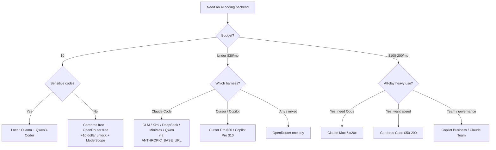

<div align="center">

# 🤖 Awesome AI Coding Subscriptions & APIs

[](https://awesome.re)
[](LICENSE)
[](CONTRIBUTING.md)

[](https://github.com/lildebil0/awesome-ai-coding-subscriptions/stargazers)

**Какую подписку, тарифный план для кодинга, API, роутер или бесплатный тариф поставить за вашим AI-агентом для кодинга?**
Тщательно отобранный, проверенный на бенчмарках ответ со ссылками на источники — отранжированный по 💵 цене · 🧠 мощности · 🔢 числу моделей · 📊 лимитам · 🔌 интеграции.

[English](../README.md) · [简体中文](README.zh-CN.md) · [Español](README.es.md) · **Русский** · [日本語](README.ja.md) · [Português](README.pt-BR.md) · [Français](README.fr.md) · [Deutsch](README.de.md) · [한국어](README.ko.md) · [हिन्दी](README.hi.md)

</div>

---

Этот список каталогизирует **планы, за которые вы платите** — подписки, фиксированные тарифы на кодинг, API с оплатой по факту, роутеры и бесплатные тарифы — а **не** сами инструменты для кодинга. Обвязка (Claude Code, Cline, Aider, Roo/Kilo, OpenCode) бесплатна. Денег стоит модель за ней, поэтому именно она здесь и ранжируется. Обвязка — лишь *цель интеграции*.

Фиксированный план за $3–30/мес от китайской лаборатории с открытыми весами (GLM, Kimi, DeepSeek, MiniMax, Qwen, Doubao), нацеленный на бесплатную CLI-обвязку, даёт вам около 78–80% на SWE-bench примерно за десятую часть стоимости фронтир-подписки за $200. Фронтир-подписки по-прежнему выигрывают на самых сложных задачах. Поэтому большинство людей в 2026 году используют и то, и другое: фронтир-подписку для тяжёлых рассуждений и дешёвый план для всего остального.

> ⚠️ **Цены в этой сфере меняются ежемесячно.** Цифры отражают состояние на **~июнь 2026**. Всегда сверяйтесь с официальной страницей перед покупкой. Нашли устаревшую цену? [Откройте PR](CONTRIBUTING.md) — исправления ценятся не меньше дополнений.

## Условные обозначения

| Бейдж | Значение |
|-------|---------|
| 💎 | **Скрытая жемчужина** — малоизвестна, стоит меньше, чем должна была бы за то, что даёт |
| 🆓 | Есть **бесплатный тариф**, на котором реально можно гонять агента |
| ✅ | **Цена проверена по фактам** относительно официального источника (июнь 2026) |
| ⭐ | Оценка ценности (1–5): цена против мощности против лимитов против интеграции |
| 🇨🇳 | Хостинг в Китае (оговорка по data-residency / задержкам для некоторых) |
| ⚠️ | Несёт заметный риск (ToS, надёжность, долговечность, реселлер) |

**Сокращения по интеграции:** `CC-native` = нативный Anthropic-совместимый эндпоинт, drop-in бэкенд для Claude Code через `ANTHROPIC_BASE_URL`. `OpenAI-compat` = работает в Cline/Roo/Kilo/Aider/Continue/OpenCode сменой base-URL (для Claude Code нужен шим/роутер). `native-only` = привязано к собственному редактору/агенту вендора, переиспользовать как бэкенд нельзя.

## Содержание

- [Как выбирать](#как-выбирать)
- [Выбор по бюджету](#выбор-по-бюджету)
- [Выбор по тому, кто вы](#выбор-по-тому-кто-вы)
- [TL;DR — топ-выборы по сценариям](#tldr--топ-выборы-по-сценариям)
- [Главная сравнительная таблица](#главная-сравнительная-таблица)
- [Фронтир-подписки от первого лица](#фронтир-подписки-от-первого-лица)
- [Подписки на связки инструментов (редактор + модель)](#подписки-на-связки-инструментов-редактор--модель)
- [Фиксированные планы для кодинга — чемпионы по ценности 💎](#фиксированные-планы-для-кодинга--чемпионы-по-ценности-)
- [Value-API с оплатой по факту](#value-api-с-оплатой-по-факту)
- [Провайдеры скорости / быстрого инференса](#провайдеры-скорости--быстрого-инференса)
- [Роутеры и шлюзы](#роутеры-и-шлюзы)
- [Ещё провайдеры, о которых стоит знать (2026)](#ещё-провайдеры-о-которых-стоит-знать-2026)
- [Бесплатные тарифы 🆓](#бесплатные-тарифы-)
- [Бесплатные кредиты и программы для студентов / стартапов](#бесплатные-кредиты-и-программы-для-студентов--стартапов)
- [Студенческие и образовательные планы 🎓](#студенческие-и-образовательные-планы-)
- [Нишевое и специализированное](#нишевое-и-специализированное)
- [Конструкторы приложений и автономные агенты](#конструкторы-приложений-и-автономные-агенты)
- [Скрытые жемчужины и реселлер-прокси ⚠️](#скрытые-жемчужины-и-реселлер-прокси-)
- [Рецепты настройки — подключаем дешёвый план к обвязке](#рецепты-настройки--подключаем-дешёвый-план-к-обвязке)
- [Матрица приватности и data-residency](#матрица-приватности-и-data-residency)
- [Бенчмарк-за-доллар](#бенчмарк-за-доллар)
- [Денежные ловушки и частые ошибки](#денежные-ловушки-и-частые-ошибки)
- [Хронология цен 2026](#хронология-цен-2026)
- [Что на самом деле говорит сообщество](#что-на-самом-деле-говорит-сообщество)
- [Self-host и гибрид (когда подписка — не ответ)](#self-host-и-гибрид-когда-подписка--не-ответ)
- [FAQ](#faq)
- [Глоссарий](#глоссарий)
- [Как этот список оценивается и поддерживается](#как-этот-список-оценивается-и-поддерживается)
- [Оговорки и дисклеймер](#оговорки-и-дисклеймер)
- [Вклад в проект](#вклад-в-проект)
- [Лицензия](#лицензия)
- [⭐ История звёзд](#-история-звёзд)

---

## Как выбирать

Оценивайте каждый план по пяти осям:

1. **💵 Цена** — ценник и *реальная* эффективная стоимость (коэффициенты кредитов, пиковые множители, перерасход).
2. **🧠 Мощность** — качество модели; value-категория кучкуется около ~78–80% SWE-bench Verified, фронтир — на 85–89%.
3. **🔢 Число моделей** — один план, который мультиплексирует много моделей (Qwen Coding Plan, OpenRouter), хеджирует риски churn.
4. **📊 Лимиты** — запросы/токены за 5-часовое окно, недельные потолки, конкурентность. Скрытая стоимость: один «промпт» в IDE разворачивается в **5–30 вызовов модели**, так что рекламные «промпты/5ч» мягче, чем кажутся.
5. **🔌 Интеграция** — есть ли **нативный Anthropic-эндпоинт** (чистый drop-in для Claude Code) или только OpenAI-compat (нужен роутер)? Или это native-only (без переиспользования)?

**Короткий путь решения:**

- Нужен **лучший агент, простейший путь** → Claude Pro $20 → Max 5x $100.
- Нужно **больше всего кодинга за доллар** → фиксированный план (GLM / MiniMax / Qwen / Kimi) на Claude Code.
- Нужно **$0** → Cerebras free + OpenRouter free (+$10 на разблокировку) + NVIDIA NIM, тяжёлые задачи эскалируйте на платную модель.
- Нужен **один ключ для всего** → OpenRouter.
- Нужна **приватность (без хостинга в Китае)** → Synthetic.new (США, no-train, удаление за 14 дней) или фронтир-подписки от первого лица в США.



---

## Выбор по бюджету

Не зацикливайтесь на анализе. Найдите свою месячную цифру — берите стек.

| Бюджет | Лучший выбор | Что вы получаете | Самый умный стек |
|---|---|---|---|
| **$0** 🆓 | **GitHub Copilot Free** + **Gemini CLI** | 2 000 автодополнений + 50 premium-запросов/мес от Copilot; щедрый агентный CLI от Google | Copilot Free в IDE для автодополнения, Gemini CLI в терминале для агентных прогонов, [Cursor Hobby](https://cursor.com/pricing) как третий резерв бесплатных Tab-автодополнений |
| **< $10/мес** | **GLM Coding Plan Lite** 💎 ($30/кв ≈ $10/мес) | ~3× объёма Claude Pro; [нативный Anthropic-совместимый эндпоинт](https://docs.z.ai/guides/overview/pricing) — drop-in в Claude Code, Cline или OpenCode | GLM Lite как драйвер вашего Claude Code + сверху накидываем бесплатный тариф на переполнение |
| **~$10/мес** | **GitHub Copilot Pro** ($10) | Безлимитные автодополнения, $10 AI-кредитов, agent mode, выбор модели — переехал на [usage-based кредиты в июне 2026](https://github.blog/news-insights/company-news/github-copilot-is-moving-to-usage-based-billing/) | Copilot Pro в IDE + GLM Lite в терминале — два почти-фронтир драйвера примерно за $20 в сумме |
| **~$20/мес** | **Claude Pro** ($20) *или* **Cursor Pro** ($20) | Pro: Claude Code в терминале/вебе/десктопе, [Sonnet 4.6 + Opus 4.6](https://claude.com/pricing). Cursor: безлимитный Tab + $20 агентного использования + Background Agents | Claude Pro (лучший «голый» агент) + Copilot Free для inline-автодополнения; либо один Cursor Pro, если вы живёте в одном редакторе |
| **~$50/мес** | **MiniMax Max** ($50) *или* **GLM Pro** (~$72/мес) **+ Claude Pro** ($20) | Высокообъёмный фиксированный план (MiniMax ~1000 промптов/5ч или GLM Pro) *плюс* нативное Anthropic-качество для сложного | Дешёвый план для рутины, Claude Pro приберегаем для хитрых рассуждений — лучшее $/пропускную способность на доске |
| **~$100/мес** | **Claude Max 5x** ($100) | 5× объёма Pro, приоритетный доступ к новейшим моделям — золотая середина для разработчиков, ежедневно упирающихся в лимиты Pro ([план Max](https://support.claude.com/en/articles/11049741-what-is-the-max-plan)) | Max 5x как рабочая лошадка + GLM Lite ($10) как дешёвая полоса переполнения, когда сжигаете лимит 5x |
| **~$200/мес** | **Claude Max 20x** ($200) *или* **Cursor Ultra** ($200) | Max 20x: 20× Pro, топовый индивидуальный уровень. [Cursor Ultra](https://cursor.com/pricing): 20× использования + приоритетные функции в полноценной IDE | Max 20x для terminal-first продвинутых пользователей; добавьте Copilot Pro ($10) только если хотите модели второго вендора для разнообразия/резерва |

**Эмпирические правила**
- **Меньше $20 и чувствительны к цене?** GLM Lite — лучший доллар в кодинге прямо сейчас; он говорит на API Anthropic, так что ваша мышечная память Claude Code переносится.
- **Один инструмент, целый день?** Платите за нативную подписку (Claude Pro, Cursor Pro). Не фрагментируйте.
- **Активный ежедневный пользователь?** Прыгайте сразу на Max 5x — это дешевле, чем складывать два плана по $50, и куда меньше возни.
- **Профессиональный ход на любом уровне:** один премиум-драйвер для сложных задач + одна дешёвая/бесплатная полоса для массовых правок и автодополнения. Две подписки по $20+ вам почти никогда не нужны.

> Цены проверены в июне 2026. Планы с квартальной оплатой (GLM) показаны как эффективная месячная. Планы Copilot и GitHub переехали на [usage-based AI-кредиты 1 июня 2026](https://github.blog/news-insights/company-news/github-copilot-is-moving-to-usage-based-billing/) — ваш лимит масштабируется с базовой ценой.


---

## Выбор по тому, кто вы

Хватит пялиться в матрицу. Найдите свою строку, скопируйте выбор, идите дальше. Цены в USD/мес, индивидуальные уровни, если не указано иное (июнь 2026).

| Вы… | Лучший выбор | Почему подходит вам | ~Цена |
|---|---|---|---|
| **Соло indie-хакер** 💎 | **Claude Pro** + API-ключ Z.ai/DeepSeek на переполнение | Одна подписка за $20 покрывает Claude Code в терминале; когда упираетесь в 5-часовой лимит посреди спринта, откатываетесь на дешёвый value-API вместо прыжка на уровень за $100, который не докрутите. Лучшее $/выход для одного человека, отгружающего код ежедневно. | $20 + копейки |
| **Инженерная команда стартапа (2–20)** | **GitHub Copilot Business** | $19/место даёт org-политику, фильтр публичного кода, **IP-индемнити** и централизованный биллинг — самый дешёвый план, который безопасно показать инвесторам/клиентам. Хорошо сочетается с личной подпиской Claude/Cursor каждого разработчика для тяжёлой работы. [цены](https://github.com/features/copilot/plans) | $19/место |
| **Энтерпрайз** (governance / SSO / IP) | **Copilot Enterprise** или **Claude Enterprise** | Copilot Enterprise ($39/место) добавляет SSO/SCIM, аудит-логи, базы знаний с индексацией кодовой базы и ту же Microsoft IP-индемнити-с-фильтром. Claude Enterprise (цена по запросу) — альтернатива, если вы Anthropic-first. Оба проходят закупки. [Copilot Enterprise](https://docs.github.com/en/copilot/get-started/plans) | $39/место → индивидуально |
| **Студент CS** 🆓 | **GitHub Copilot (Student)** + ChatGPT Free | Верифицированные студенты получают **Copilot уровня Pro бесплатно** (безлимитные автодополнения, premium-модели, ежемесячный лимит premium-запросов). Ноль трат, реальный инструментарий. [планы Copilot](https://github.com/features/copilot/plans) | $0 |
| **Мейнтейнер OSS** 🆓 | **Copilot Pro бесплатно для OSS** + Claude Pro для глубокой работы | Мейнтейнеры популярных репозиториев имеют право на бесплатный Copilot Pro; держите Claude Pro за $20 для замороченных рефакторингов. Лучшее соотношение общественной пользы к стоимости. | $0–$20 |
| **Privacy-first / под регуляцией** 🔒 | **Локальный стек: Ollama + Qwen3-Coder + Continue.dev** | Проприетарный код никогда не покидает машину — ни API, ни пункта о хранении, ни DPA для согласования. Примерно 70–85% качества облачного Claude на однофайловой работе. Если без облака никак — добавьте API-уровень с **нулевым хранением**. [настройка](https://medium.com/@rodrigo.estrada/build-a-local-ai-coding-assistant-qwen3-ollama-continue-dev-cee0dbcd172a) | $0 (железо) |
| **Офлайн / air-gapped** | **Ollama + Qwen3-Coder-Next** (Continue.dev или OpenCode) | Тот же локальный стек, но это *единственная* категория, работающая с выдернутым сетевым кабелем. Qwen3-Coder-Next гоняет ~3B активных параметров из 80B MoE — влезает в реальное железо, без интернета вообще. [модели](https://localaimaster.com/models/best-local-ai-coding-models) | $0 |
| **Vibe-кодер / любитель** 🆓 | **Дегустатор бесплатных тарифов**: ChatGPT Free или Copilot Free + Gemini free | Кодите по выходным ради удовольствия — не платите ничего. 2 000 автодополнений/мес у Copilot Free плюс чат-модель покрывают казуальные сайд-проекты. Апгрейдитесь, только когда бесплатные лимиты реально жмут. | $0 |
| **Power-user, гоняющий параллельных агентов** 💎 | **Claude Max 20x** (или добавьте value-API для fan-out) | Если оркеструете рои / параллельные сессии Claude Code, потолок 20x — то, что не даёт упереться в лимиты в 2 дня. Дешевле, чем сжигать эквивалентные API-токены при таком объёме. Добавьте ключ DeepSeek/Z.ai для одноразовых воркер-агентов. | $200 |

**Два сквозных эмпирических правила:**
- Скачок с **$20 → $100/$200** окупается, только если вы *лично* упираетесь в лимиты использования чаще ~двух раз в неделю. Большинство — нет; отследите это перед апгрейдом.
- **IP-индемнити — фича плана, а не модели.** Она начинается с Copilot **Business** и требует включённого фильтра публичного кода — у бесплатного и Pro её нет. Если ваш репозиторий когда-нибудь будет читать юрист, именно эта строка имеет значение. [детали](https://github.com/features/copilot/plans)

Источники:
- [GitHub Copilot Plans & pricing](https://github.com/features/copilot/plans)
- [Plans for GitHub Copilot — GitHub Docs](https://docs.github.com/en/copilot/get-started/plans)
- [AI Pricing Compared 2026 — AIViewer](https://aiviewer.ai/guides/ai-pricing-comparison-2026/)
- [Build a Local AI Coding Assistant — Qwen3 + Ollama + Continue.dev](https://medium.com/@rodrigo.estrada/build-a-local-ai-coding-assistant-qwen3-ollama-continue-dev-cee0dbcd172a)
- [Best Local AI Coding Models for Ollama (2026)](https://localaimaster.com/models/best-local-ai-coding-models)


---

## TL;DR — топ-выборы по сценариям

| Сценарий | Выбор | Почему | ~Цена |
|----------|------|-----|--------|
| 🏆 **Лучшая ценность в целом** | **GLM Coding Plan** 💎🇨🇳 | GLM-5.1 ~94% кодинга Opus; нативный Claude Code; самый дешёвый серьёзный вход | ~$10/мес (Lite поквартально) – $72 Pro |
| 🥇 **Лучший «голый» фронтир** | **Claude Max 5x** | Открывает Opus в Claude Code — консенсусный агент №1 | $100/мес |
| 🪙 **Самый дешёвый серьёзный вход** | **Trae Lite $3** / **StepFun $6.99** / **MiMo ~$5** / **GLM Lite ~$10** 💎 | Реальный бэкенд для кодинга по цене чашки кофе | $3–10/мес |
| 💸 **Дешевле всего за токен** | **DeepSeek V4-Flash** 💎 | $0.14/M вход, $0.0028/M cache-hit, 1M контекст, CC-native | pay-go |
| 🧪 **Лучшее бесплатное** | **Cerebras free** 🆓 + **OpenRouter :free** 🆓 | 1M ток/день (быстро) + Qwen3-Coder-480B бесплатно | $0 |
| ⚡ **Лучшее быстро+дёшево** | **Groq** 💎🆓 / **Cerebras Code** | Нативный Anthropic-эндпоинт (Groq); ~2000 ток/с на фиксированном тарифе (Cerebras) | free / $50/мес |
| 🔀 **Лучший универсальный роутер** | **OpenRouter** | 315+ моделей, один ключ, Anthropic-скин, без наценки на токены | pay-go +5.5% |
| 🔒 **Лучшая приватность (хостинг в США)** | **Synthetic.new** 💎 | Инфраструктура в США, no-train, удаление за 14 дней, двойная OpenAI+Anthropic-совместимость | $20–60/мес |
| 🧰 **Лучшее для больших кодовых баз** | **Augment Code** ✅ | Лучший в классе Context Engine для монорепо | $20+/мес |
| 🏢 **Лучшая ценность для команды** | **Claude Team Premium seat** 💎 | ≈ объём Max-5x + SSO/админка | $100/место |


---

## Главная сравнительная таблица

Отсортировано примерно по ценности. Цены ~июнь 2026; **проверяйте перед покупкой**.

| План | Тип | Цена | Модели | Лимиты (кодинг) | Интеграция | ⭐ | Заметки |
|------|------|-------|--------|-----------------|-------------|----|-------|
| [GLM Coding Plan](#glm-coding-plan--zai-zhipu-ai-) | фикс | Lite $18 · Pro $72 · Max $160 /мес (Lite поквартально ~$10/мес) | GLM-5.1/5/4.7 | Lite ~80, Pro ~400 промптов/5ч | CC-native | ⭐5 | 💎🇨🇳✅ |
| [DeepSeek API](#deepseek-) | pay-go API | V4-Pro $0.435/$0.87; Flash $0.14/$0.28 | V4-Pro/Flash | 1M контекст, 500–2500 конкур | CC-native | ⭐5 | 💎🇨🇳✅ |
| [MiniMax Coding Plan](#minimax-coding--token-plan-) | фикс | $10–50/мес | M2.7 (план), M2.5/M3 (API) | Starter ~100, Max ~1000 промптов/5ч | CC-native | ⭐5 | 💎🇨🇳 |
| [Kimi Code](#kimi-code--moonshot-ai-) | фикс+API | ~$19/мес + по счётчику | K2.6 (1T) | ~300–1200 вызовов/5ч, 30 конкур | CC-native | ⭐5 | 💎🇨🇳 |
| [Qwen Cloud Coding Plan](#qwen-cloud-coding-plan--alibaba--) | фикс | Pro $50/мес (Lite $10, закрыт) | Qwen3.5 + Kimi/GLM/MiniMax | Pro 6000 запр/5ч, 1M контекст | CC-native | ⭐4 | 💎🇨🇳✅ |
| [OpenRouter](#openrouter) | роутер | pay-go, +5.5% на пополнение | 315+ (все они) | привязка к балансу; free-модели 50–1000/день | CC-native скин | ⭐5 | 🆓 |
| [Claude Pro](#anthropic-claude) | от первого лица | $20/мес | Sonnet 4.6 (без Opus) | ~40–45 сообщ/5ч + недельный | CC-native | ⭐5 | лучший вход |
| [Claude Max 5x](#anthropic-claude) | от первого лица | $100/мес | + Opus 4.6/4.7 | ~50–225 промптов/5ч | CC-native | ⭐5 | Opus разблокирован |
| [Cerebras Code](#cerebras) | фикс скорость | $50/$200 | GLM-4.7 (~2000 ток/с) | 24M–120M ток/день, 131k контекст | OpenAI-compat | ⭐5 | ✅ часто sold out |
| [Synthetic.new](#synthetic) | фикс (США) | $20–60/мес | 16 open-weight (GLM/Kimi/Qwen/DS) | ~125–1250 запр/5ч | CC-native | ⭐5 | 💎🔒 |
| [Chutes](#chutes) | фикс ⚠️ | $3/$10/$20 | GLM-5/Kimi/DS/MiniMax/Qwen | 300/2000/5000 запр/день | OpenAI-compat | ⭐5 | 💎⚠️ децентрализованный ✅ |
| [Grok Code Fast 1](#xai-grok) | pay-go API | $0.20/$1.50/M | grok-code-fast-1 | 256K контекст, ~92 ток/с | CC-native | ⭐5 | 💎 #1 на OpenRouter |
| [ChatGPT Plus](#openai-chatgpt--codex) | от первого лица | $20/мес | GPT-5.x-Codex | по токен-кредитам | Codex-native | ⭐4 | Codex агент №2 |
| [ChatGPT Pro](#openai-chatgpt--codex) | от первого лица | $100/$200 (5x/20x) | GPT-5.5-Codex | высокий; выделенный GPU | Codex-native | ⭐4 | |
| [Claude Max 20x](#anthropic-claude) | от первого лица | $200/мес | Opus 4.6/4.7 | ~200–900 промптов/5ч | CC-native | ⭐4 | power-уровень |
| [Cursor Pro / Ultra](#cursor) | связка | $20 / $200 | весь фронтир + Auto | пул использования $20 / $400 | Native-only | ⭐4 | Ultra = коэффициент кредитов 2× |
| [GitHub Copilot Pro](#github-copilot) | связка | $10/мес | GPT-5/Claude/Gemini | $10 AI-кредитов (usage) | Native-only (+ACP) | ⭐4 | бесплатные автодополнения 🆓 |
| [DeepInfra](#deepinfra) | скорость/API | pay-go (самый дешёвый OSS) | Kimi/DS/Qwen3-Coder/GLM | привязка к балансу | CC-native | ⭐5 | 💎✅ самый дешёвый хост |
| [Groq](#groq) | скорость/API | pay-go + free | GPT-OSS/Qwen3/Kimi | бесплатные лимиты RPM/TPM | CC-native | ⭐4 | 💎🆓 |
| [Vercel AI Gateway](#vercel-ai-gateway) | роутер | $0 наценка (даже BYOK) | сотни вкл. Claude | $5/мес бесплатных кредитов | CC-native | ⭐4 | 💎🆓✅ |
| [Requesty](#requesty) | роутер | +5% фикс | Claude/GPT/Gemini/DS/Qwen | семантический кеш ~40% скидка | OpenAI-compat | ⭐4 | 💎 team governance |
| [Mistral Le Chat Pro](#mistral) | от первого лица | $14.99/мес ($5.99 студент) | Devstral 2 + Vibe CLI | ~25 беспл. сообщ/день | Native-only | ⭐4 | 💎🆓🇪🇺 дешевле всех крупных подписок |
| [Augment Code](#подписки-на-связки-инструментов-редактор--модель) | связка | $20–200/мес | Claude/Gemini/GPT | 40k–450k кредитов/мес | Native-only | ⭐4 | ✅ лучший контекст для больших репо |
| [Zed Pro](#подписки-на-связки-инструментов-редактор--модель) | связка | $10/мес | любая (BYO key/ACP) | $5 кредитов + usage | ACP + BYOK | ⭐4 | 💎 анти-lock-in |
| [Cerebras free](#бесплатные-тарифы-) | бесплатно | $0 | Qwen3-Coder-480B, GPT-OSS-120B | 1M ток/день, потолок контекста 8K | OpenAI-compat | ⭐5 | 💎🆓 самое быстрое бесплатное |
| [Google AI Studio](#бесплатные-тарифы-) | бесплатно | $0 | Gemini 2.5 Flash, Gemma 3 27B | Flash 250 RPD; Gemma 14.4k RPD | OpenAI-compat | ⭐4 | 🆓 самый большой бесплатный контекст |


---

## Фронтир-подписки от первого лица

Планы напрямую от вендора. Подписка аутентифицирует **собственную обвязку вендора** (Claude Code, Codex CLI, Antigravity, Grok Build) через логин — она **не** даёт вам обобщённый API-ключ для сторонних OpenAI-compat инструментов (это отдельная пер-токен оплата). Исключение: модели xAI Grok OpenAI/Anthropic-совместимы.

> Иерархия ценности для агентного кодинга (консенсус на июнь 2026): **Claude > OpenAI Codex > Google Gemini > xAI Grok**. Независимый 30-дневный тест дал Claude ~95% против ChatGPT ~85% точности кодинга; вендорский SWE-bench: GPT-5.5 (88.7%) ≈ Opus 4.7 (87.6%).

### Anthropic (Claude)
- **[Claude Pro](https://claude.com/pricing)** — `$20/мес` ($17 при годовой). Sonnet 4.6 в Claude Code (**без Opus**). ~40–45 сообщ/5ч + недельный потолок, общий с чатом/Cowork. **Лучшая по ценности точка входа в агента кодинга №1.** Апрель 2026 удвоил 5ч-лимиты и убрал пиковый троттлинг. ⭐5
- **[Claude Max 5x](https://support.claude.com/en/articles/11049741-what-is-the-max-plan)** — `$100/мес`. **Открывает Opus 4.6/4.7** + 5× пропускной способности (~50–225 промптов/5ч). Профессиональная золотая середина; средний уровень за $100, который OpenAI/Google не повторяют так же полезно. ⭐5
- **[Claude Max 20x](https://support.claude.com/en/articles/11049741-what-is-the-max-plan)** — `$200/мес`. ~200–900 промптов/5ч. Для целодневных параллельных агентов; математика **фиксированный-тариф-бьёт-API** решающая (90%+ токенов Claude Code — это cache-reads, бесплатные на подписке, оплачиваемые на API — пиковый месяц одного разработчика = $5 623 на API ≈ 4.5 года Max 5x). ⭐4
- **[Claude Team Premium seat](https://claude.com/pricing)** 💎 — `$100/место` (годовая). ≈ объём Max-5x **плюс** SSO/админка/аудит/enterprise-search. Тихо — лучшая *командная* ценность для кодинга; место Standard за $20 тоже включает Claude Code. ⭐4

### OpenAI (ChatGPT / Codex)
- **[ChatGPT Plus](https://help.openai.com/en/articles/11369540-using-codex-with-your-chatgpt-plan)** — `$20/мес`. Codex CLI/IDE в комплекте (GPT-5.5/5.4/5.3-Codex). **По токен-кредитам** с апреля 2026 (запутанно). Codex = консенсусный агент №2. Лимиты Plus быстро кончаются на тяжёлой агентной работе. ⭐4
- **[ChatGPT Pro](https://developers.openai.com/codex/pricing)** — `$100` (5x) / `$200` (20x). Высокая пропускная способность + выделенный GPU. Учтите: промо «10x boost» на уровне $100 **истёк 31 мая 2026** (теперь 5x). Классический спор «$200 план стоит того?» = Claude Max 20x против ChatGPT Pro 20x. ⭐4

### Google (Gemini)
- **[Google AI Pro](https://gemini.google/subscriptions/)** — `$19.99/мес` (часто −50% в первый год). Переименован из Google One AI Premium (апр 2026). Gemini 3.x Pro, 5 ТБ хранилища и **расширенный доступ к кодинг-агентам [Antigravity](#конструкторы-приложений-и-автономные-агенты) + Jules**. ✅
- **[Google AI Ultra](https://blog.google/products-and-platforms/products/google-one/google-ai-subscriptions/)** — **`$100/мес` (5×, новый dev-уровень)** / **`$200/мес` (20×, снижен с $250)** на I/O 2026. 5×/20× объёма в приложении Gemini **и** Antigravity; топ-уровень добавляет Deep Think, Project Genie, 30 ТБ. ✅
- ⚠️ **Google убивает опенсорсный Gemini CLI 18 июня 2026**, мигрируя пользователей на закрытый Antigravity CLI с куда меньшими бесплатными квотами (~1000 → ~20 запр/день) — крупнейшая претензия сообщества 2026 года.

### xAI (Grok)
- **[SuperGrok](https://x.ai/pricing)** — `$30/мес` ($300/год) / Heavy `$300/мес`. (На текущей странице цен нет отдельного уровня «Lite» — это легаси/артефакт бандла X-Premium; игнорируйте старые цифры $10.) Grok Build CLI гоняет **8 параллельных суб-агентов в изолированных git worktrees** (новаторски) и включён во все подписки SuperGrok. У `grok-code-fast-1` культовая фан-база (дёшево+быстро). SWE-bench ~70.8% отстаёт от лидеров. **Для кодинга [xAI API](#xai-grok) часто выгоднее.** ⭐3 💎


---

## Подписки на связки инструментов (редактор + модель)

Здесь план *и есть* продукт — вы покупаете вход в редактор/агент вендора. Тренд 2026: почти все перешли с фиксированного числа запросов на **кредиты / токен-счётчик**, сделав расходы *менее* предсказуемыми (громкая реакция).

### Cursor
- **[Cursor](https://cursor.com/pricing)** — Hobby бесплатно · **Pro `$20`** · **Pro+ `$60`** 💎 · **Ultra `$200`**. С июня 2025 цена вашего плана = пул использования по API-ставкам. **Коэффициент кредитов улучшается с уровнем**: Pro $20/$20 (1×), Pro+ $60/$70 (1.17×), Ultra $200/$400 (**2×, лучший**). Режим `Auto` — ключ к ценности: фактически безлимитный, не сливает пул так, как закрепление Claude/MAX. ⚠️ Переход июня-2025 вызвал [ценовую катастрофу](https://www.wearefounders.uk/cursors-pricing-disaster-the-full-timeline-of-how-an-ai-coding-darling-burned-its-most-loyal-users/) (пользователь HN: «$350 перерасхода за неделю»); CEO извинился + вернул деньги. **Native-only** — не может бэкендить Claude Code, и с января 2026 вы не можете завести подписку Claude *внутрь* Cursor. Лучший в классе Tab/Apply. ⭐4

### GitHub Copilot
- **[GitHub Copilot](https://github.com/features/copilot/plans)** — Free 🆓 · **Pro `$10`** · Pro+ `$39` · Max `$100` · Business `$19` · Enterprise `$39`. ⚠️ **Перешёл на usage-based AI-кредиты 1 июня 2026** (1 кредит = $0.01); каждый план включает пул кредитов (Pro=$15, Pro+=$70). **Автодополнения кода остаются безлимитными и бесплатными** — пользователей только автодополнения это не затрагивает. Реакция жёсткая (TechTimes: агентные счета подскочили в 10×–50×). Лучшие в классе автодополнения в IDE + governance/IP-индемнити для организаций. **Native-only** (запасной выход: Copilot CLI говорит на ACP). ⭐4

### Прочие
- **[Augment Code](https://www.augmentcode.com/pricing)** ✅ — Indie `$20`/40k кредитов · Standard `$60` · Max `$200`. **Лучший в классе Context Engine** для крупных монорепо (лидер по сравнениям context-recall). VS Code + JetBrains + Auggie CLI. Native-only. Сжигание кредитов на tool-heavy задачах — главная претензия. ⭐4 💎
- **[Zed Pro](https://zed.dev/pricing)** 💎 — Free · **Pro `$10`** (всего +10% наценки) · Business `$30`. Выбор **анти-lock-in**: открытый [ACP](https://zed.dev/docs/ai/) управляет внешними агентами (Claude Code, Codex, OpenCode) и BYO-ключами для любого провайдера. Самый быстрый нативный редактор. ⭐4
- **[Kiro](https://kiro.dev/pricing/)** 💎 — Free · **Pro `$20`/1k кредитов** · Pro+ `$40` · Power `$200`. Лучший **spec-driven** агент (требования→дизайн→задачи), полная линейка Claude вкл. Opus 4.7, дробный биллинг по 0.01 кредита. **AWS Startups = 1 бесплатный год Pro+.** ⭐4
- **[Trae](https://www.trae.ai/pricing)** 💎🇨🇳 — Free · **Lite `$3`** · Pro `$10` · Ultra `$100`. Форк VS Code от ByteDance; пул использования превышает ценник (например, $20 использования за $10) = «Cursor-альтернатива за $3». ⚠️ Телеметрия ByteDance шарится с аффилиатами — стоп-фактор для энтерпрайза. ⭐4
- **[Sourcegraph Amp](https://sourcegraph.com/amp)** — бесплатный старт ($10 кредита; $40 для бывших Cody). Чистое **потребление** (без месячного минимума), гоняет Opus 4.8 в режиме «smart». Отлично для лёгкого использования, риск неограниченного сжигания для тяжёлого. Cody Free/Pro свернули в Amp. ⭐3
- **[JetBrains AI / Junie](https://www.jetbrains.com/ai-ides/buy/)** — любимая интеграция с IDE, но Junie **сжигает кредиты быстро** (35 кредитов Ultimate уходят за ~4–5 дней). Только если вы живёте в JetBrains.
- **Переоценённое / избегать:** **Tabnine** ($39 минимум, без бесплатного тарифа, годовая привязка — только для on-prem/air-gap нужд); **Windsurf Pro** (мартовская смена 2026 на дневные/недельные квоты — самое раскритикованное изменение года, доверие после поглощения Cognition низкое). **Supermaven** мёртв как самостоятельный продукт (влит в Cursor Tab в ноябре 2025).


---

## Фиксированные планы для кодинга — чемпионы по ценности 💎

Фиксированные месячные или квартальные планы, ставящие за вашей обвязкой почти-фронтир модель с открытыми весами, в основном от китайских лабораторий. Большинство выставляют нативный Anthropic-эндпоинт, так что они drop-in в Claude Code через `ANTHROPIC_BASE_URL`. Список эндпоинтов см. в [Alorse/cc-compatible-models](https://github.com/Alorse/cc-compatible-models).

> Консенсусная иерархия: **GLM** (самый дешёвый вход, дефолт сообщества) · **MiniMax** (лучшая цена/объём) · **Kimi** (лучший long-horizon агент) · **Qwen** (>262K контекст, мульти-модель). Claude Pro $20 — эталон качества, который они подрезают.

<a name="glm-coding-plan-zai"></a>
### GLM Coding Plan — Z.ai (Zhipu AI) 💎🇨🇳 ✅
- **Зарубежная помесячная цена (проверено июнь 2026):** `Lite $18/мес` · `Pro $72/мес` · `Max $160/мес` — цены ~удвоились 11 апреля 2026. **Поквартальный Lite — дешёвый путь** (~$30/кв ≈ $10/мес). Внутренняя CN-цена куда ниже (~$7 / $21 / $68 в мес). Вирусное промо **$3/мес** закончилось 11 февраля 2026. ✅
- Модели: **GLM-5.1** (~94% кодинга Opus 4.6) · GLM-5/5-Turbo · GLM-4.7 · GLM-4.5-Air. **Каждый уровень (вкл. Lite) получает все модели и полный контекст 200K** (макс. вывод 128K) — уровни различаются только квотой, не моделями и не окном контекста. Рекомендуемое сопоставление: GLM-5.1 → слот Opus (сложные задачи, фронтенд/UI), GLM-4.7 → Sonnet (рабочая лошадка с ×1-квотой), GLM-4.5-Air → Haiku (быстрый фон).
- Лимиты: Lite ~80, Pro ~400, Max ~1 600 промптов/5ч + недельный (один IDE-«промпт» = 5–30 вызовов модели). ⚠️ **Пиковый множитель 3×** только на GLM-5/5.1, **14:00–18:00 UTC+8 (≈08:00–12:00 по Калининграду)**; 2× вне пика (1× вне пика по промо до конца июня 2026). Тяжёлый GLM-5.1 гоняйте вне пика.
- Интеграция: `ANTHROPIC_BASE_URL=https://api.z.ai/api/anthropic` — официальная поддержка Claude Code + Cline/Roo/Kilo/OpenCode (20+ инструментов). **От первого лица** = нет риска бана за реселлинг.
- > *Самый рекомендуемый бюджетный план для кодинга 2026 года.* «3× объёма Claude Max за ~$30/мес.» Реакция на февральское повышение цены + урезание квоты на ⅓, всё равно оценён как топ по ценности. ⭐5
- Источники: [z.ai/subscribe](https://z.ai/subscribe) · [цены](https://docs.z.ai/guides/overview/pricing) · [обзор GLM-5.1](https://serenitiesai.com/articles/glm-5-1-coding-plan-review-2026)

<a name="minimax"></a>
### MiniMax Coding / Token Plan 💎🇨🇳
- `Starter $10/мес` · `Plus $20` · `Max $50` (2 месяца бесплатно при годовой); High-Speed варианты $40–150.
- Модели: M2.7 / M2.7-Highspeed на плане; **M2.5/M3** (1M контекст) через API. ⚠️ **План часто отдаёт модель постарше** (M2.1), чем забенчмаркенные M2.5/M2.7.
- Лимиты: Starter ~100 → Max ~1 000 промптов/5ч; ~50 TPS (100 high-speed).
- Интеграция: `ANTHROPIC_BASE_URL=https://api.minimax.io/anthropic` + OpenAI-compat.
- > «Вдвое срезал мой счёт за Claude Code.» **Лучшая «голая» цена/объём** в фиксированной категории; M2.7 ~94% от GLM-5.1 при ~1/5 стоимости входа. ⭐5
- Источники: [coding plan](https://platform.minimax.io/subscribe/coding-plan) · [цены M2.5](https://www.verdent.ai/guides/minimax-m2-5-pricing)

<a name="kimi-moonshot"></a>
### Kimi Code — Moonshot AI 💎🇨🇳
- `~$19/мес членство` + API по счётчику (K2.6 $0.60–0.95/M вход, $2.50–4.00/M выход, скидка 75% на кеш). Уровни Moderato/Allegretto/Vivace.
- Модели: **Kimi K2.6** (1T MoE, ~80.2% SWE-bench), K2.5.
- Лимиты: ~300–1 200 вызовов/5ч, **30 одновременных** (щедро для параллельных агентов).
- Интеграция: `ANTHROPIC_BASE_URL=https://api.moonshot.ai/anthropic` — настоящий drop-in для Claude Code; поставляет собственный Kimi CLI (6.4k★).
- > **Лучшая стабильность long-horizon агента** (выдерживает 4 000+ вызовов инструментов за 13-часовую сессию). «Экономия 88% на расходах кодинга.» Самая дорогая по входу из открытой когорты. ⭐5
- Источники: [поддержка агентов](https://platform.kimi.ai/docs/guide/agent-support) · [гайд Kimi Code](https://www.nxcode.io/resources/news/kimi-code-2026-plans-pricing-developer-guide)

<a name="qwen-alibaba"></a>
### Qwen Cloud Coding Plan — Alibaba 💎🇨🇳 ✅
- `Pro $50/мес` (Lite ~$10 **закрыт для новых подписок** с 20 марта 2026).
- Модели: Qwen3.5-Plus, Qwen3-Coder-Next/Plus/480B + кросс-модельные **Kimi/GLM/MiniMax** под одним ключом. **Контекст 1M токенов** (лучший в категории).
- Лимиты: Pro 6 000 запр/5ч + 45k/нед + 90k/мес (скользящее окно). Выделенный ключ `sk-sp-` (не взаимозаменяем с pay-go).
- Интеграция: `ANTHROPIC_BASE_URL=https://coding-intl.dashscope.aliyuncs.com/apps/anthropic` + Qwen Code CLI.
- > Изюминка = **один план мультиплексирует Qwen+Kimi+GLM+MiniMax** и единственный заслуживающий доверия фиксированный план с 1M контекстом. ⭐4
- Источники: [coding plan в Model Studio](https://www.alibabacloud.com/help/en/model-studio/coding-plan)

### Фиксированные подписки open-weight (приватность / хостинг в США)
- **[Synthetic.new](https://synthetic.new/pricing)** 💎🔒 — `$20–60/мес`. ~16 всегда-доступных open-weight моделей (Kimi/GLM/Qwen3-Coder-480B/DeepSeek). **Инфраструктура в США, no-training, удаление за 14 дней.** **Двойная OpenAI + Anthropic-совместимость** = настоящий drop-in в Claude Code. Приватная альтернатива китайским планам. ⭐5
- **[Cerebras Code](#cerebras)** — `$50`/`$200`, фиксированная скорость (см. [Скорость](#провайдеры-скорости--быстрого-инференса)).
- **[OpenCode Go (Zen)](https://opencode.ai/go)** 💎 — `$5` первый месяц, затем `$10/мес` фикс. ~12–14 китайских open-weight моделей (GLM-5.1/Kimi/Qwen3.7/DeepSeek V4/MiniMax). Первоклассно в OpenCode. Без Claude/GPT. ⭐4

### Нишевые / дешёвые фиксированные планы 🇨🇳
- **[StepFun Step Plan](https://github.com/Alorse/cc-compatible-models)** — `$6.99`–`$99/мес`, 100–5 000 промптов/5ч, CC-native. Сбивает цену, модели менее обкатаны в бою. ⭐3
- **MiMo (Xiaomi)** — `$6`–`$100/мес` по кредитам (60M–1.6B), CC-native (`api.xiaomimimo.com`), вкл. мультимодальный Omni. Едва забенчмаркен. ⭐3
- **Atlas Cloud** 💎 — `$10`/`$20`, 800k–1.8M кредитов/**день**, OpenAI-compat (Claude Code/Codex/OpenCode). Модель дневных кредитов для автономных агентов. ⭐4
- **[Factory Droid](https://factory.ai/pricing)** 💎 — от `$20/мес` по токенам, фронтир-модели (Claude/GPT/Gemini), скользящие окна 5ч/7д/30д. Известная история «Я отменил два плана Max по $200 ради Droid». ⭐4


---

## Value-API с оплатой по факту

Доступ за токены от value-лабораторий. **Цена кеша — реальный драйвер стоимости** для агентных циклов — проектируйте под cache-hits, а не под заголовочную цену входа.

<a name="deepseek"></a>
### DeepSeek 💎🇨🇳 ✅
- **V4-Pro** `$0.435/M вход · $0.0036/M cache-hit · $0.87/M выход` (**срез на 75% теперь постоянный**). **V4-Flash** `$0.14 / $0.0028 / $0.28`. Контекст 1M, макс. выход 384K.
- Интеграция: OpenAI-compat **+ нативный Anthropic** (`https://api.deepseek.com/anthropic`) — drop-in Claude Code (`ANTHROPIC_MODEL=deepseek-v4-pro[1m]`).
- > **Чемпион по стоимости за токен.** V4-Pro ~80.6% SWE-bench / 93.5% LiveCodeBench при <$1/M выход. $0.0028/M cache-hit у V4-Flash непобиваем для массовых циклов. ⭐5
- Источники: [цены](https://api-docs.deepseek.com/quick_start/pricing) · [настройка Claude Code](https://api-docs.deepseek.com/quick_start/agent_integrations/claude_code)

### Прочие
- **[Alibaba Qwen3-Coder API](https://www.alibabacloud.com/help/en/model-studio/model-pricing)** 🇨🇳 — 480B `$0.22/$1.00`, Flash `$0.195/$0.975`, 30B-A3B `$0.07/$0.27`. **1M бесплатных токенов / 90 дней** (Intl). CC-native. Сильнейший open-weight агентный кодер. Используйте ключи региона Сингапур. ⭐4
- **[Moonshot Kimi API](https://platform.kimi.ai/docs/pricing)** 🇨🇳 — K2.6 `$0.95/$4.00` ($0.16 кеш), K2.5 `$0.60/$3.00`. CC-native. Отличный tool-calling; цена выхода — повод поворчать. Депозит $10 снимает дневной потолок. ⭐4
- **[Zhipu GLM API](https://docs.z.ai/guides/overview/pricing)** 🇨🇳 — GLM-5.1 `$1.40/$4.40`, GLM-4.7 `$0.60/$2.20`, FlashX `$0.07/$0.40`. CC-native. Большинство энтузиастов вместо этого покупают более дешёвый [Coding Plan](#glm-coding-plan--zai-zhipu-ai-). ⭐4
- **[MiniMax API](https://platform.minimax.io/docs/guides/pricing-paygo)** 🇨🇳 ✅ — M3 `$0.30/$1.20` ($0.06 кеш, **бесплатная запись в кеш**), M2.5 ~`$0.15/$1.15`. «В 20× дешевле Opus.» Anthropic-совместимость от первого лица. ⭐4


---

## Провайдеры скорости / быстрого инференса

Пер-токен хосты open-weight моделей, оптимизированные под пропускную способность. **У Groq единственного есть нативный Anthropic-эндпоинт** (чистейший drop-in для Claude Code); остальные — OpenAI-compat (нужен шим/роутер для CC, нативно в Cline/Roo/OpenCode).

<a name="deepinfra"></a>
- **[DeepInfra](https://deepinfra.com/pricing)** 💎 ✅ — **чемпион по дешевизне за токен.** DeepSeek V3.2 ~$0.26/$0.38, Kimi K2.6 $0.75/$3.50, Qwen3-Coder-480B $0.30/$1.00. 90+ моделей, скидки на кеш, **нативный Anthropic-эндпоинт**, без предоплаты. Скорость хорошая, но не элитная. ⭐5
<a name="groq"></a>
- **[Groq](https://groq.com/pricing)** 💎🆓 — скорость LPU (GPT-OSS-20B ~860 ток/с). GPT-OSS-120B `$0.15/$0.60`, Kimi K2 `$1.00/$3.00`. **Нативная Anthropic + OpenAI-совместимость** + реальный бесплатный тариф. Batch+кеш складываются до ~25%. Нет Qwen3-Coder-480B (потолок — Qwen3-32B). ⭐4
<a name="cerebras"></a>
- **[Cerebras](https://www.cerebras.ai/pricing)** ✅ — **самый быстрый** (~2 000–3 000 ток/с). **Code Pro `$50`** (24M ток/день) / **Max `$200`** (120M ток/день), GLM-4.7, 131k контекст. Pay-go GPT-OSS-120B `$0.35/$0.75`. ⚠️ Часто **sold out**; 131k контекст (половина нативного) + высокий TTFT притупляют скорость в агентных циклах. ⭐5 фикс / ⭐4 pay-go
- **[Together AI](https://www.together.ai/pricing)** — самый широкий каталог (Qwen3-Coder-480B, Kimi, DeepSeek V4 Pro $2.10/$4.40 с $0.20 кеш). Средняя цена, ~89 ток/с. ⭐4
- **[Fireworks AI](https://fireworks.ai/pricing)** — уклон в продакшн/энтерпрайз, агрессивный кеш ($0.15/M), DeepSeek V4-Flash $0.14/$0.28, путь через Azure Foundry. ⭐4
- **[Novita](https://novita.ai/pricing)** 💎 — хостит всё семейство Qwen3-Coder по ценам около DeepInfra; малозаметный маршрут OpenRouter. ⭐4
- **[Hyperbolic](https://docs.hyperbolic.xyz/docs/hyperbolic-ai-inference-pricing)** 💎 — GPT-OSS-20B `$0.10/M` blended (из самых дешёвых где-либо); хостит Qwen3-Coder-480B (FP8). ~13 моделей. ⭐3
- **SambaNova** — уникально быстр на гигантских моделях 671B/405B; вечно-бесплатный + $5 кредита 🆓, но потолок 50 запр/день = только для evals.


---

## Роутеры и шлюзы

Один ключ ко многим провайдерам. Выбирайте роутер как **слой доступа по умолчанию**.

<a name="openrouter"></a>
- **[OpenRouter](https://openrouter.ai/pricing)** 🆓 — **консенсусный дефолт.** 315+ моделей, один ключ, **Anthropic-совместимый «скин»** (`ANTHROPIC_BASE_URL=https://openrouter.ai/api` = настоящий drop-in для Claude Code), **без наценки на цену токена** (только +5.5% на пополнения), бесплатный ZDR + потолки трат, щедрый BYOK (1M бесплатных запр/мес). Бесплатные модели (Qwen3-Coder-480B, DeepSeek, Llama 4): 50 RPD → **1000 RPD навсегда после разового депозита в $10**. Комиссия 5.5% кусается только при тратах выше ~$5k/мес. ⭐5
<a name="requesty"></a>
- **[Requesty](https://www.requesty.ai/)** 💎 — **фиксированная наценка 5%**, все функции вкл. **семантическое кеширование** (~40% экономии, бьёт кеши только-по-совпадению) + умную пер-запросную маршрутизацию + **пер-агентные политики моделей** (разная модель под роль классификатора/синтезатора) + SOC 2 Type II. Выбор для team-governance. OpenAI-compat. ⭐4
<a name="vercel-ai-gateway"></a>
- **[Vercel AI Gateway](https://vercel.com/docs/ai-gateway/pricing)** 💎🆓 ✅ — **нулевая наценка, даже на BYOK.** Нативная Anthropic-совместимость (`https://ai-gateway.vercel.sh`) = прямой Claude Code + Claude Agent SDK + «Claude Code Max через Gateway». $5/мес бесплатных кредитов обновляются бессрочно (прекращается, как только пополните). Лучший выбор чистой экономики, особенно в экосистеме Vercel. ⭐4
- **[Helicone Gateway](https://helicone.ai/pricing)** 🆓 — observability-first (авто логирование/трейсинг/стоимость), нулевая наценка, бесплатно 10k запр/мес; подписки $79/$799. ⭐3
- **[CometAPI](https://www.cometapi.com/)** — 500+ моделей вкл. новейшие проприетарные, ~20–40% от официальной, **двойная OpenAI+Anthropic-совместимость**. Риск посредника с предоплаченными кредитами. ⭐4
- **[ElectronHub](https://www.electronhub.ai/pricing)** — 600+ моделей, недельные кредиты могут превышать денежную стоимость; жёсткие 5–10 RPM на дешёвых уровнях, оговорка про доверие к реселлеру. ⭐3
- **[LiteLLM](https://docs.litellm.ai/)** — OSS-стандарт для **self-host** (бесплатно, без наценки) — см. [трюки интеграции](#подключаем-дешёвые-планы-в-обвязку). DIY-инфраструктура, не из коробки. ⭐4


---

## Ещё провайдеры, о которых стоит знать (2026)

По-настоящему полезные записи, которые не возглавляют основные разделы, но закрывают реальные пробелы — дополнительные китайские лаборатории и агрегаторы, западные инструменты для кодинга и роутеры помимо OpenRouter. Сгруппированы и свёрнуты, чтобы список оставался обозримым.

<details>
<summary><b>🇨🇳 Китайские агрегаторы и лаборатории</b> (дешёвые токены, у некоторых нативные Anthropic-эндпоинты)</summary>

- **[SiliconFlow](https://www.siliconflow.com/pricing)** 💎 — один из крупнейших независимых MaaS-роутеров Китая, 200+ моделей, **нативный Anthropic-эндпоинт** (редкость), так что Claude Code смотрит прямо на дешёвые DeepSeek/Qwen/GLM/Kimi. Intl (.com) + Китай (.cn) эндпоинты. DeepSeek-V4-Flash ~$0.14/$0.28.
- **[PPIO](https://ppio.com/llm-api)** 💎 — роутер с ценами в CNY на **собственном GPU-облаке**; Qwen3-Coder-Next ≈¥1.4/¥10.5, DeepSeek-V4-Flash ¥1/¥2 — среди самых низких цен на токены где-либо. OpenAI-compat (мост для Claude Code).
- **[Volcengine Ark / BytePlus](https://www.volcengine.com/docs/82379/1949118)** 💎 (Doubao от ByteDance) — фиксированный **Doubao Coding Plan**: Lite **$10**/Pro **$50** через BytePlus (бренд, оплачиваемый зарубежной картой). **Doubao-Seed-Code** нативно Anthropic-совместим и приближается к Claude Sonnet на кодинге; в комплекте агент «ArkClaw» в стиле Claude Code. Минимум Doubao API: `doubao-seed-1.6-flash` $0.022/M вход.
- **[Alibaba Bailian multi-model Coding Plan](https://www.alibabacloud.com/help/en/model-studio/coding-plan)** 💎 — **$50/мес Pro**, мультиплексирующий **Qwen3-Coder + Kimi-K2.5 + GLM-5 + MiniMax-M2.5** под одной подпиской, с **нативным Anthropic-эндпоинтом** + регион Сингапур (без китайского ID). ⚠️ нужен выделенный ключ `sk-sp-` — обычный ключ молча выставляет счёт 5× PAYG.
- **[ModelScope](https://modelscope.cn/)** 🆓💎 (Alibaba) — **2 000 бесплатных API-вызовов/день, без карты**, вкл. Qwen3-Coder-480B. Де-факто способ за $0 гонять фронтир китайский кодер в агентном цикле после закрытия бесплатного OAuth-тарифа Qwen.
- **[AiHubMix](https://docs.aihubmix.com/en)** 💎 — китайский унифицированный роутер, выставляющий OpenAI-, Gemini- **и Anthropic**-совместимые эндпоинты с первоклассной документацией по Claude Code; один ключ через DeepSeek/Qwen/GLM/Kimi и реленный Claude.
- **[302.AI](https://302.ai/)** 💎 — предоплата, **без TPM-троттлинга** (хорошо для всплесковых агентов), один баланс через Kimi/Qwen/DeepSeek + GPT/Claude, опция приватного развёртывания.
- **Полнота крупных лабораторий:** **[Baidu ERNIE](https://pricepertoken.com/pricing-page/model/baidu-ernie-4.5-21b-a3b)** (Qianfan; ERNIE 4.5 21B-A3B $0.07/$0.28), **[Tencent Hunyuan](https://pricepertoken.com/pricing-page/provider/tencent)** (HY3 Preview ~$0.063/$0.21 — но Tencent кое-где *поднял* цены), **[iFlytek Spark](https://lobehub.com/docs/usage/providers/spark)** (бесплатный Lite-уровень + выделенный Spark Code), **[SenseNova](https://www.sensetime.com/en)** (дешёвый мультимодальный MoE). Все OpenAI-compat; для Claude Code нужен мост; большинству нужен китайский ID для прямой регистрации (достижимо через релеи/302.AI).
- ⚠️ **Китайские прямые релеи** (типа Yunwu, SSSAiCode) дёшево перепродают фронтир Claude/GPT без VPN — удобно внутри Китая, но несут стандартный [риск реселлер-прокси](#скрытые-жемчужины-и-реселлер-прокси-). Относитесь как к горячему кошельку.

</details>

<details>
<summary><b>🛠️ Западные инструменты для кодинга с подпиской</b></summary>

- **[Refact.ai](https://refact.ai/)** 💎 — **$10/мес**, самая дешёвая подписка на агентный кодинг; опенсорс, **полностью self-hostable автономный агент** с on-prem дообучением и нулевой телеметрией. Бесплатный тариф = 5 000 монет/мес + безлимитные автодополнения.
- **[Pieces for Developers](https://pieces.app/)** 💎 — Pro **$14.17/мес при годовой** = безлимитные Opus 4 / GPT-5 / Gemini 2.5 в IDE (дешевле одного места Claude Pro). Отличительная черта — долгосрочный слой **памяти/контекста** через все ваши инструменты, а не кодогенерация. Бесплатный тариф гоняет локальные модели безлимитно.
- **[Continue](https://www.continue.dev/pricing)** 💎 — опенсорсный IDE-агент + витрина моделей **Continue Hub**: фронтир-модели по **$3/M токенов**, Team **$20/место** (+$10 кредитов) с общим конфигом/governance. Также BYOK.
- **[Cline](https://cline.bot/pricing)** — эталонный OSS-агент; **BYOK с нулевой наценкой** (30+ провайдеров), типичные реальные траты $25–70/мес. План Teams: первые **10 мест навсегда бесплатно**, далее $20/место.
- **[Kilo Code](https://kilo.ai/)** — активно поддерживаемый **преемник Roo Code** (заархивирован 15 мая 2026). BYOK с нулевой наценкой через 500+ моделей; опциональный **Kilo Pass** с предоплаченными кредитами и +50% годовым бонусом.
- **[Goose](https://github.com/aaif-goose/goose)** 💎 (Block / Linux Foundation) — бесплатный OSS-агент, который может **ездить на вашей существующей подписке Claude Max / ChatGPT / Copilot** через SDK-провайдеры для инференса по фиксированному тарифу — тот же паттерн моста BYO-подписки, что у `copilot-api` / `claude-code-router`.
- **[Zencoder](https://zencoder.ai/pricing)** — SOC2 энтерпрайз-агент, оркестрация мульти-агентов, «все функции на каждом уровне»; Pro $45/место (30k кредитов) → Pro Max $195 (180k).
- **[Tabby](https://www.tabbyml.com/pricing)** 💎 — ведущий **опенсорсный self-hostable** сервер автодополнения/чата (бесплатно, ~$5–15/мес на GPU); Cloud Team $24/место; новый автономный агент **Pochi**. OpenAI-compat эндпоинт, пригодный из любой обвязки.

</details>

<details>
<summary><b>🔀 Ещё роутеры и шлюзы</b></summary>

- **[Portkey](https://portkey.ai/pricing)** 💎 — самый продакшн-уровневый роутер, отсутствующий в большинстве списков: встроенные **guardrails, виртуальные ключи, потолки бюджета** (продаётся как способ ограничить разбегающиеся агентные траты), OpenAI- **и Anthropic**-совместимость, полностью **опенсорсный self-hostable** шлюз. Бесплатно 10K логов/мес; Pro от $49.
- **[Cloudflare AI Gateway](https://developers.cloudflare.com/ai-gateway/)** 💎 — почти-бесплатный универсальный прокси (кеширование/аналитика/фоллбэк, **без наценки на токены**); бесплатно 100K логов/мес. Партнёрство с xAI Grok июня-2026 + Unified Billing делают его one-invoice control plane. Anthropic-проброс работает для Claude Code.
- **[Poe API](https://creator.poe.com/)** 💎 (Quora) — потребительская чат-подписка, чьи compute-points работают как мульти-провайдерное API для кодинга: один план **$19.99/мес** охватывает Claude + GPT-5.x + Gemini, часто на 10–30% дешевле прямого. OpenAI- **и Anthropic**-совместимо.
- **[Glama](https://glama.ai/ai/gateway)** 💎 — OpenAI-compat шлюз **плюс крупнейший реестр/хост MCP-серверов** — уникально актуально, когда серверы MCP-инструментов важны не меньше доступа к моделям. Подписка с пакетом кредитов.
- **[Unify](https://unify.ai/)** 💎 — **предсказывающий качество** «Neural Router», который оценивает ожидаемое качество выхода *до* вызова и попадает в цели по стоимости/задержке; $100 бесплатных кредитов; BYOK через виртуальные ключи.
- **[Martian](https://withmartian.com/)** — выделенный пер-запросный **роутер цена/качество** с ручками макс-стоимости и готовности платить (заявляет экономию 20–97%); Free 2 500 запр, Developer $20/мес.
- **[Braintrust Gateway](https://www.braintrust.dev/)** 💎 — связывает маршрутизацию с **eval + трейсингом + кешированием**; OpenAI/Anthropic-совместимость; щедрая бесплатная бета.
- **[APIpie](https://apipie.ai/)** 💎 — мета-роутер (агрегирует OpenRouter/EdenAI/DeepInfra) с одним ключом, 148 моделей для кодинга, плюс встроенный веб-поиск + память чата.
- **[AIMLAPI](https://aimlapi.com/)** — 500+ моделей, OpenAI + Anthropic-совместимость, до ~80% от прямой. **[Eden AI](https://www.edenai.co/pricing)** — дружелюбен к BYOK, ~5.5% платформенной комиссии, бесплатный sandbox. **[TrueFoundry](https://www.truefoundry.com/ai-gateway)** (от $499/мес) и **[Kong AI Gateway](https://konghq.com/products/kong-ai-gateway)** (OSS бесплатно / Konnect cloud) — self-hostable варианты для on-prem governance в энтерпрайзе.

</details>


---

## Бесплатные тарифы 🆓

$0-доступ, на котором можно гонять реальный агентный цикл, отранжированный по тому, что по сообщениям сообщества работает (июнь 2026):

1. **[Cerebras free](https://inference-docs.cerebras.ai/support/rate-limits)** 💎 — **1M токенов/день, без карты, самый быстрый** (2000+ ток/с), Qwen3-Coder-480B + GPT-OSS-120B. ⚠️ **Потолок контекста 8K** убивает работу по всему репозиторию. ⭐5
2. **[Google AI Studio](https://ai.google.dev/gemini-api/docs/rate-limits)** — **самый большой бесплатный контекст** (Flash до 1M) + Gemma 3 27B на **14 400 RPD**. ⚠️ Gemini 2.5 Pro больше не бесплатен (~апрель 2026); лимиты урезаны в декабре 2025; бесплатные данные используются для обучения. ⭐4
3. **[OpenRouter :free](https://openrouter.ai/models?max_price=0)** — лучшая бесплатная модель для кодинга (Qwen3-Coder-480B) + DeepSeek/Llama/GLM, один ключ. **Потратьте разовые $10 → 1000 RPD навсегда** (иначе 50 RPD). ⭐4
4. **[Groq free](https://console.groq.com/docs/rate-limits)** 💎 — самые быстрые циклы для маленьких промптов; ⚠️ потолок 6 000 TPM = много мелких шагов, не большой контекст. ⭐4
5. **[NVIDIA NIM](https://build.nvidia.com/)** 💎 — 1 000–5 000 кредитов, **без карты/без истечения**, 40 RPM, фронтир открытые модели (MiniMax M2.x, Qwen3-Coder-480B, GLM-5, Kimi K2.5). Eval-уровень (ограничен кредитами). ⭐4
6. **Mistral Experiment** — 1B токенов/месяц (!), ~1 запр/сек + opt-in на обучение.
- **Только для прототипирования:** GitHub Models (50 RPD), Cloudflare Workers AI, Together ($1 по умолчанию).
- **Долговечная бесплатная стратегия:** маршрутизируйте 60–80% трафика агента на бесплатные Qwen3-Coder/GPT-OSS/DeepSeek (Cerebras + OpenRouter+$10 + NVIDIA NIM), затем эскалируйте сложные 20% на платную фронтир-модель. ⚠️ Бесплатные квоты сильно ужались за 2025–2026, так что считайте, что любая из них может сжаться без предупреждения.


---

## Бесплатные кредиты и программы для студентов / стартапов

Часто самый дешёвый «план» — тот, на который вы имеете право. Студенты, мейнтейнеры OSS и профинансированные стартапы могут получить месяцы-годы фронтир-доступа за $0 — кредиты, которые финансируют Claude Code, Codex или любого агента через нижележащий API.

### Студенты 🎓

Студентам достаётся самый большой бесплатный пул — под него есть отдельная глубокая секция: **[Студенческие и образовательные планы 🎓](#студенческие-и-образовательные-планы-)** (полная таблица, механика верификации, подводные камни и $0-стек, если верифицироваться не выходит).

### Мейнтейнеры опенсорса 🌱

- **[OpenAI Codex for Open Source](https://openai.com/form/codex-for-oss/)** 💎 — **6 месяцев ChatGPT Pro + Codex бесплатно** (~$1 200 ценности) + API-кредиты, из фонда в $1M. Без минимума звёзд; открыто даже мейнтейнерам, использующим OpenCode/Cline.
- **GitHub Copilot Pro — бесплатно для OSS** — мейнтейнеры популярных репозиториев имеют право на бесплатный Copilot Pro.
- **[JetBrains бесплатно для OSS](https://www.jetbrains.com/community/opensource/)** — All Products Pack для устоявшихся проектов (с продлением).

### Профинансированные стартапы 🚀

- **[Anthropic — Claude for Startups](https://claude.com/programs/startups)** — **$25K–$100K+** в API-кредитах Claude (12 мес); финансирует Claude Code по API-ставкам.
- **[Google for Startups — AI tier](https://cloud.google.com/startup/ai)** — до **$350K** кредитов GCP/Vertex за 2 года; Vertex несёт **и Gemini, и Claude**.
- **[AWS Activate](https://aws.amazon.com/startups/credits/)** — до **$200K**; теперь погашаемы против **Bedrock Claude**, так что субсидируют Claude-Code-на-Bedrock.
- **[Microsoft for Startups Founders Hub](https://www.microsoft.com/en-us/startups)** — до **$150K** кредитов Azure, с **уровнем входа без VC** (bootstrapped/соло приветствуются); GPT-5.x через Azure OpenAI.
- **[AWS Kiro Pro+ for Startups](https://kiro.dev/startups/)** — **полный бесплатный год Kiro Pro+** (окно подачи переоткрыто 7 апр – 30 июн 2026; исключает текущих участников Activate).
- **[NVIDIA Inception](https://www.nvidia.com/en-us/startups/)** — любая стадия, без дедлайна: скидки на GPU, время DGX Cloud, до $100K кредитов партнёрского облака.
- **[Baseten AI Startup Program](https://www.baseten.co/startup-program/)** 💎 — до **$25K** на self-host open-weight модели для кодинга на выделенном инференсе.

### Вечно-бесплатные краники 🆓

- **[ModelScope](https://modelscope.cn/)** — 2 000 бесплатных вызовов/день (Qwen3-Coder-480B), без карты.
- **[NVIDIA Build](https://build.nvidia.com/)** — до 5 000 бесплатных кредитов, 100+ моделей, OpenAI-compat.
- **[Cloudflare Workers AI](https://developers.cloudflare.com/workers-ai/platform/pricing/)** — вечно-бесплатные **10 000 Neurons/день** open-weight инференса (только модели, хостящиеся в Cloudflare).
- Плюс раздел [Бесплатные тарифы](#бесплатные-тарифы-): Cerebras (1M ток/день), Google AI Studio, OpenRouter `:free`, Groq.

> Большинство стартап-кредитов требуют заявки и (часто) институционального финансирования. Прочтите условия допуска, прежде чем на них рассчитывать — и помните, что кредиты истекают (обычно 12–24 месяца).


---

## Студенческие и образовательные планы 🎓

Студенты могут открыть доступ к фронтир-кодингу на тысячи долларов бесплатно — но в 2026 карта сильно сдвинулась (GitHub приостановил регистрации, бесплатный год Google закончился, Cursor сузился до Северной Америки). Вот реальное актуальное состояние на 7 июня 2026 — что действительно работает, что ловушка, и что делать, если верифицироваться не получается вовсе.

### Карта

| Вендор | Предложение | Ценность | Право на участие | Верификация | Подвох |
|---|---|---|---|---|---|
| **GitHub Copilot** Student 🆓 | Бесплатный план *Copilot Student*: безлимитные автодополнения + 200 AI-кредитов/мес ([источник](https://docs.github.com/copilot/how-tos/manage-your-account/free-access-with-copilot-student)) | ~$120/год против Pro ($10/мес) | Учащийся 13+, программа на степень/диплом; перепроверка ежемесячно | GitHub Education (школьная почта или датированное подтверждение зачисления) ([источник](https://education.github.com/pack)) | ⚠️ **Новые регистрации ПРИОСТАНОВЛЕНЫ с 20 апр 2026** — вы можете верифицироваться, но застрять на Copilot Free. Премиум-модели (Claude Opus/Sonnet, GPT-5.x-Codex) больше не выбираются вручную — только режим Auto ([источник](https://github.com/orgs/community/discussions/189268)) |
| **Cursor** 💎 | 1 бесплатный год Cursor Pro ($20/мес использования, фронтир-модели, агент) ([источник](https://cursor.com/students)) | ~$240 | Студент вуза, индивидуальный аккаунт, **только .edu-почта** | SheerID через дашборд; один раз на почту ([источник](https://cursor.com/help/account-and-billing/student-discount)) | ⚠️ **Автопродление по $20/мес** после 1-го года. Офиц. справка говорит «находится в Северной Америке»; **Индия удалена из выпадающего списка стран** ([источник](https://forum.cursor.com/t/why-is-india-missing-from-the-country-dropdown-for-student-offers-on-cursor-ai/88955)). Нет .edu.au/.ac.uk на мгновенном пути |
| **JetBrains** Student Pack 🆓 | Бесплатный All Products Pack — все IDE (IntelliJ Ultimate, PyCharm и т.д.) + .NET-инструменты ([источник](https://www.jetbrains.com/academy/student-pack/)) | ~$289/год | Аккредитованное учреждение; программа **>1 года** | Школьная почта, **карта ISIC** или GitHub Student Pack (авто-грант) | ⚠️ **Только некоммерческое.** Ре-верификация **ежегодно**. Бесплатная IDE ≠ бесплатный AI (см. след. строку). Опция загрузки документов убрана в июле 2024 |
| **JetBrains AI** (для студентов) ⚠️ | AI Free ($0) + один **30-дневный AI Trial** (агент Junie + облачный AI) ([источник](https://youtrack.jetbrains.com/articles/SUPPORT-A-2862)) | ценность ~$10/мес на 30 дней, затем ~$0 | Любой держатель edu-лицензии JetBrains | Авто — клик по иконке AI в IDE v2025.1+ | ⚠️ **Нет постоянного бесплатного AI.** После триала: ~3 AI-кредита / 30 дней (Junie сжигает их быстро). Нет студенческой скидки на AI Pro ($10)/Ultimate ($30). Безлимитное *локальное* автодополнение + локальные модели (Ollama) остаются бесплатными |
| **Google AI Pro** (Gemini) ❌ | **ЗАКРЫТО для новых регистраций.** Был бесплатен 12–15 месяцев (Gemini Pro, NotebookLM Plus, 2ТБ→5ТБ, Antigravity, Jules) ([источник](https://gemini.google/students/)) | Было ~$240–$300; **$0 сейчас** | Н/Д — закончилось 11 мар 2026 глобально (США финально ~30 апр) | Был SheerID | ⚠️ Офиц. страница теперь пишет *«предложение завершено… больше недоступно в вашем регионе».* Игнорируйте блоги, всё ещё кричащие «бесплатно на год». Уже зарегистрированные сохраняют доступ до конца срока. Новым: платно $19.99/мес или только бесплатный Gemini |
| **OpenAI / ChatGPT** ⚠️ | **$100 кредитов Codex** (2 500 кредитов) для студентов — агентный кодинг ([источник](https://developers.openai.com/community/students)) | $100 использования Codex | Студенты вузов США/Канады, **резиденты US/CA** | SheerID на аккаунте ChatGPT | ⚠️ Help Center говорит, что кредиты **доступны только пользователям Plus/Pro** — Free/Go получают предложение апгрейда ([источник](https://help.openai.com/en/articles/20001147-codex-credits-for-students-terms-of-service)). То есть фактически нужен Plus ($20/мес). Кредиты истекают через 12 мес. Старое промо free-Plus **закончилось в мае 2025** |
| **OpenAI ChatGPT Edu** 🆓 | ChatGPT, предоставляемый учреждением (Codex включён), за $0 для вас ([источник](https://openai.com/index/introducing-chatgpt-edu/)) | $0, если у вашего вуза он есть | Только в вузах-партнёрах | Школьный SSO — без личной заявки | ⚠️ Полностью зависит от вуза; у большинства студентов его нет. Уточните у IT, включён ли Codex |
| **Anthropic** Claude for Education 🆓 | Кампусный Claude уровня Pro (Opus/Sonnet, Projects, иногда Claude Code) за $0 ([источник](https://www.anthropic.com/news/introducing-claude-for-education)) | ценность ~$240/год — **если ваш вуз партнёр** | Зачислены в вуз-партнёр (Northeastern, LSE, Syracuse, Columbia и др.); вход с институциональной почтой | **Без self-serve** — авто-грант при распознавании вашего .edu | ⚠️ **Индивидуальной студенческой регистрации Claude НЕТ.** Если на .edu-входе ничего не апгрейдится — ваш вуз не подписан, точка |
| **Anthropic** Student Builders 🆓 | ~$50 API-кредитов Claude на кодинг-/исследовательский проект ([источник](https://claude.com/programs/campus)) | ~$50 (+$5 по умолчанию) | Любой студент, .edu-почта, академический проект (без оплачиваемой работы) | Заявка в Anthropic Console (~5–7 дней) | ⚠️ **Только API-кредиты** — не Pro-чат, не подписка Claude Code. Быстро сгорает на Opus. Старый URL `/for-student-builders` теперь редиректит — подавайтесь через Console |
| **Anthropic** Pro/Max напрямую ❌ | **НЕТ.** Никакой индивидуальной студенческой скидки на Claude Pro/Max ([источник](https://felloai.com/claude-student-discount/)) | $0 студенческой экономии | Н/Д | Н/Д | ⚠️ Заявления «−50% / Pro за $10 для студентов» — **неофициальные/ложные**. Единственная реальная экономия = годовая оплата (~$17/мес, для всех). Избегайте реселлеров общих аккаунтов (бан по ToS) |
| **Mistral** (Le Chat / Vibe) 💎 | **Образовательный план $5.99/мес** (против $14.99 Pro) — вкл. весь день CLI/IDE-кодинга + агент Devstral ([источник](https://mistral.ai/pricing)) | ~60% скидки, сэкономлено ~$108 | Аккредитованное высшее образование, **по всему миру**; только новые аккаунты | **Институциональная почта** авто-проверкой (без SheerID) — ручной фолбэк | ⚠️ Жёсткий **12-месячный лимит**, затем $14.99. Только новые аккаунты (существующие заблокированы). «Le Chat»/«Vibe»/«Pro» = один и тот же уровень |
| **Perplexity** 💎 | **Education Pro $10/мес** (−50%) + 1 бесплатный месяц; рефералы стакаются до **24 месяцев бесплатно** ([источник](https://shop.sheerid.com/offers/50-off-perplexity-pro-for-students-and-educators/)) | до ~$480 через рефералы | Студенты вузов, поддерживаемых SheerID | SheerID | ⚠️ Старое «1 год бесплатно с .edu» **истекло**. Дедлайн стакинга рефералов **31 мая 2026** (уже прошёл). Поисковый движок, **не кодинг-агент** |
| **Replit** ⚠️ | Студентам: −50% на Core = **$10/мес только первые 6 месяцев**. Преподавателям: **бесплатно** + студенческие кредиты ([источник](https://replit.com/edu/students)) | Студент ~$90; Преподаватель ~$240/год | Студент: .edu-почта. Преподаватель: верифицированный инструктор | .edu на оплате / заявка преподавателя | ⚠️ **Не бесплатно, не навсегда** — 6-месячный вводный полуценник. Метрика по кредитам; тяжёлое использование Agent даёт перерасход |
| **Windsurf** (→ Devin) ⚠️ | Легаси бесплатный Pro для студентов — **статус неясен**. Бренд вливается в Devin/Cognition; студенческие URL редиректят, в ценах Devin нет студенческого уровня ([источник](https://devin.ai/pricing)) | «Возможно $0, если соблюдут, иначе ничего» | Легаси: .edu, аккредитация | Легаси SheerID в редакторе | ⚠️ **Проверяйте в приложении, прежде чем рассчитывать** — аффилиат-блоги могут быть устаревшими. В разгаре миграции |
| **Tabnine** ❌ | **Нет студенческого предложения, нет бесплатного тарифа.** Только платно ($39–$59/мес) ([источник](https://www.tabnine.com/pricing/)) | Нет | Н/Д | Н/Д | ⚠️ Старые гайды «бесплатный Pro для студентов» устарели/мертвы |
| **Phind** ❌ | **Закрылся 16 янв 2026.** Не существует ([источник](https://www.phind.com/plans)) | Нет | Н/Д | Н/Д | ⚠️ Некоторые обзорные сайты всё ещё показывают старые цены — его больше нет |

> Кратко: **GitHub Copilot, JetBrains и Mistral** наиболее глобально доступны (по документу/почте). **Cursor** — лучший единичный фрибис (~$240), но North-America-first. Студенческий доступ **Claude и OpenAI** привязан к учреждению или требует платного плана снизу.

### Как работает верификация

Почти каждое предложение выше идёт через одного из четырёх «вратарей» — выучите их, и перестанете получать отказы:

- **SheerID** (Cursor, Perplexity, OpenAI Codex, старое предложение Google, легаси Windsurf). Две стадии: **мгновенная проверка** (имя + школа-из-списка + дата рождения + академическая почта, сверяемые с базами зачисления) и **загрузка документа** как фолбэк. Критичный подвох: **SheerID читает дату зачисления в документе, а не дату печати** — письмо о приёме (будущий семестр) **отклоняется**; транскрипт за *прошлый* семестр отклоняется. Нужно расписание текущего семестра, квитанция об оплате, транскрипт «в процессе» или датированный студбилет, где **имя + название школы + дата текущего семестра видны на одном изображении**. Три неудачные попытки запирают вас в медленную ручную поддержку ([источник](https://sheerid.zendesk.com/hc/en-us/articles/26408738570779-Student-Verification-FAQ)).
- **GitHub Student Developer Pack** — верификация с наибольшим рычагом: одно одобрение каскадом открывает бесплатный Copilot Student, JetBrains и 100+ партнёрских инструментов. Школьная почта или датированное подтверждение; одобрение ~5 дней. Статус действует до 2 лет, затем ре-верификация (кнопка продления разблокируется только *после* истечения) ([источник](https://docs.github.com/en/education/about-github-education/github-education-for-students/apply-to-github-education-as-a-student)).
- **.edu / институциональная почта** — универсальный быстрый путь. При распознавании превращает многодневную проверку в авто-одобрение за секунды. Обычный Gmail не работает никогда. Cursor требует, чтобы **почта аккаунта и почта верификации были идентичны**. JetBrains/GitHub используют опенсорсный список доменов [`swot`](https://github.com/JetBrains/swot) — можно добавить домен вашей школы туда, если он не распознан.
- **Карта ISIC** (~€4–25) и **UNiDAYS** — запасные варианты. ISIC берите, только если SheerID/GitHub не распознают вашу школу и у вас нет годной институциональной почты; JetBrains принимает её напрямую.

**Советы пройти с первого раза:** используйте институциональную почту и сделайте почту вендорского аккаунта *идентичной* ей; выбирайте школу из списка (не вписывайте вручную); вводите имя/дату рождения точно как в записях школы; загружайте чёткое, необрезанное, **неотредактированное** изображение (файлы с признаками правки авто-отклоняются); одна почта = одно предложение.

**Оговорки про буткемпы / онлайн / школу:** SheerID и GitHub обычно хотят аккредитованные учреждения, выдающие степени или дипломы. **Буткемпы подходят для GitHub Pack, только если их школа вступила в GitHub Campus Program.** JetBrains явно требует программу **длиннее одного года**, что исключает большинство коротких буткемпов. Cursor полностью отклоняет школьные домены и неакадемические не-.edu домены.

### Лучший бесплатный стек, если верифицироваться не выходит (или $0)

Нет .edu? Не тот регион? Нет карты? Вы всё равно можете собрать реально способный агентный кодинг-сетап за **$0** — нацелив бесплатную обвязку на бесплатные модельные эндпоинты.

**Хребет — бесплатные провайдеры моделей (все OpenAI-совместимы, без карты на старте):**

- 🆓 **OpenRouter** — один API-ключ, ~27 бесплатных моделей (Qwen3-Coder с 1M контекста, GLM-4.5-Air, gpt-oss-120b, Kimi K2.6). Бесплатный лимит **50 запросов/день**; разовое **пополнение на $10 навсегда поднимает его до 1000/день** (лимит сохраняется даже после траты $10). Глобально. ([источник](https://openrouter.ai/docs/api/reference/limits))
- 🆓 **ModelScope (Alibaba)** — король объёма: **2 000 вызовов/день** по 900+ моделям, вкл. **Qwen3-Coder-480B**. Подвох: нужно привязать аккаунт Alibaba Cloud (Aliyun), латентность оптимизирована под China-CDN. ([источник](https://github.com/QwenLM/qwen-code))
- 🆓 **Google AI Studio** — Gemini 2.5 Flash бесплатно на **~1 500 RPD / до 1M TPM** — отличный бесплатный *основной* для больших чтений контекста. Pro ограничен ~50/день. Промпты бесплатного тарифа могут обучать модели Google — никогда не отправляйте секреты. ([источник](https://ai.google.dev/gemini-api/docs/rate-limits))
- 🆓 **Cerebras** (быстро: gpt-oss-120b, GLM-4.7, но ~5 RPM) и **Groq** (быстрые малые модели, но крошечные 6–12K TPM) — используйте как **скорость/фолбэк**, не основной. ([Cerebras](https://inference-docs.cerebras.ai/support/rate-limits) · [Groq](https://console.groq.com/docs/rate-limits))
- 🆓 **NVIDIA Build / NIM** (~40 RPM, большие модели) и **Cloudflare Workers AI** (10k Neurons/день — лучше всего для **бесплатных эмбеддингов / RAG по кодовой базе**). ([NVIDIA](https://build.nvidia.com/) · [Cloudflare](https://developers.cloudflare.com/workers-ai/platform/pricing/))

**Обвязка (бесплатная, опенсорс):**

- **Claude Code + [Claude-Code-Router](https://openrouter.ai/docs/cookbook/coding-agents/claude-code-integration) (ccr)** — получите workflow Claude Code за $0, маршрутизируя его через бесплатные эндпоинты выше. Центральная сборка.
- **OpenCode** — нативно говорит с 75+ провайдерами (роутер не нужен), наименьшее потребление токенов в агентных бенчмарках. Лучше всего для чистого *микса* бесплатных провайдеров.
- **Cline / Roo** (VS Code) и **Aider** (CLI, git-aware) — вставьте любой бесплатный ключ и работайте.
- **[SoulForge](https://github.com/proxysoul/soulforge)** (CLI) — правит **AST-символы, а не строки** (LSP + персистентный code-graph, 21 провайдер, MCP, headless CI); заявляет ~50% меньше токенов за счёт structure-awareness. Free/OSS, свои ключи — стыкуется с любым шлюзом выше. Новаторски, но нишево.

> **Рекомендуемая $0-сборка:** ModelScope Qwen3-Coder-480B (объём) как основной → OpenRouter GLM-4.5-Air / NVIDIA (фолбэк) → Cerebras/Groq (всплески скорости) → Cloudflare для эмбеддингов, всё под управлением **OpenCode** или **Claude Code через ccr**. Для надёжного tool-calling предпочитайте агентно-настроенные модели (GLM-Air, Qwen3-Coder, gpt-oss-120b). Бесплатных 50/день хватает на обучение; 2000/день у ModelScope делают его daily-драйвером. Никогда не отправляйте проприетарный/секретный код в `:free`-варианты моделей — они могут логировать или обучаться на промптах.

### Подводные камни ⚠️

- **Паузы регистраций реальны.** GitHub Copilot **приостановил все новые регистрации Pro/Pro+/Max *и* Student 20 апр 2026** (стоимость агентных вычислений). По changelog от 1 июня всё *ещё* на паузе — свежеверифицированные студенты в июне 2026 получают Pack, но попадают на Copilot Free. Студенты, активировавшие **до 20 апр**, сохраняют доступ ([источник](https://github.blog/changelog/2026-06-01-updates-to-github-copilot-billing-and-plans/)).
- **Ловушки автопродления.** Cursor продлевается по **$20/мес** после бесплатного года; Replit возвращается к полному Core через **6 месяцев**; старое предложение Google авто-конвертируется в **$19.99/мес**. Поставьте напоминание в календарь в день активации.
- **US-only / регион-залоченные предложения.** Cursor официально «Северная Америка» и **убрал Индию из списка**; Codex $100 от OpenAI — **только резиденты US/Canada**; Claude for Education привязан к вузам-партнёрам (в основном US/UK). Предложения по почте/документу (**GitHub, JetBrains, Mistral**) куда надёжнее в Индии, ЮВА, ЛатАм и Африке.
- **Даунгрейды моделей на студенческих уровнях.** С **12 мар 2026** Copilot Student больше не может сам выбирать Claude Opus/Sonnet или GPT-5.x-Codex — добраться до них можно лишь косвенно через режим Auto (Haiku по умолчанию). Главная ценность теперь — *безлимитные автодополнения*, а не премиум-чат.
- **«Бесплатно» часто значит «скидка» или «кредиты».** Mistral/Perplexity/Replit/Windsurf — это *скидки*; OpenAI Codex и Anthropic Student Builders — это *гранты кредитов* (и Codex, вероятно, требует платного Plus снизу, чтобы их тратить). Бесплатный пак JetBrains покрывает **IDE, а не постоянный AI**.
- **Истечение и ре-верификация.** GitHub ре-верифицирует до ~2 лет; JetBrains и большинство SheerID-предложений — **ежегодно**; Copilot Student перепроверяет **ежемесячно**. Умирающая выпускная .edu-почта может молча сломать продления — держите подтверждение зачисления актуальным.
- **Мёртвое/несуществующее, игнорируйте SEO-спам.** Бесплатный год Google (закончился 11 мар 2026), промо free-Plus от OpenAI (закончилось в мае 2025), студенческая сделка Tabnine и **Phind** (закрылся 16 янв 2026) — всё это ушло, но многие аффилиат-блоги всё ещё их рекламируют. Официальной индивидуальной студенческой скидки на Claude Pro/Max **нет**; считайте любой «студенческий код» на неё фейком.
- **Трения с оплатой.** Без-карточные пути есть (GitHub, JetBrains, Mistral, Perplexity, студенческая ставка Google) — лучше всего, если карты нет. В Индии следите за временным авторизационным списанием ~₹2, возвращаемым за 24–48ч. Минимальный возраст обычно 16 (18 в Индии).

---

## Нишевое и специализированное

- **[xAI Grok Code Fast 1 (API)](https://x.ai/news/grok-code-fast-1)** 💎 — `$0.20/$1.50/M` ($0.02 кеш), 256K контекст, **OpenAI + Anthropic-совместимость**. **#1 по использованию на OpenRouter.** Достаточно быстр и дёшев для рутинной работы по реализации. $25 бесплатных кредитов при регистрации; до $175/мес через шаринг данных. ⚠️ Чрезмерно правит без жёсткого ограничения скоупа, так что сложные рассуждения эскалируйте в другое место. ⭐5
- **[Mistral Le Chat Pro / Vibe](https://mistral.ai/pricing/)** 💎🆓🇪🇺 — `$14.99/мес` (**$5.99 студент**). **Самая дешёвая крупная подписка на кодинг**, включает терминальный агент Vibe CLI (Devstral 2). У бесплатного тарифа есть реальный (ограниченный) кодинг. ⭐4
- **[Mistral Codestral / Devstral 2 (API)](https://mistral.ai/news/codestral-2501/)** 🇪🇺 — Codestral `$0.30/$0.90` (32K) с **бесплатным FIM-эндпоинтом** (выбор Continue.dev для автодополнения); Devstral 2 `$0.40/$2.00`, Devstral Small **бесплатно**. EU-суверенитет. ⭐4
- **[Inception Mercury](https://www.inceptionlabs.ai/)** 💎 — диффузионная dLLM, `$0.25/$0.75–1/M`, 128K, **в 5–10× быстрее** Haiku/GPT-4o-mini, #1 по скорости в категории малых моделей Copilot Arena. Покупка под latency-чувствительное автодополнение, не фронтир-резонёр. ⭐4
- **[Morph Fast Apply](https://www.morphllm.com/pricing)** 💎 — слой **«apply»**: ~10 500 ток/с, ~98% точность слияния, режет стоимость токенов на 50–60% / задержку на 90%+. Бесплатно 200 запр/мес, $20 стартовый. **MCP-инструмент работает в Claude Code и Cursor.** ⚠️ откровенно переходная категория («Fast Apply Models are Already Dead»). ⭐4
- **[Relace](https://relace.ai/pricing)** 💎 — собрат Morph с **256K apply-контекстом** + встроенным стеком Search/Rank/Embed для извлечения. Покупка для билдеров/инфраструктуры. ⭐4
- **Cohere Command A** — `$2.50/$10` — *слабейшая* ценность кодинга в категории (игра в энтерпрайз-RAG/мультиязычность, не выбор для агентного кодинга).


---

## Конструкторы приложений и автономные агенты

Другая категория относительно планов выше: здесь вы платите за **агентный compute**, а не за сырой доступ к модели. Конструкторы prompt-to-app генерируют (и часто хостят) целые приложения; автономные «AI software engineers» берут тикет и открывают PR. Ни один из них не является бэкендом, на который вы наводите Claude Code — они и есть продукт. Полезно знать, чтобы не переплачивать за конструктор по счётчику, когда хватило бы подписки за $20 + бесплатной обвязки.

### Автономные программные инженеры

- **[Devin](https://devin.ai/pricing/)** (Cognition) — Core **$20/мес** (+ ~$2.25/ACU по факту), Max **$200/мес**, Teams **$80/мес + $40/место**. Полностью автономный async-агент с собственной VM, браузером и редактором; гоняет свою in-house модель **SWE-1.6** плюс фронтир-модели. Биллинг в **ACU** (~15 мин работы каждая). Devin 2.0 опустил вход с $500 → $20. После поглощения Windsurf (июнь 2026) IDE перезапустилась как **Devin Desktop**. native-only + API.
- **[Cosine Genie](https://cosine.sh/pricing)** 💎 — Free (80 задач) · Hobby **$20/место** (5M кредитов) · Professional **$200/место** (60M кредитов). Гоняет **собственную** обученную модель (Genie 2.1), не обёртку над фронтиром; заглатывает Jira-тикет и открывает PR. Возглавил SWE-bench Verified. Щедрый бесплатный триал для автономного агента.
- **[Qodo](https://www.qodo.ai/pricing/)** (бывш. CodiumAI) — Free (250 кредитов + 30 PR-ревью/мес) · Teams **$30/пользователь** (2 500 кредитов + безлимитное PR-ревью). Генерация тестов + **автономный бот PR-ревью** (Qodo Merge) для GitHub/GitLab/Bitbucket — категория, которую ничто другое здесь не покрывает как фиксированную подписку.

### Конструкторы prompt-to-app (сборка + хостинг)

- **[Replit](https://replit.com/pricing)** — Core **$20/мес** ($25 кредитов использования, ≤5 коллабораторов) · Pro **$100/мес** (≤15 билдеров, перенос кредитов). Облачная IDE + **Agent 4** (Claude Opus 4.7); кредиты покрывают AI **и** compute **и** деплой/хостинг. По усилиям — тяжёлые пользователи сообщают о $100–300/мес. native-only.
- **[Lovable](https://lovable.dev/pricing)** 💎 — Free · Pro **$25/мес** · Business **$50/мес**. Prompt-to-fullstack (React + Supabase: auth, БД, хостинг). Кредиты Pro **общие на безлимитное число пользователей** (дёшево для малых команд); ~50% студенческая скидка; перенос кредитов. Сделано в EU.
- **[Bolt.new](https://bolt.new/pricing)** (StackBlitz) — Free (1M ток/мес) · Pro **$25/мес** (10M ток, перенос) · Teams **$30/место**. Гоняет **весь тулчейн в браузере** через WebContainers; бэкенд Claude; деплой в Netlify. По токен-счётчику.
- **[v0](https://v0.app/pricing)** (Vercel) — Free ($5 кредитов) · Premium **$20/мес** · Team **$30/место** · Business **$100/место**. Специалист по UI **React + Tailwind + shadcn/ui**; явное пер-модельное меню (v0 Mini/Pro/Max). Тесная связка с деплоем Vercel; есть models API.
- **[Emergent](https://emergent.sh/pricing)** 💎 — Free · Standard **$20/мес** · Pro **$200/мес**. Мульти-агентный «инженер в коробке», который отгружает **бэкенд, auth, БД, хранилище и Stripe** (и мобильные приложения), не только фронтенд. Pro добавляет 1M контекст + кастомных агентов.
- **[Tempo](https://www.tempo.new/)** 💎 — Free · Pro **$30/мес** · Agent+ $4 500/мес (human-in-the-loop). **План-до-кода**: генерирует диаграммы потоков + архитектуру до написания. React-first.
- **[Create.xyz / Anything](https://www.create.xyz/pricing)** 💎 — Free · Pro **$19/мес при годовой**. English-to-app; кредиты покрывают и время сборки, **и** AI-вызовы вашего живого приложения в рантайме. Бэкенд Neon/Postgres.
- **[Firebase Studio](https://firebase.google.com/docs/studio/pricing)** — Free preview · **$24.99/мес** (Google Developer Program, +$500/год GCP-кредитов). Облачный full-stack конструктор на Gemini. ⚠️ Сворачивается — мигрируйте на Antigravity до 2027.

### Агентный стек Google

- **[Google Antigravity](https://antigravity.google/pricing)** — Free preview · Pro **$20/мес** · Ultra **$249.99/мес**. Agent-first IDE + CLI, который отгружает **Gemini 3.x + Claude Sonnet/Opus 4.6 + gpt-oss-120b** в одной поверхности. **Преемник Gemini CLI / Code Assist** (оба прекращают обслуживать потребительские запросы **18 июня 2026**). Бесплатный тариф урезан до ~20 агентных запр/день.
- **[Google Jules](https://jules.google/docs/usage-limits/)** 💎 — Free (15 задач/день) · вшит в **Google AI Pro $19.99** (~75–100 задач/день) / **Ultra $124.99**. Async GitHub-PR агент (Gemini): клонирует ваш репозиторий в облачной VM и открывает PR, пока вы работаете. Без отдельной подписки — складывается на тот же план Google, что и Antigravity.

### Агентные терминалы и IDE

- **[Warp](https://www.warp.dev/pricing)** 💎 — Free (75 кредитов/мес) · Build **$20/мес** (1 500 кредитов + **BYOK** на всех уровнях) · Business **$50/место** (обязательный ZDR). Терминал как платформа для агентов; может оркестрировать Claude Code/Codex. Счётчик облачного агента стартует **1 июля 2026**.
- **[Qoder](https://qoder.com/pricing)** 💎 (Alibaba, бывш. Tongyi Lingma) — Free · Pro **$20/мес** · Pro+ **$60/мес**. Самостоятельная агентная IDE класса Cursor от Alibaba; маршрутизирует Qwen3-Coder + Claude через кредиты. Первый-лица маршрут IDE в экосистему Qwen.
- **[Amazon Q Developer](https://aws.amazon.com/q/developer/pricing/)** → **[Kiro](https://kiro.dev/pricing/)** — Q Developer Pro ($19/место, Claude через Bedrock) сворачивается (новые регистрации закрыты 15 мая 2026); AWS перенаправляет пользователей в **Kiro** (Pro $20/1k кредитов · Pro+ $40 · Power $200), spec-driven агент. Редкий случай, когда гиперскейлер убивает одну подписку для кодинга и заменяет её другой.


---

## Скрытые жемчужины и реселлер-прокси ⚠️

> **Выжимаем почти-фронтир кодинг из <$10–30/мес.** Настоящие выгоды существуют, но угол реселлер-прокси рискован и набирает обороты.

**Настоящие выгоды, которые рекомендует сообщество:** [Chutes](https://chutes.ai/pricing) ($3/$10 за огромное разнообразие open-weight, децентрализованно) ✅ · [OpenCode Go](#нишевые--дешёвые-фиксированные-планы-) ($10 фикс) · [Synthetic](#фиксированные-подписки-open-weight-приватность--хостинг-в-сша) ($20–30, надёжный+приватный+CC-native) · [Z.ai GLM](#glm-coding-plan--zai-zhipu-ai-) (от первого лица). Лучшие нейтральные дневники: [patshead.com](https://blog.patshead.com/2026/01/squeezing-value-from-free-and-low-cost-ai-coding-subscriptions.html) + «vibe code for free» от InfoWorld.

- **[Chutes](https://chutes.ai/pricing)** 💎⚠️ ✅ — Base `$3` (300 запр/день) · Plus `$10` (2 000/день) · Pro `$20` (5 000/день). GLM-5/Kimi/DeepSeek/MiniMax/Qwen, OpenAI-compat, приватность TEE. ⚠️ **Децентрализован (Bittensor)** = переменная задержка/качество между нодами, без SLA, дрейф квантования, фронтир-модели за стеной $10+. Относитесь как к хобби/некритичному, держите фоллбэк. ⭐5
- **[NanoGPT](https://nano-gpt.com/pricing)** 💎 — настоящая **оплата за промпт** ($0.10 минимум, дружелюбно к крипте), проприетарные + открытые модели. ⚠️ сообщают о сбоях tool-call в агентах кодинга (OpenCode). Лучше как чат/API, чем хардкорный бэкенд для кодинга. ⭐3
- **[AgentRouter](https://agentrouter.org)** ⚠️ — ~$200 бесплатных кредитов, маршрутизирует Claude/GPT-5/DeepSeek/Zhipu, работает как бэкенд Claude Code. Реальный **on-ramp** для бесплатных кредитов, но это НКО с непрозрачной долгосрочной политикой. Только для пробы, не для проприетарного кода. ⭐3
- **[DevPass](https://devpass.llmgateway.io/pricing)** (LLMGateway.io) 💎⚠️ — фикс-шлюз: `$29`→$87 · `$79`→$237 · `$179`→$537/мес использования (**~3× value**). 200+ моделей (Claude Opus 4.7, GPT-5.5, Gemini 3.1 Pro, GLM-4.7/Qwen3/Kimi K2.6), OpenAI **и** Anthropic-compat → бэкенд Claude Code / OpenCode / SoulForge; метрика в $, без жёстких req-лимитов (у премиум-моделей недельный fair-use cap $10–140). ⚠️ **3× скидка на фронтир = это реселл first-party доступа** — тот же ToS/бан-риск и риск смерти релея, что у прокси ниже; клади только то, что потратишь. ⭐3

### ⚠️ Риск реселлер-прокси (прочитайте перед депозитом)
Релеи вроде **PackyCode, YesCode, AnyRouter, EasyClaude, IKunCode, Cubence** реверс-проксируют официальные аккаунты Claude Max/Pro (**нарушение ToS**) или агрегируют ключи. Жёсткие данные: облава Anthropic 2025–2026 вынудила одновременные повышения цен по всем этим, и **>60% реверс-инжиниринг релеев 2025 года умерли в течение 3 месяцев**. AnyRouter помечен Scamadviser. **Универсальное правило сообщества: депонируйте только то, что нужно, никогда крупных сумм** — балансы испаряются, когда релей умирает, а Anthropic ещё и банит пользователей нижележащих аккаунтов. Агрегаторы-роутеры (CometAPI, ElectronHub) — более безопасная середина (легально по счётчику), но вы всё равно доверяете промпты посреднику.


---

## Рецепты настройки — подключаем дешёвый план к обвязке

Большинство «open-weight» лабораторий теперь поставляют **Anthropic-совместимый** эндпоинт, так что можно оставить Claude Code (или любой инструмент на Anthropic SDK) и просто перенаправить base URL. Ниже — конфиги для copy-paste, работавшие на июнь 2026. Сверяйте имена моделей с документацией каждого провайдера — они быстро ревизятся.

> [!TIP]
> `ANTHROPIC_AUTH_TOKEN` (не `ANTHROPIC_API_KEY`) — переменная, которую Claude Code читает для сторонних ключей. Если заданы обе, побеждает `AUTH_TOKEN`. Поднимите `API_TIMEOUT_MS` — открытые модели могут медленнее выдавать первый токен.

### 1. Claude Code → GLM / Kimi / DeepSeek / MiniMax / Qwen (drop-in)

Эти пять выставляют нативный маршрут `/anthropic`, так что **прокси не нужен**. Выберите один, вставьте в `~/.claude/settings.json`:

| Провайдер | `ANTHROPIC_BASE_URL` | Переменная модели по умолчанию | Источник |
|---|---|---|---|
| **Z.ai (GLM)** 💎 | `https://api.z.ai/api/anthropic` | `GLM-5.1` | [docs](https://docs.z.ai/devpack/tool/claude) |
| **Moonshot (Kimi)** | `https://api.moonshot.ai/anthropic` | `kimi-k2.6` | [docs](https://platform.moonshot.ai) |
| **DeepSeek** | `https://api.deepseek.com/anthropic` | `deepseek-v4-pro` | [docs](https://api-docs.deepseek.com/guides/anthropic_api) |
| **MiniMax** | `https://api.minimax.io/anthropic` | `MiniMax-M2.7` | [docs](https://platform.minimax.io/docs/api-reference/text-anthropic-api) |
| **Qwen (DashScope-intl)** | `https://dashscope-intl.aliyuncs.com/apps/anthropic` | `qwen3.5-plus` | [docs](https://www.alibabacloud.com/help/en/model-studio/claude-code) |

`~/.claude/settings.json` (пример: GLM):

```json
{
  "env": {
    "ANTHROPIC_BASE_URL": "https://api.z.ai/api/anthropic",
    "ANTHROPIC_AUTH_TOKEN": "sk-your-zai-key",
    "ANTHROPIC_DEFAULT_OPUS_MODEL": "GLM-5.1",
    "ANTHROPIC_DEFAULT_SONNET_MODEL": "GLM-5.1",
    "ANTHROPIC_DEFAULT_HAIKU_MODEL": "GLM-4.5-Air",
    "API_TIMEOUT_MS": "3000000"
  }
}
```

Не хотите трогать файл? Экспортируйте env-переменные на сессию шелла (удобно для одноразового алиаса `cc-glm`):

```bash
export ANTHROPIC_BASE_URL="https://api.deepseek.com/anthropic"
export ANTHROPIC_AUTH_TOKEN="sk-your-deepseek-key"
export ANTHROPIC_MODEL="deepseek-v4-pro"        # claude-opus-* → v4-pro
export ANTHROPIC_SMALL_FAST_MODEL="deepseek-v4-flash"  # haiku/sonnet → v4-flash
claude
```

> [!WARNING]
> **Грабли, о которых стоит знать.** Anthropic-шим Moonshot масштабирует температуру (`real = requested × 0.6`) ([docs](https://apidog.com/blog/kimi-k2-5-claude-code-integration/)). MiniMax M2.x **игнорирует `thinking: disabled`** — рассуждения всегда запускаются ([docs](https://platform.minimax.io/docs/api-reference/text-anthropic-api)). Статус-строка CC может по-прежнему говорить «Sonnet», пока отвечает модель GLM/Qwen — маппинг тихий.

### 2. claude-code-router — маршрутизация по типу задачи (микс провайдеров)

Когда хочется по одной модели на *тип работы* (дешёвый фон, большой контекст, vision), используйте [`claude-code-router`](https://github.com/musistudio/claude-code-router) как локальный прокси:

```bash
npm i -g @musistudio/claude-code-router
ccr code   # launches Claude Code pointed at the local router
```

`~/.claude-code-router/config.json` — работа по умолчанию на DeepSeek, длинный контекст на Qwen, фоновая рутина на Kimi:

```json
{
  "Providers": [
    {
      "name": "deepseek",
      "api_base_url": "https://api.deepseek.com/chat/completions",
      "api_key": "sk-deepseek-key",
      "models": ["deepseek-v4-pro", "deepseek-v4-flash"]
    },
    {
      "name": "dashscope",
      "api_base_url": "https://dashscope-intl.aliyuncs.com/compatible-mode/v1/chat/completions",
      "api_key": "sk-dashscope-key",
      "models": ["qwen3-coder-plus"]
    },
    {
      "name": "moonshot",
      "api_base_url": "https://api.moonshot.ai/v1/chat/completions",
      "api_key": "sk-moonshot-key",
      "models": ["kimi-k2.6"]
    }
  ],
  "Router": {
    "default": "deepseek,deepseek-v4-pro",
    "background": "moonshot,kimi-k2.6",
    "think": "deepseek,deepseek-v4-pro",
    "longContext": "dashscope,qwen3-coder-plus",
    "longContextThreshold": 60000
  }
}
```

Переключайте модели на лету изнутри Claude Code через `/model deepseek,deepseek-v4-flash`. `longContextThreshold` (по умолчанию 60k токенов) авто-маршрутизирует негабаритные промпты на модель `longContext` ([docs](https://musistudio.github.io/claude-code-router/)).

### 3. Cline / Roo / Kilo (VS Code) — OpenAI-совместимый base URL

Эти расширения говорят на **OpenAI Chat Completions**, так что используйте маршрут `/v1` каждого провайдера, а не `/anthropic`. В настройках расширения выберите **API Provider → OpenAI Compatible** и заполните:

| Поле | Значение (пример: DeepSeek) |
|---|---|
| Base URL | `https://api.deepseek.com/v1` |
| API Key | `sk-deepseek-key` |
| Model ID | `deepseek-v4-pro` |

Другие base URL: GLM `https://api.z.ai/api/paas/v4`, Kimi `https://api.moonshot.ai/v1`, MiniMax `https://api.minimax.io/v1`, Qwen `https://dashscope-intl.aliyuncs.com/compatible-mode/v1`. Cline/Roo/Kilo используют одинаковую форму конфига; задайте отдельную, более дешёвую модель в слоте **«Fast»/фон** расширения, если он его выставляет.

### 4. Aider — один флаг, дешёвая модель

[Aider](https://aider.chat) маршрутизирует через LiteLLM, так что любой OpenAI-совместимый эндпоинт работает через `--openai-api-base`:

```bash
export OPENAI_API_KEY="sk-deepseek-key"
export OPENAI_API_BASE="https://api.deepseek.com/v1"
aider --model openai/deepseek-v4-pro
```

DeepSeek встроен, так что можно вообще пропустить пляску с env:

```bash
export DEEPSEEK_API_KEY="sk-deepseek-key"
aider --model deepseek/deepseek-v4-pro
```

Сохраните в `~/.aider.conf.yml`, чтобы каждый проект наследовал:

```yaml
model: deepseek/deepseek-v4-pro
weak-model: deepseek/deepseek-v4-flash   # commit msgs, summaries → cheaper
```

### 5. OpenCode — несколько провайдеров в одном файле

[OpenCode](https://opencode.ai) принимает любого OpenAI-совместимого провайдера через `opencode.json`. Определите несколько, затем `Tab`/`/models` для смены посреди сессии:

```json
{
  "$schema": "https://opencode.ai/config.json",
  "provider": {
    "deepseek": {
      "npm": "@ai-sdk/openai-compatible",
      "options": { "baseURL": "https://api.deepseek.com/v1" },
      "models": { "deepseek-v4-pro": {}, "deepseek-v4-flash": {} }
    },
    "zai": {
      "npm": "@ai-sdk/openai-compatible",
      "options": { "baseURL": "https://api.z.ai/api/paas/v4" },
      "models": { "GLM-5.1": {} }
    },
    "moonshot": {
      "npm": "@ai-sdk/openai-compatible",
      "options": { "baseURL": "https://api.moonshot.ai/v1" },
      "models": { "kimi-k2.6": {} }
    }
  },
  "model": "deepseek/deepseek-v4-pro",
  "small_model": "deepseek/deepseek-v4-flash"
}
```

Ключи идут в env (`DEEPSEEK_API_KEY`, `ZAI_API_KEY`, `MOONSHOT_API_KEY`) или `opencode auth login`. `small_model` обрабатывает заголовки/сводки, так что дешёвый уровень впитывает всю болтовню.

---

**Проверьте на вменяемость любой из них** однострочником, прежде чем доверять маршрутизации:

```bash
curl -s $ANTHROPIC_BASE_URL/v1/messages \
  -H "x-api-key: $ANTHROPIC_AUTH_TOKEN" \
  -H "anthropic-version: 2023-06-01" \
  -H "content-type: application/json" \
  -d '{"model":"'$ANTHROPIC_MODEL'","max_tokens":16,"messages":[{"role":"user","content":"ping"}]}'
```

Чистый JSON-ответ означает, что ваш план подключён. 401 означает неправильную переменную ключа; 404 означает, что вы использовали OpenAI-путь `/v1` там, где нужен был `/anthropic` (или наоборот).


---

## Матрица приватности и data-residency

Где физически приземляются ваши промпты, кто может их читать и питают ли они обучающий набор. **Поведение по умолчанию важнее маркетинговой страницы** — большинство провайдеров предлагают Zero-Data-Retention (ZDR) только по запросу, а «мы не обучаемся на вас» часто скрывает окно мониторинга злоупотреблений в 7–30 дней. Проверено на июнь 2026; всегда сверяйтесь с текущим DPA провайдера, прежде чем отгружать регулируемый код.

| Провайдер / план | Регион хостинга | Обучается на ваших данных? | Доступен ZDR? | Комплаенс | Чувствительный код? |
|---|---|---|---|---|---|
| **Anthropic** (API / Claude Code, коммерческий) | США (+ опции EU/Vertex/Bedrock) | Нет — никогда на API/коммерции ([src](https://platform.claude.com/docs/en/manage-claude/api-and-data-retention)) | ✅ Enterprise ZDR по соглашению; иначе удаление за 7 дней (30 по opt-in) ([src](https://privacy.claude.com/en/articles/8956058-i-have-a-zero-data-retention-agreement-with-anthropic-what-products-does-it-apply-to)) | SOC 2 Type II, ISO 27001, HIPAA (BAA) | ✅ Лучший в классе — потребительские планы теперь opt-*out* из обучения ([src](https://www.anthropic.com/news/updates-to-our-consumer-terms)), так что используйте уровни API/Work |
| **OpenAI** (API / Platform) | США (EU/JP/глобальная data-residency для бизнеса) ([src](https://openai.com/index/expanding-data-residency-access-to-business-customers-worldwide/)) | Нет на API по умолчанию (с 2023) ([src](https://developers.openai.com/api/docs/guides/your-data)) | ✅ Enterprise ZDR пер-эндпоинт, не самообслуживание; иначе ≤30 дней ([src](https://openai.com/enterprise-privacy/)) | SOC 2 Type II, ISO 27001/27017/27018/27701, CSA STAR | ✅ Сильно — учтите, что judicial hold по делу NYT испытал заявления об «удалении» ([src](https://openai.com/index/response-to-nyt-data-demands/)) |
| **Google** (Gemini API / Vertex) | США + EU + глобально (region pinning в Vertex) | Нет на платном API / Vertex; бесплатный уровень AI Studio *может* использоваться | ✅ Enterprise-контроли Vertex + блокировка региона | SOC 2/3, семейство ISO 27001, HIPAA, FedRAMP | ✅ через Vertex (с привязкой региона); 🚫 избегайте бесплатного AI Studio для секретов |
| **Cursor** (Privacy Mode) | США (маршрутизирует в OpenAI/Anthropic/Google/xAI по ZDR-контрактам) | Нет, когда Privacy Mode включён ([src](https://cursor.com/data-use)) | ✅ ZDR со всеми провайдерами моделей; включён по умолчанию для Teams/Enterprise ([src](https://cursor.com/docs/enterprise/privacy-and-data-governance)) | SOC 2 Type II | ✅ если Privacy Mode подтверждён; ⚠️ выключен = код может храниться |
| **GitHub Copilot** (Business/Enterprise) | США + EU data-residency (GA 2026; JP/AU в роадмапе) ([src](https://github.blog/changelog/2026-04-13-copilot-data-residency-in-us-eu-and-fedramp-compliance-now-available/)) | Нет — Business/Enterprise исключены из обучения | ⚠️ Промпты не хранятся для Business/Ent; residency *выключена по умолчанию*, opt-in | SOC 2 Type II, ISO 27001, FedRAMP (отдельные модели) ([src](https://copilot.github.trust.page/faq)) | ✅ Enterprise + включённая residency |
| 🆓 **GLM / Zhipu (Z.ai)** | 🇨🇳 китайские ДЦ (есть intl-эндпоинт) ([src](https://chozan.co/zhipu-ai/)) | Политика: не без согласия — проверяйте по контракту | ⚠️ ZDR / изолированный инстанс только в enterprise-сделке | Ограниченные публичные аттестации; не готов к GDPR без DPA | ⚠️ Дёшев и силён, но юрисдикция КНР — избегайте для регулируемого/IP-чувствительного кода |
| **Kimi / Moonshot** | 🇸🇬 серверы в Сингапуре ([src](https://platform.kimi.ai/docs/agreement/userprivacy)) | Неоднозначно — ToS «improve the services» читается как разрешающий обучение ([src](https://huggingface.co/moonshotai/Kimi-K2-Thinking/discussions/24)) | ❌ Нет публичного ZDR-уровня | Минимальные публичные аттестации | 🚫 Не для чувствительного кода без подписанного исключения |
| **DeepSeek** | 🇨🇳 Китай (данные собираются и хранятся в КНР) ([src](https://cdn.deepseek.com/policies/en-US/deepseek-privacy-policy.html)) | **Да по умолчанию** — ToS разрешает обучение на отправленном ([src](https://theori.io/blog/deepseek-security-privacy-and-governance-hidden-risks-in-open-source-ai)) | ❌ Нет на API от первого лица | Ничего релевантного; подпадает под закон о безопасности КНР | 🚫 Худший выбор для IP — вместо этого гоняйте открытые веса локально |
| **MiniMax** | 🇨🇳 материковый Китай (юрлицо в 🇸🇬) ([src](https://flowith.io/blog/minimax-faq-data-safety/)) | Заявляет соответствие GDPR/региональному; скоуп неясен | ❌ Нет публичного ZDR-уровня | Самопровозглашённое соответствие GDPR, без крупной аттестации | 🚫 Юрисдикция КНР — избегайте для чувствительного кода |
| **Qwen** (Alibaba Model Studio) | 🇸🇬 Сингапур (intl) / 🇨🇳 Пекин (CN) — ключи невзаимозаменяемы ([src](https://www.alibabacloud.com/help/en/model-studio/first-api-call-to-qwen)) | Нет — Alibaba Cloud заявляет, что не будет обучаться на ваших данных | ⚠️ Enterprise-контроли; шифрование в транзите | Alibaba Cloud SOC/ISO (на уровне облака) | ⚠️ Используйте эндпоинт **Сингапура**, не Пекина, для не-КНР данных |
| 💎 **Synthetic** | США (маршрутизирует к хостам open-weight моделей) | Нет заявления об обучении от первого лица — проверяйте downstream-хосты | ⚠️ Зависит от нижележащего провайдера инференса | Ограниченные публичные аттестации | ⚠️ Агрегатор open-weight — проверяйте фактический хост |
| **OpenRouter** | Сквозная передача (зависит от провайдера) | Только если включите логирование промптов; по умолчанию выключено ([src](https://openrouter.ai/docs/guides/privacy/data-collection)) | ✅ Фильтр маршрутизации «только-ZDR» в один клик ([src](https://openrouter.ai/docs/guides/features/zdr)) | Наследует позицию downstream-провайдера | ✅ *если* залочите на ZDR-эндпоинты — иначе риск = тому, на что замаршрутизировал |
| **Vercel AI Gateway** | США/глобально (сквозная передача выбранным моделям) | Нет обучения от первого лица; наследует провайдера | ⚠️ Зависит от провайдера; шлюз не добавляет хранения | SOC 2 Type II (платформа Vercel) | ⚠️ Та же оговорка, что у OpenRouter — позиция следует за целевой моделью |
| **Groq** | США (GCP-бакеты, США) ([src](https://console.groq.com/docs/your-data)) | Нет — контрактно запрещено обучаться на I/O | ✅ Самообслуживаемый тумблер ZDR в Data Controls | SOC 2 Type II | ✅ Сильная US-only история; скорость + приватность |
| **Cerebras** | Только ДЦ в США ([src](https://www.cerebras.ai/policies)) | Нет — I/O отбрасывается после ответа | ✅ ZDR фактически по умолчанию (в памяти, без хранения) | SOC 2 (см. страницу политик) | ✅ Хорош для US-резидентных чувствительных нагрузок |

### Как читать таблицу
- **«ZDR недоступен» + китайский хостинг (DeepSeek, MiniMax, Kimi, GLM)** = относитесь как к публичному. Если вы любите модели, гоняйте **открытые веса на собственном железе** — это полностью обходит вопросы юрисдикции и хранения.
- **Агрегаторы (OpenRouter, Vercel, Synthetic)** настолько приватны, насколько приватен эндпоинт, на который они пробрасывают. Фильтр «только-ZDR» у OpenRouter — самое чистое ограждение; без него вы наследуете слабейшего downstream-провайдера.
- **«Не обучается» ≠ «не хранит».** Дефолтные окна мониторинга злоупотреблений (7–30 дней у OpenAI/Anthropic) всё равно означают, что ваши промпты лежат где-то на диске, если у вас нет ZDR-соглашения.
- **Для регулируемого/IP-чувствительного кода** безопасный уровень: Anthropic/OpenAI/Google **enterprise с подписанным ZDR + привязкой региона**, GitHub Copilot Enterprise с data-residency, Cursor с подтверждённым Privacy Mode или US-only инференс (Groq/Cerebras).
- **По умолчанию против настроенного** — вся суть: residency у Copilot и ZDR у OpenRouter *выключены*, пока вы не подключите их; Privacy Mode у Cursor и обучение на потребительских данных у Anthropic переключились *к* приватности, но только на правильном уровне.

> Бейджи комплаенса отражают самоаттестацию провайдера; запросите текущий отчёт SOC 2 и DPA, прежде чем полагаться на любую ячейку. Провайдеры с хостингом в Китае подпадают под закон КНР о данных и нацбезопасности независимо от заявленной политики.


---

## Бенчмарк-за-доллар

SWE-bench Verified (в основном по данным вендоров; считайте направленным — есть опасения по контаминации, SWE-bench Pro — более чистый преемник):

| Уровень | Модель | SWE-bench Verified | ~Стоимость за этим |
|------|-------|--------------------|-----------------|
| Фронтир | Claude Opus 4.8 | **88.6%** | Max $100–200/мес |
| Фронтир | GPT-5.3-Codex | 85% | ChatGPT Pro $100–200 |
| Фронтир | GPT-5.2 | 80% | — |
| **Value 💎** | **DeepSeek V4-Pro** | **80.6%** (LiveCodeBench 93.5%) | $0.435/$0.87 за M |
| **Value 💎** | **MiniMax M2.5** | 80.2% | $0.15/$1.15 или $10/мес |
| **Value 💎** | **Kimi K2.6** | 80.2% | $0.95/$4.00 или $19/мес |
| Фронтир | Claude Sonnet 4.6 | 79.6% | Pro $20 |
| **Value 💎** | **GLM-5.1** | 77.8% | план $10–30/мес |
| Скорость/дёшево | Grok Code Fast 1 | 70.8% | $0.20/$1.50 за M |

> Фиксированный план за $10–30/мес выводит вас примерно на 78–80%. Последние 5–10 пунктов бенчмарка стоят $100–200/мес. Платите за них, только когда задача реально этого требует.


---

## Денежные ловушки и частые ошибки

Подписки выше дёшевы, *если вы читаете мелкий шрифт*. Это грабли, которые тихо сливают предоплаченные балансы, жгут квоту в 3 раза быстрее, чем намекает маркетинг, или приводят к бану аккаунта. Каждая — реальный, задокументированный паттерн, а не гипотеза.

| Ловушка | Во что обходится | Как избежать |
|---|---|---|
| **Нет потолка трат на usage-based биллинге** | Разбежавшийся агентный цикл выставляет перерасход *задним числом* без потолка | Установите его до первого прогона |
| **Пиковые множители квоты** | Ваши «400 промптов» становятся ~133 | Планируйте тяжёлую работу вне пика |
| **План отдаёт модель постарше** | Платите флагманскую цену за прошлогоднее качество | Проверяйте *отдаваемую* модель, не бренд |
| **Tool-heavy агенты жгут кредиты** | Каждый round-trip инструмента заново оплачивает полный контекст | Кешируйте + обрезайте контекст |
| **Прокси срезает `cache_control`** | 100% входных токенов оплачены, когда вы думаете, что кеш включён | Проверяйте реальные cache-hits |
| **Квартальное/годовое автопродление** | Внезапный годовой платёж за уровень, из которого вы выросли | Внесите дату продления в календарь |
| **Реселлер-релей умирает** | Предоплаченный баланс исчезает за ночь | Не предоплачивайте релеям |
| **Rug-pull бесплатного тарифа** | Воркфлоу ломается, когда халява заканчивается | Держите наготове платный фоллбэк |
| **Бан по ToS за подписку в стороннем инструменте** | Аккаунт прекращён, баланс пропал | Используйте официальные эндпоинты |
| **Неправильный региональный ключ Qwen** | Ключ молча отклонён / неправильное биллинг-юрлицо | Сопоставляйте регион ключа с эндпоинтом |

### Детали

**1. Не выставлен потолок трат (Cursor и любой usage-based план).** Без настроенного лимита в Settings → Billing on-demand использование выставляется автоматически задним числом — потолка по умолчанию нет, так что агент, застрявший в цикле на модели в режиме MAX, может накрутить большой счёт, прежде чем вы заметите. Установите лимит трат на уровне команды (и пер-участника, на Enterprise) *до* первого агентного прогона. ✅ [документация по spend-limit Cursor](https://cursor.com/help/account-and-billing/spend-limits) · [биллинг перерасхода](https://cursor.com/help/account-and-billing/overages)

**2. Пиковые множители квоты (GLM 3x).** GLM-5 от Zhipu потребляет **3x квоты за запрос с 14:00–18:00 UTC+8** и 2x вне пика. Так что план, который, как вам кажется, даёт ~400 промптов, эффективно даёт **~133 в пиковые часы**. Флагманские модели (GLM-5 / 5.1) также доступны только с уровня Pro и выше — подписчики Lite молча получают GLM-4.7. Планируйте интенсивные сессии вне пикового окна. [Z.AI FAQ](https://docs.z.ai/devpack/faq) · [разбор цен китайских coding-планов](https://buyglm.com/guides/china-ai-coding-plan-pricing-routes-2026)

**3. План отдаёт модель постарше, чем бренд (MiniMax M2.1).** MiniMax продаёт M2.5/M2.7, но **подписка Coding Plan работает на M2.1** — модели постарше — тогда как pay-as-you-go получает более новые. Для автоматизированной агентной работы PAYG на текущей модели может побить план *и* по стоимости, *и* по способностям. Всегда уточняйте, какую версию модели отдаёт *подписка*, а не что рекламирует главная страница. [Verdent: какая модель MiniMax](https://www.verdent.ai/guides/minimax-m2-5-pricing) · [жалоба на возврат #11](https://github.com/MiniMax-AI/MiniMax-Coding-Plan-MCP/issues/11)

**4. Сжигание кредитов на tool-heavy агентах.** Агентные циклы пересылают *весь* разговор + результаты инструментов на каждом шаге. Задача из 20 шагов с контекстом 30k токенов может выставить счёт на 600k+ входных токенов — большая часть это один и тот же текст, перечитанный 20 раз. На value-API планах именно здесь испаряются бюджеты. Агрессивно обрезайте контекст и опирайтесь на prompt caching для статичного префикса system/tool-definition.

**5. Cache-control срезан прокси.** Anthropic уважает `cache_control` только в нативном wire-формате Messages. Прогоните Claude через прокси, использующий **OpenAI-compat путь (например, дефолтный режим chat-completions у OpenRouter)**, и маркеры кеша теряются при сериализации — каждый запрос выставляет счёт за **полные входные токены**, пока ваш код считает, что кеширование активно. Проверяйте по реальной метрике cache-hit, а не предполагая, что флаг SDK сработал. [документация OpenRouter по prompt-caching](https://openrouter.ai/docs/guides/best-practices/prompt-caching) · [баг-репорт: кеширование не применяется через OpenRouter](https://github.com/zed-industries/zed/issues/52576)

**6. Сюрприз квартального/годового биллинга.** Несколько «дешёвых месячных» планов дешевле только при годовом/квартальном коммите, и они автопродлеваются. Годовой платёж приходит спустя долгое время после того, как вы перешли на инструмент получше. Поставьте напоминание ~за неделю до любой даты продления и переоцените.

**7. Реселлер-релей умирает вместе с вашим предоплаченным балансом.** Серые релеи, перепродающие флагманский доступ со скидкой, принимают предоплаченные пополнения, затем исчезают (или у них отзывают upstream-ключ) — и ваш баланс уходит с ними. Относитесь к любому неофициальному релею как к горячему кошельку: никогда не предоплачивайте больше, чем готовы потерять, и держите настроенным официальный фоллбэк. (См. раздел про реселлеры/скрытые жемчужины, какие репутабельны.)

**8. Rug-pull бесплатных тарифов.** 🆓 Щедрые бесплатные тарифы существуют, чтобы вас заполучить; условия меняются с малым предупреждением (rate-лимиты ужесточаются, бесплатная модель меняется на более слабую или тариф убивают). Не стройте продакшн-воркфлоу, чья экономика работает только на халяве — держите платный путь в одной смене конфига.

**9. Баны по ToS за использование подписки внутри стороннего инструмента.** Подписки от первого лица (Claude Pro/Max, ChatGPT Plus и т.д.) лицензированы для *собственного* клиента вендора. Перенаправление сессии этой подписки в стороннюю IDE/агента через релей с извлечением токена нарушает ToS и приводит к прекращению аккаунтов — забирая любую предоплаченную ценность. Если хотите подписку, пригодную в произвольных инструментах, купите **API-план** с настоящим ключом, а не потребительскую чат-подписку.

**10. Покупка неправильного ключа Qwen.** У DashScope от Alibaba есть **отдельные, невзаимозаменяемые** регионы — Сингапур (`dashscope-intl`), США-Вирджиния (`dashscope-us`) и Китай-Пекин (`dashscope`). Ключ, выпущенный в одном регионе, не работает против эндпоинта другого региона, а китайская и международная платформы — это вообще разные биллинг-юрлица. Выберите регион под ваш аккаунт/пользователей и привяжите к нему и ключ, и base URL. [справочник по регионам/эндпоинтам Alibaba](https://www.alibabacloud.com/help/en/model-studio/first-api-call-to-qwen) · [гайд по настройке DashScope](https://tokenmix.ai/blog/dashscope-alibaba-cloud-api-developer-setup-2026)

> **Эмпирическое правило:** перед оплатой задайте три вопроса — *какую именно модель отдаёт этот уровень, какова реальная дневная квота после множителей и что станет с моим балансом, если провайдер исчезнет?* Если не можете ответить на все три — вы покупаете не план, а сюрприз.


---

## Хронология цен 2026

Год, когда эра «безлимита» закончилась. Каждая крупная подписка для кодинга либо переоценилась, либо переметрилась, либо была убита — обычно посреди цикла, обычно с дедушкиной оговоркой для существующей публики, пока новые подписчики платили больше. Пробегите это, прежде чем коммититься на любой годовой план.

| Дата | Событие | Вердикт |
|------|-------|---------|
| **23 янв 2026** | Z.ai режет дневной объём продаж GLM Coding Plan до **20%** прежнего уровня для защиты существующих пользователей — ранний знак, что вечеринка с дешёвыми китайскими coding-планами заканчивается. | ⚠️ ограничение предложения |
| **11 фев 2026** | Цена GLM Coding Plan **примерно удвоилась** — скидки первой покупки убиты, зарубежный Lite переехал на ~$10/мес. Только для новых; существующие ставки сохранены. ([source](https://x.com/Zai_org/status/2021656635668901985)) | ⚠️ повышение (легаси в безопасности) |
| **19 мар 2026** | Windsurf сворачивает **пул кредитов в пользу дневных/недельных квот**, Pro $15→$20, добавляет уровень Max за $200. Существующие Pro/Teams с дедушкиной оговоркой по цене, но мигрированы на rate-лимиты — больше нельзя спринтовать месячным пулом в одном проекте. ([source](https://x.com/windsurf/status/2034393520937816340)) | 🔄 переметрирование |
| **20 мар 2026** | Alibaba закрывает **Qwen Coding Plan Lite ($3/мес) для новых подписок**; Pro ($50/мес) становится единственным уровнем. Существующие Lite-подписки продолжают продлеваться. ([source](https://github.com/QwenLM/qwen-code/issues/3203)) | 🔻 бюджетный уровень ушёл |
| **2 апр 2026** | OpenAI переводит **Codex на пер-токен кредиты** (1 кредит = $0.01) для Plus/Pro/Business, заменяя оценки по сообщениям. Типичная задача теперь идёт 5–45 кредитов. ([source](https://help.openai.com/en/articles/20001106-codex-rate-card)) | 🔄 переметрирование |
| **9 апр 2026** | OpenAI запускает **ChatGPT Pro $100** (против Claude Max) с лаунч-промо: **10× использования Codex Plus** до 31 мая. ([source](https://9to5mac.com/2026/04/09/openai-introduces-100-month-pro-plan-aimed-at-codex-users-heres-what-it-includes/)) | 🎁 промо-окно |
| **15 апр 2026** | Alibaba убивает **бесплатный OAuth-уровень Qwen Code** (халява 2 000 запр/день). Лазейка бесплатного CLI закрывается. ([source](https://www.eesel.ai/blog/qwen-pricing)) | 🔻 бесплатный уровень ушёл |
| **6 мая 2026** | Anthropic **навсегда удваивает 5-часовые лимиты Claude Code** (Pro/Max/Team/Enterprise) и убирает пиковый троттлинг — профинансировано сделкой по compute SpaceX Colossus. Недельные потолки на этот момент без изменений. ([source](https://www.anthropic.com/news/higher-limits-spacex)) | 🟢 больше за те же деньги |
| **13 мая 2026** | Anthropic следом даёт **+50% к недельным лимитам** — но этот истекает **13 июл 2026**, если не продлят. ([source](https://apidog.com/blog/claude-code-weekly-limits-50-percent-increase-july-2026/)) | 🟢 временный буст |
| **22 мая 2026** | DeepSeek делает свою **скидку 75% на V4-Pro постоянной** — вход ~$1.74→$0.435, выход ~$3.48→$0.87 за M токенов. Задаёт ценовой пол API на год. ([source](https://apidog.com/blog/deepseek-v4-pro-permanent-price-cut/)) | 🟢🆓-ишный пол |
| **31 мая 2026** | **Промо 10× Codex у ChatGPT Pro $100 истекает** — оседает на 5× Plus. Если подписывались ради множителя, это обрыв. ([source](https://chatgpt.com/codex/pricing/)) | ⏳ промо заканчивается |
| **1 июн 2026** | GitHub Copilot переводит все планы на **usage-based AI-кредиты** (1 кредит = $0.01, биллинг по токенам). Месячные планы получают лимит кредитов под цену; **годовые подписки остались на легаси PRU-биллинге**, но увидели рост множителей моделей. Power-пользователи сообщили о росте агентных счетов в **10×–50×**. ([source](https://github.blog/changelog/2026-06-01-updates-to-github-copilot-billing-and-plans/)) | 🔄 переметрирование (годовые в безопасности) |
| **18 июн 2026** | Google **отключает Gemini CLI** для пользователей free/Pro/Ultra — без grace-периода; любой скрипт, вызывающий `gemini`, ломается. Замена — закрытый **Antigravity CLI** (без day-one паритета функций). Enterprise-лицензии Code Assist не затронуты. ([source](https://developers.googleblog.com/an-important-update-transitioning-gemini-cli-to-antigravity-cli/)) | ☠️ убито |

**Паттерны, которые стоит усвоить:**
- **Дедушкина оговорка — правило, а не исключение.** GLM, Qwen, Windsurf и годовой Copilot — все защитили существующих подписчиков. Залочиться *до* повышения — реальная стратегия.
- **«Промо» = новый пол, иногда.** DeepSeek сделал свою скидку постоянной; OpenAI дал своему промо 10× истечь. Читайте, на что вы ставите.
- **Квоты заменили пулы везде** (Cursor [июнь 2025](https://cursor.com/blog/june-2025-pricing), Windsurf, Copilot, Codex). Дневные/недельные rate-лимиты означают, что нельзя больше загрузить месяц работы за выходные — планируйте бюджет под ритм, а не под итог.


---

## Что на самом деле говорит сообщество

Агрегировано из r/LocalLLaMA, r/ChatGPTCoding, r/ClaudeAI, r/cursor, r/Anthropic, Hacker News и нейтральных блогов (patshead, InfoWorld, serenitiesai, vibecoding, verdent, every.to).

- Самый рекомендуемый бюджетный выбор — GLM Coding Plan, обычно подаваемый как самый дешёвый способ гонять Claude Code. Строчка, которую все цитируют: «GLM-4.6 примерно на 80% так же хорош, как Claude Code, за треть цены».
- Для самого Claude план бьёт API при любом реальном объёме, потому что большинство токенов Claude Code — это cache-reads (бесплатные на подписке, оплачиваемые на API). Один часто цитируемый месяц стоил бы $5 623 на API, что составляет 4.5 года Max 5x.
- Самая громкая текущая жалоба — счётчики. Cursor (июнь 2025), GitHub Copilot (июнь 2026) и Windsurf все сменили потолки запросов на usage-кредиты, и агентные счета Copilot подскочили в 10–50× для тяжёлых пользователей.
- Распространённая схема — спарить фронтир-подписку для сложной работы с дешёвым open-weight планом для переполнения. Пара, которую называют чаще всего, — Claude Pro за $20 плюс GLM Lite за $10.
- Когда кто-то постит «Я отменил подписку за $200», обычно он перешёл на Droid от Factory.
- На скептической стороне: Cerebras Code попал под огонь за рекламу «2000 TPS / без недельных лимитов», тогда как навязывал скрытые дневные потолки токенов. Люди отговаривают от мутных реселлер-прокси ключей Claude, помечают планы с хостингом в Китае по приватности и попадаются на квартальном биллинге GLM. OpenRouter остаётся дефолтом «один ключ для всего», но фиксированные планы бьют его при тяжёлом ежедневном использовании.


---

## Self-host и гибрид (когда подписка — не ответ)

Иногда правильный ответ на «какую подписку?» — «никакую». Если у вас есть запасной GPU, вы работаете под NDA/air-gapped или просто не хотите платить ренту за токены, уровень open-weight в 2026 году по-настоящему достаточно хорош для повседневного кодинга. Это не подписка — это *съезд* с неё.

### Лучшие открытые модели для кодинга, чтобы гонять локально (середина 2026)

| Модель | Всего / активных параметров | Реалистичный локальный дом | Ниша кодинга |
|---|---|---|---|
| **Qwen3-Coder 30B-A3B** | 30B / 3B (MoE) | ~17 ГБ @ Q4 → влезает в один GPU на 24 ГБ ([Unsloth](https://unsloth.ai/docs/models/tutorials/qwen3-coder-how-to-run-locally)) | 💎 лучшее качество-на-VRAM; дефолтный выбор «просто работает» |
| **Devstral Small 2 (24B)** | 24B dense | ~14 ГБ → RTX 4090 или 32 ГБ Mac ([Mistral](https://mistral.ai/news/devstral/)) | агентный / SWE-bench, каркасы OpenHands & SWE-agent |
| **gpt-oss-20b** | 20B / ~3.6B (MoE) | ~12–16 ГБ с MXFP4 ([Unsloth](https://unsloth.ai/docs/models/gpt-oss-how-to-run-and-fine-tune)) | 🆓 Apache-2.0, самый низкий порог; гоняется на 16 ГБ ноутбуке |
| **gpt-oss-120b** | 120B / ~5B (MoE) | один GPU на 80 ГБ или ~64 ГБ unified с offload ([blog](https://blog.laozhang.ai/en/posts/gpt-oss-120b-memory-requirements)) | сильные рассуждения на одной карте |
| **GLM-4.6** | 357B / 32B (MoE) | 135 ГБ @ динамический 2-bit; нужно RAM+VRAM ≥ размера файла ([Unsloth](https://unsloth.ai/docs/models/tutorials/glm-4.6-how-to-run-locally)) | кодинг почти-Sonnet-4, территория воркстейшен/Mac Studio |
| **Devstral 2 (123B)** | 123B dense | ~65 ГБ @ Q4 → H100 / 192 ГБ Mac ([Mistral](https://mistral.ai/news/devstral/)) | 72% SWE-bench Verified, агентный класса Opus |
| **Qwen3-Coder 480B-A35B** | 480B / 35B (MoE) | ~276 ГБ @ UD-Q4 (≈качество BF16) ([Unsloth](https://unsloth.ai/docs/models/tutorials/qwen3-coder-how-to-run-locally)) | фронтир-открытый; только мульти-GPU / облако |
| **DeepSeek V3.2** | 671B / 37B (MoE) | 350–400 ГБ @ 4-bit; 2–4+ топовых карт ([apxml](https://apxml.com/models/deepseek-v32)) | большая; кластер, не десктоп |

> Эмпирическое правило: **доступная память (VRAM + системная RAM) ≥ размера квантованного файла.** MoE-модели (суффикс `A3B`/`A35B` = активные параметры) бьют намного выше своего веса по VRAM — вот почему 30B бьёт 30B-dense на той же карте.

### Рантаймы — выбирайте по характеру

| Рантайм | Лучше для | Заметка |
|---|---|---|
| **Ollama** | «заработать за 2 минуты» | однострочные pull'ы, теперь с [облачным уровнем](https://ollama.com/pricing) |
| **LM Studio** | GUI, просмотр моделей, MLX на Mac | приятнейший вход для не-CLI людей |
| **llama.cpp** | выжимание CPU+GPU offload, тюнинг GGUF | движок под большинством вышеперечисленного; SSD-offload, когда не хватает RAM |
| **vLLM** | пропускная способность / мульти-GPU / обслуживание команды | продакшн-выбор для 120B+ и шардированных MoE |

### Нет GPU? Ollama Turbo / Cloud — гибридная середина

Гоняйте *те же* модели на хостящихся NVIDIA GPU, тот же CLI, **нулевое хранение данных** от партнёров ([Ollama](https://ollama.com/pricing)): Free ($0, 5-часовые + недельные потолки), **Pro $20/мес** (3 одновременные облачные модели, ~50× бесплатного использования), **Max $100/мес** для устойчивых агентных нагрузок. Биллинг по GPU-времени, не токенам — короткие, кеш-дружелюбные промпты растягивают вашу квоту. Хороший мост, пока решаете, покупать ли кремний.

### Точка пересечения TCO против подписки за $50–200

Честная математика, не sales pitch:

- **У вас уже есть GPU на 24 ГБ** → Qwen3-Coder 30B или Devstral Small фактически **$0/мес** (плюс электричество). Пересечение *немедленное* — пропустите подписку.
- **Покупаете железо под это** → б/у карта на 24 ГБ (~$700–900) окупает подписку за **$50/мес** за **~14–18 месяцев**, план за **$200/мес** за **~4–5 месяцев**. Сборка на 96 ГБ+ под работу класса GLM-4.6/120B окупается только против уровней **$100–200/мес**, и то на горизонте больше года.
- **Чисто облачные open-weight** (Ollama Pro $20, OpenRouter и т.д.) → дешевле флагманской подписки, но вы снова арендуете — это конкурирует *с* уровнем подписки, а не уходит от него.

**Когда self-host выигрывает:** приватность/комплаенс, офлайн-работа, высокообъёмные batch/агентные циклы или вы уже утопили стоимость железа. **Когда нет:** хотите фронтир-качество (480B/V3.2 класса кластера), ваше время дороже операционного оверхеда или ваше использование достаточно всплесковое, чтобы фиксированная подписка была просто меньше мороки. Для большинства золотая середина — **гибрид**: локальная 30B для 80% рутинных правок, платная подписка или value-API в резерве на сложные 20%.


---

## FAQ

Реальные вопросы от разработчиков, пытающихся гонять агентный кодинг без переплаты. Ответы отражают правила на **июнь 2026** — эта сфера движется быстро, так что проверяйте ссылки, прежде чем ставить на них деньги.

### Легальность, ToS и баны

**В: Легально/в рамках ToS наводить Claude Code на GLM, Kimi или DeepSeek?**
Да. Claude Code читает `ANTHROPIC_BASE_URL` + `ANTHROPIC_AUTH_TOKEN`, и любой Anthropic-API-совместимый эндпоинт — drop-in. Z.ai даже поставляет официальный гайд по Claude Code и эндпоинт `/api/anthropic` именно для этого ([документация Z.ai](https://docs.z.ai/devpack/tool/claude), [cc-compatible-models](https://github.com/Alorse/cc-compatible-models)). Вы гоняете опенсорсный CLI Anthropic против *чужой платной модели* — Anthropic не контролирует, с какой моделью говорит бинарник. Запрещено обратное направление (ниже).

**В: Меня забанят за что-нибудь из этого?**
Не за наведение CLI на не-Anthropic модель. Вас **отрежут**, если вы используете **OAuth-токен Claude Pro/Max/Free внутри стороннего инструмента** (Cursor, Cline, OpenCode, OpenClaw и т.д.). Anthropic тихо заблокировал это **9 января 2026** и формализовал в документации февраля 2026 ([The Register](https://www.theregister.com/software/2026/02/20/anthropic-clarifies-ban-on-third-party-tool-access-to-claude/5014546), [VentureBeat](https://venturebeat.com/technology/anthropic-cracks-down-on-unauthorized-claude-usage-by-third-party-harnesses)). OAuth-подписки — только для *собственных* приложений Anthropic.

**В: Так могу ли я использовать мою подписку Claude Max внутри Cursor или Cline?**
Нет — не через логин подписки. Это запрещённый OAuth-путь. Ваши варианты:
- Используйте **API-ключ Anthropic** (pay-as-you-go) в этих инструментах — полностью разрешено.
- Используйте **собственный** план Cursor за $20/мес (Cursor платит Anthropic, вы платите Cursor).
- Держите подписку Max внутри **Claude Code / Claude Desktop / claude.ai**, где ей место.

[юридическая документация Claude Code](https://code.claude.com/docs/en/legal-and-compliance) · [VentureBeat](https://venturebeat.com/technology/anthropic-cracks-down-on-unauthorized-claude-usage-by-third-party-harnesses)

**В: `ANTHROPIC_BASE_URL` «официально» санкционирован для смены моделей?**
Он задокументирован для enterprise-LLM-шлюзов, не рекламируется как «маршрутизация к конкуренту». Но это стандартная env-переменная на официальном бинарнике, и провайдеры открыто строят вокруг неё. OAuth-токен не задействован, так что отзывать нечего. Прагматично: безопасно и распространённо.

### Приватность и обучение

**В: Используется ли мой код для обучения на дешёвых потребительских планах?**
На Anthropic **Free/Pro/Max: да по умолчанию** с обновления условий от 28 авг 2025 — включая Claude Code с этих аккаунтов — если вы не откажетесь на `claude.ai/settings/data-privacy-controls`. Согласованные данные имеют **5-летнее** хранение; отказавшиеся — **30 дней** ([потребительские условия Anthropic](https://www.anthropic.com/news/updates-to-our-consumer-terms), [приватность Anthropic](https://privacy.claude.com/en/articles/10023580-is-my-data-used-for-model-training)). **API / Team / Enterprise НЕ обучаются** — они подпадают под Коммерческие условия ([использование данных Claude Code](https://code.claude.com/docs/en/data-usage)).

| Путь | Обучается по умолчанию? | Можно отказаться? |
|---|---|---|
| Free / Pro / Max | ✅ да | тумблер в настройках |
| API (от первого лица) | ❌ нет | н/д |
| Team / Enterprise | ❌ нет | н/д |
| Z.ai / Kimi / DeepSeek потребительский | считайте ✅ | читайте их политику |

**В: Китайские планы (GLM, Kimi, Qwen, DeepSeek) «безопасны»?**
Безопасны для *запуска* — это стандартные HTTPS API-вызовы. Реальный вопрос — **обращение с данными**: считайте, что промпты могут логироваться/использоваться для обучения, данные лежат на серверах КНР и применяется контентная фильтрация. Нормально для OSS, хобби и одноразового кода. Для проприетарного/регулируемого/клиентского — нет; используйте API от первого лица с обязательством no-train или self-host. Относитесь как к любому стороннему SaaS, с которым вы не подписали DPA.

### Стоимость и «что дешевле»

**В: Какой самый дешёвый способ гонять Claude Code?**
Самый дешёвый *не-бесплатный* ответ прямо сейчас — сторонний coding-план за CLI — например, **GLM Coding Plan за ~$18/мес** даёт квотный доступ к GLM-5.1/Turbo с полной совместимостью с Anthropic API ([Truescho](https://truescho.com/en/blog/glm-coding-plan-zai-2026), [Z.ai](https://z.ai/subscribe)). Ещё дешевле: локальная модель через **Ollama** (совместима с Anthropic API с v0.14.0, $0 за токены) ([блог Ollama](https://ollama.com/blog/claude)). Дешевле всего: бесплатные тарифы (ниже) — ценой квоты и качества.

**В: А подписка мне вообще нужна?**
Нет. Вам нужен *CLI* (бесплатный, опенсорс) плюс *источник токенов*. Этим источником может быть: подписка, pay-as-you-go API-ключ, сторонний coding-план, бесплатный тариф или локальная модель. Выбирайте под нагрузку.

**В: Подписка против API — что дешевле?**
Зависит от объёма и того, насколько ровно вы работаете:
- **Тяжёлый ежедневный драйвер** (часы/день, длинные сессии): фиксированная подписка (Anthropic Max или GLM-план за $18) выигрывает — вы пробили бы её по метрируемому API.
- **Всплесковое / эпизодическое** (несколько сессий в неделю): pay-as-you-go API дешевле — вы платите только за сожжённое, без простойных месяцев.
- Эмпирическое правило: если бы вы упирались в квоту подписки >~60% дней, подписка окупается. Иначе метрируйте.

**В: Как избежать сюрприз-счетов за перерасход?**
- **API:** установите жёсткие **лимиты трат / алерты бюджета** в консоли провайдера — это самый важный шаг. Добавьте низкий месячный потолок.
- Предпочитайте **фиксированные подписки**, когда использование ровное — они не могут перерасходовать, они просто троттлят.
- Следите за размером контекста: агентные циклы пересылают весь контекст каждый ход, так что раздутая сессия тихо умножает стоимость токенов. Используйте `/compact`, ограничивайте скоуп репозитория и убивайте разбежавшиеся циклы.
- Используйте **дешёвую модель для массы, дорогую для сложных частей** (маршрутизация моделей), а не одну премиум-модель для всего.

### Терминология

**В: Что такое «промпт» против «запроса» против «токена»?**
- **Токен** = атом биллинга/измерения (~¾ слова). Вас тарифицируют за входные + выходные токены. Всё лестницей выстраивается отсюда.
- **Запрос** = один API-вызов (один round-trip к модели). Один запрос несёт много токенов.
- **Промпт** = размытое маркетинговое слово. На потребительских чат-планах часто означает «одно сообщение, которое вы шлёте» (≈ один запрос). Осторожно: **агентные инструменты выстреливают много запросов на один «промпт»** — одна инструкция в Claude Code может породить десятки round-trip'ов вызова инструментов, каждый метрируется. План, рекламирующий «N промптов/день», — это не то же, что N запросов.

### Бесплатное и старт

**В: Лучший бесплатный вариант?**
🆓 Для *локального/приватного*: **Ollama** + модель для кодинга (Qwen, DeepSeek-Coder, GLM-Air) за Claude Code — безлимитно, офлайн, ваше железо — единственная стоимость ([блог Ollama](https://ollama.com/blog/claude)). Для *облачных бесплатных тарифов*: ротирующиеся промо-кредиты и бесплатная квота от Z.ai/Kimi/Qwen/Google AI Studio — щедро, но с rate-лимитами и обычно с обучением на них. Используйте бесплатные тарифы для обучения и сайд-проектов; не стройте бизнес на тарифе, который может исчезнуть за ночь.

**В: Я просто хочу лучшее за деньги, один выбор.**
Выбирайте по уровню трат: **$0** → Ollama локально. **~$18/мес фикс, тяжёлое использование** → coding-план класса GLM за Claude Code. **Всплесковая профессиональная работа над чувствительным кодом** → API-ключ от первого лица с потолками бюджета. Всё остальное — тюнинг вокруг этих трёх.

### Надёжность и грабли

**В: Может ли провайдер просто заблокировать трюк, на который я полагаюсь?**
Да — это структурный риск. OAuth-бан января 2026 стёр целую категорию инструментов «используй свою подписку везде» за ночь, без предупреждения ([тред Hacker News](https://news.ycombinator.com/item?id=46549823)). **Настройки API-ключа и base-URL долговечны** (это платные, санкционированные интерфейсы). **Переиспользование OAuth-токена и недокументированные лазейки — нет** — никогда не делайте такое несущим.

**В: Сольёт ли качество замена на более дешёвую модель?**
Меньше, чем вы думаете, для рутинной работы. На SWE-Bench Pro GLM-5.1, по сообщениям, обходит Claude Opus 4.6 ([Truescho](https://truescho.com/en/blog/glm-coding-plan-zai-2026)) — с вендорским привкусом, так что доверяйте своему evals больше любого лидерборда. Фронтир-рассуждения, хитрая отладка и long-horizon агентные задачи всё ещё в пользу топовых моделей Anthropic/OpenAI. Лучшая практика: маршрутизируйте дешёвую модель на чёрную работу, премиум — на сложные 10%.

Источники: [потребительские условия Anthropic](https://www.anthropic.com/news/updates-to-our-consumer-terms) · [использование данных Claude Code](https://code.claude.com/docs/en/data-usage) · [юридическое Claude Code](https://code.claude.com/docs/en/legal-and-compliance) · [The Register — бан сторонних](https://www.theregister.com/software/2026/02/20/anthropic-clarifies-ban-on-third-party-tool-access-to-claude/5014546) · [VentureBeat](https://venturebeat.com/technology/anthropic-cracks-down-on-unauthorized-claude-usage-by-third-party-harnesses) · [документация Z.ai по Claude Code](https://docs.z.ai/devpack/tool/claude) · [cc-compatible-models](https://github.com/Alorse/cc-compatible-models) · [Ollama + Anthropic API](https://ollama.com/blog/claude)


---

## Глоссарий

Новичок в подписках на AI-кодинг? Вот термины, которые мелькают повсюду в этом списке, по одной строке на каждый. ✅ = фактически проверено по первичному источнику.

| Термин | Что означает |
|------|---------------|
| **Агентный кодинг** | Модель не просто автодополняет — она планирует, читает/правит файлы, запускает команды и зацикливается на результате, пока задача не сделана. |
| **Обвязка (Harness)** | Приложение, оборачивающее модель и дающее ей инструменты, доступ к файлам и агентный цикл (например, Claude Code, Cursor, Cline, Aider). Та же модель, другая обвязка = очень разные результаты. |
| **Anthropic-compat эндпоинт** | API, говорящий на wire-формате `/v1/messages` Claude, так что инструменты под Claude (вроде Claude Code) принимают его как drop-in бэкенд. |
| **OpenAI-compat эндпоинт** | API, говорящий на формате `/v1/chat/completions` OpenAI — де-факто стандарт, который выставляют большинство сторонних провайдеров и роутеров. |
| **`ANTHROPIC_BASE_URL`** | Env-переменная, перенаправляющая Claude Code (или любой клиент Anthropic SDK) на другой Anthropic-compat бэкенд — ключевой трюк для использования подписки/прокси вместо официального API. |
| **BYOK** | «Bring Your Own Key» — инструмент бесплатен или дёшев, но вы подключаете собственный API-ключ провайдера и платите этому провайдеру напрямую за использование. |
| **Prompt caching / cache-hit** | Переиспользование статичного префикса промпта (system, контекст репозитория) между вызовами. Cache *hit* тарифицирует эти токены по ~0.1× цены входа — скидка 90% — против разовой стоимости записи 1.25×. [✅ источник](https://platform.claude.com/docs/en/build-with-claude/prompt-caching) |
| **Контекстное окно** | Макс. токенов, которые модель может «видеть» за раз (вход + выход). Больше окно = больше кода/истории в скоупе, но стоимость и задержка масштабируются с тем, что вы реально заполняете. |
| **Токены против запросов против промптов** | **Токен** = суб-словесная единица биллинга (~4 символа). **Запрос/промпт** = один API-вызов (может содержать тысячи токенов). Планы ограничивают одно, другое или оба — читайте, что именно. |
| **Фиксированный тариф против pay-as-you-go** | Фиксированный = фиксированная месячная плата, использование ограничено лимитами. PAYG = метрируется за токен/запрос, счёт масштабируется с использованием. Гибриды ограничивают PAYG месячным потолком. |
| **Rate limit (RPM/TPM/RPD)** | Потолки пропускной способности: **R**equests / **T**okens **P**er **M**inute, **R**equests **P**er **D**ay. Реальное узкое место на тяжёлых агентных циклах, часто больше, чем цена. |
| **5-часовое скользящее окно** | Стиль потолка использования Anthropic на платных планах Claude: квота сбрасывается по скользящим 5-часовым часам, а не по календарному дню, так что всплеск сейчас съедает несколько следующих часов. |
| **MoE (Mixture-of-Experts)** | Архитектура, где на токен срабатывает лишь несколько «экспертных» суб-сетей, так что модель может быть огромной по общему числу параметров, но дешёвой/быстрой в запуске (например, семейства DeepSeek, Qwen, Kimi). |
| **SWE-bench Verified** | Подмножество SWE-bench из 500 задач, валидированных людьми: реальные GitHub-issues из 12 Python-репозиториев, проверенные 93 разработчиками. Стандартная оценка «может ли оно реально чинить баги». [✅ источник](https://openai.com/index/introducing-swe-bench-verified/) |
| **Fast-apply модель** | Маленькая, дешёвая модель, превращающая описанную большой моделью правку в точный патч файла. Позволяет обвязке использовать одну модель, чтобы *думать*, и другую, чтобы *применять* — быстрее и дешевле. |
| **Роутер / шлюз** | Слой, стоящий перед множеством моделей/провайдеров и выбирающий (или дающий вам выбрать), куда идёт каждый запрос — ради стоимости, скорости или фоллбэка (например, OpenRouter, LiteLLM). |
| **Реселлер-прокси** | Третья сторона, перепродающая upstream API-доступ (часто пуленный или подписочный) через собственный эндпоинт. Дёшево, но следите за ToS, аптаймом и обращением с данными. |
| **ZDR (Zero Data Retention)** | Провайдер контрактно не хранит ваши промпты/выходы после завершения запроса — планка, которую стоит искать, если ваш код чувствителен. |

> **Быстрая ментальная модель:** вы выбираете **модель** (мозг), запускаете её внутри **обвязки** (руки) и достаёте до неё через **эндпоинт** — официальный, **роутер** или **реселлер-прокси** — с биллингом либо **фиксированным**, либо **pay-as-you-go**, ограниченным **rate-лимитами**.

Источники: [документация Anthropic по prompt caching](https://platform.claude.com/docs/en/build-with-claude/prompt-caching), [OpenAI — Introducing SWE-bench Verified](https://openai.com/index/introducing-swe-bench-verified/)


---

## Как этот список оценивается и поддерживается

Короткий, честный рассказ о том, откуда берутся эти цифры и как им доверять.

### Оценка ценности ⭐ (1–5)

⭐ каждого плана — это **единый смешанный балл**, не среднее из равных частей. Он взвешивает пять осей из [Как выбирать](#как-выбирать) — 💵 цена, 🧠 мощность, 🔢 число моделей, 📊 лимиты, 🔌 интеграция — но **интеграция и реальная эффективная стоимость несут наибольший вес**, потому что отличная модель за неуклюжим бэкендом или обманчивым коэффициентом кредитов на практике стоит меньше.

| ⭐ | Читать как |
|----|-----------|
| ⭐5 | Лучший в классе в своей категории. Покупайте уверенно; мало оговорок. |
| ⭐4 | Сильный выбор с одним реальным компромиссом (ценовой уровень, lock-in, причуда счётчика). |
| ⭐3 | Ситуативно — хорош, только если его ниша подходит вам, или доверие/надёжность не доказаны. |
| ⭐1–2 | Перечислен для полноты или как предупреждение; не рекомендуется (например, переоценён, умирает). |

Оценки **относительны внутри категории**, не по всему списку — ⭐5 бесплатный тариф и ⭐5 фронтир-подписка — это не одни и те же деньги. Категория (раздел) — это контекст.

### Что значит ✅-проверено

✅ помечает план, чья **заголовочная цена и основные лимиты были перекрёстно сверены со страницей цен самого вендора** (со ссылкой inline) на дату в заголовке раздела. Это проверка *цены*, не одобрение качества и не аудит бенчмарков — цифры SWE-bench остаются [по данным вендоров и направленными](#бенчмарк-за-доллар). Отсутствие ✅ означает, что цифры из вторичных источников (сообщения сообщества, обзоры) и более вероятно дрейфуют. Отсутствие ✅ — не красный флаг; это просто значит «доверяй, но проверяй тщательнее».

### Политика свежести данных

> Цены в этой сфере churn'ятся **ежемесячно**. Каждая цифра датирована **~июнь 2026** (см. баннер и заголовки разделов).

- Планы **перепроверяются, когда раздел трогают**; дата-штамп говорит, насколько устаревшей может быть цифра.
- Мы логируем известный churn явно, чтобы вы могли pattern-match'ить риск: GLM удвоил цены в фев 2026, Qwen Lite закрылся для новых подписок в мар 2026, Copilot перешёл на кредиты в июн 2026, Gemini CLI закатывается 18 июн 2026. Это *примеры темпа изменений*, не исключения.
- **Всегда сверяйтесь с официальной страницей перед оплатой.** Этот список — шортлист, не оракул цен.

### Как собирались находки

Два потока, намеренно разделённых:

1. **Факты** (цена, лимиты, эндпоинты, контекстные окна) — со **страниц официальных цен/документации**, со ссылкой inline как [source](https://example.com), чтобы вы могли перепроверить в один клик.
2. **Сентимент** (что реально хорошо, что обжигает людей) — агрегирован из **Reddit** (r/LocalLLaMA, r/ChatGPTCoding, r/ClaudeAI, r/cursor), **Hacker News** и нейтральных независимых блогов (patshead, InfoWorld, serenitiesai, [codingplan.fyi](https://www.codingplan.fyi/)). Сентимент формирует ⭐ и прозу; он никогда не переписывает молча заявленную вендором цифру.

Где эти двое расходятся (например, рекламируемое «без недельных лимитов» против сообщённых скрытых дневных потолков), **указываются оба**, а разрыв помечается ⚠️.

### Заметка о конфликте интересов

- **Без реферальных ссылок. Без партнёрских кодов. Без спонсорских размещений.** Каждый URL — обычная ссылка на вендора или источник.
- **Не аффилирован с, не оплачен и не одобрен ни одним из перечисленных вендоров.** Включение и ранг ⭐ независимы от любых отношений с вендором — потому что их нет.
- Записи реселлер-прокси перечислены **с предупреждениями о риске, а не как одобрения** ([детали](#-риск-реселлер-прокси-прочитайте-перед-депозитом)).

### Нашли устаревшие данные? Пометьте 🚩

Исправления цен так же ценны, как новые записи. Чтобы сообщить о дрейфе:

1. **Откройте issue или PR** ([CONTRIBUTING.md](CONTRIBUTING.md)) — укажите **имя плана, неправильное значение, правильное значение и ссылку на страницу вендора с датой, когда вы это видели.**
2. Держите записи в правильной категории, отсортированными по ценности, со ссылкой на источник и конкретными цифрами.
3. Датированная ссылка на официальную страницу — быстрейший путь к мержу: она позволяет мейнтейнеру перепроверить ✅ за секунды.


---

## Оговорки и дисклеймер

- **Волатильность цен:** каждая цифра здесь может измениться в течение недель. GLM удвоил цены в фев 2026; Qwen Lite закрылся для новых подписок в мар 2026; Cerebras вечно sold out; Gemini 2.5 Pro перестал быть бесплатным в апреле 2026; модели постоянно EOL'ятся. **Сверяйтесь с официальной страницей перед покупкой.**
- **Вендорские бенчмарки:** цифры SWE-bench в основном самозаявлены и склонны к контаминации. Считайте направленными.
- **Та же модель ≠ то же качество:** open-weight модель работает по-разному на разных хостах (квантование + конфиг обслуживания). Тестируйте с короткими обязательствами; хеджируйте через 2–3 плана.
- **Хостинг в Китае:** GLM/Kimi/DeepSeek/MiniMax/Qwen хостятся в Китае, что является проблемой data-residency для чувствительного или энтерпрайз-кода. US-host альтернативы: Synthetic.new, фронтир-подписки от первого лица в США.
- **ToS:** маршрутизация потребительской подписки Claude/Copilot в сторонние инструменты или использование реселлер-релеев может нарушать ToS провайдера и рисковать баном аккаунта. Этот список документирует то, что существует; он не одобряет нарушения ToS.
- Не аффилирован с и не одобрен ни одним из перечисленных вендоров. Без реферальных ссылок.


---

## Вклад в проект

Исправления и дополнения приветствуются — цены меняются ежемесячно, так что фиксы так же ценны, как новые записи. См. [CONTRIBUTING.md](CONTRIBUTING.md). Держите записи в правильном разделе, отсортированными по ценности, со **ссылкой на источник** и конкретными цифрами.


---

## Лицензия

[](LICENSE)

В максимально возможной по закону степени участники отказались от всех авторских и смежных прав на эту работу ([CC0 1.0](LICENSE)).


---

## ⭐ История звёзд

<div align="center">
<a href="https://star-history.com/#lildebil0/awesome-ai-coding-subscriptions&Date">
  
</a>
</div>
