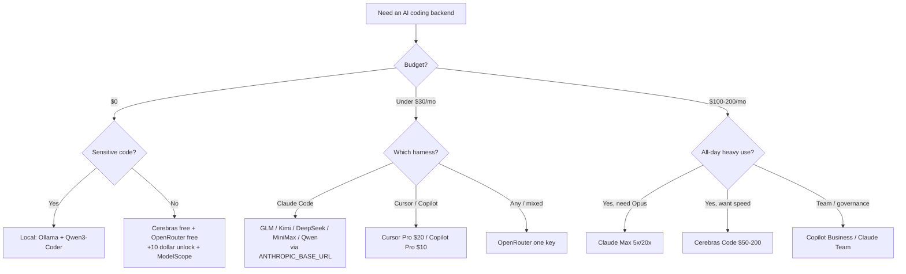

<div align="center">

# 🤖 Awesome AI Coding Subscriptions & APIs

### 优秀的 AI 编程订阅与 API 大全

[](https://awesome.re)
[](LICENSE)
[](CONTRIBUTING.md)

[](https://github.com/lildebil0/awesome-ai-coding-subscriptions/stargazers)

**该给你的 AI 编程 agent 配上哪种订阅、编程套餐、API、路由器或免费额度？**
一份精选、跑过基准、附带来源链接的答案 —— 按 💵 价格 · 🧠 性能 · 🔢 模型数量 · 📊 限额 · 🔌 集成方式 排名。

[English](../README.md) · **简体中文** · [Español](README.es.md) · [Русский](README.ru.md) · [日本語](README.ja.md) · [Português](README.pt-BR.md) · [Français](README.fr.md) · [Deutsch](README.de.md) · [한국어](README.ko.md) · [हिन्दी](README.hi.md)

</div>

---

本清单收录的是**你要付费的套餐** —— 订阅、固定费率编程套餐、按量付费 API、路由器和免费额度 —— 而**不是**编程工具本身。承载它们的 harness（Claude Code、Cline、Aider、Roo/Kilo、OpenCode）都是免费的。真正花钱的是背后的模型，所以排名排的就是模型。harness 只是*集成的目标*。

把一个来自中国开源权重实验室（GLM、Kimi、DeepSeek、MiniMax、Qwen、Doubao）每月 3–30 美元的固定费率套餐，接到一个免费 CLI harness 上，你能在 SWE-bench 上拿到大约 78–80% 的成绩，而花费只有 200 美元前沿订阅的十分之一左右。前沿订阅在最难的任务上仍然胜出。所以 2026 年大多数人两者都用：一份前沿订阅做艰深推理，一份便宜套餐处理其余一切。

> ⚠️ **这个领域的定价每月都在变。** 数字反映的是**约 2026 年 6 月**的情况。购买前请务必到官方页面核对。发现价格过期了？[提个 PR](CONTRIBUTING.md) —— 修正和新增同样宝贵。

## 图例

| 徽章 | 含义 |
|-------|---------|
| 💎 | **隐藏宝藏** —— 知名度不高，论性价比要价偏低 |
| 🆓 | 有一个**真能跑 agent**的免费额度 |
| ✅ | **价格已对照官方来源核实**（2026 年 6 月） |
| ⭐ | 价值评分（1–5）：价格 vs 性能 vs 限额 vs 集成 |
| 🇨🇳 | 中国托管（对部分人有数据驻留 / 延迟方面的注意事项） |
| ⚠️ | 存在明显风险（服务条款、可靠性、存续性、转售） |

**集成方式简写：** `CC-native` = 原生 Anthropic 兼容端点，通过 `ANTHROPIC_BASE_URL` 即可无缝接入 Claude Code 后端。`OpenAI-compat` = 换个 base-URL 就能在 Cline/Roo/Kilo/Aider/Continue/OpenCode 中使用（Claude Code 需要加一层 shim/router）。`native-only` = 锁定在厂商自家的编辑器/agent 上，无法当作后端复用。

## 目录

- [如何选择](#如何选择)
- [按预算挑选](#按预算挑选)
- [按你的身份挑选](#按你的身份挑选)
- [TL;DR —— 按使用场景的首选](#tldr--按使用场景的首选)
- [总对比表](#总对比表)
- [一方前沿订阅](#一方前沿订阅)
- [捆绑式工具订阅（编辑器 + 模型）](#捆绑式工具订阅编辑器--模型)
- [固定费率编程套餐 —— 价值之王 💎](#固定费率编程套餐--价值之王-)
- [按量付费的高性价比 API](#按量付费的高性价比-api)
- [速度 / 高速推理提供商](#速度--高速推理提供商)
- [路由器与网关](#路由器与网关)
- [更多值得了解的提供商（2026）](#更多值得了解的提供商2026)
- [免费额度 🆓](#免费额度-)
- [免费额度与学生 / 创业计划](#免费额度与学生--创业计划)
- [小众与专项](#小众与专项)
- [应用构建器与自主 agent](#应用构建器与自主-agent)
- [隐藏宝藏与转售代理 ⚠️](#隐藏宝藏与转售代理-)
- [配置手册 —— 把便宜套餐接进你的 harness](#配置手册--把便宜套餐接进你的-harness)
- [隐私与数据驻留矩阵](#隐私与数据驻留矩阵)
- [每美元能买到的基准分](#每美元能买到的基准分)
- [花钱陷阱与常见错误](#花钱陷阱与常见错误)
- [2026 定价时间线](#2026-定价时间线)
- [社区到底怎么说](#社区到底怎么说)
- [自托管与混合方案（当订阅不是答案时）](#自托管与混合方案当订阅不是答案时)
- [常见问题](#常见问题)
- [术语表](#术语表)
- [本清单如何评分与维护](#本清单如何评分与维护)
- [注意事项与免责声明](#注意事项与免责声明)
- [参与贡献](#参与贡献)
- [许可证](#许可证)
- [⭐ Star 历史](#-star-历史)

---

## 如何选择

从五个维度给每个套餐打分：

1. **💵 价格** —— 标价，以及*真实*的有效成本（额度换算比、高峰倍率、超额费用）。
2. **🧠 性能** —— 模型质量；价值档大致聚集在 SWE-bench Verified 的 78–80%，前沿档在 85–89%。
3. **🔢 模型数量** —— 一份套餐能复用多个模型（Qwen 编程套餐、OpenRouter）可以对冲模型迭代换代的风险。
4. **📊 限额** —— 每 5 小时窗口的请求/token 数、每周上限、并发数。隐藏成本：一次 IDE 里的「prompt」会扇出成 **5–30 次模型调用**，所以宣传的「每 5 小时 prompt 数」比看上去要虚。
5. **🔌 集成** —— 它是暴露一个**原生 Anthropic 端点**（干净的 Claude Code 直插），还是只有 OpenAI-compat（需要路由器）？又或者是 native-only（无法复用）？

**决策捷径：**

- 想要**最佳 agent、最简单路径** → Claude Pro $20 → Max 5x $100。
- 想要**每一美元能写最多代码** → 在 Claude Code 上跑一份固定费率套餐（GLM / MiniMax / Qwen / Kimi）。
- 想要 **$0** → Cerebras 免费 + OpenRouter 免费（+$10 解锁）+ NVIDIA NIM，把硬任务升级给付费模型。
- 想要**一把钥匙搞定一切** → OpenRouter。
- 想要**隐私（不要中国托管）** → Synthetic.new（美国、不训练、14 天删除）或一方美国订阅。



---

## 按预算挑选

别陷入分析瘫痪。找到你每月的数字，拿走对应的组合。

| 预算 | 最佳选择 | 你得到什么 | 最聪明的组合 |
|---|---|---|---|
| **$0** 🆓 | **GitHub Copilot Free** + **Gemini CLI** | Copilot 提供 2,000 次补全 + 每月 50 次高级请求；Google 提供一个慷慨的 agentic CLI | IDE 里用 Copilot Free 做自动补全，终端里用 Gemini CLI 跑 agent，[Cursor Hobby](https://cursor.com/pricing) 作为第三桶免费的 Tab 补全 |
| **< $10/月** | **GLM Coding Plan Lite** 💎（$30/季 ≈ $10/月） | 约 3× Claude Pro 的用量；一个[原生 Anthropic 兼容端点](https://docs.z.ai/guides/overview/pricing) —— 直接插进 Claude Code、Cline 或 OpenCode | 用 GLM Lite 作为你的 Claude Code 驱动 + 在上面叠一层免费额度兜底 |
| **~$10/月** | **GitHub Copilot Pro**（$10） | 无限补全、$10 的 AI Credits、agent 模式、模型选择器 —— [2026 年 6 月转为按量计费 credits](https://github.blog/news-insights/company-news/github-copilot-is-moving-to-usage-based-billing/) | IDE 里用 Copilot Pro + 终端里用 GLM Lite —— 共约 $20 拿到两个近前沿驱动 |
| **~$20/月** | **Claude Pro**（$20）*或* **Cursor Pro**（$20） | Pro：终端/网页/桌面里的 Claude Code，[Sonnet 4.6 + Opus 4.6](https://claude.com/pricing)。Cursor：无限 Tab + $20 的 agent 用量 + Background Agents | Claude Pro（最强裸 agent）+ Copilot Free 做行内自动补全；或者你只活在一个编辑器里就单独用 Cursor Pro |
| **~$50/月** | **Copilot Pro+**（$39）*或* **GLM Pro**（$90/季 ≈ $30）**+ Claude Pro**（$20） | Pro+：$39 的 AI Credits + 顶级模型。这套组合：从 GLM 拿约 15× Claude Pro 的用量，*加上*处理硬任务时的原生 Anthropic 质量 | GLM Pro 做高强度量产，Claude Pro 留给棘手推理 —— 全表最佳每吞吐量价格 |
| **~$100/月** | **Claude Max 5x**（$100） | 5× Pro 用量、优先体验最新模型 —— 对每天都撞上 Pro 限额的开发者来说是甜点档（[Max 套餐](https://support.claude.com/en/articles/11049741-what-is-the-max-plan)） | 用 Max 5x 当主力 + 用 GLM Lite（$10）做便宜的溢出通道，当你烧光 5x 上限时顶上 |
| **~$200/月** | **Claude Max 20x**（$200）*或* **Cursor Ultra**（$200） | Max 20x：20× Pro，个人最高档。[Cursor Ultra](https://cursor.com/pricing)：20× 用量 + 全功能 IDE 里的优先功能 | Max 20x 给终端优先的高强度用户；只有当你想要第二家厂商的模型做多样性/冗余时，才加上 Copilot Pro（$10） |

**经验法则**
- **预算 $20 以下且对价格敏感？** GLM Lite 是当下编程领域最划算的一美元 —— 它讲 Anthropic 的 API，所以你的 Claude Code 肌肉记忆可以直接迁移。
- **一个工具，用一整天？** 付一份原生订阅（Claude Pro、Cursor Pro）。别东拼西凑。
- **重度日常用户？** 直接跳到 Max 5x —— 它比叠两份 $50 套餐还便宜，而且省心得多。
- **每个档位的专业打法：** 一个高端驱动处理硬问题 + 一个便宜/免费通道处理批量编辑和自动补全。你很少需要两份 $20+ 的订阅。

> 价格于 2026 年 6 月核实。按季计费的套餐（GLM）以等效月费展示。Copilot 和 GitHub 套餐已于 [2026 年 6 月 1 日转为按量计费 AI Credits](https://github.blog/news-insights/company-news/github-copilot-is-moving-to-usage-based-billing/) —— 你的配额随基础价格而定。


---

## 按你的身份挑选

别再盯着矩阵发呆了。找到你的那一行，照抄选择，继续干活。价格为美元/月，除非另有说明，均为个人档（2026 年 6 月）。

| 你是…… | 最佳选择 | 为什么适合你 | ~价格 |
|---|---|---|---|
| **单干的独立开发者** 💎 | **Claude Pro** + 一把 Z.ai/DeepSeek API key 兜底 | 一份 $20 订阅就覆盖了终端里的 Claude Code；当你冲刺到一半撞上 5 小时上限，回落到便宜的价值 API，而不是跳到一个你用不满的 $100 档。对一个每天出活的人来说，这是最佳的每产出价格。 | $20 + 几个钢镚 |
| **创业工程团队（2–20 人）** | **GitHub Copilot Business** | $19/席位换来组织策略、公共代码过滤、**IP 赔偿担保**和集中账单 —— 是最便宜的、能放心摆在投资人/客户面前的套餐。可以和每个开发者自己的 Claude/Cursor 订阅搭配处理重活。[定价](https://github.com/features/copilot/plans) | $19/席位 |
| **企业**（治理 / SSO / IP） | **Copilot Enterprise** 或 **Claude Enterprise** | Copilot Enterprise（$39/席位）加上 SSO/SCIM、审计日志、按代码库索引的知识库，以及同样的微软「IP 赔偿 + 过滤」。如果你以 Anthropic 为主，Claude Enterprise（销售报价）是替代方案。两者都能过采购流程。[Copilot Enterprise](https://docs.github.com/en/copilot/get-started/plans) | $39/席位 → 定制 |
| **计算机系学生** 🆓 | **GitHub Copilot（学生版）** + ChatGPT Free | 通过认证的学生可**免费获得 Pro 级别的 Copilot**（无限补全、高级模型、每月高级请求额度）。零花费，真工具。[Copilot 套餐](https://github.com/features/copilot/plans) | $0 |
| **开源维护者** 🆓 | **OSS 免费 Copilot Pro** + Claude Pro 做深度工作 | 热门仓库的维护者有资格免费用 Copilot Pro；再留一份 $20 的 Claude Pro 应对棘手重构。最佳的公益产出对成本比。 | $0–$20 |
| **隐私优先 / 受监管** 🔒 | **本地栈：Ollama + Qwen3-Coder + Continue.dev** | 专有代码绝不离开机器 —— 没有 API、没有保留条款、没有要谈的 DPA。单文件任务上大约能达到云端 Claude 质量的 70–85%。如果你必须上云，加一个**零保留**的 API 档。[配置](https://medium.com/@rodrigo.estrada/build-a-local-ai-coding-assistant-qwen3-ollama-continue-dev-cee0dbcd172a) | $0（硬件） |
| **离线 / 物理隔离** | **Ollama + Qwen3-Coder-Next**（Continue.dev 或 OpenCode） | 同一套本地栈，但这是*唯一*拔掉网线还能用的类别。Qwen3-Coder-Next 从一个 80B MoE 里激活约 3B 参数 —— 真实硬件就能跑，永远不用联网。[模型](https://localaimaster.com/models/best-local-ai-coding-models) | $0 |
| **氛围编程者 / 业余爱好者** 🆓 | **免费额度试吃**：ChatGPT Free 或 Copilot Free + Gemini 免费 | 周末为了乐子写代码 —— 别花一分钱。Copilot Free 每月 2,000 次补全加一个聊天模型就够休闲的副业项目。等免费限额真的咬到你再升级。 | $0 |
| **跑并行 agent 的高级用户** 💎 | **Claude Max 20x**（或叠一份价值 API 做扇出） | 如果你编排 swarm / 并行 Claude Code 会话，20x 的用量天花板正是阻止你下午两点撞墙的东西。在这个量级下，比烧等量 API token 便宜。给一次性的工蜂 agent 加一把 DeepSeek/Z.ai key。 | $200 |

**两条跨场景的经验法则：**
- 从 **$20 → $100/$200** 的跳跃，只有当你*个人*每周撞上用量上限超过约两次时才划算。大多数人撞不到 —— 升级前先记录一下。
- **IP 赔偿担保是套餐功能，不是模型功能。** 它从 Copilot **Business** 起步，且需要开启公共代码过滤 —— 免费档和 Pro 档不带这个。如果将来会有律师读你的仓库，这就是关键那条线。[详情](https://github.com/features/copilot/plans)

来源：
- [GitHub Copilot 套餐与定价](https://github.com/features/copilot/plans)
- [GitHub Copilot 套餐 —— GitHub Docs](https://docs.github.com/en/copilot/get-started/plans)
- [2026 AI 定价对比 —— AIViewer](https://aiviewer.ai/guides/ai-pricing-comparison-2026/)
- [搭建本地 AI 编程助手 —— Qwen3 + Ollama + Continue.dev](https://medium.com/@rodrigo.estrada/build-a-local-ai-coding-assistant-qwen3-ollama-continue-dev-cee0dbcd172a)
- [Ollama 上最佳本地 AI 编程模型（2026）](https://localaimaster.com/models/best-local-ai-coding-models)


---

## TL;DR —— 按使用场景的首选

| 使用场景 | 选择 | 为什么 | ~价格 |
|----------|------|-----|--------|
| 🏆 **综合性价比最佳** | **GLM Coding Plan** 💎🇨🇳 | 「约 $30/月拿到 3× Claude Max 用量」；GLM-5.1 编程能力约为 Opus 的 94%；原生 Claude Code | $10–30/月 |
| 🥇 **最强裸前沿** | **Claude Max 5x** | 在 Claude Code 里解锁 Opus，公认第一的 agent | $100/月 |
| 🪙 **最便宜的认真入门** | **GLM Lite** / **Qwen Standard** / **Trae Lite** 💎 | 约 $3–10/月就有一个真正的编程后端 | $3–10/月 |
| 💸 **每 token 最便宜** | **DeepSeek V4-Flash** 💎 | $0.14/M 输入、$0.0028/M 缓存命中、1M 上下文、CC-native | 按量 |
| 🧪 **最佳免费** | **Cerebras 免费** 🆓 + **OpenRouter :free** 🆓 | 1M token/天（快）+ Qwen3-Coder-480B 免费 | $0 |
| ⚡ **最佳快+便宜** | **Groq** 💎🆓 / **Cerebras Code** | 原生 Anthropic 端点（Groq）；约 2000 tok/s 固定费率（Cerebras） | 免费 / $50/月 |
| 🔀 **最佳通用路由器** | **OpenRouter** | 315+ 模型、一把 key、Anthropic 外皮、无 token 加价 | 按量 +5.5% |
| 🔒 **最佳隐私（美国托管）** | **Synthetic.new** 💎 | 美国基础设施、不训练、14 天删除、OpenAI+Anthropic 双兼容 | $20–60/月 |
| 🧰 **大型代码库最佳** | **Augment Code** ✅ | 同类最佳的单仓库（monorepo）上下文引擎 | $20+/月 |
| 🏢 **团队最佳性价比** | **Claude Team Premium 席位** 💎 | ≈ Max-5x 用量 + SSO/管理 | $100/席位 |


---

## 总对比表

大致按价值排序。价格约为 2026 年 6 月；**购买前请核实**。

| 套餐 | 类型 | 价格 | 模型 | 限额（编程） | 集成 | ⭐ | 备注 |
|------|------|-------|--------|-----------------|-------------|----|-------|
| [GLM Coding Plan](#glm-coding-plan--zaizhipu-ai-) | 固定费率 | $10–30/月（Lite/Pro，按季） | GLM-5.1/5/4.7 | Lite ~80、Pro ~400 prompts/5h | CC-native | ⭐5 | 💎🇨🇳✅ |
| [DeepSeek API](#deepseek-) | 按量 API | V4-Pro $0.435/$0.87；Flash $0.14/$0.28 | V4-Pro/Flash | 1M 上下文、500–2500 并发 | CC-native | ⭐5 | 💎🇨🇳✅ |
| [MiniMax Coding Plan](#minimax-codingtoken-plan-) | 固定费率 | $10–50/月 | M2.7（套餐）、M2.5/M3（API） | Starter ~100、Max ~1000 prompts/5h | CC-native | ⭐5 | 💎🇨🇳 |
| [Kimi Code](#kimi-code--moonshot-ai-) | 固定费率+API | ~$19/月 + 计量 | K2.6（1T） | ~300–1200 调用/5h、30 并发 | CC-native | ⭐5 | 💎🇨🇳 |
| [Qwen Cloud Coding Plan](#qwen-cloud-coding-plan--alibaba-) | 固定费率 | Pro $50/月（Lite $10，已关闭） | Qwen3.5 + Kimi/GLM/MiniMax | Pro 6000 req/5h、1M 上下文 | CC-native | ⭐4 | 💎🇨🇳✅ |
| [OpenRouter](#openrouter-2) | 路由器 | 按量、充值 +5.5% | 315+（全都有） | 受余额约束；免费模型 50–1000/天 | CC-native 外皮 | ⭐5 | 🆓 |
| [Claude Pro](#anthropicclaude) | 一方 | $20/月 | Sonnet 4.6（无 Opus） | ~40–45 msg/5h + 每周 | CC-native | ⭐5 | 最佳入门 |
| [Claude Max 5x](#anthropicclaude) | 一方 | $100/月 | + Opus 4.6/4.7 | ~50–225 prompts/5h | CC-native | ⭐5 | 解锁 Opus |
| [Cerebras Code](#cerebras-2) | 固定费率速度 | $50/$200 | GLM-4.7（~2000 tok/s） | 24M–120M tok/天、131k 上下文 | OpenAI-compat | ⭐5 | ✅ 经常售罄 |
| [Synthetic.new](#开源权重固定费率订阅隐私--美国托管) | 固定费率（美国） | $20–60/月 | 16 个开源权重（GLM/Kimi/Qwen/DS） | ~125–1250 req/5h | CC-native | ⭐5 | 💎🔒 |
| [Chutes](#hidden-gems--reseller-proxies-) | 固定费率 ⚠️ | $3/$10/$20 | GLM-5/Kimi/DS/MiniMax/Qwen | 300/2000/5000 req/天 | OpenAI-compat | ⭐5 | 💎⚠️ 去中心化 ✅ |
| [Grok Code Fast 1](#小众与专项) | 按量 API | $0.20/$1.50/M | grok-code-fast-1 | 256K 上下文、~92 tok/s | CC-native | ⭐5 | 💎 OpenRouter 用量第一 |
| [ChatGPT Plus](#openaichatgpt--codex) | 一方 | $20/月 | GPT-5.x-Codex | 按 token-credit 计量 | Codex-native | ⭐4 | Codex 第二名 agent |
| [ChatGPT Pro](#openaichatgpt--codex) | 一方 | $100/$200（5x/20x） | GPT-5.5-Codex | 高；专用 GPU | Codex-native | ⭐4 | |
| [Claude Max 20x](#anthropicclaude) | 一方 | $200/月 | Opus 4.6/4.7 | ~200–900 prompts/5h | CC-native | ⭐4 | 强力档 |
| [Cursor Pro / Ultra](#cursor) | 捆绑 | $20 / $200 | 全部前沿 + Auto | $20 / $400 用量池 | Native-only | ⭐4 | Ultra = 2× 额度换算比 |
| [GitHub Copilot Pro](#github-copilot) | 捆绑 | $10/月 | GPT-5/Claude/Gemini | $10 AI-credits（按量） | Native-only（+ACP） | ⭐4 | 免费补全 🆓 |
| [DeepInfra](#deepinfra) | 速度/API | 按量（最便宜 OSS） | Kimi/DS/Qwen3-Coder/GLM | 受余额约束 | CC-native | ⭐5 | 💎✅ 最便宜托管 |
| [Groq](#groq) | 速度/API | 按量 + 免费 | GPT-OSS/Qwen3/Kimi | 免费 RPM/TPM 上限 | CC-native | ⭐4 | 💎🆓 |
| [Vercel AI Gateway](#vercel-ai-gateway) | 路由器 | $0 加价（连 BYOK 也是） | 上百个含 Claude | $5/月免费额度 | CC-native | ⭐4 | 💎🆓✅ |
| [Requesty](#requesty) | 路由器 | 统一 +5% | Claude/GPT/Gemini/DS/Qwen | 语义缓存约省 40% | OpenAI-compat | ⭐4 | 💎 团队治理 |
| [Mistral Le Chat Pro](#mistral) | 一方 | $14.99/月（学生 $5.99） | Devstral 2 + Vibe CLI | ~25 条免费消息/天 | Native-only | ⭐4 | 💎🆓🇪🇺 最便宜的主流订阅 |
| [Augment Code](#捆绑式工具订阅编辑器--模型) | 捆绑 | $20–200/月 | Claude/Gemini/GPT | 40k–450k credits/月 | Native-only | ⭐4 | ✅ 最佳大仓库上下文 |
| [Zed Pro](#捆绑式工具订阅编辑器--模型) | 捆绑 | $10/月 | 任意（自带 key/ACP） | $5 credits + 按量 | ACP + BYOK | ⭐4 | 💎 反锁定 |
| [Cerebras free](#免费额度-) | 免费 | $0 | Qwen3-Coder-480B、GPT-OSS-120B | 1M tok/天、8K 上下文上限 | OpenAI-compat | ⭐5 | 💎🆓 最快的免费 |
| [Google AI Studio](#免费额度-) | 免费 | $0 | Gemini 2.5 Flash、Gemma 3 27B | Flash 250 RPD；Gemma 14.4k RPD | OpenAI-compat | ⭐4 | 🆓 最大的免费上下文 |


---

## 一方前沿订阅

直接来自厂商的套餐。订阅是通过登录来认证**厂商自家的 harness**（Claude Code、Codex CLI、Antigravity、Grok Build）—— 它**不会**给你一把通用 API key 供第三方 OpenAI-compat 工具使用（那是另算的、按 token 计费的）。例外：xAI Grok 模型是 OpenAI/Anthropic 兼容的。

> agentic 编程的价值排序（2026 年 6 月共识）：**Claude > OpenAI Codex > Google Gemini > xAI Grok**。一项独立的 30 天测试给出 Claude 约 95% vs ChatGPT 约 85% 的编程准确率；厂商 SWE-bench 显示 GPT-5.5（88.7%）≈ Opus 4.7（87.6%）。

### Anthropic（Claude）
- **[Claude Pro](https://claude.com/pricing)** —— `$20/月`（年付 $17）。Claude Code 里的 Sonnet 4.6（**无 Opus**）。~40–45 msg/5h + 每周上限，与 chat/Cowork 共享。**进入第一编程 agent 的最佳性价比入口。** 2026 年 4 月将 5 小时限额翻倍并移除了高峰限速。⭐5
- **[Claude Max 5x](https://support.claude.com/en/articles/11049741-what-is-the-max-plan)** —— `$100/月`。**解锁 Opus 4.6/4.7** + 5× 吞吐（~50–225 prompts/5h）。专业甜点档；一个 OpenAI/Google 都拿不出同等实用度的 $100 中间档。⭐5
- **[Claude Max 20x](https://support.claude.com/en/articles/11049741-what-is-the-max-plan)** —— `$200/月`。~200–900 prompts/5h。给整天跑并行 agent 的人；**固定费率胜过 API** 的算术是决定性的（90%+ 的 Claude Code token 是缓存读取，订阅免费、API 收费 —— 某开发者峰值月份 API 计费 $5,623 ≈ 4.5 年的 Max 5x）。⭐4
- **[Claude Team Premium 席位](https://claude.com/pricing)** 💎 —— `$100/席位`（年付）。≈ Max-5x 用量**外加** SSO/管理/审计/企业搜索。低调的最佳*团队*编程价值；$20 的 Standard 席位也含 Claude Code。⭐4

### OpenAI（ChatGPT / Codex）
- **[ChatGPT Plus](https://help.openai.com/en/articles/11369540-using-codex-with-your-chatgpt-plan)** —— `$20/月`。捆绑 Codex CLI/IDE（GPT-5.5/5.4/5.3-Codex）。自 2026 年 4 月起改为**按 token-credit 计量**（令人困惑）。Codex = 公认第二名 agent。Plus 在重度 agentic 工作上额度耗尽很快。⭐4
- **[ChatGPT Pro](https://developers.openai.com/codex/pricing)** —— `$100`（5x）/ `$200`（20x）。高吞吐 + 专用 GPU。注意 $100 档的「10x 加成」促销已于 **2026 年 5 月 31 日到期**（现为 5x）。经典的「$200 套餐值不值」之争 = Claude Max 20x vs ChatGPT Pro 20x。⭐4

### Google（Gemini）
- **[Gemini AI Pro / Ultra](https://gemini.google/subscriptions/)** —— 如果你用 Google Cloud，Ultra 捆绑的 GCP 额度（$100 档 $40 / $200 档 $100）能实打实地抵扣成本 💎。⚠️ **Google 将于 2026 年 6 月 18 日停掉开源的 Gemini CLI**，强制迁移到闭源的 Antigravity CLI，免费配额大幅降低（~1000 → ~20 req/天）—— 这是 2026 年社区最大的怨气来源。

### xAI（Grok）
- **[SuperGrok](https://x.ai/news/grok-code-fast-1)** —— `$10`（Lite）/ `$30` / `$300`（Heavy）。Grok Build CLI 能在**隔离的 git worktree 中跑 8 个并行子 agent**（新颖）。`grok-code-fast-1` 有一批死忠（又便宜又快），且在很多合作伙伴 IDE 里曾免费。SWE-bench ~70.8%，落后于领跑者。**做编程的话，买 [xAI API](#小众与专项)，别买 SuperGrok 应用订阅。** ⭐3 💎


---

## 捆绑式工具订阅（编辑器 + 模型）

这里套餐本身*就是*产品 —— 你买的是进入厂商编辑器/agent 的门票。2026 年的趋势：几乎所有都从固定请求数转向了 **credits / token 计量**，让成本*更不*可预测（招致大量吐槽）。

### Cursor
- **[Cursor](https://cursor.com/pricing)** —— Hobby 免费 · **Pro `$20`** · **Pro+ `$60`** 💎 · **Ultra `$200`**。自 2025 年 6 月起，你的套餐价 = 一个按 API 费率计的用量池。**额度换算比随档位提升而改善**：Pro $20/$20（1×）、Pro+ $60/$70（1.17×）、Ultra $200/$400（**2×，最佳**）。`Auto` 模式是价值关键 —— 实际上无限量，不像钉死 Claude/MAX 那样消耗池子。⚠️ 2025 年 6 月的切换引发了一场[定价灾难](https://www.wearefounders.uk/cursors-pricing-disaster-the-full-timeline-of-how-an-ai-coding-darling-burned-its-most-loyal-users/)（HN 用户：「一周超额 $350」）；CEO 道歉并退款。**Native-only** —— 不能给 Claude Code 当后端，而且截至 2026 年 1 月你也不能把 Claude 订阅路由*进* Cursor。同类最佳的 Tab/Apply。⭐4

### GitHub Copilot
- **[GitHub Copilot](https://github.com/features/copilot/plans)** —— Free 🆓 · **Pro `$10`** · Pro+ `$39` · Max `$100` · Business `$19` · Enterprise `$39`。⚠️ **2026 年 6 月 1 日转为按量计费 AI Credits**（1 credit = $0.01）；每档含一个 credit 池（Pro=$15、Pro+=$70）。**代码补全保持无限且免费** —— 只用补全的用户不受影响。吐槽很猛（TechTimes：agentic 账单暴涨 10×–50×）。同类最佳的 IDE 补全 + 面向组织的治理/IP 赔偿担保。**Native-only**（逃生口：Copilot CLI 讲 ACP）。⭐4

### 其他
- **[Augment Code](https://www.augmentcode.com/pricing)** ✅ —— Indie `$20`/40k credits · Standard `$60` · Max `$200`。面向大型单仓库的**同类最佳上下文引擎**（在上下文召回对比中居首）。VS Code + JetBrains + Auggie CLI。Native-only。工具密集型任务上的 credit 消耗是抱怨点。⭐4 💎
- **[Zed Pro](https://zed.dev/pricing)** 💎 —— Free · **Pro `$10`**（仅 +10% 加价）· Business `$30`。**反锁定**之选：开放的 [ACP](https://zed.dev/docs/ai/) 可驱动外部 agent（Claude Code、Codex、OpenCode），并为任意提供商自带 key。最快的原生编辑器。⭐4
- **[Kiro](https://kiro.dev/pricing/)** 💎 —— Free · **Pro `$20`/1k credits** · Pro+ `$40` · Power `$200`。最佳**规格驱动**（spec-driven）agent（需求→设计→任务），完整 Claude 阵容含 Opus 4.7，0.01-credit 的小数计费。**AWS Startups = 一年免费 Pro+。** ⭐4
- **[Trae](https://www.trae.ai/pricing)** 💎🇨🇳 —— Free · **Lite `$3`** · Pro `$10` · Ultra `$100`。字节跳动的 VS Code 分支；用量池超过标价（例如 $10 给 $20 用量）= 「$3 的 Cursor 替代品」。⚠️ 字节遥测数据与关联方共享 —— 企业级用户的劝退点。⭐4
- **[Sourcegraph Amp](https://sourcegraph.com/amp)** —— 免费起步（$10 额度；前 Cody 用户 $40）。纯**消费制**（无月度底价），在「smart」模式下跑 Opus 4.8。轻度使用很棒，重度有无上限烧钱风险。Cody Free/Pro 已并入 Amp 退役。⭐3
- **[JetBrains AI / Junie](https://www.jetbrains.com/ai-ides/buy/)** —— 备受喜爱的 IDE 集成，但 Junie **烧 credit 很快**（Ultimate 的 35 credits 约 4–5 天就没）。只在你活在 JetBrains 里时才用。
- **定价过高 / 避雷：** **Tabnine**（$39 起步、无免费档、年度锁定 —— 仅适合本地部署/物理隔离需求）；**Windsurf Pro**（2026 年 3 月改为每日/每周配额，是当年被吐槽最多的变动，被 Cognition 收购后信任度低）。**Supermaven** 作为独立产品已死（2025 年 11 月并入 Cursor Tab）。


---

## 固定费率编程套餐 —— 价值之王 💎

把一个近前沿的开源权重模型放到你 harness 后面的固定月费或季费套餐，多数来自中国实验室。大多暴露原生 Anthropic 端点，所以可通过 `ANTHROPIC_BASE_URL` 直插 Claude Code。端点清单见 [Alorse/cc-compatible-models](https://github.com/Alorse/cc-compatible-models)。

> 共识排序：**GLM**（最便宜入门、社区默认）· **MiniMax**（最佳价格/量）· **Kimi**（最佳长程 agent）· **Qwen**（>262K 上下文、多模型）。Claude Pro $20 是它们要超越的质量标杆。

<a name="glm-coding-plan-zai"></a>
### GLM Coding Plan —— Z.ai（智谱 AI） 💎🇨🇳 ✅
- `Lite ~$10/月（$30/季）` · `Pro ~$30/月（$90/季）` · `Max ~$80/月（$240/季）`。2026 Q2 促销：$27/$81/$216/季。（曾刷屏的 **$3/月** 促销已于 2026 年 2 月 11 日结束；年付 Lite 约 $7/月是仅剩的便宜路线。）
- 模型：**GLM-5.1**（编程约为 Opus 4.6 的 94%）、GLM-5/5-Turbo、GLM-4.7、GLM-4.5-Air。
- 限额：Lite ~80、Pro ~400、Max ~1,600 prompts/5h + 每周。⚠️ GLM-5/5.1 上有**高峰 3× 倍率**（14:00–18:00 UTC+8），悄悄把吞吐砍半。
- 集成：`ANTHROPIC_BASE_URL=https://api.z.ai/api/anthropic` —— 官方 Claude Code 支持 + Cline/Roo/Kilo/OpenCode（20+ 工具）。**一方** = 无转售封号风险。
- > *2026 年最被推荐的预算编程套餐。* 「约 $30/月拿到 3× Claude Max 用量。」对 2 月涨价 + 配额砍 ⅓ 有反弹，仍被评为顶级价值。⭐5
- 来源：[z.ai/subscribe](https://z.ai/subscribe) · [定价](https://docs.z.ai/guides/overview/pricing) · [GLM-5.1 评测](https://serenitiesai.com/articles/glm-5-1-coding-plan-review-2026)

<a name="minimax"></a>
### MiniMax Coding / Token Plan 💎🇨🇳
- `Starter $10/月` · `Plus $20` · `Max $50`（年付送 2 个月）；高速版 $40–150。
- 模型：套餐用 M2.7 / M2.7-Highspeed；**M2.5/M3**（1M 上下文）走 API。⚠️ **套餐经常提供比基准测过的 M2.5/M2.7 更老的模型**（M2.1）。
- 限额：Starter ~100 → Max ~1,000 prompts/5h；~50 TPS（高速 100）。
- 集成：`ANTHROPIC_BASE_URL=https://api.minimax.io/anthropic` + OpenAI-compat。
- > 「把我的 Claude Code 账单砍了一半。」固定费率档里**最佳裸价格/量**；M2.7 约为 GLM-5.1 的 94%，输入成本却约只有 1/5。⭐5
- 来源：[编程套餐](https://platform.minimax.io/subscribe/coding-plan) · [M2.5 定价](https://www.verdent.ai/guides/minimax-m2-5-pricing)

<a name="kimi-moonshot"></a>
### Kimi Code —— Moonshot AI 💎🇨🇳
- `~$19/月会员` + 计量 API（K2.6 输入 $0.60–0.95/M、输出 $2.50–4.00/M，75% 缓存折扣）。分 Moderato/Allegretto/Vivace 三档。
- 模型：**Kimi K2.6**（1T MoE，SWE-bench ~80.2%）、K2.5。
- 限额：~300–1,200 调用/5h、**30 并发**（对并行 agent 很慷慨）。
- 集成：`ANTHROPIC_BASE_URL=https://api.moonshot.ai/anthropic` —— 真正的 Claude Code 直插；自带 Kimi CLI（6.4k★）。
- > **最佳长程 agent 稳定性**（一次 13 小时会话里持续 4,000+ 次工具调用）。「省了 88% 编程成本。」开源同类里输入侧最贵。⭐5
- 来源：[agent 支持](https://platform.kimi.ai/docs/guide/agent-support) · [Kimi Code 指南](https://www.nxcode.io/resources/news/kimi-code-2026-plans-pricing-developer-guide)

<a name="qwen-alibaba"></a>
### Qwen Cloud Coding Plan —— 阿里巴巴 💎🇨🇳 ✅
- `Pro $50/月`（Lite ~$10 自 2026 年 3 月 20 日起**对新订阅关闭**）。
- 模型：Qwen3.5-Plus、Qwen3-Coder-Next/Plus/480B + 一把 key 下跨模型的 **Kimi/GLM/MiniMax**。**1M token 上下文**（本档最佳）。
- 限额：Pro 6,000 req/5h + 45k/周 + 90k/月（滑动窗口）。专用 `sk-sp-` key（与按量 key 不通用）。
- 集成：`ANTHROPIC_BASE_URL=https://coding-intl.dashscope.aliyuncs.com/apps/anthropic` + Qwen Code CLI。
- > 亮点 = **一份套餐复用 Qwen+Kimi+GLM+MiniMax**，且是唯一可信的 1M 上下文固定套餐。⭐4
- 来源：[Model Studio 编程套餐](https://www.alibabacloud.com/help/en/model-studio/coding-plan)

### 开源权重固定费率订阅（隐私 / 美国托管）
- **[Synthetic.new](https://synthetic.new/pricing)** 💎🔒 —— `$20–60/月`。约 16 个常驻开源权重模型（Kimi/GLM/Qwen3-Coder-480B/DeepSeek）。**美国基础设施、不训练、14 天删除。** **OpenAI + Anthropic 双兼容** = 真正的 Claude Code 直插。中国套餐的注重隐私替代品。⭐5
- **[Cerebras Code](#cerebras-2)** —— `$50`/`$200`，固定费率速度（见[速度](#速度--高速推理提供商)）。
- **[OpenCode Go（Zen）](https://opencode.ai/go)** 💎 —— `$5` 首月后 `$10/月` 固定。约 12–14 个中国开源权重模型（GLM-5.1/Kimi/Qwen3.7/DeepSeek V4/MiniMax）。在 OpenCode 里头等支持。无 Claude/GPT。⭐4

### 小众 / 廉价档固定套餐 🇨🇳
- **[StepFun Step Plan](https://github.com/Alorse/cc-compatible-models)** —— `$6.99`–`$99/月`，100–5,000 prompts/5h，CC-native。价格杀手，模型经受的实战检验较少。⭐3
- **MiMo（小米）** —— `$6`–`$100/月` 按 credit（60M–1.6B），CC-native（`api.xiaomimimo.com`），含多模态 Omni。几乎没跑过基准。⭐3
- **Atlas Cloud** 💎 —— `$10`/`$20`，每**天** 80 万–180 万 credits，OpenAI-compat（Claude Code/Codex/OpenCode）。面向自主 agent 的每日 credit 模式。⭐4
- **Factory Droid** 💎 —— 从 `$20/月` 起按 token，前沿模型（Claude/GPT/Gemini），滚动 5h/7d/30d 窗口。有个著名故事「我为了 Droid 取消了两份 $200 的 Max 套餐」。⭐4


---

## 按量付费的高性价比 API

来自价值实验室的按 token 访问。**缓存定价才是 agent 循环的真正成本驱动** —— 设计时要优先追求缓存命中，而不是看头条输入价。

<a name="deepseek"></a>
### DeepSeek 💎🇨🇳 ✅
- **V4-Pro** `输入 $0.435/M · 缓存命中 $0.0036/M · 输出 $0.87/M`（**75% 降价现已永久化**）。**V4-Flash** `$0.14 / $0.0028 / $0.28`。1M 上下文，384K 最大输出。
- 集成：OpenAI-compat **+ 原生 Anthropic**（`https://api.deepseek.com/anthropic`）—— 直插 Claude Code（`ANTHROPIC_MODEL=deepseek-v4-pro[1m]`）。
- > **每 token 成本冠军。** V4-Pro SWE-bench ~80.6% / LiveCodeBench 93.5%，输出 <$1/M。V4-Flash 的 $0.0028/M 缓存命中在批量循环里无可匹敌。⭐5
- 来源：[定价](https://api-docs.deepseek.com/quick_start/pricing) · [Claude Code 配置](https://api-docs.deepseek.com/quick_start/agent_integrations/claude_code)

### 其他
- **[阿里巴巴 Qwen3-Coder API](https://www.alibabacloud.com/help/en/model-studio/model-pricing)** 🇨🇳 —— 480B `$0.22/$1.00`、Flash `$0.195/$0.975`、30B-A3B `$0.07/$0.27`。**90 天内 100 万免费 token**（国际版）。CC-native。最强的开源权重 agentic 编程模型。用新加坡区域的 key。⭐4
- **[Moonshot Kimi API](https://platform.kimi.ai/docs/pricing)** 🇨🇳 —— K2.6 `$0.95/$4.00`（缓存 $0.16）、K2.5 `$0.60/$3.00`。CC-native。出色的工具调用；输出价是抱怨点。充值 $10 可移除每日上限。⭐4
- **[智谱 GLM API](https://docs.z.ai/guides/overview/pricing)** 🇨🇳 —— GLM-5.1 `$1.40/$4.40`、GLM-4.7 `$0.60/$2.20`、FlashX `$0.07/$0.40`。CC-native。多数爱好者会改买更便宜的[编程套餐](#glm-coding-plan--zaizhipu-ai-)。⭐4
- **[MiniMax API](https://platform.minimax.io/docs/guides/pricing-paygo)** 🇨🇳 ✅ —— M3 `$0.30/$1.20`（缓存 $0.06、**缓存写入免费**）、M2.5 ~`$0.15/$1.15`。「比 Opus 便宜 20×。」一方 Anthropic 兼容。⭐4


---

## 速度 / 高速推理提供商

开源权重模型的按 token 托管，为吞吐量优化。**Groq 是唯一带原生 Anthropic 端点的**（最干净的 Claude Code 直插）；其余都是 OpenAI-compat（CC 需要 shim/router，在 Cline/Roo/OpenCode 里原生）。

<a name="deepinfra"></a>
- **[DeepInfra](https://deepinfra.com/pricing)** 💎 ✅ —— **每 token 最便宜冠军。** DeepSeek V3.2 ~$0.26/$0.38、Kimi K2.6 $0.75/$3.50、Qwen3-Coder-480B $0.30/$1.00。90+ 模型、缓存折扣、**原生 Anthropic 端点**、无预付成本。速度不错但非顶级。⭐5
<a name="groq"></a>
- **[Groq](https://groq.com/pricing)** 💎🆓 —— LPU 速度（GPT-OSS-20B ~860 tok/s）。GPT-OSS-120B `$0.15/$0.60`、Kimi K2 `$1.00/$3.00`。**原生 Anthropic + OpenAI 兼容** + 真免费档。批处理+缓存可叠到约 25%。无 Qwen3-Coder-480B（天花板是 Qwen3-32B）。⭐4
<a name="cerebras"></a>
- **[Cerebras](https://www.cerebras.ai/pricing)** ✅ —— **最快**（~2,000–3,000 tok/s）。**Code Pro `$50`**（24M tok/天）/ **Max `$200`**（120M tok/天），GLM-4.7，131k 上下文。按量 GPT-OSS-120B `$0.35/$0.75`。⚠️ 经常**售罄**；131k 上下文（原生的一半）+ 高 TTFT 削弱了 agent 循环里的速度优势。⭐5 固定费率 / ⭐4 按量
- **[Together AI](https://www.together.ai/pricing)** —— 目录最广（Qwen3-Coder-480B、Kimi、DeepSeek V4 Pro $2.10/$4.40，缓存 $0.20）。价格居中，~89 tok/s。⭐4
- **[Fireworks AI](https://fireworks.ai/pricing)** —— 偏生产/企业，激进缓存（$0.15/M），DeepSeek V4-Flash $0.14/$0.28，有 Azure Foundry 路径。⭐4
- **[Novita](https://novita.ai/pricing)** 💎 —— 以接近 DeepInfra 的价格托管完整的 Qwen3-Coder 家族；低调的 OpenRouter 通道。⭐4
- **[Hyperbolic](https://docs.hyperbolic.xyz/docs/hyperbolic-ai-inference-pricing)** 💎 —— GPT-OSS-20B 混合 `$0.10/M`（全网最便宜之一）；托管 Qwen3-Coder-480B（FP8）。约 13 个模型。⭐3
- **SambaNova** —— 在巨型 671B/405B 模型上独具速度优势；永久免费 + $5 额度 🆓，但 50 req/天的上限 = 仅供评估。


---

## 路由器与网关

一把 key 横跨众多提供商。把路由器选作你的**默认访问层**。

<a name="openrouter"></a>
- **[OpenRouter](https://openrouter.ai/pricing)** 🆓 —— **公认的默认选择。** 315+ 模型、一把 key、**Anthropic 兼容「外皮」**（`ANTHROPIC_BASE_URL=https://openrouter.ai/api` = 真正的 Claude Code 直插）、**无 token 价格加价**（仅充值时 +5.5%）、免费 ZDR + 花费上限、慷慨的 BYOK（1M 免费 req/月）。免费模型（Qwen3-Coder-480B、DeepSeek、Llama 4）：50 RPD →**一次性充值 $10 后永久 1000 RPD**。5.5% 的费用只在每月花费约 $5k 以上时才肉疼。⭐5
<a name="requesty"></a>
- **[Requesty](https://www.requesty.ai/)** 💎 —— **统一 5% 加价**，含全部功能，包括**语义缓存**（约省 40%，胜过仅完全相同才命中的缓存）+ 按请求的智能路由 + **按 agent 的模型策略**（按分类器/合成器角色用不同模型）+ SOC 2 Type II。团队治理之选。OpenAI-compat。⭐4
<a name="vercel-ai-gateway"></a>
- **[Vercel AI Gateway](https://vercel.com/docs/ai-gateway/pricing)** 💎🆓 ✅ —— **零加价，连 BYOK 都是。** 原生 Anthropic 兼容（`https://ai-gateway.vercel.sh`）= 直接 Claude Code + Claude Agent SDK + 「通过 Gateway 用 Claude Code Max」。$5/月免费额度无限刷新（一旦你充值就停止）。最佳纯经济性之选，尤其在 Vercel 生态里。⭐4
- **[Helicone Gateway](https://helicone.ai/pricing)** 🆓 —— 可观测性优先（自动日志/追踪/成本）、零加价、免费 10k req/月；订阅 $79/$799。⭐3
- **[CometAPI](https://www.cometapi.com/)** —— 500+ 模型含最新专有模型，比官方便宜约 20–40%，**OpenAI+Anthropic 双兼容**。预付额度中间商风险。⭐4
- **[ElectronHub](https://www.electronhub.ai/pricing)** —— 600+ 模型，每周额度可超过现金成本；廉价档有紧的 5–10 RPM 限制，转售信任注意事项。⭐3
- **[LiteLLM](https://docs.litellm.ai/)** —— 开源**自托管**标准（免费、无加价）—— 见[集成技巧](#把便宜套餐接进你的-harness)。需自己搭建基础设施，非开箱即用。⭐4


---

## 更多值得了解的提供商（2026）

一些确实有用、虽未在主章节上头条但填补真实空白的条目 —— 额外的中国实验室与聚合商、西方编程工具，以及 OpenRouter 之外的路由器。分组并折叠，让清单保持可速览。

<details>
<summary><b>🇨🇳 中国聚合商与实验室</b>（便宜 token，多家带原生 Anthropic 端点）</summary>

- **[SiliconFlow](https://www.siliconflow.com/pricing)** 💎 —— 中国最大的独立 MaaS 路由器之一，200+ 模型，**原生 Anthropic 端点**（罕见），所以 Claude Code 可直指便宜的 DeepSeek/Qwen/GLM/Kimi。国际（.com）+ 中国（.cn）端点。DeepSeek-V4-Flash ~$0.14/$0.28。
- **[PPIO](https://ppio.com/llm-api)** 💎 —— 以人民币计价、跑在**自家 GPU 云**上的路由器；Qwen3-Coder-Next ≈¥1.4/¥10.5、DeepSeek-V4-Flash ¥1/¥2 —— 全网最低 token 价之一。OpenAI-compat（Claude Code 需桥接）。
- **[火山引擎方舟 / BytePlus](https://www.volcengine.com/docs/82379/1949118)** 💎（字节跳动豆包）—— 固定的**豆包编程套餐**：通过 BytePlus（可用境外卡支付的对外品牌）Lite **$10**/Pro **$50**。**Doubao-Seed-Code** 原生 Anthropic 兼容，编程上逼近 Claude Sonnet；捆绑一个 Claude-Code 风格的「ArkClaw」agent。豆包 API 底价：`doubao-seed-1.6-flash` 输入 $0.022/M。
- **[阿里百炼多模型编程套餐](https://www.alibabacloud.com/help/en/model-studio/coding-plan)** 💎 —— **$50/月 Pro**，一份订阅下复用 **Qwen3-Coder + Kimi-K2.5 + GLM-5 + MiniMax-M2.5**，带**原生 Anthropic 端点** + 新加坡区域（无需中国身份证）。⚠️ 需要专用 `sk-sp-` key —— 普通 key 会悄悄按 5× PAYG 计费。
- **[ModelScope](https://modelscope.cn/)** 🆓💎（阿里巴巴）—— **每天 2,000 次免费 API 调用、无需绑卡**，含 Qwen3-Coder-480B。在 Qwen 的 OAuth 免费档关闭后，这是事实上用 $0 在 agent 循环里跑一个前沿中国编程模型的方式。
- **[AiHubMix](https://docs.aihubmix.com/en)** 💎 —— 中国的统一路由器，暴露 OpenAI、Gemini **以及 Anthropic** 兼容端点，带头等的 Claude Code 文档；一把 key 横跨 DeepSeek/Qwen/GLM/Kimi 及中转的 Claude。
- **[302.AI](https://302.ai/)** 💎 —— 预付、**无 TPM 限速**（适合突发型 agent），一个余额横跨 Kimi/Qwen/DeepSeek + GPT/Claude，提供私有部署选项。
- **大厂完整性补全：** **[百度文心](https://pricepertoken.com/pricing-page/model/baidu-ernie-4.5-21b-a3b)**（千帆；ERNIE 4.5 21B-A3B $0.07/$0.28）、**[腾讯混元](https://pricepertoken.com/pricing-page/provider/tencent)**（HY3 Preview ~$0.063/$0.21 —— 但腾讯*上调*了部分价格）、**[讯飞星火](https://lobehub.com/docs/usage/providers/spark)**（免费 Lite 档 + 专用 Spark Code）、**[商汤 SenseNova](https://www.sensetime.com/en)**（便宜的多模态 MoE）。全部 OpenAI-compat；Claude Code 需桥接；多数直接注册需要中国身份证（可经中转/302.AI 触达）。
- ⚠️ **中国直连中转**（云雾、SSSAiCode 类）以便宜价格转售前沿 Claude/GPT，无需 VPN —— 在中国境内很方便，但带有标准的[转售代理风险](#隐藏宝藏与转售代理-)。当作热钱包对待。

</details>

<details>
<summary><b>🛠️ 带订阅的西方编程工具</b></summary>

- **[Refact.ai](https://refact.ai/)** 💎 —— **$10/月**，最便宜的 agentic 编程订阅；开源、**完全可自托管的自主 agent**，支持本地微调、零遥测。免费档 = 每月 5,000 coins + 无限补全。
- **[Pieces for Developers](https://pieces.app/)** 💎 —— Pro **年付 $14.17/月** = IDE 内无限用 Opus 4 / GPT-5 / Gemini 2.5（比单个 Claude Pro 席位还便宜）。其差异化在于跨所有工具的长期**记忆/上下文层**，而非代码生成。免费档无限跑本地模型。
- **[Continue](https://www.continue.dev/pricing)** 💎 —— 开源 IDE agent + **Continue Hub** 模型商店：前沿模型 **$3/M token**，Team **$20/席位**（+$10 credits），含共享配置/治理。也支持 BYOK。
- **[Cline](https://cline.bot/pricing)** —— 参考级开源 agent；**零加价 BYOK**（30+ 提供商），典型实际花费 $25–70/月。Teams 套餐：前 **10 席位永久免费**，之后 $20/席位。
- **[Kilo Code](https://kilo.ai/)** —— 持续维护的 **Roo Code 继任者**（Roo 已于 2026 年 5 月 15 日归档）。零加价 BYOK 横跨 500+ 模型；可选的 **Kilo Pass** 预付额度年付有 +50% 奖励。
- **[Goose](https://github.com/aaif-goose/goose)** 💎（Block / Linux 基金会）—— 免费的开源 agent，可通过 SDK 提供商**搭乘你现有的 Claude Max / ChatGPT / Copilot 订阅**做固定费率推理 —— 与 `copilot-api` / `claude-code-router` 同样的「自带订阅」桥接模式。
- **[Zencoder](https://zencoder.ai/pricing)** —— SOC2 企业 agent、多 agent 编排、「每档都含全部功能」；Pro $45/席位（30k credits）→ Pro Max $195（180k）。
- **[Tabby](https://www.tabbyml.com/pricing)** 💎 —— 领先的**开源可自托管**补全/聊天服务器（免费，约 $5–15/月 GPU）；Cloud Team $24/席位；新出的 **Pochi** 自主 agent。OpenAI-compat 端点可在任意 harness 中使用。

</details>

<details>
<summary><b>🔀 更多路由器与网关</b></summary>

- **[Portkey](https://portkey.ai/pricing)** 💎 —— 多数清单都漏掉的最具生产级别的路由器：内置**护栏、虚拟 key、预算上限**（主打给失控的 agentic 花费封顶）、OpenAI **和 Anthropic** 兼容、完全**开源可自托管**网关。免费 10K 日志/月；Pro 从 $49 起。
- **[Cloudflare AI Gateway](https://developers.cloudflare.com/ai-gateway/)** 💎 —— 近零成本的通用代理（缓存/分析/回退、**无 token 加价**）；免费 100K 日志/月。2026 年 6 月的 xAI Grok 合作 + 统一账单让它成为单发票的控制面。Anthropic 透传对 Claude Code 可用。
- **[Poe API](https://creator.poe.com/)** 💎（Quora）—— 一个消费级聊天订阅，其**算力点数兼作多提供商编程 API**：一份 **$19.99/月** 套餐横跨 Claude + GPT-5.x + Gemini，通常比直连便宜 10–30%。**OpenAI 和 Anthropic** 兼容。
- **[Glama](https://glama.ai/ai/gateway)** 💎 —— OpenAI-compat 网关**外加最大的 MCP 服务器注册表/托管** —— 当 MCP 工具服务器与模型访问同等重要时，它独具相关性。捆绑 credit 的订阅。
- **[Unify](https://unify.ai/)** 💎 —— 一个**质量预测型**「神经路由器」，在调用*之前*给预期输出质量打分并命中成本/延迟目标；$100 免费额度；经虚拟 key BYOK。
- **[Martian](https://withmartian.com/)** —— 专门的按请求**成本/质量路由器**，带最高成本和愿付价格旋钮（号称省 20–97%）；Free 2,500 req，Developer $20/月。
- **[Braintrust Gateway](https://www.braintrust.dev/)** 💎 —— 把路由与 **eval + 追踪 + 缓存**结合；OpenAI/Anthropic 兼容；慷慨的免费 beta。
- **[APIpie](https://apipie.ai/)** 💎 —— 元路由器（聚合 OpenRouter/EdenAI/DeepInfra），一把 key、148 个编程模型，外加捆绑的网页搜索 + 聊天记忆。
- **[AIMLAPI](https://aimlapi.com/)** —— 500+ 模型，OpenAI + Anthropic 兼容，比直连便宜最多约 80%。**[Eden AI](https://www.edenai.co/pricing)** —— 对 BYOK 友好，约 5.5% 平台费，免费沙盒。**[TrueFoundry](https://www.truefoundry.com/ai-gateway)**（从 $499/月起）和 **[Kong AI Gateway](https://konghq.com/products/kong-ai-gateway)**（开源免费 / Konnect 云）—— 可自托管、本地治理的企业选项。

</details>


---

## 免费额度 🆓

能真正跑一个 agent 循环的 $0 访问，按社区报告的可用性排序（2026 年 6 月）：

1. **[Cerebras free](https://inference-docs.cerebras.ai/support/rate-limits)** 💎 —— **1M token/天、无需绑卡、最快**（2000+ tok/s），Qwen3-Coder-480B + GPT-OSS-120B。⚠️ **8K 上下文上限**让整库工作没法做。⭐5
2. **[Google AI Studio](https://ai.google.dev/gemini-api/docs/rate-limits)** —— **最大的免费上下文**（Flash 最高 1M）+ Gemma 3 27B，**14,400 RPD**。⚠️ Gemini 2.5 Pro 不再免费（约 2026 年 4 月）；2025 年 12 月限额大砍；免费数据用于训练。⭐4
3. **[OpenRouter :free](https://openrouter.ai/models?max_price=0)** —— 最佳免费编程模型（Qwen3-Coder-480B）+ DeepSeek/Llama/GLM，一把 key。**一次性花 $10 → 永久 1000 RPD**（否则 50 RPD）。⭐4
4. **[Groq free](https://console.groq.com/docs/rate-limits)** 💎 —— 最快的小 prompt 循环；⚠️ 6,000 TPM 上限 = 多个小步骤，而非大上下文。⭐4
5. **[NVIDIA NIM](https://build.nvidia.com/)** 💎 —— 1,000–5,000 credits、**无需绑卡/无过期**、40 RPM、前沿开源模型（MiniMax M2.x、Qwen3-Coder-480B、GLM-5、Kimi K2.5）。评估档（受 credit 限）。⭐4
6. **Mistral Experiment** —— 每月 10 亿 token（！）、约 1 req/秒 + 训练数据选择加入。
- **仅供原型：** GitHub Models（50 RPD）、Cloudflare Workers AI、Together（默认 $1）。
- **持久免费策略：** 把 60–80% 的 agent 流量路由到免费的 Qwen3-Coder/GPT-OSS/DeepSeek（Cerebras + OpenRouter+$10 + NVIDIA NIM），然后把最难的 20% 升级给付费前沿模型。⚠️ 2025–2026 年免费配额收紧得厉害，所以假定其中任何一个都可能在没有通知的情况下缩水。


---

## 免费额度与学生 / 创业计划

最便宜的「套餐」往往是你有资格申请的那个。学生、开源维护者和拿到融资的初创企业可以用 $0 获得数月到数年的前沿访问 —— 这些额度可通过底层 API 给 Claude Code、Codex 或任意 agent 充值。

### 学生 🎓

- **[GitHub Student Developer Pack](https://education.github.com/pack)** + **Copilot Student** 🆓 —— 无限补全 + AI-credit 额度 + 20 个合作工具（含 JetBrains）。⚠️ 自 2026 年 3 月起这是一个专门的「Copilot Student」套餐（不是免费 Pro），且**新注册已于 2026 年 4 月 20 日暂停** —— 已持有者保留访问权。用 `.edu` 邮箱认证。
- **[Cursor for Students](https://cursor.com/students)** —— 经 SheerID 用 `.edu` 认证后**免费一年 Cursor Pro**（约 $240）。⚠️ 一年后按 $20/月自动续费。
- **[JetBrains for students](https://www.jetbrains.com/academy/student-pack/)** —— 免费 All Products Pack + JetBrains-AI 试用；OpenAI 现在向 JetBrains 用户发放免费 Codex 额度。
- **[Mistral Le Chat Pro —— 学生价](https://mistral.ai/pricing/)** 💎 —— 约 **$7/月**（对比 $14.99），西方前沿实验室里最便宜的学生套餐。

### 开源维护者 🌱

- **[OpenAI Codex for Open Source](https://openai.com/form/codex-for-oss/)** 💎 —— **免费 6 个月 ChatGPT Pro + Codex**（价值约 $1,200）+ API 额度，来自一个 $1M 基金。无最低 star 要求，对使用 OpenCode/Cline 的维护者也开放。
- **GitHub Copilot Pro —— 对 OSS 免费** —— 热门仓库的维护者有资格免费用 Copilot Pro。
- **[JetBrains free for OSS](https://www.jetbrains.com/community/opensource/)** —— 给成熟项目的 All Products Pack（可续期）。

### 拿到融资的初创企业 🚀

- **[Anthropic —— Claude for Startups](https://claude.com/programs/startups)** —— **$25K–$100K+** 的 Claude API 额度（12 个月）；按 API 费率给 Claude Code 续命。
- **[Google for Startups —— AI 档](https://cloud.google.com/startup/ai)** —— 两年内最高 **$350K** 的 GCP/Vertex 额度；Vertex 同时承载 **Gemini 和 Claude**。
- **[AWS Activate](https://aws.amazon.com/startups/credits/)** —— 最高 **$200K**；现可用于 **Bedrock Claude**，因此能补贴 Claude-Code-on-Bedrock。
- **[Microsoft for Startups Founders Hub](https://www.microsoft.com/en-us/startups)** —— 最高 **$150K** Azure 额度，含一个**无需 VC 的入门档**（自筹/单干者欢迎）；经 Azure OpenAI 用 GPT-5.x。
- **[AWS Kiro Pro+ for Startups](https://kiro.dev/startups/)** —— **整整一年免费的 Kiro Pro+**（申请窗口于 2026 年 4 月 7 日 – 6 月 30 日重开；不含现有 Activate 成员）。
- **[NVIDIA Inception](https://www.nvidia.com/en-us/startups/)** —— 任何阶段、无截止日期：GPU 折扣、DGX Cloud 时长、最高 $100K 合作云额度。
- **[Baseten AI Startup Program](https://www.baseten.co/startup-program/)** 💎 —— 最高 **$25K** 用于在专用推理上自托管一个开源权重编程模型。

### 永远免费的水龙头 🆓

- **[ModelScope](https://modelscope.cn/)** —— 每天 2,000 次免费调用（Qwen3-Coder-480B），无需绑卡。
- **[NVIDIA Build](https://build.nvidia.com/)** —— 最多 5,000 免费额度、100+ 模型、OpenAI-compat。
- **[Cloudflare Workers AI](https://developers.cloudflare.com/workers-ai/platform/pricing/)** —— 永久免费的每天 **10,000 Neurons** 开源权重推理（仅限 Cloudflare 托管的模型）。
- 外加[免费额度](#免费额度-)章节：Cerebras（1M tok/天）、Google AI Studio、OpenRouter `:free`、Groq。

> 大多数创业额度需要申请，且（往往）需要机构融资。计入它们之前先读资格要求 —— 并记住额度会过期（通常 12–24 个月）。


---

## 小众与专项

- **[xAI Grok Code Fast 1（API）](https://x.ai/news/grok-code-fast-1)** 💎 —— `$0.20/$1.50/M`（缓存 $0.02），256K 上下文，**OpenAI + Anthropic 兼容**。**OpenRouter 上用量第一。** 又快又便宜，足以应付日常实现工作。注册送 $25 免费额度；通过数据共享每月最高可达 $175。⚠️ 缺乏紧约束时会过度修改，所以把硬推理升级到别处。⭐5
- **[Mistral Le Chat Pro / Vibe](https://mistral.ai/pricing/)** 💎🆓🇪🇺 —— `$14.99/月`（**学生 $5.99**）。**最便宜的主流编程订阅**，含 Vibe CLI 终端 agent（Devstral 2）。免费档有真实（但有限）的编程能力。⭐4
- **[Mistral Codestral / Devstral 2（API）](https://mistral.ai/news/codestral-2501/)** 🇪🇺 —— Codestral `$0.30/$0.90`（32K）带一个**免费 FIM 端点**（Continue.dev 首选的自动补全）；Devstral 2 `$0.40/$2.00`，Devstral Small **免费**。欧盟主权。⭐4
- **[Inception Mercury](https://www.inceptionlabs.ai/)** 💎 —— 扩散式 dLLM，`$0.25/$0.75–1/M`，128K，比 Haiku/GPT-4o-mini **快 5–10×**，在 Copilot Arena 小模型档速度第一。延迟敏感的自动补全买点，不是前沿推理器。⭐4
- **[Morph Fast Apply](https://www.morphllm.com/pricing)** 💎 —— **「apply」层**：~10,500 tok/s、~98% 合并准确率，把 token 成本砍 50–60% / 延迟砍 90%+。免费 200 req/月，$20 起步。**MCP 工具在 Claude Code 和 Cursor 里都能用。** ⚠️ 公开承认这是个过渡品类（「Fast Apply 模型已经死了」）。⭐4
- **[Relace](https://relace.ai/pricing)** 💎 —— Morph 的同类，带 **256K apply 上下文** + 捆绑的 Search/Rank/Embed 检索栈。面向构建者/基础设施的买点。⭐4
- **Cohere Command A** —— `$2.50/$10` —— 本档*最弱*的编程价值（企业 RAG/多语言玩法，不是 agentic 编程之选）。


---

## 应用构建器与自主 agent

与上面的套餐属于不同类别：这里你为 **agent 算力**付费，而非裸模型访问。Prompt-to-app 构建器生成（且常常托管）整个应用；自主的「AI 软件工程师」接一张工单然后开一个 PR。它们没有一个是你能让 Claude Code 指向的后端 —— 它们本身就是产品。了解它们有助于你不至于在该用「$20 订阅 + 免费 harness」的时候为一个按量计费的构建器多花钱。

### 自主软件工程师

- **[Devin](https://devin.ai/pricing/)**（Cognition）—— Core **$20/月**（+ 约 $2.25/ACU 按量），Max **$200/月**，Teams **$80/月 + $40/席位**。完全自主的异步 agent，自带 VM、浏览器和编辑器；跑自研的 **SWE-1.6** 模型加前沿模型。按 **ACU** 计费（每个约 15 分钟工作）。Devin 2.0 把入门价从 $500 降到 $20。在收购 Windsurf（2026 年 6 月）后，IDE 以 **Devin Desktop** 之名重新发布。native-only + API。
- **[Cosine Genie](https://cosine.sh/pricing)** 💎 —— Free（80 任务）· Hobby **$20/席位**（5M credits）· Professional **$200/席位**（60M credits）。跑**自研**训练模型（Genie 2.1），不是前沿模型套壳；吃进一张 Jira 工单然后开 PR。在 SWE-bench Verified 上居首。对一个自主 agent 来说免费试用很慷慨。
- **[Qodo](https://www.qodo.ai/pricing/)**（前 CodiumAI）—— Free（250 credits + 每月 30 次 PR 审查）· Teams **$30/用户**（2,500 credits + 无限 PR 审查）。测试生成 + **自主 PR 审查机器人**（Qodo Merge），支持 GitHub/GitLab/Bitbucket —— 这里没有其他东西能以固定订阅覆盖这一品类。

### Prompt-to-app 构建器（构建 + 托管）

- **[Replit](https://replit.com/pricing)** —— Core **$20/月**（$25 用量额度、≤5 协作者）· Pro **$100/月**（≤15 构建者、额度结转）。云 IDE + **Agent 4**（Claude Opus 4.7）；额度覆盖 AI **和** 算力**和** 部署/托管。按工作量计量 —— 重度用户报告 $100–300/月。native-only。
- **[Lovable](https://lovable.dev/pricing)** 💎 —— Free · Pro **$25/月** · Business **$50/月**。Prompt 到全栈（React + Supabase：认证、数据库、托管）。Pro 额度在**无限用户间共享**（对小团队便宜）；约 50% 学生折扣；额度结转。欧盟出品。
- **[Bolt.new](https://bolt.new/pricing)**（StackBlitz）—— Free（1M tok/月）· Pro **$25/月**（10M tok，结转）· Teams **$30/席位**。通过 WebContainers **把整条工具链跑在浏览器里**；Claude 后端；部署到 Netlify。按 token 计量。
- **[v0](https://v0.app/pricing)**（Vercel）—— Free（$5 额度）· Premium **$20/月** · Team **$30/席位** · Business **$100/席位**。**React + Tailwind + shadcn/ui** 的 UI 专家；明确的按模型菜单（v0 Mini/Pro/Max）。与 Vercel 部署紧耦合；有 models API。
- **[Emergent](https://emergent.sh/pricing)** 💎 —— Free · Standard **$20/月** · Pro **$200/月**。多 agent 的「盒装工程师」，交付**后端、认证、数据库、存储和 Stripe**（以及移动应用），不只是前端。Pro 加 1M 上下文 + 自定义 agent。
- **[Tempo](https://www.tempo.new/)** 💎 —— Free · Pro **$30/月** · Agent+ $4,500/月（人在回路）。**先规划再写代码**：写代码前先生成流程图 + 架构。React 优先。
- **[Create.xyz / Anything](https://www.create.xyz/pricing)** 💎 —— Free · Pro **年付 $19/月**。英语到应用；额度同时覆盖构建时**和**你上线应用的运行时 AI 调用。Neon/Postgres 后端。
- **[Firebase Studio](https://firebase.google.com/docs/studio/pricing)** —— 免费预览 · **$24.99/月**（Google Developer Program，外加每年 $500 GCP 额度）。Gemini 驱动的云全栈构建器。⚠️ 正在收尾 —— 2027 年前迁移到 Antigravity。

### Google 的 agent 栈

- **[Google Antigravity](https://antigravity.google/pricing)** —— 免费预览 · Pro **$20/月** · Ultra **$249.99/月**。agent 优先的 IDE + CLI，在一个界面里交付 **Gemini 3.x + Claude Sonnet/Opus 4.6 + gpt-oss-120b**。是 **Gemini CLI / Code Assist 的继任者**（两者都在 **2026 年 6 月 18 日**停止服务消费请求）。免费档被砍到约 20 agent req/天。
- **[Google Jules](https://jules.google/docs/usage-limits/)** 💎 —— Free（15 任务/天）· 捆绑进 **Google AI Pro $19.99**（约 75–100 任务/天）/ **Ultra $124.99**。异步 GitHub-PR agent（Gemini）：在云 VM 里克隆你的仓库，趁你干活时开 PR。无独立订阅 —— 它叠在与 Antigravity 相同的 Google 套餐上。

### agentic 终端与 IDE

- **[Warp](https://www.warp.dev/pricing)** 💎 —— Free（75 credits/月）· Build **$20/月**（1,500 credits + **所有档位 BYOK**）· Business **$50/席位**（强制 ZDR）。把终端作为 agent 平台；能编排 Claude Code/Codex。云 agent 计量于 **2026 年 7 月 1 日**开始。
- **[Qoder](https://qoder.com/pricing)** 💎（阿里巴巴，前通义灵码）—— Free · Pro **$20/月** · Pro+ **$60/月**。阿里独立的 Cursor 级 agentic IDE；通过 credit 路由 Qwen3-Coder + Claude。进入 Qwen 生态的一方 IDE 路线。
- **[Amazon Q Developer](https://aws.amazon.com/q/developer/pricing/)** → **[Kiro](https://kiro.dev/pricing/)** —— Q Developer Pro（$19/席位，经 Bedrock 用 Claude）正在退役（新注册于 2026 年 5 月 15 日关闭）；AWS 把用户导向 **Kiro**（Pro $20/1k credits · Pro+ $40 · Power $200），即规格驱动的 agent。一个超大厂杀掉一份编程订阅、又用另一份替代的罕见案例。


---

## 隐藏宝藏与转售代理 ⚠️

> **从 <$10–30/月里榨出近前沿的编程能力。** 真便宜确实存在，但转售代理这个角落风险大且在上升。

**社区推荐的真便宜：** [Chutes](https://chutes.ai/pricing)（$3/$10 换巨量开源权重多样性，去中心化）✅ · [OpenCode Go](#小众--廉价档固定套餐-)（$10 固定）· [Synthetic](#开源权重固定费率订阅隐私--美国托管)（$20–30，可靠+私密+CC-native）· [Z.ai GLM](#glm-coding-plan--zaizhipu-ai-)（一方）。最佳中立日记：[patshead.com](https://blog.patshead.com/2026/01/squeezing-value-from-free-and-low-cost-ai-coding-subscriptions.html) + InfoWorld 的「免费氛围编程」。

- **[Chutes](https://chutes.ai/pricing)** 💎⚠️ ✅ —— Base `$3`（300 req/天）· Plus `$10`（2,000/天）· Pro `$20`（5,000/天）。GLM-5/Kimi/DeepSeek/MiniMax/Qwen，OpenAI-compat，TEE 隐私。⚠️ **去中心化（Bittensor）** = 节点间延迟/质量不稳、无 SLA、量化漂移、前沿模型需 $10+ 才解锁。当作业余/非关键用途，留个兜底。⭐5
- **[NanoGPT](https://nano-gpt.com/pricing)** 💎 —— 真正的**按 prompt 付费**（$0.10 起，对加密货币友好），专有 + 开源模型。⚠️ 在编程 agent（OpenCode）里报告过工具调用失败。更适合做聊天/API 而非硬核编程后端。⭐3
- **[AgentRouter](https://agentrouter.org)** ⚠️ —— 约 $200 免费额度，路由 Claude/GPT-5/DeepSeek/智谱，可作 Claude Code 后端。一个真实的免费额度**入口**，但是个长期政策不透明的非营利组织。仅供试用，别放专有代码。⭐3

### ⚠️ 转售代理风险（充值前必读）
像 **PackyCode、YesCode、AnyRouter、EasyClaude、IKunCode、Cubence** 这类中转，会反向代理官方 Claude Max/Pro 账户（**违反服务条款**）或聚合 key。硬数据：Anthropic 2025–2026 年的打击迫使这些中转同步涨价，且 **2025 年逆向工程类中转中 >60% 在 3 个月内死亡**。AnyRouter 被 Scamadviser 标记。**通用社区规则：只充你需要的量，绝不充大额** —— 中转一死余额就蒸发，而且 Anthropic 还会封掉底层账户的使用者。聚合型路由器（CometAPI、ElectronHub）是更安全的中间地带（合法计量），但你仍要把 prompt 托付给一个中间商。


---

## 配置手册 —— 把便宜套餐接进你的 harness

如今大多数「开源权重」实验室都提供一个 **Anthropic 兼容**端点，所以你可以继续用 Claude Code（或任意 Anthropic-SDK 工具），只需重新指向 base URL。下面是截至 2026 年 6 月可用的复制粘贴配置。请对照各提供商文档核对模型名 —— 它们迭代很快。

> [!TIP]
> `ANTHROPIC_AUTH_TOKEN`（不是 `ANTHROPIC_API_KEY`）才是 Claude Code 读取第三方 key 的变量。若两者都设了，`AUTH_TOKEN` 胜出。把 `API_TIMEOUT_MS` 调大 —— 开源模型出首个 token 可能更慢。

### 1. Claude Code → GLM / Kimi / DeepSeek / MiniMax / Qwen（直插）

这五个都暴露原生 `/anthropic` 路由，所以**不需要代理**。挑一个，丢进 `~/.claude/settings.json`：

| 提供商 | `ANTHROPIC_BASE_URL` | 默认模型变量 | 来源 |
|---|---|---|---|
| **Z.ai（GLM）** 💎 | `https://api.z.ai/api/anthropic` | `GLM-5.1` | [docs](https://docs.z.ai/devpack/tool/claude) |
| **Moonshot（Kimi）** | `https://api.moonshot.ai/anthropic` | `kimi-k2.6` | [docs](https://platform.moonshot.ai) |
| **DeepSeek** | `https://api.deepseek.com/anthropic` | `deepseek-v4-pro` | [docs](https://api-docs.deepseek.com/guides/anthropic_api) |
| **MiniMax** | `https://api.minimax.io/anthropic` | `MiniMax-M2.7` | [docs](https://platform.minimax.io/docs/api-reference/text-anthropic-api) |
| **Qwen（DashScope-intl）** | `https://dashscope-intl.aliyuncs.com/apps/anthropic` | `qwen3.5-plus` | [docs](https://www.alibabacloud.com/help/en/model-studio/claude-code) |

`~/.claude/settings.json`（示例：GLM）：

```json
{
  "env": {
    "ANTHROPIC_BASE_URL": "https://api.z.ai/api/anthropic",
    "ANTHROPIC_AUTH_TOKEN": "sk-your-zai-key",
    "ANTHROPIC_DEFAULT_OPUS_MODEL": "GLM-5.1",
    "ANTHROPIC_DEFAULT_SONNET_MODEL": "GLM-5.1",
    "ANTHROPIC_DEFAULT_HAIKU_MODEL": "GLM-4.5-Air",
    "API_TIMEOUT_MS": "3000000"
  }
}
```

不想动文件？改为按 shell 导出环境变量（适合做一个一次性的 `cc-glm` 别名）：

```bash
export ANTHROPIC_BASE_URL="https://api.deepseek.com/anthropic"
export ANTHROPIC_AUTH_TOKEN="sk-your-deepseek-key"
export ANTHROPIC_MODEL="deepseek-v4-pro"        # claude-opus-* → v4-pro
export ANTHROPIC_SMALL_FAST_MODEL="deepseek-v4-flash"  # haiku/sonnet → v4-flash
claude
```

> [!WARNING]
> **值得知道的坑。** Moonshot 的 Anthropic shim 会缩放温度（`real = requested × 0.6`）（[docs](https://apidog.com/blog/kimi-k2-5-claude-code-integration/)）。MiniMax M2.x **忽略 `thinking: disabled`** —— 推理总会运行（[docs](https://platform.minimax.io/docs/api-reference/text-anthropic-api)）。CC 状态栏可能仍显示「Sonnet」而实际回答的是 GLM/Qwen 模型 —— 这个映射是静默的。

### 2. claude-code-router —— 按任务路由（混用提供商）

当你想按*作业类型*配一个模型（便宜的后台、大上下文、视觉），用 [`claude-code-router`](https://github.com/musistudio/claude-code-router) 作为本地代理：

```bash
npm i -g @musistudio/claude-code-router
ccr code   # launches Claude Code pointed at the local router
```

`~/.claude-code-router/config.json` —— 默认工作走 DeepSeek、长上下文走 Qwen、后台苦力走 Kimi：

```json
{
  "Providers": [
    {
      "name": "deepseek",
      "api_base_url": "https://api.deepseek.com/chat/completions",
      "api_key": "sk-deepseek-key",
      "models": ["deepseek-v4-pro", "deepseek-v4-flash"]
    },
    {
      "name": "dashscope",
      "api_base_url": "https://dashscope-intl.aliyuncs.com/compatible-mode/v1/chat/completions",
      "api_key": "sk-dashscope-key",
      "models": ["qwen3-coder-plus"]
    },
    {
      "name": "moonshot",
      "api_base_url": "https://api.moonshot.ai/v1/chat/completions",
      "api_key": "sk-moonshot-key",
      "models": ["kimi-k2.6"]
    }
  ],
  "Router": {
    "default": "deepseek,deepseek-v4-pro",
    "background": "moonshot,kimi-k2.6",
    "think": "deepseek,deepseek-v4-pro",
    "longContext": "dashscope,qwen3-coder-plus",
    "longContextThreshold": 60000
  }
}
```

在 Claude Code 内用 `/model deepseek,deepseek-v4-flash` 实时切换模型。`longContextThreshold`（默认 60k token）会把超大 prompt 自动路由到 `longContext` 模型（[docs](https://musistudio.github.io/claude-code-router/)）。

### 3. Cline / Roo / Kilo（VS Code）—— OpenAI 兼容的 base URL

这些扩展讲 **OpenAI Chat Completions**，所以用各提供商的 `/v1` 路由，而不是 `/anthropic`。在扩展设置里选 **API Provider → OpenAI Compatible** 并填写：

| 字段 | 值（示例：DeepSeek） |
|---|---|
| Base URL | `https://api.deepseek.com/v1` |
| API Key | `sk-deepseek-key` |
| Model ID | `deepseek-v4-pro` |

其他 base URL：GLM `https://api.z.ai/api/paas/v4`、Kimi `https://api.moonshot.ai/v1`、MiniMax `https://api.minimax.io/v1`、Qwen `https://dashscope-intl.aliyuncs.com/compatible-mode/v1`。Cline/Roo/Kilo 配置结构相同；如果扩展暴露了 **"Fast"/后台** 槽位，就在那里另设一个更便宜的模型。

### 4. Aider —— 一个 flag，便宜模型

[Aider](https://aider.chat) 经 LiteLLM 路由，所以任何 OpenAI 兼容端点都能通过 `--openai-api-base` 使用：

```bash
export OPENAI_API_KEY="sk-deepseek-key"
export OPENAI_API_BASE="https://api.deepseek.com/v1"
aider --model openai/deepseek-v4-pro
```

DeepSeek 是内置的，所以你可以完全跳过环境变量那一套：

```bash
export DEEPSEEK_API_KEY="sk-deepseek-key"
aider --model deepseek/deepseek-v4-pro
```

把它存进 `~/.aider.conf.yml`，这样每个项目都继承：

```yaml
model: deepseek/deepseek-v4-pro
weak-model: deepseek/deepseek-v4-flash   # commit msgs, summaries → cheaper
```

### 5. OpenCode —— 一个文件里多提供商

[OpenCode](https://opencode.ai) 通过 `opencode.json` 接入任何 OpenAI 兼容提供商。定义几个，然后用 `Tab`/`/models` 在会话中途切换：

```json
{
  "$schema": "https://opencode.ai/config.json",
  "provider": {
    "deepseek": {
      "npm": "@ai-sdk/openai-compatible",
      "options": { "baseURL": "https://api.deepseek.com/v1" },
      "models": { "deepseek-v4-pro": {}, "deepseek-v4-flash": {} }
    },
    "zai": {
      "npm": "@ai-sdk/openai-compatible",
      "options": { "baseURL": "https://api.z.ai/api/paas/v4" },
      "models": { "GLM-5.1": {} }
    },
    "moonshot": {
      "npm": "@ai-sdk/openai-compatible",
      "options": { "baseURL": "https://api.moonshot.ai/v1" },
      "models": { "kimi-k2.6": {} }
    }
  },
  "model": "deepseek/deepseek-v4-pro",
  "small_model": "deepseek/deepseek-v4-flash"
}
```

key 放进环境变量（`DEEPSEEK_API_KEY`、`ZAI_API_KEY`、`MOONSHOT_API_KEY`）或用 `opencode auth login`。`small_model` 处理标题/摘要，让便宜档吸收那些碎活。

---

**在信任路由之前，用一行命令给上述任意一个做个理智检查**：

```bash
curl -s $ANTHROPIC_BASE_URL/v1/messages \
  -H "x-api-key: $ANTHROPIC_AUTH_TOKEN" \
  -H "anthropic-version: 2023-06-01" \
  -H "content-type: application/json" \
  -d '{"model":"'$ANTHROPIC_MODEL'","max_tokens":16,"messages":[{"role":"user","content":"ping"}]}'
```

一个干净的 JSON 回复就说明你的套餐接通了。401 表示 key 变量错了；404 表示你在该用 `/anthropic` 路径的地方用了 OpenAI 的 `/v1`（或反过来）。


---

## 隐私与数据驻留矩阵

你的 prompt 物理上落在哪里、谁能读、是否喂给训练集。**默认行为比营销页更重要** —— 多数提供商只在你请求时才给零数据保留（ZDR），而「我们不拿你来训练」常常藏着一个 7–30 天的滥用监测窗口。2026 年 6 月核实；交付受监管代码前请务必对照提供商当前的 DPA。

| 提供商 / 套餐 | 托管区域 | 拿你的数据训练吗？ | 有 ZDR 吗？ | 合规 | 敏感代码？ |
|---|---|---|---|---|---|
| **Anthropic**（API / Claude Code，商用） | 美国（+ EU/Vertex/Bedrock 选项） | 否 —— API/商用永不训练（[src](https://platform.claude.com/docs/en/manage-claude/api-and-data-retention)） | ✅ 企业按协议 ZDR；否则 7 天删除（可选 30 天）（[src](https://privacy.claude.com/en/articles/8956058-i-have-a-zero-data-retention-agreement-with-anthropic-what-products-does-it-apply-to)） | SOC 2 Type II、ISO 27001、HIPAA（BAA） | ✅ 同类最佳 —— 消费档现已默认*退出*训练（[src](https://www.anthropic.com/news/updates-to-our-consumer-terms)），所以用 API/Work 档 |
| **OpenAI**（API / Platform） | 美国（企业客户可选 EU/JP/全球数据驻留）（[src](https://openai.com/index/expanding-data-residency-access-to-business-customers-worldwide/)） | API 默认不训练（自 2023 年起）（[src](https://developers.openai.com/api/docs/guides/your-data)） | ✅ 企业按端点 ZDR，非自助；否则 ≤30 天（[src](https://openai.com/enterprise-privacy/)） | SOC 2 Type II、ISO 27001/27017/27018/27701、CSA STAR | ✅ 强 —— 注意 NYT 诉讼保全令已对「删除」主张构成考验（[src](https://openai.com/index/response-to-nyt-data-demands/)） |
| **Google**（Gemini API / Vertex） | 美国 + EU + 全球（Vertex 区域固定） | 付费 API / Vertex 上不训练；免费 AI Studio 档*可能*被使用 | ✅ Vertex 企业控制 + 区域锁定 | SOC 2/3、ISO 27001 系列、HIPAA、FedRAMP | ✅ 经 Vertex（区域固定）；🚫 不要用免费 AI Studio 处理机密 |
| **Cursor**（Privacy Mode） | 美国（在 ZDR 合约下路由到 OpenAI/Anthropic/Google/xAI） | 开启 Privacy Mode 时不训练（[src](https://cursor.com/data-use)） | ✅ 与所有模型提供商有 ZDR；Teams/Enterprise 默认开启（[src](https://cursor.com/docs/enterprise/privacy-and-data-governance)） | SOC 2 Type II | ✅ 若确认开了 Privacy Mode；⚠️ 关闭 = 代码可能被保留 |
| **GitHub Copilot**（Business/Enterprise） | 美国 + EU 数据驻留（2026 GA；JP/AU 在路线图）（[src](https://github.blog/changelog/2026-04-13-copilot-data-residency-in-us-eu-and-fedramp-compliance-now-available/)） | 否 —— Business/Enterprise 排除在训练之外 | ⚠️ Business/Ent 不保留 prompt；驻留*默认关闭*，需选择加入 | SOC 2 Type II、ISO 27001、FedRAMP（部分模型）（[src](https://copilot.github.trust.page/faq)） | ✅ 启用 Enterprise + 驻留 |
| 🆓 **GLM / 智谱（Z.ai）** | 🇨🇳 中国数据中心（存在国际端点）（[src](https://chozan.co/zhipu-ai/)） | 政策：未经同意不训练 —— 按合同逐一核实 | ⚠️ 仅企业协议提供 ZDR / 隔离实例 | 公开认证有限；无 DPA 不符合 GDPR | ⚠️ 便宜且强，但属 PRC 司法管辖 —— 受监管/IP 敏感代码请回避 |
| **Kimi / Moonshot** | 🇸🇬 新加坡服务器（[src](https://platform.kimi.ai/docs/agreement/userprivacy)） | 含糊 —— ToS 的「改进服务」读起来允许训练（[src](https://huggingface.co/moonshotai/Kimi-K2-Thinking/discussions/24)） | ❌ 无公开 ZDR 档 | 公开认证极少 | 🚫 没有签署专门豁免就别用于敏感代码 |
| **DeepSeek** | 🇨🇳 中国（数据在 PRC 收集与存储）（[src](https://cdn.deepseek.com/policies/en-US/deepseek-privacy-policy.html)） | **默认是** —— ToS 允许用提交内容训练（[src](https://theori.io/blog/deepseek-security-privacy-and-governance-hidden-risks-in-open-source-ai)） | ❌ 一方 API 无 ZDR | 无相关认证；受 PRC 安全法约束 | 🚫 IP 的最差选择 —— 改为本地跑开源权重 |
| **MiniMax** | 🇨🇳 中国大陆（实体在 🇸🇬）（[src](https://flowith.io/blog/minimax-faq-data-safety/)） | 声称 GDPR/区域合规；范围不清 | ❌ 无公开 ZDR 档 | 自我声明的 GDPR 对齐，无重要认证 | 🚫 PRC 司法管辖 —— 敏感代码请回避 |
| **Qwen**（阿里 Model Studio） | 🇸🇬 新加坡（国际）/ 🇨🇳 北京（CN）—— key 不通用（[src](https://www.alibabacloud.com/help/en/model-studio/first-api-call-to-qwen)） | 否 —— 阿里云声明不拿你的数据训练 | ⚠️ 企业控制；传输中加密 | 阿里云 SOC/ISO（云层面） | ⚠️ 非 PRC 数据请用**新加坡**端点，别用北京 |
| 💎 **Synthetic** | 美国（路由到开源权重模型托管） | 无一方训练主张 —— 核实下游托管方 | ⚠️ 取决于底层推理提供商 | 公开认证有限 | ⚠️ 开源权重聚合商 —— 要尽调实际托管方 |
| **OpenRouter** | 透传（取决于提供商） | 仅当你启用 prompt 日志；默认关闭（[src](https://openrouter.ai/docs/guides/privacy/data-collection)） | ✅ 一键「仅 ZDR」路由过滤（[src](https://openrouter.ai/docs/guides/features/zdr)） | 继承下游提供商的姿态 | ✅ *如果*你锁定 ZDR 端点 —— 否则风险 = 它路由到了什么 |
| **Vercel AI Gateway** | 美国/全球（透传到所选模型） | 无一方训练；继承提供商 | ⚠️ 取决于提供商；网关本身不增加保留 | SOC 2 Type II（Vercel 平台） | ⚠️ 与 OpenRouter 同样注意 —— 姿态随目标模型而定 |
| **Groq** | 美国（GCP 存储桶，美国）（[src](https://console.groq.com/docs/your-data)） | 否 —— 合约禁止用 I/O 训练 | ✅ Data Controls 里有自助 ZDR 开关 | SOC 2 Type II | ✅ 强力的纯美国故事；速度 + 隐私 |
| **Cerebras** | 仅美国数据中心（[src](https://www.cerebras.ai/policies)） | 否 —— 响应后丢弃 I/O | ✅ ZDR 实际上是默认（内存中、不保留） | SOC 2（见 policies 页） | ✅ 适合美国境内的敏感工作负载 |

### 看懂这张表
- **「无 ZDR」+ 中国托管（DeepSeek、MiniMax、Kimi、GLM）** = 当作公开来对待。如果你爱这些模型，就在**自己的硬件上跑开源权重** —— 那样能彻底绕开司法管辖和保留问题。
- **聚合商（OpenRouter、Vercel、Synthetic）** 的私密程度只取决于它转发到的端点。OpenRouter 的「仅 ZDR」过滤是最干净的护栏；没有它你就继承最弱的下游提供商。
- **「不训练」≠「不存储」。** 默认的滥用监测窗口（OpenAI/Anthropic 的 7–30 天）仍意味着除非你持有 ZDR 协议，否则你的 prompt 会躺在某块磁盘上。
- **对受监管/IP 敏感的代码**，安全档是：Anthropic/OpenAI/Google **企业版 + 签署 ZDR + 区域固定**、启用数据驻留的 GitHub Copilot Enterprise、确认开了 Privacy Mode 的 Cursor，或纯美国推理（Groq/Cerebras）。
- **默认 vs 配置**是全部关键 —— Copilot 驻留和 OpenRouter ZDR 在你选择加入前都是*关闭*的；Cursor Privacy Mode 和 Anthropic 消费训练则*朝向*隐私翻转，但只在对的档位上。

> 合规徽章反映的是提供商自我声明；在依赖任何一格之前，请索取当前的 SOC 2 报告和 DPA。无论声明的政策如何，中国托管的提供商都受 PRC 数据与国家安全法约束。


---

## 每美元能买到的基准分

SWE-bench Verified（多为厂商自报；当作方向性参考 —— 存在污染担忧，SWE-bench Pro 是更干净的继任者）：

| 档位 | 模型 | SWE-bench Verified | ~背后成本 |
|------|-------|--------------------|-----------------|
| 前沿 | Claude Opus 4.8 | **88.6%** | Max $100–200/月 |
| 前沿 | GPT-5.3-Codex | 85% | ChatGPT Pro $100–200 |
| 前沿 | GPT-5.2 | 80% | — |
| **价值 💎** | **DeepSeek V4-Pro** | **80.6%**（LiveCodeBench 93.5%） | $0.435/$0.87 每 M |
| **价值 💎** | **MiniMax M2.5** | 80.2% | $0.15/$1.15 或 $10/月 |
| **价值 💎** | **Kimi K2.6** | 80.2% | $0.95/$4.00 或 $19/月 |
| 前沿 | Claude Sonnet 4.6 | 79.6% | Pro $20 |
| **价值 💎** | **GLM-5.1** | 77.8% | $10–30/月套餐 |
| 速度/便宜 | Grok Code Fast 1 | 70.8% | $0.20/$1.50 每 M |

> 一份 $10–30/月的固定套餐能把你带到约 78–80%。最后那 5–10 个基准点要花 $100–200/月。只在某个任务真的需要时才为它们买单。


---

## 花钱陷阱与常见错误

上面那些订阅都很便宜 —— *前提是你读了小字*。下面这些坑会悄悄掏空预付余额、以宣传所暗示的 3 倍速度烧掉配额，或者让你的账户被封。每一条都是真实、有据可查的模式 —— 不是假设。

| 陷阱 | 它让你付出什么 | 如何避免 |
|---|---|---|
| **按量计费没设花费上限** | 失控的 agent 循环*事后*计超额费且无上限 | 在第一次跑之前就设好 |
| **高峰时段配额倍率** | 你的「400 prompts」变成约 133 | 把重活安排在非高峰 |
| **套餐提供的是更老的模型** | 付旗舰价拿上一代质量 | 核实*实际提供*的模型，而非品牌 |
| **工具密集的 agent 烧 credit** | 每次工具往返都重新计费整个上下文 | 缓存 + 精简上下文 |
| **代理剥掉 `cache_control`** | 你以为缓存开着，其实按 100% 输入 token 计费 | 检查是否真有缓存命中 |
| **季付/年付自动续费** | 一笔意外的年度扣款，买的还是你早已用不上的档 | 把续费日期记进日历 |
| **转售中转死掉** | 预付余额一夜蒸发 | 别给中转预付 |
| **免费档突然抽梯** | 免费的东西一停，工作流就断 | 备好一个付费兜底 |
| **在第三方工具里用订阅被 ToS 封号** | 账户终止，余额没了 | 用官方端点 |
| **买错区域的 Qwen key** | key 被静默拒绝 / 计费实体错误 | 让 key 区域匹配端点 |

### 细节

**1. 不设花费上限（Cursor 及每个按量计费套餐）。** 没在 Settings → Billing 里配上限时，按需用量会事后自动计费 —— 没有默认天花板，所以一个卡在循环里、跑在 MAX 模式模型上的 agent 能在你察觉前累出一笔大账单。在第一次 agentic 运行*之前*设好团队级（以及 Enterprise 上的每成员级）花费上限。✅ [Cursor 花费上限文档](https://cursor.com/help/account-and-billing/spend-limits) · [超额计费](https://cursor.com/help/account-and-billing/overages)

**2. 高峰时段配额倍率（GLM 3x）。** 智谱的 GLM-5 在 **14:00–18:00 UTC+8 每请求消耗 3x 配额**，非高峰 2x。所以一个你以为给约 400 prompts 的套餐，在**高峰时段实际只给约 133**。旗舰模型（GLM-5 / 5.1）还仅限 Pro 档及以上 —— Lite 订阅者会被静默换成 GLM-4.7。把高强度会话安排在高峰窗口之外。[Z.AI FAQ](https://docs.z.ai/devpack/faq) · [中国编程套餐定价拆解](https://buyglm.com/guides/china-ai-coding-plan-pricing-routes-2026)

**3. 套餐提供的模型比品牌更老（MiniMax M2.1）。** MiniMax 营销的是 M2.5/M2.7，但**编程套餐订阅由 M2.1 驱动** —— 更老的模型 —— 而按量付费拿到的是更新的。对自动化 agent 工作来说，跑当前模型的 PAYG 在成本*和*能力上都可能胜过套餐。永远确认*订阅*提供的是哪个模型版本，而非主页宣传的。[Verdent：哪个 MiniMax 模型](https://www.verdent.ai/guides/minimax-m2-5-pricing) · [退款投诉 #11](https://github.com/MiniMax-AI/MiniMax-Coding-Plan-MCP/issues/11)

**4. 工具密集 agent 的 credit 消耗。** agentic 循环每一步都重发*整个*对话 + 工具结果。一个 20 步、上下文 30k token 的任务能计费 60 万+ 输入 token —— 其中大部分是同一段文本被重读了 20 次。在价值 API 套餐上，预算就是在这里蒸发的。激进地精简上下文，并依靠 prompt 缓存来处理静态的系统/工具定义前缀。

**5. 缓存控制被代理剥掉。** Anthropic 只在原生 Messages wire 格式上尊重 `cache_control`。把 Claude 路由经过一个用 **OpenAI-compat 路径（例如 OpenRouter 默认的 chat-completions 模式）** 的代理，缓存标记会在序列化过程中被丢弃 —— 每次请求都按**完整输入 token** 计费，而你的代码以为缓存还活着。用真实的缓存命中指标来验证，别假设 SDK 的 flag 生效了。[OpenRouter prompt 缓存文档](https://openrouter.ai/docs/guides/best-practices/prompt-caching) · [bug 报告：经 OpenRouter 缓存未生效](https://github.com/zed-industries/zed/issues/52576)

**6. 季付/年付的账单意外。** 几个「便宜月付」套餐只有在年付/季付承诺时才最便宜，而且会自动续费。年度扣款落地时，你早已转用了更好的工具。在任何续费日期前约 1 周设个提醒，重新评估。

**7. 转售中转带着你的预付余额一起死。** 折价转售旗舰访问的灰市中转收预付充值，然后消失（或上游 key 被吊销）—— 你的余额随之而去。把任何非官方中转当作热钱包：永远别预付超过你能承受损失的金额，并保持一个官方兜底处于配置好的状态。（哪些较可信，见转售/隐藏宝藏章节。）

**8. 免费档抽梯。** 🆓 慷慨的免费档存在是为了把你拉进来；条款会在几乎没有通知的情况下变化（速率限制收紧、免费模型被换成更弱的，或整个档被砍）。别把一个生产工作流的经济性建立在只有免费时才成立的基础上 —— 让付费路径离你只差一次配置改动。

**9. 在第三方工具里用订阅导致 ToS 封号。** 一方订阅（Claude Pro/Max、ChatGPT Plus 等）授权的是*厂商自家*客户端。通过 token 提取中转把该订阅的会话灌进第三方 IDE/agent 违反 ToS 并导致账户终止 —— 连带任何预付价值一起没收。如果你想要一个能在任意工具里用的订阅，买一个带真实 key 的 **API 套餐**，而不是消费级聊天订阅。

**10. 买错 Qwen key。** 阿里的 DashScope 有**彼此独立、不通用**的区域 —— 新加坡（`dashscope-intl`）、美国-弗吉尼亚（`dashscope-us`）和中国-北京（`dashscope`）。一个区域铸造的 key 在另一个区域的端点上会失败，而且中国与国际平台是完全不同的计费实体。挑选匹配你账户/用户的区域，并把 key 和 base URL 都固定到它上面。[阿里区域/端点参考](https://www.alibabacloud.com/help/en/model-studio/first-api-call-to-qwen) · [DashScope 配置指南](https://tokenmix.ai/blog/dashscope-alibaba-cloud-api-developer-setup-2026)

> **经验法则：** 付款前问三个问题 —— *这个档具体提供哪个模型、算上倍率后的真实每日配额是多少、如果提供商消失了我的余额会怎样？* 如果你三个都答不出，你买的就不是套餐，而是一个意外。


---

## 2026 定价时间线

「无限」时代终结的一年。每一份主要编程订阅要么重新定价、要么重新计量、要么被砍 —— 通常在周期中途，通常是老用户被「祖父保护」、新订阅多付钱。在你押注任何年度套餐之前，先扫一遍这个。

| 日期 | 事件 | 裁定 |
|------|-------|---------|
| **2026 年 1 月 23 日** | Z.ai 把 GLM 编程套餐的每日销售量砍到先前水平的 **20%** 以保护现有用户 —— 廉价中国编程套餐派对即将散场的早期信号。 | ⚠️ 供给节流 |
| **2026 年 2 月 11 日** | GLM 编程套餐**价格约翻倍** —— 首购折扣取消，海外 Lite 移到约 $10/月。仅限新订阅；现有费率不变。（[来源](https://x.com/Zai_org/status/2021656635668901985)） | ⚠️ 涨价（老用户安全） |
| **2026 年 3 月 19 日** | Windsurf 废除其**credit 池，改为每日/每周配额**，Pro $15→$20，新增 $200 Max 档。现有 Pro/Teams 价格被祖父保护但迁到速率限制 —— 你再也不能在一个项目里冲掉一个月的池子。（[来源](https://x.com/windsurf/status/2034393520937816340)） | 🔄 重新计量 |
| **2026 年 3 月 20 日** | 阿里关闭 **Qwen 编程套餐 Lite（$3/月）对新订阅**；Pro（$50/月）成为唯一档位。现有 Lite 订阅可继续续费。（[来源](https://github.com/QwenLM/qwen-code/issues/3203)） | 🔻 预算档没了 |
| **2026 年 4 月 2 日** | OpenAI 把 **Codex 改为按 token credit**（1 credit = $0.01），面向 Plus/Pro/Business，取代按消息估算。一个典型任务现在跑 5–45 credits。（[来源](https://help.openai.com/en/articles/20001106-codex-rate-card)） | 🔄 重新计量 |
| **2026 年 4 月 9 日** | OpenAI 推出 **ChatGPT Pro $100**（对标 Claude Max），带发布促销：到 5 月 31 日 **10× Plus Codex 用量**。（[来源](https://9to5mac.com/2026/04/09/openai-introduces-100-month-pro-plan-aimed-at-codex-users-heres-what-it-includes/)） | 🎁 促销窗口 |
| **2026 年 4 月 15 日** | 阿里砍掉 **Qwen Code 免费 OAuth 档**（每天 2,000 req 的免费额度）。免费 CLI 漏洞关闭。（[来源](https://www.eesel.ai/blog/qwen-pricing)） | 🔻 免费档没了 |
| **2026 年 5 月 6 日** | Anthropic **永久将 Claude Code 5 小时限额翻倍**（Pro/Max/Team/Enterprise）并取消高峰限速 —— 由 SpaceX Colossus 算力交易资助。此时每周上限不变。（[来源](https://www.anthropic.com/news/higher-limits-spacex)） | 🟢 同价更多 |
| **2026 年 5 月 13 日** | Anthropic 追加**每周限额 +50%** —— 但这一条会在 **2026 年 7 月 13 日**到期，除非延长。（[来源](https://apidog.com/blog/claude-code-weekly-limits-50-percent-increase-july-2026/)） | 🟢 临时加成 |
| **2026 年 5 月 22 日** | DeepSeek 把 **75% 的 V4-Pro 折扣永久化** —— 输入 ~$1.74→$0.435、输出 ~$3.48→$0.87 每 M token。为全年定下 API 价格底线。（[来源](https://apidog.com/blog/deepseek-v4-pro-permanent-price-cut/)） | 🟢🆓-ish 底线 |
| **2026 年 5 月 31 日** | **ChatGPT Pro $100 的 10× Codex 促销到期** —— 回落到 5× Plus。如果你是冲着倍率订的，这就是悬崖。（[来源](https://chatgpt.com/codex/pricing/)） | ⏳ 促销结束 |
| **2026 年 6 月 1 日** | GitHub Copilot 把所有套餐移到**按量计费 AI Credits**（1 credit = $0.01，按 token 计费）。月付套餐获得与价格匹配的 credit 额度；**年付订阅仍按旧的 PRU 计费**，但模型倍率上升。高强度用户报告 agentic 账单暴涨 **10×–50×**。（[来源](https://github.blog/changelog/2026-06-01-updates-to-github-copilot-billing-and-plans/)） | 🔄 重新计量（年付安全） |
| **2026 年 6 月 18 日** | Google **对免费/Pro/Ultra 用户关停 Gemini CLI** —— 无宽限期；任何调用 `gemini` 的脚本都会断。替代品是闭源的 **Antigravity CLI**（首日无功能对等）。企业 Code Assist 许可不受影响。（[来源](https://developers.googleblog.com/an-important-update-transitioning-gemini-cli-to-antigravity-cli/)） | ☠️ 被砍 |

**值得内化的规律：**
- **祖父保护是常态，不是例外。** GLM、Qwen、Windsurf 和 Copilot-年付都保护了现有订阅者。在涨价*之前*锁定是一个真实的策略。
- **「促销」有时 = 新底线。** DeepSeek 把折扣永久化了；OpenAI 让它的 10× 促销失效了。读清楚你押的是哪一种。
- **配额到处取代了池子**（Cursor [2025 年 6 月](https://cursor.com/blog/june-2025-pricing)、Windsurf、Copilot、Codex）。每日/每周速率限制意味着你再也不能在一个周末里前置一个月的工作 —— 按节奏做预算，而不是按总量。


---

## 社区到底怎么说

汇总自 r/LocalLLaMA、r/ChatGPTCoding、r/ClaudeAI、r/cursor、r/Anthropic、Hacker News 以及中立博客（patshead、InfoWorld、serenitiesai、vibecoding、verdent、every.to）。

- 最被推荐的预算之选是 GLM 编程套餐，通常被定位为跑 Claude Code 最便宜的方式。人们反复引用的那句话：「GLM-4.6 大约是 Claude Code 的 80%，价格只要三分之一。」
- 对 Claude 本身而言，在任何真实量级下套餐都胜过 API，因为大多数 Claude Code 的 token 是缓存读取（订阅免费、API 收费）。一个常被引用的月份在 API 上要花 $5,623，相当于 4.5 年的 Max 5x。
- 最响亮的长期抱怨是计量。Cursor（2025 年 6 月）、GitHub Copilot（2026 年 6 月）和 Windsurf 都把请求上限换成了用量 credit，而 Copilot 的 agentic 账单对重度用户暴涨了 10–50×。
- 常见配置是用一份前沿订阅做硬活，搭一份便宜的开源权重套餐处理溢出。人们最常点名的搭配是 $20 的 Claude Pro 加 $10 的 GLM Lite。
- 当有人发帖「我取消了我的 $200 订阅」，他们通常是转去了 Factory 的 Droid。
- 在怀疑的一面：Cerebras Code 因宣传「2000 TPS / 无每周限额」却暗中执行隐藏的每日 token 上限而挨批。人们会劝退可疑的转售代理 Claude key、在隐私上标记中国托管套餐，还有人栽在 GLM 的季度计费上。OpenRouter 仍是默认的「一把 key 搞定一切」，但重度日常使用上固定费率套餐胜过它。


---

## 自托管与混合方案（当订阅不是答案时）

有时「该用哪份订阅？」的正确答案是「都不用」。如果你有一块闲置 GPU、在 NDA/物理隔离下工作，或者单纯不爽为 token 付租金，2026 年的开源权重档对日常编程而言确实够好了。这不是一份订阅 —— 它是从订阅里*下车的匝道*。

### 最适合本地跑的开源编程模型（2026 年中）

| 模型 | 总 / 激活参数 | 现实的本地落点 | 编程定位 |
|---|---|---|---|
| **Qwen3-Coder 30B-A3B** | 30B / 3B（MoE） | ~17 GB @ Q4 → 塞进单张 24 GB GPU（[Unsloth](https://unsloth.ai/docs/models/tutorials/qwen3-coder-how-to-run-locally)） | 💎 最佳每 VRAM 质量；默认的「它就是能跑」之选 |
| **Devstral Small 2（24B）** | 24B 稠密 | ~14 GB → RTX 4090 或 32 GB Mac（[Mistral](https://mistral.ai/news/devstral/)） | agentic / SWE-bench，OpenHands & SWE-agent 脚手架 |
| **gpt-oss-20b** | 20B / ~3.6B（MoE） | ~12–16 GB（用 MXFP4）（[Unsloth](https://unsloth.ai/docs/models/gpt-oss-how-to-run-and-fine-tune)） | 🆓 Apache-2.0，门槛最低；16 GB 笔记本就能跑 |
| **gpt-oss-120b** | 120B / ~5B（MoE） | 单张 80 GB GPU，或 ~64 GB 统一内存带卸载（[blog](https://blog.laozhang.ai/en/posts/gpt-oss-120b-memory-requirements)） | 单卡上的强推理 |
| **GLM-4.6** | 357B / 32B（MoE） | 135 GB @ 动态 2-bit；需 RAM+VRAM ≥ 文件大小（[Unsloth](https://unsloth.ai/docs/models/tutorials/glm-4.6-how-to-run-locally)） | 接近 Sonnet-4 的编程，工作站/Mac Studio 地盘 |
| **Devstral 2（123B）** | 123B 稠密 | ~65 GB @ Q4 → H100 / 192 GB Mac（[Mistral](https://mistral.ai/news/devstral/)） | 72% SWE-bench Verified，Opus 级 agentic |
| **Qwen3-Coder 480B-A35B** | 480B / 35B（MoE） | ~276 GB @ UD-Q4（≈BF16 质量）（[Unsloth](https://unsloth.ai/docs/models/tutorials/qwen3-coder-how-to-run-locally)） | 前沿开源；仅多 GPU / 云 |
| **DeepSeek V3.2** | 671B / 37B（MoE） | 350–400 GB @ 4-bit；2–4+ 张高端卡（[apxml](https://apxml.com/models/deepseek-v32)） | 那个大家伙；集群级，非桌面 |

> 经验法则：**可用内存（VRAM + 系统 RAM）≥ 量化后的文件大小。** MoE 模型（`A3B`/`A35B` 后缀 = 激活参数）的表现远超其 VRAM 体量 —— 这就是为什么一个 30B 能在同一张卡上打败一个 30B-稠密模型。

### 运行时 —— 按性情挑

| 运行时 | 最适合 | 备注 |
|---|---|---|
| **Ollama** | 「2 分钟搞定」 | 一行拉取，现在还有[云档](https://ollama.com/pricing) |
| **LM Studio** | GUI、模型浏览、Mac 上的 MLX | 非 CLI 人群最友好的入口 |
| **llama.cpp** | 压榨 CPU+GPU 卸载、GGUF 调优 | 上述大多数工具底下的引擎；RAM 不够时可 SSD 卸载 |
| **vLLM** | 吞吐 / 多 GPU / 给团队提供服务 | 跑 120B+ 和分片 MoE 的生产之选 |

### 没有 GPU？Ollama Turbo / Cloud 是混合的中间地带

在托管的 NVIDIA GPU 上跑*同样的*模型，同一套 CLI，来自合作方的**零数据保留**（[Ollama](https://ollama.com/pricing)）：Free（$0，5 小时 + 每周上限）、**Pro $20/月**（3 个并发云模型，约 50× 免费用量）、**Max $100/月** 应对持续 agent 负载。按 GPU 时间计费，而非 token —— 短、缓存友好的 prompt 能拉长你的配额。在你决定是否买硬件期间，是个不错的桥梁。

### 相对一份 $50–200 订阅的总拥有成本（TCO）拐点

诚实的算术，不是推销：

- **你已经有一块 24 GB GPU** → Qwen3-Coder 30B 或 Devstral Small 实际上是 **$0/月**（外加电费）。拐点*立刻*到来 —— 跳过订阅。
- **为它买硬件** → 一张二手 24 GB 卡（~$700–900）回本一份 **$50/月** 订阅要 **约 14–18 个月**，回本一份 **$200/月** 套餐要 **约 4–5 个月**。一套 96 GB+ 的机器用于 GLM-4.6/120B 级工作，只有相对 **$100–200/月** 档才算得过来，而且也得在一年以上的视野里。
- **纯云托管开源权重**（Ollama Pro $20、OpenRouter 等）→ 比旗舰订阅便宜，但你还是在租 —— 它是*和*订阅档竞争，没有逃出订阅。

**自托管何时胜出：** 隐私/合规、离线工作、高量批处理/agent 循环，或你已经沉没了硬件成本。**何时不胜出：** 你想要前沿质量（480B/V3.2 是集群级的）、你的时间比运维开销更值钱，或你的使用足够突发，以至于一份固定订阅就是省心。对大多数人来说，甜点是**混合** —— 一个本地 30B 处理 80% 的日常编辑，留一份付费订阅或价值 API 待命，应对最难的 20%。


---

## 常见问题

来自试图在不超额付费的前提下跑 agentic 编程的开发者的真实问题。答案反映 **2026 年 6 月**的规则 —— 这个领域变得快，所以在押钱之前先核对链接。

### 合法性、ToS 与封号

**问：把 Claude Code 指向 GLM、Kimi 或 DeepSeek 合法/在 ToS 范围内吗？**
合法。Claude Code 读取 `ANTHROPIC_BASE_URL` + `ANTHROPIC_AUTH_TOKEN`，任何 Anthropic-API 兼容端点都是直插。Z.ai 甚至发布了官方 Claude Code 指南和一个专为此设的 `/api/anthropic` 端点（[Z.ai 文档](https://docs.z.ai/devpack/tool/claude)、[cc-compatible-models](https://github.com/Alorse/cc-compatible-models)）。你是在用 Anthropic 的开源 CLI 去跑*别人的付费模型* —— Anthropic 不管这个二进制跟哪个模型对话。被禁的是反方向（见下）。

**问：我会因为这些操作被封吗？**
不会因为把 CLI 指向非 Anthropic 模型而被封。你**会**被切断，如果你在第三方工具（Cursor、Cline、OpenCode、OpenClaw 等）里使用 **Claude Pro/Max/Free 的 OAuth token**。Anthropic 于 **2026 年 1 月 9 日**静默封堵了这条路，并在 2026 年 2 月的文档里正式化（[The Register](https://www.theregister.com/software/2026/02/20/anthropic-clarifies-ban-on-third-party-tool-access-to-claude/5014546)、[VentureBeat](https://venturebeat.com/technology/anthropic-cracks-down-on-unauthorized-claude-usage-by-third-party-harnesses)）。OAuth 订阅仅供 Anthropic 自家应用使用。

**问：那我能在 Cursor 或 Cline 里用我的 Claude Max 订阅吗？**
不能 —— 不能通过你的订阅登录。那是被禁的 OAuth 路径。你的选择：
- 在这些工具里用一个 **Anthropic API key**（按量付费）—— 完全允许。
- 用 **Cursor 自己的** $20/月套餐（Cursor 付钱给 Anthropic，你付钱给 Cursor）。
- 把你的 Max 订阅留在它该在的地方 —— **Claude Code / Claude Desktop / claude.ai**。

[Claude Code 法律文档](https://code.claude.com/docs/en/legal-and-compliance) · [VentureBeat](https://venturebeat.com/technology/anthropic-cracks-down-on-unauthorized-claude-usage-by-third-party-harnesses)

**问：用 `ANTHROPIC_BASE_URL` 换模型是「官方」许可的吗？**
它是为企业 LLM 网关而记录的，并未被宣传为「路由到竞争对手」。但它是官方二进制上的一个标准环境变量，提供商们公开地围绕它构建。不涉及 OAuth token，所以没有什么可被吊销的。务实地说：安全且常见。

### 隐私与训练

**问：我的代码在便宜的消费档上会被用来训练吗？**
在 Anthropic **Free/Pro/Max 上：自 2025 年 8 月 28 日条款更新起默认会** —— 包括这些账户下的 Claude Code —— 除非你在 `claude.ai/settings/data-privacy-controls` 退出。选择加入的数据有 **5 年**保留；退出的是 **30 天**（[Anthropic 消费条款](https://www.anthropic.com/news/updates-to-our-consumer-terms)、[Anthropic 隐私](https://privacy.claude.com/en/articles/10023580-is-my-data-used-for-model-training)）。**API / Team / Enterprise 不会被训练** —— 它们归 Commercial Terms 管（[Claude Code 数据使用](https://code.claude.com/docs/en/data-usage)）。

| 路径 | 默认会被训练吗？ | 能退出吗？ |
|---|---|---|
| Free / Pro / Max | ✅ 会 | 设置里有开关 |
| API（一方） | ❌ 不会 | 不适用 |
| Team / Enterprise | ❌ 不会 | 不适用 |
| Z.ai / Kimi / DeepSeek 消费版 | 假定 ✅ | 读它们的政策 |

**问：中国套餐（GLM、Kimi、Qwen、DeepSeek）「安全」吗？**
*运行*起来安全 —— 它们就是标准的 HTTPS API 调用。真正的问题是**数据处理**：假定 prompt 可能被记录/用于训练、数据落在 PRC 服务器上、且有内容过滤。对开源、业余和一次性代码没问题。对专有/受监管/客户代码，别用 —— 用一个带不训练承诺的一方 API，或自托管。把它当作任何你没签 DPA 的第三方 SaaS。

### 成本与「哪个更便宜」

**问：跑 Claude Code 最便宜的方式是什么？**
当下最便宜的*非免费*答案是 CLI 后面接一个第三方编程套餐 —— 例如 **GLM 编程套餐约 $18/月**，给你基于配额的 GLM-5.1/Turbo 访问，带完整 Anthropic-API 兼容（[Truescho](https://truescho.com/en/blog/glm-coding-plan-zai-2026)、[Z.ai](https://z.ai/subscribe)）。更便宜：经 **Ollama** 跑本地模型（自 v0.14.0 起兼容 Anthropic-API，token 成本 $0）（[Ollama 博客](https://ollama.com/blog/claude)）。最便宜的：免费档（见下）—— 代价是配额和质量。

**问：我到底需不需要订阅？**
不需要。你需要*那个 CLI*（免费、开源）加*一个 token 来源*。这个来源可以是：一份订阅、一把按量付费 API key、一个第三方编程套餐、一个免费档，或一个本地模型。按工作负载来挑。

**问：订阅 vs API —— 哪个更便宜？**
取决于量和你工作有多稳定：
- **重度日常主力**（每天数小时、长会话）：固定订阅（Anthropic Max，或 $18 的 GLM 套餐）胜出 —— 你会在计量 API 上爆掉它。
- **突发 / 偶尔**（一周几次会话）：API 按量付费更便宜 —— 你只为烧掉的付钱，没有空闲月份。
- 经验法则：如果你会在 >约 60% 的天数里撞上订阅配额，订阅就划算。否则按量。

**问：怎样避免意外的超额账单？**
- **API：** 在提供商控制台里设硬性的**花费上限 / 预算告警** —— 这是最重要的一步。加一个低的月度上限。
- 用量稳定时优先**固定费率订阅** —— 它们不会超额，只会限速。
- 盯住上下文大小：agentic 循环每一轮都重发整个上下文，所以一个臃肿的会话会悄悄成倍放大 token 成本。用 `/compact`、收窄仓库范围，并杀掉失控循环。
- **用便宜模型处理大头、贵模型处理硬的部分**（模型路由），而不是用一个高端模型干所有事。

### 术语

**问：「prompt」「request」「token」有什么区别？**
- **Token** = 计费/计量的原子（约 ¾ 个词）。你按输入 + 输出 token 收费。一切都从这里往上累加。
- **Request** = 一次 API 调用（一次到模型的往返）。一次 request 携带许多 token。
- **Prompt** = 模糊的营销词。在消费聊天套餐里它常指「你发的一条消息」（≈ 一次 request）。当心：**agentic 工具每个「prompt」会发出很多 request** —— Claude Code 里的一条指令可能催生几十次工具调用往返，每次都计量。一个宣传「N prompts/天」的套餐和 N 个 request 不是一回事。

### 免费与上手

**问：最好的免费选项？**
🆓 想要*本地/私密*：**Ollama** + 一个编程模型（Qwen、DeepSeek-Coder、GLM-Air）接在 Claude Code 后面 —— 无限、离线，唯一成本是你的硬件（[Ollama 博客](https://ollama.com/blog/claude)）。想要*云免费档*：来自 Z.ai/Kimi/Qwen/Google AI Studio 的轮换促销额度和免费配额 —— 慷慨但有速率限制且通常会被训练。用免费档来学习和做副业项目；别在一个可能一夜消失的档上建立生意。

**问：我只想要最佳性价比，给一个选择。**
按花费水平挑：**$0** → Ollama 本地。**~$18/月固定、重度使用** → 一个 GLM 级编程套餐接在 Claude Code 后面。**对敏感代码的突发专业工作** → 带预算上限的一方 API key。其余一切都是围绕这三者的调优。

### 可靠性与坑

**问：提供商会不会直接封掉我依赖的那个技巧？**
会 —— 这是结构性风险。2026 年 1 月的 OAuth 封禁一夜之间抹掉了一整类「到处用你的订阅」的工具，没有通知（[Hacker News 帖子](https://news.ycombinator.com/item?id=46549823)）。**API-key 和 base-URL 配置是持久的**（它们是付费的、被许可的接口）。**OAuth-token 复用和未记录的漏洞不是** —— 永远别让其中任何一个成为承重结构。

**问：换个更便宜的模型会不会让质量崩掉？**
对日常工作而言，比你想的要少。在 SWE-Bench Pro 上，GLM-5.1 据报告小胜 Claude Opus 4.6（[Truescho](https://truescho.com/en/blog/glm-coding-plan-zai-2026)）—— 带厂商味道，所以相信你自己的 eval 胜过任何排行榜。前沿推理、棘手调试和长程 agentic 任务仍偏向顶级 Anthropic/OpenAI 模型。最佳实践：苦力活路由便宜模型，最难的 10% 用高端。

来源：[Anthropic 消费条款](https://www.anthropic.com/news/updates-to-our-consumer-terms) · [Claude Code 数据使用](https://code.claude.com/docs/en/data-usage) · [Claude Code 法律](https://code.claude.com/docs/en/legal-and-compliance) · [The Register —— 第三方封禁](https://www.theregister.com/software/2026/02/20/anthropic-clarifies-ban-on-third-party-tool-access-to-claude/5014546) · [VentureBeat](https://venturebeat.com/technology/anthropic-cracks-down-on-unauthorized-claude-usage-by-third-party-harnesses) · [Z.ai Claude Code 文档](https://docs.z.ai/devpack/tool/claude) · [cc-compatible-models](https://github.com/Alorse/cc-compatible-models) · [Ollama + Anthropic API](https://ollama.com/blog/claude)


---

## 术语表

刚接触 AI 编程订阅？这里是本清单里到处出现的术语，每条一行。✅ = 已对照一手来源核实。

| 术语 | 含义 |
|------|---------------|
| **Agentic 编程** | 模型不只是自动补全 —— 它规划、读/改文件、跑命令，并对结果循环直到任务完成。 |
| **Harness** | 包裹模型、给它工具、文件访问和 agent 循环的应用（如 Claude Code、Cursor、Cline、Aider）。同一个模型、不同 harness = 截然不同的结果。 |
| **Anthropic-compat 端点** | 讲 Claude `/v1/messages` wire 格式的 API，所以为 Claude 构建的工具（如 Claude Code）能把它当作直插后端接受。 |
| **OpenAI-compat 端点** | 讲 OpenAI `/v1/chat/completions` 格式的 API —— 大多数第三方提供商和路由器暴露的事实标准。 |
| **`ANTHROPIC_BASE_URL`** | 把 Claude Code（或任意 Anthropic SDK 客户端）重新指向另一个 Anthropic-compat 后端的环境变量 —— 用订阅/代理替代官方 API 的核心技巧。 |
| **BYOK** | 「Bring Your Own Key」(自带 key) —— 工具免费或便宜，但你插入自己的提供商 API key，直接为用量付钱给那个提供商。 |
| **Prompt 缓存 / 缓存命中** | 跨调用复用一个 prompt 的静态前缀（系统、仓库上下文）。一次缓存*命中*以约 0.1× 输入价计费那些 token —— 9 折优惠 —— 对比一次性的 1.25× 写入成本。[✅ 来源](https://platform.claude.com/docs/en/build-with-claude/prompt-caching) |
| **上下文窗口** | 模型一次能「看到」的最大 token 数（输入 + 输出）。窗口越大 = 越多代码/历史在视野内，但成本和延迟随你实际填的量而增长。 |
| **Tokens vs requests vs prompts** | **Token** = 子词计费单位（约 4 字符）。**Request/prompt** = 一次 API 调用（可能含数千 token）。套餐会限其一、其二或两者 —— 读清楚限的是哪个。 |
| **固定费率 vs 按量付费** | 固定费率 = 固定月费，用量受限额约束。PAYG = 按 token/request 计量，账单随用量增长。混合型给 PAYG 加一个月度上限。 |
| **速率限制（RPM/TPM/RPD）** | 吞吐天花板：每分钟**请求数 / token 数**，每日**请求数**。在重度 agentic 循环上，这往往是比价格更现实的瓶颈。 |
| **5 小时滚动窗口** | Anthropic 在 Claude 付费档上的用量上限风格：配额按滑动的 5 小时时钟重置，而非按日历日，所以现在的一次爆发会吃掉你接下来几小时的额度。 |
| **MoE（专家混合）** | 一种架构，每个 token 只激活少数「专家」子网络，所以模型总参数可以很大却跑得便宜/快（如 DeepSeek、Qwen、Kimi 家族）。 |
| **SWE-bench Verified** | SWE-bench 的一个 500 任务、经人工验证的子集：来自 12 个 Python 仓库的真实 GitHub issue，由 93 名开发者把关。「它真能修 bug 吗」的标准分数。[✅ 来源](https://openai.com/index/introducing-swe-bench-verified/) |
| **Fast-apply 模型** | 一个小而便宜的模型，把大模型描述的编辑变成精确的文件补丁。让一个 harness 用一个模型*思考*、另一个模型*应用* —— 更快更便宜。 |
| **路由器 / 网关** | 一个坐在众多模型/提供商前面、按成本/速度/回退来挑选（或让你挑选）每个请求去向的层（如 OpenRouter、LiteLLM）。 |
| **转售代理** | 一个第三方，通过自己的端点转售上游 API 访问（常常是池化的或订阅支撑的）。便宜，但要留意 ToS、正常运行时间和数据处理。 |
| **ZDR（零数据保留）** | 提供商以合约形式承诺在请求完成后不存储你的 prompt/输出 —— 如果你的代码敏感，这是要找的门槛。 |

> **快速心智模型：** 你挑一个**模型**（大脑），在一个**harness**（双手）里跑它，通过一个**端点** —— 官方、一个**路由器**或一个**转售代理** —— 触达它，按**固定费率**或**按量付费**计费，受**速率限制**约束。

来源：[Anthropic prompt 缓存文档](https://platform.claude.com/docs/en/build-with-claude/prompt-caching)、[OpenAI —— 介绍 SWE-bench Verified](https://openai.com/index/introducing-swe-bench-verified/)


---

## 本清单如何评分与维护

一段关于这些数字从哪来、如何信任它们的简短诚实说明。

### ⭐ 价值评分（1–5）

每个套餐的 ⭐ 是一个**单一的混合分**，不是等权各部分的平均。它权衡 [如何选择](#如何选择) 里的五个维度 —— 💵 价格、🧠 性能、🔢 模型数量、📊 限额、🔌 集成 —— 但**集成和真实有效成本占最大权重**，因为一个好模型若在笨拙的后端或欺骗性的额度换算比之后，实践中就不值那么多。

| ⭐ | 这样理解 |
|----|-----------|
| ⭐5 | 本档同类最佳。放心买；几乎没注意事项。 |
| ⭐4 | 强力之选，带一个真实权衡（价格档、锁定、某个计量怪癖）。 |
| ⭐3 | 看情况 —— 只有当它的小众场景匹配你、或信任/可靠性未经证实时才好。 |
| ⭐1–2 | 列出来是为了完整性或作为警告；不推荐（如定价过高、正在消亡）。 |

评分是**档位内相对**的，不是横跨整张清单 —— 一个 ⭐5 免费档和一个 ⭐5 前沿订阅不是一笔钱。档位（章节）就是上下文。

### ✅-已核实是什么意思

✅ 标记的是一个**头条价格和核心限额已对照厂商自家定价页**（内联链接）在章节标题日期上交叉核对过的套餐。它是一次*价格*核对，不是质量背书，也不是基准审计 —— SWE-bench 数字仍然是[厂商自报且方向性的](#每美元能买到的基准分)。没有 ✅ 表示数字来自二手来源（社区报告、评测），更可能漂移。没有 ✅ 不是危险信号；它只是意味着「信任但要更努力地核实」。

### 数据新鲜度政策

> 这个领域的价格**每月**翻搅。每个数字都标注为**约 2026 年 6 月**（见横幅和章节标题）。

- 套餐在**某章节被触及时重新核对**；日期戳告诉你一个数字可能有多陈旧。
- 我们明确记录已知的翻搅，让你能对风险做模式匹配：GLM 在 2026 年 2 月翻倍价格、Qwen Lite 在 2026 年 3 月对新订阅关闭、Copilot 在 2026 年 6 月转向 credit、Gemini CLI 在 2026 年 6 月 18 日落日。这些是*变化速率的示例*，不是例外。
- **付款前永远到官方页面核对。** 这份清单是一份短名单，不是价格神谕。

### 调研是怎么做的

两条流，刻意分开：

1. **事实**（价格、限额、端点、上下文窗口）—— 来自**官方定价/文档页**，作为 [source](https://example.com) 内联链接，让你一键重新核实。
2. **观感**（什么真的好、什么坑人）—— 汇总自 **Reddit**（r/LocalLLaMA、r/ChatGPTCoding、r/ClaudeAI、r/cursor）、**Hacker News** 和中立独立博客（patshead、InfoWorld、serenitiesai）。观感塑造 ⭐ 和文字；它绝不静默地覆盖厂商陈述的数字。

当两者矛盾时（例如宣传的「无每周限额」vs 报告的隐藏每日上限），**两者都陈述**，并用 ⚠️ 标记差距。

### 利益冲突声明

- **无推荐链接。无联盟代码。无赞助位。** 每个 URL 都是指向厂商或来源的普通链接。
- **不与任何被列厂商有关联、不收其钱、不受其背书。** 收录与 ⭐ 排名独立于任何厂商关系 —— 因为根本没有这种关系。
- 转售代理条目是**带风险警告列出的，不是背书**（[详情](#-转售代理风险充值前必读)）。

### 发现过期数据？标出来 🚩

价格修正和新条目一样宝贵。报告漂移：

1. **开一个 issue 或 PR**（[CONTRIBUTING.md](CONTRIBUTING.md)）—— 包含**套餐名、错误值、正确值，以及一个带你看到日期的厂商页链接。**
2. 把条目放在正确的档位里，按价值排序，附来源链接和具体数字。
3. 一个带日期的官方页链接是最快的合并路径 —— 它让维护者能在几秒内重新核实那个 ✅。


---

## 注意事项与免责声明

- **价格波动性：** 这里每个数字都可能在几周内变化。GLM 在 2026 年 2 月翻倍价格；Qwen Lite 在 2026 年 3 月对新订阅关闭；Cerebras 长期售罄；Gemini 2.5 Pro 在 2026 年 4 月不再免费；模型不断 EOL。**购买前到官方页面核对。**
- **厂商基准：** SWE-bench 数字大多自报且易受污染。当作方向性参考。
- **同一模型 ≠ 同一质量：** 一个开源权重模型在不同托管方表现不同（量化 + 服务配置）。用短期承诺测试；在 2–3 个套餐间对冲。
- **中国托管：** GLM/Kimi/DeepSeek/MiniMax/Qwen 是中国托管的，对敏感或企业代码而言是数据驻留问题。美国托管的替代品：Synthetic.new、一方美国订阅。
- **ToS：** 把消费级 Claude/Copilot 订阅路由进第三方工具，或使用转售中转，可能违反提供商 ToS 并冒账户封禁风险。本清单记录存在的东西；它不背书 ToS 违规。
- 不与任何被列厂商有关联、不受其背书。无推荐链接。


---

## 参与贡献

欢迎修正和新增 —— 价格每月都变，所以修正和新条目一样宝贵。见 [CONTRIBUTING.md](CONTRIBUTING.md)。把条目放在正确的章节里，按价值排序，附**来源链接**和具体数字。


---

## 许可证

[](LICENSE)

在法律允许的范围内，贡献者已放弃对本作品的所有版权及相关权利（[CC0 1.0](LICENSE)）。


---

## ⭐ Star 历史

<div align="center">
<a href="https://star-history.com/#lildebil0/awesome-ai-coding-subscriptions&Date">
  
</a>
</div>
