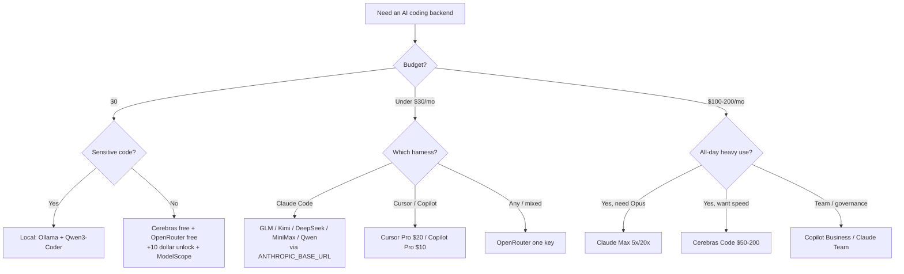

<div align="center">

# 🤖 Awesome AI Coding Subscriptions & APIs

### AI 编程订阅与 API —— 一份带评测的对比清单

[](https://awesome.re)
[](LICENSE)
[](CONTRIBUTING.md)

[](https://github.com/lildebil0/awesome-ai-coding-subscriptions/stargazers)

**你该把哪个订阅、编程套餐、API、路由器或免费额度接到你的 AI 编程 agent 后面？**
一份经过精选、跑过基准、附带来源链接的答案 —— 按 💵 价格 · 🧠 能力 · 🔢 模型数 · 📊 额度 · 🔌 集成度 排名。

[English](../README.md) · **简体中文** · [Español](README.es.md) · [Русский](README.ru.md) · [日本語](README.ja.md) · [Português](README.pt-BR.md) · [Français](README.fr.md) · [Deutsch](README.de.md) · [한국어](README.ko.md) · [हिन्दी](README.hi.md)

</div>

---

这份清单收录的是**你要付钱的套餐**——订阅、固定价编程套餐、按量付费 API、路由器和免费额度——而**不是**编程工具本身。harness（Claude Code、Cline、Aider、Roo/Kilo、OpenCode）本身是免费的。真正花钱的是它背后的模型，所以这里排名的就是模型套餐。harness 只是*接入目标*。

把一个中国开源权重实验室（GLM、Kimi、DeepSeek、MiniMax、Qwen、Doubao）的 3–30 美元/月固定价套餐接到免费 CLI harness 上，能在 SWE-bench 上拿到约 78–80% 的成绩，花费大约只有 200 美元前沿订阅的十分之一。前沿订阅在最难的任务上仍然胜出。所以 2026 年大多数人两手都抓：用一个前沿订阅处理硬核推理，用一个便宜套餐处理其余一切。

> ⚠️ **这个领域的定价每月都在变。**这里的数字反映的是 **2026 年 6 月前后**的情况。购买前请务必在官方页面核实。发现某个价格过时了？[提交一个 PR](CONTRIBUTING.md) —— 修正和新增同样宝贵。

## 图例

| 徽章 | 含义 |
|-------|---------|
| 💎 | **隐藏宝藏** —— 较冷门，相对所提供的价值而言定价偏低 |
| 🆓 | 拥有一个**真能跑 agent** 的免费额度 |
| ✅ | **定价已对照官方来源核实**（2026 年 6 月） |
| ⭐ | 性价比评分（1–5）：价格 vs 能力 vs 额度 vs 集成度 |
| 🇨🇳 | 中国境内托管（对部分场景有数据驻留/延迟方面的注意事项） |
| ⚠️ | 存在值得注意的风险（ToS、可靠性、寿命、转售） |

**集成度简写：**`CC-native` = 原生 Anthropic 兼容端点，可通过 `ANTHROPIC_BASE_URL` 直接作为 Claude Code 后端使用。`OpenAI-compat` = 改个 base URL 就能在 Cline/Roo/Kilo/Aider/Continue/OpenCode 中使用（Claude Code 需要 shim/路由器）。`native-only` = 锁死在厂商自家的编辑器/agent，不能复用为后端。

## 目录

- [如何选择](#如何选择)
- [按预算选](#按预算选)
- [按你的身份选](#按你的身份选)
- [TL;DR —— 按使用场景的首选](#tldr--按使用场景的首选)
- [总对比表](#总对比表)
- [第一方前沿订阅](#第一方前沿订阅)
- [捆绑式工具订阅（编辑器 + 模型）](#捆绑式工具订阅编辑器--模型)
- [固定价编程套餐 —— 性价比之王 💎](#固定价编程套餐--性价比之王-)
- [按量付费的高性价比 API](#按量付费的高性价比-api)
- [速度 / 快速推理提供商](#速度--快速推理提供商)
- [路由器与网关](#路由器与网关)
- [更多值得了解的提供商（2026）](#更多值得了解的提供商2026)
- [免费额度 🆓](#免费额度-)
- [免费额度与学生 / 创业计划](#免费额度与学生--创业计划)
- [学生与教育套餐 🎓](#学生与教育套餐-)
- [细分与专项](#细分与专项)
- [应用生成器与自主 agent](#应用生成器与自主-agent)
- [隐藏宝藏与转售代理 ⚠️](#隐藏宝藏与转售代理-)
- [配置教程 —— 把便宜套餐接进你的 harness](#配置教程--把便宜套餐接进你的-harness)
- [隐私与数据驻留矩阵](#隐私与数据驻留矩阵)
- [每美元能买到多少基准分](#每美元能买到多少基准分)
- [花钱陷阱与常见错误](#花钱陷阱与常见错误)
- [2026 定价时间线](#2026-定价时间线)
- [社区到底怎么说](#社区到底怎么说)
- [自托管与混合（当订阅不是答案时）](#自托管与混合当订阅不是答案时)
- [常见问题](#常见问题)
- [术语表](#术语表)
- [本清单如何评分与维护](#本清单如何评分与维护)
- [注意事项与免责声明](#注意事项与免责声明)
- [参与贡献](#参与贡献)
- [许可证](#许可证)
- [⭐ Star 历史](#-star-历史)

---

## 如何选择

从五个维度给每个套餐打分：

1. **💵 价格** —— 标价，以及*真实*有效成本（额度折算比、高峰倍率、超额费用）。
2. **🧠 能力** —— 模型质量；性价比档位大致聚集在 SWE-bench Verified 约 78–80%，前沿档在 85–89%。
3. **🔢 模型数量** —— 一个套餐能复用多个模型（Qwen Coding Plan、OpenRouter）可以对冲模型更替的风险。
4. **📊 额度** —— 每 5 小时窗口的请求数/token 数、每周上限、并发数。隐藏成本在于：IDE 里的一次「prompt」会扇出到 **5–30 次模型调用**，所以宣传里的「prompts/5h」比看上去要水。
5. **🔌 集成度** —— 它是否暴露**原生 Anthropic 端点**（可干净接入 Claude Code），还是只有 OpenAI-compat（需要路由器）？又或者它是 native-only（无法复用）？

**决策捷径：**

- 想要**最好的 agent、最简单的路径** → Claude Pro $20 → Max 5x $100。
- 想要**每美元最多的编程量** → 在 Claude Code 上接一个固定价套餐（GLM / MiniMax / Qwen / Kimi）。
- 想要 **$0** → Cerebras 免费版 + OpenRouter 免费版（+ 充 $10 解锁）+ NVIDIA NIM，把硬核任务升级到付费模型。
- 想要**一把钥匙搞定一切** → OpenRouter。
- 想要**隐私（不在中国托管）** → Synthetic.new（美国，不训练，14 天删除）或第一方美国订阅。



---

## 按预算选

别再陷入「分析瘫痪」了。找到你每月的预算数字，直接拿走对应的搭配。

| 预算 | 最佳选择 | 你能得到什么 | 最聪明的搭配 |
|---|---|---|---|
| **$0** 🆓 | **GitHub Copilot Free** + **Gemini CLI** | Copilot 提供每月 2,000 次补全 + 50 次高级请求；Google 提供一个慷慨的 agentic CLI | IDE 里用 Copilot Free 做自动补全，终端里用 Gemini CLI 跑 agent，[Cursor Hobby](https://cursor.com/pricing) 作为第三桶免费 Tab 补全 |
| **< $10/月** | **GLM Coding Plan Lite** 💎（$30/季 ≈ $10/月） | 约 3× Claude Pro 的用量；一个[原生 Anthropic 兼容端点](https://docs.z.ai/guides/overview/pricing) —— 直接接入 Claude Code、Cline 或 OpenCode | 用 GLM Lite 当 Claude Code 的驱动 + 叠加免费额度兜底溢出量 |
| **~$10/月** | **GitHub Copilot Pro**（$10） | 无限补全、$10 的 AI Credits、agent 模式、模型选择器 —— [2026 年 6 月转为按量计费的 credits](https://github.blog/news-insights/company-news/github-copilot-is-moving-to-usage-based-billing/) | IDE 里 Copilot Pro + 终端里 GLM Lite —— 两个准前沿驱动，总价约 $20 |
| **~$20/月** | **Claude Pro**（$20）*或* **Cursor Pro**（$20） | Pro：终端/网页/桌面端的 Claude Code，[Sonnet 4.6 + Opus 4.6](https://claude.com/pricing)。Cursor：无限 Tab + $20 agent 用量 + 后台 Agent | Claude Pro（最强裸 agent）+ Copilot Free 做行内补全；或者如果你只活在一个编辑器里，单买 Cursor Pro |
| **~$50/月** | **MiniMax Max**（$50）*或* **GLM Pro**（~$72/月）**+ Claude Pro**（$20） | 一个高吞吐固定价套餐（MiniMax 约 1000 prompts/5h，或 GLM Pro）*外加*原生 Anthropic 质量来对付硬核任务 | 便宜套餐干苦力，Claude Pro 留给棘手推理 —— 全榜最佳的 $/吞吐量 |
| **~$100/月** | **Claude Max 5x**（$100） | 5× Pro 用量、优先访问最新模型 —— 对每天都顶到 Pro 上限的开发者来说是甜点档（[Max 套餐](https://support.claude.com/en/articles/11049741-what-is-the-max-plan)） | Max 5x 当主力 + GLM Lite（$10）当烧完 5x 上限后的廉价溢出通道 |
| **~$200/月** | **Claude Max 20x**（$200）*或* **Cursor Ultra**（$200） | Max 20x：20× Pro，个人最高档。[Cursor Ultra](https://cursor.com/pricing)：20× 用量 + 全功能 IDE 的优先特性 | 终端优先的强力用户上 Max 20x；只有当你想用第二家厂商的模型做多样化/冗余时，才加 Copilot Pro（$10） |

**经验法则**

- **预算 20 以下且对价格敏感？** GLM Lite 是当下编程领域最值的一块钱 —— 它说 Anthropic 的 API，你的 Claude Code 肌肉记忆可以直接迁移。
- **一个工具用一整天？** 直接付原生订阅（Claude Pro、Cursor Pro）。别把账号拆得七零八落。
- **每天重度使用？** 直接跳到 Max 5x —— 比叠两个 $50 套餐便宜，也省心得多。
- **每个档位的高手操作：**一个高级驱动处理硬问题 + 一个便宜/免费通道处理批量编辑和补全。你很少需要同时买两个 $20+ 的订阅。

> 价格于 2026 年 6 月核实。按季计费的套餐（GLM）以等效月费展示。Copilot 和 GitHub 套餐已于 [2026 年 6 月 1 日转为按量计费的 AI Credits](https://github.blog/news-insights/company-news/github-copilot-is-moving-to-usage-based-billing/) —— 你的额度随基础价格水涨船高。


---

## 按你的身份选

别再盯着对比矩阵发呆了。找到属于你的那一行，照抄选择，然后继续干活。价格为美元/月，除非另有说明否则均为个人档（2026 年 6 月）。

| 你是…… | 最佳选择 | 为什么适合你 | ~价格 |
|---|---|---|---|
| **单干的独立黑客** 💎 | **Claude Pro** + 一把 Z.ai/DeepSeek API key 兜底 | 一个 $20 订阅就涵盖终端里的 Claude Code；当你冲刺到一半撞上 5 小时上限时，退回到便宜的高性价比 API，而不是跳到一个你用不满的 $100 档。对每天出货的单人来说是最佳 $/产出。 | $20 + 几分钱 |
| **创业工程团队（2–20 人）** | **GitHub Copilot Business** | $19/席位提供组织策略、公开代码过滤器、**IP 赔偿**和集中计费 —— 是能拿到投资人/客户面前的最便宜方案。可与每个开发者自己的 Claude/Cursor 订阅搭配处理重活。[定价](https://github.com/features/copilot/plans) | $19/席位 |
| **企业**（治理 / SSO / IP） | **Copilot Enterprise** 或 **Claude Enterprise** | Copilot Enterprise（$39/席位）增加 SSO/SCIM、审计日志、基于代码库索引的知识库，以及同样的「带过滤器的微软 IP 赔偿」。Claude Enterprise（需询价）是 Anthropic 优先的替代项。两者都能过采购流程。[Copilot Enterprise](https://docs.github.com/en/copilot/get-started/plans) | $39/席位 → 定制 |
| **计算机专业学生** 🆓 | **GitHub Copilot（学生版）** + ChatGPT Free | 已验证的学生可**免费拿到 Pro 级 Copilot**（无限补全、高级模型、每月高级请求额度）。零花费，真工具。[Copilot 套餐](https://github.com/features/copilot/plans) | $0 |
| **开源维护者** 🆓 | **OSS 免费 Copilot Pro** + Claude Pro 做深度活 | 热门仓库的维护者有资格免费获得 Copilot Pro；再留一个 $20 的 Claude Pro 应付棘手的重构。最佳的公益产出/成本比。 | $0–$20 |
| **隐私优先 / 受监管** 🔒 | **本地栈：Ollama + Qwen3-Coder + Continue.dev** | 专有代码永不出机器 —— 没有 API、没有保留条款、没有要谈的 DPA。在单文件任务上大致达到云端 Claude 质量的 70–85%。如果你必须上云，再加一个**零保留**的 API 档。[配置](https://medium.com/@rodrigo.estrada/build-a-local-ai-coding-assistant-qwen3-ollama-continue-dev-cee0dbcd172a) | $0（硬件） |
| **离线 / 物理隔离** | **Ollama + Qwen3-Coder-Next**（Continue.dev 或 OpenCode） | 同样的本地栈，但这是*唯一*在拔掉网线后还能用的类别。Qwen3-Coder-Next 从 80B MoE 里激活约 3B 参数 —— 能塞进真实硬件，永不联网。[模型](https://localaimaster.com/models/best-local-ai-coding-models) | $0 |
| **氛围编码者 / 爱好者** 🆓 | **免费额度试吃**：ChatGPT Free 或 Copilot Free + Gemini 免费版 | 周末为乐趣写代码 —— 一分钱都别付。Copilot Free 的每月 2,000 次补全加一个聊天模型足够覆盖随手玩的副项目。等免费上限真的咬人了再升级。 | $0 |
| **跑并行 agent 的强力用户** 💎 | **Claude Max 20x**（或叠一个高性价比 API 做扇出） | 如果你编排 swarm / 并行 Claude Code 会话，20x 的用量天花板就是让你下午两点不撞限额的东西。在这个量级上比烧等量 API token 更便宜。再加一把 DeepSeek/Z.ai key 给那些用完即弃的 worker agent。 | $200 |

**两条横向通用经验：**
- 从 **$20 → $100/$200** 的跳跃只有在你*本人*每周顶到用量上限超过约两次时才划算。大多数人达不到 —— 升级前先做记录。
- **IP 赔偿是套餐特性，不是模型特性。**它从 Copilot **Business** 开始，并要求开启公开代码过滤器 —— 免费档和 Pro 档不带它。如果某天会有律师读你的仓库，这才是关键的那一行。[详情](https://github.com/features/copilot/plans)

来源：
- [GitHub Copilot 套餐与定价](https://github.com/features/copilot/plans)
- [GitHub Copilot 的套餐 —— GitHub Docs](https://docs.github.com/en/copilot/get-started/plans)
- [2026 AI 定价对比 —— AIViewer](https://aiviewer.ai/guides/ai-pricing-comparison-2026/)
- [搭建本地 AI 编程助手 —— Qwen3 + Ollama + Continue.dev](https://medium.com/@rodrigo.estrada/build-a-local-ai-coding-assistant-qwen3-ollama-continue-dev-cee0dbcd172a)
- [面向 Ollama 的最佳本地 AI 编程模型（2026）](https://localaimaster.com/models/best-local-ai-coding-models)


---

## TL;DR —— 按使用场景的首选

| 使用场景 | 选择 | 理由 | ~价格 |
|----------|------|-----|--------|
| 🏆 **综合最佳性价比** | **GLM Coding Plan** 💎🇨🇳 | GLM-5.1 约为 Opus 编程能力的 94%；原生 Claude Code；最便宜的认真入门 | ~$10/月（按季 Lite）– $72 Pro |
| 🥇 **最强裸前沿** | **Claude Max 5x** | 在 Claude Code 中解锁 Opus，公认第一的 agent | $100/月 |
| 🪙 **最便宜的认真入门** | **Trae Lite $3** / **StepFun $6.99** / **MiMo ~$5** / **GLM Lite ~$10** 💎 | 一杯咖啡的价格就能有真正的编程后端 | $3–10/月 |
| 💸 **每 token 最便宜** | **DeepSeek V4-Flash** 💎 | $0.14/M 输入、$0.0028/M 命中缓存、1M 上下文、CC-native | 按量 |
| 🧪 **最佳免费** | **Cerebras 免费版** 🆓 + **OpenRouter :free** 🆓 | 每天 1M token（快）+ 免费的 Qwen3-Coder-480B | $0 |
| ⚡ **最佳快+便宜** | **Groq** 💎🆓 / **Cerebras Code** | 原生 Anthropic 端点（Groq）；约 2000 tok/s 固定价（Cerebras） | 免费 / $50/月 |
| 🔀 **最佳通用路由器** | **OpenRouter** | 315+ 模型、一把钥匙、Anthropic 外壳、token 不加价 | 按量 +5.5% |
| 🔒 **最佳隐私（美国托管）** | **Synthetic.new** 💎 | 美国基础设施、不训练、14 天删除、同时兼容 OpenAI+Anthropic | $20–60/月 |
| 🧰 **最适合大型代码库** | **Augment Code** ✅ | 面向 monorepo 的同类最佳上下文引擎 | $20+/月 |
| 🏢 **最佳团队性价比** | **Claude Team Premium 席位** 💎 | ≈ Max-5x 用量 + SSO/管理 | $100/席位 |


---

## 总对比表

大致按性价比排序。价格约为 2026 年 6 月；**购买前请核实**。

| 套餐 | 类型 | 价格 | 模型 | 额度（编程） | 集成 | ⭐ | 备注 |
|------|------|-------|--------|-----------------|-------------|----|-------|
| [GLM Coding Plan](#glm-coding-plan--zai智谱-ai-) | 固定价 | Lite $18 · Pro $72 · Max $160 /月（按季 Lite ~$10/月） | GLM-5.1/5/4.7 | Lite ~80, Pro ~400 prompts/5h | CC-native | ⭐5 | 💎🇨🇳✅ |
| [DeepSeek API](#deepseek-) | 按量 API | V4-Pro $0.435/$0.87；Flash $0.14/$0.28 | V4-Pro/Flash | 1M 上下文, 500–2500 并发 | CC-native | ⭐5 | 💎🇨🇳✅ |
| [MiniMax Coding Plan](#minimax-coding--token-plan-) | 固定价 | $10–50/月 | M2.7（套餐）, M2.5/M3（API） | Starter ~100, Max ~1000 prompts/5h | CC-native | ⭐5 | 💎🇨🇳 |
| [Kimi Code](#kimi-code--moonshot-ai-) | 固定价+API | ~$19/月 + 计量 | K2.6（1T） | ~300–1200 calls/5h, 30 并发 | CC-native | ⭐5 | 💎🇨🇳 |
| [Qwen Cloud Coding Plan](#qwen-cloud-coding-plan--阿里巴巴--) | 固定价 | Pro $50/月（Lite $10, 已关闭） | Qwen3.5 + Kimi/GLM/MiniMax | Pro 6000 req/5h, 1M 上下文 | CC-native | ⭐4 | 💎🇨🇳✅ |
| [OpenRouter](#openrouter-) | 路由器 | 按量, 充值 +5.5% | 315+（全部） | 受余额约束；免费模型 50–1000/天 | CC-native 外壳 | ⭐5 | 🆓 |
| [Claude Pro](#anthropicclaude) | 第一方 | $20/月 | Sonnet 4.6（无 Opus） | ~40–45 msg/5h + 每周 | CC-native | ⭐5 | 最佳入门 |
| [Claude Max 5x](#anthropicclaude) | 第一方 | $100/月 | + Opus 4.6/4.7 | ~50–225 prompts/5h | CC-native | ⭐5 | Opus 已解锁 |
| [Cerebras Code](#cerebras-) | 固定价速度 | $50/$200 | GLM-4.7（~2000 tok/s） | 24M–120M tok/天, 131k 上下文 | OpenAI-compat | ⭐5 | ✅ 经常售罄 |
| [Synthetic.new](#开源权重固定价订阅隐私--美国托管) | 固定价（美国） | $20–60/月 | 16 个开源权重（GLM/Kimi/Qwen/DS） | ~125–1250 req/5h | CC-native | ⭐5 | 💎🔒 |
| [Chutes](#chutes-) | 固定价 ⚠️ | $3/$10/$20 | GLM-5/Kimi/DS/MiniMax/Qwen | 300/2000/5000 req/天 | OpenAI-compat | ⭐5 | 💎⚠️ 去中心化 ✅ |
| [Grok Code Fast 1](#xai-grok) | 按量 API | $0.20/$1.50/M | grok-code-fast-1 | 256K 上下文, ~92 tok/s | CC-native | ⭐5 | 💎 OpenRouter 第一 |
| [ChatGPT Plus](#openaichatgpt--codex) | 第一方 | $20/月 | GPT-5.x-Codex | token-credit 计量 | Codex-native | ⭐4 | Codex 第二 agent |
| [ChatGPT Pro](#openaichatgpt--codex) | 第一方 | $100/$200（5x/20x） | GPT-5.5-Codex | 高；专属 GPU | Codex-native | ⭐4 | |
| [Claude Max 20x](#anthropicclaude) | 第一方 | $200/月 | Opus 4.6/4.7 | ~200–900 prompts/5h | CC-native | ⭐4 | 强力档 |
| [Cursor Pro / Ultra](#cursor) | 捆绑 | $20 / $200 | 所有前沿 + Auto | $20 / $400 用量池 | Native-only | ⭐4 | Ultra = 2× 折算比 |
| [GitHub Copilot Pro](#github-copilot) | 捆绑 | $10/月 | GPT-5/Claude/Gemini | $10 AI-credits（按量） | Native-only（+ACP） | ⭐4 | 免费补全 🆓 |
| [DeepInfra](#deepinfra) | 速度/API | 按量（最便宜的开源托管） | Kimi/DS/Qwen3-Coder/GLM | 受余额约束 | CC-native | ⭐5 | 💎✅ 最便宜的托管 |
| [Groq](#groq) | 速度/API | 按量 + 免费 | GPT-OSS/Qwen3/Kimi | 免费 RPM/TPM 上限 | CC-native | ⭐4 | 💎🆓 |
| [Vercel AI Gateway](#vercel-ai-gateway) | 路由器 | $0 加价（即便 BYOK） | 上百个含 Claude | $5/月免费额度 | CC-native | ⭐4 | 💎🆓✅ |
| [Requesty](#requesty) | 路由器 | 统一 +5% | Claude/GPT/Gemini/DS/Qwen | 语义缓存约省 40% | OpenAI-compat | ⭐4 | 💎 团队治理 |
| [Mistral Le Chat Pro](#mistral) | 第一方 | $14.99/月（学生 $5.99） | Devstral 2 + Vibe CLI | ~25 免费 msg/天 | Native-only | ⭐4 | 💎🆓🇪🇺 最便宜的主流订阅 |
| [Augment Code](#捆绑式工具订阅编辑器--模型) | 捆绑 | $20–200/月 | Claude/Gemini/GPT | 40k–450k credits/月 | Native-only | ⭐4 | ✅ 最佳大仓库上下文 |
| [Zed Pro](#捆绑式工具订阅编辑器--模型) | 捆绑 | $10/月 | 任意（BYO key/ACP） | $5 额度 + 按量 | ACP + BYOK | ⭐4 | 💎 反锁定 |
| [Cerebras 免费版](#免费额度-) | 免费 | $0 | Qwen3-Coder-480B, GPT-OSS-120B | 1M tok/天, 8K 上下文上限 | OpenAI-compat | ⭐5 | 💎🆓 最快的免费 |
| [Google AI Studio](#免费额度-) | 免费 | $0 | Gemini 2.5 Flash, Gemma 3 27B | Flash 250 RPD；Gemma 14.4k RPD | OpenAI-compat | ⭐4 | 🆓 最大的免费上下文 |


---

## 第一方前沿订阅

来自厂商直供的套餐。订阅通过登录来认证**厂商自家的 harness**（Claude Code、Codex CLI、Antigravity、Grok Build）—— 它**不会**给你一把可用于第三方 OpenAI-compat 工具的通用 API key（那是另算的按 token 计费）。例外：xAI Grok 模型兼容 OpenAI/Anthropic。

> agentic 编程的性价比座次（2026 年 6 月共识）：**Claude > OpenAI Codex > Google Gemini > xAI Grok**。一项独立的 30 天测试给出 Claude 约 95% vs ChatGPT 约 85% 的编程准确率；厂商 SWE-bench 数据显示 GPT-5.5（88.7%）≈ Opus 4.7（87.6%）。

### Anthropic（Claude）
- **[Claude Pro](https://claude.com/pricing)** —— `$20/月`（年付 $17）。Claude Code 中的 Sonnet 4.6（**无 Opus**）。~40–45 msg/5h + 每周上限，与 chat/Cowork 共享。**通往第一编程 agent 的最佳入门性价比。**2026 年 4 月将 5h 限额翻倍并取消了高峰限流。⭐5
- **[Claude Max 5x](https://support.claude.com/en/articles/11049741-what-is-the-max-plan)** —— `$100/月`。**解锁 Opus 4.6/4.7** + 5× 吞吐（~50–225 prompts/5h）。Pro 级甜点档；这个 $100 中间档 OpenAI/Google 都没能给出同样实用的对应。⭐5
- **[Claude Max 20x](https://support.claude.com/en/articles/11049741-what-is-the-max-plan)** —— `$200/月`。~200–900 prompts/5h。适合全天候并行 agent；**固定价完胜 API** 的算账是决定性的（Claude Code 90%+ 的 token 是缓存读取，订阅免费、API 计费 —— 某开发者峰值月按 API 算 = $5,623 ≈ 4.5 年 Max 5x）。⭐4
- **[Claude Team Premium 席位](https://claude.com/pricing)** 💎 —— `$100/席位`（年付）。≈ Max-5x 用量**外加** SSO/管理/审计/企业搜索。悄悄是最佳的*团队*编程性价比；标准 $20 席位也含 Claude Code。⭐4

### OpenAI（ChatGPT / Codex）
- **[ChatGPT Plus](https://help.openai.com/en/articles/11369540-using-codex-with-your-chatgpt-plan)** —— `$20/月`。捆绑 Codex CLI/IDE（GPT-5.5/5.4/5.3-Codex）。自 2026 年 4 月起改为 **token-credit 计量**（令人困惑）。Codex = 公认第二 agent。重度 agentic 活会很快烧掉 Plus 的额度。⭐4
- **[ChatGPT Pro](https://developers.openai.com/codex/pricing)** —— `$100`（5x）/ `$200`（20x）。高吞吐 + 专属 GPU。注意 $100 档的「10x 加成」促销已于 **2026 年 5 月 31 日到期**（现为 5x）。经典的「$200 套餐值不值」之争 = Claude Max 20x vs ChatGPT Pro 20x。⭐4

### Google（Gemini）
- **[Google AI Pro](https://gemini.google/subscriptions/)** —— `$19.99/月`（首年常有 5 折）。由 Google One AI Premium 改名而来（2026 年 4 月）。Gemini 3.x Pro、5 TB 存储，以及**增强的 [Antigravity](#应用生成器与自主-agent) + Jules** 编程 agent 访问权。✅
- **[Google AI Ultra](https://blog.google/products-and-platforms/products/google-one/google-ai-subscriptions/)** —— I/O 2026 上推出的 **`$100/月`（5x，新开发者档）** / **`$200/月`（20x，从 $250 下调）**。在 Gemini 应用**和** Antigravity 中享 5×/20× 用量；顶档增加 Deep Think、Project Genie、30 TB。✅
- ⚠️ **Google 将于 2026 年 6 月 18 日终结开源的 Gemini CLI**，把用户迁移到闭源的 Antigravity CLI，免费额度大幅缩水（~1000 → ~20 req/天）—— 这是 2026 年社区最大的不满。

### xAI（Grok）
- **[SuperGrok](https://x.ai/pricing)** —— `$30/月`（$300/年）/ Heavy `$300/月`。（当前定价页上没有独立的「Lite」档 —— 那是遗留的 X-Premium 捆绑残留物；忽略旧的 $10 数字。）Grok Build CLI 能在**隔离的 git worktree 里跑 8 个并行子 agent**（新颖），并包含在所有 SuperGrok 订阅中。`grok-code-fast-1` 有一批死忠（便宜+快）。SWE-bench 约 70.8%，落后于领跑者。**就编程而言，[xAI API](#xai-grok) 往往更值。** ⭐3 💎


---

## 捆绑式工具订阅（编辑器 + 模型）

这里套餐*本身*就是产品 —— 你买的是接入厂商的编辑器/agent。2026 年的趋势：几乎全部从固定请求次数转向了 **credits / token 计量**，使成本*更难*预测（招致强烈反弹）。

### Cursor
- **[Cursor](https://cursor.com/pricing)** —— Hobby 免费 · **Pro `$20`** · **Pro+ `$60`** 💎 · **Ultra `$200`**。自 2025 年 6 月起，你的套餐价 = 一个按 API 价计算的用量池。**折算比随档位提升而改善**：Pro $20/$20（1×）、Pro+ $60/$70（1.17×）、Ultra $200/$400（**2×，最佳**）。`Auto` 模式是性价比关键 —— 实质上无限，不像钉死 Claude/MAX 那样耗池。⚠️ 2025 年 6 月的切换引发了一场[定价灾难](https://www.wearefounders.uk/cursors-pricing-disaster-the-full-timeline-of-how-an-ai-coding-darling-burned-its-most-loyal-users/)（一位 HN 用户：「一周超额 $350」）；CEO 道歉并退款。**Native-only** —— 不能给 Claude Code 当后端，并且截至 2026 年 1 月，你也不能把 Claude 订阅路由*进* Cursor。同类最佳的 Tab/Apply。⭐4

### GitHub Copilot
- **[GitHub Copilot](https://github.com/features/copilot/plans)** —— Free 🆓 · **Pro `$10`** · Pro+ `$39` · Max `$100` · Business `$19` · Enterprise `$39`。⚠️ **2026 年 6 月 1 日转为按量计费的 AI Credits**（1 credit = $0.01）；每个套餐含一个额度池（Pro=$15, Pro+=$70）。**代码补全保持无限且免费** —— 只用补全的用户不受影响。反弹严重（TechTimes：agentic 账单暴涨 10×–50×）。面向组织提供同类最佳的 IDE 补全 + 治理/IP 赔偿。**Native-only**（逃生口：Copilot CLI 会说 ACP）。⭐4

### 其他
- **[Augment Code](https://www.augmentcode.com/pricing)** ✅ —— Indie `$20`/40k credits · Standard `$60` · Max `$200`。面向大型 monorepo 的**同类最佳上下文引擎**（在上下文召回对比中名列前茅）。VS Code + JetBrains + Auggie CLI。Native-only。工具密集型任务的 credit 消耗是抱怨点。⭐4 💎
- **[Zed Pro](https://zed.dev/pricing)** 💎 —— Free · **Pro `$10`**（仅 +10% 加价）· Business `$30`。**反锁定**之选：开放的 [ACP](https://zed.dev/docs/ai/) 可驱动外部 agent（Claude Code、Codex、OpenCode），并对任意提供商 BYO key。最快的原生编辑器。⭐4
- **[Kiro](https://kiro.dev/pricing/)** 💎 —— Free · **Pro `$20`/1k credits** · Pro+ `$40` · Power `$200`。最佳的**规格驱动（spec-driven）**agent（需求→设计→任务），完整 Claude 阵容含 Opus 4.7，0.01-credit 的小数计费。**AWS Startups = 一年免费 Pro+。** ⭐4
- **[Trae](https://www.trae.ai/pricing)** 💎🇨🇳 —— Free · **Lite `$3`** · Pro `$10` · Ultra `$100`。字节跳动的 VS Code 分支；用量池超过标价（例如 $10 给 $20 用量）= 「$3 的 Cursor 替代品」。⚠️ 字节跳动的遥测数据与关联公司共享 —— 对企业是硬伤。⭐4
- **[Sourcegraph Amp](https://sourcegraph.com/amp)** —— 免费起步（$10 额度；前 Cody 用户 $40）。纯**消费制**（无月度底线），在「smart」模式下跑 Opus 4.8。轻度使用很好，重度有无上限烧钱风险。Cody Free/Pro 已并入 Amp。⭐3
- **[JetBrains AI / Junie](https://www.jetbrains.com/ai-ides/buy/)** —— 备受喜爱的 IDE 集成，但 Junie **烧 credit 很快**（Ultimate 的 35 credit 约 4–5 天用光）。只在你常驻 JetBrains 时才考虑。
- **定价过高 / 建议回避：** **Tabnine**（$39 起步、无免费档、年付锁定 —— 仅适合本地部署/物理隔离需求）；**Windsurf Pro**（2026 年 3 月换成日/周配额是当年抱怨最多的改动，Cognition 收购后信任度低）。**Supermaven** 作为独立产品已死（2025 年 11 月并入 Cursor Tab）。


---

## 固定价编程套餐 —— 性价比之王 💎

把一个准前沿的开源权重模型接到你 harness 后面的固定月费或季费套餐，大多来自中国实验室。多数暴露原生 Anthropic 端点，所以可通过 `ANTHROPIC_BASE_URL` 直接接入 Claude Code。端点清单见 [Alorse/cc-compatible-models](https://github.com/Alorse/cc-compatible-models)。

> 共识座次：**GLM**（最便宜的入门、社区默认）· **MiniMax**（最佳价格/量）· **Kimi**（最佳长程 agent）· **Qwen**（>262K 上下文、多模型）。Claude Pro $20 是它们所压价的质量基准。

<a name="glm-coding-plan--zai智谱-ai-"></a>
### GLM Coding Plan —— Z.ai（智谱 AI）💎🇨🇳 ✅
- **海外月费（2026 年 6 月已核实）：**`Lite $18/月` · `Pro $72/月` · `Max $160/月` —— 价格于 2026 年 4 月 11 日约翻倍。**按季的 Lite 才是便宜路线**（~$30/季 ≈ $10/月）。国内 CN 便宜得多（~$7 / $21 / $68 每月）。病毒式的 **$3/月**促销已于 2026 年 2 月 11 日结束。✅
- 模型：**GLM-5.1**（约为 Opus 4.6 编程能力的 94%）· GLM-5/5-Turbo · GLM-4.7 · GLM-4.5-Air。**每个档位（含 Lite）都拿到全部模型和完整 200K 上下文**（128K 最大输出）—— 各档只在额度上有别，模型和上下文窗口不变。建议映射：GLM-5.1 → Opus 槽（硬任务、前端/UI），GLM-4.7 → Sonnet（×1 额度的主力），GLM-4.5-Air → Haiku（快速后台）。
- 额度：Lite ~80, Pro ~400, Max ~1,600 prompts/5h + 每周（IDE 里一次「prompt」= 5–30 次模型调用）。⚠️ **高峰时段 3× 倍率**仅作用于 GLM-5/5.1，时间为 **14:00–18:00 UTC+8**；非高峰 2×（通过促销可在 2026 年 6 月底前非高峰 1×）。把重度 GLM-5.1 任务放在非高峰跑。
- 集成：`ANTHROPIC_BASE_URL=https://api.z.ai/api/anthropic` —— 官方支持 Claude Code + Cline/Roo/Kilo/OpenCode（20+ 工具）。**第一方** = 无转售封号风险。
- > *2026 年最受推荐的预算编程套餐。*「约 $30/月就有 3× Claude Max 的用量。」2 月涨价 + 砍掉 ⅓ 额度引发反弹，但仍被评为顶级性价比。⭐5
- 来源：[z.ai/subscribe](https://z.ai/subscribe) · [pricing](https://docs.z.ai/guides/overview/pricing) · [GLM-5.1 评测](https://serenitiesai.com/articles/glm-5-1-coding-plan-review-2026)

<a name="minimax-coding--token-plan-"></a>
### MiniMax Coding / Token Plan 💎🇨🇳
- `Starter $10/月` · `Plus $20` · `Max $50`（年付送 2 个月）；High-Speed 变体 $40–150。
- 模型：套餐上是 M2.7 / M2.7-Highspeed；**M2.5/M3**（1M 上下文）通过 API。⚠️ **套餐常提供比所测的 M2.5/M2.7 更旧的模型**（M2.1）。
- 额度：Starter ~100 → Max ~1,000 prompts/5h；~50 TPS（高速 100）。
- 集成：`ANTHROPIC_BASE_URL=https://api.minimax.io/anthropic` + OpenAI-compat。
- > 「把我的 Claude Code 账单砍了一半。」固定价档里**最佳的裸价格/量**；M2.7 约为 GLM-5.1 的 94%，而输入成本约为后者的 1/5。⭐5
- 来源：[coding plan](https://platform.minimax.io/subscribe/coding-plan) · [M2.5 定价](https://www.verdent.ai/guides/minimax-m2-5-pricing)

<a name="kimi-code--moonshot-ai-"></a>
### Kimi Code —— Moonshot AI 💎🇨🇳
- `~$19/月会员` + 计量 API（K2.6 $0.60–0.95/M 输入、$2.50–4.00/M 输出，75% 缓存折扣）。分 Moderato/Allegretto/Vivace 档。
- 模型：**Kimi K2.6**（1T MoE，~80.2% SWE-bench）、K2.5。
- 额度：~300–1,200 calls/5h，**30 并发**（对并行 agent 很慷慨）。
- 集成：`ANTHROPIC_BASE_URL=https://api.moonshot.ai/anthropic` —— 真正的 Claude Code 直接接入；自带 Kimi CLI（6.4k★）。
- > **最佳长程 agent 稳定性**（在一个 13 小时会话中持续 4,000+ 次工具调用）。「省了 88% 编程成本。」是开源阵营里输入侧最贵的。⭐5
- 来源：[agent support](https://platform.kimi.ai/docs/guide/agent-support) · [Kimi Code 指南](https://www.nxcode.io/resources/news/kimi-code-2026-plans-pricing-developer-guide)

<a name="qwen-cloud-coding-plan--阿里巴巴--"></a>
### Qwen Cloud Coding Plan —— 阿里巴巴 💎🇨🇳 ✅
- `Pro $50/月`（Lite ~$10 自 2026 年 3 月 20 日起**对新订阅关闭**）。
- 模型：Qwen3.5-Plus、Qwen3-Coder-Next/Plus/480B + 跨模型的 **Kimi/GLM/MiniMax**，一把钥匙搞定。**1M-token 上下文**（同档最佳）。
- 额度：Pro 6,000 req/5h + 45k/周 + 90k/月（滑动窗口）。专用 `sk-sp-` key（与按量 key 不通用）。
- 集成：`ANTHROPIC_BASE_URL=https://coding-intl.dashscope.aliyuncs.com/apps/anthropic` + Qwen Code CLI。
- > 亮点 = **一个套餐复用 Qwen+Kimi+GLM+MiniMax**，且是唯一靠谱的 1M-上下文固定价套餐。⭐4
- 来源：[Model Studio coding plan](https://www.alibabacloud.com/help/en/model-studio/coding-plan)

### 开源权重固定价订阅（隐私 / 美国托管）
- **[Synthetic.new](https://synthetic.new/pricing)** 💎🔒 —— `$20–60/月`。约 16 个常驻开源权重模型（Kimi/GLM/Qwen3-Coder-480B/DeepSeek）。**美国基础设施、不训练、14 天删除。** **同时兼容 OpenAI + Anthropic** = 真正的 Claude Code 直接接入。中国套餐之外注重隐私的替代项。⭐5
- **[Cerebras Code](#cerebras-)** —— `$50`/`$200`，固定价速度（见 [速度](#速度--快速推理提供商)）。
- **[OpenCode Go (Zen)](https://opencode.ai/go)** 💎 —— `$5` 首月、之后 `$10/月` 固定。约 12–14 个中国开源权重模型（GLM-5.1/Kimi/Qwen3.7/DeepSeek V4/MiniMax）。在 OpenCode 中是一等公民。无 Claude/GPT。⭐4

### 细分 / 廉价档固定价套餐 🇨🇳
- **[StepFun Step Plan](https://github.com/Alorse/cc-compatible-models)** —— `$6.99`–`$99/月`，100–5,000 prompts/5h，CC-native。价格杀手，模型经实战检验较少。⭐3
- **MiMo（小米）** —— `$6`–`$100/月`基于额度（60M–1.6B），CC-native（`api.xiaomimimo.com`），含多模态 Omni。几乎没跑过基准。⭐3
- **Atlas Cloud** 💎 —— `$10`/`$20`，800k–1.8M credits/**天**，OpenAI-compat（Claude Code/Codex/OpenCode）。面向自主 agent 的每日额度模式。⭐4
- **[Factory Droid](https://factory.ai/pricing)** 💎 —— 从 `$20/月`起、基于 token，前沿模型（Claude/GPT/Gemini），滚动 5h/7d/30d 窗口。有名的「我为了 Droid 取消了两个 $200 的 Max 套餐」故事。⭐4


---

## 按量付费的高性价比 API

来自高性价比实验室的按 token 访问。**缓存定价才是 agent 循环的真实成本驱动**——为命中缓存而设计，而不是盯着标题里的输入价。

<a name="deepseek-"></a>
### DeepSeek 💎🇨🇳 ✅
- **V4-Pro** `$0.435/M 输入 · $0.0036/M 命中缓存 · $0.87/M 输出`（**75% 的降幅现已永久**）。**V4-Flash** `$0.14 / $0.0028 / $0.28`。1M 上下文，384K 最大输出。
- 集成：OpenAI-compat **+ 原生 Anthropic**（`https://api.deepseek.com/anthropic`）—— 直接接入 Claude Code（`ANTHROPIC_MODEL=deepseek-v4-pro[1m]`）。
- > **每 token 成本之王。**V4-Pro 约 80.6% SWE-bench / 93.5% LiveCodeBench，输出 <$1/M。V4-Flash 的 $0.0028/M 命中缓存在批量循环里无人能敌。⭐5
- 来源：[pricing](https://api-docs.deepseek.com/quick_start/pricing) · [Claude Code 配置](https://api-docs.deepseek.com/quick_start/agent_integrations/claude_code)

### 其他
- **[Alibaba Qwen3-Coder API](https://www.alibabacloud.com/help/en/model-studio/model-pricing)** 🇨🇳 —— 480B `$0.22/$1.00`，Flash `$0.195/$0.975`，30B-A3B `$0.07/$0.27`。**90 天内 100 万免费 token**（国际版）。CC-native。最强的开源权重 agentic 编码器。用新加坡区的 key。⭐4
- **[Moonshot Kimi API](https://platform.kimi.ai/docs/pricing)** 🇨🇳 —— K2.6 `$0.95/$4.00`（缓存 $0.16），K2.5 `$0.60/$3.00`。CC-native。出色的工具调用；输出价是吐槽点。充值 $10 可移除每日上限。⭐4
- **[Zhipu GLM API](https://docs.z.ai/guides/overview/pricing)** 🇨🇳 —— GLM-5.1 `$1.40/$4.40`，GLM-4.7 `$0.60/$2.20`，FlashX `$0.07/$0.40`。CC-native。多数发烧友会改买更便宜的 [Coding Plan](#glm-coding-plan--zai智谱-ai-)。⭐4
- **[MiniMax API](https://platform.minimax.io/docs/guides/pricing-paygo)** 🇨🇳 ✅ —— M3 `$0.30/$1.20`（缓存 $0.06，**缓存写入免费**），M2.5 ~`$0.15/$1.15`。「比 Opus 便宜 20×。」第一方 Anthropic 兼容。⭐4


---

## 速度 / 快速推理提供商

开源权重模型的按 token 托管，为吞吐量优化。**Groq 是唯一带原生 Anthropic 端点的**（最干净的 Claude Code 直接接入）；其余是 OpenAI-compat（CC 需要 shim/路由器，在 Cline/Roo/OpenCode 中原生可用）。

<a name="deepinfra"></a>
- **[DeepInfra](https://deepinfra.com/pricing)** 💎 ✅ —— **每 token 最便宜之王。**DeepSeek V3.2 ~$0.26/$0.38、Kimi K2.6 $0.75/$3.50、Qwen3-Coder-480B $0.30/$1.00。90+ 模型、缓存折扣、**原生 Anthropic 端点**、无预付费。速度不错但非顶级。⭐5
<a name="groq"></a>
- **[Groq](https://groq.com/pricing)** 💎🆓 —— LPU 速度（GPT-OSS-20B ~860 tok/s）。GPT-OSS-120B `$0.15/$0.60`、Kimi K2 `$1.00/$3.00`。**原生 Anthropic + OpenAI 兼容** + 真实免费档。批处理+缓存可叠加到约 25%。没有 Qwen3-Coder-480B（上限是 Qwen3-32B）。⭐4
<a name="cerebras-"></a>
- **[Cerebras](https://www.cerebras.ai/pricing)** ✅ —— **最快**（~2,000–3,000 tok/s）。**Code Pro `$50`**（24M tok/天）/ **Max `$200`**（120M tok/天），GLM-4.7，131k 上下文。按量 GPT-OSS-120B `$0.35/$0.75`。⚠️ 经常**售罄**；131k 上下文（原生的一半）+ 高 TTFT 削弱了它在 agent 循环里的速度。⭐5 固定价 / ⭐4 按量
- **[Together AI](https://www.together.ai/pricing)** —— 目录最广（Qwen3-Coder-480B、Kimi、DeepSeek V4 Pro $2.10/$4.40，缓存 $0.20）。价格居中，~89 tok/s。⭐4
- **[Fireworks AI](https://fireworks.ai/pricing)** —— 偏生产/企业，激进缓存（$0.15/M），DeepSeek V4-Flash $0.14/$0.28，有 Azure Foundry 路径。⭐4
- **[Novita](https://novita.ai/pricing)** 💎 —— 以接近 DeepInfra 的价格托管完整 Qwen3-Coder 系列；隐藏的 OpenRouter 路线。⭐4
- **[Hyperbolic](https://docs.hyperbolic.xyz/docs/hyperbolic-ai-inference-pricing)** 💎 —— GPT-OSS-20B `$0.10/M` 混合价（属各处最便宜之列）；托管 Qwen3-Coder-480B（FP8）。约 13 个模型。⭐3
- **SambaNova** —— 在巨型 671B/405B 模型上独家地快；永久免费 + $5 额度 🆓 但 50 req/天上限 = 仅供评测。


---

## 路由器与网关

一把钥匙横跨多家提供商。把路由器选作你的**默认访问层**。

<a name="openrouter-"></a>
- **[OpenRouter](https://openrouter.ai/pricing)** 🆓 —— **公认默认。**315+ 模型、一把钥匙、**Anthropic 兼容「外壳」**（`ANTHROPIC_BASE_URL=https://openrouter.ai/api` = 真正的 Claude Code 直接接入）、**token 价不加价**（仅在充值时 +5.5%）、免费 ZDR + 消费上限、慷慨 BYOK（1M 免费 req/月）。免费模型（Qwen3-Coder-480B、DeepSeek、Llama 4）：50 RPD → 一次性充 $10 后**永久 1000 RPD**。5.5% 费用只在约 $5k/月以上消费时才刺痛。⭐5
<a name="requesty"></a>
- **[Requesty](https://www.requesty.ai/)** 💎 —— **统一 5% 加价**，全功能含**语义缓存**（约省 40%，胜过仅完全相同才命中的缓存）+ 智能的按请求路由 + **按 agent 的模型策略**（分类器/合成器等不同角色用不同模型）+ SOC 2 Type II。团队治理之选。OpenAI-compat。⭐4
<a name="vercel-ai-gateway"></a>
- **[Vercel AI Gateway](https://vercel.com/docs/ai-gateway/pricing)** 💎🆓 ✅ —— **零加价，即便 BYOK。**原生 Anthropic 兼容（`https://ai-gateway.vercel.sh`）= 直接对接 Claude Code + Claude Agent SDK + 「通过 Gateway 的 Claude Code Max」。$5/月免费额度无限续（一旦充值即停止续）。最佳的纯经济之选，在 Vercel 生态里尤甚。⭐4
- **[Helicone Gateway](https://helicone.ai/pricing)** 🆓 —— 可观测性优先（自动日志/追踪/成本）、零加价、免费 10k req/月；订阅 $79/$799。⭐3
- **[CometAPI](https://www.cometapi.com/)** —— 500+ 模型含最新专有模型，约比官方便宜 20–40%，**同时兼容 OpenAI+Anthropic**。预付额度的中间商风险。⭐4
- **[ElectronHub](https://www.electronhub.ai/pricing)** —— 600+ 模型，每周额度可超过现金成本；廉价档 RPM 紧（5–10），有转售信任方面的注意事项。⭐3
- **[LiteLLM](https://docs.litellm.ai/)** —— 开源**自托管**标准（免费、不加价）—— 见[集成技巧](#把便宜套餐接进你的-harness)。需要自己折腾基础设施，非开箱即用。⭐4


---

## 更多值得了解的提供商（2026）

这些是真正有用、但不在主要章节里挑大梁、却能填补真实空白的条目 —— 额外的中国实验室与聚合商、西方编程工具，以及 OpenRouter 之外的路由器。分组并折叠以保持清单易扫读。

<details>
<summary><b>🇨🇳 中国聚合商与实验室</b>（便宜 token，其中几家带原生 Anthropic 端点）</summary>

- **[SiliconFlow](https://www.siliconflow.com/pricing)** 💎 —— 中国最大的独立 MaaS 路由器之一，200+ 模型，**原生 Anthropic 端点**（少见），所以 Claude Code 可直指便宜的 DeepSeek/Qwen/GLM/Kimi。国际（.com）+ 中国（.cn）端点。DeepSeek-V4-Flash ~$0.14/$0.28。
- **[PPIO](https://ppio.com/llm-api)** 💎 —— 以人民币计价、跑在**自家 GPU 云**上的路由器；Qwen3-Coder-Next ≈¥1.4/¥10.5、DeepSeek-V4-Flash ¥1/¥2 —— 属各处最低 token 价之列。OpenAI-compat（Claude Code 需桥接）。
- **[Volcengine Ark / BytePlus](https://www.volcengine.com/docs/82379/1949118)** 💎（字节跳动豆包）—— 固定价的 **Doubao Coding Plan**：通过 BytePlus（可用外卡支付的海外品牌）提供 Lite **$10**/Pro **$50**。**Doubao-Seed-Code** 原生兼容 Anthropic，编程上接近 Claude Sonnet；捆绑一个 Claude-Code 风格的「ArkClaw」agent。Doubao API 底价：`doubao-seed-1.6-flash` $0.022/M 输入。
- **[Alibaba 百炼多模型 Coding Plan](https://www.alibabacloud.com/help/en/model-studio/coding-plan)** 💎 —— **$50/月 Pro**，一个订阅复用 **Qwen3-Coder + Kimi-K2.5 + GLM-5 + MiniMax-M2.5**，带**原生 Anthropic 端点** + 新加坡区（无需中国身份证）。⚠️ 需要专用 `sk-sp-` key —— 普通 key 会悄悄按 5× PAYG 计费。
- **[ModelScope](https://modelscope.cn/)** 🆓💎（阿里）—— **每天 2,000 次免费 API 调用、免卡**，含 Qwen3-Coder-480B。在 Qwen 的 OAuth 免费档关闭后，这是在 agent 循环里 $0 跑前沿中国编码器的事实标准。
- **[AiHubMix](https://docs.aihubmix.com/en)** 💎 —— 基于中国的统一路由器，暴露 OpenAI、Gemini **和 Anthropic** 兼容端点，带一流的 Claude Code 文档；一把钥匙横跨 DeepSeek/Qwen/GLM/Kimi 及中转的 Claude。
- **[302.AI](https://302.ai/)** 💎 —— 预付费、**无 TPM 限流**（适合突发型 agent），一个余额横跨 Kimi/Qwen/DeepSeek + GPT/Claude，支持私有部署选项。
- **大厂完整性补全：** **[百度 ERNIE](https://pricepertoken.com/pricing-page/model/baidu-ernie-4.5-21b-a3b)**（千帆；ERNIE 4.5 21B-A3B $0.07/$0.28）、**[腾讯混元](https://pricepertoken.com/pricing-page/provider/tencent)**（HY3 Preview ~$0.063/$0.21 —— 但腾讯*上调了*部分价格）、**[讯飞星火](https://lobehub.com/docs/usage/providers/spark)**（免费 Lite 档 + 专属 Spark Code）、**[商汤 SenseNova](https://www.sensetime.com/en)**（便宜的多模态 MoE）。全部 OpenAI-compat；Claude Code 需桥接；多数需中国身份证直接注册（可经中转/302.AI 触达）。
- ⚠️ **中国直连中转**（云雾、SSSAiCode 类）便宜转售前沿 Claude/GPT 且无需 VPN —— 在中国境内方便，但带有标准的[转售代理风险](#隐藏宝藏与转售代理-)。当作热钱包对待。

</details>

<details>
<summary><b>🛠️ 带订阅的西方编程工具</b></summary>

- **[Refact.ai](https://refact.ai/)** 💎 —— **$10/月**，最便宜的 agentic 编程订阅；开源、**可完全自托管的自主 agent**，支持本地微调且零遥测。免费档 = 每月 5,000 coin + 无限补全。
- **[Pieces for Developers](https://pieces.app/)** 💎 —— Pro **$14.17/月年付** = IDE 内无限 Opus 4 / GPT-5 / Gemini 2.5（比单个 Claude Pro 席位还便宜）。差异化在于横跨你所有工具的长期**记忆/上下文层**，而非代码生成。免费档可无限跑本地模型。
- **[Continue](https://www.continue.dev/pricing)** 💎 —— 开源 IDE agent + **Continue Hub** 模型商店：前沿模型 **$3/M token**，Team **$20/席位**（+$10 额度）带共享配置/治理。也支持 BYOK。
- **[Cline](https://cline.bot/pricing)** —— 标杆级开源 agent；**零加价 BYOK**（30+ 提供商），典型真实花费 $25–70/月。Teams 套餐：前 **10 席位永久免费**，之后 $20/席位。
- **[Kilo Code](https://kilo.ai/)** —— 活跃维护的 **Roo Code 继任者**（Roo 已于 2026 年 5 月 15 日归档）。零加价 BYOK，横跨 500+ 模型；可选 **Kilo Pass** 预付额度，年付额外 +50% 奖励。
- **[Goose](https://github.com/aaif-goose/goose)** 💎（Block / Linux 基金会）—— 免费开源 agent，可通过 SDK 提供商**搭你现有的 Claude Max / ChatGPT / Copilot 订阅**做固定价推理 —— 与 `copilot-api` / `claude-code-router` 同样的「自带订阅」桥接模式。
- **[Zencoder](https://zencoder.ai/pricing)** —— SOC2 企业 agent、多 agent 编排、「每档全功能」；Pro $45/席位（30k credits）→ Pro Max $195（180k）。
- **[Tabby](https://www.tabbyml.com/pricing)** 💎 —— 领先的**开源可自托管**补全/聊天服务器（免费，约 $5–15/月 GPU）；Cloud Team $24/席位；新增 **Pochi** 自主 agent。OpenAI-compat 端点可被任意 harness 使用。

</details>

<details>
<summary><b>🔀 更多路由器与网关</b></summary>

- **[Portkey](https://portkey.ai/pricing)** 💎 —— 大多数清单里缺席的、最具生产级水准的路由器：内置 **guardrails、虚拟 key、预算上限**（主打封顶失控的 agentic 花费）、同时兼容 OpenAI **和 Anthropic**、完全**开源可自托管**网关。免费 10K logs/月；Pro 起价 $49。
- **[Cloudflare AI Gateway](https://developers.cloudflare.com/ai-gateway/)** 💎 —— 近乎零成本的通用代理（缓存/分析/回退，**token 不加价**）；免费 100K logs/月。2026 年 6 月的 xAI Grok 合作 + 统一计费让它成为一张发票的控制面。Anthropic passthrough 对 Claude Code 可用。
- **[Poe API](https://creator.poe.com/)** 💎（Quora）—— 一个消费级聊天订阅，其**算力点同时充当多提供商编程 API**：一个 **$19.99/月**套餐横跨 Claude + GPT-5.x + Gemini，常比直连便宜 10–30%。同时兼容 OpenAI **和 Anthropic**。
- **[Glama](https://glama.ai/ai/gateway)** 💎 —— OpenAI-compat 网关**外加最大的 MCP 服务器注册表/托管** —— 当 MCP 工具服务器和模型访问同等重要时独具价值。额度捆绑式订阅。
- **[Unify](https://unify.ai/)** 💎 —— 一个**质量预测型**的「神经路由器」，在调用*之前*就给预期输出质量打分并命中成本/延迟目标；$100 免费额度；通过虚拟 key BYOK。
- **[Martian](https://withmartian.com/)** —— 专用的按请求**成本/质量路由器**，带最大成本和支付意愿旋钮（号称省 20–97%）；免费 2,500 req，Developer $20/月。
- **[Braintrust Gateway](https://www.braintrust.dev/)** 💎 —— 将路由与 **eval + 追踪 + 缓存**结合；OpenAI/Anthropic 兼容；慷慨的免费 beta。
- **[APIpie](https://apipie.ai/)** 💎 —— 一个元路由器（聚合 OpenRouter/EdenAI/DeepInfra），一把钥匙、148 个编程模型，外加捆绑的网络搜索 + 聊天记忆。
- **[AIMLAPI](https://aimlapi.com/)** —— 500+ 模型、同时兼容 OpenAI + Anthropic、最高比直连便宜约 80%。**[Eden AI](https://www.edenai.co/pricing)** —— 对 BYOK 友好、约 5.5% 平台费、有免费沙箱。**[TrueFoundry](https://www.truefoundry.com/ai-gateway)**（$499/月起）和 **[Kong AI Gateway](https://konghq.com/products/kong-ai-gateway)**（开源免费 / Konnect 云）—— 可自托管、面向本地治理的企业选项。

</details>


---

## 免费额度 🆓

能跑真实 agent 循环的 $0 访问，按社区报告的实际可用程度排名（2026 年 6 月）：

1. **[Cerebras 免费版](https://inference-docs.cerebras.ai/support/rate-limits)** 💎 —— **每天 1M token、免卡、最快**（2000+ tok/s），Qwen3-Coder-480B + GPT-OSS-120B。⚠️ **8K 上下文上限**断送了全仓库工作。⭐5
2. **[Google AI Studio](https://ai.google.dev/gemini-api/docs/rate-limits)** —— **最大的免费上下文**（Flash 最高 1M）+ Gemma 3 27B，**14,400 RPD**。⚠️ Gemini 2.5 Pro 不再免费（约 2026 年 4 月）；限额在 2025 年 12 月被砍；免费数据用于训练。⭐4
3. **[OpenRouter :free](https://openrouter.ai/models?max_price=0)** —— 最佳免费编程模型（Qwen3-Coder-480B）+ DeepSeek/Llama/GLM，一把钥匙。**一次性充 $10 → 永久 1000 RPD**（否则 50 RPD）。⭐4
4. **[Groq 免费版](https://console.groq.com/docs/rate-limits)** 💎 —— 最快的小 prompt 循环；⚠️ 6,000 TPM 上限 = 很多小步骤，而非大上下文。⭐4
5. **[NVIDIA NIM](https://build.nvidia.com/)** 💎 —— 1,000–5,000 credits，**免卡/不过期**，40 RPM，前沿开源模型（MiniMax M2.x、Qwen3-Coder-480B、GLM-5、Kimi K2.5）。评测档（额度封顶）。⭐4
6. **Mistral Experiment** —— 每月 10 亿 token（!）、~1 req/秒 + 需同意训练。
- **仅供原型：**GitHub Models（50 RPD）、Cloudflare Workers AI、Together（默认 $1）。
- **可持续的免费策略：**把 60–80% 的 agent 流量路由到免费的 Qwen3-Coder/GPT-OSS/DeepSeek（Cerebras + OpenRouter+$10 + NVIDIA NIM），再把最难的 20% 升级到付费前沿模型。⚠️ 免费额度在 2025–2026 年大幅收紧，所以要假设它们都可能毫无预警地缩水。


---

## 免费额度与学生 / 创业计划

往往最便宜的「套餐」是你有资格申请的那个。学生、开源维护者和拿到融资的创业公司可以零成本获得几个月到几年的前沿访问 —— 这些额度通过底层 API 为 Claude Code、Codex 或任意 agent 提供资金。

### 学生 🎓

学生拿到的免费池是所有人里最大的 —— 它有自己专门的深度章节：**[学生与教育套餐 🎓](#学生与教育套餐-)**（完整表格、验证机制、坑点，以及无法验证时的 $0 方案）。

### 开源维护者 🌱

- **[OpenAI Codex for Open Source](https://openai.com/form/codex-for-oss/)** 💎 —— **6 个月免费 ChatGPT Pro + Codex**（约 $1,200 价值）+ API 额度，来自一个 100 万美元基金。无最低 star 数门槛，连使用 OpenCode/Cline 的维护者也可申请。
- **GitHub Copilot Pro —— OSS 免费** —— 热门仓库的维护者有资格免费获得 Copilot Pro。
- **[JetBrains OSS 免费](https://www.jetbrains.com/community/opensource/)** —— 为成熟项目提供 All Products Pack（可续）。

### 拿到融资的创业公司 🚀

- **[Anthropic —— Claude for Startups](https://claude.com/programs/startups)** —— **$25K–$100K+** 的 Claude API 额度（12 个月）；按 API 价为 Claude Code 提供资金。
- **[Google for Startups —— AI 档](https://cloud.google.com/startup/ai)** —— 两年内最高 **$350K** 的 GCP/Vertex 额度；Vertex 同时承载 **Gemini 和 Claude**。
- **[AWS Activate](https://aws.amazon.com/startups/credits/)** —— 最高 **$200K**；现可抵扣 **Bedrock Claude**，所以能补贴 Bedrock 上的 Claude Code。
- **[Microsoft for Startups Founders Hub](https://www.microsoft.com/en-us/startups)** —— 最高 **$150K** Azure 额度，带一个**无需 VC 的入门档**（自筹/单干者欢迎）；通过 Azure OpenAI 用 GPT-5.x。
- **[AWS Kiro Pro+ for Startups](https://kiro.dev/startups/)** —— **一整年免费 Kiro Pro+**（申请窗口于 2026 年 4 月 7 日 – 6 月 30 日重开；排除现有 Activate 成员）。
- **[NVIDIA Inception](https://www.nvidia.com/en-us/startups/)** —— 任意阶段、无截止：GPU 折扣、DGX Cloud 时长、最高 $100K 合作云额度。
- **[Baseten AI Startup Program](https://www.baseten.co/startup-program/)** 💎 —— 最高 **$25K**，用于在专属推理上自托管开源权重编程模型。

### 始终免费的水龙头 🆓

- **[ModelScope](https://modelscope.cn/)** —— 每天 2,000 次免费调用（Qwen3-Coder-480B），免卡。
- **[NVIDIA Build](https://build.nvidia.com/)** —— 最高 5,000 免费额度、100+ 模型、OpenAI-compat。
- **[Cloudflare Workers AI](https://developers.cloudflare.com/workers-ai/platform/pricing/)** —— 永久免费 **每天 10,000 Neurons** 的开源权重推理（仅限 Cloudflare 托管的模型）。
- 此外还有[免费额度](#免费额度-)章节：Cerebras（1M tok/天）、Google AI Studio、OpenRouter `:free`、Groq。

> 多数创业额度需要申请，且（往往）需要机构融资。指望它们之前先读资格条件 —— 并记住额度会过期（通常 12–24 个月）。


---

## 学生与教育套餐 🎓

学生可以免费解锁数千美元的前沿编程访问 —— 但 2026 年这张地图剧烈变动（GitHub 暂停注册、Google 的免费年结束、Cursor 收窄到北美）。以下是截至 2026 年 6 月 7 日的真实现状 —— 什么真能用、什么是陷阱、以及如果你完全无法验证该怎么办。

### 全景图

| 厂商 | 提供内容 | 价值 | 资格 | 验证 | 坑 |
|---|---|---|---|---|---|
| **GitHub Copilot** 学生版 🆓 | 免费 *Copilot Student* 套餐：无限补全 + 每月 200 AI Credits（[来源](https://docs.github.com/copilot/how-tos/manage-your-account/free-access-with-copilot-student)） | 约 $120/年 vs Pro（$10/月） | 13+ 在读、学位/文凭项目；每月复检 | GitHub Education（学校邮箱或带日期的在读证明）（[来源](https://education.github.com/pack)） | ⚠️ **新注册自 2026 年 4 月 20 日起暂停** —— 你可能通过了验证却仍卡在 Copilot Free。高级模型（Claude Opus/Sonnet、GPT-5.x-Codex）不再可自选 —— 仅 Auto 模式（[来源](https://github.com/orgs/community/discussions/189268)） |
| **Cursor** 💎 | 1 年免费 Cursor Pro（$20/月用量、前沿模型、agent）（[来源](https://cursor.com/students)） | ~$240 | 大学生、个人账号、**仅限 .edu 邮箱** | 通过 dashboard 走 SheerID；每邮箱一次（[来源](https://cursor.com/help/account-and-billing/student-discount)） | ⚠️ 第一年后**自动续费 $20/月**。官方帮助页说「位于北美」；**印度已从国家下拉框中移除**（[来源](https://forum.cursor.com/t/why-is-india-missing-from-the-country-dropdown-for-student-offers-on-cursor-ai/88955)）。即时路径不支持 .edu.au/.ac.uk |
| **JetBrains** 学生包 🆓 | 免费 All Products Pack —— 每个 IDE（IntelliJ Ultimate、PyCharm 等）+ .NET 工具（[来源](https://www.jetbrains.com/academy/student-pack/)） | ~$289/年 | 认证院校；项目**长于 1 年** | 学校邮箱、**ISIC 卡**或 GitHub 学生包（自动授予） | ⚠️ **仅限非商业用途。每年**重新验证。免费 IDE ≠ 免费 AI（见下一行）。文档上传选项于 2024 年 7 月移除 |
| **JetBrains AI**（面向学生） ⚠️ | AI Free（$0）+ 一次 **30 天 AI 试用**（Junie agent + 云端 AI）（[来源](https://youtrack.jetbrains.com/articles/SUPPORT-A-2862)） | 30 天约 $10/月价值，之后约 $0 | 任意 JetBrains 教育许可持有者 | 自动 —— 在 IDE v2025.1+ 里点 AI 图标 | ⚠️ **无持续免费 AI。**试用后：每 30 天约 3 AI credit（Junie 烧得快）。AI Pro（$10）/Ultimate（$30）无学生折扣。无限的*本地*补全 + 本地模型（Ollama）保持免费 |
| **Google AI Pro**（Gemini） ❌ | **对新注册关闭。**曾免费 12–15 个月（Gemini Pro、NotebookLM Plus、2TB→5TB、Antigravity、Jules）（[来源](https://gemini.google/students/)） | 曾值约 $240–$300；**现在 $0** | 不适用 —— 已于 2026 年 3 月 11 日全球结束（美国最终约 4 月 30 日） | 曾走 SheerID | ⚠️ 官方页现说*「优惠已结束……在你所在地区不再可用」*。无视仍在宣称「免费一年」的博客。已领取者继续访问至期满。新用户：付费 $19.99/月或仅限免费 Gemini 档 |
| **OpenAI / ChatGPT** ⚠️ | 面向学生的 **Codex $100 额度**（2,500 credits）—— agentic 编程（[来源](https://developers.openai.com/community/students)） | $100 的 Codex 用量 | 美/加大学生、**居住在美/加** | 在 ChatGPT 账号上走 SheerID | ⚠️ 帮助中心说额度**仅 Plus/Pro 用户可用** —— Free/Go 会被提示升级（[来源](https://help.openai.com/en/articles/20001147-codex-credits-for-students-terms-of-service)）。所以实际上需要 Plus（$20/月）。额度 12 个月过期。旧的免费 Plus 促销**已于 2025 年 5 月结束** |
| **OpenAI ChatGPT Edu** 🆓 | 由机构提供的 ChatGPT（含 Codex），对你 $0（[来源](https://openai.com/index/introducing-chatgpt-edu/)） | 如果你学校有，则 $0 | 仅限签约大学 | 学校 SSO —— 无需个人申请 | ⚠️ 完全取决于学校；大多数学生不会有。向 IT 确认 Codex 是否启用 |
| **Anthropic** Claude for Education 🆓 | 全校 Pro 级 Claude（Opus/Sonnet、Projects，有时含 Claude Code），对你 $0（[来源](https://www.anthropic.com/news/introducing-claude-for-education)） | 约 $240/年价值 —— **前提是你学校是合作方** | 在合作大学（Northeastern、LSE、Syracuse、Columbia 等）在读；用机构邮箱登录 | **无自助** —— 你的 .edu 被识别时自动授予 | ⚠️ **不存在个人 Claude 学生注册。**如果 .edu 登录后什么都没升级，那就是你学校没签 —— 没别的可能 |
| **Anthropic** Student Builders 🆓 | 为编程/研究项目提供约 $50 的 Claude **API** 额度（[来源](https://claude.com/programs/campus)） | ~$50（+$5 默认） | 任意学生、.edu 邮箱、学术项目（不可付费工作） | Anthropic Console 申请（约 5–7 天） | ⚠️ **仅 API 额度** —— 不是 Pro 聊天、不是 Claude Code 订阅。在 Opus 上烧得快。旧的 `/for-student-builders` URL 现已重定向 —— 通过 Console 申请 |
| **Anthropic** Pro/Max 直购 ❌ | **无。**Claude Pro/Max 无个人学生折扣（[来源](https://felloai.com/claude-student-discount/)） | $0 学生节省 | 不适用 | 不适用 | ⚠️ 「学生 5 折 / $10 Pro」的说法是**非官方/虚假的**。唯一真实节省 = 年付（约 $17/月，所有用户）。避开共享账号转售商（ToS 禁止） |
| **Mistral**（Le Chat / Vibe） 💎 | **教育套餐 $5.99/月**（vs $14.99 Pro）—— 含全天 CLI/IDE 编程 + Devstral agent（[来源](https://mistral.ai/pricing)） | 约 6 折，省约 $108 | 认证高等教育、**全球**；仅限新账号 | **机构邮箱**自动检查（无 SheerID）—— 手动兜底 | ⚠️ 硬性 **12 个月封顶**，之后 $14.99。仅限新账号（现有用户被拦）。「Le Chat」/「Vibe」/「Pro」= 同一档 |
| **Perplexity** 💎 | **教育 Pro $10/月**（5 折）+ 1 个月免费；推荐叠加可达 **24 个月免费**（[来源](https://shop.sheerid.com/offers/50-off-perplexity-pro-for-students-and-educators/)） | 通过推荐最高约 $480 | SheerID 支持院校的学生 | SheerID | ⚠️ 旧的「.edu 免费一年」**已到期**。推荐叠加截止 **2026 年 5 月 31 日**（现已过）。研究引擎，**不是编程 agent** |
| **Replit** ⚠️ | 学生：Core 5 折 = **仅前 6 个月 $10/月**。教育者：**免费** + 学生额度（[来源](https://replit.com/edu/students)） | 学生约 $90；教育者约 $240/年 | 学生：.edu 邮箱。教育者：已验证讲师 | 结账时 .edu / 教育者申请 | ⚠️ **既非免费也非持续** —— 6 个月半价导入。按额度计量；重度 Agent 使用会产生超额 |
| **Windsurf**（→ Devin） ⚠️ | 学生遗留免费 Pro —— **状态不明。**品牌正并入 Devin/Cognition；学生 URL 重定向，Devin 定价无学生档（[来源](https://devin.ai/pricing)） | 「若兑现可能 $0，否则无」 | 遗留：.edu、认证 | 遗留编辑器内 SheerID | ⚠️ **依赖它之前先在 app 内验证** —— 联盟博客可能过时。迁移进行中 |
| **Tabnine** ❌ | **无学生优惠、无免费档。**仅付费（$39–$59/月）（[来源](https://www.tabnine.com/pricing/)） | 无 | 不适用 | 不适用 | ⚠️ 旧的「学生免费 Pro」指南已过时/失效 |
| **Phind** ❌ | **2026 年 1 月 16 日关停。**已停运（[来源](https://www.phind.com/plans)） | 无 | 不适用 | 不适用 | ⚠️ 一些测评站仍列着它的旧价 —— 它没了 |

> 速读：**GitHub Copilot、JetBrains 和 Mistral** 是全球可及性最高的（基于文档/邮箱）。**Cursor** 是最佳的单项免费品（约 $240）但北美优先。**Claude 和 OpenAI** 的学生访问受机构门控或需要底层付费套餐。

### 验证是怎么工作的

上面几乎每个优惠都走四个守门人之一 —— 弄懂这些，你就不会再被拒：

- **SheerID**（Cursor、Perplexity、OpenAI Codex、Google 的旧优惠、Windsurf 遗留）。两个阶段：一次**即时检查**（姓名 + 从下拉框选的学校 + 出生日期 + 学术邮箱比对在读数据库），以及失败时的**文档上传**兜底。关键坑点：**SheerID 读的是文档上的在读日期，而非打印日期** —— 录取/入学通知书（未来学期）会被**拒**；显示*过去*学期的成绩单也会被拒。你需要当前学期的课表、学费收据、在读成绩单或带日期的学生证，并且**姓名 + 学校名 + 当前学期日期都出现在同一张图里**。三次失败会把你锁进缓慢的人工支持（[来源](https://sheerid.zendesk.com/hc/en-us/articles/26408738570779-Student-Verification-FAQ)）。
- **GitHub Student Developer Pack** —— 杠杆最高的单次验证：一次通过即级联解锁免费 Copilot Student、JetBrains 和 100+ 合作工具。学校邮箱或带日期的证明；审批约 5 天。资格最长保持 2 年，之后重新验证（续期按钮只在到期*后*才解锁）（[来源](https://docs.github.com/en/education/about-github-education/github-education-for-students/apply-to-github-education-as-a-student)）。
- **.edu / 机构邮箱** —— 通用快车道。一旦被识别，就把多日审核变成几秒自动通过。普通 Gmail 永远不行。Cursor 要求你的**账号邮箱和验证邮箱完全一致**。JetBrains/GitHub 使用开源的 [`swot`](https://github.com/JetBrains/swot) 域名清单 —— 如果你学校域名没被识别，可以去那里提交。
- **ISIC 卡**（约 €4–25）和 **UNiDAYS** —— 备选。只有在 SheerID/GitHub 不识别你学校、且你又没有可用机构邮箱时才办 ISIC；JetBrains 直接接受它。

**一次通过的技巧：**用你的机构邮箱，并让你厂商账号的邮箱与之*完全一致*；从下拉框里选学校（别手打）；姓名/出生日期按学校记录原样填写；上传清晰、未裁切、**未编辑**的图片（看起来被改过的文件会被自动拒）；一个邮箱 = 一个优惠。

**训练营 / 在线 / 高中的注意事项：**SheerID 和 GitHub 一般要授予学位或文凭的认证院校。**训练营只有在其学校加入了 GitHub Campus Program 时才有资格拿 GitHub Pack。**JetBrains 明确要求项目**长于一年**，这排除了多数短期训练营。Cursor 完全拒绝高中域名和非 .edu 的学术域名。

### 无法验证（或 $0）时的最佳免费栈

没有 .edu？地区不对？没有信用卡？你依然可以用 **$0** 搭一套真正能用的 agentic 编程环境 —— 把一个免费 harness 指向免费模型端点。

**骨干 —— 免费模型提供商（全部 OpenAI 兼容、起步免卡）：**

- 🆓 **OpenRouter** —— 一把 API key，约 27 个免费模型（带 1M 上下文的 Qwen3-Coder、GLM-4.5-Air、gpt-oss-120b、Kimi K2.6）。免费上限是**每天 50 次请求**；一次性**充值 $10 永久提升到每天 1000 次**（花掉这 $10 后上限依然保留）。全球。（[来源](https://openrouter.ai/docs/api/reference/limits)）
- 🆓 **ModelScope（阿里）** —— 量之王：**每天 2,000 次调用**，横跨 900+ 模型含 **Qwen3-Coder-480B**。坑：你必须绑定一个阿里云账号，且延迟按中国 CDN 优化。（[来源](https://github.com/QwenLM/qwen-code)）
- 🆓 **Google AI Studio** —— Gemini 2.5 Flash 免费、**~1,500 RPD / 最高 1M TPM** —— 适合做大上下文读取的免费*主力*。Pro 封顶约 50/天。免费档的 prompt 可能训练 Google 的模型 —— 永远别发送机密。（[来源](https://ai.google.dev/gemini-api/docs/rate-limits)）
- 🆓 **Cerebras**（快：gpt-oss-120b、GLM-4.7，但约 5 RPM）和 **Groq**（快速小模型，但极小的 6–12K TPM）—— 当**速度/兜底**用，别当主力。（[Cerebras](https://inference-docs.cerebras.ai/support/rate-limits) · [Groq](https://console.groq.com/docs/rate-limits)）
- 🆓 **NVIDIA Build / NIM**（约 40 RPM、大模型）和 **Cloudflare Workers AI**（每天 10k Neurons —— 最适合**免费 embedding / 代码库 RAG**）。（[NVIDIA](https://build.nvidia.com/) · [Cloudflare](https://developers.cloudflare.com/workers-ai/platform/pricing/)）

**harness（免费、开源）：**

- **Claude Code + [Claude-Code-Router](https://openrouter.ai/docs/cookbook/coding-agents/claude-code-integration)（ccr）** —— 通过把它路由到上面的免费端点，$0 获得 Claude Code 工作流。核心搭建项。
- **OpenCode** —— 原生支持 75+ 提供商（无需路由器），在 agentic 基准里 token 消耗最低。最适合干净地*混用*免费提供商。
- **Cline / Roo**（VS Code）和 **Aider**（CLI、懂 git）—— 粘贴任意免费 key 即用。
- **[SoulForge](https://github.com/proxysoul/soulforge)**（CLI）—— 编辑 **AST 符号而非字符串**（LSP + 持久代码图、21 个提供商、MCP、无头 CI）；宣称借助结构感知减少 ~50% token。免费/开源、自带 key —— 可与上面任意网关搭配。新颖但小众。

> **推荐的 $0 搭建：**ModelScope Qwen3-Coder-480B（量）作主力 → OpenRouter GLM-4.5-Air / NVIDIA（兜底）→ Cerebras/Groq（速度突发）→ Cloudflare 做 embedding，全部由 **OpenCode** 或 **经 ccr 的 Claude Code** 驱动。为了工具调用的可靠性，优先用 agent 调优过的模型（GLM-Air、Qwen3-Coder、gpt-oss-120b）。每天 50 次的免费档够用来学习；ModelScope 的每天 2000 次让它成为日常主力。永远别把专有/机密代码发给 `:free` 模型变体 —— 它们可能记录或用 prompt 训练。

### 坑点 ⚠️

- **注册暂停是真的。**GitHub Copilot 于 **2026 年 4 月 20 日暂停了所有新的 Pro/Pro+/Max *以及*学生注册**（agentic 算力成本）。截至 6 月 1 日变更日志它*仍*暂停 —— 2026 年 6 月新验证的学生能拿到 Pack 但落在 Copilot Free。**4 月 20 日前**激活的学生保留访问（[来源](https://github.blog/changelog/2026-06-01-updates-to-github-copilot-billing-and-plans/)）。
- **自动续费陷阱。**Cursor 在免费年后按 **$20/月**续费；Replit 在 **6 个月**后恢复全价 Core；Google 的旧优惠自动转为 **$19.99/月**。激活当天就设个日历提醒。
- **仅限美国 / 地区锁定的优惠。**Cursor 官方限「北美」并**从下拉框移除了印度**；OpenAI 的 Codex $100 **仅限美/加居民**；Claude for Education 受合作学校门控（大量偏美/英）。基于邮箱/文档的优惠（**GitHub、JetBrains、Mistral**）在印度、东南亚、拉美和非洲可靠得多。
- **学生档的模型降级。**自 **2026 年 3 月 12 日**起，GitHub Copilot Student 不能再自选 Claude Opus/Sonnet 或 GPT-5.x-Codex —— 你只能经 Auto 模式间接触达（默认是 Haiku）。如今头牌价值是*无限补全*，而非高级模型聊天。
- **「免费」常指「折扣」或「额度」。**Mistral/Perplexity/Replit/Windsurf 是*折扣*；OpenAI Codex 和 Anthropic Student Builders 是*额度发放*（且 Codex 很可能需要底层一个付费 Plus 套餐才能花）。JetBrains 的免费包覆盖的是 **IDE，而非持续的 AI**。
- **过期与重新验证。**GitHub 最长约 2 年重验；JetBrains 和多数 SheerID 优惠**每年**重验；Copilot Student **每月**复检。一个毕业后失效的 .edu 邮箱会悄悄打断续期 —— 保持在读证明随时有效。
- **失效/停运，无视 SEO 垃圾信息。**Google 的免费年（2026 年 3 月 11 日结束）、OpenAI 的免费 Plus 促销（2025 年 5 月结束）、Tabnine 的学生优惠，以及 **Phind**（2026 年 1 月 16 日关停）全都没了 —— 很多联盟博客还在打广告。**不存在**官方的个人 Claude Pro/Max 学生折扣；把任何针对它的「学生码」当成假的。
- **支付摩擦。**存在免卡路径（GitHub、JetBrains、Mistral、Perplexity、Google 的学生价）—— 没卡的话最佳。留意印度的一笔约 ₹2 临时授权扣款，会在 24–48 小时退回。最低年龄通常是 16 岁（印度 18 岁）。

---

## 细分与专项

- **[xAI Grok Code Fast 1（API）](https://x.ai/news/grok-code-fast-1)** 💎 —— `$0.20/$1.50/M`（缓存 $0.02），256K 上下文，**同时兼容 OpenAI + Anthropic**。**OpenRouter 上使用量第一。**对常规实现工作来说足够快且便宜。$25 注册免费额度；通过数据共享最高 $175/月。⚠️ 范围不收紧时会过度编辑，所以把硬核推理升级到别处。⭐5
- **[Mistral Le Chat Pro / Vibe](https://mistral.ai/pricing/)** 💎🆓🇪🇺 —— `$14.99/月`（**学生 $5.99**）。**最便宜的主流编程订阅**，含 Vibe CLI 终端 agent（Devstral 2）。免费档有真实（受限）的编程能力。⭐4
- **[Mistral Codestral / Devstral 2（API）](https://mistral.ai/news/codestral-2501/)** 🇪🇺 —— Codestral `$0.30/$0.90`（32K），带**免费 FIM 端点**（Continue.dev 的首选自动补全）；Devstral 2 `$0.40/$2.00`，Devstral Small **免费**。欧盟主权。⭐4
- **[Inception Mercury](https://www.inceptionlabs.ai/)** 💎 —— 扩散式 dLLM，`$0.25/$0.75–1/M`，128K，比 Haiku/GPT-4o-mini **快 5–10×**，Copilot Arena 小模型档速度第一。延迟敏感的自动补全之选，而非前沿推理器。⭐4
- **[Morph Fast Apply](https://www.morphllm.com/pricing)** 💎 —— **「apply」层**：~10,500 tok/s、~98% 合并准确率，砍掉 50–60% token 成本 / 90%+ 延迟。免费 200 req/月，$20 起步。**MCP 工具在 Claude Code & Cursor 中可用。** ⚠️ 公开承认是过渡性类别（「Fast Apply 模型已死」）。⭐4
- **[Relace](https://relace.ai/pricing)** 💎 —— Morph 的同类，带 **256K apply 上下文** + 捆绑的 Search/Rank/Embed 检索栈。面向构建者/基础设施。⭐4
- **Cohere Command A** —— `$2.50/$10` —— 本赛道*最弱*的编程性价比（企业 RAG/多语种打法，不是 agentic 编程之选）。


---

## 应用生成器与自主 agent

与上面的套餐属于不同类别：这里你为 **agent 算力**付费，而非裸模型访问。prompt-to-app 生成器生成（并常托管）整个应用；自主的「AI 软件工程师」接一个工单并开 PR。这些都不是你能让 Claude Code 指向的后端 —— 它们本身就是产品。了解它们有助于你不会在一个按量计费的生成器上多花钱，而其实一个 $20 订阅 + 一个免费 harness 就够了。

### 自主软件工程师

- **[Devin](https://devin.ai/pricing/)**（Cognition）—— Core **$20/月**（+ 约 $2.25/ACU 按量）、Max **$200/月**、Teams **$80/月 + $40/席位**。带自己 VM、浏览器和编辑器的全自主异步 agent；跑自研 **SWE-1.6** 模型加前沿模型。按 **ACU** 计费（每个约 15 分钟工作量）。Devin 2.0 把入门从 $500 降到 $20。吸收 Windsurf（2026 年 6 月）后，IDE 重新发布为 **Devin Desktop**。native-only + API。
- **[Cosine Genie](https://cosine.sh/pricing)** 💎 —— Free（80 任务）· Hobby **$20/席位**（5M credits）· Professional **$200/席位**（60M credits）。跑**自己**训练的模型（Genie 2.1），不是前沿包装；摄入一个 Jira 工单并开 PR。曾登顶 SWE-bench Verified。对一个自主 agent 而言，免费试用很慷慨。
- **[Qodo](https://www.qodo.ai/pricing/)**（前 CodiumAI）—— Free（250 credits + 每月 30 次 PR 评审）· Teams **$30/用户**（2,500 credits + 无限 PR 评审）。测试生成 + 面向 GitHub/GitLab/Bitbucket 的**自主 PR 评审机器人**（Qodo Merge）—— 这里其他工具都没作为固定价订阅覆盖的一个类别。

### prompt-to-app 生成器（构建 + 托管）

- **[Replit](https://replit.com/pricing)** —— Core **$20/月**（$25 用量额度、≤5 协作者）· Pro **$100/月**（≤15 构建者、额度结转）。云 IDE + **Agent 4**（Claude Opus 4.7）；额度同时覆盖 AI **和**算力**和**部署/托管。按工作量计量 —— 重度用户报告 $100–300/月。native-only。
- **[Lovable](https://lovable.dev/pricing)** 💎 —— Free · Pro **$25/月** · Business **$50/月**。prompt-to-全栈（React + Supabase：认证、数据库、托管）。Pro 额度**在无限用户间共享**（对小团队便宜）；约 5 折学生折扣；额度结转。欧盟出品。
- **[Bolt.new](https://bolt.new/pricing)**（StackBlitz）—— Free（1M tok/月）· Pro **$25/月**（10M tok、结转）· Teams **$30/席位**。通过 WebContainers 在**浏览器内跑整条工具链**；Claude 后端；部署到 Netlify。按 token 计量。
- **[v0](https://v0.app/pricing)**（Vercel）—— Free（$5 额度）· Premium **$20/月** · Team **$30/席位** · Business **$100/席位**。**React + Tailwind + shadcn/ui** UI 专家；明确的逐模型菜单（v0 Mini/Pro/Max）。与 Vercel 部署紧耦合；有 models API。
- **[Emergent](https://emergent.sh/pricing)** 💎 —— Free · Standard **$20/月** · Pro **$200/月**。多 agent「盒装工程师」，交付**后端、认证、数据库、存储和 Stripe**（以及移动应用），不止前端。Pro 增加 1M 上下文 + 自定义 agent。
- **[Tempo](https://www.tempo.new/)** 💎 —— Free · Pro **$30/月** · Agent+ $4,500/月（人在环中）。**先规划后写码**：写代码前先生成流程图 + 架构。React 优先。
- **[Create.xyz / Anything](https://www.create.xyz/pricing)** 💎 —— Free · Pro **$19/月年付**。英语转应用；额度同时覆盖构建期**和**你上线应用的运行时 AI 调用。Neon/Postgres 后端。
- **[Firebase Studio](https://firebase.google.com/docs/studio/pricing)** —— 免费预览 · **$24.99/月**（Google Developer Program，+$500/年 GCP 额度）。Gemini 驱动的云全栈生成器。⚠️ 正在收尾 —— 2027 年前迁移到 Antigravity。

### Google 的 agent 栈

- **[Google Antigravity](https://antigravity.google/pricing)** —— 免费预览 · Pro **$20/月** · Ultra **$249.99/月**。agent 优先的 IDE + CLI，在一个界面交付 **Gemini 3.x + Claude Sonnet/Opus 4.6 + gpt-oss-120b**。是 **Gemini CLI / Code Assist 的继任者**（两者均于 **2026 年 6 月 18 日**停止服务消费者请求）。免费档削减到约每天 20 agent req。
- **[Google Jules](https://jules.google/docs/usage-limits/)** 💎 —— Free（每天 15 任务）· 捆绑进 **Google AI Pro $19.99**（约每天 75–100 任务）/ **Ultra $124.99**。异步 GitHub-PR agent（Gemini）：在云 VM 里克隆你的仓库并在你工作时开 PR。无独立订阅 —— 它叠在与 Antigravity 相同的 Google 套餐上。

### agentic 终端与 IDE

- **[Warp](https://www.warp.dev/pricing)** 💎 —— Free（75 credits/月）· Build **$20/月**（1,500 credits + 所有档 **BYOK**）· Business **$50/席位**（强制 ZDR）。把终端做成 agent 平台；能编排 Claude Code/Codex。云 agent 计量于 **2026 年 7 月 1 日**开始。
- **[Qoder](https://qoder.com/pricing)** 💎（阿里，前通义灵码）—— Free · Pro **$20/月** · Pro+ **$60/月**。阿里独立的 Cursor 级 agentic IDE；通过 credit 路由 Qwen3-Coder + Claude。通向 Qwen 生态的第一方 IDE 路线。
- **[Amazon Q Developer](https://aws.amazon.com/q/developer/pricing/)** → **[Kiro](https://kiro.dev/pricing/)** —— Q Developer Pro（$19/席位，经 Bedrock 用 Claude）正在退役（新注册于 2026 年 5 月 15 日关闭）；AWS 把用户引向 **Kiro**（Pro $20/1k credits · Pro+ $40 · Power $200），即规格驱动的 agent。一个超大规模厂商杀掉一个编程订阅又用另一个替换的罕见案例。


---

## 隐藏宝藏与转售代理 ⚠️

> **从 <$10–30/月 里榨出准前沿的编程力。**真便宜确实存在，但转售代理这个角落风险高且在上升。

**社区推荐的真便宜：** [Chutes](https://chutes.ai/pricing)（$3/$10，海量开源权重变体、去中心化）✅ · [OpenCode Go](#细分--廉价档固定价套餐-)（$10 固定）· [Synthetic](#开源权重固定价订阅隐私--美国托管)（$20–30，可靠+私密+CC-native）· [Z.ai GLM](#glm-coding-plan--zai智谱-ai-)（第一方）。最佳中立日记：[patshead.com](https://blog.patshead.com/2026/01/squeezing-value-from-free-and-low-cost-ai-coding-subscriptions.html) + InfoWorld 的「免费氛围编码」。

- **[Chutes](https://chutes.ai/pricing)** 💎⚠️ ✅ —— Base `$3`（300 req/天）· Plus `$10`（2,000/天）· Pro `$20`（5,000/天）。GLM-5/Kimi/DeepSeek/MiniMax/Qwen，OpenAI-compat，TEE 隐私。⚠️ **去中心化（Bittensor）** = 节点间延迟/质量波动、无 SLA、量化漂移、前沿模型门控到 $10+。当作业余/非关键用途，留好兜底。⭐5
- **[NanoGPT](https://nano-gpt.com/pricing)** 💎 —— 真正的**按 prompt 付费**（$0.10 起、对加密货币友好），专有 + 开源模型。⚠️ 编程 agent（OpenCode）里有工具调用失败的报告。更适合当 chat/API，而非硬核编程后端。⭐3
- **[AgentRouter](https://agentrouter.org)** ⚠️ —— 约 $200 免费额度，路由 Claude/GPT-5/DeepSeek/Zhipu，可作 Claude Code 后端。一个真实的免费额度**入口**，但是个长期政策不透明的非营利。仅供试用，别上专有代码。⭐3
- **[DevPass](https://devpass.llmgateway.io/pricing)**（LLMGateway.io）💎⚠️ —— 统一定额网关：`$29`→$87 · `$79`→$237 · `$179`→$537/月 用量（**~3× 价值**）。200+ 模型（Claude Opus 4.7、GPT-5.5、Gemini 3.1 Pro、GLM-4.7/Qwen3/Kimi K2.6），OpenAI **和** Anthropic 兼容 → Claude Code / OpenCode / SoulForge 后端；按 $ 计量，无硬性请求上限（高级模型有每周公平使用上限 $10–140）。⚠️ **对前沿访问打 3× 折扣 = 它在转售第一方模型** —— 与下方代理相同的 ToS/封号风险 + 中继消亡风险；只充你会用掉的额度。⭐3

### ⚠️ 转售代理风险（充值前必读）
像 **PackyCode、YesCode、AnyRouter、EasyClaude、IKunCode、Cubence** 这样的中转，反向代理官方 Claude Max/Pro 账号（**违反 ToS**）或聚合 key。硬数据：Anthropic 2025–2026 的整治迫使这些同时涨价，且 **2025 年逆向工程类中转 >60% 在 3 个月内死亡**。AnyRouter 被 Scamadviser 标记。**通用社区规则：只充你需要的、永不充大笔** —— 中转一死余额就蒸发，而且 Anthropic 还会封掉底层账号的用户。聚合路由器（CometAPI、ElectronHub）是更安全的中间地带（合法计量），但你仍要把 prompt 托付给一个中间商。


---

## 配置教程 —— 把便宜套餐接进你的 harness

如今大多数「开源权重」实验室都提供 **Anthropic 兼容**端点，所以你可以保留 Claude Code（或任何 Anthropic-SDK 工具），只需重指 base URL。下面是截至 2026 年 6 月可用的可复制粘贴配置。请对照各提供商文档核实模型名 —— 它们更新很快。

> [!TIP]
> `ANTHROPIC_AUTH_TOKEN`（而非 `ANTHROPIC_API_KEY`）才是 Claude Code 用来读第三方 key 的变量。两者都设时，`AUTH_TOKEN` 胜出。调大 `API_TIMEOUT_MS` —— 开源模型首 token 可能更慢。

### 1. Claude Code → GLM / Kimi / DeepSeek / MiniMax / Qwen（直接接入）

这五家都暴露原生 `/anthropic` 路由，所以**无需代理**。挑一个，丢进 `~/.claude/settings.json`：

| 提供商 | `ANTHROPIC_BASE_URL` | 默认模型变量 | 来源 |
|---|---|---|---|
| **Z.ai (GLM)** 💎 | `https://api.z.ai/api/anthropic` | `GLM-5.1` | [docs](https://docs.z.ai/devpack/tool/claude) |
| **Moonshot (Kimi)** | `https://api.moonshot.ai/anthropic` | `kimi-k2.6` | [docs](https://platform.moonshot.ai) |
| **DeepSeek** | `https://api.deepseek.com/anthropic` | `deepseek-v4-pro` | [docs](https://api-docs.deepseek.com/guides/anthropic_api) |
| **MiniMax** | `https://api.minimax.io/anthropic` | `MiniMax-M2.7` | [docs](https://platform.minimax.io/docs/api-reference/text-anthropic-api) |
| **Qwen (DashScope-intl)** | `https://dashscope-intl.aliyuncs.com/apps/anthropic` | `qwen3.5-plus` | [docs](https://www.alibabacloud.com/help/en/model-studio/claude-code) |

`~/.claude/settings.json`（示例：GLM）：

```json
{
  "env": {
    "ANTHROPIC_BASE_URL": "https://api.z.ai/api/anthropic",
    "ANTHROPIC_AUTH_TOKEN": "sk-your-zai-key",
    "ANTHROPIC_DEFAULT_OPUS_MODEL": "GLM-5.1",
    "ANTHROPIC_DEFAULT_SONNET_MODEL": "GLM-5.1",
    "ANTHROPIC_DEFAULT_HAIKU_MODEL": "GLM-4.5-Air",
    "API_TIMEOUT_MS": "3000000"
  }
}
```

不想动文件？改为按 shell 导出环境变量（方便做一个用完即弃的 `cc-glm` 别名）：

```bash
export ANTHROPIC_BASE_URL="https://api.deepseek.com/anthropic"
export ANTHROPIC_AUTH_TOKEN="sk-your-deepseek-key"
export ANTHROPIC_MODEL="deepseek-v4-pro"        # claude-opus-* → v4-pro
export ANTHROPIC_SMALL_FAST_MODEL="deepseek-v4-flash"  # haiku/sonnet → v4-flash
claude
```

> [!WARNING]
> **值得知道的坑。**Moonshot 的 Anthropic shim 会缩放温度（`real = requested × 0.6`）（[docs](https://apidog.com/blog/kimi-k2-5-claude-code-integration/)）。MiniMax M2.x **忽略 `thinking: disabled`** —— 推理始终运行（[docs](https://platform.minimax.io/docs/api-reference/text-anthropic-api)）。CC 状态栏可能仍显示「Sonnet」而实际由 GLM/Qwen 模型应答 —— 这个映射是静默的。

### 2. claude-code-router —— 按任务路由（混用提供商）

当你想为每种*工作类型*用一个模型（廉价后台、大上下文、视觉）时，用 [`claude-code-router`](https://github.com/musistudio/claude-code-router) 作本地代理：

```bash
npm i -g @musistudio/claude-code-router
ccr code   # launches Claude Code pointed at the local router
```

`~/.claude-code-router/config.json` —— 默认工作走 DeepSeek、长上下文走 Qwen、后台苦力走 Kimi：

```json
{
  "Providers": [
    {
      "name": "deepseek",
      "api_base_url": "https://api.deepseek.com/chat/completions",
      "api_key": "sk-deepseek-key",
      "models": ["deepseek-v4-pro", "deepseek-v4-flash"]
    },
    {
      "name": "dashscope",
      "api_base_url": "https://dashscope-intl.aliyuncs.com/compatible-mode/v1/chat/completions",
      "api_key": "sk-dashscope-key",
      "models": ["qwen3-coder-plus"]
    },
    {
      "name": "moonshot",
      "api_base_url": "https://api.moonshot.ai/v1/chat/completions",
      "api_key": "sk-moonshot-key",
      "models": ["kimi-k2.6"]
    }
  ],
  "Router": {
    "default": "deepseek,deepseek-v4-pro",
    "background": "moonshot,kimi-k2.6",
    "think": "deepseek,deepseek-v4-pro",
    "longContext": "dashscope,qwen3-coder-plus",
    "longContextThreshold": 60000
  }
}
```

在 Claude Code 内部用 `/model deepseek,deepseek-v4-flash` 实时切换模型。`longContextThreshold`（默认 60k token）会把超大 prompt 自动路由到 `longContext` 模型（[docs](https://musistudio.github.io/claude-code-router/)）。

### 3. Cline / Roo / Kilo（VS Code）—— OpenAI 兼容的 base URL

这些扩展说 **OpenAI Chat Completions**，所以用各提供商的 `/v1` 路由，而非 `/anthropic`。在扩展设置里选 **API Provider → OpenAI Compatible** 并填写：

| 字段 | 值（示例：DeepSeek） |
|---|---|
| Base URL | `https://api.deepseek.com/v1` |
| API Key | `sk-deepseek-key` |
| Model ID | `deepseek-v4-pro` |

其他 base URL：GLM `https://api.z.ai/api/paas/v4`、Kimi `https://api.moonshot.ai/v1`、MiniMax `https://api.minimax.io/v1`、Qwen `https://dashscope-intl.aliyuncs.com/compatible-mode/v1`。Cline/Roo/Kilo 共享同样的配置形态；如果扩展暴露 **「Fast」/后台**槽位，就在里面设一个更便宜的单独模型。

### 4. Aider —— 一个标志、便宜模型

[Aider](https://aider.chat) 通过 LiteLLM 路由，所以任何 OpenAI 兼容端点都能经 `--openai-api-base` 使用：

```bash
export OPENAI_API_KEY="sk-deepseek-key"
export OPENAI_API_BASE="https://api.deepseek.com/v1"
aider --model openai/deepseek-v4-pro
```

DeepSeek 是内置的，所以你可以完全跳过环境变量这套：

```bash
export DEEPSEEK_API_KEY="sk-deepseek-key"
aider --model deepseek/deepseek-v4-pro
```

把它存进 `~/.aider.conf.yml`，这样每个项目都会继承：

```yaml
model: deepseek/deepseek-v4-pro
weak-model: deepseek/deepseek-v4-flash   # commit msgs, summaries → cheaper
```

### 5. OpenCode —— 多提供商写在一个文件里

[OpenCode](https://opencode.ai) 通过 `opencode.json` 接受任意 OpenAI 兼容提供商。定义多个，然后用 `Tab`/`/models` 在会话中切换：

```json
{
  "$schema": "https://opencode.ai/config.json",
  "provider": {
    "deepseek": {
      "npm": "@ai-sdk/openai-compatible",
      "options": { "baseURL": "https://api.deepseek.com/v1" },
      "models": { "deepseek-v4-pro": {}, "deepseek-v4-flash": {} }
    },
    "zai": {
      "npm": "@ai-sdk/openai-compatible",
      "options": { "baseURL": "https://api.z.ai/api/paas/v4" },
      "models": { "GLM-5.1": {} }
    },
    "moonshot": {
      "npm": "@ai-sdk/openai-compatible",
      "options": { "baseURL": "https://api.moonshot.ai/v1" },
      "models": { "kimi-k2.6": {} }
    }
  },
  "model": "deepseek/deepseek-v4-pro",
  "small_model": "deepseek/deepseek-v4-flash"
}
```

key 放进环境变量（`DEEPSEEK_API_KEY`、`ZAI_API_KEY`、`MOONSHOT_API_KEY`）或用 `opencode auth login`。`small_model` 处理标题/摘要，让便宜档吸收掉那些碎碎念。

---

在信任路由之前，用一行命令**给上面任意一个做个健全性检查**：

```bash
curl -s $ANTHROPIC_BASE_URL/v1/messages \
  -H "x-api-key: $ANTHROPIC_AUTH_TOKEN" \
  -H "anthropic-version: 2023-06-01" \
  -H "content-type: application/json" \
  -d '{"model":"'$ANTHROPIC_MODEL'","max_tokens":16,"messages":[{"role":"user","content":"ping"}]}'
```

一个干净的 JSON 回复意味着你的套餐已接好。401 意味着 key 变量错了；404 意味着你在该用 `/anthropic` 的地方用了 OpenAI 的 `/v1` 路径（或反之）。


---

## 隐私与数据驻留矩阵

你的 prompt 物理落地在哪、谁能读到、以及它们是否喂给训练集。**默认行为比营销页更重要** —— 多数提供商只在你申请时才提供零数据保留（ZDR），而「我们不用你的数据训练」常常藏着一个 7–30 天的滥用监控窗口。2026 年 6 月已核实；在发送受监管代码前，请始终对照提供商当前的 DPA 核实。

| 提供商 / 套餐 | 托管地区 | 用你的数据训练？ | 提供 ZDR？ | 合规 | 敏感代码？ |
|---|---|---|---|---|---|
| **Anthropic**（API / Claude Code，商用） | 美国（+ EU/Vertex/Bedrock 选项） | 否 —— API/商用从不（[src](https://platform.claude.com/docs/en/manage-claude/api-and-data-retention)） | ✅ 企业 ZDR 需协议；否则 7 天删除（可选 30 天）（[src](https://privacy.claude.com/en/articles/8956058-i-have-a-zero-data-retention-agreement-with-anthropic-what-products-does-it-apply-to)） | SOC 2 Type II, ISO 27001, HIPAA (BAA) | ✅ 同类最佳 —— 消费档现在对训练默认*退出*（[src](https://www.anthropic.com/news/updates-to-our-consumer-terms)），所以用 API/Work 档 |
| **OpenAI**（API / Platform） | 美国（企业客户可选 EU/JP/全球数据驻留）（[src](https://openai.com/index/expanding-data-residency-access-to-business-customers-worldwide/)） | API 默认不训练（自 2023 起）（[src](https://developers.openai.com/api/docs/guides/your-data)） | ✅ 企业 ZDR 按端点、非自助；否则 ≤30 天（[src](https://openai.com/enterprise-privacy/)） | SOC 2 Type II, ISO 27001/27017/27018/27701, CSA STAR | ✅ 强 —— 注意 NYT 诉讼的保留令检验过其「删除」主张（[src](https://openai.com/index/response-to-nyt-data-demands/)） |
| **Google**（Gemini API / Vertex） | 美国 + EU + 全球（Vertex 区域固定） | 付费 API / Vertex 不训练；免费 AI Studio 档*可能*被用 | ✅ Vertex 企业控制 + 区域锁定 | SOC 2/3, ISO 27001 系列, HIPAA, FedRAMP | ✅ 经 Vertex（区域固定）；🚫 机密别用免费 AI Studio |
| **Cursor**（隐私模式） | 美国（在 ZDR 合约下路由到 OpenAI/Anthropic/Google/xAI） | 开启隐私模式时不训练（[src](https://cursor.com/data-use)） | ✅ 与所有模型提供商 ZDR；Teams/Enterprise 默认开启（[src](https://cursor.com/docs/enterprise/privacy-and-data-governance)） | SOC 2 Type II | ✅ 确认隐私模式开启时可用；⚠️ 关闭 = 代码可能被保留 |
| **GitHub Copilot**（Business/Enterprise） | 美国 + EU 数据驻留（2026 GA；JP/AU 在路线图上）（[src](https://github.blog/changelog/2026-04-13-copilot-data-residency-in-us-eu-and-fedramp-compliance-now-available/)） | 否 —— Business/Enterprise 排除在训练之外 | ⚠️ Business/Ent 不保留 prompt；驻留*默认关闭*，需选开 | SOC 2 Type II, ISO 27001, FedRAMP（部分模型）（[src](https://copilot.github.trust.page/faq)） | ✅ 企业 + 启用驻留 |
| 🆓 **GLM / 智谱（Z.ai）** | 🇨🇳 中国数据中心（存在国际端点）（[src](https://chozan.co/zhipu-ai/)） | 政策：未经同意不训练 —— 按合约逐一核实 | ⚠️ 仅企业协议下提供 ZDR / 隔离实例 | 公开认证有限；无 DPA 则不符合 GDPR | ⚠️ 便宜且强，但属 PRC 管辖 —— 受监管/IP 敏感代码请避开 |
| **Kimi / Moonshot** | 🇸🇬 新加坡服务器（[src](https://platform.kimi.ai/docs/agreement/userprivacy)） | 含糊 —— ToS「改进服务」读起来允许训练（[src](https://huggingface.co/moonshotai/Kimi-K2-Thinking/discussions/24)） | ❌ 无公开 ZDR 档 | 公开认证极少 | 🚫 无签署的特别豁免，别上敏感代码 |
| **DeepSeek** | 🇨🇳 中国（数据在 PRC 收集与存储）（[src](https://cdn.deepseek.com/policies/en-US/deepseek-privacy-policy.html)） | **默认是** —— ToS 允许用提交内容训练（[src](https://theori.io/blog/deepseek-security-privacy-and-governance-hidden-risks-in-open-source-ai)） | ❌ 第一方 API 无 | 无相关认证；受 PRC 安全法约束 | 🚫 IP 的最差选择 —— 改为本地跑开源权重 |
| **MiniMax** | 🇨🇳 中国大陆（主体在 🇸🇬）（[src](https://flowith.io/blog/minimax-faq-data-safety/)） | 声称符合 GDPR/区域合规；范围不明 | ❌ 无公开 ZDR 档 | 自我声称符合 GDPR，无重大认证 | 🚫 PRC 管辖 —— 敏感代码请避开 |
| **Qwen**（Alibaba Model Studio） | 🇸🇬 新加坡（国际）/ 🇨🇳 北京（CN）—— key 不通用（[src](https://www.alibabacloud.com/help/en/model-studio/first-api-call-to-qwen)） | 否 —— 阿里云声明不用你的数据训练 | ⚠️ 企业控制；传输中加密 | 阿里云 SOC/ISO（云层级） | ⚠️ 非 PRC 数据请用**新加坡**端点，别用北京 |
| 💎 **Synthetic** | 美国（路由到开源权重模型托管商） | 无第一方训练主张 —— 核实下游托管商 | ⚠️ 取决于底层推理提供商 | 公开认证有限 | ⚠️ 开源权重聚合商 —— 对实际托管商做尽调 |
| **OpenRouter** | 透传（取决于提供商） | 仅当你开启 prompt 日志；默认关闭（[src](https://openrouter.ai/docs/guides/privacy/data-collection)） | ✅ 一键「仅 ZDR」路由过滤器（[src](https://openrouter.ai/docs/guides/features/zdr)） | 继承下游提供商的姿态 | ✅ *若*你锁定到 ZDR 端点 —— 否则风险 = 它路由到了什么 |
| **Vercel AI Gateway** | 美国/全球（透传到所选模型） | 无第一方训练；继承提供商 | ⚠️ 取决于提供商；网关不增加保留 | SOC 2 Type II（Vercel 平台） | ⚠️ 与 OpenRouter 同样的注意事项 —— 姿态随目标模型而定 |
| **Groq** | 美国（GCP 存储桶，美国）（[src](https://console.groq.com/docs/your-data)） | 否 —— 合约禁止用 I/O 训练 | ✅ Data Controls 里有自助 ZDR 开关 | SOC 2 Type II | ✅ 强力的纯美国故事；速度 + 隐私 |
| **Cerebras** | 仅美国数据中心（[src](https://www.cerebras.ai/policies)） | 否 —— 响应后丢弃 I/O | ✅ ZDR 实质默认（内存中、不保留） | SOC 2（见政策页） | ✅ 适合美国境内的敏感工作负载 |

### 怎么读这张表
- **「无 ZDR」+ 中国托管（DeepSeek、MiniMax、Kimi、GLM）** = 当作公开。如果你爱这些模型，就在**自己硬件上跑开源权重** —— 这能彻底绕开管辖和保留问题。
- **聚合商（OpenRouter、Vercel、Synthetic）**的私密程度只取决于它们转发到的端点。OpenRouter 的「仅 ZDR」过滤器是最干净的护栏；没它你就继承最弱的下游提供商。
- **「不训练」≠「不存储」。**默认的滥用监控窗口（OpenAI/Anthropic 的 7–30 天）依然意味着，除非你持有 ZDR 协议，否则你的 prompt 还躺在某块磁盘上。
- **对受监管/IP 敏感的代码**，安全档是：Anthropic/OpenAI/Google **企业版 + 签署 ZDR + 区域固定**、带数据驻留的 GitHub Copilot Enterprise、确认开启隐私模式的 Cursor，或仅美国推理（Groq/Cerebras）。
- **默认 vs 配置后**才是全部关键 —— Copilot 驻留和 OpenRouter ZDR 在你选开之前都是*关闭*的；Cursor 隐私模式和 Anthropic 消费档训练*转向*了隐私，但只在正确的档位上。

> 合规徽章反映的是提供商自我声明；依赖任何一格之前，请索要当前的 SOC 2 报告和 DPA。中国托管的提供商无论声明政策如何，都受 PRC 数据与国家安全法约束。


---

## 每美元能买到多少基准分

SWE-bench Verified（多为厂商自报；当作方向性参考 —— 存在污染担忧，SWE-bench Pro 是更干净的继任者）：

| 档位 | 模型 | SWE-bench Verified | ~背后成本 |
|------|-------|--------------------|-----------------|
| 前沿 | Claude Opus 4.8 | **88.6%** | Max $100–200/月 |
| 前沿 | GPT-5.3-Codex | 85% | ChatGPT Pro $100–200 |
| 前沿 | GPT-5.2 | 80% | — |
| **高性价比 💎** | **DeepSeek V4-Pro** | **80.6%**（LiveCodeBench 93.5%） | $0.435/$0.87 每 M |
| **高性价比 💎** | **MiniMax M2.5** | 80.2% | $0.15/$1.15 或 $10/月 |
| **高性价比 💎** | **Kimi K2.6** | 80.2% | $0.95/$4.00 或 $19/月 |
| 前沿 | Claude Sonnet 4.6 | 79.6% | Pro $20 |
| **高性价比 💎** | **GLM-5.1** | 77.8% | $10–30/月套餐 |
| 速度/便宜 | Grok Code Fast 1 | 70.8% | $0.20/$1.50 每 M |

> 一个 $10–30/月的固定价套餐能把你带到约 78–80%。最后那 5–10 个基准分要花 $100–200/月。只在任务真正需要时才为它们买单。


---

## 花钱陷阱与常见错误

上面那些订阅*只有在你读了小字之后*才便宜。以下是那些会悄悄耗光预付余额、把额度烧得比宣传快 3 倍、或让你账号被封的坑。每一条都是真实、有据可查的模式 —— 不是假设。

| 陷阱 | 它让你付出什么 | 如何避免 |
|---|---|---|
| **按量计费不设消费上限** | 失控的 agent 循环*事后*结超额费、无天花板 | 首次运行前就设好 |
| **高峰时段额度倍率** | 你的「400 prompts」变成约 133 | 把重活排在非高峰 |
| **套餐提供更旧的模型** | 付旗舰价拿上一代质量 | 核实*实际提供*的模型，而非品牌 |
| **工具密集型 agent 烧额度** | 每次工具往返都重新计费整段上下文 | 缓存 + 裁剪上下文 |
| **代理剥掉 `cache_control`** | 你以为缓存开着，却按 100% 输入 token 计费 | 检查是否有真实缓存命中 |
| **按季/按年自动续费** | 为一个你已用不上的档位收到一笔意外年费 | 把续费日记进日历 |
| **转售中转死掉** | 预付余额一夜蒸发 | 别给中转预付 |
| **免费档被抽走（rug-pull）** | 免费品结束时工作流崩掉 | 备好一个付费兜底 |
| **「订阅塞进第三方工具」的 ToS 封号** | 账号被终止、余额没了 | 用官方端点 |
| **用错地区的 Qwen key** | key 被静默拒绝 / 计费主体错误 | 让 key 地区与端点匹配 |

### 细节

**1. 不设消费上限（Cursor 及每个按量套餐）。**如果不在「设置 → 计费」里配置上限，按需用量会自动事后结算 —— 没有默认天花板，所以一个在 MAX 模式模型上卡死循环的 agent 能在你察觉前跑出一笔大账单。在你第一次 agentic 运行*之前*设好团队级（企业版还可设每成员）消费上限。✅ [Cursor 消费上限文档](https://cursor.com/help/account-and-billing/spend-limits) · [超额计费](https://cursor.com/help/account-and-billing/overages)

**2. 高峰时段额度倍率（GLM 3x）。**智谱的 GLM-5 在 **14:00–18:00 UTC+8 每次请求消耗 3x 额度**，非高峰 2x。所以你以为给你约 400 prompts 的套餐，**高峰期实际只给约 133**。旗舰模型（GLM-5 / 5.1）也仅限 Pro 档及以上 —— Lite 订阅者静默地拿到 GLM-4.7。把密集会话安排在高峰窗口之外。[Z.AI FAQ](https://docs.z.ai/devpack/faq) · [中国编程套餐定价拆解](https://buyglm.com/guides/china-ai-coding-plan-pricing-routes-2026)

**3. 套餐提供的模型比品牌旧（MiniMax M2.1）。**MiniMax 营销 M2.5/M2.7，但 **Coding Plan 订阅由 M2.1 驱动** —— 更旧的模型 —— 而按量付费拿到更新的。对自动化 agent 工作，在当前模型上按量付费可能在*成本和能力*两方面都胜过套餐。永远确认*订阅*实际提供哪个模型版本，而非首页广告说什么。[Verdent：用的是哪个 MiniMax 模型](https://www.verdent.ai/guides/minimax-m2-5-pricing) · [退款投诉 #11](https://github.com/MiniMax-AI/MiniMax-Coding-Plan-MCP/issues/11)

**4. 工具密集型 agent 的额度消耗。**agentic 循环在每一步都重发*整段*对话 + 工具结果。一个 20 步、上下文 30k token 的任务可能计费 600k+ 输入 token —— 其中大部分是同一段文本被重读 20 次。在高性价比 API 套餐上，预算就是在这里蒸发的。激进地裁剪上下文，并对静态的 system/工具定义前缀依赖 prompt 缓存。

**5. 代理剥掉 cache-control。**Anthropic 仅在原生 Messages 线格式上认 `cache_control`。把 Claude 经过一个使用 **OpenAI-compat 路径（例如 OpenRouter 的默认 chat-completions 模式）**的代理路由，缓存标记会在序列化时被丢掉 —— 每个请求都按**完整输入 token** 计费，而你的代码却以为缓存在生效。用真实的缓存命中指标来核实，别假定 SDK 标志生效了。[OpenRouter prompt 缓存文档](https://openrouter.ai/docs/guides/best-practices/prompt-caching) · [bug 报告：经 OpenRouter 未应用缓存](https://github.com/zed-industries/zed/issues/52576)

**6. 按季/按年计费的意外。**好几个「便宜月费」套餐只在年付/季付承诺下最便宜，而且自动续费。那笔年费在你早已换到更好工具后才砸下来。在任何续费日前约 1 周设个提醒并重新评估。

**7. 转售中转带着你的预付余额死掉。**那些折价转售旗舰访问的灰市中转收预付充值，然后消失（或其上游 key 被吊销）—— 你的余额也跟着没了。把任何非官方中转当作热钱包：永远别预付超过你能承受损失的额度，并配好一个官方兜底。（哪些较靠谱，见转售/隐藏宝藏一节。）

**8. 免费档被抽走（rug-pull）。**🆓 慷慨的免费档存在的目的是把你拉进来；条款会几乎不预告地变化（速率收紧、免费模型被换成更弱的、或整档被砍）。别把经济模型只在免费品上才成立的生产工作流搭起来 —— 让一个付费路径只差改一处配置。

**9. 在第三方工具里用订阅的 ToS 封号。**第一方订阅（Claude Pro/Max、ChatGPT Plus 等）授权的是*厂商自家*客户端。通过 token 提取中转把那个订阅的会话灌进第三方 IDE/agent 违反 ToS，会导致账号被终止 —— 连同任何预付价值一起没收。如果你想要一个能在任意工具里用的订阅，买一个带真 key 的 **API 套餐**，而不是消费级聊天订阅。

**10. 买错 Qwen key。**阿里的 DashScope 有**相互独立、不通用**的地区 —— 新加坡（`dashscope-intl`）、美国-弗吉尼亚（`dashscope-us`）、中国-北京（`dashscope`）。在一个地区铸造的 key 在另一地区的端点上会失败，且中国与国际平台是完全不同的计费主体。挑与你账号/用户匹配的地区，并把 key 和 base URL 都固定到它。[阿里地区/端点参考](https://www.alibabacloud.com/help/en/model-studio/first-api-call-to-qwen) · [DashScope 配置指南](https://tokenmix.ai/blog/dashscope-alibaba-cloud-api-developer-setup-2026)

> **经验法则：**付钱前问三个问题 —— *这个档位到底提供哪个模型、倍率之后真实的每日额度是多少、如果提供商消失我的余额会怎样？*如果这三个你都答不上来，你买的不是套餐，是一个惊喜。


---

## 2026 定价时间线

「无限」时代终结的一年。每个主流编程订阅要么重新定价、要么重新计量、要么被杀掉 —— 通常在周期中途，通常老用户被祖父条款保护、而新订阅付得更多。承诺任何年付套餐之前先扫一眼这个。

| 日期 | 事件 | 结论 |
|------|-------|---------|
| **2026 年 1 月 23 日** | Z.ai 把 GLM Coding Plan 的每日销售量砍到此前水平的 **20%** 以保护现有用户 —— 廉价中国编程套餐盛宴即将结束的早期信号。 | ⚠️ 供给限流 |
| **2026 年 2 月 11 日** | GLM Coding Plan **价格约翻倍** —— 首购折扣取消，海外 Lite 移到约 $10/月。仅限新订阅；现有价不变。（[来源](https://x.com/Zai_org/status/2021656635668901985)） | ⚠️ 涨价（老用户安全） |
| **2026 年 3 月 19 日** | Windsurf 废掉其**额度池，改用日/周配额**，Pro $15→$20，新增 $200 Max 档。现有 Pro/Teams 价格被祖父保护但迁到限速 —— 你不能再在一个项目里冲掉一个月的池子了。（[来源](https://x.com/windsurf/status/2034393520937816340)） | 🔄 重新计量 |
| **2026 年 3 月 20 日** | 阿里关闭 **Qwen Coding Plan Lite（$3/月）对新订阅**；Pro（$50/月）成为唯一档。现有 Lite 订阅继续续费。（[来源](https://github.com/QwenLM/qwen-code/issues/3203)） | 🔻 预算档没了 |
| **2026 年 4 月 2 日** | OpenAI 把 **Codex 改为按 token 的 credits**（1 credit = $0.01），面向 Plus/Pro/Business，取代按消息估算。一个典型任务现在跑 5–45 credits。（[来源](https://help.openai.com/en/articles/20001106-codex-rate-card)） | 🔄 重新计量 |
| **2026 年 4 月 9 日** | OpenAI 推出 **ChatGPT Pro $100**（对标 Claude Max），带发布促销：到 5 月 31 日享 **10× Plus Codex 用量**。（[来源](https://9to5mac.com/2026/04/09/openai-introduces-100-month-pro-plan-aimed-at-codex-users-heres-what-it-includes/)） | 🎁 促销窗口 |
| **2026 年 4 月 15 日** | 阿里杀掉 **Qwen Code 免费 OAuth 档**（每天 2,000 req 的免费品）。免费 CLI 漏洞关闭。（[来源](https://www.eesel.ai/blog/qwen-pricing)） | 🔻 免费档没了 |
| **2026 年 5 月 6 日** | Anthropic **永久把 Claude Code 5 小时限额翻倍**（Pro/Max/Team/Enterprise）并取消高峰限流 —— 由 SpaceX Colossus 算力交易资助。此时每周上限不变。（[来源](https://www.anthropic.com/news/higher-limits-spacex)） | 🟢 同价多给 |
| **2026 年 5 月 13 日** | Anthropic 跟进，把每周上限**再 +50%** —— 但这一项除非延期，否则 **2026 年 7 月 13 日到期**。（[来源](https://apidog.com/blog/claude-code-weekly-limits-50-percent-increase-july-2026/)） | 🟢 临时加成 |
| **2026 年 5 月 22 日** | DeepSeek 把 **75% V4-Pro 折扣永久化** —— 输入约 $1.74→$0.435、输出约 $3.48→$0.87 每 M token。为本年的 API 价格设了底。（[来源](https://apidog.com/blog/deepseek-v4-pro-permanent-price-cut/)） | 🟢🆓 接近底价 |
| **2026 年 5 月 31 日** | **ChatGPT Pro $100 的 10× Codex 促销到期** —— 回落到 5× Plus。如果你是为这个倍率订的，这就是悬崖。（[来源](https://chatgpt.com/codex/pricing/)） | ⏳ 促销结束 |
| **2026 年 6 月 1 日** | GitHub Copilot 把所有套餐转为**按量计费的 AI Credits**（1 credit = $0.01，按 token 计）。月度套餐获得与价格匹配的额度；**年付订阅留在遗留 PRU 计费**但模型倍率上调。强力用户报告 agentic 账单暴涨 **10×–50×**。（[来源](https://github.blog/changelog/2026-06-01-updates-to-github-copilot-billing-and-plans/)） | 🔄 重新计量（年付安全） |
| **2026 年 6 月 18 日** | Google 为免费/Pro/Ultra 用户**关停 Gemini CLI** —— 无宽限期；任何调用 `gemini` 的脚本都会崩。替代品是闭源的 **Antigravity CLI**（首日功能不对等）。企业 Code Assist 许可不受影响。（[来源](https://developers.googleblog.com/an-important-update-transitioning-gemini-cli-to-antigravity-cli/)） | ☠️ 被杀 |

**值得内化的规律：**
- **祖父条款是常态，而非例外。**GLM、Qwen、Windsurf 和 Copilot-年付都保护了现有订阅者。在涨价*之前*锁定是一个真实策略。
- **「促销」有时 = 新底价。**DeepSeek 把折扣永久化了；OpenAI 让它的 10× 促销失效了。看清你押的是哪一种。
- **配额到处取代了额度池**（Cursor [2025 年 6 月](https://cursor.com/blog/june-2025-pricing)、Windsurf、Copilot、Codex）。日/周限速意味着你不能再在一个周末前置一个月的工作量 —— 按节奏做预算，而非按总量。


---

## 社区到底怎么说

汇总自 r/LocalLLaMA、r/ChatGPTCoding、r/ClaudeAI、r/cursor、r/Anthropic、Hacker News，以及中立博客（patshead、InfoWorld、serenitiesai、vibecoding、verdent、every.to）。

- 最受推荐的预算之选是 GLM Coding Plan，通常被定位为跑 Claude Code 最便宜的方式。大家反复引用的那句话：「GLM-4.6 大约是 Claude Code 的 80%，价格是三分之一。」
- 对 Claude 本身，在任何真实量级下套餐都胜过 API，因为大多数 Claude Code token 是缓存读取（订阅免费、API 计费）。一个常被引用的月份按 API 算要 $5,623，相当于 4.5 年的 Max 5x。
- 最响亮的长期抱怨是计量。Cursor（2025 年 6 月）、GitHub Copilot（2026 年 6 月）和 Windsurf 都把请求上限换成了用量 credits，而 Copilot 的 agentic 账单对重度用户暴涨 10–50×。
- 常见搭配是用一个前沿订阅做硬活、配一个便宜的开源权重套餐处理溢出。大家最常点名的组合是 $20 的 Claude Pro 加 $10 的 GLM Lite。
- 当有人发「我取消了我的 $200 订阅」时，他们通常是转去了 Factory 的 Droid。
- 怀疑的一面：Cerebras Code 因宣传「2000 TPS / 无每周限额」却暗中执行隐藏的每日 token 上限而挨批。人们劝退可疑的转售代理 Claude key、就隐私问题对中国托管套餐打旗，并被 GLM 的按季计费坑过。OpenRouter 仍是默认的「一把钥匙搞定一切」，但重度日常使用下固定价套餐胜过它。


---

## 自托管与混合（当订阅不是答案时）

有时「该买哪个订阅？」的正确答案是「都不买」。如果你有一块闲置 GPU、在 NDA/物理隔离下工作，或者只是反感为 token 付租金，2026 年的开源权重档对日常编程真的够好了。这不是一个订阅 —— 它是从订阅里出来的*下匝道*。

### 最适合本地跑的开源编程模型（2026 年中）

| 模型 | 总 / 激活参数 | 现实的本地落点 | 编程定位 |
|---|---|---|---|
| **Qwen3-Coder 30B-A3B** | 30B / 3B（MoE） | ~17 GB @ Q4 → 塞进单张 24 GB GPU（[Unsloth](https://unsloth.ai/docs/models/tutorials/qwen3-coder-how-to-run-locally)） | 💎 每 VRAM 质量最佳；默认「装上就能跑」之选 |
| **Devstral Small 2 (24B)** | 24B 稠密 | ~14 GB → RTX 4090 或 32 GB Mac（[Mistral](https://mistral.ai/news/devstral/)） | agentic / SWE-bench，OpenHands & SWE-agent 脚手架 |
| **gpt-oss-20b** | 20B / ~3.6B（MoE） | 用 MXFP4 约 12–16 GB（[Unsloth](https://unsloth.ai/docs/models/gpt-oss-how-to-run-and-fine-tune)） | 🆓 Apache-2.0，门槛最低；16 GB 笔记本能跑 |
| **gpt-oss-120b** | 120B / ~5B（MoE） | 单张 80 GB GPU，或约 64 GB 统一内存配 offload（[blog](https://blog.laozhang.ai/en/posts/gpt-oss-120b-memory-requirements)） | 单卡上的强推理 |
| **GLM-4.6** | 357B / 32B（MoE） | 动态 2-bit 下 135 GB；需要 RAM+VRAM ≥ 文件大小（[Unsloth](https://unsloth.ai/docs/models/tutorials/glm-4.6-how-to-run-locally)） | 接近 Sonnet-4 的编程，工作站/Mac Studio 地盘 |
| **Devstral 2 (123B)** | 123B 稠密 | ~65 GB @ Q4 → H100 / 192 GB Mac（[Mistral](https://mistral.ai/news/devstral/)） | 72% SWE-bench Verified，Opus 级 agentic |
| **Qwen3-Coder 480B-A35B** | 480B / 35B（MoE） | ~276 GB @ UD-Q4（≈BF16 质量）（[Unsloth](https://unsloth.ai/docs/models/tutorials/qwen3-coder-how-to-run-locally)） | 前沿开源；仅多 GPU / 云 |
| **DeepSeek V3.2** | 671B / 37B（MoE） | 4-bit 下 350–400 GB；2–4+ 张高端卡（[apxml](https://apxml.com/models/deepseek-v32)） | 大家伙；集群，不是桌面 |

> 经验法则：**可用内存（VRAM + 系统 RAM）≥ 量化文件大小。**MoE 模型（`A3B`/`A35B` 后缀 = 激活参数）远超其 VRAM 体重所暗示的实力 —— 这就是为什么一个 30B 在同一张卡上能打过一个 30B 稠密模型。

### 运行时 —— 按性情挑选

| 运行时 | 最适合 | 备注 |
|---|---|---|
| **Ollama** | 「2 分钟跑起来」 | 一行拉取，现在有[云档](https://ollama.com/pricing) |
| **LM Studio** | GUI、模型浏览、Mac 上的 MLX | 对非 CLI 用户最友好的入口 |
| **llama.cpp** | 榨干 CPU+GPU offload、GGUF 调优 | 上述多数工具底下的引擎；RAM 不够时走 SSD offload |
| **vLLM** | 吞吐 / 多 GPU / 给团队提供服务 | 120B+ 和分片 MoE 的生产之选 |

### 没有 GPU？Ollama Turbo / Cloud 是混合中间地带

在托管的 NVIDIA GPU 上跑*同样*的模型、同样的 CLI，合作方**零数据保留**（[Ollama](https://ollama.com/pricing)）：Free（$0，5 小时 + 每周上限）、**Pro $20/月**（3 个并发云模型，约 50× 免费用量）、**Max $100/月** 应对持续的 agent 负载。按 GPU 时长计费，而非 token —— 短而缓存友好的 prompt 能拉长你的额度。在你决定要不要买硬件时是个好桥梁。

### 与 $50–200 订阅的总拥有成本（TCO）交叉点

实话实说的算账，不是推销：

- **你已经有一张 24 GB GPU** → Qwen3-Coder 30B 或 Devstral Small 实际上是 **$0/月**（外加电费）。交叉点*立即*出现 —— 跳过订阅。
- **为它买硬件** → 一张二手 24 GB 卡（~$700–900）回本一个 **$50/月**订阅要 **约 14–18 个月**，回本一个 **$200/月**套餐要 **约 4–5 个月**。一台 96 GB+ 的机器跑 GLM-4.6/120B 级工作只对 **$100–200/月**档划算，而且也得在一年以上的视野下才行。
- **纯云托管开源权重**（Ollama Pro $20、OpenRouter 等）→ 比旗舰订阅便宜，但你又在租了 —— 它和订阅档*竞争*，并没有逃离它。

**自托管何时胜出：**隐私/合规、离线工作、高量批处理/agent 循环，或你已经沉没了硬件成本。**何时不胜出：**你要前沿质量（480B/V3.2 是集群级）、你的时间比运维开销更值钱，或你的使用足够突发，以至于一个固定价订阅就是更省事。对多数人，甜点是**混合** —— 一个本地 30B 处理 80% 的常规编辑，一个付费订阅或高性价比 API 待命应对最难的 20%。


---

## 常见问题

来自试图不超额跑 agentic 编程的开发者的真实问题。答案反映截至 **2026 年 6 月**的规则 —— 这个领域变得很快，所以下注前先核实链接。

### 合法性、ToS 与封号

**问：把 Claude Code 指向 GLM、Kimi 或 DeepSeek，合法/合规吗？**
合法。Claude Code 读 `ANTHROPIC_BASE_URL` + `ANTHROPIC_AUTH_TOKEN`，任何 Anthropic-API 兼容端点都能直接接入。Z.ai 甚至专为此提供官方 Claude Code 指南和一个 `/api/anthropic` 端点（[Z.ai docs](https://docs.z.ai/devpack/tool/claude)、[cc-compatible-models](https://github.com/Alorse/cc-compatible-models)）。你是在拿 Anthropic 的开源 CLI 去打*别人的付费模型* —— Anthropic 不管这个二进制和哪个模型对话。被禁的是反方向（见下）。

**问：我会因为这些被封吗？**
把 CLI 指向非 Anthropic 模型不会。但如果你在第三方工具里用 **Claude Pro/Max/Free 的 OAuth token**（Cursor、Cline、OpenCode、OpenClaw 等），你**会**被切断。Anthropic 于 **2026 年 1 月 9 日**静默封堵了这条路，并在 2026 年 2 月的文档里正式化（[The Register](https://www.theregister.com/software/2026/02/20/anthropic-clarifies-ban-on-third-party-tool-access-to-claude/5014546)、[VentureBeat](https://venturebeat.com/technology/anthropic-cracks-down-on-unauthorized-claude-usage-by-third-party-harnesses)）。OAuth 订阅只供 Anthropic*自家*应用使用。

**问：那我能在 Cursor 或 Cline 里用我的 Claude Max 订阅吗？**
不能 —— 不能用你的订阅登录。那是被禁的 OAuth 路径。你的选项：
- 在那些工具里用 **Anthropic API key**（按量付费）—— 完全允许。
- 用 **Cursor 自己的** $20/月套餐（Cursor 付 Anthropic，你付 Cursor）。
- 把你的 Max 订阅留在它该在的地方：**Claude Code / Claude Desktop / claude.ai**。

[Claude Code 法务文档](https://code.claude.com/docs/en/legal-and-compliance) · [VentureBeat](https://venturebeat.com/technology/anthropic-cracks-down-on-unauthorized-claude-usage-by-third-party-harnesses)

**问：`ANTHROPIC_BASE_URL` 用来换模型是「官方」认可的吗？**
它是为企业 LLM 网关记录在案的，并未宣传为「路由到竞争对手」。但它是官方二进制上的标准环境变量，提供商也公开围绕它构建。不涉及 OAuth token，所以没什么可吊销的。务实地说：安全且常见。

### 隐私与训练

**问：在便宜的消费套餐上，我的代码会被用于训练吗？**
在 Anthropic **Free/Pro/Max：自 2025 年 8 月 28 日条款更新起默认是** —— 包括这些账号里的 Claude Code —— 除非你在 `claude.ai/settings/data-privacy-controls` 退出。已选入的数据保留 **5 年**；退出的为 **30 天**（[Anthropic 消费条款](https://www.anthropic.com/news/updates-to-our-consumer-terms)、[Anthropic 隐私](https://privacy.claude.com/en/articles/10023580-is-my-data-used-for-model-training)）。**API / Team / Enterprise 不被训练** —— 它们归在商用条款下（[Claude Code 数据使用](https://code.claude.com/docs/en/data-usage)）。

| 路径 | 默认被训练？ | 可退出？ |
|---|---|---|
| Free / Pro / Max | ✅ 是 | 设置里切换 |
| API（第一方） | ❌ 否 | 不适用 |
| Team / Enterprise | ❌ 否 | 不适用 |
| Z.ai / Kimi / DeepSeek 消费版 | 假设 ✅ | 读它们的政策 |

**问：中国套餐（GLM、Kimi、Qwen、DeepSeek）「安全」吗？**
*运行*起来安全 —— 它们就是标准的 HTTPS API 调用。真正的问题是**数据处理**：假设 prompt 可能被记录/用于训练、数据在 PRC 服务器上、且内容过滤生效。对 OSS、业余和用完即弃的代码没问题。对专有/受监管/客户代码，别用 —— 用一个有不训练承诺的第一方 API，或自托管。把它当作任何你没签 DPA 的第三方 SaaS。

### 成本与「哪个更便宜」

**问：跑 Claude Code 最便宜的方式是什么？**
当下最便宜的*非免费*答案是把第三方编程套餐接在 CLI 后面 —— 例如 **GLM Coding Plan 约 $18/月**，给你基于额度访问 GLM-5.1/Turbo，且完全 Anthropic-API 兼容（[Truescho](https://truescho.com/en/blog/glm-coding-plan-zai-2026)、[Z.ai](https://z.ai/subscribe)）。更便宜的：通过 **Ollama** 跑本地模型（自 v0.14.0 起兼容 Anthropic-API，token 成本 $0）（[Ollama blog](https://ollama.com/blog/claude)）。最便宜的：免费档（见下）—— 代价是额度和质量。

**问：我到底需不需要订阅？**
不需要。你需要的是*CLI*（免费、开源）加*一个 token 来源*。这个来源可以是：一个订阅、一把按量付费 API key、一个第三方编程套餐、一个免费档，或一个本地模型。按工作负载来挑。

**问：订阅 vs API —— 哪个更便宜？**
取决于用量和你工作的稳定程度：
- **重度日常主力**（每天几小时、长会话）：固定价订阅（Anthropic Max，或 $18 的 GLM 套餐）胜出 —— 你在计量 API 上会爆掉。
- **突发/偶尔**（一周几次会话）：按量付费 API 更便宜 —— 你只为烧掉的付费，没有空转的月份。
- 经验法则：如果你超过约 60% 的天数都会顶到订阅额度，订阅就回本。否则就计量付费。

**问：怎么避免意外超额账单？**
- **API：**在提供商控制台设硬性**消费上限 / 预算告警** —— 这是最重要的一步。加一个低月度上限。
- 用量稳定时优先用**固定价订阅** —— 它们不会超额，只会限流。
- 留意上下文大小：agentic 循环每轮重发整段上下文，所以臃肿的会话会悄悄成倍放大 token 成本。用 `/compact`、收窄仓库范围、并杀掉失控循环。
- **用便宜模型干大头、贵模型干硬活**（模型路由），而不是一个高级模型包打一切。

### 术语

**问：「prompt」「request」和「token」有什么区别？**
- **Token** = 计费/计量的原子（约 ¾ 个词）。你按输入 + 输出 token 收费。一切都从这里往上累加。
- **Request** = 一次 API 调用（一次到模型的往返）。一次 request 携带很多 token。
- **Prompt** = 模糊的营销词。在消费级聊天套餐上它常指「你发的一条消息」（≈ 一次 request）。当心：**agentic 工具每个「prompt」会发很多 request** —— Claude Code 里一条指令能引发几十次工具调用往返，每次都计量。一个宣传「N prompts/天」的套餐不等于 N 个 request。

### 免费与上手

**问：最佳免费选项？**
🆓 *本地/私密*：**Ollama** + 一个编程模型（Qwen、DeepSeek-Coder、GLM-Air）接在 Claude Code 后面 —— 无限、离线，你的硬件是唯一成本（[Ollama blog](https://ollama.com/blog/claude)）。*云端免费档*：来自 Z.ai/Kimi/Qwen/Google AI Studio 的轮换促销额度和免费配额 —— 慷慨但有速率限制，且通常会被训练。免费档用来学习和做副项目；别在一个可能一夜消失的档上做生意。

**问：我就想要最佳性价比，给我一个选择。**
按花费水平挑：**$0** → Ollama 本地。**约 $18/月固定、重度使用** → 一个 GLM 级编程套餐接在 Claude Code 后面。**敏感代码上的突发专业工作** → 带预算上限的第一方 API key。其余一切都是围绕这三者的微调。

### 可靠性与坑

**问：提供商会不会直接封掉我依赖的这个把戏？**
会 —— 这就是结构性风险。2026 年 1 月的 OAuth 封禁一夜之间、毫无预告地抹掉了整整一类「到处用你的订阅」工具（[Hacker News thread](https://news.ycombinator.com/item?id=46549823)）。**API-key 和 base-URL 配置是持久的**（它们是付费、被认可的接口）。**OAuth-token 复用和未公开的漏洞不是** —— 永远别让其中任何一个成为承重结构。

**问：换成更便宜的模型会让质量崩掉吗？**
对常规工作，比你想象的少。在 SWE-Bench Pro 上，据报 GLM-5.1 略胜 Claude Opus 4.6（[Truescho](https://truescho.com/en/blog/glm-coding-plan-zai-2026)）—— 带厂商口味，所以相信你自己的 eval 胜过任何排行榜。前沿推理、棘手调试和长程 agentic 任务仍偏向顶级 Anthropic/OpenAI 模型。最佳实践：便宜模型路由给苦力活，高级模型留给最难的 10%。

来源：[Anthropic 消费条款](https://www.anthropic.com/news/updates-to-our-consumer-terms) · [Claude Code 数据使用](https://code.claude.com/docs/en/data-usage) · [Claude Code 法务](https://code.claude.com/docs/en/legal-and-compliance) · [The Register —— 第三方封禁](https://www.theregister.com/software/2026/02/20/anthropic-clarifies-ban-on-third-party-tool-access-to-claude/5014546) · [VentureBeat](https://venturebeat.com/technology/anthropic-cracks-down-on-unauthorized-claude-usage-by-third-party-harnesses) · [Z.ai Claude Code 文档](https://docs.z.ai/devpack/tool/claude) · [cc-compatible-models](https://github.com/Alorse/cc-compatible-models) · [Ollama + Anthropic API](https://ollama.com/blog/claude)


---

## 术语表

刚接触 AI 编程订阅？以下是这份清单里到处出现的术语，每个一行。✅ = 已对照第一手来源核实事实。

| 术语 | 含义 |
|------|---------------|
| **Agentic 编程** | 模型不只是自动补全 —— 它会规划、读/改文件、跑命令，并对结果循环，直到任务完成。 |
| **Harness** | 包裹模型、给它工具、文件访问和 agent 循环的应用（如 Claude Code、Cursor、Cline、Aider）。同一个模型、不同的 harness = 结果天差地别。 |
| **Anthropic-compat 端点** | 说 Claude 的 `/v1/messages` 线格式的 API，因此为 Claude 构建的工具（如 Claude Code）能把它当作直接接入的后端。 |
| **OpenAI-compat 端点** | 说 OpenAI 的 `/v1/chat/completions` 格式的 API —— 多数第三方提供商和路由器暴露的事实标准。 |
| **`ANTHROPIC_BASE_URL`** | 把 Claude Code（或任何 Anthropic SDK 客户端）重指向另一个 Anthropic-compat 后端的环境变量 —— 用订阅/代理替代官方 API 的核心把戏。 |
| **BYOK** | 「Bring Your Own Key」(自带 key)—— 工具免费或便宜，但你插上自己的提供商 API key，直接向那个提供商付用量费。 |
| **Prompt 缓存 / 缓存命中** | 跨调用复用 prompt 的静态前缀（system、仓库上下文）。缓存*命中*时这些 token 按约 0.1× 输入价计费 —— 九折 —— 对比一次性 1.25× 的写入成本。[✅ 来源](https://platform.claude.com/docs/en/build-with-claude/prompt-caching) |
| **上下文窗口** | 模型一次能「看到」的最大 token 数（输入 + 输出）。窗口越大 = 视野内的代码/历史越多，但成本和延迟随你实际填入的量上升。 |
| **Token vs request vs prompt** | **Token** = 子词计费单位（~4 字符）。**Request/prompt** = 一次 API 调用（可含数千 token）。套餐会限其中一个、另一个、或两者 —— 看清限的是哪个。 |
| **固定价 vs 按量付费** | 固定价 = 固定月费，用量受限额约束。PAYG = 按 token/request 计量，账单随用量上升。混合型用月度上限给 PAYG 封顶。 |
| **速率限制（RPM/TPM/RPD）** | 吞吐天花板：每分钟**请**求数 / 每分钟 **T**oken 数、每天**请**求数。重度 agentic 循环的现实瓶颈，往往比价格更甚。 |
| **5 小时滚动窗口** | Anthropic 在 Claude 付费套餐上的用量上限风格：额度按滑动的 5 小时时钟重置，而非按自然日，所以现在的一次突发会吃掉你接下来几小时的额度。 |
| **MoE（专家混合）** | 一种架构，每个 token 只激活几个「专家」子网络，所以模型总参数可以巨大却便宜/快地运行（如 DeepSeek、Qwen、Kimi 系列）。 |
| **SWE-bench Verified** | SWE-bench 的一个 500 任务、人工校验子集：来自 12 个 Python 仓库的真实 GitHub issue，由 93 位开发者审核。是「它真能修 bug 吗」的标准分。[✅ 来源](https://openai.com/index/introducing-swe-bench-verified/) |
| **Fast-apply 模型** | 一个小而便宜的模型，把大模型描述的编辑变成精确的文件补丁。让 harness 用一个模型*思考*、另一个*应用* —— 更快更便宜。 |
| **路由器 / 网关** | 坐在众多模型/提供商前面、为每个请求挑选（或让你挑选）去向的一层 —— 为了成本、速度或回退（如 OpenRouter、LiteLLM）。 |
| **转售代理（reseller-proxy）** | 一个第三方通过自己的端点转售上游 API 访问（常为池化或订阅支撑）。便宜，但当心 ToS、可用性和数据处理。 |
| **ZDR（零数据保留）** | 提供商在合约上承诺请求完成后不存储你的 prompt/输出 —— 代码敏感时要找的那道门槛。 |

> **快速心智模型：**你挑一个**模型**（大脑），在一个 **harness**（双手）里跑它，通过一个**端点**触达它 —— 官方、一个**路由器**或一个**转售代理** —— 按**固定价**或**按量付费**计费，受**速率限制**约束。

来源：[Anthropic prompt 缓存文档](https://platform.claude.com/docs/en/build-with-claude/prompt-caching)、[OpenAI —— Introducing SWE-bench Verified](https://openai.com/index/introducing-swe-bench-verified/)


---

## 本清单如何评分与维护

简短、诚实地交代这些数字从哪来、以及如何信任它们。

### ⭐ 性价比评分（1–5）

每个套餐的 ⭐ 是一个**单一的混合分**，而非各部分等权的平均。它权衡 [如何选择](#如何选择) 里的五个维度 —— 💵 价格、🧠 能力、🔢 模型数、📊 额度、🔌 集成度 —— 但**集成度和真实有效成本权重最高**，因为一个好模型背在笨拙后端或欺骗性折算比之后，实践中就不那么值了。

| ⭐ | 这样理解 |
|----|-----------|
| ⭐5 | 本赛道同类最佳。放心买；几乎无注意事项。 |
| ⭐4 | 强力之选，带一个真实权衡（价格档、锁定、某个计量怪癖）。 |
| ⭐3 | 看情况 —— 只有当它的细分正好对上你，或信任/可靠性尚未证实时才好。 |
| ⭐1–2 | 为完整性或作为警示而列；不推荐（如定价过高、正在衰亡）。 |

评分是**赛道内相对**，而非全清单横向 —— 一个 ⭐5 免费档和一个 ⭐5 前沿订阅不是同一个价位。赛道（章节）就是语境。

### ✅-已核实是什么意思

✅ 标记的是一个套餐，其**头条价格和核心额度已对照厂商自己的定价页（内联链接）**在章节标题日期处交叉核对过。这是一个*定价*检查，不是质量背书也不是基准审计 —— SWE-bench 数字仍是[厂商自报且方向性的](#每美元能买到多少基准分)。没有 ✅ 意味着数字来自二手来源（社区报告、测评）且更容易漂移。没有 ✅ 不是红旗；它只是说「信任，但要更努力地核实」。

### 数据新鲜度政策

> 这个领域的价格**每月**翻动。每个数字都标注 **2026 年 6 月前后**（见横幅和章节标题）。

- 套餐在**某章节被改动时**重新核对；日期戳告诉你一个数字可能有多陈旧。
- 我们明确记录已知的翻动，方便你对风险做模式匹配：GLM 于 2026 年 2 月翻倍价格、Qwen Lite 于 2026 年 3 月对新订阅关闭、Copilot 于 2026 年 6 月转 credits、Gemini CLI 于 2026 年 6 月 18 日落幕。这些是*变化速率的示例*，而非例外。
- **付钱前永远在官方页确认。**这份清单是一个候选名单，不是价格预言机。

### 发现是怎么搜集的

两条流，刻意分开：

1. **事实**（价格、额度、端点、上下文窗口）—— 来自**官方定价/文档页**，以 [source](https://example.com) 内联链接，方便你一键重新核实。
2. **口碑**（什么真好、什么坑人）—— 汇总自 **Reddit**（r/LocalLLaMA、r/ChatGPTCoding、r/ClaudeAI、r/cursor）、**Hacker News** 和中立独立博客（patshead、InfoWorld、serenitiesai、[codingplan.fyi](https://www.codingplan.fyi/)）。口碑塑造 ⭐ 和正文；它从不静默地推翻厂商所述的数字。

当两者冲突时（如宣传「无每周限额」vs 报告的隐藏每日上限），**两者都陈述**，并用 ⚠️ 标出差距。

### 利益冲突声明

- **无推荐链接。无联盟码。无赞助位。**每个 URL 都是指向厂商或来源的普通链接。
- **不隶属于、不受任何所列厂商付费或背书。**收录和 ⭐ 排名独立于任何厂商关系 —— 因为根本没有这种关系。
- 转售代理条目**带风险警示列出，而非作为背书**（[详情](#-转售代理风险充值前必读)）。

### 发现陈旧数据？打个旗 🚩

定价修正和新条目同样宝贵。报告漂移：

1. **开一个 issue 或 PR**（[CONTRIBUTING.md](CONTRIBUTING.md)）—— 包含**套餐名、错误值、正确值，以及一个带你看到日期的厂商页链接。**
2. 把条目放在正确的赛道，按性价比排序，带来源链接和具体数字。
3. 一个带日期的官方页链接是最快的合并路径 —— 它让维护者能在几秒内重新核实 ✅。


---

## 注意事项与免责声明

- **定价波动：**这里的每个数字都可能在数周内改变。GLM 于 2026 年 2 月翻倍价格；Qwen Lite 于 2026 年 3 月对新订阅关闭；Cerebras 永远售罄；Gemini 2.5 Pro 于 2026 年 4 月不再免费；模型不断 EOL。**购买前在官方页确认。**
- **厂商基准：**SWE-bench 数字多为自报且易受污染。当作方向性参考。
- **同一模型 ≠ 同一质量：**一个开源权重模型在不同托管商上表现不同（量化 + 服务配置）。用短期承诺测试；在 2–3 个套餐间对冲。
- **中国托管：**GLM/Kimi/DeepSeek/MiniMax/Qwen 在中国托管，对敏感或企业代码是数据驻留问题。美国托管替代品：Synthetic.new、第一方美国订阅。
- **ToS：**把消费级 Claude/Copilot 订阅路由进第三方工具，或使用转售中转，可能违反提供商 ToS 并冒账号被封的风险。这份清单记录存在什么；它不背书违反 ToS。
- 不隶属于或受任何所列厂商背书。无推荐链接。


---

## 参与贡献

欢迎修正和新增 —— 定价每月都变，所以修正和新条目同样宝贵。见 [CONTRIBUTING.md](CONTRIBUTING.md)。把条目放在正确的章节，按性价比排序，带**来源链接**和具体数字。


---

## 许可证

[](LICENSE)

在法律允许的范围内，贡献者已放弃对本作品的一切著作权及相关权利（[CC0 1.0](LICENSE)）。


---

## ⭐ Star 历史

<div align="center">
<a href="https://star-history.com/#lildebil0/awesome-ai-coding-subscriptions&Date">
  
</a>
</div>
